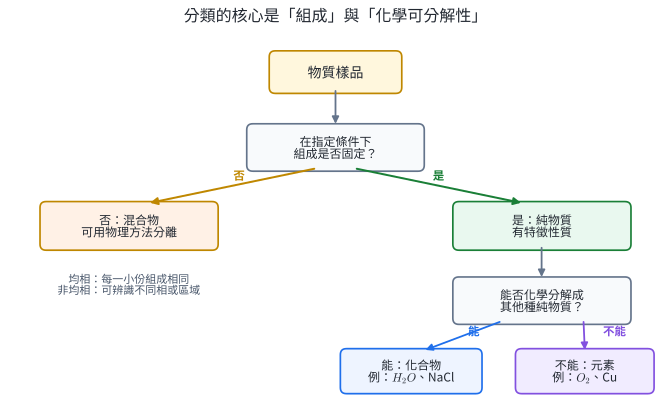
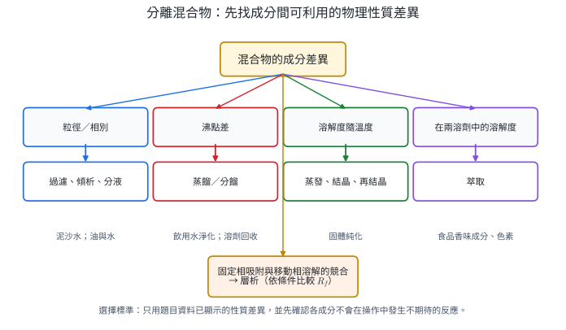
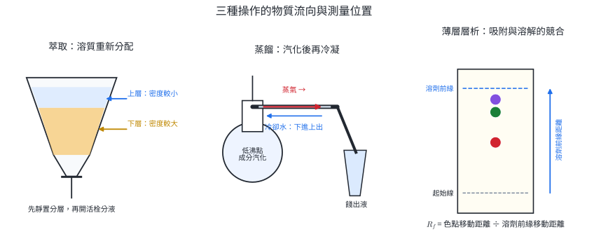
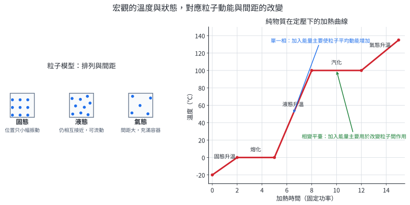
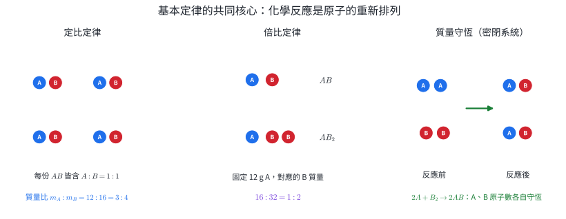
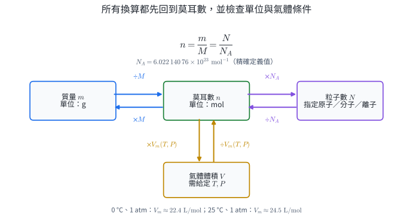
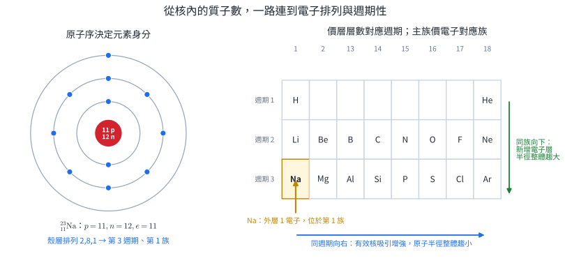
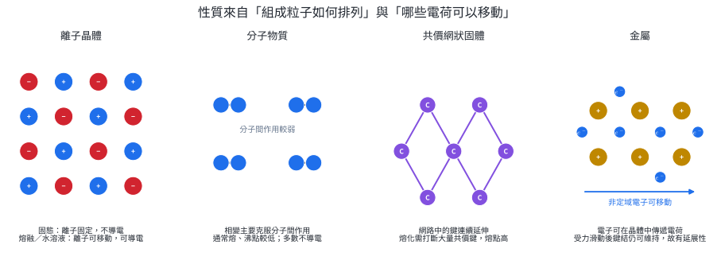

# 必化-1 物質的分類與組成

一瓶透明液體可能是純水、鹽水或兩種可互溶液體；外觀相同，組成、分離方法與用途卻不同。本章建立一條完整推理鏈：先由可觀察性質分類與分離，再用質量與粒子數定量，最後由原子排列與化學鍵說明材料性質。

這些模型直接用於飲用水處理、藥品純度檢驗、食品成分萃取、半導體材料選擇與化學製程放大。每一項用途都依賴同一件事：由觀察取得證據，再選擇能解釋證據的粒子模型。

**核心問題：**如何判定樣品含幾種物質、如何選擇分離方法、如何把質量換成粒子數，以及如何由原子與鍵結推測材料性質。

## 1. 物質的分類、分離與狀態

### 1.1 分類依據：組成固定，或由多種物質混合

**純物質**在指定溫度、壓力與純度條件下具有固定組成及一組特徵性質，例如熔點、沸點與密度。純物質再分為：

- **元素**：由同一種元素組成，無法用一般化學反應分解成更簡單的純物質。氧氣 $O_2$ 與銅 Cu 都是元素。
- **化合物**：兩種以上元素依固定比例化合，可經化學反應轉變成其他純物質。水 $H_2O$ 與氯化鈉 NaCl 都是化合物。

**混合物**含兩種以上純物質，各成分大致保留原有性質，比例可以改變，通常可利用物理性質差異分離。

| 分類 | 判準 | 例子 |
|---|---|---|
| 均相混合物 | 取任一小部分，組成與性質在觀察尺度內相同 | 食鹽水、空氣、單相黃銅 |
| 非均相混合物 | 可辨識不同相、顆粒或性質不同的區域 | 泥水、油水、花崗岩 |

**相**是物理與化學性質均一、並與其他區域有明確界面的部分；**物質種類**則由組成決定。冰與液態水共存時有兩相，但只有 $H_2O$ 一種純物質；透明鹽水只有一相，卻含水與鹽兩種物質。

{width=92%}

純度判定不能只靠外觀。藥品與電子材料會比較熔點範圍、色譜訊號或雜質濃度；飲用水則量測離子、微生物與有機物。分類提供後續檢驗與分離的起點。

### 1.2 分離方法由物性差異決定

分離混合物不改變各成分的化學身分，核心是找出可利用的物性差異。

| 可利用的差異 | 方法 | 原理與適用條件 |
|---|---|---|
| 顆粒大小或固、液相別 | 過濾、傾析 | 不溶性固體被濾材截留；較重顆粒沉降後倒出上層液體 |
| 密度且液體互不相溶 | 分液 | 靜置後形成上下層，由分液漏斗依序放出 |
| 沸點或揮發性 | 蒸餾、分餾 | 蒸氣相富含較易揮發成分，冷凝後收集；沸點接近時需增加汽化—冷凝次數 |
| 溶解度隨溫度改變 | 結晶、再結晶 | 高溫溶解，降溫時目標物先形成晶體 |
| 在兩種溶劑中的溶解度 | 萃取 | 目標物在互不相溶兩相間重新分配 |
| 對固定相吸附與在移動相溶解的差異 | 層析 | 各成分移動速率不同，因而分成不同色帶或色點 |

{width=96%}

以「食鹽、細砂與水」為例：先過濾留下不溶的砂，再蒸發或蒸餾濾液。若目標是食鹽，蒸發結晶即可；若目標包含水，必須把水蒸氣冷凝收集。**方法由目標產物決定**，同一樣品可能有不同流程。

#### 萃取：利用兩相中的分配差異

溶質 $S$ 在互不相溶的溶劑 A、B 間達平衡時，可用分配比表示：

$$
K=\frac{[S]_B}{[S]_A}.
$$

當 $K>1$，溶質偏好 B 相。使用分液漏斗時，先確認兩相密度與實際層位；未知時可加入一滴水，觀察水滴與哪一層合併。多次使用少量新鮮溶劑，通常比一次使用相同總量更能移出溶質，因為每一次都重新建立分配平衡。

#### 蒸餾：利用蒸氣組成與液體組成不同

混合液受熱後，蒸氣通常富含較易揮發、沸點較低的成分。蒸氣進入冷凝管放熱液化，成為餾出液。溫度計球部需位在蒸氣進入支管的位置，量到的才接近正在餾出的蒸氣溫度。簡單蒸餾適合移除不揮發溶質或分離沸點差較大的液體；沸點接近時使用分餾柱，讓蒸氣重複汽化與冷凝。

#### 薄層層析：比較固定條件下的相對移動距離

薄層層析（TLC）中，吸附劑是固定相，展開液是移動相。樣品對固定相吸附越強，移動越慢；在移動相中越易溶，通常移動越快。斑點的相對移動率為

$$
R_f=\frac{\text{斑點中心由起點移動的距離}}{\text{溶劑前緣由起點移動的距離}},
\qquad 0\le R_f\le1.
$$

$R_f$ 只有在固定相、展開液、溫度與操作相同時才可比較。兩個斑點的 $R_f$ 接近，只表示這組條件下的移動行為相近；再換一種展開液或配合其他分析，證據才更充分。

{width=100%}

#### 實驗安全、廢棄物與證據

| 操作 | 主要危害與 PPE | 影響結果的操作 | 廢棄物處理 |
|---|---|---|---|
| 萃取／分液 | 揮發、易燃或刺激性溶劑；穿實驗衣、戴護目鏡與合適手套，依安全資料表在通風處操作 | 倒置振盪後讓活栓朝無人方向排氣；靜置至界面清楚；開上塞前後依器材要求操作 | 水相與有機相分開、貼標；有機相收集於指定有機廢液桶 |
| 蒸餾 | 熱玻璃燙傷、易燃蒸氣；戴護目鏡、穿實驗衣，以電熱源加熱 | 裝置與大氣相通；加熱前加入沸石；冷卻水下進上出；停止前保留少量殘液 | 餾出液與殘液依成分分開標示，不明或有機液體不倒入水槽 |
| 薄層層析 | 展開液多為易燃溶劑，薄層片邊緣可能割手；遠離火源並保持通風 | 用鉛筆畫起點；點樣小而集中；液面低於起點；取出後立即標記溶劑前緣 | 展開液進指定有機廢液桶；使用過的薄層片進指定固體化學廢棄物容器 |

實驗記錄要分開**觀察**與**推論**：

| 觀察 | 可支持的推論 | 尚需補充的證據 |
|---|---|---|
| 分液漏斗中形成上下兩層 | 兩液相在此條件下互不相溶 | 水滴測試或密度資料判定哪層是水相 |
| 蒸餾時溫度在一段時間接近定值 | 主要餾出成分或共沸組成近似固定 | 與純物質沸點比較，並檢驗餾出液組成 |
| TLC 出現兩個分離色點 | 樣品至少含兩種在此條件下可分辨的成分 | 無色成分可能未顯色；重疊成分可能只形成一點 |

### 1.3 物態與粒子運動

| 物態 | 粒子間距與排列 | 運動方式 | 宏觀性質 |
|---|---|---|---|
| 固態 | 距離近，通常有較固定排列 | 在平衡位置附近振動 | 形狀、體積大致固定 |
| 液態 | 距離近，排列可改變 | 彼此滑動並持續碰撞 | 體積大致固定，形狀隨容器 |
| 氣態 | 距離遠、分散 | 快速無規則運動 | 形狀、體積皆隨容器，易壓縮 |

粒子本身不因熔化而膨脹成大球；改變的是平均動能、排列與粒子間距。定壓加熱單一純物質時，單一物態區段可用

$$
q=mc\Delta T
$$

估算升溫所需熱量；相變平台的能量主要用於改變粒子間作用與排列，可用

$$
q=mL.
$$

在理想純物質與壓力近似不變的條件下，相變期間溫度近似固定。混合物常呈現一段相變溫度範圍。

{width=96%}

**相圖**以溫度、壓力為坐標，區域代表穩定物態，邊界代表兩相平衡。三條相界交會於**三相點**；液—氣邊界的終點是**臨界點**，超過臨界溫度與壓力後形成超臨界流體，液體與氣體的界線消失。外壓降低時，液體在較低溫便能使蒸氣壓等於外壓，因此沸點降低；減壓蒸餾可降低熱敏物質的操作溫度。

水的固—液平衡線具有負斜率，因冰的密度小於液態水，增壓有利於體積較小的液態。二氧化碳在 $1\ \mathrm{atm}$ 下沒有穩定液態區，乾冰受熱直接昇華。

::: worked-example
### 示範 1｜由資料判斷分類與分離流程

某透明樣品在 $1\ \mathrm{atm}$ 下由 $78.0^\circ\mathrm C$ 開始沸騰，之後溫度逐漸升到 $100.0^\circ\mathrm C$；餾出液前段較易燃，後段不易燃。判斷樣品類型並提出分離方法。

1. **組成判斷**：沸騰溫度隨過程改變，且餾出液性質前後不同，顯示樣品含多種成分。
2. **相的判斷**：樣品透明且均一，可視為均相混合物。
3. **物性差異**：各成分揮發性不同。
4. **方法**：以分餾增加反覆汽化—冷凝，使較易揮發成分優先富集於前段。

結論須以溫度與餾出液性質為證據；透明外觀本身不能證明純物質。
:::

::: worked-example
### 示範 2｜計算 TLC 的 $R_f$ 並限定結論

同一薄層片上，溶劑前緣移動 $8.0\ \mathrm{cm}$。樣品有兩點，距起點 $2.4\ \mathrm{cm}$ 與 $6.0\ \mathrm{cm}$；標準品距起點 $6.1\ \mathrm{cm}$。

$$
R_{f,1}=\frac{2.4}{8.0}=0.30,\qquad
R_{f,2}=\frac{6.0}{8.0}=0.75,\qquad
R_{f,\mathrm{std}}=\frac{6.1}{8.0}=0.76.
$$

樣品至少有兩種在此條件下可分辨的成分；第二點與標準品的移動行為相近。合理結論是「第二點可能含標準品所代表的物質」，再改用另一展開液或另一分析方法確認。
:::

::: worked-example
### 示範 3｜由相變平台求潛熱

質量 $20\ \mathrm g$ 的純物質以每分鐘 $600\ \mathrm J$ 的固定功率加熱，曲線在第 3 至第 7 分鐘維持定溫。忽略散熱，求此相變的比潛熱。

平台歷時 $4.0\ \mathrm{min}$，吸收熱量為

$$
q=(600\ \mathrm{J\,min^{-1}})(4.0\ \mathrm{min})=2400\ \mathrm J.
$$

所以

$$
L=\frac qm=\frac{2400}{20}=120\ \mathrm{J\,g^{-1}}.
$$

平台期間仍持續吸熱，能量用於相變；「溫度不變」不等於「沒有能量進入」。
:::

### 1.4 本節練習

1. 冰水中同時有冰塊與液態水。寫出物質種類數、相數與分類。
2. 樣品含鐵粉、食鹽與細砂。設計回收三者的流程，寫出每一步利用的性質。
3. 水與密度 $1.25\ \mathrm{g\,mL^{-1}}$ 的有機溶劑形成兩層。指出上下層，並說明如何用一滴水確認。
4. TLC 的起點距溶劑前緣 $7.5\ \mathrm{cm}$，某斑點距起點 $4.5\ \mathrm{cm}$。求 $R_f$。若改用另一展開液，原值能否直接預測新位置？
5. 某固體加熱曲線的斜段需 $900\ \mathrm J$ 才由 $20^\circ\mathrm C$ 升至 $50^\circ\mathrm C$。質量為 $15\ \mathrm g$，求比熱。
6. 說明減壓蒸餾適合熱敏物質的粒子與壓力理由。

#### 本節練習解答

1. 只有 $H_2O$ 一種物質，固、液兩相；若不含其他成分，整體仍是純物質的兩相共存。
2. 先用磁鐵移出鐵粉，利用磁性差異；向其餘固體加水溶解食鹽，利用溶解度差；過濾留下細砂；蒸發濾液使食鹽結晶。若還要回收水，最後一步改用蒸餾。
3. 有機溶劑密度大於水，位在下層，水相在上層。由上方加入一滴水，水滴會與上層合併，使上層體積略增；這項觀察可確認層位。
4. $R_f=4.5/7.5=0.60$。展開液改變會同時改變溶解與吸附競爭，不能直接沿用原 $R_f$。
5. $c=q/(m\Delta T)=900/[15(50-20)]=2.0\ \mathrm{J\,g^{-1}\,K^{-1}}$。
6. 液體在蒸氣壓等於外壓時沸騰；降低外壓會降低沸點，因此可在較低溫汽化，減少熱分解或副反應。

<!-- SECTION_2 -->

## 2. 化學基本定律與莫耳

### 2.1 從質量資料建立粒子模型

#### 質量守恆定律

在邊界清楚的封閉系統內，一般化學反應前後的總質量相等：

$$
m_{\text{反應物總和}}=m_{\text{生成物總和}}.
$$

化學反應重新排列原子，原子種類與數目沒有改變，因此總質量守恆。開放容器中若有氣體逸出或由空氣進入，**容器內量到的質量**可以改變；把逸出氣體、進入的氧氣與容器內容物納入同一系統，總質量仍守恆。這條定律描述一般化學尺度；核反應需使用質能守恆。

#### 定比定律

同一純化合物的元素質量比固定。例如水中氫、氧的原子數比固定為 $2:1$，因此其質量比也固定。若樣品含過量反應物或雜質，量到的是整體混合物比例，須先找出真正形成化合物的質量。

#### 倍比定律

兩種元素形成兩種以上化合物時，固定其中一種元素的質量，另一元素在各化合物中的質量通常成簡單整數比。若每個 A 原子質量相同、每個 B 原子質量相同，AB 與 $AB_2$ 在相同 A 原子數下含 1 倍與 2 倍 B 原子，宏觀質量比便呈 $1:2$。

{width=94%}

道耳頓原子說用「物質由原子組成、化合物由不同原子以簡單整數比形成、反應是原子重新排列」統整這些定律。現代證據補充了兩個邊界：同一元素可有質量不同的同位素；原子在核反應中可轉變。這不影響一般化學反應的原子計數模型。

### 2.2 氣體體積與分子數

**氣體化合體積定律**：氣體反應物與氣體生成物在相同溫度、壓力下，其體積比常呈簡單整數比。例如

$$
2\ \text{體積 }H_2+1\ \text{體積 }O_2
\longrightarrow 2\ \text{體積 }H_2O(g).
$$

**亞佛加厥定律**：相同溫度、壓力下，相同體積的不同氣體含有相同分子數。因此上式的體積比可讀成分子數比 $2:1:2$。這也說明氧氣的基本粒子可為 $O_2$：若把氧氣想成單原子 O，便無法同時保持分子整數與原子守恆。

氣體體積比較必須指定相同溫度與壓力，因氣體體積會隨兩者改變；固體或液體的體積比不直接等於粒子數比。

### 2.3 相對原子質量、莫耳與莫耳質量

原子的實際質量極小，化學上以 $^{12}\mathrm C$ 原子質量的 $1/12$ 為基準。元素的**相對原子質量**是天然同位素質量依豐度的加權平均：

$$
A_r=\sum_i (\text{同位素相對質量})_i(\text{分率})_i.
$$

所以週期表上的原子量通常不是整數，也不代表某一顆原子的質量。

**1 莫耳**定義為恰含

$$
N_A=6.02214076\times10^{23}
$$

個指定基本粒子的物質量。基本粒子必須寫清楚，可以是原子、分子、離子、電子或化學式單位。物質量 $n$、粒子數 $N$、質量 $m$ 與莫耳質量 $M$ 的關係為

$$
\boxed{n=\frac{N}{N_A}=\frac{m}{M}}.
$$

{width=94%}

一種物質的莫耳質量，數值上等於其相對原子質量或相對分子質量，單位為 $\mathrm{g\,mol^{-1}}$。例如

$$
M(H_2O)=2(1.008)+16.00=18.02\ \mathrm{g\,mol^{-1}}.
$$

氣體還可用 $n=V/V_m$，但莫耳體積 $V_m$ 隨溫度與壓力改變。常見近似值為：

| 條件 | 理想氣體莫耳體積近似值 |
|---|---:|
| $0^\circ\mathrm C,\ 1\ \mathrm{atm}$ | $22.4\ \mathrm{L\,mol^{-1}}$ |
| $25^\circ\mathrm C,\ 1\ \mathrm{atm}$ | 約 $24.5\ \mathrm{L\,mol^{-1}}$ |

化學製程放大會把克、毫升的實驗資料換成莫耳，再依粒子比例計算原料與產物；空氣品質監測則把分子數、莫耳濃度與質量濃度互換。莫耳是宏觀秤量與微觀粒子計數之間的共同尺度。

::: worked-example
### 示範 4｜開放系統的質量帳

將 $10.0\ \mathrm g$ 發泡錠投入 $50.0\ \mathrm g$ 水溶液，反應完成後容器內剩 $58.7\ \mathrm g$，並有氣體逸出。忽略蒸發與濺出，求逸出氣體質量。

先把反應前後放在同一系統：

$$
m_{\text{初始}}=10.0+50.0=60.0\ \mathrm g.
$$

由質量守恆，

$$
m_{\text{氣體}}=60.0-58.7=1.3\ \mathrm g.
$$

容器內的質量減少，原因是系統邊界未包含逸出氣體；把氣體納入後總質量仍為 $60.0\ \mathrm g$。
:::

::: worked-example
### 示範 5｜由倍比資料推斷粒子比例

化合物甲含 $6.0\ \mathrm g$ 的 A 與 $8.0\ \mathrm g$ 的 B；化合物乙含 $9.0\ \mathrm g$ 的 A 與 $24.0\ \mathrm g$ 的 B。若甲的最簡式為 AB，推斷乙的最簡式。

先固定 A 的質量。把乙的 A 由 $9.0\ \mathrm g$ 縮到 $6.0\ \mathrm g$，B 也乘 $6/9$：

$$
24.0\times\frac69=16.0\ \mathrm g.
$$

相同 $6.0\ \mathrm g$ A 所結合的 B 質量，甲：乙為

$$
8.0:16.0=1:2.
$$

甲為 AB，乙在相同 A 原子數下含兩倍 B 原子，因此乙的最簡式為 $AB_2$。
:::

::: worked-example
### 示範 6｜質量、分子數與原子數

$8.80\ \mathrm g$ 二氧化碳含多少莫耳 $CO_2$ 分子、多少個 $CO_2$ 分子與多少個氧原子？取 $M(CO_2)=44.0\ \mathrm{g\,mol^{-1}}$。

$$
n(CO_2)=\frac{8.80}{44.0}=0.200\ \mathrm{mol}.
$$

$$
N(CO_2)=0.200N_A=1.204\times10^{23}\ \text{個分子}.
$$

每個 $CO_2$ 分子含 2 個氧原子：

$$
N(O)=2N(CO_2)=2.409\times10^{23}\ \text{個氧原子}.
$$

最後一步乘 2 的依據是化學式中的下標，不是再乘一次莫耳質量。
:::

::: worked-example
### 示範 7｜由平均原子量求同位素豐度

某元素只有質量 $62.93$ 與 $64.93$ 的兩種同位素，平均原子量為 $63.55$。設較輕同位素分率為 $x$：

$$
62.93x+64.93(1-x)=63.55.
$$

整理得

$$
2.00x=1.38,\qquad x=0.690.
$$

較輕同位素約占 $69.0\%$，較重同位素約占 $31.0\%$。平均值較接近 $62.93$，與較輕同位素占比較高一致。
:::

### 2.4 本節練習

1. 密閉容器中 $4.0\ \mathrm g$ 氫氣與 $32.0\ \mathrm g$ 氧氣完全反應。反應後總質量是多少？若只生成水，水的質量是多少？
2. 化合物 X 含 $3.0\ \mathrm g$ A 與 $4.0\ \mathrm g$ B；化合物 Y 含 $6.0\ \mathrm g$ A 與 $16.0\ \mathrm g$ B。固定 A 質量後，B 的質量比為何？
3. 在相同溫度、壓力下，$3.0\ \mathrm L$ 氮氣與 $3.0\ \mathrm L$ 氫氣所含分子數有何關係？原子總數有何關係？氣體皆視為雙原子分子。
4. $0.250\ \mathrm{mol}$ 水含多少個水分子、氫原子與氧原子？
5. $11.2\ \mathrm L$ 氮氣在 $0^\circ\mathrm C,\ 1\ \mathrm{atm}$ 下有多少莫耳、多少克？取 $M(N_2)=28.0\ \mathrm{g\,mol^{-1}}$。
6. 某元素有質量數 10、11 的兩種同位素，天然平均原子量為 $10.8$。以質量數近似同位素相對質量，求兩者豐度。

#### 本節練習解答

1. 封閉系統總質量為 $4.0+32.0=36.0\ \mathrm g$。題目說完全反應且只生成水，所以水為 $36.0\ \mathrm g$。
2. 把 Y 的 A 固定成 $3.0\ \mathrm g$，B 為 $16.0\times(3.0/6.0)=8.0\ \mathrm g$；X：Y 的 B 質量比為 $4.0:8.0=1:2$。
3. 相同溫壓等體積含相同分子數，所以兩者分子數相等。每個 $N_2$、$H_2$ 都含 2 個原子，原子總數也相等。
4. 水分子數 $=0.250N_A=1.506\times10^{23}$；氫原子數 $=2(0.250N_A)=3.011\times10^{23}$；氧原子數 $=0.250N_A=1.506\times10^{23}$。
5. $n=11.2/22.4=0.500\ \mathrm{mol}$；$m=nM=0.500(28.0)=14.0\ \mathrm g$。
6. 設質量數 10 的同位素分率為 $x$：$10x+11(1-x)=10.8$，得 $x=0.20$。質量數 10 占 $20\%$，質量數 11 占 $80\%$。

<!-- SECTION_3 -->

## 3. 原子結構與元素週期表

### 3.1 實驗證據如何改變原子模型

科學模型用來解釋當時可重現的證據，取得新證據後便調整：

| 證據 | 直接觀察 | 支持的結構結論 |
|---|---|---|
| 陰極射線受電場、磁場偏轉 | 射線帶負電，且不同電極材料所得粒子相同 | 所有原子含帶負電的電子 |
| 金箔散射中大多數粒子直行，極少數大角度偏轉 | 原子大部分區域不造成強烈偏轉，正電與大部分質量集中在很小區域 | 原子大部分是空間，中心有小而密的原子核 |
| 不同元素的核電荷與特徵 X 光有規律 | 元素種類與核內正電量一一對應 | 原子序由質子數決定 |
| 同一元素可有不同質量 | 化學性質近似，質量卻不同 | 核內還有不帶電的中子；同一元素可有同位素 |

「原子大部分是空間」描述電子雲與原子核尺度的差異；它不表示宏觀物體可以互相穿過，因電子間的電磁作用與量子規則仍造成強烈排斥與結構穩定。

### 3.2 質子、中子、電子與核種符號

| 粒子 | 符號 | 相對電荷 | 約略相對質量 | 位置 |
|---|---|---:|---:|---|
| 質子 | $p$ | $+1$ | $1$ | 原子核 |
| 中子 | $n$ | $0$ | $1$ | 原子核 |
| 電子 | $e^-$ | $-1$ | 約 $1/1836$ | 核外電子雲 |

核種與離子寫作

$$
{}^{A}_{Z}X^{q},
$$

其中 $Z$ 是**原子序**，等於質子數；$A$ 是**質量數**，等於質子數加中子數；$q$ 是離子電荷。因而

$$
p=Z,\qquad n=A-Z,\qquad q=p-e,
$$

若 $q$ 以基本電荷為單位，電子數可寫成 $e=Z-q$。例如 ${}^{23}_{11}\mathrm{Na}^{+}$ 有 11 個質子、12 個中子與 10 個電子。

**同位素**是質子數相同、中子數不同的原子；它們是同一元素，化學性質通常相近，質量與核穩定性可以不同。**離子**則由原子得失電子形成：失去電子成陽離子，得到電子成陰離子。一般化學反應改變核外電子配置，不改變原子核內的質子數。

放射性同位素的衰變速率可用於定年，穩定同位素比例可追蹤水源與食物來源；醫學示蹤則利用可偵測的同位素追蹤物質在體內的路徑。選用時必須同時考慮半衰期、輻射種類、化學型態與劑量。

### 3.3 電子層與週期位置

在本章使用的第一至第三週期簡化模型中，電子先分布為 $2,8,8$。最外層電子稱為**價電子**，參與大多數化學鍵與離子形成。對前 18 號主族元素：

- 已占用的電子層數對應週期。
- 同族元素具有相似的價電子數，因此常呈相似化學性質。
- 原子得失較少數量電子而達到較穩定的最外層配置，可預測常見離子電荷。

{width=96%}

**週期表**依原子序遞增排列。金屬多在左側與中央，通常導電、具延展性且較易失去電子；非金屬多在右側，性質多樣且常以共價鍵形成分子，或得到電子成陰離子；類金屬位在兩者交界附近，導電性可受溫度、摻雜與結構控制。

在同一週期由左向右，電子加入同一主要電子層，而核電荷增加，原子半徑整體傾向減小，吸引價電子的能力整體增強。同一族由上而下增加電子層，原子半徑整體增大。這些是解讀資料的**整體趨勢**；精確游離能、電子親和力與過渡元素行為會出現局部例外，需用更完整的軌域模型處理。

矽與鍺等半導體位於金屬、非金屬交界。製程中加入少量特定元素，會改變可移動載子的數量，進而控制導電性。週期位置因此不只是分類表，也提供材料設計的第一層預測。

::: worked-example
### 示範 8｜由核種符號完成粒子帳

求 ${}^{37}_{17}\mathrm{Cl}^{-}$ 的質子、中子與電子數，並判斷與 ${}^{35}_{17}\mathrm{Cl}$ 的關係。

$$
p=Z=17,
$$

$$
n=A-Z=37-17=20,
$$

氯離子帶 $-1$ 電荷，電子比質子多 1 個：

$$
e=17-(-1)=18.
$$

兩個核種的 $Z$ 都是 17，屬同一元素；質量數不同，因此互為同位素。離子電荷與同位素身分是兩個獨立欄位。
:::

::: worked-example
### 示範 9｜由電子層推斷位置與常見離子

某中性原子的電子層分布為 $2,8,2$。判斷其原子序、週期、主族位置與常見離子電荷。

1. 電子總數 $=2+8+2=12$；中性原子的質子數相同，所以 $Z=12$。
2. 有三個占用電子層，位於第三週期。
3. 有 2 個價電子，位於第 2 族主族元素位置。
4. 失去最外層 2 個電子後成 $2,8$，所以常形成 $2+$ 陽離子。

這個元素是鎂 Mg，常見離子為 $\mathrm{Mg}^{2+}$。週期表位置提供的是常見反應傾向，實際化合物仍需以實驗與完整電子結構確認。
:::

### 3.4 本節練習

1. 寫出 ${}^{27}_{13}\mathrm{Al}^{3+}$ 的質子、中子與電子數。
2. A 粒子有 8 個質子、8 個中子、10 個電子；B 粒子有 8 個質子、10 個中子、8 個電子。寫出兩者核種／離子符號及彼此關係。
3. 某中性原子電子層分布為 $2,7$。判斷原子序、週期、價電子數與常見單原子離子電荷。
4. 比較第三週期的 Na 與 Cl：何者原子半徑通常較大？何者吸引價電子的能力通常較強？用有效核吸引的趨勢解釋。
5. 同族的 Li 與 K，何者占用電子層較多、原子半徑通常較大？
6. 某醫學示蹤實驗需要可偵測訊號、能參與目標分子的化學路徑，且不希望病人長期受輻射。列出選擇同位素時至少三項條件。

#### 本節練習解答

1. $p=13$；$n=27-13=14$；$e=13-3=10$。
2. A 是 ${}^{16}_{8}\mathrm O^{2-}$；B 是 ${}^{18}_{8}\mathrm O$。兩者質子數相同而中子數不同，互為同位素；A 另比中性氧多 2 個電子。
3. 電子總數與原子序皆為 9；有兩層，位於第二週期；有 7 個價電子，常得到 1 個電子形成 $1-$ 離子。
4. Na 通常較大，Cl 吸引價電子的能力較強。兩者價電子位於同一主要電子層，但由左向右核電荷增加，電子受核的整體吸引增強，半徑整體減小。
5. K 位於 Li 下方，有較多占用電子層，原子半徑通常較大。
6. 可列：半衰期足以完成量測但不造成長期暴露；輻射種類與能量可被儀器偵測且劑量可控；同位素能置入目標化學物種而不明顯改變其路徑；產物與代謝方式可評估；來源與廢棄物可安全管理。

<!-- SECTION_4 -->

## 4. 化學鍵、構造與物質性質

### 4.1 化學鍵與價電子

原子接近時同時出現核—電子吸引，以及核—核、電子—電子排斥。在某一距離附近，系統能量低於彼此遠離的狀態，便形成穩定的**化學鍵**。斷鍵需要吸收能量，成鍵會釋放能量；反應總能量變化取決於所有斷鍵與成鍵的能量差。

主族元素常以最外層接近惰性氣體配置來整理成鍵，稱為八隅體規則。氫的穩定第一層通常是 2 個電子；硼的缺電子化合物、奇數電子物種及第三週期以後的部分結構不完全符合八隅體。八隅體適合預測許多常見主族化合物，不是所有物質的完整成鍵理論。

### 4.2 四類常見結構

#### 離子固體

金屬原子失去電子、非金屬原子得到電子後，正負離子以靜電作用排列成延伸晶格。離子化合物的化學式表示最簡整數比與電中性，例如

$$
2\mathrm{Al}^{3+}+3\mathrm O^{2-}\longrightarrow \mathrm{Al_2O_3},
$$

因總正電 $+6$ 與總負電 $-6$ 相消。固態離子晶體中的離子被固定在晶格位置，通常不導電；熔融或溶於水後，離子可移動，便可導電。晶格層錯移時，同號離子相鄰而強烈排斥，所以晶體常硬而脆。

#### 分子共價物質

非金屬原子以共享電子對形成共價鍵，構成有限大小的分子。路易斯結構以線表示共用電子對、點表示孤電子對。常用程序為：

1. 加總價電子；離子每個負電荷加 1 電子，每個正電荷減 1 電子。
2. 選中央原子並以單鍵連接周圍原子；氫通常只形成一鍵。
3. 先完成外圍原子的穩定層，再放置剩餘電子於中央原子。
4. 中央原子若缺電子，可把鄰原子的孤電子對改成雙鍵或三鍵。
5. 檢查電子總數、原子數與總電荷。

分子內共價鍵可以很強，但熔化或沸騰常主要克服**分子間作用力**。所以許多小分子物質熔、沸點低；不能因沸點低便推論分子內共價鍵弱。

#### 網狀共價固體

原子以共價鍵延伸成二維或三維網狀結構，沒有獨立小分子。鑽石中每個碳與四個碳形成三維網狀，硬度高且缺乏可自由移動電子；石墨中每個碳形成平面網層，層間較易滑動，層內有可離域電子，因此可導電。二氧化矽與矽也具有延伸網狀結構，通常熔點高。

#### 金屬固體

金屬原子形成規則排列，價電子在整個固體中離域。可移動電子使金屬導電、導熱；金屬鍵沒有固定指向，原子層滑動後仍能維持吸引，所以金屬通常有延展性。合金藉由加入不同大小或電子性質的原子，改變層滑動、強度、耐蝕與導電表現。

{width=98%}

| 結構類型 | 基本粒子與結構 | 熔點的一般趨勢 | 導電條件 | 力學特性 |
|---|---|---|---|---|
| 離子固體 | 正負離子延伸晶格 | 通常較高 | 固態通常不導；熔融或水溶液可導 | 硬、脆 |
| 分子共價 | 獨立分子 | 視分子間作用而定，許多較低 | 多數不導電 | 常為氣、液或較軟固體 |
| 網狀共價 | 原子以共價鍵延伸 | 通常很高 | 多數不導；石墨、半導體等依結構而異 | 通常硬，層狀結構可較易滑動 |
| 金屬 | 金屬原子核心與離域電子 | 範圍廣 | 固、液態通常可導 | 有延展性，可加工 |

材料選擇要把結構連到工作條件。電線需要導電與延展性，常用金屬；耐熱切削材料需要高硬度與高熔點，可考慮網狀共價或陶瓷；電解質須在使用狀態下有可移動離子；半導體則利用能帶與摻雜控制導電性。

::: worked-example
### 示範 10｜由離子電荷寫化學式

鎂離子為 $\mathrm{Mg}^{2+}$，氮離子為 $\mathrm N^{3-}$。寫出化學式並檢查電中性。

要找 $+2$ 與 $-3$ 的最小公倍數 6：3 個鎂離子提供 $+6$，2 個氮離子提供 $-6$。

$$
3(+2)+2(-3)=0.
$$

所以化學式為

$$
\boxed{\mathrm{Mg_3N_2}}.
$$

下標是最簡整數比；寫成 $\mathrm{Mg_6N_4}$ 雖電中性，卻未約成最簡式。
:::

::: worked-example
### 示範 11｜畫出 $CO_2$ 的路易斯結構

碳有 4 個價電子，兩個氧各有 6 個，總數為

$$
4+2(6)=16\ \text{個價電子}.
$$

先連成 O—C—O 需 4 個電子；先把剩餘電子補在外圍氧上後，中央碳只有 4 個共用電子，未達八隅體。各氧提供一對孤電子形成雙鍵：

$$
\boxed{\mathrm{O=C=O}}.
$$

每個氧仍保留兩對孤電子。計數：兩個雙鍵含 8 電子，四對氧上的孤電子含 8 電子，總共 16，且三個原子均達八隅體。
:::

::: worked-example
### 示範 12｜由性質資料反推結構

三個固體的資料如下：

| 樣品 | 固態導電 | 熔融導電 | 力學表現 | 熔點 |
|---|---|---|---|---|
| P | 否 | 是 | 脆 | 高 |
| Q | 是 | 是 | 可延展 | 中高 |
| R | 否 | 未熔即維持硬固體 | 極硬 | 很高 |

P 的載流粒子在固態固定、熔融後可移動，且材料脆，最符合離子晶體。Q 在固、液態皆有可移動電子且可延展，最符合金屬。R 極硬、熔點很高且不導電，最符合三維網狀共價固體。

結論來自多項證據的組合；單看「熔點高」無法唯一判斷，因離子與網狀共價固體都可能有高熔點。
:::

### 4.3 本節練習

1. 由 $\mathrm{Ca}^{2+}$ 與 $\mathrm F^-$ 寫出電中性的最簡化學式。
2. 由 $\mathrm{Al}^{3+}$ 與 $\mathrm S^{2-}$ 寫出電中性的最簡化學式，並列出正、負總電荷。
3. 計算 $NH_3$ 的總價電子數，畫出路易斯結構並寫出氮上的孤電子對數。
4. 解釋固態 NaCl 不導電，而熔融 NaCl 可導電。
5. 鑽石與石墨都只含碳，為何硬度與導電性不同？
6. 某材料需製成可彎曲導線；另一材料需作為高溫絕緣切削部件。分別建議結構類型並以微觀結構說明。

#### 本節練習解答

1. 一個 $\mathrm{Ca}^{2+}$ 需兩個 $\mathrm F^-$ 平衡，化學式為 $\mathrm{CaF_2}$。
2. 最小總電量為 6：$2(+3)=+6$，$3(-2)=-6$，化學式為 $\mathrm{Al_2S_3}$。
3. 總價電子數 $=5+3(1)=8$。氮與三個氫各形成一個單鍵，使用 6 電子；餘下 2 電子成為氮上的一對孤電子。結構可寫為三個 H—N 鍵加一對 N 上孤電子。
4. 固態中 $\mathrm{Na}^+$、$\mathrm{Cl}^-$ 固定於晶格位置，缺乏能長距離移動的帶電粒子；熔融後離子可在外加電場中移動而導電。
5. 鑽石中每個碳形成三維延伸網狀，強鍵沿各方向連接，且缺乏可移動電子；石墨是平面網層，層間較易滑動，層內有可離域電子。元素相同，原子連接方式不同，性質便不同。
6. 可彎曲導線選金屬結構：離域電子提供導電，非定向金屬鍵容許原子層滑動。高溫絕緣切削部件可選不導電的網狀共價或適當陶瓷：延伸強鍵提供高硬度與高熱穩定性；仍須依熱膨脹、韌性與化學穩定性做實測。

<!-- SECTION_5 -->

## 5. 分層題與跨節整合題

### 基礎題

### 題目 1｜純物質、混合物與相

將下列各系統分成「純物質或混合物」及「一相或多相」，並寫出判準：

1. 密閉容器中的冰與液態純水；
2. 完全溶解、無沉澱的食鹽水；
3. 未搖勻的油與水；
4. 單一晶體中的純氯化鈉。

### 題目 2｜分離流程

一份樣品含鐵粉、苯甲酸晶體與細砂。已知鐵有磁性；苯甲酸在熱水中溶解度大、冷水中溶解度小；砂不溶於水。設計回收三種固體的流程，逐步寫出使用的物性差異。

### 題目 3｜加熱曲線

$25.0\ \mathrm g$ 固體以 $500\ \mathrm{J\,min^{-1}}$ 加熱。其溫度由第 0 至第 2 分鐘升高，第 2 至第 8 分鐘維持熔點，第 8 分鐘後再升高。忽略散熱。

1. 熔化吸收多少熱量？
2. 求熔化潛熱；
3. 用粒子模型說明平台期間能量的去向。

### 題目 4｜化學基本定律

某氧化物樣品含 $12.0\ \mathrm g$ 元素 M 與 $8.0\ \mathrm g$ 氧；另一氧化物含 $9.0\ \mathrm g$ M 與 $12.0\ \mathrm g$ 氧。固定 M 質量後，兩者所含氧質量成何整數比？此結果支持哪一項基本定律？

### 題目 5｜核種與離子

某粒子寫作 ${}^{56}_{26}\mathrm{Fe}^{3+}$。

1. 求質子、中子、電子數；
2. 若另一粒子有 26 個質子與 30 個中子，兩者是何關係？

### 應用題

### 題目 6｜TLC 資料判讀

同一薄層片上，溶劑前緣由起點移動 $9.0\ \mathrm{cm}$。未知樣品出現距起點 $1.8、4.5、7.2\ \mathrm{cm}$ 的三點；標準品 S 出現在 $4.6\ \mathrm{cm}$。

1. 求四個 $R_f$；
2. 未知樣品至少含幾種在此條件下可分辨的成分？
3. 能否只憑此結果斷定樣品含 S？寫出證據強度與下一步。

### 題目 7｜分配平衡

$6.0\ \mathrm g$ 溶質溶於 $100\ \mathrm{mL}$ 水，以 $50\ \mathrm{mL}$ 互不相溶的有機溶劑萃取。平衡時分配比

$$
K=\frac{[S]_{\text{有機}}}{[S]_{\text{水}}}=4.0.
$$

忽略體積變化，求進入有機相的溶質質量，並指出分液前需確認的兩項操作資訊。

### 題目 8｜氣體體積與分子模型

在相同溫度、壓力下，$2.0\ \mathrm L$ 氣體 X 與 $1.0\ \mathrm L$ 氣體 Y 完全反應，生成 $2.0\ \mathrm L$ 氣體 Z。若 X、Y 皆為雙原子元素分子，寫出最簡分子數比，並提出一個符合原子守恆的 Z 分子式表示。

### 題目 9｜莫耳與指定粒子

$5.85\ \mathrm g$ 氯化鈉的莫耳質量為 $58.5\ \mathrm{g\,mol^{-1}}$。

1. 求 $\mathrm{NaCl}$ 化學式單位的莫耳數與個數；
2. 求其中 $\mathrm{Na}^+$、$\mathrm{Cl}^-$ 的個數；
3. 說明此處使用「化學式單位」而非「分子」的結構理由。

### 題目 10｜同位素加權平均

某元素 E 有 $^{24}E、^{25}E、^{26}E$ 三種同位素，豐度依序為 $79.0\%、10.0\%、11.0\%$。以質量數近似同位素相對質量，求平均原子量，並判斷一顆天然 E 原子的質量是否通常等於此平均值。

### 題目 11｜週期位置與離子

元素 A 的中性原子電子層分布為 $2,8,1$；元素 B 為 $2,8,7$。

1. 寫出兩者週期、價電子數與常見離子電荷；
2. 寫出兩者形成離子化合物的最簡式；
3. 預測該固體在固態與熔融態的導電性。

### 題目 12｜材料性質判斷

材料甲具有高熔點、極硬、不導電；材料乙可壓成薄片，固態能導電；材料丙熔點低，純液態不導電。分別判斷最可能的結構類型，並為每一項判斷提供一條微觀理由。

### 跨節整合題

### 題目 13｜海水淡化與成分證據

某海水樣品為透明均一液體。將 $100.0\ \mathrm g$ 樣品簡單蒸餾，收得 $96.2\ \mathrm g$ 餾出水與 $3.5\ \mathrm g$ 乾燥鹽類，另有 $0.3\ \mathrm g$ 因轉移留在器材中。

1. 分類原海水並說明理由；
2. 寫出蒸餾利用的性質差異與冷凝水流向；
3. 完成質量守恆檢查；
4. 若乾燥固體主要為離子晶體，預測其固態與水溶液導電性。

### 題目 14｜受熱分解的系統邊界與莫耳

加熱 $10.0\ \mathrm g$ 碳酸鈣，生成 $5.6\ \mathrm g$ 氧化鈣與二氧化碳：

$$
\mathrm{CaCO_3(s)\longrightarrow CaO(s)+CO_2(g)}.
$$

1. 求逸出 $CO_2$ 的質量；
2. 取 $M(CO_2)=44.0\ \mathrm{g\,mol^{-1}}$，求其莫耳數與分子數；
3. 若反應在敞口坩堝中進行，解釋為何坩堝內質量減少仍符合質量守恆；
4. 寫出每個 $CO_2$ 分子中的原子種類與數目，並說明反應前後原子如何守恆。

### 題目 15｜未知白色固體的鑑別

白色固體 U 易溶於水，固態不導電，水溶液導電，熔點高；白色固體 V 易溶於水，固態與水溶液皆不導電，受熱較易熔化。另有兩份標籤脫落的樣品混在同一容器中。

1. 判斷 U、V 最可能的結構類型；
2. 提出先分離兩成分再鑑別的可行性：若兩者都溶於水，單靠過濾能否分開？還需要哪一類物性資料？
3. 寫出以導電性檢驗時的自變因、觀察與推論，並說明安全的基本操作。

### 題目 16｜礦物原料到材料

一份礦物粉末含石英（主要成分 $SiO_2$）、氯化鈉與鐵粉。石英不溶於水且不具磁性；氯化鈉溶於水；鐵具磁性。

1. 設計分離三者的流程；
2. $11.7\ \mathrm g$ 回收氯化鈉相當於多少莫耳與多少個化學式單位？取 $M(NaCl)=58.5\ \mathrm{g\,mol^{-1}}$；
3. 比較 $SiO_2$ 與 NaCl 的粒子排列、熔點來源及熔融導電性；
4. 若鐵將作為導線、石英將作為耐熱絕緣材料，分別以鍵結說明選材理由。

<!-- SECTION_6 -->

::: page-break
:::

## 6. 分層題與跨節整合題詳解

::: solution
### 第 1 題

1. 冰與液態水的組成都只有 $H_2O$，是純物質；固、液區域間有界面，為兩相。
2. 食鹽水的鹽、水比例可改變，是混合物；完全溶解且各處均一，為一相。
3. 油、水比例可改變，是混合物；兩液層有界面，為兩相。
4. 純氯化鈉有固定 $\mathrm{Na^+:Cl^-}=1:1$ 組成，是純化合物；單一均一晶體為一相。

相數由均一區域與界面判斷，物質分類由組成是否固定判斷，兩個判準彼此獨立。
:::

::: solution
### 第 2 題

1. 以磁鐵移出鐵粉，利用磁性差異。
2. 向其餘固體加入適量熱水，使苯甲酸溶解，砂仍不溶。
3. 趁熱過濾，濾紙上回收砂，濾液含苯甲酸。
4. 冷卻濾液，使苯甲酸因溶解度下降而結晶，再過濾、少量冷水洗滌並乾燥。

流程順序有意義：若先把全部樣品加入水，鐵粉仍可磁選，但濕粉較難操作；趁熱過濾可減少苯甲酸提前析出而混入砂中。
:::

::: solution
### 第 3 題

熔化平台歷時

$$
8-2=6.0\ \mathrm{min}.
$$

固定功率輸入的熱量為

$$
q=(500\ \mathrm{J\,min^{-1}})(6.0\ \mathrm{min})
=3000\ \mathrm J.
$$

比熔化潛熱為

$$
L=\frac qm=\frac{3000}{25.0}
=\boxed{120\ \mathrm{J\,g^{-1}}}.
$$

平台期間固、液兩相共存，輸入能量主要改變粒子間排列與作用，使更多固體轉成液體；平均動能近似不變，因此溫度近似不變。
:::

::: solution
### 第 4 題

第一種氧化物以 $12.0\ \mathrm g$ M 配 $8.0\ \mathrm g$ O。把第二種的 M 由 $9.0\ \mathrm g$ 放大至 $12.0\ \mathrm g$，氧的對應質量為

$$
12.0\times\frac{12.0}{9.0}=16.0\ \mathrm g.
$$

固定 $12.0\ \mathrm g$ M 後，兩種化合物中的氧為

$$
8.0:16.0=\boxed{1:2}.
$$

此簡單整數比支持倍比定律。比較前先固定同一元素的質量，是使用定律的必要步驟。
:::

::: solution
### 第 5 題

對 ${}^{56}_{26}\mathrm{Fe}^{3+}$：

$$
p=Z=26,
\qquad n=A-Z=56-26=30,
\qquad e=Z-3=23.
$$

另一粒子也有 26 個質子與 30 個中子，所以核種同為 $^{56}\mathrm{Fe}$。若題目未給另一粒子的電子數，兩者可能有不同電荷狀態；能確定的是它們屬同一核種。
:::

::: solution
### 第 6 題

未知樣品三點的 $R_f$ 依序為

$$
\frac{1.8}{9.0}=0.20,
\qquad
\frac{4.5}{9.0}=0.50,
\qquad
\frac{7.2}{9.0}=0.80.
$$

標準品為

$$
R_{f,S}=\frac{4.6}{9.0}=0.51.
$$

未知樣品至少有 3 種在此條件下可分辨的成分。中間斑點與 S 的 $R_f$ 接近，支持「可能含 S」，尚未構成唯一鑑定；可把未知物與 S 混合共點，再以另一種展開液重跑，或配合光譜、質譜等獨立證據。
:::

::: solution
### 第 7 題

設進入有機相的溶質質量為 $x\ \mathrm g$，水相剩 $6.0-x\ \mathrm g$。以質量除以體積表示濃度：

$$
\frac{x/50}{(6.0-x)/100}=4.0.
$$

因此

$$
\frac{2x}{6.0-x}=4.0,
\qquad 2x=24.0-4x,
\qquad x=\boxed{4.0\ \mathrm g}.
$$

水相剩 $2.0\ \mathrm g$，代回可得有機相濃度 $0.080\ \mathrm{g\,mL^{-1}}$、水相 $0.020\ \mathrm{g\,mL^{-1}}$，比值確為 4.0。

分液前至少確認：（一）兩溶劑的密度或以水滴測試確認層位；（二）溶劑危害、揮發造成的壓力與相應排氣、PPE、廢液分類。這些資訊同時影響正確收集與安全。
:::

::: solution
### 第 8 題

相同溫壓下，體積比等於分子數比：

$$
X_2:Y_2:Z=2:1:2.
$$

用 2 個 $X_2$ 與 1 個 $Y_2$ 計數，共有 4 個 X 原子與 2 個 Y 原子。若形成 2 個相同 Z 分子，每個應含 2 個 X 與 1 個 Y：

$$
2X_2+Y_2\longrightarrow2X_2Y.
$$

所以一個符合條件的分子式表示是 $\boxed{X_2Y}$。兩邊 X、Y 原子數分別為 4、2，均守恆。
:::

::: solution
### 第 9 題

$$
n(NaCl)=\frac{5.85}{58.5}=0.100\ \mathrm{mol}.
$$

化學式單位數為

$$
N=0.100N_A=\boxed{6.022\times10^{22}\ \text{個}}.
$$

每個化學式單位對應 1 個 $\mathrm{Na}^+$ 與 1 個 $\mathrm{Cl}^-$，所以兩種離子各有 $6.022\times10^{22}$ 個。

氯化鈉固體是正負離子延伸形成的晶格，沒有彼此獨立的 NaCl 小分子；NaCl 表示最簡離子比，因此使用「化學式單位」。
:::

::: solution
### 第 10 題

把百分率先換成分率後加權：

$$
A_r(E)=24(0.790)+25(0.100)+26(0.110)
=18.96+2.50+2.86
=\boxed{24.32}.
$$

一顆原子屬於某一同位素，質量接近 24、25 或 26；$24.32$ 是大量天然原子的統計平均，不是大多數單顆原子的實際質量。
:::

::: solution
### 第 11 題

A 有三個電子層、1 個價電子，位於第三週期，常失去 1 個電子形成 $A^+$。B 也在第三週期，有 7 個價電子，常得到 1 個電子形成 $B^-$。

正、負電荷以 $1:1$ 相消，最簡式為 $\boxed{AB}$；若辨認元素，A 為 Na、B 為 Cl，化學式為 NaCl。

固態時離子固定於晶格位置，通常不導電；熔融後 $A^+$、$B^-$ 可移動，能傳遞電荷而導電。
:::

::: solution
### 第 12 題

- 甲最可能為三維網狀共價固體：延伸強共價鍵造成高熔點與高硬度，缺乏可移動帶電粒子而不導電。離子晶體也可能高熔點且固態不導電；再測熔融導電性與脆裂行為可區分。
- 乙最可能為金屬：離域電子使固態導電，非定向金屬鍵使原子層滑動後仍維持結合，因而可壓成薄片。
- 丙最可能為分子共價物質：熔化主要克服較弱的分子間作用，故熔點低；中性分子缺乏可移動電荷，純液態不導電。

每一判斷都同時使用至少兩項性質，避免由單一熔點作唯一分類。
:::

::: solution
### 第 13 題

1. 海水中水與溶解鹽類比例可變，屬均相混合物；透明只表示在觀察尺度內均一。
2. 蒸餾利用水與不揮發鹽類的揮發性差異。冷凝水由冷凝管下端進、上端出，使夾套充滿並與蒸氣逆向換熱。
3. 所有回收與殘留質量相加：

$$
96.2+3.5+0.3=100.0\ \mathrm g,
$$

與初始質量一致。

4. 乾燥固體中的離子固定於晶格，固態通常不導電；溶於水後離子可移動，溶液可導電。實際海鹽含多種離子，導電強弱還受濃度與離子移動率影響。
:::

::: solution
### 第 14 題

由質量守恆，

$$
m(CO_2)=10.0-5.6=\boxed{4.4\ \mathrm g}.
$$

物質量與分子數為

$$
n(CO_2)=\frac{4.4}{44.0}=0.100\ \mathrm{mol},
$$

$$
N(CO_2)=0.100N_A=\boxed{6.022\times10^{22}\ \text{個分子}}.
$$

敞口坩堝內的 $CO_2$ 逸出，所以坩堝內容物只剩 $5.6\ \mathrm g$；把逸出的 $4.4\ \mathrm g$ 氣體納入系統，總質量仍為 $10.0\ \mathrm g$。

每個 $CO_2$ 分子含 1 個 C 與 2 個 O。反應式每一組 $CaCO_3$ 含 1 Ca、1 C、3 O；產物 $CaO+CO_2$ 合計仍為 1 Ca、1 C、3 O，原子種類與數目守恆。
:::

::: solution
### 第 15 題

1. U 最可能是離子化合物：高熔點、固態離子固定而不導電，溶於水後離子可移動而導電。V 最可能是分子共價物質：較易熔，溶液仍缺乏可移動離子而不導電。
2. 兩者都溶於水後都通過濾紙，單靠過濾無法分開。需要兩者溶解度隨溫度或溶劑種類的差異，以分級結晶、選擇性溶解或層析分離；必須先取得溶解度資料再設計流程。
3. 可配製相同質量濃度、相同溫度的 U、V 溶液，把物質種類作為自變因，使用同一導電度探針記錄導電度。觀察是讀值差異；推論是 U 溶液含較多可移動離子。操作時戴護目鏡、避免皮膚接觸，以低電壓合格探針量測，未知固體不得品嚐，溶液依性質分類回收。
:::

::: solution
### 第 16 題

1. 先以磁鐵移出鐵粉。向剩餘粉末加水，使 NaCl 溶解、$SiO_2$ 留為固體；過濾並洗滌、乾燥濾渣，回收 $SiO_2$；蒸發或濃縮冷卻濾液，回收 NaCl 晶體。三步分別利用磁性、溶解度與揮發性／結晶差異。
2.

$$
n(NaCl)=\frac{11.7}{58.5}=0.200\ \mathrm{mol},
$$

$$
N=0.200N_A=\boxed{1.204\times10^{23}\ \text{個化學式單位}}.
$$

3. $SiO_2$ 是原子以共價鍵延伸的網狀固體，熔化需破壞大量強鍵，熔點高；NaCl 是正負離子延伸排列的晶格，熔化需克服強靜電作用，也有高熔點。熔融 NaCl 有可移動離子而導電；熔融 $SiO_2$ 沒有同樣濃度的自由離子，在本章模型下視為不良導體。
4. 鐵的金屬鍵與離域電子提供導電性，原子層可滑動而有延展性，適合拉成導線。石英的延伸共價網提供高熱穩定與絕緣性，適合耐熱絕緣用途；實際選材還需檢驗脆性、熱震與雜質影響。
:::

## 7. 核心整理

| 問題 | 可直接使用的判準或關係 |
|---|---|
| 樣品如何分類？ | 組成固定且有特徵性質為純物質；比例可變為混合物。相數由均一區域與界面判斷。 |
| 如何選分離方法？ | 先指定目標產物，再找粒徑、相別、密度、沸點、溶解度、分配或吸附差異。 |
| 加熱時能量到哪裡？ | 單一物態升溫用 $q=mc\Delta T$；相變用 $q=mL$，能量主要改變粒子排列與作用。 |
| 基本定律如何連到原子說？ | 封閉系統質量守恆；同一化合物組成固定；同兩元素形成不同化合物時出現簡單整數倍比。 |
| 如何由宏觀量數粒子？ | $n=m/M=N/N_A$；氣體體積換算另需指定溫度、壓力與相應 $V_m$。 |
| 如何讀核種符號？ | 對 ${}^{A}_{Z}X^q$，$p=Z$、$n=A-Z$、$e=Z-q$。同位素同 $Z$、不同中子數。 |
| 週期表提供什麼？ | 週期反映占用電子層，主族位置連到價電子與常見離子；同週期、同族可讀整體性質趨勢。 |
| 如何由結構推測性質？ | 先找基本粒子與可移動電荷，再判斷熔點、導電、硬度與延展；離子、分子、網狀共價與金屬需用多項證據區分。 |

完整判斷鏈為

$$
\boxed{\text{觀察與量測}\rightarrow\text{物質分類}\rightarrow\text{分離取得成分}\rightarrow
\text{莫耳與粒子計數}\rightarrow\text{原子與鍵結模型}\rightarrow\text{性質預測}}.
$$

每一個箭頭都保留條件：實驗結果受操作與量測限制；模型適用於指定尺度；性質趨勢用來提出可檢驗預測，最終仍以資料確認。
