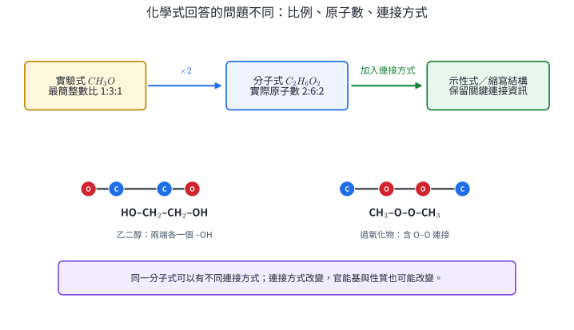
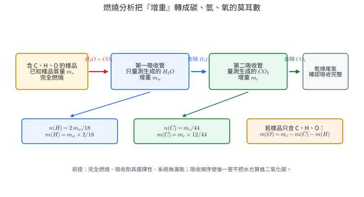
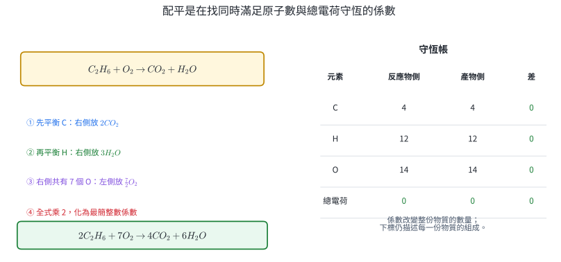
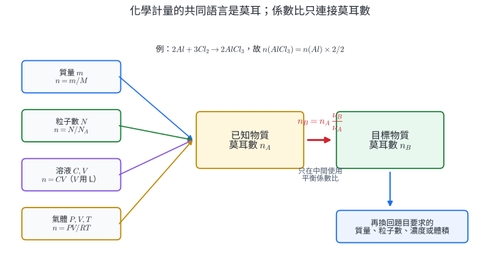
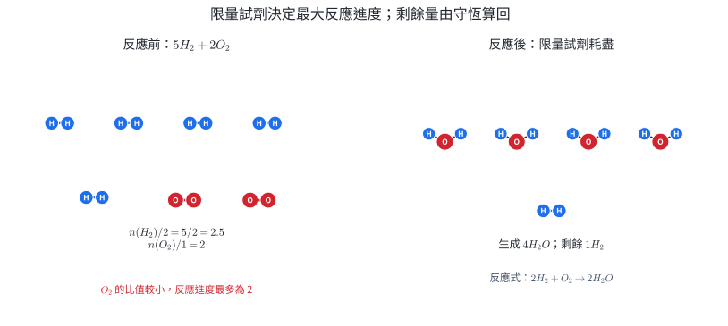
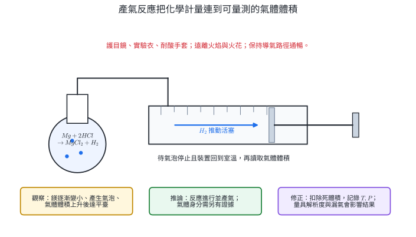
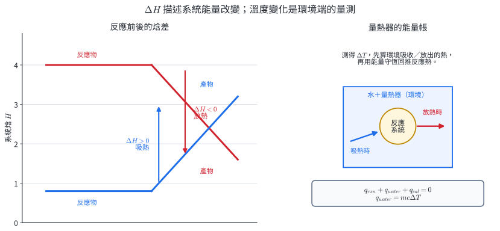

# 必化-2 化學式與化學計量

化學式把元素組成壓縮成可計算的符號，化學反應式再把反應前後的物質連成守恆關係。量到樣品質量、吸收管增重、溶液濃度、氣體體積或溫度變化後，就能依序回答三個問題：物質可能是什麼、最多能生成多少、反應會吸收或釋出多少能量。

這套方法直接用於藥品成分分析、燃料與排放估算、食品與礦石純度、工業配料、氣體產率及製程散熱設計。計算的核心是先確認資料代表哪一種量，再用莫耳與守恆把證據連起來。

**核心問題：**如何由元素比例判定化學式、如何把實驗事實寫成平衡反應式、如何由反應式預測限量試劑與產量，以及如何由溫度資料回推反應熱。

## 1. 化學式、百分組成與組成分析

### 1.1 四種表示方式回答不同問題

**實驗式**表示化合物中各元素原子數的最簡整數比。例如葡萄糖的分子式為 $C_6H_{12}O_6$，其實驗式為 $CH_2O$。離子固體與網狀固體沒有一顆一顆獨立的分子，NaCl、$SiO_2$ 這類化學式表示組成粒子的最簡比例。

**分子式**表示一個分子中各元素的實際原子數。若實驗式質量為 $M_{\mathrm{emp}}$，實測分子莫耳質量為 $M$，則

$$
k=\frac{M}{M_{\mathrm{emp}}},\qquad
\text{分子式}=(\text{實驗式})_k,
$$

其中 $k$ 應在量測誤差內接近正整數。

**結構式**表示原子之間的連接方式；線段通常代表共價鍵。平面上的線段是連接關係，不等於所有原子都位於同一平面，也不完整呈現鍵角與立體形狀。

**示性式或縮寫結構式**保留官能基與部分連接資訊，例如乙醇 $CH_3CH_2OH$ 的 $-OH$、乙酸 $CH_3COOH$ 的 $-COOH$。相同分子式若有不同連接方式，稱為**結構異構物**，其物理與化學性質可能不同。

{width=96%}

化學資料庫、藥品標示與質譜分析常同時使用分子式與結構式：分子式先限制原子數，結構式再指出官能基與可能反應位置。

### 1.2 百分組成把化學式連到可量測的質量

化合物中元素 $E$ 的質量百分率為

$$
\text{質量百分率}(E)
=\frac{n_E A_E}{M_{\mathrm{formula}}}\times100\%,
$$

其中 $n_E$ 是一個化學式單位內的 $E$ 原子數，$A_E$ 是相對原子質量，$M_{\mathrm{formula}}$ 是化學式量或莫耳質量。所有元素的百分率總和應在四捨五入誤差內接近 $100\%$。

反向由質量資料求實驗式時，依序進行：

1. 把各元素質量除以原子量，得到各元素原子的莫耳數。
2. 所有莫耳數同除以最小值，得到相對比。
3. 比值若接近 $1.5、1.33、1.25$ 等簡單分數，整組乘以 $2、3、4$ 化成最簡整數比。
4. 把所得實驗式代回原始質量百分率，檢查是否在資料精度內相符。

以百分率為資料時，可假設樣品為 $100.0\ \mathrm g$；數值上的百分率便直接成為克數。這只是方便換算的基準，不改變原子比。

### 1.3 燃燒分析：由產物增重追回答案

只含 C、H、O 的有機物完全燃燒時，C 全部進入 $CO_2$，H 全部進入 $H_2O$。若吸收管分別增重 $m_c$ 與 $m_w$，則

$$
n(C)=\frac{m_c}{44.0},\qquad
n(H)=2\frac{m_w}{18.0}.
$$

碳、氫質量為

$$
m(C)=m_c\frac{12.0}{44.0},\qquad
m(H)=m_w\frac{2.0}{18.0}.
$$

樣品已知只含 C、H、O 時，氧可由差值求得：

$$
m(O)=m_{\mathrm{sample}}-m(C)-m(H),\qquad
n(O)=\frac{m(O)}{16.0}.
$$

{width=98%}

此推論成立的條件包括：樣品成分範圍已知、燃燒完全、裝置不漏氣、吸收劑具選擇性且吸收完全。若樣品另含 N、S、鹵素或金屬，氧的差值會混入其他元素質量，需要增加獨立分析。

燃燒分析裝置涉及高溫、氧化劑與腐蝕性吸收劑，屬受控儀器分析。實際操作依實驗室風險評估、通風與個人防護規範進行；學生可由已提供的增重資料完成定量推論。

### 1.4 分子式與結構需要額外證據

元素比例只能得到實驗式。分子式還需要莫耳質量；結構式更需要化學反應、光譜或其他結構證據。由實驗式 $CH_2O$ 與莫耳質量 $180\ \mathrm{g\,mol^{-1}}$ 可確定分子式 $C_6H_{12}O_6$，仍不能單靠這兩項資料區分葡萄糖、果糖等結構異構物。

::: worked-example
### 示範 1｜由化學式求百分組成

求 $CaCO_3$ 中各元素的質量百分率。取 $Ca=40.0$、$C=12.0$、$O=16.0$。

一莫耳 $CaCO_3$ 的質量為

$$
M=40.0+12.0+3(16.0)=100.0\ \mathrm{g\,mol^{-1}}.
$$

因此

$$
\%Ca=\frac{40.0}{100.0}\times100\%=40.0\%,
$$

$$
\%C=\frac{12.0}{100.0}\times100\%=12.0\%,\qquad
\%O=\frac{48.0}{100.0}\times100\%=48.0\%.
$$

三者總和為 $100.0\%$，與化學式的質量帳一致。
:::

::: worked-example
### 示範 2｜由百分組成求實驗式

某化合物含 C $52.2\%$、H $13.0\%$、O $34.8\%$。求實驗式。

以 $100.0\ \mathrm g$ 為基準：

$$
n(C)=\frac{52.2}{12.0}=4.35,
$$

$$
n(H)=\frac{13.0}{1.00}=13.0,
\qquad
n(O)=\frac{34.8}{16.0}=2.175.
$$

同除以 $2.175$ 得

$$
C:H:O=2.00:5.98:1.00\approx2:6:1.
$$

實驗式為 $C_2H_6O$。代回可得 C 約 $52.2\%$、H 約 $13.0\%$、O 約 $34.8\%$，符合原始精度。
:::

::: worked-example
### 示範 3｜由化合前後質量求實驗式

$2.43\ \mathrm g$ 鎂完全反應後得到 $4.03\ \mathrm g$ 氧化物。求實驗式，取 $Mg=24.3$、$O=16.0$。

氧的質量為

$$
m(O)=4.03-2.43=1.60\ \mathrm g.
$$

$$
n(Mg)=\frac{2.43}{24.3}=0.100\ \mathrm{mol},\qquad
n(O)=\frac{1.60}{16.0}=0.100\ \mathrm{mol}.
$$

原子莫耳比為 $1:1$，實驗式為 $MgO$。計算使用的是參與反應的氧質量，因此需以產物質量減去原金屬質量。
:::

::: worked-example
### 示範 4｜燃燒分析與分子式

$0.600\ \mathrm g$ 的 C、H、O 化合物完全燃燒，得到 $0.880\ \mathrm g\ CO_2$ 與 $0.360\ \mathrm g\ H_2O$。其莫耳質量為 $180\ \mathrm{g\,mol^{-1}}$，求實驗式與分子式。

$$
n(C)=\frac{0.880}{44.0}=0.0200\ \mathrm{mol},
$$

$$
n(H)=2\frac{0.360}{18.0}=0.0400\ \mathrm{mol}.
$$

碳、氫質量為 $0.240\ \mathrm g$ 與 $0.0400\ \mathrm g$，故

$$
m(O)=0.600-0.240-0.0400=0.320\ \mathrm g,
$$

$$
n(O)=\frac{0.320}{16.0}=0.0200\ \mathrm{mol}.
$$

比值為 $C:H:O=1:2:1$，實驗式為 $CH_2O$，實驗式質量為 $30.0$。再由

$$
k=\frac{180}{30.0}=6
$$

得到分子式 $C_6H_{12}O_6$。
:::

::: worked-example
### 示範 5｜分子式相同，結構與性質仍可不同

分子式 $C_2H_6O$ 可寫成 $CH_3CH_2OH$ 或 $CH_3OCH_3$。

- $CH_3CH_2OH$ 含 $C-O-H$ 連接，屬醇，可形成較強的分子間氫鍵。
- $CH_3OCH_3$ 含 $C-O-C$ 連接，屬醚，沒有 $O-H$ 鍵。

兩者具有相同的元素百分組成與莫耳質量，燃燒分析無法區分；官能基反應或光譜資料才提供連接方式的證據。
:::

### 1.5 本節練習

1. 求 $Al_2O_3$ 中 Al 與 O 的質量百分率，取 $Al=27.0$、$O=16.0$。
2. 某化合物含 C $40.0\%$、H $6.7\%$、O $53.3\%$。求實驗式。
3. $4.60\ \mathrm g$ 鈉與氯完全反應，產物質量為 $11.70\ \mathrm g$。求實驗式，取 $Na=23.0$、$Cl=35.5$。
4. $0.460\ \mathrm g$ 的 C、H、O 化合物完全燃燒，得到 $0.880\ \mathrm g\ CO_2$ 與 $0.540\ \mathrm g\ H_2O$；莫耳質量為 $46.0\ \mathrm{g\,mol^{-1}}$。求實驗式與分子式。
5. 某物質實驗式為 $NO_2$，莫耳質量為 $92.0\ \mathrm{g\,mol^{-1}}$。求分子式。
6. 兩瓶純物質的分子式皆為 $C_2H_6O$。寫出兩種可能的示性式，並說明還需哪一類證據才能判斷瓶內結構。

#### 本節練習解答

1. $M(Al_2O_3)=2(27.0)+3(16.0)=102.0$，故 Al 為 $54.0/102.0=52.9\%$，O 為 $48.0/102.0=47.1\%$。
2. 以 $100\ \mathrm g$ 計，莫耳比為 $40.0/12.0:6.7/1.0:53.3/16.0\approx1:2:1$，實驗式 $CH_2O$。
3. 氯質量 $=11.70-4.60=7.10\ \mathrm g$；$n(Na)=0.200\ \mathrm{mol}$、$n(Cl)=0.200\ \mathrm{mol}$，實驗式 NaCl。
4. $n(C)=0.880/44.0=0.0200$；$n(H)=2(0.540/18.0)=0.0600$。碳、氫質量共 $0.240+0.060=0.300\ \mathrm g$，故 $n(O)=(0.460-0.300)/16.0=0.0100$。比為 $2:6:1$，實驗式 $C_2H_6O$；其式量即 $46.0$，分子式同為 $C_2H_6O$。
5. $M(NO_2)=46.0$，$k=92.0/46.0=2$，分子式 $N_2O_4$。
6. 例如 $CH_3CH_2OH$ 與 $CH_3OCH_3$；以官能基反應、紅外光譜或其他結構分析判定連接方式。

## 2. 化學反應式與守恆

### 2.1 反應式是實驗事實的定量摘要

化學反應式以箭號左側表示反應物、右側表示產物。物態寫在化學式後：$(s)$ 固態、$(l)$ 液態、$(g)$ 氣態、$(aq)$ 水溶液；加熱、催化劑、光照、溫度或壓力等條件標在箭號附近。

一條完整反應式同時包含：

- 哪些物質消耗、哪些物質生成。
- 物質的狀態與必要反應條件。
- 由平衡係數表示的莫耳數變化比例。
- 若是離子反應，反應前後總電荷相等。

產物身分與反應條件來自實驗證據。配平只調整各物質前的**係數**；化學式的**下標**描述該物質本身的固定組成。

### 2.2 配平同時滿足原子數與總電荷守恆

設每種物質前的係數為未知數，要求每一元素在左右兩側的原子總數相同；含離子的反應還要求總電荷相同。係數通常化為最簡整數比。熱化學反應式為了表示每莫耳物質的能量，有時可使用分數係數，並同時縮放 $\Delta H$。

{width=96%}

觀察法適合結構較清楚的反應：先處理只出現在少數物質中的元素，把 H、O 留到後段；多原子離子若反應前後保持整體，可把它視為一組。代數法則為每一物質設係數，逐元素列聯立方程，適合項目多或離子反應。

### 2.3 反應式的資訊邊界

平衡係數可直接提供反應進行時的莫耳數、分子數與同溫同壓下氣體體積變化比。結合莫耳質量後，可得到質量關係。

反應速率、實際轉化率、平衡時組成、反應機構與產物純度需要額外資料。$\Delta H$ 的正負也只描述反應前後能量差，不能單獨決定反應快慢。

::: worked-example
### 示範 6｜觀察法配平金屬氧化物還原

配平

$$
Fe_2O_3+CO\rightarrow Fe+CO_2.
$$

1. 左側有 2 個 Fe，先在 Fe 前放 2。
2. $Fe_2O_3$ 的 3 個 O 可由 3 個 CO 各再帶入 1 個 O，生成 3 個 $CO_2$。
3. 碳因此也同時平衡。

$$
\boxed{Fe_2O_3+3CO\rightarrow2Fe+3CO_2}
$$

檢查：Fe 為 $2=2$，C 為 $3=3$，O 為 $3+3=6=3\times2$。
:::

::: worked-example
### 示範 7｜代數法配平丙烷燃燒

令

$$
aC_3H_8+bO_2\rightarrow cCO_2+dH_2O.
$$

由 C、H、O 守恆：

$$
3a=c,
\qquad 8a=2d,
\qquad 2b=2c+d.
$$

取最小正整數 $a=1$，得 $c=3$、$d=4$、$b=5$：

$$
\boxed{C_3H_8+5O_2\rightarrow3CO_2+4H_2O}.
$$

氧原子檢查：左側 $10$ 個，右側 $3(2)+4=10$ 個。
:::

::: worked-example
### 示範 8｜離子反應同時檢查原子與電荷

鋁在鹼性水溶液中的反應骨架為

$$
Al+OH^-+H_2O\rightarrow Al(OH)_4^-+H_2.
$$

設係數依序為 $a,b,c,d,e$。由 Al 與電荷守恆得 $a=d$、$b=d$；由 O 守恆得 $b+c=4d$，故 $c=3d$；由 H 守恆得 $b+2c=4d+2e$，代入後 $e=3d/2$。

取 $d=2$ 得

$$
\boxed{2Al+2OH^-+6H_2O\rightarrow2Al(OH)_4^-+3H_2}.
$$

左側與右側總電荷皆為 $-2$；Al、O、H 原子數也分別相等。
:::

::: worked-example
### 示範 9｜把觀察與條件寫進反應式

碳酸氫鈉固體受熱後，得到碳酸鈉固體、二氧化碳與水蒸氣。由物質身分先寫骨架，再配平：

$$
\boxed{2NaHCO_3(s)\xrightarrow{\Delta}Na_2CO_3(s)+CO_2(g)+H_2O(g)}.
$$

檢查 Na $2=2$、H $2=2$、C $2=1+1$、O $6=3+2+1$。加熱符號表示反應條件；產氣、冷端凝結水與固體殘留可作為現象證據，產物身分仍以適當檢驗確認。
:::

### 2.4 本節練習

1. 配平 $Al+O_2\rightarrow Al_2O_3$。
2. 在 $MnO_2$ 催化並加熱的條件下，配平 $KClO_3\rightarrow KCl+O_2$，並把條件寫在箭號上。
3. 配平 $CaBr_2+Na_3PO_4\rightarrow Ca_3(PO_4)_2+NaBr$。
4. 配平 $CrO_4^{2-}+H^+\rightarrow Cr_2O_7^{2-}+H_2O$，並檢查總電荷。
5. 對 $2CO(g)+O_2(g)\rightarrow2CO_2(g)$，寫出莫耳比、同溫同壓氣體體積比與質量比。
6. 由原子守恆判定 $2NH_4NO_3(s)\rightarrow aX(g)+4H_2O(g)+O_2(g)$ 中的 $a$ 與 $X$。

#### 本節練習解答

1. $\boxed{4Al+3O_2\rightarrow2Al_2O_3}$。
2. $\boxed{2KClO_3(s)\xrightarrow[\Delta]{MnO_2}2KCl(s)+3O_2(g)}$。
3. $\boxed{3CaBr_2+2Na_3PO_4\rightarrow Ca_3(PO_4)_2+6NaBr}$。
4. $\boxed{2CrO_4^{2-}+2H^+\rightarrow Cr_2O_7^{2-}+H_2O}$；左側電荷 $-4+2=-2$，右側為 $-2$。
5. 莫耳比與同溫同壓氣體體積比皆為 $2:1:2$；質量比為 $2(28.0):32.0:2(44.0)=56:32:88=7:4:11$。
6. 反應物側共有 N 4、H 8、O 6；$4H_2O+O_2$ 已含 H 8、O 6，故 $X=N_2$ 且 $a=2$。

## 3. 化學計量、限量試劑與產氣量測

### 3.1 先把已知量轉成莫耳

平衡反應式的係數 $\nu$ 連接的是莫耳數或粒子數。常用換算為

$$
n=\frac{m}{M},\qquad
n=\frac{N}{N_A},\qquad
n=CV,
$$

其中溶液體積 $V$ 以 L 代入。氣體可依題目條件使用理想氣體式

$$
n=\frac{PV}{RT},
$$

或使用同溫同壓下已知的莫耳體積。氣體莫耳體積隨溫度與壓力改變，須把條件與數值一起使用。

{width=98%}

標準計算鏈為

$$
\text{已知量}\rightarrow n_A
\xrightarrow{\nu_B/\nu_A}n_B
\rightarrow\text{目標量}.
$$

每一步保留單位，可以直接看出質量、體積與莫耳是否接在正確的位置。

### 3.2 限量試劑決定最大反應進度

對反應

$$
aA+bB\rightarrow cC+dD,
$$

各反應物可支持的反應進度為 $n(A)/a$、$n(B)/b$。最小值對應**限量試劑**，最大反應進度為

$$
\xi_{\max}=\min\left(\frac{n(A)}a,\frac{n(B)}b,\ldots\right).
$$

生成量與剩餘量為

$$
n(C)=c\xi_{\max},\qquad
n_{\mathrm{left}}(A)=n_0(A)-a\xi_{\max}.
$$

{width=94%}

工業配料、藥物合成與燃燒供氣都使用相同判斷。實際產量常低於理論產量，可用

$$
\text{百分產率}=\frac{\text{實際產量}}{\text{理論產量}}\times100\%
$$

比較製程表現。理論產量由限量試劑決定；實際差異可能來自副反應、未完全反應、轉移損失或量測誤差。

### 3.3 溶液與氣體是常見的計量入口

溶液先用 $n=CV$；若有混合後反應，再依係數判定限量試劑。氣體體積比只有在各氣體溫度與壓力相同時才等於莫耳比。若氣體經水上集氣，乾氣分壓還需由總壓扣除水蒸氣壓；若反應後冷卻造成水凝結，氣相物質種類也會改變。

### 3.4 小量產氣實驗：量測、風險與證據

鎂與稀鹽酸反應可把固體質量連到氫氣體積：

$$
Mg(s)+2HCl(aq)\rightarrow MgCl_2(aq)+H_2(g).
$$

{width=96%}

| 面向 | 實驗處理 |
|---|---|
| 危害 | 稀鹽酸具腐蝕與刺激性；氫氣易燃；反應產氣使封閉容器升壓 |
| PPE 與環境 | 穿實驗衣、戴護目鏡與耐酸手套；採小量操作；遠離火焰、火花與高溫表面；導氣路徑保持通暢 |
| 讀值條件 | 先檢漏並記錄死體積；氣泡停止、裝置回到室溫後讀取；同步記錄溫度、壓力與量具解析度 |
| 廢液 | 含 $MgCl_2$ 與可能剩餘酸的水溶液清楚標示，依學校實驗室規範收集或處理 |

觀察與推論分開記錄：

| 觀察 | 可支持的推論 | 還需控制或補充 |
|---|---|---|
| 鎂逐漸變小並持續產生氣泡 | 反應消耗鎂並產生氣體 | 氣體身分需由已知反應與獨立檢驗支持 |
| 氣體體積上升後達平臺 | 產氣速率已接近零，某反應物可能耗盡 | 回到同一溫度並確認無漏氣後才能做定量比較 |
| 實測體積低於理論值 | 氣體收集不完全或反應／修正條件有差異 | 檢查漏氣、死體積、溫壓與樣品表面氧化層 |

::: worked-example
### 示範 10｜質量到質量的莫耳橋

$5.40\ \mathrm g$ Al 與足量 $Cl_2$ 反應：

$$
2Al+3Cl_2\rightarrow2AlCl_3.
$$

取 $Al=27.0$、$Cl=35.5$，求 $AlCl_3$ 質量。

$$
n(Al)=\frac{5.40}{27.0}=0.200\ \mathrm{mol}.
$$

係數比 $Al:AlCl_3=2:2$，故 $n(AlCl_3)=0.200\ \mathrm{mol}$。$M(AlCl_3)=133.5\ \mathrm{g\,mol^{-1}}$，所以

$$
m(AlCl_3)=0.200(133.5)=26.7\ \mathrm g.
$$
:::

::: worked-example
### 示範 11｜溶液濃度到氣體體積

$100.0\ \mathrm{mL}$、$1.50\ \mathrm M$ HCl 與過量 $CaCO_3$ 反應，在 $25^\circ\mathrm C$、$1.00\ \mathrm{atm}$ 收集乾燥 $CO_2$。取此條件氣體莫耳體積為 $24.5\ \mathrm{L\,mol^{-1}}$。

$$
CaCO_3+2HCl\rightarrow CaCl_2+H_2O+CO_2.
$$

$$
n(HCl)=(1.50)(0.1000)=0.150\ \mathrm{mol},
$$

$$
n(CO_2)=0.150\times\frac12=0.0750\ \mathrm{mol}.
$$

$$
V(CO_2)=0.0750(24.5)=1.84\ \mathrm L.
$$

體積答案與 $25^\circ\mathrm C$、$1.00\ \mathrm{atm}$ 綁定；改變溫壓便需重新換算。
:::

::: worked-example
### 示範 12｜判斷限量試劑與剩餘量

$2.00\ \mathrm{mol}\ N_2$ 與 $5.00\ \mathrm{mol}\ H_2$ 依

$$
N_2+3H_2\rightarrow2NH_3
$$

反應。比較

$$
\frac{n(N_2)}1=2.00,
\qquad
\frac{n(H_2)}3=1.667.
$$

$H_2$ 為限量試劑，$\xi_{\max}=1.667\ \mathrm{mol}$。

$$
n(NH_3)=2(1.667)=3.33\ \mathrm{mol},
$$

$$
n_{\mathrm{left}}(N_2)=2.00-1(1.667)=0.333\ \mathrm{mol}.
$$

若取 $M(NH_3)=17.0$，理論質量為 $56.7\ \mathrm g$。
:::

::: worked-example
### 示範 13｜由產氣資料求礦石純度

$2.50\ \mathrm g$ 石灰石樣品與足量酸反應，在 $25^\circ\mathrm C$、$1.00\ \mathrm{atm}$ 得到 $0.490\ \mathrm L$ 乾燥 $CO_2$。假設只有 $CaCO_3$ 產生 $CO_2$，求 $CaCO_3$ 質量百分率；此條件氣體莫耳體積取 $24.5\ \mathrm{L\,mol^{-1}}$。

$$
n(CO_2)=\frac{0.490}{24.5}=0.0200\ \mathrm{mol}.
$$

$CaCO_3:CO_2=1:1$，故

$$
m(CaCO_3)=0.0200(100.0)=2.00\ \mathrm g.
$$

$$
\text{純度}=\frac{2.00}{2.50}\times100\%=80.0\%.
$$

結論使用了「其他成分不產生 $CO_2$」的模型前提；若雜質也含碳酸鹽，這項計算會高估 $CaCO_3$。
:::

::: worked-example
### 示範 14｜限量試劑與固體剩餘量

$6.54\ \mathrm g$ Zn 加入 $150.0\ \mathrm{mL}$、$1.00\ \mathrm M$ HCl：

$$
Zn+2HCl\rightarrow ZnCl_2+H_2.
$$

取 $M(Zn)=65.4\ \mathrm{g\,mol^{-1}}$。

$$
n(Zn)=0.100\ \mathrm{mol},\qquad n(HCl)=0.150\ \mathrm{mol}.
$$

$$
\frac{n(Zn)}1=0.100,
\qquad
\frac{n(HCl)}2=0.0750.
$$

HCl 為限量試劑，反應進度為 $0.0750\ \mathrm{mol}$。因此生成 $0.0750\ \mathrm{mol}\ H_2$，Zn 剩餘

$$
(0.100-0.0750)(65.4)=1.64\ \mathrm g.
$$
:::

### 3.5 本節練習

1. $4.80\ \mathrm g$ Mg 與足量氧氣依 $2Mg+O_2\rightarrow2MgO$ 反應。求 $MgO$ 質量，取 $Mg=24.0$、$O=16.0$。
2. $50.0\ \mathrm{mL}$、$0.200\ \mathrm M$ $AgNO_3$ 與過量 NaCl 反應生成 AgCl。求 AgCl 質量，取 $M(AgCl)=143.5\ \mathrm{g\,mol^{-1}}$。
3. 同溫同壓下，$15.0\ \mathrm{mL}\ CH_4$ 依 $CH_4+2O_2\rightarrow CO_2+2H_2O(g)$ 完全反應。求所需 $O_2$、生成 $CO_2$ 與水蒸氣的體積。
4. $10.0\ \mathrm g\ H_2$ 與 $64.0\ \mathrm g\ O_2$ 反應生成水。判定限量試劑，求水的理論質量與剩餘反應物質量。
5. 粒子反應為 $A_2+3B_2\rightarrow2AB_3$。起始有 4 個 $A_2$ 與 9 個 $B_2$，求最大可生成的 $AB_3$ 數與剩餘粒子。
6. 鎂與足量稀鹽酸反應，氣體注射筒讀值 $52.4\ \mathrm{mL}$，裝置死體積為 $2.0\ \mathrm{mL}$。在相同溫壓下氣體莫耳體積為 $24.5\ \mathrm{L\,mol^{-1}}$。求反應的 Mg 莫耳數與推算質量；若實際秤量為 $0.0506\ \mathrm g$，求相對於秤量值的百分差，取 $M(Mg)=24.3$。

#### 本節練習解答

1. $n(Mg)=4.80/24.0=0.200\ \mathrm{mol}$；係數比 $1:1$，$m(MgO)=0.200(40.0)=8.00\ \mathrm g$。
2. $n(AgNO_3)=0.0500(0.200)=0.0100\ \mathrm{mol}$；$Ag^+:AgCl=1:1$，故 $m(AgCl)=1.435\ \mathrm g$。
3. 同溫同壓下體積比等於係數比 $1:2:1:2$，故 $O_2=30.0\ \mathrm{mL}$、$CO_2=15.0\ \mathrm{mL}$、$H_2O(g)=30.0\ \mathrm{mL}$。此結果以水保持氣態為條件。
4. $n(H_2)=5.00\ \mathrm{mol}$、$n(O_2)=2.00\ \mathrm{mol}$；$n/\nu$ 分別為 $2.50$、$2.00$，故 $O_2$ 為限量試劑。生成 $4.00\ \mathrm{mol}$ 水，即 $72.0\ \mathrm g$；剩餘 $1.00\ \mathrm{mol}\ H_2=2.00\ \mathrm g$。
5. $4/1=4$、$9/3=3$，故 $B_2$ 為限量試劑；反應進度為 3，生成 6 個 $AB_3$，剩 1 個 $A_2$。
6. 校正體積 $=52.4-2.0=50.4\ \mathrm{mL}=0.0504\ \mathrm L$。$n(H_2)=0.0504/24.5=2.06\times10^{-3}\ \mathrm{mol}$，故 $n(Mg)$ 相同，推算 $m(Mg)=0.0500\ \mathrm g$。百分差 $=(0.0500-0.0506)/0.0506\times100\%=-1.2\%$，表示產氣推算值低約 $1.2\%$。

## 4. 化學反應中的能量變化

### 4.1 系統、環境與能量流向

研究的反應物與產物稱為**系統**，其餘可與系統交換能量的部分稱為**環境**。系統向環境釋出熱量是**放熱反應**；系統由環境吸收熱量是**吸熱反應**。

定壓下，反應前後的焓差定義為

$$
\Delta H=H_{\mathrm{products}}-H_{\mathrm{reactants}}.
$$

放熱時 $H_{\mathrm{products}}<H_{\mathrm{reactants}}$，故 $\Delta H<0$；吸熱時 $\Delta H>0$。環境溫度上升通常顯示環境吸熱、系統放熱，兩者的符號需依選定的系統判讀。

{width=98%}

### 4.2 熱化學反應式的係數、方向與物態

熱化學反應式須包含配平反應、物態、條件與對應的 $\Delta H$。例如

$$
2H_2(g)+O_2(g)\rightarrow2H_2O(l),
\qquad \Delta H=-572\ \mathrm{kJ}.
$$

此數值對應方程式寫出的反應進度：消耗 $2\ \mathrm{mol}\ H_2$ 並生成 $2\ \mathrm{mol}\ H_2O(l)$ 時，系統焓降低 $572\ \mathrm{kJ}$。

- 方程式所有係數乘以 $r$，$\Delta H$ 也乘以 $r$。
- 反應方向反轉，$\Delta H$ 大小相同、正負相反。
- 物態改變會改變 $\Delta H$；生成液態水與水蒸氣的反應熱不同。

$\Delta H$ 不提供反應速率，也不單獨決定常溫下是否能觀察到反應。活化能、碰撞、反應途徑與平衡資料屬另外的模型。

### 4.3 量熱法：先算環境，再回推系統

水或溶液吸收的熱可近似為

$$
q_{\mathrm{solution}}=mc\Delta T.
$$

若量熱器本身的熱容量為 $C_{\mathrm{cal}}$，則

$$
q_{\mathrm{cal}}=C_{\mathrm{cal}}\Delta T.
$$

在與外界近似絕熱的模型下，

$$
q_{\mathrm{rxn}}+q_{\mathrm{solution}}+q_{\mathrm{cal}}=0.
$$

真實量測需校正量熱器、熱散失、蒸發與溶液比熱差異。報告結果時寫出採用的近似，才能判斷誤差方向。

::: worked-example
### 示範 15｜由能階資料判斷反應熱

某反應的反應物總焓為 $240\ \mathrm{kJ}$，產物總焓為 $100\ \mathrm{kJ}$。則

$$
\Delta H=100-240=-140\ \mathrm{kJ}.
$$

系統焓降低 $140\ \mathrm{kJ}$，為放熱反應；在近似絕熱的量熱器中，環境端會吸收約 $140\ \mathrm{kJ}$。
:::

::: worked-example
### 示範 16｜縮放與反轉熱化學反應式

已知

$$
2H_2(g)+O_2(g)\rightarrow2H_2O(l),
\qquad\Delta H=-572\ \mathrm{kJ}.
$$

$0.500\ \mathrm{mol}\ H_2$ 完全反應時，反應進度是原式的 $0.500/2=0.250$，故

$$
\Delta H=(-572)(0.250)=-143\ \mathrm{kJ}.
$$

若把 $1.00\ \mathrm{mol}\ H_2O(l)$ 分解成元素，先把原式除以 2 再反轉：

$$
H_2O(l)\rightarrow H_2(g)+\frac12O_2(g),
\qquad\Delta H=+286\ \mathrm{kJ}.
$$
:::

::: worked-example
### 示範 17｜物態造成的反應熱差異

同一溫壓下已知

$$
H_2(g)+\frac12O_2(g)\rightarrow H_2O(g),
\qquad\Delta H=-242\ \mathrm{kJ},
$$

$$
H_2(g)+\frac12O_2(g)\rightarrow H_2O(l),
\qquad\Delta H=-286\ \mathrm{kJ}.
$$

兩式反應物相同，液態水的焓比水蒸氣低

$$
286-242=44\ \mathrm{kJ\,mol^{-1}}.
$$

因此水蒸氣凝結成液態水時

$$
H_2O(g)\rightarrow H_2O(l),
\qquad\Delta H=-44\ \mathrm{kJ\,mol^{-1}}.
$$

液態產物多釋出的熱，正是凝結時傳給環境的能量。
:::

::: worked-example
### 示範 18｜由水溫上升求莫耳反應熱

$0.100\ \mathrm{mol}$ 燃料在簡化量熱器中完全反應，使 $500\ \mathrm g$ 水升溫 $5.00^\circ\mathrm C$。取 $c=4.18\ \mathrm{J\,g^{-1}\,K^{-1}}$，忽略量熱器與散熱。

$$
q_{\mathrm{water}}=(500)(4.18)(5.00)=10450\ \mathrm J=10.45\ \mathrm{kJ}.
$$

水吸熱為正，故反應系統

$$
q_{\mathrm{rxn}}=-10.45\ \mathrm{kJ}.
$$

每莫耳燃料的反應熱為

$$
\Delta H_{\mathrm{mol}}=\frac{-10.45}{0.100}
=-104.5\ \mathrm{kJ\,mol^{-1}}.
$$
:::

::: worked-example
### 示範 19｜把量熱器熱容量納入能量帳

$0.0200\ \mathrm{mol}$ 反應使 $50.0\ \mathrm g$ 水與量熱器一同升溫 $6.00^\circ\mathrm C$。水比熱 $4.18\ \mathrm{J\,g^{-1}\,K^{-1}}$，量熱器熱容量 $30.0\ \mathrm{J\,K^{-1}}$。

$$
q_{\mathrm{water}}=(50.0)(4.18)(6.00)=1254\ \mathrm J,
$$

$$
q_{\mathrm{cal}}=(30.0)(6.00)=180\ \mathrm J.
$$

環境共吸收 $1434\ \mathrm J$，所以反應釋出相同大小的熱：

$$
\Delta H_{\mathrm{mol}}
=\frac{-1.434\ \mathrm{kJ}}{0.0200\ \mathrm{mol}}
=-71.7\ \mathrm{kJ\,mol^{-1}}.
$$
:::

### 4.4 本節練習

1. 冰融化時系統由環境吸熱；甲烷燃燒時系統向環境放熱。分別寫出 $\Delta H$ 的正負。
2. 某反應反應物總焓為 $320\ \mathrm{kJ}$、產物總焓為 $460\ \mathrm{kJ}$。求 $\Delta H$ 並判斷能量流向。
3. 已知 $N_2+3H_2\rightarrow2NH_3$，$\Delta H=-92.4\ \mathrm{kJ}$。生成 $0.500\ \mathrm{mol}\ NH_3$ 時的 $\Delta H$ 為何？分解 $1.00\ \mathrm{mol}\ NH_3$ 時又為何？
4. 生成 $1\ \mathrm{mol}\ H_2O(l)$ 比生成 $1\ \mathrm{mol}\ H_2O(g)$ 多放出 $44\ \mathrm{kJ}$。比較兩者焓的高低，並寫出凝結反應的 $\Delta H$。
5. $0.0500\ \mathrm{mol}$ 反應使 $250\ \mathrm g$ 水升溫 $3.20^\circ\mathrm C$。取 $c=4.18\ \mathrm{J\,g^{-1}\,K^{-1}}$ 且忽略其他熱容量，求莫耳反應熱。
6. 某反應 $\Delta H=-80\ \mathrm{kJ}$。列出仍需額外資料才能判定的兩項：反應速率、平衡轉化率、反應前後焓差、對應方程式反應進度。

#### 本節練習解答

1. 融化吸熱，$\Delta H>0$；燃燒放熱，$\Delta H<0$。
2. $\Delta H=460-320=+140\ \mathrm{kJ}$，系統由環境吸收能量。
3. 生成 $0.500\ \mathrm{mol}$ 是原式反應進度的 $0.500/2=0.250$，故 $\Delta H=-23.1\ \mathrm{kJ}$。分解 $1.00\ \mathrm{mol}\ NH_3$ 是原式除以 2 再反轉，$\Delta H=+46.2\ \mathrm{kJ}$。
4. $H(H_2O(g))$ 較高；$H_2O(g)\rightarrow H_2O(l)$ 的 $\Delta H=-44\ \mathrm{kJ\,mol^{-1}}$。
5. $q_{water}=(250)(4.18)(3.20)=3344\ \mathrm J=3.344\ \mathrm{kJ}$，故每莫耳反應熱 $=-3.344/0.0500=-66.9\ \mathrm{kJ\,mol^{-1}}$。
6. 反應速率與平衡轉化率都需額外資料；$\Delta H$ 已直接給出反應前後焓差，但仍須搭配方程式才能知道其對應反應進度。

## 5. 分層題與跨節整合題

### 基礎題

### 題目 1｜百分組成

求 $Mg(OH)_2$ 中 Mg、O、H 的質量百分率。取 $Mg=24.0$、$O=16.0$、$H=1.0$。

### 題目 2｜由百分組成求實驗式

某化合物只含 C 與 O，質量百分率分別為 C $27.3\%$、O $72.7\%$。求實驗式。

### 題目 3｜由實驗式求分子式

某化合物實驗式為 $C_2H_5O$，莫耳質量為 $90.0\ \mathrm{g\,mol^{-1}}$。求分子式。

### 題目 4｜反應式配平

配平黃鐵礦焙燒的反應：

$$
FeS_2+O_2\rightarrow Fe_2O_3+SO_2.
$$

### 題目 5｜離子反應守恆

配平

$$
Al+H^+\rightarrow Al^{3+}+H_2,
$$

並檢查總電荷。

### 應用題

### 題目 6｜燃燒的質量計量

$12.0\ \mathrm g$ 純碳完全燃燒生成 $CO_2$。求所需 $O_2$ 與生成 $CO_2$ 的質量。

### 題目 7｜溶液到氣體

$25.0\ \mathrm{mL}$、$0.800\ \mathrm M$ HCl 與過量 $Na_2CO_3$ 反應：

$$
Na_2CO_3+2HCl\rightarrow2NaCl+H_2O+CO_2.
$$

求 $CO_2$ 莫耳數；在 $25^\circ\mathrm C$、$1.00\ \mathrm{atm}$，取莫耳體積 $24.5\ \mathrm{L\,mol^{-1}}$，再求乾燥 $CO_2$ 體積。

### 題目 8｜限量試劑

$3.00\ \mathrm{mol}\ CO$ 與 $1.00\ \mathrm{mol}\ O_2$ 依

$$
2CO+O_2\rightarrow2CO_2
$$

反應。求限量試劑、$CO_2$ 生成量與過量反應物剩餘量。

### 題目 9｜同溫同壓氣體體積

同溫同壓下，$20.0\ \mathrm{mL}\ N_2$ 與 $45.0\ \mathrm{mL}\ H_2$ 依

$$
N_2+3H_2\rightarrow2NH_3
$$

完全反應。求生成 $NH_3$ 與剩餘 $N_2$ 的體積，假設所有氣體保持相同溫壓。

### 題目 10｜熱化學式縮放

已知

$$
2SO_2(g)+O_2(g)\rightarrow2SO_3(g),
\qquad\Delta H=-198\ \mathrm{kJ}.
$$

生成 $0.750\ \mathrm{mol}\ SO_3$ 時的 $\Delta H$ 為何？將這些 $SO_3$ 分解回 $SO_2$ 與 $O_2$ 時又為何？

### 題目 11｜量熱資料

$0.0250\ \mathrm{mol}$ 反應使 $100.0\ \mathrm g$ 水升溫 $5.00^\circ\mathrm C$。取 $c=4.18\ \mathrm{J\,g^{-1}\,K^{-1}}$ 且忽略散熱與量熱器熱容量，求莫耳反應熱。

### 題目 12｜焓差與環境

某反應反應物總焓為 $75\ \mathrm{kJ}$，產物總焓為 $130\ \mathrm{kJ}$。求 $\Delta H$、判斷吸放熱，並預測近似絕熱時環境的溫度變化方向。

### 跨節整合題

### 題目 13｜燃料的組成、排放與反應熱

某只含 C、H 的燃料 $0.580\ \mathrm g$ 完全燃燒，得到 $1.760\ \mathrm g\ CO_2$ 與 $0.900\ \mathrm g\ H_2O$。其莫耳質量為 $58.0\ \mathrm{g\,mol^{-1}}$。

1. 求實驗式與分子式。
2. 寫出最簡整數係數的完全燃燒反應式。
3. $1.16\ \mathrm g$ 此燃料完全燃燒時，求 $CO_2$ 質量。
4. 若第 2 小題反應式所對應的 $\Delta H=-5752\ \mathrm{kJ}$，求燃燒 $1.16\ \mathrm g$ 時的 $\Delta H$。

### 題目 14｜水合鹽的組成與脫水能量

$2.46\ \mathrm g$ 的 $MgSO_4\cdot xH_2O$ 完全加熱脫水後，留下 $1.20\ \mathrm g\ MgSO_4$。取 $M(MgSO_4)=120\ \mathrm{g\,mol^{-1}}$、$M(H_2O)=18.0\ \mathrm{g\,mol^{-1}}$。

1. 求 $x$。
2. 寫出脫水反應式，水在高溫出口以水蒸氣表示。
3. 若這份樣品脫水的系統焓變為 $+5.60\ \mathrm{kJ}$，求每莫耳水合鹽的 $\Delta H$。

### 題目 15｜產氫量測、限量試劑與產率

$0.0486\ \mathrm g$ Mg 加入 $50.0\ \mathrm{mL}$、$0.100\ \mathrm M$ HCl。取 $M(Mg)=24.3\ \mathrm{g\,mol^{-1}}$，$25^\circ\mathrm C$、$1.00\ \mathrm{atm}$ 的氣體莫耳體積為 $24.5\ \mathrm{L\,mol^{-1}}$。

1. 判定限量試劑。
2. 求 $H_2$ 理論體積。
3. 校正後實測 $H_2$ 體積為 $46.8\ \mathrm{mL}$，求體積產率。
4. 寫出一項安全控制，以及「氣體體積上升後達平臺」可支持的一項推論。

### 題目 16｜含雜質石灰石的配料與散熱

$5.00\ \mathrm g$ 石灰石含 $80.0\%\ CaCO_3$，其餘為不反應固體。加入 $60.0\ \mathrm{mL}$、$1.00\ \mathrm M$ HCl：

$$
CaCO_3+2HCl\rightarrow CaCl_2+H_2O+CO_2.
$$

1. 判定限量試劑。
2. 求 $CO_2$ 莫耳數與質量。
3. 求反應後未反應固體總質量。
4. 若每反應 $1.00\ \mathrm{mol}\ CaCO_3$ 的 $\Delta H=-20.0\ \mathrm{kJ}$，求此批次的 $\Delta H$。

## 6. 分層題與跨節整合題詳解

### 第 1 題

$$
M(Mg(OH)_2)=24.0+2(16.0+1.0)=58.0.
$$

$$
\%Mg=\frac{24.0}{58.0}\times100\%=41.4\%,
$$

$$
\%O=\frac{32.0}{58.0}\times100\%=55.2\%,
\qquad
\%H=\frac{2.0}{58.0}\times100\%=3.45\%.
$$

總和約 $100.0\%$。

### 第 2 題

以 $100.0\ \mathrm g$ 計：

$$
n(C)=\frac{27.3}{12.0}=2.275,
\qquad
n(O)=\frac{72.7}{16.0}=4.544.
$$

同除以 $2.275$ 得 $C:O=1.000:1.997\approx1:2$，實驗式為 $CO_2$。代回可得 C 百分率 $12/44=27.3\%$，符合資料。

### 第 3 題

實驗式質量

$$
M_{emp}=2(12.0)+5(1.0)+16.0=45.0.
$$

$$
k=\frac{90.0}{45.0}=2,
$$

故分子式為 $C_4H_{10}O_2$。

### 第 4 題

先以 4 個 $FeS_2$ 使 Fe 為 4、S 為 8；右側需 $2Fe_2O_3$ 與 $8SO_2$。產物側 O 原子總數為 $2(3)+8(2)=22$，故反應物側需 $11O_2$：

$$
\boxed{4FeS_2+11O_2\rightarrow2Fe_2O_3+8SO_2}.
$$

### 第 5 題

每個 Al 由電中性變成 $Al^{3+}$，係數配合總電荷；氫原子形成 $H_2$：

$$
\boxed{2Al+6H^+\rightarrow2Al^{3+}+3H_2}.
$$

左側總電荷 $+6$，右側 $2(+3)=+6$；Al 2 個、H 6 個也守恆。

### 第 6 題

$$
C+O_2\rightarrow CO_2.
$$

$12.0\ \mathrm g$ C 為 $1.00\ \mathrm{mol}$，故需 $1.00\ \mathrm{mol}\ O_2=32.0\ \mathrm g$，生成 $1.00\ \mathrm{mol}\ CO_2=44.0\ \mathrm g$。質量檢查：$12.0+32.0=44.0\ \mathrm g$。

### 第 7 題

$$
n(HCl)=(0.800)(0.0250)=0.0200\ \mathrm{mol}.
$$

$$
n(CO_2)=0.0200\times\frac12=0.0100\ \mathrm{mol}.
$$

$$
V(CO_2)=0.0100(24.5)=0.245\ \mathrm L.
$$

### 第 8 題

$$
\frac{n(CO)}2=\frac{3.00}{2}=1.50,
\qquad
\frac{n(O_2)}1=1.00.
$$

$O_2$ 為限量試劑，$\xi_{max}=1.00\ \mathrm{mol}$。生成 $2.00\ \mathrm{mol}\ CO_2$，消耗 $2.00\ \mathrm{mol}\ CO$，故剩餘 $1.00\ \mathrm{mol}\ CO$。

### 第 9 題

同溫同壓下可直接比較體積與係數：

$$
\frac{20.0}{1}=20.0,
\qquad
\frac{45.0}{3}=15.0.
$$

$H_2$ 為限量試劑，反應進度的體積尺度為 $15.0\ \mathrm{mL}$。生成

$$
V(NH_3)=2(15.0)=30.0\ \mathrm{mL},
$$

剩餘

$$
V(N_2)=20.0-15.0=5.0\ \mathrm{mL}.
$$

### 第 10 題

原式生成 $2.00\ \mathrm{mol}\ SO_3$ 對應 $-198\ \mathrm{kJ}$。生成 $0.750\ \mathrm{mol}$ 時，縮放因子為 $0.750/2.00=0.375$：

$$
\Delta H=(-198)(0.375)=-74.3\ \mathrm{kJ}.
$$

分解是反向過程，故 $\Delta H=+74.3\ \mathrm{kJ}$。

### 第 11 題

$$
q_{water}=(100.0)(4.18)(5.00)=2090\ \mathrm J=2.090\ \mathrm{kJ}.
$$

水吸熱，反應系統放熱：

$$
\Delta H_{mol}=\frac{-2.090}{0.0250}
=-83.6\ \mathrm{kJ\,mol^{-1}}.
$$

### 第 12 題

$$
\Delta H=130-75=+55\ \mathrm{kJ}.
$$

系統吸熱；近似絕熱時能量由環境進入系統，環境溫度下降。

### 第 13 題

**(1) 組成與分子式**

$$
n(C)=\frac{1.760}{44.0}=0.0400\ \mathrm{mol},
$$

$$
n(H)=2\frac{0.900}{18.0}=0.100\ \mathrm{mol}.
$$

$C:H=0.0400:0.100=2:5$，實驗式 $C_2H_5$，式量 $29.0$。$58.0/29.0=2$，分子式為 $C_4H_{10}$。

**(2) 配平**

$$
\boxed{2C_4H_{10}+13O_2\rightarrow8CO_2+10H_2O}.
$$

**(3) 二氧化碳質量**

$$
n(C_4H_{10})=\frac{1.16}{58.0}=0.0200\ \mathrm{mol}.
$$

每莫耳燃料生成 $4\ \mathrm{mol}\ CO_2$：

$$
m(CO_2)=0.0200(4)(44.0)=3.52\ \mathrm g.
$$

**(4) 反應熱**

題給 $\Delta H$ 對應 $2\ \mathrm{mol}$ 燃料。縮放因子為 $0.0200/2=0.0100$：

$$
\Delta H=(-5752)(0.0100)=-57.5\ \mathrm{kJ}.
$$

### 第 14 題

**(1) 結晶水數**

$$
n(MgSO_4)=\frac{1.20}{120}=0.0100\ \mathrm{mol}.
$$

失去水的質量為 $2.46-1.20=1.26\ \mathrm g$：

$$
n(H_2O)=\frac{1.26}{18.0}=0.0700\ \mathrm{mol}.
$$

$$
x=\frac{0.0700}{0.0100}=7.
$$

**(2) 反應式**

$$
\boxed{MgSO_4\cdot7H_2O(s)\xrightarrow{\Delta}MgSO_4(s)+7H_2O(g)}.
$$

**(3) 莫耳反應熱**

樣品含 $0.0100\ \mathrm{mol}$ 水合鹽：

$$
\Delta H_{mol}=\frac{+5.60}{0.0100}=+560\ \mathrm{kJ\,mol^{-1}}.
$$

正號與脫水需要系統吸熱的設定一致。

### 第 15 題

反應為

$$
Mg+2HCl\rightarrow MgCl_2+H_2.
$$

**(1) 限量試劑**

$$
n(Mg)=\frac{0.0486}{24.3}=0.00200\ \mathrm{mol},
$$

$$
n(HCl)=(0.100)(0.0500)=0.00500\ \mathrm{mol}.
$$

$$
\frac{n(Mg)}1=0.00200,
\qquad
\frac{n(HCl)}2=0.00250.
$$

Mg 為限量試劑。

**(2) 理論體積**

$n(H_2)=0.00200\ \mathrm{mol}$，故

$$
V(H_2)=0.00200(24.5)=0.0490\ \mathrm L=49.0\ \mathrm{mL}.
$$

**(3) 體積產率**

$$
\text{產率}=\frac{46.8}{49.0}\times100\%=95.5\%.
$$

**(4) 安全與推論**

安全控制可寫：遠離火焰與火花、戴護目鏡與耐酸手套、採小量操作、保持導氣路徑通暢，任一合理項皆可。體積達平臺支持「淨產氣速率已接近零」；配合反應物計量可推測限量試劑接近耗盡，定量前仍需確認裝置回到同溫且沒有漏氣。

### 第 16 題

樣品含

$$
m(CaCO_3)=5.00(0.800)=4.00\ \mathrm g,
$$

$$
n(CaCO_3)=\frac{4.00}{100.0}=0.0400\ \mathrm{mol},
\qquad
n(HCl)=(1.00)(0.0600)=0.0600\ \mathrm{mol}.
$$

**(1) 限量試劑**

$$
\frac{0.0400}{1}=0.0400,
\qquad
\frac{0.0600}{2}=0.0300.
$$

HCl 為限量試劑，$\xi_{max}=0.0300\ \mathrm{mol}$。

**(2) 二氧化碳**

$$
n(CO_2)=0.0300\ \mathrm{mol},
\qquad
m(CO_2)=0.0300(44.0)=1.32\ \mathrm g.
$$

**(3) 未反應固體**

消耗 $0.0300\ \mathrm{mol}\ CaCO_3=3.00\ \mathrm g$，故剩 $1.00\ \mathrm g\ CaCO_3$。原有不反應雜質為 $5.00-4.00=1.00\ \mathrm g$，未反應固體總質量為

$$
1.00+1.00=2.00\ \mathrm g.
$$

**(4) 批次反應熱**

$$
\Delta H=(-20.0\ \mathrm{kJ\,mol^{-1}})(0.0300\ \mathrm{mol})
=-0.600\ \mathrm{kJ}.
$$

## 7. 核心整理

1. 實驗式給最簡原子比；分子式給實際原子數；結構式與示性式再加入連接與官能基資訊。
2. 百分組成與燃燒分析都先把質量轉成元素原子的莫耳數，再化成最簡整數比；分子式還需要莫耳質量。
3. 反應式的產物與條件來自實驗，配平係數同時滿足原子數與總電荷守恆。
4. 化學計量先把已知量轉成莫耳，以平衡係數比連到目標莫耳數，再換回題目要求的量。
5. 各反應物的 $n/\nu$ 最小者是限量試劑；它決定理論產量，守恆帳再給出過量反應物的剩餘量。
6. 氣體體積與莫耳數的換算必須附帶溫度、壓力與乾濕條件；實驗推論同時記錄死體積、漏氣與量具解析度。
7. $\Delta H=H_{products}-H_{reactants}$；係數縮放時 $\Delta H$ 同比例縮放，反應反轉時符號反轉，物態改變時數值也改變。
8. 量熱法先算水、溶液與量熱器的熱，再由總能量守恆回推反應系統；模型假設決定誤差解讀。
