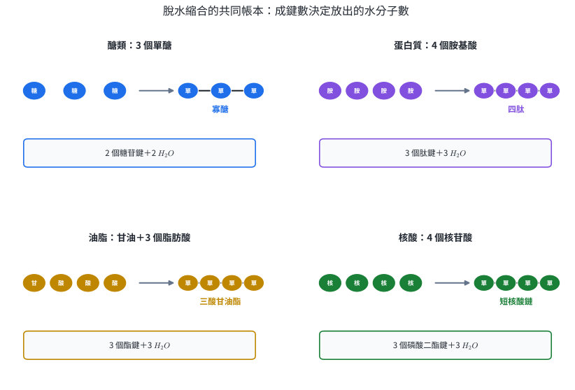
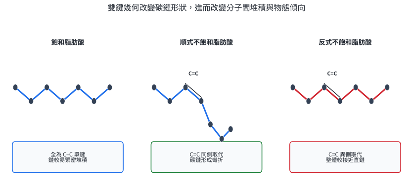
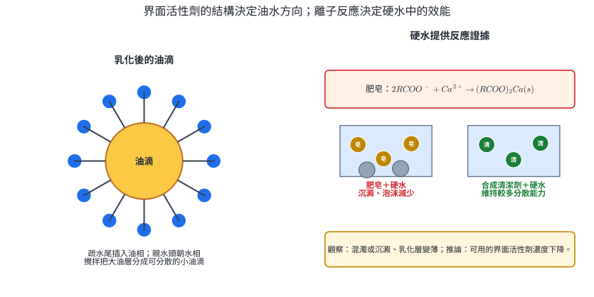
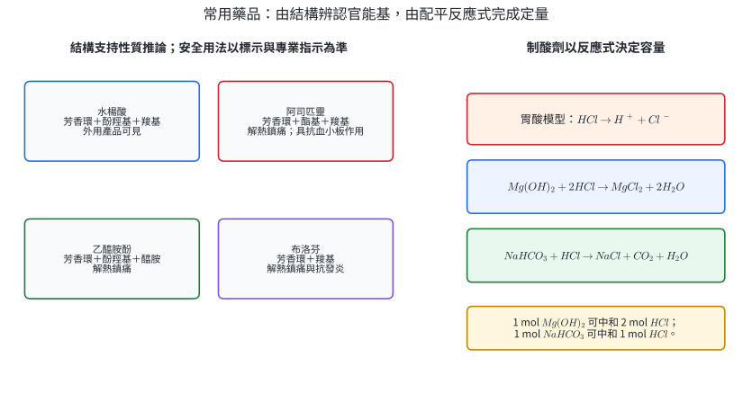
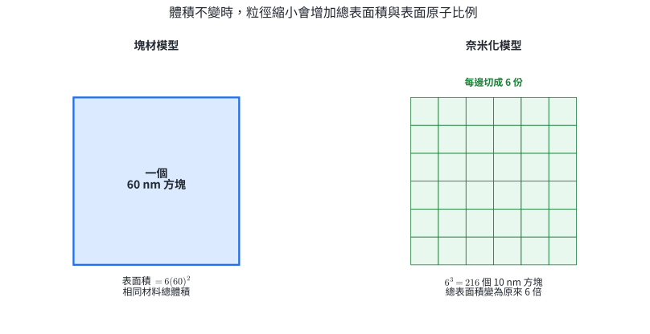
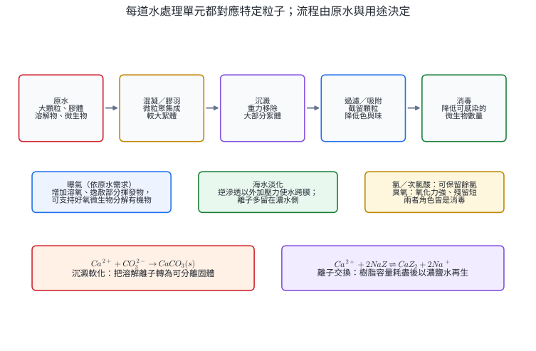
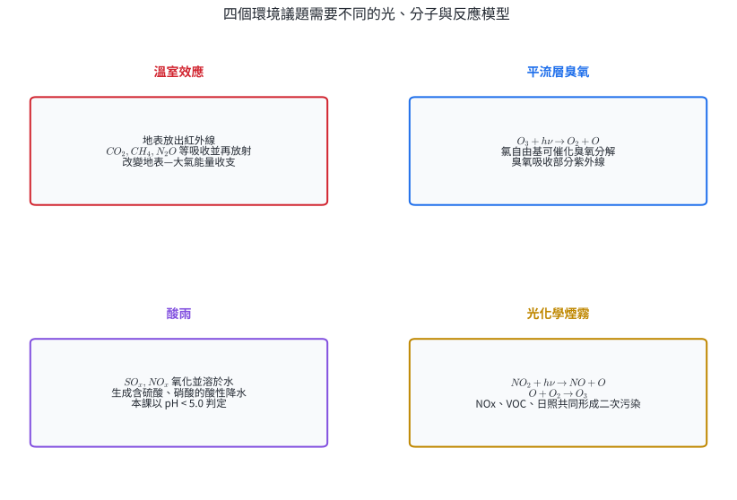
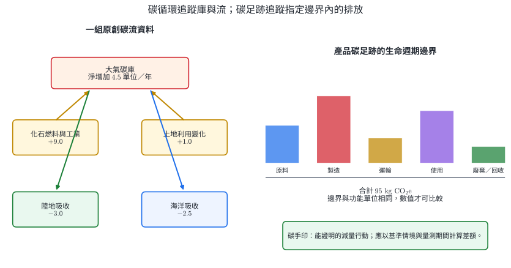
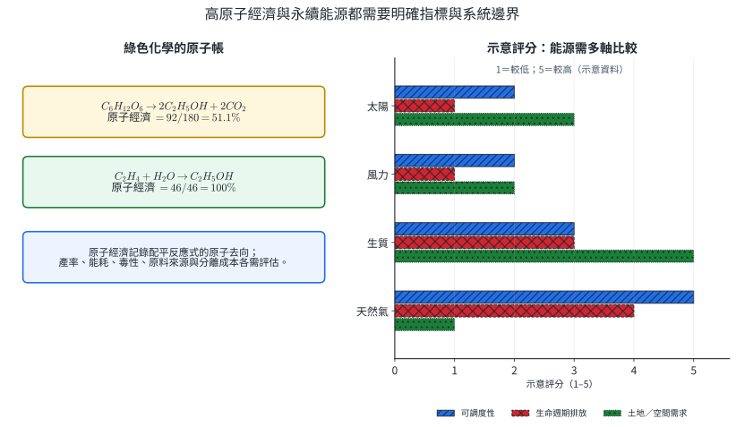

# 必化-4 生活化學

生活化學把前三章的粒子觀、化學式、莫耳、溶液與反應連到可量測的生活資料。食品成分需要由分子結構與水解反應判讀；藥品與水處理需要由官能基、酸鹼與沉澱反應判讀；污染與能源則需要先畫清楚物質流、能量流及計算邊界。

本章的共同方法有三步：辨認系統中的物質與尺度；用守恆、鍵結或反應式連接原因與結果；最後檢查資料的單位、邊界與證據強度。產品名稱、天然來源或宣傳用語只提供線索，化學判斷仍建立在組成、結構、反應與量測資料上。

::: learning-map
### 本章問題與能力

1. 醣類、蛋白質、油脂與核酸的單體、連接方式與三維結構，如何決定水解、堆積與生物功能？
2. 如何由界面活性劑的兩親結構解釋乳化、膠束、去汙與硬水沉澱，並用實驗區分觀察和推論？
3. 常用藥品、奈米材料與淨水單元的效果，如何由官能基、反應係數、表面積與粒子去向定量判讀？
4. 如何把空氣、水體與土壤資料放入反應路徑和傳輸路徑，提出可驗證的汙染來源與處理方案？
5. 如何分別使用原子經濟性、實際產率、能量效率與生命週期足跡，比較製程與能源方案？

本章完成後，能由結構圖、配平式、單位化資料與系統邊界建立守恆關係，並寫出證據支持的化學結論。
:::

## 1. 生活中常見的有機物質

有機化合物以碳的化合物為主，常含氫、氧、氮、硫或磷。高中分類通常把 $CO$、$CO_2$、碳酸鹽、碳酸氫鹽、氰化物與碳化物等列入無機物。1828 年，烏勒由氰酸銨製得尿素，說明有機化合物可以由實驗室反應合成；分類依化學組成與結構，不依物質是否來自生物。

### 1.1 醣類：單體、縮合與水解

**醣類**常由碳、氫、氧組成，許多醣可寫成 $C_m(H_2O)_n$，因此也稱碳水化合物。這個寫法只描述原子比例；去氧核糖 $C_5H_{10}O_4$ 等醣不符合該比例，$H_2O$ 也不是以水分子形式存在於醣中。

醣類依可水解出的單醣數分類：

- **單醣：**無法再水解成更小醣類的基本單元。葡萄糖、果糖與半乳糖皆為 $C_6H_{12}O_6$；核糖為 $C_5H_{10}O_5$，去氧核糖為 $C_5H_{10}O_4$。
- **雙醣：**兩個單醣脫去一個水分子形成。蔗糖水解得葡萄糖與果糖；麥芽糖得兩個葡萄糖；乳糖得葡萄糖與半乳糖。
- **寡醣：**本課採 3–9 個單醣單元的分類範圍。
- **多醣：**大量單醣單元形成的聚合物。澱粉與肝醣用於儲能，纖維素提供植物細胞壁結構，幾丁質存在於節肢動物外骨骼與真菌細胞壁。

線性縮合若由 $n$ 個單體接成一條鏈，形成 $n-1$ 個連接鍵並放出 $n-1$ 個水分子。水解是反向過程：每斷一個連接鍵消耗一個水分子。一條含 $n$ 個葡萄糖單元的有限鏈可寫成

$$
nC_6H_{12}O_6\rightarrow C_{6n}H_{10n+2}O_{5n+1}+(n-1)H_2O.
$$

聚合物簡式 $(C_6H_{10}O_5)_n$ 用來表示重複單元，省略了鏈兩端的原子；計算有限鏈的分子式與水分子數時，使用上述原子守恆式。

澱粉螺旋可與碘／碘化鉀溶液中的多碘物種形成深藍色複合體。顏色是澱粉存在的證據；它不表示樣品中的所有醣類都會呈色。食品製程可利用這個反應追蹤澱粉糊化或水解是否完成。

{width=98%}

::: worked-example
### 示範 1｜由單醣數求寡醣分子式

五個葡萄糖分子縮合成一條寡醣鏈。求放出的水分子數與產物分子式。

五個單體形成四個連接鍵，因此放出 $4H_2O$：

$$
5C_6H_{12}O_6-4H_2O=C_{30}H_{52}O_{26}.
$$

碳原子保持 $5\times6=30$；氫與氧分別減少 $8$ 與 $4$，符合脫水縮合的原子守恆。
:::

::: worked-example
### 示範 2｜由雙醣水解追蹤產物莫耳數

混合物含 $0.100\ \mathrm{mol}$ 麥芽糖與 $0.060\ \mathrm{mol}$ 蔗糖，完全水解後求葡萄糖與果糖的莫耳數。

$$
\begin{aligned}
\text{麥芽糖}+H_2O&\rightarrow2\text{葡萄糖},\\
\text{蔗糖}+H_2O&\rightarrow\text{葡萄糖}+\text{果糖}.
\end{aligned}
$$

麥芽糖提供 $0.200\ \mathrm{mol}$ 葡萄糖；蔗糖提供 $0.060\ \mathrm{mol}$ 葡萄糖與 $0.060\ \mathrm{mol}$ 果糖。因此

$$
n(\text{葡萄糖})=0.260\ \mathrm{mol},\qquad n(\text{果糖})=0.060\ \mathrm{mol}.
$$
:::

### 練習 1.1

1. 將葡萄糖、蔗糖、果寡醣與澱粉依單醣、雙醣、寡醣、多醣分類。
2. 求葡萄糖 $C_6H_{12}O_6$ 的碳質量百分率。
3. 九個果糖縮合成一條鏈，求放出的水分子數與產物分子式。
4. 樣品 A 加碘液呈深藍色；樣品 B 無明顯變色。寫出可直接支持的結論，並指出還需要哪種證據才能判斷 B 是否含葡萄糖。

### 練習 1.1 解析

1. 葡萄糖為單醣；蔗糖為雙醣；果寡醣為寡醣；澱粉為多醣。
2. $M(C_6H_{12}O_6)=180\ \mathrm{g\,mol^{-1}}$，其中碳為 $72\ \mathrm g$，故碳百分率為 $72/180\times100\%=40.0\%$。
3. 線性鏈形成 $9-1=8$ 個連接鍵，放出 $8H_2O$。$9C_6H_{12}O_6-8H_2O=C_{54}H_{92}O_{46}$。
4. A 的呈色支持「A 含澱粉」。B 的結果只表示未檢出可呈色的澱粉；判斷葡萄糖可另做具有選擇性的還原糖檢驗或儀器分析，並配置陽性與陰性對照。

### 1.2 蛋白質：胺基酸、肽鍵與變性

構成蛋白質的常見單體是 **$\alpha$-胺基酸**，其胺基 $-NH_2$ 與羧基 $-COOH$ 連在同一個 $\alpha$ 碳上，側鏈 $R$ 決定胺基酸的性質。兩個胺基酸的羧基與胺基脫水形成 **肽鍵** $-CO-NH-$；兩個、三個與多個胺基酸形成二肽、三肽與多肽。

蛋白質是具有特定三維構形與生物功能的多肽。教材有時以胰島素相對分子質量約 5808 作題型分界；實際科學分類同時考慮鏈長、摺疊與功能，沒有通用的單一分子量界線。

**蛋白質變性**是高溫、極端 pH、有機溶劑、某些重金屬離子或輻射等條件改變維持高階結構的作用力，使天然構形與活性改變。肽鍵通常仍保留，因此變性與完全水解是不同層級的變化。蛋白煮熟凝固、酒精使蛋白析出、酵素離開適宜溫度或 pH 後活性降低，都可用構形改變解釋。

多數含芳香族胺基酸的蛋白質與濃硝酸加熱可呈黃色，稱為黃蛋白反應。濃硝酸具強腐蝕性與氧化性；示範需在教師監督與通風櫥中進行，使用護目鏡、實驗衣及耐化學手套，酸性廢液依實驗室規範回收。食品或皮膚不作此試驗。

蛋白質結構與功能的連結可用於解釋烹調、消毒、酵素製程及疾病檢測。實驗記錄要分開寫：白色凝塊、透光度下降是觀察；「蛋白質高階結構改變並聚集」是由模型得到的推論。

::: worked-example
### 示範 3｜二肽的分子式與莫耳質量

甘胺酸 $C_2H_5NO_2$ 與丙胺酸 $C_3H_7NO_2$ 縮合成一個二肽。求分子式與莫耳質量。

兩個胺基酸形成一個肽鍵，放出一個水分子：

$$
C_2H_5NO_2+C_3H_7NO_2-H_2O=C_5H_{10}N_2O_3.
$$

$$
M=5(12)+10(1)+2(14)+3(16)=146\ \mathrm{g\,mol^{-1}}.
$$
:::

::: worked-example
### 示範 4｜由活性資料判斷變性範圍

某酵素在 pH 7.0 下反應 5 分鐘，量得相對活性如下：

| 溫度／°C | 20 | 35 | 50 | 70 |
|---:|---:|---:|---:|---:|
| 相對活性／% | 42 | 100 | 63 | 4 |

資料顯示 35 °C 時活性最高；70 °C 時只剩 4%。在其他條件相同且量測可靠的前提下，可推論高溫使酵素構形大幅改變。單一資料組只能找出受測範圍內的最佳條件；更精確的最適溫度需增加溫度點與重複量測。
:::

### 練習 1.2

1. 六個胺基酸形成一條六肽，形成幾個肽鍵並放出幾個水分子？
2. 三個甘胺酸 $C_2H_5NO_2$ 形成三肽，求分子式。
3. 生蛋白透明，加熱後形成白色凝塊。分別寫出觀察與粒子層次推論。
4. 某酵素在 pH 2、5、7、10 的相對活性依序為 95%、38%、8%、1%。判斷受測範圍內的最適 pH，並說明大量制酸劑提高胃內 pH 後可能如何影響此酵素。

### 練習 1.2 解析

1. 線性六肽有 $6-1=5$ 個肽鍵，縮合放出 5 個水分子。
2. $3C_2H_5NO_2-2H_2O=C_6H_{11}N_3O_4$。
3. 觀察為透明液體變成白色凝塊；推論為加熱改變蛋白質高階結構，使分子聚集並散射光。
4. 受測範圍內 pH 2 活性最高。制酸劑使 pH 上升，若其他條件相同，活性會依資料趨勢下降；實際藥物使用依醫療指示。

### 1.3 油脂：酯鍵、飽和度與分子幾何

**油脂**主要是三酸甘油酯：一個甘油分子的三個羥基與三個脂肪酸的羧基酯化，形成三個酯鍵並放出三個水分子。三酸甘油酯由固定數量的甘油與脂肪酸組裝，屬大分子酯類，通常不列為聚合物。

$$
\text{甘油}+3\text{脂肪酸}\rightleftharpoons\text{三酸甘油酯}+3H_2O.
$$

酸或酵素可促進油脂水解；強鹼水解稱為 **皂化**，生成甘油與脂肪酸鹽：

$$
\text{三酸甘油酯}+3NaOH\rightarrow\text{甘油}+3RCOONa.
$$

脂肪酸依碳鏈中的鍵型分類。飽和脂肪酸的碳鏈只有 C–C 單鍵；不飽和脂肪酸含一個以上 C=C。天然不飽和脂肪酸常見順式幾何，使碳鏈彎折、堆積較鬆；反式幾何較接近直鏈。分子形狀改變分子間作用力與熔點趨勢，因此常溫下植物油常呈液態，動物脂常呈固態；魚油、椰子油等例外提醒我們以實際脂肪酸組成判斷。

{width=98%}

食品標示可直接提供每份總脂肪、飽和脂肪與反式脂肪的質量。結構模型能說明物態與反應性趨勢；健康風險評估仍需結合攝取量與醫學證據。

::: worked-example
### 示範 5｜三酸甘油酯的縮合分子式

甘油 $C_3H_8O_3$ 與三個硬脂酸 $C_{18}H_{36}O_2$ 形成三硬脂酸甘油酯。求產物分子式。

形成三個酯鍵，放出 $3H_2O$：

$$
C_3H_8O_3+3C_{18}H_{36}O_2-3H_2O=C_{57}H_{110}O_6.
$$

氧原子由 $3+3\times2=9$ 減為 6，正好對應移去三個水分子。
:::

::: worked-example
### 示範 6｜由雙鍵數求氫化需求

每個油酸分子含一個 C=C。$0.500\ \mathrm{mol}$ 油酸完全氫化為飽和脂肪酸時，求消耗的 $H_2$ 莫耳數與質量。

$$
C_{18}H_{34}O_2+H_2\rightarrow C_{18}H_{36}O_2.
$$

故消耗 $0.500\ \mathrm{mol}$ $H_2$，質量為 $m=(0.500)(2.016)=1.01\ \mathrm g$。
:::

### 練習 1.3

1. 一個三酸甘油酯完全皂化需要幾莫耳 $NaOH$？生成幾莫耳脂肪酸鈉？
2. 甘油 $C_3H_8O_3$ 與三個軟脂酸 $C_{16}H_{32}O_2$ 縮合，求產物分子式。
3. 兩種 $C_{18}H_{34}O_2$ 脂肪酸具有相同分子式，一種碳鏈彎折，另一種較直。指出造成差異的結構條件及較可能緊密堆積者。
4. 某食品每 $100\ \mathrm g$ 含總脂肪 $20.0\ \mathrm g$、飽和脂肪 $6.0\ \mathrm g$、反式脂肪 $0.20\ \mathrm g$。食用 $35.0\ \mathrm g$ 時，各攝取多少克？

### 練習 1.3 解析

1. 三個酯鍵各消耗一個 $OH^-$，故需 3 mol $NaOH$，生成 3 mol 脂肪酸鈉與 1 mol 甘油。
2. $C_3H_8O_3+3C_{16}H_{32}O_2-3H_2O=C_{51}H_{98}O_6$。
3. 差異來自 C=C 的順式與反式幾何。反式鏈較直，通常較易緊密堆積。
4. 乘以 $35.0/100$：總脂肪 $7.00\ \mathrm g$、飽和脂肪 $2.10\ \mathrm g$、反式脂肪 $0.070\ \mathrm g$。

### 1.4 核酸：核苷酸、序列與資訊

**核苷酸**由磷酸、五碳糖與含氮鹼基組成。移去磷酸後的「糖＋鹼基」稱為核苷。核苷酸以磷酸二酯鍵連成有方向性的核酸鏈，鹼基排列順序承載資訊。

- **DNA（去氧核糖核酸）：**糖為去氧核糖，常見鹼基為 A、T、C、G；主要功能是長期保存遺傳資訊。
- **RNA（核糖核酸）：**糖為核糖，常見鹼基為 A、U、C、G；多種 RNA 參與資訊傳遞、蛋白質合成與反應調控。

線性單鏈含 $n$ 個核苷酸時，相鄰單元間有 $n-1$ 個磷酸二酯連接。DNA 常為兩條互補鏈；題目若問整個雙股片段的核苷酸總數、每條鏈長或鹼基對數，三者需分開記錄。例如 500 個鹼基對含 1000 個核苷酸。

序列檢測、親緣分析與病原體辨識都利用核酸的鹼基順序。檢測到一段序列是「樣品中有該核酸片段」的證據；生物是否具有感染性還要結合樣品品質、活性與臨床資料。

::: worked-example
### 示範 7｜由組成辨認 DNA 與 RNA

樣品 X 的核苷酸含磷酸、去氧核糖及 A、T、C、G；樣品 Y 含磷酸、核糖及 A、U、C、G。X 的糖為去氧核糖且含 T，屬 DNA；Y 的糖為核糖且含 U，屬 RNA。判斷同時使用糖與鹼基兩項結構證據。
:::

::: worked-example
### 示範 8｜核酸鏈的連接數

一條線性 RNA 含 1200 個核苷酸。相鄰核苷酸間的磷酸二酯連接數為

$$
1200-1=1199.
$$

每斷一個連接需一個水分子，完整水解至少消耗 1199 個水分子。
:::

### 練習 1.4

1. 列出一個核苷酸的三個組成部分。
2. 一段雙股 DNA 有 750 個鹼基對，求核苷酸總數。
3. 一條含 80 個核苷酸的線性單鏈有幾個相鄰連接？
4. 樣品只驗出 C、H、O、N、P 五種元素。說明這項資料能支持何種判斷，以及仍缺少什麼結構證據才能確認是核酸。

### 練習 1.4 解析

1. 磷酸、五碳糖、含氮鹼基。
2. 每個鹼基對含兩個核苷酸，總數為 $750\times2=1500$。
3. $80-1=79$ 個相鄰連接。
4. 元素組成與核酸相容，也與其他含磷含氮化合物相容。確認核酸還需核苷酸組成、糖與鹼基種類、序列或專一性分析證據。

### 1.5 界面活性劑：兩親結構、乳化與硬水

**界面活性劑**具有親水頭與疏水／親油尾，能吸附在油水或固液界面，降低形成新界面所需的能量。攪拌把油分成小滴時，疏水尾插入油相、親水頭朝向水相；界面活性劑包覆油滴形成較穩定的分散系，使油汙能隨水帶走。

肥皂常為長鏈脂肪酸鈉鹽或鉀鹽，例如 $C_{17}H_{35}COO^-Na^+$。合成清潔劑可使用硫酸酯鹽、磺酸鹽等親水頭。含 $Ca^{2+}$、$Mg^{2+}$ 的硬水會使脂肪酸根形成難溶鹽：

$$
2RCOO^-(aq)+Ca^{2+}(aq)\rightarrow(RCOO)_2Ca(s).
$$

沉澱消耗可參與乳化的肥皂分子，因此泡沫與去汙能力下降；許多合成清潔劑在硬水中較能維持效能。

{width=98%}

**界面活性劑效應實驗。**兩支試管各含等量染色植物油與水。A 管加入烷基硫酸鹽清潔劑，B 管加入脂肪酸鈉肥皂；搖勻記錄乳化層高度，再各加入等量 $0.10\ \mathrm M$ $MgCl_2$，比較混濁、沉澱與分層時間。

| 階段 | 可記錄的觀察 | 可檢驗的推論 |
|---|---|---|
| 油＋水搖勻後靜置 | 很快分成兩層 | 未形成足夠穩定的界面膜 |
| 加界面活性劑並搖勻 | 乳白或帶色乳化層維持較久 | 油滴被兩親分子包覆 |
| 肥皂管加入 $Mg^{2+}$ | 混濁／沉澱增加、乳化層較快縮小 | 脂肪酸鎂生成並消耗肥皂 |

操作時配戴護目鏡、實驗衣與手套，試管口朝離人員方向。植物油及油溶性色素收集於廢油容器；含界面活性劑與鎂鹽的水相依場域規定分類，經教師確認後處理。觀察表先寫顏色、層數、沉澱與時間，再以反應式作推論。

::: worked-example
### 示範 9｜硬水消耗肥皂的計量

$200.0\ \mathrm{mL}$ 水樣含 $0.0100\ \mathrm M$ $Ca^{2+}$。若以 $0.0500\ \mathrm M$ 脂肪酸鈉溶液完全沉澱其中的 $Ca^{2+}$，求理論所需體積。

$$
n(Ca^{2+})=(0.0100)(0.2000)=0.00200\ \mathrm{mol}.
$$

反應比為 $2RCOO^-:1Ca^{2+}$，需肥皂 $0.00400\ \mathrm{mol}$，故

$$
V=\frac{0.00400}{0.0500}=0.0800\ \mathrm L=80.0\ \mathrm{mL}.
$$
:::

::: worked-example
### 示範 10｜由實驗資料選擇清潔劑

| 清潔液 | 軟水泡沫／cm | 硬水泡沫／cm |
|---|---:|---:|
| P | 8.2 | 1.4 |
| Q | 7.8 | 7.0 |

P 在硬水中的泡沫高度保留 $1.4/8.2\approx17\%$，顯示有效成分大量被消耗，行為符合肥皂。Q 保留 $7.0/7.8\approx90\%$，較適合硬水。泡沫高度是操作性指標；完整去汙比較還應控制油汙量、攪拌方式、溫度與清洗時間。
:::

### 練習 1.5

1. 畫出水中油滴外圍的界面活性劑方向，標示親水頭與親油尾。
2. 寫出 $Mg^{2+}$ 與肥皂陰離子 $RCOO^-$ 的淨離子反應式。
3. $0.0030\ \mathrm{mol}$ $Mg^{2+}$ 最多消耗幾莫耳 $RCOO^-$？
4. 某試管加入清潔劑後乳化，加入 $CaCl_2$ 後出現白色沉澱並迅速分層。分別寫出觀察與推論。
5. 說明蛋黃卵磷脂可使油與醋形成乳化醬的結構原因。

### 練習 1.5 解析

1. 親油尾朝向油滴內部，親水頭朝向外側水相；這個方向同時滿足兩端與偏好相的作用。
2. $2RCOO^-(aq)+Mg^{2+}(aq)\rightarrow(RCOO)_2Mg(s)$。
3. 反應比為 2：1，故消耗 $0.0060\ \mathrm{mol}$ $RCOO^-$。
4. 觀察為出現白色沉澱且分層時間縮短；推論為 $Ca^{2+}$ 與脂肪酸根形成難溶鹽，使水相中可用界面活性劑濃度下降。
5. 卵磷脂具有親水區與親油區，可排列在油水界面並包覆油滴，降低油滴聚合回大油層的速率。

## 2. 科學與人文

化學技術改變藥物、材料、用水與環境品質。效益與風險需要使用同一套證據框架：物質如何作用、有效條件為何、暴露量多大、產物最後進入哪個環境區室，以及量測結果能支持多強的結論。

### 2.1 常用藥品：結構、作用類別與反應容量

**藥品**含有產生預期作用的有效成分，也可能含協助成形、保存、溶解或釋放的賦形劑。相同商品類型可能含不同有效成分；判讀時讀取成分名稱、每單位含量、使用限制與警語。

本課常見三類藥品：

- **解熱鎮痛藥：**阿司匹靈、乙醯胺酚與布洛芬都可用於解熱鎮痛，作用特性與適用限制不同。阿司匹靈具有抗血小板作用；乙醯胺酚過量會造成嚴重肝傷害；布洛芬屬非類固醇抗發炎藥。實際使用依產品標示、藥師或醫師指示。
- **抗生素：**能殺死細菌或抑制細菌生長的藥物，青黴素是常見例子；研究中也會由共生菌尋找具抑菌作用的新分子。抗生素針對特定微生物作用；完整療程與適應症由專業診斷決定。用藥造成的選汰壓力會增加抗藥菌比例，因此抗生素管理也是演化與公共衛生問題。
- **制酸劑：**以弱鹼性成分中和胃酸，常見 $Mg(OH)_2$、$Al(OH)_3$、$NaHCO_3$ 或 $CaCO_3$。每莫耳能中和多少酸，由配平反應式決定。

水楊酸、阿司匹靈、乙醯胺酚與布洛芬都含芳香環，但羧基、酯基、酚羥基與醯胺的組合不同。官能基可用來推測酸鹼性、溶解度與可能反應；療效與安全性還需藥理、劑量與臨床證據。

{width=98%}

::: worked-example
### 示範 11｜氫氧化鎂的理論中和容量

一錠制酸劑含 $0.583\ \mathrm g$ $Mg(OH)_2$。取 $M=58.3\ \mathrm{g\,mol^{-1}}$，求理論可中和的 $HCl$ 莫耳數。

$$
Mg(OH)_2+2HCl\rightarrow MgCl_2+2H_2O.
$$

$$
n\bigl(Mg(OH)_2\bigr)=\frac{0.583}{58.3}=0.0100\ \mathrm{mol}.
$$

反應係數比為 1：2，故可中和 $0.0200\ \mathrm{mol}$ $HCl$。這是由有效成分含量得到的理論容量，藥物實際作用還受溶解、反應速率與生理條件影響。
:::

::: worked-example
### 示範 12｜由產品資料辨認有效成分角色

某沖泡藥每包標示：乙醯胺酚 $500\ \mathrm{mg}$、碳酸氫鈉 $350\ \mathrm{mg}$、檸檬酸 $300\ \mathrm{mg}$，加水後有氣泡。判斷解熱鎮痛成分與氣泡來源。

乙醯胺酚是解熱鎮痛有效成分。碳酸氫根與檸檬酸提供的 $H^+$ 反應：

$$
HCO_3^-+H^+\rightarrow CO_2(g)+H_2O(l).
$$

氣泡是 $CO_2$ 的觀察證據，不能由氣泡量直接推得乙醯胺酚含量。
:::

### 練習 2.1

1. $0.0150\ \mathrm{mol}$ $NaHCO_3$ 理論可中和多少莫耳 $HCl$？同時生成多少莫耳 $CO_2$？
2. $0.780\ \mathrm g$ $Al(OH)_3$ 可中和多少莫耳 $HCl$？取 $M\bigl(Al(OH)_3\bigr)=78.0\ \mathrm{g\,mol^{-1}}$。
3. 標示只有「止痛藥 500 mg」，缺少有效成分名稱。說明還需要哪兩項資料才能作化學與安全判讀。
4. 細菌培養皿加入抗生素後出現無菌圈。寫出直接觀察、可支持的推論，以及需要控制的變因。

### 練習 2.1 解析

1. $NaHCO_3:HCl:CO_2=1:1:1$，故中和 $0.0150\ \mathrm{mol}$ $HCl$ 並生成 $0.0150\ \mathrm{mol}$ $CO_2$。
2. $Al(OH)_3+3HCl\rightarrow AlCl_3+3H_2O$。$n\bigl(Al(OH)_3\bigr)=0.780/78.0=0.0100\ \mathrm{mol}$，可中和 $0.0300\ \mathrm{mol}$ $HCl$。
3. 至少需要有效成分的化學名稱與每單位含量；完整判讀還需劑型、適用限制、交互作用與警語。
4. 觀察為抗生素周圍沒有可見菌落；推論為該濃度與條件下細菌生長受到抑制。需控制菌種、接種量、培養基、藥量、擴散時間、溫度與培養時間。

### 2.2 奈米科技：尺度、表面積與性質改變

**奈米材料**通常指外部尺寸、內部結構或表面結構至少一個尺度約在 $1$–$100\ \mathrm{nm}$ 的材料。$1\ \mathrm{nm}=10^{-9}\ \mathrm m$。材料縮小到奈米尺度時，總表面積／體積比大幅增加，表面原子所占比例上升；部分材料還會出現與電子能階相關的尺寸效應。因此相同化學式的奈米材料與塊材可有不同顏色、反應速率、催化性或電性。

對邊長為 $a$ 的立方粒子，表面積／體積比為

$$
\frac{A}{V}=\frac{6a^2}{a^3}=\frac{6}{a}.
$$

粒徑縮為原來的 $1/k$，固定總體積下的總表面積變為 $k$ 倍。這個幾何關係能直接解釋吸附與表面反應機會增加。

{width=92%}

奈米級 $TiO_2$ 在合適光照下可產生電子與電洞，進一步形成具氧化還原能力的活性物種，分解部分有機物並抑制微生物。光觸媒需要對應波長與表面接觸；黑暗中缺少光生載子，效果顯著降低。奈米銀可釋出 $Ag^+$ 而抑菌；奈米碳管具有低密度、高強度與特定導電性，可用於複合材料、儲能與感測。

奈米化也增加材料進入生物與環境的可能路徑。產品評估需記錄粒徑分布、表面修飾、溶出離子、暴露量與回收方式；「奈米」是尺度資訊，不是自動的安全或效能保證。

::: worked-example
### 示範 13｜固定體積下的表面積倍率

把一個邊長 $60\ \mathrm{nm}$ 的立方粒子切成邊長 $10\ \mathrm{nm}$ 的小立方粒子。求小粒子數與總表面積倍率。

每邊切成 $60/10=6$ 份，所以粒子數為

$$
6^3=216.
$$

表面積倍率可由 $A/V=6/a$ 比較：

$$
\frac{(A/V)_{10}}{(A/V)_{60}}=\frac{60}{10}=6.
$$

總體積不變，總表面積變成 6 倍。
:::

::: worked-example
### 示範 14｜由比表面積求可用表面

塊材吸附劑的比表面積為 $2.5\ \mathrm{m^2\,g^{-1}}$，奈米化後為 $85\ \mathrm{m^2\,g^{-1}}$。各取 $4.0\ \mathrm g$，求總表面積並比較。

$$
A_{\text{塊材}}=(2.5)(4.0)=10\ \mathrm{m^2},
$$

$$
A_{\text{奈米}}=(85)(4.0)=340\ \mathrm{m^2}.
$$

奈米樣品提供 34 倍表面。若每單位面積的活性位相同，表面反應容量可增加；實際速率還受孔道、團聚與傳質影響。
:::

### 練習 2.2

1. 將 $2.5\ \mathrm{\mu m}$ 換算成 nm，判斷是否落在 $1$–$100\ \mathrm{nm}$。
2. 同體積材料的粒徑由 $80\ \mathrm{nm}$ 降為 $20\ \mathrm{nm}$，估算總表面積倍率。
3. 奈米 $TiO_2$ 樣品在紫外光下使染料濃度下降，黑暗對照幾乎不變。寫出資料支持的因果條件。
4. 奈米銀襪洗滌液驗出銀。列出評估環境風險至少需要的三項後續資料。

### 練習 2.2 解析

1. $2.5\ \mathrm{\mu m}=2500\ \mathrm{nm}$，高於此處的奈米尺度上限。
2. 倍率為 $80/20=4$。
3. 在其他條件相同時，光照是此 $TiO_2$ 系統產生明顯分解效果的必要受測條件；資料尚需空白光解對照才能分離染料自行光解的貢獻。
4. 可量測銀的總濃度與化學型態、粒徑／是否團聚、排放量、環境持久性、生物可利用性與毒性劑量反應。

### 2.3 水的淨化：處理單元對應粒子種類

**淨水**是依原水組成與用水目的，移除或降低顆粒、溶解物與微生物至合適標準。單一處理法只針對部分物質，實際流程由多個功能單元組合。

- **混凝與膠羽：**明礬等混凝劑形成帶電或膠狀物種，使微細懸浮粒子失穩並聚集成較大絮體。
- **沉澱與過濾：**沉澱以重力移除絮體；砂濾等濾床截留剩餘顆粒。活性碳的大表面可吸附部分造成色、味的有機物。
- **曝氣：**依原水需求增加溶氧、逸散部分揮發物，並支持好氧微生物分解有機物。
- **消毒：**氯、次氯酸鹽或臭氧以氧化作用降低可感染微生物。氯系消毒可保留餘氯；臭氧反應快、殘留短。

{width=98%}

**海水淡化**可用蒸餾或逆滲透。逆滲透在海水側施加高於滲透壓的壓力，使水跨過半透膜到淡水側，多數離子留在濃水側。產水率、能耗、膜污染與濃水處置是工程設計的重要條件。

**硬水**含較多 $Ca^{2+}$、$Mg^{2+}$。含碳酸氫鹽的暫時硬水可經加熱形成碳酸鹽鍋垢；含氯化物或硫酸鹽的永久硬水需以沉澱或離子交換等方法處理。加入 $Na_2CO_3$ 可生成 $CaCO_3$、$MgCO_3$ 沉澱；鈉型陽離子交換樹脂以 $NaZ$ 表示時：

$$
Ca^{2+}+2NaZ\rightleftharpoons CaZ_2+2Na^+.
$$

樹脂容量接近飽和後，以濃 $NaCl$ 溶液提高 $Na^+$ 濃度，使平衡朝再生方向移動。

生活汙水的一級處理移除大固體與可沉降物；二級生物處理由微生物分解可生物降解的有機物，再沉降污泥。含重金屬或特定有機物的工業廢水需依污染物性質增加沉澱、氧化還原、吸附、膜分離等處理。回收水用途由處理程度與水質標準決定。

水質實驗使用潔淨容器與空白樣，記錄採樣地點、時間與保存條件。來源不明的水樣不入口；產生含重金屬沉澱或消毒劑的廢液，依危害分類回收。

::: worked-example
### 示範 15｜由水質問題選擇處理單元

某原水含大量膠體、腐植質造成的色味與細菌。依功能安排處理：先混凝／膠羽使膠體聚集，再沉澱與過濾移除顆粒；以活性碳吸附部分色味物質；最後消毒降低微生物風險。若原水還含大量溶解鹽，需另加逆滲透或其他除鹽單元。每一步都對應不同粒子，流程順序讓後段負荷降低。
:::

::: worked-example
### 示範 16｜沉澱軟化與離子交換計量

$1.00\ \mathrm L$ 水樣含 $2.00\ \mathrm{mmol}$ $Ca^{2+}$ 與 $1.00\ \mathrm{mmol}$ $Mg^{2+}$。以 $Na_2CO_3$ 完全沉澱，求最低莫耳數與質量；取 $M(Na_2CO_3)=106.0\ \mathrm{g\,mol^{-1}}$。

每莫耳二價離子需一莫耳 $CO_3^{2-}$：

$$
n(Na_2CO_3)=2.00+1.00=3.00\ \mathrm{mmol}.
$$

$$
m=(0.00300)(106.0)=0.318\ \mathrm g.
$$

若改以鈉型樹脂交換，總共釋出 $2(3.00)=6.00\ \mathrm{mmol}$ $Na^+$。
:::

### 練習 2.3

1. 說明混凝、沉澱、過濾與消毒各主要處理哪一類對象。
2. 水廠曝氣後溶氧增加且有機物濃度隨時間下降。寫出觀察與機制推論。
3. $0.250\ \mathrm{mol}$ $Ca^{2+}$ 完全交換到鈉型樹脂時，釋出多少莫耳 $Na^+$？再生理論至少需多少莫耳 $NaCl$ 提供等量 $Na^+$？
4. $500\ \mathrm{mL}$ 水樣含 $0.0040\ \mathrm M$ $Mg^{2+}$，沉澱所需 $CO_3^{2-}$ 的莫耳數是多少？
5. 比較氯與臭氧消毒後在配水系統中的持續作用。
6. 工業廢水含 $Cu^{2+}$，加入 $OH^-$ 後生成藍色沉澱。寫出淨離子式，並說明沉澱後仍需哪個分離步驟。

### 練習 2.3 解析

1. 混凝使膠體失穩聚集；沉澱以重力移除較大絮體；過濾截留剩餘顆粒；消毒降低可感染微生物數量。
2. 觀察為溶氧上升、有機物指標下降；在有好氧微生物且其他條件受控時，可推論曝氣支持微生物氧化有機物。
3. 係數為 $1Ca^{2+}:2Na^+$，釋出 $0.500\ \mathrm{mol}$ $Na^+$；理論需至少 $0.500\ \mathrm{mol}$ $NaCl$ 提供等量鈉離子，實務再生會用過量濃鹽水推動平衡。
4. $n=(0.0040)(0.500)=0.0020\ \mathrm{mol}$，反應比 1：1，需 $0.0020\ \mathrm{mol}$ $CO_3^{2-}$。
5. 氯系消毒可在水中留下餘氯，對輸送途中再污染提供持續保護；臭氧反應快且殘留短，後段可能需要另一種維持性消毒策略。
6. $Cu^{2+}(aq)+2OH^-(aq)\rightarrow Cu(OH)_2(s)$。生成沉澱後以沉降、過濾或固液分離移除，污泥依重金屬廢棄物規範處理。

### 2.4 空氣汙染、碳循環與碳足跡

**一次污染物**由污染源直接排放，例如 $SO_2$、$NO$、CO 與粒狀物；**二次污染物**由大氣反應生成，例如對流層臭氧與部分細懸浮微粒。污染機制可分成四條主線：

- 溫室氣體吸收並再放射地表紅外線，改變地表—大氣能量收支。$CO_2$、$CH_4$、$N_2O$、水蒸氣與部分含氟氣體皆能參與；比較人為影響時要同時看濃度變化、壽命與吸收能力。
- 平流層臭氧吸收部分紫外線。氟氯碳化物受紫外線分解產生氯自由基，能催化臭氧分解；臭氧層耗損與全球暖化是兩套機制。
- $SO_x$、$NO_x$ 經氧化並溶入水，形成酸性降水。自然雨水因 $CO_2$ 溶解約為 pH 5.6；本課依教材操作標準，把 pH 低於 5.0 的降水列為酸雨。
- NOx 與揮發性有機物在日照下形成光化學煙霧。$NO_2$ 光解產生 O，O 與 $O_2$ 形成對流層 $O_3$；VOC 參與的自由基循環會促進臭氧與其他二次污染物累積。

{width=98%}

**PM2.5** 是空氣動力學直徑小於或等於 $2.5\ \mathrm{\mu m}$ 的粒狀物，可含固體與液滴、有機物與無機物。小粒子能深入呼吸系統，表面也可攜帶其他污染物。防治方法依來源選擇，例如燃燒條件控制、脫硫脫硝、觸媒轉化、集塵與交通管理。

**碳循環**追蹤碳在大氣、生物、土壤、海洋與岩石／化石庫之間的儲量與流量。自然界的大量雙向交換可接近平衡；人類把地質時間尺度儲存的碳快速移入大氣，使輸入大於陸地與海洋淨吸收，造成大氣碳庫增加。

**碳足跡**是在指定功能單位與生命週期邊界內，把各溫室氣體換算成二氧化碳當量的總排放。比較兩項產品時，功能單位、地區、年限與邊界需一致。**碳手印**描述相對基準情境可驗證的減量貢獻，需明列基準、期間與避免的排放。

{width=98%}

::: worked-example
### 示範 17｜pH 對應氫離子濃度倍率

一般雨水 pH 5.6，某次降雨 pH 4.6。比較兩者 $[H^+]$。

$$
\frac{[H^+]_{4.6}}{[H^+]_{5.6}}=10^{5.6-4.6}=10.
$$

pH 4.6 的雨水氫離子濃度為 pH 5.6 的 10 倍，並符合本課 pH 低於 5.0 的酸雨判準。
:::

::: worked-example
### 示範 18｜PM2.5 的尺度換算

$2.5\ \mathrm{\mu m}=2500\ \mathrm{nm}$。一顆 $80\ \mathrm{nm}$ 粒子落在 PM2.5 尺度上限以內，也落在常用奈米尺度；「PM2.5」描述空氣動力學粒徑上限，「奈米材料」描述材料尺度，兩個分類目的不同。
:::

::: worked-example
### 示範 19｜由碳流量求大氣淨增加

某簡化年度資料中，化石燃料與工業排放 9.0 單位、土地利用排放 1.0 單位、陸地淨吸收 3.0 單位、海洋淨吸收 2.5 單位。大氣淨增加為

$$
9.0+1.0-3.0-2.5=4.5\ \text{單位／年}.
$$

流入大氣記正、離開大氣記負；結果同時符合碳守恆與圖 8 的流向。
:::

::: worked-example
### 示範 20｜由生命週期資料找減量重點

某產品每功能單位在原料、製造、運輸、使用、廢棄階段分別排放 18、32、12、25、8 kg $CO_2e$，合計 $95\ \mathrm{kg\ CO_2e}$。若製造階段降低 25%，減量為 $32(0.25)=8\ \mathrm{kg\ CO_2e}$，新足跡為 $87\ \mathrm{kg\ CO_2e}$。這項比較假設其他階段與功能單位不變。
:::

### 練習 2.4

1. 地表長波輻射主要是紅外線。說明溫室氣體吸收紅外線後如何影響能量收支。
2. 寫出 $NO_2$ 受光後形成臭氧的兩步簡化反應，並指出臭氧位於哪一大氣層時屬近地污染物。
3. 雨水由 pH 5.4 降為 4.4，$[H^+]$ 增加幾倍？
4. 將 $0.40\ \mathrm{\mu m}$ 換算成 nm，判斷是否屬 PM2.5。
5. 某年度大氣碳輸入 12 單位，陸地與海洋合計吸收 7.5 單位，求大氣淨增加。
6. 產品 A 足跡為 $120\ \mathrm{kg\ CO_2e}$／100 次使用，產品 B 為 $85\ \mathrm{kg\ CO_2e}$／80 次使用。換成每次使用後比較。

### 練習 2.4 解析

1. 溫室氣體吸收地表紅外線並向各方向再放射，使離開地球系統的能量路徑改變；濃度上升造成的輻射失衡會使系統升溫至新的能量平衡。
2. $NO_2+h\nu\rightarrow NO+O$；$O+O_2\rightarrow O_3$。對流層近地臭氧屬二次污染物。
3. $10^{5.4-4.4}=10$ 倍。
4. $0.40\ \mathrm{\mu m}=400\ \mathrm{nm}$，小於 $2.5\ \mathrm{\mu m}$，屬 PM2.5 尺度範圍。
5. $12-7.5=4.5$ 單位。
6. A 為 $120/100=1.20\ \mathrm{kg\ CO_2e}$／次；B 為 $85/80=1.0625\ \mathrm{kg\ CO_2e}$／次，B 較低。比較成立的前提是一次使用提供相同功能。

### 2.5 土壤汙染：來源、遷移與整治證據

**土壤汙染**是污染物進入土壤，使其濃度、化學型態或生物可利用性造成生態、農業或健康風險。來源包括工業排放與滲漏、礦業、交通沉降、污泥或廢棄物處置，以及肥料與農藥的不當使用。

污染物進入土壤後可吸附在黏土或有機質上、溶於孔隙水、隨逕流移動、滲入地下水，或被生物吸收。pH、氧化還原條件、有機質與離子競爭會改變金屬的溶解度與移動性。鉛、鎘、汞等元素無法被化學分解成無害元素；整治會採挖除、固化／穩定化、土壤清洗、植物移除或隔離等方法，改變總量、型態或暴露路徑。

採樣結果要連同採樣深度、位置、乾濕基準與單位讀取。平均濃度可描述整體，熱點與變異仍需多點資料。用途包括農地風險管理、工業場址整治與地下水污染追蹤。

::: worked-example
### 示範 21｜多點資料的平均與熱點

五個等質量土樣的鉛濃度為 28、35、31、30、76 mg/kg。混合平均為

$$
\bar C=\frac{28+35+31+30+76}{5}=40\ \mathrm{mg\,kg^{-1}}.
$$

76 mg/kg 的點位明顯高於其他點，顯示可能有局部熱點。只報平均值會隱藏空間差異，因此整治調查要保留點位資料。
:::

::: worked-example
### 示範 22｜混合土壤的污染物質量守恆

$1000\ \mathrm{kg}$ 土壤含某金屬 $120\ \mathrm{mg\,kg^{-1}}$，與 $500\ \mathrm{kg}$、濃度 $20\ \mathrm{mg\,kg^{-1}}$ 的土壤混合。求新濃度。

污染物總質量為

$$
(1000)(120)+(500)(20)=130000\ \mathrm{mg}.
$$

$$
C=\frac{130000}{1500}=86.7\ \mathrm{mg\,kg^{-1}}.
$$

濃度下降來自總土量增加，污染物總質量仍為 $130000\ \mathrm{mg}$；風險判斷還需化學型態與暴露路徑。
:::

### 練習 2.5

1. 說明土壤 pH 降低可能如何影響某些金屬離子的溶出與地下水風險。
2. 三個等質量土樣的鎘濃度為 0.8、1.1、2.6 mg/kg，求平均並指出最高點與平均的差距。
3. $200\ \mathrm{kg}$ 土壤含污染物 $50\ \mathrm{mg\,kg^{-1}}$。求污染物總質量。
4. 比較「挖除」與「固化」對污染物總量、移動性與暴露路徑的影響。

### 練習 2.5 解析

1. 對許多金屬而言，較低 pH 會增加礦物或吸附位釋出金屬離子的機會，使孔隙水濃度與向地下水移動的風險上升；實際趨勢需看金屬種類與土壤組成。
2. 平均為 $(0.8+1.1+2.6)/3=1.5\ \mathrm{mg\,kg^{-1}}$；最高點比平均高 $1.1\ \mathrm{mg\,kg^{-1}}$。
3. $(200\ \mathrm{kg})(50\ \mathrm{mg\,kg^{-1}})=10000\ \mathrm{mg}=10.0\ \mathrm g$。
4. 挖除把污染土移出場址，降低場址內總量，但需安全運輸與最終處置；固化多半保留總量，藉基材降低溶出、移動性與接觸機會，並需長期監測完整性。

## 3. 資源與永續發展

永續決策需要同時處理化學效能、資源消耗、污染、經濟與社會需求。單一數字可以回答一個明確問題；完整方案會並列多個指標，說明資料邊界與取捨。

### 3.1 科技與社會：綠色化學與原子經濟

化學連接生物、醫學、材料、物理、地球科學與工程，常被稱為**中心科學**。一項技術的社會影響會隨用途、暴露量與時間尺度改變。DDT 曾有效控制傳病昆蟲，後續資料顯示它具有環境持久性、生物累積與食物網放大的問題。這個案例說明效能證據、健康證據與生態證據都要納入決策，並隨新資料更新管理方式。

**綠色化學**在產品與製程設計階段降低危害物質、廢棄物與能源需求。**原子經濟**衡量配平反應式中，反應物原子進入目標產物的比例：

$$
\text{原子經濟}
=\frac{\text{目標產物係數}\times\text{目標產物莫耳質量}}
{\sum(\text{各反應物係數}\times\text{各反應物莫耳質量})}
\times100\%.
$$

計算使用化學計量所需的反應物；催化劑未被消耗，不列入分母。原子經濟由反應路徑決定，與實驗產率不同：產率比較實際產量與理論產量；原子經濟比較目標產物與反應物的原子去向。溶劑、過量試劑、能耗、毒性、分離與回收需用其他指標評估。

{width=98%}

::: worked-example
### 示範 23｜比較兩條乙醇製程的原子經濟

$$
C_6H_{12}O_6\rightarrow2C_2H_5OH+2CO_2
$$

葡萄糖發酵以乙醇為目標產物：

$$
\text{原子經濟}=\frac{2(46)}{180}\times100\%=51.1\%.
$$

$$
C_2H_4+H_2O\rightarrow C_2H_5OH
$$

乙烯水合的唯一產物是乙醇：

$$
\text{原子經濟}=\frac{46}{28+18}\times100\%=100\%.
$$

第二條路徑原子經濟較高；若要判斷整體環境表現，還要比較乙烯與葡萄糖來源、能耗、催化劑、產率與分離成本。
:::

::: worked-example
### 示範 24｜DDT 合成的原子經濟

$$
C_2HCl_3O+2C_6H_5Cl\rightarrow C_{14}H_9Cl_5+H_2O.
$$

以 DDT 為目標，給定莫耳質量依序為 147.5、112.5、354.5 $\mathrm{g\,mol^{-1}}$：

$$
\text{原子經濟}
=\frac{354.5}{147.5+2(112.5)}\times100\%
=95.2\%.
$$

高原子經濟表示大部分反應物質量進入目標產物；DDT 的環境持久性與生態影響屬危害和生命週期軸，必須另行評估。
:::

### 練習 3.1

1. $N_2+3H_2\rightarrow2NH_3$ 的原子經濟是多少？
2. 水楊酸 $C_7H_6O_3$ 與醋酸酐 $C_4H_6O_3$ 生成阿司匹靈 $C_9H_8O_4$ 與醋酸 $C_2H_4O_2$。以阿司匹靈為目標，求原子經濟。取莫耳質量依序為 138、102、180、60 $\mathrm{g\,mol^{-1}}$。
3. 某反應原子經濟 80%，實驗產率 50%。說明兩個百分率各回答什麼問題。
4. 催化反應使用 $0.10\ \mathrm g$ 催化劑，反應後回收 $0.095\ \mathrm g$。說明原子經濟分母如何處理催化劑，以及回收率屬哪個評估面向。
5. DDT 能降低病媒傳播，也能在生物體累積。列出一項效益證據、一項風險證據與一項管理決策需要的暴露資料。

### 練習 3.1 解析

1. 反應只有 $NH_3$ 產物，且所有反應物原子都進入目標產物，原子經濟為 100%。
2. $$\frac{180}{138+102}\times100\%=75.0\%.$$ 醋酸的原子未進入目標產物。
3. 原子經濟 80% 表示依配平式有 80% 反應物質量成為目標產物；產率 50% 表示實際取得的目標產物為理論量的一半。前者由路徑決定，後者反映實際轉化與損失。
4. 催化劑不出現在總反應式的計量消耗中，不列入原子經濟分母。$0.095/0.10=95\%$ 是催化劑回收率，屬製程物料循環與廢棄物管理指標。
5. 效益可用病媒數量或疾病發生率下降支持；風險可用環境持久性、生物濃度或繁殖影響支持；管理還需施用量、接觸族群、食物鏈濃度與替代方案資料。

### 3.2 能源的開發與利用：來源、轉換與系統邊界

**一次能源**直接取自自然界，例如煤、石油、天然氣、太陽輻射、風、水流、地熱、生質與核燃料。**能源載體**方便輸送或使用能量，例如電力、氫氣與精煉燃料。電力需由其他能源轉換得到，判讀能源題時要畫出來源到終端用途的轉換鏈。

可在較短人類時間尺度持續補充的能源稱為**再生能源**，包括太陽能、風能、水力、地熱與妥善管理的生質能。化石燃料與鈾燃料庫存有限，列為非再生能源。再生性只回答資源補充速度；環境表現仍需評估設備製造、土地、材料、排放與生態影響。

- **太陽光電：**把光能轉成電能。輸出受日照、面板角度、溫度與遮蔭影響。
- **風力發電：**把風的動能轉成機械能再轉成電能。場址需評估風況、尾流、噪音、鳥類、鹽害與併網。
- **生質能：**利用近期生物固定的碳製成熱、電、沼氣、乙醇或生質柴油。淨排放需把耕作、肥料、土地利用、加工、運輸、燃燒與再生長納入；生質來源使碳有機會循環，不保證生命週期排放為零。
- **儲能與電網：**太陽與風的輸出隨時間變化。需求管理、跨區輸電、儲能與可調度電源共同維持供需平衡。

**效率**是有用輸出能量／輸入能量；**容量因數**是一定期間實際發電量／額定功率全時運轉的發電量。兩者分母不同：效率描述一次轉換，容量因數描述設備在時間內的利用程度。

能源方案比較至少列出可調度性、生命週期排放、土地與材料、成本、可靠度及地方環境影響。圖 9 的分數是示意資料，用來練習多軸判讀，不代表固定排名。

::: worked-example
### 示範 25｜太陽光電的能量輸出

日照強度 $800\ \mathrm{W\,m^{-2}}$，面板面積 $20.0\ \mathrm{m^2}$，轉換效率 22.0%，維持 5.00 小時。求平均電功率與電能。

入射功率為

$$
P_{in}=(800)(20.0)=16000\ \mathrm W.
$$

$$
P_{out}=(16000)(0.220)=3520\ \mathrm W=3.52\ \mathrm{kW}.
$$

$$
E=(3.52\ \mathrm{kW})(5.00\ \mathrm h)=17.6\ \mathrm{kWh}.
$$
:::

::: worked-example
### 示範 26｜生質燃料的生命週期碳帳

某功能單位燃燒排放 100 kg $CO_2e$，作物再生長吸收 80 kg，耕作與肥料排放 20 kg，運輸排放 5 kg。依此邊界求淨排放。

$$
100-80+20+5=45\ \mathrm{kg\ CO_2e}.
$$

再生長抵銷部分燃燒排放；耕作與運輸使結果高於零。若土地利用變化或設備製造在邊界內，還要加入相應資料。
:::

### 練習 3.2

1. 將煤、太陽能、風能、生質能、鈾核能分類為再生或非再生能源。
2. 寫出風力發電與燃料電池供電各自的能量轉換鏈。
3. 額定功率 $3.0\ \mathrm{MW}$ 的風機年容量因數 35%，求一年發電量；一年取 8760 h。
4. 某設備輸入 $50\ \mathrm{MJ}$ 化學能，輸出 $18\ \mathrm{MJ}$ 電能，求效率與其餘能量的總量。
5. 生質方案 A 每功能單位排放／吸收資料為燃燒 $+90$、生長 $-75$、加工 $+18$、運輸 $+6$ kg $CO_2e$；太陽方案 B 的設備製造、運轉維護與汰換回收依序為 $+30$、$+4$、$+3$ kg $CO_2e$。求兩者足跡並指出還要確認的比較條件。

### 練習 3.2 解析

1. 再生能源：太陽能、風能、妥善管理的生質能。非再生能源：煤、鈾核能。
2. 風力：空氣動能 → 葉片機械能 → 電能。燃料電池：燃料化學能 → 電能，並伴隨熱輸出。
3. $$E=(3.0\ \mathrm{MW})(8760\ \mathrm h)(0.35)=9198\ \mathrm{MWh}\approx9.2\ \mathrm{GWh}.$$
4. 效率 $=18/50\times100\%=36\%$；其餘能量為 $50-18=32\ \mathrm{MJ}$，多以熱、聲等形式進入環境。
5. A 為 $90-75+18+6=39\ \mathrm{kg\ CO_2e}$；B 為 $30+4+3=37\ \mathrm{kg\ CO_2e}$。需確認兩者提供相同功能單位、使用年限、發電量、地區與生命週期邊界。

## 4. 章末分層題

### 基礎與模型題

1. 四個葡萄糖縮合成一條寡醣鏈。求放出的水分子數與產物分子式。
2. 一條七肽含七個胺基酸單元。求肽鍵數；說明加熱變性後肽鍵數是否必然改變。
3. 某食品每份 $40\ \mathrm g$，每 $100\ \mathrm g$ 含飽和脂肪 $7.5\ \mathrm g$、反式脂肪 $0.15\ \mathrm g$。求每份兩者質量。
4. 一段雙股 DNA 含 2400 個核苷酸。求鹼基對數；若每條鏈皆為線性，兩條鏈相鄰核苷酸連接總數是多少？
5. $0.0200\ \mathrm{mol}$ $Ca^{2+}$ 完全與肥皂陰離子反應。求消耗的 $RCOO^-$ 莫耳數。
6. 一錠含 $0.420\ \mathrm g$ $NaHCO_3$，取莫耳質量 $84.0\ \mathrm{g\,mol^{-1}}$。求可中和的 $HCl$ 莫耳數及生成 $CO_2$ 質量。

### 資料與反應題

7. 同體積材料的平均粒徑由 $100\ \mathrm{nm}$ 降為 $25\ \mathrm{nm}$。以立方粒子模型求總表面積倍率，並說明對表面反應速率的預期影響。
8. 原水同時含膠體、異味、細菌與大量 $NaCl$。由混凝（含後續沉澱／過濾）、活性碳、消毒、逆滲透四個單元安排合理順序，並寫出每一步主要處理的對象。
9. 城市午後 $NO_2$、VOC、日照皆高，近地 $O_3$ 隨後上升。寫出形成 $O_3$ 的兩步反應，並說明這組時間序列支持的推論。
10. 產品生命週期排放依序為原料 24、製造 36、運輸 8、使用 20、回收 4 kg $CO_2e$。若製造減少 20%、使用減少 25%，求新足跡與總減量百分率。
11. $600\ \mathrm{kg}$ 土壤含銅 $150\ \mathrm{mg\,kg^{-1}}$，挖除其中 $200\ \mathrm{kg}$ 且濃度均勻。求場址移除的銅質量與剩餘銅質量。
12. 反應 $2SO_2+O_2\rightarrow2SO_3$ 以 $SO_3$ 為目標。求原子經濟；若實際產率 70%，說明兩個數字的差異。

### 跨節整合題

13. 某乳化飲品每瓶含油脂 $12.0\ \mathrm g$ 與卵磷脂，使用硬水清洗產線後出現白色皂垢。水樣 $500\ \mathrm{mL}$ 含 $0.0060\ \mathrm M$ $Ca^{2+}$。
    1. 說明卵磷脂穩定飲品的分子方向。
    2. 若皂垢由 $Ca^{2+}$ 與 $RCOO^-$ 形成，求水樣最多消耗的 $RCOO^-$ 莫耳數。
    3. 提出一個改善清洗的化學方案並說明機制。
14. 某水處理材料為奈米 $TiO_2$。實驗以相同染料濃度比較四組，30 分鐘後殘留率如下：空白暗處 99%、空白紫外光 92%、$TiO_2$ 暗處 95%、$TiO_2$ 紫外光 18%。
    1. 哪兩組比較可估計光觸媒的淨效果？
    2. 扣除光自行分解後，估算 $TiO_2$ 紫外光組額外降低的百分點。
    3. 說明處理後為何仍需固液分離與毒性／礦化檢測。
15. 城市評估以農業廢棄物製乙醇。發酵反應為 $C_6H_{12}O_6\rightarrow2C_2H_5OH+2CO_2$；每功能單位的生長吸收、製程、運輸與燃燒分別為 $-70,+22,+8,+78$ kg $CO_2e$。
    1. 求乙醇的原子經濟。
    2. 求生命週期淨排放。
    3. 說明兩個結果為何可以一高一低或一低一高，且不矛盾。
16. 某工業區監測到：雨水 pH 4.3、河水含膠體與 $Cu^{2+}$、下風處 PM2.5 上升、場址土壤銅濃度呈局部熱點。
    1. 雨水相對 pH 5.3 的 $[H^+]$ 增加幾倍？
    2. 為河水各選一個處理膠體與 $Cu^{2+}$ 的方法，寫出作用原理。
    3. 說明 PM2.5 與土壤熱點資料如何共同指向可能的污染傳輸路徑，以及還需哪項證據確認來源。

## 5. 章末完整解析

1. 四個單體形成 $4-1=3$ 個連接鍵，放出 $3H_2O$。$4C_6H_{12}O_6-3H_2O=C_{24}H_{42}O_{21}$。碳維持 24，氫與氧分別減少 6 與 3。
2. 七肽有 $7-1=6$ 個肽鍵。變性主要改變高階構形與活性，肽鍵通常保留，因此肽鍵數不必改變；完全水解才會斷裂肽鍵。
3. 每份是 $100\ \mathrm g$ 的 0.40 倍。飽和脂肪 $(7.5)(0.40)=3.0\ \mathrm g$；反式脂肪 $(0.15)(0.40)=0.060\ \mathrm g$。
4. 每個鹼基對含兩個核苷酸，故有 $2400/2=1200$ 個鹼基對。每條鏈含 1200 個核苷酸，有 1199 個相鄰連接；兩條共 $2(1199)=2398$ 個。
5. $2RCOO^-+Ca^{2+}\rightarrow(RCOO)_2Ca(s)$，故消耗 $2(0.0200)=0.0400\ \mathrm{mol}$ $RCOO^-$。
6. $n(NaHCO_3)=0.420/84.0=0.00500\ \mathrm{mol}$。與 $HCl$、$CO_2$ 皆為 1：1，故中和 $0.00500\ \mathrm{mol}$ $HCl$；$m(CO_2)=(0.00500)(44.0)=0.220\ \mathrm g$。
7. 固定總體積下總表面積與粒徑成反比，倍率為 $100/25=4$。若表面化學與傳質條件相同，可用反應位增加，表面反應速率或容量預期上升；團聚會降低實際可用表面。
8. 合理順序為混凝 → 活性碳 → 逆滲透 → 消毒。混凝使膠體聚集並在後續沉澱／過濾中移除；活性碳吸附部分異味有機物；逆滲透移除大量溶解鹽；消毒作末端微生物控制。實際廠內會在混凝後設沉澱與過濾，並依膜需求調整活性碳位置。
9. $NO_2+h\nu\rightarrow NO+O$；$O+O_2\rightarrow O_3$。污染前驅物與日照升高後臭氧延遲上升，支持光化學生成；確認因果還需風向、混合層、背景站與重複日資料。
10. 原足跡 $=24+36+8+20+4=92\ \mathrm{kg\ CO_2e}$。製造減量 $36(0.20)=7.2$，使用減量 $20(0.25)=5.0$，新足跡 $=92-12.2=79.8\ \mathrm{kg\ CO_2e}$。減量百分率 $=12.2/92\times100\%=13.3\%$。
11. 原銅總量 $(600)(150)=90000\ \mathrm{mg}=90.0\ \mathrm g$。移除量 $(200)(150)=30000\ \mathrm{mg}=30.0\ \mathrm g$；剩餘 $60.0\ \mathrm g$。均勻假設使挖除土的濃度與全場相同。
12. $SO_3$ 是唯一產物，所有 S、O 原子都進入目標產物，原子經濟 100%。產率 70% 表示實際只取得理論 $SO_3$ 量的 70%；未反應物、逆反應或操作損失影響產率，不改變配平式的原子經濟。
13. 
    1. 卵磷脂的親油區朝油滴，親水區朝水相，形成界面膜並降低油滴重新聚合的速率。
    2. $n(Ca^{2+})=(0.0060)(0.500)=0.0030\ \mathrm{mol}$；依 1：2 反應比，最多消耗 $0.0060\ \mathrm{mol}$ $RCOO^-$。
    3. 可先以離子交換軟化清洗水，移除 $Ca^{2+}$、$Mg^{2+}$；也可使用硬水中較穩定的合成清潔劑。前者減少沉澱反應物，後者降低有效成分被二價離子沉澱的程度。
14. 
    1. 以 $TiO_2$ 紫外光組與空白紫外光組比較，可在相同光照下分離材料貢獻；暗處兩組則檢查吸附或暗反應。
    2. 空白紫外光由 100% 降至 92%，自行光解 8 個百分點；$TiO_2$ 紫外光降至 18%，總降低 82 個百分點。額外降低約 $82-8=74$ 個百分點。
    3. 奈米粒子本身需由沉降、過濾或膜分離回收，避免進入水體；染料消色只表示發色團改變，需測總有機碳、產物與毒性，確認是否充分礦化且沒有更有害中間物。
15. 
    1. 原子經濟 $=2(46)/180\times100\%=51.1\%$。
    2. 淨排放 $=-70+22+8+78=38\ \mathrm{kg\ CO_2e}$／功能單位。
    3. 原子經濟只看反應式中反應物原子進入乙醇的比例；生命週期排放追蹤指定邊界內的溫室氣體流。兩者分子、分母與系統邊界不同，可呈現不同方向。
16. 
    1. $10^{5.3-4.3}=10$ 倍。
    2. 膠體可加混凝劑使其失穩、形成絮體，再沉澱／過濾；$Cu^{2+}$ 可加適量 $OH^-$ 形成 $Cu(OH)_2(s)$，再固液分離並處理含銅污泥。
    3. 下風處 PM2.5 上升支持空氣輸送，土壤局部熱點可能來自沉降或場內洩漏；兩者共同提示工業排放可跨空氣與土壤區室移動。確認來源需比對風向與時間序列、排放源化學指紋／元素比例、背景站及土壤深度分布。

## 6. 核心整理

| 問題 | 核心模型 | 直接證據或計算 |
|---|---|---|
| 生物分子如何組裝 | 縮合成鍵、水解斷鍵 | 線性 $n$ 單體形成 $n-1$ 個連接 |
| 油脂與清潔如何判讀 | C=C 幾何、兩親結構、沉澱 | 分子形狀、乳化方向、$Ca^{2+}/Mg^{2+}$ 反應 |
| 藥物與奈米材料如何比較 | 官能基、酸鹼計量、表面積／體積 | 成分標示、配平式、粒徑與比表面積 |
| 水與污染如何處理 | 粒子種類對應處理單元 | 混凝、沉澱、吸附、膜、消毒與監測資料 |
| 永續方案如何量化 | 原子經濟、碳流、能量轉換與生命週期 | 明確功能單位、邊界、守恆與多軸指標 |
