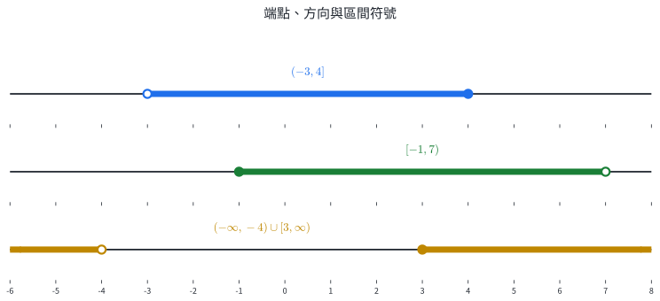
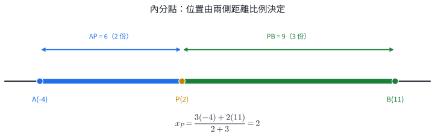
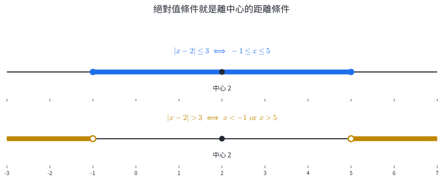
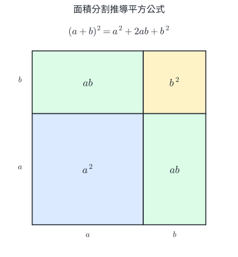
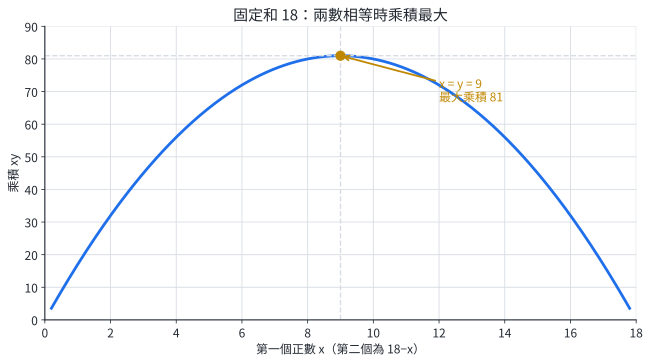

# 數1-1 數與式

::: learning-map
### 本章問題與能力

1. 實數如何用小數與數線表示，分數、根號與近似值之間有什麼關係？
2. 區間、分點公式與絕對值如何把代數條件翻成數線上的位置與距離？
3. 乘法公式、分式與根式運算如何保留原式的條件並縮短計算？
4. 已知總量或乘積時，算術平均數與幾何平均數如何給出可達到的最佳值？

本章路徑：實數與小數 → 數線與區間 → 分點與距離 → 絕對值；乘法公式 → 分式與根式 → 算幾不等式 → 最佳化。
:::

## 0. 本章實際用途：精確值、容許區間與最佳配置

工程尺寸常寫成「目標值加減容許誤差」，例如直徑 $20.00\pm0.03$ mm；這等價於區間 $[19.97,20.03]$，也等價於絕對值條件 $|x-20.00|\le0.03$。數線、區間與絕對值提供三種互通的表示法。

計算中的 $\sqrt2$、$\dfrac{5}{7}$ 與 $1.414$ 扮演不同角色。前兩者是精確值，後者是有限位數的近似值。保留根式或分數直到最後一步，可避免多次取近似造成誤差累積。

乘法公式與根式有理化用來辨認代數結構；算幾不等式則把結構轉成界線。例如固定周長的矩形，以正方形面積最大；固定面積的矩形，以正方形周長最短。這類結論會用在材料用量、版面配置與幾何最佳化。

## 1. 實數、小數與數線

### 1.1 數系與小數表示

**有理數**是可寫成 $p/q$ 的數，其中 $p,q\in\mathbb Z$ 且 $q\ne0$。**無理數**是無法寫成這種整數比的實數。兩者合成實數系：

$$
\mathbb R=\mathbb Q\cup(\mathbb R\setminus\mathbb Q),
\qquad
\mathbb Q\cap(\mathbb R\setminus\mathbb Q)=\{\}.
$$

整數、有限小數與循環小數都是有理數；$\sqrt2,\sqrt3,\pi$ 是無理數。根號符號本身不決定分類，例如 $\sqrt{49}=7$ 是整數。

有理數的小數展開必為有限小數或循環小數。把 $p/q$ 做長除法時，非零餘數只有 $1,2,\ldots,q-1$ 這有限多種；除法若未停止，某個餘數必再出現，之後的商便按同一週期重複。反過來，循環小數乘上適當的 $10$ 次方後相減，可消去循環尾，得到整數比。

若 $p/q$ 已約成最簡分數，十進位能終止的條件是

$$
q=2^m5^n\qquad(m,n\text{ 為非負整數}).
$$

理由是有限小數可寫成整數除以 $10^k=2^k5^k$；反過來，分母若只有質因數 $2,5$，可補乘成 $10$ 的次方。分母含其他質因數時，小數會循環。

有理數在數線上具有**稠密性**。若 $a<b$ 且 $a,b$ 都是有理數，則中點 $(a+b)/2$ 仍是有理數，而且嚴格落在兩者之間。對新得到的區間反覆取中點，可在 $a,b$ 之間得到無限多個有理數。

實數運算遵守交換律、結合律與分配律；除法要求除數非零。不等式同加一數保持方向，同乘正數保持方向，同乘負數時方向反轉。後面的乘法公式與不等式推導都以這些規則為依據。

::: example
### 例 1｜把循環小數化成分數

將 $x=0.1\overline{36}$ 化成最簡分數。

循環前有一位、循環節有兩位，因此以 $10x$ 與 $1000x$ 對齊循環部分：

$$
10x=1.\overline{36},\qquad 1000x=136.\overline{36}.
$$

相減得 $990x=135$，所以

$$
x=\frac{135}{990}=\boxed{\frac3{22}}.
$$
:::

::: example
### 例 2｜用平方夾住根號

求 $\sqrt{27}$ 到小數第一位所在的範圍。

因 $5^2=25<27<36=6^2$，先得 $5<\sqrt{27}<6$。再比較

$$
5.1^2=26.01<27,
\qquad
5.2^2=27.04>27,
$$

所以 $\boxed{5.1<\sqrt{27}<5.2}$。若取到小數第一位的四捨五入值，答案為 $5.2$。
:::

#### 無理性的證明範例

以 $\sqrt2$ 為例。假設 $\sqrt2=p/q$，其中 $p,q$ 是互質正整數。平方後得 $p^2=2q^2$，所以 $p^2$ 是偶數，進而 $p$ 是偶數。令 $p=2k$，代回得到 $q^2=2k^2$，故 $q$ 也是偶數。這與 $p,q$ 互質矛盾，因此 $\sqrt2$ 是無理數。

這段推理的核心是：若整數平方為偶數，原整數也為偶數；反證法把「可寫成最簡分數」推到分子、分母仍有公因數 $2$ 的矛盾。

#### 練習 1A

1. 將 $0.\overline{54}$ 化成最簡分數。
2. 將 $2.3\overline{18}$ 化成最簡分數。
3. 找出夾住 $\sqrt{70}$ 的兩個相鄰整數。
4. 判斷 $\sqrt{18}-3\sqrt2$、$0.1010010001\ldots$、$-7/4$ 各屬有理數或無理數；第二個小數中的 $1$ 之間依序放入 $1,2,3,\ldots$ 個 $0$。
5. 證明：若 $r$ 是有理數而 $u$ 是無理數，則 $r+u$ 是無理數。
6. 判斷 $7/40$ 與 $11/24$ 的十進位表示會終止或循環，並說明分母的質因數。

### 1.2 大小、區間與估計

任意兩個實數 $a,b$ 恰有一種關係成立：$a<b$、$a=b$ 或 $a>b$。數線將這個次序轉成位置；較大的數在右側。

若 $a<b$，常用區間如下：

| 條件 | 區間 | 端點含義 |
|---|---|---|
| $a<x<b$ | $(a,b)$ | 兩端都不含 |
| $a\le x\le b$ | $[a,b]$ | 兩端都包含 |
| $a\le x<b$ | $[a,b)$ | 含左端，不含右端 |
| $x>a$ | $(a,\infty)$ | 無窮遠不作端點 |
| $x\le b$ | $(-\infty,b]$ | 包含 $b$ |

聯集 $A\cup B$ 表示落在 $A$ 或 $B$；交集 $A\cap B$ 表示同時落在兩者。無窮符號只描述方向，因此與 $\infty$ 相鄰一律用小括號。

{width=92%}

比較含根式的正數時，可先確認兩邊非負，再平方。平方在非負實數上保序：若 $a,b\ge0$，則 $a<b\iff a^2<b^2$。

::: example
### 例 3｜比較兩個根式和

比較 $\sqrt{11}+\sqrt2$ 與 $\sqrt8+\sqrt5$。

兩者皆正，平方後比較：

$$
(\sqrt{11}+\sqrt2)^2=13+2\sqrt{22},
$$

$$
(\sqrt8+\sqrt5)^2=13+2\sqrt{40}.
$$

因 $22<40$，所以 $\sqrt{22}<\sqrt{40}$，故

$$
\boxed{\sqrt{11}+\sqrt2<\sqrt8+\sqrt5}.
$$
:::

::: example
### 例 4｜聯集與交集

設 $A=(-3,4]$、$B=[1,7)$，求 $A\cap B$ 與 $A\cup B$。

共同部分從 $1$ 到 $4$，兩端都包含，故 $A\cap B=[1,4]$。兩區間彼此重疊，合併後從 $-3$ 延伸到 $7$，兩端都不含，故 $A\cup B=(-3,7)$。
:::

#### 練習 1B

1. 把 $-2<x\le5$ 寫成區間。
2. 設 $A=(-\infty,2)$、$B=[-1,4]$，求 $A\cap B$ 與 $A\cup B$。
3. 比較 $3+\sqrt7$ 與 $2\sqrt6$。
4. 解聯立條件 $x>-4$ 且 $x\le1$，用區間表示。
5. 一感測器的合格範圍為 $[9.95,10.05]$ V。讀值 $9.94,9.98,10.05,10.06$ 中哪些合格？

## 2. 分點公式、距離與絕對值

### 2.1 內分點與外分點

數線上 $A(a)$、$B(b)$ 兩點的距離為 $|b-a|$。若 $P(x)$ 位於兩點之間，且

$$
AP:PB=m:n\qquad(m,n>0),
$$

則 $P$ 把從 $a$ 到 $b$ 的總位移分成 $m:n$。由

$$
\frac{x-a}{b-x}=\frac mn
$$

可得

$$
\boxed{x=\frac{na+mb}{m+n}}.
$$

公式中靠近 $a$ 的權重是 $n$，靠近 $b$ 的權重是 $m$；當 $m=n=1$ 時得到中點 $(a+b)/2$。

若分點在 $AB$ 外側，圖形的先後次序會改變。依實際位置寫距離，再解比例，可同時判斷外分點在左側或右側。

{width=90%}

::: example
### 例 5｜內分點坐標

$A(-4)$、$B(11)$，點 $P$ 在 $AB$ 之間且 $AP:PB=2:3$。求 $P$。

$$
x_P=\frac{3(-4)+2(11)}{2+3}=\frac{10}{5}=\boxed2.
$$

檢查：$AP=6$、$PB=9$，比例為 $2:3$。
:::

::: example
### 例 6｜外分點由距離列式

$A(1)$、$B(7)$，點 $Q$ 在 $A$ 左側且 $QA:QB=2:5$。求 $Q$。

設 $Q(x)$ 且 $x<1$，則 $QA=1-x$、$QB=7-x$：

$$
\frac{1-x}{7-x}=\frac25.
$$

解得 $5-5x=14-2x$，所以 $x=-3$。檢查 $QA=4$、$QB=10$，比例確為 $2:5$。
:::

#### 練習 2A

1. $A(-2)$、$B(8)$，$P$ 內分 $AB$ 且 $AP:PB=3:2$，求 $P$。
2. 求 $A(5)$、$B(-7)$ 的中點。
3. $A(0)$、$B(12)$，點 $Q$ 在 $B$ 右側且 $QA:QB=5:2$，求 $Q$。
4. 兩個測站坐標為 $-6$ km 與 $14$ km，設備設在兩站之間，距左站與右站之比為 $3:2$。求設備坐標及兩段距離。

### 2.2 絕對值是數線距離

絕對值的代數定義為

$$
|x|=\begin{cases}
x,&x\ge0,\\
-x,&x<0.
\end{cases}
$$

幾何上，$|x|$ 是 $x$ 到原點的距離，$|x-a|$ 是 $x$ 到 $a$ 的距離。因此，當 $r>0$：

$$
|x-a|<r\iff a-r<x<a+r,
$$

$$
|x-a|>r\iff x<a-r\ \text{或}\ x>a+r.
$$

等號版本只需把相應端點納入。若右側半徑為 $0$ 或負數，直接由距離非負判斷解集。

三角不等式

$$
\boxed{|u+v|\le |u|+|v|}
$$

表示先走位移 $u$ 再走位移 $v$，起終點直線距離不超過總路程。由 $u=(u-v)+v$ 可進一步得到

$$
\boxed{\bigl||u|-|v|\bigr|\le|u-v|}.
$$

{width=92%}

::: example
### 例 7｜單一絕對值不等式

解 $|3x-2|\le7$。

$$
-7\le3x-2\le7
\iff -5\le3x\le9
\iff -\frac53\le x\le3.
$$

解集為 $\boxed{[-5/3,3]}$。
:::

::: example
### 例 8｜兩個距離的和

解 $|x+1|+|x-4|\le7$。

變號點為 $-1,4$。

- $x<-1$：左式 $=-x-1+4-x=3-2x$，得 $x\ge-2$，與本段交集為 $[-2,-1)$。
- $-1\le x\le4$：左式 $=x+1+4-x=5$，整段成立。
- $x>4$：左式 $=x+1+x-4=2x-3$，得 $x\le5$，與本段交集為 $(4,5]$。

合併得 $\boxed{[-2,5]}$。這也符合距離圖：在 $[-1,4]$ 內距離和固定為 $5$，向外每移動 $1$，距離和增加 $2$。
:::

#### 練習 2B

1. 解 $|x-5|=3$。
2. 解 $|2x+3|<5$。
3. 解 $|x-2|\ge4$，用區間表示。
4. 解 $|x+2|+|x-3|=9$。
5. 某零件長度 $L$ 的目標為 $80$ mm，容許誤差 $0.4$ mm。分別用絕對值與區間寫出合格條件。
6. 已知 $|a-3|\le0.2$、$|b-5|\le0.1$，利用三角不等式估計 $|(a+b)-8|$ 的上界。

## 3. 乘法公式與分式

### 3.1 公式來自分配律

乘法公式是分配律的結構化結果。例如

$$
(a+b)^2=(a+b)(a+b)=a^2+2ab+b^2.
$$

常用公式包括

$$
\begin{aligned}
(a\pm b)^2&=a^2\pm2ab+b^2,\\
a^2-b^2&=(a-b)(a+b),\\
(a+b+c)^2&=a^2+b^2+c^2+2ab+2bc+2ca,\\
(a\pm b)^3&=a^3\pm3a^2b+3ab^2\pm b^3,\\
a^3+b^3&=(a+b)(a^2-ab+b^2),\\
a^3-b^3&=(a-b)(a^2+ab+b^2).
\end{aligned}
$$

展開、因式分解與代值是同一組等式的不同方向。先辨認平方差、完全平方或立方和差，常能把多步運算縮成一行。

{width=82%}

::: example
### 例 9｜利用結構快速計算

計算 $1003^2-997^2$。

用平方差：

$$
(1003-997)(1003+997)=6\times2000=\boxed{12000}.
$$
:::

::: example
### 例 10｜由對稱和求高次式

已知 $x+\dfrac1x=5$，求 $x^2+\dfrac1{x^2}$ 與 $x^3+\dfrac1{x^3}$。

因 $x\ne0$，平方得

$$
x^2+2+\frac1{x^2}=25,
$$

所以 $x^2+1/x^2=23$。再用

$$
\left(x+\frac1x\right)^3=x^3+\frac1{x^3}+3\left(x+\frac1x\right),
$$

得到 $x^3+1/x^3=125-15=\boxed{110}$。
:::

#### 練習 3A

1. 展開 $(2x-3y)^3$。
2. 因式分解 $8a^3-27b^3$。
3. 計算 $204^2-196^2$。
4. 已知 $t-1/t=4$，求 $t^2+1/t^2$。
5. 已知 $a+b+c=10$、$ab+bc+ca=27$，求 $a^2+b^2+c^2$。

### 3.2 分式的定義域與等值變形

分式的分母必須非零。約分時消去的是共同的非零因式，因此化簡後仍要保留原式的限制。例如

$$
\frac{x^2-1}{x-1}=x+1\qquad(x\ne1).
$$

兩式在 $x\ne1$ 時值相同；原式在 $x=1$ 沒有定義。分式加減先分解分母並取公分母，乘除則先因式分解再約分，通常能降低展開量。

::: example
### 例 11｜分式化簡並保留條件

化簡

$$
\frac{x^2-4}{x^2-x-2}\div\frac{x+2}{x-1}.
$$

原式要求 $x^2-x-2\ne0$、$x-1\ne0$，且除式 $(x+2)/(x-1)\ne0$，所以 $x\ne-2,-1,1,2$。因

$$
x^2-4=(x-2)(x+2),\qquad x^2-x-2=(x-2)(x+1),
$$

原式為

$$
\frac{(x-2)(x+2)}{(x-2)(x+1)}\cdot\frac{x-1}{x+2}
=\boxed{\frac{x-1}{x+1}},
$$

條件仍為 $x\ne-2,-1,1,2$。
:::

::: example
### 例 12｜通分後利用平方差

化簡 $\dfrac1{x-3}-\dfrac1{x+3}$。

當 $x\ne\pm3$：

$$
\frac{x+3-(x-3)}{(x-3)(x+3)}
=\boxed{\frac6{x^2-9}}.
$$
:::

#### 練習 3B

1. 化簡 $\dfrac{x^2-9}{x^2+5x+6}$，並寫出原式限制。
2. 化簡 $\dfrac2{x-1}+\dfrac3{x+1}$。
3. 化簡 $\dfrac{x^2-1}{x^2-2x+1}\cdot\dfrac{x-1}{x+1}$，並寫出限制。
4. 解方程 $\dfrac1{x-2}+\dfrac1{x+2}=\dfrac12$，並檢查定義域。

## 4. 根式與有理化

對 $a\ge0$，$\sqrt a$ 表示平方後等於 $a$ 的非負實數。因此

$$
\boxed{\sqrt{x^2}=|x|}.
$$

當 $a,b\ge0$ 時，$\sqrt{ab}=\sqrt a\sqrt b$；當 $a\ge0,b>0$ 時，$\sqrt{a/b}=\sqrt a/\sqrt b$。這些條件保證根號都在實數範圍內。

分母有根式時，可乘以適當因式使分母成為有理數。若分母為 $a+\sqrt b$，常乘以共軛式 $a-\sqrt b$，利用

$$
(a+\sqrt b)(a-\sqrt b)=a^2-b.
$$

雙重根式可由平方公式反推。若

$$
\sqrt{A+2\sqrt B}=\sqrt m+\sqrt n,
$$

則必須有 $m+n=A$、$mn=B$ 且 $m,n\ge0$。

::: example
### 例 13｜共軛式有理化

化簡 $\dfrac4{3-\sqrt5}$。

$$
\frac4{3-\sqrt5}\cdot\frac{3+\sqrt5}{3+\sqrt5}
=\frac{4(3+\sqrt5)}{9-5}
=\boxed{3+\sqrt5}.
$$
:::

::: example
### 例 14｜化簡雙重根式

化簡 $\sqrt{11-6\sqrt2}$。

尋找 $m+n=11$、$mn=18$，可取 $m=9,n=2$。因

$$
(3-\sqrt2)^2=11-6\sqrt2
$$

且 $3-\sqrt2>0$，所以

$$
\sqrt{11-6\sqrt2}=\boxed{3-\sqrt2}.
$$
:::

#### 練習 4A

1. 化簡 $\sqrt{72}-2\sqrt8+\sqrt{18}$。
2. 化簡 $\sqrt{(x-4)^2}$。
3. 有理化 $\dfrac5{\sqrt7}$。
4. 有理化 $\dfrac2{\sqrt6+\sqrt2}$。
5. 化簡 $\sqrt{13+4\sqrt{10}}$。

## 5. 算幾不等式與最佳值

對 $a,b\ge0$，因平方恆非負：

$$
(\sqrt a-\sqrt b)^2\ge0.
$$

展開並整理：

$$
a+b-2\sqrt{ab}\ge0
\iff
\boxed{\frac{a+b}{2}\ge\sqrt{ab}}.
$$

左側是算術平均數，右側是幾何平均數；等號成立恰在 $a=b$。若 $a,b>0$，把 $b$ 換成 $k/x$ 可得

$$
x+\frac{k}{x}\ge2\sqrt k\qquad(x>0,k>0),
$$

等號在 $x=\sqrt k$ 成立。最佳值題要同時交代「界線」與「能否取到等號」。

{width=86%}

::: example
### 例 15｜固定和求最大乘積

正數 $x,y$ 滿足 $x+y=18$，求 $xy$ 的最大值。

$$
\frac{x+y}{2}\ge\sqrt{xy}
\Rightarrow 9\ge\sqrt{xy}
\Rightarrow xy\le81.
$$

當 $x=y=9$ 時等號成立，所以最大值為 $\boxed{81}$。
:::

::: example
### 例 16｜固定面積求最短周長

矩形長寬 $x,y>0$ 且面積 $xy=48$。求最小周長。

$$
x+y\ge2\sqrt{xy}=2\sqrt{48}=8\sqrt3.
$$

周長 $P=2(x+y)\ge16\sqrt3$。等號在 $x=y=\sqrt{48}=4\sqrt3$ 成立，因此最小周長為 $\boxed{16\sqrt3}$。
:::

#### 練習 5A

1. 正數 $a,b$ 滿足 $a+b=30$，求 $ab$ 最大值與等號條件。
2. 對 $x>0$，求 $x+16/x$ 的最小值。
3. 對 $x>2$，求 $(x-2)+9/(x-2)$ 的最小值。
4. 面積為 $100\text{ m}^2$ 的長方形花圃，求最短周長及長寬。
5. 正數 $p,q$ 滿足 $pq=12$，求 $3p+4q$ 的最小值。

## 6. 分節練習完整解析

### 練習 1A

1. 設 $x=0.\overline{54}$，則 $100x-x=54$，故 $x=54/99=\boxed{6/11}$。
2. 設 $x=2.3\overline{18}$，則 $10x=23.\overline{18}$、$1000x=2318.\overline{18}$。相減得 $990x=2295$，故 $x=\boxed{51/22}$。
3. $8^2=64<70<81=9^2$，故 $\boxed{8<\sqrt{70}<9}$。
4. $\sqrt{18}-3\sqrt2=3\sqrt2-3\sqrt2=0$，是有理數；$0.1010010001\ldots$ 不終止且不循環，是無理數；$-7/4$ 是有理數。
5. 假設 $r+u=s$ 是有理數，則 $u=s-r$ 為兩個有理數之差，也會是有理數，與已知矛盾。因此 $r+u$ 是無理數。
6. $40=2^3\cdot5$，故 $7/40$ 為有限小數；$24=2^3\cdot3$ 含質因數 $3$，故最簡分數 $11/24$ 為循環小數。

### 練習 1B

1. $\boxed{(-2,5]}$。
2. $A\cap B=\boxed{[-1,2)}$；$A\cup B=\boxed{(-\infty,4]}$。
3. 兩數皆正。$(3+\sqrt7)^2=16+6\sqrt7>24=(2\sqrt6)^2$，故 $\boxed{3+\sqrt7>2\sqrt6}$。
4. 同時滿足兩條件得 $\boxed{(-4,1]}$。
5. 合格讀值為 $\boxed{9.98,10.05}$ V；端點 $10.05$ 包含在閉區間內。

### 練習 2A

1. $x_P=[2(-2)+3(8)]/5=\boxed4$。
2. 中點為 $(5-7)/2=\boxed{-1}$。
3. 設 $Q(x)$ 且 $x>12$，則 $x:(x-12)=5:2$，解得 $x=\boxed{20}$。
4. 坐標為 $[2(-6)+3(14)]/5=\boxed6$ km；距離為 $12$ km 與 $8$ km，比例 $3:2$。

### 練習 2B

1. $x-5=\pm3$，故 $\boxed{x=2,8}$。
2. $-5<2x+3<5$，得 $-8<2x<2$，所以 $\boxed{-4<x<1}$。
3. $x-2\le-4$ 或 $x-2\ge4$，故 $\boxed{(-\infty,-2]\cup[6,\infty)}$。
4. 變號點為 $-2,3$。中段距離和為 $5$；左段解得 $x=-4$，右段解得 $x=5$，故 $\boxed{x=-4,5}$。
5. $\boxed{|L-80|\le0.4}$，等價區間為 $\boxed{[79.6,80.4]}$ mm。
6. $|(a+b)-8|=|(a-3)+(b-5)|\le|a-3|+|b-5|\le\boxed{0.3}$。

### 練習 3A

1. $(2x-3y)^3=\boxed{8x^3-36x^2y+54xy^2-27y^3}$。
2. $8a^3-27b^3=\boxed{(2a-3b)(4a^2+6ab+9b^2)}$。
3. $(204-196)(204+196)=8\times400=\boxed{3200}$。
4. $(t-1/t)^2=t^2-2+1/t^2=16$，故 $t^2+1/t^2=\boxed{18}$。
5. $(a+b+c)^2=a^2+b^2+c^2+2(ab+bc+ca)$，故所求 $=100-54=\boxed{46}$。

### 練習 3B

1. $\dfrac{(x-3)(x+3)}{(x+2)(x+3)}=\boxed{\dfrac{x-3}{x+2}}$，原式限制 $\boxed{x\ne-3,-2}$。
2. 公分母為 $x^2-1$，結果為 $\boxed{\dfrac{5x-1}{x^2-1}}$，$x\ne\pm1$。
3. 化簡為 $\boxed1$，原式限制 $\boxed{x\ne1,-1}$。
4. 定義域要求 $x\ne\pm2$。通分得 $2x/(x^2-4)=1/2$，即 $x^2-4x-4=0$，故 $\boxed{x=2\pm2\sqrt2}$，兩解都在定義域內。

### 練習 4A

1. $6\sqrt2-4\sqrt2+3\sqrt2=\boxed{5\sqrt2}$。
2. $\boxed{|x-4|}$。
3. $\dfrac5{\sqrt7}=\boxed{\dfrac{5\sqrt7}{7}}$。
4. 乘以共軛式後得 $2(\sqrt6-\sqrt2)/(6-2)=\boxed{(\sqrt6-\sqrt2)/2}$。
5. 取 $m+n=13,mn=40$，得 $m=8,n=5$，所以 $\boxed{2\sqrt2+\sqrt5}$。

### 練習 5A

1. $ab\le[(a+b)/2]^2=225$，最大值 $\boxed{225}$，在 $a=b=15$ 成立。
2. $x+16/x\ge2\sqrt{16}=\boxed8$，在 $x=4$ 成立。
3. 令 $u=x-2>0$，則 $u+9/u\ge\boxed6$，在 $u=3$、即 $x=5$ 成立。
4. 長寬相等時周長最短，故長寬皆為 $10$ m，最短周長 $\boxed{40\text{ m}}$。
5. $3p+4q=3p+48/p\ge2\sqrt{144}=\boxed{24}$，等號在 $3p=48/p$，得 $p=4,q=3$。

## 7. 章末代表題

### 基礎與核心

1. 將 $0.2\overline{7}$ 化成最簡分數。
2. 求滿足 $3\le\sqrt n<4$ 的正整數 $n$。
3. 設 $A=(-5,2]$、$B=[-1,6)$，求 $A\cap B$ 與 $A\cup B$。
4. $A(-8)$、$B(7)$，點 $P$ 內分 $AB$ 且 $AP:PB=4:1$，求 $P$。
5. 解 $|2x-5|\le9$。
6. 解 $|x-1|+|x+3|>8$。
7. 因式分解 $x^6-64$。
8. 化簡 $\dfrac{x^2-4x+4}{x^2-4}$，並寫出原式限制。

### 進階

9. 化簡 $\sqrt{48}+\sqrt{27}-\sqrt{75}$。
10. 化簡 $\dfrac1{\sqrt5-2}-\dfrac1{\sqrt5+2}$。
11. 已知 $a+1/a=3$，求 $a^4+1/a^4$。
12. 對 $x>0$，求 $2x+18/x$ 的最小值及等號條件。

### 跨節整合

13. 某製程的合格濃度為 $|c-12|\le0.3$。兩次獨立校正可能分別造成不超過 $0.08$ 與 $0.05$ 的加法偏移。若儀器顯示 $12.20$，用三角不等式給出真值相對 $12$ 的最大可能偏差，並判斷能否保證合格。
14. 數線上 $A(-2)$、$B(10)$，$P$ 內分 $AB$ 且 $AP:PB=1:2$。求 $P$，再解 $|x-P|\le AP/2$。
15. 一長方形展示板面積固定為 $72\text{ dm}^2$。邊框每公尺材料價格相同，求使邊框成本最低的長寬與周長；答案保留根式。
16. 設 $u=\sqrt5+2$。先有理化求 $1/u$，再求 $u^2+1/u^2$，最後比較此值與 $18$。

## 8. 章末代表題完整詳解

1. 設 $x=0.2\overline7$。則 $10x=2.\overline7$、$100x=27.\overline7$，相減得 $90x=25$，所以 $\boxed{x=5/18}$。

2. 平方在非負數上保序：$9\le n<16$。正整數為 $\boxed{9,10,11,12,13,14,15}$。

3. 共同部分為 $\boxed{[-1,2]}$；合併範圍為 $\boxed{(-5,6)}$。

4. $x_P=[1(-8)+4(7)]/5=20/5=\boxed4$。檢查 $AP=12,PB=3$，比例為 $4:1$。

5. $-9\le2x-5\le9$，所以 $-4\le2x\le14$，解為 $\boxed{[-2,7]}$。

6. 變號點為 $-3,1$。在中段 $[-3,1]$，距離和固定為 $4$；左段左式 $=-2x-2>8$，得 $x<-5$；右段左式 $=2x+2>8$，得 $x>3$。故解集為 $\boxed{(-\infty,-5)\cup(3,\infty)}$。

7. 先作平方差，再作立方和差：

$$
x^6-64=(x^3-8)(x^3+8)
=(x-2)(x^2+2x+4)(x+2)(x^2-2x+4).
$$

8. 原式分母 $(x-2)(x+2)$，故 $x\ne\pm2$。化簡得

$$
\frac{(x-2)^2}{(x-2)(x+2)}=\boxed{\frac{x-2}{x+2}},
$$

且仍保留 $\boxed{x\ne\pm2}$。

9. $\sqrt{48}=4\sqrt3$、$\sqrt{27}=3\sqrt3$、$\sqrt{75}=5\sqrt3$，所以結果為 $\boxed{2\sqrt3}$。

10. 各分母互為共軛：

$$
\frac1{\sqrt5-2}=\sqrt5+2,
\qquad
\frac1{\sqrt5+2}=\sqrt5-2.
$$

相減得 $\boxed4$。

11. 先平方：$a^2+1/a^2=3^2-2=7$。再平方：

$$
a^4+\frac1{a^4}=7^2-2=\boxed{47}.
$$

12. $2x+18/x\ge2\sqrt{36}=12$。等號要求 $2x=18/x$，故 $x=3$。最小值為 $\boxed{12}$。

13. 儀器顯示值距目標為 $|12.20-12|=0.20$。兩校正偏移合計的絕對值至多 $0.08+0.05=0.13$，所以真值相對目標的偏差至多

$$
0.20+0.13=\boxed{0.33}.
$$

合格門檻是 $0.30$，因此現有資料無法保證合格；這是上界判斷，實際偏移若互相抵銷，真值仍可能合格。

14. $P=[2(-2)+1(10)]/3=2$。$AP=4$，所以 $AP/2=2$。條件為 $|x-2|\le2$，解得 $\boxed{x\in[0,4]}$。

15. 設長寬 $x,y>0$，$xy=72$。周長

$$
2(x+y)\ge4\sqrt{xy}=4\sqrt{72}=24\sqrt2.
$$

等號在 $x=y=\sqrt{72}=6\sqrt2$ 成立。因此長、寬皆為 $\boxed{6\sqrt2\text{ dm}}$，最短周長為 $\boxed{24\sqrt2\text{ dm}}$。

16. 因 $(\sqrt5+2)(\sqrt5-2)=1$，所以 $1/u=\sqrt5-2$。因此

$$
u+\frac1u=2\sqrt5,
$$

$$
u^2+\frac1{u^2}=\left(2\sqrt5\right)^2-2=\boxed{18}.
$$

故此值與 $18$ 相等。

## 9. 核心整理

- 有理數可寫成整數比，小數展開有限或循環；無理數的小數展開不終止且不循環。
- 區間括號記錄端點是否包含；聯集對應「或」，交集對應「且」。
- 內分點 $AP:PB=m:n$ 的坐標為 $(na+mb)/(m+n)$；由距離比例推導可檢查權重位置。
- $|x-a|$ 是 $x$ 與 $a$ 的距離；多個絕對值以變號點切段，每段解再與該段範圍取交集。
- 乘法公式來自分配律。分式化簡保留原分母非零與除式非零的限制。
- $\sqrt{x^2}=|x|$；共軛式把根式分母轉成平方差。
- 算幾不等式適用於非負數，等號條件決定最佳值是否可達。
