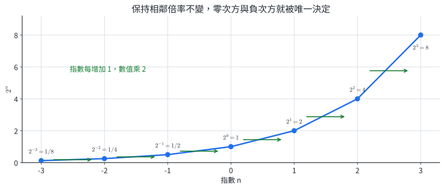
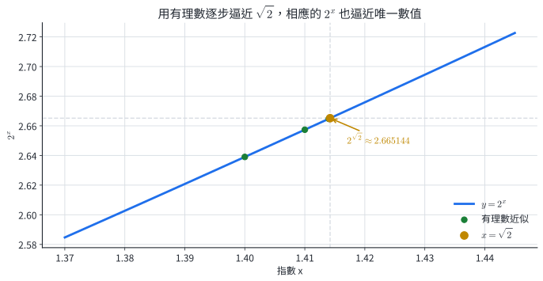
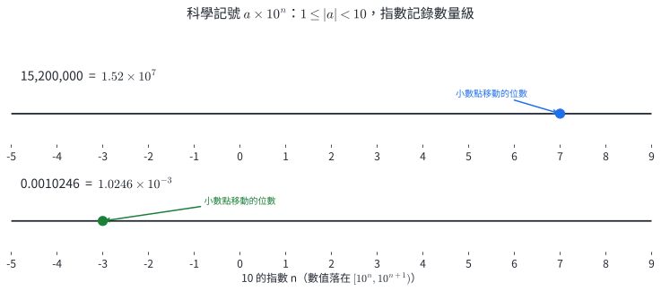
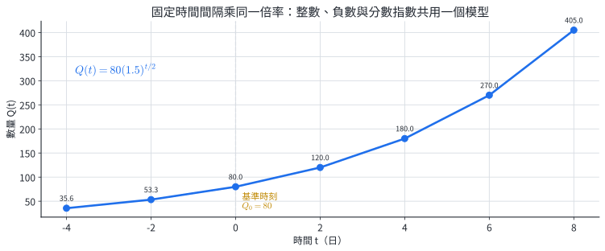
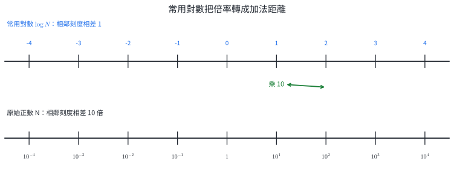

# 數1-2 指數與常用對數

::: learning-map
### 本章問題與能力

1. 為了讓指數律在零次方、負次方、分數次方與無理數次方下仍一致，這些次方應如何定義？
2. 極大或極小的數如何用科學記號表示，並依指定的有效數字合理取近似？
3. 固定時間乘上同一倍率時，如何用一個指數式同時描述過去、現在與未來？
4. 常用對數如何回答「10 的幾次方」，並把原數的數量級、位數與倍率差讀出來？

本章路徑：正整數指數 → 零與負整數指數 → 有理數與實數指數 → 科學記號 → 固定倍率模型 → 常用對數 → 數量級與對數尺度。
:::

## 0. 本章實際用途：倍率、尺度與可讀的數字

細菌數量、記憶體容量與投資金額常按固定倍率改變；放射性物質則按固定比例衰減。當每一個固定時間間隔都乘上同一個正數 $a$，經過 $n$ 個間隔後的倍率就是 $a^n$。指數從整數推廣到實數後，同一個式子也能描述半個間隔、任意時刻以及基準時刻以前的狀態。

原子尺度、天文距離與電腦容量跨越許多個 $10$ 倍。科學記號把有效數字與數量級分開，例如

$$
6.02\times10^{23},\qquad 2.50\times10^{-6}.
$$

常用對數進一步把「相差幾個 $10$ 倍」改寫成數線上的距離。地震規模、酸鹼值等尺度都利用這個性質，把很大的倍率範圍壓縮成容易比較的數值。

## 1. 整數指數：由連乘延伸到零與負數

### 1.1 正整數指數與三條指數律

對實數 $a$ 與正整數 $n$，定義

$$
a^n=\underbrace{a\cdot a\cdots a}_{n\text{ 個 }a}.
$$

把連乘重新分組，可直接得到三條指數律：

$$
\boxed{a^ma^n=a^{m+n}},\qquad
\boxed{(a^m)^n=a^{mn}},\qquad
\boxed{a^nb^n=(ab)^n}.
$$

第一條來自兩串相同底數的因子接在一起；第二條表示共有 $n$ 組、每組 $m$ 個 $a$；第三條則把每一組中的 $a$ 與 $b$ 配對。這三條規則處理的是不同結構，使用時先辨認「同底相乘」、「次方再取次方」或「同指數相乘」。

::: example
### 例 1｜以結構化簡指數式

計算

$$
\frac{3^5\cdot3^{-2}}{3}.
$$

把分母寫成 $3^1$，同底數的指數相加減：

$$
\frac{3^5\cdot3^{-2}}{3^1}
=3^{5+(-2)-1}=3^2=\boxed9.
$$
:::

::: example
### 例 2｜含代數式的負次方

化簡 $(x+1)^{-2}(x-1)^{-2}$，其中 $x\ne\pm1$。

兩個因子的指數相同：

$$
(x+1)^{-2}(x-1)^{-2}
=\bigl((x+1)(x-1)\bigr)^{-2}
=(x^2-1)^{-2}
=\boxed{\frac1{(x^2-1)^2}}.
$$

條件 $x\ne\pm1$ 來自原式的兩個負次方底數都必須非零。
:::

### 1.2 零次方與負整數次方

指數每增加 $1$，$a^n$ 就乘上 $a$；反方向每退一格便除以 $a$。對 $a\ne0$，為了讓 $a^ma^n=a^{m+n}$ 在整數指數下保持一致，必須定義

$$
\boxed{a^0=1},\qquad
\boxed{a^{-n}=\frac1{a^n}}\quad(n\text{ 為正整數}).
$$

例如 $2^1=2$，向左退一格得到 $2^0=1$，再退一格得到 $2^{-1}=1/2$。固定的相鄰倍率唯一決定這兩個定義。

{width=94%}

$0^n=0$ 對正整數 $n$ 成立；$0^0$ 與 $0^{-n}$ 在本章不定義，因為負次方會要求除以 $0$。

#### 練習 1A

1. 化簡 $5^3\cdot5^{-7}$。
2. 計算 $\dfrac{2^{-3}}{2^{-6}}$。
3. 化簡 $(a^2b^{-1})^3$，其中 $a,b\ne0$。
4. 計算 $(-2)^4\cdot(-2)^{-6}$。
5. 化簡 $(x+2)^{-3}(x-2)^{-3}$，並寫出 $x$ 的限制。
6. 已知某數量以今日為基準，每天成為前一天的 $1.08$ 倍。用指數表示三天前的數量是今日的多少倍。

## 2. 有理數與實數指數

### 2.1 分數次方由正根決定

設 $a>0$、$n$ 為正整數。方程 $x^n=a$ 有唯一正解，記作 $\sqrt[n]{a}$。為了使 $(a^{1/n})^n=a$，定義

$$
\boxed{a^{1/n}=\sqrt[n]{a}}.
$$

若 $m$ 為整數，再定義

$$
\boxed{a^{m/n}=\left(\sqrt[n]{a}\right)^m=\sqrt[n]{a^m}}.
$$

例如 $8^{2/3}=(\sqrt[3]{8})^2=4$。若同一有理數寫成不同分數，結果仍相同；例如

$$
a^{2/4}=\sqrt[4]{a^2}=\sqrt a=a^{1/2}\qquad(a>0).
$$

在本章將有理數指數的底數取為正數，所有正根都唯一，而且三條指數律可一致延伸到有理數指數。

::: example
### 例 3｜分數次方化成根式

計算 $81^{3/4}$ 與 $32^{-2/5}$。

$$
81^{3/4}=(\sqrt[4]{81})^3=3^3=\boxed{27},
$$

$$
32^{-2/5}=\frac1{(\sqrt[5]{32})^2}=\frac1{2^2}=\boxed{\frac14}.
$$
:::

::: example
### 例 4｜先統一底數再運算

化簡

$$
16^{3/4}\cdot8^{-2/3}.
$$

把兩個底數都寫成 $2$ 的次方：

$$
(2^4)^{3/4}(2^3)^{-2/3}
=2^3\cdot2^{-2}=\boxed2.
$$
:::

### 2.2 無理數指數由逼近定義

$\sqrt{2}$ 不是有理數，但可用小數

$$
1.4,\ 1.41,\ 1.414,\ 1.4142,\ldots
$$

逐步逼近。對固定的 $a>0$，相應的 $a^{1.4},a^{1.41},a^{1.414},\ldots$ 會逼近唯一數值；這個極限用來定義 $a^{\sqrt{2}}$。完整的極限證明超出本冊範圍，但數值逼近說明了實數指數如何與先前的有理數指數接合。

{width=91%}

對 $a,b>0$ 與實數 $r,s$，指數律仍成立：

$$
a^ra^s=a^{r+s},\qquad (a^r)^s=a^{rs},\qquad a^rb^r=(ab)^r.
$$

::: example
### 例 5｜含無理數指數的化簡

計算

$$
4^{\sqrt{3}}\cdot8^{-2\sqrt{3}/3}.
$$

統一為底數 $2$：

$$
(2^2)^{\sqrt{3}}(2^3)^{-2\sqrt{3}/3}
=2^{2\sqrt{3}}2^{-2\sqrt{3}}
=2^0=\boxed1.
$$
:::

::: example
### 例 6｜由方程決定正數

設 $x>0$ 且 $x^{3/2}=27$，求 $x$。

兩邊同取 $2/3$ 次方：

$$
x=(x^{3/2})^{2/3}=27^{2/3}=(\sqrt[3]{27})^2=\boxed9.
$$

代回：$9^{3/2}=(\sqrt{9})^3=27$。
:::

#### 練習 2A

1. 把 $7^{2/3}$、$5^{-3/2}$ 寫成根式。
2. 計算 $64^{2/3}$。
3. 計算 $\left(\dfrac{27}{8}\right)^{-2/3}$。
4. 化簡 $9^{\sqrt{5}}3^{-2\sqrt{5}}$。
5. 設 $x>0$ 且 $x^{4/3}=16$，求 $x$。
6. 已知 $a>0$，化簡 $a^{1/2}a^{1/3}/a^{1/6}$。

## 3. 科學記號與有效數字

### 3.1 係數與數量級

非零實數 $N$ 的科學記號為

$$
\boxed{N=a\times10^n},\qquad 1\le |a|<10,\quad n\in\mathbb Z.
$$

$a$ 保留數字的有效部分，$n$ 記錄小數點移動的位數與數量級。例如

$$
15\,200\,000=1.52\times10^7,
$$

$$
0.0010246=1.0246\times10^{-3}.
$$

{width=94%}

同次方的數才能直接加減係數；乘除則分別運算係數與 $10$ 的次方：

$$
(a\times10^m)(b\times10^n)=ab\times10^{m+n}.
$$

計算後若係數不在 $[1,10)$，再調整成標準形式。

### 3.2 有效數字與取近似

科學記號中係數 $a$ 的位數就是有效數字位數。例如 $3.40\times10^5$ 有三位有效數字；最後的 $0$ 表示數值記錄到百位，所含資訊不同於 $3.4\times10^5$。

依指定有效位數取近似時，先保留完整中間值，最後一步才四捨五入。這樣可以降低多次取近似造成的累積誤差。

::: example
### 例 7｜科學記號的加減

計算 $4.83\times10^6-7.60\times10^5$，並保留三位有效數字。

先把次方對齊：

$$
7.60\times10^5=0.760\times10^6.
$$

因此

$$
(4.83-0.760)\times10^6
=4.070\times10^6
\approx\boxed{4.07\times10^6}.
$$
:::

::: example
### 例 8｜科學記號的乘法

計算 $(3.20\times10^{-4})(5.50\times10^7)$，結果保留三位有效數字。

$$
(3.20\times5.50)\times10^3
=17.6\times10^3
=\boxed{1.76\times10^4}.
$$

最後一步把係數 $17.6$ 調整回 $1\le a<10$。
:::

#### 練習 3A

1. 把 $73\,500\,000$ 寫成科學記號。
2. 把 $0.0000842$ 寫成科學記號。
3. 計算 $6.25\times10^7+3.80\times10^6$，保留三位有效數字。
4. 計算 $(4.80\times10^{-3})(2.50\times10^6)$。
5. 計算 $(7.20\times10^8)/(3.00\times10^{-4})$。
6. 將 $9.9964\times10^5$ 取三位有效數字，並寫成標準科學記號。

## 4. 固定倍率模型

### 4.1 模型的建立

基準時刻的數量為 $Q_0$。若每隔 $T$ 單位時間乘上固定倍率 $a>0$，則時刻 $t$ 的模型為

$$
\boxed{Q(t)=Q_0a^{t/T}}.
$$

$t/T$ 表示經過幾個倍率週期。$t>0$ 描述基準以後，$t<0$ 描述基準以前，非整數的 $t/T$ 則描述週期中間的時刻。$a>1$ 時數量隨時間成長；$0<a<1$ 時數量衰減。

{width=94%}

::: example
### 例 9｜同一模型回推過去與預測未來

某培養液今日有 $120$ 單位細胞，每三天成為原來的 $1.25$ 倍。

模型為

$$
Q(t)=120(1.25)^{t/3}.
$$

九天後：

$$
Q(9)=120(1.25)^3=\boxed{234.375}.
$$

六天前：

$$
Q(-6)=120(1.25)^{-2}=\boxed{76.8}.
$$
:::

::: example
### 例 10｜半衰期模型

某物質初始質量為 $160$ mg，半衰期為 $6$ 年。求 $18$ 年後的質量。

每 $6$ 年乘上 $1/2$，所以

$$
M(t)=160\left(\frac12\right)^{t/6}.
$$

代入 $t=18$：

$$
M(18)=160\left(\frac12\right)^3=\boxed{20\text{ mg}}.
$$
:::

#### 練習 4A

1. 某數量初始為 $50$，每四小時成為 $1.2$ 倍。寫出 $Q(t)$。
2. 承上題，求十二小時後的數量。
3. 某物質初始為 $96$ g，半衰期為 $8$ 天。求二十四天後的質量。
4. 一個容量每年變成前一年的 $2$ 倍。以今年為基準，三年前的容量是今年的多少倍？
5. $Q(t)=200(0.8)^{t/5}$。說明 $200$、$0.8$、$5$ 在情境中的意義，並求 $Q(10)$。

## 5. 常用對數：反問 10 的幾次方

### 5.1 定義與反運算

每個正數 $N$ 都能唯一寫成 $10^x$。使 $10^x=N$ 的實數 $x$，稱為 $N$ 的**常用對數**，記作 $\log N$：

$$
\boxed{\log N=x\iff10^x=N},\qquad N>0.
$$

因此

$$
\boxed{10^{\log N}=N}\quad(N>0),
$$

$$
\boxed{\log(10^x)=x}\quad(x\in\mathbb R).
$$

常用對數的真數必須為正，因為 $10^x$ 對每個實數 $x$ 都大於 $0$。

::: example
### 例 11｜在指數式與對數式之間轉換

將下列敘述互換表示：

1. $10^{-3}=0.001$；
2. $10^x=37$。

由定義得

$$
\boxed{\log0.001=-3},
$$

$$
\boxed{x=\log37}.
$$

第二個值沒有簡單的有限小數，計算機給出 $\log37\approx1.5682$。
:::

::: example
### 例 12｜用計算機結果判讀範圍

計算機顯示 $\log4321\approx3.6356$。這表示

$$
4321\approx10^{3.6356}.
$$

又因 $3<3.6356<4$，所以

$$
10^3<4321<10^4,
$$

與原數是四位數一致。
:::

#### 練習 5A

1. 將 $10^4=10000$ 改寫成對數式。
2. 將 $\log0.01=-2$ 改寫成指數式。
3. 求 $\log1$、$\log10^6$。
4. 求 $10^{\log 53}$。
5. 使用計算機求 $\log7.25$ 與 $\log0.0725$，取到小數第四位。

## 6. 數量級、位數與對數尺度

### 6.1 對數值的整數部分定位原數

若

$$
n<\log N<n+1,
$$

由 $\log N=x\iff N=10^x$ 可得

$$
10^n<N<10^{n+1}.
$$

因此，當 $N\ge1$ 時，若 $n\le\log N<n+1$，$N$ 的整數部分有 $n+1$ 位。當 $0<N<1$ 時，若

$$
-k<\log N<-k+1\qquad(k\text{ 為正整數}),
$$

則 $10^{-k}<N<10^{-k+1}$，第一個非零數字出現在小數點後第 $k$ 位。

常用對數每增加 $1$，原數便乘上 $10$：

$$
10^{x+1}=10\cdot10^x.
$$

{width=94%}

::: example
### 例 13｜判斷巨大整數的位數

已知 $\log3\approx0.477121$，求 $3^{40}$ 的位數。

因 $3=10^{\log3}$，所以

$$
3^{40}=10^{40\log3}\approx10^{19.08484}.
$$

因此

$$
10^{19}<3^{40}<10^{20},
$$

故 $3^{40}$ 是 $\boxed{20\text{ 位數}}$。
:::

::: example
### 例 14｜判斷極小數的第一個非零位

若 $\log N=-6.27$，判斷 $N$ 的第一個非零數字在小數點後第幾位。

因

$$
-7<-6.27<-6,
$$

所以

$$
10^{-7}<N<10^{-6}.
$$

$N$ 的形式為 $0.000000\,*\cdots$，第一個非零數字在小數點後第 $\boxed7$ 位。
:::

### 6.2 對數尺度的資料解讀

設兩個正數分別為 $A=10^a$、$B=10^b$。若它們的常用對數相差 $d=a-b$，則

$$
\frac AB=\frac{10^a}{10^b}=10^d.
$$

所以對數差是加法量，對應到原數的倍率。這個推導只用常用對數的定義與指數律。

::: example
### 例 15｜酸鹼值與濃度倍率

氫離子濃度 $H>0$（mol/L）與酸鹼值的簡化關係為

$$
\mathrm{pH}=-\log H.
$$

溶液 A、B 的 pH 分別為 $3.2$、$5.7$。求 A 的氫離子濃度是 B 的多少倍。

由定義，$H_A=10^{-3.2}$、$H_B=10^{-5.7}$，所以

$$
\frac{H_A}{H_B}=10^{-3.2-(-5.7)}=10^{2.5}\approx\boxed{316}.
$$

pH 較小的 A，其氫離子濃度較高；差 $2.5$ 對應 $10^{2.5}$ 倍。
:::

::: example
### 例 16｜地震規模與能量倍率

某模型以

$$
\log E=4.8+1.5M
$$

連結地震規模 $M$ 與能量 $E$。比較規模 $6.2$ 與 $4.2$ 的能量。

兩次事件的對數能量差為

$$
(4.8+1.5\times6.2)-(4.8+1.5\times4.2)=3.
$$

所以能量倍率為

$$
10^3=\boxed{1000}.
$$
:::

#### 練習 6A

1. 若 $2<\log N<3$，判斷 $N$ 的整數位數。
2. 若 $\log N=-4.6$，判斷第一個非零數字所在的小數位。
3. 已知 $\log2\approx0.301030$，求 $2^{50}$ 的位數。
4. 正數 $A,B$ 滿足 $\log A=4.7$、$\log B=1.7$。求 $A/B$。
5. 某尺度值每增加 $0.5$，原始量乘上多少倍？
6. 兩杯溶液的 pH 分別為 $4.0$、$6.0$。前者的氫離子濃度是後者的多少倍？

## 7. 分節練習完整解析

### 練習 1A

1. $5^3\cdot5^{-7}=5^{-4}=1/625$。
2. $2^{-3}/2^{-6}=2^{-3-(-6)}=2^3=8$。
3. $(a^2b^{-1})^3=a^6b^{-3}=a^6/b^3$。
4. $(-2)^{4+(-6)}=(-2)^{-2}=1/4$。
5. 同指數合併得 $[(x+2)(x-2)]^{-3}=(x^2-4)^{-3}=1/(x^2-4)^3$；原式要求 $x\ne-2,2$。
6. 每向前一天除以 $1.08$，三天前是今日的 $(1.08)^{-3}$ 倍。

### 練習 2A

1. $7^{2/3}=\sqrt[3]{7^2}$；$5^{-3/2}=1/(\sqrt{5})^3=1/(5\sqrt{5})$。
2. $64^{2/3}=(\sqrt[3]{64})^2=4^2=16$。
3. $(27/8)^{-2/3}=(8/27)^{2/3}=(2/3)^2=4/9$。
4. $9^{\sqrt{5}}3^{-2\sqrt{5}}=(3^2)^{\sqrt{5}}3^{-2\sqrt{5}}=1$。
5. $x=(x^{4/3})^{3/4}=16^{3/4}=(\sqrt[4]{16})^3=8$。
6. 指數相加減：$a^{1/2+1/3-1/6}=a^{2/3}$。

### 練習 3A

1. $73\,500\,000=7.35\times10^7$。
2. $0.0000842=8.42\times10^{-5}$。
3. $(6.25+0.380)\times10^7=6.63\times10^7$。
4. $(4.80\times2.50)\times10^3=12.0\times10^3=1.20\times10^4$。
5. $(7.20/3.00)\times10^{12}=2.40\times10^{12}$。
6. $9.9964\times10^5$ 取三位有效數字為 $10.0\times10^5=1.00\times10^6$。

### 練習 4A

1. $Q(t)=50(1.2)^{t/4}$。
2. $Q(12)=50(1.2)^3=86.4$。
3. $M(24)=96(1/2)^{24/8}=96/8=12$ g。
4. 三年前是今年的 $2^{-3}=1/8$ 倍。
5. $200$ 是基準值，$0.8$ 是每五個時間單位保留的倍率，$5$ 是一個倍率週期；$Q(10)=200(0.8)^2=128$。

### 練習 5A

1. $\log10000=4$。
2. $10^{-2}=0.01$。
3. $\log1=0$；$\log10^6=6$。
4. $10^{\log53}=53$。
5. $\log7.25\approx0.8603$；$\log0.0725\approx-1.1397$。

### 練習 6A

1. $10^2<N<10^3$，所以 $N$ 有三位整數。
2. $-5<-4.6<-4$，故 $10^{-5}<N<10^{-4}$，第一個非零數字在小數點後第五位。
3. $2^{50}=10^{50\log2}\approx10^{15.0515}$，介於 $10^{15}$ 與 $10^{16}$，所以有 16 位。
4. $A/B=10^{4.7-1.7}=10^3=1000$。
5. 原始量的倍率為 $10^{0.5}=\sqrt{10}\approx3.16$。
6. 濃度比為 $10^{-4}/10^{-6}=10^2=100$。

## 8. 章末代表題

### 基礎與核心

1. 化簡 $\dfrac{6^4\cdot6^{-1}}{6^2}$。
2. 計算 $125^{2/3}$ 與 $16^{-3/4}$。
3. 設 $x>0$ 且 $x^{5/2}=32$，求 $x$。
4. 化簡 $27^{\sqrt{2}}9^{-3\sqrt{2}/2}$。
5. 把 $0.000000734$ 寫成科學記號。
6. 計算 $(2.40\times10^8)(3.50\times10^{-5})$，取三位有效數字。
7. 計算 $8.31\times10^6-6.5\times10^5$，取三位有效數字。
8. 將 $10^{-5}=0.00001$ 改寫成常用對數式。

### 應用與判讀

9. 某數量現值為 $300$，每兩天成為原來的 $0.9$ 倍。寫出模型並求六天後的值。
10. 某藥物初始為 $240$ mg，半衰期為 $4$ 小時。求 $12$ 小時後的量。
11. 若 $5<\log N<6$，求 $N$ 的整數位數。
12. 若 $\log N=-8.4$，第一個非零數字出現在小數點後第幾位？

### 跨節整合

13. 已知 $\log2\approx0.301030$。判斷 $2^{120}$ 的位數，並把它估成三位有效數字的科學記號。
14. 某培養物每 $5$ 小時成為原來的 $1.6$ 倍，目前有 $2.50\times10^4$ 個。求 $15$ 小時後的數量，以三位有效數字的科學記號表示。
15. 兩次事件的尺度分別為 $7.1$ 與 $5.6$，模型為 $S=2+\log Q$。求兩次事件原始量的比值。
16. 某物質質量模型為 $M(t)=6.40\times10^5(1/2)^{t/3}$ mg。求 $12$ 小時後的質量，並求其常用對數到小數第三位。

## 9. 章末代表題完整詳解

1. 同底數指數相加減：

   $$
   \frac{6^4\cdot6^{-1}}{6^2}=6^{4-1-2}=\boxed6.
   $$

2. 分別以正根表示：

   $$
   125^{2/3}=(\sqrt[3]{125})^2=25,
   $$

   $$
   16^{-3/4}=\frac1{(\sqrt[4]{16})^3}=\frac18.
   $$

3. 兩邊同取 $2/5$ 次方：

   $$
   x=32^{2/5}=(\sqrt[5]{32})^2=\boxed4.
   $$

   代回 $4^{5/2}=(\sqrt{4})^5=32$。

4. 統一底數為 $3$：

   $$
   27^{\sqrt{2}}9^{-3\sqrt{2}/2}
   =(3^3)^{\sqrt{2}}(3^2)^{-3\sqrt{2}/2}
   =3^{3\sqrt{2}}3^{-3\sqrt{2}}=\boxed1.
   $$

5. 小數點向右移七位得到係數 $7.34$，所以

   $$
   \boxed{7.34\times10^{-7}}.
   $$

6. 係數相乘、指數相加：

   $$
   (2.40\times3.50)\times10^{8-5}
   =8.40\times10^3.
   $$

   結果已有三位有效數字，故為 $\boxed{8.40\times10^3}$。

7. 先對齊次方：

   $$
   8.31\times10^6-0.650\times10^6
   =7.660\times10^6
   \approx\boxed{7.66\times10^6}.
   $$

8. 由 $\log N=x\iff10^x=N$，得

   $$
   \boxed{\log0.00001=-5}.
   $$

9. 每兩天乘 $0.9$，模型為

   $$
   Q(t)=300(0.9)^{t/2}.
   $$

   六天包含三個週期：

   $$
   Q(6)=300(0.9)^3=\boxed{218.7}.
   $$

10. 半衰模型為

    $$
    M(t)=240\left(\frac12\right)^{t/4}.
    $$

    十二小時有三個半衰期，因此

    $$
    M(12)=240\left(\frac12\right)^3=\boxed{30\text{ mg}}.
    $$

11. $5<\log N<6$ 等價於 $10^5<N<10^6$，所以 $N$ 的整數部分有 $\boxed6$ 位。

12. $-9<-8.4<-8$，所以 $10^{-9}<N<10^{-8}$。第一個非零數字出現在小數點後第 $\boxed9$ 位。

13. 先把指數式改寫成 $10$ 的次方：

    $$
    2^{120}=10^{120\log2}\approx10^{36.1236}
    =10^{0.1236}\times10^{36}.
    $$

    因 $36<36.1236<37$，所以有 $\boxed{37}$ 位。計算機給出 $10^{0.1236}\approx1.3297$，三位有效數字為

    $$
    \boxed{1.33\times10^{36}}.
    $$

14. 模型為

    $$
    Q(t)=2.50\times10^4(1.6)^{t/5}.
    $$

    代入 $t=15$：

    $$
    Q(15)=2.50\times10^4(1.6)^3
    =10.24\times10^4
    =1.024\times10^5.
    $$

    取三位有效數字得 $\boxed{1.02\times10^5}$ 個。

15. 由 $S=2+\log Q$，兩事件的常用對數差為

    $$
    (7.1-2)-(5.6-2)=1.5.
    $$

    因此原始量比值為

    $$
    10^{1.5}=10\sqrt{10}\approx\boxed{31.6}.
    $$

16. 十二小時是四個三小時週期：

    $$
    M(12)=6.40\times10^5\left(\frac12\right)^4
    =\frac{6.40\times10^5}{16}
    =\boxed{4.00\times10^4\text{ mg}}.
    $$

    其常用對數為

    $$
    \log M(12)=\log(40000)\approx\boxed{4.602}.
    $$

    $4<4.602<5$ 也與 $40000$ 是五位數一致。

## 10. 核心整理

- 對 $a\ne0$，$a^0=1$、$a^{-n}=1/a^n$；對 $a>0$，$a^{m/n}=\sqrt[n]{a^m}$，實數指數由有理數逼近延伸。
- 同底相乘加指數、次方再取次方乘指數、同指數相乘可合併底數；套用前先確認底數條件。
- 科學記號為 $a\times10^n$，其中 $1\le|a|<10$；加減先對齊次方，乘除分別處理係數與指數。
- 固定每 $T$ 單位時間乘倍率 $a$ 的模型為 $Q(t)=Q_0a^{t/T}$。
- $\log N=x\iff10^x=N$，且 $N>0$。常用對數增加 $1$，原數乘 $10$。
- $n\le\log N<n+1$ 可定位 $N$ 在 $[10^n,10^{n+1})$，進而判斷整數位數或小數首個非零位。
