# 數1-3 多項式函數

::: learning-map
### 本章問題與能力

1. 多項式的係數、次數與四則運算如何形成一套穩定的代數語言？
2. 除法原理、綜合除法、餘式定理與因式定理如何互相連結？
3. 坐標對稱、函數記號與平移如何把方程式轉成可讀的圖形？
4. 配方、判別式與閉區間如何決定二次函數的頂點、交點與極值？
5. 三次函數的標準形、對稱中心、大域特徵與局部一次近似如何取得？
6. 多項式的根與重數如何控制不等式的正負區間？

本章路徑：多項式語言 → 除法與餘式 → 函數與圖形 → 二次函數 → 三次函數 → 多項式不等式。
:::

## 0. 本章實際用途：校正、最佳化與可行範圍

多項式可用來描述輸入與輸出之間的關係。感測器在一小段操作範圍內，常用一次或二次多項式校正讀值；產品的收益、面積或能耗模型常形成二次式，頂點便對應最佳配置；已知若干測試值時，餘式定理可直接抽取指定輸入的資訊。

圖形提供整體判讀。二次函數的開口、頂點與交點可說明一項設計在何處達到最大或最小；三次函數的最高次項決定遠端趨勢，平移後的標準形則顯示對稱中心。當系統只在某個基準值附近運作時，連續綜合除法可把多項式寫成基準位移的次方，保留常數項與一次項便得到容易計算的局部近似。

不等式回答「哪些輸入符合條件」。成本低於上限、面積高於門檻、訊號維持正值，都可整理成多項式的正負問題。根把數線分段，根的重數決定經過該點時是否變號。

## 1. 多項式的語言與運算

### 1.1 定義、係數與次數

一元多項式可寫成

$$
f(x)=a_nx^n+a_{n-1}x^{n-1}+\cdots+a_1x+a_0,
$$

其中 $n$ 是非負整數，各係數 $a_i$ 是實數。當 $a_n\ne0$ 時，$n$ 稱為 $f$ 的**次數**，記作 $\deg f=n$；$a_n$ 是首項係數，$a_0$ 是常數項。非零常數是零次多項式；零多項式的次數不定義。

多項式中的指數皆為非負整數。因此 $3x^4-\sqrt2x+1$ 是四次多項式，而含有 $x^{-1}$、$\sqrt{x}$ 或變數位於分母的式子不屬於多項式。

兩個多項式相等的條件，是每一個相同次方的係數都相等。缺少的次方項以係數 $0$ 表示，這個表示法在比較係數與綜合除法中都很重要。

### 1.2 加、減、乘與代值

加減法將同次項係數相加減；乘法由分配律展開後合併同次項。若 $f,g$ 都是非零多項式，則

$$
\deg(fg)=\deg f+\deg g.
$$

理由是兩者最高次項 $a_nx^n$、$b_mx^m$ 相乘得到 $a_nb_mx^{n+m}$，且 $a_nb_m\ne0$。加減時最高次項可能互相消去，所以

$$
\deg(f\pm g)\le \max\{\deg f,\deg g\}.
$$

把 $x=t$ 代入 $f(x)$ 所得的數記作 $f(t)$。代值可以表示資料模型在指定輸入的輸出，也會在餘式定理中直接出現。

::: example
### 例 1｜由相等多項式決定係數

已知

$$
(a+1)x^3+(b-2)x^2+3x+2=3x+2,
$$

求 $a,b$。

右式的三次項與二次項係數都是 $0$。逐項比較得

$$
a+1=0,\qquad b-2=0.
$$

所以 $\boxed{a=-1,\ b=2}$。
:::

::: example
### 例 2｜乘法展開與次數檢查

計算 $(2x^2-x+3)(x-2)$。

$$
\begin{aligned}
(2x^2-x+3)(x-2)
&=2x^3-4x^2-x^2+2x+3x-6\\
&=\boxed{2x^3-5x^2+5x-6}.
\end{aligned}
$$

兩個因式的次數分別為 $2,1$，乘積為三次，與結果一致。
:::

#### 練習 1A

1. 說明 $3x^4-\sqrt2x+1$ 的次數、首項係數與常數項，並判斷 $x^{-1}+2$、$\sqrt{x}+1$ 是否為多項式。
2. 若 $(a-1)x^3+(b+2)x^2+4=4$，求 $a,b$。
3. 展開 $(2x^2-x+3)(x-2)$。
4. 設 $f(x)=x^3-2x+1$、$g(x)=-x^3+x^2+4$，求 $f(x)+g(x)$ 及其次數。
5. 一個校正模型為 $C(t)=2t^3-5t+12$，求 $C(3)$。

## 2. 除法原理、綜合除法與因式

### 2.1 多項式除法原理

若 $g(x)$ 是非零多項式，則存在唯一的多項式 $q(x),r(x)$，使

$$
\boxed{f(x)=g(x)q(x)+r(x)},
$$

其中 $r(x)=0$，或 $\deg r<\deg g$。$q$ 是商，$r$ 是餘式。

長除法每一步都用目前被除式的最高次項除以除式的最高次項，得到商的一項，再乘回並相減。相減會使最高次降低；有限次後便得到次數低於除式的餘式。

唯一性可由反證確認。若同時有

$$
f=gq_1+r_1=gq_2+r_2,
$$

則 $g(q_1-q_2)=r_2-r_1$。若 $q_1-q_2$ 非零，左側次數至少為 $\deg g$；右側次數低於 $\deg g$，產生矛盾。因此 $q_1=q_2$，進而 $r_1=r_2$。

::: example
### 例 3｜多項式長除法

求 $2x^3-3x^2+5$ 除以 $x^2-x+1$ 的商與餘式。

先補出 $0x$。最高次相除得 $2x$：

$$
(2x^3-3x^2+0x+5)-2x(x^2-x+1)=-x^2-2x+5.
$$

再以 $-1$ 乘除式：

$$
(-x^2-2x+5)-(-x^2+x-1)=-3x+6.
$$

因此

$$
\boxed{q(x)=2x-1,\qquad r(x)=-3x+6}.
$$

驗算：$(x^2-x+1)(2x-1)+(-3x+6)=2x^3-3x^2+5$。
:::

### 2.2 除以 $x-a$ 與綜合除法

當除式為 $x-a$ 時，餘式的次數低於 $1$，所以餘式是一個常數。綜合除法只記係數，依序執行「首項落下、乘 $a$、與下一係數相加」。最後一格是餘式，其餘各格是商的係數。

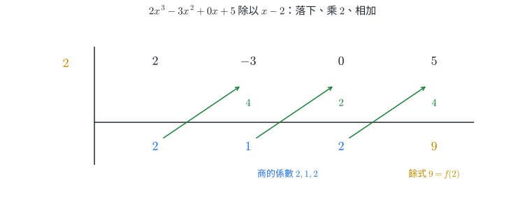{width=92%}

::: example
### 例 4｜綜合除法與驗算

用綜合除法計算 $f(x)=2x^3-3x^2+5$ 除以 $x-2$。

係數依序為 $2,-3,0,5$，綜合除法底列為 $2,1,2,9$，所以

$$
\boxed{q(x)=2x^2+x+2,\qquad r=9}.
$$

展開 $(x-2)(2x^2+x+2)+9$ 可還原 $f(x)$。
:::

### 2.3 餘式定理與因式定理

由除法原理

$$
f(x)=(x-a)q(x)+r
$$

代入 $x=a$，得到 $f(a)=r$。因此

$$
\boxed{f(x)\text{ 除以 }x-a\text{ 的餘式為 }f(a)}.
$$

這就是**餘式定理**。若除式為 $Ax-B$，其零點為 $B/A$，餘式便是

$$
\boxed{f\!\left(\frac BA\right)}.
$$

當餘式為 $0$ 時得到**因式定理**：

$$
\boxed{x-a\text{ 是 }f(x)\text{ 的因式}\iff f(a)=0}.
$$

若除式為 $(x-a)(x-b)$ 且 $a\ne b$，餘式最高一次，可設為 $r(x)=mx+n$。利用 $r(a)=f(a)$、$r(b)=f(b)$ 可解出 $m,n$，省去完整長除法。

::: example
### 例 5｜由兩個函數值求二次除式的餘式

已知 $f(1)=4$、$f(-2)=-5$。求 $f(x)$ 除以 $(x-1)(x+2)$ 的餘式。

設餘式為 $r(x)=mx+n$。在 $x=1,-2$ 時，除式都為 $0$，所以

$$
m+n=4,\qquad -2m+n=-5.
$$

相減得 $3m=9$，故 $m=3,n=1$。餘式為 $\boxed{3x+1}$。
:::

::: example
### 例 6｜因式定理重建三次式

一首項係數為 $1$ 的三次多項式 $f$ 滿足 $f(1)=f(-2)=0$、$f(0)=6$，且第三個根為 $r$。求 $f(x)$。

因式定理給出 $f(x)=(x-1)(x+2)(x-r)$。代入 $x=0$：

$$
(-1)(2)(-r)=2r=6,
$$

所以 $r=3$，且 $\boxed{f(x)=(x-1)(x+2)(x-3)}$。
:::

::: warning
### 綜合除法的必要條件

標準綜合除法直接適用於除式 $x-a$。多項式的每一個次方都要按順序列出係數，缺項以 $0$ 補齊。這兩項會直接改變商與餘式。
:::

#### 練習 2A

1. 求 $(x^4-1)\div(x^2+1)$ 的商與餘式。
2. 用綜合除法求 $(3x^4-2x^2+7)\div(x+1)$。
3. 求 $2x^5-3x+4$ 除以 $2x-1$ 的餘式。
4. 若 $x-2$ 是 $x^3+ax^2-5x+6$ 的因式，求 $a$。
5. 已知 $f(x)$ 除以 $x-1$、$x+2$ 的餘式分別為 $2,-4$，求 $f(x)$ 除以 $(x-1)(x+2)$ 的餘式。
6. 若 $x^4+ax^3+bx^2+ax+1$ 可被 $x^2-1$ 整除，求 $a,b$。

## 3. 坐標對稱、函數與基本圖形

### 3.1 坐標對稱與中點

點 $P(a,b)$ 經基本對稱後的坐標為

| 對稱對象 | 像點坐標 | 保留的量 |
|---|---|---|
| $x$ 軸 | $(a,-b)$ | $x$ 坐標 |
| $y$ 軸 | $(-a,b)$ | $y$ 坐標 |
| 原點 | $(-a,-b)$ | 到原點距離 |
| 直線 $y=x$ | $(b,a)$ | 交換兩坐標 |

若圖形中每一點對稱後仍落在圖形上，該直線稱為對稱軸；若每一點繞某點旋轉 $180^\circ$ 後仍落在圖形上，該點稱為對稱中心。

兩點 $A(x_1,y_1)$、$B(x_2,y_2)$ 的中點為

$$
\boxed{M\left(\frac{x_1+x_2}{2},\frac{y_1+y_2}{2}\right)}.
$$

每個坐標分別取數線上的平均，便得到線段的中點。

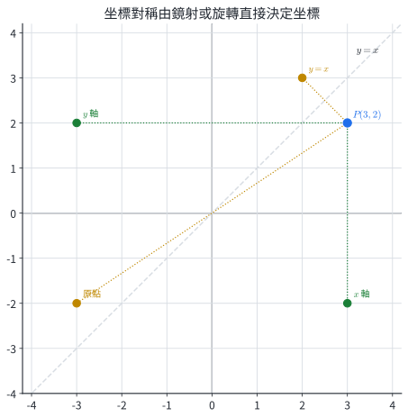{width=76%}

### 3.2 函數、常數函數與一次函數

若每一個允許的輸入 $x$ 都恰好對應一個輸出 $y$，便稱 $y$ 是 $x$ 的函數，記作 $y=f(x)$。函數圖形是所有滿足 $y=f(x)$ 的點 $(x,y)$ 所成的集合。

常數函數 $f(x)=c$ 的圖形是水平直線 $y=c$。一次函數

$$
f(x)=mx+b\qquad(m\ne0)
$$

的圖形是直線，斜率

$$
m=\frac{\Delta y}{\Delta x}
$$

表示輸入每增加一單位，輸出改變多少；$b=f(0)$ 是 $y$ 截距。由兩點 $(x_1,y_1)$、$(x_2,y_2)$ 且 $x_1\ne x_2$ 可求

$$
m=\frac{y_2-y_1}{x_2-x_1},\qquad b=y_1-mx_1.
$$

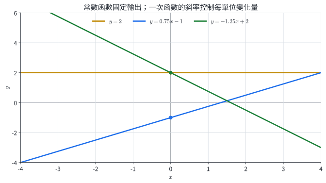{width=88%}

::: example
### 例 7｜點的對稱與中點

點 $P(-3,4)$ 關於 $x$ 軸、$y$ 軸、原點與 $y=x$ 的像點依序為

$$
(-3,-4),\quad(3,4),\quad(3,-4),\quad(4,-3).
$$

若 $A(-2,5)$、$B(6,-1)$，其中點為

$$
M\left(\frac{-2+6}{2},\frac{5+(-1)}{2}\right)=\boxed{(2,2)}.
$$
:::

::: example
### 例 8｜由兩筆資料建立一次模型

一校正線通過 $(2,5)$、$(6,13)$。求函數式與 $x=10$ 時的輸出。

$$
m=\frac{13-5}{6-2}=2.
$$

代入 $(2,5)$ 得 $5=2(2)+b$，所以 $b=1$。模型為 $f(x)=2x+1$，故 $f(10)=\boxed{21}$。
:::

#### 練習 3A

1. 寫出 $P(-3,4)$ 關於 $x$ 軸、$y$ 軸、原點與 $y=x$ 的像點。
2. 求 $A(-2,5)$、$B(6,-1)$ 的中點。
3. 判斷 $y^2=x$、$x^2+y^2=1$、$y=|x|$ 是否把 $y$ 定為 $x$ 的函數。
4. 求通過 $(-1,5)$、$(3,-3)$ 的一次函數，並求 $f(2)$。
5. 計程車費用為起跳 $45$ 元，之後每公里 $8.5$ 元。建立里程 $x$ 與費用 $C(x)$ 的模型，求 $12$ 公里的費用。

## 4. 二次函數：配方、判別式與極值

### 4.1 基本圖形與平移

二次函數的一般式為 $f(x)=ax^2+bx+c$，其中 $a\ne0$。基本圖形 $y=ax^2$ 關於 $y$ 軸對稱。$a>0$ 時開口向上，$a<0$ 時開口向下；在相同的 $y$ 高度下，$|a|$ 越大，所需的 $|x|$ 越小，因此圖形越窄。

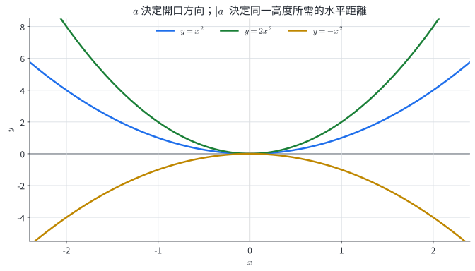{width=88%}

將 $y=ax^2$ 向右平移 $h$、向上平移 $k$，得到

$$
y=a(x-h)^2+k.
$$

理由是新圖上的輸入 $x$ 對應到原圖的輸入 $x-h$；原輸出為 $a(x-h)^2$，再加上垂直位移 $k$。

### 4.2 配方與頂點

一般式可配方為

$$
\begin{aligned}
ax^2+bx+c
&=a\left(x^2+\frac ba x\right)+c\\
&=a\left(x+\frac{b}{2a}\right)^2-\frac{b^2-4ac}{4a}.
\end{aligned}
$$

因此頂點與對稱軸為

$$
\boxed{\left(-\frac b{2a},-\frac{b^2-4ac}{4a}\right)},
\qquad
\boxed{x=-\frac b{2a}}.
$$

平方項的最小值是 $0$。當 $a>0$，頂點給全域最小值；當 $a<0$，頂點給全域最大值。

::: example
### 例 9｜配方讀出圖形資訊

將 $f(x)=2x^2-8x+5$ 配方，求頂點、對稱軸、最小值與 $x$ 軸交點。

$$
f(x)=2(x^2-4x)+5=2(x-2)^2-3.
$$

頂點是 $(2,-3)$，對稱軸是 $x=2$，最小值為 $-3$。令 $f(x)=0$：

$$
2(x-2)^2=3
\iff x=2\pm\frac{\sqrt6}{2}.
$$

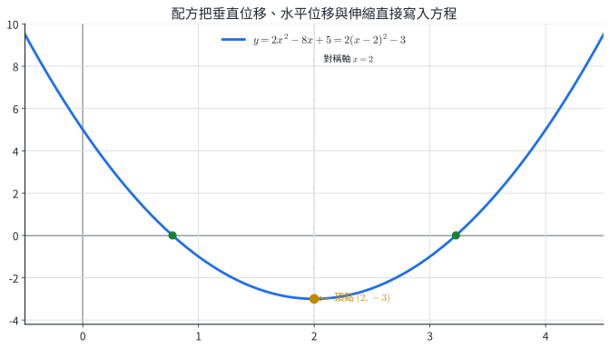{width=88%}
:::

### 4.3 判別式與交點

方程 $ax^2+bx+c=0$ 的判別式為 $D=b^2-4ac$。

- $D>0$：兩個相異實根，圖形穿越 $x$ 軸兩次。
- $D=0$：一個重根，圖形與 $x$ 軸相切。
- $D<0$：沒有實根，圖形與 $x$ 軸沒有交點。

當 $D<0$ 時，函數全程保持同號；其符號就是首項係數 $a$ 的符號。

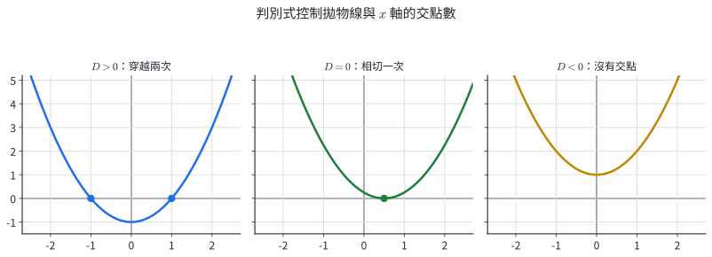{width=94%}

::: example
### 例 10｜用判別式判斷全程符號

判斷 $g(x)=x^2+6x+11$ 的圖形與符號。

$$
g(x)=(x+3)^2+2,
\qquad D=36-44=-8<0.
$$

圖形開口向上且沒有 $x$ 軸交點，所以對所有實數 $x$，皆有 $\boxed{g(x)>0}$。
:::

### 4.4 閉區間上的最大值與最小值

在閉區間 $[p,q]$ 上，二次函數的極值候選點是兩個端點，以及落在區間內的頂點。計算所有可取候選點的函數值後比較，即可得到最大值與最小值。

::: example
### 例 11｜閉區間極值

求 $f(x)=x^2-4x+1$ 在 $[0,3]$ 上的最大值與最小值。

$$
f(x)=(x-2)^2-3.
$$

頂點 $x=2$ 位於區間內。三個候選值為

$$
f(0)=1,\qquad f(2)=-3,\qquad f(3)=-2.
$$

所以最大值為 $\boxed1$，在 $x=0$ 取得；最小值為 $\boxed{-3}$，在 $x=2$ 取得。

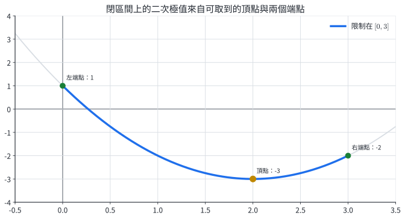{width=88%}
:::

::: example
### 例 12｜固定總長下的最大面積

長方形兩邊長為 $x$ 與 $20-x$，其中 $0\le x\le20$。求最大面積。

$$
A(x)=x(20-x)=-x^2+20x=-(x-10)^2+100.
$$

頂點 $x=10$ 位於允許區間，故最大面積為 $\boxed{100}$，此時兩邊都長 $10$。
:::

#### 練習 4A

1. 對 $y=-2(x+1)^2+5$，求頂點、對稱軸、最大值與 $x$ 軸交點。
2. 配方並判斷 $x^2+6x+11$ 的最小值與實根數。
3. 求 $-x^2+4x+5$ 在 $[-1,4]$ 上的最大值與最小值。
4. 求 $2x^2-12x+11$ 在 $[1,5]$ 上的最大值與最小值。
5. 長方形周長為 $40$，設一邊長 $x$。建立面積函數並求最大面積。
6. 求使 $x^2+(m-2)x+m=0$ 有重根的 $m$。

## 5. 三次函數：標準形、平移與局部近似

### 5.1 三次標準形與大域特徵

三次標準形為 $g(x)=ax^3+px$，其中 $a\ne0$。因為 $g(-x)=-g(x)$，圖形關於原點點對稱。當 $|x|$ 很大時，$ax^3$ 的成長速度超過 $px$，因此兩端方向由 $a$ 決定：

- $a>0$：左端向下、右端向上。
- $a<0$：左端向上、右端向下。

在原點附近，$g(x)=x(ax^2+p)$。當 $p\ne0$ 且 $|x|$ 足夠小，括號的符號由 $p$ 控制，所以 $p$ 決定圖形穿過原點附近的方向。這是局部判讀；遠端仍由 $a$ 控制。

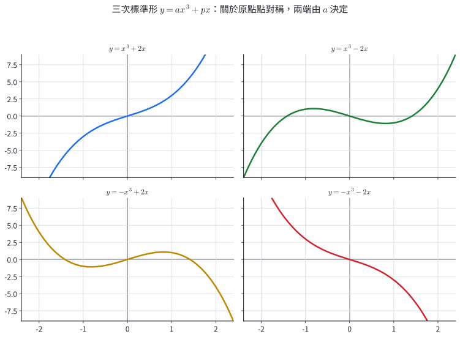{width=88%}

### 5.2 一般三次式化為平移標準形

設 $f(x)=ax^3+bx^2+cx+d$。令 $x=u+h$。展開後，$u^2$ 的係數為 $3ah+b$。選

$$
\boxed{h=-\frac b{3a}}
$$

便可消去二次項，得到

$$
f(x)=a(x-h)^3+p(x-h)+k.
$$

右側是標準形 $au^3+pu$ 向右平移 $h$、向上平移 $k$，所以圖形的對稱中心為

$$
\boxed{(h,k)=(h,f(h))}.
$$

::: example
### 例 13｜三次函數的平移與對稱中心

將 $f(x)=x^3-3x^2+2$ 化為平移標準形。

此處 $a=1,b=-3$，所以 $h=1$。令 $u=x-1$，即 $x=u+1$：

$$
f(x)=(u+1)^3-3(u+1)^2+2=u^3-3u.
$$

因此 $\boxed{f(x)=(x-1)^3-3(x-1)}$，對稱中心為 $(1,0)$，大域走向為左下到右上。

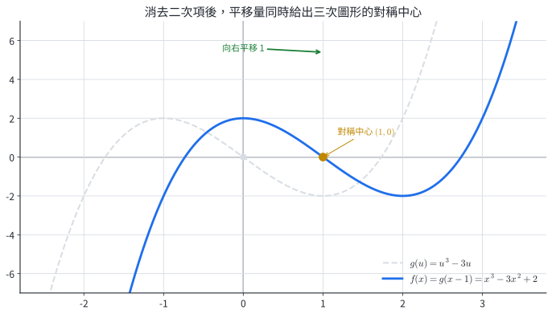{width=88%}
:::

### 5.3 連續綜合除法與指定點的一次近似

連續用 $x-h$ 做綜合除法，可以把 $n$ 次多項式唯一寫成

$$
f(x)=c_0+c_1(x-h)+c_2(x-h)^2+\cdots+c_n(x-h)^n.
$$

第一次綜合除法的餘式是 $c_0=f(h)$；把第一次的商再除以 $x-h$，下一個餘式是 $c_1$；依序進行便得到所有係數。

當 $x$ 很接近 $h$，位移 $u=x-h$ 很小，$u^2,u^3,\ldots$ 的量級迅速降低。保留前兩項可得局部一次近似

$$
\boxed{f(x)\approx c_0+c_1(x-h)}.
$$

近似的適用範圍由被省略的高次項控制；位移越小，誤差通常越小。

::: example
### 例 14｜在指定點建立一次近似

對 $f(x)=2x^3+6x^2+3x-3$ 在 $h=-2$ 附近建立一次近似，並估算 $f(-1.98)$。

令 $u=x+2$。連續綜合除法或直接代換可得

$$
f(x)=2u^3-6u^2+3u-1.
$$

保留常數項與一次項：$f(x)\approx3u-1=3(x+2)-1$。當 $x=-1.98$，$u=0.02$，所以近似值為 $\boxed{-0.94}$。精確值為

$$
2(0.02)^3-6(0.02)^2+3(0.02)-1=-0.942384,
$$

誤差絕對值為 $0.002384$。

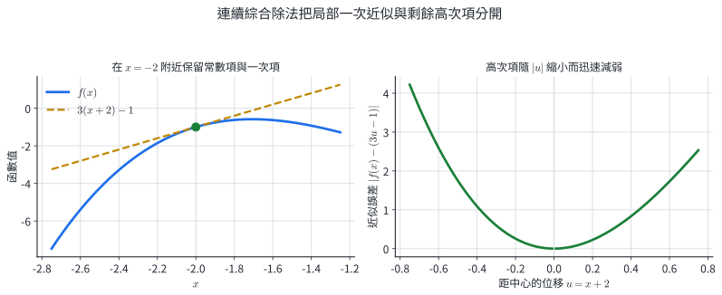{width=94%}
:::

#### 練習 5A

1. 將 $2x^3+6x^2+3x-1$ 化為 $2(x+1)^3+p(x+1)+k$，並求對稱中心。
2. 求 $2x^3-12x^2+9x+5$ 的對稱中心與兩端走向。
3. 將 $x^3+3x^2-1$ 以 $u=x+1$ 表示，寫出在 $x=-1$ 附近的一次近似。
4. 承上題，用一次近似估算 $f(-0.95)$，再計算精確值與誤差。
5. 若 $f(x)=a(x-h)^3+p(x-h)+k$，證明 $f(h+t)+f(h-t)=2k$。

## 6. 多項式不等式與重根變號

### 6.1 一次與二次不等式

一次不等式依等式的移項規則整理；兩邊同乘或同除負數時，不等號方向反轉。

二次不等式可轉成圖形相對於 $x$ 軸的位置。若 $a>0$ 且有兩相異根 $\alpha<\beta$，則

$$
ax^2+bx+c
\begin{cases}
>0,&x<\alpha\text{ 或 }x>\beta,\\
<0,&\alpha<x<\beta.
\end{cases}
$$

等號是否納入，由題目的 $\ge,\le$ 決定。$D=0$ 時函數只在重根處等於 $0$；$D<0$ 時函數保持首項係數的符號。

::: example
### 例 15｜一次與二次不等式

解 $-3x+6\le0$ 與 $x^2-x-6<0$。

第一題：$-3x\le-6$，同除以 $-3$ 得 $\boxed{x\ge2}$。

第二題：$x^2-x-6=(x+2)(x-3)$。開口向上，兩根為 $-2,3$，負值位於兩根之間，所以解為 $\boxed{-2<x<3}$。
:::

::: example
### 例 16｜重根對二次不等式的影響

解 $(x-2)^2\le0$。

平方恆為非負數，等於 $0$ 的條件是 $x=2$。因此解集為 $\boxed{\{2\}}$。
:::

### 6.2 可分解高次不等式

若

$$
P(x)=A\prod_i(x-r_i)^{m_i},
$$

各根 $r_i$ 把數線分成若干區間。每個區間內沒有根，函數值會維持同號。跨過根時：

- $m_i$ 為奇數，因式 $(x-r_i)^{m_i}$ 變號，整體符號翻轉。
- $m_i$ 為偶數，該因式兩側同號，整體符號保持。

先按大小排列根，從任一測試點取得一段符號，再依重數向左右推移即可。若題目含 $\ge$ 或 $\le$，所有使乘積為零的根都要依條件納入。

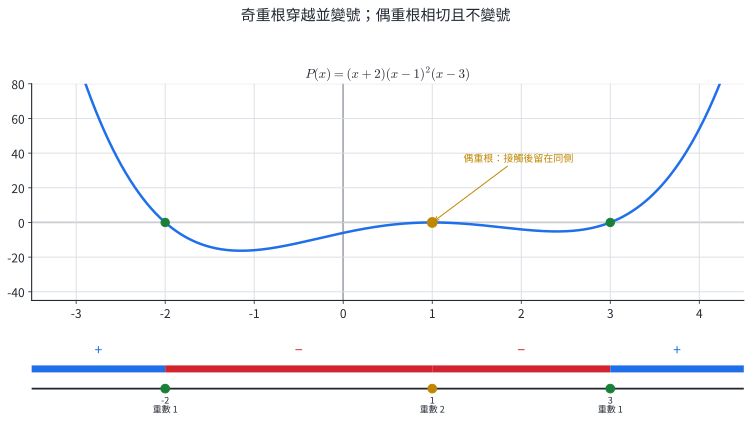{width=92%}

::: example
### 例 17｜含偶重根的高次不等式

解 $(x+2)(x-1)^2(x-3)\ge0$。

根依序為 $-2,1,3$，重數分別為 $1,2,1$。首項係數為正，最右側為正；跨過 $3$ 變負，跨過偶重根 $1$ 保持負，跨過 $-2$ 再變正。非負區間加上所有根，得到

$$
\boxed{(-\infty,-2]\cup\{1\}\cup[3,\infty)}.
$$
:::

::: example
### 例 18｜先確認恆正因式

解 $(x^2+1)(x-4)(x+1)<0$。

因 $x^2+1>0$ 對所有實數成立，乘積符號由 $(x-4)(x+1)$ 決定。開口向上的二次式在兩根 $-1,4$ 之間為負，所以 $\boxed{-1<x<4}$。
:::

#### 練習 6A

1. 解 $-4x+12>0$。
2. 解 $x^2-5x+6\le0$。
3. 解 $2x^2+4x+5>0$。
4. 解 $-(x-1)(x+2)>0$。
5. 解 $(x+3)x(2x-1)\le0$。
6. 解 $(x-2)^2(x+1)<0$。

## 7. 分節練習完整解析

### 練習 1A

1. $3x^4-\sqrt2x+1$ 為四次多項式，首項係數 $3$、常數項 $1$。$x^{-1}+2$ 含負整數指數，$\sqrt{x}+1$ 含分數指數，兩式都不符合多項式定義。
2. 比較三次與二次項係數：$a-1=0$、$b+2=0$，故 $\boxed{a=1,b=-2}$。
3. 依分配律展開得 $\boxed{2x^3-5x^2+5x-6}$。
4. 三次項相消，$f+g=\boxed{x^2-2x+5}$，次數為 $2$。
5. $C(3)=2(27)-5(3)+12=\boxed{51}$。

### 練習 2A

1. $x^4-1=(x^2+1)(x^2-1)$，故商為 $\boxed{x^2-1}$，餘式為 $0$。
2. 對 $a=-1$ 做綜合除法，係數 $3,0,-2,0,7$ 得底列 $3,-3,1,-1,8$。商為 $\boxed{3x^3-3x^2+x-1}$，餘式為 $\boxed8$。
3. 除式 $2x-1$ 的零點為 $1/2$。餘式為
   $$2\left(\frac12\right)^5-3\left(\frac12\right)+4=\boxed{\frac{41}{16}}.$$
4. 因式定理給 $8+4a-10+6=0$，所以 $\boxed{a=-1}$。
5. 設餘式 $mx+n$。由 $m+n=2$、$-2m+n=-4$ 得 $m=2,n=0$，故餘式為 $\boxed{2x}$。
6. 整除 $x^2-1=(x-1)(x+1)$ 給 $f(1)=f(-1)=0$：
   $$2+2a+b=0,\qquad2-2a+b=0.$$
   相減得 $a=0$，再得 $b=-2$。故 $\boxed{a=0,b=-2}$。

### 練習 3A

1. 依序為 $\boxed{(-3,-4),(3,4),(3,-4),(4,-3)}$。
2. 中點為 $\left((-2+6)/2,(5-1)/2\right)=\boxed{(2,2)}$。
3. $y^2=x$ 在 $x=4$ 對應 $y=\pm2$；$x^2+y^2=1$ 在多數 $x\in(-1,1)$ 對應兩個 $y$，所以兩者都未把 $y$ 定為 $x$ 的函數。$y=|x|$ 對每個實數 $x$ 有唯一輸出，故為函數。
4. 斜率 $m=(-3-5)/(3+1)=-2$。代入 $(-1,5)$ 得 $b=3$，所以 $f(x)=\boxed{-2x+3}$，$f(2)=\boxed{-1}$。
5. $C(x)=\boxed{8.5x+45}$，$C(12)=102+45=\boxed{147}$ 元。

### 練習 4A

1. 頂點 $(-1,5)$，對稱軸 $x=-1$，最大值 $5$。令 $-2(x+1)^2+5=0$，得交點 $x=\boxed{-1\pm\sqrt{5/2}}$。
2. $x^2+6x+11=(x+3)^2+2$，最小值為 $\boxed2$；判別式 $-8<0$，故實根數為 $0$。
3. $-x^2+4x+5=-(x-2)^2+9$。候選值 $f(-1)=0,f(2)=9,f(4)=5$，故最大值 $\boxed9$，最小值 $\boxed0$。
4. $2x^2-12x+11=2(x-3)^2-7$。候選值 $f(1)=1,f(3)=-7,f(5)=1$，故最大值 $\boxed1$，最小值 $\boxed{-7}$。
5. 另一邊為 $20-x$，$A(x)=x(20-x)=-(x-10)^2+100$，故最大面積為 $\boxed{100}$。
6. 重根條件 $D=0$：
   $$(m-2)^2-4m=m^2-8m+4=0,$$
   所以 $\boxed{m=4\pm2\sqrt3}$。

### 練習 5A

1. 令 $u=x+1$，展開得 $2u^3-3u$，故 $p=-3,k=0$，對稱中心為 $\boxed{(-1,0)}$。
2. $h=-(-12)/(3\cdot2)=2$，$k=f(2)=16-48+18+5=-9$，中心為 $\boxed{(2,-9)}$。首項係數為正，兩端為左下、右上。
3. 令 $u=x+1$，則 $f(x)=u^3-3u+1$，一次近似為 $\boxed{1-3u=1-3(x+1)}$。
4. $u=0.05$，近似值 $1-3(0.05)=0.85$；精確值 $0.05^3-3(0.05)+1=0.850125$，誤差為 $\boxed{0.000125}$。
5. 直接代入：
   $$f(h+t)=at^3+pt+k,\qquad f(h-t)=-at^3-pt+k.$$
   相加得 $\boxed{2k}$，這正是以 $(h,k)$ 為中點的數值對稱。

### 練習 6A

1. $-4x>-12$，同除以 $-4$ 得 $\boxed{x<3}$。
2. $(x-2)(x-3)\le0$，解為 $\boxed{[2,3]}$。
3. 判別式 $16-40=-24<0$ 且開口向上，故解為 $\boxed{\mathbb R}$。
4. 等價於 $(x-1)(x+2)<0$，解為 $\boxed{(-2,1)}$。
5. 根為 $-3,0,1/2$，皆為奇重根。符號由最右側向左依序翻轉，解為 $\boxed{(-\infty,-3]\cup[0,1/2]}$。
6. 偶次因式 $(x-2)^2$ 在 $x=2$ 兩側保持正號，整體負號出現在 $x+1<0$，故解為 $\boxed{(-\infty,-1)}$。

## 8. 章末代表題

### 基礎與核心（第 1–12 題）

1. 若 $(m-2)x^4+(n+1)x^2+3$ 恆等於常數 $3$，求 $m,n$。
2. 設 $f(x)=2x^2-x+1$、$g(x)=x-3$，求 $f(x)g(x)$。
3. 用綜合除法求 $(2x^3+x^2-5)\div(x+2)$ 的商與餘式。
4. 求 $x^5-3x+2$ 除以 $2x+1$ 的餘式。
5. 點 $P(2,-5)$ 關於 $y=x$ 與原點的像點各為何？
6. 一次函數通過 $(1,4)$、$(5,16)$。求函數式與 $f(8)$。
7. 將 $-2x^2+8x-3$ 配方，求頂點、最大值與兩個零點。
8. 求第 7 題函數在 $[0,3]$ 上的最大值與最小值。
9. 將 $2x^3-6x^2-3x+7$ 化為平移標準形，求對稱中心與兩端走向。
10. 將 $f(x)=x^3+2x^2-x+4$ 以 $u=x-1$ 展開，寫出 $x=1$ 附近的一次近似，並估算 $f(1.02)$。
11. 解 $2x^2-x-3\ge0$。
12. 解 $(x+1)^2(x-2)(x-4)<0$。

### 跨節整合（第 13–16 題）

13. 一首項係數為 $1$ 的三次多項式滿足 $f(1)=f(-2)=0$、$f(0)=12$，第三個根為實數。求 $f(x)$，並解 $f(x)\le0$。
14. 某商品售出 $x$ 件時，每件價格為 $80-2x$ 元，且 $0\le x\le40$。建立收益函數，求最大收益與對應售價。
15. 對 $f(x)=2x^3+6x^2+3x-3$，用連續綜合除法在 $x=-2$ 附近建立一次近似。估算 $f(-1.98)$，並以高次項算出誤差。
16. 三次式 $f(x)=x^3+ax^2+bx+6$ 可被 $(x-1)(x+2)$ 整除。求 $a,b$，再解 $f(x)\ge0$。

## 9. 章末代表題完整詳解

### 第 1 題

恆等於常數表示四次項與二次項係數皆為 $0$：

$$
m-2=0,\qquad n+1=0.
$$

故 $\boxed{m=2,n=-1}$。

### 第 2 題

$$
\begin{aligned}
(2x^2-x+1)(x-3)
&=2x^3-6x^2-x^2+3x+x-3\\
&=\boxed{2x^3-7x^2+4x-3}.
\end{aligned}
$$

### 第 3 題

除式 $x+2=x-(-2)$。係數 $2,1,0,-5$ 以 $-2$ 綜合除法，底列為 $2,-3,6,-17$。因此

$$
\boxed{q(x)=2x^2-3x+6,\qquad r=-17}.
$$

### 第 4 題

$2x+1$ 的零點為 $-1/2$。依餘式定理：

$$
\left(-\frac12\right)^5-3\left(-\frac12\right)+2
=-\frac1{32}+\frac32+2
=\boxed{\frac{111}{32}}.
$$

### 第 5 題

關於 $y=x$ 時交換坐標，得到 $\boxed{(-5,2)}$；關於原點時兩坐標同時變號，得到 $\boxed{(-2,5)}$。

### 第 6 題

$$
m=\frac{16-4}{5-1}=3.
$$

代入 $(1,4)$ 得 $4=3+b$，故 $b=1$。函數為 $\boxed{f(x)=3x+1}$，並且 $f(8)=24+1=\boxed{25}$。

### 第 7 題

$$
-2x^2+8x-3=-2(x-2)^2+5.
$$

頂點為 $(2,5)$，最大值為 $5$。令函數值為 $0$：

$$
-2(x-2)^2+5=0
\iff (x-2)^2=\frac52,
$$

所以零點為 $\boxed{x=2\pm\sqrt{10}/2}$。

### 第 8 題

頂點 $x=2$ 位於 $[0,3]$。候選值為

$$
f(0)=-3,\qquad f(2)=5,\qquad f(3)=3.
$$

故最大值為 $\boxed5$，最小值為 $\boxed{-3}$。

### 第 9 題

$a=2,b=-6$，所以

$$
h=-\frac{-6}{3\cdot2}=1.
$$

令 $u=x-1$，即 $x=u+1$，展開得

$$
2x^3-6x^2-3x+7=2u^3-9u.
$$

因此 $\boxed{f(x)=2(x-1)^3-9(x-1)}$，對稱中心為 $\boxed{(1,0)}$。首項係數為正，兩端為左下、右上。

### 第 10 題

令 $u=x-1$，則 $x=u+1$：

$$
\begin{aligned}
f(x)&=(u+1)^3+2(u+1)^2-(u+1)+4\\
&=u^3+5u^2+6u+6.
\end{aligned}
$$

一次近似為 $\boxed{f(x)\approx6+6u=6+6(x-1)}$。當 $x=1.02$，$u=0.02$：

$$
f(1.02)\approx6+6(0.02)=\boxed{6.12}.
$$

精確值為 $6.122008$，兩者相差 $0.002008$。

### 第 11 題

$$
2x^2-x-3=(2x-3)(x+1).
$$

開口向上，兩根為 $-1,3/2$，非負值位於兩根外側並含根：

$$
\boxed{(-\infty,-1]\cup[3/2,\infty)}.
$$

### 第 12 題

根為 $-1,2,4$，其中 $-1$ 是偶重根。$(x+1)^2$ 在 $x=-1$ 兩側同號，乘積的負號由 $(x-2)(x-4)$ 決定，位於兩根之間。因此 $\boxed{(2,4)}$。

### 第 13 題｜因式資訊與符號分析

由因式定理，設

$$
f(x)=(x-1)(x+2)(x-r).
$$

代入 $x=0$：$2r=12$，故 $r=6$，

$$
\boxed{f(x)=(x-1)(x+2)(x-6)}.
$$

三個根依序為 $-2,1,6$，皆為奇重根；首項係數為正，所以符號由右向左依序為正、負、正、負。非正區間含各根：

$$
\boxed{(-\infty,-2]\cup[1,6]}.
$$

### 第 14 題｜收益模型與閉區間極值

收益等於件數乘單價：

$$
R(x)=x(80-2x)=-2x^2+80x=-2(x-20)^2+800.
$$

頂點 $x=20$ 位於 $[0,40]$，故最大收益為 $\boxed{800}$ 元。此時每件售價為

$$
80-2(20)=\boxed{40}\text{ 元}.
$$

### 第 15 題｜局部展開與誤差

以 $u=x+2$ 做連續綜合除法，得到

$$
f(x)=2u^3-6u^2+3u-1.
$$

一次近似為 $3u-1$。當 $x=-1.98$，$u=0.02$：

$$
f(-1.98)\approx3(0.02)-1=\boxed{-0.94}.
$$

被省略的高次項為

$$
2u^3-6u^2=2(0.02)^3-6(0.02)^2=-0.002384.
$$

因此精確值為 $-0.942384$，近似誤差的絕對值為 $\boxed{0.002384}$。

### 第 16 題｜整除條件與三次不等式

整除 $(x-1)(x+2)$ 等價於 $f(1)=f(-2)=0$：

$$
1+a+b+6=0,
$$

$$
-8+4a-2b+6=0.
$$

整理得 $a+b=-7$、$2a-b=1$，解得 $\boxed{a=-2,b=-5}$。所以

$$
f(x)=x^3-2x^2-5x+6=(x-1)(x+2)(x-3).
$$

三個根 $-2,1,3$ 都是奇重根，首項係數為正。非負區間為

$$
\boxed{[-2,1]\cup[3,\infty)}.
$$

## 10. 核心整理

1. 多項式的指數是非負整數；相等多項式逐次方比較係數。
2. 除法原理是 $f=gq+r$，餘式次數低於除式；除以 $x-a$ 時，餘式為 $f(a)$。
3. $f(a)=0$ 等價於 $x-a$ 是因式。二次除式的線性餘式可由兩個函數值決定。
4. 二次函數配方後可直接讀出頂點、對稱軸與全域極值；閉區間另比較兩端點與區間內頂點。
5. 判別式決定二次函數與 $x$ 軸的交點數，也決定二次不等式的解集型態。
6. 一般三次式以 $h=-b/(3a)$ 平移後消去二次項，對稱中心為 $(h,f(h))$；遠端由最高次項決定。
7. 連續綜合除法可建立以 $x-h$ 為基底的展開；靠近 $h$ 時保留常數項與一次項得到局部近似。
8. 多項式不等式先找根並依重數判斷變號：奇重根變號，偶重根保持符號。
