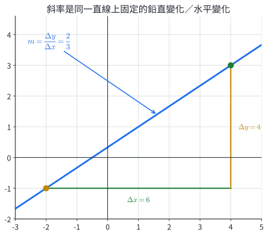
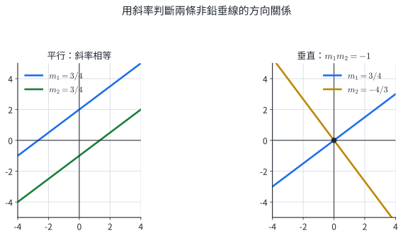
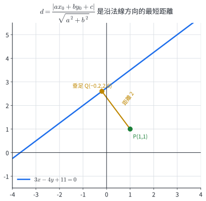
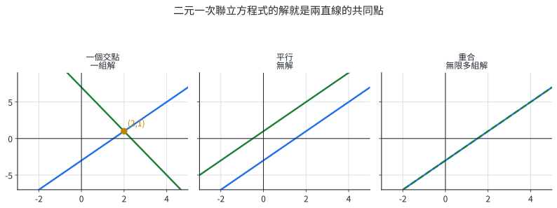
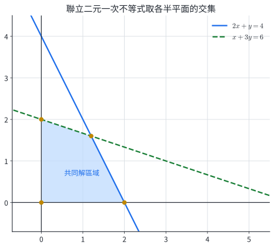
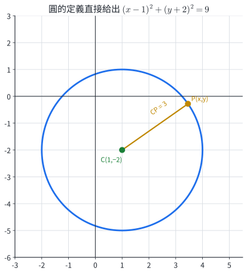
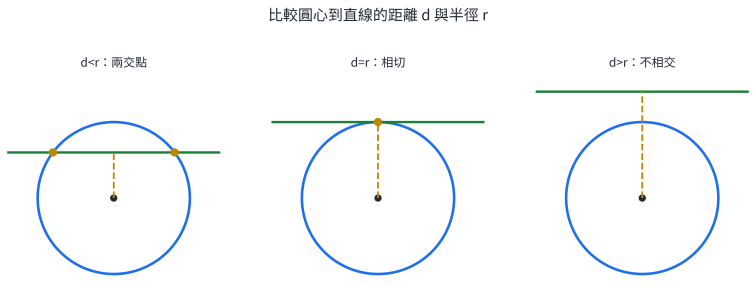
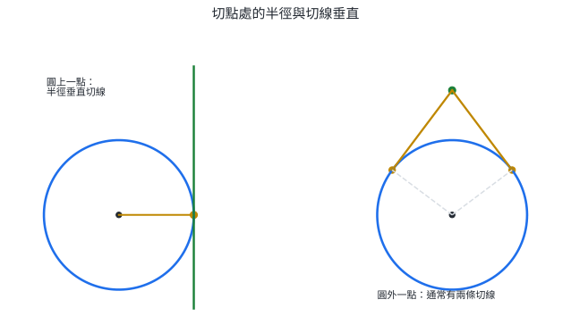

# 數1-4 直線與圓

::: learning-map
### 本章問題與能力

1. 一個點與一個方向，或兩個相異點，如何唯一決定一條直線？
2. 平行、垂直、聯立方程式與點線距離，如何轉成可以計算的代數條件？
3. 二元一次不等式如何表示平面上的可行區域？
4. 圓心與半徑如何寫成方程式，又如何判斷直線與圓相交、相切或分離？
5. 切線為何與切點半徑垂直？這個幾何事實如何直接產生切線方程式？

本章路徑：斜率與直線方程式 → 平移、平行與垂直 → 聯立方程式與距離 → 半平面 → 圓方程式 → 圓與直線 → 切線。
:::

## 0. 本章實際用途：把幾何限制寫成可計算的條件

道路坡度、屋頂傾角與感測器校正線都由「水平改變多少時，鉛直改變多少」描述，這正是斜率。兩條道路是否平行、支架是否互相垂直，也能由斜率或方程式的係數判定。

位置規劃常同時含多個限制。例如倉庫必須位在道路東側、河川北側，且距離高壓線至少某個安全距離。直線方程式描述邊界，線性不等式描述邊界的一側，點線距離則量化安全間隔。

圓形通訊範圍、雷達偵測區與機械轉盤，都可用「到固定中心的距離等於或不超過某值」建模。比較圓心到直線的最短距離與半徑，就能判斷道路是否穿過管制區；切線則描述剛好接觸邊界的路徑。

## 1. 斜率與直線方程式

### 1.1 斜率是固定的鉛直變化率

直線上兩相異點 $P(x_1,y_1)$、$Q(x_2,y_2)$ 若滿足 $x_1\ne x_2$，斜率定義為

$$
\boxed{m=\frac{y_2-y_1}{x_2-x_1}=\frac{\Delta y}{\Delta x}}.
$$

直線上的任意兩點都給出同一個比值。因為兩個斜率三角形相似，對應的高與底成固定比例。交換 $P,Q$ 時，分子與分母同時變號，斜率仍相同。

{width=94%}

鉛直線 $x=a$ 的兩點有 $\Delta x=0$，斜率不定義；水平線 $y=b$ 的斜率為 $0$。這兩種情形在列方程式時直接使用 $x=a$ 或 $y=b$。

### 1.2 一個點與一個方向決定直線

斜率為 $m$ 且通過 $P(x_1,y_1)$ 的直線上，每一點 $(x,y)$ 都滿足

$$
\frac{y-y_1}{x-x_1}=m.
$$

移項得到點斜式

$$
\boxed{y-y_1=m(x-x_1)}.
$$

由點斜式可整理成幾種常用形式：

- 斜截式：$y=mx+b$，其中 $m$ 是斜率，$(0,b)$ 是 $y$ 軸截點。
- 兩點式：$\dfrac{y-y_1}{y_2-y_1}=\dfrac{x-x_1}{x_2-x_1}$，適用於兩點的橫坐標、縱坐標皆相異。
- 截距式：$\dfrac{x}{a}+\dfrac{y}{b}=1$，其中 $(a,0)$、$(0,b)$ 是兩軸截點，且 $a,b\ne0$。
- 一般式：$Ax+By+C=0$，其中 $A,B$ 不同時為 $0$；它同時容納鉛直線與非鉛直線。

::: example
### 例 1｜由兩點建立直線方程式

求通過 $P(-2,-1)$、$Q(4,3)$ 的直線方程式。

先算斜率：

$$
m=\frac{3-(-1)}{4-(-2)}=\frac46=\frac23.
$$

以 $P$ 代入點斜式：

$$
y+1=\frac23(x+2).
$$

乘以 $3$ 並整理：

$$
3y+3=2x+4
\quad\Longrightarrow\quad
\boxed{2x-3y+1=0}.
$$

將 $P,Q$ 分別代回，左式都等於 $0$，所以兩點都在此直線上。
:::

::: example
### 例 2｜依資訊選擇方程式形式

一直線與 $x$ 軸、$y$ 軸分別交於 $(6,0)$、$(0,-3)$，求其方程式與斜率。

兩個非零截距已知，直接用截距式：

$$
\frac{x}{6}+\frac{y}{-3}=1.
$$

整理得

$$
x-2y=6
\quad\Longrightarrow\quad
y=\frac12x-3.
$$

因此方程式為 $\boxed{x-2y-6=0}$，斜率為 $\boxed{1/2}$。
:::

#### 練習 1A

1. 求通過 $(2,-1)$、$(5,8)$ 的直線方程式。
2. 求斜率為 $-2$ 且通過 $(-1,4)$ 的直線方程式。
3. 一直線的 $x$ 軸截距為 $4$、$y$ 軸截距為 $-2$，求一般式。
4. 寫出 $2x+3y-6=0$ 的斜率與兩軸截距。
5. 分別寫出通過 $(-3,2)$ 的鉛直線，以及通過 $(4,5)$ 的水平線。

## 2. 平移、平行、垂直與垂足

### 2.1 圖形平移反映在坐標替換

曲線 $F(x,y)=0$ 向右平移 $h$、向上平移 $k$ 後，新圖形上的點 $(x,y)$ 來自原圖形上的 $(x-h,y-k)$，因此新方程式是

$$
\boxed{F(x-h,y-k)=0}.
$$

若直線 $Ax+By+C=0$ 平移後仍是直線，係數 $A,B$ 保持不變，方向也保持不變；只有常數項改變。

### 2.2 平行與垂直的代數條件

兩條非鉛直直線斜率分別為 $m_1,m_2$：

$$
\boxed{m_1=m_2\iff\text{兩直線平行或重合}},
$$

$$
\boxed{m_1m_2=-1\iff\text{兩直線垂直}}.
$$

第二式可由方向向量推得。斜率 $m$ 的方向向量可取 $(1,m)$；兩方向垂直時內積為 $1+m_1m_2=0$。

{width=94%}

一般式 $A_1x+B_1y+C_1=0$、$A_2x+B_2y+C_2=0$ 的法向量分別為 $(A_1,B_1)$、$(A_2,B_2)$。因此：

$$
A_1B_2-A_2B_1=0\iff\text{方向平行},
$$

$$
A_1A_2+B_1B_2=0\iff\text{兩直線垂直}.
$$

這組係數條件也適用於鉛直線與水平線。

::: example
### 例 3｜通過定點的平行線與垂直線

已知 $L:2x-3y+5=0$，求通過 $P(1,4)$ 且分別與 $L$ 平行、垂直的直線。

$L$ 的法向量為 $(2,-3)$。平行線可寫成 $2x-3y+C=0$。代入 $P$：$2-12+C=0$，得 $C=10$，所以平行線為

$$
\boxed{2x-3y+10=0}.
$$

與 $L$ 垂直的直線可取法向量 $(3,2)$，寫成 $3x+2y+C=0$。代入 $P$ 得 $3+8+C=0$，所以

$$
\boxed{3x+2y-11=0}.
$$
:::

::: example
### 例 4｜求點到直線的垂足

求 $P(1,1)$ 到 $L:3x-4y+11=0$ 的垂足。

$L$ 的斜率為 $3/4$，垂線斜率為 $-4/3$。過 $P$ 的垂線為

$$
y-1=-\frac43(x-1)
\quad\Longrightarrow\quad
4x+3y-7=0.
$$

聯立

$$
\begin{cases}
3x-4y=-11,\\
4x+3y=7,
\end{cases}
$$

得到 $\boxed{Q(-1/5,13/5)}$。由斜率 $m_{PQ}=-4/3$ 可再確認 $PQ\perp L$。

{width=88%}
:::

#### 練習 2A

1. 將 $y=2x-1$ 向右平移 $3$、向上平移 $4$，求新方程式。
2. 求通過 $(2,-1)$ 且平行於 $3x-4y+7=0$ 的直線。
3. 求通過 $(4,0)$ 且垂直於 $x+2y-5=0$ 的直線。
4. 求點 $(1,5)$ 到直線 $x+y-1=0$ 的垂足。
5. 若 $kx+2y-1=0$ 與 $4x-2y+3=0$ 垂直，求 $k$。

## 3. 聯立方程式與直線距離

### 3.1 方程組的解就是幾何交點

二元一次聯立方程式

$$
\begin{cases}
A_1x+B_1y+C_1=0,\\
A_2x+B_2y+C_2=0
\end{cases}
$$

要求同時落在兩條直線上的點，因此有三種幾何結果：

- 兩直線相交：恰有一組解。
- 兩直線平行且不同：無解。
- 兩方程式描述同一直線：有無限多組解。

{width=98%}

若 $A_1B_2-A_2B_1\ne0$，兩直線方向不同，必有唯一交點。若此值為 $0$，再比較包含常數項的比例，便可區分平行或重合。

::: example
### 例 5｜由係數判斷解的個數並求交點

討論

$$
\begin{cases}
2x-y=3,\\
kx-2y=4
\end{cases}
$$

的解。

兩式係數行列式為

$$
\begin{vmatrix}2&-1\\k&-2\end{vmatrix}=k-4.
$$

當 $k\ne4$ 時有唯一解。由第一式 $y=2x-3$，代入第二式得

$$
(k-4)x=-2,
$$

所以 $\boxed{x=-2/(k-4)}$、$\boxed{y=-4/(k-4)-3}$。當 $k=4$ 時，第二式化為 $2x-y=2$，與第一式平行且不同，因此無解。
:::

### 3.2 點到直線的距離公式

設 $P(x_0,y_0)$，直線 $L:Ax+By+C=0$，其中 $(A,B)\ne(0,0)$。向量 $(A,B)$ 垂直於 $L$。從直線上任取 $Q(x_1,y_1)$，向量 $\overrightarrow{QP}$ 在單位法向量上的投影長度就是最短距離：

$$
d=\left|\overrightarrow{QP}\cdot\frac{(A,B)}{\sqrt{A^2+B^2}}\right|.
$$

因為 $Ax_1+By_1+C=0$，可化簡為

$$
\boxed{d(P,L)=\frac{|Ax_0+By_0+C|}{\sqrt{A^2+B^2}}}.
$$

絕對值使距離保持非負；分母把法向量正規化，因此同一條直線的方程式乘上任意非零常數，距離仍不變。

::: example
### 例 6｜安全距離與平行線間距

一條管線以 $3x-4y+20=0$ 表示，控制站位於 $P(4,1)$。求站點到管線的最短距離。另求與管線平行、位於原點一側並相距 $6$ 的直線。

站點到管線的距離為

$$
d=\frac{|3(4)-4(1)+20|}{5}=\frac{28}{5}.
$$

平行線可寫成 $3x-4y+C=0$。由 $|C-20|/5=6$ 得 $C=50$ 或 $-10$。在候選直線上，原管線左式 $3x-4y+20$ 的值分別為 $-30$ 與 $30$；原點代入原管線左式為 $20>0$。因此位於原點一側的平行線是

$$
\boxed{3x-4y-10=0}.
$$
:::

#### 練習 3A

1. 求 $x+y=5$ 與 $2x-y=1$ 的交點。
2. 判斷 $2x-3y=1$ 與 $4x-6y=5$ 所成方程組的解數。
3. 求點 $(3,-1)$ 到直線 $4x+3y-6=0$ 的距離。
4. 求平行線 $2x-y+3=0$ 與 $2x-y-7=0$ 的距離。
5. 求點 $(0,4)$ 到直線 $3x+4y-12=0$ 的垂足。

## 4. 二元一次不等式與半平面

### 4.1 一條直線把平面分成兩側

直線 $Ax+By+C=0$ 把平面分成 $Ax+By+C>0$ 與 $Ax+By+C<0$ 兩個半平面。選一個不在邊界上的測試點代入，即可判定哪一側符合不等式。若是不嚴格不等式 $\le$ 或 $\ge$，邊界直線包含在解集中；若是嚴格不等式 $<$ 或 $>$，邊界不包含在解集中。

兩點 $P,Q$ 對同一條直線的代入值若同號，兩點位於同側；若異號，兩點位於異側。這是因為沿線段 $PQ$ 的一次式連續變化，異號時必在中間經過 $0$。

::: example
### 例 7｜由測試點判定半平面

畫出 $2x-y-4\le0$ 的解區域。

邊界為 $y=2x-4$。取原點測試，得到 $-4\le0$，因此原點所在側是解區域，邊界也包含在內。等價地，原不等式可整理成

$$
\boxed{y\ge2x-4}.
$$
:::

### 4.2 多個限制取交集

聯立二元一次不等式的解，是各半平面的交集。邊界直線的交點與坐標軸截點常形成可行區域的頂點；把每個頂點代回全部不等式，可以檢查是否真的屬於交集。

::: example
### 例 8｜求聯立不等式的可行區域頂點

求

$$
\begin{cases}
x\ge0,\\
y\ge0,\\
2x+y\le4,\\
x+3y\le6
\end{cases}
$$

的可行區域頂點。

兩條斜邊聯立得 $(x,y)=(6/5,8/5)$。坐標軸上同時符合全部限制的端點是 $(2,0)$ 與 $(0,2)$，再加上原點。因此頂點為

$$
\boxed{(0,0),\ (2,0),\ (6/5,8/5),\ (0,2)}.
$$

{width=90%}
:::

#### 練習 4A

1. 說明 $2x+y\le4$ 的邊界是否包含在解集中，並判斷原點所在側是否為解區域。
2. 求 $x\ge0,y\ge0,2x+y\le4,x+3y\le6$ 的所有頂點。
3. 判斷 $A(1,1)$、$B(3,4)$ 位於直線 $x-2y+3=0$ 的同側或異側。
4. 將 $y>2x-1$ 寫成一般式不等式，並說明原點是否在解區域。
5. 求 $x\ge0,y\ge0,x+y\le5,2x+y\ge4$ 的所有頂點。

## 5. 圓的方程式與點的位置

### 5.1 圓的定義直接產生標準式

圓是平面上到固定點 $C(h,k)$ 的距離都等於正數 $r$ 的點集。由距離公式，點 $P(x,y)$ 在圓上等價於

$$
\sqrt{(x-h)^2+(y-k)^2}=r.
$$

兩邊平方得到標準式

$$
\boxed{(x-h)^2+(y-k)^2=r^2},\qquad r>0.
$$

{width=86%}

若已知圓的直徑端點 $A,B$，圓心是線段中點，半徑是 $AB/2$。這比直接設一般式的三個未知係數更有效率。

### 5.2 一般式與存在條件

展開標準式可得

$$
x^2+y^2+Dx+Ey+F=0.
$$

配方後成為

$$
\left(x+\frac D2\right)^2+
\left(y+\frac E2\right)^2
=\frac{D^2+E^2}{4}-F.
$$

因此圓心與半徑平方為

$$
\boxed{C\left(-\frac D2,-\frac E2\right)},\qquad
\boxed{r^2=\frac{D^2+E^2}{4}-F}.
$$

$r^2>0$ 時是圓；$r^2=0$ 時只剩圓心一點；$r^2<0$ 時沒有實數點。

::: example
### 例 9｜由三點決定圓

求通過 $A(0,0)$、$B(4,0)$、$C(0,6)$ 的圓。

設一般式為

$$
x^2+y^2+Dx+Ey+F=0.
$$

代入 $A$ 得 $F=0$；代入 $B$ 得 $16+4D=0$，所以 $D=-4$；代入 $C$ 得 $36+6E=0$，所以 $E=-6$。圓為

$$
x^2+y^2-4x-6y=0.
$$

配方得到

$$
\boxed{(x-2)^2+(y-3)^2=13}.
$$

圓心 $(2,3)$ 正是直角三角形 $ABC$ 斜邊 $BC$ 的中點。
:::

::: example
### 例 10｜參數何時代表真正的圓

討論

$$
x^2+y^2-2ax+4y+2a=0
$$

在不同 $a$ 下的圖形。

配方得

$$
(x-a)^2+(y+2)^2=a^2-2a+4=(a-1)^2+3.
$$

右式對所有實數 $a$ 都大於 $0$，因此每一個實數 $a$ 都給出真正的圓。圓心與半徑為

$$
\boxed{(a,-2)},\qquad
\boxed{\sqrt{(a-1)^2+3}}.
$$
:::

### 5.3 點在圓內、圓上或圓外

對圓 $(x-h)^2+(y-k)^2=r^2$ 與點 $P(x_0,y_0)$，比較

$$
PC^2=(x_0-h)^2+(y_0-k)^2
$$

和 $r^2$：小於時在圓內，等於時在圓上，大於時在圓外。使用平方距離即可完成判斷，無須先開根號。

#### 練習 5A

1. 寫出圓心 $(-2,3)$、半徑 $4$ 的圓方程式。
2. 將 $x^2+y^2-6x+4y-3=0$ 化為標準式，並求圓心、半徑。
3. 判斷 $x^2+y^2+2ax-4y+a=0$ 對哪些實數 $a$ 表示真正的圓。
4. 判斷點 $(5,1)$ 在圓 $(x-1)^2+(y-1)^2=9$ 的內部、圓上或外部。
5. 圓的直徑端點為 $(-1,2)$、$(5,-4)$，求圓方程式。

## 6. 圓與直線的位置關係

### 6.1 比較圓心到直線的距離與半徑

設圓心到直線的距離為 $d$、圓半徑為 $r$。沿圓心到直線的垂線觀察：

$$
\boxed{
\begin{array}{ccl}
d<r&\Longrightarrow&\text{兩個交點},\\
d=r&\Longrightarrow&\text{一個交點，直線為切線},\\
d>r&\Longrightarrow&\text{沒有交點}.
\end{array}}
$$

{width=98%}

這個方法只需一次距離計算，適合判斷交點個數。若題目還要求交點坐標，則把直線方程式代入圓，解所得的一元二次方程式。

::: example
### 例 11｜以距離判斷位置關係

判斷直線 $3x-4y+1=0$ 與圓

$$
(x-2)^2+(y+1)^2=9
$$

的位置關係。

圓心為 $(2,-1)$，半徑 $r=3$。圓心到直線的距離為

$$
d=\frac{|3(2)-4(-1)+1|}{5}=\frac{11}{5}.
$$

因為 $11/5<3$，所以直線穿過圓，有 $\boxed{2\text{ 個交點}}$。
:::

::: example
### 例 12｜求直線截圓所得的交點

求直線 $y=x+1$ 與圓 $x^2+y^2=5$ 的交點。

代入 $y=x+1$：

$$
x^2+(x+1)^2=5
\quad\Longrightarrow\quad
x^2+x-2=0.
$$

因式分解為 $(x-1)(x+2)=0$，所以 $x=1$ 或 $-2$。由 $y=x+1$ 得

$$
\boxed{(1,2),\ (-2,-1)}.
$$

兩點代回圓方程式都得到 $5$，也都滿足直線方程式。
:::

#### 練習 6A

1. 求圓 $x^2+y^2=25$ 與直線 $y=3$ 的交點。
2. 判斷 $3x+4y-20=0$ 與 $x^2+y^2=16$ 的位置關係。
3. 判斷直線 $x=6$ 與圓 $(x-2)^2+(y+1)^2=9$ 的位置關係。
4. 討論水平線 $y=k$ 與單位圓 $x^2+y^2=1$ 的交點個數。
5. 求 $x^2+y^2=13$ 與 $x+y=5$ 的交點。

## 7. 圓的切線

### 7.1 切點半徑是切線的法向量

若直線在 $T(x_1,y_1)$ 與圓相切，圓心 $C(h,k)$ 到直線的最短線段就是 $CT$，因此 $CT$ 垂直切線。向量 $\overrightarrow{CT}=(x_1-h,y_1-k)$ 可直接作為切線的法向量。切線方程式為

$$
\boxed{(x_1-h)(x-x_1)+(y_1-k)(y-y_1)=0}.
$$

這個式子也適用於鉛直切線，不需要另外計算斜率。

{width=98%}

::: example
### 例 13｜已知切點求切線

求圓 $(x-2)^2+(y+1)^2=25$ 在 $T(5,3)$ 的切線。

圓心 $C(2,-1)$，所以 $\overrightarrow{CT}=(3,4)$。以 $(3,4)$ 為切線法向量：

$$
3(x-5)+4(y-3)=0.
$$

整理得

$$
\boxed{3x+4y-27=0}.
$$

圓心到此直線的距離為 $|3(2)+4(-1)-27|/5=5$，等於半徑。
:::

### 7.2 已知斜率或圓外點求切線

斜率為 $m$ 的直線可寫成 $y=mx+b$，即 $mx-y+b=0$。它與圓心 $(h,k)$、半徑 $r$ 的圓相切，等價於

$$
\boxed{\frac{|mh-k+b|}{\sqrt{m^2+1}}=r}.
$$

若切線還通過已知圓外點，先用該點把 $b$ 寫成 $m$ 的式子，再解距離條件。圓外點通常得到兩個斜率；若其中一條切線鉛直，斜截式不會包含它，此時需另檢查 $x=\text{常數}$。

::: example
### 例 14｜由圓外點作兩條切線

由 $P(0,5)$ 向圓 $x^2+y^2=9$ 作切線，求切線方程式。

通過 $P$ 的非鉛直直線寫成 $y=mx+5$。相切條件為

$$
\frac5{\sqrt{m^2+1}}=3.
$$

平方後得到 $25=9m^2+9$，所以 $m=\pm4/3$。兩條切線為

$$
\boxed{y=\frac43x+5},\qquad
\boxed{y=-\frac43x+5}.
$$

$P$ 的橫坐標為 $0$，鉛直線 $x=0$ 通過圓心並穿過圓，因此不形成遺漏的鉛直切線。
:::

#### 練習 7A

1. 求圓 $x^2+y^2=25$ 在 $(3,4)$ 的切線。
2. 求圓 $(x-1)^2+(y+2)^2=9$ 在 $(4,-2)$ 的切線。
3. 求斜率為 $2$ 且與 $x^2+y^2=5$ 相切的所有直線。
4. 由 $(0,5)$ 向 $x^2+y^2=9$ 作切線，求兩條切線。
5. 直線 $x=t$ 與圓 $x^2+y^2=4$ 相切，求 $t$。

## 8. 分節練習完整解析

### 練習 1A

1. $m=(8+1)/(5-2)=3$，所以 $y+1=3(x-2)$，即 $\boxed{3x-y-7=0}$。
2. $y-4=-2(x+1)$，所以 $\boxed{y=-2x+2}$。
3. $x/4+y/(-2)=1$，整理得 $\boxed{x-2y-4=0}$。
4. $y=-\frac23x+2$，所以斜率為 $\boxed{-2/3}$，$x$ 軸截距為 $\boxed3$，$y$ 軸截距為 $\boxed2$。
5. 鉛直線為 $\boxed{x=-3}$；水平線為 $\boxed{y=5}$。

### 練習 2A

1. 新圖形滿足 $y-4=2(x-3)-1$，所以 $\boxed{y=2x-3}$。
2. 設 $3x-4y+C=0$，代入 $(2,-1)$ 得 $6+4+C=0$，所以 $\boxed{3x-4y-10=0}$。
3. 原直線斜率為 $-1/2$，垂線斜率為 $2$。$y=2(x-4)$，所以 $\boxed{y=2x-8}$。
4. 原直線斜率 $-1$，垂線斜率 $1$。過 $(1,5)$ 的垂線為 $y=x+4$，與 $x+y=1$ 聯立得垂足 $\boxed{(-3/2,5/2)}$。
5. 兩直線法向量為 $(k,2)$、$(4,-2)$。直線垂直時法向量也垂直，故 $4k-4=0$，$\boxed{k=1}$。

### 練習 3A

1. 兩式相加得 $3x=6$，所以 $x=2,y=3$，交點為 $\boxed{(2,3)}$。
2. 第二式左側是第一式左側的 $2$ 倍，但右側不是 $2$，兩直線平行且不同，方程組 $\boxed{\text{無解}}$。
3. $d=|4(3)+3(-1)-6|/5=\boxed{3/5}$。
4. 兩式已使用相同的 $x,y$ 係數，距離為 $|3-(-7)|/\sqrt5=\boxed{2\sqrt5}$。
5. 設 $s=3(0)+4(4)-12=4$。沿法向量移至直線：
   $$
   Q=(0,4)-\frac4{25}(3,4)=\boxed{\left(-\frac{12}{25},\frac{84}{25}\right)}.
   $$
   代入直線左式得 $0$，確認 $Q$ 在直線上。

### 練習 4A

1. 符號為 $\le$，所以邊界包含在解集中。原點代入得 $0\le4$，因此原點所在側是解區域。
2. 兩斜線交點為 $(6/5,8/5)$；連同坐標軸邊界，頂點為 $\boxed{(0,0),(2,0),(6/5,8/5),(0,2)}$。
3. 代入一次式 $x-2y+3$：$A$ 得 $2>0$，$B$ 得 $-2<0$，所以兩點在 $\boxed{\text{異側}}$。
4. 一般式為 $\boxed{2x-y-1<0}$。原點代入得 $-1<0$，所以原點在解區域。
5. 邊界交點與坐標軸端點依序為 $\boxed{(0,4),(0,5),(5,0),(2,0)}$；每一點都符合四個限制。

### 練習 5A

1. $\boxed{(x+2)^2+(y-3)^2=16}$。
2. 配方得 $\boxed{(x-3)^2+(y+2)^2=16}$，圓心 $\boxed{(3,-2)}$，半徑 $\boxed4$。
3. 配方後半徑平方為 $a^2-a+4=(a-1/2)^2+15/4>0$，所以 $\boxed{a\in\mathbb R}$ 都表示真正的圓。
4. 到圓心 $(1,1)$ 的距離平方為 $16>9$，所以點在 $\boxed{\text{圓外}}$。
5. 中點為 $(2,-1)$，直徑平方為 $72$，所以半徑平方為 $18$。圓為 $\boxed{(x-2)^2+(y+1)^2=18}$。

### 練習 6A

1. $x^2+3^2=25$，所以 $x=\pm4$，交點為 $\boxed{(4,3),(-4,3)}$。
2. 圓心到直線距離為 $20/5=4$，等於半徑，故 $\boxed{\text{相切}}$。
3. 圓心 $(2,-1)$ 到 $x=6$ 的距離為 $4>3$，故 $\boxed{\text{不相交}}$。
4. 圓心到 $y=k$ 的距離為 $|k|$。$|k|<1$ 有兩點；$|k|=1$ 相切；$|k|>1$ 無交點。
5. 令 $y=5-x$，代入圓得 $x^2-5x+6=0$，所以交點為 $\boxed{(2,3),(3,2)}$。

### 練習 7A

1. 半徑向量為 $(3,4)$，故切線為 $\boxed{3x+4y=25}$。
2. 切點半徑水平，切線鉛直，所以 $\boxed{x=4}$。
3. 設 $y=2x+b$。圓心到直線距離為 $|b|/\sqrt5$，令其等於 $\sqrt5$ 得 $|b|=5$。兩線為 $\boxed{y=2x+5}$、$\boxed{y=2x-5}$。
4. 依相切距離條件得 $m=\pm4/3$，所以 $\boxed{y=\frac43x+5}$、$\boxed{y=-\frac43x+5}$。
5. 圓心到 $x=t$ 的距離為 $|t|$，令 $|t|=2$，得 $\boxed{t=\pm2}$。

## 9. 章末代表題

### 基礎層

1. 求通過 $(-2,3)$、$(4,-1)$ 的直線一般式。
2. 求通過 $(6,2)$ 且垂直於 $3x-y+4=0$ 的直線。
3. 將 $2x-y+1=0$ 向左平移 $2$、向下平移 $3$，求新方程式。
4. 求 $2x+y=7$ 與 $x-y=2$ 的交點。
5. 求點 $(2,-3)$ 到 $x-2y+4=0$ 的距離。
6. 求平行線 $3x+4y-8=0$ 與 $3x+4y+7=0$ 的距離。
7. 描述不等式 $x-2y+4>0$ 的解區域，並說明邊界是否包含。
8. 求 $x\ge0,y\ge0,x+y\le6,2x+y\ge4$ 的可行區域頂點。

### 進階層

9. 求圓心 $(-3,2)$ 且通過 $(1,5)$ 的圓方程式。
10. 將 $x^2+y^2+4x-6y-12=0$ 化為標準式。
11. 判斷 $(4,1)$ 與圓 $(x-1)^2+(y+1)^2=13$ 的位置關係。
12. 求 $y=x+1$ 與 $x^2+y^2=5$ 的交點。

### 跨節整合

13. 圓 $(x-2)^2+(y-1)^2=25$ 上有一點 $T(5,5)$。求切線，並以圓心到直線距離檢查相切。
14. 求斜率為 $-1$ 且與圓 $x^2+y^2=2$ 相切的所有直線。
15. 圓形安全區中心為 $P(2,1)$、半徑為 $3$，道路中心線為 $3x-4y+12=0$。判斷道路是否進入安全區，並給出最短距離。
16. 由觀測點 $A(0,13)$ 向圓 $x^2+y^2=25$ 作切線。求兩條切線方程式與兩個切點坐標。

## 10. 章末代表題完整詳解

1. 斜率為 $(-1-3)/(4+2)=-2/3$。由 $y-3=-\frac23(x+2)$，得 $\boxed{2x+3y-5=0}$。
2. 原直線斜率為 $3$，垂線斜率為 $-1/3$。$y-2=-\frac13(x-6)$，所以 $\boxed{x+3y-12=0}$。
3. 平移向量為 $(-2,-3)$，新圖形滿足 $2(x+2)-(y+3)+1=0$，故 $\boxed{2x-y+2=0}$。
4. 兩式相加得 $3x=9$，所以交點為 $\boxed{(3,1)}$。
5. 距離為
   $$
   \frac{|2-2(-3)+4|}{\sqrt{1^2+(-2)^2}}
   =\boxed{\frac{12}{\sqrt5}}.
   $$
6. 兩式法向量相同，距離為 $|(-8)-7|/5=\boxed3$。
7. 整理成 $y<(x+4)/2$。原點代入原式得 $4>0$，所以原點所在側是解區域；嚴格不等式的邊界 $x-2y+4=0$ 不包含在內。
8. 在 $x$ 軸上，$2\le x\le6$；在 $y$ 軸上，$4\le y\le6$。四個頂點為 $\boxed{(2,0),(6,0),(0,6),(0,4)}$。
9. 半徑平方為 $(1+3)^2+(5-2)^2=25$，所以 $\boxed{(x+3)^2+(y-2)^2=25}$。
10. 配方得
    $$
    (x+2)^2+(y-3)^2=4+9+12=25.
    $$
    所以標準式為 $\boxed{(x+2)^2+(y-3)^2=25}$。
11. 點到圓心 $(1,-1)$ 的距離平方為 $(4-1)^2+(1+1)^2=13$，等於半徑平方，因此點 $\boxed{\text{在圓上}}$。
12. 代入 $y=x+1$：$x^2+(x+1)^2=5$，得 $(x-1)(x+2)=0$。交點為 $\boxed{(1,2),(-2,-1)}$。
13. 圓心 $C(2,1)$，$\overrightarrow{CT}=(3,4)$，所以切線為
    $$
    3(x-5)+4(y-5)=0
    \quad\Longrightarrow\quad
    \boxed{3x+4y-35=0}.
    $$
    圓心到切線距離為 $|6+4-35|/5=5$，等於半徑，確認相切。
14. 設直線為 $y=-x+b$，即 $x+y-b=0$。圓心到直線距離為 $|b|/\sqrt2$；令其等於半徑 $\sqrt2$，得 $|b|=2$。兩切線為 $\boxed{y=-x+2}$、$\boxed{y=-x-2}$。
15. 圓心到道路距離為
    $$
    d=\frac{|3(2)-4(1)+12|}{5}=\frac{14}{5}=2.8.
    $$
    因為 $d<3$，道路有一段位於圓形安全區內，故 $\boxed{\text{道路進入安全區}}$。
16. 通過 $A$ 的非鉛直直線寫成 $y=mx+13$。相切條件為
    $$
    \frac{13}{\sqrt{m^2+1}}=5
    \quad\Longrightarrow\quad
    m=\pm\frac{12}{5}.
    $$
    兩切線為
    $$
    \boxed{12x-5y+65=0},\qquad
    \boxed{-12x-5y+65=0}.
    $$
    切點是圓心到各切線的垂足。對第一條線，
    $$
    T_1=-\frac{65}{12^2+(-5)^2}(12,-5)
    =\left(-\frac{60}{13},\frac{25}{13}\right).
    $$
    由對稱性，另一切點為
    $$
    \boxed{T_2=\left(\frac{60}{13},\frac{25}{13}\right)}.
    $$
    兩點的距離平方都是 $25$，並分別滿足對應切線方程式。

## 11. 核心整理

- 斜率 $m=\Delta y/\Delta x$ 描述直線的固定方向；鉛直線直接寫成 $x=a$。
- 點斜式 $y-y_1=m(x-x_1)$ 由一點與一個方向建立直線；一般式 $Ax+By+C=0$ 同時容納所有直線。
- 平行可比較斜率或係數比例；垂直可用斜率乘積 $-1$ 或法向量內積為 $0$。
- 聯立兩個一次方程式就是找兩條直線的共同點；相交、平行、重合分別對應一組解、無解、無限多組解。
- 點到直線距離為 $|Ax_0+By_0+C|/\sqrt{A^2+B^2}$。
- 二元一次不等式表示邊界直線的一側；多個限制的共同解是半平面的交集。
- 圓的標準式 $(x-h)^2+(y-k)^2=r^2$ 直接來自定距定義。
- 比較圓心到直線的距離 $d$ 與半徑 $r$，即可判斷兩交點、相切或不相交。
- 圓在切點處的半徑垂直切線；半徑向量可直接作為切線的法向量。
