# 數2-1 數列與級數

::: learning-map
### 本章問題與能力

1. 如何用第 $n$ 項 $a_n$ 描述按順序出現的資料？
2. 固定增加量與固定倍率，分別形成什麼數列？
3. 只知道初始值與更新規則時，如何產生並分析整個數列？
4. 數學歸納法如何證明對每個正整數都成立的命題？
5. 如何快速計算等差、等比及常用有限級數？
6. 單利、複利與定期存款的時間結構如何轉成數列與級數？

本章路徑：數列與通項 → 等差與等比 → 遞迴與歸納 → 有限級數 → 常用和式 → 逐期累積模型。
:::

## 0. 本章用途：描述每一期，也計算累積總量

許多資料同時帶有「順序」與「數值」。第 1 年到第 10 年的資產、第 1 排到第 20 排的座位數、每次反射後的光強、演算法第 $n$ 步的操作量，都可依順序記成數列。通項回答指定一期的數值；遞迴式則直接表達「下一期如何由前一期更新」。

級數處理累積量。前 $n$ 排的總座位、前 $n$ 期的總投入、分段圖案的總長度，都由 $a_1+\cdots+a_n$ 計算。等差級數利用首尾配對，等比級數利用錯位相減，把逐項相加轉成可直接計算的公式。

利息模型把這兩種結構放在同一條時間軸上。單利每期增加固定金額，對應等差變化；複利每期乘固定倍率，對應等比變化；固定存款的期末總額，則是不同存入時間所形成的等比級數。模型成立的條件包含固定期利率、明確的存款時點，以及每一期長度一致。

## 1. 數列、索引與通項

### 1.1 數列的定義

按照確定順序排列的一串數稱為**數列**，依序記作

$$
a_1,a_2,a_3,\ldots
$$

或簡記為 $\langle a_n\rangle$。$a_n$ 是第 $n$ 項，$n$ 是正整數索引。只含有限項的是有限數列；項數可持續增加的是無窮數列。本章的級數公式處理前 $n$ 項，因此每次計算仍是有限累積。

數列可視為定義域為正整數的函數：輸入 $n$，輸出 $a_n$。只有整數索引上的點屬於此數列；連線用來協助辨認趨勢。

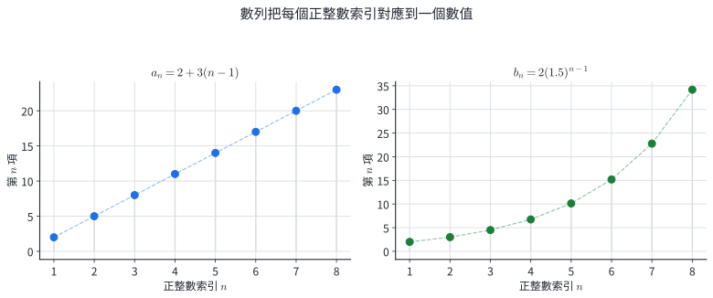{width=94%}

若有一個式子能由 $n$ 直接算出 $a_n$，這個式子稱為數列的**通項公式**。通項同時處理兩個方向：給定 $n$ 求項值，或給定項值解出可能的索引。

::: example
### 例 1｜由通項讀出符號與大小

已知

$$
a_n=(-1)^{n+1}(2n-1).
$$

求前五項與 $a_{20}$。

當 $n$ 為奇數時，$(-1)^{n+1}=1$；當 $n$ 為偶數時，$(-1)^{n+1}=-1$。逐項代入：

$$
a_1=1,\quad a_2=-3,\quad a_3=5,\quad a_4=-7,\quad a_5=9.
$$

又

$$
a_{20}=(-1)^{21}(39)=-39.
$$

索引控制兩件事：$2n-1$ 控制絕對值，$(-1)^{n+1}$ 控制正負交替。
:::

::: example
### 例 2｜由項值反求索引

數列的通項為

$$
b_n=\frac{n+1}{2n-1}.
$$

判斷 $\dfrac6{11}$ 是第幾項。

令 $b_n=\dfrac6{11}$：

$$
\frac{n+1}{2n-1}=\frac6{11}
\quad\Longrightarrow\quad
11n+11=12n-6.
$$

所以 $n=17$。代回得 $b_{17}=18/33=6/11$，且 $17$ 是正整數，因此它是第 17 項。
:::

### 1.2 分節練習

1. 已知 $a_n=n^2-3n$，寫出前四項並求 $a_{12}$。
2. 已知 $b_n=3\cdot2^{n-1}$，求第一個大於 $1000$ 的項及其索引。
3. 為數列 $2,-4,6,-8,\ldots$ 寫出一個通項，並求第 15 項。
4. 已知 $c_n=\dfrac{n+1}{2n-1}$，求滿足 $c_n=6/11$ 的索引。
5. 階梯教室第 1 排有 18 個座位，之後每排比前一排多 2 個。先只用索引表示第 $n$ 排座位數，再求第 15 排。

### 1.3 分節練習解析

1. 代入 $n=1,2,3,4$ 得 $-2,-2,0,4$；$a_{12}=12^2-3(12)=108$。
2. 依序比較 $3\cdot2^{n-1}$。$b_9=3\cdot2^8=768$，$b_{10}=3\cdot2^9=1536$，故答案是第 10 項 $1536$。
3. 絕對值為 $2n$，奇數項為正，因此可取 $a_n=2n(-1)^{n+1}$；$a_{15}=30$。
4. 解 $11(n+1)=6(2n-1)$ 得 $n=17$。
5. 從第 1 排到第 $n$ 排經過 $n-1$ 次增加，故 $a_n=18+2(n-1)=2n+16$，$a_{15}=46$ 個。

## 2. 等差數列與等比數列

### 2.1 等差數列：每一步增加固定量

若數列從第二項起都滿足

$$
a_n-a_{n-1}=d,\qquad n\ge2,
$$

則稱為**等差數列**，常數 $d$ 稱為公差。由 $a_1$ 走到 $a_n$ 共經過 $n-1$ 次加法，因此

$$
\boxed{a_n=a_1+(n-1)d}.
$$

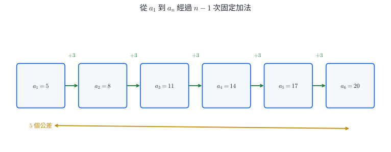{width=92%}

這個 $n-1$ 直接來自步數。相鄰兩項相差一次，$a_1$ 到 $a_2$ 只有一步；同樣地，$a_p$ 到 $a_q$ 經過 $q-p$ 步，所以

$$
a_q-a_p=(q-p)d.
$$

::: example
### 例 3｜由兩個指定項決定等差數列

已知等差數列滿足 $a_4=11$、$a_9=31$，求通項。

兩個索引相差 $5$，因此

$$
a_9-a_4=5d
\quad\Longrightarrow\quad
31-11=5d,
$$

得 $d=4$。再由

$$
a_4=a_1+3d=11
$$

得 $a_1=-1$，所以

$$
\boxed{a_n=-1+4(n-1)=4n-5}.
$$
:::

::: example
### 例 4｜插入等差中項

在 $8$ 與 $32$ 之間插入 5 個數，使全部 7 個數成等差數列。

首尾之間有 $7-1=6$ 段，因此

$$
d=\frac{32-8}{6}=4.
$$

數列為 $8,12,16,20,24,28,32$，插入的五個數是

$$
\boxed{12,16,20,24,28}.
$$
:::

### 2.2 等比數列：每一步乘固定倍率

若 $a_1\ne0$，且數列從第二項起都滿足

$$
\frac{a_n}{a_{n-1}}=r,\qquad n\ge2,
$$

其中固定倍率 $r\ne0$，則稱為**等比數列**，$r$ 稱為公比。從 $a_1$ 到 $a_n$ 共乘 $n-1$ 次，故

$$
\boxed{a_n=a_1r^{n-1}}.
$$

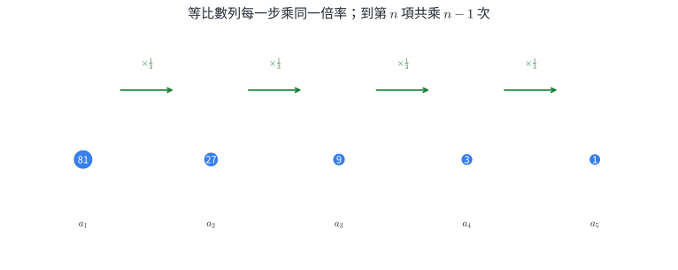{width=92%}

公比可以為負數；此時各項正負交替。若只由相隔偶數步的兩項求公比，方程可能同時保留正、負兩種實數解。

::: example
### 例 5｜相隔兩步的條件保留兩種公比

等比數列滿足 $a_2=6$、$a_4=24$，求所有可能的通項。

由 $a_4=a_2r^2$ 得

$$
24=6r^2\quad\Longrightarrow\quad r^2=4,
$$

所以 $r=2$ 或 $r=-2$。

- 當 $r=2$，$a_1=6/2=3$，故 $a_n=3\cdot2^{n-1}$。
- 當 $r=-2$，$a_1=6/(-2)=-3$，故 $a_n=-3(-2)^{n-1}$。

兩個通項代入 $n=2,4$ 都符合原條件。
:::

::: example
### 例 6｜固定保留率形成等比數列

某訊號第一次量測為 $640$ 單位，每經過一層材料後保留前一次的 $1/2$。第 $n$ 次量測值為何？第 6 次是多少？

第一項為 $640$，公比為 $1/2$，所以

$$
a_n=640\left(\frac12\right)^{n-1}.
$$

第 6 次經過 5 次倍率更新：

$$
a_6=640\left(\frac12\right)^5=20.
$$
:::

### 2.3 分節練習

1. 等差數列 $a_1=-7,d=5$，求 $a_{18}$。
2. 等差數列滿足 $a_5=17,a_{12}=45$，求 $a_1,d,a_{30}$。
3. 在 $-2$ 與 $18$ 之間插入 3 個等差中項。
4. 等比數列 $a_1=5,r=-3$，求 $a_5,a_6$。
5. 等比數列滿足 $a_3=12,a_6=96$，求 $a_1,r,a_8$。
6. 在 $2$ 與 $162$ 之間插入 3 個正數，使五個數成等比數列。

### 2.4 分節練習解析

1. $a_{18}=-7+17(5)=78$。
2. $a_{12}-a_5=7d=28$，故 $d=4$；$a_1=17-4(4)=1$；$a_{30}=1+29(4)=117$。
3. 五個數之間有 4 段，$d=[18-(-2)]/4=5$，插入 $3,8,13$。
4. $a_5=5(-3)^4=405$，$a_6=5(-3)^5=-1215$。
5. $a_6/a_3=r^3=8$，故 $r=2$；$a_1=12/2^2=3$；$a_8=3\cdot2^7=384$。
6. 設正公比為 $r$，則 $2r^4=162$，所以 $r^4=81$ 且 $r=3$。插入 $6,18,54$。

## 3. 遞迴數列與數學歸納法

### 3.1 遞迴關係：由已知狀態產生下一項

**遞迴數列**以初始值和更新規則共同定義。例如

$$
a_1=1,\qquad a_n=2a_{n-1}+1\quad(n\ge2)
$$

表示先固定 $a_1$，之後每一項都由前一項乘 2 再加 1。相同遞迴規則搭配不同初始值會產生不同數列，因此兩者都是完整定義的一部分。

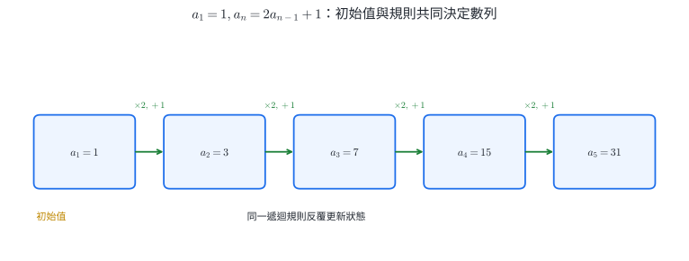{width=92%}

等差與等比數列也可寫成遞迴形式：

$$
\text{等差： }a_n=a_{n-1}+d,\qquad
\text{等比： }a_n=ra_{n-1}.
$$

通項適合直接跳到第 $n$ 項；遞迴式適合表達逐期更新、模擬狀態或由資料逐步生成下一項。

::: example
### 例 7｜從遞迴式觀察並驗證通項

已知 $a_1=1$，$a_n=2a_{n-1}+1$。求前五項，並找出通項。

逐步更新得

$$
1,3,7,15,31.
$$

每一項都比相同索引的 $2^n$ 少 1，因此猜測

$$
a_n=2^n-1.
$$

把它代回更新規則：

$$
2a_{n-1}+1=2(2^{n-1}-1)+1=2^n-1,
$$

並且 $a_1=2^1-1=1$，所以這個式子同時符合初始值與遞迴關係。
:::

::: example
### 例 8｜平移變數，把仿射遞迴化為等比

已知 $a_1=4$，$a_n=3a_{n-1}-2$。求通項。

固定值 $1$ 滿足 $1=3(1)-2$。令 $b_n=a_n-1$，則

$$
b_n=a_n-1=3a_{n-1}-3=3(a_{n-1}-1)=3b_{n-1}.
$$

又 $b_1=3$，所以 $b_n=3\cdot3^{n-1}=3^n$。因此

$$
\boxed{a_n=3^n+1}.
$$

這個平移的作用，是把「乘 3 再減 2」改寫成單純乘 3。
:::

### 3.2 數學歸納法：沿著正整數逐項證明

設 $P(n)$ 是關於正整數 $n$ 的命題。若能完成

1. **基礎步**：證明 $P(1)$ 成立；
2. **歸納步**：對任意正整數 $k$，假設 $P(k)$ 成立，並由此推出 $P(k+1)$ 成立；

便可判定 $P(n)$ 對所有正整數 $n$ 成立。

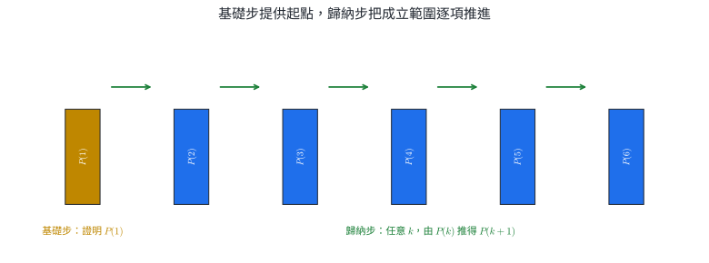{width=94%}

歸納步中的 $k$ 代表任意已到達的位置。推導必須實際使用歸納假設，才能把 $P(k)$ 與 $P(k+1)$ 接起來。

::: example
### 例 9｜證明前 $n$ 個奇數的和

證明對所有正整數 $n$，

$$
1+3+5+\cdots+(2n-1)=n^2.
$$

**基礎步。** $n=1$ 時，左式 $=1$，右式 $=1^2$，命題成立。

**歸納步。** 假設 $n=k$ 時成立，即

$$
1+3+\cdots+(2k-1)=k^2.
$$

則 $n=k+1$ 時，左式多出下一個奇數 $2k+1$：

$$
1+3+\cdots+(2k-1)+(2k+1)
=k^2+2k+1=(k+1)^2.
$$

所以命題對所有正整數 $n$ 成立。
:::

::: example
### 例 10｜用歸納法證明遞迴數列的通項

對 $a_1=1$、$a_n=2a_{n-1}+1$，證明 $a_n=2^n-1$。

**基礎步。** $a_1=1=2^1-1$。

**歸納步。** 假設 $a_k=2^k-1$，由遞迴式

$$
a_{k+1}=2a_k+1=2(2^k-1)+1=2^{k+1}-1.
$$

因此通項對所有正整數 $n$ 成立。
:::

### 3.3 分節練習

1. $a_1=a_2=1$，$a_n=a_{n-1}+a_{n-2}$（$n\ge3$）。寫出前七項。
2. $a_1=2$，$a_n=a_{n-1}+3n$（$n\ge2$）。求 $a_2$ 至 $a_5$。
3. $c_1=5$，$c_n=2c_{n-1}-3$。以適當平移求通項。
4. 用數學歸納法證明 $1+2+\cdots+n=\dfrac{n(n+1)}2$。
5. 用數學歸納法證明 $3^n\ge2n+1$ 對所有正整數 $n$ 成立。
6. 用數學歸納法證明 $7^n-1$ 可被 $6$ 整除。

### 3.4 分節練習解析

1. 每一項等於前兩項之和，依序為 $1,1,2,3,5,8,13$。
2. $a_2=2+6=8$，$a_3=8+9=17$，$a_4=17+12=29$，$a_5=29+15=44$。
3. 固定值為 $3$。令 $b_n=c_n-3$，則 $b_n=2b_{n-1}$，且 $b_1=2$，故 $b_n=2^n$，$\boxed{c_n=2^n+3}$。
4. $n=1$ 時成立。假設 $1+\cdots+k=k(k+1)/2$，則
   $$
   1+\cdots+k+(k+1)=\frac{k(k+1)}2+(k+1)=\frac{(k+1)(k+2)}2,
   $$
   正是 $n=k+1$ 的式子。
5. $n=1$ 時 $3=3$。假設 $3^k\ge2k+1$，則
   $$
   3^{k+1}\ge3(2k+1)=6k+3\ge2k+3=2(k+1)+1.
   $$
6. $n=1$ 時 $7-1=6$。假設 $7^k-1=6m$，則
   $$
   7^{k+1}-1=7(7^k-1)+6=6(7m+1),
   $$
   因此仍可被 $6$ 整除。

## 4. 有限級數、等差和與等比和

### 4.1 級數與部分和

把數列的前 $n$ 項相加所得的式子

$$
a_1+a_2+\cdots+a_n
$$

稱為**有限級數**，其和記作

$$
S_n=a_1+a_2+\cdots+a_n=\sum_{k=1}^{n}a_k.
$$

$\sum$ 是求和符號，$k$ 是求和索引。下限 $1$ 與上限 $n$ 決定實際相加的項，總共有 $n$ 項。當 $n$ 依序取 $1,2,3,\ldots$ 時，$S_1,S_2,S_3,\ldots$ 本身也形成一個數列，稱為部分和數列。

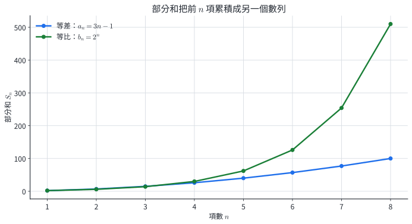{width=88%}

由定義直接得到

$$
S_n=S_{n-1}+a_n\quad(n\ge2),
$$

所以

$$
a_1=S_1,\qquad a_n=S_n-S_{n-1}\quad(n\ge2).
$$

前一式用來累積，後一式用相鄰兩個累積量還原單期增量。

### 4.2 等差級數：首尾配對

設等差數列前 $n$ 項和為

$$
S_n=a_1+a_2+\cdots+a_n.
$$

將相同級數倒序寫一次：

$$
S_n=a_n+a_{n-1}+\cdots+a_1.
$$

上下相加後，每一欄都是 $a_1+a_n$，共有 $n$ 欄，因此

$$
2S_n=n(a_1+a_n).
$$

故

$$
\boxed{S_n=\frac{n(a_1+a_n)}2
=\frac n2\left[2a_1+(n-1)d\right]}.
$$

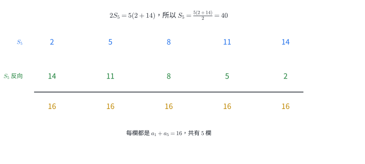{width=90%}

::: example
### 例 11｜先由首尾求項數，再求和

求

$$
7+11+15+\cdots+39.
$$

首項 $a_1=7$，公差 $d=4$。由

$$
39=7+(n-1)4
$$

得 $n=9$。因此

$$
S_9=\frac{9(7+39)}2=207.
$$

首尾差 $32$ 對應 8 個公差，因此共有 9 項。
:::

::: example
### 例 12｜由兩項條件建立整個級數

等差數列滿足 $a_3=8$、$a_{10}=29$，求 $S_{20}$。

兩項相隔 7 步：

$$
29-8=7d\quad\Longrightarrow\quad d=3.
$$

故 $a_1=8-2(3)=2$，$a_{20}=2+19(3)=59$。所以

$$
S_{20}=\frac{20(2+59)}2=610.
$$
:::

### 4.3 等比級數：乘公比後錯位相減

設

$$
S_n=a_1+a_1r+a_1r^2+\cdots+a_1r^{n-1}.
$$

兩邊乘 $r$：

$$
rS_n=a_1r+a_1r^2+\cdots+a_1r^{n-1}+a_1r^n.
$$

相減後中間各項消去：

$$
S_n-rS_n=a_1-a_1r^n.
$$

當 $r\ne1$ 時，可除以 $1-r$：

$$
\boxed{S_n=\frac{a_1(1-r^n)}{1-r}}
\qquad(r\ne1).
$$

當 $r=1$ 時，每一項都是 $a_1$，因此

$$
\boxed{S_n=na_1}.
$$

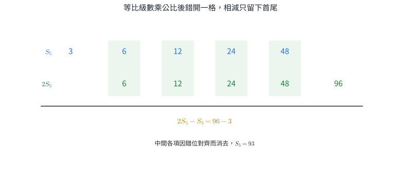{width=92%}

::: example
### 例 13｜公比為負的有限等比級數

求 $3-6+12-24+48-96$。

這是 $a_1=3$、$r=-2$、$n=6$ 的等比級數：

$$
S_6=\frac{3[1-(-2)^6]}{1-(-2)}
=\frac{3(1-64)}3=-63.
$$

直接估計也合理：最後一項為 $-96$，前五項和為 $33$，總和為負。
:::

::: example
### 例 14｜由級數總和反求項數

已知

$$
5+10+20+\cdots+5\cdot2^{n-1}=1275,
$$

求 $n$。

左式是 $a_1=5,r=2$ 的前 $n$ 項和：

$$
5\frac{1-2^n}{1-2}=5(2^n-1)=1275.
$$

所以 $2^n=256=2^8$，故 $n=8$。
:::

### 4.4 分節練習

1. 求 $4+7+10+\cdots+61$。
2. 等差數列滿足 $a_7=20,d=-2$，求 $S_{15}$。
3. 求 $2+6+18+\cdots+4374$。
4. 求 $10-5+2.5-\cdots$ 的前 8 項和。
5. 等比數列的公比為 $1$、首項為 $7$，求前 30 項和。
6. 已知 $3+6+12+\cdots+3\cdot2^{n-1}=3069$，求 $n$。

### 4.5 分節練習解析

1. $61=4+(n-1)3$，得 $n=20$；$S_{20}=20(4+61)/2=650$。
2. $a_1=a_7-6d=20-6(-2)=32$，$a_{15}=32+14(-2)=4$，故 $S_{15}=15(32+4)/2=270$。
3. $4374=2\cdot3^7$，所以共有 8 項；
   $$
   S_8=\frac{2(1-3^8)}{1-3}=6560.
   $$
4. $a_1=10,r=-1/2,n=8$，故
   $$
   S_8=\frac{10[1-(-1/2)^8]}{1+1/2}=\frac{425}{64}\approx6.641.
   $$
5. $r=1$ 時每項均為 $7$，$S_{30}=30\cdot7=210$。
6. $3(2^n-1)=3069$，得 $2^n=1024=2^{10}$，所以 $n=10$。

## 5. 常用和式、拆項與由部分和還原數列

### 5.1 三個常用有限和

對正整數 $n$，有

$$
\sum_{k=1}^{n}k=\frac{n(n+1)}2,
$$

$$
\sum_{k=1}^{n}k^2=\frac{n(n+1)(2n+1)}6,
$$

$$
\sum_{k=1}^{n}k^3=\left[\frac{n(n+1)}2\right]^2.
$$

第一式是首項 $1$、末項 $n$ 的等差級數公式。後兩式可用數學歸納法驗證。例如，若平方和公式在 $n=k$ 成立，加入 $(k+1)^2$ 後：

$$
\frac{k(k+1)(2k+1)}6+(k+1)^2
=\frac{(k+1)(k+2)(2k+3)}6,
$$

正是把 $n$ 換成 $k+1$ 的公式。立方和的歸納步則為

$$
\left[\frac{k(k+1)}2\right]^2+(k+1)^3
=\left[\frac{(k+1)(k+2)}2\right]^2.
$$

### 5.2 求和的線性與拆項

同一求和範圍內，可逐項使用分配律：

$$
\sum_{k=1}^{n}[c,u_k+d,v_k]
=c\sum_{k=1}^{n}u_k+d\sum_{k=1}^{n}v_k.
$$

因此多項式型的一般項可展開後，分別套用一次、平方、立方和公式。

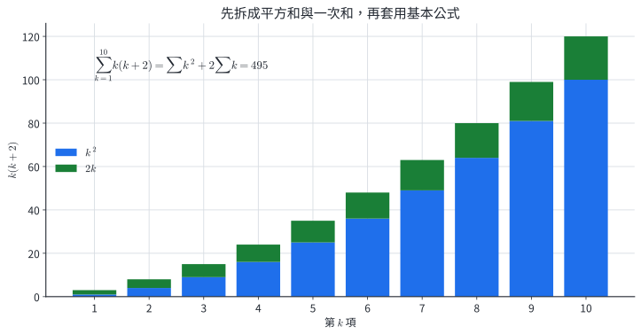{width=88%}

::: example
### 例 15｜拆成平方和與一次和

求

$$
\sum_{k=1}^{10}k(k+2).
$$

先展開 $k(k+2)=k^2+2k$：

$$
\begin{aligned}
\sum_{k=1}^{10}k(k+2)
&=\sum_{k=1}^{10}k^2+2\sum_{k=1}^{10}k\\
&=\frac{10\cdot11\cdot21}{6}
+2\cdot\frac{10\cdot11}{2}\\
&=385+110=495.
\end{aligned}
$$
:::

::: example
### 例 16｜展開後處理奇數平方和

求 $\displaystyle\sum_{k=1}^{8}(2k-1)^2$。

因為 $(2k-1)^2=4k^2-4k+1$，所以

$$
\begin{aligned}
\sum_{k=1}^{8}(2k-1)^2
&=4\sum_{k=1}^{8}k^2-4\sum_{k=1}^{8}k+\sum_{k=1}^{8}1\\
&=4(204)-4(36)+8\\
&=680.
\end{aligned}
$$

最後一項 $\sum_{k=1}^{8}1=8$，因為常數 $1$ 共出現 8 次。
:::

### 5.3 由 $S_n$ 求 $a_n$

$S_n$ 是前 $n$ 項累積量。相鄰部分和相減時，前 $n-1$ 項全部消去，留下第 $n$ 項：

$$
S_n-S_{n-1}=a_n\qquad(n\ge2).
$$

第一項需由 $a_1=S_1$ 取得，再檢查求出的 $n\ge2$ 公式是否也適用於 $n=1$。

::: example
### 例 17｜從二次部分和還原一次通項

已知 $S_n=2n^2$，求 $a_n$。

第一項為

$$
a_1=S_1=2.
$$

對 $n\ge2$，

$$
\begin{aligned}
a_n&=S_n-S_{n-1}\\
&=2n^2-2(n-1)^2\\
&=4n-2.
\end{aligned}
$$

把 $n=1$ 代入 $4n-2$ 也得 $2$，所以可統一寫成

$$
\boxed{a_n=4n-2\quad(n\ge1)}.
$$
:::

::: example
### 例 18｜逐層增加的材料總量

第 $k$ 層使用 $3k-2$ 個元件。求前 20 層總數。

$$
\begin{aligned}
S_{20}
&=\sum_{k=1}^{20}(3k-2)\\
&=3\sum_{k=1}^{20}k-2\sum_{k=1}^{20}1\\
&=3\cdot\frac{20\cdot21}{2}-2(20)\\
&=590.
\end{aligned}
$$

這裡的常數項 $-2$ 在每一層都出現一次，因此總貢獻是 $-2\times20$。
:::

### 5.4 分節練習

1. 求 $\displaystyle\sum_{k=1}^{25}k$。
2. 求 $\displaystyle\sum_{k=1}^{12}k^2$。
3. 求 $\displaystyle\sum_{k=1}^{8}k^3$。
4. 求 $\displaystyle\sum_{k=1}^{10}k(2k-1)$。
5. 已知 $S_n=n^2+4n$，求 $a_n$ 與 $a_{15}$。

### 5.5 分節練習解析

1. $25\cdot26/2=325$。
2. $12\cdot13\cdot25/6=650$。
3. $[8\cdot9/2]^2=36^2=1296$。
4. $k(2k-1)=2k^2-k$，故總和為 $2(385)-55=715$。
5. $a_1=S_1=5$。對 $n\ge2$，
   $$
   a_n=(n^2+4n)-[(n-1)^2+4(n-1)]=2n+3.
   $$
   這個式子在 $n=1$ 也給出 $5$，故 $a_n=2n+3$，$a_{15}=33$。

## 6. 單利、複利與定期存款

### 6.1 單利與複利的更新機制

設本金為 $P$，每期利率為 $r$，經過 $n$ 期。

**單利**每一期都只按原始本金計息，每期增加 $Pr$：

$$
A_n=P+nPr=P(1+nr).
$$

**複利**把前一期本利和作為下一期本金，每期乘 $1+r$：

$$
A_n=P(1+r)^n.
$$

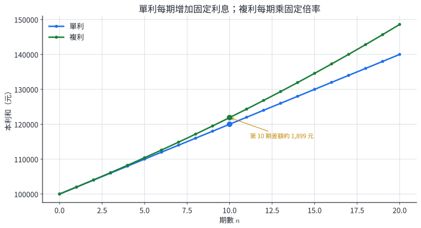{width=88%}

利率與期數必須使用同一時間單位。例如月利率搭配月數，年利率搭配年數。固定利率模型提供基準估算；實際金融商品還可能含手續費、稅、浮動利率與不同計息規則。

::: example
### 例 19｜比較同一條件下的單利與複利

本金 $100000$ 元，每期利率 $2\%$，共 10 期。

單利本利和：

$$
A_{10}=100000[1+10(0.02)]=120000.
$$

複利本利和：

$$
A_{10}=100000(1.02)^{10}\approx121899.44.
$$

複利多約 $1899.44$ 元，差額來自先前利息也參與後續計息。
:::

### 6.2 每期初固定存款的終值

每期初存入 $P$ 元，期利率為 $r$，共存 $N$ 次，並在第 $N$ 期期末結算。第一次存款計息 $N$ 期，最後一次存款計息 1 期，因此各筆終值依序為

$$
P(1+r)^N,P(1+r)^{N-1},\ldots,P(1+r).
$$

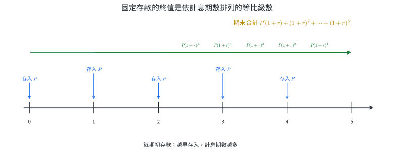{width=94%}

令 $q=1+r$。當 $r\ne0$ 時，期末總額為

$$
\begin{aligned}
F_N
&=P(q+q^2+\cdots+q^N)\\
&=\boxed{Pq\frac{q^N-1}{q-1}}
=\boxed{P(1+r)\frac{(1+r)^N-1}{r}}.
\end{aligned}
$$

當 $r=0$ 時，每筆存款維持原值，總額為 $NP$。若改成每期期末存入，最後一筆在結算時尚未計息，指數會改為 $N-1,N-2,\ldots,0$。

::: example
### 例 20｜十二次月初存款的期末總額

每月初存入 $10000$ 元，月利率 $0.1\%=0.001$，連續存 12 次，在第 12 個月底結算。

第一筆有 12 個月利息，最後一筆有 1 個月利息：

$$
F_{12}=10000(1.001)\frac{(1.001)^{12}-1}{0.001}
\approx120782.87.
$$

總投入為 $120000$ 元，因此利息約為 $782.87$ 元。
:::

::: example
### 例 21｜固定保留率的設備價值

設備購入價為 $300000$ 元，每年末估值為前一年的 $85\%$。四年後的模型估值為

$$
V_4=300000(0.85)^4\approx156601.88\text{ 元}.
$$

每年保留率固定，故價值形成公比 $0.85$ 的等比變化。這是估值模型；實際售價還受市場、維修與使用狀況影響。
:::

### 6.3 分節練習

1. 本金 $200000$ 元，以每年 $3\%$ 複利計算 5 年，求本利和。
2. 本金 $80000$ 元，以每期 $1.2\%$ 單利計算 8 期，求本利和。
3. 本金 $50000$ 元，以每月 $1\%$ 複利計算 12 個月，求本利和。
4. 每月初存入 $5000$ 元，月利率 $0.5\%$，連續存 24 次，在第 24 個月底結算，求總額。
5. 一項設備每年保留前一年價值的 $85\%$，原價 $300000$ 元，求四年後的模型估值。

### 6.4 分節練習解析

1. $200000(1.03)^5\approx231854.81$ 元。
2. $80000[1+8(0.012)]=87680$ 元。
3. $50000(1.01)^{12}\approx56341.25$ 元。
4. 月初存款在結算時的指數為 $24,23,\ldots,1$：
   $$
   F=5000(1.005)\frac{(1.005)^{24}-1}{0.005}\approx127795.58\text{ 元}.
   $$
5. $300000(0.85)^4\approx156601.88$ 元。

## 7. 章末分層題

### A. 核心題

1. 已知 $a_n=(-1)^n(n+2)$，寫出前四項並求 $a_{10}$。
2. 等差數列滿足 $a_6=14,a_{18}=50$。求 $a_1,d,a_{25}$。
3. 等比數列滿足 $a_2=4,a_5=108$。求 $a_1,r,a_7$。
4. 已知 $a_1=2,a_n=3a_{n-1}-1$（$n\ge2$），寫出前五項。
5. 用數學歸納法證明
   $$
   2+4+6+\cdots+2n=n(n+1).
   $$
6. 求等差級數 $12+17+22+\cdots+102$ 的和。
7. 求 $81-27+9-3+1$。
8. 求 $\displaystyle\sum_{k=1}^{6}(3k^2-2k)$。

### B. 應用與轉換題

9. 已知數列的前 $n$ 項和為 $S_n=3n^2-n$，求通項 $a_n$ 與 $a_{20}$。
10. 本金 $120000$ 元，每期利率 $1.5\%$，共 8 期。分別求單利與複利本利和，並比較差額。
11. 每月初存入 $4000$ 元，月利率 $0.4\%$，連續存 10 次，在第 10 個月底結算。列出級數並求總額。
12. 一個圖案第 1 階使用 1 塊材料，之後滿足
    $$
    T_n=T_{n-1}+4(n-1)\quad(n\ge2).
    $$
    求 $T_n$ 與 $T_8$。

### C. 跨節整合題

13. 一排感測器的數量滿足 $a_1=3,a_n=a_{n-1}+4$。求通項、第 20 排數量，以及前 20 排總數。
14. 某分段程序的第 1 段長 $64$ 公分，之後每段長度為前一段的一半。以遞迴式表示此數列，求第 7 段長度與前 7 段總長。
15. 已知 $S_n=\dfrac{n(3n+1)}2$。還原 $a_n$，判斷 $\langle a_n\rangle$ 的類型，並求使 $S_n>300$ 的最小正整數 $n$。
16. 數列滿足 $b_1=2,b_n=3b_{n-1}+2$。先猜測並用數學歸納法證明 $b_n=3^n-1$，再求
    $$
    \sum_{k=1}^{n}b_k
    $$
    的公式與前四項和。

## 8. 章末分層題完整詳解

### 第 1 題

逐項代入：

$$
a_1=-3,\quad a_2=4,\quad a_3=-5,\quad a_4=6.
$$

又 $a_{10}=(-1)^{10}(12)=12$。

### 第 2 題

兩個已知項相隔 $18-6=12$ 步：

$$
a_{18}-a_6=12d
\quad\Longrightarrow\quad
50-14=12d,
$$

故 $d=3$。再由 $a_6=a_1+5d$ 得

$$
a_1=14-15=-1.
$$

因此

$$
a_{25}=-1+24(3)=71.
$$

### 第 3 題

由 $a_5=a_2r^3$ 得

$$
108=4r^3,\qquad r^3=27,\qquad r=3.
$$

所以 $a_1=4/3$，且

$$
a_7=\frac43\cdot3^6=972.
$$

索引差為 3，故解的是奇次方程，實數公比唯一。

### 第 4 題

由遞迴式逐項更新：

$$
\begin{aligned}
a_1&=2,\\
a_2&=3(2)-1=5,\\
a_3&=3(5)-1=14,\\
a_4&=3(14)-1=41,\\
a_5&=3(41)-1=122.
\end{aligned}
$$

前五項為 $2,5,14,41,122$。

### 第 5 題

令 $P(n)$ 表示 $2+4+\cdots+2n=n(n+1)$。

**基礎步。** $n=1$ 時，左式 $=2$，右式 $=1\cdot2=2$。

**歸納步。** 假設 $P(k)$ 成立，即

$$
2+4+\cdots+2k=k(k+1).
$$

加入下一項 $2(k+1)$：

$$
\begin{aligned}
2+4+\cdots+2k+2(k+1)
&=k(k+1)+2(k+1)\\
&=(k+1)(k+2).
\end{aligned}
$$

這正是 $P(k+1)$，故命題對所有正整數成立。

### 第 6 題

首項 $12$、公差 $5$、末項 $102$。由

$$
102=12+(n-1)5
$$

得 $n=19$。因此

$$
S_{19}=\frac{19(12+102)}2=1083.
$$

### 第 7 題

這是 $a_1=81,r=-1/3,n=5$ 的等比級數：

$$
S_5=\frac{81[1-(-1/3)^5]}{1+1/3}=61.
$$

直接相加 $81-27+9-3+1$ 也得 $61$。

### 第 8 題

利用求和的線性：

$$
\begin{aligned}
\sum_{k=1}^{6}(3k^2-2k)
&=3\sum_{k=1}^{6}k^2-2\sum_{k=1}^{6}k\\
&=3\left(\frac{6\cdot7\cdot13}{6}\right)
-2\left(\frac{6\cdot7}{2}\right)\\
&=3(91)-2(21)=231.
\end{aligned}
$$

### 第 9 題

先求第一項：

$$
a_1=S_1=3(1)^2-1=2.
$$

對 $n\ge2$，

$$
\begin{aligned}
a_n&=S_n-S_{n-1}\\
&=(3n^2-n)-[3(n-1)^2-(n-1)]\\
&=6n-4.
\end{aligned}
$$

$n=1$ 時 $6n-4=2$，故通項為 $a_n=6n-4$，且

$$
a_{20}=120-4=116.
$$

### 第 10 題

單利本利和：

$$
A_s=120000[1+8(0.015)]=134400\text{ 元}.
$$

複利本利和：

$$
A_c=120000(1.015)^8\approx135179.11\text{ 元}.
$$

複利比單利多

$$
135179.11-134400\approx779.11\text{ 元}.
$$

### 第 11 題

第 1 筆存款計息 10 個月，第 10 筆計息 1 個月，所以

$$
F=4000[(1.004)^{10}+(1.004)^9+\cdots+1.004].
$$

整理成等比級數：

$$
F=4000(1.004)\frac{(1.004)^{10}-1}{0.004}
\approx40890.64\text{ 元}.
$$

總投入為 $40000$ 元，利息約 $890.64$ 元。

### 第 12 題

由遞迴式反覆累加：

$$
T_n=T_1+4\sum_{k=1}^{n-1}k.
$$

因此

$$
\begin{aligned}
T_n
&=1+4\cdot\frac{(n-1)n}{2}\\
&=1+2n(n-1).
\end{aligned}
$$

代入 $n=8$：

$$
T_8=1+2(8)(7)=113.
$$

### 第 13 題｜跨節整合

遞迴式每次加 $4$，所以數列為等差數列，$a_1=3,d=4$。

通項為

$$
a_n=3+4(n-1)=4n-1.
$$

第 20 排有

$$
a_{20}=4(20)-1=79
$$

個感測器。前 20 排總數為

$$
S_{20}=\frac{20(3+79)}2=820.
$$

通項回答單排數量，級數回答所有排的累積數量。

### 第 14 題｜跨節整合

令第 $n$ 段長度為 $a_n$。遞迴式為

$$
a_1=64,\qquad a_n=\frac12a_{n-1}\quad(n\ge2).
$$

這是公比 $1/2$ 的等比數列，所以

$$
a_7=64\left(\frac12\right)^6=1\text{ 公分}.
$$

前 7 段總長為

$$
S_7=\frac{64[1-(1/2)^7]}{1-1/2}=127\text{ 公分}.
$$

### 第 15 題｜跨節整合

第一項為 $a_1=S_1=2$。對 $n\ge2$，

$$
\begin{aligned}
a_n
&=\frac{n(3n+1)}2-\frac{(n-1)[3(n-1)+1]}2\\
&=3n-1.
\end{aligned}
$$

同一公式在 $n=1$ 也給出 $2$。因為

$$
a_n-a_{n-1}=3,
$$

$\langle a_n\rangle$ 是首項 $2$、公差 $3$ 的等差數列。

再解

$$
\frac{n(3n+1)}2>300.
$$

檢查相鄰整數：

$$
S_{13}=\frac{13\cdot40}{2}=260,\qquad
S_{14}=\frac{14\cdot43}{2}=301.
$$

故最小正整數為 $\boxed{14}$。

### 第 16 題｜跨節整合

先算前幾項：$2,8,26,80,\ldots$，可觀察到它們分別是 $3^1-1,3^2-1,3^3-1,3^4-1$。

證明 $b_n=3^n-1$：

**基礎步。** $b_1=2=3^1-1$。

**歸納步。** 假設 $b_k=3^k-1$，則

$$
b_{k+1}=3b_k+2=3(3^k-1)+2=3^{k+1}-1.
$$

故通項成立。接著求和：

$$
\begin{aligned}
\sum_{k=1}^{n}b_k
&=\sum_{k=1}^{n}(3^k-1)\\
&=3\frac{3^n-1}{3-1}-n\\
&=\boxed{\frac{3(3^n-1)}2-n}.
\end{aligned}
$$

前四項和為

$$
\frac{3(3^4-1)}2-4=120-4=116,
$$

也等於 $2+8+26+80$。

## 9. 核心整理

1. 數列把正整數索引 $n$ 對應到第 $n$ 項 $a_n$；通項由索引直接求值。
2. 等差數列每步加 $d$：
   $$a_n=a_1+(n-1)d.$$
3. 等比數列每步乘 $r$：
   $$a_n=a_1r^{n-1}.$$
4. 遞迴定義需要初始值與更新規則；數學歸納法由基礎步和歸納步證明正整數命題。
5. 部分和滿足
   $$S_n=\sum_{k=1}^{n}a_k,\qquad a_n=S_n-S_{n-1}\ (n\ge2).$$
6. 等差級數首尾配對：
   $$S_n=\frac{n(a_1+a_n)}2.$$
7. 等比級數在 $r\ne1$ 時錯位相減：
   $$S_n=\frac{a_1(1-r^n)}{1-r};$$
   $r=1$ 時 $S_n=na_1$。
8. 多項式型一般項先展開，再使用 $\sum k$、$\sum k^2$、$\sum k^3$。
9. 單利是固定增量 $P(1+nr)$；複利是固定倍率 $P(1+r)^n$。
10. 定期存款先畫共同結算時點，再依各筆存款的計息期數排列等比級數。
