# 數2-3 排列組合與機率

::: learning-map
### 本章問題與能力

1. 如何把敘述條件翻成邏輯關係與集合區域？
2. 一個任務由互斥類別或連續步驟組成時，可能數如何計算？
3. 選出的對象若有次序、職務或位置，計數公式會如何改變？
4. 二項式展開的係數為何等於組合數？
5. 如何建立樣本空間，讓分母與事件的分子使用同一種結果單位？
6. 機率分布已知時，如何用期望值比較長期平均結果與公平條件？

本章路徑：邏輯與集合 → 分類與分步計數 → 排列與組合 → 二項式係數 → 樣本空間與事件 → 古典機率 → 期望值。
:::

## 0. 本章用途：把大量可能結果整理成可計算的模型

密碼格式、座位安排、抽樣設計、品質檢驗與遊戲規則都有共同結構：先界定一個結果由哪些欄位或步驟構成，再辨認條件造成的分類、順序與重複。逐一列出所有結果通常很慢；計數原理把結果集合拆成互斥類別或連續步驟，直接算出總數。

實際應用會把這個總數當成搜尋空間、抽樣分母或資源配置方案數；條件改變時，計數模型也要同步更新。

機率計算需要先說清楚「一次結果」的形式。擲兩顆骰子的結果可寫成有序對 $(i,j)$；抽出兩人若只形成小組，結果則是無序集合。樣本空間與事件使用同一種結果單位後，等可能模型中的機率才可由件數相除。

期望值把每種數值結果乘上其機率再相加。它可比較長期平均收益、設計公平計分，也能在保固成本、抽樣損耗或風險決策中把多種結果壓縮成一個平均指標。模型條件包含結果分類完整、機率總和為 $1$，以及每個結果的數值定義一致。

## 1. 邏輯與集合

### 1.1 命題、連接詞與推論

能明確判定真假的敘述稱為**命題**。命題 $P$ 的否定記作 $\neg P$；「$P$ 且 $Q$」記作 $P\wedge Q$；「$P$ 或 $Q$」記作 $P\vee Q$，其中「或」表示至少一個成立。

條件命題 $P\Rightarrow Q$ 表示：只要 $P$ 成立，$Q$ 必成立。此時 $P$ 是 $Q$ 的充分條件，$Q$ 是 $P$ 的必要條件。若 $P\Rightarrow Q$ 與 $Q\Rightarrow P$ 都成立，就寫成 $P\Leftrightarrow Q$，兩者互為充分必要條件。

否定會交換「且」與「或」：

$$
\neg(P\wedge Q)\Leftrightarrow(\neg P)\vee(\neg Q),
$$

$$
\neg(P\vee Q)\Leftrightarrow(\neg P)\wedge(\neg Q).
$$

第一式的推理是：$P\wedge Q$ 失敗，恰好表示 $P,Q$ 至少一個失敗。第二式同理：$P\vee Q$ 失敗，表示兩者都失敗。這兩式稱為命題的**笛摩根律**。

### 1.2 集合與運算

由明確對象構成的整體稱為**集合**。$x\in A$ 表示 $x$ 是集合 $A$ 的元素；$A\subseteq B$ 表示 $A$ 的每個元素都在 $B$ 中。有限集合 $A$ 的元素個數記作 $|A|$，沒有元素的集合是空集合 $\emptyset$。

在全集 $U$ 中，常用運算為

$$
A\cap B=\{x:x\in A\text{ 且 }x\in B\},
$$

$$
A\cup B=\{x:x\in A\text{ 或 }x\in B\},
$$

$$
A-B=\{x:x\in A\text{ 且 }x\notin B\},\qquad
A^c=U-A.
$$

集合與命題的結構相同：交集對應「且」，聯集對應「或」，補集對應否定。

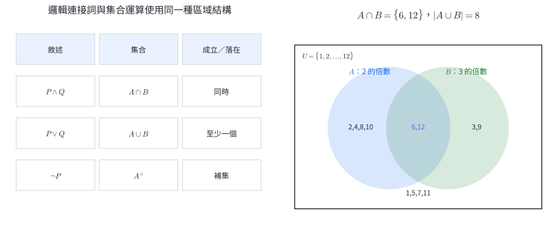{width=96%}

以任意元素 $x$ 檢查，

$$
x\in(A\cap B)^c
\Leftrightarrow x\notin A\cap B
\Leftrightarrow (x\notin A)\text{ 或 }(x\notin B),
$$

因此

$$
(A\cap B)^c=A^c\cup B^c.
$$

同理可得 $(A\cup B)^c=A^c\cap B^c$。這就是集合的笛摩根律。

::: example
### 例 1｜判斷充分條件與必要條件

討論範圍是整數。令

$$
P:\ x\text{ 是 }6\text{ 的倍數},\qquad
Q:\ x\text{ 是 }3\text{ 的倍數}.
$$

若 $P$ 成立，可寫成 $x=6k=3(2k)$，所以 $Q$ 成立，即 $P\Rightarrow Q$。

$x=3$ 符合 $Q$，但不符合 $P$，所以 $Q\Rightarrow P$ 不成立。因此 $P$ 是 $Q$ 的充分條件，$Q$ 是 $P$ 的必要條件。
:::

::: example
### 例 2｜由全集計算交集、聯集與補集

令 $U=\{1,2,\ldots,12\}$，$A$ 是 $2$ 的倍數所成集合，$B$ 是 $3$ 的倍數所成集合。則

$$
A=\{2,4,6,8,10,12\},\qquad B=\{3,6,9,12\}.
$$

所以

$$
A\cap B=\{6,12\},
$$

$$
A\cup B=\{2,3,4,6,8,9,10,12\},
$$

$$
(A\cup B)^c=\{1,5,7,11\}.
$$

再直接計算 $A^c\cap B^c$，也得到 $\{1,5,7,11\}$，與笛摩根律一致。
:::

### 1.3 分節練習

1. 判斷「$2+5=8$」與「請把門關上」是否為命題；若是命題，寫出真假。
2. 討論範圍為整數。令 $P:x$ 是 $12$ 的倍數，$Q:x$ 是 $4$ 的倍數。判斷 $P\Rightarrow Q$ 與 $Q\Rightarrow P$，並說明充分、必要關係。
3. 寫出命題「$x>1$ 且 $x\le5$」的否定。
4. 令 $U=\{1,2,\ldots,10\}$，$A=\{1,2,3,4,5\}$，$B=\{2,4,6,8,10\}$。求 $A\cap B$、$A\cup B$、$A-B$ 與 $B^c$。
5. 用元素是否屬於集合的方式，證明 $(A\cup B)^c=A^c\cap B^c$。

### 1.4 分節練習解析

1. 「$2+5=8$」可判定真假，是假命題；「請把門關上」是指令，沒有真值，因此不屬於命題。
2. $x=12k=4(3k)$，故 $P\Rightarrow Q$ 成立。$x=4$ 符合 $Q$ 而不符合 $P$，故 $Q\Rightarrow P$ 不成立。$P$ 是 $Q$ 的充分條件，$Q$ 是 $P$ 的必要條件。
3. 原命題是 $P\wedge Q$，其中 $P:x>1$、$Q:x\le5$。由笛摩根律，否定為 $x\le1$ 或 $x>5$。
4. $A\cap B=\{2,4\}$；$A\cup B=\{1,2,3,4,5,6,8,10\}$；$A-B=\{1,3,5\}$；$B^c=\{1,3,5,7,9\}$。
5. 對任意 $x\in U$，$x\in(A\cup B)^c$ 等價於 $x\notin A\cup B$，也等價於 $x\notin A$ 且 $x\notin B$，最後等價於 $x\in A^c\cap B^c$。兩集合含有完全相同的元素，所以相等。

邏輯規則可用來整理搜尋條件、電路條件與程式判斷；集合運算則把條件轉成可視化區域，後續計數與事件機率都直接沿用這套語言。

## 2. 基本計數原理

### 2.1 加法原理與乘法原理

若一個任務可由互不重疊的甲類或乙類完成，甲類有 $m$ 種、乙類有 $n$ 種，總數為 $m+n$。這是**加法原理**。類別互斥可確保每個結果只被計算一次。

若一個任務依序完成兩個步驟，第一步有 $m$ 種，而且第一步每種選擇之後，第二步都有 $n$ 種，總數為 $m\times n$。這是**乘法原理**。多步驟情況可繼續相乘；樹狀圖的每一條根到葉路徑對應一個完整結果。

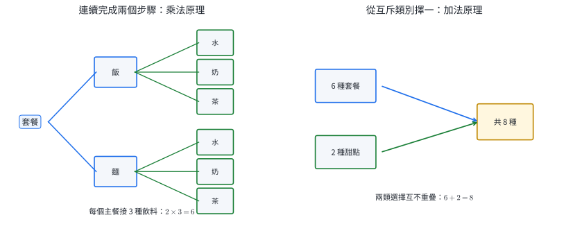{width=96%}

### 2.2 取捨原理

當兩個類別有重疊時，$|A|+|B|$ 會把 $A\cap B$ 算兩次，因此聯集個數是

$$
\boxed{|A\cup B|=|A|+|B|-|A\cap B|}.
$$

三集合的公式依同樣原理修正重複次數：

$$
|A\cup B\cup C|=|A|+|B|+|C|-|A\cap B|-|A\cap C|-|B\cap C|+|A\cap B\cap C|.
$$

三重交集一開始被加三次，接著在三個兩兩交集中被減三次，因此最後補加一次。

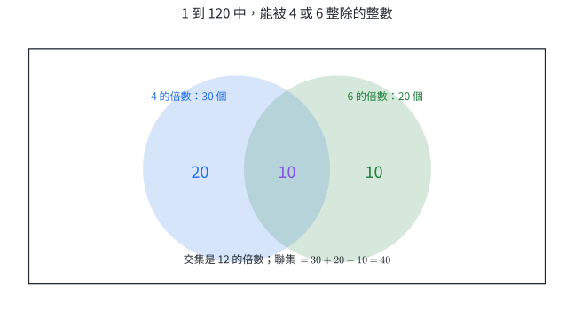{width=88%}

::: example
### 例 3｜分步形成代碼

一組代碼依序由 2 個英文字母與 3 個數字構成，字母與數字都可重複。五個位置依序有 $26,26,10,10,10$ 種選擇。由乘法原理，總數是

$$
26^2\cdot10^3=676000.
$$
:::

::: example
### 例 4｜用取捨原理修正重複計數

在 $1$ 到 $120$ 的整數中，能被 $4$ 或 $6$ 整除的共有幾個？

能被 $4$ 整除的有 $\lfloor120/4\rfloor=30$ 個；能被 $6$ 整除的有 $20$ 個。兩者同時成立就是 $12$ 的倍數，共 $10$ 個。因此

$$
30+20-10=40.
$$
:::

### 2.3 分節練習

1. 一家店有 4 種飯、3 種麵與 2 種沙拉。只選一份主餐，共有幾種選法？
2. 從甲地到乙地有 3 條道路，從乙地到丙地有 5 條道路。經乙地由甲到丙共有幾條路線？
3. 一個帳號識別碼由 1 個大寫字母與 4 個數字構成，可重複。共有幾個識別碼？
4. $1$ 到 $200$ 中，能被 $5$ 或 $8$ 整除的整數有幾個？
5. 某班 40 人中，會游泳的有 24 人，會騎自行車的有 31 人，兩者都會的有 20 人。至少會一項與兩項都不會的各有幾人？
6. 從 $A$ 到 $B$ 有 2 種交通方式，從 $B$ 到 $C$ 有 3 種；另有 4 種可由 $A$ 直達 $C$。計算由 $A$ 到 $C$ 的方式數。

### 2.4 分節練習解析

1. 三類互斥，使用加法原理：$4+3+2=9$ 種。
2. 每條甲乙道路都可接 5 條乙丙道路，使用乘法原理：$3\times5=15$ 條。
3. 五個位置的選擇數是 $26,10,10,10,10$，故共有 $26\times10^4=260000$ 個。
4. $5$ 的倍數有 $40$ 個，$8$ 的倍數有 $25$ 個，兩者交集是 $40$ 的倍數，共 $5$ 個。答案為 $40+25-5=60$ 個。
5. 至少會一項的人數是 $24+31-20=35$；兩項都不會是 $40-35=5$ 人。
6. 經 $B$ 的路線有 $2\times3=6$ 種；直達與經 $B$ 是互斥類別，所以總數 $6+4=10$ 種。

計數原理常用於密碼空間、實驗組合、流程分支與資料庫查詢。建立模型時，先說明類別是否互斥、步驟是否都要完成，再決定相加或相乘。

## 3. 排列

### 3.1 階乘與相異物排列

$n$ 個相異物件排成一列：第一個位置有 $n$ 種選擇，第二個位置剩 $n-1$ 種，依序到最後一個位置只有 $1$ 種，因此排列數為

$$
n!=n(n-1)\cdots2\cdot1.
$$

定義 $0!=1$，可讓後續公式在邊界情況保持一致。

從 $n$ 個相異物件選出 $r$ 個並依序排列，前 $r$ 個位置的選擇數依序為 $n,n-1,\ldots,n-r+1$，所以

$$
\boxed{P^n_r=n(n-1)\cdots(n-r+1)=\frac{n!}{(n-r)!}},
\qquad 0\le r\le n.
$$

排列模型中的職務、名次、座位或讀取順序都會區分結果。例如「甲任主席、乙任副主席」與「乙任主席、甲任副主席」是兩個結果。

### 3.2 條件排列的三種結構

- **固定或指定位置**：先處理指定位置，再排剩餘物件。
- **相鄰成塊**：把必須相鄰的物件先視為一個整體，最後乘上塊內排列數。
- **分隔空隙**：先排一類物件，再從其前後空隙放入另一類，可直接保證分隔條件。

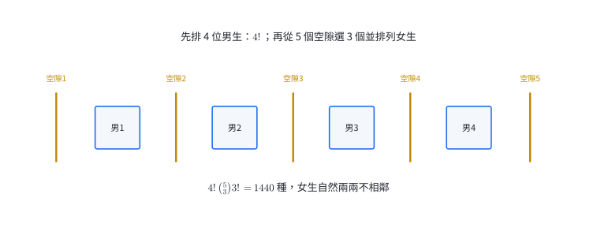{width=94%}

### 3.3 含相同物件的排列

若 $n$ 個位置中有 $m_1$ 個物件彼此相同、$m_2$ 個物件彼此相同，且 $m_1+m_2+\cdots+m_k=n$，暫時替同類物件加上編號會得到 $n!$ 個排列。每個實際結果都因同類物件內部交換而重複 $m_1!m_2!\cdots m_k!$ 次，因此不同排列數為

$$
\boxed{\frac{n!}{m_1!m_2!\cdots m_k!}}.
$$

方格最短路徑也是同一模型：若一定要向右 $a$ 步、向上 $b$ 步，每條最短路徑就是 $a$ 個相同的 R 與 $b$ 個相同的 U 的排列，路徑數為

$$
\frac{(a+b)!}{a!b!}.
$$

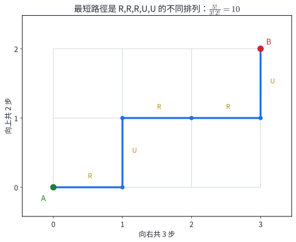{width=80%}

::: example
### 例 5｜選人擔任有次序的職務

7 人中選出 4 人，依序擔任主席、副主席、紀錄與司儀，共有幾種安排？

四個職務依序有 $7,6,5,4$ 種選擇，因此

$$
P^7_4=7\cdot6\cdot5\cdot4=840.
$$
:::

::: example
### 例 6｜相鄰條件用成塊與補集計算

甲、乙等 6 人排成一列。求甲乙相鄰與不相鄰的排列數。

甲乙相鄰時，把兩人視為一塊，連同其餘 4 人共有 5 個單位。單位可排 $5!$ 種，塊內有甲乙、乙甲兩種，所以

$$
5!\cdot2!=240.
$$

全部排列有 $6!=720$ 種，因此甲乙不相鄰有

$$
720-240=480
$$

種。
:::

::: example
### 例 7｜相同字母排列

單字 BANANA 的 6 個字母共有幾種不同排列？

A 有 3 個、N 有 2 個、B 有 1 個，所以

$$
\frac{6!}{3!2!}=\frac{720}{12}=60.
$$
:::

::: example
### 例 8｜格點最短路徑

從 $(0,0)$ 走到 $(4,3)$，每步只能向右或向上。最短路徑共有幾條？

每條最短路徑必含 4 個 R 與 3 個 U，共 7 步。不同路徑數為

$$
\frac{7!}{4!3!}=\binom{7}{3}=35.
$$
:::

### 3.4 分節練習

1. 計算 $P^9_3$。
2. 8 位選手中選出金、銀、銅牌得主，共有幾種結果？
3. 甲、乙、丙、丁、戊排成一列，甲固定在最左端，共有幾種排法？
4. 7 人排成一列，甲、乙、丙三人必須相鄰，共有幾種排法？
5. MISS 的 4 個字母共有幾種不同排列？
6. 從 $(0,0)$ 到 $(5,2)$，每步只能向右或向上，共有幾條最短路徑？

### 3.5 分節練習解析

1. $P^9_3=9\cdot8\cdot7=504$。
2. 三面獎牌有次序，故為 $P^8_3=8\cdot7\cdot6=336$ 種。
3. 甲的位置已固定，其餘 4 人排列，有 $4!=24$ 種。
4. 把甲乙丙視為一塊，連同其餘 4 人共有 5 個單位，外部有 $5!$ 種；塊內有 $3!$ 種。答案為 $5!3!=720$ 種。
5. S 有 2 個，因此不同排列數為 $4!/2!=12$。
6. 最短路徑含 5 個 R 與 2 個 U，共 $7!/(5!2!)=21$ 條。

排列可描述工作排程、資料讀取次序、座位與路由。限制條件會改變結果空間的結構；固定位置、成塊、空隙與補集是把條件直接轉成計數步驟的方法。

## 4. 重複排列

### 4.1 每個位置可重複選擇

用 $n$ 種符號填入 $r$ 個有次序的位置，而且每個符號可重複使用。每一個位置都有 $n$ 種選擇，由乘法原理共有

$$
\boxed{n^r}
$$

種。這類型也稱為可重複取用的排列；重點是位置有順序、每次選擇後可再次使用同一符號。

若相鄰位置需使用不同符號，第一個位置有 $n$ 種，之後每個位置都排除前一格使用的符號，因此共有

$$
n(n-1)^{r-1}
$$

種。

::: example
### 例 9｜可重複的符號序列

以 A、B、C、D 四種符號形成長度 6 的序列，符號可重複，共有幾種？

六個位置各有 4 種選擇，所以

$$
4^6=4096.
$$
:::

::: example
### 例 10｜相鄰色塊使用不同顏色

用 7 種顏色塗 4 個排成一列的色塊，相鄰色塊顏色不同，共有幾種？

第一格有 7 種。第二格到第四格各有 6 種，因為只需避開緊鄰前一格的顏色。因此

$$
7\cdot6^3=1512.
$$
:::

### 4.2 分節練習

1. 用數字 $0,1,2$ 形成長度 5 的字串，可重複，共有幾個？
2. 一份 8 題的是非題，每題作答「是」或「否」，共有幾種完整作答方式？
3. 5 件不同工作各分配給甲、乙、丙三人中的一人，每人可分到多件或零件，共有幾種分配？
4. 用 5 種顏色塗 6 個排成一列的色塊，相鄰色塊顏色不同，共有幾種？
5. 一個長度 7 的二進位字串中，第一位固定為 1，其餘位置可任取 0 或 1，共有幾個？

### 4.3 分節練習解析

1. 五個位置各有 3 種選擇，所以共有 $3^5=243$ 個。
2. 八題各有 2 種選擇，共 $2^8=256$ 種。
3. 對每一件工作，可選甲、乙或丙，共 $3^5=243$ 種。這裡以工作為有標記的位置。
4. 第一格 5 種，後五格各 4 種，共 $5\cdot4^5=5120$ 種。
5. 第一位已固定，剩餘 6 位各有 2 種，所以有 $2^6=64$ 個。

重複排列用於密碼、DNA 序列、問卷作答、通訊符號與工作分派。位置代表的欄位必須清楚；若某些位置受前一位置限制，就逐步更新該位置的可選數。

## 5. 組合

### 5.1 選取而不排序

從 $n$ 個相異物件中選出 $r$ 個，只記錄被選成員而不區分先後，稱為**組合**，組合數記作 $\binom{n}{r}$ 或 $C^n_r$。

先把選出的 $r$ 個物件排成有次序的結果，共有 $P^n_r$ 種。每一個無序小組在這些排列中恰好出現 $r!$ 次，因此

$$
P^n_r=\binom{n}{r}r!,
$$

$$
\boxed{\binom{n}{r}=\frac{n!}{r!(n-r)!}},
\qquad 0\le r\le n.
$$

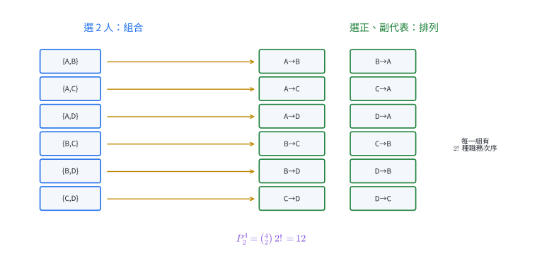{width=94%}

選出 $r$ 人等同於決定留下的 $n-r$ 人，所以

$$
\boxed{\binom{n}{r}=\binom{n}{n-r}}.
$$

邊界情況是 $\binom{n}{0}=\binom{n}{n}=1$：選空集合與選出全部各只有一種方式。

### 5.2 條件選取與分組

含條件的組合題通常先依「選了幾個特定類別」分成互斥情況，再把各情況相加。若把相異物件分成數個群組，可依序選出各組；當兩個群組大小相同且沒有名稱時，交換兩組不產生新結果，因此還要除去相同群組的交換次數。

例如 8 本相異書分成大小 $4,2,2$ 的三堆，其中兩個 2 本堆沒有標籤。先選 4 本，再從剩下 4 本選 2 本會得到

$$
\binom84\binom42\binom22,
$$

但兩個 2 本堆可互換，所以實際分法為

$$
\frac{\binom84\binom42\binom22}{2!}.
$$

::: example
### 例 11｜選出委員

10 人中選 4 人組成委員會，共有幾種？

委員之間沒有職務差別，使用組合：

$$
\binom{10}{4}=\frac{10!}{4!6!}=210.
$$
:::

::: example
### 例 12｜至少條件用互斥分類

5 位男生與 4 位女生中選 4 人，至少有 2 位女生，共有幾種？

依女生人數分成 2、3、4 人三類：

$$
\binom42\binom52+\binom43\binom51+\binom44\binom50
=6\cdot10+4\cdot5+1=81.
$$

三類的女生人數不同，彼此互斥，可直接相加。
:::

::: example
### 例 13｜分成沒有名稱的等大群組

6 支相異鉛筆平均分成 3 組，每組 2 支，群組沒有名稱。共有幾種分法？

依序選三組會得到

$$
\binom62\binom42\binom22.
$$

同一分組會因三組的先後次序被計算 $3!$ 次，因此

$$
\frac{\binom62\binom42\binom22}{3!}
=\frac{15\cdot6}{6}=15.
$$
:::

### 5.3 分節練習

1. 計算 $\binom{12}{3}$ 與 $\binom{12}{9}$。
2. 9 本不同的書中選 5 本帶出門，共有幾種選法？
3. 平面上有 8 點，其中任三點不共線。可決定多少條直線？
4. 6 位男生、5 位女生中選 4 人，恰有 2 位女生，共有幾種？
5. 7 人中選 3 人，甲與乙恰有一人入選，共有幾種？
6. 8 個相異物件分成兩組，每組 4 個，兩組沒有名稱，共有幾種分法？

### 5.4 分節練習解析

1. $\binom{12}{3}=12\cdot11\cdot10/(3\cdot2\cdot1)=220$。由對稱性，$\binom{12}{9}=\binom{12}{3}=220$。
2. 只記錄選到哪 5 本，故有 $\binom95=126$ 種。
3. 每兩點決定一條直線，任三點不共線確保不同點對得到不同直線，因此有 $\binom82=28$ 條。
4. 選 2 位女生與 2 位男生：$\binom52\binom62=10\cdot15=150$ 種。
5. 先從甲乙中選 1 人，有 $\binom21$ 種；再從其餘 5 人選 2 人，有 $\binom52$ 種。答案 $2\cdot10=20$ 種。
6. 先選第一組有 $\binom84=70$ 種，但同一分組因兩組交換而重複 2 次，故有 $70/2=35$ 種。

組合用於抽樣、委員會、資料特徵選取與幾何物件計數。判斷標準是交換選取順序後，結果的身分是否改變；若群組或職務有名稱，就保留相應次序。

## 6. 二項式定理

### 6.1 係數來自選擇因子

把 $(x+y)^n$ 寫成 $n$ 個因子的乘積：

$$
(x+y)^n=(x+y)(x+y)\cdots(x+y).
$$

要形成 $x^{n-k}y^k$，必須從 $n$ 個因子中選出 $k$ 個提供 $y$，其餘提供 $x$。選法有 $\binom nk$ 種，所以

$$
\boxed{(x+y)^n=\sum_{k=0}^{n}\binom nk x^{n-k}y^k}.
$$

第 $k+1$ 項是

$$
T_{k+1}=\binom nk x^{n-k}y^k.
$$

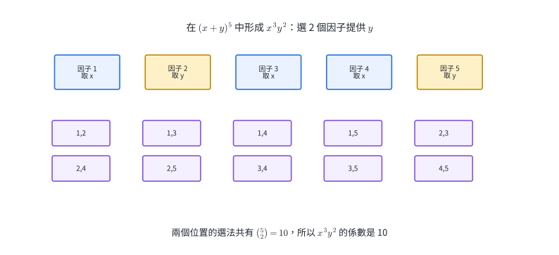{width=95%}

若因子是 $(ax+b)^n$，通項改為

$$
T_{k+1}=\binom nk (ax)^{n-k}b^k.
$$

負號、係數與變數次方都留在被選的項中一起乘入。

::: example
### 例 14｜求指定項的係數

求 $(2x-y)^5$ 中 $x^3y^2$ 的係數。

要得到 $y^2$，選 $k=2$；其餘三個因子提供 $2x$。對應項為

$$
\binom52(2x)^3(-y)^2
=10\cdot8x^3y^2.
$$

所以係數是

$$
\boxed{80}.
$$
:::

::: example
### 例 15｜利用次方條件找常數項

求 $\left(x^2+\dfrac1x\right)^6$ 的常數項。

通項為

$$
\binom6k(x^2)^{6-k}\left(\frac1x\right)^k
=\binom6k x^{12-3k}.
$$

常數項的指數為 $0$，所以

$$
12-3k=0\quad\Longrightarrow\quad k=4.
$$

常數項是

$$
\binom64=15.
$$
:::

### 6.2 分節練習

1. 展開 $(x+y)^4$。
2. 求 $(3x+2)^5$ 中 $x^3$ 的係數。
3. 求 $(x-2y)^6$ 中 $x^4y^2$ 的係數。
4. 求 $\left(x+\dfrac1x\right)^8$ 的常數項。
5. 求 $(1+2x)^7$ 中 $x^5$ 的係數。

### 6.3 分節練習解析

1. 係數依序為 $1,4,6,4,1$，故 $(x+y)^4=x^4+4x^3y+6x^2y^2+4xy^3+y^4$。
2. $x^3$ 表示 3 個因子提供 $3x$、2 個提供 $2$，係數為 $\binom53 3^3 2^2=10\cdot27\cdot4=1080$。
3. 選 2 個因子提供 $-2y$，係數為 $\binom62(-2)^2=15\cdot4=60$。
4. 通項為 $\binom8k x^{8-2k}$。令 $8-2k=0$ 得 $k=4$，常數項為 $\binom84=70$。
5. 選 5 個因子提供 $2x$，係數為 $\binom75 2^5=21\cdot32=672$。

二項式定理可快速取得多項式係數，也可用於近似計算、機率分布與組合恆等式。通項把「選哪些因子」與「所得次方」連起來，因而能直接定位指定項。

## 7. 巴斯卡三角形

### 7.1 相鄰兩數相加的原因

巴斯卡三角形第 $n$ 列依序放入

$$
\binom n0,\binom n1,\ldots,\binom nn.
$$

固定一個特別元素 $a$，從 $n$ 個元素選 $k$ 個可分成兩類：

1. 選到 $a$：再從其餘 $n-1$ 個選 $k-1$ 個，共 $\binom{n-1}{k-1}$ 種。
2. 留下 $a$：從其餘 $n-1$ 個選 $k$ 個，共 $\binom{n-1}{k}$ 種。

兩類互斥且涵蓋全部，所以

$$
\boxed{\binom nk=\binom{n-1}{k-1}+\binom{n-1}{k}}.
$$

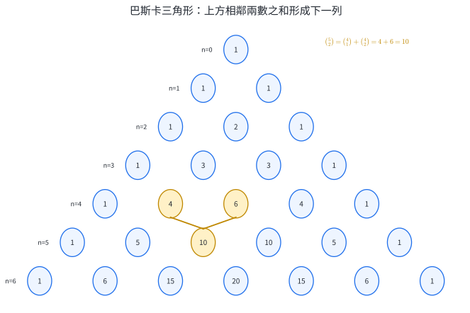{width=82%}

令二項式定理中的 $x=y=1$，可得一列組合數之和：

$$
\sum_{k=0}^{n}\binom nk=(1+1)^n=2^n.
$$

這也等於 $n$ 元集合的所有子集合數，因為每個元素都有「選」與「留」兩種狀態。

令 $x=1,y=-1$，當 $n\ge1$ 時，

$$
\sum_{k=0}^{n}(-1)^k\binom nk=(1-1)^n=0.
$$

因此偶數索引的組合數總和等於奇數索引的組合數總和，各為 $2^{n-1}$。

::: example
### 例 16｜用巴斯卡恆等式拆解組合數

計算 $\binom83$，並以「指定某人是否入選」解釋。

從 8 人選 3 人，指定甲。包含甲時，再選 2 人，有 $\binom72=21$ 種；不包含甲時，從其餘 7 人選 3 人，有 $\binom73=35$ 種。因此

$$
\binom83=\binom72+\binom73=21+35=56.
$$
:::

::: example
### 例 17｜計算一列中的奇偶索引總和

求

$$
\binom90+\binom92+\binom94+\binom96+\binom98.
$$

這是第 9 列偶數索引的總和。偶、奇索引總和相等，而整列總和是 $2^9$，所以答案為

$$
2^8=256.
$$
:::

### 7.2 分節練習

1. 用巴斯卡恆等式把 $\binom{10}{4}$ 寫成兩個第 9 列組合數之和。
2. 求 $\displaystyle\sum_{k=0}^{8}\binom8k$。
3. 求 $\binom{10}{1}+\binom{10}{3}+\binom{10}{5}+\binom{10}{7}+\binom{10}{9}$。
4. 說明 $\binom{11}{5}=\binom{10}{4}+\binom{10}{5}$ 的分類意義。

### 7.3 分節練習解析

1. $\binom{10}{4}=\binom93+\binom94$。
2. 整列總和為 $2^8=256$。
3. 這是第 10 列奇數索引總和，等於 $2^9=512$。
4. 從 11 人選 5 人，指定甲。包含甲時由其餘 10 人選 4 人，有 $\binom{10}{4}$ 種；留下甲時由其餘 10 人選 5 人，有 $\binom{10}{5}$ 種。兩類合起來就是 $\binom{11}{5}$。

巴斯卡三角形把局部遞迴與全列係數連在一起，可用於快速產生二項式係數、組合恆等式與計數程式的動態更新。

## 8. 樣本空間

### 8.1 試驗、樣本點與樣本空間

在相同條件下可重複進行，而單次結果在進行前具有不確定性的過程稱為**隨機試驗**。一次試驗所有可能結果所成的集合稱為**樣本空間**，記作 $S$；其中每一個結果稱為**樣本點**。

建立樣本空間時，要先決定一個樣本點記錄哪些資訊。例如連續擲兩次硬幣，$(H,T)$ 表示第一次正面、第二次反面。時間次序屬於結果的一部分，因此

$$
S=\{(H,H),(H,T),(T,H),(T,T)\}.
$$

若從甲、乙、丙三人中選兩人組隊，交換選取先後不改變隊伍，樣本點可寫成

$$
S=\{\{\text{甲,乙}\},\{\text{甲,丙}\},\{\text{乙,丙}\}\}.
$$

同一問題的分子與分母必須使用相同結果單位。若分母把抽取順序列入樣本點，事件的有利結果也要保留順序；若分母使用無序小組，分子也使用無序小組。

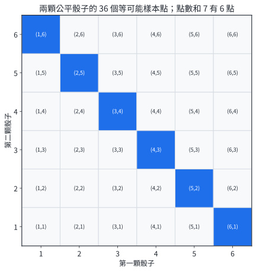{width=78%}

::: example
### 例 18｜列出兩次硬幣試驗的樣本空間

擲一枚硬幣兩次，以 H、T 分別表示正面、反面。第一、二次結果形成有序對，因此

$$
S=\{HH,HT,TH,TT\},\qquad |S|=4.
$$

「恰有一次正面」對應 $HT,TH$ 兩個樣本點。兩者都要保留，因為正面出現的時間位置不同。
:::

::: example
### 例 19｜有放回與不放回的樣本點

袋中有標號 $1,2,3$ 的球，依序抽兩次並記錄標號。

有放回時，每次都可抽到三種標號：

$$
S_{\text{有放回}}=\{(i,j):i,j\in\{1,2,3\}\},\qquad |S|=3^2=9.
$$

不放回時，第二次要排除第一次的標號：

$$
S_{\text{不放回}}=\{(i,j):i,j\in\{1,2,3\},\ i\ne j\},\qquad |S|=3\cdot2=6.
$$
:::

### 8.2 分節練習

1. 擲一枚硬幣三次，用 H、T 表示結果。寫出樣本空間並求大小。
2. 同時擲一顆紅骰與一顆藍骰，以有序對記錄點數。樣本空間有幾個樣本點？
3. 從 A、B、C、D 四人中選兩人組隊。以無序小組為樣本點，列出樣本空間。
4. 從標號 $1,2,3,4$ 的卡片中依序抽兩張。分別求有放回與不放回時的樣本空間大小。

### 8.3 分節練習解析

1. $S=\{HHH,HHT,HTH,HTT,THH,THT,TTH,TTT\}$，共有 $2^3=8$ 點。
2. 紅骰點數是第一座標，藍骰點數是第二座標，各有 6 種，故 $|S|=6\cdot6=36$。
3. $S=\{\{A,B\},\{A,C\},\{A,D\},\{B,C\},\{B,D\},\{C,D\}\}$，共有 $\binom42=6$ 點。
4. 有放回時兩個位置各有 4 種，大小為 $4^2=16$；不放回時依序有 $4,3$ 種，大小為 $4\cdot3=12$。

樣本空間是抽樣模擬、可靠度測試與機率程式的資料結構。先固定一次結果的欄位、順序與放回規則，後續事件和機率才能使用同一套結果編碼。

## 9. 事件

### 9.1 事件是樣本空間的子集合

樣本空間 $S$ 的任一子集合稱為**事件**。只含一個樣本點的是單一事件；含多個樣本點的是複合事件。$S$ 本身是必然事件，$\emptyset$ 是不可能事件。

事件運算沿用集合語言：

$$
A\cup B:\ A\text{ 或 }B\text{ 至少一個發生},
$$

$$
A\cap B:\ A\text{ 與 }B\text{ 同時發生},
$$

$$
A^c:\ A\text{ 沒有發生}.
$$

若 $A\cap B=\emptyset$，稱 $A,B$ **互斥**，表示一次試驗中兩事件無法同時發生。互斥描述交集為空；是否互斥要由樣本點檢查。

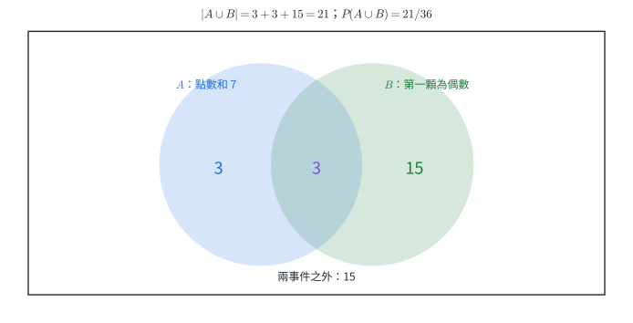{width=88%}

::: example
### 例 20｜把敘述翻成事件運算

擲兩顆骰子。令 $A$ 表示「點數和為 7」，$B$ 表示「第一顆為偶數」。

- $A\cap B$：點數和為 7，且第一顆為偶數，樣本點是 $(2,5),(4,3),(6,1)$。
- $A\cup B$：點數和為 7，或第一顆為偶數，包含兩事件所有樣本點。
- $A^c$：點數和不等於 7。

$A\cap B$ 含 3 個樣本點，所以 $A,B$ 可同時發生，兩事件不互斥。
:::

::: example
### 例 21｜互斥事件與補事件

從一副標準撲克牌抽一張。令 $C$ 表示抽到紅心，$D$ 表示抽到黑桃，$E$ 表示抽到紅色牌。

紅心與黑桃的花色不同，所以 $C\cap D=\emptyset$，$C,D$ 互斥。

再令 $F$ 表示抽到方塊。紅色牌是紅心或方塊，因此 $E=C\cup F$；$E^c$ 是黑色牌，也就是黑桃或梅花。由事件笛摩根律，

$$
E^c=C^c\cap F^c.
$$
:::

### 9.2 分節練習

1. 擲一顆骰子，$S=\{1,2,3,4,5,6\}$。令 $A$ 表示偶數，$B$ 表示大於 4。寫出 $A,B,A\cap B,A\cup B,A^c$。
2. 從 $1$ 到 $10$ 任取一個整數。令 $C$ 表示 2 的倍數，$D$ 表示 5 的倍數。判斷 $C,D$ 是否互斥。
3. 擲一枚硬幣兩次。令 $E$ 表示至少一次正面，寫出 $E$ 與 $E^c$。
4. 對任意兩事件 $A,B$，用文字說明 $(A\cap B)^c=A^c\cup B^c$。

### 9.3 分節練習解析

1. $A=\{2,4,6\}$，$B=\{5,6\}$，$A\cap B=\{6\}$，$A\cup B=\{2,4,5,6\}$，$A^c=\{1,3,5\}$。
2. $C=\{2,4,6,8,10\}$，$D=\{5,10\}$，交集是 $\{10\}$，所以兩事件不互斥。
3. $S=\{HH,HT,TH,TT\}$。$E=\{HH,HT,TH\}$，$E^c=\{TT\}$。
4. 「$A$ 與 $B$ 同時發生」沒有成立，等價於「$A$ 沒有發生或 $B$ 沒有發生」，所以兩邊代表相同樣本點集合。

事件把文字條件轉成樣本點集合，可直接支援品質篩選、警報規則與資料分類。交、聯、補運算也會成為下一節機率公式的結構。

## 10. 古典機率

### 10.1 有限且等可能的模型

若樣本空間 $S$ 有限，而且每個樣本點發生的機會相同，事件 $A$ 的**古典機率**定義為

$$
\boxed{P(A)=\frac{|A|}{|S|}}.
$$

這個公式的條件是樣本點等可能。公平骰子的六個點數等可能；若轉盤各區面積不同，把每個顏色區塊直接當成一個樣本點就未必等可能，需要依面積或實驗頻率另建模型。

由集合分割可推得基本性質：

$$
P(S)=1,\qquad P(\emptyset)=0,
$$

$$
\boxed{P(A^c)=1-P(A)},
$$

$$
\boxed{P(A\cup B)=P(A)+P(B)-P(A\cap B)}.
$$

第三式來自 $A$ 與 $A^c$ 把 $S$ 分成兩個互斥區域；第四式則修正交集被重複計算一次。若 $A,B$ 互斥，交集機率為 $0$，聯集機率可直接相加。

### 10.2 用排列組合計算樣本點

抽取、排隊與分組的機率常先用排列或組合計算 $|S|$ 與 $|A|$。分子、分母必須採用一致的結果單位：兩者都記順序，或兩者都只記成員。使用組合時，通常表示每個同大小小組等可能。

::: example
### 例 22｜兩顆骰子的點數和

擲兩顆公平骰子，求點數和為 7 的機率。

以有序對 $(i,j)$ 為樣本點，共有 $6\cdot6=36$ 個等可能結果。點數和為 7 的有

$$
(1,6),(2,5),(3,4),(4,3),(5,2),(6,1),
$$

共 6 個，所以

$$
P(\text{和為 }7)=\frac6{36}=\frac16.
$$
:::

::: example
### 例 23｜不放回抽球恰好一紅一白

袋中有 4 顆紅球、3 顆白球，任取 2 顆，求恰好一紅一白的機率。

以無序兩球小組為樣本點，總數為 $\binom72=21$。有利結果先選 1 紅再選 1 白：

$$
\binom41\binom31=12.
$$

所以

$$
P(\text{一紅一白})=\frac{12}{21}=\frac47.
$$
:::

::: example
### 例 24｜至少一個事件用補集

袋中有 3 顆紅球、7 顆藍球，任取 4 顆，求至少有 1 顆紅球的機率。

總樣本數為 $\binom{10}{4}$。「至少 1 紅」的補事件是「4 顆全藍」，所以

$$
P(\text{至少 1 紅})
=1-\frac{\binom74}{\binom{10}{4}}
=1-\frac{35}{210}
=\frac56.
$$
:::

::: example
### 例 25｜重複月份的機率

假設每人的出生月份在 12 個月中等可能且彼此獨立。4 人中至少兩人同月出生的機率為何？

補事件是 4 人月份都不同。全部月份序列有 $12^4$ 種；月份都不同有 $P^{12}_4$ 種。因此

$$
P(\text{至少同月})
=1-\frac{P^{12}_4}{12^4}
=1-\frac{12\cdot11\cdot10\cdot9}{12^4}
=\frac{41}{96}.
$$

此模型把月份視為等可能；若處理真實人口資料，可改用各月實際比例。
:::

### 10.3 分節練習

1. 擲一顆公平骰子，求點數為質數的機率。
2. 擲兩顆公平骰子，求點數和至少為 10 的機率。
3. 一副標準 52 張撲克牌中任抽一張，求抽到紅色牌或 K 的機率。
4. 5 顆紅球、4 顆白球中任取 3 顆，求恰有 2 顆紅球的機率。
5. 6 人中隨機選 2 人，求甲、乙至少一人入選的機率。
6. 擲一枚公平硬幣 5 次，求至少出現一次正面的機率。

### 10.4 分節練習解析

1. 質數點數是 $2,3,5$，共 3 個，故機率 $3/6=1/2$。
2. 和為 $10$ 有 3 點、和為 $11$ 有 2 點、和為 $12$ 有 1 點，共 6 點，因此機率 $6/36=1/6$。
3. 紅色牌 26 張，K 有 4 張，其中紅色 K 有 2 張。由取捨公式，有利牌數 $26+4-2=28$，機率 $28/52=7/13$。
4. 總數 $\binom93=84$；有利數 $\binom52\binom41=10\cdot4=40$，機率 $40/84=10/21$。
5. 補事件是甲乙都未入選。有利於補事件的小組數為 $\binom42=6$，總數 $\binom62=15$，所以所求機率 $1-6/15=3/5$。
6. 補事件是五次全反面，機率為 $(1/2)^5=1/32$，所以至少一次正面的機率是 $31/32$。

古典機率用於抽樣檢驗、隨機分派、遊戲與簡化風險模型。計算前先確認樣本點是否等可能，再用計數原理建立同一尺度的分子與分母。

## 11. 期望值

### 11.1 機率分布與長期平均

把隨機試驗的每個結果對應到一個數值，就得到隨機變數 $X$。若 $X$ 的可能值為 $x_1,x_2,\ldots,x_k$，對應機率為 $p_1,p_2,\ldots,p_k$，其中

$$
p_i\ge0,\qquad p_1+p_2+\cdots+p_k=1,
$$

則 $X$ 的**期望值**是

$$
\boxed{E(X)=x_1p_1+x_2p_2+\cdots+x_kp_k}.
$$

若同一試驗重複很多次，約有比例 $p_i$ 的試驗得到 $x_i$。總值除以試驗次數後，便接近 $\sum x_ip_i$，因此期望值描述長期每次試驗的平均值。

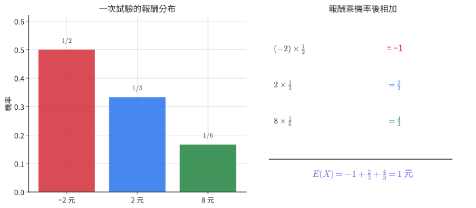{width=92%}

期望值可以不等於任何一次實際結果。例如公平骰子的點數期望值是 $3.5$，雖然單次不會擲出 $3.5$ 點；$3.5$ 表示大量重複後的平均點數。

若遊戲以淨收益為隨機變數，$E(X)=0$ 稱為**公平遊戲**；正值表示參與者長期平均獲利，負值表示長期平均損失。

::: example
### 例 26｜由報酬分布計算期望值

擲一顆公平骰子。點數 $1,2,3$ 得 $-2$ 元，點數 $4,5$ 得 $2$ 元，點數 $6$ 得 $8$ 元。求期望淨收益。

三類互斥且涵蓋全部，機率依序為 $3/6,2/6,1/6$，所以

$$
E(X)=(-2)\frac36+2\frac26+8\frac16
=-1+\frac23+\frac43=1.
$$

長期平均每次淨收益為 1 元。
:::

::: example
### 例 27｜由公平條件反求扣分

一道單選題有 5 個選項。答對得 4 分，答錯扣 $x$ 分，完全隨機作答時希望期望得分為 0。求 $x$。

答對機率為 $1/5$，答錯機率為 $4/5$，所以

$$
4\cdot\frac15+(-x)\cdot\frac45=0.
$$

乘以 5 得 $4-4x=0$，故

$$
x=1.
$$
:::

::: example
### 例 28｜抽票券的平均回饋

盒中有 10 張等可能票券：1 張回饋 100 元、3 張回饋 20 元、6 張回饋 0 元。每抽一次的期望回饋是多少？若每次需付 18 元，期望淨收益是多少？

期望回饋為

$$
100\cdot\frac1{10}+20\cdot\frac3{10}+0\cdot\frac6{10}=16\text{ 元}.
$$

扣除固定費用 18 元，期望淨收益為

$$
16-18=-2\text{ 元}.
$$
:::

### 11.2 分節練習

1. 公平骰子的點數 $X$ 可能為 $1$ 到 $6$，求 $E(X)$。
2. 一枚公平硬幣擲一次，正面得 6 元、反面損失 2 元，求期望淨收益。
3. 某產品抽樣後有 $0.7$ 機率成本為 10 元、$0.2$ 機率成本為 30 元、$0.1$ 機率成本為 80 元，求期望成本。
4. 袋中 5 張票券等可能，獎金依序為 $0,0,10,20,50$ 元。每抽一次收費多少元時，期望淨收益為 0？
5. 一場遊戲有 $1/4$ 機率得 12 分，其餘情況扣 $a$ 分。若期望得分為 0，求 $a$。

### 11.3 分節練習解析

1. $E(X)=(1+2+3+4+5+6)/6=21/6=3.5$。
2. $E(X)=6(1/2)+(-2)(1/2)=2$ 元。
3. $E(X)=10(0.7)+30(0.2)+80(0.1)=7+6+8=21$ 元。
4. 期望獎金為 $(0+0+10+20+50)/5=16$ 元。收費 16 元時，期望淨收益為 $16-16=0$。
5. $12(1/4)+(-a)(3/4)=0$，乘以 4 得 $12-3a=0$，所以 $a=4$ 分。

期望值用於比較長期平均成本、收益與計分規則。它只保留平均位置；若兩個方案的波動幅度不同，完整比較還需同時查看各結果機率與可能損失範圍。

## 12. 章末分層題

### 12.1 基礎與核心題

1. 討論範圍為實數。令 $P:x>3$，$Q:x^2>9$。判斷 $P\Rightarrow Q$ 與 $Q\Rightarrow P$，並寫出「$x>3$ 且 $x\le10$」的否定。
2. 令 $U=\{1,2,\ldots,15\}$，$A$ 是 3 的倍數集合，$B$ 是質數集合。求 $A\cap B$、$A\cup B$ 與 $(A\cup B)^c$。
3. $1$ 到 $300$ 中，能被 $4$ 或 $9$ 整除的整數有幾個？
4. 從 $0,1,2,\ldots,7$ 中取 5 個不同數字排成五位數，共有幾個？
5. STATISTICS 的 10 個字母共有幾種不同排列？
6. 用 6 種顏色塗 5 個排成一列的色塊，相鄰色塊顏色不同，共有幾種？
7. 6 位男生與 5 位女生中選 5 人，至少有 2 位女生，共有幾種？
8. 求 $\left(x^2-\dfrac2x\right)^6$ 的常數項。
9. 求

   $$
   \binom{11}{1}+\binom{11}{3}+\binom{11}{5}+\binom{11}{7}+\binom{11}{9}+\binom{11}{11}.
   $$

10. 擲一枚公平硬幣三次。寫出「恰有兩次正面」事件及其補事件，並求兩事件各含多少個樣本點。
11. 5 顆紅球與 4 顆白球中任取 3 顆，求至少取到 1 顆白球的機率。
12. 隨機變數 $X$ 以機率 $1/2,1/3,1/6$ 分別取值 $-4,2,a$。若 $E(X)=0$，求 $a$。

### 12.2 跨節整合題

13. 甲、乙等 6 人隨機排成一列。求甲乙不相鄰的排列數與機率。
14. 從 $1$ 到 $180$ 隨機選一個整數。令 $A$ 表示選到 6 的倍數，$B$ 表示選到 10 的倍數。求 $P(A\cup B)$、恰有一事件發生的機率，以及兩事件都不發生的機率。
15. 把 BANANA 的不同字母排列等可能地選出一個。求三個 A 兩兩不相鄰的排列數與機率。
16. 袋中有 3 顆紅球、2 顆藍球，不放回任取 2 顆。兩紅得 12 分，一紅一藍得 4 分，兩藍扣 $x$ 分。列出分數的機率分布，並求遊戲公平時的 $x$。

## 13. 章末題完整詳解

### 第 1 題

若 $x>3$，平方後必有 $x^2>9$，所以 $P\Rightarrow Q$ 成立。取 $x=-4$，則 $x^2=16>9$，但 $x>3$ 不成立，因此 $Q\Rightarrow P$ 不成立。$P$ 是 $Q$ 的充分條件，$Q$ 是 $P$ 的必要條件。

令 $R:x>3$、$T:x\le10$。原命題是 $R\wedge T$，否定是

$$
(\neg R)\vee(\neg T),
$$

即

$$
x\le3\quad\text{或}\quad x>10.
$$

### 第 2 題

$$
A=\{3,6,9,12,15\},
$$

$$
B=\{2,3,5,7,11,13\}.
$$

所以

$$
A\cap B=\{3\},
$$

$$
A\cup B=\{2,3,5,6,7,9,11,12,13,15\}.
$$

由全集移除聯集中的元素，得到

$$
(A\cup B)^c=\{1,4,8,10,14\}.
$$

元素個數檢查：$|A\cup B|=5+6-1=10$，其補集有 $15-10=5$ 個，與列出的結果一致。

### 第 3 題

4 的倍數有

$$
\left\lfloor\frac{300}{4}\right\rfloor=75
$$

個；9 的倍數有 $\lfloor300/9\rfloor=33$ 個。兩類交集是 $\operatorname{lcm}(4,9)=36$ 的倍數，共 $\lfloor300/36\rfloor=8$ 個。由取捨原理，答案為

$$
75+33-8=100.
$$

### 第 4 題

最高位決定五位數能否成立。最高位可從 $1$ 到 $7$ 選，有 7 種；選完後，第二位可用剩餘 7 個數字，包括 0。其後三位依序有 $6,5,4$ 種。因此

$$
7\cdot7\cdot6\cdot5\cdot4=5880.
$$

### 第 5 題

STATISTICS 共 10 個字母，其中 S 有 3 個、T 有 3 個、I 有 2 個，A、C 各 1 個。不同排列數為

$$
\frac{10!}{3!3!2!}
=\frac{3628800}{72}
=50400.
$$

### 第 6 題

第一格有 6 種顏色。第二格到第五格各要與前一格不同，因此各有 5 種。總數是

$$
6\cdot5^4=3750.
$$

此條件只比較相鄰兩格，所以較早使用過的顏色可再次出現。

### 第 7 題

依女生人數分成 2、3、4、5 人四個互斥類別：

$$
\begin{aligned}
N
&=\binom52\binom63+\binom53\binom62
 +\binom54\binom61+\binom55\binom60\\
&=10\cdot20+10\cdot15+5\cdot6+1\\
&=381.
\end{aligned}
$$

### 第 8 題

二項式通項為

$$
\binom6k(x^2)^{6-k}\left(-\frac2x\right)^k
=\binom6k(-2)^k x^{12-3k}.
$$

常數項要求 $12-3k=0$，所以 $k=4$。代入得

$$
\binom64(-2)^4=15\cdot16=240.
$$

### 第 9 題

題式是第 11 列所有奇數索引組合數之和。由

$$
(1+1)^{11}=\sum_{k=0}^{11}\binom{11}{k}=2^{11}
$$

與

$$
(1-1)^{11}=\sum_{k=0}^{11}(-1)^k\binom{11}{k}=0,
$$

偶數索引總和與奇數索引總和相等，各為

$$
2^{10}=1024.
$$

### 第 10 題

三次硬幣試驗的樣本空間有 $2^3=8$ 點。「恰有兩次正面」事件為

$$
A=\{HHT,HTH,THH\},
$$

所以 $|A|=3$。補事件包含正面次數為 $0,1,3$ 的結果：

$$
A^c=\{TTT,HTT,THT,TTH,HHH\},
$$

故 $|A^c|=5$。兩者個數相加為 8，涵蓋整個樣本空間。

### 第 11 題

以無序 3 球小組為樣本點，總數是 $\binom93=84$。至少 1 顆白球的補事件是三顆全紅，有 $\binom53=10$ 種。因此

$$
P(\text{至少 1 白})
=1-\frac{\binom53}{\binom93}
=1-\frac{10}{84}
=\frac{37}{42}.
$$

### 第 12 題

三個機率相加為 $1/2+1/3+1/6=1$。由期望值條件，

$$
(-4)\frac12+2\frac13+a\frac16=0.
$$

乘以 6：

$$
-12+4+a=0,
$$

所以

$$
\boxed{a=8}.
$$

### 第 13 題｜排列與機率

全部排列有 $6!=720$ 種。甲乙相鄰時，把甲乙視為一塊：外部 5 個單位有 $5!$ 種，塊內有 $2!$ 種，因此相鄰排列有

$$
5!2!=240
$$

種。不相鄰排列數為

$$
720-240=480.
$$

所有 6 人排列等可能，所以

$$
P(\text{甲乙不相鄰})=\frac{480}{720}=\frac23.
$$

### 第 14 題｜集合、取捨與機率

樣本空間是 $1$ 到 $180$，共有 180 個等可能整數。

$$
|A|=\left\lfloor\frac{180}{6}\right\rfloor=30,
\qquad
|B|=\left\lfloor\frac{180}{10}\right\rfloor=18.
$$

交集是 $\operatorname{lcm}(6,10)=30$ 的倍數，所以 $|A\cap B|=6$。因此

$$
P(A\cup B)=\frac{30+18-6}{180}
=\frac{42}{180}=\frac7{30}.
$$

恰有一事件發生的個數為

$$
(30-6)+(18-6)=36,
$$

所以機率是 $36/180=1/5$。兩事件都不發生是 $(A\cup B)^c$，其機率為

$$
1-\frac7{30}=\frac{23}{30}.
$$

### 第 15 題｜相同物排列、空隙與機率

BANANA 的全部不同排列有

$$
\frac{6!}{3!2!}=60
$$

種。為使三個 A 兩兩不相鄰，先排列 B、N、N。因兩個 N 相同，排法有

$$
\frac{3!}{2!}=3
$$

種。每種排列形成 4 個空隙：

$$
\_\ B\ \_\ N\ \_\ N\ \_.
$$

從 4 個空隙選 3 個，各放一個相同的 A，有 $\binom43=4$ 種。因此有利排列數為

$$
3\cdot4=12.
$$

等可能選取一個不同排列時，所求機率為

$$
\frac{12}{60}=\frac15.
$$

### 第 16 題｜組合機率與公平期望

以無序兩球小組為樣本點，總數為

$$
\binom52=10.
$$

各類結果為

$$
P(\text{兩紅})=\frac{\binom32}{\binom52}=\frac3{10},
$$

$$
P(\text{一紅一藍})=\frac{\binom31\binom21}{\binom52}=\frac6{10},
$$

$$
P(\text{兩藍})=\frac{\binom22}{\binom52}=\frac1{10}.
$$

機率總和為 $3/10+6/10+1/10=1$。分數分布是 $12,4,-x$，對應以上三個機率。公平條件為

$$
12\cdot\frac3{10}+4\cdot\frac6{10}+(-x)\cdot\frac1{10}=0.
$$

乘以 10 得

$$
36+24-x=0,
$$

所以

$$
\boxed{x=60}.
$$

## 14. 核心整理

| 結構 | 判定方式 | 核心式 |
|---|---|---|
| 邏輯與集合 | 且、或、否定對應交、聯、補 | $\neg(P\wedge Q)\Leftrightarrow\neg P\vee\neg Q$；$(A\cap B)^c=A^c\cup B^c$ |
| 互斥分類 | 從不同類別擇一 | 加法原理 |
| 連續步驟 | 每個結果要完成所有步驟 | 乘法原理 |
| 聯集計數 | 類別有交集 | $|A\cup B|=|A|+|B|-|A\cap B|$ |
| 排列 | 次序、職務或位置有差別 | $P^n_r=n!/(n-r)!$ |
| 相同物排列 | 同類物件交換後結果相同 | $n!/(m_1!\cdots m_k!)$ |
| 重複排列 | 有序位置可重複取用 | $n^r$ |
| 組合 | 只記錄選到哪些對象 | $\binom nr=n!/[r!(n-r)!]$ |
| 二項式係數 | 從 $n$ 個因子選 $k$ 個提供第二項 | $(x+y)^n=\sum\binom nkx^{n-k}y^k$ |
| 巴斯卡恆等式 | 依指定元素選入或留下分類 | $\binom nk=\binom{n-1}{k-1}+\binom{n-1}{k}$ |
| 古典機率 | 有限且等可能的樣本點 | $P(A)=|A|/|S|$ |
| 補事件與聯集 | 用事件區域拆分 | $P(A^c)=1-P(A)$；$P(A\cup B)=P(A)+P(B)-P(A\cap B)$ |
| 期望值 | 數值乘機率後加總 | $E(X)=\sum x_ip_i$ |

排列組合先回答「共有多少種」，機率再回答「有利結果在等可能結果中占多少」，期望值最後把每種數值結果依機率加權。三者共用同一項要求：先清楚定義一次結果的身分、順序與限制條件。
