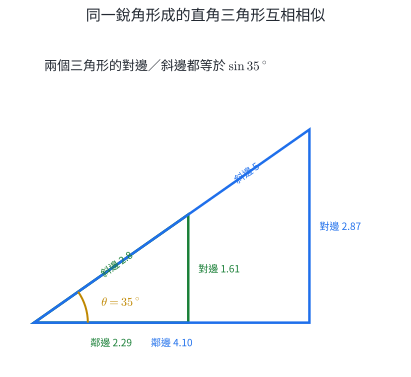
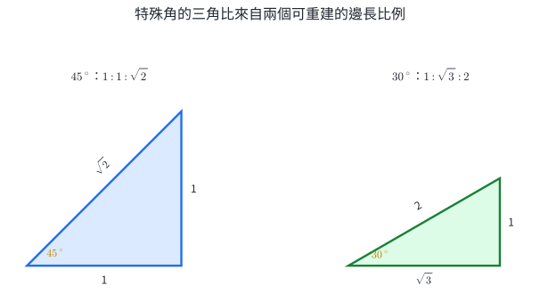
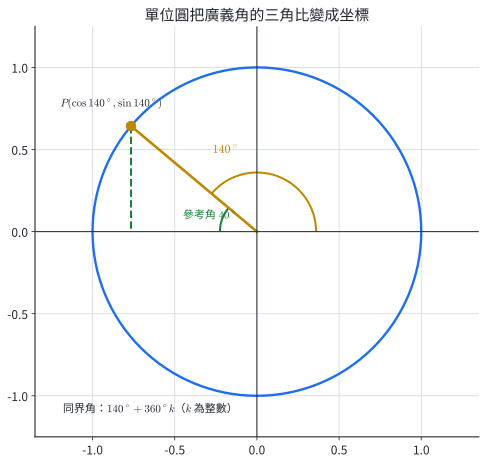
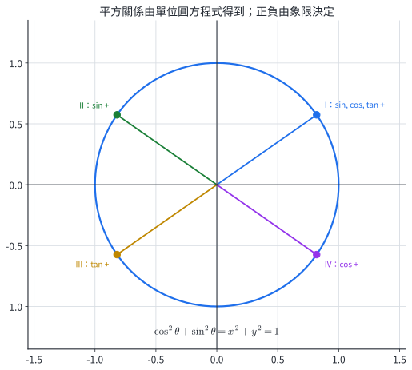
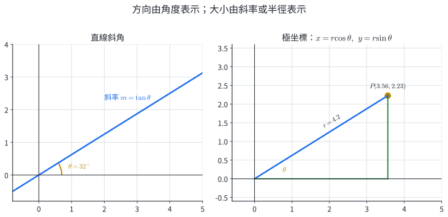
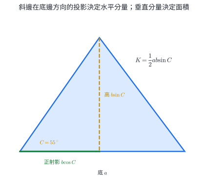
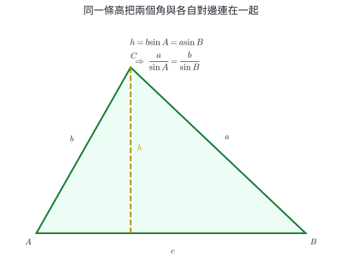
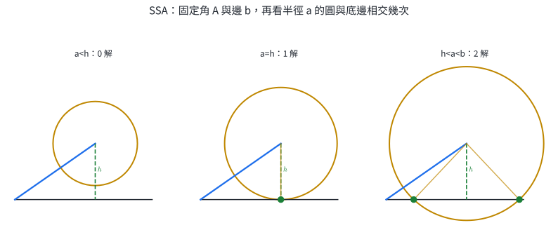
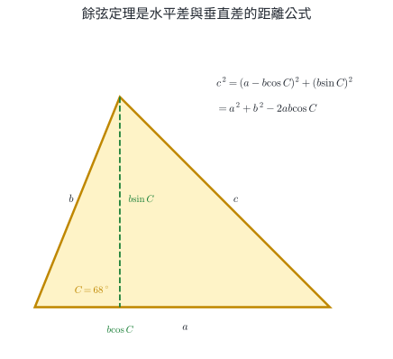
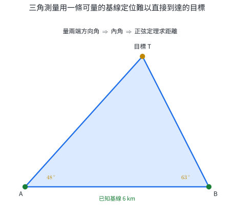

# 數2-4 三角比

::: learning-map
### 本章問題與能力

1. 為何固定銳角後，直角三角形的三個邊長比不隨大小改變？
2. 如何把正弦、餘弦、正切推廣到鈍角、負角與超過一圈的角？
3. 直線斜角與極坐標如何用角度描述方向？
4. 正射影與正弦如何把兩邊夾角轉成面積？
5. 正弦定理、餘弦定理各適合哪些已知條件，SSA 為何可能有兩個三角形？

本章路徑：相似邊比 → 廣義角坐標 → 方向表示 → 正射影與面積 → 解任意三角形。
:::

## 0. 本章實際用途：用角度取得難以直接量到的長度

三角比把方向與長度比例連在一起。知道水平距離與仰角，就能求建築高度；知道一段可測基線與兩端觀測角，就能定位河對岸、山頂或船隻。測量、導航、測繪、攝影定位及工程放樣都使用相同幾何機制。

坐標定義把三角比從直角三角形推廣到任意方向。單位圓上的點以 $(\cos\theta,\sin\theta)$ 表示方向，斜率是 $\tan\theta$，極坐標則用距離 $r$ 與方向角 $\theta$ 表示位置。這些表示法也會在向量、週期現象與物理分量中再次出現。

任意三角形的資料常只有三邊、兩邊夾角或一組對邊—對角。正弦定理與餘弦定理提供從已知資料還原其餘邊角的系統方法；選擇定理前先辨認已知資料的配對關係，可直接降低列式錯誤。

## 1. 直角三角形的邊角關係

### 1.1 三角比由相似三角形定義

固定銳角 $\theta$，任取兩個含 $\theta$ 的直角三角形。兩者都有直角與角 $\theta$，由 AA 判定互相相似，所以對應邊成比例。三角形整體放大 $k$ 倍時，任兩邊的比值中 $k$ 會約去，因此比值只由 $\theta$ 決定。

{width=90%}

相對於銳角 $\theta$，直角對面的邊稱為斜邊，正對 $\theta$ 的股稱為對邊，另一股稱為鄰邊。定義

$$
\boxed{\sin\theta=\frac{\text{對邊}}{\text{斜邊}}},\qquad
\boxed{\cos\theta=\frac{\text{鄰邊}}{\text{斜邊}}},\qquad
\boxed{\tan\theta=\frac{\text{對邊}}{\text{鄰邊}}}.
$$

三角比是長度相除所得的純數。由定義立即得到

$$
\boxed{\tan\theta=\frac{\sin\theta}{\cos\theta}}.
$$

直角三角形的兩銳角互餘。相對於 $\theta$ 的對邊，就是相對於 $90^\circ-\theta$ 的鄰邊，因此

$$
\boxed{\sin(90^\circ-\theta)=\cos\theta},\qquad
\boxed{\cos(90^\circ-\theta)=\sin\theta}.
$$

### 1.2 特殊角與基本關係

$45^\circ$ 的值來自等腰直角三角形；$30^\circ,60^\circ$ 的值來自正三角形對半切開。

{width=88%}

| $\theta$ | $\sin\theta$ | $\cos\theta$ | $\tan\theta$ |
|---:|---:|---:|---:|
| $30^\circ$ | $\dfrac12$ | $\dfrac{\sqrt3}{2}$ | $\dfrac{\sqrt3}{3}$ |
| $45^\circ$ | $\dfrac{\sqrt2}{2}$ | $\dfrac{\sqrt2}{2}$ | $1$ |
| $60^\circ$ | $\dfrac{\sqrt3}{2}$ | $\dfrac12$ | $\sqrt3$ |

若直角三角形兩股為 $a,b$、斜邊為 $c$，畢氏定理給出

$$
\sin^2\theta+\cos^2\theta
=\frac{a^2}{c^2}+\frac{b^2}{c^2}=1.
$$

所以

$$
\boxed{\sin^2\theta+\cos^2\theta=1}.
$$

### 1.3 計算機與反三角函數

一般角的三角比用計算機取得，本章角度單位使用 DEG。已知比值回推銳角時，使用 $\sin^{-1},\cos^{-1},\tan^{-1}$。例如

$$
\tan\theta=0.75
\quad\Rightarrow\quad
\theta=\tan^{-1}(0.75)\approx36.87^\circ.
$$

常見且會改變答案的兩項操作是角度模式與按鍵意義：DEG 與 RAD 的數值不同；$\sin^{-1}x$ 表示反正弦，$1/\sin x$ 才是倒數。

::: example
### 例 1｜由三邊求銳角三角比

直角三角形兩股為 5、12，斜邊為 13。令 $\theta$ 的對邊為 5，求三個三角比。

依定義

$$
\boxed{\sin\theta=\frac5{13}},\qquad
\boxed{\cos\theta=\frac{12}{13}},\qquad
\boxed{\tan\theta=\frac5{12}}.
$$

檢查：$(5/13)^2+(12/13)^2=1$。
:::

::: example
### 例 2｜由仰角求建築高度

觀測者眼睛離地 1.6 m，與建築底部的水平距離為 35 m，量得屋頂仰角 $38^\circ$。求建築高度。

令眼睛到屋頂的鉛直差為 $h$。直角三角形中

$$
\tan38^\circ=\frac{h}{35},
$$

所以

$$
h=35\tan38^\circ\approx27.35\text{ m}.
$$

加回眼高得建築高度

$$
\boxed{27.35+1.6\approx28.95\text{ m}}.
$$
:::

::: example
### 例 3｜已知三角比回推角度

一斜坡每水平前進 12 m 上升 5 m，求斜坡與水平面的夾角。

$$
\tan\theta=\frac5{12},\qquad
\theta=\tan^{-1}\!\left(\frac5{12}\right)\approx\boxed{22.62^\circ}.
$$

角度大小由上升量與水平量的比值決定，兩個長度同時放大時角度不變。
:::

#### 練習 1A

1. 直角三角形中，$\theta$ 的對邊、鄰邊、斜邊依序為 8、15、17。求三個三角比。
2. 求 $\sin30^\circ+\cos60^\circ+\tan45^\circ$。
3. 已知 $\cos\theta=12/13$ 且 $\theta$ 為銳角，求 $\sin\theta,\tan\theta$。
4. 梯子長 6 m，與地面夾角 $65^\circ$。梯頂離地多高？
5. 樹影長 9.5 m，太陽仰角 $52^\circ$。忽略地面坡度，求樹高。
6. 一條道路每水平 100 m 上升 8 m。求道路傾角，取到 $0.1^\circ$。

#### 練習 1A 解析

1. $\sin\theta=\boxed{8/17}$、$\cos\theta=\boxed{15/17}$、$\tan\theta=\boxed{8/15}$。
2. $1/2+1/2+1=\boxed{2}$。
3. $\sin\theta=\sqrt{1-(12/13)^2}=\boxed{5/13}$，$\tan\theta=(5/13)/(12/13)=\boxed{5/12}$。
4. 高度為 $6\sin65^\circ\approx\boxed{5.44\text{ m}}$。
5. $h=9.5\tan52^\circ\approx\boxed{12.2\text{ m}}$。
6. $\theta=\tan^{-1}(8/100)\approx\boxed{4.6^\circ}$。

## 2. 廣義角與坐標定義

### 2.1 標準位置、同界角與參考角

把角的始邊放在 $x$ 軸正向，逆時針旋轉定為正角，順時針旋轉定為負角。角可以超過一圈。終邊相同的角稱為同界角，所有同界角可寫成

$$
\boxed{\theta+360^\circ k},\qquad k\in\mathbb Z.
$$

終邊與 $x$ 軸所形成的銳角稱為參考角。參考角提供三角比的絕對值，象限決定正負。

### 2.2 終邊坐標定義

在角 $\theta$ 的終邊取非原點的點 $P(x,y)$，令

$$
r=\sqrt{x^2+y^2}>0.
$$

定義

$$
\boxed{\sin\theta=\frac yr},\qquad
\boxed{\cos\theta=\frac xr},\qquad
\boxed{\tan\theta=\frac yx}\quad(x\ne0).
$$

終邊上換一個點時，$x,y,r$ 同比例縮放，三個比值保持不變。當 $r=1$ 時，點落在單位圓上，坐標直接是

$$
\boxed{P=(\cos\theta,\sin\theta)}.
$$

{width=84%}

### 2.3 象限正負與平方關係

因為 $r>0$，$\sin\theta$ 的符號由 $y$ 決定，$\cos\theta$ 的符號由 $x$ 決定，$\tan\theta$ 的符號由 $xy$ 是否同號決定。

| 象限 | $\sin\theta$ | $\cos\theta$ | $\tan\theta$ |
|---|---:|---:|---:|
| I | $+$ | $+$ | $+$ |
| II | $+$ | $-$ | $-$ |
| III | $-$ | $-$ | $+$ |
| IV | $-$ | $+$ | $-$ |

坐標距離式 $x^2+y^2=r^2$ 除以 $r^2$，得到對任意有定義的角皆成立的

$$
\boxed{\sin^2\theta+\cos^2\theta=1}.
$$

{width=84%}

象限軸角可由單位圓直接讀出：

| $\theta$ | $0^\circ$ | $90^\circ$ | $180^\circ$ | $270^\circ$ |
|---:|---:|---:|---:|---:|
| $\sin\theta$ | $0$ | $1$ | $0$ | $-1$ |
| $\cos\theta$ | $1$ | $0$ | $-1$ | $0$ |
| $\tan\theta$ | $0$ | 未定義 | $0$ | 未定義 |

### 2.4 對稱角的三角比

單位圓上的坐標對稱直接給出三組基本關係。角 $-\theta$ 的點是 $(\cos\theta,-\sin\theta)$，因此

$$
\boxed{\sin(-\theta)=-\sin\theta},\qquad
\boxed{\cos(-\theta)=\cos\theta},\qquad
\boxed{\tan(-\theta)=-\tan\theta}.
$$

角 $180^\circ-\theta$ 的點是 $(-\cos\theta,\sin\theta)$，因此

$$
\boxed{\sin(180^\circ-\theta)=\sin\theta},
$$

$$
\boxed{\cos(180^\circ-\theta)=-\cos\theta},\qquad
\boxed{\tan(180^\circ-\theta)=-\tan\theta}.
$$

角 $90^\circ-\theta$ 的點把兩坐標互換，因此

$$
\boxed{\sin(90^\circ-\theta)=\cos\theta},\qquad
\boxed{\cos(90^\circ-\theta)=\sin\theta}.
$$

例如已知 $\sin\theta=0.7$，則

$$
\cos(90^\circ+\theta)
=\cos\!\left(180^\circ-(90^\circ-\theta)\right)
=-\cos(90^\circ-\theta)
=\boxed{-0.7}.
$$

::: example
### 例 4｜由終邊上一點求三角比

角 $\theta$ 的終邊通過 $P(-3,4)$。求三個三角比並判斷象限。

$$
r=\sqrt{(-3)^2+4^2}=5.
$$

所以

$$
\boxed{\sin\theta=\frac45},\qquad
\boxed{\cos\theta=-\frac35},\qquad
\boxed{\tan\theta=-\frac43}.
$$

$x<0,y>0$，終邊在第二象限，三個符號與結果一致。
:::

::: example
### 例 5｜利用參考角求廣義角三角比

求 $\sin210^\circ,\cos210^\circ,\tan210^\circ$。

$210^\circ$ 在第三象限，參考角是 $30^\circ$。第三象限正弦、餘弦為負，正切為正：

$$
\boxed{\sin210^\circ=-\frac12},\quad
\boxed{\cos210^\circ=-\frac{\sqrt3}{2}},\quad
\boxed{\tan210^\circ=\frac{\sqrt3}{3}}.
$$
:::

::: example
### 例 6｜由一個三角比與象限求其餘比值

已知 $\sin\theta=-12/13$，且 $\theta$ 終邊在第四象限。求 $\cos\theta,\tan\theta$。

第四象限的餘弦為正。由平方關係

$$
\cos\theta=\sqrt{1-\frac{144}{169}}=\frac5{13}.
$$

因此

$$
\boxed{\cos\theta=\frac5{13}},\qquad
\boxed{\tan\theta=-\frac{12}{5}}.
$$
:::

::: example
### 例 7｜找同界角與象限

把 $-750^\circ$ 化為 $0^\circ\le\theta<360^\circ$ 的同界角。

$$
-750^\circ+3(360^\circ)=330^\circ.
$$

所以標準範圍內的同界角為 $\boxed{330^\circ}$，在第四象限，參考角為 $30^\circ$。
:::

#### 練習 2A

1. 寫出與 $125^\circ$ 同界的兩個正角與兩個負角。
2. 判斷 $-200^\circ$ 的標準範圍同界角、象限與參考角。
3. 終邊通過 $(5,-12)$，求三個三角比。
4. 求 $\sin150^\circ,\cos150^\circ,\tan150^\circ$。
5. 已知 $\cos\theta=-8/17$ 且 $\theta$ 在第三象限，求 $\sin\theta,\tan\theta$。
6. 解 $0^\circ\le\theta<360^\circ$ 中滿足 $\sin\theta=\sqrt3/2$ 的角；並求 $\cos(180^\circ-\theta)$ 的可能值。

#### 練習 2A 解析

1. 例如正角 $\boxed{485^\circ,845^\circ}$；負角 $\boxed{-235^\circ,-595^\circ}$。
2. $-200^\circ+360^\circ=160^\circ$，在第二象限，參考角 $\boxed{20^\circ}$。
3. $r=13$，所以 $\sin\theta=\boxed{-12/13}$、$\cos\theta=\boxed{5/13}$、$\tan\theta=\boxed{-12/5}$。
4. 參考角 $30^\circ$、第二象限：$\boxed{1/2,-\sqrt3/2,-\sqrt3/3}$。
5. 第三象限正弦為負，$\sin\theta=-\sqrt{1-64/289}=\boxed{-15/17}$，$\tan\theta=\boxed{15/8}$。
6. 參考角為 $60^\circ$，正弦在第一、二象限為正，故 $\boxed{60^\circ,120^\circ}$。兩個角的餘弦分別為 $1/2,-1/2$；由 $\cos(180^\circ-\theta)=-\cos\theta$，可能值仍為 $\boxed{\pm1/2}$。

## 3. 直線斜角與極坐標

### 3.1 直線的斜角

非鉛垂直線與 $x$ 軸正向逆時針所成的角 $\theta$，取 $0^\circ\le\theta<180^\circ$，稱為直線斜角。取直線上兩點，水平變化為 $\Delta x$、鉛直變化為 $\Delta y$，則

$$
\boxed{m=\frac{\Delta y}{\Delta x}=\tan\theta}.
$$

正斜率對應第一象限方向的銳斜角；負斜率對應第二象限方向的鈍斜角。鉛垂線的斜角為 $90^\circ$，此時正切與斜率皆未定義。

### 3.2 極坐標

平面上一點可用到原點的距離 $r\ge0$ 與方向角 $\theta$ 表示，記作 $(r,\theta)$。極坐標轉直角坐標：

$$
\boxed{x=r\cos\theta},\qquad
\boxed{y=r\sin\theta}.
$$

直角坐標轉極坐標時先算

$$
\boxed{r=\sqrt{x^2+y^2}},
$$

再由 $x,y$ 的符號決定象限，配合 $\tan\theta=y/x$ 求方向角。同一點可用 $(r,\theta+360^\circ k)$ 表示；原點的 $r=0$，方向角可任取。

{width=94%}

::: example
### 例 8｜由斜率求直線斜角

直線 $3x-4y+8=0$ 化為 $y=\frac34x+2$，所以 $m=3/4$。

$$
\theta=\tan^{-1}\!\left(\frac34\right)\approx\boxed{36.87^\circ}.
$$
:::

::: example
### 例 9｜極坐標轉直角坐標

把 $(r,\theta)=(6,150^\circ)$ 轉成直角坐標。

$$
x=6\cos150^\circ=-3\sqrt3,\qquad
y=6\sin150^\circ=3.
$$

答案為 $\boxed{(-3\sqrt3,3)}$。
:::

::: example
### 例 10｜直角坐標轉極坐標

把 $P(-3,3\sqrt3)$ 轉成 $r\ge0,0^\circ\le\theta<360^\circ$ 的極坐標。

$$
r=\sqrt{9+27}=6.
$$

點在第二象限，$|y/x|=\sqrt3$ 的參考角為 $60^\circ$，所以 $\theta=120^\circ$。極坐標為 $\boxed{(6,120^\circ)}$。
:::

#### 練習 3A

1. 求斜率 $1$、$-1$ 的直線斜角。
2. 直線 $x+\sqrt3y-2=0$ 的斜角為何？
3. 把 $(4,210^\circ)$ 轉成直角坐標。
4. 把 $(0,-5)$ 轉成標準範圍極坐標。
5. 點的極坐標為 $(8,330^\circ)$。求它在 $x,y$ 方向的投影長。

#### 練習 3A 解析

1. $m=1$ 得 $\boxed{45^\circ}$；$m=-1$ 且斜角在 $[0,180^\circ)$，得 $\boxed{135^\circ}$。
2. $y=-x/\sqrt3+2/\sqrt3$，$m=-\sqrt3/3$，斜角為 $\boxed{150^\circ}$。
3. $x=4(-\sqrt3/2)=-2\sqrt3$、$y=4(-1/2)=-2$，故 $\boxed{(-2\sqrt3,-2)}$。
4. $r=5$，方向為負 $y$ 軸，故 $\boxed{(5,270^\circ)}$。
5. $x=8\cos330^\circ=\boxed{4\sqrt3}$，$y=8\sin330^\circ=\boxed{-4}$。

## 4. 正射影與三角形面積

### 4.1 正射影長

長度為 $b$ 的線段與指定正向夾角為 $C$，它在該方向的帶號正射影為

$$
\boxed{b\cos C}.
$$

當 $C$ 為銳角，投影與正向相同；當 $C$ 為鈍角，$\cos C<0$，負號記錄投影方向相反。三角形中，從一邊沿另一邊方向分解，可得射影關係，例如

$$
\boxed{c=a\cos B+b\cos A}.
$$

### 4.2 兩邊夾角面積公式

若三角形兩邊為 $a,b$，夾角為 $C$，以 $a$ 為底，對應高為 $b\sin C$，所以

$$
\boxed{K=\frac12ab\sin C}.
$$

輪換邊角可得

$$
\boxed{K=\frac12bc\sin A=\frac12ca\sin B=\frac12ab\sin C}.
$$

若已知三邊，可用**海龍公式**。令半周長

$$
s=\frac{a+b+c}{2},
$$

則

$$
\boxed{K=\sqrt{s(s-a)(s-b)(s-c)}}.
$$

它可由面積公式與餘弦定理推出。把

$$
K^2=\frac14a^2b^2(1-\cos^2C),
\qquad
\cos C=\frac{a^2+b^2-c^2}{2ab}
$$

合併並因式分解，得到

$$
16K^2=[(a+b)^2-c^2][c^2-(a-b)^2]
=16s(s-a)(s-b)(s-c).
$$

{width=91%}

::: example
### 例 11｜由兩邊夾角求面積

三角形兩邊為 8、11，夾角 $60^\circ$。面積為

$$
K=\frac12(8)(11)\sin60^\circ
=44\cdot\frac{\sqrt3}{2}
=\boxed{22\sqrt3}.
$$
:::

::: example
### 例 12｜由面積反求夾角

三角形兩邊為 10、13，面積為 52，且夾角 $C$ 為銳角。求 $C$。

$$
52=\frac12(10)(13)\sin C,
$$

所以 $\sin C=0.8$。因 $C$ 為銳角，

$$
C=\sin^{-1}(0.8)\approx\boxed{53.13^\circ}.
$$
:::

::: example
### 例 12-2｜由三邊求面積

三角形三邊為 13、14、15，半周長為

$$
s=\frac{13+14+15}{2}=21.
$$

由海龍公式

$$
K=\sqrt{21(21-13)(21-14)(21-15)}
=\sqrt{21\cdot8\cdot7\cdot6}
=\boxed{84}.
$$
:::

#### 練習 4A

1. 長 12 的線段與指定正向夾 $30^\circ$，求帶號投影長。
2. 長 7 的線段與指定正向夾 $120^\circ$，求帶號投影長並解釋符號。
3. 兩邊為 6、9，夾角 $45^\circ$，求三角形面積。
4. 兩邊為 5、12，面積為 15，求夾角正弦值。
5. 平行四邊形鄰邊為 8、13，夾角 $70^\circ$，求面積。
6. 三角形三邊為 9、9、8，求面積。

#### 練習 4A 解析

1. $12\cos30^\circ=\boxed{6\sqrt3}$。
2. $7\cos120^\circ=\boxed{-3.5}$；負號表示投影方向與指定正向相反。
3. $K=\frac12(6)(9)\sin45^\circ=\boxed{27\sqrt2/2}$。
4. $15=\frac12(5)(12)\sin C$，故 $\boxed{\sin C=1/2}$。
5. 平行四邊形面積是同底同高三角形的兩倍，$K=8(13)\sin70^\circ\approx\boxed{97.7}$。
6. $s=13$，所以 $K=\sqrt{13(4)(4)(5)}=\boxed{4\sqrt{65}}$。

## 5. 正弦定理與餘弦定理

約定三角形 $ABC$ 中，角 $A,B,C$ 的對邊分別為 $a,b,c$。

### 5.1 正弦定理

從 $C$ 向 $AB$ 作高 $h$。兩個直角三角形分別給出

$$
h=b\sin A=a\sin B.
$$

因此 $a/\sin A=b/\sin B$。對其他頂點重複同一推理，得到

$$
\boxed{\frac a{\sin A}=\frac b{\sin B}=\frac c{\sin C}=2R},
$$

其中 $R$ 為外接圓半徑。正弦定理最直接的入口是已知一組「角與其對邊」。

{width=90%}

### 5.2 SSA 的解數

已知 $A,a,b$ 時，正弦定理給出

$$
\sin B=\frac{b\sin A}{a}.
$$

當 $A$ 為銳角，令高 $h=b\sin A$：

- $a<h$：0 解。
- $a=h$：1 個直角三角形。
- $h<a<b$：2 解。
- $a\ge b$：1 解。

{width=96%}

計算時，若 $0<\sin B<1$，候選角為

$$
B_1=\sin^{-1}(u),\qquad B_2=180^\circ-B_1.
$$

逐一檢查 $A+B<180^\circ$，即可保留有效三角形。

### 5.3 餘弦定理

把角 $C$ 放在原點，一邊端點設為 $(a,0)$，另一邊端點設為 $(b\cos C,b\sin C)$。兩端點距離為 $c$：

$$
\begin{aligned}
c^2
&=(a-b\cos C)^2+(b\sin C)^2\\
&=a^2+b^2-2ab\cos C.
\end{aligned}
$$

所以

$$
\boxed{c^2=a^2+b^2-2ab\cos C}.
$$

{width=89%}

已知三邊時可改寫為

$$
\boxed{\cos C=\frac{a^2+b^2-c^2}{2ab}}.
$$

若 $C=90^\circ$，$\cos C=0$，餘弦定理退化為畢氏定理。若 $C$ 為鈍角，$\cos C<0$，因此對邊 $c$ 的平方大於 $a^2+b^2$。

### 5.4 基線三角測量

選取兩個可到達點 $A,B$，量得基線 $AB$ 與兩端指向目標 $T$ 的角。三角形的第三角由內角和得到，再用正弦定理求 $AT,BT$。這種做法把難以直接測量的距離轉成一段可量基線與兩個方向角。

{width=91%}

::: example
### 例 13｜ASA 解三角形

已知 $A=42^\circ,B=68^\circ,a=8$。求 $C,b,c$。

$$
C=180^\circ-42^\circ-68^\circ=70^\circ.
$$

由正弦定理

$$
b=8\frac{\sin68^\circ}{\sin42^\circ}\approx\boxed{11.09},
$$

$$
c=8\frac{\sin70^\circ}{\sin42^\circ}\approx\boxed{11.24}.
$$

最大角 $C=70^\circ$ 對應最大邊 $c$，與結果一致。
:::

::: example
### 例 14｜SSA 的兩個三角形

已知 $A=30^\circ,a=5,b=8$。因

$$
h=b\sin A=8\cdot\frac12=4,
$$

且 $4<5<8$，所以有兩解。由正弦定理

$$
\sin B=\frac{8\sin30^\circ}{5}=0.8.
$$

因此

$$
B_1\approx53.13^\circ,\qquad B_2\approx126.87^\circ.
$$

兩者都滿足 $A+B<180^\circ$，對應

$$
C_1\approx96.87^\circ,\qquad C_2\approx23.13^\circ.
$$
:::

::: example
### 例 15｜SAS 用餘弦定理求第三邊

已知 $a=7,b=10,C=60^\circ$。則

$$
c^2=7^2+10^2-2(7)(10)\cos60^\circ=79,
$$

所以 $\boxed{c=\sqrt{79}\approx8.89}$。
:::

::: example
### 例 16｜SSS 求角

三邊為 $a=5,b=7,c=8$。求角 $C$。

$$
\cos C=\frac{5^2+7^2-8^2}{2(5)(7)}=\frac17.
$$

所以

$$
C=\cos^{-1}\!\left(\frac17\right)\approx\boxed{81.79^\circ}.
$$
:::

#### 練習 5A

1. 已知 $A=35^\circ,B=75^\circ,a=12$，求 $C$ 與 $b$。
2. 已知 $A=40^\circ,a=9,b=7$。先用高判斷解數，再求角 $B$。
3. 已知兩邊為 8、13，夾角 $50^\circ$，求第三邊。
4. 三邊為 6、8、10，求最大角。
5. 三角形面積為 30，且 $a=10,b=8$。求 $\sin C$。
6. 基線 $AB=6$ km，量得 $A=48^\circ,B=63^\circ$。求 $AT$，取到 $0.01$ km。

#### 練習 5A 解析

1. $C=70^\circ$，$b=12\sin75^\circ/\sin35^\circ\approx\boxed{20.21}$。
2. $h=b\sin A=7\sin40^\circ\approx4.50$，且 $a=9\ge b$，故 1 解。$\sin B=7\sin40^\circ/9\approx0.5000$，$B\approx\boxed{30.00^\circ}$。
3. $c=\sqrt{8^2+13^2-2(8)(13)\cos50^\circ}\approx\boxed{9.96}$。
4. 最大邊 10 的對角滿足 $\cos C=(6^2+8^2-10^2)/(2\cdot6\cdot8)=0$，故最大角為 $\boxed{90^\circ}$。
5. $30=\frac12(10)(8)\sin C$，所以 $\boxed{\sin C=0.75}$。
6. $C=69^\circ$。$AT$ 對應角 $B$，所以 $AT=6\sin63^\circ/\sin69^\circ\approx\boxed{5.73\text{ km}}$。

## 6. 代表題與跨節整合題

### 基礎與核心題

1. 已知銳角 $\theta$ 的 $\tan\theta=3/4$，求 $\sin\theta,\cos\theta$。
2. 求 $\sin240^\circ,\cos240^\circ,\tan240^\circ$。
3. 終邊通過 $(-8,-15)$，求 $\sin\theta+\cos\theta$。
4. 解 $0^\circ\le\theta<360^\circ$ 中 $\cos\theta=-\sqrt2/2$。
5. 求直線 $y=-\sqrt3x+2$ 的斜角。
6. 把極坐標 $(10,300^\circ)$ 轉成直角坐標。
7. 三角形兩邊為 9、14，夾角 $40^\circ$，求面積。
8. 三角形 $A=50^\circ,B=60^\circ,a=7$，求 $b$。

### 推理與資料題

9. 已知三邊 $a=4,b=6,c=9$。判斷最大角是銳角、直角或鈍角。
10. 已知 $A=25^\circ,a=4,b=10$。判斷三角形解數。
11. 航行方向以東為 $0^\circ$、逆時針為正。一艘船航行 18 km，方向角 $125^\circ$。求東西與南北位移分量。
12. 面積固定為 24，兩邊 $a=8,b=10$。求 $\sin C$，並說明夾角可能有幾個。

### 跨節整合題

13. 山腳兩觀測點 $A,B$ 在同一直線上，$AB=80$ m。較遠的 $A$ 量得山頂仰角 $32^\circ$，較近的 $B$ 量得 $47^\circ$；山頂垂足在 $B$ 前方。求 $B$ 到垂足的水平距離與山高。
14. 三角形一頂點在原點，另兩頂點的極坐標為 $(6,20^\circ)$ 與 $(9,100^\circ)$。求兩點距離與三角形面積。
15. 已知 $A=35^\circ,a=7,b=10$。完整判斷三角形個數，求所有角 $B,C$，並以大角對大邊檢查結果。
16. 測量者在基線兩端量得遠端目標的內角 $A=52^\circ,B=71^\circ$，基線 $AB=120$ m。求兩端到目標距離，並求三角形面積。

## 7. 完整詳解

1. 取對邊 3、鄰邊 4，斜邊為 5，故 $\boxed{\sin\theta=3/5,\ \cos\theta=4/5}$。

2. $240^\circ$ 在第三象限，參考角 $60^\circ$：

   $$
   \boxed{\sin240^\circ=-\frac{\sqrt3}{2}},\quad
   \boxed{\cos240^\circ=-\frac12},\quad
   \boxed{\tan240^\circ=\sqrt3}.
   $$

3. $r=\sqrt{8^2+15^2}=17$，所以

   $$
   \sin\theta+\cos\theta=-\frac{15}{17}-\frac8{17}=\boxed{-\frac{23}{17}}.
   $$

4. 參考角 $45^\circ$，餘弦在第二、三象限為負，故 $\boxed{135^\circ,225^\circ}$。

5. $m=-\sqrt3$，標準斜角在第二象限，故 $\boxed{\theta=120^\circ}$。

6. $x=10\cos300^\circ=5$，$y=10\sin300^\circ=-5\sqrt3$，答案 $\boxed{(5,-5\sqrt3)}$。

7. 面積

   $$
   K=\frac12(9)(14)\sin40^\circ\approx\boxed{40.5}.
   $$

8. 由正弦定理

   $$
   b=7\frac{\sin60^\circ}{\sin50^\circ}\approx\boxed{7.91}.
   $$

9. 最大邊為 $c=9$。比較

   $$
   c^2=81,\qquad a^2+b^2=16+36=52.
   $$

   因 $c^2>a^2+b^2$，由餘弦定理知 $\cos C<0$，故最大角 $C$ 為鈍角。

10. 高 $h=b\sin A=10\sin25^\circ\approx4.23$。因 $a=4<h$，邊 $a$ 無法跨過高接到底邊，故 $\boxed{0\text{ 解}}$。

11. 東向分量

   $$
   x=18\cos125^\circ\approx-10.32\text{ km},
   $$

   北向分量

   $$
   y=18\sin125^\circ\approx14.74\text{ km}.
   $$

   負的東向分量表示向西 $10.32$ km；南北分量表示向北 $14.74$ km。

12. $24=\frac12(8)(10)\sin C$，所以 $\boxed{\sin C=0.6}$。在 $0^\circ<C<180^\circ$ 中，$C$ 可為 $\sin^{-1}(0.6)\approx36.87^\circ$ 或其補角 $143.13^\circ$，兩個夾角都形成三角形，因此有兩種形狀。

13. 設 $B$ 到垂足的水平距離為 $x$、山高為 $h$。由兩個仰角三角形

   $$
   h=x\tan47^\circ=(x+80)\tan32^\circ.
   $$

   所以

   $$
   x=\frac{80\tan32^\circ}{\tan47^\circ-\tan32^\circ}\approx\boxed{111.7\text{ m}}.
   $$

   山高

   $$
   h=x\tan47^\circ\approx\boxed{119.8\text{ m}}.
   $$

14. 兩條原點射線的夾角為 $80^\circ$。由餘弦定理，兩點距離 $d$ 滿足

   $$
   d^2=6^2+9^2-2(6)(9)\cos80^\circ,
   $$

   故 $d\approx\boxed{9.91}$。面積為

   $$
   K=\frac12(6)(9)\sin80^\circ\approx\boxed{26.59}.
   $$

15. 高 $h=b\sin A=10\sin35^\circ\approx5.74$，且 $h<a<b$，故有兩解。由

   $$
   \sin B=\frac{10\sin35^\circ}{7}\approx0.8194
   $$

   得

   $$
   B_1\approx55.02^\circ,\qquad B_2\approx124.98^\circ.
   $$

   因而

   $$
   C_1\approx89.98^\circ,\qquad C_2\approx20.02^\circ.
   $$

   第一形中 $b=10$ 對最大角 $B_1$ 嗎？此時 $C_1\approx90^\circ>B_1$，而其對邊 $c$ 應大於 10；正弦定理確實給出 $c\approx12.20$。第二形中 $B_2$ 最大且對邊 $b=10$ 最大，兩者皆一致。

16. 第三角

   $$
   C=180^\circ-52^\circ-71^\circ=57^\circ.
   $$

   設 $AB=c=120$ m，目標為 $C$。由正弦定理

   $$
   BC=a=120\frac{\sin52^\circ}{\sin57^\circ}\approx\boxed{112.75\text{ m}},
   $$

   $$
   AC=b=120\frac{\sin71^\circ}{\sin57^\circ}\approx\boxed{135.29\text{ m}}.
   $$

   面積可用兩邊夾角 $C$：

   $$
   K=\frac12ab\sin57^\circ\approx\boxed{6397\text{ m}^2}.
   $$

## 8. 核心整理

- 銳角三角比：$\sin=\text{對}/\text{斜}$、$\cos=\text{鄰}/\text{斜}$、$\tan=\text{對}/\text{鄰}$；比值由相似三角形保證只與角度有關。
- 廣義角：終邊點 $P(x,y)$、$r=\sqrt{x^2+y^2}$，則 $\sin\theta=y/r$、$\cos\theta=x/r$、$\tan\theta=y/x$。
- 平方關係：$\sin^2\theta+\cos^2\theta=1$；由象限決定開根號後的符號。
- 方向表示：直線斜率 $m=\tan\theta$；極坐標轉換 $x=r\cos\theta,y=r\sin\theta$。
- 投影與面積：投影 $b\cos C$；$K=\frac12ab\sin C$。
- 正弦定理：$a/\sin A=b/\sin B=c/\sin C=2R$，適合已有對邊—對角或 ASA/AAS。
- SSA：用高 $h=b\sin A$ 或兩個反正弦候選角完整判斷 0、1、2 解。
- 餘弦定理：$c^2=a^2+b^2-2ab\cos C$，適合 SAS 與 SSS。
