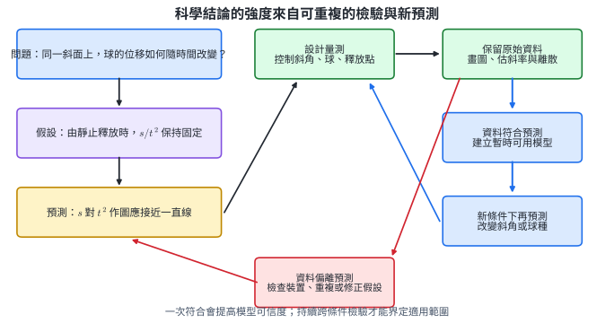
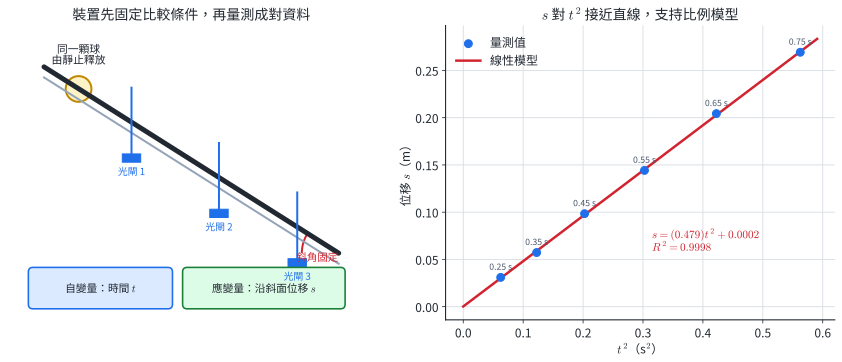
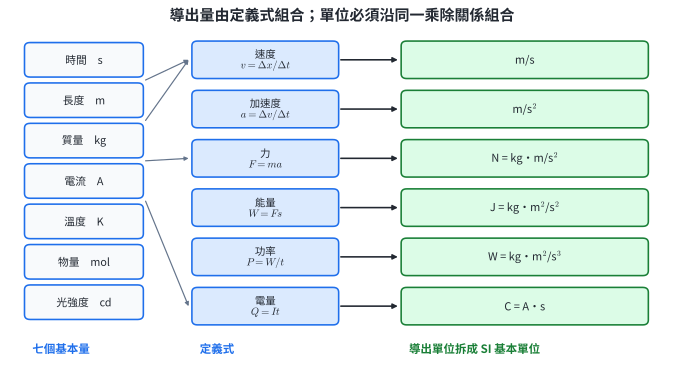
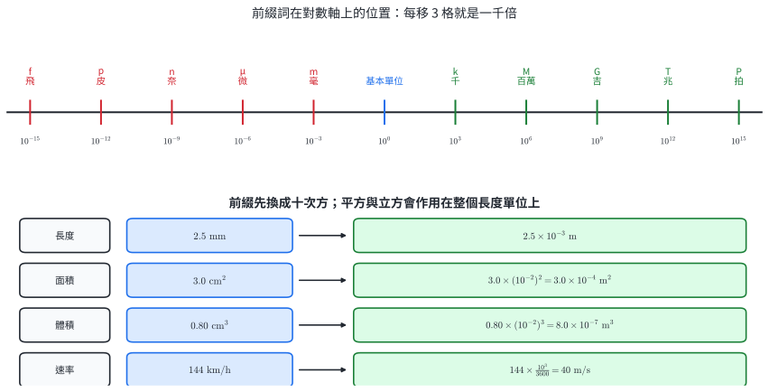
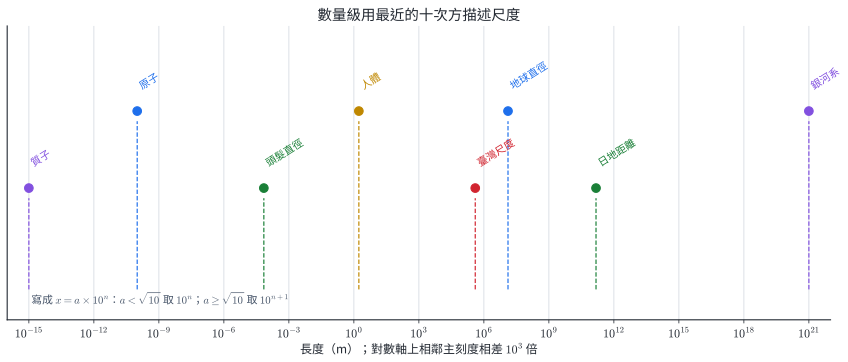
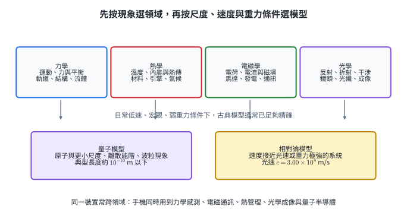
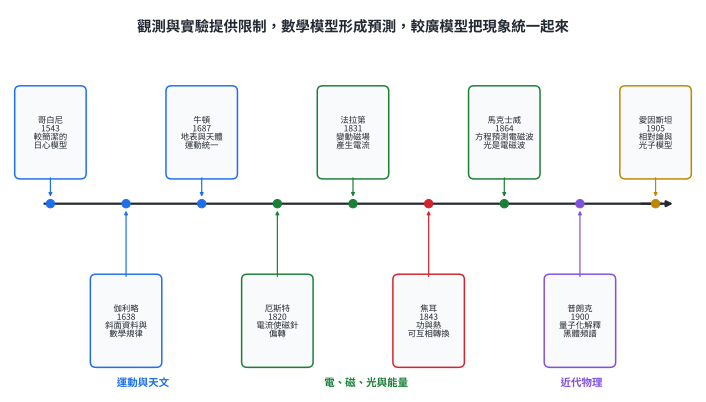
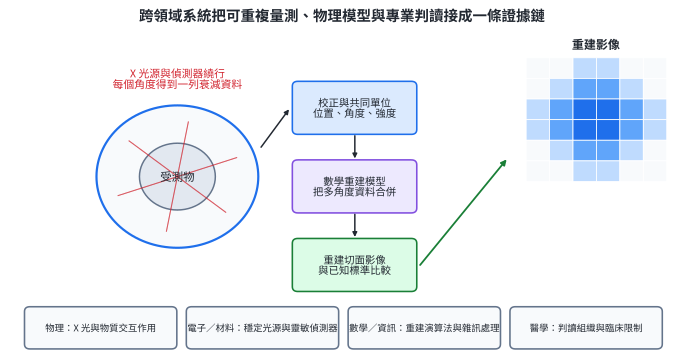

# 必物-1 科學的態度與方法

物理學把自然現象轉成可量測的物理量，從資料尋找數學關係，再用模型預測尚未量過的情況。可信的結論必須交代測量方式、單位、控制條件、原始資料與模型適用範圍，讓其他人能依同一程序重複檢查。本章建立這套共同語言，也說明力學、熱學、電磁學、光學與近代物理如何由觀測、實驗與數學模型逐步發展。

::: learning-map
### 本章問題與能力

1. 如何把一段說法改寫成能由觀測結果支持或修正的科學主張？
2. 如何區分觀察、假設、預測與結論，並用控制變因及重複量測建立資料？
3. 如何使用 SI 基本單位、導出單位、前綴詞與數量級，使量測能跨實驗室比較？
4. 如何依現象與條件選擇物理領域和模型，並從物理史辨認證據、預測與統一的關係？

### 實際用途

實驗設計可檢查產品、藥物與環境資料；共同單位保障工程製造、醫療校正與國際合作；數量級能快速檢查答案；模型條件則決定日常力學、半導體量子模型或相對論何時適用。
:::

| 工作 | 必須留下的資訊 | 可回答的問題 |
|---|---|---|
| 提出假設 | 可觀測的預測、適用條件 | 哪一種結果支持或削弱假設？ |
| 設計實驗 | 自變量、應變量、控制變因、操作方式 | 比較是否公平？ |
| 報告測量 | 數值、單位、原始資料與處理方法 | 他人能否重複？ |
| 建立模型 | 數學關係、誤差大小、適用範圍 | 新條件下會發生什麼？ |
| 選擇理論 | 尺度、速度、重力與研究對象 | 使用古典或近代模型？ |

## 1　科學的態度

### 1.1 可檢驗性與證據

科學研究物質世界中可觀測、可量測或可由觀測間接推論的現象。科學主張必須具有可檢驗性：它要能導出具體預測，而且可能的觀測結果能區分「預測得到支持」與「假設需要修正」。

例如「固定斜面與球，由靜止釋放時，位移 $s$ 與時間平方 $t^2$ 成正比」會預測：

$$
\frac{s}{t^2}=k
$$

在量測不確定範圍內近似固定，且 $s-t^2$ 圖接近通過原點的直線。這些預測都能由實驗檢查。

科學態度落實在下列行動：

- 理性：把觀察到的事實、由事實作出的推論、以及個人偏好分開。
- 客觀：事先訂定量測方式與判準，使不同研究者能依相同規則處理資料。
- 誠實：完整保存原始資料、修改紀錄與排除資料的理由。
- 適當懷疑：同時檢查新主張、既有理論、儀器與自己的推理。
- 謙遜與開放：用新證據調整結論，並清楚說明目前仍未知的部分。
- 尊重：科學能處理可檢驗的物質世界問題；價值、藝術與信仰還包含科學量測以外的判準。

理論的可信度來自多次、跨條件、可重複的檢驗。一次符合能提高可信度；新的條件可能顯示原模型的適用界線。牛頓力學在日常低速尺度仍十分準確，而高速、強重力或原子尺度需要更廣的模型。

圖中的科學方法是一個循環。問題引出假設，假設導出預測，實驗產生資料；資料與預測比較後，可建立暫時模型，也可回到裝置、量測或假設重新檢查。成熟模型還要在新條件下預測，再接受新的測試。

### 1.2 觀察、推論與結論

觀察是由感官或儀器直接得到的紀錄，例如「兩張相同紙從同高度釋放，揉成團的紙較早落地」。推論是根據觀察提出的解釋，例如「攤平紙受到較大的空氣阻力」。結論則要由能區分不同解釋的實驗支持。

同一觀察常有多個可能解釋。把紙揉成團同時改變形狀、迎風面積與氣流，因此原實驗無法單獨判斷質量是否影響落下時間。後續設計可以固定形狀與迎風面積，只改變質量；也可在低壓環境比較，以檢查空氣阻力的影響。

資料偏離理論預期時，可靠的處理順序是：

1. 保存原始資料與量測時間。
2. 檢查儀器校正、操作條件、抄錄與單位。
3. 依事先規則判斷是否有可辨認的操作失誤。
4. 重複量測，確認偏離是否穩定出現。
5. 依證據修正實驗、假設或模型。

這套做法能分辨偶然起伏、系統性的儀器問題與真正的新現象。只保留接近預期的資料會破壞這項分辨能力。

### 1.3 科學結論與權威

科學家的經驗能幫助提出更好的問題與設計，但姓名、職位或名望本身不構成自然現象的證據。若量測結果與教科書數值不同，研究者應先檢查程序、單位、儀器與重複性，再完整報告差異。經過獨立重複仍存在的差異，才有機會指出模型條件或新現象。

同樣地，單次實驗也很少能直接建立普遍定律。普遍結論需要不同研究者、不同儀器、不同樣本與不同條件的交叉檢驗。科學共同體的作用，是公開方法與資料，讓主張能被反覆檢查。

科學態度直接用在新聞判讀、商品宣稱、環境監測與醫療證據。讀到「使用後效果提升」時，可以追問：效果如何定義？與哪一組比較？樣本數多少？測量單位與原始資料是什麼？是否由獨立團隊重複？

#### 示範 1　把籠統說法改寫成可檢驗假設

說法：「較重的物體落得較快。」

1. 指定對象：相同形狀、相同尺寸，但質量不同的兩個球。
2. 指定條件：由同一高度同時由靜止釋放，環境風速相同。
3. 指定觀測量：由電子計時器量落地時間。
4. 寫成假設：「在上述條件下，質量較大的球落地時間較短。」
5. 寫出區分結果：若不同質量的球在量測解析度內具有相同落地時間，原假設缺乏支持；若差異可重複且超過量測起伏，再檢查質量或空氣阻力模型。

籠統說法經過對象、條件與觀測量的操作化後，才成為可檢查的主張。

#### 示範 2　處理偏離已知值的資料

學生量測基本電荷，五次結果為

$$
1.57,\ 1.61,\ 1.59,\ 2.45,\ 1.60
\quad(\times10^{-19}\ \mathrm C).
$$

第四筆明顯較大。合乎科學態度的處理為：

1. 五筆都保留在原始紀錄。
2. 回查第四次的電壓檔位、液滴編號、時間讀值與換算單位。
3. 若找到明確抄錄錯誤，例如把 $0.245$ 寫成 $2.45$，保留原值與更正紀錄。
4. 若找不到原因，增加重複次數並分別報告「含第四筆」與「依事先判準排除第四筆」的結果。

這樣才能讓他人判斷偏離來自操作、隨機起伏或模型尚未考慮的因素。

#### 示範 3　區分觀察與解釋

敘述甲：「接通電流後，附近磁針偏轉 $18^\circ$。」這是儀器觀察。

敘述乙：「電流在導線周圍產生磁效應。」這是由多次觀察建立的解釋。

敘述丙：「電流加倍時，磁針偏角也加倍。」這是可進一步檢驗的預測。要測試丙，需固定導線位置、磁針、環境磁場與量測方法，只改變電流。

### 1.4 節內練習

1. 將下列兩句分成觀察與推論：「金屬棒加熱後長度增加 $0.8\ \mathrm{mm}$；金屬內粒子平均間距增大。」
2. 把「亮一點的燈比較耗電」改寫成包含控制條件、觀測量與可區分結果的假設。
3. 兩張相同紙，一張攤平、一張揉成團，揉成團者先落地。列出至少兩個同時改變的因素，並提出一個較公平的比較。
4. 六次量測中有一筆遠離其他值。寫出三項在決定是否排除前應完成的工作。
5. 學生的結果與知名實驗室不同。依科學態度排列後續行動：重複量測、檢查單位與校正、保留資料、比較兩邊的實驗條件、提出修正模型。
6. 「這幅畫令人感動」與「這幅畫表面的藍色區域占總面積 $42\%$」各屬於哪一類問題？科學量測能處理哪一部分？

#### 節內練習解析

1. 長度增加 $0.8\ \mathrm{mm}$ 是量測觀察；粒子平均間距增大是解釋，需要微觀模型或其他證據支持。
2. 例如：「使用相同類型燈泡、相同點亮時間與供電電壓時，照度較高的燈泡其電能表讀值增加較多。」照度與電能讀值都要指定量測方式。
3. 形狀、迎風面積與氣流狀態都改變。可製作外形相同而內部質量不同的兩個物體，由同高度同步釋放。
4. 保存原始值；查儀器與抄錄；查操作條件；依事先判準判斷；增加重複量測，任三項均可。
5. 先保留資料，再檢查單位與校正、比較條件、重複量測；差異穩定後才提出修正模型。
6. 感動程度包含個人價值與感受；藍色面積比例能以先訂定的色彩與面積判準量測。科學能處理後者及前者中可操作化的生理或問卷資料，但價值判斷仍需其他討論。

## 2　科學的方法、物理量與單位

### 2.1 從經驗資料到數學模型

物理學結合兩個來源：經驗資料提供自然現象的限制，數學關係提供清楚、可推演的結構。研究者先從複雜現象選出重要物理量，再提出能由資料檢查的關係。

一個完整的比較通常包含：

- 自變量：研究者主動改變或分組的量。
- 應變量：隨自變量改變而量測的結果。
- 控制變因：各組保持相同，避免同時改變造成混淆的條件。
- 操作定義：說明一個量實際如何製造、判定或量測。
- 重複量測：在相同條件下取得多筆資料，估計自然起伏與操作穩定性。

實驗流程沒有唯一固定起點。新觀察可引出問題，既有模型可引出新預測，異常資料也可引出新實驗；重點是每一步的推理與證據能被追蹤。

圖中的斜面角度、球、釋放位置與光閘設定固定。量到時間 $t$ 與位移 $s$ 後，將 $s$ 對 $t^2$ 作圖。資料接近直線表示

$$
s\approx kt^2,
$$

其中斜率 $k$ 的單位為

$$
[k]=\frac{\mathrm m}{\mathrm{s^2}}.
$$

數學模型濃縮資料，也能產生新預測。例如量得 $k\approx0.48\ \mathrm{m/s^2}$，便可預測 $t=0.80\ \mathrm s$ 時

$$
s\approx(0.48)(0.80)^2=0.307\ \mathrm m.
$$

模型的適用條件包含同一斜面角度、相同釋放方式與近似固定的阻力。改變斜角後，要重新量測 $k$。

### 2.2 物理量與共同標準

物理量是可用數值與單位表示的物理性質。完整紀錄包含

$$
\text{物理量}=\text{數值}\times\text{單位}.
$$

「長度為 2.4」缺少比較基準；「長度為 $2.4\ \mathrm m$」才能與其他量測比較。共同單位使不同儀器、實驗室與國家的結果能互相複製。

國際單位制簡稱 SI，目前選定七個基本量與基本單位：

| 基本量 | 基本單位 | 代號 | 現行定義所連結的常數 |
|---|---|---:|---|
| 時間 | 秒 | s | 銫-133 原子躍遷頻率 |
| 長度 | 公尺 | m | 真空光速 $c$ |
| 質量 | 公斤 | kg | 普朗克常數 $h$ |
| 電流 | 安培 | A | 基本電荷 $e$ |
| 熱力學溫度 | 克耳文 | K | 波茲曼常數 $k_{\mathrm B}$ |
| 物量 | 莫耳 | mol | 亞佛加厥常數 $N_{\mathrm A}$ |
| 光強度 | 燭光 | cd | 特定頻率光的發光效能 |

力學最常用長度、質量與時間，對應 m、kg、s，因此常稱 MKS 制。

秒以銫-133 原子特定躍遷的 $9\,192\,631\,770$ 個週期定義。公尺利用固定的真空光速 $299\,792\,458\ \mathrm{m/s}$ 定義。公斤自 2019 年起以固定普朗克常數

$$
h=6.626\,070\,15\times10^{-34}\ \mathrm{J\,s}
$$

的數值定義。以自然常數建立標準，可由具備相應儀器的實驗室重現，減少實體原器受灰塵、清洗或環境影響的問題。

### 2.3 基本量與導出量

基本量由單位制選定；其他物理量依定義或定律由基本量組合，稱為導出量。導出單位必須沿公式中的乘除關係組合。

例如

$$
v=\frac{\Delta x}{\Delta t}
\quad\Rightarrow\quad
[v]=\frac{\mathrm m}{\mathrm s},
$$

$$
a=\frac{\Delta v}{\Delta t}
\quad\Rightarrow\quad
[a]=\frac{\mathrm m}{\mathrm{s^2}},
$$

$$
F=ma
\quad\Rightarrow\quad
[F]=\frac{\mathrm{kg\,m}}{\mathrm{s^2}}
\equiv \mathrm N.
$$

能量、功率與電量分別為

$$
[E]=\mathrm{N\,m}
=\frac{\mathrm{kg\,m^2}}{\mathrm{s^2}}
\equiv\mathrm J,
$$

$$
[P]=\frac{\mathrm J}{\mathrm s}
=\frac{\mathrm{kg\,m^2}}{\mathrm{s^3}}
\equiv\mathrm W,
$$

$$
[Q]=\mathrm{A\,s}
\equiv\mathrm C.
$$

牛頓、焦耳、瓦特與庫侖是導出單位的專名。判斷基本或導出時，要看物理量的定義來源，而非名稱是否常見。

單位一致性也是檢查公式的必要條件。若

$$
x=v_0t+\frac12at^2,
$$

右邊第一項單位為

$$
\frac{\mathrm m}{\mathrm s}\cdot\mathrm s=\mathrm m,
$$

第二項為

$$
\frac{\mathrm m}{\mathrm{s^2}}\cdot\mathrm{s^2}=\mathrm m,
$$

兩項才能相加並與左邊位移一致。單位一致只表示公式通過一項必要檢查；係數、正負號與適用條件仍要由推導或實驗決定。

### 2.4 前綴詞、科學記號與換算

尺度很大或很小時，可在 SI 單位前加前綴：

| 前綴 | 代號 | 倍數 | 前綴 | 代號 | 倍數 |
|---|---:|---:|---|---:|---:|
| 拍 | P | $10^{15}$ | 厘 | c | $10^{-2}$ |
| 兆 | T | $10^{12}$ | 毫 | m | $10^{-3}$ |
| 吉 | G | $10^9$ | 微 | $\mu$ | $10^{-6}$ |
| 百萬 | M | $10^6$ | 奈 | n | $10^{-9}$ |
| 千 | k | $10^3$ | 皮 | p | $10^{-12}$ |
|  |  |  | 飛 | f | $10^{-15}$ |
|  |  |  | 阿 | a | $10^{-18}$ |

代號區分大小寫：$\mathrm M=10^6$，$\mathrm m=10^{-3}$。

換算時把前綴代成十次方，再讓平方或立方作用在整個單位上：

$$
1\ \mathrm{cm^2}
=(10^{-2}\ \mathrm m)^2
=10^{-4}\ \mathrm{m^2},
$$

$$
1\ \mathrm{cm^3}
=(10^{-2}\ \mathrm m)^3
=10^{-6}\ \mathrm{m^3}.
$$

複合單位的分子與分母都要換算。例如

$$
144\ \mathrm{km/h}
=144\frac{10^3\ \mathrm m}{3600\ \mathrm s}
=40\ \mathrm{m/s}.
$$

科學記號寫成

$$
x=a\times10^n,\qquad 1\leq a<10.
$$

它把有效的數值部分與尺度分開。例如 $0.000\,0025\ \mathrm m=2.5\times10^{-6}\ \mathrm m=2.5\ \mu\mathrm m$。

### 2.5 數量級與估算

數量級以最接近的十次方粗略描述數值大小。若

$$
x=a\times10^n,\qquad 1\leq a<10,
$$

則以 $\sqrt{10}\approx3.16$ 為分界：

$$
\begin{cases}
a<\sqrt{10}, & x\text{ 的數量級為 }10^n,\\
a\geq\sqrt{10}, & x\text{ 的數量級為 }10^{n+1}.
\end{cases}
$$

例如 $2.4\times10^5$ 的數量級為 $10^5$；$6.0\times10^5$ 的數量級為 $10^6$。數量級適合快速估算、比較尺度及檢查計算結果。

對數軸上的等距代表相同倍率。原子約 $10^{-10}\ \mathrm m$，人體約 $10^0\ \mathrm m$，兩者相差約十個數量級；日地距離約 $1.5\times10^{11}\ \mathrm m$。

#### 示範 4　由斜面資料檢查比例模型

量得：

| $t$（s） | 0.25 | 0.35 | 0.45 | 0.55 | 0.65 | 0.75 |
|---:|---:|---:|---:|---:|---:|---:|
| $s$（m） | 0.0310 | 0.0573 | 0.0984 | 0.1442 | 0.2043 | 0.2692 |

計算 $s/t^2$：

$$
0.496,\ 0.468,\ 0.486,\ 0.477,\ 0.484,\ 0.479
\quad(\mathrm{m/s^2}).
$$

各值集中在 $0.48\ \mathrm{m/s^2}$ 附近，且圖上的 $s-t^2$ 資料接近直線，因此資料支持

$$
s\approx(0.48\ \mathrm{m/s^2})t^2.
$$

比值的離散顯示實際量測有起伏；模型係數寫成近似值。

#### 示範 5　設計公平比較

問題：斜面角度增加是否會縮短球移動 $0.80\ \mathrm m$ 所需時間？

1. 自變量：斜面角度，例如 $5^\circ,10^\circ,15^\circ$。
2. 應變量：由靜止移動 $0.80\ \mathrm m$ 的時間。
3. 控制變因：同一顆球、同一路面、同一距離、同一釋放器與計時器。
4. 操作定義：球脫離釋放器時開始計時，通過終點光閘時停止。
5. 重複：每個角度至少量多次，報告原始值與代表值。
6. 資料圖：橫軸角度、縱軸時間，並標示各角度的量測離散。

這個設計把角度的影響與球、路面及釋放方式分開。

#### 示範 6　由定義推導導出單位

壓力定義為單位面積所受的力：

$$
p=\frac FA.
$$

所以

$$
[p]=\frac{\mathrm N}{\mathrm{m^2}}
=\frac{\mathrm{kg\,m/s^2}}{\mathrm{m^2}}
=\frac{\mathrm{kg}}{\mathrm{m\,s^2}}
\equiv\mathrm{Pa}.
$$

比熱定義為使單位質量升高單位溫度所需的熱量：

$$
c=\frac{Q}{m\Delta T}.
$$

其 SI 單位為

$$
[c]=\frac{\mathrm J}{\mathrm{kg\,K}}
=\frac{\mathrm{m^2}}{\mathrm{s^2\,K}}.
$$

兩種寫法等價，後者把焦耳拆成基本單位。

#### 示範 7　用單位檢查公式

有人寫出行進距離

$$
d=vt+\frac12at.
$$

第一項 $vt$ 的單位是 m。第二項 $at$ 的單位為

$$
\frac{\mathrm m}{\mathrm{s^2}}\cdot\mathrm s
=\frac{\mathrm m}{\mathrm s},
$$

兩項單位不同，無法相加。若第二項為 $\frac12at^2$，單位才是 m。這項檢查能指出式子少了一個時間因子。

#### 示範 8　前綴與立方單位

體積 $0.80\ \mathrm{cm^3}$ 換成 $\mathrm{m^3}$：

$$
0.80\ \mathrm{cm^3}
=0.80(10^{-2}\ \mathrm m)^3
=0.80\times10^{-6}\ \mathrm{m^3}
=8.0\times10^{-7}\ \mathrm{m^3}.
$$

無線電頻率 $103.3\ \mathrm{MHz}$：

$$
103.3\ \mathrm{MHz}
=103.3\times10^6\ \mathrm{Hz}
=1.033\times10^8\ \mathrm{Hz}.
$$

#### 示範 9　數量級估算

日地平均距離約 $1.5\times10^{11}\ \mathrm m$，光速約 $3.0\times10^8\ \mathrm{m/s}$：

$$
t=\frac dc
\approx\frac{1.5\times10^{11}}{3.0\times10^8}
=5.0\times10^2\ \mathrm s.
$$

因係數 $5.0>\sqrt{10}$，此時間的數量級為 $10^3\ \mathrm s$。精確到常用尺度約為 $500\ \mathrm s$，即約 $8.3$ 分鐘。

### 2.6 節內練習

1. 研究「電池溫度是否影響手電筒持續點亮時間」。分別寫出自變量、應變量、三個控制變因與一項操作定義。
2. 同一斜面量得 $(t,s)=(0.20,0.020),(0.40,0.081),(0.60,0.181),(0.80,0.319)$，單位分別為 s 與 m。計算各筆 $s/t^2$，判斷 $s\propto t^2$ 是否合理。
3. 從下列物理量選出 SI 基本量：能量、電流、時間、速度、物量、壓力、光強度。
4. 由定義求 SI 基本單位表示：(a) 密度 $\rho=m/V$；(b) 動量 $p=mv$；(c) 壓力 $p=F/A$。
5. 完成換算：(a) $72\ \mathrm{km/h}$ 換成 m/s；(b) $2.5\ \mathrm{mm^2}$ 換成 $\mathrm{m^2}$；(c) $3.0\ \mathrm{GB}$ 換成 B，取 $1\ \mathrm G=10^9$。
6. 判斷數量級：(a) $2.8\times10^{-7}\ \mathrm m$；(b) $7.0\times10^{-7}\ \mathrm m$；(c) 比較 $10^{-10}\ \mathrm m$ 原子與 $10^{-15}\ \mathrm m$ 質子的尺度倍率。

#### 節內練習解析

1. 自變量為電池溫度；應變量為達到事先訂定亮度下限前的時間。可控制電池型號與初始電量、燈泡、環境、電路及亮度判準；操作定義要說明溫度如何穩定及點亮終點如何判定。
2. $s/t^2=0.500,0.506,0.503,0.498\ \mathrm{m/s^2}$，集中在 $0.50\ \mathrm{m/s^2}$ 附近，比例模型合理。
3. 電流、時間、物量、光強度為基本量；其餘為導出量。
4. (a) $\mathrm{kg/m^3}$；(b) $\mathrm{kg\,m/s}$；(c) $\mathrm{kg/(m\,s^2)}$。
5. (a) $72/3.6=20\ \mathrm{m/s}$；(b) $2.5(10^{-3})^2=2.5\times10^{-6}\ \mathrm{m^2}$；(c) $3.0\times10^9\ \mathrm B$。
6. (a) 係數 $2.8<3.16$，數量級 $10^{-7}\ \mathrm m$；(b) 係數 $7.0>3.16$，數量級 $10^{-6}\ \mathrm m$；(c) 相差 $10^{-10}/10^{-15}=10^5$ 倍。

## 3　物理學簡介

### 3.1 探究方向、領域與模型條件

物理學研究物質結構、運動、能量、交互作用與宇宙演化，尺度可從原子內部延伸到天體。古典物理常分成四個主要領域：

- 力學：物體運動、平衡與造成狀態改變的作用。
- 熱學：溫度、內能、熱傳與能量轉換。
- 電磁學：電荷、電流、電場、磁場及電磁波。
- 光學：光的反射、折射、干涉、繞射與成像。

近代物理主要包含量子理論與相對論。量子模型處理原子、電子、光子與微觀尺度的離散及機率現象；相對論處理速度接近光速或重力很強的系統。

領域是依研究問題分類，模型則依條件選擇。同一裝置可跨領域：手機包含力學加速度感測、電磁通訊、熱管理、光學鏡頭及量子半導體。日常低速、宏觀、弱重力條件下，古典模型通常已有足夠精度；尺度、速度或重力條件改變時，再選用近代模型。

模型的適用條件是模型的一部分。使用一條定律時，要同時說明對象、尺度、速度、交互作用及忽略因素。這能避免把「某條件下的準確近似」誤當成所有尺度都相同。

### 3.2 物理學的發展：證據、數學與統一

紀元前六世紀的泰勒斯嘗試以自然界本身的原因說明現象，代表古希臘自然哲學以概念與論證理解自然的轉變。近代物理學的形成，則進一步把精確觀測、控制實驗與數學模型結合。

哥白尼以較簡潔、和諧的日心模型重新組織天文現象。克卜勒依第谷的大量觀測資料，把正圓軌道修正為橢圓並歸納行星運動定律。伽利略以斜面實驗研究運動，顯示距離與時間平方的數學關係。笛卡兒以廣度、位置與運動描述物質，並把現象對應為可由幾何與運動分析的機制；這項思路促進了可數學化機械觀的形成。牛頓再以運動定律與萬有引力，把地表落體與月球、行星運動放進同一力學架構。

十九世紀的發展呈現另一條統一鏈：

1. 厄斯特觀察到通電導線使磁針偏轉，建立電與磁的實驗連結。
2. 法拉第發現隨時間變動的磁場能在線圈中產生電流。
3. 馬克士威把電磁實驗寫成方程，預測電磁波，並指出光是電磁波。
4. 焦耳與麥爾由實驗建立功與熱的轉換關係，使能量成為跨力學與熱學的共同概念。

二十世紀初，古典理論無法完整解釋黑體輻射，也需處理光速測量與運動的關係。普朗克以能量量子化解釋黑體頻譜；愛因斯坦提出光子模型與相對論，開啟近代物理。

物理史的主線不只是人名與年代，而是三種進展：

- 新儀器或新資料限制舊解釋。
- 數學模型把多筆資料壓縮成可計算規律。
- 更廣模型把原先分開的現象放進同一原理，並做出新預測。

### 3.3 跨學科合作

現代科技系統常把多個學科接成完整證據鏈。電腦斷層使用 X 光與物質交互作用、穩定光源與偵測器、多角度資料、數學重建與臨床判讀。每一環都需共同單位、校正標準與可重複程序。

圖中：

1. 物理提供 X 光傳播與衰減模型。
2. 電子與材料工程提供光源、偵測器及校正。
3. 數學與資訊把不同角度的資料重建成切面影像。
4. 醫學判讀影像，並界定劑量、適用情境與臨床限制。

智慧型手機、磁振造影、超音波、積體電路與發光二極體也具有相似結構。跨學科合作的關鍵是把各專業的量測、模型與判準明確接合，而非只把不同專家列在同一名單。

#### 示範 10　由問題選領域

1. 橋梁受風後的振動頻率：以力學描述結構運動。
2. 保溫瓶散熱速率：以熱學描述能量傳遞。
3. 發電機線圈中的感應電流：以電磁學描述變動磁場與電流。
4. 相機鏡頭的成像與色差：以光學描述折射及成像。
5. 原子只吸收特定波長：以量子能階模型描述。

實際問題常有第二領域，例如相機也要處理電子感測與熱雜訊；先找主導觀測量，再加入必要模型。

#### 示範 11　重建運動模型的發展鏈

給定四項資料：

- 伽利略以斜面量測得到運動的數學規律。
- 哥白尼提出較簡潔的日心架構。
- 牛頓用萬有引力統一地表與天體運動。
- 克卜勒依觀測把行星軌道改為橢圓。

合理的推理順序為：

$$
\text{哥白尼模型}
\rightarrow
\text{克卜勒以資料修正軌道}
\rightarrow
\text{伽利略建立地表運動規律}
\rightarrow
\text{牛頓完成統一模型}.
$$

其中「模型更簡潔」「符合觀測資料」「由實驗建立數學規律」「統一兩類現象」分別代表不同科學貢獻。

#### 示範 12　電磁學中的實驗與預測

厄斯特的磁針偏轉是直接觀察；法拉第的線圈實驗顯示變動磁場能產生電流；馬克士威把這些關係寫成方程並預測電磁波。

若題目問「首先由實驗發現電磁感應」，對應法拉第。若問「由方程預測電磁波並把光納入電磁現象」，對應馬克士威。判斷依據是動詞與證據型態，而非只背名字。

#### 示範 13　依條件選模型

1. 棒球速率 $30\ \mathrm{m/s}$、尺度約 $0.1\ \mathrm m$：$v/c\approx10^{-7}$，古典力學適用。
2. 電子位於原子內，尺度約 $10^{-10}\ \mathrm m$：使用量子模型。
3. 太空船速率 $0.80c$：時間與長度關係需相對論修正。

同一物理量「位置」在三種情況都可測量，但描述其演化的模型不同。

#### 示範 14　拆解電腦斷層的證據鏈

若重建影像出現一處亮區，完整推理包含：

1. 原始偵測器讀值是否通過校正。
2. 多角度資料是否在相同位置與單位系統下合併。
3. 重建演算法是否經已知樣本測試。
4. 亮區在重複掃描或其他成像方法中是否穩定。
5. 臨床上哪些組織或材料可能產生相似訊號。

「亮區」是影像資料；「某種組織異常」是專業解釋。兩者之間要有校正、模型與交叉證據。

### 3.4 節內練習

1. 分類主要領域：輪胎煞車距離、鍋中水的升溫、馬達轉動、光纖傳訊、原子光譜。
2. 分別選擇主要模型：低速列車運動、電子晶體繞射、靠近強重力天體的時鐘、透鏡成像。
3. 將哥白尼、伽利略、笛卡兒、牛頓、厄斯特、法拉第、馬克士威、普朗克依時間先後排列。
4. 配對貢獻：焦耳、馬克士威、普朗克、愛因斯坦，分別對應功熱轉換、電磁波預測、能量量子化、相對論。
5. 磁振造影需要磁場、射頻訊號、電子偵測、影像重建與醫學判讀。指出至少三個相關領域與各自工作。
6. 一個模型能解釋既有資料，另一個模型除了解釋資料還成功預測新現象。哪一項證據使第二個模型更強？說明理由。

#### 節內練習解析

1. 依序為力學、熱學、電磁學、光學與電磁學、量子物理。
2. 低速列車用古典力學；電子繞射用量子物質波；強重力時鐘用廣義相對論；透鏡成像用幾何光學。
3. 哥白尼、伽利略、笛卡兒、牛頓、厄斯特、法拉第、馬克士威、普朗克。
4. 焦耳—功熱轉換；馬克士威—電磁波與光的統一；普朗克—量子化；愛因斯坦—相對論。
5. 物理處理磁場與訊號；電子／材料處理線圈與偵測器；數學／資訊重建影像；醫學判讀組織與限制，任三項。
6. 成功預測尚未用來建立模型的新現象，使模型接受獨立檢驗，降低只為既有資料事後調整的可能。

## 4　章末分層題

第 1–4 題處理科學態度與實驗，第 5–8 題處理 SI、換算與數量級，第 9–12 題處理物理領域與發展，第 13–16 題整合兩個以上主節。

### 基礎與模型題

1. 實驗記錄寫道：「加熱 5 分鐘後，金屬線長度由 $1.0000\ \mathrm m$ 變成 $1.0012\ \mathrm m$，顯示粒子平均距離變大。」指出其中的直接觀察與模型解釋。

2. 將「磁鐵愈強，吸起的迴紋針愈多」改寫成包含自變量、應變量、控制變因與操作定義的可檢驗假設。

3. 一組量測值為 $9.8,9.7,9.9,14.2,9.8\ \mathrm{m/s^2}$。說明處理 $14.2$ 這筆資料的科學程序。

4. 研究斜面角度對小車通過固定距離時間的影響。寫出自變量、應變量、三個控制變因，並說明為何每個角度要重複量測。

5. 從下列選出 SI 基本量：質量、力、電流、能量、熱力學溫度、速度、物量。

6. 已知功率 $P=E/t$，能量 $E=Fs$，力 $F=ma$。把功率單位拆成 kg、m、s。

7. 完成換算：

   (1) $90\ \mathrm{km/h}$ 換成 m/s。  
   (2) $4.0\ \mathrm{cm^2}$ 換成 $\mathrm{m^2}$。  
   (3) $650\ \mathrm{nm}$ 換成 m。

8. 判斷下列數值的數量級：

   (1) $2.0\times10^6$。  
   (2) $5.0\times10^6$。  
   (3) 太陽質量 $2.0\times10^{30}\ \mathrm{kg}$ 與地球質量 $6.0\times10^{24}\ \mathrm{kg}$ 的比值。

9. 指出主要領域：汽車轉彎、冷氣機搬運熱量、變壓器、望遠鏡成像、電子能階。

10. 將下列里程碑依時間先後排列：法拉第電磁感應、牛頓萬有引力、普朗克量子論、哥白尼日心模型、馬克士威電磁波預測。

11. 說明厄斯特、法拉第與馬克士威三項工作的證據型態與連接關係。

12. 一台智慧型手機包含加速度計、無線通訊、處理器散熱、相機鏡頭及半導體晶片。分別指出主要物理領域或模型。

### 跨節整合題

13. 同一斜面上，由靜止釋放小車，得到：

   | $t$（s） | 0.20 | 0.40 | 0.60 | 0.80 |
   |---:|---:|---:|---:|---:|
   | $s$（m） | 0.020 | 0.081 | 0.181 | 0.319 |

   (1) 指出自變量、應變量及兩個控制變因。  
   (2) 計算各筆 $s/t^2$，判斷 $s=kt^2$ 是否合理。  
   (3) 估計 $k$ 並寫出單位。  
   (4) 預測 $t=1.00\ \mathrm s$ 時的位移，並說明這個預測還要接受什麼檢驗。

14. 普朗克常數的 SI 單位為 $\mathrm{J\,s}$，且

$$
1\ \mathrm J=1\ \mathrm{kg\,m^2/s^2}.
$$

   (1) 把 $[h]$ 拆成 kg、m、s。  
   (2) 將式子移項，以 $[h]$、m、s 表示 kg。  
   (3) 說明以固定自然常數定義公斤，如何連到科學方法中的可重複性。  
   (4) 若實驗室的重現值偏離其他實驗室，列出兩項應先公開檢查的資訊。

15. 電磁學發展包含：厄斯特觀察磁針偏轉、法拉第量到感應電流、馬克士威由方程預測電磁波。某電磁波頻率為 $100\ \mathrm{MHz}$，取光速 $c=3.00\times10^8\ \mathrm{m/s}$。

   (1) 把三項工作依「直接觀察／控制實驗／數學預測」分類。  
   (2) 把頻率換成 Hz。  
   (3) 由 $\lambda=c/f$ 求波長，並檢查單位。  
   (4) 說明後續偵測到此波長的電磁波，為何會增加馬克士威模型的可信度。

16. 電腦斷層偵測器在未放樣本時讀得

$$
I_0=1.20\times10^6\ \mathrm{s^{-1}},
$$

放入樣本後讀得

$$
I=3.0\times10^5\ \mathrm{s^{-1}}.
$$

每一角度量測 $2.0\ \mathrm{ms}$。

   (1) 求兩種情況在一次量測時間內的計數。  
   (2) 求通過樣本後的訊號比例 $I/I_0$。  
   (3) 說明比較不同角度時需控制或校正的兩項條件。  
   (4) 指出物理、電子／材料、數學／資訊與醫學在這條證據鏈中的工作。  
   (5) 單一角度出現異常值時，應如何處理並判斷是否為樣本結構？

## 5　章末題完整詳解

### 第 1 題

「長度由 $1.0000\ \mathrm m$ 變成 $1.0012\ \mathrm m$」是直接量測觀察，前提是儀器與溫度紀錄可靠。「粒子平均距離變大」是用微觀模型解釋宏觀伸長，還可由其他材料、溫度或微觀證據檢查。

### 第 2 題

一個完整寫法為：「使用相同尺寸與材質的磁鐵、相同型號迴紋針、相同接觸方式時，磁場指標較大的磁鐵能垂直提起較多迴紋針。」

- 自變量：磁鐵的磁場指標或預先量得的磁場強度。
- 應變量：依固定程序成功提起的迴紋針數。
- 控制變因：迴紋針型號、接觸時間、磁鐵形狀、提起方向。
- 操作定義：例如提起後維持 $3\ \mathrm s$ 才計入。

### 第 3 題

五筆原始資料全部保留。回查第四次的儀器檔位、校正、操作、抄錄與單位；若有明確錯誤，留下原值及更正理由。若沒有明確錯誤，增加重複量測，並依事先訂定的判準分別報告含與不含該筆的分析。這能分辨操作錯誤、隨機起伏與穩定偏離。

### 第 4 題

- 自變量：斜面角度。
- 應變量：小車通過固定距離的時間。
- 控制變因：同一小車、同一路面、同一距離、同一釋放點與方式、同一計時器，任三項。

重複量測可觀察同條件下的自然起伏，避免由單次偶然值代表整組，並能檢查操作是否穩定。

### 第 5 題

SI 基本量為質量、電流、熱力學溫度、物量。力、能量與速度皆由基本量組合，是導出量。

### 第 6 題

$$
P=\frac Et=\frac{Fs}{t}=\frac{mas}{t}.
$$

因此

$$
[P]
=\frac{(\mathrm{kg})(\mathrm{m/s^2})(\mathrm m)}{\mathrm s}
=\frac{\mathrm{kg\,m^2}}{\mathrm{s^3}}.
$$

這也等於 $\mathrm{J/s}$，專名為瓦特 W。

### 第 7 題

(1)

$$
90\ \mathrm{km/h}
=90\frac{1000\ \mathrm m}{3600\ \mathrm s}
=25\ \mathrm{m/s}.
$$

(2)

$$
4.0\ \mathrm{cm^2}
=4.0(10^{-2}\ \mathrm m)^2
=4.0\times10^{-4}\ \mathrm{m^2}.
$$

(3)

$$
650\ \mathrm{nm}
=650\times10^{-9}\ \mathrm m
=6.50\times10^{-7}\ \mathrm m.
$$

### 第 8 題

(1) $2.0<\sqrt{10}$，所以 $2.0\times10^6$ 的數量級為 $10^6$。

(2) $5.0>\sqrt{10}$，所以 $5.0\times10^6$ 的數量級為 $10^7$。

(3)

$$
\frac{2.0\times10^{30}}{6.0\times10^{24}}
=3.3\times10^5.
$$

係數 $3.3>\sqrt{10}$，以最近十次方定義，數量級為 $10^6$。若題目只問粗略倍率，可說太陽質量約為地球的數十萬倍。

### 第 9 題

- 汽車轉彎：力學。
- 冷氣機搬運熱量：熱學。
- 變壓器：電磁學。
- 望遠鏡成像：光學。
- 電子能階：量子物理。

### 第 10 題

時間順序為

$$
\text{哥白尼日心模型}
\rightarrow
\text{牛頓萬有引力}
\rightarrow
\text{法拉第電磁感應}
\rightarrow
\text{馬克士威電磁波預測}
\rightarrow
\text{普朗克量子論}.
$$

對應約為 1543、1687、1831、1864、1900 年。

### 第 11 題

厄斯特直接觀察通電導線使磁針偏轉，指出電流具有磁效應。法拉第以控制實驗顯示隨時間變動的磁場能產生電流，建立反向連結。馬克士威把電磁關係寫成方程，進一步預測電磁波並把光納入電磁現象。三者形成「觀察—實驗—數學預測與統一」的發展鏈。

### 第 12 題

- 加速度計：力學與微型機電感測。
- 無線通訊：電磁學。
- 處理器散熱：熱學。
- 相機鏡頭：光學。
- 半導體晶片：量子物理與電磁學。

同一產品跨多領域，系統工程還要讓單位、介面與測試標準一致。

### 第 13 題

(1) 自變量是時間 $t$，應變量是位移 $s$。控制變因可選斜面角度、同一小車、同一釋放位置與方式、同一路面。

(2)

$$
\frac{s}{t^2}
=0.500,\ 0.506,\ 0.503,\ 0.498
\quad\mathrm{m/s^2}.
$$

四個比值集中在 $0.50\ \mathrm{m/s^2}$ 附近，因此 $s=kt^2$ 合理。

(3)

$$
k\approx0.50\ \mathrm{m/s^2}.
$$

單位由 $s/t^2$ 得到。

(4)

$$
s=(0.50)(1.00)^2
=0.50\ \mathrm m.
$$

這是由已量測區間向新時間作出的預測。應實際在 $1.00\ \mathrm s$ 量測，並確認小車仍在同一斜面、尚未到終點且阻力條件相近。

### 第 14 題

(1)

$$
[h]=\mathrm{J\,s}
=\frac{\mathrm{kg\,m^2}}{\mathrm{s^2}}\mathrm s
=\frac{\mathrm{kg\,m^2}}{\mathrm s}.
$$

(2) 移項得到

$$
\mathrm{kg}=[h]\frac{\mathrm s}{\mathrm{m^2}}.
$$

這個式子顯示質量標準可由普朗克常數、秒與公尺連結。

(3) 自然常數在不同地點具有相同值。各實驗室依公開程序、校正與量測鏈重現公斤，結果可以互相比較；標準不再依賴單一實體原器的保存狀態。

(4) 應公開儀器校正紀錄、環境條件、原始資料、單位換算、資料處理與不確定來源，任兩項均可。這些資訊能讓其他團隊判斷偏離位於哪一段量測鏈。

### 第 15 題

(1) 厄斯特磁針偏轉屬直接觀察；法拉第以改變磁場並量電流屬控制實驗；馬克士威由方程導出尚未直接觀測的電磁波，屬數學預測。

(2)

$$
100\ \mathrm{MHz}
=100\times10^6\ \mathrm{Hz}
=1.00\times10^8\ \mathrm{Hz}.
$$

(3)

$$
\lambda=\frac cf
=\frac{3.00\times10^8\ \mathrm{m/s}}
{1.00\times10^8\ \mathrm{s^{-1}}}
=3.00\ \mathrm m.
$$

單位檢查：

$$
\frac{\mathrm{m/s}}{\mathrm{s^{-1}}}=\mathrm m.
$$

(4) 此波長來自方程與已知頻率、光速的預測。後續獨立量測在預測位置偵測到電磁波，表示模型成功通過建立模型時尚未使用的新檢驗，因此可信度提高。

### 第 16 題

(1) $2.0\ \mathrm{ms}=2.0\times10^{-3}\ \mathrm s$。

未放樣本：

$$
N_0=I_0\Delta t
=(1.20\times10^6)(2.0\times10^{-3})
=2.4\times10^3
$$

次。放入樣本：

$$
N=I\Delta t
=(3.0\times10^5)(2.0\times10^{-3})
=6.0\times10^2
$$

次。

(2)

$$
\frac I{I_0}
=\frac{3.0\times10^5}{1.20\times10^6}
=0.25.
$$

通過樣本後訊號為原來的 $25\%$。

(3) 可控制或校正 X 光源強度、量測時間、偵測器靈敏度、角度與位置、樣本固定方式，任兩項。

(4) 物理提供 X 光與物質交互作用模型；電子／材料提供穩定光源、偵測器與校正；數學／資訊合併多角度資料並重建影像；醫學把影像特徵連到組織及臨床限制。

(5) 保留異常原始值，先查光源、偵測器、位置、角度與抄錄，重複同角度量測，再比較相鄰角度與已知校正樣本。偏離在重複及鄰近投影中穩定存在，且重建後落在一致位置時，才支持它來自樣本結構。

## 6　核心整理

1. 科學主張要能導出可觀測預測；結論依可重複證據調整。
2. 觀察是直接紀錄，推論是解釋；實驗要用控制變因區分不同解釋。
3. 原始資料、校正、單位與處理方法構成可追蹤的證據鏈。
4. 物理模型把資料濃縮成數學關係，並在明確條件下預測新結果。
5. SI 七個基本量為時間、長度、質量、電流、熱力學溫度、物量與光強度。
6. 導出單位沿定義式組合；單位一致是公式成立的必要條件。
7. 前綴詞先換成十次方；平方與立方作用於整個單位。數量級用最近的十次方描述尺度。
8. 古典物理包含力學、熱學、電磁學與光學；量子理論及相對論處理特定微觀、高速或強重力條件。
9. 物理史的核心是新證據、數學預測與更廣的統一模型；跨學科系統則把各領域的量測與判準接成完整證據鏈。
