# 必物-2 物質的組成與交互作用

一塊金屬、一滴水與一團空氣的外觀差異很大，微觀上都由原子或分子組成。粒子的距離、運動與交互作用決定物質狀態；原子內的電子、原子核與核子則由不同尺度的交互作用維繫。這套模型也能一路延伸到摩擦、磁鐵、放射性衰變、行星運動與太陽能量來源。

::: learning-map
### 本章問題與能力

1. 哪些觀測與定量結果支持原子、分子的存在？
2. 如何由粒子距離、運動與束縛說明固體、液體、氣體的形狀和體積？
3. 如何由散射資料推論原子核的大小、電性與質量分布？
4. 如何由核素記號求質子、中子、電子數，並由夸克電荷重建質子與中子？
5. 如何依作用對象、方向、距離尺度與現象，辨認重力、電磁作用、強作用與弱作用？

### 實際用途

粒子模型用於材料設計、相變、擴散與奈米科技；散射實驗是探查無法直接看見之結構的共同方法；核素記號用於醫療造影、年代測定與核能；四種基本交互作用則是理解衛星、電子元件、磁性材料、原子核與太陽反應的共同框架。
:::

| 尺度 | 主要對象 | 本章主要模型 |
|---|---|---|
| 約 $10^{-9}$ 至 $10^{-10}\ \mathrm m$ | 分子、原子 | 粒子熱運動、三態、電磁束縛 |
| 約 $10^{-15}\ \mathrm m$ | 原子核、質子、中子 | 強作用與核穩定 |
| 約 $10^{-18}\ \mathrm m$ | 弱作用的典型尺度 | 粒子種類轉換、$\beta$ 衰變 |
| 日常至天文尺度 | 物體、星球、星系 | 電磁接觸作用與萬有引力 |

## 1　物質的組成

### 1.1 原子、分子與可檢驗證據

元素是由相同質子數的一類原子所構成的物質種類。原子是保有元素身分的微觀粒子；分子是由兩個以上原子以化學鍵結合、可作為一個單位存在的粒子。例如氦氣主要由單原子 He 組成，氧氣由雙原子分子 $\mathrm O_2$ 組成，水由 $\mathrm H_2O$ 分子組成。

道耳頓在十九世紀初以原子說整理化學反應與元素質量關係。他當時把原子視為不可分割；後來的電子、原子核與夸克實驗更新了這項結構描述。科學模型的價值在於能組織證據並產生預測，模型也會隨新證據擴充。

布朗在顯微鏡下觀察到懸浮微粒持續作不規則運動。可見微粒比水分子大得多，因此每一瞬間受到許多水分子從各方向撞擊。有限數目的碰撞通常無法完全抵消，微粒便向瞬間合力方向移動；下一瞬間的碰撞組合改變，方向也跟著改變。

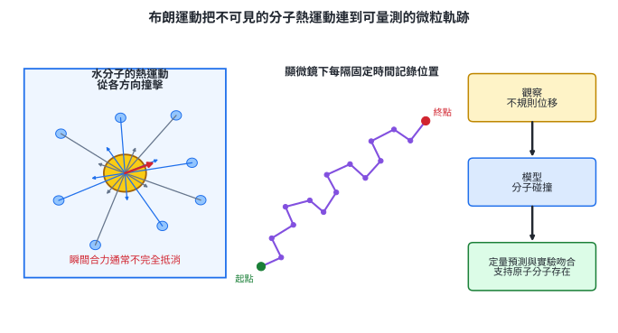

這條證據鏈包含三個層次：

1. 觀察：懸浮微粒的位置隨時間呈不規則折線。
2. 模型：周圍大量分子持續熱運動並造成不平衡撞擊。
3. 定量檢驗：愛因斯坦由模型推導微粒運動與溫度、粒徑、液體性質及時間的關係；佩蘭的實驗結果與預測相符，也得到一致的亞佛加厥常數。

掃描穿隧顯微鏡等工具可把原子尺度表面的量測訊號重建成影像，成為另一種證據。影像仍來自儀器與物理模型的轉換，因此可信結論同時依賴校正、重複量測與模型檢查。

布朗運動模型直接用於懸浮液、空氣微粒、藥物輸送、細胞內擴散及奈米粒子追蹤。粒徑愈小，分子碰撞造成的位置起伏通常愈容易觀察；溫度升高也會加強熱運動。

#### 示範 1　從觀察建立原子存在的證據鏈

顯微鏡每隔 $1.0\ \mathrm s$ 記錄一顆懸浮微粒。軌跡不規則，而且把花粉換成無生命的煙塵後仍出現相似現象。判斷哪些敘述是觀察、模型與檢驗。

1. 「微粒每秒的位置不同，方向無固定規律」是直接觀察。
2. 「微粒受到周圍水分子的不平衡撞擊」是微觀模型。
3. 換成煙塵仍有相似運動，排除了「花粉本身具有生命才會動」的解釋。
4. 若模型還能預測不同溫度、粒徑下的統計結果，並由實驗得到相符數值，證據強度會再提高。

結論的重點是多項可重複的定量預測共同支持粒子模型。

#### 示範 2　由位移平方資料辨認布朗運動的統計規律

某實驗在不同經過時間下，得到許多相同微粒的平均位移平方：

| $t$（s） | 1.0 | 2.0 | 3.0 | 4.0 |
|---:|---:|---:|---:|---:|
| $\langle r^2\rangle$（$\mu\mathrm m^2$） | 2.1 | 4.0 | 6.2 | 8.1 |

逐筆計算 $\langle r^2\rangle/t$：

$$
2.1,\ 2.0,\ 2.07,\ 2.03\ \mu\mathrm m^2/\mathrm s.
$$

比值近似固定，資料支持

$$
\langle r^2\rangle\propto t.
$$

這是群體統計規律；單一微粒的瞬時路徑仍可非常曲折。實驗用途是由軌跡資料反推擴散快慢或微粒尺寸。

### 1.2 三態的粒子模型

物質狀態要在指定溫度與壓力下討論。同一物質改變溫度或壓力，粒子的平均動能、平均距離與束縛狀況會改變，因而可能發生熔化、汽化、凝結或凝固。

粒子間作用隨距離改變：

- 距離太短時，電子雲強烈排斥，粒子難以繼續靠近。
- 在適當距離附近，吸引與排斥形成穩定間距。
- 距離很遠時，分子間作用迅速減弱；一般氣體模型常把它近似為可忽略。

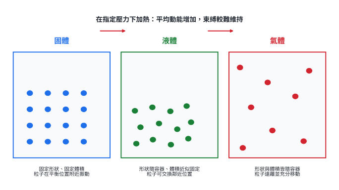

由圖可推得三態的巨觀性質：

| 狀態 | 微觀運動與束縛 | 形狀 | 體積 |
|---|---|---|---|
| 固體 | 粒子在平衡位置附近振動，鄰近關係大致維持 | 固定 | 固定 |
| 液體 | 粒子仍相近，可交換鄰近位置並流動 | 隨容器 | 近似固定 |
| 氣體 | 粒子平均距離大，可在容器內充分移動 | 隨容器 | 隨容器 |

晶體中的粒子有規則排列；玻璃等非晶固體雖缺乏長程規則，粒子仍被限制在局部位置，因此也有固定形狀與體積。

粒子模型還能連到多種自然現象：

- 聲音在空氣中傳播時，空氣粒子在平衡位置附近振動，把壓力變化傳給鄰近粒子。
- 湯匙的一端放入熱水後，粒子碰撞與金屬內電子傳遞能量，使較遠處升溫。
- 摩擦使電子在材料表面轉移，物體帶電後產生吸引或排斥。
- 太陽帶電粒子進入地球磁場附近並與大氣粒子碰撞，可使大氣原子或分子發光形成極光。

#### 示範 3　由微觀描述判斷物態

某物質的粒子彼此相近，鄰近粒子會持續交換位置；把它倒入不同形狀的容器後，形狀改變而體積近似不變。

1. 粒子彼此相近，表示束縛仍足以維持平均距離。
2. 鄰近粒子可交換位置，表示物質能流動。
3. 形狀隨容器、體積近似固定，符合液體。

因此這是液態。分類依據是粒子運動與巨觀形狀、體積的共同證據。

#### 示範 4　由加熱過程解釋固體熔化

在固定外界壓力下加熱一塊固體：

1. 粒子平均動能增加，在平衡位置附近的振動幅度變大。
2. 到達熔點附近，吸收的能量使原有排列與束縛被重新組織。
3. 粒子開始能交換鄰近位置，材料取得流動性。
4. 體積仍由粒子間吸引維持在有限範圍，所以液體保有近似固定體積。

這項推理可用於選擇鑄造溫度、相變材料及低溫保存條件。

### 1.3 節內練習

1. 說明元素、原子與分子三個概念的關係，並各舉一例。
2. 布朗運動中，可見微粒的路徑不規則。寫出一項直接觀察、一項微觀模型與一項可增加模型可信度的後續檢驗。
3. 同種微粒在 $t=2.0,\ 4.0,\ 6.0\ \mathrm s$ 時的平均位移平方分別為 $3.0,\ 6.1,\ 9.2\ \mu\mathrm m^2$。判斷 $\langle r^2\rangle$ 是否近似與 $t$ 成正比。
4. 比較固體、液體、氣體的粒子距離、運動自由度、形狀與體積。
5. 在固定壓力下使液體冷卻並凝固。依粒子運動與束縛說明形狀為何由隨容器轉為固定。
6. 分別用粒子交互作用說明：空氣傳聲、金屬湯匙導熱、塑膠尺摩擦後吸紙。

#### 節內練習解析

1. 元素由相同質子數定義，例如氧元素；原子是保有元素身分的粒子，例如 O；分子由原子鍵結，例如 $\mathrm O_2$ 或 $\mathrm H_2O$。
2. 觀察可寫微粒位置呈不規則折線；模型是周圍分子的熱運動造成不平衡碰撞；檢驗可改變溫度、粒徑或液體性質，再比較定量預測。
3. 三個比值依序為 $1.50,\ 1.525,\ 1.533\ \mu\mathrm m^2/\mathrm s$，近似固定，因此資料支持成正比。
4. 固體粒子相近且局部受限，固定形狀與體積；液體粒子相近但可交換位置，形狀隨容器、體積近似固定；氣體粒子平均距離大且充分移動，形狀與體積皆隨容器。
5. 冷卻使平均動能下降；粒子逐漸被限制在局部平衡位置附近，鄰近關係固定，因而形成固定形狀。
6. 傳聲靠粒子振動傳遞壓力變化；導熱靠粒子碰撞、晶格振動及金屬電子傳能；摩擦使電子轉移，帶異號電的材料產生靜電吸引。

## 2　原子的尺度與結構

### 2.1 從原子到基本粒子的尺度

常見原子的尺度約為

$$
10^{-10}\ \mathrm m=0.1\ \mathrm{nm}=1\ \text{Å}.
$$

不同原子大小略有差異，常見半徑約落在 $0.03$ 至 $0.3\ \mathrm{nm}$ 的量級。原子核尺度約為 $10^{-15}\ \mathrm m$，因此

$$
\frac{\text{原子尺度}}{\text{原子核尺度}}
\approx\frac{10^{-10}}{10^{-15}}=10^5.
$$

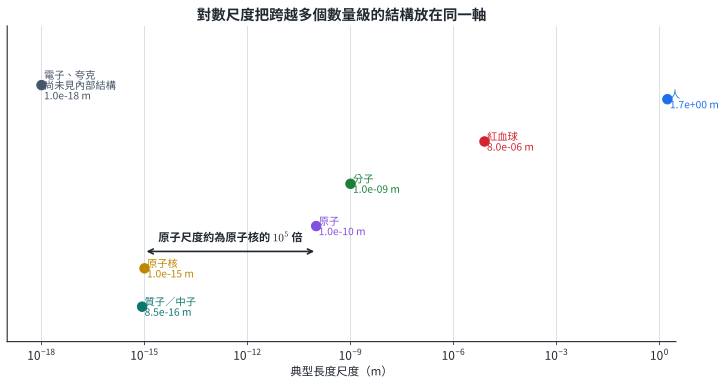

若把直徑約 $1\ \mathrm{fm}$ 的原子核放大成 $1\ \mathrm{mm}$ 小球，保持比例的原子尺度約為

$$
(1\ \mathrm{mm})\times10^5=100\ \mathrm m.
$$

原子的大部分體積是電子分布的空間；原子的質量則幾乎集中於體積極小的原子核。尺度比例能幫助判斷顯微技術、散射探針與材料加工需要的解析度。

電子與夸克目前尚未觀察到內部結構，本章把它們視為基本粒子。質子與中子具有約 $10^{-15}\ \mathrm m$ 的尺度，內部由夸克組成。

#### 示範 5　建立原子與原子核的比例模型

把原子核畫成直徑 $2.0\ \mathrm{mm}$ 的圓點，原子與原子核的尺度比取 $10^5$。求原子模型直徑。

$$
D_{\text{atom}}=(2.0\times10^{-3}\ \mathrm m)(10^5)
=2.0\times10^2\ \mathrm m.
$$

模型中的原子直徑為 $200\ \mathrm m$。這個比例顯示原子核雖承載幾乎全部質量，所占空間仍極小。

#### 示範 6　估計一條線上可排列多少個原子

以原子間距 $0.20\ \mathrm{nm}=2.0\times10^{-10}\ \mathrm m$ 估計，長度 $1.0\ \mathrm{mm}$ 的直線可排列多少個原子？

$$
N\approx\frac{1.0\times10^{-3}}{2.0\times10^{-10}}
=5.0\times10^6.
$$

約有五百萬個。這種數量級估計可檢查奈米薄膜、晶格與半導體元件的尺度。

### 2.2 散射實驗如何揭露原子核

湯姆森由氣體放電實驗發現各種原子都能釋出相同的帶負電粒子，即電子。他提出正電荷均勻分布於原子內、電子散布其中的模型。這個模型對高速、帶正電的 $\alpha$ 粒子通過金箔作出預測：正電分散，單次作用很弱，粒子應大多近直線穿過，只出現小偏折。

拉塞福團隊讓 $\alpha$ 粒子束撞擊極薄金箔，利用周圍閃爍屏記錄散射方向。

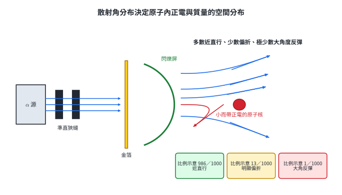

圖中的 1000 次是用來呈現「多數、少數、極少數」的比例示意。推理分成三步：

1. 絕大多數近直線通過：原子內大部分空間沒有集中物質阻擋。
2. 少數明顯偏折：$\alpha$ 粒子帶正電，附近存在集中的正電區域，靜電斥力能改變其方向。
3. 極少數大角度反彈：能在很短距離產生巨大作用的正電荷與質量集中在很小體積內。

因此拉塞福提出有核原子模型：原子核帶正電、質量幾乎集中於核內，核外是電子分布的空間。散射角愈大，通常代表粒子曾更接近原子核。

這種「已知探針射入樣品，量測出射方向與能量，再反推內部結構」的方法，也用於電子散射、粒子加速器、材料分析與醫療影像。

#### 示範 7　由散射資料選擇原子模型

某薄膜散射 20,000 顆帶正電探針，結果如下：

| 結果 | 數目 |
|---|---:|
| 偏折小於 $5^\circ$ | 19,720 |
| 偏折 $5^\circ$ 至 $90^\circ$ | 266 |
| 偏折大於 $90^\circ$ | 14 |

1. 近直行比例為 $19\,720/20\,000=98.6\%$，表示樣品內大部分空間允許探針通過。
2. 有 14 顆大角度反彈，表示少量探針遇到能造成強烈斥力的集中區。
3. 探針與集中區同帶正電，因此偏折可由靜電斥力說明。

資料支持「小而帶正電、承載大部分質量的原子核」，也說明單看平均偏折會漏掉關鍵的稀少事件。

#### 示範 8　判斷 $\alpha$ 粒子的受力與偏折方向

一顆 $\alpha$ 粒子由原子核上方從左向右射入。原子核與 $\alpha$ 粒子都帶正電。

1. 靜電力沿兩者連線。
2. 同號電荷互斥，所以原子核對 $\alpha$ 粒子的力指向遠離原子核。
3. 在核上方時，力具有向上分量，軌跡會向上彎。
4. 最近距離愈小，庫侖力愈大，偏折角通常愈大。

這個方向判斷先由圖上的相對位置與電性完成，再使用平方反比定律比較量值。

### 2.3 原子核、核素與夸克

拉塞福由核反應辨認出帶正電、質量與氫核相近的質子。查兌克後來發現電中性、質量與質子相近的中子。原子由核外電子與原子核組成；原子核由質子與中子組成。最常見的氫核 $^1_1\mathrm H$ 只有一個質子，氘核 $^2_1\mathrm H$ 則另有一個中子。

| 粒子 | 符號 | 電荷 | 靜止質量（約值） | 位置 |
|---|---:|---:|---:|---|
| 電子 | $e^-$ | $-e=-1.602\times10^{-19}\ \mathrm C$ | $9.11\times10^{-31}\ \mathrm{kg}$ | 核外 |
| 質子 | $p$ | $+e$ | $1.673\times10^{-27}\ \mathrm{kg}$ | 核內 |
| 中子 | $n$ | $0$ | $1.675\times10^{-27}\ \mathrm{kg}$ | 核內 |

電子質量約為質子的 $1/1836$，所以原子質量幾乎由核子決定。

核素記號寫成

$$
{}^{A}_{Z}X^{z},
$$

其中：

- $Z$ 是原子序，也是質子數。
- $A$ 是質量數，$A=Z+N$。
- $N=A-Z$ 是中子數。
- $z$ 是離子的帶電數；以 $e$ 為單位時，電子數 $N_e=Z-z$。例如 $z=+2$ 時少兩個電子，$z=-1$ 時多一個電子。

同一元素的核素具有相同 $Z$、不同 $N$，稱為同位素。

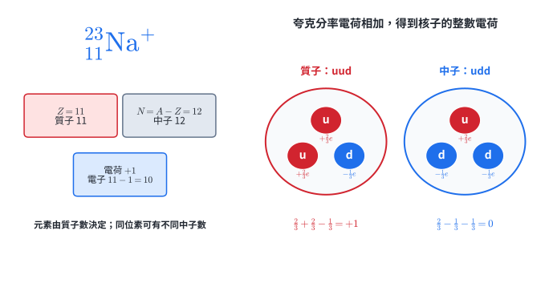

質子和中子還能由上夸克 $u$ 與下夸克 $d$ 組成：

$$
q_u=+\frac{2}{3}e,\qquad q_d=-\frac{1}{3}e,
$$

$$
p=uud:\quad \frac{2}{3}e+\frac{2}{3}e-\frac{1}{3}e=+e,
$$

$$
n=udd:\quad \frac{2}{3}e-\frac{1}{3}e-\frac{1}{3}e=0.
$$

本章以 $u,d$ 夸克說明普通物質中的質子與中子；其他夸克種類與希格斯粒子留待近代物理延伸。

#### 示範 9　由核素記號求三種粒子數

求 $ {}^{27}_{13}\mathrm{Al}^{3+}$ 的質子、中子與電子數。

$$
Z=13,\qquad N=A-Z=27-13=14.
$$

$3+$ 表示少三個電子：

$$
N_e=13-3=10.
$$

所以質子 13 個、中子 14 個、電子 10 個。電荷檢查：

$$
13e-10e=+3e.
$$

#### 示範 10　由粒子數反推核素與離子

某粒子含 17 個質子、18 個中子、18 個電子。

1. $Z=17$，元素為氯 $\mathrm{Cl}$。
2. $A=17+18=35$。
3. 電子比質子多 1 個，總電荷為 $-e$。

核素與離子記號為

$$
{}^{35}_{17}\mathrm{Cl}^{-}.
$$

#### 示範 11　由電荷重建核子的夸克組成

三個夸克候選組合為 $uuu$、$uud$、$udd$。計算總電荷：

$$
uuu: 3\left(\frac{2}{3}e\right)=+2e,
$$

$$
uud: 2\left(\frac{2}{3}e\right)-\frac{1}{3}e=+e,
$$

$$
udd: \frac{2}{3}e-2\left(\frac{1}{3}e\right)=0.
$$

因此 $uud$ 對應質子，$udd$ 對應中子。這項檢查使用電荷守恆與分率電荷相加。

### 2.4 節內練習

1. 將 $0.25\ \mathrm{nm}$ 轉成公尺與埃，並判斷其是否屬於原子尺度。
2. 原子核模型直徑為 $0.50\ \mathrm{mm}$，若原子與原子核尺度比為 $10^5$，求原子模型直徑。
3. 依拉塞福散射結果，分別說明「大多數直行」與「極少數大角度反彈」支持的結構結論。
4. 求 $ {}^{56}_{26}\mathrm{Fe}^{2+}$ 的質子、中子與電子數。
5. 某離子有 8 個質子、10 個中子、10 個電子，寫出核素與離子記號。
6. 以夸克電荷驗證 $uud$ 與 $udd$ 的總電荷，並指出對應核子。

#### 節內練習解析

1. $0.25\ \mathrm{nm}=2.5\times10^{-10}\ \mathrm m=2.5\ \text{Å}$，位於常見原子尺度。
2. $(0.50\times10^{-3})(10^5)=50\ \mathrm m$。
3. 大多數直行表示原子大部分是核外空間；大角度反彈表示正電荷與質量集中在極小原子核。
4. 質子 $26$，中子 $56-26=30$，電子 $26-2=24$。
5. $Z=8$ 為氧，$A=8+10=18$；電子比質子多 2 個，故為 $ {}^{18}_{8}\mathrm O^{2-}$。
6. $uud$ 的電荷為 $2(2/3)e-(1/3)e=+e$，是質子；$udd$ 的電荷為 $(2/3)e-2(1/3)e=0$，是中子。

## 3　物質間的基本交互作用

交互作用描述兩個系統如何彼此改變。判斷一個現象時，可依序確認：

1. 作用的來源與承受作用的對象。
2. 作用方向是吸引、排斥，或使粒子種類改變。
3. 相關距離是天文、日常、原子核或更短尺度。
4. 力量值如何隨質量、電量與距離改變。

重力與電磁作用可跨長距離；強作用與弱作用集中在極短尺度。場是描述交互作用在空間中如何分布的物理量：先由來源建立場，再由置於場中的物體所受作用判定效果。

### 3.1 萬有引力與重力場

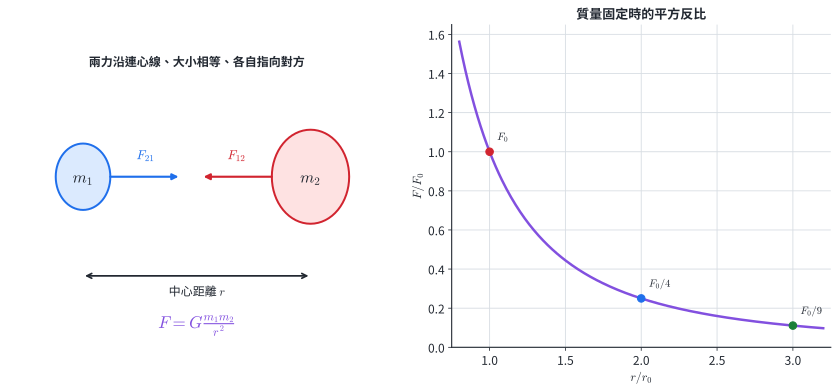

質量為 $m_1,m_2$ 的兩個質點，相距 $r$ 時，萬有引力量值為

$$
F=G\frac{m_1m_2}{r^2},
$$

其中

$$
G=6.67\times10^{-11}\ \mathrm{N\,m^2/kg^2}.
$$

適用條件與方向：

- 質點模型可直接使用；均勻球體的外部重力也可把質量視為集中於球心。
- $r$ 是兩質點或兩球心的距離。
- 兩力沿連心線，各自指向對方，量值相等。
- 質量固定時，距離變成 $ar$，力量值變成原來的 $1/a^2$。

質量 $M$ 的球形天體，在距球心 $r$ 處建立的重力場強度為

$$
g(r)=\frac{F}{m}=G\frac{M}{r^2}.
$$

它同時是放入小物體後的重力加速度。天體表面 $r=R$：

$$
g_{\text{surface}}=G\frac{M}{R^2},\qquad W=mg_{\text{surface}}.
$$

這個模型用於行星表面重量、衛星軌道、潮汐與天體質量估計。

#### 示範 12　同時改變質量與距離

原本兩質量間的引力為 $F$。現在把 $m_1$ 變為 $2m_1$、$m_2$ 變為 $3m_2$，距離變為 $2r$。

先寫比值：

$$
\frac{F'}{F}
=\frac{(2m_1)(3m_2)}{m_1m_2}
\left(\frac{r}{2r}\right)^2
=6\cdot\frac{1}{4}=\frac{3}{2}.
$$

所以

$$
F'=1.5F.
$$

質量乘積提供 6 倍，距離平方提供 $1/4$ 倍，兩項相乘得到結果。

#### 示範 13　比較星球表面重力加速度

某星球質量為地球的 $8$ 倍，半徑為地球的 $2$ 倍。以地表重力加速度 $g_\oplus$ 為基準：

$$
\frac{g_{\text p}}{g_\oplus}
=\frac{8M_\oplus}{M_\oplus}
\left(\frac{R_\oplus}{2R_\oplus}\right)^2
=8\cdot\frac{1}{4}=2.
$$

所以 $g_{\text p}=2g_\oplus$。同一位太空人在該星球表面的重量為地球表面的 2 倍，質量則維持相同。

### 3.2 電力、電場、磁力與磁場

#### 點電荷與電場

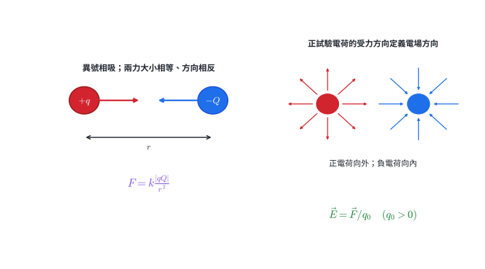

兩個近似靜止的點電荷 $q_1,q_2$ 相距 $r$，庫侖力量值為

$$
F=k\frac{|q_1q_2|}{r^2},
\qquad
k=8.99\times10^9\ \mathrm{N\,m^2/C^2}.
$$

點電荷條件表示帶電體的大小遠小於彼此距離；均勻帶電球體的外部電場也可用球心點電荷模型。

- 同號電荷互斥，異號電荷互吸。
- 兩力沿連心線，量值相等、方向相反。
- 電量乘積決定量值，距離平方決定衰減。

來源電荷在周圍建立電場。以小的正試驗電荷 $q_0$ 定義某點電場：

$$
\vec E=\frac{\vec F}{q_0},\qquad q_0>0.
$$

點電荷 $Q$ 的電場量值為

$$
E=k\frac{|Q|}{r^2}.
$$

正電荷場線向外，負電荷場線向內；任一點的場方向是場線切線方向。場線密處代表場較強。同一點的場方向唯一，所以場線彼此不相交。

帶電物體吸引另一物體時，來源可能是異號電荷，也可能是帶電體使中性導體內電荷重新分布而形成淨吸引。判斷電性時要再觀察排斥、接地或驗電器結果。

#### 磁極、磁化與磁場

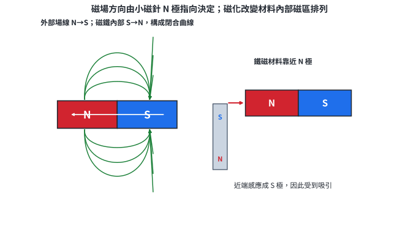

棒磁鐵自由懸掛後，指北端定為 N 極，另一端為 S 極。同極相斥、異極相吸。切開一根磁鐵後，每一段都形成新的 N、S 兩極。

磁場方向定義為小磁針 N 極所指方向。棒磁鐵外部場線由 N 極指向 S 極，磁鐵內部由 S 極返回 N 極，構成閉合曲線；場線愈密處代表磁場愈強。

鐵、鈷、鎳及其部分合金可被磁化。鐵製物靠近磁鐵 N 極時，近端磁區傾向排列成 S 極，因此受到吸引。磁化解釋了磁鐵吸迴紋針，以及第一枚迴紋針再吸起下一枚的現象。

電力與磁力屬於同一種電磁作用。原子中的電子與原子核、原子間鍵結，以及日常的支撐力、彈性與摩擦，在本章層次都歸入電磁作用；更精確的材料微觀模型還會使用電子的量子性。

電場用於觸控面板、靜電除塵、影印與粒子束控制；磁場用於馬達、發電機、磁浮、資料儲存與醫療造影。

#### 示範 14　計算兩點電荷間的庫侖力

$q_1=+2.0\ \mu\mathrm C$、$q_2=-3.0\ \mu\mathrm C$，相距 $0.30\ \mathrm m$。

先由異號判斷為吸引。量值：

$$
F=(8.99\times10^9)
\frac{(2.0\times10^{-6})(3.0\times10^{-6})}{(0.30)^2}
=0.599\ \mathrm N
\approx0.60\ \mathrm N.
$$

作用在 $q_1$ 上的力指向 $q_2$；作用在 $q_2$ 上的力指向 $q_1$。兩力量值相同。

#### 示範 15　疊加兩個點電荷的電場

$+4.0\ \mathrm{nC}$ 與 $-4.0\ \mathrm{nC}$ 相距 $0.40\ \mathrm m$。求中點電場。

中點距每一電荷 $0.20\ \mathrm m$。

- 正電荷的場在中點指向遠離正電荷，也就是指向負電荷。
- 負電荷的場在中點指向負電荷。

兩個方向相同，所以量值相加。每一個場為

$$
E_1=k\frac{|Q|}{r^2}
=(8.99\times10^9)\frac{4.0\times10^{-9}}{(0.20)^2}
=899\ \mathrm{N/C}.
$$

總電場

$$
E=2E_1=1.80\times10^3\ \mathrm{N/C},
$$

方向由正電荷指向負電荷。

#### 示範 16　判斷磁針與鐵片的方向

一小磁針放在棒磁鐵 S 極右側，另有一片未磁化鐵片放在 N 極左側。

1. S 極右側的外部磁場指向 S 極，因此小磁針 N 極指向磁鐵。
2. 鐵片靠近 N 極的一端感應成 S 極，遠端感應成 N 極。
3. 近端距離較短，吸引效果較強，鐵片整體受到指向磁鐵的淨力。

這項推理使用場方向、感應磁化與距離共同判斷。

### 3.3 強作用與弱作用

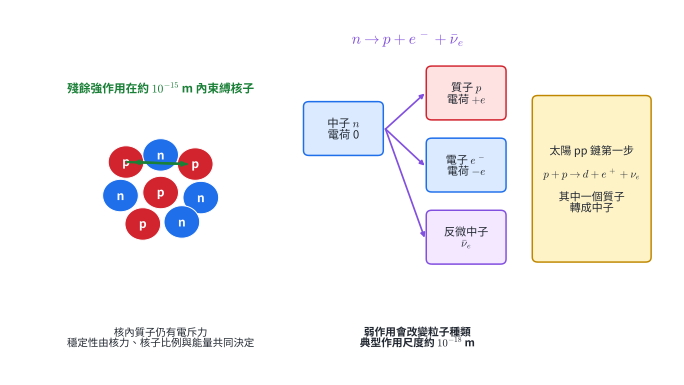

強作用有兩個相關層次：

1. 夸克間的強作用把三個夸克束縛成質子或中子。
2. 核子間的殘餘強作用在約 $10^{-15}\ \mathrm m$ 尺度內吸引質子與中子，使許多原子核能穩定存在。

核內質子彼此有靜電斥力。原子核的穩定由殘餘強作用、質子中子比例與核能量共同決定；核子距離超出核尺度後，殘餘強作用迅速減弱。

弱作用的特色是能使粒子種類改變。自由中子的 $\beta^-$ 衰變可寫成

$$
n\rightarrow p+e^-+\bar{\nu}_e.
$$

電荷檢查：

$$
0=(+e)+(-e)+0.
$$

弱作用的典型尺度約為 $10^{-18}\ \mathrm m$。它參與原子核的 $\beta$ 衰變，也參與太陽質子—質子鏈第一步：

$$
p+p\rightarrow d+e^++\nu_e,
$$

其中一個質子在反應中轉為中子，形成氘核 $d$。弱作用使太陽核融合的起始反應以穩定速率進行。

#### 示範 17　由反應特徵辨認強作用與弱作用

判斷三個現象的主導作用：

1. 三個夸克形成質子：強作用。
2. 質子與中子結合在原子核內：殘餘強作用。
3. 中子轉成質子、電子與反微中子：弱作用，因為粒子種類發生轉換。

辨認關鍵是「束縛夸克／核子」對應強作用，「$\beta$ 衰變與種類轉換」對應弱作用。

### 3.4 四種基本交互作用的比較

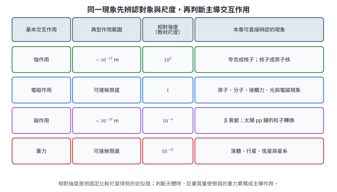

教材常用固定尺度下的約略相對強度比較四種作用：

| 基本交互作用 | 典型範圍 | 約略相對強度 | 代表現象 |
|---|---:|---:|---|
| 強作用 | 約 $10^{-15}\ \mathrm m$ | $10^2$ | 核子與原子核 |
| 電磁作用 | 長程 | $1$ | 原子、分子、接觸力、電與磁 |
| 弱作用 | 約 $10^{-18}\ \mathrm m$ | $10^{-4}$ | $\beta$ 衰變、太陽 pp 鏈 |
| 重力 | 長程 | $10^{-37}$ | 落體、行星、恆星與星系 |

相對強度會隨比較尺度與過程改變，表中數值用於建立量級概念。重力對單一微觀粒子極弱，但天體質量巨大且重力只有吸引、可長程累積，因此在天文尺度主導。普通物質整體常接近電中性，使遠距離電力容易互相抵消；重力則隨質量持續累積。

#### 示範 18　由現象、對象與尺度選擇主導作用

| 現象 | 判斷線索 | 主導作用 |
|---|---|---|
| 月球繞地球 | 大質量、天文距離、吸引 | 重力 |
| 電子受原子核吸引 | 帶異號電的粒子、原子尺度 | 電磁作用 |
| 桌面支撐書本 | 原子電子雲接近形成接觸作用 | 電磁作用為主要來源 |
| 質子與中子束縛成原子核 | 約 $10^{-15}\ \mathrm m$、核子束縛 | 殘餘強作用 |
| 碳-14 發生 $\beta^-$ 衰變 | 中子轉為質子並放出電子 | 弱作用 |

同一系統可能同時含多種作用；題目通常要求找出決定主要觀測結果的作用。

### 3.5 節內練習

1. 兩質點質量各變為原來的 2 倍，距離變為原來的 3 倍。求萬有引力與原值的比。
2. 行星質量為地球的 $4$ 倍、半徑為地球的 $2$ 倍，求表面重力加速度與地球的比。
3. 兩點電荷的其中一個電量變為 3 倍，距離變為原來的 $\sqrt3$ 倍。求庫侖力與原值的比，並說明同號時方向。
4. 說明棒磁鐵外部與內部場線方向；一枚鐵釘靠近 N 極時，近端感應成哪一極？
5. 分別判斷「夸克形成質子」「核子形成原子核」「中子 $\beta^-$ 衰變」的主導作用。
6. 將下列現象分類到重力、電磁、強或弱作用：行星公轉、橡皮筋彈力、原子核束縛、太陽 pp 鏈起始反應。

#### 節內練習解析

1. $F'/F=(2)(2)/3^2=4/9$。
2. $g'/g=4/2^2=1$，表面重力加速度相同。
3. $F'/F=3/(\sqrt3)^2=1$；同號時兩力沿連線、各自指離對方。
4. 外部 N 至 S、內部 S 至 N，形成閉合曲線；鐵釘近端感應成 S 極。
5. 依序為強作用、殘餘強作用、弱作用。
6. 行星公轉—重力；橡皮筋彈力—以電磁作用為主要微觀來源；原子核束縛—殘餘強作用；pp 鏈起始粒子轉換—弱作用。

## 4　核心整理

### 物質與三態

- 布朗運動的可見不規則軌跡，可由不可見分子的熱運動與不平衡碰撞解釋；定量預測和實驗吻合支持原子分子模型。
- 固體粒子局部受限，液體粒子相近但可交換位置，氣體粒子平均距離大且充分移動。
- 聲、熱、靜電與極光都能由粒子運動和交互作用連到巨觀觀測。

### 原子尺度與結構

$$
1\ \text{Å}=10^{-10}\ \mathrm m=0.1\ \mathrm{nm},
\qquad
\text{原子核尺度}\sim10^{-15}\ \mathrm m.
$$

- 拉塞福散射：多數直行支持原子大部分為核外空間；少數大角偏折支持小而帶正電、承載大部分質量的原子核。
- 核素記號：$A=Z+N$；離子電子數由質子數與帶電數求得。
- 質子為 $uud$，電荷 $+e$；中子為 $udd$，電荷 0。

### 四種基本交互作用

$$
F_{\mathrm g}=G\frac{m_1m_2}{r^2},
\qquad
F_{\mathrm e}=k\frac{|q_1q_2|}{r^2}.
$$

- 重力長程且只有吸引，在天體尺度主導。
- 電磁作用有吸引與排斥，維繫原子、分子，也形成多數日常接觸作用。
- 強作用束縛夸克；殘餘強作用束縛核子。
- 弱作用造成 $\beta$ 衰變等粒子種類轉換。

## 5　章末代表題：分層與跨節整合

第 1–4 題處理物質組成與三態，第 5–8 題處理尺度、散射、核素與夸克，第 9–12 題處理四種基本交互作用，第 13–16 題整合兩個以上主節。

### 題目

1. 道耳頓原子說、布朗運動、愛因斯坦模型與佩蘭實驗在原子論發展中各扮演什麼角色？

2. 某懸浮微粒的平均位移平方資料如下：

   | $t$（s） | 1 | 2 | 4 | 8 |
   |---:|---:|---:|---:|---:|
   | $\langle r^2\rangle$（$\mu\mathrm m^2$） | 1.8 | 3.7 | 7.3 | 14.6 |

   判斷資料支持哪一項時間關係，並說明單一微粒軌跡與統計規律的差異。

3. 一種物質具有固定體積，倒入細長容器與寬容器時形狀會改變。由微觀粒子模型判斷物態，並說明加熱至汽化後形狀、體積與粒子距離如何改變。

4. 分別以粒子模型說明：（甲）空氣傳遞聲音；（乙）鐵湯匙由一端逐步升溫；（丙）塑膠尺摩擦紙後吸引紙屑。

5. 原子尺度取 $1.0\times10^{-10}\ \mathrm m$、原子核尺度取 $1.0\times10^{-15}\ \mathrm m$。若把原子核放大成直徑 $5.0\ \mathrm{mm}$，原子模型直徑是多少？

6. 金箔散射中，99% 以上的 $\alpha$ 粒子近直線通過，少量粒子偏折，極少量大角度反彈。依序寫出三項觀測對原子結構的推論。

7. 求 $ {}^{40}_{20}\mathrm{Ca}^{2+}$ 的質子、中子、電子數。另一粒子有 20 個質子、22 個中子、18 個電子，寫出其核素與離子記號，並判斷兩者是否為同位素。

8. 已知 $u$ 夸克電荷為 $+2e/3$、$d$ 夸克為 $-e/3$。計算 $uud$、$udd$、$uuu$ 的總電荷，指出質子與中子。

9. 兩顆衛星質量分別為 $m$ 與 $2m$，中心距離為 $r$，引力為 $F$。若第二顆衛星質量變為 $6m$，中心距離變為 $3r$，新引力是多少？

10. 某星球質量為地球的 $9$ 倍，半徑為地球的 $3$ 倍。求星球表面重力加速度與地球的比，並比較同一物體在兩處的質量與重量。

11. $+Q$ 與 $-Q$ 相距 $2a$。判斷中點電場方向；若 $Q$ 變為 2 倍、$a$ 變為 2 倍，中點電場量值變為原來多少倍？

12. 說明下列現象的主導交互作用：（甲）棒磁鐵吸起迴紋針；（乙）核子束縛成原子核；（丙）自由中子 $\beta^-$ 衰變；（丁）地球繞太陽。

13. 奈米粒子直徑為 $80\ \mathrm{nm}$，懸浮於水中並出現布朗運動。

   （1）粒子直徑約為 $0.20\ \mathrm{nm}$ 原子尺度的多少倍？

   （2）寫出支持「水由持續熱運動的分子組成」的觀察、模型與一項可控制的實驗變因。

   （3）若水凝固，水分子的運動方式與材料的形狀如何改變？

14. 帶 $+2e$ 的 $\alpha$ 粒子從帶正電原子核上方通過，最近距離由 $r$ 降為 $r/2$。

   （1）畫出原子核對 $\alpha$ 粒子的受力方向。

   （2）在點電荷近似下，最近點庫侖力變為原來多少倍？

   （3）預測偏折角如何改變，並連結到拉塞福對原子核的推論。

15. 一顆球形星球質量 $4M_\oplus$、半徑 $2R_\oplus$。星球表面有質量 $1.0\times10^{-9}\ \mathrm{kg}$、電量 $+2.0\times10^{-9}\ \mathrm C$ 的帶電微粒；上方電極在微粒處產生向上 $5.0\ \mathrm{N/C}$ 的電場。取 $g_\oplus=9.8\ \mathrm{m/s^2}$。

   （1）求星球表面 $g$。

   （2）求微粒所受重力與電力的量值及方向。

   （3）判斷哪一作用較大，並指出兩力分別屬於哪種基本交互作用。

16. 碳-14 發生

$$
{}^{14}_{6}\mathrm C\rightarrow{}^{14}_{7}\mathrm N+e^-+\bar\nu_e.
$$

   （1）求衰變前後兩個原子核的質子與中子數。

   （2）檢查反應兩側電荷。

   （3）指出造成粒子轉換、束縛核子、束縛核外電子的三種作用。

   （4）說明這個反應如何同時連結核素記號、粒子結構與基本交互作用。

## 6　章末詳解

### 第 1 題

道耳頓用原子假說統整元素與化學反應中的質量關係，提供可計算模型。布朗觀察到懸浮微粒持續不規則移動，提供待解釋的現象。愛因斯坦用分子熱運動與碰撞建立定量模型，導出可測預測。佩蘭實驗得到與預測相符的統計結果與亞佛加厥常數，使原子分子模型獲得獨立支持。

推理鏈為

$$
\text{化學規律}
\rightarrow\text{原子假說}
\rightarrow\text{布朗運動}
\rightarrow\text{分子碰撞模型}
\rightarrow\text{定量實驗吻合}.
$$

### 第 2 題

計算比值：

$$
\frac{\langle r^2\rangle}{t}
=1.8,\ 1.85,\ 1.825,\ 1.825\ \mu\mathrm m^2/\mathrm s.
$$

比值近似固定，所以資料支持

$$
\langle r^2\rangle\propto t.
$$

單一微粒每一步方向隨機，軌跡呈曲折折線；大量同條件微粒的平均位移平方則呈穩定的時間比例。模型比較要用統計量，不以單一路徑要求平滑。

### 第 3 題

固定體積、形狀隨容器，判斷為液體。液體粒子彼此相近，吸引仍能維持有限平均距離，但粒子可交換鄰近位置，因此能流動。

汽化後：

- 粒子平均距離大幅增加。
- 粒子在容器中充分移動。
- 形狀隨容器。
- 體積也隨容器並容易壓縮。

模型條件是比較同一物質在指定外界壓力下的狀態改變。

### 第 4 題

甲：聲源使鄰近空氣粒子振動，粒子把壓力變化傳給下一層，能量向外傳遞，空氣整體沒有隨聲波一路前進。

乙：熱水端的粒子與金屬內粒子碰撞；晶格振動與金屬電子逐步把能量傳向較冷端。

丙：摩擦使電子在材料表面轉移，塑膠尺與紙形成電荷分布；異號電荷或感應電荷分布造成淨吸引。三者都由微觀粒子運動與交互作用連到巨觀結果。

### 第 5 題

尺度比：

$$
\frac{10^{-10}}{10^{-15}}=10^5.
$$

放大後原子直徑：

$$
D=(5.0\times10^{-3}\ \mathrm m)(10^5)
=5.0\times10^2\ \mathrm m.
$$

答案為 $500\ \mathrm m$。原子核占原子線尺度的十萬分之一。

### 第 6 題

1. 多數近直行：原子內大部分體積是核外空間。
2. 少量偏折：原子內存在集中正電區，對正電 $\alpha$ 粒子施斥力。
3. 極少量大角反彈：正電荷與幾乎全部質量集中於非常小的原子核。

三項觀測要合併解釋；只有「多數直行」還無法單獨確定集中正電核的性質。

### 第 7 題

對 $ {}^{40}_{20}\mathrm{Ca}^{2+}$：

$$
p=20,\qquad n=40-20=20,\qquad e=20-2=18.
$$

另一粒子：

$$
Z=20,\qquad A=20+22=42,
$$

且 18 個電子表示電荷為 $+2e$，所以記為

$$
{}^{42}_{20}\mathrm{Ca}^{2+}.
$$

兩者 $Z$ 都是 20，中子數分別 20 與 22，因此是鈣的同位素。

### 第 8 題

$$
q(uud)=\frac{2}{3}e+\frac{2}{3}e-\frac{1}{3}e=+e,
$$

$$
q(udd)=\frac{2}{3}e-\frac{1}{3}e-\frac{1}{3}e=0,
$$

$$
q(uuu)=3\left(\frac{2}{3}e\right)=+2e.
$$

$uud$ 是質子，$udd$ 是中子；$uuu$ 的電荷與兩者皆不同。

### 第 9 題

原狀態的質量乘積是 $m(2m)$；新狀態是 $m(6m)$，為原來 3 倍。距離變 3 倍，平方反比給 $1/9$：

$$
\frac{F'}{F}=3\cdot\frac{1}{9}=\frac{1}{3}.
$$

答案：

$$
F'=\frac{F}{3}.
$$

### 第 10 題

$$
\frac{g'}{g_\oplus}
=\frac{9M_\oplus}{M_\oplus}
\left(\frac{R_\oplus}{3R_\oplus}\right)^2
=9\cdot\frac{1}{9}=1.
$$

表面重力加速度相同。同一物體的質量是物體本身性質，在兩地相同；重量 $W=mg$，因 $g$ 相同，所以重量也相同。

### 第 11 題

在中點：

- $+Q$ 的電場指離正電荷。
- $-Q$ 的電場指向負電荷。

兩者都由 $+Q$ 指向 $-Q$，所以相加。中點距各電荷為 $a$：

$$
E=2k\frac{Q}{a^2}.
$$

改變後

$$
E'=2k\frac{2Q}{(2a)^2}
=2k\frac{Q}{a^2}\cdot\frac{1}{2}
=\frac{E}{2}.
$$

方向仍由正電荷指向負電荷。

### 第 12 題

- 甲：磁鐵先使迴紋針磁化，再產生磁吸引，屬電磁作用。
- 乙：核子在約 $10^{-15}\ \mathrm m$ 尺度內受殘餘強作用束縛。
- 丙：中子轉為質子、電子與反微中子，屬弱作用。
- 丁：地球與太陽都是大質量天體，公轉由萬有引力主導。

### 第 13 題

（1）先統一單位：

$$
\frac{80\ \mathrm{nm}}{0.20\ \mathrm{nm}}=400.
$$

奈米粒子直徑約為原子尺度的 400 倍。

（2）觀察是顯微鏡下粒子位置隨時間呈不規則折線；模型是水分子的熱運動造成不平衡碰撞；可控制變因可選水溫、粒徑或液體黏滯性，並比較平均位移平方。

（3）凝固後水分子平均動能降低，鄰近關係形成較穩定結構，粒子主要在局部平衡位置附近振動；材料取得固定形狀與固定體積。

本題連結尺度換算、布朗運動證據與三態粒子模型。

### 第 14 題

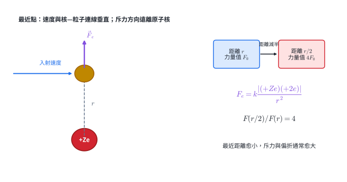

（1）原子核與 $\alpha$ 粒子都帶正電。$\alpha$ 粒子位於核上方時，受力沿兩者連線並指向遠離原子核，也就是具有向上分量。

（2）

$$
\frac{F'}{F}
=\left(\frac{r}{r/2}\right)^2
=4.
$$

最近點庫侖力變為 4 倍。

（3）較大的斥力使軌跡彎曲更明顯，偏折角通常增大。極少數大角偏折表示少數粒子非常接近一個小而集中的正電區，支持原子核模型。

### 第 15 題

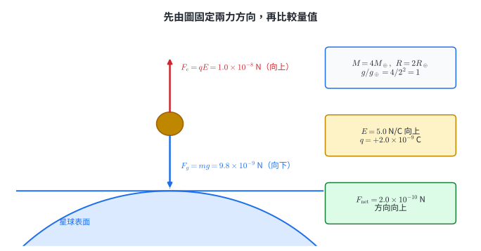

（1）

$$
\frac{g'}{g_\oplus}
=\frac{4}{2^2}=1,
$$

所以

$$
g'=9.8\ \mathrm{m/s^2}.
$$

（2）重力向下：

$$
F_g=mg=(1.0\times10^{-9})(9.8)
=9.8\times10^{-9}\ \mathrm N.
$$

電量為正，電場向上，所以電力向上：

$$
F_e=qE=(2.0\times10^{-9})(5.0)
=1.0\times10^{-8}\ \mathrm N.
$$

（3）

$$
F_e=10.0\times10^{-9}\ \mathrm N
>F_g=9.8\times10^{-9}\ \mathrm N.
$$

電力稍大，淨力為

$$
F_{\text{net}}=2.0\times10^{-10}\ \mathrm N
$$

向上。重力屬重力交互作用；電力屬電磁作用。本題同時使用天體表面 $g$ 與帶電微粒在電場中的受力。

### 第 16 題

（1）衰變前：

$$
{}^{14}_{6}\mathrm C:\quad p=6,\quad n=14-6=8.
$$

衰變後：

$$
{}^{14}_{7}\mathrm N:\quad p=7,\quad n=14-7=7.
$$

一個中子轉成一個質子，質量數維持 14。

（2）以 $e$ 為單位：

$$
\text{左側}=+6,
$$

$$
\text{右側}=+7+(-1)+0=+6.
$$

電荷守恆。

（3）

- 中子轉為質子、電子與反微中子：弱作用。
- 質子與中子束縛在核內：殘餘強作用。
- 核外電子受正原子核吸引：電磁作用。

（4）核素記號的 $Z$ 由 6 變 7、$A$ 維持 14，直接呈現核內粒子種類改變；夸克層次可把中子的 $udd$ 轉換連到質子的 $uud$；反應機制由弱作用主導，而生成的原子核仍由殘餘強作用束縛。這是一條由符號、粒子組成到交互作用的完整證據鏈。
