# 必物-3 物體的運動

::: learning-map
### 本章建立的預測鏈

1. **位置資料**先固定參考系與座標，再定義位移、路徑長、速度與加速度。
2. **運動圖**用斜率讀速度或加速度，用帶正負號的面積讀位移。
3. **牛頓定律**把互動力連到速度的變化：$\sum\vec F=m\vec a$。
4. **受力圖**將重力、正向力、彈力與摩擦力轉成逐軸方程。
5. **天體運動**把「速度方向持續改變」與克卜勒的長期觀測定律放進同一框架。

這些模型直接用於區間測速、制動距離、電梯與稱重設備、加速度感測器、機械載荷與衛星週期預測。
:::

## 1. 理想化將現象轉成可檢驗模型

日常經驗中，推動物體後放手，物體常會慢下來。接觸面摩擦與空氣阻力持續提供反向合力，造成速度變化。伽利略用斜面思考實驗逐步降低這些影響：球滾下左斜面後，在右斜面越能回到接近原高；右側軌道越平，為達到同一高度就需移動越遠。將右側理想成完全水平且無阻力，運動將持續下去。

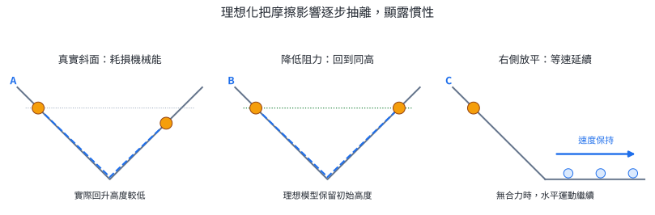{width=98%}

這種方法的重點是控制變因與理想化：實驗告訴我們「阻力變小時，運動狀態如何變化」；理想模型再預測「阻力趨近零的極限狀態」。後面的慣性定律就是這項模型的精確表達。

### 實務連結｜建模與工程判定

車輛滑行、電梯啟動、衛星繞行都同時受很多影響。工程分析先留下會主導結果的互動，建立最小可用模型；若預測與量測差異大於容許範圍，再納入空氣阻力、滾動阻力或其他次要因素。

## 2. 位置、位移、速度與加速度

### 2.1 參考系與一維座標

「物體在移動」必須相對於某個參考系才有意義。路旁觀察者會看到乘客跟著列車向東移動；車內觀察者則可把坐在椅上的乘客視為靜止。選定參考系後，再設定原點、正方向與單位，才能用座標 $x$ 描述位置。

| 物理量 | 定義 | 一維表示 | SI 單位 |
|---|---|---|---|
| 位置 | 相對原點的有向座標 | $x$ | m |
| 位移 | 末位置減初位置 | $\Delta x=x_f-x_i$ | m |
| 路徑長 | 沿實際路徑累加的長度 | $s=\sum |\Delta x_j|$ | m |
| 平均速度 | 單位時間的位移 | $\bar v=\Delta x/\Delta t$ | m/s |
| 平均速率 | 單位時間的路徑長 | $\bar u=s/\Delta t$ | m/s |
| 瞬時速度 | 極短時間內的平均速度極限 | $v$ | m/s |
| 平均加速度 | 單位時間的速度變化 | $\bar a=\Delta v/\Delta t$ | m/s$^2$ |

位移是有方向的量，一維中用正負號表示方向。路徑長與速率表示累計長度及其變化快慢，數值取非負。

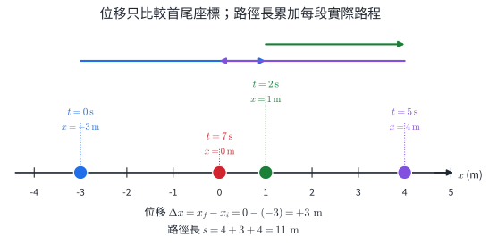{width=96%}

### 2.2 位移與路徑長的推理

把整段運動切成 $n$ 段，第 $j$ 段位移為 $\Delta x_j=x_j-x_{j-1}$。全程位移相加時，中間座標會成對抵消：

$$
\sum_{j=1}^{n}\Delta x_j
=(x_1-x_0)+(x_2-x_1)+\cdots +(x_n-x_{n-1})
=x_n-x_0.
$$

因此位移只由首尾位置決定。路徑長先對每段取絕對值再相加，方向反轉時仍會累加路程。這個差異決定平均速度可以為零，而同一趟旅程的平均速率仍為正。

::: worked-example
### 完整示範 1｜往返運動的平均速度與速率

圖 2 中，物體在 $t=0$ 位於 $x=-3\ \mathrm m$，依序移到 $x=1\ \mathrm m$、$4\ \mathrm m$，最後於 $t=7\ \mathrm s$ 到達 $x=0$。

$$
\Delta x=x_f-x_i=0-(-3)=+3\ \mathrm m,
$$

$$
s=|1-(-3)|+|4-1|+|0-4|=4+3+4=11\ \mathrm m.
$$

所以

$$
\bar v=\frac{3}{7}=+0.429\ \mathrm{m/s},
\qquad
\bar u=\frac{11}{7}=1.57\ \mathrm{m/s}.
$$

正號說明首尾位移朝 $+x$；$1.57\ \mathrm{m/s}$ 描述全程累計移動的快慢。
:::

::: worked-example
### 完整示範 2｜用短時間資料估計瞬時速度

一輛車在直線上的位置記錄如下：

| $t$ (s) | 1.8 | 1.9 | 2.0 | 2.1 | 2.2 |
|---:|---:|---:|---:|---:|---:|
| $x$ (m) | 3.24 | 3.61 | 4.00 | 4.41 | 4.84 |

以 $t=2.0\ \mathrm s$ 左右各 $0.1\ \mathrm s$ 的資料估計：

$$
v(2.0\ \mathrm s)\approx
\frac{x(2.1)-x(1.9)}{2.1-1.9}
=\frac{4.41-3.61}{0.20}
=4.0\ \mathrm{m/s}.
$$

若改用 $1.8$ 至 $2.2\ \mathrm s$，也得 $(4.84-3.24)/0.40=4.0\ \mathrm{m/s}$。這份資料符合 $x=t^2$，在 $t=2\ \mathrm s$ 附近縮短取樣區間時，區間平均速度趨近當下速度 $4.0\ \mathrm{m/s}$。
:::

### 2.3 加速度描述速度的變化

$$
\bar a=\frac{v_f-v_i}{t_f-t_i}.
$$

加速度的正負由座標正方向決定。判斷速率變化時，同時比較 $v$ 與 $a$ 的方向：

- $v$ 與 $a$ 同號：速率增加。
- $v$ 與 $a$ 異號：速率減小。
- $a=0$：速度保持不變，可以是靜止，也可以是等速度直線運動。

::: worked-example
### 完整示範 3｜加速度方向與速率變化

取向東為正。某車的速度在 $4.0\ \mathrm s$ 內從 $-12\ \mathrm{m/s}$ 變為 $-4.0\ \mathrm{m/s}$：

$$
\bar a=\frac{-4.0-(-12)}{4.0}=+2.0\ \mathrm{m/s^2}.
$$

速度向西，加速度向東。兩者方向相反，因此速率從 $12$ 降為 $4.0\ \mathrm{m/s}$。
:::

### 實務連結｜GPS、區間測速與加速度感測器

GPS 依不同時刻的位置差估計速度；區間測速用兩端點距離與通過時間計算平均速率；手機內的感測器則記錄加速度隨時間的變化，用於螢幕旋轉、步態辨識與碰撞偵測。三種裝置量到的量不同，必須根據定義解讀。

::: self-check
### 節內練習 2A｜運動量的定義

1. 某人在 $3.0\ \mathrm s$ 內由 $x=-6\ \mathrm m$ 走到 $x=9\ \mathrm m$。求位移與平均速度。
2. 物體由 $x=0$ 到 $x=4\ \mathrm m$，再返回 $x=3\ \mathrm m$。求位移與路徑長。
3. 跑者繞 $400\ \mathrm m$ 跑道一圈回到起點，耗時 $80\ \mathrm s$。求平均速度與平均速率。
4. 取向右為正，速度由 $+6\ \mathrm{m/s}$ 在 $2.0\ \mathrm s$ 內變為 $-2\ \mathrm{m/s}$。求平均加速度，並說明末狀態的運動方向。
5. 將原點向右平移 $100\ \mathrm m$，同一段運動的初、末座標都減少 $100\ \mathrm m$。比較平移前後的位移。

**簡答：**1. $+15\ \mathrm m$、$+5.0\ \mathrm{m/s}$。2. $+3\ \mathrm m$、$5\ \mathrm m$。3. $0$、$5.0\ \mathrm{m/s}$。4. $-4.0\ \mathrm{m/s^2}$，末狀態向左。5. 位移仍為 $x_f-x_i$，數值不變。
:::

## 3. 運動圖與等加速度模型

### 3.1 $x$--$t$ 圖的斜率

在位置—時間圖上，兩時刻之間的割線斜率為

$$
\frac{\Delta x}{\Delta t}=\bar v.
$$

取得越接近某一時刻，割線越趨近該點的切線，切線斜率就是瞬時速度。圖線向右上升對應正速度，水平段對應靜止，向右下降對應負速度。位置在原點以下只代表 $x<0$，運動方向仍由斜率判定。

### 3.2 $v$--$t$ 圖的斜率與面積

在速度—時間圖上，割線斜率為 $\Delta v/\Delta t=\bar a$。一小段時間 $\Delta t$ 內，若速度近似為 $v$，位移近似為 $v\Delta t$。把各小段相加，就是 $v$--$t$ 圖線與時間軸間的帶號面積：

$$
\Delta x=\sum v_j\Delta t_j.
$$

時間軸上方的面積計為正，下方計為負。若要累加路徑長，則對每段面積取正值後相加。

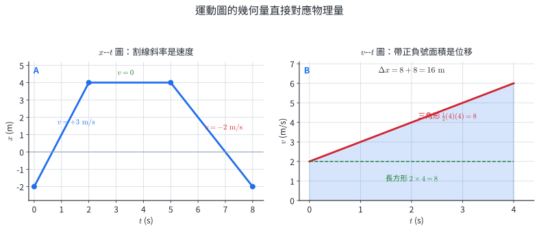{width=98%}

::: worked-example
### 完整示範 4｜讀取分段 $x$--$t$ 圖

圖 3A 的位置依序為 $(0,-2)$、$(2,4)$、$(5,4)$、$(8,-2)$，座標單位分別為秒與公尺。

$$
v_1=\frac{4-(-2)}{2-0}=+3\ \mathrm{m/s},
\qquad
v_2=0,
$$

$$
v_3=\frac{-2-4}{8-5}=-2\ \mathrm{m/s}.
$$

末位置與初位置相同，所以全程位移為 $0$。路徑長為 $6+0+6=12\ \mathrm m$。
:::

::: worked-example
### 完整示範 5｜由 $v$--$t$ 圖同時求加速度與位移

圖 3B 中，速度在 $4.0\ \mathrm s$ 內由 $2.0\ \mathrm{m/s}$ 線性增至 $6.0\ \mathrm{m/s}$。

$$
a=\frac{6.0-2.0}{4.0}=1.0\ \mathrm{m/s^2}.
$$

$$
\Delta x=(2.0)(4.0)+\frac{1}{2}(4.0)(4.0)=8.0+8.0=16\ \mathrm m.
$$

線性變化時 $\bar v=(2.0+6.0)/2=4.0\ \mathrm{m/s}$，因此 $\Delta x=\bar v\Delta t=16\ \mathrm m$，與面積法一致。
:::

### 3.3 等加速度的兩個主要關係

等加速度指加速度在考察時間內保持不變。從 $v$--$t$ 圖的固定斜率可得

$$
a=\frac{v-v_0}{t}
\quad\Rightarrow\quad
\boxed{v=v_0+at}.
$$

圖下面積為長方形 $v_0t$ 加三角形 $\frac{1}{2}(at)t$，因此

$$
\boxed{\Delta x=v_0t+\frac{1}{2}at^2}.
$$

若從靜止出發，$v_0=0$，上式化為 $v=at$、$\Delta x=\frac{1}{2}at^2$。公式的正負號來自同一組座標約定。

::: worked-example
### 完整示範 6｜反應距離與制動距離

車速為 $20\ \mathrm{m/s}$。駕駛從看到障礙到開始制動需 $0.75\ \mathrm s$，此期間近似保持原速。之後車輛以 $a=-5.0\ \mathrm{m/s^2}$ 等加速度制動至停止。

$$
d_r=vt=(20)(0.75)=15\ \mathrm m.
$$

制動時間由 $0=20-5.0t_b$ 得 $t_b=4.0\ \mathrm s$。制動期間的平均速度為 $(20+0)/2=10\ \mathrm{m/s}$，所以

$$
d_b=(10)(4.0)=40\ \mathrm m.
$$

從發現障礙到停車共需 $15+40=55\ \mathrm m$。反應時間不變時，反應距離與車速成正比；制動距離還會受胎路摩擦、坡度與制動系統影響。
:::

### 3.4 自由落體是近地面的等加速度模型

忽略空氣阻力時，近地面物體只受重力，加速度向下，大小約為 $g=9.8\ \mathrm{m/s^2}$，估算題常取 $g=10\ \mathrm{m/s^2}$。圖 4 取向下為正，從靜止釋放時 $v=gt$、$y=\frac{1}{2}gt^2$。

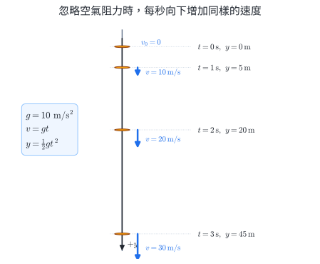{width=80%}

::: worked-example
### 完整示範 7｜由高度與速度交叉驗證落下時間

小球從靜止釋放，忽略空氣阻力，取 $g=10\ \mathrm{m/s^2}$。問落下 $20\ \mathrm m$ 所需時間與當時速度。

$$
20=\frac{1}{2}(10)t^2
\quad\Rightarrow\quad
t=2.0\ \mathrm s,
$$

$$
v=gt=(10)(2.0)=20\ \mathrm{m/s},
$$

方向向下。用平均速度驗算：$(0+20)/2=10\ \mathrm{m/s}$，在 $2.0\ \mathrm s$ 內位移為 $20\ \mathrm m$，與題意相符。
:::

::: pitfall
### 圖像讀值的必要區分

- $x$--$t$ 圖的高度是位置，斜率才是速度。
- $v$--$t$ 圖的高度是速度，斜率是加速度，圖下帶號面積是位移。

這個區分會直接改變答案的物理量與單位。
:::

::: self-check
### 節內練習 3A｜斜率、面積與等加速度

1. $x$--$t$ 圖在 $t=1$ 至 $4\ \mathrm s$ 間由 $x=2$ 線性增至 $x=11\ \mathrm m$。求速度。
2. 某 $x$--$t$ 圖在 $3\ \mathrm s$ 內保持水平。這段的位移與速度各為何？
3. $v$--$t$ 圖在 $0$ 至 $2\ \mathrm s$ 保持 $+4\ \mathrm{m/s}$，$2$ 至 $4\ \mathrm s$ 保持 $-1\ \mathrm{m/s}$。求位移與路徑長。
4. 物體由靜止出發，以 $a=3.0\ \mathrm{m/s^2}$ 運動 $4.0\ \mathrm s$。求末速度與位移。
5. 車輛以 $15\ \mathrm{m/s}$ 行駛，反應時間 $0.80\ \mathrm s$。求反應距離。
6. 小球由靜止自由落下 $3.0\ \mathrm s$，取 $g=10\ \mathrm{m/s^2}$。求落下距離與末速率。

**簡答：**1. $+3.0\ \mathrm{m/s}$。2. $0$、$0$。3. $+6\ \mathrm m$、$10\ \mathrm m$。4. $12\ \mathrm{m/s}$、$24\ \mathrm m$。5. $12\ \mathrm m$。6. $45\ \mathrm m$、$30\ \mathrm{m/s}$ 向下。
:::

## 4. 牛頓三大運動定律

### 4.1 第一定律：合力為零時的運動狀態

在可套用牛頓定律的參考系中，若物體所受合力為零，它會保持靜止或等速度直線運動：

$$
\sum\vec F=\vec 0
\quad\Rightarrow\quad
\vec v=\text{常向量}.
$$

物體維持原運動狀態的性質稱為**慣性**，質量是慣性大小的量度。圖 1 的理想水平軌道提供這條定律的建模脈絡：移除造成速度變化的合力後，原有速度就保留。

### 4.2 第二定律：合力決定加速度

同一物體上所有外力的向量和，決定物體的加速度：

$$
\boxed{\sum\vec F=m\vec a}.
$$

圖 5A 保持質量不變，$a$--$F$ 資料為通過原點的直線，顯示 $a\propto F$。同一合力下，$2.0\ \mathrm{kg}$ 車的加速度是 $1.0\ \mathrm{kg}$ 車的一半，顯示 $a\propto1/m$。圖 5B 反過來顯示，若要保持同一加速度，所需合力與質量成正比。

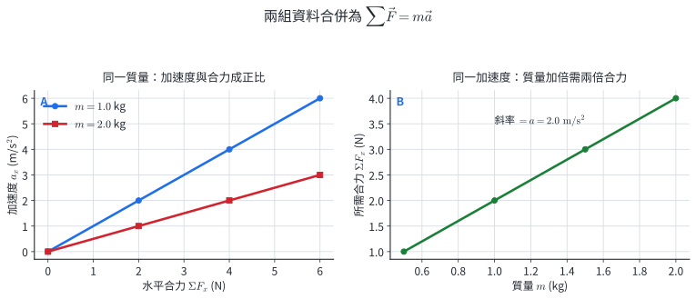{width=96%}

牛頓（N）的定義來自第二定律：

$$
1\ \mathrm N=1\ \mathrm{kg\,m/s^2}.
$$

式中的 $\sum\vec F$ 是合力，方向與 $\vec a$ 相同。速度 $\vec v$ 描述當下的運動，合力描述速度將怎麼變。

::: worked-example
### 完整示範 8｜由實驗資料求質量並預測加速度

某台車在水平方向受合力 $2.0\ \mathrm N$ 時，加速度為 $0.80\ \mathrm{m/s^2}$。

$$
m=\frac{F}{a}=\frac{2.0}{0.80}=2.5\ \mathrm{kg}.
$$

換成 $5.0\ \mathrm N$ 的同方向合力後，

$$
a=\frac{5.0}{2.5}=2.0\ \mathrm{m/s^2}.
$$

單位驗算：$\mathrm N/\mathrm{kg}=\mathrm{m/s^2}$，符合加速度單位。
:::

::: worked-example
### 完整示範 9｜合力與速度可以方向相反

取向右為正。質量 $4.0\ \mathrm{kg}$ 的物體當下以 $v=+6.0\ \mathrm{m/s}$ 運動，受到向左 $8.0\ \mathrm N$ 的合力。

$$
a=\frac{\sum F_x}{m}=\frac{-8.0}{4.0}=-2.0\ \mathrm{m/s^2}.
$$

經 $2.0\ \mathrm s$ 後，

$$
v=v_0+at=6.0+(-2.0)(2.0)=2.0\ \mathrm{m/s}.
$$

物體仍向右，速率已由 $6.0$ 降為 $2.0\ \mathrm{m/s}$。合力向左的直接結果是加速度向左，運動方向要由後續速度判斷。
:::

### 4.3 第三定律：力來自兩物體的互動

物體 A 對物體 B 施力時，B 同時對 A 施以大小相等、方向相反、同一種互動的力：

$$
\boxed{\vec F_{A\to B}=-\vec F_{B\to A}}.
$$

這兩力同時出現，分別作用在 B 與 A 上。比較單一物體的運動時，只相加作用在該物體上的力。

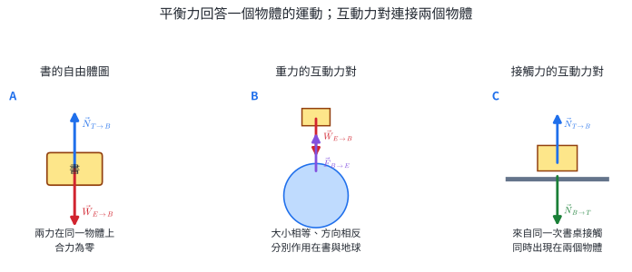{width=98%}

圖 6A 的正向力與重力都作用在書上，在靜止條件下使書的合力為零。它們來自不同互動。各自的第三定律配對顯示在圖 6B、6C，每一對都橫跨兩個物體。

::: worked-example
### 完整示範 10｜溜冰者互推時的力相等、加速度不相等

質量 $50\ \mathrm{kg}$ 的 A 與 $75\ \mathrm{kg}$ 的 B 在近似無摩擦的冰面互推。A 對 B 施以向右 $150\ \mathrm N$ 的力，則 B 對 A 施以向左 $150\ \mathrm N$ 的力。

$$
a_A=\frac{-150}{50}=-3.0\ \mathrm{m/s^2},
\qquad
a_B=\frac{+150}{75}=+2.0\ \mathrm{m/s^2}.
$$

互動力大小相等；加速度由各自質量與各自受到的合力決定，所以質量較小的 A 加速度大小較大。
:::

### 實務連結｜車輛安全與機械控制

碰撞試驗用加速度—時間資料評估車體與乘員在短時間內的受力。在同一速度變化下，延長停止時間會降低加速度量值，這是潰縮區、安全氣囊與緩衝包裝的共同機制。機器人與自動車用加速度感測資料估計合力與路面互動，再調整驅動力。

::: self-check
### 節內練習 4A｜牛頓三定律

1. 太空船在遠離天體的區域燃料燃燒完畢，合力近似為零。描述後續速度。
2. $3.0\ \mathrm{kg}$ 物體受向右 $12\ \mathrm N$ 與向左 $3.0\ \mathrm N$。求加速度。
3. 物體受兩個大小各 $7.0\ \mathrm N$、方向相反的力。求合力與加速度。
4. 同一合力作用在 $2.0\ \mathrm{kg}$ 與 $6.0\ \mathrm{kg}$ 物體上。比較加速度大小。
5. 手掌向下壓桌面 $40\ \mathrm N$。寫出這個力的第三定律配對。
6. 質量 $1000\ \mathrm{kg}$ 的車加速度為 $1.5\ \mathrm{m/s^2}$ 向東。求水平合力。

**簡答：**1. 大小與方向都保持。2. $3.0\ \mathrm{m/s^2}$ 向右。3. $0$、$0$。4. $a_{2\mathrm{kg}}:a_{6\mathrm{kg}}=3:1$。5. 桌面同時向上推手掌 $40\ \mathrm N$。6. $1.5\times10^3\ \mathrm N$ 向東。
:::

## 5. 受力圖、平衡與常見力

### 5.1 受力圖將互動轉成方程

受力圖（自由體圖）只保留一個受力體，再把外界對它的每一個力由物體向外畫出。建立模型的順序是：

1. 圈定要預測運動的物體。
2. 列出與它互動的施力者：地球、接觸面、繩、彈簧、人或其他物體。
3. 每一個互動畫一支力，標出符號與方向。
4. 選擇與運動或接觸面配合的座標軸。
5. 逐軸把圖上的力收入 $\sum F_x=ma_x$、$\sum F_y=ma_y$。

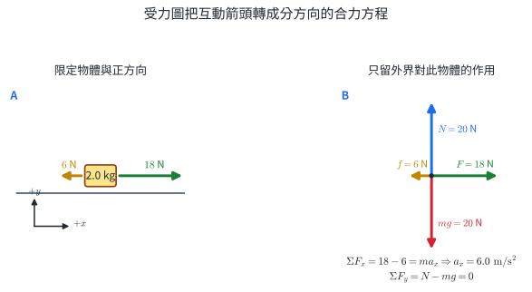{width=98%}

::: worked-example
### 完整示範 11｜水平面上的合力與加速度

圖 7 的 $2.0\ \mathrm{kg}$ 箱子受 $18\ \mathrm N$ 向右推力、$6\ \mathrm N$ 向左摩擦力，取 $g=10\ \mathrm{m/s^2}$。水平方向：

$$
18-6=(2.0)a_x
\quad\Rightarrow\quad
a_x=6.0\ \mathrm{m/s^2}.
$$

箱子在鉛直方向無加速度：

$$
N-mg=0
\quad\Rightarrow\quad
N=(2.0)(10)=20\ \mathrm N.
$$

圖上的右向合力與計算得到的右向加速度一致；鉛直兩箭頭等長，對應鉛直合力為零。
:::

### 5.2 重力與正向力

近地面物體的重力大小為 $W=mg$，方向指向地心。正向力 $N$ 是接觸面因壓縮與微觀電磁互動而對物體施加的力，方向垂直接觸面。$N$ 的數值由鉛直運動方程決定。

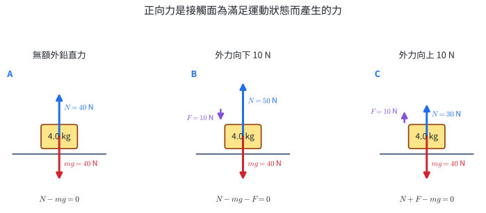{width=98%}

::: worked-example
### 完整示範 12｜外力改變正向力

質量 $4.0\ \mathrm{kg}$ 的箱子靜止在水平桌面，取 $g=10\ \mathrm{m/s^2}$。

- 只受重力與支撐時：$N-mg=0$，所以 $N=40\ \mathrm N$。
- 再受 $10\ \mathrm N$ 向下外力時：$N-mg-F=0$，所以 $N=50\ \mathrm N$。
- 再受 $10\ \mathrm N$ 向上外力且仍接觸桌面時：$N+F-mg=0$，所以 $N=30\ \mathrm N$。

三個結果都直接來自圖 8 的鉛直平衡方程。
:::

### 5.3 彈性力與虎克定律

彈簧偏離自然長度時，在彈性比例限度內，彈性力大小與形變量成正比：

$$
F_s=k|\Delta L|.
$$

$k$ 是彈簧力常數，單位為 $\mathrm{N/m}$。彈簧作用力方向指向恢復自然長度的方向。數據圖上 $F$--$\Delta L$ 的線性區斜率就是 $k$。

::: worked-example
### 完整示範 13｜從伸長量求彈性力

某彈簧在比例限度內，$k=120\ \mathrm{N/m}$，自然長 $0.20\ \mathrm m$，被拉長至 $0.25\ \mathrm m$。

$$
\Delta L=0.25-0.20=0.050\ \mathrm m,
$$

$$
F_s=k\Delta L=(120)(0.050)=6.0\ \mathrm N.
$$

若彈簧在物體右側被拉長，彈簧對物體的力指向右方，使彈簧長度趨向自然長。
:::

### 5.4 摩擦力會配合接觸狀態

摩擦力沿接觸面，方向抑制兩表面間的相對滑動或滑動趨勢。

- **靜摩擦力**在物體尚未滑動時自動調整，$0\le |f_s|\le f_{s,\max}$。
- **動摩擦力**在表面相對滑動時作用；固定表面與正向力下，其大小可用近似定值描述。

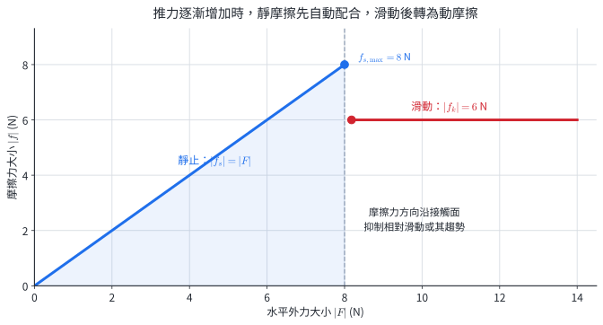{width=88%}

::: worked-example
### 完整示範 14｜先判斷靜止或滑動，再列合力

質量 $2.0\ \mathrm{kg}$ 的物體原本靜止，圖 9 給出 $f_{s,\max}=8\ \mathrm N$、$f_k=6\ \mathrm N$。

外力為 $5\ \mathrm N$ 時，靜摩擦力可調整為 $5\ \mathrm N$ 且方向相反，合力為零，物體保持靜止。

外力增至 $10\ \mathrm N$ 時，超過 $f_{s,\max}$，物體開始滑動，摩擦力大小為 $6\ \mathrm N$：

$$
\sum F_x=10-6=4\ \mathrm N,
\qquad
a=\frac{4}{2.0}=2.0\ \mathrm{m/s^2}.
$$

摩擦力的數值由接觸狀態與其容許範圍決定，再與其他力合成。
:::

### 實務連結｜秤重、輪胎抓地與彈簧感測

體重計量到的是秤與人之間的正向互動，在鉛直加速時讀數會隨 $N-mg=ma_y$ 改變。輪胎加速、制動與轉彎所需的水平力來自路面摩擦。機械式秤與部分力感測器先校準 $F$--$\Delta L$ 斜率，再用形變量反推受力。

::: self-check
### 節內練習 5A｜常見力與受力圖

1. 蘋果離手後在空中落下，忽略空氣阻力。列出蘋果的受力。
2. $5.0\ \mathrm{kg}$ 箱子靜止在水平面，又受 $15\ \mathrm N$ 向下外力。取 $g=10\ \mathrm{m/s^2}$，求 $N$。
3. $3.0\ \mathrm{kg}$ 物體在水平面受 $20\ \mathrm N$ 向右與 $5\ \mathrm N$ 向左摩擦力。求加速度。
4. $k=200\ \mathrm{N/m}$ 的彈簧伸長 $3.0\ \mathrm{cm}$。求彈性力大小。
5. 物體原本靜止，$f_{s,\max}=9\ \mathrm N$。施以 $7\ \mathrm N$ 水平外力時，求靜摩擦力大小與物體加速度。
6. 書靜止在桌上。分別寫出「地球對書的重力」與「桌對書的正向力」的第三定律配對。

**簡答：**1. 地球對蘋果的重力，向下。2. $65\ \mathrm N$。3. $5.0\ \mathrm{m/s^2}$ 向右。4. $6.0\ \mathrm N$。5. $7\ \mathrm N$ 反向、$a=0$。6. 書對地球的引力；書對桌面的接觸力。
:::

## 6. 圓周運動與天體運動

### 6.1 等速率圓周運動仍有加速度

速度是向量。物體沿圓周以固定速率運動時，速度的大小不變，方向卻持續轉動。圖 10A 中速度沿軌道切線，加速度指向圓心。圖 10B 把相鄰時刻的兩個速度向量放在同一起點，$\Delta\vec v$ 指向軌道內側；當時間間隔縮短，這個方向趨近圓心。

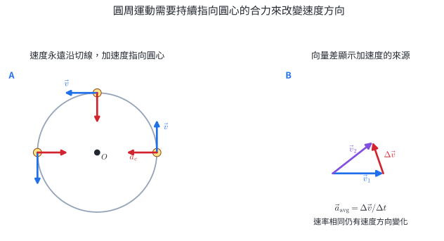{width=94%}

根據第二定律，加速度指向圓心表示合力也指向圓心。繩子的張力、路面摩擦、重力或正向力都可以在不同情境擔任這個徑向合力。必修範圍先掌握向量方向與合力角色；向心加速度的定量式在選修物理 I 展開。

::: worked-example
### 完整示範 15｜圈道上速度與合力的方向

小車在水平圓形軌道上逆時針等速率運動。當小車位於圓的最右端時：速度沿軌道切線向上，加速度指向圓心而向左，水平合力與加速度同向。

接著到達圓的最上端時，速度轉為向左，加速度與合力轉為向下。這些方向是由軌道幾何決定的。
:::

### 6.2 克卜勒三定律

克卜勒從長期行星位置資料整理出三條關係：

1. **軌道定律**：行星繞太陽的軌道為橢圓，太陽在橢圓的一個焦點上。
2. **面積定律**：太陽與行星的連線在相等時間內掃過相等面積。行星靠近太陽時，同時間掃過的弧長較大，所以速率較大。
3. **週期定律**：繞同一中心天體的物體，軌道半長軸 $a$ 的立方與週期 $T$ 的平方成固定比：

$$
\boxed{\frac{a^3}{T^2}=\text{常數}}
\qquad\text{或寫成}\qquad
\boxed{T^2\propto a^3}.
$$

軌道近似圓形時，$a$ 就是軌道半徑 $R$。不同中心天體的質量不同，比例常數也不同，因此週期比較要先確認是繞同一中心天體。

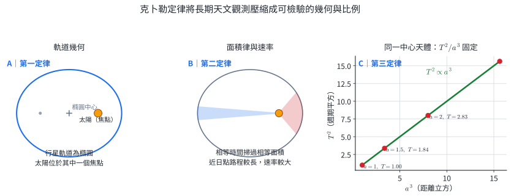{width=98%}

### 6.3 從觀測歸納，再用理論演繹

克卜勒的三條定律是從大量行星觀測資料中找出共同關係，屬於**歸納**。牛頓後來用運動定律與萬有引力建立更底層的模型，再由模型推出行星軌道應符合的關係，屬於**演繹**。科學實務會在兩者間循環：觀測整理出規律，理論產生新預測，新觀測再檢驗預測。

::: worked-example
### 完整示範 16｜面積定律與軌道速率

行星在軌道上由 A 移至 B 耗時 $30$ 天，太陽連線掃過面積 $S$。另一段 C 至 D 也耗時 $30$ 天。根據面積定律，C–D 掃過面積也是 $S$。

若 A–B 較靠近太陽，掃過區域的高（行星到太陽的距離）較短。要在同時間維持相同面積，軌道底邊對應的弧長較長，因此近日點附近的平均速率較大。
:::

::: worked-example
### 完整示範 17｜用週期定律比較兩軌道

兩顆行星繞同一恒星運行，B 的軌道半長軸是 A 的 $4$ 倍。

$$
\frac{a_A^3}{T_A^2}=\frac{a_B^3}{T_B^2},
$$

$$
\left(\frac{T_B}{T_A}\right)^2
=\left(\frac{a_B}{a_A}\right)^3
=4^3=64,
$$

$$
\frac{T_B}{T_A}=8.
$$

B 離中心天體較遠，週期為 A 的 $8$ 倍。把結果代回 $a^3/T^2$：$4^3/8^2=1$，與 A 的比值相同。
:::

### 實務連結｜衛星軌道與系外行星

衛星任務用軌道週期安排通訊窗口、地面覆蓋與觀測重訪時間。天文學家從恒星亮度週期性降低或光譜往復偏移得到系外行星週期，再結合恒星資料估計軌道尺度。克卜勒定律因此是從觀測時間序列連到天體系統結構的關鍵模型。

::: self-check
### 節內練習 6A｜圓周方向與克卜勒定律

1. 物體逆時針繞圓，位於圓的最上端。指出速度、加速度與合力方向。
2. 行星位於橢圓軌道近日點與遠日點時，何處速率較大？使用面積定律說明。
3. 兩衛星繞同一行星作近似圓軌道運動，$R_B=9R_A$。求 $T_B/T_A$。
4. 某行星軌道半長軸是地球的 $2$ 倍，且繞太陽運行。以地球年為單位估計週期。
5. 先由多顆行星資料找出 $T^2\propto a^3$，再用此關係預測新發現行星的週期。指出前後兩個步驟分別屬於歸納或演繹。

**簡答：**1. 速度向左，加速度與合力向下。2. 近日點；同時間等面積使近日點弧長較大。3. $27$。4. $2^{3/2}\approx2.83$ 年。5. 前者歸納，後者演繹。
:::

## 7. 核心整理

::: summary-box
### 運動描述

$$
\Delta x=x_f-x_i,
\qquad
\bar v=\frac{\Delta x}{\Delta t},
\qquad
\bar a=\frac{\Delta v}{\Delta t}.
$$

- $x$--$t$ 圖斜率是速度。
- $v$--$t$ 圖斜率是加速度，帶號面積是位移。
- 等加速度：$v=v_0+at$、$\Delta x=v_0t+\frac{1}{2}at^2$。
- 從靜止自由落下：$v=gt$、$y=\frac{1}{2}gt^2$。

### 力與運動

$$
\sum\vec F=\vec0\Rightarrow\vec v為常向量,
\qquad
\sum\vec F=m\vec a,
\qquad
\vec F_{A\to B}=-\vec F_{B\to A}.
$$

- 受力圖先限定一個物體，再畫外界對它的作用。
- 重力 $W=mg$；正向力垂直接觸面且由運動方程決定。
- 比例限度內 $F_s=k|\Delta L|$，方向指向恢復自然長度。
- 靜摩擦在 $0$ 至 $f_{s,\max}$ 間配合外力；滑動後使用動摩擦狀態。

### 圓周與天體

- 圓周運動的速度沿切線，加速度與合力指向圓心。
- 克卜勒第一定律：橢圓軌道與焦點。
- 第二定律：等時間掃過等面積。
- 第三定律：繞同一中心天體時 $a^3/T^2$ 固定。
:::

## 8. 代表題：分層練習

### A 層｜定義與單一關係

**題目 1｜位移、路徑長與平均量**

跑者在 $t=0$ 位於 $x=-20\ \mathrm m$，$8.0\ \mathrm s$ 後到 $x=12\ \mathrm m$，再於 $t=12.0\ \mathrm s$ 到 $x=-4\ \mathrm m$。求全程位移、路徑長、平均速度與平均速率。

**題目 2｜速度符號與加速度**

取向右為正，某物體在 $2.0\ \mathrm s$ 內由 $v_i=-4.0\ \mathrm{m/s}$ 均勻變為 $v_f=+2.0\ \mathrm{m/s}$。求加速度，並判斷速率在整段時間內如何變化。

**題目 3｜分段 $x$--$t$ 圖**

使用圖 3A，求三段速度、全程位移、路徑長與 $0$ 至 $8\ \mathrm s$ 的平均速度。

**題目 4｜線性 $v$--$t$ 圖**

使用圖 3B，求 $0$ 至 $4\ \mathrm s$ 的加速度、位移與平均速度。

**題目 5｜自由落體**

一小球由靜止釋放，忽略空氣阻力，取 $g=10\ \mathrm{m/s^2}$。求落下 $20\ \mathrm m$ 所需時間與當時速度。

**題目 6｜慣性**

台車上有一個水平台面，球原本與車一起靜止。若台車突然向右加速，球與台面間摩擦很小，從地面參考系與車上觀察各描述球的初期運動。

### B 層｜受力圖與定量預測

**題目 7｜第二定律資料**

某車受水平合力 $4.0\ \mathrm N$ 時，加速度為 $2.0\ \mathrm{m/s^2}$。求車的質量；若合力增為 $6.0\ \mathrm N$，求新加速度。

**題目 8｜第三定律與不同質量**

$50\ \mathrm{kg}$ 的 A 與 $75\ \mathrm{kg}$ 的 B 在水平冰面互推。A 對 B 施以 $180\ \mathrm N$ 向右的力，忽略其他水平力。求 B 對 A 的力，以及 A、B 各自加速度。

**題目 9｜水平面受力圖**

$3.0\ \mathrm{kg}$ 箱子在水平面受 $20\ \mathrm N$ 向右推力與 $5.0\ \mathrm N$ 向左摩擦力。取 $g=10\ \mathrm{m/s^2}$。畫受力圖，求正向力與水平加速度。

**題目 10｜額外鉛直外力**

$5.0\ \mathrm{kg}$ 箱子靜止在水平地面，又受手掌 $15\ \mathrm N$ 向下的力。取 $g=10\ \mathrm{m/s^2}$，求地面對箱子的正向力。

**題目 11｜彈簧校準**

彈簧力常數為 $150\ \mathrm{N/m}$，在比例限度內由自然長伸長 $4.0\ \mathrm{cm}$。求彈性力大小，並說明彈簧對右端物體的作用方向。

**題目 12｜靜摩擦與動摩擦**

$2.0\ \mathrm{kg}$ 物體原本靜止，$f_{s,\max}=8.0\ \mathrm N$、$f_k=6.0\ \mathrm N$。分別在水平外力為 $7.0\ \mathrm N$ 與 $10\ \mathrm N$ 時，求摩擦力、合力與加速度。

### C 層｜向量、軌道與資料

**題目 13｜圓周運動的方向**

物體以固定速率逆時針繞圓。分別寫出物體在最右端與最上端時的速度、加速度與合力方向。

**題目 14｜克卜勒面積定律**

行星由近日點附近的 A 移至 B 耗時 $20$ 天，掃過面積 $S$。在遠日點附近由 C 移至 D 也耗時 $20$ 天。求 C–D 掃過面積，並比較 A–B 與 C–D 的弧長及平均速率。

**題目 15｜克卜勒週期定律**

行星 A、B 繞同一恒星運行，$a_B=4a_A$。求 $T_B/T_A$。

**題目 16｜軌道資料與科學推理**

以適當單位表示同一行星系的三顆衛星：

| 衛星 | $a$ | $T$ |
|---|---:|---:|
| P | 1 | 1 |
| Q | 4 | 8 |
| R | 9 | 27 |

計算三者 $a^3/T^2$，判斷資料是否支持克卜勒第三定律。從這組數據找出共同關係屬於歸納或演繹？

### 跨節整合題

**整合題 1｜反應、制動與運動圖**

車輛以 $20\ \mathrm{m/s}$ 行駛，駕駛的反應時間為 $0.75\ \mathrm s$，反應期間車速近似不變。制動後加速度固定為 $-5.0\ \mathrm{m/s^2}$，直到停止。畫 $v$--$t$ 圖，求反應距離、制動時間、制動距離與總停車距離。

**整合題 2｜電梯秤讀數、受力圖與速度**

$60\ \mathrm{kg}$ 的人站在電梯秤上，秤對人的正向力為 $720\ \mathrm N$，取 $g=10\ \mathrm{m/s^2}$ 與向上為正。畫人的受力圖並求加速度。若當下電梯速度為 $-3.0\ \mathrm{m/s}$，加速度在接下來 $1.0\ \mathrm s$ 保持不變，求末速度並描述速率變化。

**整合題 3｜摩擦狀態與分段運動**

$2.0\ \mathrm{kg}$ 物體原本靜止在水平面，$f_{s,\max}=8.0\ \mathrm N$、$f_k=6.0\ \mathrm N$。先施以 $5.0\ \mathrm N$ 向右外力 $2.0\ \mathrm s$，接著將外力改為 $10\ \mathrm N$ 並維持 $3.0\ \mathrm s$。求兩階段的摩擦力、加速度，以及全程末速度與位移。

**整合題 4｜系外行星的週期預測**

兩顆行星 A、B 繞同一恒星作近似圓軌道運動，$R_B=2R_A$，A 的週期為 $3.00$ 年。求 B 的週期。若觀測得 B 的週期為 $8.5$ 年，比較觀測與模型預測，並說明這份結果支持的關係。

::: page-break
:::

## 9. 完整解析

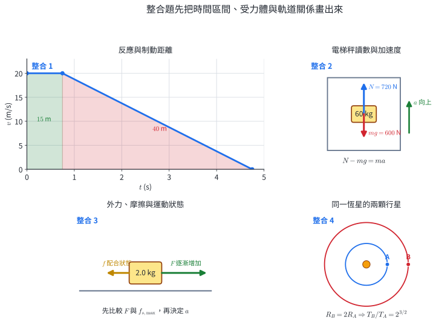{width=98%}

::: solution
### 第 1 題

首尾座標為 $-20\ \mathrm m$ 與 $-4\ \mathrm m$：

$$
\Delta x=-4-(-20)=+16\ \mathrm m.
$$

兩段路徑長分別是 $|12-(-20)|=32\ \mathrm m$ 與 $|-4-12|=16\ \mathrm m$，所以

$$
s=32+16=48\ \mathrm m.
$$

$$
\bar v=\frac{16}{12.0}=+1.33\ \mathrm{m/s},
\qquad
\bar u=\frac{48}{12.0}=4.00\ \mathrm{m/s}.
$$

平均速度的正號對應向 $+x$；平均速率使用全路徑長。
:::

::: solution
### 第 2 題

$$
a=\frac{v_f-v_i}{\Delta t}
=\frac{2.0-(-4.0)}{2.0}
=+3.0\ \mathrm{m/s^2}.
$$

由 $v=-4.0+3.0t$，令 $v=0$ 得 $t=4/3\ \mathrm s$。在此之前 $v<0$、$a>0$，速率由 $4.0\ \mathrm{m/s}$ 降至零；之後 $v>0$、$a>0$，速率由零增至 $2.0\ \mathrm{m/s}$。速度穿越零表示運動方向反轉。
:::

::: solution
### 第 3 題

圖 3A 的三段斜率為

$$
v_1=\frac{4-(-2)}{2}=+3\ \mathrm{m/s},
$$

$$
v_2=\frac{4-4}{5-2}=0,
\qquad
v_3=\frac{-2-4}{8-5}=-2\ \mathrm{m/s}.
$$

首尾位置都是 $-2\ \mathrm m$，所以 $\Delta x=0$，$\bar v=0/8=0$。路徑長為 $6+0+6=12\ \mathrm m$。
:::

::: solution
### 第 4 題

圖 3B 的斜率為

$$
a=\frac{6-2}{4}=1.0\ \mathrm{m/s^2}.
$$

圖下面積為

$$
\Delta x=(2)(4)+\frac{1}{2}(4)(4)=16\ \mathrm m.
$$

$$
\bar v=\frac{\Delta x}{\Delta t}=\frac{16}{4}=4.0\ \mathrm{m/s}.
$$

線性變化的端點平均 $(2+6)/2=4.0\ \mathrm{m/s}$ 也得到同一結果。
:::

::: solution
### 第 5 題

取向下為正。由靜止釋放，

$$
20=\frac{1}{2}(10)t^2
\Rightarrow t=2.0\ \mathrm s.
$$

當時

$$
v=gt=(10)(2.0)=20\ \mathrm{m/s},
$$

方向向下。以平均速度 $10\ \mathrm{m/s}$ 乘 $2.0\ \mathrm s$，位移為 $20\ \mathrm m$，與已知高度相符。
:::

::: solution
### 第 6 題

從地面參考系看，球原本靜止，又幾乎沒有水平合力，因此初期保持接近靜止。台車向右加速後會移到球的右側。

從車上看，參考系本身向右加速，球相對於車向左移動。兩個描述對應同一件事：球維持原運動狀態，車改變了速度。
:::

::: solution
### 第 7 題

$$
m=\frac{F}{a}=\frac{4.0}{2.0}=2.0\ \mathrm{kg}.
$$

合力改為 $6.0\ \mathrm N$ 時，

$$
a=\frac{6.0}{2.0}=3.0\ \mathrm{m/s^2}.
$$

合力與加速度的增加比例均為 $1.5$。
:::

::: solution
### 第 8 題

第三定律給出 B 對 A 的力為 $180\ \mathrm N$ 向左。取向右為正：

$$
a_A=\frac{-180}{50}=-3.6\ \mathrm{m/s^2},
$$

$$
a_B=\frac{+180}{75}=+2.4\ \mathrm{m/s^2}.
$$

力對大小相等、方向相反；加速度的不同來自兩人質量不同。
:::

::: solution
### 第 9 題

受力圖包含向下重力 $mg$、向上正向力 $N$、向右推力 $20\ \mathrm N$ 與向左摩擦力 $5.0\ \mathrm N$。鉛直無加速度：

$$
N-mg=0\Rightarrow N=(3.0)(10)=30\ \mathrm N.
$$

水平方向：

$$
20-5.0=(3.0)a
\Rightarrow a=5.0\ \mathrm{m/s^2}向右.
$$
:::

::: solution
### 第 10 題

箱子靜止，鉛直合力為零。受力為 $N$ 向上，$mg=50\ \mathrm N$ 與手掌作用力 $15\ \mathrm N$ 向下：

$$
N-mg-15=0,
$$

$$
N=50+15=65\ \mathrm N.
$$

額外向下力增加地面需提供的支撐。
:::

::: solution
### 第 11 題

$$
\Delta L=4.0\ \mathrm{cm}=0.040\ \mathrm m,
$$

$$
F_s=k\Delta L=(150)(0.040)=6.0\ \mathrm N.
$$

彈簧被拉長時，它對右端物體的力指向左，使右端趨向自然長度位置。
:::

::: solution
### 第 12 題

外力 $7.0\ \mathrm N<f_{s,\max}$ 時，靜摩擦力自動取 $7.0\ \mathrm N$ 且方向相反：

$$
F_{\mathrm{net}}=7.0-7.0=0,
\qquad a=0.
$$

外力 $10\ \mathrm N>f_{s,\max}$ 時，物體滑動，摩擦力大小為 $6.0\ \mathrm N$：

$$
F_{\mathrm{net}}=10-6.0=4.0\ \mathrm N,
\qquad
a=\frac{4.0}{2.0}=2.0\ \mathrm{m/s^2}.
$$

加速度方向與 $10\ \mathrm N$ 外力同向。
:::

::: solution
### 第 13 題

使用圖 10A 的切向與徑向關係：

- 最右端：逆時針切向為向上，所以速度向上；圓心在左，所以加速度與合力向左。
- 最上端：逆時針切向為向左，所以速度向左；圓心在下，所以加速度與合力向下。

速度與加速度在這兩個位置都互相垂直。
:::

::: solution
### 第 14 題

根據克卜勒第二定律，相等時間掃過相等面積，所以 C–D 也掃過面積 $S$。

近日點的太陽—行星距離較短。在掃過面積與時間都相同的條件下，A–B 的軌道弧長較長，平均速率也較大；C–D 弧長較短，平均速率較小。
:::

::: solution
### 第 15 題

繞同一恒星時，

$$
\frac{a_A^3}{T_A^2}=\frac{a_B^3}{T_B^2},
$$

$$
\left(\frac{T_B}{T_A}\right)^2
=\left(\frac{a_B}{a_A}\right)^3
=4^3=64,
$$

$$
\frac{T_B}{T_A}=8.
$$
:::

::: solution
### 第 16 題

逐一計算：

$$
\left(\frac{a^3}{T^2}\right)_P=\frac{1^3}{1^2}=1,
\qquad
\left(\frac{a^3}{T^2}\right)_Q=\frac{4^3}{8^2}=1,
$$

$$
\left(\frac{a^3}{T^2}\right)_R=\frac{9^3}{27^2}=1.
$$

三者比值相同，支持繞同一中心天體時 $a^3/T^2$ 為常數。從這組資料找出共同關係是歸納。
:::

::: solution
### 整合題 1

解題圖 A 將反應期間畫成高 $20\ \mathrm{m/s}$、寬 $0.75\ \mathrm s$ 的長方形：

$$
d_r=(20)(0.75)=15\ \mathrm m.
$$

制動時間由 $0=20+(-5.0)t_b$ 得 $t_b=4.0\ \mathrm s$。制動區是底 $4.0\ \mathrm s$、高 $20\ \mathrm{m/s}$ 的三角形：

$$
d_b=\frac{1}{2}(4.0)(20)=40\ \mathrm m.
$$

$$
d_{\mathrm{total}}=15+40=55\ \mathrm m.
$$

$v$--$t$ 圖的兩塊面積分別對應反應與制動位移。
:::

::: solution
### 整合題 2

使用解題圖 B，以人為受力體，向上正向力 $N=720\ \mathrm N$，向下重力 $mg=(60)(10)=600\ \mathrm N$。取向上為正：

$$
N-mg=ma,
$$

$$
720-600=60a
\Rightarrow a=+2.0\ \mathrm{m/s^2}.
$$

一秒後的速度為

$$
v=v_0+at=-3.0+(2.0)(1.0)=-1.0\ \mathrm{m/s}.
$$

末速度仍為負，電梯仍向下移動；速率由 $3.0$ 降為 $1.0\ \mathrm{m/s}$。加速度向上且速度向下，因此速率減小。
:::

::: solution
### 整合題 3

第一階段，$5.0\ \mathrm N<f_{s,\max}$，靜摩擦力為 $5.0\ \mathrm N$ 向左：

$$
F_{\mathrm{net},1}=5.0-5.0=0,
\qquad a_1=0.
$$

物體在這 $2.0\ \mathrm s$ 保持靜止，$v_1=0$、$\Delta x_1=0$。

第二階段，$10\ \mathrm N>f_{s,\max}$，物體滑動，$f_k=6.0\ \mathrm N$ 向左：

$$
F_{\mathrm{net},2}=10-6.0=4.0\ \mathrm N,
\qquad
a_2=\frac{4.0}{2.0}=2.0\ \mathrm{m/s^2}.
$$

這階段從靜止開始且維持 $3.0\ \mathrm s$：

$$
v_f=0+(2.0)(3.0)=6.0\ \mathrm{m/s},
$$

$$
\Delta x_2=\frac{1}{2}(2.0)(3.0)^2=9.0\ \mathrm m.
$$

全程位移為 $9.0\ \mathrm m$ 向右，末速度為 $6.0\ \mathrm{m/s}$ 向右。
:::

::: solution
### 整合題 4

使用解題圖 D。兩行星繞同一恒星，所以

$$
\left(\frac{T_B}{T_A}\right)^2
=\left(\frac{R_B}{R_A}\right)^3
=2^3=8.
$$

$$
T_B=T_A\sqrt8
=(3.00)(2\sqrt2)
\approx8.49\ \text{年}.
$$

觀測值 $8.5$ 年與模型預測 $8.49$ 年相符。在給定量測精度下，這份結果支持繞同一中心天體時 $T^2\propto R^3$ 的關係。
:::
