# 必物-5 能量

能量是跨尺度的計帳方法。物體加速、升高、摩擦升溫、電廠發電與核反應，看似是不同現象，都可先指定系統，再追蹤能量從哪裡進入、以什麼形式儲存、往哪裡移出。這套方法能分析煞車距離、遊樂設施速度、電器耗能、儲能效率與輻射安全。

本章採用下列約定：近地面重力場取 $g=9.8\ \mathrm{m/s^2}$；題目標示「取 $g=10\ \mathrm{m/s^2}$」時依題意計算。溫差可用 $^\circ\mathrm C$ 或 K 表示；溫度的倍數關係使用 K。能量與功的 SI 單位都是焦耳（J），功率單位是瓦特（W），$1\ \mathrm W=1\ \mathrm{J/s}$。

::: learning-map
### 本章問題與能力

1. 力經過一段位移時，如何由方向、距離或圖面積計算轉移的能量？
2. 如何用動能、位能與內能描述宏觀運動及微觀粒子運動？
3. 如何先選系統，再以守恆式追蹤摩擦、加熱、發電與儲能的每一筆能量？
4. 如何用質量虧損、核子帳與輻射種類分析核反應及安全控制？

### 實際用途

功—動能定理可估算煞車與加速，力學能可預測軌道速度，量熱與效率可估算熱水器耗電，多段能量帳可比較發電與儲能，質能關係及穿透模型可分析核能與輻射防護。
:::

| 問題 | 先確定的量 | 能量帳 |
|---|---|---|
| 力使物體移動 | 力與位移的夾角 | $W=Fs\cos\theta$ |
| 速度或高度改變 | 初、末狀態與零位面 | $K=\frac12mv^2$，$U_g=mgh$ |
| 氣體溫度或粒子數改變 | 系統所含粒子與絕對溫度 | 溫度看平均動能，內能看總和 |
| 摩擦、加熱或機器轉換 | 系統邊界與能量流 | $E_i+E_{\mathrm{in}}=E_f+E_{\mathrm{out}}$ |
| 核反應放能 | 反應前後總質量 | $E=\Delta mc^2$ |

## 1　功、功率與能量形式

### 1.1 功：力透過位移轉移能量

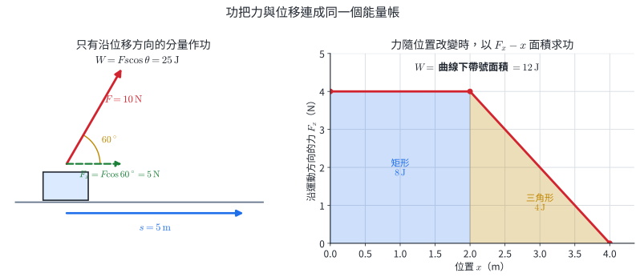

物體受到恆力 $\vec F$，位移為 $\vec s$，兩向量夾角為 $\theta$。把力分解成沿位移與垂直位移的分量：

$$
F_\parallel=F\cos\theta,
\qquad
F_\perp=F\sin\theta.
$$

垂直位移的分量沒有沿該方向的位移，常力所作的功為

$$
W=F_\parallel s=Fs\cos\theta=\vec F\cdot\vec s.
$$

- $0^\circ\leq\theta<90^\circ$：$W>0$，該力向系統輸入機械能。
- $\theta=90^\circ$：$W=0$，例如等速率圓周運動的向心力。
- $90^\circ<\theta\leq180^\circ$：$W<0$，該力使物體的動能傾向減少。

功的正負屬於「某一個力」與「這段位移」的關係。同一段運動中，重力、支持力、拉力與摩擦力可各自作正功、負功或零功。

力隨位置改變時，把路徑切成許多小段，每小段近似有 $\Delta W=F_x\Delta x$。相加後得到

$$
W=\int_{x_i}^{x_f}F_x(x)\,dx,
$$

其幾何意義是 $F_x-x$ 圖中曲線與橫軸之間的帶號面積。橫軸上方為正，橫軸下方為負。

#### 示範 1　斜向拉行李箱

質量 $20\ \mathrm{kg}$ 的行李箱在水平地面向右移動 $6.0\ \mathrm m$。拉力大小 $50\ \mathrm N$，與水平夾 $37^\circ$；動摩擦力為 $24\ \mathrm N$。取 $\cos37^\circ=0.80$。

1. 圖中的位移向右，拉力沿位移分量為 $50\times0.80=40\ \mathrm N$。
2. 拉力作功

   $$W_F=50(6.0)\cos37^\circ=240\ \mathrm J.$$

3. 摩擦力與位移反向：

   $$W_f=-24(6.0)=-144\ \mathrm J.$$

4. 重力與支持力都垂直水平位移，兩者作功皆為 $0$。
5. 合功為 $W_{\mathrm{net}}=240-144=96\ \mathrm J$。

#### 示範 2　由力—位置圖求功

物體從 $x=0$ 移到 $x=4.0\ \mathrm m$。$0$ 到 $2.0\ \mathrm m$ 間 $F_x=4.0\ \mathrm N$；其後力線性降至 $0$。

矩形面積為 $4.0\times2.0=8.0\ \mathrm J$，三角形面積為 $\frac12(2.0)(4.0)=4.0\ \mathrm J$，所以

$$
W=8.0+4.0=12\ \mathrm J.
$$

### 1.2 動能與功—動能定理

質量 $m$、速率 $v$ 的物體具有動能

$$
K=\frac12mv^2.
$$

動能取決於速率，方向改變而速率不變時，動能不變。速率加倍時，動能成為四倍。

沿直線運動且合力固定時，$\sum F=ma$。利用運動學關係 $v_f^2-v_i^2=2as$：

$$
W_{\mathrm{net}}=(\sum F)s=mas
=\frac12m(v_f^2-v_i^2)
=K_f-K_i.
$$

因此一般情況仍可寫成

$$
\boxed{W_{\mathrm{net}}=\Delta K}.
$$

功—動能定理直接連接「一段路徑上所有力的合功」與「初末速率」，適合分析煞車、推車、碰撞前後加速與變力問題。

#### 示範 3　煞車所需的平均力

質量 $1000\ \mathrm{kg}$ 的汽車由 $20\ \mathrm{m/s}$ 煞停，煞車距離為 $50\ \mathrm m$，路面對車的平均水平合力與位移反向。

$$
W_{\mathrm{net}}=\Delta K=0-\frac12(1000)(20)^2=-2.0\times10^5\ \mathrm J.
$$

若以平均力表示：

$$
-F_{\mathrm{avg}}(50)=-2.0\times10^5,
\qquad
F_{\mathrm{avg}}=4.0\times10^3\ \mathrm N.
$$

速率若增為兩倍且平均煞車力相同，初動能成為四倍，煞車距離也成為四倍。

### 1.3 重力位能、彈性位能與機械能

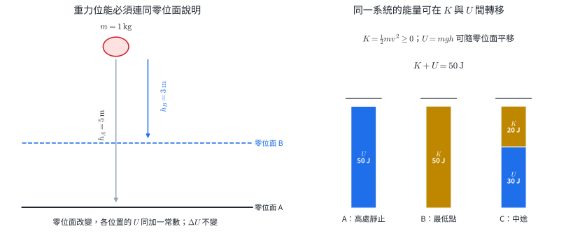

近地面重力大小近似固定。把物體與地球合併成系統，選定高度 $h=0$ 的零位面，重力位能定義為

$$
U_g=mgh.
$$

物體從 $h_i$ 移到 $h_f$ 時，重力作功為

$$
W_g=mg(h_i-h_f)=-\Delta U_g.
$$

零位面可依題目選擇。零位面改變會讓每一狀態的 $U_g$ 同加一個常數，位能差 $\Delta U_g$ 與可求得的速度保持相同。

彈簧在彈性限度內符合胡克定律 $F=-kx$。由力—位置面積可得彈性位能

$$
U_s=\frac12kx^2,
$$

其中 $x$ 是相對平衡位置的伸長或壓縮量。物體的動能與系統的位能合稱機械能：

$$
E_{\mathrm{mech}}=K+U_g+U_s.
$$

#### 示範 4　零位面的選擇

質量 $2.0\ \mathrm{kg}$ 的物體從地面上方 $8.0\ \mathrm m$ 降到 $3.0\ \mathrm m$，取 $g=10\ \mathrm{m/s^2}$。

以地面為零位面：$U_i=160\ \mathrm J$，$U_f=60\ \mathrm J$。重力位能變化為

$$
\Delta U_g=60-160=-100\ \mathrm J.
$$

若改以 $3.0\ \mathrm m$ 高度為零位面，$U_i=100\ \mathrm J$、$U_f=0$，仍有 $\Delta U_g=-100\ \mathrm J$；重力作功為 $+100\ \mathrm J$。

### 1.4 功率、電能度數與效率

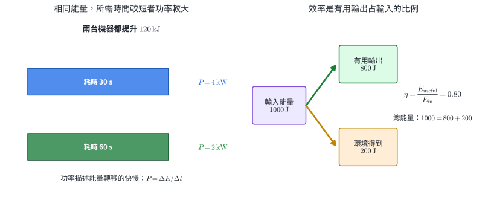

平均功率是能量轉移量除以所需時間：

$$
P_{\mathrm{avg}}=\frac{W}{\Delta t}=\frac{\Delta E}{\Delta t}.
$$

恆力與速度同方向時，$W=Fs$ 且 $s=v\Delta t$，所以瞬時功率可寫成 $P=Fv$；一般向量式為 $P=\vec F\cdot\vec v$。

電費常用千瓦小時（kWh）作為能量單位：

$$
1\ \mathrm{kWh}=(1000\ \mathrm W)(3600\ \mathrm s)
=3.6\times10^6\ \mathrm J.
$$

裝置的效率為

$$
\eta=\frac{E_{\mathrm{useful}}}{E_{\mathrm{in}}}
=\frac{P_{\mathrm{useful}}}{P_{\mathrm{in}}}.
$$

有用輸出的判定取決於任務。燈具的有用輸出是照明所需的可見光；熱水器的有用輸出是水增加的內能。其餘能量仍流向裝置或環境。

#### 示範 5　抽水馬達

馬達在 $25\ \mathrm s$ 內把 $200\ \mathrm{kg}$ 的水提升 $15\ \mathrm m$，取 $g=10\ \mathrm{m/s^2}$。輸入電功率為 $1.5\ \mathrm{kW}$。

水增加的重力位能：

$$
\Delta U_g=mgh=(200)(10)(15)=3.0\times10^4\ \mathrm J.
$$

有用輸出功率為 $3.0\times10^4/25=1.2\times10^3\ \mathrm W$，效率

$$
\eta=\frac{1.2\ \mathrm{kW}}{1.5\ \mathrm{kW}}=0.80=80\%.
$$

### 本節練習

1. 水平推力 $30\ \mathrm N$ 使箱子向右移動 $4.0\ \mathrm m$，推力作功多少？
2. 人以 $80\ \mathrm N$ 的力提著書包等速水平前進 $10\ \mathrm m$，提力對書包作功多少？
3. $F_x-x$ 圖在 $0$ 至 $3.0\ \mathrm m$ 為 $+6.0\ \mathrm N$，在 $3.0$ 至 $5.0\ \mathrm m$ 為 $-2.0\ \mathrm N$。總功多少？
4. $2.0\ \mathrm{kg}$ 物體速率由 $3.0\ \mathrm{m/s}$ 增至 $7.0\ \mathrm{m/s}$，合功多少？
5. $0.50\ \mathrm{kg}$ 球位於零位面上方 $12\ \mathrm m$，取 $g=10\ \mathrm{m/s^2}$。其重力位能多少？若零位面上移 $2.0\ \mathrm m$，位能改為多少？
6. $1200\ \mathrm W$ 電器運作 $15\ \mathrm{min}$，耗能多少 J、多少 kWh？

答案：1. $120\ \mathrm J$。2. $0$。3. $14\ \mathrm J$。4. $40\ \mathrm J$。5. $60\ \mathrm J$；$50\ \mathrm J$。6. $1.08\times10^6\ \mathrm J=0.30\ \mathrm{kWh}$。

## 2　微觀尺度下的能量

### 2.1 理想氣體模型、溫度與內能

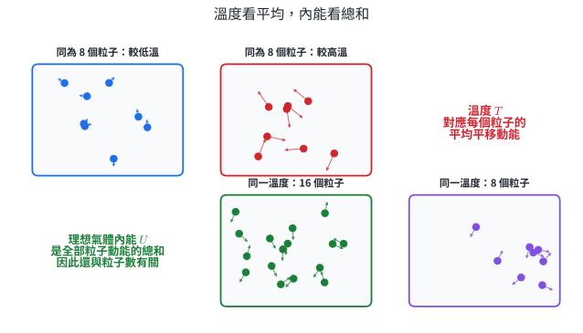

理想氣體模型把氣體描述成大量持續無規則運動的粒子，採用下列條件：

1. 粒子本身體積相對容器可忽略。
2. 除碰撞瞬間外，粒子間作用力可忽略。
3. 粒子彼此及與容器壁的碰撞為彈性碰撞。
4. 粒子運動方向無規則，宏觀壓力來自粒子撞擊器壁。

溫度反映粒子無規則運動的平均動能。理想氣體的內能是所有粒子動能的總和，因此同溫度、粒子數較多的樣品具有較多內能。真實氣體還可能包含分子間位能，尤其在高壓或接近液化時，理想氣體近似的誤差會增大。

| 比較 | 微觀判讀 |
|---|---|
| 同一種氣體、同粒子數，溫度較高 | 平均分子動能較大，內能較大 |
| 同一種氣體、同溫度，粒子數較多 | 平均分子動能相同，總內能較大 |
| 同一杯水達熱平衡 | 分子仍持續運動，宏觀溫度保持穩定 |

布朗運動是懸浮微粒受到周圍分子不均勻碰撞而呈現的曲折運動。可見微粒的軌跡提供分子持續運動的間接證據。

#### 示範 6　平均與總和

A、B 兩個容器裝同種理想氣體。A 有 $N$ 個粒子、溫度 $300\ \mathrm K$；B 有 $2N$ 個粒子、溫度也為 $300\ \mathrm K$。

- 兩容器每粒子的平均動能相同。
- B 的粒子數是 A 的兩倍，所以 B 的總內能是 A 的兩倍。

若 A 升到 $600\ \mathrm K$ 而粒子數不變，A 的平均動能與內能都變為原來兩倍。

### 2.2 熱與熱平衡

熱是因溫度差而在系統間傳遞的能量。兩物體接觸時，淨能量由高溫物體流向低溫物體；達到相同溫度後稱為熱平衡，巨觀上不再有淨熱傳。

物體的內能可以藉由兩種途徑改變：外界對系統作功，或系統與外界因溫差交換熱。例如壓縮氣體、摩擦與攪拌可藉作功增加內能；加熱器則以能量傳遞使水的內能增加。

微波爐中的交變電場促使極性水分子反覆轉向，分子碰撞使無規則運動能量增加。食物中含水量與形狀不同，吸收與散熱條件也不同，因此加熱可能不均勻。

#### 示範 7　兩杯水混合的方向判斷

絕熱容器中有 $200\ \mathrm g$、$80^\circ\mathrm C$ 的水與 $200\ \mathrm g$、$20^\circ\mathrm C$ 的水。兩者比熱相同且容器吸熱忽略。

高溫水失去的能量等於低溫水得到的能量：

$$
mc(80-T_f)=mc(T_f-20).
$$

約去相同的 $mc$，得 $T_f=50^\circ\mathrm C$。末溫介於兩個初溫之間，符合能量由高溫端流向低溫端的判讀。

### 2.3 絕對溫標

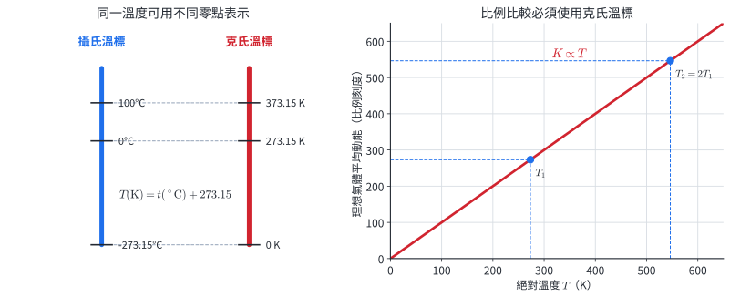

攝氏溫標與克氏溫標每一度的大小相同，零點不同：

$$
T(\mathrm K)=t(^\circ\mathrm C)+273.15.
$$

$0\ \mathrm K$ 稱為絕對零度，是古典理想氣體模型中平均平移動能趨近最低的理論界線。理想氣體分子的平均平移動能與絕對溫度成正比，因此溫度倍數必須用 K 比較。

#### 示範 8　攝氏差值與克氏倍數

氣體由 $27^\circ\mathrm C$ 升到 $327^\circ\mathrm C$。兩個溫度分別約為 $300\ \mathrm K$ 與 $600\ \mathrm K$，所以平均分子動能成為兩倍。攝氏讀數由 27 變成 327，直接以 $327/27$ 比較沒有絕對溫度的物理意義。

### 本節練習

1. 同種理想氣體的兩個樣品，A 有 $N$ 個粒子、B 有 $3N$ 個粒子，兩者同溫。比較平均分子動能與總內能。
2. 將 $25^\circ\mathrm C$、$-40^\circ\mathrm C$ 分別換算成 K。
3. 理想氣體由 $250\ \mathrm K$ 升至 $500\ \mathrm K$，平均分子動能成為幾倍？
4. 同質量、同材質的金屬塊分別為 $80^\circ\mathrm C$ 與 $20^\circ\mathrm C$，接觸且與外界絕熱。熱的淨傳遞方向為何？達平衡後兩塊內部粒子是否停止運動？
5. A 杯有 $100\ \mathrm g$、$60^\circ\mathrm C$ 的水；B 杯有 $300\ \mathrm g$、$60^\circ\mathrm C$ 的水。比較溫度、平均分子動能與總內能。
6. 說明布朗運動中顯微鏡下可見微粒的曲折軌跡所提供的證據。

答案：1. 平均動能相同；B 的總內能為 A 的三倍。2. $298.15\ \mathrm K$；$233.15\ \mathrm K$。3. 兩倍。4. 由 $80^\circ\mathrm C$ 物體流向 $20^\circ\mathrm C$ 物體；粒子仍持續運動。5. 溫度與平均動能相同；B 的總內能較大，在理想化同狀態近似下約為三倍。6. 周圍分子持續無規則運動並以不均勻碰撞推動微粒。

## 3　能量守恆與能量轉換

### 3.1 先指定系統，再寫能量帳

能量守恆指封閉系統的總能量保持不變。分析實際問題時，先畫出系統邊界，再把跨越邊界的能量列入：

$$
\boxed{E_i+E_{\mathrm{in}}=E_f+E_{\mathrm{out}}}.
$$

$E_i$、$E_f$ 是系統初、末儲存的能量；$E_{\mathrm{in}}$、$E_{\mathrm{out}}$ 是藉作功、電流、熱傳或輻射跨越邊界的能量。同一現象採用不同系統，帳的寫法會改變，最後可觀測結果必須一致。

例如把「球」當系統，下降時重力是外力，重力對球作正功；把「球＋地球」當系統，重力作用位於系統內部，帳上呈現為重力位能轉為動能。

### 3.2 力學能守恆

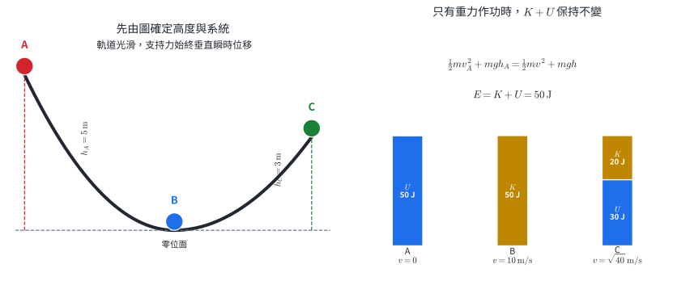

對物體使用功—動能定理：

$$
\Delta K=W_g+W_{\mathrm{other}}.
$$

重力作功 $W_g=-\Delta U_g$，代入後得到

$$
\Delta K+\Delta U_g=W_{\mathrm{other}}.
$$

當其他力的總功為零，例如光滑固定軌道的支持力始終垂直位移，便有

$$
\boxed{K_i+U_i=K_f+U_f}.
$$

若系統也含理想彈簧，則把 $U_s$ 加入。力學能守恆的條件可表述為：系統內只有重力、理想彈力等保守作用在動能與位能間轉換；跨系統邊界的外力作功為零，且沒有摩擦造成的熱能增加。

#### 示範 9　滑板通過光滑 U 形軌道

質量 $1.0\ \mathrm{kg}$ 的滑板由 A 點靜止下滑，A 比最低點 B 高 $5.0\ \mathrm m$，C 比 B 高 $3.0\ \mathrm m$。軌道光滑，取 $g=10\ \mathrm{m/s^2}$。

選滑板與地球為系統，以 B 為重力位能零位面。

在 B 點：

$$
mgh_A=\frac12mv_B^2,
\qquad
v_B=\sqrt{2gh_A}=10\ \mathrm{m/s}.
$$

在 C 點：

$$
mgh_A=\frac12mv_C^2+mgh_C,
$$

$$
v_C=\sqrt{2g(h_A-h_C)}=\sqrt{40}\approx6.3\ \mathrm{m/s}.
$$

質量在方程兩側約去，表示相同初始高度與相同軌道條件下，理想模型預測速度與質量無關。

#### 示範 10　外力提升物體

起重機使 $500\ \mathrm{kg}$ 貨物由靜止開始，上升 $8.0\ \mathrm m$ 後速率為 $4.0\ \mathrm{m/s}$。取 $g=10\ \mathrm{m/s^2}$，忽略阻力。

貨物與地球系統的機械能增加量為

$$
\Delta E_{\mathrm{mech}}=\Delta K+\Delta U_g
=\frac12(500)(4.0)^2+(500)(10)(8.0)
=4.4\times10^4\ \mathrm J.
$$

這個能量由起重機對系統作功輸入，所以起重機作功 $4.4\times10^4\ \mathrm J$。

### 3.3 摩擦下的總能量守恆

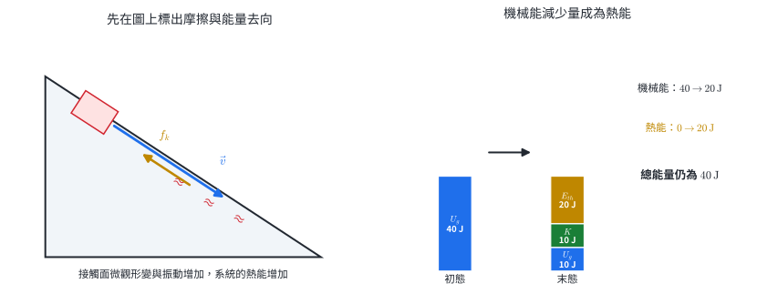

摩擦使接觸面的微觀形變與無規則振動增加，宏觀上表現為熱能增加。若物體與接觸面都包含在系統內，且與外界沒有能量交換：

$$
K_i+U_i+E_{{\mathrm{th}},i}
=K_f+U_f+E_{{\mathrm{th}},f}.
$$

熱能增加量等於機械能減少量：

$$
\Delta E_{\mathrm{th}}=-(\Delta K+\Delta U).
$$

總能量守恆並保留各種形式的總量；能量轉成大量粒子的無規則運動後，能夠整體轉回宏觀作功的比例通常降低。煞車碟升溫、輪胎與路面升溫、空氣擾動與聲音都可列入能量去向。

#### 示範 11　粗糙斜面上的滑塊

$2.0\ \mathrm{kg}$ 滑塊由靜止從高 $4.0\ \mathrm m$ 處滑下，到達高 $1.0\ \mathrm m$ 處時速率為 $4.0\ \mathrm{m/s}$。取 $g=10\ \mathrm{m/s^2}$。

初機械能為 $E_i=(2)(10)(4)=80\ \mathrm J$。末機械能為

$$
E_f=\frac12(2)(4)^2+(2)(10)(1)=16+20=36\ \mathrm J.
$$

因此物體與斜面增加的熱能為

$$
\Delta E_{\mathrm{th}}=80-36=44\ \mathrm J.
$$

### 3.4 作功、熱與內能

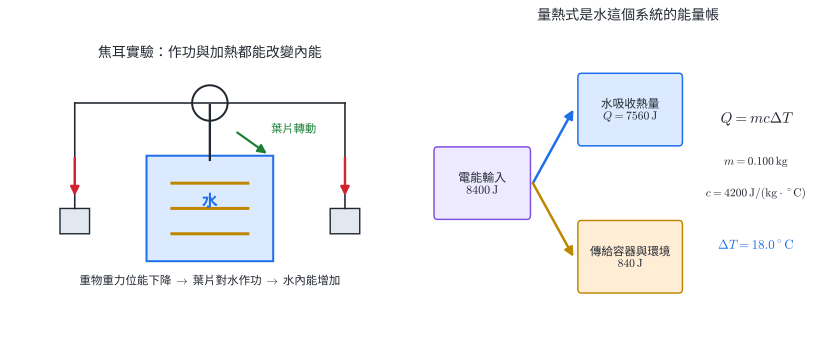

焦耳攪水實驗讓重物下降，透過滑輪帶動水中的葉片。重物減少的重力位能經葉片作功，最後成為水與容器增加的內能。實驗建立機械功與熱量可以用同一能量單位表示：

$$
1\ \mathrm{cal}\approx4.2\ \mathrm J.
$$

物質沒有發生相變、比熱可視為定值時，質量 $m$ 的物體溫度改變 $\Delta T$ 所交換的熱量大小為

$$
Q=mc\Delta T.
$$

此式描述特定系統吸收或放出的能量。加熱器的輸入能量還可能分給容器與環境，因而常搭配效率：

$$
\eta E_{\mathrm{electric}}=mc\Delta T.
$$

#### 示範 12　電熱器加熱水

$800\ \mathrm W$ 電熱器加熱 $0.50\ \mathrm{kg}$ 的水 $3.0\ \mathrm{min}$，水溫由 $20^\circ\mathrm C$ 升至 $75^\circ\mathrm C$。取水的比熱 $c=4200\ \mathrm{J/(kg\cdot{}^\circ C)}$。

輸入電能：

$$
E_{\mathrm{in}}=Pt=(800)(180)=1.44\times10^5\ \mathrm J.
$$

水吸收的能量：

$$
Q=mc\Delta T=(0.50)(4200)(55)=1.155\times10^5\ \mathrm J.
$$

效率為

$$
\eta=\frac{1.155\times10^5}{1.44\times10^5}
\approx0.802=80.2\%.
$$

其餘約 $2.85\times10^4\ \mathrm J$ 流向容器與環境。

### 3.5 能量轉換鏈與儲能

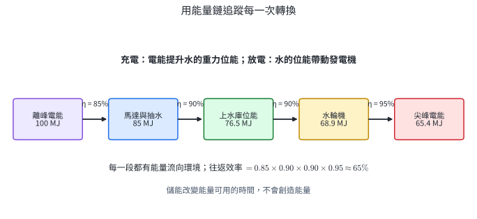

發電與用電裝置可用箭頭標示每一步能量形式：

- 水力發電：水的重力位能 $\rightarrow$ 水與渦輪的動能 $\rightarrow$ 電能。
- 火力發電：燃料化學能 $\rightarrow$ 內能 $\rightarrow$ 蒸汽與渦輪動能 $\rightarrow$ 電能。
- 太陽能電池：入射電磁能 $\rightarrow$ 電能。
- LED：電能 $\rightarrow$ 可見光與熱能。
- 抽蓄儲能：離峰電能 $\rightarrow$ 水的重力位能；尖峰時再反向轉換。

若各段效率分別為 $\eta_1,\eta_2,\ldots$，整條鏈的效率為

$$
\eta_{\mathrm{total}}=\eta_1\eta_2\cdots.
$$

#### 示範 13　多段轉換效率

儲能系統充電效率為 $85\%$，放電端水輪機效率 $90\%$、發電機效率 $95\%$。輸入 $200\ \mathrm{MJ}$ 電能後，可回收的電能為

$$
E_{\mathrm{out}}=(200)(0.85)(0.90)(0.95)
=145.35\ \mathrm{MJ}.
$$

往返效率為 $72.7\%$。儲能的功能是把可用能量移到另一時間，系統總輸出受各段效率共同限制。

### 本節練習

1. 球由靜止自 $20\ \mathrm m$ 高處落下，忽略空氣阻力，取 $g=10\ \mathrm{m/s^2}$。落地前速率多少？
2. 光滑軌道上物體在 A 點速率 $6.0\ \mathrm{m/s}$，移到比 A 高 $1.0\ \mathrm m$ 的 B 點。取 $g=10\ \mathrm{m/s^2}$，B 點速率多少？
3. $1.0\ \mathrm{kg}$ 物體由高 $5.0\ \mathrm m$ 處靜止下滑，到底端速率 $8.0\ \mathrm{m/s}$。取 $g=10\ \mathrm{m/s^2}$，熱能增加多少？
4. $0.20\ \mathrm{kg}$ 的水升溫 $30^\circ\mathrm C$，取 $c=4200\ \mathrm{J/(kg\cdot{}^\circ C)}$。水吸收多少能量？
5. $1000\ \mathrm W$、效率 $84\%$ 的加熱器，把 $0.50\ \mathrm{kg}$ 水升溫 $20^\circ\mathrm C$，至少需多少秒？
6. 某轉換鏈三段效率依序為 $80\%$、$75\%$、$90\%$。輸入 $1.0\ \mathrm{MJ}$，有用輸出多少？總效率多少？

答案：1. $20\ \mathrm{m/s}$。2. $4.0\ \mathrm{m/s}$。3. $18\ \mathrm J$。4. $2.52\times10^4\ \mathrm J$。5. $50\ \mathrm s$。6. $5.4\times10^5\ \mathrm J$；$54\%$。

## 4　質能互換與核能

### 4.1 質能關係與核反應帳

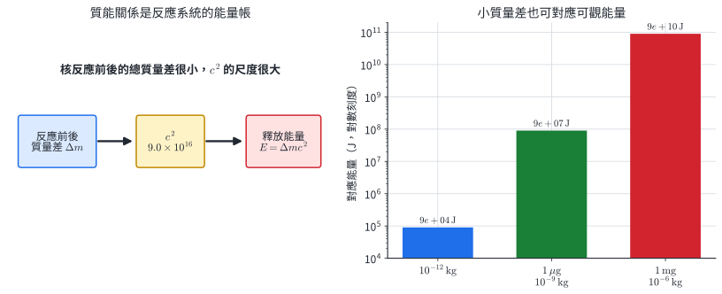

相對論指出，靜止質量 $m$ 對應靜止能量 $E_0=mc^2$。一個封閉反應系統若反應後粒子的總靜止質量比反應前少 $\Delta m$，差值對應到產物動能與電磁輻射等能量：

$$
\boxed{E_{\mathrm{released}}=\Delta mc^2},
\qquad c\approx3.0\times10^8\ \mathrm{m/s}.
$$

$c^2=9.0\times10^{16}\ \mathrm{m^2/s^2}$，所以很小的質量差也可對應可觀能量。核反應式另須核對兩套整數帳：

1. 質量數 $A$：質子數與中子數的總和。
2. 原子序 $Z$：質子數，也決定元素種類。

反應前後 $A$ 與 $Z$ 各自相等；精確靜止質量可以不同，差值進入質能關係。

#### 示範 14　質量虧損所對應的能量

某反應的總質量減少 $2.0\times10^{-11}\ \mathrm{kg}$。釋放能量為

$$
E=(2.0\times10^{-11})(3.0\times10^8)^2
=1.8\times10^6\ \mathrm J.
$$

單位核對：$\mathrm{kg\,m^2/s^2}=\mathrm J$。

### 4.2 核分裂、連鎖反應與發電

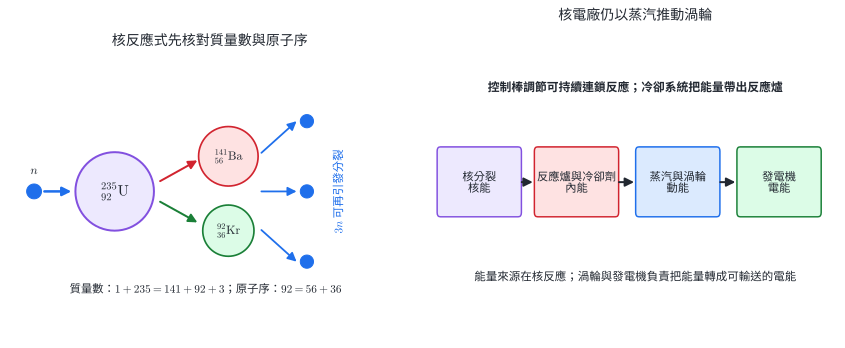

重原子核吸收中子後可分裂成較輕的原子核並放出中子與能量。圖中的一個示例為

$$
{}^1_0n+{}^{235}_{92}\mathrm U
\rightarrow{}^{141}_{56}\mathrm{Ba}
+{}^{92}_{36}\mathrm{Kr}+3{}^1_0n+E.
$$

質量數：$1+235=141+92+3$；原子序：$0+92=56+36$。釋出的中子可引發其他原子核分裂，形成連鎖反應。反應爐以控制棒吸收部分中子，使反應速率維持可控制；冷卻系統把內能帶出反應爐。

核能發電的主轉換鏈為

$$
\text{核能}\rightarrow\text{內能}\rightarrow
\text{蒸汽與渦輪動能}\rightarrow\text{電能}.
$$

核燃料能量密度高，運轉階段的直接溫室氣體排放較低；燃料開採、建廠、除役、放射性廢棄物與事故風險也須納入整體評估。

#### 示範 15　補全核反應式

$$
{}^1_0n+{}^{235}_{92}\mathrm U
\rightarrow{}^{144}_{56}\mathrm{Ba}
+{}^{89}_{Z}\mathrm X+3{}^1_0n.
$$

由原子序守恆：$92=56+Z$，得 $Z=36$，所以 X 是 Kr。質量數核對：$1+235=144+89+3=236$。完整產物為 ${}^{89}_{36}\mathrm{Kr}$。

### 4.3 游離輻射與安全

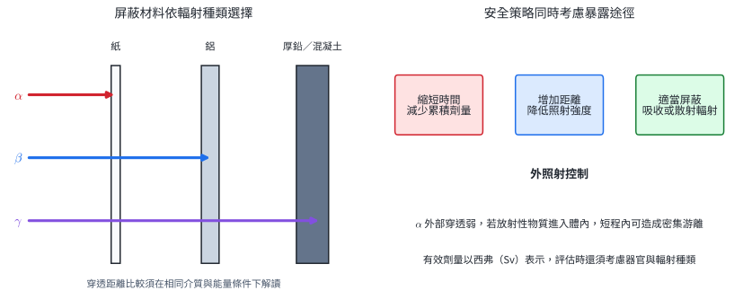

游離輻射能使物質中的原子或分子失去電子。核衰變常見的三類輻射為：

| 類型 | 本質 | 電荷 | 典型穿透與屏蔽 |
|---|---|---:|---|
| $\alpha$ | 氦原子核 ${}^4_2\mathrm{He}$ | $+2e$ | 空氣中射程短，紙或皮膚表層可阻擋 |
| $\beta^-$ | 高速電子 | $-e$ | 可穿過紙，常以適當厚度的塑膠或鋁屏蔽 |
| $\gamma$ | 高能電磁波 | 0 | 穿透較強，以厚鉛或混凝土降低強度 |

穿透力與游離密度是兩個不同指標。$\alpha$ 外照射常被皮膚表層阻擋；若放射性物質經呼吸或飲食進入體內，短射程內的密集游離會增加局部組織風險。

有效劑量單位為西弗（Sv），用來把吸收能量、輻射種類與組織敏感度納入風險尺度。外照射的基本控制是縮短時間、增加距離、使用合適屏蔽；污染控制還包括阻止放射性物質進入人體。

#### 示範 16　選擇屏蔽與操作方式

實驗需短時間操作密封的 $\gamma$ 射源。合理控制包括：先規劃步驟以縮短近源時間，使用夾具增加手與射源的距離，並把射源置於經設計的鉛屏蔽內。三項措施分別作用於暴露時間、到源距離與穿透衰減，彼此可以同時使用。

### 4.4 核融合

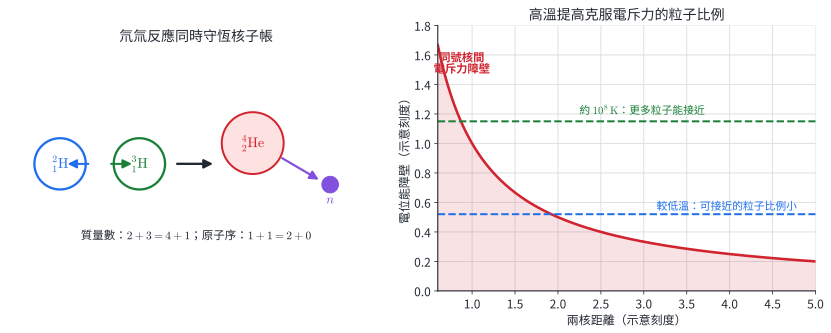

輕原子核結合成較重原子核的過程稱為核融合。氘氚反應可寫成

$$
{}^2_1\mathrm H+{}^3_1\mathrm H
\rightarrow{}^4_2\mathrm{He}+{}^1_0n+E.
$$

質量數 $2+3=4+1$，原子序 $1+1=2+0$。兩個原子核皆帶正電，接近時需克服電斥力；約 $10^8\ \mathrm K$ 的高溫可使較多粒子具有足夠動能接近到核力能發揮作用的距離。太陽核心以高溫與巨大重力約束維持融合。地面裝置還需同時處理高溫電漿約束、材料受中子照射、能量取出與持續穩定運轉等工程問題。

#### 示範 17　融合反應的核子帳

考慮

$$
{}^2_1\mathrm H+{}^2_1\mathrm H
\rightarrow{}^3_2\mathrm{He}+X.
$$

質量數：$2+2=3+A_X$，所以 $A_X=1$。原子序：$1+1=2+Z_X$，所以 $Z_X=0$。因此 $X={}^1_0n$。

### 本節練習

1. $1.0\times10^{-9}\ \mathrm{kg}$ 的質量差對應多少能量？
2. 在 ${}^{A}_{Z}\mathrm X$ 中，$A$ 與 $Z$ 各代表什麼？中子數如何表示？
3. 補全：${}^{238}_{92}\mathrm U\rightarrow{}^{234}_{90}\mathrm{Th}+X$。
4. 依序寫出核能電廠從核分裂到輸出電能的主要能量形式。
5. 分別為 $\alpha$、$\beta$、$\gamma$ 選擇紙、鋁、厚鉛／混凝土三種典型屏蔽，並指出增加距離主要降低哪一項暴露因素。
6. 核融合需要高溫的微觀原因為何？核對氘氚反應的質量數與原子序。

答案：1. $9.0\times10^7\ \mathrm J$。2. $A$ 為質量數，$Z$ 為原子序；中子數 $A-Z$。3. ${}^4_2\mathrm{He}$，即 $\alpha$ 粒子。4. 核能、內能、蒸汽與渦輪動能、電能。5. 紙—$\alpha$，鋁—$\beta$，厚鉛／混凝土—$\gamma$；增加距離降低到達人體的照射強度。6. 增加具有足夠動能克服核間電斥力的粒子比例；$A:2+3=4+1$，$Z:1+1=2+0$。

## 5　章末代表題

### A　核心模型與單一情境

1. **常力作功**　人以 $40\ \mathrm N$ 的力拉箱子，拉力與水平位移夾 $60^\circ$，箱子水平移動 $5.0\ \mathrm m$。求拉力作功。

2. **力—位置圖**　某物體所受沿 $x$ 方向的合力，在 $x=0$ 到 $2.0\ \mathrm m$ 間由 $0$ 線性增加到 $6.0\ \mathrm N$，在 $x=2.0$ 到 $5.0\ \mathrm m$ 間維持 $6.0\ \mathrm N$。求合力作功。

3. **功—動能定理**　質量 $4.0\ \mathrm{kg}$ 的物體速率由 $2.0\ \mathrm{m/s}$ 增至 $6.0\ \mathrm{m/s}$。求這段過程的合功。

4. **功率與效率**　升降設備在 $20\ \mathrm s$ 內把 $800\ \mathrm{kg}$ 的貨物等速提升 $12\ \mathrm m$，輸入功率為 $6.0\ \mathrm{kW}$。取 $g=10\ \mathrm{m/s^2}$，求有用輸出功率與效率。

5. **平均動能與內能**　同種理想氣體 A 有 $N$ 個粒子、溫度 $300\ \mathrm K$；B 有 $2N$ 個粒子、溫度 $450\ \mathrm K$。求 B 與 A 的平均分子動能比及總內能比。

6. **絕對溫度**　某理想氣體初溫為 $27^\circ\mathrm C$。若平均分子動能變為三倍，末溫約為多少 $^\circ\mathrm C$？

7. **力學能守恆**　物體在光滑軌道 A 點高度 $7.0\ \mathrm m$、速率 $4.0\ \mathrm{m/s}$，移到高度 $2.0\ \mathrm m$ 的 B 點。取 $g=10\ \mathrm{m/s^2}$，求 B 點速率。

8. **摩擦與熱能**　$2.0\ \mathrm{kg}$ 滑塊由高 $5.0\ \mathrm m$ 處靜止下滑，到達零位面時速率為 $6.0\ \mathrm{m/s}$。取 $g=10\ \mathrm{m/s^2}$，求滑塊與斜面增加的熱能。

9. **量熱與效率**　$600\ \mathrm W$ 加熱器以 $75\%$ 效率加熱 $0.30\ \mathrm{kg}$ 的水，使水升溫 $25^\circ\mathrm C$。取 $c=4200\ \mathrm{J/(kg\cdot{}^\circ C)}$，求所需時間。

10. **多段能量轉換**　裝置三段效率依序為 $80\%$、$70\%$、$90\%$，輸入能量為 $2.0\ \mathrm{MJ}$。求總效率、有用輸出與流向環境的能量。

11. **質能關係**　核反應前後總質量減少 $5.0\times10^{-12}\ \mathrm{kg}$。求釋放能量。

12. **核反應與輻射**　核分裂反應

    $$
    {}^1_0n+{}^{235}_{92}\mathrm U
    \rightarrow{}^{140}_{54}\mathrm{Xe}
    +{}^{94}_{38}\mathrm{Sr}+x{}^1_0n
    $$

    求 $x$。若反應產物伴隨強 $\gamma$ 輻射，指出適合的屏蔽材料；再說明 $\alpha$ 放射性物質進入體內時須重視的原因。

### B　跨節整合題

13. **起重機：功、機械能、功率與效率**　起重機把 $600\ \mathrm{kg}$ 貨物由靜止提升 $15\ \mathrm m$，末速率為 $5.0\ \mathrm{m/s}$，全程 $30\ \mathrm s$。起重機效率為 $75\%$，取 $g=10\ \mathrm{m/s^2}$。求貨物與地球系統的機械能增加量、起重機輸入能量與輸入功率。

14. **雲霄飛車：位能、動能、摩擦熱與煞車**　$500\ \mathrm{kg}$ 車廂由高 $20\ \mathrm m$ 處靜止出發，到達高 $5.0\ \mathrm m$ 的平台入口時速率為 $8.0\ \mathrm{m/s}$。車廂隨後在同一高度煞停。取 $g=10\ \mathrm{m/s^2}$。求第一段摩擦造成的熱能增加、煞車段的熱能增加，以及從出發到停止的總熱能增加。

15. **核電廠：質能、效率與功率**　某核電機組輸出電功率 $900\ \mathrm{MW}$，核能到電能的整體效率為 $36\%$。每次核分裂的質量虧損為 $3.2\times10^{-28}\ \mathrm{kg}$。假設輸出維持 $1.0\ \mathrm h$，求所需核反應釋放能量、約發生多少次分裂，以及這些反應的總質量虧損。並寫出反應能到電能的主要轉換鏈。

16. **抽蓄儲能：效率、功率與質能尺度**　抽蓄系統在充電時輸入 $5.0\times10^{10}\ \mathrm J$，往返效率為 $68\%$。放電期間平均輸出功率為 $20\ \mathrm{MW}$。求可回收電能、可維持輸出的時間，以及這筆回收能量所對應的質量 $E/c^2$。

## 6　章末題完整詳解

### 第 1 題

位移水平向前，與拉力夾角已知，使用常力功：

$$
W=Fs\cos\theta=(40)(5.0)\cos60^\circ=100\ \mathrm J.
$$

拉力含有沿位移的正向分量，所以功為正。

### 第 2 題

合功等於 $F_x-x$ 圖的面積。前段是三角形，後段是矩形：

$$
W=\frac12(2.0)(6.0)+(5.0-2.0)(6.0)
=6.0+18=24\ \mathrm J.
$$

兩段都在橫軸上方，面積皆取正。

### 第 3 題

使用功—動能定理：

$$
W_{\mathrm{net}}=\Delta K
=\frac12m(v_f^2-v_i^2)
=\frac12(4.0)(6.0^2-2.0^2)
=64\ \mathrm J.
$$

末速率較大，動能增加，合功為正。

### 第 4 題

貨物等速上升，動能不變，有用輸出是增加的重力位能：

$$
\Delta U_g=mgh=(800)(10)(12)=9.6\times10^4\ \mathrm J.
$$

有用輸出功率：

$$
P_{\mathrm{useful}}=\frac{9.6\times10^4}{20}
=4.8\times10^3\ \mathrm W=4.8\ \mathrm{kW}.
$$

效率：

$$
\eta=\frac{4.8}{6.0}=0.80=80\%.
$$

### 第 5 題

理想氣體平均分子動能與絕對溫度成正比：

$$
\frac{\overline K_B}{\overline K_A}
=\frac{450}{300}=1.5.
$$

總內能還與粒子數成正比：

$$
\frac{U_B}{U_A}
=\frac{(2N)(450)}{N(300)}=3.0.
$$

B 的平均分子動能為 A 的 $1.5$ 倍，總內能為 A 的 $3.0$ 倍。

### 第 6 題

先轉為絕對溫度：$27^\circ\mathrm C\approx300\ \mathrm K$。平均動能成為三倍，因此

$$
T_f=3(300)=900\ \mathrm K.
$$

轉回攝氏：

$$
t_f=900-273.15=626.85^\circ\mathrm C
\approx627^\circ\mathrm C.
$$

### 第 7 題

軌道光滑，以物體與地球為系統，機械能守恆：

$$
\frac12mv_A^2+mgh_A
=\frac12mv_B^2+mgh_B.
$$

質量約去：

$$
v_B^2=v_A^2+2g(h_A-h_B)
=4.0^2+2(10)(7.0-2.0)=116.
$$

$$
v_B=\sqrt{116}\approx10.8\ \mathrm{m/s}.
$$

B 較低，重力位能下降並轉為動能，末速率大於初速率。

### 第 8 題

滑塊與地球、斜面合為系統。初態只有重力位能：

$$
E_i=mgh=(2.0)(10)(5.0)=100\ \mathrm J.
$$

到零位面時的動能：

$$
K_f=\frac12mv^2=\frac12(2.0)(6.0)^2=36\ \mathrm J.
$$

總能量守恆，差值成為熱能：

$$
\Delta E_{\mathrm{th}}=100-36=64\ \mathrm J.
$$

### 第 9 題

水所需能量：

$$
Q=mc\Delta T=(0.30)(4200)(25)=3.15\times10^4\ \mathrm J.
$$

加熱器的有用功率：

$$
P_{\mathrm{useful}}=\eta P_{\mathrm{in}}=0.75(600)=450\ \mathrm W.
$$

所需時間：

$$
t=\frac{Q}{P_{\mathrm{useful}}}
=\frac{3.15\times10^4}{450}=70\ \mathrm s.
$$

### 第 10 題

總效率是逐段效率相乘：

$$
\eta_{\mathrm{total}}=(0.80)(0.70)(0.90)=0.504=50.4\%.
$$

有用輸出：

$$
E_{\mathrm{useful}}=0.504(2.0\ \mathrm{MJ})
=1.008\ \mathrm{MJ}.
$$

流向環境的能量為

$$
E_{\mathrm{env}}=2.0-1.008=0.992\ \mathrm{MJ}.
$$

輸出與環境所得相加為原輸入 $2.0\ \mathrm{MJ}$。

### 第 11 題

$$
E=\Delta mc^2
=(5.0\times10^{-12})(3.0\times10^8)^2
=4.5\times10^5\ \mathrm J.
$$

### 第 12 題

先核對原子序：$92=54+38$，已平衡。質量數守恆給出

$$
1+235=140+94+x,
$$

所以 $236=234+x$，得 $x=2$。

$\gamma$ 穿透力較強，典型屏蔽採用足夠厚度的鉛或混凝土。$\alpha$ 粒子在物質中射程短、游離密度高；放射性物質進入體內後，能量可集中沉積於鄰近組織，因此須控制吸入與攝入。

### 第 13 題

選貨物與地球為系統。起重機輸入的有用機械能同時增加重力位能與動能：

$$
\Delta U_g=mgh=(600)(10)(15)=9.0\times10^4\ \mathrm J,
$$

$$
\Delta K=\frac12mv_f^2
=\frac12(600)(5.0)^2=7.5\times10^3\ \mathrm J.
$$

因此

$$
\Delta E_{\mathrm{mech}}=9.75\times10^4\ \mathrm J.
$$

效率 $\eta=E_{\mathrm{useful}}/E_{\mathrm{in}}$，所以

$$
E_{\mathrm{in}}=\frac{9.75\times10^4}{0.75}
=1.30\times10^5\ \mathrm J.
$$

輸入功率為

$$
P_{\mathrm{in}}=\frac{E_{\mathrm{in}}}{t}
=\frac{1.30\times10^5}{30}
\approx4.33\times10^3\ \mathrm W=4.33\ \mathrm{kW}.
$$

機械能增加量除以時間為有用功率 $3.25\ \mathrm{kW}$，也等於 $0.75P_{\mathrm{in}}$。

### 第 14 題

把車廂、地球與軌道合為系統，以地面為零位面。出發時總機械能：

$$
E_i=mgh_i=(500)(10)(20)=1.00\times10^5\ \mathrm J.
$$

平台入口的重力位能與動能為

$$
U_1=(500)(10)(5.0)=2.50\times10^4\ \mathrm J,
$$

$$
K_1=\frac12(500)(8.0)^2=1.60\times10^4\ \mathrm J.
$$

第一段末機械能為 $4.10\times10^4\ \mathrm J$，所以第一段熱能增加

$$
\Delta E_{{\mathrm{th}},1}=1.00\times10^5-4.10\times10^4
=5.90\times10^4\ \mathrm J.
$$

煞車時高度不變，動能 $1.60\times10^4\ \mathrm J$ 全部轉為熱能：

$$
\Delta E_{{\mathrm{th}},2}=1.60\times10^4\ \mathrm J.
$$

總熱能增加：

$$
\Delta E_{\mathrm{th},total}=5.90\times10^4+1.60\times10^4
=7.50\times10^4\ \mathrm J.
$$

停止時只剩 $2.50\times10^4\ \mathrm J$ 重力位能，與初能量差同樣是 $7.50\times10^4\ \mathrm J$。

### 第 15 題

輸出電功率 $P_e=900\ \mathrm{MW}=9.00\times10^8\ \mathrm W$。效率為

$$
\eta=\frac{E_e}{E_{\mathrm{nuclear}}}=0.36.
$$

一小時輸出的電能為

$$
E_e=P_et=(9.00\times10^8)(3600)
=3.24\times10^{12}\ \mathrm J.
$$

所需反應能：

$$
E_{\mathrm{nuclear}}=\frac{3.24\times10^{12}}{0.36}
=9.00\times10^{12}\ \mathrm J.
$$

每次分裂釋放的能量：

$$
E_1=(3.2\times10^{-28})(3.0\times10^8)^2
=2.88\times10^{-11}\ \mathrm J.
$$

分裂次數：

$$
N=\frac{9.00\times10^{12}}{2.88\times10^{-11}}
\approx3.13\times10^{23}.
$$

總質量虧損可由 $N\Delta m_1$ 或 $E/c^2$ 求得：

$$
\Delta m=N(3.2\times10^{-28})
\approx1.00\times10^{-4}\ \mathrm{kg}=0.100\ \mathrm g.
$$

主要轉換鏈為核分裂釋放的核能 $\rightarrow$ 反應爐與冷卻劑的內能 $\rightarrow$ 蒸汽與渦輪的動能 $\rightarrow$ 發電機輸出的電能。效率 $36\%$ 表示其餘能量主要由冷卻系統與環境帶走。

### 第 16 題

可回收電能：

$$
E_{\mathrm{out}}=0.68(5.0\times10^{10})
=3.4\times10^{10}\ \mathrm J.
$$

輸出功率 $20\ \mathrm{MW}=2.0\times10^7\ \mathrm W$，可維持時間：

$$
t=\frac{E_{\mathrm{out}}}{P}
=\frac{3.4\times10^{10}}{2.0\times10^7}
=1.7\times10^3\ \mathrm s
\approx28\ \mathrm{min}.
$$

以質能關係換算這筆能量的等效質量尺度：

$$
m_{\mathrm{eq}}=\frac{E}{c^2}
=\frac{3.4\times10^{10}}{9.0\times10^{16}}
\approx3.8\times10^{-7}\ \mathrm{kg}
=0.38\ \mathrm{mg}.
$$

抽蓄系統實際儲存的是水的重力位能；最後一項只用來比較能量與質量的數值尺度。

## 7　核心整理

1. 功是力透過位移轉移的能量：恆力用 $W=Fs\cos\theta$，變力用 $F_x-x$ 圖的帶號面積。
2. 合功改變動能：$W_{\mathrm{net}}=\Delta K$。近地面重力位能為 $U_g=mgh$，零位面改變不影響位能差。
3. 只有重力或理想彈力在系統內轉換時，$K+U$ 守恆；摩擦使部分機械能轉成熱能，總能量仍守恆。
4. 溫度反映粒子平均動能，內能是系統微觀能量的總和。理想氣體平均動能的倍數關係以克氏溫標判讀。
5. 熱是因溫差傳遞的能量；無相變且比熱固定時，$Q=mc\Delta T$。功率描述轉換速率，效率描述有用輸出比例。
6. 核反應先核對質量數與原子序，再以 $E=\Delta mc^2$ 連接質量虧損與釋放能量。
7. 輻射安全依種類與暴露途徑選擇時間、距離、屏蔽與污染控制；融合的高溫條件源自帶正電原子核間的電斥力。
