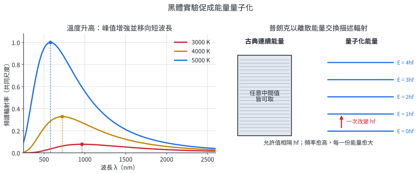
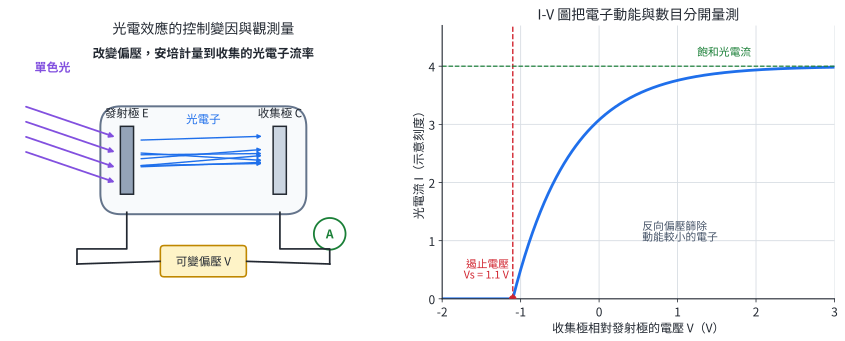
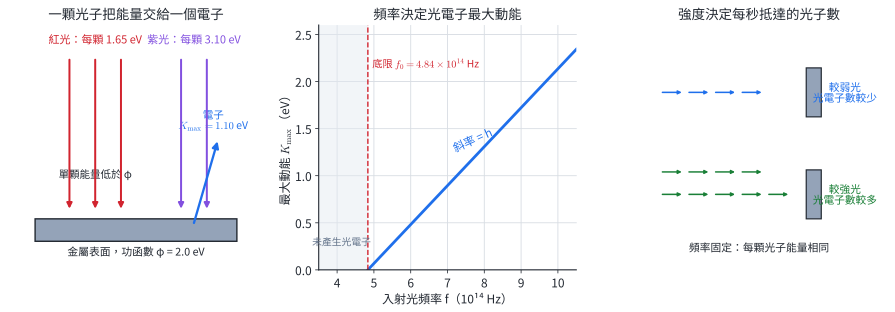
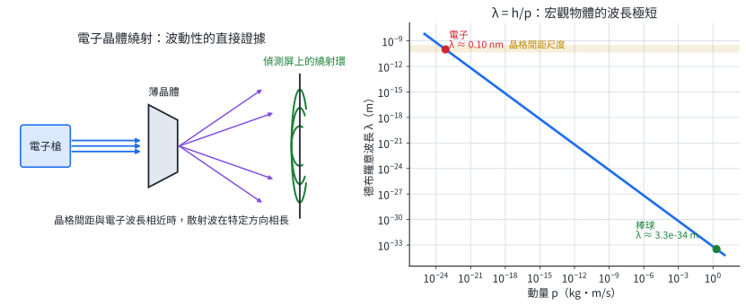
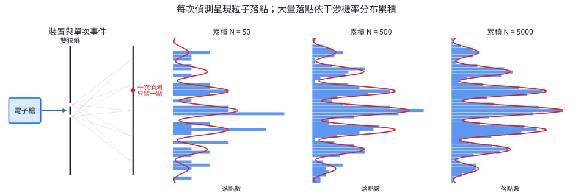
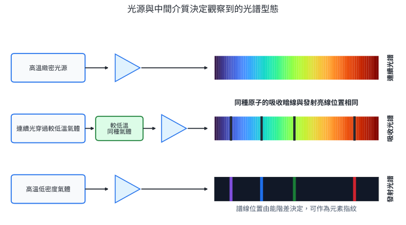
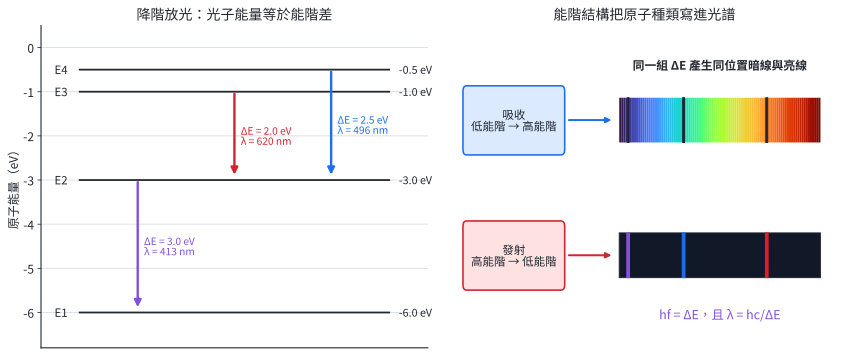

# 必物-6 量子現象

經典物理把光視為連續傳遞能量的波，也把電子視為沿明確軌跡運動的粒子。黑體輻射、光電效應、電子繞射與原子線光譜顯示：微觀系統交換能量時會出現離散單位，光與物質也會依實驗安排呈現波動或粒子特徵。本章從裝置、控制變因與觀測資料建立模型，再用模型計算光子能量、電子最大動能、物質波長與能階差。

本章使用

$$
h=6.63\times10^{-34}\ \mathrm{J\,s}
=4.14\times10^{-15}\ \mathrm{eV\,s},
\qquad
c=3.00\times10^8\ \mathrm{m/s},
$$

$$
e=1.60\times10^{-19}\ \mathrm C,
\qquad
1\ \mathrm{eV}=1.60\times10^{-19}\ \mathrm J.
$$

光在真空中的頻率與波長符合 $c=f\lambda$。常用換算式為

$$
E=hf=\frac{hc}{\lambda},
\qquad
E(\mathrm{eV})\approx \frac{1240}{\lambda(\mathrm{nm})}.
$$

::: learning-map
### 本章問題與能力

1. 黑體輻射與光電效應的資料，為何需要能量量子與光子模型？
2. 如何分辨入射光頻率與強度各自改變哪一個觀測量？
3. 如何由動量求物質波長，並由電子繞射與雙狹縫累積圖判讀波粒二象性？
4. 如何由光譜線反推原子的離散能階與躍遷能量？

### 實際用途

光子模型連接光感測器、太陽能電池與數位相機；電子物質波用於電子顯微鏡與晶體結構分析；元素的線光譜可辨認燈具、材料、恆星大氣與遙遠天體的化學組成。
:::

| 實驗或資料 | 直接觀測 | 建立的模型 |
|---|---|---|
| 黑體不同溫度的頻譜 | 峰值隨溫度改變，短波端不會無限增強 | 能量交換以 $hf$ 為單位 |
| 光電管的電流—電壓圖 | 底限頻率、遏止電壓、飽和電流 | 光子能量 $E=hf$ |
| 電子束通過晶體或雙狹縫 | 繞射環、逐點累積成干涉分布 | 物質波 $\lambda=h/p$ |
| 稀薄氣體的線光譜 | 只出現特定波長 | 原子能階與 $hf=\lvert\Delta E\rvert$ |

## 1　光電效應與光的粒子性

### 1.1 黑體輻射與能量量子化

黑體是能完全吸收入射電磁輻射的理想物體；達熱平衡後，它放出的輻射頻譜只由溫度決定。實驗顯示，溫度升高時總輻射增強，峰值也移向較短波長。若把振動體的能量視為任意連續值，經典模型會嚴重高估短波端的能量。

普朗克提出：頻率為 $f$ 的振動體只能以固定單位交換能量，

$$
E_n=nhf,\qquad n=0,1,2,\ldots
$$

相鄰允許能量的差為

$$
\Delta E=hf.
$$

頻率愈高，單一能量份額 $hf$ 愈大；在同一溫度下，系統較難提供大量高頻能量份額，因此短波端受到抑制。這個離散交換規則是能量量子化的起源。

能量量子化描述「允許交換或存在的能量值呈離散分布」。它不表示所有宏觀能量差都能肉眼看出階梯；當能量份額遠小於量測解析度時，離散結果會近似連續。

### 1.2 光電管先把動能與電子數目分開量測

光照射金屬表面，使電子逸出的現象稱為光電效應，逸出的電子稱為光電子。圖中的發射極受單色光照射，收集極接收光電子，安培計量到光電流。改變兩極偏壓可分開量測兩件事：

- 收集極電位提高時，愈多光電子被收集；全部可收集電子都抵達後，電流趨近飽和光電流。它反映每秒逸出的光電子數。
- 收集極相對發射極施加反向偏壓時，動能較小的電子先被擋回。光電流恰降為零所需的反向電壓大小稱為遏止電壓 $V_s$。

電場對電荷量大小為 $e$ 的電子所作的阻擋功為 $eV_s$，因此最快光電子的最大動能為

$$
\boxed{K_{\max}=eV_s}.
$$

若 $K_{\max}$ 用 eV 表示，數值上恰等於 $V_s$ 的伏特數。例如 $V_s=1.10\ \mathrm V$ 對應 $K_{\max}=1.10\ \mathrm{eV}$。

### 1.3 四項實驗規律

固定金屬種類，分別改變光的頻率與強度，可得到下列規律。

1. 金屬具有底限頻率 $f_0$。$f<f_0$ 時，即使增加照射時間或強度，也不會產生光電子。
2. $f>f_0$ 時，光一照射就幾乎立即出現光電子。
3. 光電子最大動能隨頻率近似線性增加，與光強度無關。
4. 在頻率固定且高於底限時，光強度增加會使飽和光電流增加。

這四項規律把「單顆光子能量」與「每秒抵達的光子數」分開。

### 1.4 光子模型與光電方程

愛因斯坦把光的能量視為一顆顆光子，每顆光子的能量與動量為

$$
E_\gamma=hf=\frac{hc}{\lambda},
\qquad
p_\gamma=\frac{E_\gamma}{c}=\frac{h}{\lambda}.
$$

在基本光電模型中，一顆光子把能量交給一個電子。電子要先克服金屬表面的束縛，所需最小能量稱為功函數 $\phi$；剩餘能量成為光電子動能。能量守恆給出

$$
\boxed{hf=\phi+K_{\max}},
\qquad
\boxed{K_{\max}=hf-\phi}.
$$

剛好能逸出時 $K_{\max}=0$，所以

$$
\boxed{f_0=\frac{\phi}{h}},
\qquad
\boxed{\lambda_0=\frac{hc}{\phi}}.
$$

$\lambda_0$ 是可產生光電效應的最長波長。頻率較高對應波長較短，也對應較大的單顆光子能量。

固定頻率時，增加光強度代表單位時間、單位面積抵達的光子數增加。因此逸出的電子數與飽和電流增加，而每顆光子的 $hf$、$K_{\max}$ 與 $V_s$ 保持不變。實際金屬中的電子初始能量與碰撞歷程不同，逸出電子具有一段動能分布；光電方程中的 $K_{\max}$ 是分布上限。

光電感測器利用光子使材料中的電荷可被收集。數位相機像素以收集電荷量估計入射光子數，太陽能電池把光生載子分離成電流，自動門與光電開關則以光電流變化判斷光束是否被遮擋。

#### 示範 1　由波長求單顆光子能量

波長 $500\ \mathrm{nm}$ 的光，其頻率為

$$
f=\frac{c}{\lambda}
=\frac{3.00\times10^8}{500\times10^{-9}}
=6.00\times10^{14}\ \mathrm{Hz}.
$$

單顆光子能量

$$
E_\gamma=hf
=(6.63\times10^{-34})(6.00\times10^{14})
=3.98\times10^{-19}\ \mathrm J.
$$

換成電子伏特：

$$
E_\gamma=\frac{3.98\times10^{-19}}{1.60\times10^{-19}}
=2.49\ \mathrm{eV}.
$$

也可直接用 $1240/500=2.48\ \mathrm{eV}$。兩種算法的末位差異來自常數取位。

#### 示範 2　功函數、最大動能與遏止電壓

功函數為 $2.00\ \mathrm{eV}$ 的金屬受頻率 $7.50\times10^{14}\ \mathrm{Hz}$ 的光照射。

單顆光子能量為

$$
hf=(4.14\times10^{-15})(7.50\times10^{14})
=3.105\ \mathrm{eV}.
$$

所以

$$
K_{\max}=3.105-2.00=1.105\ \mathrm{eV}
\approx1.11\ \mathrm{eV}.
$$

由 $eV_s=K_{\max}$ 得

$$
V_s\approx1.11\ \mathrm V.
$$

若光強度加倍而頻率固定，飽和光電流約加倍，$K_{\max}$ 與 $V_s$ 仍為上述數值。

#### 示範 3　由資料估計普朗克常數與功函數

同一金屬的量測資料為：

| $f$（$10^{14}\ \mathrm{Hz}$） | $K_{\max}$（eV） |
|---:|---:|
| 5.5 | 0.28 |
| 7.5 | 1.11 |

$K_{\max}-f$ 圖的斜率等於 $h$：

$$
h\approx
\frac{1.11-0.28}{(7.5-5.5)\times10^{14}}
=4.15\times10^{-15}\ \mathrm{eV\,s}.
$$

代回第一筆資料：

$$
\phi=hf-K_{\max}
=(4.15\times10^{-15})(5.5\times10^{14})-0.28
\approx2.00\ \mathrm{eV}.
$$

橫軸截距為 $f_0=\phi/h\approx4.82\times10^{14}\ \mathrm{Hz}$。

### 1.5 節內練習

1. 波長 $620\ \mathrm{nm}$ 的光子能量為多少 eV？
2. 金屬功函數為 $2.48\ \mathrm{eV}$，求底限頻率與最長波長。
3. 功函數 $1.90\ \mathrm{eV}$ 的金屬受 $400\ \mathrm{nm}$ 光照射，求 $K_{\max}$ 與 $V_s$。
4. 同一束頻率高於底限的單色光，強度增為三倍。預測飽和光電流、最大動能與遏止電壓的變化。
5. 兩束光各照射相同金屬。甲光頻率較高、強度較弱；乙光頻率較低、強度較強，而且兩者皆高於底限。哪一束光產生較大的 $K_{\max}$？哪一束光通常產生較大的飽和電流？
6. 某金屬在 $f=6.0\times10^{14}\ \mathrm{Hz}$ 時，遏止電壓為 $0.50\ \mathrm V$。求功函數。

#### 節內練習解析

1. $E=1240/620=2.00\ \mathrm{eV}$。
2. $f_0=\phi/h=2.48/(4.14\times10^{-15})=5.99\times10^{14}\ \mathrm{Hz}$；$\lambda_0=1240/2.48=500\ \mathrm{nm}$。
3. $E_\gamma=1240/400=3.10\ \mathrm{eV}$，所以 $K_{\max}=3.10-1.90=1.20\ \mathrm{eV}$，$V_s=1.20\ \mathrm V$。
4. 固定頻率代表單顆光子能量固定。飽和電流約成為三倍，$K_{\max}$ 與 $V_s$ 不變。
5. $K_{\max}$ 由頻率決定，所以甲較大；飽和電流主要由每秒光子數決定，在題目所給強弱關係下乙通常較大。
6. $K_{\max}=0.50\ \mathrm{eV}$，$hf=(4.14\times10^{-15})(6.0\times10^{14})=2.48\ \mathrm{eV}$，故 $\phi=2.48-0.50=1.98\ \mathrm{eV}$。

## 2　物質波與電子的波動性

### 2.1 德布羅意關係

光具有波長，也能以光子動量 $p=h/\lambda$ 描述。德布羅意把這個關係推廣到物質粒子：動量為 $p$ 的粒子具有物質波長

$$
\boxed{\lambda=\frac{h}{p}}.
$$

低速粒子可用 $p=mv$，因此

$$
\boxed{\lambda=\frac{h}{mv}}.
$$

物質波長與動量成反比。相同粒子速度加倍，波長減半；相同速度下質量愈大，波長愈短。電子的質量很小，適當速度下的波長可與晶格間距 $10^{-10}\ \mathrm m$ 同量級；日常物體的物質波長遠小於可量測尺度，波動圖樣因而難以分辨。

### 2.2 電子晶體繞射

電子槍產生近似同動量的電子束，電子束通過薄晶體後，在偵測屏形成明暗環或特定方向的強度極大。晶體中規則排列的原子層提供許多散射路徑；當各路徑的相位關係適合時，散射波相長，形成繞射極大。

這項實驗同時需要兩種紀錄：

- 偵測屏上的每次碰撞是局部亮點，顯示電子以一個個事件抵達。
- 大量電子的空間分布形成繞射圖樣，顯示傳播機率具有波動規律。

物質波描述量子狀態的機率振幅與相位關係。它的可觀測結果是大量事件的機率分布；其介質與傳播方式不等同於繩波、聲波或電磁波。

電子顯微鏡利用電子的短物質波長提高空間解析能力；電子繞射與中子繞射可由繞射角反推晶格間距及材料結構。

#### 示範 4　電子的物質波長

電子質量 $m_e=9.11\times10^{-31}\ \mathrm{kg}$，速率 $v=7.27\times10^6\ \mathrm{m/s}$。此速率遠低於光速，可用 $p=mv$：

$$
p=(9.11\times10^{-31})(7.27\times10^6)
=6.62\times10^{-24}\ \mathrm{kg\,m/s}.
$$

所以

$$
\lambda=\frac{6.63\times10^{-34}}{6.62\times10^{-24}}
=1.00\times10^{-10}\ \mathrm m
=0.100\ \mathrm{nm}.
$$

此尺度與晶格間距相近，因此晶體可使電子束產生明顯繞射。

#### 示範 5　由目標波長反求電子速率

要使電子物質波長為 $0.150\ \mathrm{nm}$，在低速近似下

$$
v=\frac{h}{m_e\lambda}
=\frac{6.63\times10^{-34}}
{(9.11\times10^{-31})(0.150\times10^{-9})}
=4.85\times10^6\ \mathrm{m/s}.
$$

$v/c\approx0.016$，低速動量 $p=mv$ 的近似適用。

#### 示範 6　由加速電壓求電子波長

電子由靜止通過 $150\ \mathrm V$ 的電位差，電場提供的動能為 $eV$。利用

$$
eV=K=\frac{p^2}{2m_e}
$$

得到

$$
p=\sqrt{2m_e eV},
\qquad
\lambda=\frac{h}{\sqrt{2m_e eV}}.
$$

代入數值：

$$
\lambda=
\frac{6.63\times10^{-34}}
{\sqrt{2(9.11\times10^{-31})(1.60\times10^{-19})(150)}}
=1.00\times10^{-10}\ \mathrm m.
$$

加速電壓增加時，電子動量增加，物質波長縮短。

### 2.3 節內練習

1. 粒子動量為 $2.00\times10^{-24}\ \mathrm{kg\,m/s}$，求物質波長。
2. 電子以 $5.00\times10^6\ \mathrm{m/s}$ 運動，求其物質波長。
3. 甲、乙兩粒子的質量比 $m_\text{乙}/m_\text{甲}=2$，速率比 $v_\text{乙}/v_\text{甲}=3$。求 $\lambda_\text{乙}/\lambda_\text{甲}$。
4. 質量 $0.050\ \mathrm{kg}$、速率 $40\ \mathrm{m/s}$ 的球，其物質波長約為多少？說明日常尺度看不到其繞射的原因。
5. 某晶體的原子間距約 $0.20\ \mathrm{nm}$。波長 $0.12\ \mathrm{nm}$ 的電子束與波長 $1.0\times10^{-20}\ \mathrm m$ 的粒子束，哪一束較容易出現可分辨的晶體繞射？
6. 電子由靜止通過 $600\ \mathrm V$ 的電位差。由 $\lambda\propto1/\sqrt V$ 與示範 6 的結果求波長。

#### 節內練習解析

1. $\lambda=h/p=6.63\times10^{-34}/(2.00\times10^{-24})=3.32\times10^{-10}\ \mathrm m$。
2. $\lambda=h/(m_ev)=1.46\times10^{-10}\ \mathrm m=0.146\ \mathrm{nm}$。
3. $\lambda\propto1/(mv)$，所以 $\lambda_\text{乙}/\lambda_\text{甲}=1/(2\times3)=1/6$。
4. $p=0.050(40)=2.0\ \mathrm{kg\,m/s}$，$\lambda=3.32\times10^{-34}\ \mathrm m$。可用狹縫或晶格的尺度遠大於此波長，繞射角小到無法分辨。
5. $0.12\ \mathrm{nm}$ 與 $0.20\ \mathrm{nm}$ 同量級，電子束較容易形成可分辨繞射；$10^{-20}\ \mathrm m$ 小了約十個數量級。
6. 電壓由 $150\ \mathrm V$ 增為 $600\ \mathrm V$，是四倍；波長變為 $1/\sqrt4=1/2$，故 $\lambda=0.050\ \mathrm{nm}$。

## 3　波粒二象性

### 3.1 實驗安排決定可辨認的特徵

波粒二象性是指光與微觀物質在不同實驗中都能呈現波動特徵與粒子特徵。判斷依據來自可觀測證據：

| 對象 | 粒子特徵 | 波動特徵 |
|---|---|---|
| 光 | 光電效應中的單顆能量 $hf$、偵測器上的逐次計數 | 干涉、繞射與偏振 |
| 電子 | 螢光屏上的局部碰撞點、雲霧室中的局部游離 | 晶體繞射、雙狹縫累積後的干涉分布 |

「粒子」著重一次交互作用發生在局部位置，能量與動量以單次事件傳遞；「波動」著重許多可能路徑的相位關係，使大量事件的分布出現干涉與繞射。完整預測必須同時說明單次紀錄方式與大量紀錄的統計分布。

### 3.2 單電子雙狹縫

把電子束強度降到裝置中近似一次只有一顆電子：

1. 每顆電子在偵測屏留下單一局部亮點。
2. 少量事件時，亮點位置看似零散。
3. 事件數增加後，亮點密度形成穩定的明暗相間分布。

若以位置區間 $i$ 的計數 $N_i$ 除以總計數 $N$，

$$
P_i\approx\frac{N_i}{N},
$$

$N$ 愈大時，實驗頻率分布愈接近量子模型預測的機率分布。每次量測得到一個位置，大量重複才顯出干涉條紋。

若裝置能可靠記錄電子通過哪一條狹縫，路徑資訊與電子狀態產生關聯，兩路徑之間原有的相位關係無法在屏上形成同樣的交叉干涉項。觀測分布轉為兩個單狹縫分布的組合。這是實驗條件改變後的可測結果。

波粒二象性的用途不只在概念分類。電子顯微鏡、半導體奈米元件與量子感測器都必須以波長、相位與單次電子事件共同描述；裝置的解析度與干涉可見度直接取決於這些量。

#### 示範 7　從逐點資料判讀波動證據

某雙狹縫實驗把偵測屏分成等寬位置區間。中央附近五區的計數依序為

$$
32,\ 185,\ 18,\ 178,\ 35.
$$

每筆紀錄都是單一亮點，屬於粒子式的局部事件；大量事件在相鄰位置形成「高—低—高」的重複起伏，屬於干涉分布。若只量到十餘個亮點，統計波動可能遮蔽條紋；增加事件數能使相對頻率更穩定。

#### 示範 8　加入路徑偵測器後的預測

原裝置沒有路徑紀錄，兩條狹縫的機率振幅可保持固定相位關係，屏上出現干涉極大與極小。加入可辨認路徑的偵測器後：

1. 每次仍在屏上形成局部亮點。
2. 長時間累積仍得到可重複的分布。
3. 原先近乎零計數的干涉極小位置得到更多事件，條紋對比降低或消失。

因此「局部偵測」與「條紋是否存在」是兩個不同觀測面向；後者取決於兩路徑能否保持相干且無可辨認的路徑資訊。

#### 示範 9　為主張配對證據

主張甲：「光的能量以與頻率成正比的單位被吸收。」可用光電效應的 $K_{\max}-f$ 直線與底限頻率支持。

主張乙：「電子傳播具有波長。」可用電子束通過晶體後的繞射環支持，並檢查改變電子動量後繞射尺度是否依 $\lambda=h/p$ 改變。

主張丙：「電子以局部事件被偵測。」可用低強度雙狹縫實驗中的單次亮點支持。三項主張分別需要對應觀測，無法由單一照片概括全部性質。

### 3.3 節內練習

1. 光通過雙狹縫形成明暗條紋，這項觀測支持哪一種特徵？光電效應中的底限頻率支持哪一種特徵？
2. 電子束通過晶體形成繞射環，而偵測屏由許多局部亮點組成。分別指出兩項觀測所對應的特徵。
3. 某位置區間在 $N=100$ 次實驗中記錄 18 次，在 $N=5000$ 次實驗中記錄 910 次。兩次估計的機率各是多少？
4. 單電子雙狹縫實驗只累積 20 次事件時看不出條紋，這能否排除波動模型？說明需要的後續量測。
5. 加入路徑偵測器後，原本的干涉極小位置計數上升。這項改變顯示哪一個實驗條件影響干涉？
6. 為「電子波長隨動量增加而縮短」設計一個可檢驗的實驗比較，寫出控制量、改變量與觀測量。

#### 節內練習解析

1. 雙狹縫條紋支持波動特徵；底限頻率與單顆能量 $hf$ 支持粒子特徵。
2. 繞射環支持波動特徵；局部亮點支持粒子式偵測事件。
3. $18/100=0.180$；$910/5000=0.182$。較大樣本的相對頻率通常較穩定。
4. 20 次事件尚不足以排除波動模型，因為統計起伏很大；應在裝置條件固定下累積更多事件，再比較整體位置分布與波動模型預測。
5. 路徑資訊使兩路徑間的相干關係改變，交叉干涉項減弱，因此條紋對比下降。
6. 使用同一晶體與幾何裝置，改變電子加速電壓以改變動量，量測繞射環半徑或角度；比較所得尺度是否隨 $p$ 增加而依 $\lambda=h/p$ 的趨勢縮小。

## 4　原子光譜與能階

### 4.1 三類光譜的形成條件

光譜是把光依波長或頻率分開後得到的強度分布。稜鏡或繞射光柵可把不同波長送往不同方向。

- 高溫、緻密的發光體通常形成連續光譜：一段波長範圍內都有光。
- 連續光通過較低溫的稀薄氣體，氣體選擇性吸收特定波長，形成連續背景上的暗線，稱為吸收光譜。
- 受激發的低密度氣體在退激時放出特定波長，形成暗背景上的亮線，稱為發射光譜。

同一元素的吸收暗線與發射亮線出現在相同特徵波長，因為兩者對應同一組能階差。每種元素具有特定能階結構，所以線光譜可作為元素指紋。實驗室可用已知元素的光譜校準；天文觀測則把恆星或星雲光譜線與校準資料比較，辨認其化學組成。

### 4.2 離散能階與躍遷

原子只能處於特定的允許能量狀態，稱為能階。最低能量狀態是基態，較高允許狀態是激發態。能階圖的縱軸代表原子能量；能階之間的垂直距離代表能量差。

原子由低能階 $E_i$ 吸收光子後到高能階 $E_f$，需符合

$$
hf=E_f-E_i.
$$

原子由高能階 $E_i$ 跳到低能階 $E_f$ 時，放出的光子符合

$$
hf=E_i-E_f.
$$

兩種情況可合寫成

$$
\boxed{hf=\lvert\Delta E\rvert},
\qquad
\boxed{\lambda=\frac{hc}{\lvert\Delta E\rvert}}
\approx\frac{1240\ \mathrm{eV\,nm}}{\lvert\Delta E\rvert(\mathrm{eV})}.
$$

束縛態的能量常把「完全游離」定為 $0\ \mathrm{eV}$，所以各能階可標成負值。計算光子能量時取兩能階之差的正值。

能階圖是量子狀態能量的示意。波耳模型以定態與能階躍遷成功連接氫原子線光譜；現代量子理論以量子狀態描述電子分布。本章運算使用可量測的能階差，不把圖上的水平線解讀成電子在空間中的實際軌道。

若共有 $n$ 個能階，而且所有較高能階都能被占據、每一對能階間的躍遷都允許，最多不同能量差的「躍遷對」數為

$$
\binom n2=\frac{n(n-1)}2.
$$

實際原子還受躍遷選擇規則與能量差重複影響，觀測到的不同譜線數可能較少。

#### 示範 10　由光源條件判斷光譜

1. 白熱燈絲是高溫緻密物質，主要得到連續光譜。
2. 低壓氖氣受放電激發，退激時放出特定能量光子，得到亮線發射光譜。
3. 白光先通過較低溫氫氣，再進入分光器，連續背景中出現氫的特徵暗線，得到吸收光譜。

判斷順序是「光源是否提供連續背景」與「途中是否有較低溫稀薄氣體選擇性吸收」。

#### 示範 11　由能階差求發射光波長

某原子的兩能階為 $E_3=-1.0\ \mathrm{eV}$、$E_2=-3.0\ \mathrm{eV}$。由 $E_3$ 躍遷到 $E_2$ 時

$$
\Delta E=E_3-E_2=(-1.0)-(-3.0)=2.0\ \mathrm{eV}.
$$

放出光子的波長為

$$
\lambda=\frac{1240}{2.0}=620\ \mathrm{nm}.
$$

這是可見紅光。能階標示為負值，光子能量仍取正的能量差。

#### 示範 12　判斷可被吸收的光子

原子初態在 $E_1=-6.0\ \mathrm{eV}$，另有 $E_2=-3.0\ \mathrm{eV}$、$E_3=-1.0\ \mathrm{eV}$。由基態可直接吸收的能量為

$$
E_2-E_1=3.0\ \mathrm{eV},
\qquad
E_3-E_1=5.0\ \mathrm{eV}.
$$

因此 $3.0\ \mathrm{eV}$ 或 $5.0\ \mathrm{eV}$ 光子可使原子到達這兩個激發態；$4.0\ \mathrm{eV}$ 光子與任一能階差不合，這個理想化束縛態模型不預測該次吸收。

若氣體中已有部分原子在 $E_2$，還可吸收 $E_3-E_2=2.0\ \mathrm{eV}$ 的光子。吸收線種類取決於初始能階的占據情形。

#### 示範 13　四能階可能的譜線

四個能階共有

$$
\frac{4(4-1)}2=6
$$

個能階對。若所有高能階都可被占據、六種向下躍遷都允許，最多有六種躍遷能量。若兩組能階差恰相等，兩種躍遷會落在同一波長；若某躍遷受選擇規則抑制，實際譜線也會少於六條。

### 4.3 節內練習

1. 分別判斷下列光譜：高溫金屬絲直接發光；低壓汞蒸氣放電；白光通過較低溫鈉蒸氣。
2. 同一元素的發射亮線與吸收暗線為何出現在相同波長？
3. 某原子能階為 $-5.0$、$-2.0$、$-1.0\ \mathrm{eV}$。由 $-2.0\ \mathrm{eV}$ 躍遷至 $-5.0\ \mathrm{eV}$ 時，光子能量與波長各為多少？
4. 原子初態在基態，可向上躍遷的能量差為 $2.0$ 與 $4.0\ \mathrm{eV}$。入射光子能量 $2.5\ \mathrm{eV}$ 時，是否符合這兩個束縛態吸收條件？
5. 某氣體發射光譜在 $500\ \mathrm{nm}$ 有亮線。相同元素的較低溫氣體位於連續光源前方時，預測連續光譜上會出現什麼特徵？
6. 五個能階在所有能階對皆可躍遷且能量差互異時，最多有多少條不同發射譜線？

#### 節內練習解析

1. 高溫金屬絲：連續光譜；低壓汞蒸氣放電：亮線發射光譜；白光通過較低溫鈉蒸氣：連續背景上的吸收暗線。
2. 吸收與發射都由同一組允許能階差決定，且 $hf=\lvert\Delta E\rvert$，所以對應頻率與波長相同。
3. $\Delta E=(-2)-(-5)=3.0\ \mathrm{eV}$，$\lambda=1240/3.0=413\ \mathrm{nm}$。
4. $2.5\ \mathrm{eV}$ 與 $2.0$、$4.0\ \mathrm{eV}$ 都不相等，理想化離散能階模型下不產生這兩種束縛態吸收。
5. 在 $500\ \mathrm{nm}$ 出現吸收暗線；它對應同一能階差。
6. $5(5-1)/2=10$ 條。

## 5　章末分層題

第 1–4 題處理光子與光電方程，第 5–8 題處理資料與物質波，第 9–12 題處理波粒證據與能階，第 13–16 題整合兩個以上模型。

### 基礎與模型題

1. 黑體溫度由 $3000\ \mathrm K$ 升到 $5000\ \mathrm K$。敘述頻譜峰值強度與峰值波長的變化，並用能量量子觀點說明高頻能量份額的大小。

2. 求波長 $450\ \mathrm{nm}$ 的單顆光子能量，以 eV 表示。

3. 某金屬功函數為 $2.30\ \mathrm{eV}$。求底限頻率與最長波長。

4. 波長 $400\ \mathrm{nm}$ 的光照射功函數 $2.10\ \mathrm{eV}$ 的金屬。求光電子最大動能與遏止電壓。

5. 頻率固定且高於底限的光照射同一光電管。光強度增為三倍，預測飽和光電流、$K_{\max}$ 與 $V_s$。

6. 同一金屬量得：

   | $f$（$10^{14}\ \mathrm{Hz}$） | $K_{\max}$（eV） |
   |---:|---:|
   | 6.0 | 0.48 |
   | 8.0 | 1.31 |

   由斜率估計 $h$，再求金屬功函數。

7. 電子動量為 $4.00\times10^{-24}\ \mathrm{kg\,m/s}$。求德布羅意波長，並判斷是否與典型晶格間距 $10^{-10}\ \mathrm m$ 同量級。

8. 同一電子的速率加倍，且仍可用 $p=mv$。其動量、物質波長各成為原來多少倍？

9. 單電子雙狹縫實驗中，每次只出現一個亮點；累積數千次後形成干涉條紋。分別指出兩項觀測支持的特徵。

10. 在雙狹縫旁加入可可靠分辨路徑的裝置後，預測屏上單次事件與長時間累積分布的變化。

11. 判斷三種情況的光譜類型：高溫緻密光源直接進入分光器；低壓氣體受放電激發；高溫連續光源的光通過較低溫稀薄氣體。

12. 某原子有 $E_1=-5.0\ \mathrm{eV}$、$E_2=-2.0\ \mathrm{eV}$、$E_3=-0.5\ \mathrm{eV}$。原子由 $E_3$ 躍遷到 $E_2$，求光子能量與波長。

### 跨節整合題

13. 某原子由高能階向低能階躍遷，能量差為 $3.00\ \mathrm{eV}$。放出的光照射功函數 $2.20\ \mathrm{eV}$ 的金屬。

   (1) 求光的波長。  
   (2) 判斷是否產生光電效應。  
   (3) 若產生，求 $K_{\max}$ 與 $V_s$。

14. 電子由靜止通過 $150\ \mathrm V$ 電位差，再通過雙狹縫。取 $m_e=9.11\times10^{-31}\ \mathrm{kg}$。

   (1) 由 $eV=p^2/(2m_e)$ 求電子物質波長。  
   (2) 已知小角度下相鄰干涉條紋間距 $\Delta y=L\lambda/d$。若屏距 $L=1.50\ \mathrm m$、狹縫間距 $d=0.500\ \mu\mathrm m$，求 $\Delta y$。  
   (3) 電壓增為 $600\ \mathrm V$ 時，條紋間距成為原來多少倍？

15. 稀薄氣體有三個能階，以基態為 $0$，另兩階為 $2.0$ 與 $3.5\ \mathrm{eV}$。連續光先通過主要處於基態的氣體，再照射功函數 $2.40\ \mathrm{eV}$ 的金屬。

   (1) 氣體會在連續光譜中造成哪兩個吸收光子能量？其波長各為多少？  
   (2) 哪一條吸收線對應的光子仍能使金屬放出光電子？求其 $K_{\max}$。

16. 溫度升高的黑體在短波段輻射增強。取其中波長 $400\ \mathrm{nm}$、功率 $3.10\ \mathrm{mW}$ 的窄頻光照射功函數 $2.30\ \mathrm{eV}$ 的光電感測器；量子效率為 $20\%$，表示每 100 顆入射光子平均收集 20 顆電子。

   (1) 求每顆光子能量。  
   (2) 求每秒入射光子數。  
   (3) 求光電子最大動能與遏止電壓。  
   (4) 求飽和收集電流。  
   (5) 說明黑體升溫為何能提高超過此金屬底限頻率的光子比例。

## 6　章末題完整詳解

### 第 1 題

溫度升高時，頻譜峰值變高並移向較短波長，總輻射也增加。能量交換單位為 $hf$；高頻對應較大的 $hf$。較高溫系統能提供更多高能量份額，因此短波、高頻端相對增強。

### 第 2 題

$$
E=\frac{1240}{450}=2.76\ \mathrm{eV}.
$$

波長較短對應較高頻率與較大光子能量。

### 第 3 題

$$
f_0=\frac{\phi}{h}
=\frac{2.30}{4.14\times10^{-15}}
=5.56\times10^{14}\ \mathrm{Hz}.
$$

$$
\lambda_0=\frac{1240}{2.30}
=539\ \mathrm{nm}.
$$

$f_0$ 是最低頻率，$\lambda_0$ 是最長波長，兩者由 $c=f\lambda$ 對應。

### 第 4 題

入射光子能量

$$
E_\gamma=\frac{1240}{400}=3.10\ \mathrm{eV}.
$$

由光電方程

$$
K_{\max}=3.10-2.10=1.00\ \mathrm{eV}.
$$

所以

$$
V_s=1.00\ \mathrm V.
$$

### 第 5 題

頻率固定使 $hf$ 固定，因此

$$
K_{\max}=hf-\phi
$$

與 $V_s$ 不變。強度增為三倍代表每秒入射光子數約成為三倍，在收集效率與金屬狀態相同時，飽和光電流約成為三倍。

### 第 6 題

$K_{\max}-f$ 直線斜率為

$$
h\approx
\frac{1.31-0.48}{(8.0-6.0)\times10^{14}}
=4.15\times10^{-15}\ \mathrm{eV\,s}.
$$

利用第一筆資料：

$$
\phi=hf-K_{\max}
=(4.15\times10^{-15})(6.0\times10^{14})-0.48
=2.01\ \mathrm{eV}.
$$

第二筆資料也給

$$
\phi=(4.15\times10^{-15})(8.0\times10^{14})-1.31
=2.01\ \mathrm{eV},
$$

顯示兩筆資料一致。

### 第 7 題

$$
\lambda=\frac{h}{p}
=\frac{6.63\times10^{-34}}{4.00\times10^{-24}}
=1.66\times10^{-10}\ \mathrm m.
$$

它與 $10^{-10}\ \mathrm m$ 同量級，因此可用原子規則排列的晶體產生可分辨的繞射。

### 第 8 題

低速下 $p=mv$。速率加倍使動量成為兩倍，而

$$
\lambda=\frac hp
$$

使波長變為原來的 $1/2$。

### 第 9 題

單次局部亮點顯示電子以局部事件被偵測，對應粒子特徵。大量亮點形成穩定的干涉條紋，顯示位置機率分布受相位疊加控制，對應波動特徵。

### 第 10 題

每次偵測仍得到一個局部亮點。可靠路徑資訊使兩路徑的相干關係改變，長時間累積後原干涉極大與極小的對比降低或消失，分布接近兩個單狹縫分布的組合。

### 第 11 題

- 高溫緻密光源：連續光譜。
- 低壓氣體放電：亮線發射光譜。
- 連續光通過較低溫稀薄氣體：連續背景上的吸收暗線。

判斷依據是光源密度、氣體溫度及光的傳播路徑。

### 第 12 題

能量差為

$$
\Delta E=E_3-E_2=(-0.5)-(-2.0)=1.5\ \mathrm{eV}.
$$

原子向下躍遷，放出 $1.5\ \mathrm{eV}$ 光子：

$$
\lambda=\frac{1240}{1.5}=827\ \mathrm{nm}.
$$

這個波長位於近紅外區。

### 第 13 題

(1) 躍遷光子能量為 $3.00\ \mathrm{eV}$：

$$
\lambda=\frac{1240}{3.00}=413\ \mathrm{nm}.
$$

(2) $3.00\ \mathrm{eV}>\phi=2.20\ \mathrm{eV}$，光子能量足以克服功函數，會產生光電效應。

(3)

$$
K_{\max}=3.00-2.20=0.80\ \mathrm{eV},
\qquad
V_s=0.80\ \mathrm V.
$$

本題先由原子能階差決定光子能量，再把同一能量帶入金屬的光電方程。

### 第 14 題

(1) 電場提供電子動能：

$$
p=\sqrt{2m_e eV}.
$$

所以

$$
\lambda=\frac{h}{\sqrt{2m_e eV}}
=\frac{6.63\times10^{-34}}
{\sqrt{2(9.11\times10^{-31})(1.60\times10^{-19})(150)}}
=1.00\times10^{-10}\ \mathrm m.
$$

(2) $d=0.500\ \mu\mathrm m=5.00\times10^{-7}\ \mathrm m$：

$$
\Delta y=\frac{L\lambda}{d}
=\frac{(1.50)(1.00\times10^{-10})}{5.00\times10^{-7}}
=3.00\times10^{-4}\ \mathrm m
=0.300\ \mathrm{mm}.
$$

(3) $\lambda\propto1/\sqrt V$。電壓變為四倍，波長與條紋間距都變為原來的 $1/2$。

### 第 15 題

(1) 氣體主要在基態，可吸收由基態向兩個激發態的光子：

$$
\Delta E_1=2.0\ \mathrm{eV},
\qquad
\lambda_1=\frac{1240}{2.0}=620\ \mathrm{nm},
$$

$$
\Delta E_2=3.5\ \mathrm{eV},
\qquad
\lambda_2=\frac{1240}{3.5}=354\ \mathrm{nm}.
$$

因此連續光譜在約 $620\ \mathrm{nm}$ 與 $354\ \mathrm{nm}$ 出現吸收暗線。

(2) 金屬功函數為 $2.40\ \mathrm{eV}$。$2.0\ \mathrm{eV}$ 光子能量不足；$3.5\ \mathrm{eV}$ 光子可產生光電效應：

$$
K_{\max}=3.5-2.4=1.1\ \mathrm{eV}.
$$

本題把氣體的離散吸收能量連到金屬的光電底限。

### 第 16 題

(1)

$$
E_\gamma=\frac{1240}{400}=3.10\ \mathrm{eV}
=(3.10)(1.60\times10^{-19})
=4.96\times10^{-19}\ \mathrm J.
$$

(2) 功率是每秒能量，故每秒光子數

$$
\dot N_\gamma=\frac{P}{E_\gamma}
=\frac{3.10\times10^{-3}}{4.96\times10^{-19}}
=6.25\times10^{15}\ \mathrm{s^{-1}}.
$$

(3)

$$
K_{\max}=3.10-2.30=0.80\ \mathrm{eV},
\qquad
V_s=0.80\ \mathrm V.
$$

(4) 每秒收集電子數為

$$
\dot N_e=0.20\dot N_\gamma
=1.25\times10^{15}\ \mathrm{s^{-1}}.
$$

電流為

$$
I=e\dot N_e
=(1.60\times10^{-19})(1.25\times10^{15})
=2.00\times10^{-4}\ \mathrm A.
$$

(5) 黑體升溫時頻譜峰值移向較短波長，短波、高頻端的輻射增強。金屬底限頻率對應固定最小光子能量 $\phi$；升溫後高於此能量的光子比例增加，因此光電感測器可收集的載子數增加。

## 7　核心整理

1. 能量量子化：頻率為 $f$ 的輻射以 $hf$ 為基本交換單位。
2. 光子：$E=hf=hc/\lambda$；頻率決定單顆光子能量，固定頻率下的強度主要反映光子通量。
3. 光電效應：$K_{\max}=hf-\phi=eV_s$，$f_0=\phi/h$，$\lambda_0=hc/\phi$。
4. 物質波：$\lambda=h/p$；低速時 $\lambda=h/(mv)$。微觀粒子的波長可與晶格或狹縫尺度相近。
5. 波粒二象性：單次紀錄呈局部事件，大量事件分布可呈干涉或繞射；路徑資訊會改變相干關係。
6. 光譜：高溫緻密物體形成連續光譜，受激稀薄氣體形成發射線，連續光通過較低溫稀薄氣體形成吸收線。
7. 能階躍遷：$hf=\lvert\Delta E\rvert$。同一元素的吸收與發射線位置由同一組能階差決定。
