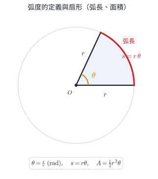
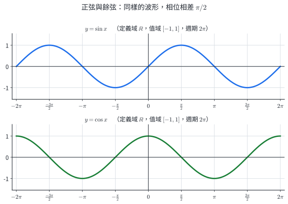
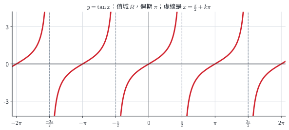
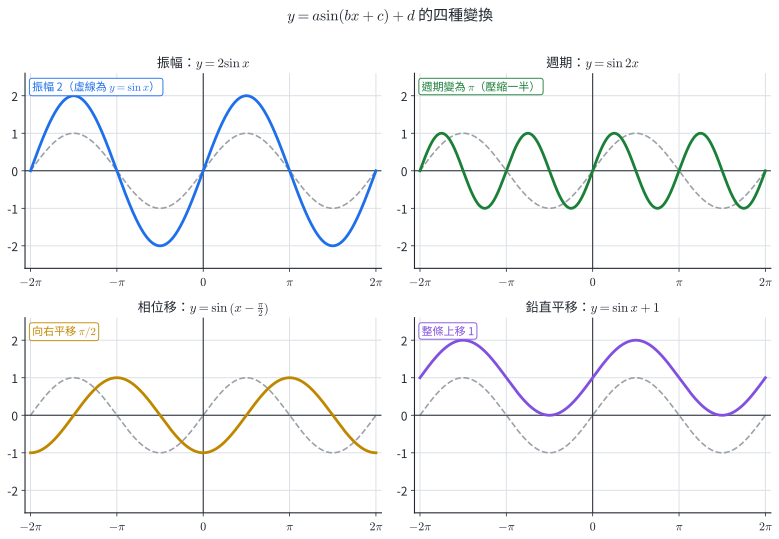
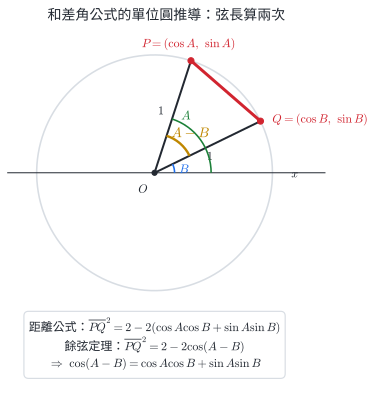
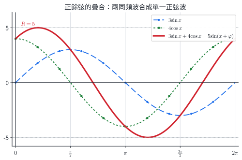

# 數A3-1 三角函數

::: learning-map
### 本章核心問題

1. **怎麼用圓本身來量角？**──弧度把角直接連到弧長與扇形面積。
2. **圓上的轉動怎麼變成波形？**──單位圓上的橫、縱坐標，攤開後就是 $\cos$、$\sin$ 圖形。
3. **角相加時，函數值如何跟著改變？**──和差角是源頭，倍角與半角都可由它推導。
4. **為什麼 $a\sin x+b\cos x$ 能合成一個波？**──同頻率是前提，振幅來自畢氏定理。

```text
弧度 → 三角函數圖形 → 圖形變換 → 和差角 → 倍角／半角 → 正餘弦疊合
```

<span class="scope-tag">藍色：現行核心</span>
<span class="scope-tag why-tag">青綠：理解支援</span>
<span class="scope-tag extension-tag">紫色：跨冊或高階延伸</span>

111–115 官方題本固定窗口中，5/5 份學測數學 A、3/5 份分科數學甲至少有一題把本章概念放在主幹或必要整合；這只描述已觀察試卷，不代表未來每年必考。
:::

## 三角函數如何描述轉動與週期訊號

::: {.why .keep-together}
### 從轉角、分量到同頻訊號

**弧度連結轉角、弧長與時間。** 圓周上的位移與角度可直接寫成 $s=r\theta$；採用弧度後，轉角、弧長與時間能放在同一個模型裡。

**圓周運動的坐標形成 sine 與 cosine。** 圓上轉動點的水平、鉛直坐標就是 $r\cos\theta$、$r\sin\theta$。旋轉零件的位置、週期感測訊號與規律振動，都可先用這兩個投影描述。

**和差角更新旋轉後的分量。** 裝置先朝角 $A$，再轉 $B$，新方向是 $A+B$；和差角公式把新方向分量改寫成舊方向與轉角的資料，適合更新導航或旋轉坐標。

**同頻分量可合成單一波。** 同頻的兩個 sine／cosine 分量相加後，仍是同一頻率，只改變振幅與相位。這能判斷同頻振動或訊號合成後會增強、減弱或延遲多少。

每個模型都有前提：輪子模型假設無滑動；週期模型適用於近似規律的區段；單一波疊合要求兩項同頻。這些前提界定公式可描述的現象與範圍。
:::

## 0. 從三角比延伸到三角函數

在單位圓上，從正 $x$ 軸逆時針轉過角 $x$，終邊與圓的交點記為 $P$。因半徑是 $1$，可寫成

$$
P=(\cos x,\sin x),
\qquad
\tan x=\frac{\sin x}{\cos x}\quad(\cos x\ne0).
$$

所以 $\cos x$ 是點 $P$ 的**橫坐標**，$\sin x$ 是**縱坐標**；$\tan x$ 是兩者的比。角 $x$ 可取任意實數；$\tan x$ 的定義域排除 $\cos x=0$ 的角。三角比因此延伸為以角為輸入的三角函數。

點 $P$ 位於半徑為 $1$ 的圓上，因此其坐標滿足

$$
(\cos x)^2+(\sin x)^2=1.
$$

通常寫成

$$
\boxed{\sin^2x+\cos^2x=1}.
$$

這條關係直接來自單位圓方程 $X^2+Y^2=1$，後面的倍角公式與同角三角函數化簡都會使用它。

### 廣義角、終邊與化簡

角的始邊固定在正 $x$ 軸；逆時針旋轉記為正角，順時針旋轉記為負角。旋轉任意圈數後停下的射線稱為**終邊**。兩角 $\alpha,\beta$ 有相同終邊的條件是

$$
\boxed{\alpha=\beta+2k\pi},
\qquad k\in\mathbb Z.
$$

計算廣義角的三角函數時，先加減 $2\pi$ 的整數倍，把角化到 $0\le\theta<2\pi$，再由終邊所在象限判斷正負：

| 象限 | $\sin\theta$ | $\cos\theta$ | $\tan\theta$ |
|---|---:|---:|---:|
| 第一象限 | $+$ | $+$ | $+$ |
| 第二象限 | $+$ | $-$ | $-$ |
| 第三象限 | $-$ | $-$ | $+$ |
| 第四象限 | $-$ | $+$ | $-$ |

下列關係來自單位圓上的對稱與四分之一圈旋轉；各式在相應函數有定義時使用：

| 角 | sine | cosine | tangent |
|---|---|---|---|
| $-\theta$ | $-\sin\theta$ | $\cos\theta$ | $-\tan\theta$ |
| $\pi-\theta$ | $\sin\theta$ | $-\cos\theta$ | $-\tan\theta$ |
| $\pi+\theta$ | $-\sin\theta$ | $-\cos\theta$ | $\tan\theta$ |
| $\dfrac\pi2-\theta$ | $\cos\theta$ | $\sin\theta$ | $\dfrac{\cos\theta}{\sin\theta}$ |
| $\dfrac\pi2+\theta$ | $\cos\theta$ | $-\sin\theta$ | $-\dfrac{\cos\theta}{\sin\theta}$ |

例如 $-7\pi/6$ 與 $5\pi/6$ 相差 $-2\pi$，終邊同在第二象限，因此

$$
\sin\left(-\frac{7\pi}{6}\right)=\frac12,
\quad
\cos\left(-\frac{7\pi}{6}\right)=-\frac{\sqrt3}{2},
\quad
\tan\left(-\frac{7\pi}{6}\right)=-\frac{\sqrt3}{3}.
$$

下表並列常用角的度數、弧度與三角函數值。

| 角（度） | $0^\circ$ | $30^\circ$ | $45^\circ$ | $60^\circ$ | $90^\circ$ |
|---:|---:|---:|---:|---:|---:|
| 同一角（弧度） | $0$ | $\dfrac{\pi}{6}$ | $\dfrac{\pi}{4}$ | $\dfrac{\pi}{3}$ | $\dfrac{\pi}{2}$ |
| $\sin x$ | $0$ | $\dfrac12$ | $\dfrac{\sqrt2}{2}$ | $\dfrac{\sqrt3}{2}$ | $1$ |
| $\cos x$ | $1$ | $\dfrac{\sqrt3}{2}$ | $\dfrac{\sqrt2}{2}$ | $\dfrac12$ | $0$ |
| $\tan x$ | $0$ | $\dfrac{\sqrt3}{3}$ | $1$ | $\sqrt3$ | 未定義 |

::: pitfall
### 函數圖形與圓周軌跡

單位圓用來產生函數值；$y=\sin x$ 的圖形則以「角 $x$」為橫軸、「函數值」為縱軸，記錄**輸入與輸出的關係**。圓周軌跡位於幾何平面，函數圖形位於輸入—輸出平面。
:::

## 1. 弧度：用弧長與半徑的比來量角

### 1.1 定義與換算

在半徑為 $r$ 的圓上，圓心角所對的弧長為 $s$。這個角的弧度定義為

::: concept
$$
\boxed{\theta=\frac{s}{r}}
$$

同一個角畫在大小不同的圓上，$s$ 與 $r$ 會同比放大，因此 $s/r$ 不變。弧度只取決於角度。
:::

整圓的弧長是 $2\pi r$，所以一圈是 $2\pi$ 弧度：

$$
360^\circ=2\pi\ \text{rad},
\qquad
180^\circ=\pi\ \text{rad}.
$$

因此

$$
\boxed{\text{度}\to\text{弧度：乘 }\frac{\pi}{180}},
\qquad
\boxed{\text{弧度}\to\text{度：乘 }\frac{180}{\pi}}.
$$

計算機必須使用與題目相同的角度模式：輸入 $\sin30^\circ$ 時用 DEG（度），輸入 $\sin(\pi/6)$ 時用 RAD（弧度）。兩者都應得到 $1/2$；答案不一致時，先檢查角度模式。

{width=88%}

::: {.why .keep-together}
### 弧度如何直接連結角、弧長與位移？

弧度直接把定義 $\theta=s/r$ 反解成 $s=r\theta$。角若用度數，弧長公式會多出 $\pi/180$；用弧度時，角與弧長共用同一個比例結構。

「rad」可保留來提醒角的量法；在公式運算中，$s/r$ 的長度單位會相消。

**實務連結：旋轉編碼器與輪距。** 若編碼器量得輪子轉過 $\theta$ 弧度，半徑為 $r$，理想無滑動時車輪前進距離就是 $s=r\theta$。若改用度數，程式每次都要再乘 $\pi/180$；弧度把感測角度直接接到幾何位移。輪胎打滑時，這個理想模型會高估或低估實際位移，需用其他感測資料校正。
:::

### 1.2 弧長與扇形面積

由 $\theta=s/r$ 直接得到弧長；扇形佔整圓的比例為 $\theta/(2\pi)$，因此

::: concept
角 $\theta$ **必須用弧度**時，

$$
\boxed{s=r\theta},
\qquad
\boxed{A=\frac12r^2\theta=\frac12rs}.
$$
:::

::: worked-example
### 完整示範｜先換單位，再代公式

半徑 $6\ \mathrm{cm}$ 的扇形，圓心角為 $60^\circ$。求弧長與面積。

**第一步：把角改成弧度**

$$
60^\circ=60\cdot\frac{\pi}{180}=\frac{\pi}{3}.
$$

**第二步：求弧長**

$$
s=r\theta=6\cdot\frac{\pi}{3}=2\pi\ \mathrm{cm}.
$$

**第三步：求面積**

$$
A=\frac12r^2\theta
=\frac12\cdot 6^2\cdot\frac{\pi}{3}
=6\pi\ \mathrm{cm^2}.
$$

**檢查**：$60^\circ$ 是整圓的 $1/6$；弧長應為 $12\pi/6=2\pi$，面積應為 $36\pi/6=6\pi$，吻合。
:::

::: pitfall
### 常見錯誤｜把 $60$ 直接代入 $s=r\theta$

$s=r\theta$ 與 $A=\tfrac12r^2\theta$ 已把角度換算吸收到定義裡，所以 $\theta$ 必須是弧度。題目若給 $60^\circ$，應代 $\pi/3$；代入 $60$ 會違反公式的弧度條件。
:::

::: self-check
### 練習｜弧度

半徑 $5$、弧長 $3$ 的圓弧所對圓心角是多少弧度？同一角若畫在半徑 $10$ 的圓上，弧長是多少？

**答案：**$\theta=s/r=3/5$。角不變時，新弧長 $s=r\theta=10\cdot(3/5)=6$。
:::

::: worked-example
### 完整示範｜由扇形周長反求半徑

一個圓心角為 $2$ 弧度的扇形，周長為 $20\ \mathrm{cm}$。求半徑、弧長與面積。

扇形周長由兩條半徑與一段弧組成。設半徑為 $r$，則

$$
s=r\theta=2r,
\qquad
2r+s=20.
$$

代入 $s=2r$：

$$
4r=20,
\qquad
r=5\ \mathrm{cm}.
$$

所以

$$
s=2r=\boxed{10\ \mathrm{cm}},
$$

$$
A=\frac12rs
=\frac12\cdot5\cdot10
=\boxed{25\ \mathrm{cm^2}}.
$$

周長檢查：$5+5+10=20$，符合題目。
:::

::: self-check
### 節末練習｜弧度、弧長與扇形

1. 把 $135^\circ$ 化為弧度，把 $-5\pi/6$ 化為度數。
2. 半徑 $12\ \mathrm{cm}$、圓心角 $5\pi/6$ 的扇形，求弧長與面積。
3. 一個扇形的弧長為 $10$、面積為 $30$。求半徑與圓心角。
4. 半徑 $0.30\ \mathrm m$ 的輪子無滑動滾了 $8$ 圈。輪心前進多少公尺？

**答案：**

1. $135^\circ=3\pi/4$；$-5\pi/6=-150^\circ$。
2. $s=12(5\pi/6)=10\pi\ \mathrm{cm}$；$A=\tfrac12(12)^2(5\pi/6)=60\pi\ \mathrm{cm^2}$。
3. 由 $A=\tfrac12rs$ 得 $r=2A/s=6$；$\theta=s/r=5/3$ 弧度。
4. 轉角為 $16\pi$，所以 $s=r\theta=0.30(16\pi)=4.8\pi\ \mathrm m$。
:::

## 2. 三角函數圖形：把單位圓攤開

### 2.1 $\sin$、$\cos$、$\tan$ 的基本圖形

讓點 $P=(\cos x,\sin x)$ 沿單位圓逆時針轉動：

- $\sin x$ 追蹤點的高度，所以從 $0$ 上升到 $1$，再降到 $-1$，最後回到 $0$。
- $\cos x$ 追蹤水平位置，所以從 $1$ 出發；它與 $\sin x$ 形狀相同，但相位領先 $\pi/2$。
- $\tan x=\sin x/\cos x$；當 $\cos x=0$ 時沒有定義，因此圖形會出現鉛直漸近線。

{width=96%}

{width=96%}

::: concept
| 函數 | 定義域 | 值域 | 最小正週期 | 對稱性 | 零點 |
|---|---|---|---:|---|---|
| $y=\sin x$ | $\mathbb R$ | $[-1,1]$ | $2\pi$ | 奇函數 | $x=k\pi$ |
| $y=\cos x$ | $\mathbb R$ | $[-1,1]$ | $2\pi$ | 偶函數 | $x=\dfrac\pi2+k\pi$ |
| $y=\tan x$ | $x\ne\dfrac\pi2+k\pi$ | $\mathbb R$ | $\pi$ | 奇函數 | $x=k\pi$ |

其中 $k\in\mathbb Z$。
:::

::: self-check
### 練習｜用基本圖形讀解

在 $0\le x<2\pi$ 中，$\sin x=1/2$ 的解有哪些？$\sin x>0$ 又對應哪一段區間？

**答案：**水平線 $y=1/2$ 與 sine 圖交於 $x=\pi/6,5\pi/6$；圖形在 $x$ 軸上方的區間是 $0<x<\pi$。
:::

::: why
### 為什麼 $\cos$ 像 $\sin$ 向左移 $\pi/2$？

點從 $(1,0)$ 出發時，橫坐標已是最大值 $1$，縱坐標則從 $0$ 開始上升。因此 $\cos$ 的相位比 $\sin$ 領先四分之一圈：

$$
\boxed{\cos x=\sin\left(x+\frac\pi2\right)}.
$$

**實務連結：同一轉軸的兩個感測通道。** 若一個通道記錄圓上點的縱坐標，另一個記錄橫坐標，兩者形狀相同但相差四分之一圈。兩個通道在某一瞬間的讀值可幫助定位；連續追蹤轉動時，再看哪一個通道的變化領先，才可判斷轉動方向。這個判讀使用 $\sin$、$\cos$ 的相位差。
:::

### 2.2 圖形變換：四個參數的作用

先排除常數函數的退化情形。對 $A\ne0$、$B>0$，把式子寫成

$$
y=A\sin\bigl(B(x-h)\bigr)+D
$$

或同型的 cosine 函數。四個參數的工作彼此分開：

| 參數 | 幾何意義 | 可直接讀出的量 |
|---|---|---|
| $A$ | 鉛直伸縮；$A<0$ 時再上下翻轉 | 振幅 $|A|$ |
| $B$ | 水平壓縮或拉伸 | 週期 $T=2\pi/B$ |
| $h$ | 水平平移 | 向右移 $h$ |
| $D$ | 鉛直平移 | 中線 $y=D$，值域 $[D-|A|,D+|A|]$ |

若原式寫成 $y=A\sin(Bx+C)+D$，先提出 $B$：

$$
Bx+C=B\left(x+\frac{C}{B}\right)
=B\left(x-\left(-\frac CB\right)\right),
$$

所以相位移須由整理後的括號讀出，為 $h=-C/B$。

以下讀相位移時，一律保留題目所給 $A$ 的正負號，再由 $B(x-h)$ 讀取 $h$。相位表示並不唯一：$h$ 可相差整數倍週期；若同時把 $A$ 改號，還可得到相差半個週期的等價表示。

{width=96%}

::: worked-example
### 完整示範｜讀出四個參數

分析

$$
y=-3\cos\left(2x-\frac\pi3\right)+1.
$$

先整理括號：

$$
2x-\frac\pi3=2\left(x-\frac\pi6\right).
$$

因此：

- 振幅 $|-3|=3$，負號表示上下翻轉。
- 週期 $T=2\pi/2=\pi$。
- 向右平移 $\pi/6$。
- 中線 $y=1$，值域 $[1-3,1+3]=[-2,4]$。
:::

對同樣滿足 $A\ne0$、$B>0$ 的 tangent 函數

$$
y=A\tan\bigl(B(x-h)\bigr)+D,
$$

週期是 $\pi/B$，中線是 $y=D$；它沒有振幅，因為值域沒有上下界。鉛直漸近線滿足

$$
B(x-h)=\frac\pi2+k\pi.
$$

::: pitfall
### 三個容易混淆的量

- **振幅為 $|A|$**，其值非負。
- **週期與 $B$ 成反比**；$B$ 越大，圖形在水平方向越密。
- **tan 沒有振幅**；把它的垂直伸縮係數叫振幅，會把無界圖形誤當成上下有界。
:::

::: self-check
### 練習｜圖形與變換

$y=2\sin\bigl(3(x+\pi/6)\bigr)-4$ 的振幅、週期、水平位移、中線與值域各為何？

**答案：**振幅 $2$；週期 $2\pi/3$；向左移 $\pi/6$；中線 $y=-4$；值域 $[-6,-2]$。
:::

### 2.3 由情境建立週期模型

若一個現象可近似為單一正弦或餘弦週期，可以用

$$
y=D+A\cos\bigl(B(x-h)\bigr)
$$

建立模型。固定依序回答四個問題：

1. 最高與最低值決定中線 $D$ 與振幅 $|A|$。
2. 週期 $T$ 決定 $B=2\pi/T$。
3. 一個已知的最高、最低或過中線位置決定 $h$。
4. 把已知位置代回，確認函數值與變化方向。

模型的寫法不唯一；使用 sine 或 cosine 都可以，重點是它符合題目的中線、振幅、週期與相位條件。真實現象通常只是**近似**週期模型，不必假裝完全正弦。

例如把旋轉標記在鉛直方向的位置記成 $y(t)=D+A\sin(\omega t+\varphi)$：$D$ 是轉軸高度、$|A|$ 是半徑、週期 $T$ 給出 $\omega=2\pi/T$，$\varphi$ 則記錄起始位置。四個參數各對應一個可量的物理量，這就是參數模型比「畫一條像波的曲線」更有用的地方。

::: worked-example
### 完整示範｜在指定區間解變形後的三角方程式

解

$$
2\sin\left(2x-\frac\pi6\right)=1,
\qquad 0\le x<2\pi.
$$

令 $u=2x-\pi/6$，則 $\sin u=1/2$。其一般解可分成兩族：

$$
u=\frac\pi6+2k\pi
\quad\text{或}\quad
u=\frac{5\pi}{6}+2k\pi,
\qquad k\in\mathbb Z.
$$

代回第一族：

$$
2x-\frac\pi6=\frac\pi6+2k\pi
\Longrightarrow
x=\frac\pi6+k\pi.
$$

代回第二族：

$$
2x-\frac\pi6=\frac{5\pi}{6}+2k\pi
\Longrightarrow
x=\frac\pi2+k\pi.
$$

篩選 $0\le x<2\pi$，得到

$$
\boxed{x=\frac\pi6,\ \frac\pi2,\ \frac{7\pi}{6},\ \frac{3\pi}{2}}.
$$

係數 $2$ 使原區間內包含兩個完整 sine 週期，因此共有四個交點。
:::

::: worked-example
### 完整示範｜由起始狀態建立摩天輪高度模型

摩天輪半徑為 $8\ \mathrm m$，圓心離地 $10\ \mathrm m$，轉一圈需 $40\ \mathrm s$。座艙在 $t=0$ 時位於最低點，且等速轉動。建立高度 $h(t)$，並求 $t=10$ 時的高度。

中線為 $10$，振幅為 $8$，角頻率為

$$
B=\frac{2\pi}{T}=\frac{2\pi}{40}=\frac\pi{20}.
$$

$t=0$ 在最低點，使用負 cosine 可直接符合初值：

$$
\boxed{h(t)=10-8\cos\left(\frac{\pi t}{20}\right)}.
$$

當 $t=10$：

$$
h(10)=10-8\cos\frac\pi2=\boxed{10\ \mathrm m}.
$$

此時經過四分之一週期，座艙應通過中線；計算結果與運動狀態一致。
:::

::: self-check
### 節末練習｜圖形、方程式與週期模型

1. 在 $0\le x<2\pi$ 解 $\tan x=\sqrt3$。
2. 在 $0\le x\le2\pi$ 解不等式 $\cos x\le-1/2$。
3. $y=-2\sin(\pi t/3)+5$ 的振幅、週期、中線與值域各為何？
4. 求 $y=2\tan\bigl(3(x-\pi/6)\bigr)$ 的最小正週期與所有鉛直漸近線。
5. 某週期量最高為 $14$、最低為 $6$、週期為 $8$，且 $t=1$ 時達最高值。用 cosine 建立一個模型。
6. 在 $0\le x<2\pi$ 解 $\cos2x=0$。

**答案：**

1. $x=\pi/3,4\pi/3$。
2. $2\pi/3\le x\le4\pi/3$。
3. 振幅 $2$；週期 $6$；中線 $y=5$；值域 $[3,7]$。
4. 週期 $\pi/3$；漸近線 $x=\pi/3+k\pi/3$，$k\in\mathbb Z$。
5. $y=10+4\cos\bigl(\tfrac\pi4(t-1)\bigr)$。
6. $x=\pi/4,3\pi/4,5\pi/4,7\pi/4$。
:::

## 3. 和差角、倍角與半角：一條公式鏈

::: keep-with-next
### 3.1 和差角公式

$\sin(A+B)$ 一般不等於 $\sin A+\sin B$。角度相加後，新的橫、縱坐標要同時混合原來兩個角的資訊：
:::

::: {.concept .keep-together}
$$
\boxed{\sin(A\pm B)=\sin A\cos B\pm\cos A\sin B}
$$

$$
\boxed{\cos(A\pm B)=\cos A\cos B\mp\sin A\sin B}
$$

當各項有意義時，

$$
\boxed{\tan(A\pm B)=\frac{\tan A\pm\tan B}{1\mp\tan A\tan B}}.
$$
:::

記號結構是：$\sin$ 的內外符號相同；$\cos$ 的內外符號相反。下列距離推導說明這組公式的共同來源。

::: {.why .keep-together}
### $\cos(A-B)$ 如何由同一段距離推導？

在單位圓取

$$
P=(\cos A,\sin A),\qquad Q=(\cos B,\sin B).
$$

用坐標距離公式計算 $PQ^2$，得到

$$
PQ^2=2-2(\cos A\cos B+\sin A\sin B).
$$

另一方面，令 $\delta\in[0,\pi]$ 是射線 $OP$、$OQ$ 的較小夾角。$\delta$ 與 $A-B$ 只差正負號或整圈，所以 $\cos\delta=\cos(A-B)$。三角形 $POQ$ 的兩邊都是 $1$；用餘弦定理得到

$$
PQ^2=2-2\cos(A-B).
$$

兩式代表同一段距離，因此

$$
\boxed{\cos(A-B)=\cos A\cos B+\sin A\sin B}.
$$

把 $B$ 換成 $-B$，配合奇偶性可得 cosine 和角式；再配合餘角關係可得 sine 和差角式。兩式相除便得到 tangent 公式（各分母有意義時）。

**實務連結：更新方向分量。** 朝向角 $A$ 的單位方向為 $(\cos A,\sin A)$；再轉 $B$ 後變成 $(\cos(A+B),\sin(A+B))$。導航、機械手臂與電腦圖學都用這組關係更新二維方向；矩陣表示留待後續課程。
:::

{width=84%}

::: worked-example
### 完整示範｜求 $\sin75^\circ$ 的精確值

把 $75^\circ$ 拆成兩個已知特殊角：

$$
\begin{aligned}
\sin75^\circ
&=\sin(45^\circ+30^\circ)\\
&=\sin45^\circ\cos30^\circ
 +\cos45^\circ\sin30^\circ\\
&=\frac{\sqrt2}{2}\cdot\frac{\sqrt3}{2}
 +\frac{\sqrt2}{2}\cdot\frac12\\
&=\boxed{\frac{\sqrt6+\sqrt2}{4}}.
\end{aligned}
$$

大小檢查：$75^\circ$ 在第一象限且接近 $90^\circ$，答案應為接近 $1$ 的正數；近似值約 $0.966$，合理。
:::

::: keep-with-next
### 3.2 倍角公式：令兩角相同

在和角公式中令 $B=A$：
:::

::: concept
$$
\boxed{\sin2A=2\sin A\cos A}
$$

$$
\boxed{\cos2A=\cos^2A-\sin^2A
=1-2\sin^2A
=2\cos^2A-1}
$$

$$
\boxed{\tan2A=\frac{2\tan A}{1-\tan^2A}}
$$

最後一式只在分母與相關 tangent 值有意義時使用。
:::

$\cos2A$ 有三種寫法，選擇的原則是「想留下哪一種函數」：要只留 $\sin A$，用 $1-2\sin^2A$；要只留 $\cos A$，用 $2\cos^2A-1$。

### 3.3 半角公式：把倍角反解

把 $\cos2A=1-2\sin^2A=2\cos^2A-1$ 反解，再令 $2A=\theta$：

::: concept
$$
\boxed{\sin^2\frac\theta2=\frac{1-\cos\theta}{2}},
\qquad
\boxed{\cos^2\frac\theta2=\frac{1+\cos\theta}{2}}.
$$

需要 $\sin(\theta/2)$ 或 $\cos(\theta/2)$ 時，開根號後的正負號由 $\theta/2$ 所在象限決定。
:::

::: pitfall
### 常見錯誤｜半角公式開根號後一律取正

平方只保留大小，會遺失正負號。例如 $\theta/2$ 若在第二象限，$\sin(\theta/2)>0$、$\cos(\theta/2)<0$。正確流程是：**先算平方值，再判半角象限，最後決定符號。**
:::

::: self-check
### 練習｜公式鏈

若 $\sin\alpha=3/5$ 且 $\alpha$ 在第二象限，求 $\cos2\alpha$。

**答案：**可直接用 $\cos2\alpha=1-2\sin^2\alpha=1-2(9/25)=7/25$。此題不必先求帶負號的 $\cos\alpha$。
:::

當 $\sin\theta$ 與相應分母有意義時，半角的 tangent 還可寫成

::: concept
$$
\boxed{
\tan\frac\theta2
=\frac{\sin\theta}{1+\cos\theta}
=\frac{1-\cos\theta}{\sin\theta}
}.
$$
:::

第一式由 $\sin\theta=2\sin(\theta/2)\cos(\theta/2)$ 與 $1+\cos\theta=2\cos^2(\theta/2)$ 相除得到；第二式則使用 $1-\cos\theta=2\sin^2(\theta/2)$。這兩式保留半角的正負號，使用時仍須確認分母不為 $0$。

::: worked-example
### 完整示範｜用 tangent 和角公式求精確值

$$
\begin{aligned}
\tan75^\circ
&=\tan(45^\circ+30^\circ)\\
&=\frac{1+1/\sqrt3}{1-1/\sqrt3}\\
&=\frac{\sqrt3+1}{\sqrt3-1}\\
&=\boxed{2+\sqrt3}.
\end{aligned}
$$

$75^\circ$ 位於第一象限且接近 $90^\circ$，tangent 應為大於 $1$ 的正數，符號與大小都合理。
:::

::: worked-example
### 完整示範｜半角值由整角與象限共同決定

已知 $\cos\theta=-7/25$ 且 $\pi/2<\theta<\pi$。求 $\sin(\theta/2)$、$\cos(\theta/2)$ 與 $\tan(\theta/2)$。

因 $\pi/4<\theta/2<\pi/2$，半角在第一象限，sine、cosine 都取正：

$$
\sin\frac\theta2
=\sqrt{\frac{1-\cos\theta}{2}}
=\sqrt{\frac{1+7/25}{2}}
=\boxed{\frac45},
$$

$$
\cos\frac\theta2
=\sqrt{\frac{1+\cos\theta}{2}}
=\sqrt{\frac{1-7/25}{2}}
=\boxed{\frac35}.
$$

所以

$$
\tan\frac\theta2=\frac{4/5}{3/5}=\boxed{\frac43}.
$$
:::

::: self-check
### 節末練習｜和差角、倍角與半角

1. 求 $\cos15^\circ$ 的精確值。
2. 求 $\tan105^\circ$ 的精確值。
3. 已知 $\sin\alpha=-5/13$ 且 $\alpha$ 在第四象限，求 $\sin2\alpha$ 與 $\cos2\alpha$。
4. 已知 $\cos\theta=5/13$ 且 $\pi<\theta<2\pi$，求 $\sin(\theta/2)$ 與 $\cos(\theta/2)$。
5. 說明在兩邊都有定義時，為何 $(1-\cos2x)/\sin2x=\tan x$。

**答案：**

1. $\cos15^\circ=(\sqrt6+\sqrt2)/4$。
2. $\tan105^\circ=-(2+\sqrt3)$。
3. $\cos\alpha=12/13$，所以 $\sin2\alpha=-120/169$、$\cos2\alpha=119/169$。
4. $\theta/2$ 在第二象限，所以 $\sin(\theta/2)=2\sqrt{13}/13$、$\cos(\theta/2)=-3\sqrt{13}/13$。
5. $1-\cos2x=2\sin^2x$、$\sin2x=2\sin x\cos x$；約分後為 $\tan x$。原式要求 $\sin2x\ne0$，約分過程也在此條件下成立。
:::

::: keep-with-next
## 4. 正餘弦疊合：兩個同頻分量合成一個波

### 4.1 公式與前提

對不全為零的實數 $p,q$，可以把

$$
p\sin x+q\cos x
$$

寫成一個同頻率的正弦函數：
:::

::: concept
$$
\boxed{p\sin x+q\cos x=R\sin(x+\varphi)}
$$

其中

$$
\boxed{R=\sqrt{p^2+q^2}>0},
\qquad
\boxed{\cos\varphi=\frac pR,\quad \sin\varphi=\frac qR}.
$$
:::

::: keep-together
同一推導對任意 $B>0$ 都成立：

$$
\boxed{p\sin(Bx)+q\cos(Bx)=R\sin(Bx+\varphi)}.
$$

因此合成後仍保留共同的週期 $2\pi/B$，也就是頻率不變；改變的是振幅與相位。
:::

展開右式即可推導：

$$
R\sin(x+\varphi)
=(R\cos\varphi)\sin x+(R\sin\varphi)\cos x.
$$

比對係數，得到 $R\cos\varphi=p$、$R\sin\varphi=q$；平方相加後，因 $\cos^2\varphi+\sin^2\varphi=1$，便有 $R=\sqrt{p^2+q^2}$。

{width=88%}

::: why
### 為什麼 $R=\sqrt{p^2+q^2}$？

條件 $R\cos\varphi=p$、$R\sin\varphi=q$ 表示 $(p,q)$ 是一支長度為 $R$、方向角為 $\varphi$ 的向量。因此 $R$ 就是向量 $(p,q)$ 的長度，畢氏定理直接給出 $R=\sqrt{p^2+q^2}$。

決定 $\varphi$ 時須同時看 $p$、$q$ 的正負，以判斷 $(p,q)$ 所在象限；單用 $\tan\varphi=q/p$ 會缺少相差 $\pi$ 的象限資訊。

**實務連結：同頻訊號的增強與抵消。** 兩個相同頻率的量測通道相加時，可先各寫成 sine、cosine 分量，再以 $R$ 與 $\varphi$ 讀出合成振幅和延遲。若 $R$ 變小，表示兩分量部分抵消；若變大，表示部分增強。不同頻率的訊號屬於多頻結構，需保留各自的頻率分量。
:::

::: pitfall
### 適用範圍｜同頻分量的合成

$p\sin x+q\cos x$ 的兩項共用同一個 $x$，所以能合成同頻波。$\sin x+\cos2x$ 的頻率不同，應保留為兩個頻率分量。
:::

::: worked-example
### 完整示範｜合成、求值域與最大位置

求

$$
f(x)=\sqrt3\sin x+\cos x
$$

的合成式、最大值，並找出 $0\le x<2\pi$ 中取得最大值的位置。

由 $p=\sqrt3,q=1$：

$$
R=\sqrt{3+1}=2,
\qquad
\cos\varphi=\frac{\sqrt3}{2},
\quad
\sin\varphi=\frac12.
$$

所以 $\varphi=\pi/6$，

$$
f(x)=2\sin\left(x+\frac\pi6\right).
$$

最大值為 $2$。當

$$
x+\frac\pi6=\frac\pi2
$$

時取到，故 $x=\pi/3$。
:::

::: self-check
### 練習｜疊合

$3\sin x-4\cos x$ 的最大值與最小值各是多少？不必先求相位。

**答案：**合成振幅 $R=\sqrt{3^2+(-4)^2}=5$，所以值域是 $[-5,5]$；最大值 $5$，最小值 $-5$。
:::

### 4.2 cosine 形式與限制區間極值

同一個合成也可寫成 cosine 形式：

::: concept
$$
\boxed{p\sin x+q\cos x=R\cos(x-\delta)},
$$

$$
R=\sqrt{p^2+q^2},
\qquad
\sin\delta=\frac pR,
\qquad
\cos\delta=\frac qR.
$$
:::

正弦形式與餘弦形式描述同一條曲線；選擇哪一種，取決於題目給的是過中線位置還是最高、最低位置。求全體實數上的值域時，只需用 $-1\le\sin u,\cos u\le1$；求限制區間的極值時，還要把 $u=x+\varphi$ 的實際範圍一起轉換。

::: worked-example
### 完整示範｜合成為 cosine 形式

令角 $\alpha$ 滿足

$$
\sin\alpha=\frac35,
\qquad
\cos\alpha=\frac45,
\qquad 0<\alpha<\frac\pi2.
$$

則

$$
\begin{aligned}
-3\sin x+4\cos x
&=5\left(-\frac35\sin x+\frac45\cos x\right)\\
&=5(\cos x\cos\alpha-\sin x\sin\alpha)\\
&=\boxed{5\cos(x+\alpha)}.
\end{aligned}
$$

係數的平方和為 $25$，所以振幅為 $5$；展開結果也確實還原兩個係數。
:::

::: worked-example
### 完整示範｜限制區間內的最大值與最小值

求

$$
f(x)=2\sin x+2\sqrt3\cos x,
\qquad 0\le x\le\frac\pi2
$$

的最大值、最小值及其位置。

先合成：

$$
f(x)=4\sin\left(x+\frac\pi3\right).
$$

當 $0\le x\le\pi/2$ 時，

$$
\frac\pi3\le x+\frac\pi3\le\frac{5\pi}{6}.
$$

這段區間包含 $\pi/2$，所以最大值為

$$
\boxed{4},
\qquad x+\frac\pi3=\frac\pi2
\Longrightarrow x=\boxed{\frac\pi6}.
$$

最小值需比較兩個端點：

$$
f(0)=2\sqrt3,
\qquad
f\left(\frac\pi2\right)=2.
$$

故最小值為 $\boxed{2}$，在 $x=\boxed{\pi/2}$ 取得。
:::

### 4.3 合成後解方程式與不等式

合成把兩個同頻項化成單一三角函數，接著可用基本圖形處理交點與區間。例如

$$
\sqrt3\sin x+\cos x\ge1
$$

可化成

$$
2\sin\left(x+\frac\pi6\right)\ge1.
$$

在 $0\le x<2\pi$ 中，$x+\pi/6$ 的範圍是 $[\pi/6,13\pi/6)$；配合 sine 圖形可得

$$
\boxed{0\le x\le\frac{2\pi}{3}}.
$$

::: self-check
### 節末練習｜疊合、極值與解集

1. 把 $\sin x-\sqrt3\cos x$ 化為 $R\sin(x+\varphi)$，其中 $-\pi<\varphi\le\pi$。
2. 求 $5\sin x+12\cos x$ 在全體實數上的值域。
3. 求 $3\sin x+4\cos x$ 在 $0\le x\le\pi/2$ 的最大值及位置。
4. 在 $0\le x<2\pi$ 解 $\sin x-\cos x=0$。
5. 在 $0\le x<2\pi$ 解 $\sin x+\cos x>0$。

**答案：**

1. $2\sin(x-\pi/3)$。
2. $[-13,13]$。
3. 最大值 $5$；令 $0<\alpha<\pi/2$ 且 $\sin\alpha=3/5$、$\cos\alpha=4/5$，則在 $x=\alpha$ 取得。
4. $x=\pi/4,5\pi/4$。
5. $0\le x<3\pi/4$ 或 $7\pi/4<x<2\pi$。
:::

## 5. 一頁核心整理

::: summary-box
### 弧度

- $\theta=s/r$；$180^\circ=\pi$ rad。
- $s=r\theta$、$A=\tfrac12r^2\theta=\tfrac12rs$，其中 $\theta$ 必須用弧度。

### 圖形

- $\sin$、$\cos$：定義域 $\mathbb R$，值域 $[-1,1]$，週期 $2\pi$。
- $\tan$：$x\ne\pi/2+k\pi$，值域 $\mathbb R$，週期 $\pi$。
- 對 $A\ne0$、$B\ne0$，$y=A\sin(B(x-h))+D$：振幅 $|A|$、週期 $2\pi/|B|$、右移 $h$、中線 $y=D$。
- 在同一條件下，tangent 的週期為 $\pi/|B|$，沒有振幅。

### 公式鏈

- 和差角：$\sin$ 同號、$\cos$ 反號。
- 倍角：令兩角相同；$\cos2A$ 有三種等價寫法。
- 半角：由倍角反解；開根號後要判 $\theta/2$ 的象限。
- $\tan(\theta/2)=\sin\theta/(1+\cos\theta)=(1-\cos\theta)/\sin\theta$，使用時保留分母條件。

### 疊合

- $p\sin(Bx)+q\cos(Bx)=R\sin(Bx+\varphi)$；$B\ne0$ 時，共同週期 $2\pi/|B|$ 不變。
- $R=\sqrt{p^2+q^2}$；$\cos\varphi=p/R$、$\sin\varphi=q/R$。
- 也可寫成 $R\cos(Bx-\delta)$；限制區間極值需同步轉換相位後的輸入範圍。
- 只適用同頻率的 sine、cosine 分量。
:::

## 6. 分層題與跨節整合題

### 題目 1｜弧度、弧長與面積

半徑 $9\ \mathrm{cm}$ 的扇形，圓心角為 $80^\circ$。求其弧長與面積。

### 題目 2｜依本章表示規範讀取圖形參數

求

$$
y=-3\cos(2x-\pi)+1
$$

的振幅、週期、水平位移、中線與值域。

### 題目 3｜tan 的週期與漸近線

對 $y=\tan2x$，求最小正週期、所有零點與所有鉛直漸近線。

### 題目 4｜建立週期模型

某地一天的溫度可近似為正餘弦週期模型。最高溫 $30^\circ\mathrm C$、最低溫 $18^\circ\mathrm C$，週期 $24$ 小時，且 $t=6$ 時達最高溫。用 cosine 建立溫度 $T(t)$，並求 $t=12$ 時的溫度。

### 題目 5｜和角公式

不用計算機，求 $\cos75^\circ$ 的精確值。

### 題目 6｜半角與象限

已知 $\cos\theta=-3/5$ 且 $\pi/2<\theta<\pi$，求

$$
\sin\frac\theta2,
\qquad
\cos\frac\theta2.
$$

### 題目 7｜疊合與極值位置

將

$$
\sqrt3\sin x-\cos x
$$

化為 $R\sin(x+\varphi)$，並求 $0\le x<2\pi$ 中取得最大值的 $x$。

### 題目 8｜用疊合解方程式

解

$$
\sin x+\cos x=1,
\qquad 0\le x<2\pi.
$$

### 題目 9｜倍頻方程式

解

$$
\cos2x=-\frac12,
\qquad 0\le x<2\pi.
$$

### 題目 10｜tangent 差角

不用計算機，求 $\tan15^\circ$ 的精確值。

### 題目 11｜由 tangent 求倍角

已知 $\tan\alpha=2$ 且 $\pi<\alpha<3\pi/2$。求 $\sin2\alpha$ 與 $\cos2\alpha$。

### 題目 12｜cosine 型疊合

令 $0<\beta<\pi/2$ 且 $\sin\beta=3/5$、$\cos\beta=4/5$。把

$$
-3\sin x+4\cos x
$$

化為 $R\cos(x+\beta)$，並寫出值域。

### 題目 13｜跨節整合：轉速、弧長與週期坐標

半徑 $0.40\ \mathrm m$ 的輪子以每分鐘 $15$ 圈等速轉動，且無滑動。

1. 求角速度，單位用 $\mathrm{rad/s}$；
2. 求 $8$ 秒內輪心前進的距離；
3. 輪緣標記在 $t=0$ 位於輪心正上方。以輪心為原點、向上為正，寫出標記的鉛直坐標 $y(t)$。

### 題目 14｜跨節整合：圖形參數與不等式

對

$$
y=2\sin\left(2\left(x-\frac\pi4\right)\right)+1,
$$

1. 求振幅、週期、相位移、中線和值域；
2. 在 $0\le x<\pi$ 解 $y\ge2$。

### 題目 15｜跨節整合：先展開，再疊合

把

$$
\sin x+\sin\left(x+\frac\pi3\right)
$$

化為單一正弦函數，並求它在 $0\le x<2\pi$ 的所有零點。

### 題目 16｜跨節整合：由最高與最低時刻建模

某港口潮位可近似為正餘弦模型。$t=2$ 小時時潮位最高為 $5.2\ \mathrm m$，$t=8$ 小時時潮位最低為 $1.6\ \mathrm m$，且這兩個時刻之間沒有其他最高或最低點。

1. 求中線、振幅與週期；
2. 建立以 cosine 表示的潮位 $H(t)$；
3. 求 $t=5$ 時的潮位。

::: page-break
:::

## 7. 分層題與跨節整合題詳解

::: solution
### 第 1 題

先換成弧度：

$$
80^\circ=80\cdot\frac\pi{180}=\frac{4\pi}{9}.
$$

弧長：

$$
s=r\theta=9\cdot\frac{4\pi}{9}=\boxed{4\pi\ \mathrm{cm}}.
$$

面積：

$$
A=\frac12r^2\theta
=\frac12\cdot81\cdot\frac{4\pi}{9}
=\boxed{18\pi\ \mathrm{cm^2}}.
$$
:::

::: solution
### 第 2 題

先整理括號：

$$
2x-\pi=2\left(x-\frac\pi2\right).
$$

依保留原式 $A=-3$ 的表示規範，振幅為 $3$；週期為 $2\pi/2=\pi$；向右平移 $\pi/2$；中線為 $y=1$；值域為

$$
[1-3,1+3]=\boxed{[-2,4]}.
$$

外面的負號造成上下翻轉，但不改變振幅與值域端點。

相位表示並不唯一。等價地，

$$
-3\cos(2x-\pi)+1=3\cos2x+1,
$$

也可用「正振幅、不平移」表示；兩種寫法是同一個圖形。
:::

::: solution
### 第 3 題

$\tan u$ 的週期是 $\pi$。令 $u=2x$，輸入變快 2 倍，所以週期變成

$$
\boxed{\frac\pi2}.
$$

零點來自 $2x=k\pi$：

$$
\boxed{x=\frac{k\pi}{2}},\qquad k\in\mathbb Z.
$$

鉛直漸近線來自 $2x=\pi/2+k\pi$：

$$
\boxed{x=\frac\pi4+\frac{k\pi}{2}},\qquad k\in\mathbb Z.
$$
:::

::: solution
### 第 4 題

中線與振幅分別是

$$
D=\frac{30+18}{2}=24,
\qquad
A=\frac{30-18}{2}=6.
$$

週期 $24$，所以角頻率係數

$$
B=\frac{2\pi}{24}=\frac\pi{12}.
$$

cosine 在輸入為 $0$ 時取最大值，而最高溫發生於 $t=6$，可寫成

$$
\boxed{T(t)=24+6\cos\left(\frac\pi{12}(t-6)\right)}.
$$

代入 $t=12$：

$$
T(12)=24+6\cos\frac\pi2=\boxed{24^\circ\mathrm C}.
$$
:::

::: solution
### 第 5 題

$$
\begin{aligned}
\cos75^\circ
&=\cos(45^\circ+30^\circ)\\
&=\cos45^\circ\cos30^\circ
-\sin45^\circ\sin30^\circ\\
&=\frac{\sqrt2}{2}\cdot\frac{\sqrt3}{2}
-\frac{\sqrt2}{2}\cdot\frac12\\
&=\boxed{\frac{\sqrt6-\sqrt2}{4}}.
\end{aligned}
$$
:::

::: solution
### 第 6 題

由 $\pi/2<\theta<\pi$ 可知 $\pi/4<\theta/2<\pi/2$，所以 $\theta/2$ 在第一象限，sine、cosine 都取正。

$$
\sin^2\frac\theta2
=\frac{1-\cos\theta}{2}
=\frac{1+3/5}{2}
=\frac45,
$$

故

$$
\boxed{\sin\frac\theta2=\frac{2}{\sqrt5}=\frac{2\sqrt5}{5}}.
$$

同理

$$
\cos^2\frac\theta2
=\frac{1+\cos\theta}{2}
=\frac{1-3/5}{2}
=\frac15,
$$

所以

$$
\boxed{\cos\frac\theta2=\frac{1}{\sqrt5}=\frac{\sqrt5}{5}}.
$$
:::

::: solution
### 第 7 題

令 $p=\sqrt3,q=-1$。則

$$
R=\sqrt{3+1}=2,
\qquad
\cos\varphi=\frac{\sqrt3}{2},
\quad
\sin\varphi=-\frac12.
$$

所以 $\varphi=-\pi/6$，

$$
\sqrt3\sin x-\cos x
=\boxed{2\sin\left(x-\frac\pi6\right)}.
$$

最大值為 $2$，當

$$
x-\frac\pi6=\frac\pi2
$$

時取得，因此在指定區間中

$$
\boxed{x=\frac{2\pi}{3}}.
$$
:::

::: solution
### 第 8 題

先疊合：

$$
\sin x+\cos x
=\sqrt2\sin\left(x+\frac\pi4\right).
$$

因此

$$
\sin\left(x+\frac\pi4\right)=\frac{1}{\sqrt2}=\frac{\sqrt2}{2}.
$$

列出 sine 的一般解：

$$
x+\frac\pi4=\frac\pi4+2k\pi
\quad\text{或}\quad
x+\frac\pi4=\frac{3\pi}{4}+2k\pi,
\qquad k\in\mathbb Z.
$$

所以 $x=2k\pi$ 或 $x=\pi/2+2k\pi$。篩選 $0\le x<2\pi$，得到

$$
\boxed{x=0\quad\text{或}\quad x=\frac\pi2}.
$$

兩值代回原式皆成立。
:::

::: solution
### 第 9 題

令 $u=2x$。$\cos u=-1/2$ 的一般解為

$$
u=\frac{2\pi}{3}+2k\pi
\quad\text{或}\quad
u=\frac{4\pi}{3}+2k\pi.
$$

除以 $2$：

$$
x=\frac\pi3+k\pi
\quad\text{或}\quad
x=\frac{2\pi}{3}+k\pi.
$$

篩選 $0\le x<2\pi$：

$$
\boxed{x=\frac\pi3,\ \frac{2\pi}{3},\ \frac{4\pi}{3},\ \frac{5\pi}{3}}.
$$
:::

::: solution
### 第 10 題

把 $15^\circ$ 寫成 $45^\circ-30^\circ$：

$$
\begin{aligned}
\tan15^\circ
&=\frac{\tan45^\circ-\tan30^\circ}
{1+\tan45^\circ\tan30^\circ}\\
&=\frac{1-1/\sqrt3}{1+1/\sqrt3}\\
&=\frac{\sqrt3-1}{\sqrt3+1}\\
&=\boxed{2-\sqrt3}.
\end{aligned}
$$

$15^\circ$ 位於第一象限，結果約為 $0.268$，符號與大小合理。
:::

::: solution
### 第 11 題

倍角可直接用 tangent 表示：

$$
\sin2\alpha=\frac{2\tan\alpha}{1+\tan^2\alpha},
\qquad
\cos2\alpha=\frac{1-\tan^2\alpha}{1+\tan^2\alpha}.
$$

代入 $\tan\alpha=2$：

$$
\boxed{\sin2\alpha=\frac45},
\qquad
\boxed{\cos2\alpha=-\frac35}.
$$

$\alpha$ 在第三象限，所以 $2\alpha$ 扣除一圈後落在第一或第二象限；由 $\tan\alpha=2>1$ 可知 $2\alpha$ 的 cosine 為負，與結果一致。
:::

::: solution
### 第 12 題

由題設的 $\beta$：

$$
\begin{aligned}
5\cos(x+\beta)
&=5(\cos x\cos\beta-\sin x\sin\beta)\\
&=5\left(\frac45\cos x-\frac35\sin x\right)\\
&=-3\sin x+4\cos x.
\end{aligned}
$$

因此

$$
\boxed{-3\sin x+4\cos x=5\cos(x+\beta)}.
$$

因 $-1\le\cos(x+\beta)\le1$，值域為 $\boxed{[-5,5]}$。
:::

::: solution
### 第 13 題

每分鐘 $15$ 圈等於每秒 $15/60=1/4$ 圈，所以角速度為

$$
\omega=\frac14(2\pi)=\boxed{\frac\pi2\ \mathrm{rad/s}}.
$$

$8$ 秒內轉角

$$
\theta=\omega t=\frac\pi2\cdot8=4\pi.
$$

無滑動時，輪心前進距離等於輪緣滾過的弧長：

$$
s=r\theta=0.40(4\pi)=\boxed{1.6\pi\ \mathrm m}.
$$

標記由最高點出發，鉛直坐標可用 cosine：

$$
\boxed{y(t)=0.40\cos\left(\frac{\pi t}{2}\right)\ \mathrm m}.
$$

其週期為 $2\pi/(\pi/2)=4$ 秒；$8$ 秒恰好經過兩個週期。
:::

::: solution
### 第 14 題

由標準式直接讀得：振幅 $2$、週期 $2\pi/2=\pi$、向右平移 $\pi/4$、中線 $y=1$、值域 $[-1,3]$。

解 $y\ge2$：

$$
2\sin\left(2x-\frac\pi2\right)+1\ge2
$$

等價於

$$
\sin\left(2x-\frac\pi2\right)\ge\frac12.
$$

在 $0\le x<\pi$ 中，令 $u=2x-\pi/2$，則 $-\pi/2\le u<3\pi/2$。此範圍內

$$
\frac\pi6\le u\le\frac{5\pi}{6}.
$$

代回並除以 $2$：

$$
\boxed{\frac\pi3\le x\le\frac{2\pi}{3}}.
$$
:::

::: solution
### 第 15 題

先展開第二項：

$$
\begin{aligned}
\sin x+\sin\left(x+\frac\pi3\right)
&=\sin x+\frac12\sin x+\frac{\sqrt3}{2}\cos x\\
&=\frac32\sin x+\frac{\sqrt3}{2}\cos x.
\end{aligned}
$$

合成振幅

$$
R=\sqrt{\left(\frac32\right)^2+
\left(\frac{\sqrt3}{2}\right)^2}=\sqrt3.
$$

係數對應 $\cos\varphi=\sqrt3/2$、$\sin\varphi=1/2$，所以

$$
\boxed{\sin x+\sin\left(x+\frac\pi3\right)
=\sqrt3\sin\left(x+\frac\pi6\right)}.
$$

零點滿足 $x+\pi/6=k\pi$。指定區間內

$$
\boxed{x=\frac{5\pi}{6},\ \frac{11\pi}{6}}.
$$
:::

::: solution
### 第 16 題

中線與振幅為

$$
D=\frac{5.2+1.6}{2}=3.4,
\qquad
A=\frac{5.2-1.6}{2}=1.8.
$$

最高到相鄰最低經過半個週期；$8-2=6$ 小時，所以週期為

$$
T=12\ \mathrm h,
\qquad
B=\frac{2\pi}{12}=\frac\pi6.
$$

$t=2$ 達最高，故可寫成

$$
\boxed{H(t)=3.4+1.8\cos\left(\frac\pi6(t-2)\right)}.
$$

代入 $t=5$：

$$
H(5)=3.4+1.8\cos\frac\pi2
=\boxed{3.4\ \mathrm m}.
$$

最高點後四分之一週期通過中線，與 $5-2=3$ 小時一致。
:::
