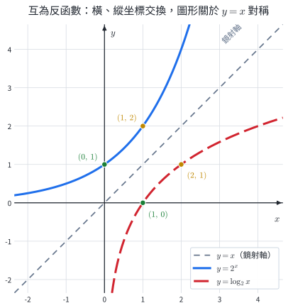
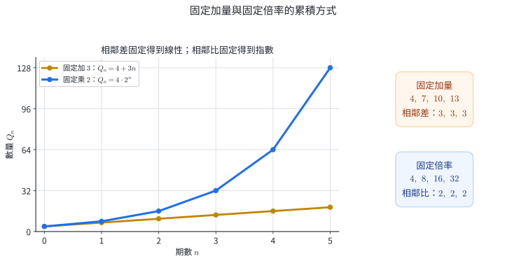
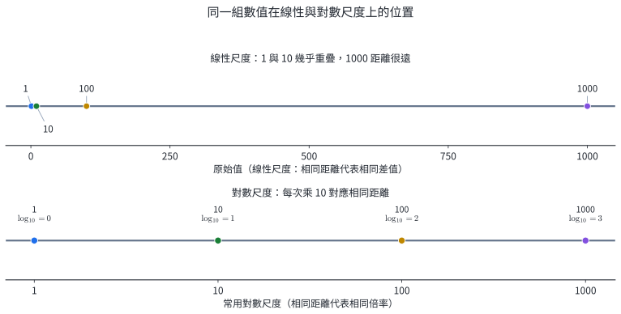

# 數A3-2 指數與對數函數

::: learning-map
### 本章核心問題

1. **每一期都乘同一倍率，長期會怎麼變？**──指數函數描述按比例成長或衰退。
2. **想知道「要經過幾期」怎麼辦？**──對數把未知數從指數位置取回來。
3. **為什麼對數能把乘法變加法？**──因為它讀的是指數，而相乘時指數相加。
4. **這套語言實際用在哪裡？**──複利、衰減、演算法步數與分貝都在處理倍率。

藍色：現行核心
青綠：理解支援
紫色：延伸內容

111–115 官方題本固定窗口中，5/5 份學測數學 A、5/5 份分科測驗數學甲至少有一題使用本章概念；這只描述已觀察試卷，不代表未來每年必考。
:::

## 0. 指數律與常用對數

本章會反覆用到指數律。對 $a>0$、實數 $m,n$：

$$
a^m a^n=a^{m+n},\qquad
\frac{a^m}{a^n}=a^{m-n},\qquad
(a^m)^n=a^{mn},\qquad
a^{-n}=\frac1{a^n}.
$$

高一也已把常用對數定義為

$$
\boxed{\log N=y\iff 10^y=N},\qquad N>0.
$$

例如 $\log1000=3$，因為 $10^3=1000$。

::: self-check
### 練習｜指數律與常用對數

將 $8^{x-1}$ 化為底數 $2$；並求 $\log0.01$。

**答案：**$8^{x-1}=(2^3)^{x-1}=2^{3x-3}$；$0.01=10^{-2}$，所以 $\log0.01=-2$。
:::

## 1. 指數函數：重複的倍率累積成曲線

### 1.1 為什麼會出現 $a^x$？

固定增加與固定倍率是兩種不同的變化：

| 規則 | 每期更新 | $n$ 期後 | 典型模型 |
|---|---|---|---|
| 固定增加 $d$ | $Q_{n+1}=Q_n+d$ | $Q_n=Q_0+nd$ | 線性 |
| 固定乘倍率 $a$ | $Q_{n+1}=aQ_n$ | $Q_n=Q_0a^n$ | 指數 |

從 $Q_0$ 出發，做一次得到 $Q_0a$，做兩次得到 $Q_0a^2$；做 $n$ 次自然得到 $Q_0a^n$。指數精確表示**同一倍率重複累積**。

::: {.why .keep-together}
### 指數模型如何描述按比例變化？

**適用情況。** 利息、衰減或早期族群變化常依「目前有多少」決定下一期改變多少；固定比例變化對應指數模型，固定加量對應線性模型。

**次方的來源。** 每一期都把目前量乘同一倍率；倍率重複 $n$ 次就是 $a^n$。

**從離散期數延伸到連續時間。** 連續時間包含任意實數時刻。把 $Q=Q_0a^x$ 視為函數，便能估計半期、任意時刻，並用圖形比較成長與衰退。

**應用與限制。** 複利帳戶用 $P(1+r)^n$；固定比例折舊或衰減用 $Q_0a^t$。模型適用於倍率可視為固定的研究區間，外推範圍也受此前提限制。
:::

### 1.2 定義、圖形與底數

::: concept
取 $a>0$ 且 $a\ne1$，

$$
\boxed{f(x)=a^x}
$$

稱為以 $a$ 為底的指數函數。它的定義域為 $\mathbb R$，值域為 $(0,\infty)$。
:::

排除 $a\le0$，是因為要讓每個實數 $x$ 都有實數函數值；排除 $a=1$，是因為 $1^x\equiv1$ 只是常數函數。

| 條件 | $a>1$ | $0<a<1$ |
|---|---|---|
| 單調性 | 嚴格遞增 | 嚴格遞減 |
| 共同定點 | $(0,1)$ | $(0,1)$ |
| 水平漸近線 | $y=0$ | $y=0$ |
| $x$ 增大時 | 函數值增大 | 函數值減小 |

兩種圖形都在 $x$ 軸上方，也都凹口向上。現行教材以圖形觀察凹口向上：兩點間的弦落在曲線上方；微積分證明留待後續課程。

而且

$$
\left(\frac1a\right)^x=a^{-x},
$$

所以 $y=a^x$ 與 $y=(1/a)^x$ 對 $y$ 軸對稱。

同一個 $x$ 對不同底數的影響，可由數值表直接比較：

| $x$ | $2^x$ | $4^x$ | $(1/2)^x$ |
|---:|---:|---:|---:|
| $-2$ | $1/4$ | $1/16$ | $4$ |
| $-1$ | $1/2$ | $1/4$ | $2$ |
| $0$ | $1$ | $1$ | $1$ |
| $1$ | $2$ | $4$ | $1/2$ |
| $2$ | $4$ | $16$ | $1/4$ |

當 $x>0$ 時，較大的底數成長較快；當 $x<0$ 時，負指數會取倒數，次序隨之反轉。三條曲線都通過 $(0,1)$，比較底數前要同時注意 $x$ 的正負。

### 1.3 圖形變換怎麼讀

對底數 $a>0$、$a\ne1$，且非退化情形 $A\ne0$、$B\ne0$ 的

$$
y=Aa^{B(x-h)}+D,
$$

先看 $a^{B(x-h)}>0$，再依序處理：

- $h$：水平位移；
- $B$：水平方向的伸縮與左右方向；若只問基本課程常見型，先把括號整理成 $B(x-h)$；
- $A$：鉛直伸縮，$A<0$ 時再上下翻轉；
- $D$：鉛直平移；原本的漸近線 $y=0$ 變成 $y=D$。

若 $A=0$ 或 $B=0$，函數退化為常數函數，需改按常數函數判讀；先檢查參數條件，再套用圖形語言。

::: worked-example
### 完整示範｜由參數判讀指數圖形

分析

$$
f(x)=2\left(\frac12\right)^{x-3}-1.
$$

底數 $1/2<1$，基本圖形遞減；乘正數 $2$ 不改方向，右移 $3$、下移 $1$。因此：

- 定義域 $\mathbb R$；
- 值域 $(-1,\infty)$；
- 水平漸近線 $y=-1$；
- $f(3)=2(1)-1=1$，圖形通過 $(3,1)$。

代回 $x=3$ 可檢查位移方向。
:::

::: pitfall
### 常見錯誤｜把「越來越接近 0」說成「等於 0」

$a^x$ 可以無限接近 $0$，但永遠為正；因此基本指數函數沒有 $x$ 截距。平移後的 $Aa^{B(x-h)}+D$ 則需另行解方程式判斷截距。
:::

::: self-check
### 練習｜指數圖形

$g(x)=3^{x+2}+4$ 的水平漸近線、值域與 $g(-2)$ 各為何？

**答案：**水平漸近線 $y=4$；值域 $(4,\infty)$；$g(-2)=5$。
:::

::: worked-example
### 完整示範｜由漸近線與已知點決定函數

函數

$$
f(x)=A\cdot2^x+D
$$

的水平漸近線為 $y=-2$，且通過 $(0,1)$。求 $f(x)$，並判斷單調性和值域。

水平漸近線直接給出 $D=-2$。再代入 $(0,1)$：

$$
1=A\cdot2^0-2=A-2,
$$

所以 $A=3$，

$$
\boxed{f(x)=3\cdot2^x-2}.
$$

底數 $2>1$ 且 $A>0$，因此函數嚴格遞增。又 $3\cdot2^x>0$，故值域為

$$
\boxed{(-2,\infty)}.
$$

把 $x=0$ 代回得 $1$，與已知點一致。
:::

### 1.4 指數方程式與不等式

解題前先判斷是哪一種結構：

1. **化同底**：$a^{u(x)}=a^{v(x)}\Rightarrow u(x)=v(x)$。
2. **換元**：若同時出現 $a^{2x}$、$a^x$，令 $t=a^x>0$。
3. **異底方程**：化不成同底時，待第 2 節定義對數、換底與自然對數後，再把未知指數移到一般代數位置。

::: worked-example
### 完整示範｜換元條件 $t>0$

解

$$
4^x-5\cdot2^x+4=0.
$$

令 $t=2^x>0$，則 $4^x=t^2$：

$$
t^2-5t+4=(t-1)(t-4)=0.
$$

所以 $t=1$ 或 $4$，回代得

$$
2^x=1\Rightarrow x=0,\qquad
2^x=4\Rightarrow x=2.
$$

故 $\boxed{x=0,2}$。
:::

不等式的方向由函數單調性決定：

::: concept
對 $a>0$、$a\ne1$，

$$
a>1:\quad a^u>a^v\iff u>v,
$$

$$
0<a<1:\quad a^u>a^v\iff u<v.
$$
:::

底數小於 $1$ 時不等號反向，源於 $y=a^x$ 為遞減函數。

::: self-check
### 練習｜指數不等式

解 $(1/3)^{2x-1}\ge27$。

**答案：**$27=(1/3)^{-3}$。底數小於 $1$，所以 $2x-1\le-3$，得 $\boxed{x\le-1}$。
:::

::: worked-example
### 完整示範｜換元後用平方完成求極值

求

$$
f(x)=4^x-6\cdot2^x+5
$$

的最小值及取得位置。

令 $t=2^x$。因 $2^x>0$，所以 $t>0$，且 $4^x=t^2$：

$$
f=t^2-6t+5=(t-3)^2-4.
$$

$t=3$ 符合 $t>0$，因此

$$
\boxed{f_{\min}=-4}.
$$

取得位置是滿足 $\boxed{2^x=3}$ 的唯一實數；第 2 節定義對數後，可把這個位置寫成對數形式。

平方項永遠非負，且等號可由實數 $x$ 取得，所以此下界就是最小值。
:::

::: self-check
### 節末練習｜指數圖形、方程式與極值

1. 比較 $3^{-2}$、$5^{-2}$ 的大小，並用負指數說明理由。
2. 求 $y=-2\cdot3^{x+1}+4$ 的漸近線、值域與單調性。
3. 解 $8^{x-1}=4^{2x+1}$。
4. 解 $5^{2x}-26\cdot5^x+25=0$。
5. 解 $(1/2)^{x-3}\le8$。
6. 求 $9^x-8\cdot3^x+7$ 的最小值與取得位置。

**答案：**

1. $3^{-2}=1/9>1/25=5^{-2}$；底數較大，平方後倒數較小。
2. 漸近線 $y=4$；值域 $(-\infty,4)$；嚴格遞減。
3. $2^{3x-3}=2^{4x+2}$，所以 $x=-5$。
4. 令 $t=5^x>0$，得 $(t-1)(t-25)=0$，所以 $x=0,2$。
5. $8=(1/2)^{-3}$；底數小於 $1$，故 $x-3\ge-3$，即 $x\ge0$。
6. 令 $t=3^x>0$，則 $t^2-8t+7=(t-4)^2-9$；最小值 $-9$，在滿足 $3^x=4$ 的唯一實數 $x$ 取得。
:::

## 2. 對數：把「冪值」倒查成「指數」

### 2.1 一般對數與反函數

::: concept
對 $a>0$、$a\ne1$、$x>0$，

$$
\boxed{y=\log_a x\iff a^y=x}.
$$

$y=\log_a x$ 稱為以 $a$ 為底的對數函數；定義域是 $(0,\infty)$，值域是 $\mathbb R$。
:::

指數函數輸入「指數」並輸出「冪值」；對數函數輸入「冪值」並輸出「指數」。所以

$$
\log_a(a^x)=x,\qquad a^{\log_a x}=x\quad(x>0).
$$

圖 1 取 $a=2$。指數圖上的 $(p,q)$ 對應對數圖上的 $(q,p)$；例如
$(0,1)\leftrightarrow(1,0)$、$(1,2)\leftrightarrow(2,1)$。虛線 $y=x$
是鏡射軸，兩條函數曲線分居其兩側，沒有交在鏡射軸上。

{width=96%}

::: {.why .keep-together}
### 對數如何求出未知的指數？

**問題結構。** $Q=Q_0a^t$ 可由時間算數量；要求「到達目標需幾期」時，未知數位於指數位置。

**反函數解出指數。** $\log_a$ 是 $a^x$ 的反函數：$a^t=M$ 等價於 $t=\log_a M$。

**圖形對稱。** 指數圖上的 $(p,q)$ 表示 $a^p=q$；倒過來就是 $\log_a q=p$，所以對數圖上有 $(q,p)$。交換橫、縱坐標正是對 $y=x$ 鏡射。

**應用。** 求複利多久達標、某量要經幾次減半、二分搜尋最多要切幾次，都是「已知結果，倒查步數」。
:::

對數函數的性質也由反函數關係直接得到：

| 條件 | $a>1$ | $0<a<1$ |
|---|---|---|
| 單調性 | 嚴格遞增 | 嚴格遞減 |
| 共同定點 | $(1,0)$ | $(1,0)$ |
| 鉛直漸近線 | $x=0$ | $x=0$ |

::: pitfall
### 對數的定義域

對數的真數必須大於 $0$。例如 $\log_2(x-3)$ 的定義域是 $x>3$；解方程或不等式時，必須先列真數條件並在最後檢查。
:::

::: self-check
### 練習｜反函數

指數圖上的點 $(-2,1/9)$ 對應到哪一個以 $3$ 為底的對數敘述？

**答案：**$3^{-2}=1/9$，因此 $\log_3(1/9)=-2$；對數圖上對應點為 $(1/9,-2)$。
:::

### 2.2 對數律：乘法為什麼變加法

若 $M=a^u$、$N=a^v$，則 $MN=a^{u+v}$。對數讀出指數，所以乘法自然變成加法：

::: {.concept .keep-together}
對 $a>0$、$a\ne1$，且 $M,N>0$，

$$
\boxed{\log_a(MN)=\log_aM+\log_aN},
$$

$$
\boxed{\log_a\frac MN=\log_aM-\log_aN},
$$

$$
\boxed{\log_a(M^r)=r\log_aM}.
$$
:::

這三式是指數律的反向翻譯，不適用於真數的加減：

$$
\log_a(M+N)\ne\log_aM+\log_aN.
$$

::: worked-example
### 完整示範｜先看結構再拆

已知 $\log2\approx0.3010$、$\log3\approx0.4771$，估算 $\log7.2$。

因為 $7.2=72/10=2^3\cdot3^2/10$，

$$
\begin{aligned}
\log7.2
&=3\log2+2\log3-1\\
&\approx3(0.3010)+2(0.4771)-1\\
&=\boxed{0.8572}.
\end{aligned}
$$

答案在 $0$ 與 $1$ 之間也合理，因為 $1<7.2<10$。
:::

### 2.3 換底公式

換底公式可把任意底的對數改寫成計算機提供的常用對數。設 $t=\log_a b$，則 $a^t=b$。兩邊取常用對數：

$$
t\log a=\log b.
$$

所以

::: concept
$$
\boxed{\log_a b=\frac{\log b}{\log a}}.
$$

更一般地，只要 $c>0$、$c\ne1$，

$$
\log_a b=\frac{\log_c b}{\log_c a}.
$$
:::

分子是真數 $b$ 的對數，分母是原底數 $a$ 的對數。由此也得到

$$
\log_a b=\frac1{\log_b a}.
$$

::: {.why .keep-together}
### 換底為何保持對數值？

$\log_a b$ 是滿足 $a^t=b$ 的那個固定數 $t$；換底只是改用另一種刻度表示。分子與分母一起換，比例不變。實務上可換成計算機提供的常用對數；下一節定義自然對數後，也可用 $\ln$ 計算。
:::

### 2.4 自然對數 $e$ 與 $\ln$

::: concept
$$
\boxed{e\approx2.71828},
\qquad
\boxed{\ln x=\log_e x}\quad(x>0).
$$
:::

$e$ 是合法的對數底數，$\ln$ 是以 $e$ 為底的對數。因此一般對數的定義、對數律與換底公式都可直接使用；本章使用 $e$、$\ln$ 的數值與記號，極限定義、導數及連續成長理論留到微積分。

::: {.why .keep-together}
### 複利切分如何產生 $e$？

若本金為 $1$，一年的總利率為 $100\%$，平均切成 $n$ 次複利，一年後的本利和為

$$
\left(1+\frac1n\right)^n.
$$

| 一年計息次數 $n$ | $\left(1+\dfrac1n\right)^n$ |
|---:|---:|
| $1$ | $2.0000$ |
| $2$ | $2.2500$ |
| $4$ | $2.4414$ |
| $12$ | $2.6130$ |
| $365$ | $2.7146$ |

切分愈細時，數值趨近 $e\approx2.71828$。表格提供 $e$ 的來源動機；證明極限存在需要後續的極限工具。
:::

::: worked-example
### 完整示範｜異底指數方程式用自然對數解

解

$$
3^{2x-1}=5^{x+1}.
$$

兩邊皆為正，可取自然對數：

$$
(2x-1)\ln3=(x+1)\ln5.
$$

把含 $x$ 的項放在同一邊：

$$
x(2\ln3-\ln5)=\ln3+\ln5.
$$

因 $2\ln3-\ln5=\ln(9/5)>0$，所以

$$
\boxed{x=\frac{\ln3+\ln5}{2\ln3-\ln5}}
\approx4.61.
$$

近似代回時，兩邊的自然對數都約為 $7.02$，小數差異來自截位。
:::

::: self-check
### 題組｜2-2 對數、對數律與換底

1. 求 $\log_2(1/8)$、$\log_{1/3}27$ 與 $4^{\log_4 7}$。
2. 已知 $\log2=p$、$\log3=q$，以 $p,q$ 表示 $\log75$。
3. 化簡 $\log_a(9x^2)-2\log_a(3x)$，其中 $a>0$、$a\ne1$、$x>0$。
4. 化簡 $\log_2 3\cdot\log_3 8$。
5. 解 $\log_2(x+3)-\log_2(x-1)=2$。

**答案：**

1. $-3$、$-3$、$7$。
2. $75=3\cdot5^2$ 且 $\log5=1-p$，所以 $\log75=q+2(1-p)=2-2p+q$。
3. $\log_a(9x^2)-\log_a(9x^2)=0$；條件 $x>0$ 使原式各真數有意義。
4. $\log_3 8=\log_2 8/\log_2 3$，所以乘積為 $\log_2 8=3$。
5. 先有 $x>1$；$\log_2\dfrac{x+3}{x-1}=2$，故 $(x+3)/(x-1)=4$，得 $x=7/3$。
:::

### 2.5 對數圖形的位移、底數與凹向

基本對數函數除單調性外，還可由圖形比較彎曲方向：

| 條件 | $a>1$ | $0<a<1$ |
|---|---|---|
| 單調性 | 嚴格遞增 | 嚴格遞減 |
| 凹向 | 凹口向下；兩點間的弦落在曲線下方 | 凹口向上；兩點間的弦落在曲線上方 |

對

$$
y=A\log_a(B(x-h))+D,
$$

先由真數條件 $B(x-h)>0$ 決定定義域；使真數趨近 $0^+$ 的直線是鉛直漸近線。$D$ 控制鉛直平移，$A$ 的正負會改變單調方向與凹向。對數圖形的漸近線是鉛直的，因為限制發生在輸入端。

若 $1<a<b$，換成已定義的常用對數：

$$
\log_a x=\frac{\log x}{\log a},
\qquad
\log_b x=\frac{\log x}{\log b},
\qquad
0<\log a<\log b.
$$

- $x>1$ 時 $\log x>0$，所以 $\log_a x>\log_b x$；
- $0<x<1$ 時 $\log x<0$，除以較小正數會得到更小的負數，所以 $\log_a x<\log_b x$；
- $x=1$ 時兩者都為 $0$。

::: worked-example
### 完整示範｜由真數條件判讀平移後的對數圖

分析

$$
g(x)=\log_2(x-3)+1.
$$

真數條件給

$$
x-3>0\Longrightarrow x>3,
$$

所以定義域是 $(3,\infty)$，鉛直漸近線是 $x=3$。底數 $2>1$，圖形嚴格遞增且凹口向下；值域仍是 $\mathbb R$。

$x$ 截距由 $g(x)=0$ 求得：

$$
\log_2(x-3)=-1
\Longrightarrow x-3=\frac12
\Longrightarrow
\boxed{x=\frac72}.
$$

另外 $g(4)=1$，所以圖形通過 $(4,1)$。這兩個點與漸近線足以校準草圖的位置。
:::

### 2.6 對數方程式與不等式

解對數方程式時：

1. 先列每個真數 $>0$；
2. 用對數律合併；
3. 由一對一性去掉同底對數；
4. 最後檢查真數條件。

::: worked-example
### 完整示範｜回代檢查對數定義域

解

$$
\log_2(x-1)+\log_2(x-3)=3.
$$

先決條件為 $x>3$。合併後：

$$
\log_2[(x-1)(x-3)]=3
$$

$$
(x-1)(x-3)=8
$$

$$
x^2-4x-5=0
\Rightarrow (x-5)(x+1)=0.
$$

代數上得到 $x=5,-1$，但只有 $x=5$ 滿足 $x>3$，所以

$$
\boxed{x=5}.
$$
:::

對數不等式與指數不等式同理：

::: {.concept .keep-together}
在 $M,N>0$ 的前提下，

$$
a>1:\quad \log_aM>\log_aN\iff M>N,
$$

$$
0<a<1:\quad \log_aM>\log_aN\iff M<N.
$$
:::

::: self-check
### 練習｜對數不等式

解 $\log_{1/2}(x+1)>-2$。

**答案：**先有 $x>-1$。因底數小於 $1$，比較真數時反向：

$$
x+1<(1/2)^{-2}=4.
$$

故 $\boxed{-1<x<3}$。
:::

::: worked-example
### 完整示範｜不同底數先換成同一刻度

解

$$
\log_2x+\log_4x=6.
$$

先有 $x>0$。由換底公式，

$$
\log_4x=\frac{\log_2x}{\log_24}=\frac12\log_2x.
$$

因此

$$
\frac32\log_2x=6
\Longrightarrow
\log_2x=4
\Longrightarrow
\boxed{x=16}.
$$

$16>0$，符合真數條件；代回得到 $4+2=6$。
:::

::: worked-example
### 完整示範｜異底對數不等式

解

$$
\log_2x>\log_4(2x).
$$

真數條件為 $x>0$。把右邊換成以 $2$ 為底：

$$
\log_4(2x)
=\frac12\log_2(2x)
=\frac12(1+\log_2x).
$$

所以

$$
\log_2x>\frac12(1+\log_2x)
\Longrightarrow
\log_2x>1.
$$

底數 $2>1$，故 $x>2$。與真數條件取交集後，

$$
\boxed{x>2}.
$$
:::

::: self-check
### 題組｜2-3 對數函數圖形、方程式與不等式

1. 求 $y=\log_3(2x-4)-1$ 的定義域、鉛直漸近線與單調性。
2. 已知 $1<a<b$，比較 $\log_a4$ 與 $\log_b4$，再比較 $\log_a(1/4)$ 與 $\log_b(1/4)$。
3. 求 $y=\log_2(x+1)-2$ 的定義域、鉛直漸近線與 $x$ 截距。
4. 解 $\log_{1/3}(x-2)\ge-1$。
5. 解 $\log_3x+\log_9x=5$。

**答案：**

1. 定義域 $x>2$；漸近線 $x=2$；嚴格遞增。
2. $\log_a4>\log_b4$；$\log_a(1/4)<\log_b(1/4)$。
3. 定義域 $x>-1$；漸近線 $x=-1$；令函數值為 $0$，得 $\log_2(x+1)=2$，所以 $x$ 截距為 $(3,0)$。
4. $x>2$ 且底數小於 $1$，故 $x-2\le3$；答案 $2<x\le5$。
5. 令 $t=\log_3x$，則 $\log_9x=t/2$；$3t/2=5$，故 $x=3^{10/3}$。
:::

## 3. 模型：用相鄰倍率檢查指數關係

### 3.1 按比例成長與衰退

若每一單位時間都乘固定倍率 $a$，

$$
\boxed{Q(t)=Q_0a^t}.
$$

若每經 $T$ 單位時間，數量變為原來的 $r$ 倍，並假設區間內也遵循同一個連續指數律，則

$$
\boxed{Q(t)=Q_0r^{t/T}}.
$$

{width=94%}

判斷模型時，應檢查相鄰等長時間區間的比值是否近似固定。真實資料含誤差時，倍率只會近似相同。

::: worked-example
### 完整示範｜把固定週期衰減寫進指數

某量起初為 $800$，每 $3$ 小時剩原來的 $3/4$。令 $t$ 以小時計：

$$
\boxed{Q(t)=800\left(\frac34\right)^{t/3}}.
$$

經過 $9$ 小時是三個週期：

$$
Q(9)=800\left(\frac34\right)^3
=800\cdot\frac{27}{64}
=\boxed{337.5}.
$$

指數 $t/3$ 的意義是「經過了幾個 3 小時」。
:::

::: worked-example
### 完整示範｜由資料的倍率建立模型

某培養量的觀測值如下：

| $t$（小時） | $0$ | $1$ | $2$ | $3$ |
|---:|---:|---:|---:|---:|
| $Q(t)$ | $120$ | $150$ | $187.5$ | $234.375$ |

相鄰比值都是

$$
\frac{150}{120}
=\frac{187.5}{150}
=\frac{234.375}{187.5}
=1.25.
$$

因此在這段資料所支持的範圍內，可用

$$
\boxed{Q(t)=120(1.25)^t}
$$

描述。預測 $t=5$：

$$
Q(5)=120(1.25)^5\approx\boxed{366.2}.
$$

資料只驗證前三個相鄰時段；若環境容量或資源限制開始影響倍率，後續需改用其他模型。
:::

### 3.2 單利、複利與模型邊界

本金 $P$、每期利率 $r$、共 $n$ 期：

$$
\boxed{\text{單利： }P(1+nr)},
\qquad
\boxed{\text{複利： }P(1+r)^n}.
$$

單利每期只按原本金計息，所以是固定增加；複利把已產生的利息併入下一期本金，所以是固定倍率。

::: why
### 同樣寫「2%」，單利與複利為何不同？

百分率只是每期的規則。單利的基準始終是原本金；複利的基準會隨本利和改變。公式前應先確認計息週期、利率是否為每期、是否有手續費與稅；課堂模型不等於真實商品報酬保證。
:::

::: worked-example
### 完整示範｜複利達標時間用對數倒查

本金 $80000$ 元，每年利率 $3\%$，每年複利一次。若條件維持，至少幾年後本利和達到 $100000$ 元？

第 $n$ 年末的本利和為

$$
A_n=80000(1.03)^n.
$$

要求 $A_n\ge100000$：

$$
(1.03)^n\ge1.25.
$$

底數 $1.03>1$，取對數後

$$
n\ge\frac{\log1.25}{\log1.03}\approx7.55.
$$

$n$ 是完整計息期數，所以最小整數為 $8$：

$$
\boxed{8\text{ 年}}.
$$

檢查相鄰整數年：$80000(1.03)^7\approx98390<100000$，$80000(1.03)^8\approx101341>100000$。
:::

### 3.3 對數尺度與演算法步數

對數適合描述跨越許多倍率的量。以分貝為例，若題目定義

$$
L=10\log\frac{I}{I_0},
$$

則強度比值相乘，分貝差會相加；強度變成 $10$ 倍，聲音強度級增加 $10$ dB。

{width=92%}

另一個真實用途是二分搜尋：每比較一次就把候選範圍約減半。若原有 $N$ 筆資料，做 $k$ 次後約剩 $N/2^k$ 筆；要剩到 $1$ 筆，需

$$
2^k\ge N
\quad\Longrightarrow\quad
k\ge\log_2N.
$$

例如 $N=1024=2^{10}$，最多約切 $10$ 次。這個估計描述核心比較步數的數量級；實際總操作數還包含資料存取與其他程序。

::: worked-example
### 完整示範｜分貝差直接還原強度比

兩個聲音的強度級相差 $18$ dB。由

$$
L_1-L_2=10\log\frac{I_1}{I_2}
$$

得到

$$
18=10\log\frac{I_1}{I_2}.
$$

所以

$$
\log\frac{I_1}{I_2}=1.8
\Longrightarrow
\boxed{\frac{I_1}{I_2}=10^{1.8}\approx63.1}.
$$

分貝差是對數差，還原後是強度的倍率；$18$ dB 對應的強度比約為 $63.1$。
:::

::: {.why .keep-together}
### 對數尺度如何壓縮大範圍？

**倍率造成的跨度。** $1,10,100,1000$ 每次乘 $10$，差距愈來愈大。

**對數把倍率轉成等距。** $\log1,\log10,\log100,\log1000$ 變成 $0,1,2,3$，每個倍率十倍都只往前一格。

**讀圖用途與限制。** 圖表能同時容納很小與很大的量，且相同距離代表相同倍數。讀圖時須確認座標軸尺度；對數尺度的一格表示固定倍率。
:::

::: self-check
### 節末練習｜成長、衰退、複利與尺度

1. 某量每 $4$ 小時變為原來的 $80\%$。若初值為 $500$，寫出 $Q(t)$，並求 $t=12$ 的值。
2. 資料 $40,52,67.6,87.88$ 是線性或指數型？寫出以首項為 $Q(0)$ 的模型。
3. 本金 $50000$ 元，年利率 $4\%$，每年複利一次。三年後本利和為何？
4. 某量依 $Q(t)=900(0.7)^t$ 變化。求首次低於 $200$ 的最小整數 $t$。
5. 強度變為原來的 $1000$ 倍時，依 $L=10\log(I/I_0)$，強度級增加多少 dB？
6. 二分搜尋處理 $5000$ 筆已排序資料，若每次把候選數量至多減半，至少需取哪個整數 $k$ 才保證 $2^k\ge5000$？

**答案：**

1. $Q(t)=500(0.8)^{t/4}$；$Q(12)=500(0.8)^3=256$。
2. 相鄰倍率皆為 $1.3$，是指數型；$Q(n)=40(1.3)^n$。
3. $50000(1.04)^3=56243.2$ 元。
4. $t>\log(200/900)/\log0.7\approx4.22$，最小整數為 $5$。
5. $10\log1000=30$ dB。
6. $2^{12}=4096<5000<8192=2^{13}$，所以 $k=13$。
:::

## 4. 一頁核心整理

::: summary-box
### 指數

- $a^x$：$a>0$、$a\ne1$；定義域 $\mathbb R$，值域 $(0,\infty)$。
- $a>1$ 遞增；$0<a<1$ 遞減。
- 固定倍率模型：$Q(t)=Q_0a^t$。
- 不等式去掉底數時，方向由單調性決定。
- $a^{2x}$、$a^x$ 同時出現時可令 $t=a^x>0$；異底方程可取對數。

### 對數

- $\log_ax=y\iff a^y=x$；真數 $x>0$。
- 對數與指數互為反函數，圖形對 $y=x$ 對稱。
- 平移後先由真數條件找定義域與鉛直漸近線，再判單調性與截距。
- 積變和、商變差、冪變乘法；真數的加減結構須原樣保留。
- 換底：$\log_ab=\log b/\log a$。
- $\ln x=\log_e x$；$e\approx2.718$ 可由複利切分的極限動機理解。
- 解方程與不等式時，先列真數條件，最後再驗。

### 使用模型前

- 固定增加看差；固定倍率看比。
- 複利、衰減模型須對齊計息或變化週期。
- 對數尺度的一格代表固定倍率；線性尺度的一格才代表固定差值。
:::

## 5. 分層題與跨節整合題

### 題目 1｜圖形性質

對

$$
f(x)=\left(\frac13\right)^{x-2}+1,
$$

求定義域、值域、單調性、水平漸近線與 $f(2)$。

::: keep-with-next
### 題目 2｜指數方程式

解
:::

$$
9^x-10\cdot3^x+9=0.
$$

### 題目 3｜指數不等式

解

$$
\left(\frac14\right)^{x+1}<8^{\,1-2x}.
$$

### 題目 4｜對數律與換底

已知 $\log2\approx0.3010$、$\log3\approx0.4771$：

1. 估算 $\log24$；
2. 將 $\log_2 7$ 寫成常用對數的比值。

### 題目 5｜對數方程式

解

$$
\log_3(x-1)+\log_3(x-3)=2.
$$

### 題目 6｜對數不等式

解

$$
\log_{1/3}(2x-1)\le-1.
$$

### 題目 7｜複利與達標時間

本金 $100000$ 元，以每年 $2\%$、每年複利一次計息：

1. 五年後本利和約多少元？
2. 若利率與規則維持不變，至少幾年後本利和超過 $120000$ 元？可用計算機。

### 題目 8｜分貝是倍率問題

聲音強度級定義為

$$
L=10\log\frac{I}{I_0}\quad(\mathrm{dB}).
$$

1. 甲、乙兩處分別為 $70$ dB、$40$ dB，甲的聲音強度是乙的幾倍？
2. 若強度變為原來的兩倍，聲音強度級增加多少 dB？取 $\log2\approx0.3010$。

### 題目 9｜對數圖形變換

對

$$
g(x)=-\log_2(x+1)+3,
$$

求定義域、值域、鉛直漸近線、單調性與 $x$ 截距。

### 題目 10｜異底指數方程式

解

$$
2^{x+1}=7^x,
$$

並給出到小數第二位的近似值。

### 題目 11｜異底對數不等式

解

$$
\log_3x\le\log_9(3x).
$$

### 題目 12｜指數代換與極值

求

$$
f(x)=4^x-10\cdot2^x+9
$$

的最小值與取得位置。

### 題目 13｜跨節整合：由資料判定模型並反求時間

某量的紀錄如下：

| $t$ | $0$ | $2$ | $4$ |
|---:|---:|---:|---:|
| $Q(t)$ | $200$ | $288$ | $414.72$ |

1. 檢查每兩個時間單位的倍率，建立指數模型；
2. 依此模型，何時首次達到 $600$？答案取到小數第二位。

### 題目 14｜跨節整合：圖形交點的個數與位置

考慮

$$
2^x=4-x.
$$

1. 說明此方程至多有一個實根；
2. 用 $x=1,1.5,2$ 的函數值夾出根所在區間；
3. 用計算機求根到小數第二位。

::: keep-with-next
### 題目 15｜跨節整合：每月複利與達標期數

本金 $120000$ 元，名目年利率 $4.8\%$，每月利率按 $0.048/12$ 計，每月底複利一次。
:::

1. 寫出 $n$ 個月後本利和；
2. 至少幾個月後超過 $130000$ 元？

### 題目 16｜跨節整合：資料量與搜尋步數

一份已排序資料每年成長為前一年的 $1.5$ 倍，目前有 $20000$ 筆。

1. 建立 $t$ 年後的資料量模型；
2. 求首次超過 $100000$ 筆的最小整數年數；
3. 到那一年，二分搜尋至少取哪個整數 $k$ 才有 $2^k$ 不小於資料筆數？

::: page-break
:::

## 6. 分層題與跨節整合題詳解

::: solution
### 第 1 題

底數 $1/3$ 介於 $0$ 與 $1$ 之間，所以函數嚴格遞減。基本函數值域 $(0,\infty)$，再向上平移 $1$：

$$
\boxed{\text{定義域 }\mathbb R,\quad
\text{值域 }(1,\infty)}.
$$

水平漸近線為 $\boxed{y=1}$。代入 $x=2$：

$$
f(2)=\left(\frac13\right)^0+1=\boxed2.
$$
:::

::: solution
### 第 2 題

令 $t=3^x>0$，則 $9^x=t^2$：

$$
t^2-10t+9=(t-1)(t-9)=0.
$$

所以 $t=1$ 或 $9$。回代：

$$
3^x=1\Rightarrow x=0,\qquad
3^x=9\Rightarrow x=2.
$$

故 $\boxed{x=0,2}$。
:::

::: solution
### 第 3 題

全部化為底數 $2$：

$$
\left(\frac14\right)^{x+1}
=2^{-2x-2},
\qquad
8^{1-2x}=2^{3-6x}.
$$

因底數 $2>1$，比較指數時方向不變：

$$
-2x-2<3-6x
\Rightarrow4x<5
\Rightarrow\boxed{x<\frac54}.
$$
:::

::: solution
### 第 4 題

因 $24=2^3\cdot3$，

$$
\log24=3\log2+\log3
\approx3(0.3010)+0.4771
=\boxed{1.3801}.
$$

換底公式給出

$$
\boxed{\log_2 7=\frac{\log7}{\log2}}.
$$
:::

::: solution
### 第 5 題

先列真數條件：

$$
x-1>0,\quad x-3>0
\Rightarrow x>3.
$$

合併對數：

$$
\log_3[(x-1)(x-3)]=2
\Rightarrow(x-1)(x-3)=9.
$$

$$
x^2-4x-6=0
\Rightarrow
x=2\pm\sqrt{10}.
$$

因 $2-\sqrt{10}<3$，捨去；所以

$$
\boxed{x=2+\sqrt{10}}.
$$
:::

::: solution
### 第 6 題

先有 $2x-1>0$，即 $x>1/2$。因底數 $1/3<1$，函數遞減：

$$
\log_{1/3}(2x-1)\le-1
\iff
2x-1\ge(1/3)^{-1}=3.
$$

所以 $2x\ge4$，得

$$
\boxed{x\ge2}.
$$

這已自動滿足真數條件。
:::

::: solution
### 第 7 題

五年後本利和為

$$
100000(1.02)^5
\approx100000(1.1040808)
\approx\boxed{110408\text{ 元}}.
$$

要超過 $120000$：

$$
100000(1.02)^n>120000
\iff
(1.02)^n>1.2.
$$

取對數：

$$
n>\frac{\log1.2}{\log1.02}
\approx9.21.
$$

$n$ 是完整計息年數，所以至少要 $\boxed{10\text{ 年}}$。檢查：$(1.02)^9\approx1.1951<1.2$，$(1.02)^{10}\approx1.2190>1.2$。
:::

::: solution
### 第 8 題

兩地的分貝差為

$$
70-40
=10\log\frac{I_{\mathrm{甲}}}{I_{\mathrm{乙}}}
=30.
$$

因此

$$
\log\frac{I_{\mathrm{甲}}}{I_{\mathrm{乙}}}=3
\Rightarrow
\boxed{\frac{I_{\mathrm{甲}}}{I_{\mathrm{乙}}}=10^3=1000}.
$$

若強度變兩倍，增加量為

$$
\Delta L
=10\log\frac{2I}{I}
=10\log2
\approx\boxed{3.01\ \mathrm{dB}}.
$$

分貝差對應強度倍率；強度合成需先回到強度尺度處理。
:::

::: solution
### 第 9 題

真數條件 $x+1>0$ 給出定義域

$$
\boxed{x>-1}.
$$

當 $x\to-1^+$ 時，真數趨近 $0^+$，所以鉛直漸近線是 $\boxed{x=-1}$。基本函數 $\log_2(x+1)$ 遞增，外面的負號使 $g$ 嚴格遞減；鉛直平移不改變值域，因此值域為 $\mathbb R$。

$x$ 截距滿足

$$
-\log_2(x+1)+3=0
\Longrightarrow
\log_2(x+1)=3.
$$

所以 $x+1=8$，即截距為

$$
\boxed{(7,0)}.
$$
:::

::: solution
### 第 10 題

兩邊取自然對數：

$$
(x+1)\ln2=x\ln7.
$$

整理得

$$
x(\ln7-\ln2)=\ln2,
$$

所以

$$
\boxed{x=\frac{\ln2}{\ln7-\ln2}}
\approx\boxed{0.55}.
$$
:::

::: solution
### 第 11 題

真數條件為 $x>0$。把右邊換成以 $3$ 為底：

$$
\log_9(3x)
=\frac{\log_3(3x)}{\log_39}
=\frac12(1+\log_3x).
$$

所以

$$
\log_3x\le\frac12(1+\log_3x)
\Longrightarrow
\log_3x\le1.
$$

底數 $3>1$，故 $x\le3$。與定義域取交集：

$$
\boxed{0<x\le3}.
$$
:::

::: solution
### 第 12 題

令 $t=2^x>0$，則

$$
f=t^2-10t+9=(t-5)^2-16.
$$

$t=5$ 符合 $t>0$，所以最小值為

$$
\boxed{-16}.
$$

由 $2^x=5$ 得取得位置

$$
\boxed{x=\log_2 5}.
$$
:::

::: solution
### 第 13 題

每兩個時間單位的倍率為

$$
\frac{288}{200}=1.44,
\qquad
\frac{414.72}{288}=1.44.
$$

因此

$$
Q(t)=200(1.44)^{t/2}.
$$

因 $1.44=(1.2)^2$，也可寫成

$$
\boxed{Q(t)=200(1.2)^t}.
$$

求 $Q(t)=600$：

$$
200(1.2)^t=600
\Longrightarrow
(1.2)^t=3.
$$

所以

$$
t=\frac{\log3}{\log1.2}
\approx\boxed{6.03}.
$$
:::

::: solution
### 第 14 題

$y=2^x$ 嚴格遞增，$y=4-x$ 嚴格遞減，所以兩圖至多相交一次。

比較三個位置：

| $x$ | $2^x$ | $4-x$ | 比較 |
|---:|---:|---:|---|
| $1$ | $2$ | $3$ | 左邊較小 |
| $1.5$ | 約 $2.828$ | $2.5$ | 左邊較大 |
| $2$ | $4$ | $2$ | 左邊較大 |

因此根在 $(1,1.5)$。用計算機求得

$$
\boxed{x\approx1.39}.
$$

單調性保證這個近似值對應唯一實根。
:::

::: solution
### 第 15 題

每月利率為

$$
\frac{0.048}{12}=0.004.
$$

$n$ 個月後本利和為

$$
\boxed{A_n=120000(1.004)^n}.
$$

要求 $A_n>130000$：

$$
(1.004)^n>\frac{13}{12}.
$$

取對數：

$$
n>\frac{\log(13/12)}{\log1.004}
\approx20.05.
$$

最小整數為 $\boxed{21}$。檢查：第 $20$ 個月約為 $129974$ 元，第 $21$ 個月約為 $130494$ 元。
:::

::: solution
### 第 16 題

$t$ 年後的資料量為

$$
\boxed{N(t)=20000(1.5)^t}.
$$

要超過 $100000$：

$$
(1.5)^t>5
\Longrightarrow
t>\frac{\log5}{\log1.5}
\approx3.97.
$$

最小整數年數為 $\boxed{4}$，屆時

$$
N(4)=20000(1.5)^4=101250.
$$

又

$$
2^{16}=65536<101250<131072=2^{17},
$$

所以需取 $\boxed{k=17}$。
:::
