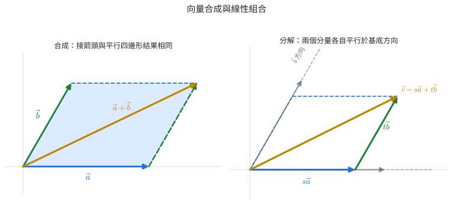
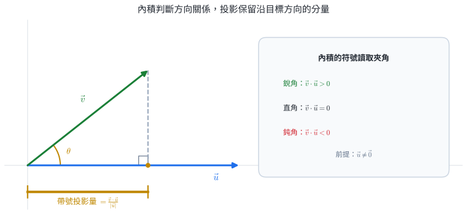
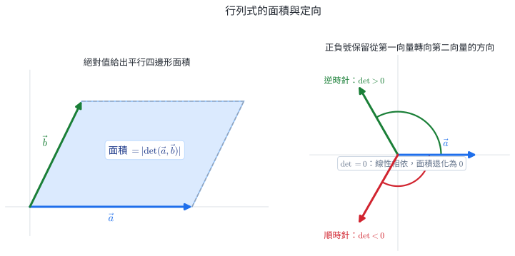
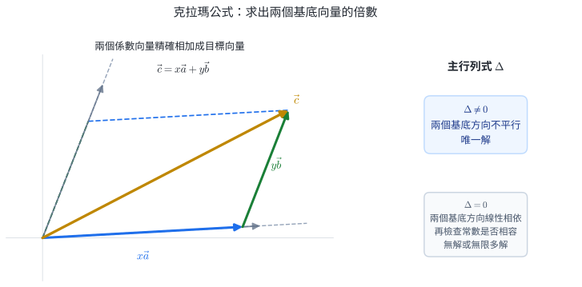

# 數A3-3 平面向量

::: learning-map
### 本章核心問題

1. **同時有大小和方向的量，怎麼用數字表示？**──用向量與分量記錄位移、速度或力。
2. **多個方向如何合成或分解？**──向量加減與線性組合把幾何動作變成分量運算。
3. **怎麼用計算判斷夾角、垂直與投影？**──內積量出一個方向在另一方向上的有效程度。
4. **怎麼用計算判斷面積、轉向與聯立方程的解？**──二階行列式同時帶著面積與方向資訊。

藍色：現行核心
青綠：理解支援
紫色：延伸內容

111–115 官方題本固定窗口中，5/5 份學測數學 A、3/5 份分科測驗數學甲至少有一題使用本章概念；這只描述已觀察試卷，不代表未來每年必考。
:::

## 0. 點、位置向量與位移

點 $P=(3,2)$ 回答「位置在哪裡」；向量 $\vec v=(3,2)$ 回答「往右 $3$、往上 $2$」。同一支向量可平移到不同位置，只要大小與方向不變；點則被固定在坐標平面的一個位置。

原點把兩者接起來：若 $P=(3,2)$，則位置向量

$$
\overrightarrow{OP}=(3,2).
$$

而兩點相減會得到位移：

$$
\boxed{\overrightarrow{AB}=B-A}.
$$

::: self-check
### 練習｜位移向量

$A(-1,4)$、$B(2,-2)$，求 $\overrightarrow{AB}$ 與 $\overrightarrow{BA}$。

**答案：**$\overrightarrow{AB}=(3,-6)$；$\overrightarrow{BA}=(-3,6)=-\overrightarrow{AB}$。
:::

## 1. 向量的表示、運算與線性組合

### 1.1 幾何表示

向量同時具有大小與方向，幾何上以有向線段表示：

- $\overrightarrow{AB}$ 的始點為 $A$、終點為 $B$；
- 大小記為 $|\overrightarrow{AB}|$；
- 兩向量大小相等、方向相同，就視為相等，與畫在哪裡無關；
- 零向量 $\vec0$ 的大小是 $0$，沒有唯一可指定的方向。

若 $\vec a$ 非零，$-\vec a$ 與它等長且方向相反。

### 1.2 坐標、長度與加減

設

$$
\vec a=(a_1,a_2),\qquad
\vec b=(b_1,b_2).
$$

::: concept
$$
\boxed{\vec a+\vec b=(a_1+b_1,a_2+b_2)}
$$

$$
\boxed{\vec a-\vec b=(a_1-b_1,a_2-b_2)}
$$

$$
\boxed{k\vec a=(ka_1,ka_2)}
$$

$$
\boxed{|\vec a|=\sqrt{a_1^2+a_2^2}}.
$$
:::

加法的幾何意義是把第二支箭接在第一支箭末端；也可畫成平行四邊形的對角線。分量公式分別相加水平位移與鉛直位移。

{width=95%}

::: {.why .keep-together}
### 向量如何表示並合成具有方向的量？

**大小與方向共同決定效果。** 船速 $5\ \mathrm{m/s}$、風速 $5\ \mathrm{m/s}$ 若方向不同，造成的位置變化完全不同。

**坐標分量便於計算與儲存。** 分量把方向變成機器、導航與程式可儲存、可相加的數字。

**分量相加表示同時發生的效果。** 同一時間內的各方向效應一起發生，總位移的水平與鉛直分量正好各自相加。

**應用與單位條件。** 導航把自身速度與水流／風速相加；電腦圖學用位移向量移動物件；物理把力分解成容易處理的方向。相加的向量須表示同類量並使用相容單位。
:::

::: worked-example
### 完整示範｜相對岸速度的向量合成

船相對水的速度為 $\vec v_b=(-3,4)\ \mathrm{m/s}$，河水速度為 $\vec v_r=(3,0)\ \mathrm{m/s}$。相對岸的實際速度是

$$
\vec v=\vec v_b+\vec v_r
=(-3,4)+(3,0)
=(0,4)\ \mathrm{m/s}.
$$

水平分量互相抵消，所以船會直達正對岸；過河速度為 $4\ \mathrm{m/s}$。而且

$$
|\vec v_b|=\sqrt{(-3)^2+4^2}=5,
$$

與船速條件一致。
:::

### 1.3 平行、單位向量與線性組合

若 $\vec a\ne\vec0$，與它同方向的單位向量為

$$
\boxed{\frac{\vec a}{|\vec a|}}.
$$

兩個非零向量平行，等價於其中一個是另一個的實數倍：

$$
\vec a\parallel\vec b
\iff
\vec b=k\vec a.
$$

把向量寫成

$$
s\vec a+t\vec b
$$

稱為 $\vec a,\vec b$ 的線性組合。若 $\vec a,\vec b$ 不平行，平面上每一向量都能唯一表示成這種形式；兩個不平行向量因此可作為平面的基準方向。

::: worked-example
### 完整示範｜以線性組合表示目標向量

設

$$
\vec a=(1,1),\qquad
\vec b=(2,-1).
$$

要找 $s,t$ 使 $s\vec a+t\vec b=(7,1)$，比較分量：

$$
\begin{cases}
s+2t=7,\\
s-t=1.
\end{cases}
$$

相減得 $3t=6$，所以 $t=2$、$s=3$。因此

$$
(7,1)=3\vec a+2\vec b.
$$

分量聯立方程就是「兩個方向各走幾倍」的操作答案。
:::

### 1.4 三角不等式：合位移的長度界線

從同一點沿 $\vec a$ 再沿 $\vec b$ 行走，折線路徑的總長是 $|\vec a|+|\vec b|$，起點到終點的直線位移是 $|\vec a+\vec b|$。兩點間直線最短，因此

::: concept
$$
\boxed{|\vec a+\vec b|\le|\vec a|+|\vec b|}.
$$

把 $\vec a=(\vec a-\vec b)+\vec b$ 代入同一不等式，可得

$$
\boxed{\bigl||\vec a|-|\vec b|\bigr|\le|\vec a-\vec b|}.
$$
:::

第一式取等號時，兩段路徑沒有折角：其中一向量為零，或兩個非零向量同方向。對非零向量而言，可寫成 $\vec a=t\vec b$ 且 $t>0$。

::: worked-example
### 完整示範｜只知道兩邊長也能界定合向量

已知 $|\vec a|=5$、$|\vec b|=2$。求 $|\vec a+\vec b|$ 的可能範圍，並說明端點何時取得。

三角不等式給上界：

$$
|\vec a+\vec b|\le5+2=7.
$$

把反向三角不等式用在 $\vec a+\vec b=\vec a-(-\vec b)$：

$$
|\vec a+\vec b|\ge\bigl||\vec a|-|\vec b|\bigr|=3.
$$

所以

$$
\boxed{3\le|\vec a+\vec b|\le7}.
$$

$\vec a,\vec b$ 同方向時取 $7$；反方向時取 $3$。
:::

### 1.5 仿射組合：係數和為 $1$ 決定直線與區域

設 $A\ne B$。直線 $AB$ 上任一點都可寫成

::: concept
$$
\boxed{
\overrightarrow{OP}
=(1-t)\overrightarrow{OA}+t\overrightarrow{OB}
},
\qquad t\in\mathbb R.
$$
:::

兩個係數的和是 $1$，所以原點改變時，這個點的位置關係不會改變。參數範圍直接描述位置：

| $t$ 的範圍 | $P$ 的位置 |
|---|---|
| $0<t<1$ | 線段 $AB$ 內部 |
| $t=0,1$ | 分別為 $A,B$ |
| $t<0$ | $A$ 的外側延長線 |
| $t>1$ | $B$ 的外側延長線 |

更一般地，若

$$
\overrightarrow{OP}
=\alpha\overrightarrow{OA}+\beta\overrightarrow{OB},
$$

則 $\alpha+\beta=1$ 一定使 $P$ 落在直線 $AB$ 上。若 $O,A,B$ 不共線，$\overrightarrow{OA},\overrightarrow{OB}$ 不平行，表示係數具有唯一性，此時還有

$$
\boxed{P\text{ 在直線 }AB\text{ 上}\iff\alpha+\beta=1}.
$$

若 $O,A,B$ 共線，係數表示可能不唯一；此時保留「係數和為 $1$ 足以保證在線上」，並用 $P=(1-t)A+tB$ 表示直線上的點。

兩個獨立方向則能張成區域。若 $\vec u,\vec v$ 不平行，

$$
\overrightarrow{OP}
=\overrightarrow{OA}+s\vec u+t\vec v,
\qquad 0\le s,t\le1,
$$

會掃過以 $A$、$A+\vec u$、$A+\vec v$、$A+\vec u+\vec v$ 為頂點的平行四邊形；限制係數就是限制沿兩個方向各走多少。

::: worked-example
### 完整示範｜由參數範圍找線段上的端點

$A=(0,2)$、$B=(8,-2)$，且

$$
P=(1-t)A+tB,
\qquad \frac14\le t\le\frac34.
$$

代入坐標：

$$
P=(8t,2-4t).
$$

參數沿固定方向連續變化，所以軌跡是 $AB$ 的一段。兩端分別為

$$
t=\frac14:\quad P=(2,1),
$$

$$
t=\frac34:\quad P=(6,-1).
$$

故軌跡是連接 $\boxed{(2,1)}$ 與 $\boxed{(6,-1)}$ 的線段。
:::

### 1.6 內分、外分與三角形中的分點

設 $P$ 在線段 $AB$ 上，且

$$
AP:PB=m:n.
$$

從 $A$ 往 $B$ 走了全程的 $m/(m+n)$，所以

$$
\overrightarrow{OP}
=\overrightarrow{OA}
+\frac{m}{m+n}\overrightarrow{AB}.
$$

整理後：

::: concept
$$
\boxed{
\overrightarrow{OP}
=\frac{n\overrightarrow{OA}+m\overrightarrow{OB}}{m+n}
}.
$$
:::

比例 $m$ 會配到 $B$，因為 $AP$ 越長，$P$ 越靠近 $B$。

::: self-check
### 練習｜分點

$A(0,3)$、$B(8,-1)$，$AP:PB=1:3$，求 $P$。

**答案：**

$$
P=\frac{3A+1B}{4}
=\left(\frac{8}{4},\frac{9-1}{4}\right)
=\boxed{(2,2)}.
$$
:::

外分點可直接使用參數式 $P=A+t(B-A)$。例如點在 $B$ 的外側時 $t>1$；先把距離比改寫成 $t:(t-1)$，可避免死背帶負號的公式。

三角形的重心 $G$ 是三條中線的交點。若頂點為 $A,B,C$，則

::: concept
$$
\boxed{
\overrightarrow{OG}
=\frac{\overrightarrow{OA}+\overrightarrow{OB}+\overrightarrow{OC}}{3}
}.
$$
:::

若 $AD$ 是 $\triangle ABC$ 的內角平分線，$D$ 在 $BC$ 上，角平分線定理給

$$
BD:DC=AB:AC.
$$

因此角平分線上的分點可先由邊長決定比例，再套用內分公式。

::: worked-example
### 完整示範｜外分點用參數解

$A=(1,2)$、$B=(5,-2)$，點 $P$ 在 $B$ 的外側，且 $AP:PB=3:1$。求 $P$。

令

$$
P=A+t(B-A),
\qquad t>1.
$$

則 $AP=t|AB|$、$PB=(t-1)|AB|$，所以

$$
\frac{t}{t-1}=3
\Longrightarrow
t=\frac32.
$$

因此

$$
P=(1,2)+\frac32(4,-4)
=\boxed{(7,-4)}.
$$

距離向量為 $\overrightarrow{AP}=(6,-6)$、$\overrightarrow{PB}=(-2,2)$；長度比確為 $3:1$。
:::

::: worked-example
### 完整示範｜角平分線定理接到分點公式

在 $\triangle ABC$ 中，$A=(0,0)$、$B=(-3,4)$、$C=(6,8)$。內角平分線 $AD$ 交 $BC$ 於 $D$。求 $D$。

先算邊長：

$$
AB=5,
\qquad
AC=10.
$$

角平分線定理給 $BD:DC=1:2$。因此

$$
D=\frac{2B+1C}{3}
=\frac{2(-3,4)+(6,8)}3
=\boxed{\left(0,\frac{16}{3}\right)}.
$$
:::

::: self-check
### 節末練習｜向量、線性組合與分點

1. 已知 $|\vec a|=8$、$|\vec b|=3$，寫出 $|\vec a+\vec b|$ 的可能範圍。
2. $\vec a=(6,-8)$，求與 $\vec a$ 同方向的單位向量。
3. $A=(2,-1)$、$B=(8,5)$，$P=(1-t)A+tB$。當 $-1\le t\le1/2$ 時，求軌跡兩端點。
4. 若 $\overrightarrow{OP}=k\overrightarrow{OA}+(2-k)\overrightarrow{OB}$，判斷是否能只由此式保證 $P$ 在直線 $AB$ 上。
5. $A=(0,0)$、$B=(6,3)$，點 $P$ 在 $B$ 外側且 $AP:PB=4:1$。求 $P$。
6. 三角形頂點為 $A=(1,2)$、$B=(7,-1)$、$C=(-2,5)$，求重心。

**答案：**

1. $5\le|\vec a+\vec b|\le11$。
2. $(3/5,-4/5)$。
3. $t=-1$ 得 $(-4,-7)$；$t=1/2$ 得 $(5,2)$；軌跡為兩點間線段。
4. 兩係數和為 $2$，一般不保證在直線 $AB$ 上。
5. 令 $P=A+t(B-A)$，$t/(t-1)=4$，得 $t=4/3$，所以 $P=(8,4)$。
6. $G=((1+7-2)/3,(2-1+5)/3)=(2,2)$。
:::

### 1.7 兩個係數的限制如何形成三角形

平行四邊形區域使用 $0\le s,t\le1$，因兩個方向可各自走完整的一倍。若改成

$$
s\ge0,
\qquad
t\ge0,
\qquad
s+t\le1,
$$

兩個方向合計至多走一倍，區域會變成三角形：

::: concept
$$
\overrightarrow{OP}
=\overrightarrow{OA}+s\vec u+t\vec v,
\quad
s,t\ge0,
\quad
s+t\le1
$$

的三個頂點為

$$
A,
\qquad
A+\vec u,
\qquad
A+\vec v.
$$
:::

把 $r=1-s-t$，便有 $r,s,t\ge0$ 且 $r+s+t=1$。位置向量也可寫成

$$
\overrightarrow{OP}
=r\overrightarrow{OA}
+s\overrightarrow{O(A+\vec u)}
+t\overrightarrow{O(A+\vec v)}.
$$

三個非負係數的和為 $1$，表示 $P$ 是三個頂點的加權平均，因此落在三角形內部或邊界。

::: worked-example
### 完整示範｜由係數條件找區域與一次式極值

設

$$
A=(1,1),
\qquad
\vec u=(4,0),
\qquad
\vec v=(0,6),
$$

且

$$
P=A+s\vec u+t\vec v,
\qquad
s,t\ge0,
\qquad
s+t\le1.
$$

三個頂點為

$$
A=(1,1),
\quad
A+\vec u=(5,1),
\quad
A+\vec v=(1,7).
$$

$A$ 到 $A+\vec u$ 的水平底長為 $4$，$A$ 到 $A+\vec v$ 的鉛直高為 $6$，因此區域面積為

$$
\frac12\times4\times6=\boxed{12}.
$$

又

$$
P=(1+4s,1+6t),
$$

所以

$$
x+y=2+4s+6t.
$$

在 $s,t\ge0$、$s+t\le1$ 下，把一單位係數放在 $t$ 所帶來的增量 $6$ 大於放在 $s$ 的增量 $4$；最大值在 $s=0,t=1$：

$$
\boxed{x+y\le8},
$$

等號點為 $\boxed{(1,7)}$。這也等於直接比較三個頂點的一次式值。
:::

## 2. 內積：量出方向的一致程度

### 2.1 夾角與兩種公式

兩個非零向量平移到同一始點後，較小夾角 $\theta$ 取在 $0\le\theta\le\pi$。

::: concept
$$
\boxed{\vec a\cdot\vec b=|\vec a||\vec b|\cos\theta}.
$$

若 $\vec a=(a_1,a_2)$、$\vec b=(b_1,b_2)$，則

$$
\boxed{\vec a\cdot\vec b=a_1b_1+a_2b_2}.
$$
:::

內積的結果是純量。

{width=92%}

::: why
### 幾何式與坐標式為什麼相等？

把 $\vec a,\vec b$ 共起點，第三邊是 $\vec a-\vec b$。餘弦定理給出

$$
|\vec a-\vec b|^2
=|\vec a|^2+|\vec b|^2
-2|\vec a||\vec b|\cos\theta.
$$

用坐標直接展開同一個長度：

$$
\begin{aligned}
|\vec a-\vec b|^2
&=(a_1-b_1)^2+(a_2-b_2)^2\\
&=|\vec a|^2+|\vec b|^2
-2(a_1b_1+a_2b_2).
\end{aligned}
$$

兩式在算同一段長度，對照後便得到

$$
a_1b_1+a_2b_2=|\vec a||\vec b|\cos\theta.
$$
:::

內積把三種幾何問題化成代數：

$$
\cos\theta=\frac{\vec a\cdot\vec b}{|\vec a||\vec b|},
$$

$$
\vec a\perp\vec b
\iff
\vec a\cdot\vec b=0
\quad(\vec a,\vec b\ne\vec0),
$$

在 $\vec a,\vec b$ 皆為非零向量時，內積為正、零、負，分別對應銳角、直角、鈍角。

::: worked-example
### 完整示範｜由坐標求夾角

設

$$
\vec a=(1,\sqrt3),
\qquad
\vec b=(2,0).
$$

先算內積與長度：

$$
\vec a\cdot\vec b=2,
\qquad
|\vec a|=2,
\qquad
|\vec b|=2.
$$

因此

$$
\cos\theta
=\frac{\vec a\cdot\vec b}{|\vec a||\vec b|}
=\frac{2}{4}
=\frac12.
$$

較小夾角 $0\le\theta\le\pi$，故

$$
\boxed{\theta=60^\circ}.
$$
:::

### 2.2 運算性質與長度

::: concept
$$
\vec a\cdot\vec b=\vec b\cdot\vec a,
$$

$$
\vec a\cdot(\vec b+\vec c)
=\vec a\cdot\vec b+\vec a\cdot\vec c,
$$

$$
(k\vec a)\cdot\vec b
=k(\vec a\cdot\vec b),
$$

$$
\vec a\cdot\vec a=|\vec a|^2.
$$
:::

因此

$$
|\vec a+\vec b|^2
=|\vec a|^2+2\vec a\cdot\vec b+|\vec b|^2,
$$

這是向量版的平方公式。

::: worked-example
### 完整示範｜用內積求線性組合的長度

已知 $|\vec a|=2$、$|\vec b|=3$，夾角為 $60^\circ$。求 $|2\vec a-\vec b|$。

先求

$$
\vec a\cdot\vec b
=2\cdot3\cdot\cos60^\circ
=3.
$$

再平方：

$$
\begin{aligned}
|2\vec a-\vec b|^2
&=(2\vec a-\vec b)\cdot(2\vec a-\vec b)\\
&=4|\vec a|^2-4\vec a\cdot\vec b+|\vec b|^2\\
&=16-12+9=13.
\end{aligned}
$$

故 $\boxed{|2\vec a-\vec b|=\sqrt{13}}$。
:::

### 2.3 正射影：只留下沿目標方向的部分

設 $\vec u\ne\vec0$。$\vec v$ 在 $\vec u$ 方向上的：

::: concept
**帶號投影量**

$$
\boxed{\frac{\vec v\cdot\vec u}{|\vec u|}}
$$

**投影向量**

$$
\boxed{
\operatorname{proj}_{\vec u}\vec v
=\frac{\vec v\cdot\vec u}{|\vec u|^2}\vec u
}.
$$
:::

投影量可為負，表示投影落在 $\vec u$ 的反方向；投影向量一定平行於 $\vec u$。

::: {.why .keep-together}
### 內積如何量化方向一致性？

**方向比例。** $\cos\theta$ 取出「沿著另一方向」的比例；垂直時比例為 $0$，反向時為負。

**尺度。** 一個長度提供被投影的量，另一個長度讓結果隨兩向量尺度一起變化。

**應用與前提。** 當力在所考慮位移中可視為恆定時，功 $W=\vec F\cdot\vec s$ 只計算沿位移方向的力；搜尋系統中的簡化餘弦相似度（要求 $\vec a,\vec b$ 皆為非零向量）

$$
\frac{\vec a\cdot\vec b}{|\vec a||\vec b|}
$$

比較兩組特徵的方向相似程度。實際辨識結果還取決於特徵建模、資料品質與判定門檻。
:::

::: self-check
### 練習｜內積與投影

$\vec u=(3,4)$、$\vec v=(4,-3)$。兩向量是否垂直？$\vec v$ 在 $\vec u$ 上的投影向量為何？

**答案：**$\vec u\cdot\vec v=12-12=0$，所以垂直；投影向量為 $\vec0$。
:::

::: worked-example
### 完整示範｜把向量分成平行與垂直兩部分

將 $\vec v=(5,4)$ 分解成平行於 $\vec u=(2,1)$ 的部分與垂直於 $\vec u$ 的部分。

先算

$$
\vec v\cdot\vec u=14,
\qquad
|\vec u|^2=5.
$$

平行部分為

$$
\vec v_{\parallel}
=\operatorname{proj}_{\vec u}\vec v
=\frac{14}{5}(2,1)
=\boxed{\left(\frac{28}{5},\frac{14}{5}\right)}.
$$

垂直部分為

$$
\begin{aligned}
\vec v_{\perp}
&=\vec v-\vec v_{\parallel}\\
&=\left(5,4\right)-\left(\frac{28}{5},\frac{14}{5}\right)\\
&=\boxed{\left(-\frac35,\frac65\right)}.
\end{aligned}
$$

驗算：

$$
\vec v_{\perp}\cdot\vec u
=-\frac35(2)+\frac65(1)=0,
$$

所以第二部分確實垂直於 $\vec u$。
:::

### 2.4 柯西不等式與極值

由

$$
\vec a\cdot\vec b=|\vec a||\vec b|\cos\theta
$$

及 $|\cos\theta|\le1$：

::: concept
$$
\boxed{
|\vec a\cdot\vec b|
\le|\vec a||\vec b|
}
$$

或

$$
\boxed{
(a_1b_1+a_2b_2)^2
\le(a_1^2+a_2^2)(b_1^2+b_2^2)
}.
$$

等號成立當且僅當其中一個向量是另一個的實數倍；兩向量皆非零時，就是彼此平行。若其中一個是零向量，等號也成立。
:::

看到「平方和固定，求一次式極值」，可把一次式配成內積；等號條件則告訴我們極值在哪裡取得。

::: worked-example
### 完整示範｜柯西不等式同時給極值與等號位置

已知 $x^2+y^2\le100$，求 $3x+4y$ 的最大值與最小值。

把一次式寫成內積：

$$
3x+4y=(3,4)\cdot(x,y).
$$

由柯西不等式，

$$
|3x+4y|
\le\sqrt{3^2+4^2}\sqrt{x^2+y^2}
\le5\cdot10=50.
$$

最大值 $50$ 在 $(x,y)$ 與 $(3,4)$ 同方向、且長度為 $10$ 時取得：

$$
(x,y)=2(3,4)=(6,8).
$$

最小值 $-50$ 在反方向時取得：

$$
(x,y)=(-6,-8).
$$

故

$$
\boxed{-50\le3x+4y\le50}.
$$
:::

### 2.5 直線的法向量

若 $(a,b)\ne(0,0)$，方程

$$
L:ax+by+c=0
$$

才確實表示一條直線。它的方向向量可取 $(b,-a)$，所以垂直於直線的法向量可取

$$
\boxed{\vec n=(a,b)}.
$$

兩直線的夾角可改成其方向向量或法向量的夾角。點 $P(x_0,y_0)$ 到直線的距離，也可視為某段位移在法向量上的投影：

$$
\boxed{
d=\frac{|ax_0+by_0+c|}{\sqrt{a^2+b^2}}
}.
$$

分母是非零法向量的長度。公式要求 $(a,b)\ne(0,0)$；$a=b=0$ 時，方程與分母都退化。

### 點線距離與垂足公式的投影來源

在直線 $L:ax+by+c=0$ 上任取一點 $Q=(x_1,y_1)$，則

$$
ax_1+by_1+c=0.
$$

對 $P=(x_0,y_0)$，位移 $\overrightarrow{QP}$ 在法向量 $\vec n=(a,b)$ 上的帶號投影量為

$$
\frac{\overrightarrow{QP}\cdot\vec n}{|\vec n|}
=\frac{a(x_0-x_1)+b(y_0-y_1)}{\sqrt{a^2+b^2}}.
$$

利用 $ax_1+by_1=-c$，分子化成 $ax_0+by_0+c$。取絕對值便得到點線距離公式。

垂足 $H$ 則是從 $P$ 沿法向量退回直線。設

$$
H=P-\lambda(a,b).
$$

把 $H$ 代入直線方程，可得

$$
\lambda=\frac{ax_0+by_0+c}{a^2+b^2}.
$$

因此

::: concept
$$
\boxed{
H=(x_0,y_0)
-\frac{ax_0+by_0+c}{a^2+b^2}(a,b)
}.
$$
:::

::: worked-example
### 完整示範｜求垂足並用方程驗證

求點 $P=(4,0)$ 到直線

$$
L:2x-y+1=0
$$

的垂足與距離。

這裡 $(a,b,c)=(2,-1,1)$，所以

$$
ax_0+by_0+c=2(4)-0+1=9,
\qquad
a^2+b^2=5.
$$

垂足

$$
\begin{aligned}
H
&=(4,0)-\frac95(2,-1)\\
&=\boxed{\left(\frac25,\frac95\right)}.
\end{aligned}
$$

代入直線：

$$
2\left(\frac25\right)-\frac95+1=0,
$$

所以 $H$ 確實在 $L$ 上。距離為

$$
PH=\frac{|9|}{\sqrt5}
=\boxed{\frac{9\sqrt5}{5}}.
$$
:::

::: worked-example
### 完整示範｜由法向量求平行線、垂直線與點線距離

給定

$$
L:3x-4y+8=0
$$

與點 $P=(2,5)$。

$L$ 的法向量可取 $(3,-4)$，方向向量可取 $(4,3)$。

通過 $P$ 且平行於 $L$ 的直線沿用同一法向量：

$$
3(x-2)-4(y-5)=0
\Longrightarrow
\boxed{3x-4y+14=0}.
$$

通過 $P$ 且垂直於 $L$ 的直線可用 $(4,3)$ 作法向量：

$$
4(x-2)+3(y-5)=0
\Longrightarrow
\boxed{4x+3y-23=0}.
$$

點到 $L$ 的距離為

$$
d=\frac{|3(2)-4(5)+8|}{\sqrt{3^2+(-4)^2}}
=\frac6{5}.
$$

所以 $\boxed{d=6/5}$。
:::

::: self-check
### 節末練習｜內積、投影、極值與直線

1. 求 $\vec a=(3,1)$、$\vec b=(-1,2)$ 的夾角 cosine，並判斷是銳角或鈍角。
2. 求 $k$，使 $(k,3)$ 與 $(2,-4)$ 垂直。
3. 求 $\vec v=(4,5)$ 在 $\vec u=(1,2)$ 上的投影向量。
4. 已知 $x^2+y^2=25$，求 $4x-3y$ 的最大值及等號位置。
5. 求點 $(1,-2)$ 到直線 $2x+y-7=0$ 的距離。
6. 求通過 $(3,1)$ 且垂直於 $x+2y-5=0$ 的直線方程。

**答案：**

1. $\cos\theta=(-3+2)/(\sqrt{10}\sqrt5)=-1/\sqrt{50}$，所以是鈍角。
2. $2k-12=0$，故 $k=6$。
3. $(\vec v\cdot\vec u/|\vec u|^2)\vec u=(14/5)(1,2)=(14/5,28/5)$。
4. 最大值 $25$；在 $(x,y)=(4,-3)$ 取得。
5. $|2(1)+(-2)-7|/\sqrt5=7/\sqrt5=7\sqrt5/5$。
6. 原直線方向向量可取 $(2,-1)$；所求直線以 $(2,-1)$ 為法向量：$2(x-3)-(y-1)=0$，即 $2x-y-5=0$。
:::

## 3. 二階行列式：面積、方向與聯立方程

### 3.1 面積與定向

設

$$
\vec a=(a_1,a_2),\qquad
\vec b=(b_1,b_2).
$$

定義二階行列式

$$
\det(\vec a,\vec b)
=
\begin{vmatrix}
a_1&b_1\\
a_2&b_2
\end{vmatrix}
=a_1b_2-a_2b_1.
$$

::: concept
由 $\vec a,\vec b$ 張成的平行四邊形面積：

$$
\boxed{
A_{\mathrm{平行四邊形}}
=|\det(\vec a,\vec b)|
}.
$$

由同一頂點出發的兩邊所成三角形面積：

$$
\boxed{
A_{\triangle}
=\frac12|\det(\vec a,\vec b)|
}.
$$
:::

{width=92%}

::: {.why .keep-together}
### 為什麼 $a_1b_2-a_2b_1$ 會給出面積？

平行四邊形面積為

$$
A=|\vec a||\vec b||\sin\theta|.
$$

又

$$
\begin{aligned}
A^2
&=|\vec a|^2|\vec b|^2-(\vec a\cdot\vec b)^2\\
&=(a_1^2+a_2^2)(b_1^2+b_2^2)
-(a_1b_1+a_2b_2)^2\\
&=(a_1b_2-a_2b_1)^2.
\end{aligned}
$$

因面積非負，開根號後取絕對值。
:::

不取絕對值時，行列式的正負還有幾何意義：

- $\det(\vec a,\vec b)>0$：從 $\vec a$ 轉向 $\vec b$ 是逆時針；
- $\det(\vec a,\vec b)<0$：是順時針；
- $\det(\vec a,\vec b)=0$：兩向量線性相依，張成的圖形退化且面積為 $0$；若兩者都非零，才可說它們平行。

::: worked-example
### 完整示範｜三點面積與排列方向一起判斷

$A=(-1,2)$、$B=(4,3)$、$C=(2,7)$。求 $\triangle ABC$ 面積，並判斷 $A\to B\to C$ 的轉向。

從同一頂點 $A$ 出發：

$$
\overrightarrow{AB}=(5,1),
\qquad
\overrightarrow{AC}=(3,5).
$$

行列式為

$$
\det(\overrightarrow{AB},\overrightarrow{AC})
=5\cdot5-1\cdot3=22.
$$

所以

$$
A_{\triangle ABC}=\frac12|22|=\boxed{11}.
$$

行列式為正，因此從 $\overrightarrow{AB}$ 轉到 $\overrightarrow{AC}$ 是逆時針；$A\to B\to C$ 為左轉。
:::

::: {.why .keep-together}
### 行列式為什麼保留正負？

**幾何面積。** 幾何面積取行列式的絕對值。

**定向資訊。** 正負號保留頂點的排列方向；交換兩向量，旋轉方向反轉，行列式也變號。

**應用與範圍。** 地圖與電腦圖學可用行列式符號判斷三點是左轉、右轉或共線；三角網格也用一致定向避免把面翻反。這裡只使用二維幾何判斷，不延伸到三維外積。
:::

### 3.2 行列式的基本性質

由 $ad-bc$ 直接展開可得：

1. 交換兩行或兩列，行列式變號；
2. 某一行或列乘 $k$，行列式也乘 $k$；
3. 某一行加上另一行的 $k$ 倍，行列式不變；
4. 兩行或兩列成比例時，行列式為 $0$。

這些性質可以簡化計算；二階情形也可直接展開 $ad-bc$ 驗證。

::: worked-example
### 完整示範｜用加倍數性質保留行列式

計算

$$
\begin{vmatrix}
2&5\\
3&7
\end{vmatrix}.
$$

第二欄減去第一欄的 $2$ 倍，行列式不變：

$$
\begin{vmatrix}
2&5\\
3&7
\end{vmatrix}
=
\begin{vmatrix}
2&1\\
3&1
\end{vmatrix}
=2-3
=\boxed{-1}.
$$

直接展開原式也得 $2\cdot7-3\cdot5=-1$。欄運算的作用是讓數字變簡單，行列式值仍由同一個面積倍率決定。
:::

::: worked-example
### 完整示範｜沿底邊平移頂點，面積保持不變

令

$$
A=(0,0),
\qquad
B=(6,0),
\qquad
C=(t,4).
$$

雖然 $C$ 的水平位置隨 $t$ 改變，三角形底 $AB$ 與高仍分別為 $6$、$4$。用行列式計算：

$$
\overrightarrow{AB}=(6,0),
\qquad
\overrightarrow{AC}=(t,4),
$$

$$
\det(\overrightarrow{AB},\overrightarrow{AC})
=6\cdot4-0\cdot t=24.
$$

所以對所有實數 $t$，

$$
\boxed{A_{\triangle ABC}=12}.
$$

把 $C$ 沿著與底邊平行的方向平移，相當於在第二欄加上第一欄的某個倍數；這正是行列式不變的欄運算。幾何上的「同底等高」與代數性質是同一件事。
:::

::: self-check
### 練習｜面積與定向

$\vec a=(4,1)$、$\vec b=(2,5)$。求平行四邊形面積，並判斷從 $\vec a$ 到 $\vec b$ 的轉向。

**答案：**

$$
\det(\vec a,\vec b)=4\cdot5-1\cdot2=18>0.
$$

面積為 $\boxed{18}$，方向為逆時針。
:::

### 3.3 二階方陣、矩陣乘向量與克拉瑪公式

考慮二元一次方程組

$$
\begin{cases}
a_1x+b_1y=c_1,\\
a_2x+b_2y=c_2.
\end{cases}
$$

由 $2$ 列、$2$ 欄排成的數表稱為**二階方陣**：

$$
A=
\begin{pmatrix}
a_1&b_1\\
a_2&b_2
\end{pmatrix}.
$$

在上述方程組中，$A$ 收集未知數 $x,y$ 的係數，稱為方程組的**係數矩陣**。令

$$
\mathbf{x}=\begin{pmatrix}x\\y\end{pmatrix},
\qquad
\mathbf{c}=\begin{pmatrix}c_1\\c_2\end{pmatrix}.
$$

二階方陣乘直行向量的定義為

$$
\boxed{
\begin{pmatrix}
a_1&b_1\\
a_2&b_2
\end{pmatrix}
\begin{pmatrix}x\\y\end{pmatrix}
=
\begin{pmatrix}
a_1x+b_1y\\
a_2x+b_2y
\end{pmatrix}}
$$

因此原方程組可簡寫為

$$
A\mathbf{x}=\mathbf{c}.
$$

乘積的第一個分量由第一列與 $(x,y)$ 對應相乘後相加，第二個分量由第二列以同樣規則得到。若改從欄向量觀察，矩陣乘法等於

$$
A\mathbf{x}
=x\begin{pmatrix}a_1\\a_2\end{pmatrix}
+y\begin{pmatrix}b_1\\b_2\end{pmatrix};
$$

解方程組就是找出兩個係數，使係數矩陣的兩欄線性組合成目標向量 $\mathbf{c}$。

令

$$
\Delta=
\begin{vmatrix}
a_1&b_1\\
a_2&b_2
\end{vmatrix},
\quad
\Delta_x=
\begin{vmatrix}
c_1&b_1\\
c_2&b_2
\end{vmatrix},
\quad
\Delta_y=
\begin{vmatrix}
a_1&c_1\\
a_2&c_2
\end{vmatrix}.
$$

::: {.concept .keep-together}
若 $\Delta\ne0$，方程組恰有一組解：

$$
\boxed{x=\frac{\Delta_x}{\Delta},\qquad
y=\frac{\Delta_y}{\Delta}}.
$$
:::

{width=92%}

### 克拉瑪公式如何由行列式抽出係數

把三個直行向量記為

$$
\vec a=\begin{pmatrix}a_1\\a_2\end{pmatrix},
\quad
\vec b=\begin{pmatrix}b_1\\b_2\end{pmatrix},
\quad
\vec c=\begin{pmatrix}c_1\\c_2\end{pmatrix}.
$$

方程組就是

$$
\vec c=x\vec a+y\vec b.
$$

在兩邊的第二欄都放 $\vec b$，並取行列式：

$$
\begin{aligned}
\det(\vec c,\vec b)
&=\det(x\vec a+y\vec b,\vec b)\\
&=x\det(\vec a,\vec b)+y\det(\vec b,\vec b)\\
&=x\Delta.
\end{aligned}
$$

因 $\det(\vec b,\vec b)=0$，$y$ 項被消去，所以 $\Delta_x=x\Delta$。同理，

$$
\det(\vec a,\vec c)=y\Delta,
$$

即 $\Delta_y=y\Delta$。當 $\Delta\ne0$ 時可相除，得到

$$
x=\frac{\Delta_x}{\Delta},
\qquad
y=\frac{\Delta_y}{\Delta}.
$$

這個推導使用行列式對每一欄的分配律；二階情形可直接展開 $ad-bc$ 驗證。

$\Delta\ne0$ 表示兩個係數向量線性獨立，能唯一張成目標；$\Delta=0$ 表示它們線性相依，這時需再看常數是否相容。以下分類假設兩個方程都確實表示直線，也就是每一式的 $x,y$ 係數不全為 $0$：

- $\Delta=0$，但 $\Delta_x$ 或 $\Delta_y$ 非零：無解，兩直線平行；
- $\Delta=\Delta_x=\Delta_y=0$：無限多解，兩直線重合。

::: worked-example
### 完整示範｜用克拉瑪公式解二元一次方程組

解

$$
\begin{cases}
3x+2y=7,\\
x-y=4.
\end{cases}
$$

三個行列式為

$$
\Delta=
\begin{vmatrix}
3&2\\
1&-1
\end{vmatrix}
=-3-2=-5,
$$

$$
\Delta_x=
\begin{vmatrix}
7&2\\
4&-1
\end{vmatrix}
=-7-8=-15,
$$

$$
\Delta_y=
\begin{vmatrix}
3&7\\
1&4
\end{vmatrix}
=12-7=5.
$$

因 $\Delta\ne0$，有唯一解：

$$
\boxed{x=\frac{-15}{-5}=3,
\qquad
y=\frac5{-5}=-1}.
$$

代回第一式得 $9-2=7$，第二式得 $3-(-1)=4$。
:::

::: worked-example
### 完整示範｜用兩項生產紀錄判斷資料是否足以還原工時

某工廠有甲、乙兩條產線。甲線每小時加工 $2$ 公斤原料並耗電 $1$ 度，乙線每小時加工 $4$ 公斤原料並耗電 $2$ 度。令 $x,y$ 分別為兩條產線的運轉時數；工時可連續計量，且 $x,y\ge0$。

係數矩陣為

$$
A=
\begin{pmatrix}
2&4\\
1&2
\end{pmatrix},
\qquad
\Delta=2\cdot2-1\cdot4=0.
$$

兩欄成比例，表示兩條產線的「加工量與耗電量之比」相同；兩項總量紀錄可能只是同一項資訊的倍數，未必能分辨各線工時。

**紀錄一：總加工量 $20$ 公斤、總耗電量 $10$ 度。** 方程組為

$$
\begin{cases}
2x+4y=20,\\
x+2y=10.
\end{cases}
$$

此時

$$
\Delta_x=
\begin{vmatrix}
20&4\\
10&2
\end{vmatrix}=0,
\qquad
\Delta_y=
\begin{vmatrix}
2&20\\
1&10
\end{vmatrix}=0.
$$

第一式正好是第二式的 $2$ 倍，兩式共同留下

$$
x+2y=10.
$$

令 $y=t$，則 $x=10-2t$。配合 $x,y\ge0$，得到

$$
\boxed{(x,y)=(10-2t,t),\qquad 0\le t\le5}.
$$

可行解包含 $(10,0)$、$(6,2)$、$(0,5)$ 等無限多組。兩份紀錄彼此相容，卻沒有提供足以分開兩條產線的獨立資訊，因此無法唯一還原工時。

**紀錄二：總加工量 $20$ 公斤、總耗電量 $9$ 度。** 方程組改為

$$
\begin{cases}
2x+4y=20,\\
x+2y=9.
\end{cases}
$$

係數矩陣不變，所以 $\Delta=0$；進一步計算

$$
\Delta_x=
\begin{vmatrix}
20&4\\
9&2
\end{vmatrix}=4,
\qquad
\Delta_y=
\begin{vmatrix}
2&20\\
1&9
\end{vmatrix}=-2.
$$

任一替換行列式非零即表示常數與原本的比例關係不相容。把第二式乘以 $2$ 會得到 $2x+4y=18$，與第一式要求的 $2x+4y=20$ 衝突，所以方程組無解。

$$
\boxed{\Delta=0\text{ 時，還要比較常數是否維持相同比例，才能區分無限多解與無解。}}
$$

這個判別可用來檢查量測紀錄的一致性，也說明兩個讀值若來自相同比例的量測機制，就無法單獨辨識兩個未知來源。
:::

::: pitfall
### 適用範圍｜$\Delta\ne0$ 時使用克拉瑪公式

克拉瑪除法公式要求 $\Delta\ne0$。$\Delta=0$ 時除以 $0$ 沒有意義，需改判斷無解或無限多解。
:::

::: self-check
### 節末練習｜行列式、面積與聯立方程

1. $A=(0,1)$、$B=(6,2)$、$C=(2,5)$，求 $\triangle ABC$ 面積與 $A\to B\to C$ 的轉向。
2. $A=(1,2)$、$B=(4,5)$、$C=(k,8)$ 共線，求 $k$。
3. 已知 $\begin{vmatrix}a&b\\c&d\end{vmatrix}=6$，求 $\begin{vmatrix}a&a+3b\\c&c+3d\end{vmatrix}$。
4. $\vec a=(m,2)$、$\vec b=(3,1)$ 張成的平行四邊形面積為 $5$，求 $m$。
5. 用克拉瑪公式解 $2x+3y=1$、$5x-y=18$。
6. 依 $k$ 分類 $kx+y=1$、$4x+ky=2$ 的解的個數。

**答案：**

1. $\overrightarrow{AB}=(6,1)$、$\overrightarrow{AC}=(2,4)$；行列式 $22>0$，面積 $11$，逆時針。
2. $\det((3,3),(k-1,6))=18-3(k-1)=0$，所以 $k=7$。
3. 第二欄是第一欄加原第二欄的 $3$ 倍，故值為 $3\cdot6=18$。
4. $|m-6|=5$，所以 $m=1$ 或 $11$。
5. $\Delta=-17$、$\Delta_x=-55$、$\Delta_y=31$，所以 $(x,y)=(55/17,-31/17)$。
6. $\Delta=k^2-4$。$k\ne\pm2$ 時唯一解；$k=2$ 時第二式是第一式的 $2$ 倍，無限多解；$k=-2$ 時常數不合比例，無解。
:::

## 4. 一頁核心整理

::: summary-box
### 表示與線性組合

- $\overrightarrow{AB}=B-A$；向量是變化，點是位置。
- 加減與係數積逐分量運算；$|\vec a|=\sqrt{a_1^2+a_2^2}$。
- $\vec b=k\vec a$ 表示兩非零向量平行。
- 三角不等式：$|\vec a+\vec b|\le|\vec a|+|\vec b|$；同方向時取得上界。
- $P=(1-t)A+tB$ 描述直線 $AB$；$0\le t\le1$ 描述線段。
- $AP:PB=m:n$ 時，$P=(nA+mB)/(m+n)$。
- 三角形重心 $G=(A+B+C)/3$；角平分線分點比由鄰邊長決定。

### 內積

- $\vec a\cdot\vec b=a_1b_1+a_2b_2=|\vec a||\vec b|\cos\theta$。
- 兩向量皆非零時，內積為 $0$ 判垂直；正負分別對應夾角為銳角或鈍角。
- 投影向量：$\operatorname{proj}_{\vec u}\vec v=(\vec v\cdot\vec u/|\vec u|^2)\vec u$。
- 柯西：$|\vec a\cdot\vec b|\le|\vec a||\vec b|$；兩者非零時，等號在平行時成立。
- $ax+by+c=0$ 的法向量可取 $(a,b)$。
- 點線距離與垂足都來自位移在法向量上的投影。

### 行列式

- $\det(\vec a,\vec b)=a_1b_2-a_2b_1$。
- 絕對值是平行四邊形面積；一半是三角形面積。
- 正負判逆時針／順時針；為 $0$ 判線性相依，兩向量皆非零時才稱平行。
- $A\mathbf{x}=\mathbf{c}$ 表示係數矩陣的兩欄以 $x,y$ 線性組合成目標向量；每個乘積分量由一列與 $\mathbf{x}$ 對應相乘後相加。
- 克拉瑪公式只在 $\Delta\ne0$ 時直接給唯一解。
- 在兩式皆表示直線的條件下，$\Delta=0$ 且替換行列式皆為 $0$ 對應無限多解；至少一個非零對應無解。
- 克拉瑪公式由 $\det(x\vec a+y\vec b,\vec b)=x\det(\vec a,\vec b)$ 抽出係數。
:::

## 5. 分層題與跨節整合題

### 題目 1｜坐標與運算

$A(-2,1)$、$B(4,5)$，另有 $\vec a=(2,-1)$、$\vec b=(-3,4)$。

1. 求 $\overrightarrow{AB}$ 與其長度；
2. 求 $3\vec a-2\vec b$。

### 題目 2｜分點與線性組合

$A(1,-2)$、$B(7,4)$，點 $P$ 滿足 $AP:PB=2:1$。求 $P$，並把 $\overrightarrow{OP}$ 寫成 $\overrightarrow{OA}$、$\overrightarrow{OB}$ 的線性組合。

### 題目 3｜合速度

河寬 $240\ \mathrm m$，水流速度為 $(3,0)\ \mathrm{m/s}$。船相對水的速率為 $5\ \mathrm{m/s}$。若船頭方向選成 $(-3,4)$，求船相對岸的實際速度與過河時間。

### 題目 4｜內積與垂直

$\vec a=(2,k)$、$\vec b=(3,-2)$ 互相垂直，求 $k$，並驗算兩向量的內積。

### 題目 5｜正射影

求 $\vec v=(5,1)$ 在 $\vec u=(2,1)$ 上的正射影向量，並求 $\vec v$ 到通過原點、方向為 $\vec u$ 的直線之垂直分量長度。

### 題目 6｜柯西與極值

實數 $x,y$ 滿足 $x^2+y^2=13$。求 $2x-3y$ 的最大值與最小值，並求等號時的 $(x,y)$。

### 題目 7｜三角形面積與轉向

$A(1,1)$、$B(5,2)$、$C(3,6)$。求 $\triangle ABC$ 面積，並判斷依 $A\to B\to C$ 行走是左轉（逆時針）或右轉（順時針）。

### 題目 8｜克拉瑪公式與解的分類

1. 用克拉瑪公式解

$$
\begin{cases}
2x+y=7,\\
x-2y=-4.
\end{cases}
$$

2. 依 $k$ 的值，判斷

$$
\begin{cases}
kx+y=2,\\
4x+ky=4
\end{cases}
$$

有唯一解、無解或無限多解。

### 題目 9｜三角不等式的等號條件

令

$$
\vec a=(1,2),
\qquad
\vec b=(k,2k).
$$

求所有實數 $k$，使

$$
|\vec a+\vec b|=|\vec a|+|\vec b|.
$$

### 題目 10｜係數範圍與點的軌跡

$A=(-2,1)$、$B=(6,5)$，且

$$
P=(1-t)A+tB,
\qquad -\frac12\le t\le\frac32.
$$

求 $P$ 的軌跡兩端點，並指出 $t=0,1$ 分別對應哪一點。

### 題目 11｜角平分線與重心

$A=(0,0)$、$B=(3,4)$、$C=(5,12)$。

1. 內角平分線 $AD$ 交 $BC$ 於 $D$，求 $D$；
2. 求 $\triangle ABC$ 的重心 $G$。

### 題目 12｜法向量與點線距離

給定直線

$$
L:4x-3y+1=0
$$

與點 $P=(2,6)$。

1. 求 $P$ 到 $L$ 的距離；
2. 求通過 $P$ 且平行於 $L$ 的直線；
3. 求通過 $P$ 且垂直於 $L$ 的直線。

### 題目 13｜跨節整合：內積、長度與面積

已知 $|\vec a|=5$、$|\vec b|=7$、$\vec a\cdot\vec b=14$。

1. 求 $|\vec a-\vec b|$；
2. 求由 $\vec a,\vec b$ 張成的平行四邊形面積；
3. 求由同一對向量張成的三角形面積。

### 題目 14｜跨節整合：線性組合的區域與面積

令 $A=(1,-1)$、$\vec u=(4,1)$、$\vec v=(-2,3)$，點 $P$ 滿足

$$
\overrightarrow{OP}
=\overrightarrow{OA}+s\vec u+t\vec v,
\qquad 0\le s,t\le1.
$$

1. 列出軌跡平行四邊形的四個頂點；
2. 求此區域面積；
3. 判斷 $Q=(3,1)$ 是否在此區域內，並求對應的 $s,t$。

### 題目 15｜跨節整合：交點與三角形面積

兩直線

$$
L_1:2x+y=5,
\qquad
L_2:x-2y=-4
$$

相交於 $P$。

1. 用克拉瑪公式求 $P$；
2. 兩直線分別交 $x$ 軸於 $A,B$。求 $\triangle PAB$ 面積。

### 題目 16｜跨節整合：柯西與行列式極值

點 $P=(x,y)$ 在圓 $x^2+y^2=25$ 上，固定向量 $\vec u=(3,4)$。

1. 求 $|\det(\overrightarrow{OP},\vec u)|$ 的最大值；
2. 求取得最大值的所有 $P$；
3. 求此時由 $\overrightarrow{OP},\vec u$ 張成的三角形最大面積。

::: page-break
:::

## 6. 分層題與跨節整合題詳解

::: solution
### 第 1 題

終點減起點：

$$
\overrightarrow{AB}
=(4-(-2),5-1)
=\boxed{(6,4)}.
$$

長度：

$$
|\overrightarrow{AB}|
=\sqrt{6^2+4^2}
=\boxed{2\sqrt{13}}.
$$

另

$$
3\vec a-2\vec b
=(6,-3)-(-6,8)
=\boxed{(12,-11)}.
$$
:::

::: solution
### 第 2 題

$AP:PB=2:1$，所以

$$
P=\frac{1A+2B}{3}
=\left(
\frac{1+14}{3},
\frac{-2+8}{3}
\right)
=\boxed{(5,2)}.
$$

位置向量寫成

$$
\boxed{
\overrightarrow{OP}
=\frac13\overrightarrow{OA}
+\frac23\overrightarrow{OB}
}.
$$
:::

::: solution
### 第 3 題

船相對水速度為 $\vec v_b=(-3,4)$，且

$$
|\vec v_b|=\sqrt{9+16}=5,
$$

符合題意。合成水流後：

$$
\vec v
=(-3,4)+(3,0)
=\boxed{(0,4)\ \mathrm{m/s}}.
$$

船只剩垂直河岸的速度 $4\ \mathrm{m/s}$，過河時間為

$$
\frac{240}{4}
=\boxed{60\ \mathrm s}.
$$
:::

::: solution
### 第 4 題

垂直表示內積為 $0$：

$$
(2,k)\cdot(3,-2)
=6-2k=0.
$$

所以 $\boxed{k=3}$。驗算：

$$
(2,3)\cdot(3,-2)
=6-6=0.
$$
:::

::: solution
### 第 5 題

先算

$$
\vec v\cdot\vec u
=5\cdot2+1\cdot1
=11,
\qquad
|\vec u|^2=2^2+1^2=5.
$$

所以投影向量為

$$
\operatorname{proj}_{\vec u}\vec v
=\frac{11}{5}(2,1)
=\boxed{\left(\frac{22}{5},\frac{11}{5}\right)}.
$$

垂直分量為

$$
\vec v-\operatorname{proj}_{\vec u}\vec v
=\left(\frac35,-\frac65\right).
$$

其長度

$$
\sqrt{\left(\frac35\right)^2+\left(-\frac65\right)^2}
=\frac{\sqrt{45}}5
=\boxed{\frac{3\sqrt5}{5}}.
$$
:::

::: solution
### 第 6 題

把 $2x-3y$ 寫成內積：

$$
2x-3y=(2,-3)\cdot(x,y).
$$

柯西不等式給

$$
|2x-3y|
\le\sqrt{2^2+(-3)^2}\sqrt{x^2+y^2}
=\sqrt{13}\sqrt{13}
=13.
$$

所以最大值為 $\boxed{13}$，在 $(x,y)$ 與 $(2,-3)$ 同向且長度相同時取得，即

$$
\boxed{(x,y)=(2,-3)}.
$$

最小值為 $\boxed{-13}$，在反向時取得：

$$
\boxed{(x,y)=(-2,3)}.
$$
:::

::: solution
### 第 7 題

從 $A$ 出發：

$$
\overrightarrow{AB}=(4,1),
\qquad
\overrightarrow{AC}=(2,5).
$$

行列式為

$$
\det(\overrightarrow{AB},\overrightarrow{AC})
=4\cdot5-1\cdot2
=18.
$$

三角形面積：

$$
\boxed{\frac12|18|=9}.
$$

行列式為正，所以從 $\overrightarrow{AB}$ 轉到 $\overrightarrow{AC}$ 為逆時針；依 $A\to B\to C$ 行走是 $\boxed{\text{左轉}}$。
:::

::: solution
### 第 8 題

第一小題：

$$
\Delta=
\begin{vmatrix}
2&1\\
1&-2
\end{vmatrix}
=-4-1=-5,
$$

$$
\Delta_x=
\begin{vmatrix}
7&1\\
-4&-2
\end{vmatrix}
=-14+4=-10,
$$

$$
\Delta_y=
\begin{vmatrix}
2&7\\
1&-4
\end{vmatrix}
=-8-7=-15.
$$

因此

$$
\boxed{x=\frac{-10}{-5}=2,\qquad
y=\frac{-15}{-5}=3}.
$$

第二小題的主行列式：

$$
\Delta=
\begin{vmatrix}
k&1\\
4&k
\end{vmatrix}
=k^2-4
=(k-2)(k+2).
$$

- 若 $k\ne\pm2$，則 $\Delta\ne0$，有唯一解。
- 若 $k=2$，兩式為 $2x+y=2$ 與 $4x+2y=4$，第二式是第一式的 $2$ 倍，所以有無限多解。
- 若 $k=-2$，兩式為 $-2x+y=2$ 與 $4x-2y=4$；左邊第二式是第一式的 $-2$ 倍，右邊依相同比例應為 $-4$，題目卻為 $4$，所以無解。

故

$$
\boxed{
\begin{cases}
k\ne\pm2：\text{唯一解},\\
k=2：\text{無限多解},\\
k=-2：\text{無解}.
\end{cases}}
$$
:::

::: solution
### 第 9 題

因

$$
\vec b=(k,2k)=k(1,2)=k\vec a,
$$

兩向量始終平行。三角不等式取等號需要其中一向量為零，或兩個非零向量同方向。

- $k=0$ 時 $\vec b=\vec0$，等號成立；
- $k>0$ 時 $\vec b$ 與 $\vec a$ 同方向，等號成立；
- $k<0$ 時兩者反方向，折線長度大於合位移長度。

所以

$$
\boxed{k\ge0}.
$$
:::

::: solution
### 第 10 題

把參數式展開：

$$
P=A+t(B-A)
=(-2,1)+t(8,4)
=(-2+8t,1+4t).
$$

方向固定，參數在閉區間內變化，所以軌跡是兩個端點間的線段。

當 $t=-1/2$：

$$
P=(-6,-1).
$$

當 $t=3/2$：

$$
P=(10,7).
$$

故軌跡端點為 $\boxed{(-6,-1)}$、$\boxed{(10,7)}$。另外 $t=0$ 對應 $A$，$t=1$ 對應 $B$。
:::

::: solution
### 第 11 題

先算

$$
AB=\sqrt{3^2+4^2}=5,
\qquad
AC=\sqrt{5^2+12^2}=13.
$$

角平分線定理給

$$
BD:DC=AB:AC=5:13.
$$

所以

$$
\begin{aligned}
D
&=\frac{13B+5C}{18}\\
&=\frac{13(3,4)+5(5,12)}{18}\\
&=\boxed{\left(\frac{32}{9},\frac{56}{9}\right)}.
\end{aligned}
$$

重心是三頂點坐標平均：

$$
G=\frac{A+B+C}{3}
=\boxed{\left(\frac83,\frac{16}{3}\right)}.
$$
:::

::: solution
### 第 12 題

直線 $L$ 的法向量為 $(4,-3)$，長度為 $5$。點線距離：

$$
d=\frac{|4(2)-3(6)+1|}{5}
=\boxed{\frac95}.
$$

平行線沿用法向量 $(4,-3)$。設為 $4x-3y+c=0$，代入 $P$：

$$
8-18+c=0
\Longrightarrow c=10.
$$

所以平行線是

$$
\boxed{4x-3y+10=0}.
$$

$L$ 的方向向量可取 $(3,4)$；垂直於 $L$ 的直線可用 $(3,4)$ 作法向量。通過 $P$：

$$
3(x-2)+4(y-6)=0,
$$

即

$$
\boxed{3x+4y-30=0}.
$$
:::

::: solution
### 第 13 題

先展開長度平方：

$$
\begin{aligned}
|\vec a-\vec b|^2
&=|\vec a|^2-2\vec a\cdot\vec b+|\vec b|^2\\
&=25-28+49=46.
\end{aligned}
$$

所以

$$
\boxed{|\vec a-\vec b|=\sqrt{46}}.
$$

行列式絕對值的平方可由內積關係求得：

$$
\begin{aligned}
|\det(\vec a,\vec b)|^2
&=|\vec a|^2|\vec b|^2-(\vec a\cdot\vec b)^2\\
&=25\cdot49-14^2\\
&=1029=49\cdot21.
\end{aligned}
$$

故平行四邊形面積為 $\boxed{7\sqrt{21}}$，三角形面積為

$$
\boxed{\frac{7\sqrt{21}}2}.
$$
:::

::: solution
### 第 14 題

四個端點由 $s,t$ 各取 $0$ 或 $1$ 得到：

$$
A=(1,-1),
$$

$$
A+\vec u=(5,0),
\qquad
A+\vec v=(-1,2),
$$

$$
A+\vec u+\vec v=(3,3).
$$

面積為

$$
|\det(\vec u,\vec v)|
=|4\cdot3-1(-2)|
=\boxed{14}.
$$

判斷 $Q=(3,1)$ 時，需解

$$
Q-A=(2,2)=s(4,1)+t(-2,3).
$$

比較分量：

$$
\begin{cases}
4s-2t=2,\\
s+3t=2.
\end{cases}
$$

解得

$$
\boxed{s=\frac57,
\qquad
t=\frac37}.
$$

兩者都在 $[0,1]$，所以 $Q$ 在此平行四邊形內。
:::

::: solution
### 第 15 題

交點滿足

$$
\begin{cases}
2x+y=5,\\
x-2y=-4.
\end{cases}
$$

克拉瑪行列式為

$$
\Delta=
\begin{vmatrix}2&1\\1&-2\end{vmatrix}=-5,
$$

$$
\Delta_x=
\begin{vmatrix}5&1\\-4&-2\end{vmatrix}=-6,
\qquad
\Delta_y=
\begin{vmatrix}2&5\\1&-4\end{vmatrix}=-13.
$$

所以

$$
P=\boxed{\left(\frac65,\frac{13}{5}\right)}.
$$

$L_1$ 與 $x$ 軸交於 $A=(5/2,0)$；$L_2$ 與 $x$ 軸交於 $B=(-4,0)$。底邊長為

$$
AB=\frac52-(-4)=\frac{13}{2},
$$

高為 $P$ 的 $y$ 坐標 $13/5$。因此

$$
A_{\triangle PAB}
=\frac12\cdot\frac{13}{2}\cdot\frac{13}{5}
=\boxed{\frac{169}{20}}.
$$
:::

::: solution
### 第 16 題

行列式為

$$
\det((x,y),(3,4))=4x-3y.
$$

把它視為內積：

$$
4x-3y=(4,-3)\cdot(x,y).
$$

由柯西不等式與 $x^2+y^2=25$：

$$
|4x-3y|
\le\sqrt{4^2+(-3)^2}\sqrt{x^2+y^2}
=5\cdot5=25.
$$

等號在 $(x,y)$ 與 $(4,-3)$ 平行時成立；又兩者長度都為 $5$，所以

$$
\boxed{P=(4,-3)\ \text{或}\ (-4,3)}.
$$

行列式絕對值最大為 $\boxed{25}$，對應三角形最大面積

$$
\boxed{\frac{25}{2}}.
$$
:::
