# 數A4-1 空間向量

::: learning-map
### 本章核心問題

1. **空間中的直線與平面有哪些位置關係？**──先判斷是否共平面，再處理平行、相交、垂直與角度。
2. **怎麼把三維位置與方向化成可計算的數字？**──選定三條互相垂直的坐標軸，以三個分量表示點與向量。
3. **怎麼由分量求夾角、垂直與投影？**──內積量出一個方向沿另一方向的有效分量。
4. **怎麼由分量求面積、法向與體積？**──外積建立垂直方向，三重積把底面積與高度合成體積。

藍色：現行核心
青綠：理解支援與用途
紫色：由核心直接推出的應用
:::

## 0. 從平面走進空間

平面坐標用 $(x,y)$ 表示位置；空間多了一個彼此獨立的方向，因此用 $(x,y,z)$。這個改變看似只多一個分量，幾何上卻出現一種平面中沒有的關係：兩條直線可以既不相交也不平行，因為它們分處不同平面。

空間向量的主線可整理成四步：

1. 先建立點、直線、平面的幾何關係；
2. 用三個坐標把位置與方向數值化；
3. 用內積處理角度與投影；
4. 用外積與三重積處理法向、面積與體積。

工程製圖用三維坐標記錄零件位置；電腦圖學把物體表面化成向量與法向量；機器手臂用內積判斷方向，用外積決定旋轉軸。這些用途都建立在同一套幾何與運算上。

## 1. 空間中的直線與平面

### 1.1 基本對象與位置關係

空間中不共線的三點唯一決定一個平面。若直線上的每一點都在平面 $E$ 上，記為 $L\subset E$；若兩平面不重合且有公共點，它們的交集是一條直線。

兩條不同直線在空間中有三種位置關係：

| 關係 | 是否共平面 | 交點個數 | 方向關係 |
|---|---:|---:|---|
| 相交 | 是 | $1$ | 方向不平行 |
| 平行 | 是 | $0$ | 方向平行 |
| 歪斜 | 否 | $0$ | 方向不平行 |

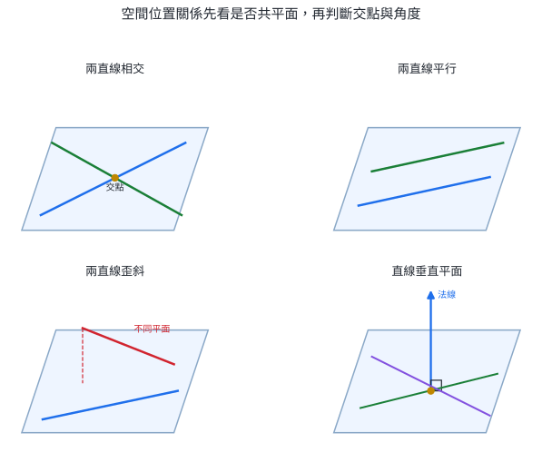{width=96%}

直線與平面的位置關係為：直線在平面上、相交於一點、平行且無交點。兩個不同平面則相交於一直線或互相平行。

::: concept
空間關係的判斷順序：

1. 找出公共點或交集；
2. 判斷兩對象能否同在一個平面；
3. 再由方向判斷平行或相交。

「兩直線沒有交點」同時可能對應平行與歪斜；共平面條件把兩者分開。
:::

### 1.2 直線垂直平面

若直線 $L$ 垂直於平面 $E$ 內通過交點 $A$ 的每一條直線，就稱 $L$ 垂直平面 $E$，記為

$$
L\perp E.
$$

實際判定時不必逐一檢查平面內所有直線。平面內兩條相交直線已經給出兩個獨立方向：

::: concept
設直線 $m,n$ 在平面 $E$ 內相交。若

$$
L\perp m,\qquad L\perp n,
$$

而且三線交於同一點，則

$$
\boxed{L\perp E}.
$$
:::

其理由可用向量表達。平面 $E$ 內通過交點的任一方向都可寫成 $s\vec m+t\vec n$。若 $\vec L\cdot\vec m=0$ 且 $\vec L\cdot\vec n=0$，則

$$
\vec L\cdot(s\vec m+t\vec n)
=s(\vec L\cdot\vec m)+t(\vec L\cdot\vec n)=0.
$$

因此 $L$ 垂直平面內每一個方向。

### 1.3 直線與平面、兩平面的角

直線 $L$ 與平面 $E$ 相交時，把 $L$ 正射影到 $E$ 上。$L$ 與其投影線的銳角或直角，稱為直線與平面的夾角，範圍為

$$
0^\circ\le\theta\le90^\circ.
$$

若 $L\perp E$，夾角為 $90^\circ$；若 $L\parallel E$ 或 $L\subset E$，夾角為 $0^\circ$。

兩相交平面的交線為 $g$。在兩平面內分別取垂直 $g$ 的直線 $m,n$，$m,n$ 的夾角稱為兩平面的夾角。由兩個半平面形成的角稱為二面角；指定內部區域後，角度可以介於 $0^\circ$ 與 $180^\circ$。

### 1.4 三垂線定理

設 $P$ 在平面 $E$ 外，$PA\perp E$，$B$ 在平面 $E$ 上。線段 $AB$ 是斜線 $PB$ 在平面上的正射影。若平面內直線 $L$ 通過 $B$ 且 $L\perp AB$，則

$$
\boxed{L\perp PB}.
$$

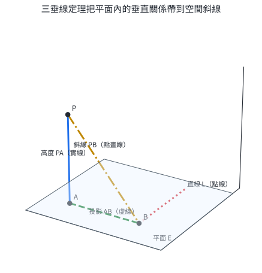{width=82%}

把 $\overrightarrow{BP}$ 分解成平面內與平面外的部分：

$$
\overrightarrow{BP}=\overrightarrow{BA}+\overrightarrow{AP}.
$$

$L\perp AB$ 給出 $\vec L\cdot\overrightarrow{BA}=0$；$PA\perp E$ 給出 $\vec L\cdot\overrightarrow{AP}=0$。所以

$$
\vec L\cdot\overrightarrow{BP}=0+0=0,
$$

也就是 $L\perp PB$。定理的核心是：斜線分成「平面內投影」與「垂直平面的高度」，一條平面內直線若同時垂直這兩部分，也垂直它們的合向量。

::: worked-example
### 完整示範｜判斷兩條不相交直線

長方體 $ABCD-EFGH$ 中，$E,F,G,H$ 分別在 $A,B,C,D$ 正上方。判斷 $AB$ 與 $CG$、$AB$ 與 $HG$ 的位置關係。

**$AB$ 與 $CG$：** $AB$ 是底面水平邊，$CG$ 是鉛直邊；兩線沒有交點，方向也不平行。若它們共平面，該平面同時包含 $B,C$ 方向的底面位移與 $CG$ 的鉛直方向，並會包含通過 $B$ 的鉛直線 $BF$；但 $AB$ 的另一端 $A$ 不在側面 $BCGF$。因此兩線歪斜。

**$AB$ 與 $HG$：** 在長方體中，對應邊方向相同，而且可共同放在斜截面 $ABGH$ 中，所以

$$
AB\parallel HG.
$$

沒有交點只完成第一步；共平面與方向共同決定結論。
:::

::: worked-example
### 完整示範｜由投影三角形求直線與平面的角

點 $P$ 到平面 $E$ 的垂足為 $A$，$B$ 在平面上。已知 $PA=6$、$AB=8$，求斜線 $PB$ 與平面 $E$ 的夾角。

因 $PA\perp E$，所以 $PA\perp AB$，三角形 $PAB$ 在 $A$ 為直角。$PB$ 在平面上的投影是 $AB$。設所求角為 $\theta=\angle PBA$，則

$$
PB=\sqrt{6^2+8^2}=10,
$$

$$
\sin\theta=\frac{PA}{PB}=\frac{6}{10}=\frac35,
\qquad
\tan\theta=\frac{PA}{AB}=\frac{6}{8}=\frac34.
$$

因此

$$
\boxed{\theta=\sin^{-1}\!\left(\frac35\right)\approx36.9^\circ}.
$$

高度越大、水平投影越短，斜線與平面的夾角越大。
:::

::: worked-example
### 完整示範｜用三垂線定理建立空間垂直

在圖 2 的設定中，$PA\perp E$，$AB\perp L$，且 $A,B,L$ 都在平面 $E$ 內。證明 $PB\perp L$。

由 $PA\perp E$，可知 $PA$ 垂直平面內的 $L$。題設又給 $AB\perp L$。因此 $L$ 同時垂直 $\overrightarrow{BA}$ 與 $\overrightarrow{AP}$。由

$$
\overrightarrow{BP}=\overrightarrow{BA}+\overrightarrow{AP},
$$

得到

$$
\vec L\cdot\overrightarrow{BP}
=\vec L\cdot\overrightarrow{BA}+\vec L\cdot\overrightarrow{AP}=0.
$$

故 $PB\perp L$。
:::

::: self-check
### 節末練習｜空間位置與角度

1. 兩條不同直線 $L_1,L_2$ 都平行同一平面 $E$。列出 $L_1,L_2$ 可能的位置關係。
2. 正方體 $ABCD-EFGH$ 中，列出一條與 $AC$ 歪斜的棱。
3. 點 $P$ 到平面 $E$ 的距離為 $5$，斜線 $PB$ 長 $13$。求 $PB$ 在 $E$ 上的投影長及 $PB$ 與 $E$ 的夾角。
4. 平面 $E$ 內兩相交直線 $m,n$ 交於 $A$。直線 $L$ 通過 $A$，且 $L\perp m$、$L\perp n$。說明 $L$ 與 $E$ 的關係。
5. $PA\perp E$，$A,B,C$ 在 $E$ 上，且 $AB\perp BC$。證明 $PB\perp BC$。
6. 兩平面交於直線 $g$。在兩平面內分別取 $m\perp g$、$n\perp g$，且 $m,n$ 交於同一點。若 $\angle(m,n)=68^\circ$，求兩平面的銳二面角。

**解答**

1. 可能相交、平行或歪斜。各直線平行 $E$ 只限制它們不穿過 $E$；兩線彼此是否共平面仍有三種可能。
2. 例如 $BF$。$AC$ 在底面，$BF$ 為鉛直棱，兩線無交點、方向不平行且不共平面，所以歪斜。
3. 投影長設為 $x$。由直角三角形，$x=\sqrt{13^2-5^2}=12$。若夾角為 $\theta$，$\sin\theta=5/13$，所以 $\theta\approx22.6^\circ$。
4. 平面內相交的 $m,n$ 給出兩個獨立方向；$L$ 同時垂直兩方向，故 $L\perp E$。
5. $AB$ 是 $PB$ 在 $E$ 上的投影；$BC\perp AB$，由三垂線定理得 $PB\perp BC$。
6. 兩平面夾角由各平面內垂直交線的兩線夾角定義，因此銳二面角為 $68^\circ$。
:::

## 2. 空間坐標與向量運算

### 2.1 右手坐標系、坐標平面與投影

取共同交於原點 $O$、兩兩垂直的 $x,y,z$ 軸。正向依右手規則排列：右手四指由 $x$ 軸正向轉向 $y$ 軸正向時，大拇指指向 $z$ 軸正向。

三個坐標平面為

$$
xy\text{ 平面}:z=0,\qquad
yz\text{ 平面}:x=0,\qquad
zx\text{ 平面}:y=0.
$$

點 $P=(a,b,c)$ 在三個坐標平面上的正射影分別為

$$
(a,b,0),\qquad(0,b,c),\qquad(a,0,c).
$$

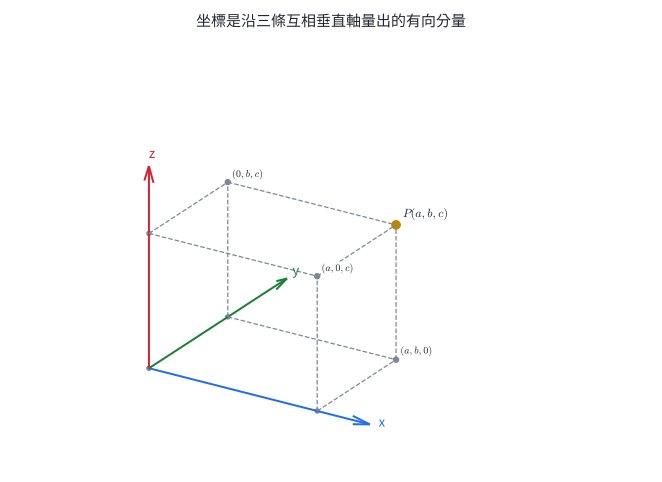{width=82%}

點到三個坐標平面的距離分別是 $|c|,|a|,|b|$；點到三條坐標軸的距離則保留垂直於該軸的兩個分量。例如

$$
d(P,x\text{ 軸})=\sqrt{b^2+c^2}.
$$

### 2.2 距離、中點與分點

設 $A=(x_1,y_1,z_1)$、$B=(x_2,y_2,z_2)$。由三個互相垂直方向依序套用畢氏定理：

$$
\boxed{
AB=\sqrt{(x_2-x_1)^2+(y_2-y_1)^2+(z_2-z_1)^2}
}.
$$

中點為

$$
\boxed{
M=\left(\frac{x_1+x_2}{2},\frac{y_1+y_2}{2},\frac{z_1+z_2}{2}\right)
}.
$$

若 $P$ 內分 $AB$ 且 $AP:PB=m:n$，則

$$
\boxed{P=\frac{nA+mB}{m+n}}.
$$

權重與相鄰線段交叉配對：$P$ 靠近哪個端點，那個端點的權重就較大。例如 $m<n$ 表示 $AP<PB$，公式中 $A$ 的權重 $n$ 大於 $B$ 的權重 $m$，所以 $P$ 靠近 $A$。

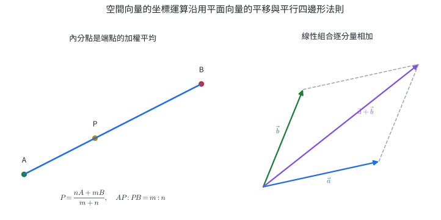{width=96%}

### 2.3 空間向量的坐標與運算

設 $A=(x_1,y_1,z_1)$、$B=(x_2,y_2,z_2)$，則

$$
\boxed{
\overrightarrow{AB}=(x_2-x_1,y_2-y_1,z_2-z_1)
}.
$$

若 $\vec a=(a_1,a_2,a_3)$、$\vec b=(b_1,b_2,b_3)$，則

$$
\vec a+\vec b=(a_1+b_1,a_2+b_2,a_3+b_3),
$$

$$
k\vec a=(ka_1,ka_2,ka_3),
$$

$$
\boxed{|\vec a|=\sqrt{a_1^2+a_2^2+a_3^2}}.
$$

這些公式源自坐標軸方向的獨立性：同一方向的位移互相累加，三個方向分別處理。

### 2.4 平行、單位向量與線性組合

對非零向量 $\vec a$，同方向單位向量為

$$
\boxed{\hat a=\frac{\vec a}{|\vec a|}}.
$$

兩個非零向量平行的條件為

$$
\boxed{\vec a\parallel\vec b\iff\vec b=k\vec a}
$$

其中 $k>0$ 表示同方向，$k<0$ 表示反方向。

若 $\vec a,\vec b,\vec c$ 不共面，空間中每一向量 $\vec v$ 都能唯一寫成

$$
\boxed{\vec v=x\vec a+y\vec b+z\vec c}.
$$

三個不共面的方向能生成整個空間；係數 $(x,y,z)$ 就是相對於這組基底的坐標。若三向量共面，它們的線性組合仍停留在同一平面，無法生成平面外的方向。

::: {.why .keep-together}
### 坐標分量把幾何轉成可操作資料

工程圖上的每個孔位由三個坐標指定；機器手臂末端的位移由三個分量相加；遊戲引擎把角色位置、速度與攝影機方向都儲存成三維向量。

分量表示保留了幾何的核心：點相減得到位移、向量相加得到合位移、倍數關係判斷平行。只要坐標軸與單位固定，同一套運算可直接交給測量儀器與電腦執行。
:::

::: worked-example
### 完整示範｜投影、距離與對稱點

設 $P=(3,-4,12)$。

1. 在 $xy$ 平面上的投影為 $P_{xy}=(3,-4,0)$。
2. 到 $z$ 軸的距離只看 $x,y$ 分量：

   $$
   d(P,z\text{ 軸})=\sqrt{3^2+(-4)^2}=5.
   $$

3. 關於 $xy$ 平面的對稱點保留 $x,y$，反轉垂直於平面的 $z$ 分量，因此為

   $$
   P'=(3,-4,-12).
   $$

4. 到原點距離為

   $$
   OP=\sqrt{3^2+(-4)^2+12^2}=13.
   $$

投影、距離與鏡射都可由「哪些分量沿著目標平面、哪些分量垂直目標平面」直接判斷。
:::

::: worked-example
### 完整示範｜內分點與路徑比例

無人機由 $A=(1,2,0)$ 直線飛向 $B=(11,-3,5)$。飛完總路程的 $40\%$ 時位於 $P$，求 $P$。

因 $AP:PB=2:3$，可用分點公式：

$$
P=\frac{3A+2B}{5}
=\frac{3(1,2,0)+2(11,-3,5)}5
=(5,0,2).
$$

也可用參數式核對：

$$
P=A+0.4(B-A)
=(1,2,0)+0.4(10,-5,5)
=(5,0,2).
$$

$P-A=(4,-2,2)$ 正好是 $B-A=(10,-5,5)$ 的 $0.4$ 倍，比例與方向一致。
:::

::: worked-example
### 完整示範｜用線性組合還原三維位移

設

$$
\vec a=(1,1,0),\qquad
\vec b=(0,1,1),\qquad
\vec c=(1,0,1).
$$

求 $x,y,z$ 使

$$
x\vec a+y\vec b+z\vec c=(5,4,3).
$$

比較三個分量：

$$
\begin{cases}
x+z=5,\\
x+y=4,\\
y+z=3.
\end{cases}
$$

前兩式相加再減第三式，得 $2x=6$，所以 $x=3$。接著 $y=1$、$z=2$。因此

$$
\boxed{(5,4,3)=3\vec a+\vec b+2\vec c}.
$$

代回三個分量可同時驗證結果。
:::

::: self-check
### 節末練習｜坐標與向量運算

1. 點 $P=(-2,3,6)$ 在 $yz$ 平面、$zx$ 平面上的投影各為何？求 $P$ 到 $x$ 軸的距離。
2. $A=(1,-2,3)$、$B=(5,4,-1)$。求 $\overrightarrow{AB}$、$AB$ 與中點 $M$。
3. $P$ 內分 $A=(-1,2,4)$、$B=(9,-3,-1)$，且 $AP:PB=3:2$。求 $P$。
4. 已知 $\vec a=(2,-1,2)$。求與 $\vec a$ 同方向的單位向量，以及長度為 $12$、方向相反的向量。
5. 判斷 $\vec a=(2,-4,6)$ 與 $\vec b=(-1,2,-3)$ 是否平行，並說明方向。
6. 設 $\vec a=(1,0,1)$、$\vec b=(0,1,1)$、$\vec c=(1,1,0)$。求 $x,y,z$ 使 $x\vec a+y\vec b+z\vec c=(4,5,3)$。

**解答**

1. 投影分別為 $(0,3,6)$、$(-2,0,6)$。到 $x$ 軸距離為 $\sqrt{3^2+6^2}=3\sqrt5$。
2. $\overrightarrow{AB}=(4,6,-4)$，所以 $AB=\sqrt{16+36+16}=2\sqrt{17}$；$M=(3,1,1)$。
3. $P=(2A+3B)/5=(5,-1,1)$。核對 $P-A=(6,-3,-3)$、$B-P=(4,-2,-2)$，長度比為 $3:2$。
4. $|\vec a|=3$，同方向單位向量為 $(2/3,-1/3,2/3)$。方向相反且長 $12$ 的向量為 $-4\vec a=(-8,4,-8)$。
5. $\vec b=-\tfrac12\vec a$，所以平行且方向相反。
6. 比較分量得 $x+z=4$、$y+z=5$、$x+y=3$。解得 $x=1$、$y=2$、$z=3$。
:::

## 3. 空間向量的內積、夾角與投影

### 3.1 內積的幾何定義與坐標公式

設 $\vec a,\vec b$ 為非零向量，夾角 $\theta$ 取在 $0\le\theta\le\pi$。內積定義為

$$
\boxed{
\vec a\cdot\vec b=|\vec a|\,|\vec b|\cos\theta
}.
$$

若其中一向量為零向量，定義內積為 $0$。

在直角坐標系中，令

$$
\vec a=(a_1,a_2,a_3),\qquad
\vec b=(b_1,b_2,b_3),
$$

則

$$
\boxed{
\vec a\cdot\vec b=a_1b_1+a_2b_2+a_3b_3
}.
$$

坐標公式可由三個單位基向量 $\vec i,\vec j,\vec k$ 推出。因三軸兩兩垂直，

$$
\vec i\cdot\vec i=
\vec j\cdot\vec j=
\vec k\cdot\vec k=1,
$$

$$
\vec i\cdot\vec j=
\vec j\cdot\vec k=
\vec k\cdot\vec i=0.
$$

把 $\vec a=a_1\vec i+a_2\vec j+a_3\vec k$、$\vec b=b_1\vec i+b_2\vec j+b_3\vec k$ 展開，交叉方向的乘積全為 $0$，只留下同方向的三項。

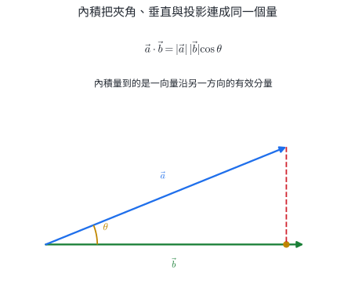{width=86%}

內積正負直接描述方向：

| $\vec a\cdot\vec b$ | $\cos\theta$ | 夾角 |
|---:|---:|---|
| $>0$ | $>0$ | 銳角 |
| $=0$ | $=0$ | 直角 |
| $<0$ | $<0$ | 鈍角 |

對非零向量，垂直條件為

$$
\boxed{\vec a\perp\vec b\iff\vec a\cdot\vec b=0}.
$$

夾角可由

$$
\boxed{
\cos\theta=
\frac{\vec a\cdot\vec b}{|\vec a|\,|\vec b|}
}
$$

求得。分母要求兩向量皆非零。

### 3.2 內積的運算性質

內積滿足

$$
\vec a\cdot\vec b=\vec b\cdot\vec a,
$$

$$
(s\vec a+t\vec b)\cdot\vec c
=s(\vec a\cdot\vec c)+t(\vec b\cdot\vec c),
$$

$$
\vec a\cdot\vec a=|\vec a|^2.
$$

因此向量和、差的長度可直接展開：

$$
|\vec a+\vec b|^2
=|\vec a|^2+2\vec a\cdot\vec b+|\vec b|^2,
$$

$$
|\vec a-\vec b|^2
=|\vec a|^2-2\vec a\cdot\vec b+|\vec b|^2.
$$

這就是餘弦定理的向量版本。若 $\vec a\perp\vec b$，中間項為 $0$，公式化成畢氏定理。

### 3.3 正射影與垂直分解

要找 $\vec a$ 沿 $\vec b$ 的部分，先取 $\vec b$ 的單位方向 $\hat b=\vec b/|\vec b|$。帶號投影長為

$$
\boxed{
\operatorname{comp}_{\vec b}\vec a
=\vec a\cdot\hat b
=\frac{\vec a\cdot\vec b}{|\vec b|}
}.
$$

投影向量再乘回單位方向：

$$
\boxed{
\operatorname{proj}_{\vec b}\vec a
=\frac{\vec a\cdot\vec b}{|\vec b|^2}\vec b
}.
$$

剩餘部分

$$
\vec a_\perp
=\vec a-\operatorname{proj}_{\vec b}\vec a
$$

會與 $\vec b$ 垂直，因為

$$
\vec a_\perp\cdot\vec b
=\vec a\cdot\vec b
-\frac{\vec a\cdot\vec b}{|\vec b|^2}(\vec b\cdot\vec b)=0.
$$

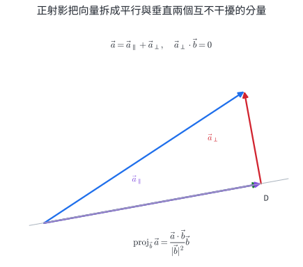{width=88%}

這個分解直接給出點到直線的距離。直線通過 $A$、方向向量為 $\vec d$，點 $P$ 到直線的位移為 $\overrightarrow{AP}$。扣掉沿直線方向的投影後，剩下的垂直分量長度就是最短距離：

$$
\boxed{
d(P,L)=
\left|
\overrightarrow{AP}
-\frac{\overrightarrow{AP}\cdot\vec d}{|\vec d|^2}\vec d
\right|}.
$$

垂足 $H$ 則是

$$
\boxed{
H=A+\frac{\overrightarrow{AP}\cdot\vec d}{|\vec d|^2}\vec d
}.
$$

### 3.4 柯西不等式與等號條件

投影向量的長度最多等於原向量長度：

$$
\left|
\operatorname{proj}_{\vec b}\vec a
\right|
=\frac{|\vec a\cdot\vec b|}{|\vec b|}
\le |\vec a|.
$$

兩邊乘以 $|\vec b|$，得到柯西不等式：

::: concept
$$
\boxed{
|\vec a\cdot\vec b|
\le|\vec a|\,|\vec b|
}.
$$

坐標形式為

$$
\boxed{
(a_1b_1+a_2b_2+a_3b_3)^2
\le
(a_1^2+a_2^2+a_3^2)(b_1^2+b_2^2+b_3^2)
}.
$$

等號成立於其中一向量為零，或兩個非零向量平行。
:::

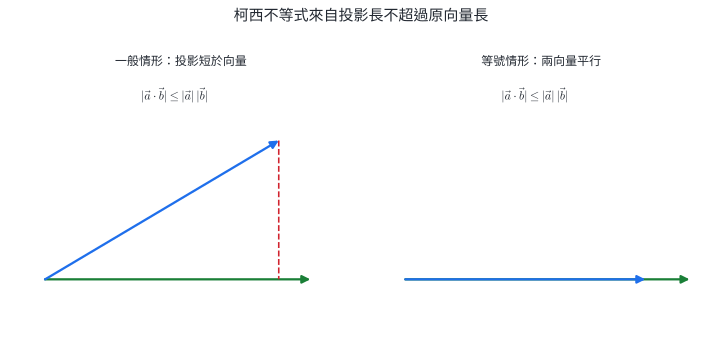{width=95%}

柯西不等式常把一次式的極值轉成向量長度。若 $x^2+y^2+z^2=r^2$，則

$$
|ax+by+cz|
\le\sqrt{a^2+b^2+c^2}\,r.
$$

等號位置與 $(x,y,z)$ 平行於 $(a,b,c)$，因此不只給極值，也給出達到極值的點。

::: {.why .keep-together}
### 投影保留對指定方向真正有效的部分

太陽能板接收的光通量取決於光線沿板面法向的分量；一個力對某方向做功，取決於力沿位移方向的分量；電腦圖學判斷表面亮暗，也要比較光線與表面法向的內積。

內積把「方向有多一致」化成一個數。正值代表大致同向，零代表互不貢獻，負值代表反向。投影再把這個數還原成沿指定方向的向量。
:::

::: worked-example
### 完整示範｜由內積求夾角與垂直參數

設

$$
\vec a=(1,2,2),\qquad
\vec b=(2,1,-2).
$$

先算

$$
\vec a\cdot\vec b=2+2-4=0,
$$

所以 $\vec a\perp\vec b$，夾角為 $90^\circ$。

若改成 $\vec c=(k,1,-1)$，要求 $\vec a\perp\vec c$，則

$$
\vec a\cdot\vec c=k+2-2=k.
$$

垂直條件給 $k=0$。此時 $\vec c=(0,1,-1)$，代回內積確為 $0$。
:::

::: worked-example
### 完整示範｜求正射影、垂直分量與垂足

設 $\vec a=(3,4,1)$、$\vec b=(2,1,2)$。先算

$$
\vec a\cdot\vec b=6+4+2=12,
\qquad
|\vec b|^2=4+1+4=9.
$$

因此

$$
\operatorname{proj}_{\vec b}\vec a
=\frac{12}{9}\vec b
=\left(\frac83,\frac43,\frac83\right).
$$

垂直分量為

$$
\vec a_\perp
=(3,4,1)-\left(\frac83,\frac43,\frac83\right)
=\left(\frac13,\frac83,-\frac53\right).
$$

核對垂直性：

$$
\vec a_\perp\cdot\vec b
=\frac23+\frac83-\frac{10}3=0.
$$

若直線從原點沿 $\vec b$ 前進，點 $A=(3,4,1)$ 在直線上的垂足就是

$$
H=\left(\frac83,\frac43,\frac83\right),
$$

點線距離為

$$
|\vec a_\perp|
=\frac13\sqrt{1+64+25}=\sqrt{10}.
$$
:::

::: worked-example
### 完整示範｜由兩點與方向求點線距離

直線 $L$ 通過 $A=(1,0,2)$，方向向量 $\vec d=(2,1,2)$；點 $P=(4,4,1)$。求 $P$ 到 $L$ 的垂足與距離。

先取

$$
\overrightarrow{AP}=(3,4,-1).
$$

沿直線方向的參數為

$$
t=\frac{\overrightarrow{AP}\cdot\vec d}{|\vec d|^2}
=\frac{6+4-2}{4+1+4}
=\frac89.
$$

所以垂足

$$
H=A+t\vec d
=\left(\frac{25}{9},\frac89,\frac{34}{9}\right).
$$

垂直位移為

$$
\overrightarrow{HP}
=P-H
=\left(\frac{11}{9},\frac{28}{9},-\frac{25}{9}\right).
$$

它與 $\vec d$ 的內積為 $(22+28-50)/9=0$，所以確實垂直。距離為

$$
d(P,L)=|\overrightarrow{HP}|
=\frac{\sqrt{121+784+625}}9
=\frac{\sqrt{1530}}9
=\frac{\sqrt{170}}3.
$$
:::

::: worked-example
### 完整示範｜柯西不等式求球面上的線性式極值

已知 $x^2+y^2+z^2=9$，求 $2x-y+2z$ 的最大值與最小值，並找出等號位置。

把 $(x,y,z)$ 與係數向量 $(2,-1,2)$ 做內積：

$$
|2x-y+2z|
\le
\sqrt{x^2+y^2+z^2}\sqrt{2^2+(-1)^2+2^2}
=3\cdot3=9.
$$

所以範圍為

$$
\boxed{-9\le2x-y+2z\le9}.
$$

最大值要求 $(x,y,z)$ 與 $(2,-1,2)$ 同方向，且長度為 $3$。係數向量本身長度也是 $3$，所以最大值在

$$
(x,y,z)=(2,-1,2)
$$

取得；最小值在反方向 $(-2,1,-2)$ 取得。
:::

::: self-check
### 節末練習｜內積與投影

1. 求 $\vec a=(2,-1,3)$、$\vec b=(1,4,-2)$ 的內積，並判斷夾角為銳角、直角或鈍角。
2. 求 $\vec a=(1,1,0)$ 與 $\vec b=(1,0,1)$ 的夾角。
3. $\vec a=(k,2,-1)$ 與 $\vec b=(1,-1,3)$ 垂直，求 $k$。
4. 把 $\vec a=(4,1,3)$ 分解成平行與垂直於 $\vec b=(1,1,1)$ 的兩部分。
5. 直線通過原點且方向為 $(2,-1,2)$。求點 $P=(1,3,2)$ 在直線上的垂足與點線距離。
6. 已知 $x^2+y^2+z^2=4$，求 $x+2y-2z$ 的最大值、最小值及等號位置。

**解答**

1. $\vec a\cdot\vec b=2-4-6=-8<0$，所以夾角為鈍角。
2. 內積為 $1$，兩向量長皆為 $\sqrt2$，故 $\cos\theta=1/2$，$\theta=60^\circ$。
3. $k-2-3=0$，所以 $k=5$。
4. $\vec a\cdot\vec b=8$、$|\vec b|^2=3$。平行分量為 $(8/3,8/3,8/3)$；垂直分量為 $(4/3,-5/3,1/3)$，其與 $\vec b$ 內積為 $0$。
5. 參數 $t=(2-3+4)/9=1/3$。垂足 $H=(2/3,-1/3,2/3)$；$P-H=(1/3,10/3,4/3)$，距離為 $\sqrt{117}/3=\sqrt{13}$。
6. 係數向量 $(1,2,-2)$ 長為 $3$，而 $(x,y,z)$ 長為 $2$，所以範圍為 $[-6,6]$。最大值在 $(2/3,4/3,-4/3)$ 取得；最小值在其反向取得。
:::

## 4. 外積、行列式、面積與體積

### 4.1 外積的方向與長度

對空間向量 $\vec a,\vec b$，外積 $\vec a\times\vec b$ 是一個同時垂直於 $\vec a,\vec b$ 的向量。方向由右手定則決定：右手四指由 $\vec a$ 的方向捲向 $\vec b$，大拇指指向 $\vec a\times\vec b$。

若兩向量夾角為 $\theta$，則

$$
\boxed{
|\vec a\times\vec b|
=|\vec a|\,|\vec b|\sin\theta
}.
$$

以 $\vec a$ 為底時，$|\vec b|\sin\theta$ 是 $\vec b$ 垂直於 $\vec a$ 的高度，因此外積長度正是兩向量張成的平行四邊形面積。

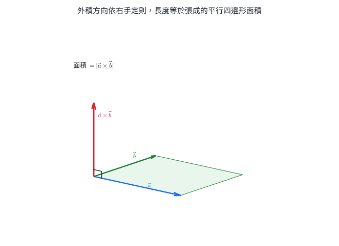{width=84%}

若

$$
\vec a=(a_1,a_2,a_3),\qquad
\vec b=(b_1,b_2,b_3),
$$

則坐標公式為

$$
\boxed{
\vec a\times\vec b
=
\bigl(
a_2b_3-a_3b_2,
a_3b_1-a_1b_3,
a_1b_2-a_2b_1
\bigr)
}.
$$

公式可用形式行列式記憶：

$$
\vec a\times\vec b
=
\begin{vmatrix}
\vec i&\vec j&\vec k\\
a_1&a_2&a_3\\
b_1&b_2&b_3
\end{vmatrix}.
$$

沿第一列展開時，$\vec j$ 項帶負號，因此第二分量寫成 $a_3b_1-a_1b_3$。

外積的重要性質為

$$
\vec b\times\vec a=-(\vec a\times\vec b),
$$

$$
(s\vec a+t\vec b)\times\vec c
=s(\vec a\times\vec c)+t(\vec b\times\vec c),
$$

$$
\vec a\times\vec b=\vec0
\iff
\vec a,\vec b\text{ 中有零向量或兩向量平行}.
$$

順序交換會反轉方向，但面積 $|\vec a\times\vec b|$ 保持不變。

### 4.2 面積、法向量與點線距離

由同一點出發的 $\vec a,\vec b$ 張成：

$$
\boxed{
\text{平行四邊形面積}=|\vec a\times\vec b|
},
$$

$$
\boxed{
\text{三角形面積}=\frac12|\vec a\times\vec b|
}.
$$

$\vec a\times\vec b$ 同時給出該平面的法向方向。電腦圖學以表面法向判斷哪一面朝向光源；三維掃描與 CAD 也用法向描述曲面朝向。

若直線通過 $A$、方向為 $\vec d$，點 $P$ 到直線的距離還可寫成

$$
\boxed{
d(P,L)=\frac{|\overrightarrow{AP}\times\vec d|}{|\vec d|}
}.
$$

因為分子是以 $|\vec d|$ 為底、點線距離為高的平行四邊形面積。這與上一節的投影公式是同一個幾何量的兩種算法。

### 4.3 三階行列式

三個向量 $\vec a=(a_1,a_2,a_3)$、$\vec b=(b_1,b_2,b_3)$、$\vec c=(c_1,c_2,c_3)$ 排成三階行列式：

$$
\det(\vec a,\vec b,\vec c)
=
\begin{vmatrix}
a_1&a_2&a_3\\
b_1&b_2&b_3\\
c_1&c_2&c_3
\end{vmatrix}.
$$

沿第一列展開：

$$
\boxed{
\begin{aligned}
\det(\vec a,\vec b,\vec c)
={}&a_1(b_2c_3-b_3c_2)\\
&-a_2(b_1c_3-b_3c_1)\\
&+a_3(b_1c_2-b_2c_1).
\end{aligned}
}
$$

也可用薩魯法則：把前兩欄抄到右側，右下方向的三個乘積相加，右上方向的三個乘積相減。

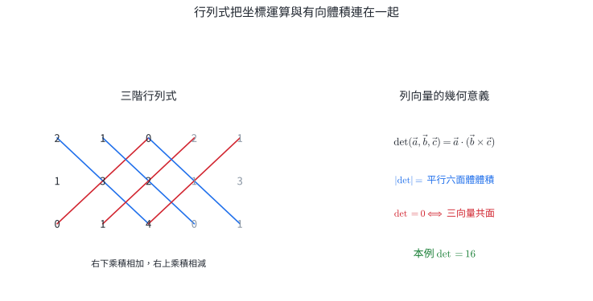{width=92%}

行列式具有三項對計算很有用的性質：

1. 交換任兩列，值變號；
2. 某一列乘 $k$，行列式也乘 $k$；
3. 某一列加上另一列的倍數，值保持不變。

若兩列相同、成比例，或某列是另外兩列的線性組合，行列式為 $0$。這些情形都表示三個方向無法張成真正的三維體積。

### 4.4 三重積、體積與共面

先用 $\vec b\times\vec c$ 建立底面法向與底面積，再與 $\vec a$ 做內積：

$$
\boxed{
\vec a\cdot(\vec b\times\vec c)
=\det(\vec a,\vec b,\vec c)
}.
$$

其絕對值為三向量張成的平行六面體體積：

$$
\boxed{
V_{\text{平行六面體}}
=|\vec a\cdot(\vec b\times\vec c)|
}.
$$

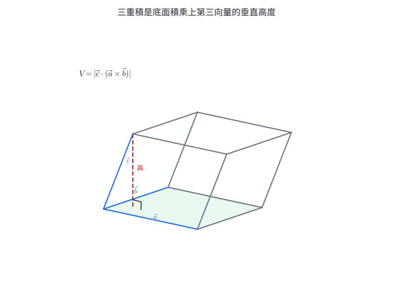{width=84%}

若四面體從同一頂點引出三條棱 $\vec a,\vec b,\vec c$，它的體積為相應平行六面體的六分之一：

$$
\boxed{
V_{\text{四面體}}
=\frac16|\vec a\cdot(\vec b\times\vec c)|
}.
$$

三個向量共面的條件為

$$
\boxed{
\vec a,\vec b,\vec c\text{ 共面}
\iff
\det(\vec a,\vec b,\vec c)=0
}.
$$

若考慮四點 $A,B,C,D$，以同一基準點 $A$ 形成 $\overrightarrow{AB},\overrightarrow{AC},\overrightarrow{AD}$，再檢查三重積是否為 $0$。

### 4.5 外積的直接應用：力矩

一個力造成的轉動效果同時取決於施力大小、施力點到轉軸的距離，以及施力方向。以轉軸上的基準點為起點，令 $\vec r$ 指向施力點，力矩為

$$
\boxed{
\vec\tau=\vec r\times\vec F
}.
$$

大小為

$$
\boxed{
|\vec\tau|=rF\sin\theta
}.
$$

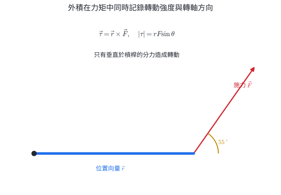{width=88%}

門把設在遠離鉸鏈處，是為了放大 $r$；扳手與螺帽的連線接近垂直施力，是為了使 $\sin\theta$ 接近 $1$。這兩項設計都直接來自外積長度。

::: worked-example
### 完整示範｜外積、法向量與三角形面積

設

$$
A=(1,0,1),\quad B=(3,1,2),\quad C=(2,4,0).
$$

取同一起點 $A$：

$$
\overrightarrow{AB}=(2,1,1),\qquad
\overrightarrow{AC}=(1,4,-1).
$$

計算外積：

$$
\overrightarrow{AB}\times\overrightarrow{AC}
=
\begin{vmatrix}
\vec i&\vec j&\vec k\\
2&1&1\\
1&4&-1
\end{vmatrix}
=(-5,3,7).
$$

核對法向性：

$$
(-5,3,7)\cdot(2,1,1)=-10+3+7=0,
$$

$$
(-5,3,7)\cdot(1,4,-1)=-5+12-7=0.
$$

所以 $(-5,3,7)$ 是平面 $ABC$ 的一個法向量。三角形面積為

$$
[ABC]
=\frac12\sqrt{25+9+49}
=\boxed{\frac{\sqrt{83}}2}.
$$
:::

::: worked-example
### 完整示範｜用外積求點到直線的距離

直線通過 $A=(1,1,0)$，方向向量為 $\vec d=(2,-1,2)$；點 $P=(3,2,4)$。求點線距離。

$$
\overrightarrow{AP}=(2,1,4).
$$

$$
\overrightarrow{AP}\times\vec d
=
\begin{vmatrix}
\vec i&\vec j&\vec k\\
2&1&4\\
2&-1&2
\end{vmatrix}
=(6,4,-4).
$$

所以

$$
d(P,L)
=\frac{\sqrt{6^2+4^2+(-4)^2}}{\sqrt{2^2+(-1)^2+2^2}}
=\frac{\sqrt{68}}3
=\boxed{\frac{2\sqrt{17}}3}.
$$

分子是以方向向量為底的平行四邊形面積，除以底長後得到高。
:::

::: worked-example
### 完整示範｜行列式的列運算

計算

$$
D=
\begin{vmatrix}
1&2&3\\
2&5&8\\
1&0&1
\end{vmatrix}.
$$

先做保持行列式值的列運算：第二列減去第一列的 $2$ 倍，第三列減去第一列：

$$
D=
\begin{vmatrix}
1&2&3\\
0&1&2\\
0&-2&-2
\end{vmatrix}.
$$

再把第三列加上第二列的 $2$ 倍：

$$
D=
\begin{vmatrix}
1&2&3\\
0&1&2\\
0&0&2
\end{vmatrix}=1\cdot1\cdot2=\boxed2.
$$

上三角形式的行列式等於對角線乘積。
:::

::: worked-example
### 完整示範｜四面體體積與共面參數

設

$$
A=(0,0,0),\quad B=(2,0,0),\quad C=(0,3,0),\quad D=(1,1,k).
$$

從 $A$ 引出三向量：

$$
\overrightarrow{AB}=(2,0,0),\quad
\overrightarrow{AC}=(0,3,0),\quad
\overrightarrow{AD}=(1,1,k).
$$

三重積為

$$
\det
\begin{pmatrix}
2&0&0\\
0&3&0\\
1&1&k
\end{pmatrix}
=6k.
$$

四面體體積為

$$
V=\frac16|6k|=\boxed{|k|}.
$$

四點共面恰好對應體積為 $0$，所以

$$
\boxed{k=0}.
$$

這也符合坐標圖像：前三點都在 $xy$ 平面，$D$ 的 $z$ 坐標為 $0$ 時也落在同一平面。
:::

::: worked-example
### 完整示範｜施力方向如何影響力矩

長 $0.40\ \mathrm{m}$ 的扳手受到 $50\ \mathrm{N}$ 的力，力與扳手夾角為 $60^\circ$。求力矩大小；再比較同樣大小的力以 $30^\circ$ 施加時的力矩。

第一種施力：

$$
\tau_1=rF\sin60^\circ
=0.40(50)\frac{\sqrt3}{2}
=10\sqrt3\ \mathrm{N\,m}
\approx17.3\ \mathrm{N\,m}.
$$

第二種施力：

$$
\tau_2=rF\sin30^\circ
=0.40(50)\frac12
=10\ \mathrm{N\,m}.
$$

扳手長度與力的大小相同時，垂直分力較大的 $60^\circ$ 施力產生較大力矩。
:::

::: self-check
### 節末練習｜外積、面積與體積

1. 計算 $(1,2,3)\times(2,-1,1)$，並以內積核對所得向量垂直於原兩向量。
2. $A=(0,0,0)$、$B=(2,1,0)$、$C=(1,3,2)$。求三角形 $ABC$ 面積與一個法向量。
3. 直線通過 $A=(1,0,1)$、方向為 $(1,2,2)$，求點 $P=(3,1,4)$ 到直線的距離。
4. 計算 $\begin{vmatrix}2&1&0\\1&3&2\\0&1&4\end{vmatrix}$。
5. 判斷 $\vec a=(1,0,2)$、$\vec b=(0,2,1)$、$\vec c=(2,2,5)$ 是否共面。
6. 四面體 $OABC$ 中，$A=(2,0,0)$、$B=(0,3,0)$、$C=(1,1,4)$。求體積。若把 $C$ 改成 $(1,1,h)$，體積為 $6$，求 $h$。

**解答**

1. 外積為 $(5,5,-5)$。與第一向量內積 $5+10-15=0$；與第二向量內積 $10-5-5=0$。
2. $\overrightarrow{AB}=(2,1,0)$、$\overrightarrow{AC}=(1,3,2)$，外積為 $(2,-4,5)$。法向量可取 $(2,-4,5)$；面積為 $\sqrt{4+16+25}/2=3\sqrt5/2$。
3. $\overrightarrow{AP}=(2,1,3)$，與方向向量的外積為 $(-4,-1,3)$。距離為 $\sqrt{26}/3$。
4. 沿第一列展開：$2(12-2)-1(4-0)=16$。
5. $\vec c=2\vec a+\vec b$，因此共面；等價地，$\det(\vec a,\vec b,\vec c)=0$。
6. 三重積為 $2\cdot3\cdot4=24$，體積為 $24/6=4$。改為 $h$ 時體積為 $|6h|/6=|h|$，故 $h=6$ 或 $h=-6$。
:::

## 5. 核心整理

### 位置與坐標

$$
\overrightarrow{AB}=B-A,
\qquad
AB=|B-A|,
\qquad
P_{AP:PB=m:n}=\frac{nA+mB}{m+n}.
$$

兩直線沒有交點時，再用共平面條件區分平行與歪斜。直線垂直平面，可由它垂直平面內兩條相交直線判定。

### 內積與投影

$$
\vec a\cdot\vec b
=a_1b_1+a_2b_2+a_3b_3
=|\vec a|\,|\vec b|\cos\theta.
$$

$$
\operatorname{proj}_{\vec b}\vec a
=\frac{\vec a\cdot\vec b}{|\vec b|^2}\vec b,
\qquad
|\vec a\cdot\vec b|\le|\vec a|\,|\vec b|.
$$

### 外積與三重積

$$
\vec a\times\vec b
=
(a_2b_3-a_3b_2,
a_3b_1-a_1b_3,
a_1b_2-a_2b_1).
$$

$$
[\triangle]=\frac12|\vec a\times\vec b|,
\qquad
V_{\text{平行六面體}}
=|\vec a\cdot(\vec b\times\vec c)|,
$$

$$
V_{\text{四面體}}
=\frac16|\vec a\cdot(\vec b\times\vec c)|.
$$

內積保留沿指定方向的分量；外積建立垂直方向與面積；三重積再取第三方向的高度，得到體積。

## 6. 分層題與跨節整合題

### 題目 1｜坐標平面、距離與對稱

點 $P=(-2,6,3)$。

1. 求 $P$ 在 $yz$ 平面上的投影；
2. 求 $P$ 到 $x$ 軸的距離；
3. 求 $P$ 關於 $zx$ 平面的對稱點。

### 題目 2｜位移、長度與分點

$A=(-1,2,1)$、$B=(3,-2,5)$。求 $\overrightarrow{AB}$、$AB$，以及由 $A$ 向 $B$ 前進全程四分之一時的位置 $P$。

### 題目 3｜空間位置關係

正方體 $ABCD-EFGH$ 中，$E,F,G,H$ 分別在 $A,B,C,D$ 正上方。

1. 判斷 $AB$ 與 $CG$ 的位置關係；
2. 判斷 $AC$ 與 $EG$ 的位置關係；
3. 說明 $AE$ 與平面 $ABCD$ 的關係。

### 題目 4｜直線與平面的夾角

點 $P$ 到平面 $E$ 的垂足為 $A$。$B$ 在 $E$ 上，$PA=12$、$AB=5$。求 $PB$ 長，以及 $PB$ 與平面 $E$ 的夾角。

### 題目 5｜三維線性組合

設

$$
\vec a=(1,1,0),\qquad
\vec b=(1,0,1),\qquad
\vec c=(0,1,1).
$$

求 $x,y,z$ 使 $x\vec a+y\vec b+z\vec c=(7,5,6)$。

### 題目 6｜內積與夾角

設 $\vec a=(1,2,2)$、$\vec b=(2,2,1)$。求兩向量夾角，並判斷它是銳角、直角或鈍角。

### 題目 7｜正射影與垂直分解

把 $\vec a=(4,2,-1)$ 分解成平行與垂直於 $\vec b=(1,2,2)$ 的兩部分，並求垂直分量的長度。

### 題目 8｜柯西不等式與極值位置

已知 $x^2+y^2+z^2=16$，求 $x-2y+2z$ 的最大值、最小值，以及各自的等號位置。

### 題目 9｜外積與面積

設 $\vec a=(2,1,0)$、$\vec b=(1,0,3)$。求 $\vec a\times\vec b$，以及兩向量張成的三角形面積。

### 題目 10｜點到直線的距離

直線 $L$ 通過 $A=(0,1,0)$，方向向量為 $\vec d=(2,1,-2)$。求點 $P=(1,3,4)$ 到 $L$ 的距離。

### 題目 11｜三階行列式

用展開或列運算計算

$$
\begin{vmatrix}
1&2&0\\
0&1&3\\
2&-1&1
\end{vmatrix}.
$$

### 題目 12｜四面體體積

四面體 $OABC$ 中，

$$
O=(0,0,0),\quad A=(1,0,1),\quad B=(0,2,1),\quad C=(3,1,0).
$$

求四面體體積。

### 題目 13｜跨節整合：投影三角形與三垂線

平面 $E$ 為 $xy$ 平面，$A=(0,0,0)$、$P=(0,0,6)$、$B=(8,0,0)$、$C=(8,5,0)$。

1. 說明 $A$ 是 $P$ 在 $E$ 上的垂足；
2. 求 $PB$ 與平面 $E$ 的夾角；
3. 用三垂線定理與內積各證明一次 $PB\perp BC$。

### 題目 14｜跨節整合：動點三角形的最小面積

$A=(1,0,0)$、$B=(3,1,1)$、$C=(1,t,2)$。求三角形 $ABC$ 面積的最小值，以及此時的 $t$。

### 題目 15｜跨節整合：共面參數與四面體體積

設

$$
A=(1,0,0),\quad B=(0,1,0),\quad C=(0,0,1),\quad D=(t,t,t).
$$

1. 求四點共面時的 $t$；
2. 求四面體 $ABCD$ 的體積關於 $t$ 的公式；
3. 若體積為 $1/3$，求 $t$。

### 題目 16｜跨節整合：力的投影、做功與力矩

以鉸鏈為原點，門把位置向量為

$$
\vec r=(0.40,0,0)\ \mathrm{m},
$$

施力為

$$
\vec F=(30,40,0)\ \mathrm{N}.
$$

1. 把 $\vec F$ 分解成平行與垂直於 $\vec r$ 的部分；
2. 求力矩向量 $\vec\tau=\vec r\times\vec F$；
3. 若作用點沿 $\vec s=(2,1,0)\ \mathrm{m}$ 位移，求此力所做的功 $W=\vec F\cdot\vec s$；
4. 說明內積與外積在本題各自保留哪個方向的效果。

## 7. 分層題與跨節整合題詳解

### 第 1 題

$yz$ 平面的方程是 $x=0$，投影保留 $y,z$ 分量，所以

$$
P_{yz}=(0,6,3).
$$

到 $x$ 軸的距離由垂直於 $x$ 軸的 $y,z$ 分量決定：

$$
d(P,x\text{ 軸})
=\sqrt{6^2+3^2}
=3\sqrt5.
$$

$zx$ 平面的方程是 $y=0$。關於它鏡射時，$x,z$ 保持、$y$ 反號，所以對稱點為

$$
\boxed{(-2,-6,3)}.
$$

### 第 2 題

點相減得到位移：

$$
\overrightarrow{AB}=B-A=(4,-4,4).
$$

因此

$$
AB=\sqrt{4^2+(-4)^2+4^2}=4\sqrt3.
$$

由 $A$ 前進全程四分之一：

$$
P=A+\frac14\overrightarrow{AB}
=(-1,2,1)+(1,-1,1)
=\boxed{(0,1,2)}.
$$

核對 $P-A=(1,-1,1)$，確為 $B-A$ 的四分之一。

### 第 3 題

1. $AB$ 是底面棱，$CG$ 是鉛直棱。兩線沒有交點、方向不平行，且無共同平面，所以是歪斜線。
2. $AC$ 是底面對角線，$EG$ 是頂面對應對角線；兩線方向相同，且共同位於斜截面 $ACEG$，所以平行。
3. $AE$ 同時垂直底面內相交的 $AB$ 與 $AD$，因此

   $$
   \boxed{AE\perp\text{平面 }ABCD}.
   $$

判斷歪斜時使用了「無交點、方向不平行、不共平面」三項資訊。

### 第 4 題

$PA\perp E$，所以 $PA\perp AB$。在直角三角形 $PAB$ 中，

$$
PB=\sqrt{12^2+5^2}=13.
$$

$PB$ 在平面上的投影是 $AB$。設 $PB$ 與平面夾角為 $\theta=\angle PBA$，則

$$
\sin\theta=\frac{PA}{PB}=\frac{12}{13}.
$$

所以

$$
\boxed{\theta=\sin^{-1}\!\left(\frac{12}{13}\right)\approx67.4^\circ}.
$$

### 第 5 題

比較 $x\vec a+y\vec b+z\vec c=(7,5,6)$ 的三個分量：

$$
\begin{cases}
x+y=7,\\
x+z=5,\\
y+z=6.
\end{cases}
$$

前兩式相加再減第三式：

$$
2x=7+5-6=6,
$$

所以 $x=3$。再代入得 $y=4$、$z=2$。因此

$$
\boxed{(7,5,6)=3\vec a+4\vec b+2\vec c}.
$$

### 第 6 題

先算內積與長度：

$$
\vec a\cdot\vec b=2+4+2=8,
$$

$$
|\vec a|=|\vec b|=\sqrt{1+4+4}=3.
$$

因此

$$
\cos\theta=\frac89,
\qquad
\boxed{\theta=\cos^{-1}\!\left(\frac89\right)\approx27.3^\circ}.
$$

內積為正，所以角為銳角；數值結果也符合。

### 第 7 題

$$
\vec a\cdot\vec b=4+4-2=6,
\qquad
|\vec b|^2=1+4+4=9.
$$

平行分量為

$$
\vec a_\parallel
=\frac69\vec b
=\left(\frac23,\frac43,\frac43\right).
$$

垂直分量為

$$
\vec a_\perp
=\vec a-\vec a_\parallel
=\left(\frac{10}3,\frac23,-\frac73\right).
$$

核對：

$$
\vec a_\perp\cdot\vec b
=\frac{10}3+\frac43-\frac{14}3=0.
$$

其長度為

$$
|\vec a_\perp|
=\frac13\sqrt{100+4+49}
=\boxed{\sqrt{17}}.
$$

### 第 8 題

把目標式看成 $(x,y,z)$ 與 $(1,-2,2)$ 的內積。由柯西不等式，

$$
|x-2y+2z|
\le\sqrt{x^2+y^2+z^2}\sqrt{1+4+4}
=4\cdot3=12.
$$

所以最大值為 $12$，最小值為 $-12$。

最大值時，$(x,y,z)$ 與 $(1,-2,2)$ 同方向，且長度為 $4$：

$$
(x,y,z)=\frac43(1,-2,2)
=\left(\frac43,-\frac83,\frac83\right).
$$

最小值的位置是其反向：

$$
\boxed{\left(-\frac43,\frac83,-\frac83\right)}.
$$

### 第 9 題

$$
\vec a\times\vec b
=
\begin{vmatrix}
\vec i&\vec j&\vec k\\
2&1&0\\
1&0&3
\end{vmatrix}
=(3,-6,-1).
$$

核對 $(3,-6,-1)\cdot(2,1,0)=0$、$(3,-6,-1)\cdot(1,0,3)=0$。

平行四邊形面積為 $\sqrt{9+36+1}=\sqrt{46}$，所以三角形面積為

$$
\boxed{\frac{\sqrt{46}}2}.
$$

### 第 10 題

$$
\overrightarrow{AP}=P-A=(1,2,4).
$$

$$
\overrightarrow{AP}\times\vec d
=
\begin{vmatrix}
\vec i&\vec j&\vec k\\
1&2&4\\
2&1&-2
\end{vmatrix}
=(-8,10,-3).
$$

因此

$$
d(P,L)
=\frac{\sqrt{64+100+9}}{\sqrt{4+1+4}}
=\boxed{\frac{\sqrt{173}}3}.
$$

### 第 11 題

沿第一列展開：

$$
\begin{aligned}
D
&=1
\begin{vmatrix}1&3\\-1&1\end{vmatrix}
-2
\begin{vmatrix}0&3\\2&1\end{vmatrix}\\
&=(1+3)-2(0-6)\\
&=4+12\\
&=\boxed{16}.
\end{aligned}
$$

也可把第三列減去第一列的 $2$ 倍，再沿第一欄展開，會得到相同結果。

### 第 12 題

由原點出發的三條棱為

$$
\overrightarrow{OA}=(1,0,1),\quad
\overrightarrow{OB}=(0,2,1),\quad
\overrightarrow{OC}=(3,1,0).
$$

先算

$$
\overrightarrow{OB}\times\overrightarrow{OC}
=(-1,3,-6).
$$

三重積為

$$
\overrightarrow{OA}\cdot
(\overrightarrow{OB}\times\overrightarrow{OC})
=-1-6=-7.
$$

體積取絕對值並除以 $6$：

$$
\boxed{V=\frac{|{-7}|}{6}=\frac76}.
$$

### 第 13 題

平面 $E$ 是 $z=0$。$A=(0,0,0)$ 與 $P=(0,0,6)$ 只差 $z$ 分量，所以 $A$ 是 $P$ 在 $E$ 上的投影，而且 $PA$ 的方向 $(0,0,1)$ 垂直平面內的 $x,y$ 方向。

$PB$ 在 $E$ 上的投影是 $AB$。$PA=6$、$AB=8$，因此 $PB=10$。設夾角為 $\theta$：

$$
\sin\theta=\frac6{10}=\frac35,
\qquad
\boxed{\theta\approx36.9^\circ}.
$$

接著

$$
\overrightarrow{AB}=(8,0,0),
\qquad
\overrightarrow{BC}=(0,5,0),
$$

所以 $AB\perp BC$。$AB$ 是 $PB$ 的平面投影，由三垂線定理得 $PB\perp BC$。

用內積直接核對：

$$
\overrightarrow{BP}=P-B=(-8,0,6),
$$

$$
\overrightarrow{BP}\cdot\overrightarrow{BC}
=(-8,0,6)\cdot(0,5,0)=0.
$$

兩種證明都把斜線分解成水平投影與鉛直高度。

### 第 14 題

從 $A$ 引出兩邊：

$$
\overrightarrow{AB}=(2,1,1),
\qquad
\overrightarrow{AC}=(0,t,2).
$$

外積為

$$
\overrightarrow{AB}\times\overrightarrow{AC}
=(2-t,-4,2t).
$$

所以三角形面積平方為

$$
[ABC]^2
=\frac14\left[(2-t)^2+16+4t^2\right]
=\frac14(5t^2-4t+20).
$$

配方：

$$
5t^2-4t+20
=5\left(t-\frac25\right)^2+\frac{96}{5}.
$$

因此 $t=2/5$ 時面積最小，最小值為

$$
\boxed{
[ABC]_{\min}
=\frac12\sqrt{\frac{96}{5}}
=\frac{2\sqrt{30}}5
}.
$$

### 第 15 題

以 $A$ 為共同起點：

$$
\overrightarrow{AB}=(-1,1,0),
$$

$$
\overrightarrow{AC}=(-1,0,1),
$$

$$
\overrightarrow{AD}=(t-1,t,t).
$$

先算

$$
\overrightarrow{AB}\times\overrightarrow{AC}=(1,1,1).
$$

三重積為

$$
(\overrightarrow{AB}\times\overrightarrow{AC})
\cdot\overrightarrow{AD}
=(t-1)+t+t=3t-1.
$$

四點共面時三重積為 $0$，所以

$$
\boxed{t=\frac13}.
$$

四面體體積為

$$
\boxed{V(t)=\frac{|3t-1|}{6}}.
$$

若 $V=1/3$，則

$$
\frac{|3t-1|}{6}=\frac13
\quad\Longrightarrow\quad
|3t-1|=2.
$$

故

$$
3t-1=2\quad\text{或}\quad3t-1=-2,
$$

$$
\boxed{t=1\quad\text{或}\quad t=-\frac13}.
$$

### 第 16 題

$\vec r$ 沿 $x$ 軸，所以 $\vec F$ 平行於 $\vec r$ 的部分保留 $x$ 分量：

$$
\vec F_\parallel=(30,0,0)\ \mathrm N,
$$

垂直部分為

$$
\vec F_\perp=(0,40,0)\ \mathrm N.
$$

力矩向量為

$$
\vec\tau
=\vec r\times\vec F
=(0.40,0,0)\times(30,40,0)
=\boxed{(0,0,16)\ \mathrm{N\,m}}.
$$

平行分力與 $\vec r$ 的外積為零；垂直分力完整貢獻力矩。

做功為力與位移的內積：

$$
W=\vec F\cdot\vec s
=(30,40,0)\cdot(2,1,0)
=60+40
=\boxed{100\ \mathrm J}.
$$

本題中，內積保留力沿位移方向的有效分量，用來計算能量轉移；外積保留力垂直於位置向量的有效分量，用來計算轉動效果。兩種乘法各自回答不同的方向問題。
