# 數A4-2 空間中的平面與直線

::: learning-map
### 本章核心問題

1. **一個平面如何寫成方程式？**──平面上一點與法向量決定所有允許的位置。
2. **一條直線如何寫成方程式？**──直線上一點與方向向量決定參數移動路徑。
3. **怎麼判斷直線、平面的交集與角度？**──比較方向向量與法向量，再聯立參數。
4. **怎麼找投影與最短距離？**──最短連線沿著垂直方向；內積、外積與三重積提供計算工具。

藍色：現行核心
青綠：理解支援與用途
:::

## 0. 方程式是三維空間的篩選條件

點 $(x,y,z)$ 有三個可變坐標。一條獨立的一次方程式會限制一個自由度，通常留下二維的平面；兩條獨立平面方程式同時成立，通常留下它們的一維交線；再加一條獨立條件，通常決定一個交點。

另一種描述直線的方法是直接寫出移動規則：從固定點 $A$ 出發，沿固定方向 $\vec d$ 移動 $t$ 倍，得到

$$
X=A+t\vec d.
$$

建築資訊模型用平面方程式描述牆面與樓板，以直線描述管線與樑柱；導航系統用參數 $t$ 表示物體沿路徑的位置；三維掃描以投影找最近表面點。這些應用都在回答同一件事：某點是否符合幾何限制，以及符合限制的最近位置在哪裡。

## 1. 平面方程式

### 1.1 法向量與點法式

與平面內所有方向垂直的非零向量稱為平面的法向量。設平面 $E$ 通過

$$
A=(x_0,y_0,z_0),
$$

法向量為

$$
\vec n=(a,b,c)\ne\vec0.
$$

任取平面上一點 $X=(x,y,z)$，位移

$$
\overrightarrow{AX}=(x-x_0,y-y_0,z-z_0)
$$

位於平面內，因此與 $\vec n$ 垂直：

$$
\vec n\cdot\overrightarrow{AX}=0.
$$

展開得到平面的點法式：

::: concept
$$
\boxed{
a(x-x_0)+b(y-y_0)+c(z-z_0)=0
}.
$$
:::

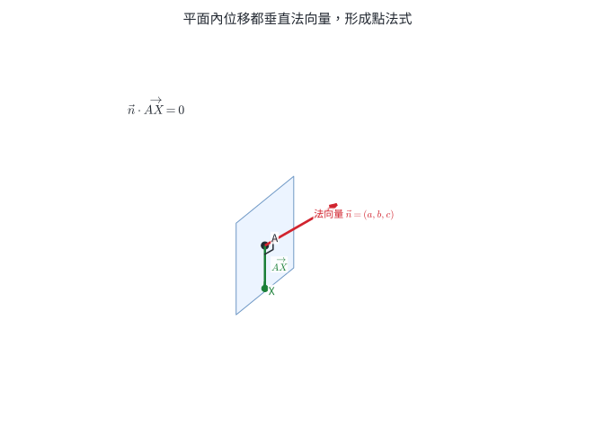{width=84%}

把常數整理，可寫成一般式

$$
\boxed{ax+by+cz+d=0},
$$

其中 $(a,b,c)$ 就是法向量。四個係數同乘非零常數仍表示同一平面；例如 $x-2y+z=3$ 與 $2x-4y+2z=6$ 的解集合完全相同。

法向量只決定朝向。要決定平面的位置，還需要平面上一點或常數項 $d$。

### 1.2 由三點求平面

三個不共線點 $A,B,C$ 決定唯一平面。先建立兩個不平行的平面內向量

$$
\overrightarrow{AB},\qquad\overrightarrow{AC},
$$

它們的外積

$$
\boxed{
\vec n=\overrightarrow{AB}\times\overrightarrow{AC}
}
$$

同時垂直兩個平面內方向，因此是法向量。接著把 $\vec n$ 與任一點代入點法式。

若外積為零，三點共線，能通過它們的平面有無限多個；此時資料不足以決定唯一平面。

### 1.3 截距式與坐標軸關係

若平面與 $x,y,z$ 軸分別交於

$$
(p,0,0),\qquad(0,q,0),\qquad(0,0,r),
$$

而且 $p,q,r$ 都非零，則平面可寫成

$$
\boxed{
\frac{x}{p}+\frac{y}{q}+\frac{z}{r}=1
}.
$$

逐一代入三個截距點都得到 $1$；由三個不共線點決定唯一平面，所以公式成立。

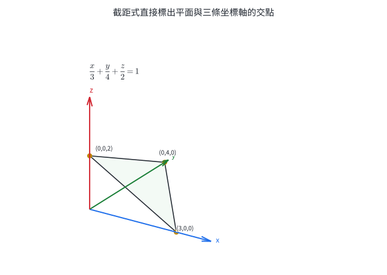{width=82%}

一般式的係數也能快速讀出與坐標軸、坐標平面的關係：

- $x=k$ 的法向量平行 $x$ 軸，所以平面垂直 $x$ 軸、平行 $yz$ 平面；
- $ax+by+d=0$ 沒有 $z$ 項，法向量的 $z$ 分量為 $0$，所以平面平行 $z$ 軸；
- 通過原點的平面常數項為 $0$。

::: {.why .keep-together}
### 法向量把整個平面的朝向濃縮成三個數

平面上有無限多個方向，直接逐一描述並不實用。法向量垂直所有平面內方向，只要三個分量就能代表整個平面的朝向。

電腦圖學用法向量判斷表面面向光源的程度；工程軟體用法向量檢查兩個零件面是否平行或垂直；測量資料擬合平面後，也以法向量記錄坡面朝向。
:::

::: worked-example
### 完整示範｜由一點與法向量建立平面

平面通過 $A=(1,3,-2)$，法向量為 $\vec n=(2,-1,2)$。求平面方程式。

代入點法式：

$$
2(x-1)-(y-3)+2(z+2)=0.
$$

展開：

$$
2x-y+2z+5=0.
$$

因此

$$
\boxed{E:2x-y+2z+5=0}.
$$

核對 $A$：$2(1)-3+2(-2)+5=0$；一般式前三個係數也正好是指定法向量。
:::

::: worked-example
### 完整示範｜由三個截距點求平面

平面通過

$$
A=(1,0,0),\quad B=(0,2,0),\quad C=(0,0,3).
$$

三點分別是 $x,y,z$ 軸截距，可直接寫成

$$
\boxed{x+\frac y2+\frac z3=1}.
$$

乘以 $6$ 得一般式

$$
\boxed{6x+3y+2z-6=0}.
$$

以外積核對：

$$
\overrightarrow{AB}=(-1,2,0),
\qquad
\overrightarrow{AC}=(-1,0,3),
$$

$$
\overrightarrow{AB}\times\overrightarrow{AC}
=(6,3,2),
$$

與一般式的法向量一致。
:::

::: worked-example
### 完整示範｜包含一條坐標軸的平面

求包含 $y$ 軸且通過 $P=(2,3,-1)$ 的平面。

設一般式為

$$
ax+by+cz+d=0.
$$

$y$ 軸上每一點 $(0,t,0)$ 都在平面上，所以對所有 $t$，

$$
bt+d=0.
$$

因此 $b=0$、$d=0$。再代入 $P$：

$$
2a-c=0.
$$

可取 $a=1,c=2$，得到

$$
\boxed{x+2z=0}.
$$

方程式沒有 $y$ 項，表示沿 $y$ 方向移動仍留在平面內，符合包含 $y$ 軸的幾何條件。
:::

::: self-check
### 節末練習｜平面方程式

1. 寫出平面 $3x-2y+6z-5=0$ 的一個法向量，並判斷點 $(1,2,1)$ 是否在平面上。
2. 求通過 $A=(2,-1,3)$、法向量為 $(1,2,-2)$ 的平面方程式。
3. 求通過 $A=(0,0,0)$、$B=(1,2,0)$、$C=(0,1,3)$ 的平面方程式。
4. 一平面在 $x,y,z$ 軸的截距分別為 $2,-3,6$。寫出截距式與一般式。
5. 求包含 $z$ 軸且通過 $P=(2,-1,4)$ 的平面方程式。
6. 平面 $E$ 平行 $z$ 軸，並通過 $A=(1,0,2)$、$B=(0,2,-1)$。求 $E$。

**解答**

1. 法向量可取 $(3,-2,6)$。代入點得 $3-4+6-5=0$，所以該點在平面上。
2. $(x-2)+2(y+1)-2(z-3)=0$，整理得 $\boxed{x+2y-2z+6=0}$。
3. $\overrightarrow{AB}=(1,2,0)$、$\overrightarrow{AC}=(0,1,3)$，外積為 $(6,-3,1)$。平面通過原點，所以 $\boxed{6x-3y+z=0}$。
4. 截距式為 $x/2-y/3+z/6=1$；乘以 $6$ 得 $\boxed{3x-2y+z-6=0}$。
5. 包含 $z$ 軸使方程式只有 $x,y$ 項且常數為 $0$。代入 $P$ 得 $2a-b=0$，可取 $a=1,b=2$，所以 $\boxed{x+2y=0}$。
6. 平行 $z$ 軸表示 $z$ 方向在平面內。另取 $\overrightarrow{AB}=(-1,2,-3)$，與 $(0,0,1)$ 外積可得法向量 $(2,1,0)$。代入 $A$ 得 $\boxed{2x+y-2=0}$。
:::

## 2. 平面的夾角、投影與距離

### 2.1 兩平面的夾角

設平面

$$
E_1:a_1x+b_1y+c_1z+d_1=0,
$$

$$
E_2:a_2x+b_2y+c_2z+d_2=0,
$$

法向量分別為

$$
\vec n_1=(a_1,b_1,c_1),
\qquad
\vec n_2=(a_2,b_2,c_2).
$$

兩平面的銳夾角等於兩法向量的銳夾角，因此

$$
\boxed{
\cos\theta
=\frac{|\vec n_1\cdot\vec n_2|}
{|\vec n_1|\,|\vec n_2|}
},
\qquad0^\circ\le\theta\le90^\circ.
$$

絕對值把法向量的正反方向視為同一平面朝向。

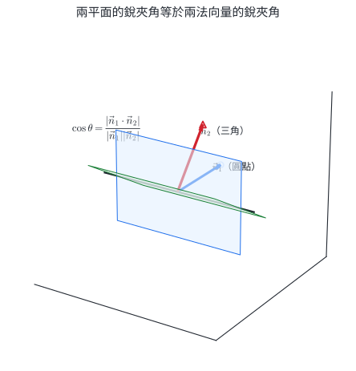{width=84%}

由法向量可直接判斷：

$$
\boxed{E_1\parallel E_2\iff\vec n_1\parallel\vec n_2},
$$

$$
\boxed{E_1\perp E_2\iff\vec n_1\cdot\vec n_2=0}.
$$

法向量平行時，兩平面可能平行或重合；再檢查一個平面上的點是否也滿足另一方程式即可區分。

### 2.2 點到平面的距離與投影點

設點 $P=(x_0,y_0,z_0)$，平面

$$
E:ax+by+cz+d=0,
$$

法向量 $\vec n=(a,b,c)$。取平面上任一點 $A$，$\overrightarrow{AP}$ 沿法向量的投影長為

$$
\frac{|\overrightarrow{AP}\cdot\vec n|}{|\vec n|}.
$$

因 $A$ 滿足 $aA_x+bA_y+cA_z+d=0$，分子整理成 $|ax_0+by_0+cz_0+d|$，得到

::: concept
$$
\boxed{
d(P,E)=
\frac{|ax_0+by_0+cz_0+d|}{\sqrt{a^2+b^2+c^2}}
}.
$$
:::

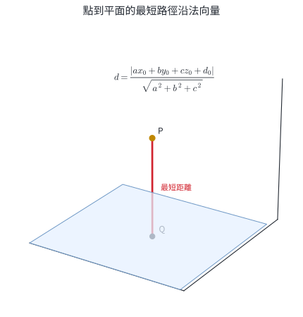{width=82%}

令

$$
F(P)=ax_0+by_0+cz_0+d.
$$

從 $P$ 沿法向量移到投影點 $Q$：

$$
Q=P-t\vec n.
$$

把 $Q$ 代入平面方程式，得到

$$
F(P)-t|\vec n|^2=0,
$$

所以

$$
\boxed{
Q=P-\frac{F(P)}{|\vec n|^2}\vec n
}.
$$

點 $P$ 關於平面 $E$ 的對稱點 $P'$ 以 $Q$ 為中點：

$$
\boxed{P'=2Q-P}.
$$

### 2.3 兩平行平面的距離

兩平行平面須先寫成完全相同的法向係數：

$$
E_1:ax+by+cz+d_1=0,
$$

$$
E_2:ax+by+cz+d_2=0.
$$

任取 $E_1$ 上一點，代入 $E_2$ 的距離公式，可得

$$
\boxed{
d(E_1,E_2)=
\frac{|d_1-d_2|}{\sqrt{a^2+b^2+c^2}}
}.
$$

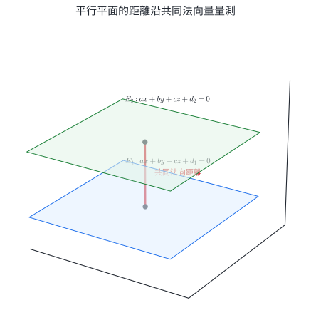{width=82%}

若兩式的前三個係數成比例，先把整條方程式同乘或同除，使 $(a,b,c)$ 完全一致，再比較常數項。

::: worked-example
### 完整示範｜兩平面的銳夾角

求

$$
E_1:2x-y+2z=3,
\qquad
E_2:x+2y-2z=4
$$

的銳夾角。

法向量為

$$
\vec n_1=(2,-1,2),
\qquad
\vec n_2=(1,2,-2).
$$

$$
\vec n_1\cdot\vec n_2=2-2-4=-4,
\qquad
|\vec n_1|=|\vec n_2|=3.
$$

所以

$$
\cos\theta=\frac{|-4|}{3\cdot3}=\frac49,
$$

$$
\boxed{\theta=\cos^{-1}\!\left(\frac49\right)\approx63.6^\circ}.
$$
:::

::: worked-example
### 完整示範｜點到平面的距離、投影與對稱

點 $P=(1,-2,3)$，平面

$$
E:2x-2y+z-5=0.
$$

法向量 $\vec n=(2,-2,1)$，$|\vec n|=3$。先算

$$
F(P)=2(1)-2(-2)+3-5=4.
$$

距離為

$$
\boxed{d(P,E)=\frac43}.
$$

投影點：

$$
Q=P-\frac4{9}(2,-2,1)
=\boxed{\left(\frac19,-\frac{10}{9},\frac{23}{9}\right)}.
$$

代回平面：

$$
\frac29+\frac{20}{9}+\frac{23}{9}-5=0.
$$

對稱點為

$$
P'=2Q-P
=\boxed{\left(-\frac79,-\frac29,\frac{19}{9}\right)}.
$$

$Q$ 是 $PP'$ 的中點，且 $PP'$ 平行法向量。
:::

::: worked-example
### 完整示範｜係數先正規化再求平行平面距離

求

$$
E_1:2x-y+2z-3=0,
$$

$$
E_2:4x-2y+4z+6=0
$$

的距離。

第二式除以 $2$：

$$
E_2:2x-y+2z+3=0.
$$

兩平面法向量相同，距離為

$$
d=\frac{|(-3)-3|}{\sqrt{2^2+(-1)^2+2^2}}
=\frac6{3}
=\boxed2.
$$
:::

::: self-check
### 節末練習｜平面夾角與距離

1. 判斷 $E_1:x+2y-2z=1$ 與 $E_2:2x+4y-4z=7$ 的關係。
2. 求平面 $x+y+z=1$ 與 $x-y=2$ 的銳夾角。
3. 求點 $P=(2,-1,4)$ 到平面 $2x+y-2z+3=0$ 的距離。
4. 求點 $P=(2,0,1)$ 在平面 $x-2y+2z-1=0$ 上的投影點與對稱點。
5. 求平面 $x-2y+2z-3=0$ 與 $3x-6y+6z+9=0$ 的距離。
6. 求通過原點、且平行於 $2x-y+2z=5$ 的平面。

**解答**

1. 法向量成比例；把第二式除以 $2$ 得 $x+2y-2z=7/2$，常數不同，所以兩平面平行。
2. 法向量 $(1,1,1)$、$(1,-1,0)$ 的內積為 $0$，所以兩平面垂直，夾角 $90^\circ$。
3. 分子 $|4-1-8+3|=2$，分母為 $3$，所以距離為 $\boxed{2/3}$。
4. $F(P)=2+2-1=3$，$|\vec n|^2=9$。投影點 $Q=P-\tfrac13(1,-2,2)=(5/3,2/3,1/3)$；對稱點 $P'=2Q-P=(4/3,4/3,-1/3)$。
5. 第二式除以 $3$ 得 $x-2y+2z+3=0$。距離為 $|{-3}-3|/3=\boxed2$。
6. 平行平面沿用法向量 $(2,-1,2)$；通過原點使常數為 $0$，所以 $\boxed{2x-y+2z=0}$。
:::

## 3. 空間直線方程式

### 3.1 向量式與參數式

一條直線由線上一點

$$
A=(x_0,y_0,z_0)
$$

與非零方向向量

$$
\vec d=(a,b,c)
$$

決定。直線上任一點 $X=(x,y,z)$ 都滿足

$$
\boxed{X=A+t\vec d},\qquad t\in\mathbb R.
$$

逐分量寫成參數式：

::: concept
$$
\boxed{
\begin{cases}
x=x_0+at,\\
y=y_0+bt,\\
z=z_0+ct,
\end{cases}
\qquad t\in\mathbb R
}.
$$
:::

參數 $t$ 是有向移動倍數。$t=0$ 位於基準點 $A$；$t>0$ 沿 $\vec d$ 前進；$t<0$ 沿反方向前進。

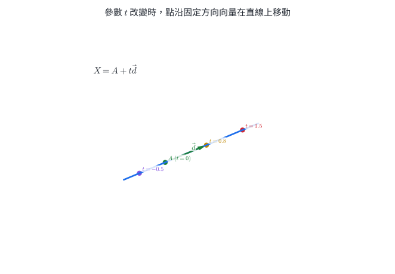{width=84%}

同一直線可選不同基準點，也可把方向向量乘任意非零常數，所以方程式不唯一。判斷是否為同一直線要比較解集合，而非比較外觀。

### 3.2 比例式

若方向向量三個分量 $a,b,c$ 都非零，消去參數 $t$ 可得比例式：

$$
\boxed{
\frac{x-x_0}{a}
=\frac{y-y_0}{b}
=\frac{z-z_0}{c}
}.
$$

若某個方向分量為 $0$，相應坐標保持固定。例如方向向量 $(2,0,-1)$ 的直線寫成

$$
\frac{x-x_0}{2}
=\frac{z-z_0}{-1},
\qquad y=y_0.
$$

固定坐標比寫成分母 $0$ 更能準確表達幾何條件。

### 3.3 通過兩點的直線

不同兩點 $P,Q$ 決定唯一直線，方向向量可取

$$
\boxed{\vec d=Q-P}.
$$

線段 $PQ$ 上的點可用 $0\le t\le1$：

$$
X=P+t(Q-P).
$$

$t$ 超出 $[0,1]$ 時，點位於線段外的延長線。

### 3.4 兩個平面的交線

兩個不平行平面

$$
E_1:\vec n_1\cdot X=d_1,
\qquad
E_2:\vec n_2\cdot X=d_2
$$

的交線方向同時垂直 $\vec n_1,\vec n_2$，所以可取

$$
\boxed{
\vec d=\vec n_1\times\vec n_2
}.
$$

再聯立兩個平面方程式找一個公共點 $A$，交線就是 $X=A+t\vec d$。

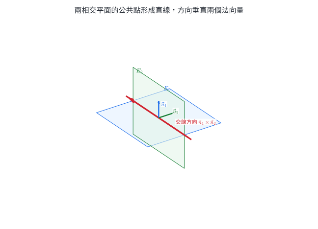{width=82%}

兩個平面方程式直接聯立的表示稱為直線的兩面式。它適合描述交集；參數式則適合找點、判斷交會與建立運動模型。

::: {.why .keep-together}
### 參數式同時記錄路徑與位置狀態

一般式回答「點是否在幾何物件上」；參數式進一步回答「沿路徑走了多少」。無人機航線 $X(t)=A+t\vec d$ 中，若 $t$ 與時間成比例，就能直接預測各時刻位置；電腦繪圖的射線追蹤也沿 $A+t\vec d$ 尋找光線與物體表面的第一個交點。
:::

::: worked-example
### 完整示範｜由兩點寫出參數式與比例式

直線通過

$$
P=(1,-2,3),\qquad Q=(5,0,-1).
$$

方向向量

$$
\overrightarrow{PQ}=(4,2,-4)=2(2,1,-2).
$$

取較簡單的 $\vec d=(2,1,-2)$，參數式為

$$
\boxed{
\begin{cases}
x=1+2t,\\
y=-2+t,\\
z=3-2t.
\end{cases}}
$$

比例式為

$$
\boxed{
\frac{x-1}{2}=y+2=\frac{z-3}{-2}
}.
$$

點 $Q$ 對應 $t=2$，代入三式分別得到 $(5,0,-1)$。
:::

::: worked-example
### 完整示範｜方向分量為零的比例式

直線通過 $A=(2,3,-1)$，方向向量為 $(2,0,-3)$。

參數式：

$$
\begin{cases}
x=2+2t,\\
y=3,\\
z=-1-3t.
\end{cases}
$$

比例式：

$$
\boxed{
\frac{x-2}{2}=\frac{z+1}{-3},
\qquad y=3
}.
$$

$y$ 坐標固定為 $3$，表示直線平行 $xz$ 平面。
:::

::: worked-example
### 完整示範｜把兩面式化為參數式

兩平面

$$
E_1:x+y+z=3,
\qquad
E_2:x-y+z=1
$$

交於直線 $L$。法向量為

$$
\vec n_1=(1,1,1),
\qquad
\vec n_2=(1,-1,1).
$$

外積

$$
\vec n_1\times\vec n_2=(2,0,-2)=2(1,0,-1),
$$

所以方向可取 $(1,0,-1)$。

聯立兩平面，兩式相減得 $2y=2$，所以 $y=1$；再得 $x+z=2$。取 $z=0$，可得公共點 $A=(2,1,0)$。因此

$$
\boxed{
L:(x,y,z)=(2,1,0)+t(1,0,-1)
}.
$$

代入兩個平面方程式都分別得到 $3$ 與 $1$，且與 $t$ 無關。
:::

::: self-check
### 節末練習｜直線方程式

1. 寫出通過 $A=(1,2,-1)$、方向向量 $(3,-2,4)$ 的參數式與比例式。
2. 求通過 $P=(-1,0,2)$、$Q=(3,6,0)$ 的直線參數式。
3. 把 $x=2+t$、$y=-1+3t$、$z=4$ 寫成比例式。
4. 判斷點 $R=(5,0,-5)$ 是否在直線 $(x,y,z)=(1,2,1)+t(2,-1,-3)$ 上。
5. 求平面 $x+y-z=1$ 與 $2x-y+z=4$ 的交線參數式。
6. 寫出線段 $A=(0,1,2)$ 到 $B=(4,-1,6)$ 的參數表示，並給出對應線段的參數範圍。

**解答**

1. 參數式 $(x,y,z)=(1,2,-1)+t(3,-2,4)$；比例式 $\dfrac{x-1}{3}=\dfrac{y-2}{-2}=\dfrac{z+1}{4}$。
2. $Q-P=(4,6,-2)=2(2,3,-1)$，可寫成 $(x,y,z)=(-1,0,2)+t(2,3,-1)$。
3. $z=4$ 固定，其餘兩式消去 $t$：$\boxed{x-2=(y+1)/3,\ z=4}$。
4. 由 $x$ 得 $t=2$，由 $y$ 也得 $t=2$，但此時 $z=1-6=-5$，一致，所以 $R$ 在直線上。
5. 法向量 $(1,1,-1)$、$(2,-1,1)$ 的外積為 $(0,-3,-3)$，方向可取 $(0,1,1)$。令 $z=0$，聯立得 $x=5/3,y=-2/3$，所以 $L=(5/3,-2/3,0)+t(0,1,1)$。
6. $X=A+t(B-A)=(0,1,2)+t(4,-2,4)$，線段對應 $\boxed{0\le t\le1}$。
:::

## 4. 直線與平面的關係、投影與夾角

### 4.1 用方向向量與代入結果判斷交集

設直線

$$
L:X=A+t\vec d
$$

與平面

$$
E:\vec n\cdot X+d_0=0.
$$

把直線代入平面：

$$
\vec n\cdot(A+t\vec d)+d_0
=F(A)+t(\vec n\cdot\vec d)=0.
$$

參數方程的解數量直接對應幾何交集：

| 條件 | 參數解 | 幾何關係 |
|---|---:|---|
| $\vec n\cdot\vec d\ne0$ | 唯一解 | 相交於一點 |
| $\vec n\cdot\vec d=0$ 且 $F(A)\ne0$ | 無解 | 直線平行平面 |
| $\vec n\cdot\vec d=0$ 且 $F(A)=0$ | 所有 $t$ | 直線在平面內 |

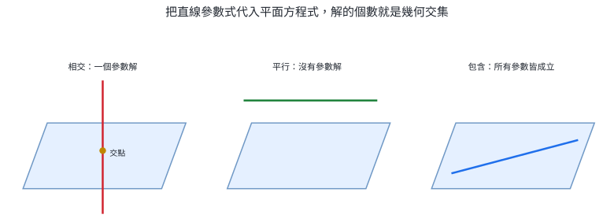{width=96%}

### 4.2 包含直線的平面

平面若包含直線 $L$，平面的法向量必須垂直 $L$ 的方向向量。要決定唯一平面，還需另一個獨立的平面內方向。

若平面包含直線 $L:X=A+t\vec d$，並通過線外一點 $P$，可取

$$
\overrightarrow{AP}=P-A
$$

作為第二個平面內方向，因此法向量可取

$$
\boxed{\vec n=\vec d\times\overrightarrow{AP}}.
$$

兩條相交直線或兩條平行直線也能決定唯一平面；分別取兩方向向量，或取一個方向向量與兩線間位移，再作外積。

### 4.3 點在平面上的投影與對稱

投影公式沿用上一節：

$$
Q=P-\frac{F(P)}{|\vec n|^2}\vec n.
$$

它也可以用聯立法理解：過 $P$ 作方向為 $\vec n$ 的直線，與平面的唯一交點就是 $Q$。對稱點 $P'=2Q-P$。

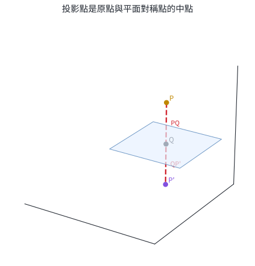{width=82%}

### 4.4 直線與平面的夾角

設直線方向向量 $\vec d$ 與平面法向量 $\vec n$ 的銳夾角為 $\alpha$，直線與平面的夾角為 $\theta$，則

$$
\alpha+\theta=90^\circ.
$$

因此

$$
\boxed{
\sin\theta
=\frac{|\vec d\cdot\vec n|}{|\vec d|\,|\vec n|}
},
\qquad0^\circ\le\theta\le90^\circ.
$$

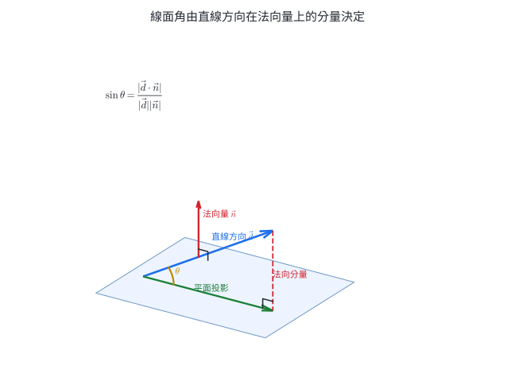{width=84%}

$\vec d\cdot\vec n=0$ 時，直線方向完全留在平面方向中，線面角為 $0^\circ$；$\vec d\parallel\vec n$ 時，線面角為 $90^\circ$。

::: worked-example
### 完整示範｜判斷平行並核對位置

直線

$$
L:(x,y,z)=(1,0,2)+t(2,1,-1)
$$

與平面

$$
E:x-y+z=4.
$$

方向向量 $\vec d=(2,1,-1)$，法向量 $\vec n=(1,-1,1)$。先算

$$
\vec n\cdot\vec d=2-1-1=0,
$$

所以直線方向平行平面。再代入基準點 $A=(1,0,2)$：

$$
1-0+2=3\ne4.
$$

因此直線不在平面上，而是

$$
\boxed{L\parallel E}.
$$
:::

::: worked-example
### 完整示範｜求直線與平面的交點

同一直線

$$
L:(x,y,z)=(1,0,2)+t(2,1,-1)
$$

改與平面 $E:x+y+z=4$ 相交。代入：

$$
(1+2t)+t+(2-t)=4,
$$

$$
3+2t=4,
\qquad t=\frac12.
$$

交點為

$$
\boxed{
I=\left(2,\frac12,\frac32\right)
}.
$$

代回平面得 $2+1/2+3/2=4$。
:::

::: worked-example
### 完整示範｜求包含直線與線外一點的平面

平面包含直線

$$
L:(x,y,z)=(1,0,0)+t(1,1,0)
$$

並通過 $P=(0,1,1)$。直線上取 $A=(1,0,0)$，則

$$
\vec d=(1,1,0),
\qquad
\overrightarrow{AP}=(-1,1,1).
$$

法向量可取

$$
\vec n=\vec d\times\overrightarrow{AP}
=(1,-1,2).
$$

代入點 $A$：

$$
(x-1)-y+2z=0.
$$

所以

$$
\boxed{x-y+2z-1=0}.
$$

把直線參數代入得 $(1+t)-t-1=0$，對所有 $t$ 成立；代入 $P$ 也得到 $0$。
:::

::: worked-example
### 完整示範｜平面投影與對稱點

點 $P=(3,-1,4)$，平面

$$
E:2x-y+2z-3=0.
$$

$\vec n=(2,-1,2)$，$|\vec n|^2=9$，且

$$
F(P)=6+1+8-3=12.
$$

投影點

$$
Q=P-\frac{12}{9}(2,-1,2)
=\boxed{\left(\frac13,\frac13,\frac43\right)}.
$$

對稱點

$$
P'=2Q-P
=\boxed{\left(-\frac73,\frac53,-\frac43\right)}.
$$

核對 $Q$ 在平面上：$2/3-1/3+8/3-3=0$。
:::

::: worked-example
### 完整示範｜求直線與平面的夾角

直線方向向量為 $\vec d=(2,-1,2)$，平面法向量為 $\vec n=(1,2,2)$。兩向量長皆為 $3$，且

$$
\vec d\cdot\vec n=2-2+4=4.
$$

若線面角為 $\theta$，

$$
\sin\theta=\frac49,
$$

$$
\boxed{\theta=\sin^{-1}\!\left(\frac49\right)\approx26.4^\circ}.
$$
:::

::: self-check
### 節末練習｜直線與平面

1. 判斷直線 $(x,y,z)=(1,2,0)+t(1,-1,2)$ 與平面 $x+y=3$ 的關係。
2. 求直線 $(x,y,z)=(0,1,2)+t(2,-1,1)$ 與平面 $x+2y-z=1$ 的交點。
3. 求包含直線 $(x,y,z)=(1,0,1)+t(1,2,0)$ 且通過 $P=(0,1,3)$ 的平面。
4. 求點 $P=(2,-1,3)$ 在平面 $x+2y+2z-5=0$ 上的投影點。
5. 求第 4 題中 $P$ 關於該平面的對稱點。
6. 求方向向量 $(1,2,2)$ 的直線與平面 $2x-y+2z=4$ 的銳夾角。

**解答**

1. 法向量 $(1,1,0)$ 與方向向量內積為 $0$；基準點滿足 $1+2=3$，所以整條直線在平面內。
2. 代入得 $2t+2(1-t)-(2+t)=1$，即 $-t=1$，所以 $t=-1$，交點為 $\boxed{(-2,2,1)}$。
3. 取 $A=(1,0,1)$、$\vec d=(1,2,0)$、$\overrightarrow{AP}=(-1,1,2)$。外積為 $(4,-2,3)$，所以平面為 $\boxed{4x-2y+3z-7=0}$。
4. $F(P)=2-2+6-5=1$，$|\vec n|^2=9$，故 $Q=P-\tfrac19(1,2,2)=\boxed{(17/9,-11/9,25/9)}$。
5. $P'=2Q-P=\boxed{(16/9,-13/9,23/9)}$。
6. $\vec d=(1,2,2)$、$\vec n=(2,-1,2)$，內積為 $4$，長度皆 $3$，所以 $\theta=\sin^{-1}(4/9)\approx26.4^\circ$。
:::

## 5. 兩直線的位置關係與夾角

### 5.1 方向向量先分流

設

$$
L_1:X=A+t\vec d_1,
\qquad
L_2:X=B+s\vec d_2.
$$

先判斷 $\vec d_1,\vec d_2$ 是否平行：

- 若方向平行，再檢查 $B-A$ 是否也平行該方向。是則兩線重合；否則兩線平行且不同。
- 若方向不平行，聯立

  $$
  A+t\vec d_1=B+s\vec d_2.
  $$

  三個分量有共同的 $(t,s)$ 解時，兩線相交；無共同解時，兩線歪斜。

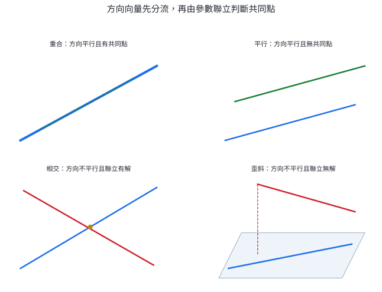{width=94%}

歪斜線是空間特有的關係：兩線方向不平行，卻因位於不同平面而沒有交點。

也可用三重積檢查共面。若 $\vec d_1,\vec d_2$ 不平行，則

$$
\boxed{
L_1,L_2\text{ 共面}
\iff
(B-A)\cdot(\vec d_1\times\vec d_2)=0
}.
$$

共面且方向不平行就會相交；三重積非零則為歪斜。

### 5.2 兩直線的銳夾角

兩直線的夾角由方向向量決定。取銳角或直角 $\theta$：

$$
\boxed{
\cos\theta=
\frac{|\vec d_1\cdot\vec d_2|}
{|\vec d_1|\,|\vec d_2|}
},
\qquad0^\circ\le\theta\le90^\circ.
$$

即使兩線歪斜，仍可把其中一條平移到與另一條相交，再以方向向量定義夾角。

::: worked-example
### 完整示範｜聯立參數找交點

$$
L_1:(x,y,z)=t(1,1,1),
$$

$$
L_2:(x,y,z)=(1,3,1)+s(1,-1,1).
$$

方向向量不平行。聯立三個分量：

$$
\begin{cases}
t=1+s,\\
t=3-s,\\
t=1+s.
\end{cases}
$$

前兩式給 $2s=2$，所以 $s=1$、$t=2$；第三式也成立。因此兩線交於

$$
\boxed{I=(2,2,2)}.
$$
:::

::: worked-example
### 完整示範｜方向平行時區分重合與平行

$$
L_1:X=(1,0,2)+t(2,-1,1).
$$

先看

$$
L_2:X=(5,-2,4)+s(-4,2,-2).
$$

$L_2$ 的方向是 $L_1$ 方向的 $-2$ 倍；而

$$
(5,-2,4)-(1,0,2)=(4,-2,2)=2(2,-1,1),
$$

所以 $L_2$ 的基準點也在 $L_1$ 上，兩線重合。

若把 $L_2$ 的基準點改成 $(5,-2,5)$，兩方向仍平行，但位移 $(4,-2,3)$ 不是 $(2,-1,1)$ 的倍數，因此兩線平行且不同。
:::

::: worked-example
### 完整示範｜以三重積判斷歪斜

$$
L_1:X=(0,0,0)+t(1,0,1),
$$

$$
L_2:X=(0,1,0)+s(0,1,1).
$$

方向向量不平行。取

$$
B-A=(0,1,0),
$$

$$
\vec d_1\times\vec d_2
=(1,0,1)\times(0,1,1)
=(-1,-1,1).
$$

三重積

$$
(0,1,0)\cdot(-1,-1,1)=-1\ne0.
$$

所以兩線不共面，結論為

$$
\boxed{L_1,L_2\text{ 歪斜}}.
$$
:::

::: worked-example
### 完整示範｜兩直線的夾角

方向向量

$$
\vec d_1=(1,2,2),
\qquad
\vec d_2=(2,1,-2).
$$

內積為

$$
\vec d_1\cdot\vec d_2=2+2-4=0.
$$

所以兩直線夾角為

$$
\boxed{90^\circ}.
$$

這個結論只由方向決定，適用於相交線或歪斜線。
:::

::: self-check
### 節末練習｜兩直線關係

1. 判斷 $L_1:X=(1,0,1)+t(2,-1,3)$ 與 $L_2:X=(5,-2,7)+s(-4,2,-6)$ 的關係。
2. 判斷 $L_1:X=t(1,2,1)$ 與 $L_2:X=(1,0,2)+s(1,-1,0)$ 是否相交；若相交，求交點。
3. 用三重積判斷 $L_1:X=t(1,0,1)$ 與 $L_2:X=(0,2,0)+s(1,1,0)$ 是否歪斜。
4. 求方向向量 $(1,1,0)$ 與 $(1,0,1)$ 所代表兩直線的銳夾角。
5. 已知兩直線方向向量為 $(1,k,1)$ 與 $(2,-1,0)$，且兩線垂直，求 $k$。
6. 寫出通過原點且與直線 $(x,y,z)=(1,2,3)+t(2,-1,2)$ 平行的直線。

**解答**

1. 方向向量成 $-2$ 倍，且基準點位移 $(4,-2,6)=2(2,-1,3)$，所以兩線重合。
2. 聯立 $(t,2t,t)=(1+s,-s,2)$。由第三式 $t=2$，第二式給 $s=-4$，但第一式變成 $2=-3$，矛盾；方向不平行且無交點，所以歪斜。
3. $B-A=(0,2,0)$，$\vec d_1\times\vec d_2=(1,0,1)\times(1,1,0)=(-1,1,1)$。三重積為 $2\ne0$，所以歪斜。
4. 內積為 $1$，長度皆 $\sqrt2$，所以 $\cos\theta=1/2$，$\boxed{\theta=60^\circ}$。
5. 內積 $2-k=0$，所以 $\boxed{k=2}$。
6. 可寫成 $\boxed{(x,y,z)=t(2,-1,2)}$。
:::

## 6. 與直線相關的最短距離

### 6.1 點到直線

直線 $L:X=A+t\vec d$，點 $P$。垂足 $H=A+t_0\vec d$ 要滿足

$$
\overrightarrow{HP}\cdot\vec d=0.
$$

也就是

$$
(P-A-t_0\vec d)\cdot\vec d=0,
$$

所以

$$
\boxed{
t_0=\frac{\overrightarrow{AP}\cdot\vec d}{|\vec d|^2}
},
$$

$$
\boxed{
H=A+t_0\vec d,
\qquad
d(P,L)=|P-H|
}.
$$

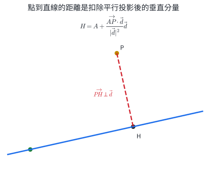{width=86%}

以外積的面積觀點，也可寫成

$$
\boxed{
d(P,L)=
\frac{|\overrightarrow{AP}\times\vec d|}{|\vec d|}
}.
$$

分子是以 $|\vec d|$ 為底、點線距離為高的平行四邊形面積。

### 6.2 兩平行線

兩平行線的距離固定。任取 $L_1$ 上一點 $A$，求它到 $L_2$ 的點線距離即可：$\boxed{d(L_1,L_2)=\frac{|\overrightarrow{BA}\times\vec d|}{|\vec d|}}$，其中 $B$ 是 $L_2$ 上任一點，$\vec d$ 是共同方向。

### 6.3 兩歪斜線

設

$$
L_1:X=A+t\vec d_1,
\qquad
L_2:X=B+s\vec d_2,
$$

而且兩線歪斜。最短連線方向同時垂直 $\vec d_1,\vec d_2$，所以平行

$$
\vec n=\vec d_1\times\vec d_2.
$$

把 $\overrightarrow{AB}$ 沿 $\vec n$ 投影，就得到距離：

::: concept
$$
\boxed{
d(L_1,L_2)=
\frac{|\overrightarrow{AB}\cdot(\vec d_1\times\vec d_2)|}
{|\vec d_1\times\vec d_2|}
}.
$$
:::

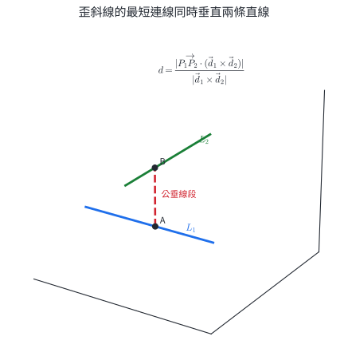{width=84%}

這個公式也可由體積理解。分子的絕對值是 $\overrightarrow{AB},\vec d_1,\vec d_2$ 張成的平行六面體體積；底面積為 $|\vec d_1\times\vec d_2|$，體積除以底面積就得到高。

若要找公垂線的兩個端點，令

$$
P=A+t\vec d_1,
\qquad
Q=B+s\vec d_2,
$$

並解

$$
\overrightarrow{PQ}\cdot\vec d_1=0,
\qquad
\overrightarrow{PQ}\cdot\vec d_2=0.
$$

兩個一次方程可求出 $t,s$。

::: {.why .keep-together}
### 最短距離來自「可移動方向全部被消去」

從點連到直線時，沿直線方向的位移仍可藉由滑動垂足改變；最短位置會讓剩餘連線完全垂直直線。兩條歪斜線各有一個可移動方向，最短連線便要同時垂直兩者。

機器手臂避障、管線間隙檢查與道路立體交叉的淨距，都可化成點、平行線或歪斜線的最短距離模型。
:::

::: worked-example
### 完整示範｜求點到直線的垂足與距離

直線

$$
L:X=(0,1,1)+t(1,2,2),
$$

點 $P=(3,0,4)$。令 $A=(0,1,1)$、$\vec d=(1,2,2)$，則

$$
\overrightarrow{AP}=(3,-1,3).
$$

$$
t_0=\frac{(3,-1,3)\cdot(1,2,2)}{1+4+4}
=\frac{3-2+6}{9}
=\frac79.
$$

垂足

$$
H=A+\frac79\vec d
=\boxed{\left(\frac79,\frac{23}{9},\frac{23}{9}\right)}.
$$

$$
\overrightarrow{HP}
=\left(\frac{20}{9},-\frac{23}{9},\frac{13}{9}\right),
$$

而 $\overrightarrow{HP}\cdot\vec d=(20-46+26)/9=0$。距離為

$$
d(P,L)
=\frac{\sqrt{400+529+169}}9
=\boxed{\frac{\sqrt{122}}3}.
$$
:::

::: worked-example
### 完整示範｜兩平行線的距離

$$
L_1:X=t(1,2,2),
$$

$$
L_2:X=(2,0,1)+s(1,2,2).
$$

取 $A=(0,0,0)$、$B=(2,0,1)$。兩線共同方向 $\vec d=(1,2,2)$。計算

$$
\overrightarrow{AB}\times\vec d
=(2,0,1)\times(1,2,2)
=(-2,-3,4).
$$

所以

$$
d(L_1,L_2)
=\frac{\sqrt{4+9+16}}{3}
=\boxed{\frac{\sqrt{29}}3}.
$$
:::

::: worked-example
### 完整示範｜歪斜線距離與公垂線段

$$
L_1:X=(0,0,0)+t(1,0,0),
$$

$$
L_2:X=(0,1,2)+s(0,1,0).
$$

$$
\vec d_1\times\vec d_2=(0,0,1),
\qquad
\overrightarrow{AB}=(0,1,2).
$$

因此

$$
d(L_1,L_2)
=\frac{|(0,1,2)\cdot(0,0,1)|}{1}
=\boxed2.
$$

求端點：$P=(t,0,0)$、$Q=(0,1+s,2)$，所以

$$
\overrightarrow{PQ}=(-t,1+s,2).
$$

它垂直 $(1,0,0)$ 給 $t=0$；垂直 $(0,1,0)$ 給 $s=-1$。故

$$
P=(0,0,0),\qquad Q=(0,0,2),
$$

公垂線段長為 $2$，與公式一致。
:::

::: self-check
### 節末練習｜直線距離

1. 求點 $P=(2,3,1)$ 到直線 $L:X=(1,0,0)+t(1,2,2)$ 的垂足。
2. 承第 1 題，求點線距離。
3. 求平行線 $L_1:X=t(2,1,2)$ 與 $L_2:X=(1,2,0)+s(2,1,2)$ 的距離。
4. 求歪斜線 $L_1:X=t(1,0,0)$、$L_2:X=(1,2,3)+s(0,1,0)$ 的距離。
5. 承第 4 題，求公垂線段在兩線上的端點。
6. 說明點線距離的投影公式與外積公式得到同一個量的幾何理由。

**解答**

1. $A=(1,0,0)$、$\overrightarrow{AP}=(1,3,1)$、$\vec d=(1,2,2)$。$t_0=(1+6+2)/9=1$，所以垂足 $H=(2,2,2)$。
2. $P-H=(0,1,-1)$，距離為 $\boxed{\sqrt2}$。
3. 取 $A=(0,0,0)$、$B=(1,2,0)$。$(1,2,0)\times(2,1,2)=(4,-2,-3)$，所以距離為 $\boxed{\sqrt{29}/3}$。
4. 方向外積為 $(0,0,1)$，$\overrightarrow{AB}=(1,2,3)$，所以距離為 $\boxed3$。
5. $P=(t,0,0)$、$Q=(1,2+s,3)$，$Q-P=(1-t,2+s,3)$。垂直兩方向給 $t=1$、$s=-2$，端點為 $(1,0,0)$、$(1,0,3)$。
6. 投影公式扣除沿直線方向的分量，剩下垂直分量長；外積公式先算以方向向量為底、垂直分量為高的平行四邊形面積，再除以底長。兩者都量同一個高。
:::

## 7. 核心整理

### 平面

$$
E:a(x-x_0)+b(y-y_0)+c(z-z_0)=0,
\qquad
\vec n=(a,b,c).
$$

$$
d(P,E)=\frac{|F(P)|}{|\vec n|},
\qquad
Q=P-\frac{F(P)}{|\vec n|^2}\vec n.
$$

### 直線

$$
L:X=A+t\vec d,
\qquad
\frac{x-x_0}{a}=\frac{y-y_0}{b}=\frac{z-z_0}{c}
$$

其中比例式只對非零方向分量使用；零分量改寫成固定坐標。

### 關係與角度

$$
\cos\angle(E_1,E_2)
=\frac{|\vec n_1\cdot\vec n_2|}{|\vec n_1||\vec n_2|},
$$

$$
\sin\angle(L,E)
=\frac{|\vec d\cdot\vec n|}{|\vec d||\vec n|},
$$

$$
\cos\angle(L_1,L_2)
=\frac{|\vec d_1\cdot\vec d_2|}{|\vec d_1||\vec d_2|}.
$$

### 直線距離

$$
d(P,L)=\frac{|\overrightarrow{AP}\times\vec d|}{|\vec d|},
$$

$$
d(L_1,L_2)_{\text{歪斜}}
=\frac{|\overrightarrow{AB}\cdot(\vec d_1\times\vec d_2)|}{|\vec d_1\times\vec d_2|}.
$$

平面用法向量描述限制；直線用方向向量描述自由移動；交集靠聯立，最短距離靠垂直分量。

## 8. 分層題與跨節整合題

### 題目 1｜由點與法向量決定平面

求通過 $A=(2,-1,3)$ 且以 $(1,2,-2)$ 為法向量的平面方程式，並判斷點 $B=(0,1,4)$ 是否在此平面上。

### 題目 2｜三點決定平面

已知

$$
A=(0,0,0),\qquad B=(2,1,0),\qquad C=(0,1,2).
$$

求平面 $ABC$ 的一個法向量與一般式方程。

### 題目 3｜兩平面的夾角

求平面

$$
E_1:x+2y+2z=3,
$$

$$
E_2:2x-y+2z=1
$$

的銳夾角 $	heta$，以 $cos\theta$ 表示答案。

### 題目 4｜點到平面的距離與投影

點 $P=(2,-1,3)$，平面

$$
E:x+2y+2z-5=0.
$$

求 $P$ 到 $E$ 的距離，以及 $P$ 在 $E$ 上的正射影 $Q$。

### 題目 5｜直線的兩種方程

求通過 $P=(1,-2,3)$、$Q=(5,0,-1)$ 的直線之參數式與比例式。

### 題目 6｜兩平面的交線

把

$$
\begin{cases}
x+y+z=3,\\
x-y+z=1
\end{cases}
$$

所表示的直線改寫成參數式。

### 題目 7｜直線與平面的交點

直線與平面分別為

$$
L:X=(0,1,2)+t(2,-1,1),
$$

$$
E:x+2y-z=1.
$$

判斷兩者的關係；若相交，求交點。

### 題目 8｜平面投影與鏡射

點 $P=(3,-1,4)$，平面

$$
E:2x-y+2z-3=0.
$$

求 $P$ 在 $E$ 上的正射影 $Q$，以及 $P$ 關於 $E$ 的對稱點 $P'$。

### 題目 9｜直線與平面的夾角

直線方向向量為 $(2,-1,2)$，平面法向量為 $(1,2,2)$。求直線與平面的銳夾角 $\theta$，以 $\sin\theta$ 表示答案。

### 題目 10｜平行直線的判別與距離

$$
L_1:X=(1,0,1)+t(2,-1,1),
$$

$$
L_2:X=(0,2,1)+s(4,-2,2).
$$

1. 判斷兩直線的位置關係；
2. 求兩直線的距離。

### 題目 11｜相交直線與夾角

$$
L_1:X=t(1,1,1),
$$

$$
L_2:X=(1,3,1)+s(1,-1,1).
$$

求交點，並求兩直線銳夾角 $\theta$ 的 $\cos\theta$。

### 題目 12｜點到直線的最短距離

直線

$$
L:X=(0,1,1)+t(1,2,2)
$$

與點 $P=(3,0,4)$。求垂足 $H$ 與距離 $PH$。

### 題目 13｜跨節整合：過直線與線外一點的平面

直線

$$
L:X=(1,0,0)+t(1,1,0)
$$

與線外一點 $P=(0,1,1)$。

1. 求包含 $L$ 與 $P$ 的平面 $E$；
2. 另一條直線 $M:X=(0,0,2)+s(1,0,-1)$，求 $M$ 與 $E$ 的交點；
3. 求 $M$ 與 $E$ 的銳夾角 $\theta$，以 $\sin\theta$ 表示答案。

### 題目 14｜跨節整合：航跡與安全平面

一架無人機的位置模型為

$$
X(t)=(0,0,3)+t(2,1,-1),\qquad t\ge 0.
$$

監測系統把

$$
E:x+y+z=6
$$

視為一個安全邊界。

1. 求航跡首次通過 $E$ 的參數 $t$ 與位置；
2. 求航跡與 $E$ 的銳夾角 $\theta$，以 $\sin\theta$ 表示答案；
3. 說明夾角大小如何影響穿越邊界時，沿航跡移動距離與法向位移的比例。

### 題目 15｜跨節整合：兩條歪斜導軌的最短連桿

兩條導軌的中心線為

$$
L_1:X=t(1,0,0),
$$

$$
L_2:X=(0,1,2)+s(0,1,0).
$$

1. 判斷兩直線的位置關係；
2. 求兩直線的距離；
3. 求最短連桿在 $L_1,L_2$ 上的兩個端點，並核對連桿同時垂直兩條導軌。

### 題目 16｜跨節整合：鏡面反射路徑

鏡面為 $E:z=0$。光線由 $P=(1,2,4)$ 射向鏡面，反射後通過 $Q=(5,-2,2)$。利用把 $P$ 關於 $E$ 對稱的方法：

1. 求對稱點 $P'$；
2. 求反射點 $R$；
3. 求路徑總長 $PR+RQ$；
4. 用方向向量與法向量說明入射角等於反射角。

## 9. 分層題與跨節整合題詳解

### 第 1 題

由點法式，所求平面為

$$
(x-2)+2(y+1)-2(z-3)=0,
$$

整理得

$$
\boxed{x+2y-2z+6=0}.
$$

代入 $B=(0,1,4)$：

$$
0+2-8+6=0,
$$

所以 $B$ 在此平面上。

### 第 2 題

取平面內兩個不平行向量：

$$
\overrightarrow{AB}=(2,1,0),\qquad
\overrightarrow{AC}=(0,1,2).
$$

外積為

$$
\overrightarrow{AB}\times\overrightarrow{AC}
=(2,-4,2)=2(1,-2,1).
$$

故法向量可取 $(1,-2,1)$。平面通過原點，所以一般式為

$$
\boxed{x-2y+z=0}.
$$

把 $A,B,C$ 分別代入，三點都滿足方程。

### 第 3 題

兩法向量為

$$
\vec n_1=(1,2,2),\qquad \vec n_2=(2,-1,2).
$$

$$
\vec n_1\cdot\vec n_2=2-2+4=4,
$$

$$
|\vec n_1|=|\vec n_2|=3.
$$

因此

$$
\boxed{\cos\theta=\frac49}.
$$

### 第 4 題

令

$$
F(x,y,z)=x+2y+2z-5,
\qquad \vec n=(1,2,2).
$$

$$
F(P)=2-2+6-5=1,
\qquad |\vec n|=3.
$$

所以

$$
\boxed{d(P,E)=\frac13}.
$$

投影點為

$$
\begin{aligned}
Q
&=P-\frac{F(P)}{|\vec n|^2}\vec n\\
&=(2,-1,3)-\frac19(1,2,2)\\
&=\boxed{\left(\frac{17}{9},-\frac{11}{9},\frac{25}{9}\right)}.
\end{aligned}
$$

代入平面方程可得 $F(Q)=0$，而 $P-Q$ 平行法向量。

### 第 5 題

$$
\overrightarrow{PQ}=(4,2,-4)=2(2,1,-2).
$$

可取方向向量 $(2,1,-2)$。參數式為

$$
\boxed{X=(1,-2,3)+t(2,1,-2)}.
$$

比例式為

$$
\boxed{
\frac{x-1}{2}=y+2=\frac{z-3}{-2}
}.
$$

### 第 6 題

兩式相減得到

$$
2y=2\quad\Longrightarrow\quad y=1.
$$

代回任一式得 $x+z=2$。令 $z=-t$，則 $x=2+t$，所以交線可寫成

$$
\boxed{X=(2,1,0)+t(1,0,-1)}.
$$

其方向向量也等於兩平面法向量的外積方向。

### 第 7 題

把直線參數式代入平面：

$$
2t+2(1-t)-(2+t)=1.
$$

整理得 $-t=1$，所以 $t=-1$。交點為

$$
(0,1,2)+(-1)(2,-1,1)
=\boxed{(-2,2,1)}.
$$

只有一個參數值符合平面方程，因此直線與平面相交。

### 第 8 題

令

$$
F(x,y,z)=2x-y+2z-3,
\qquad \vec n=(2,-1,2).
$$

$$
F(P)=6+1+8-3=12,
\qquad |\vec n|^2=9.
$$

故

$$
\begin{aligned}
Q
&=P-\frac{12}{9}\vec n\\
&=(3,-1,4)-\frac43(2,-1,2)\\
&=\boxed{\left(\frac13,\frac13,\frac43\right)}.
\end{aligned}
$$

由 $Q$ 是 $PP'$ 的中點，

$$
P'=2Q-P
=\boxed{\left(-\frac73,\frac53,-\frac43\right)}.
$$

### 第 9 題

設直線方向為 $\vec d=(2,-1,2)$，平面法向量為 $\vec n=(1,2,2)$。

$$
\vec d\cdot\vec n=2-2+4=4,
\qquad |\vec d|=|\vec n|=3.
$$

因此

$$
\boxed{\sin\theta=\frac49}.
$$

### 第 10 題

$L_2$ 的方向向量 $(4,-2,2)$ 是 $L_1$ 方向向量 $(2,-1,1)$ 的 $2$ 倍。再取

$$
A=(1,0,1)\in L_1,
\qquad B=(0,2,1)\in L_2.
$$

$$
\overrightarrow{AB}=(-1,2,0)
$$

不是 $(2,-1,1)$ 的倍數，所以兩直線平行且不重合。

距離為

$$
\begin{aligned}
d(L_1,L_2)
&=\frac{|\overrightarrow{AB}\times(2,-1,1)|}{\sqrt6}\\
&=\frac{|(2,1,-3)|}{\sqrt6}\\
&=\boxed{\frac{\sqrt{14}}{\sqrt6}=\frac{\sqrt{21}}3}.
\end{aligned}
$$

### 第 11 題

交點需滿足

$$
(t,t,t)=(1+s,3-s,1+s).
$$

由第一、三坐標同為 $t=1+s$，第二坐標給 $t=3-s$。聯立得 $s=1$、$t=2$，所以

$$
\boxed{I=(2,2,2)}.
$$

方向向量為

$$
\vec d_1=(1,1,1),\qquad \vec d_2=(1,-1,1).
$$

$$
\vec d_1\cdot\vec d_2=1,
\qquad |\vec d_1|=|\vec d_2|=\sqrt3.
$$

故銳夾角滿足

$$
\boxed{\cos\theta=\frac13}.
$$

### 第 12 題

取 $A=(0,1,1)$、$\vec d=(1,2,2)$，則

$$
\overrightarrow{AP}=(3,-1,3).
$$

垂足參數為

$$
t_0
=\frac{\overrightarrow{AP}\cdot\vec d}{|\vec d|^2}
=\frac{3-2+6}{9}
=\frac79.
$$

因此

$$
H=A+\frac79\vec d
=\boxed{\left(\frac79,\frac{23}{9},\frac{23}{9}\right)}.
$$

$$
P-H
=\left(\frac{20}{9},-\frac{23}{9},\frac{13}{9}\right),
$$

所以

$$
PH
=\frac{\sqrt{400+529+169}}9
=\boxed{\frac{\sqrt{122}}3}.
$$

核對 $(P-H)\cdot(1,2,2)=0$。

### 第 13 題

取直線上一點 $A=(1,0,0)$，直線方向

$$
\vec d=(1,1,0),
$$

以及

$$
\overrightarrow{AP}=(-1,1,1).
$$

平面法向量可取

$$
\vec n
=\vec d\times\overrightarrow{AP}
=(1,-1,2).
$$

所以

$$
E:(x-1)-y+2z=0,
$$

即

$$
\boxed{E:x-y+2z-1=0}.
$$

把 $M$ 代入 $E$：

$$
s+2(2-s)-1=0
\quad\Longrightarrow\quad s=3.
$$

交點為

$$
\boxed{I=(3,0,-1)}.
$$

$M$ 的方向向量為 $\vec m=(1,0,-1)$，所以

$$
\sin\theta
=\frac{|\vec m\cdot\vec n|}{|\vec m|\,|\vec n|}
=\frac{|1-2|}{\sqrt2\sqrt6}
=\boxed{\frac{\sqrt3}{6}}.
$$

### 第 14 題

把航跡代入安全平面：

$$
2t+t+(3-t)=6.
$$

因此

$$
t=\frac32,
$$

交會位置為

$$
\boxed{X\left(\frac32\right)
=\left(3,\frac32,\frac32\right)}.
$$

航跡方向與平面法向量為

$$
\vec d=(2,1,-1),\qquad \vec n=(1,1,1).
$$

$$
\sin\theta
=\frac{|\vec d\cdot\vec n|}{|\vec d|\,|\vec n|}
=\frac2{\sqrt6\sqrt3}
=\boxed{\frac{\sqrt2}{3}}.
$$

若沿航跡移動距離為 $\Delta s$，其法向位移大小為

$$
\Delta s\sin\theta.
$$

因此 $\theta$ 越大，同樣航程產生的法向位移越大；$\theta$ 越小，航跡越貼近平面，跨過相同法向厚度所需的航程越長。

### 第 15 題

兩方向向量為

$$
\vec d_1=(1,0,0),\qquad \vec d_2=(0,1,0).
$$

它們不平行。取 $A=(0,0,0)\in L_1$、$B=(0,1,2)\in L_2$，

$$
\overrightarrow{AB}\cdot(\vec d_1\times\vec d_2)
=(0,1,2)\cdot(0,0,1)=2\ne0,
$$

所以兩線歪斜。

距離為

$$
d(L_1,L_2)
=\frac{|(0,1,2)\cdot(0,0,1)|}{|(0,0,1)|}
=\boxed2.
$$

令

$$
P=(t,0,0)\in L_1,
\qquad Q=(0,1+s,2)\in L_2.
$$

$$
\overrightarrow{PQ}=(-t,1+s,2).
$$

公垂線條件為

$$
\overrightarrow{PQ}\cdot\vec d_1=0,
\qquad
\overrightarrow{PQ}\cdot\vec d_2=0.
$$

得到 $t=0$、$s=-1$，所以端點為

$$
\boxed{P=(0,0,0),\qquad Q=(0,0,2)}.
$$

$Q-P=(0,0,2)$ 與兩方向向量內積都為 $0$，連桿長也等於前述距離 $2$。

### 第 16 題

$P$ 關於 $z=0$ 的對稱點為

$$
\boxed{P'=(1,2,-4)}.
$$

連接 $P'$ 與 $Q$：

$$
X=(1,2,-4)+u(4,-4,6).
$$

令 $z=0$，得

$$
-4+6u=0
\quad\Longrightarrow\quad
u=\frac23.
$$

所以反射點為

$$
\boxed{R=\left(\frac{11}{3},-\frac23,0\right)}.
$$

鏡射保持距離，故 $PR=P'R$，而 $P',R,Q$ 共線：

$$
PR+RQ=P'R+RQ=P'Q.
$$

$$
P'Q
=|(4,-4,6)|
=\sqrt{16+16+36}
=\boxed{2\sqrt{17}}.
$$

鏡面法向量為 $\vec n=(0,0,1)$。由 $R$ 指向 $P$、$P'$、$Q$ 的方向可取

$$
\vec v_{RP}=\left(-\frac83,\frac83,4\right),
$$

$$
\vec v_{RP'}=\left(-\frac83,\frac83,-4\right),
\qquad
\vec v_{RQ}=\left(\frac43,-\frac43,2\right).
$$

$\vec v_{RQ}=-\tfrac12\vec v_{RP'}$，而 $\vec v_{RP}$ 與 $\vec v_{RP'}$ 的平面內分量相同、法向分量互為相反數。鏡射只改變法向分量的符號，因此兩側方向與法線的銳夾角相等，亦即入射角等於反射角。
