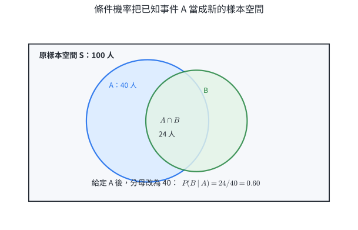
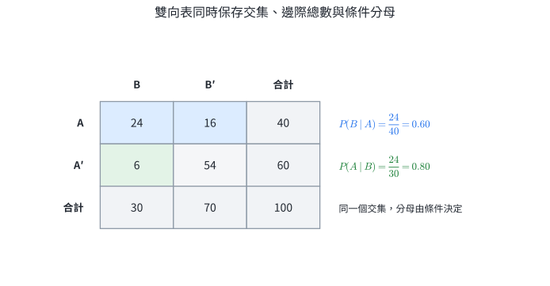
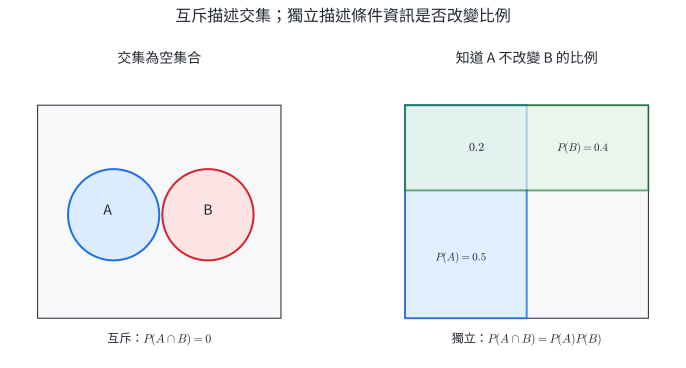
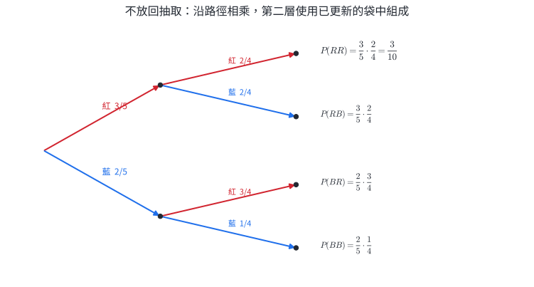
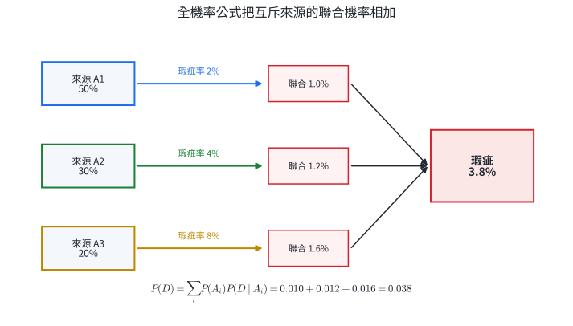
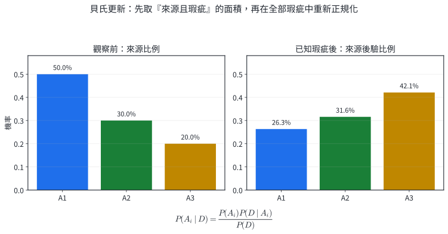
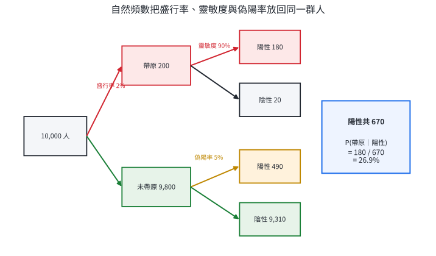
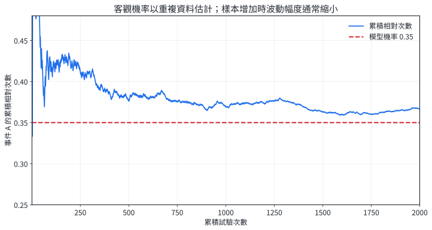

# 數A4-3 條件機率與貝氏定理

## 本章核心問題

同一件事在加入資訊後，機率可能改變。快篩陽性的人確實帶原的機率、看到瑕疵品後推測來源工廠、已知前兩局結果後估計贏得系列賽的機率，都需要先說清楚「目前已知什麼」。

本章建立六個相連的工具：

1. 用事件運算整理所有可能結果；
2. 用條件機率把已知事件當成新的樣本空間；
3. 用乘積條件判斷資訊是否改變另一事件；
4. 用乘法法則計算連續發生的路徑；
5. 用全機率公式合併不同來源；
6. 用貝氏定理在看見結果後更新來源機率。

品管、醫療檢驗、垃圾郵件過濾、氣象預報與風險評估都使用同一個結構：先有來源比例，再有各來源產生證據的機率，最後根據實際觀察重新分配機率。

## 1. 機率性質與條件機率

### 1.1 事件運算與機率性質

樣本空間 $S$ 是一次隨機試驗所有可能結果的集合；事件 $A$ 是 $S$ 的子集合。機率函數滿足

$$
0\le P(A)\le1,
\qquad
P(S)=1,
\qquad
P(\emptyset)=0.
$$

$A'$ 表示 $A$ 的餘事件，因此

$$
P(A')=1-P(A).
$$

兩事件聯集的加法公式為

$$
\boxed{P(A\cup B)=P(A)+P(B)-P(A\cap B)}.
$$

推理來自重複計數：$P(A)+P(B)$ 把交集 $A\cap B$ 算了兩次，減去一次後，每個結果恰好計一次。當 $A,B$ 互斥時，$A\cap B=\emptyset$，公式化為 $P(A\cup B)=P(A)+P(B)$。

::: worked-example
### 完整示範｜聯集、交集與都未發生

某校學生使用公車通學的比例為 $0.62$，使用捷運通學的比例為 $0.47$，兩者都使用的比例為 $0.30$。求至少使用其中一種交通工具，以及兩種都未使用的比例。

令 $A$ 為使用公車、$B$ 為使用捷運。至少使用一種就是 $A\cup B$：

$$
P(A\cup B)=0.62+0.47-0.30=0.79.
$$

兩種都未使用是 $(A\cup B)'$：

$$
P((A\cup B)')=1-0.79=0.21.
$$

答案為 $\boxed{0.79}$ 與 $\boxed{0.21}$，兩者相加為 $1$。
:::

::: worked-example
### 完整示範｜由邊際機率判斷交集範圍

已知 $P(A)=0.55$、$P(B)=0.70$。求 $P(A\cap B)$ 的可能範圍。

交集最多等於較小事件的機率：

$$
P(A\cap B)\le\min(0.55,0.70)=0.55.
$$

又因 $P(A\cup B)\le1$，

$$
0.55+0.70-P(A\cap B)\le1,
$$

所以 $P(A\cap B)\ge0.25$。因此

$$
\boxed{0.25\le P(A\cap B)\le0.55}.
$$

下界代表兩事件合起來剛好覆蓋全部；上界代表 $A$ 完全包含在 $B$ 中。
:::

### 1.2 條件機率：已知資訊決定分母

在事件 $A$ 已發生的條件下，只保留 $A$ 內的結果。事件 $B$ 在這個新樣本空間中的比例為

::: concept
$$
\boxed{
P(B\mid A)=\frac{P(A\cap B)}{P(A)}
},
\qquad P(A)>0.
$$
:::

分子是同時符合 $A$ 與 $B$ 的機率；分母是目前所有仍可能的 $A$。條件順序會決定分母，因此 $P(B\mid A)$ 與 $P(A\mid B)$ 通常不同。

{width=88%}

::: worked-example
### 完整示範｜雙向表中的兩個條件方向

某群體共 $100$ 人，資料如下：

|  | $B$ | $B'$ | 合計 |
|---|---:|---:|---:|
| $A$ | 24 | 16 | 40 |
| $A'$ | 6 | 54 | 60 |
| 合計 | 30 | 70 | 100 |

已知 $A$ 時，分母取 $A$ 列的 $40$ 人：

$$
P(B\mid A)=\frac{24}{40}=0.60.
$$

已知 $B$ 時，分母取 $B$ 欄的 $30$ 人：

$$
P(A\mid B)=\frac{24}{30}=0.80.
$$

兩式共用同一個交集人數 $24$，條件方向使分母不同。
:::

{width=88%}

::: worked-example
### 完整示範｜在點數和已知後重新列樣本

擲兩顆公正骰子，已知點數和為 $8$，求第一顆點數至少為 $3$ 的機率。

在和為 $8$ 的條件下，等可能的有序結果為

$$
(2,6),(3,5),(4,4),(5,3),(6,2).
$$

其中第一顆至少為 $3$ 的結果有後四個，因此

$$
\boxed{P(\text{第一顆}\ge3\mid\text{和為 }8)=\frac45}.
$$

條件已把原本 $36$ 個結果縮成 $5$ 個；計數只在這 $5$ 個結果中進行。
:::

::: worked-example
### 完整示範｜用機率式反轉條件方向

已知

$$
P(A)=0.40,
\qquad
P(B\mid A)=0.75,
\qquad
P(B)=0.50.
$$

先由條件機率求交集：

$$
P(A\cap B)=P(A)P(B\mid A)=0.40\times0.75=0.30.
$$

再換分母：

$$
P(A\mid B)=\frac{P(A\cap B)}{P(B)}
=\frac{0.30}{0.50}
=\boxed{0.60}.
$$
:::

::: self-check
### 分節練習｜事件與條件機率

1. 已知 $P(A)=0.58$、$P(B)=0.37$、$P(A\cap B)=0.21$，求 $P(A\cup B)$ 與 $P(A'\cap B')$。
2. 已知 $P(A)=0.45$、$P(B)=0.60$、$P(A\cup B)=0.78$，求 $P(A\cap B)$。
3. 某次測驗共 $160$ 人，數學及格 $100$ 人、英文及格 $80$ 人、兩科皆及格 $65$ 人。求 $P(E\mid M)$、$P(M\mid E)$ 與 $P(E'\mid M)$。
4. 擲兩顆公正骰子，已知點數和為 $9$，求第一顆點數大於第二顆的機率。
5. 從一副 $52$ 張撲克牌任取一張，已知抽到的是 J、Q 或 K，求它是 Q 的機率。
6. 已知 $P(A)=0.40$、$P(B\mid A)=0.75$、$P(B)=0.50$，求 $P(A\cap B)$ 與 $P(A\mid B)$。

**解答**

1. $P(A\cup B)=0.58+0.37-0.21=\boxed{0.74}$；$P(A'\cap B')=1-0.74=\boxed{0.26}$。
2. $P(A\cap B)=0.45+0.60-0.78=\boxed{0.27}$。
3. $P(E\mid M)=65/100=\boxed{0.65}$；$P(M\mid E)=65/80=\boxed{0.8125}$；$P(E'\mid M)=35/100=\boxed{0.35}$。
4. 和為 $9$ 的結果為 $(3,6),(4,5),(5,4),(6,3)$；後兩個符合，答案 $\boxed{1/2}$。
5. J、Q、K 共 $12$ 張，其中 Q 有 $4$ 張，答案 $\boxed{1/3}$。
6. $P(A\cap B)=0.40(0.75)=\boxed{0.30}$；$P(A\mid B)=0.30/0.50=\boxed{0.60}$。
:::

## 2. 獨立事件

### 2.1 定義與資訊意義

若事件 $A$ 的發生不改變事件 $B$ 的機率，則

$$
P(B\mid A)=P(B).
$$

代入條件機率定義可得

::: concept
$$
\boxed{P(A\cap B)=P(A)P(B)}.
$$
:::

這個乘積式對 $A,B$ 對稱，且在零機率事件也可使用，因此採為兩事件獨立的正式定義。

互斥描述「不能同時發生」，獨立描述「知道一件事後，另一件事的比例維持不變」。兩個正機率事件若互斥，交集機率為 $0$，而乘積為正，因此不會獨立。

{width=90%}

::: worked-example
### 完整示範｜用乘積式判斷獨立

擲一顆公正骰子。令

$$
A=\{1,3,5\},
\qquad
B=\{1,2\}.
$$

$$
P(A)=\frac12,
\qquad
P(B)=\frac13,
\qquad
P(A\cap B)=P(\{1\})=\frac16.
$$

因為

$$
P(A\cap B)=\frac16=\frac12\cdot\frac13=P(A)P(B),
$$

所以 $A,B$ 獨立。這不代表兩事件沒有交集；結果 $1$ 同時屬於兩者。
:::

::: worked-example
### 完整示範｜互斥事件的資訊效果

同一顆骰子中，令 $C=\{1,3,5\}$、$D=\{2,4,6\}$。兩事件互斥，

$$
P(C\cap D)=0.
$$

但

$$
P(C)P(D)=\frac12\cdot\frac12=\frac14.
$$

所以 $C,D$ 不獨立。若已知 $C$ 發生，$D$ 的條件機率由原本 $1/2$ 變成 $0$；這正是強烈的資訊影響。
:::

### 2.2 餘事件與多事件獨立

若 $A,B$ 獨立，則

$$
\begin{aligned}
P(A'\cap B)
&=P(B)-P(A\cap B)\\
&=P(B)-P(A)P(B)\\
&=(1-P(A))P(B)\\
&=P(A')P(B).
\end{aligned}
$$

因此 $A',B$ 也獨立；同理 $A,B'$ 與 $A',B'$ 都獨立。

三事件 $A,B,C$ 共同獨立時，需同時滿足三個兩兩乘積式與三重乘積式：

$$
\begin{gathered}
P(A\cap B)=P(A)P(B),\\
P(A\cap C)=P(A)P(C),\\
P(B\cap C)=P(B)P(C),\\
P(A\cap B\cap C)=P(A)P(B)P(C).
\end{gathered}
$$

::: worked-example
### 完整示範｜兩個獨立設備的系統可靠度

兩個感測器獨立運作，正常率分別為 $0.92$ 與 $0.85$。

兩者都正常的機率為

$$
0.92\times0.85=\boxed{0.782}.
$$

至少一個正常，可由「兩個都失效」的餘事件求得：

$$
1-(1-0.92)(1-0.85)
=1-0.08\times0.15
=\boxed{0.988}.
$$

並聯系統只需一個元件正常時，餘事件法直接對應系統完全失效的條件。
:::

::: worked-example
### 完整示範｜兩兩獨立仍需檢查三重交集

擲一枚均勻硬幣兩次，樣本空間為

$$
S=\{HH,HT,TH,TT\}.
$$

令 $A$ 為第一次是正面、$B$ 為第二次是正面、$C$ 為兩次相同。三事件機率都為 $1/2$。

任兩事件的交集都只有一個結果，機率為 $1/4=(1/2)(1/2)$，所以三對事件兩兩獨立。但

$$
A\cap B\cap C=\{HH\},
$$

$$
P(A\cap B\cap C)=\frac14
\ne
\frac12\cdot\frac12\cdot\frac12=\frac18.
$$

因此三事件沒有共同獨立。兩兩檢查只確認二階關係，三重交集仍需另行驗證。
:::

::: worked-example
### 完整示範｜由獨立性補完雙向表

某群體有 $200$ 人，事件 $A$ 有 $120$ 人，事件 $B$ 有 $80$ 人，且 $A,B$ 獨立。求四格人數。

$$
P(A\cap B)=P(A)P(B)
=\frac{120}{200}\cdot\frac{80}{200}
=0.24.
$$

交集人數為 $200(0.24)=48$。其餘三格依列、欄總數相減：

|  | $B$ | $B'$ | 合計 |
|---|---:|---:|---:|
| $A$ | 48 | 72 | 120 |
| $A'$ | 32 | 48 | 80 |
| 合計 | 80 | 120 | 200 |

每一列中 $B$ 所占比例都為 $0.40$，直接呈現獨立的資訊意義。
:::

::: self-check
### 分節練習｜獨立事件

1. 已知 $P(A)=0.40$、$P(B)=0.25$、$P(A\cap B)=0.10$，判斷 $A,B$ 是否獨立。
2. $A,B$ 互斥，且 $P(A)=0.40$、$P(B)=0.30$。判斷兩事件是否獨立。
3. $A,B$ 獨立，$P(A)=0.70$、$P(B)=0.60$。求兩者都發生、都未發生、恰一個發生、至少一個發生的機率。
4. 三個設備獨立正常，正常率依序為 $0.80,0.70,0.90$。求全部正常、全部失效、至少一個正常、恰兩個正常的機率。
5. 在兩次擲硬幣模型中，令 $A$ 為第一次正面、$B$ 為第二次正面、$C$ 為兩次相同。驗證任兩事件獨立，並判斷三事件是否共同獨立。
6. 某群體 $200$ 人中，$A$ 有 $120$ 人、$B$ 有 $80$ 人，且 $A,B$ 獨立。完成四格表。

**解答**

1. $P(A)P(B)=0.40(0.25)=0.10=P(A\cap B)$，所以 $\boxed{獨立}$。
2. $P(A\cap B)=0$，而 $P(A)P(B)=0.12$，所以 $\boxed{不獨立}$。
3. 都發生 $\boxed{0.42}$；都未發生 $0.30(0.40)=\boxed{0.12}$；恰一個 $0.70(0.40)+0.30(0.60)=\boxed{0.46}$；至少一個 $1-0.12=\boxed{0.88}$。
4. 全部正常 $0.8(0.7)(0.9)=\boxed{0.504}$；全部失效 $0.2(0.3)(0.1)=\boxed{0.006}$；至少一個正常 $\boxed{0.994}$；恰兩個正常 $0.8(0.7)(0.1)+0.8(0.3)(0.9)+0.2(0.7)(0.9)=\boxed{0.398}$。
5. 三對交集機率都是 $1/4=(1/2)(1/2)$；三重交集為 $1/4$，而三個邊際機率乘積為 $1/8$，所以兩兩獨立但未共同獨立。
6. 四格依序為 $A\cap B=48$、$A\cap B'=72$、$A'\cap B=32$、$A'\cap B'=48$。
:::

## 3. 條件機率的乘法法則與連續路徑

### 3.1 兩事件與多事件的乘法法則

由條件機率定義移項：

::: concept
$$
\boxed{P(A\cap B)=P(A)P(B\mid A)}.
$$
:::

對三事件依序套用：

$$
\boxed{
P(A\cap B\cap C)
=P(A)P(B\mid A)P(C\mid A\cap B)
}.
$$

每一因子都是「走到目前節點後，下一步沿指定分支前進」的條件機率。樹狀圖的一條完整路徑用乘法；多條互斥路徑通往同一結果時再相加。

{width=90%}

::: worked-example
### 完整示範｜不放回連取兩球

袋中有 $3$ 顆紅球、$2$ 顆藍球，不放回連取兩球。求兩球都是紅球的機率。

令 $R_1,R_2$ 分別表示第一、二球為紅球：

$$
\begin{aligned}
P(R_1\cap R_2)
&=P(R_1)P(R_2\mid R_1)\\
&=\frac35\cdot\frac24\\
&=\boxed{\frac3{10}}.
\end{aligned}
$$

第一球已取走一顆紅球，因此第二個因子使用剩下 $4$ 球中的 $2$ 顆紅球。
:::

::: worked-example
### 完整示範｜三步路徑與指定順序

袋中有 $4$ 顆紅球、$3$ 顆白球、$2$ 顆藍球，不放回依序取三球。求依序為紅、白、藍的機率。

$$
P(RWB)
=\frac49\cdot\frac38\cdot\frac27
=\frac{24}{504}
=\boxed{\frac1{21}}.
$$

每次分母依序為 $9,8,7$；分子依指定顏色的剩餘數量更新。
:::

### 3.2 重複試驗、餘事件與停止規則

當每次試驗獨立且成功率固定為 $p$，指定長度為 $n$ 的成功／失敗序列，其機率是各步因子的乘積。例如前兩次失敗、第三次首次成功：

$$
(1-p)^2p.
$$

恰有 $k$ 次成功時，先選出成功出現的位置，再乘每一條同型路徑的機率：

$$
P(X=k)=\binom nk p^k(1-p)^{n-k}.
$$

::: worked-example
### 完整示範｜生日碰撞使用餘事件

假設一年 $365$ 天等可能，忽略閏日，求 $25$ 人中至少兩人同生日的機率。

直接列舉所有碰撞型態很繁複；餘事件「所有人生日皆不同」只有一條乘法結構：

$$
P(\text{全不同})
=1\cdot\frac{364}{365}\cdot\frac{363}{365}\cdots\frac{341}{365}.
$$

因此

$$
P(\text{至少同生日})
=1-P(\text{全不同})
\approx\boxed{0.5687}.
$$

人數增加時，每一位新成員都要避開更多已占用日期，乘積因此快速下降。
:::

::: worked-example
### 完整示範｜系列賽的停止規則

五戰三勝制進行兩局後，甲、乙各勝一局。之後每局甲勝率為 $0.60$，各局獨立。求甲贏得系列賽的機率。

接下來最多三局，甲需至少贏兩局。可按三局完整序列計算：

$$
\begin{aligned}
P(\text{甲晉級})
&=\binom32(0.6)^2(0.4)+(0.6)^3\\
&=3(0.36)(0.4)+0.216\\
&=\boxed{0.648}.
\end{aligned}
$$

這個寫法把已提前結束的 $WW$ 路徑拆成 $WWW$ 與 $WWL$ 兩個等價的完整三局結果，總機率保持一致。
:::

::: self-check
### 分節練習｜乘法法則與路徑

1. 袋中有 $5$ 紅、$3$ 白，不放回連取三球，求依序紅、白、紅的機率。
2. $10$ 支籤中有 $3$ 支中獎，三人依序不放回各抽一支，求三人都未中獎的機率。
3. 假設生日在 $365$ 天等可能，寫出 $5$ 人中至少兩人同生日的精確機率。
4. 每次射擊命中率為 $0.40$ 且各次獨立，求前兩次未中、第三次首次命中的機率。
5. 每次成功率為 $0.20$，獨立進行 $5$ 次，求恰有 $2$ 次成功的機率。
6. 五戰三勝制前兩局戰成 $1:1$，之後每局甲勝率 $0.60$ 且獨立，求甲贏得系列賽的機率。

**解答**

1. $\dfrac58\dfrac37\dfrac46=\boxed{\dfrac5{28}}$。
2. $\dfrac7{10}\dfrac69\dfrac58=\boxed{\dfrac7{24}}$。
3. $\boxed{1-\dfrac{365\cdot364\cdot363\cdot362\cdot361}{365^5}}$。
4. $(0.60)^2(0.40)=\boxed{0.144}$。
5. $\binom52(0.2)^2(0.8)^3=\boxed{0.2048}$。
6. $\binom32(0.6)^2(0.4)+(0.6)^3=\boxed{0.648}$。
:::

## 4. 樣本空間分割與全機率公式

### 4.1 分割：把所有來源分成互斥且完整的類別

事件 $A_1,A_2,\ldots,A_n$ 稱為樣本空間 $S$ 的一個分割，需同時滿足：

$$
A_i\cap A_j=\emptyset\quad(i\ne j),
$$

$$
A_1\cup A_2\cup\cdots\cup A_n=S.
$$

若事件 $B$ 可由不同來源產生，則

$$
B=(B\cap A_1)\cup(B\cap A_2)\cup\cdots\cup(B\cap A_n).
$$

右側各塊互斥，因此機率可相加。再把每一塊用乘法法則改寫，得到全機率公式：

::: concept
$$
\boxed{
P(B)=\sum_{i=1}^{n}P(A_i)P(B\mid A_i)
}.
$$
:::

這是一個加權平均：$P(A_i)$ 是第 $i$ 類在整體中的權重，$P(B\mid A_i)$ 是該類內部的事件率。

{width=92%}

::: worked-example
### 完整示範｜三座工廠的整體瑕疵率

產品來源與各自瑕疵率如下：

| 來源 | 產量比例 | 瑕疵率 |
|---|---:|---:|
| $A_1$ | $0.50$ | $0.02$ |
| $A_2$ | $0.30$ | $0.04$ |
| $A_3$ | $0.20$ | $0.08$ |

令 $D$ 為瑕疵事件。三條通往 $D$ 的聯合機率為

$$
0.50(0.02)=0.010,
$$

$$
0.30(0.04)=0.012,
$$

$$
0.20(0.08)=0.016.
$$

所以

$$
P(D)=0.010+0.012+0.016=\boxed{0.038}.
$$

整體瑕疵率 $3.8\%$ 位於三個分組瑕疵率 $2\%,4\%,8\%$ 之間，符合加權平均的範圍。
:::

::: worked-example
### 完整示範｜天氣狀態與預報結果

某地明天實際晴天、雨天的機率分別為 $0.70,0.30$。晴天時預報為雨的機率為 $0.10$；雨天時預報為雨的機率為 $0.80$。求預報為雨的機率。

實際天氣形成分割。令 $F$ 為預報雨：

$$
\begin{aligned}
P(F)
&=P(\text{晴})P(F\mid \text{晴})+P(\text{雨})P(F\mid \text{雨})\\
&=0.70(0.10)+0.30(0.80)\\
&=0.07+0.24\\
&=\boxed{0.31}.
\end{aligned}
$$

預報雨的 $31\%$ 由「晴天誤報」與「雨天正確預報」兩條互斥路徑組成。
:::

::: worked-example
### 完整示範｜骰子決定選袋

擲一顆公正骰子：$1,2,3$ 點選甲袋，$4,5$ 點選乙袋，$6$ 點選丙袋。三袋取到紅球的機率依序為 $1/4,3/5,1/2$。求最後取到紅球的機率。

選袋機率為 $1/2,1/3,1/6$。因此

$$
\begin{aligned}
P(R)
&=\frac12\cdot\frac14
+\frac13\cdot\frac35
+\frac16\cdot\frac12\\
&=\frac{15+24+10}{120}\\
&=\boxed{\frac{49}{120}}.
\end{aligned}
$$

選袋不是等可能時，第一層權重必須依骰子規則決定。
:::

::: self-check
### 分節練習｜全機率公式

1. 甲、乙兩廠產量占 $0.60,0.40$，瑕疵率為 $0.03,0.05$。求整體瑕疵率。
2. 某校高一、高二、高三比例為 $0.35,0.33,0.32$，參加社團的比例依序為 $0.80,0.90,0.40$。求任選一人有參加社團的機率。
3. 實際晴天、雨天機率為 $0.70,0.30$；晴天時預報雨率 $0.10$，雨天時預報雨率 $0.80$。求預報雨的機率。
4. 通勤者選公車、火車、自行車的比例為 $0.50,0.30,0.20$，各方式遲到率為 $0.10,0.05,0.20$。求整體遲到率。
5. 產品來自甲廠的比例為 $x$、乙廠為 $1-x$，兩廠瑕疵率為 $0.02,0.08$。若整體瑕疵率為 $0.05$，求 $x$。
6. 證明全機率公式所得 $P(B)$ 必位於所有 $P(B\mid A_i)$ 的最小值與最大值之間。

**解答**

1. $0.60(0.03)+0.40(0.05)=\boxed{0.038}$。
2. $0.35(0.80)+0.33(0.90)+0.32(0.40)=\boxed{0.705}$。
3. $0.70(0.10)+0.30(0.80)=\boxed{0.31}$。
4. $0.50(0.10)+0.30(0.05)+0.20(0.20)=\boxed{0.105}$。
5. $0.02x+0.08(1-x)=0.05$，解得 $\boxed{x=0.50}$。
6. 設 $m\le P(B\mid A_i)\le M$。乘上非負權重 $P(A_i)$ 後相加，且 $\sum_iP(A_i)=1$，得 $m\le\sum_iP(A_i)P(B\mid A_i)\le M$。
:::

## 5. 貝氏定理：由結果更新來源

### 5.1 先算聯合機率，再在觀察結果中重新正規化

分割 $A_1,\ldots,A_n$ 表示可能來源，$B$ 表示已觀察到的證據。條件機率給出

$$
P(A_i\mid B)=\frac{P(A_i\cap B)}{P(B)}.
$$

分子用乘法法則，分母用全機率公式，即得

::: concept
$$
\boxed{
P(A_i\mid B)
=\frac{P(A_i)P(B\mid A_i)}
{\sum_{j=1}^{n}P(A_j)P(B\mid A_j)}
}.
$$
:::

$P(A_i)$ 是觀察前的來源機率；$P(B\mid A_i)$ 衡量該來源產生目前證據的能力；$P(A_i\mid B)$ 是觀察後重新分配的來源機率。

{width=88%}

::: worked-example
### 完整示範｜由瑕疵品反推來源工廠

沿用上一節資料：三廠產量比例為 $0.50,0.30,0.20$，瑕疵率為 $0.02,0.04,0.08$。已知抽到瑕疵品，求它來自第三廠的機率。

第三廠且瑕疵的聯合機率為 $0.20(0.08)=0.016$；全部瑕疵機率為 $0.038$。因此

$$
P(A_3\mid D)
=\frac{0.016}{0.038}
=\frac8{19}
\approx\boxed{0.421}.
$$

第三廠原本只占 $20\%$，但瑕疵率最高；觀察到瑕疵後，它的來源比例提升到約 $42.1\%$。
:::

### 5.2 檢驗中的基準率、靈敏度與偽陽率

檢驗問題通常同時包含三種資料：

- 盛行率 $P(D)$：受測前確實有狀況的比例；
- 靈敏度 $P(+\mid D)$：有狀況者檢出陽性的比例；
- 偽陽率 $P(+\mid D')$：沒有狀況者仍呈陽性的比例。

陽性後確實有狀況的機率為

$$
P(D\mid+)
=\frac{P(D)P(+\mid D)}
{P(D)P(+\mid D)+P(D')P(+\mid D')}.
$$

::: worked-example
### 完整示範｜用自然頻數解讀快篩陽性

某狀況盛行率為 $2\%$，檢驗靈敏度為 $90\%$，偽陽率為 $5\%$。求陽性者確實有狀況的機率。

以 $10{,}000$ 人為共同母體：

- 有狀況 $200$ 人，其中陽性 $200(0.90)=180$ 人；
- 無狀況 $9{,}800$ 人，其中陽性 $9{,}800(0.05)=490$ 人。

陽性共 $180+490=670$ 人，因此

$$
P(D\mid+)=\frac{180}{670}
=\frac{18}{67}
\approx\boxed{0.269}.
$$

陽性只是新證據；它需要和受測前的基準率一起解讀。
:::

{width=92%}

::: worked-example
### 完整示範｜選盒後看到金幣

等機率選一個盒子。甲盒兩格都是金幣；乙盒一格金幣、一格銀幣。再等機率開一格，已知看到金幣，求選到甲盒的機率。

令 $G$ 為看到金幣：

$$
P(G\mid \text{甲})=1,
\qquad
P(G\mid \text{乙})=\frac12.
$$

$$
P(\text{甲}\mid G)
=\frac{\frac12(1)}{\frac12(1)+\frac12(\frac12)}
=\boxed{\frac23}.
$$

看到金幣後，甲盒的可能性提高，因為甲盒每一格都能產生這項證據。
:::

::: worked-example
### 完整示範｜第一次治療失敗後估計第二次成功

某疾病有兩型：第一型占 $60\%$，每次療程成功率 $75\%$，各次療程在已知型別下獨立；第二型占 $40\%$，此療法成功率為 $0$。第一次療程失敗後，求第二次成功的機率。

先用第一次失敗 $F_1$ 更新型別：

$$
P(I\mid F_1)
=\frac{0.60(0.25)}{0.60(0.25)+0.40(1)}
=\frac{0.15}{0.55}
=\frac3{11}.
$$

第二次只有第一型可能成功，所以

$$
P(S_2\mid F_1)
=P(I\mid F_1)P(S_2\mid I,F_1)
=\frac3{11}\cdot\frac34
=\boxed{\frac9{44}}.
$$

第一次失敗降低了第一型的後驗比例，因此第二次成功率也由受測前的 $0.60(0.75)=0.45$ 降為約 $0.205$。
:::

::: self-check
### 分節練習｜貝氏更新

1. 產品來自甲、乙廠的比例為 $0.30,0.70$，瑕疵率為 $0.02,0.04$。已知是瑕疵品，求來自乙廠的機率。
2. 某狀況盛行率 $0.10$，檢驗靈敏度 $0.95$，偽陽率 $0.05$。求陽性者確實有狀況的機率。
3. 實際晴天、雨天機率 $0.70,0.30$；晴天時預報雨率 $0.10$，雨天時預報雨率 $0.80$。已知預報雨，求實際下雨的機率。
4. 等機率選甲、乙盒；甲盒兩枚金幣，乙盒一金一銀。任取一枚後看到金幣，求選到甲盒的機率。
5. 三供應商供貨比例為 $0.20,0.30,0.50$，瑕疵率為 $0.01,0.02,0.03$。已知抽到瑕疵品，求來自第三供應商的機率。
6. 某檢驗靈敏度 $0.80$、偽陽率 $0.10$。已知陽性者確實有狀況的機率為 $0.40$，求受測群體的盛行率。

**解答**

1. $\dfrac{0.70(0.04)}{0.30(0.02)+0.70(0.04)}=\dfrac{0.028}{0.034}=\boxed{\dfrac{14}{17}}$。
2. $\dfrac{0.10(0.95)}{0.10(0.95)+0.90(0.05)}=\dfrac{0.095}{0.140}=\boxed{\dfrac{19}{28}}$。
3. $\dfrac{0.30(0.80)}{0.70(0.10)+0.30(0.80)}=\boxed{\dfrac{24}{31}}$。
4. $\dfrac{(1/2)(1)}{(1/2)(1)+(1/2)(1/2)}=\boxed{2/3}$。
5. $\dfrac{0.50(0.03)}{0.20(0.01)+0.30(0.02)+0.50(0.03)}=\boxed{\dfrac{15}{23}}$。
6. 令盛行率為 $p$：$\dfrac{0.8p}{0.8p+0.1(1-p)}=0.4$，解得 $\boxed{p=1/13\approx0.0769}$。
:::

## 6. 古典、客觀與主觀機率

### 6.1 三種機率敘述的證據來源

同一個 $0$ 到 $1$ 的數值，可能來自不同證據：

| 類型 | 來源 | 例子 | 主要限制 |
|---|---|---|---|
| 古典機率 | 有限且等可能的樣本點 | 公正骰子出現偶數為 $3/6$ | 等可能假設要成立 |
| 客觀／頻率機率 | 重複觀察或歷史資料的相對次數 | 10,000 件中 380 件瑕疵，估計為 $0.038$ | 母體、時間與測量條件要相近 |
| 主觀機率 | 個人依資訊、經驗形成的信念程度 | 專案經理估計如期完成率 $0.70$ | 需說明依據並接受新證據校正 |

三種類型都必須符合機率公理。資料型機率還需檢查抽樣方式、樣本大小、條件是否改變；貝氏更新則提供一套把原先判斷與新證據結合的規則。

{width=88%}

::: worked-example
### 完整示範｜判斷機率敘述的來源

判斷下列敘述：

1. 公正硬幣連擲三次皆為正面的機率是 $1/8$；
2. 過去 $5{,}000$ 筆訂單有 $120$ 筆逾期，據此估計逾期率 $2.4\%$；
3. 工程師依目前進度判斷本週完成的機率為 $70\%$。

第 1 項由等可能樣本點計算，是古典機率；第 2 項由相對次數估計，是客觀／頻率機率；第 3 項是依現有資訊形成的主觀機率。第 3 項仍可在取得新進度資料後用條件機率更新。
:::

::: worked-example
### 完整示範｜相同比例與不同資料量

甲資料為 $100$ 次中成功 $35$ 次；乙資料為 $10{,}000$ 次中成功 $3{,}500$ 次。兩者相對次數都是

$$
\hat p=0.35.
$$

但新增或修正一筆資料時，甲資料的比例變動單位約為 $1/100=0.01$，乙資料約為 $1/10{,}000=0.0001$。乙資料對單一觀察更不敏感；使用時仍需確認兩批資料的對象與條件是否能代表目前問題。
:::

::: self-check
### 分節練習｜機率來源與資料判讀

1. 判斷下列為古典、客觀或主觀機率：公正骰子出現 6 點為 $1/6$；過去千件貨物有 $18$ 件破損；教練估計球隊明天勝率 $0.65$。
2. 某人說明天下雨機率 $0.40$、不下雨機率 $0.70$。檢查是否符合機率性質。
3. 某骰子擲 $200$ 次，各點次數為 $28,31,37,35,39,30$。用客觀機率估計下一次出現偶數點的機率。
4. 甲樣本 $50$ 次中成功 $20$ 次，乙樣本 $5{,}000$ 次中成功 $2{,}000$ 次。比較兩個點估計與單筆資料對比例的影響。
5. 原先估計設備故障率 $0.05$；取得新環境條件 $E$ 後，已知 $P(E\mid \text{故障})=0.60$、$P(E\mid \text{正常})=0.10$。求看見 $E$ 後的故障機率。

**解答**

1. 依序為 $\boxed{古典、客觀、主觀}$。
2. 兩事件互為餘事件，機率應相加為 $1$；$0.40+0.70=1.10$，所以資料不一致。
3. 偶數次數為 $31+35+30=96$，估計為 $\boxed{96/200=0.48}$。
4. 點估計都為 $0.40$；單筆資料造成的比例變動尺度分別約為 $1/50=0.02$ 與 $1/5000=0.0002$。
5. $\dfrac{0.05(0.60)}{0.05(0.60)+0.95(0.10)}=\dfrac{0.03}{0.125}=\boxed{0.24}$。
:::

## 7. 核心整理

### 條件、乘法與獨立

$$
P(B\mid A)=\frac{P(A\cap B)}{P(A)},
\qquad P(A)>0,
$$

$$
P(A\cap B)=P(A)P(B\mid A),
$$

$$
A,B\text{ 獨立}
\quad\Longleftrightarrow\quad
P(A\cap B)=P(A)P(B).
$$

### 分割、全機率與貝氏更新

若 $A_1,\ldots,A_n$ 為樣本空間分割，則

$$
P(B)=\sum_{i=1}^{n}P(A_i)P(B\mid A_i),
$$

$$
P(A_i\mid B)
=\frac{P(A_i)P(B\mid A_i)}
{\sum_jP(A_j)P(B\mid A_j)}.
$$

條件機率先決定目前分母；乘法法則算一條路徑；全機率公式加總所有互斥路徑；貝氏定理把某一路徑在全部觀察結果中的比例取出。

## 8. 章末分層題

### 基礎題

1. 已知 $P(A)=0.54$、$P(B)=0.43$、$P(A\cap B)=0.25$。求 $P(A\cup B)$ 與 $P(A'\cap B')$。

2. 某年級有 $240$ 人，其中修讀課程 $A$ 的有 $150$ 人，修讀課程 $B$ 的有 $120$ 人，兩門都修的有 $90$ 人。隨機選一人，求 $P(B\mid A)$、$P(A\mid B)$ 與 $P(A'\mid B)$。

3. 擲兩顆公平六面骰。已知點數和為 $10$，求第一顆點數大於第二顆的條件機率。

4. 已知 $P(A)=0.40$、$P(B)=0.50$、$P(A\cup B)=0.70$。判斷 $A,B$ 是否獨立，並求 $P(A'\cap B')$。

### 熟練題

5. 兩部裝置獨立運作，正常率分別為 $0.95$ 與 $0.90$。求兩部都正常、至少一部正常、恰有一部正常的機率。

6. 三位選手獨立命中目標的機率依序為 $0.70,0.60,0.80$。求三人都命中、恰有兩人命中、至少一人命中的機率。

7. 袋中有 $6$ 顆紅球與 $4$ 顆白球，不放回依序取三球。求顏色依序為紅、白、紅的機率。

8. 假設一年有 $365$ 天，且每人的生日在各日等可能並彼此獨立。求 $20$ 人中至少兩人同生日的機率，答案可用乘積表示並取至小數第四位。

### 應用題

9. 某零件分別由甲、乙、丙三條產線生產，產量比例為 $0.50,0.30,0.20$，瑕疵率依序為 $0.01,0.03,0.06$。求隨機抽到瑕疵品的機率。

10. 承第 9 題，已知抽到的是瑕疵品，求它來自丙線的機率。

11. 某狀況在受測群體中的盛行率為 $0.04$。檢驗靈敏度為 $0.92$，特異度為 $0.95$。求隨機一人檢驗呈陽性的機率，以及陽性者確實有此狀況的機率。

12. 某項製程先觀察 $600$ 次，成功 $210$ 次；之後在相同條件下再觀察 $400$ 次，成功 $160$ 次。分別求第一批與合併資料的成功相對次數，並比較新增資料前後的估計。

### 跨節整合題

13. 甲、乙兩個主系統獨立故障，故障率分別為 $0.10$ 與 $0.20$。兩者都故障時，備援系統會啟動，且備援成功率為 $0.90$。

   (1) 已知至少一個主系統故障，求兩個主系統都故障的機率。

   (2) 求整體系統仍能工作的機率。

14. 一批貨先以機率 $0.30$ 選甲廠、以機率 $0.70$ 選乙廠。甲、乙兩廠產品瑕疵率分別為 $0.02,0.05$。選定工廠後，從該廠抽兩件；在工廠條件固定時，兩件是否瑕疵相互獨立。已知兩件都是瑕疵品，求這批貨來自乙廠的機率。

15. 某狀況的盛行率為 $0.02$。同一人接受兩次檢驗；在實際狀況固定時，兩次結果條件獨立。每次檢驗的靈敏度為 $0.90$、偽陽率為 $0.05$。已知兩次結果皆為陽性，求此人確實有狀況的機率。

16. 某匿名調查以機率 $0.75$ 顯示問題「你每天使用某服務超過兩小時嗎」，以機率 $0.25$ 顯示其相反問題「你每天使用某服務不超過兩小時嗎」；受訪者只回答畫面上的問題，畫面種類不被記錄。大量樣本中回答「是」的比例為 $0.65$。

   (1) 估計每天使用超過兩小時者的比例。

   (2) 隨機查看一筆回答「是」的紀錄，求該人每天使用超過兩小時的機率。

## 9. 章末題完整解析

### 第 1 題

加法公式給出

$$
P(A\cup B)=P(A)+P(B)-P(A\cap B)
=0.54+0.43-0.25
=\boxed{0.72}.
$$

$A'\cap B'$ 表示兩事件都未發生，是 $A\cup B$ 的餘事件，因此

$$
P(A'\cap B')=1-P(A\cup B)=\boxed{0.28}.
$$

### 第 2 題

把修讀 $A$ 視為新的樣本空間，其中同時修讀 $B$ 的有 $90$ 人：

$$
P(B\mid A)=\frac{90}{150}=\boxed{0.60}.
$$

把修讀 $B$ 視為新的樣本空間：

$$
P(A\mid B)=\frac{90}{120}=\boxed{0.75}.
$$

在修讀 $B$ 的 $120$ 人中，有 $120-90=30$ 人未修讀 $A$，所以

$$
P(A'\mid B)=\frac{30}{120}=\boxed{0.25}.
$$

三個答案都使用各自條件事件的人數作分母。

### 第 3 題

在「點數和為 $10$」的條件下，等可能結果只有

$$
(4,6),\ (5,5),\ (6,4).
$$

第一顆大於第二顆只發生在 $(6,4)$，所以

$$
P(\text{第一顆}>\text{第二顆}\mid\text{和為 }10)
=\boxed{\frac13}.
$$

### 第 4 題

由加法公式反求交集：

$$
P(A\cap B)=0.40+0.50-0.70=0.20.
$$

同時

$$
P(A)P(B)=0.40(0.50)=0.20,
$$

因此 $P(A\cap B)=P(A)P(B)$，$A,B$ 獨立。兩事件都未發生的機率為

$$
P(A'\cap B')=1-P(A\cup B)=\boxed{0.30}.
$$

也可由獨立事件的餘事件仍獨立，算得 $0.60(0.50)=0.30$。

### 第 5 題

令兩部裝置正常事件為 $N_1,N_2$。獨立性給出

$$
P(N_1\cap N_2)=0.95(0.90)=\boxed{0.855}.
$$

至少一部正常的餘事件是兩部都故障：

$$
P(N_1\cup N_2)=1-(0.05)(0.10)=\boxed{0.995}.
$$

恰有一部正常包含兩條互斥路徑：

$$
P(N_1\cap N_2')+P(N_1'\cap N_2)
=0.95(0.10)+0.05(0.90)
=\boxed{0.140}.
$$

### 第 6 題

三人都命中的機率為

$$
0.70(0.60)(0.80)=\boxed{0.336}.
$$

恰有兩人命中包含第三人失手、第二人失手、第一人失手三條互斥路徑：

$$
\begin{aligned}
P(\text{恰有兩人命中})
&=0.70(0.60)(0.20)\\
&\quad+0.70(0.40)(0.80)\\
&\quad+0.30(0.60)(0.80)\\
&=0.084+0.224+0.144\\
&=\boxed{0.452}.
\end{aligned}
$$

至少一人命中的餘事件是三人都失手：

$$
P(\text{至少一人命中})
=1-0.30(0.40)(0.20)
=\boxed{0.976}.
$$

### 第 7 題

不放回抽取會改變每一步的分母與分子。沿著紅、白、紅的路徑相乘：

$$
P(R_1W_2R_3)
=\frac6{10}\cdot\frac4{9}\cdot\frac5{8}
=\boxed{\frac16}.
$$

第二次取走一顆白球，因此第三次袋中仍有 $5$ 顆紅球與 $8$ 顆球。

### 第 8 題

先算 $20$ 人生日全都不同。第一人的生日任意；之後每一人要避開先前出現的日期：

$$
P(\text{全不同})
=\frac{365}{365}\cdot\frac{364}{365}\cdots\frac{346}{365}.
$$

因此

$$
\begin{aligned}
P(\text{至少兩人同生日})
&=1-P(\text{全不同})\\
&=1-\frac{365\cdot364\cdots346}{365^{20}}\\
&\approx\boxed{0.4114}.
\end{aligned}
$$

事件「至少有一組相同」包含許多重疊情形，使用餘事件可一次涵蓋它們。

### 第 9 題

以 $D$ 表示瑕疵。三條產線形成樣本空間分割，依全機率公式

$$
\begin{aligned}
P(D)
&=0.50(0.01)+0.30(0.03)+0.20(0.06)\\
&=0.005+0.009+0.012\\
&=\boxed{0.026}.
\end{aligned}
$$

三項分別表示「來自該產線且為瑕疵品」的聯合機率。

### 第 10 題

丙線且瑕疵的機率已在第 9 題算得 $0.20(0.06)=0.012$。在全部瑕疵品中取其比例：

$$
P(\text{丙}\mid D)
=\frac{0.012}{0.026}
=\boxed{\frac6{13}\approx0.4615}.
$$

丙線只占總產量兩成，但較高的瑕疵率使它占全部瑕疵品約四成六。

### 第 11 題

令 $C$ 表示確實有狀況，$+$ 表示陽性。特異度 $0.95$ 對應偽陽率

$$
P(+\mid C')=1-0.95=0.05.
$$

陽性可能來自真陽性或偽陽性：

$$
\begin{aligned}
P(+)
&=P(C)P(+\mid C)+P(C')P(+\mid C')\\
&=0.04(0.92)+0.96(0.05)\\
&=0.0368+0.048\\
&=\boxed{0.0848}.
\end{aligned}
$$

更新後的機率為

$$
P(C\mid +)
=\frac{0.04(0.92)}{0.0848}
=\frac{0.0368}{0.0848}
=\boxed{\frac{23}{53}\approx0.4340}.
$$

在 $10{,}000$ 人的自然頻數中，約有 $368$ 位真陽性、$480$ 位偽陽性；陽性共 $848$ 人，其中 $368/848=23/53$ 確實有狀況。

### 第 12 題

第一批的成功相對次數為

$$
\hat p_1=\frac{210}{600}=\boxed{0.35}.
$$

合併後共有 $600+400=1{,}000$ 次、成功 $210+160=370$ 次：

$$
\hat p=\frac{370}{1000}=\boxed{0.37}.
$$

第二批的成功比例為 $160/400=0.40$，高於第一批的 $0.35$，所以合併估計向上移到 $0.37$。合併值是依兩批樣本數加權的結果：

$$
0.37=\frac{600}{1000}(0.35)+\frac{400}{1000}(0.40).
$$

### 第 13 題

令 $F_A,F_B$ 表示甲、乙主系統故障。由獨立性，

$$
P(F_A\cap F_B)=0.10(0.20)=0.02.
$$

至少一個主系統故障的機率為

$$
P(F_A\cup F_B)=1-P(F_A'\cap F_B')
=1-0.90(0.80)=0.28.
$$

所以

$$
P(F_A\cap F_B\mid F_A\cup F_B)
=\frac{0.02}{0.28}
=\boxed{\frac1{14}}.
$$

整體系統失效需要三件事依序成立：兩個主系統都故障，且備援也失敗。備援失敗率為 $0.10$，因此

$$
P(\text{整體失效})=0.10(0.20)(0.10)=0.002.
$$

整體仍能工作的機率為

$$
P(\text{整體工作})=1-0.002=\boxed{0.998}.
$$

### 第 14 題

令 $A,B$ 表示選到甲、乙廠，$D_1,D_2$ 表示兩件皆為瑕疵的各次事件。在工廠固定的條件下使用條件獨立性：

$$
P(D_1\cap D_2\mid A)=0.02^2,
\qquad
P(D_1\cap D_2\mid B)=0.05^2.
$$

兩件皆瑕疵的總機率為

$$
P(D_1\cap D_2)
=0.30(0.02)^2+0.70(0.05)^2
=0.00012+0.00175
=0.00187.
$$

因此

$$
\begin{aligned}
P(B\mid D_1\cap D_2)
&=\frac{0.70(0.05)^2}{0.00187}\\
&=\boxed{\frac{175}{187}\approx0.9358}.
\end{aligned}
$$

兩次瑕疵提供了比單次更強的來源證據，因此後驗機率集中到瑕疵率較高的乙廠。

### 第 15 題

令 $C$ 表示確實有狀況，$++$ 表示兩次皆陽性。題目給定在 $C$ 或 $C'$ 固定後，兩次結果條件獨立，所以

$$
P(++\mid C)=0.90^2,
\qquad
P(++\mid C')=0.05^2.
$$

兩次皆陽性的總機率為

$$
P(++)=0.02(0.90)^2+0.98(0.05)^2
=0.0162+0.00245
=0.01865.
$$

因此

$$
\begin{aligned}
P(C\mid ++)
&=\frac{0.02(0.90)^2}{0.01865}\\
&=\boxed{\frac{324}{373}\approx0.8686}.
\end{aligned}
$$

條件獨立性是平方兩個條件機率的依據；若兩次檢驗共用同一項系統性誤差，需以實際聯合機率替代平方模型。

### 第 16 題

令 $U$ 表示每天使用超過兩小時，$p=P(U)$；令 $Q$ 表示畫面顯示原問題，$Q'$ 表示顯示相反問題，$Y$ 表示回答「是」。兩條會產生「是」的路徑為

- 顯示原問題且受訪者屬於 $U$；
- 顯示相反問題且受訪者屬於 $U'$。

因此

$$
\begin{aligned}
P(Y)
&=P(Q)P(U)+P(Q')P(U')\\
&=0.75p+0.25(1-p)\\
&=0.25+0.50p.
\end{aligned}
$$

由觀察比例 $P(Y)=0.65$，得到

$$
0.25+0.50p=0.65
\quad\Longrightarrow\quad
p=\boxed{0.80}.
$$

回答「是」且實際屬於 $U$ 的聯合機率為

$$
P(Q\cap U)=0.75(0.80)=0.60.
$$

所以

$$
P(U\mid Y)
=\frac{0.60}{0.65}
=\boxed{\frac{12}{13}\approx0.9231}.
$$

個別紀錄仍無法直接辨認受訪者看到哪個問題；大量樣本的回答比例則可透過全機率公式反推出群體比例。
