# 數A4-4 矩陣

矩陣把一批有固定索引的數字放進同一個運算物件。聯立方程式的係數、不同商品的數量與單價、人口在區域間的流動比例，以及平面圖形的伸縮與旋轉，看似屬於不同問題，實際上都能寫成矩陣與向量的乘法。

矩陣的價值在於保留結構：列、行的位置說明每個數字代表什麼；乘法把共享索引逐項相乘後加總；反方陣描述可逆的資訊變換；矩陣冪則把同一規則重複作用多次。

::: learning-map
### 本章問題與能力

1. 高斯消去法為何保持方程組的解？消去後如何判斷唯一解、無限多組解與無解？
2. 矩陣的階數與索引如何保存資料意義？加法、係數積與乘法各自對應什麼操作？
3. 何時二階方陣具有反方陣？行列式為何同時控制可逆性與面積倍率？
4. 轉移矩陣如何把本期狀態推到下一期，並分析多期後的比例？
5. 二階矩陣如何決定平面線性變換？伸縮、鏡射、旋轉、推移與合成的矩陣從何而來？
:::

## 1. 高斯消去法、解型與線性組合

### 1.1 方程式操作與增廣矩陣

三元一次方程組可寫成

$$
\begin{cases}
a_{11}x+a_{12}y+a_{13}z=b_1,\\
a_{21}x+a_{22}y+a_{23}z=b_2,\\
a_{31}x+a_{32}y+a_{33}z=b_3.
\end{cases}
$$

固定未知數順序 $x,y,z$ 後，只記錄係數與常數項，得到增廣矩陣

$$
\left[
\begin{array}{ccc|c}
a_{11}&a_{12}&a_{13}&b_1\\
a_{21}&a_{22}&a_{23}&b_2\\
a_{31}&a_{32}&a_{33}&b_3
\end{array}
\right].
$$

高斯消去法使用三種基本列運算：

1. 交換兩列：$R_i\leftrightarrow R_j$；
2. 一列乘非零常數：$R_i\leftarrow cR_i$，其中 $c\ne0$；
3. 一列加上另一列的倍數：$R_i\leftarrow R_i+cR_j$。

每種操作都有逆操作，因此操作前後的方程組具有相同解集合。消去的目標是讓樞紐位置逐列向右移，形成階梯形；再由最下方含樞紐的方程式往上代回。

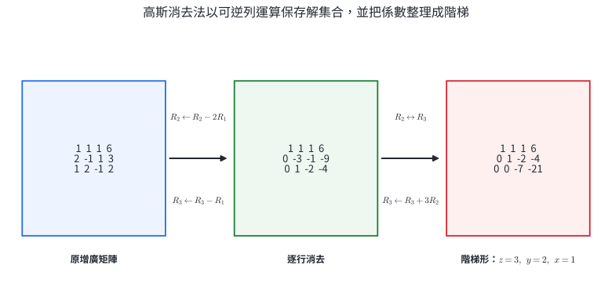{width=96%}

::: worked-example
### 完整示範｜列運算為何保存解集合

方程式 $E_1=0$、$E_2=0$ 的共同解，同時滿足

$$
E_2-3E_1=0.
$$

因此把第二式改成 $E_2-3E_1=0$ 後，每個原解仍是新方程組的解。反過來，若某組數滿足

$$
E_1=0,\qquad E_2-3E_1=0,
$$

則把第二個等式加回 $3E_1=0$，可得 $E_2=0$。兩個解集合完全相同。

交換兩式的逆操作仍是交換；乘 $c\ne0$ 的逆操作是乘 $1/c$。三種列運算都可逆，這就是高斯消去過程能持續改寫方程組的依據。
:::

::: worked-example
### 完整示範｜三元一次方程組的唯一解

解方程組

$$
\begin{cases}
x+y+z=6,\\
2x-y+z=3,\\
x+2y-z=2.
\end{cases}
$$

增廣矩陣為

$$
\left[
\begin{array}{ccc|c}
1&1&1&6\\
2&-1&1&3\\
1&2&-1&2
\end{array}
\right].
$$

先消去第二、三列的 $x$：

$$
R_2\leftarrow R_2-2R_1,
\qquad
R_3\leftarrow R_3-R_1,
$$

$$
\left[
\begin{array}{ccc|c}
1&1&1&6\\
0&-3&-1&-9\\
0&1&-2&-4
\end{array}
\right].
$$

交換第二、三列，再做 $R_3\leftarrow R_3+3R_2$：

$$
\left[
\begin{array}{ccc|c}
1&1&1&6\\
0&1&-2&-4\\
0&0&-7&-21
\end{array}
\right].
$$

由第三列得 $z=3$；代入第二列得 $y-6=-4$，所以 $y=2$；再代入第一列得 $x=1$。因此

$$
\boxed{(x,y,z)=(1,2,3)}.
$$

代回三個原式分別得到 $6,3,2$，與右側常數一致。
:::

### 1.2 消去後的三種解型

消去後需讀取兩類資訊：

- 每個未知數所在行是否出現樞紐；
- 是否出現形如 $[0\ 0\ 0\mid c]$ 且 $c\ne0$ 的矛盾列。

若每個未知數都有樞紐，得到唯一解。若沒有矛盾列且存在缺少樞紐的未知數，該未知數可設為參數，得到無限多組解。若出現 $0=c$、$c\ne0$，方程組無解。

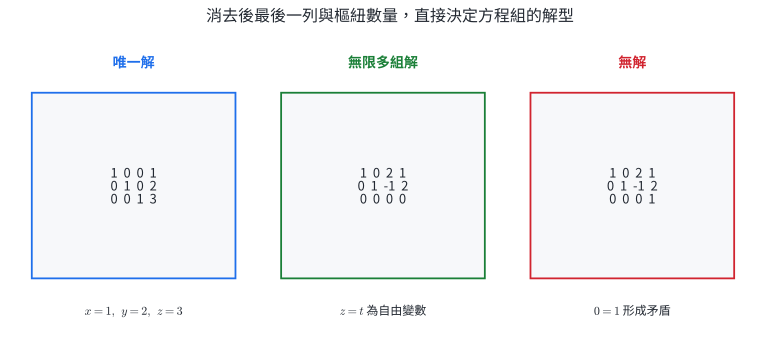{width=96%}

::: worked-example
### 完整示範｜自由變數與參數解

某方程組經列運算後得到

$$
\left[
\begin{array}{ccc|c}
1&0&2&1\\
0&1&-1&2\\
0&0&0&0
\end{array}
\right].
$$

對應方程式為

$$
x+2z=1,\qquad y-z=2.
$$

$z$ 所在行沒有樞紐，令 $z=t$，其中 $t\in\mathbb R$，便得到

$$
x=1-2t,\qquad y=2+t,\qquad z=t.
$$

所以解集合為

$$
\boxed{(x,y,z)=(1-2t,,2+t,,t),\quad t\in\mathbb R}.
$$

不同 $t$ 對應不同解，最後一列 $0=0$ 只提供相容性，不增加限制。
:::

::: worked-example
### 完整示範｜含參數方程組的解型

已知某方程組的增廣矩陣可化為

$$
\left[
\begin{array}{ccc|c}
1&2&0&3\\
0&1&-1&1\\
0&0&0&a-4
\end{array}
\right].
$$

當 $a\ne4$ 時，最後一列表示 $0=a-4$，形成矛盾，所以無解。

當 $a=4$ 時，最後一列成為 $0=0$。令 $z=t$，由第二列得 $y=1+t$；由第一列得

$$
x+2(1+t)=3
\quad\Longrightarrow\quad
x=1-2t.
$$

因此

$$
\boxed{
a\ne4：\text{無解};
\qquad
a=4：(x,y,z)=(1-2t,1+t,t)
}.
$$
:::

### 1.3 插值：由資料點求模型係數

給定三個橫坐標互異的點，可設二次多項式

$$
f(x)=ax^2+bx+c,
$$

再把三點依序代入，形成關於 $a,b,c$ 的三元一次方程組。這種「模型對參數是線性的」結構廣泛用於校正曲線、資料插值與參數估計。

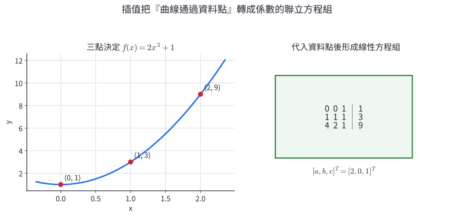{width=92%}

::: worked-example
### 完整示範｜通過三點的二次多項式

求通過 $(0,1),(1,3),(2,9)$ 的二次多項式。

令 $f(x)=ax^2+bx+c$。代入三點：

$$
\begin{cases}
c=1,\\
a+b+c=3,\\
4a+2b+c=9.
\end{cases}
$$

增廣矩陣為

$$
\left[
\begin{array}{ccc|c}
0&0&1&1\\
1&1&1&3\\
4&2&1&9
\end{array}
\right].
$$

由 $c=1$，後兩式化為 $a+b=2$、$2a+b=4$，相減得 $a=2$，進而 $b=0$。所以

$$
\boxed{f(x)=2x^2+1}.
$$

代入 $x=0,1,2$ 分別得到 $1,3,9$。
:::

::: worked-example
### 完整示範｜線性校正模型

某感測器真值 $x$ 與讀值 $y$ 假設滿足 $y=mx+b$。兩個校正點為 $(2,5.1)$ 與 $(8,16.8)$。求 $m,b$。

$$
\begin{cases}
2m+b=5.1,\\
8m+b=16.8.
\end{cases}
$$

第二式減第一式：

$$
6m=11.7
\quad\Longrightarrow\quad
m=1.95.
$$

再代回 $2m+b=5.1$：

$$
b=5.1-3.9=1.2.
$$

校正式為

$$
\boxed{y=1.95x+1.2}.
$$

若要由讀值反求真值，可解 $x=(y-1.2)/1.95$；這是可逆線性模型的最簡單例子。
:::

### 1.4 空間向量的線性組合

若

$$
\vec d=x\vec a+y\vec b+z\vec c,
$$

比較三個坐標分量後就得到三元一次方程組。方程組的解型同時具有幾何意義：

- 唯一解：$\vec a,\vec b,\vec c$ 提供三個獨立方向，$\vec d$ 的表示唯一；
- 無限多組解：三個向量的方向資訊有重複，且 $\vec d$ 仍落在它們張成的範圍內；
- 無解：$\vec d$ 位於它們張成範圍之外。

::: worked-example
### 完整示範｜求線性組合係數

給定

$$
\vec a=(1,0,1),\quad
\vec b=(0,1,1),\quad
\vec c=(1,1,0),\quad
\vec d=(5,4,3).
$$

設 $\vec d=x\vec a+y\vec b+z\vec c$。比較坐標：

$$
\begin{cases}
x+z=5,\\
y+z=4,\\
x+y=3.
\end{cases}
$$

前兩式相加再減第三式，得 $2z=6$，所以 $z=3$。接著 $x=2$、$y=1$。因此

$$
\boxed{\vec d=2\vec a+\vec b+3\vec c}.
$$

直接相加 $(2,0,2)+(0,1,1)+(3,3,0)=(5,4,3)$，與 $\vec d$ 一致。
:::

::: worked-example
### 完整示範｜共面向量造成不唯一表示

令

$$
\vec a=(1,0,0),\quad
\vec b=(0,1,0),\quad
\vec c=(1,1,0),\quad
\vec d=(3,4,0).
$$

設 $\vec d=x\vec a+y\vec b+z\vec c$，得到

$$
x+z=3,\qquad y+z=4,\qquad 0=0.
$$

令 $z=t$，則

$$
x=3-t,\qquad y=4-t.
$$

所以

$$
\boxed{\vec d=(3-t)\vec a+(4-t)\vec b+t\vec c,\quad t\in\mathbb R}.
$$

因為 $\vec c=\vec a+\vec b$，三個方向中有重複資訊；改變 $t$ 只是重新分配同一組向量總和。
:::

::: self-check
### 分節練習｜高斯消去、插值與線性組合

1. 用增廣矩陣解
   $$
   \begin{cases}
   x+y+z=4,\\
   2x-y+z=3,\\
   x+2y-z=1.
   \end{cases}
   $$
2. 判斷下列階梯形所代表方程組的解型，若有無限多組解，寫出參數解：
   $$
   \left[
   \begin{array}{ccc|c}
   1&0&-2&3\\
   0&1&1&-1\\
   0&0&0&0
   \end{array}
   \right].
   $$
3. 某方程組可化為最後一列 $[0\ 0\ 0\mid 2k-6]$，其餘兩列有兩個樞紐。分別討論 $k$ 的條件與解型。
4. 求通過 $(0,2),(1,2),(2,6)$ 的二次多項式 $f(x)=ax^2+bx+c$。
5. 已知 $y=mx+b$ 通過 $(3,7)$ 與 $(7,19)$，求 $m,b$。
6. 令 $\vec a=(1,1,0)$、$\vec b=(1,0,1)$、$\vec c=(0,1,1)$、$\vec d=(5,4,3)$，把 $\vec d$ 表示為 $\vec a,\vec b,\vec c$ 的線性組合。

**解答**

1. 消去後可得 $z=2,y=1,x=1$，所以 $\boxed{(1,1,2)}$。
2. 令 $z=t$，則 $x=3+2t$、$y=-1-t$，所以 $\boxed{(x,y,z)=(3+2t,-1-t,t)}$。
3. $k\ne3$ 時最後一列為矛盾式，故無解；$k=3$ 時有兩個樞紐與一個自由變數，故有無限多組解。
4. $c=2$、$a+b=0$、$4a+2b=4$，解得 $a=2,b=-2$，故 $\boxed{f(x)=2x^2-2x+2}$。
5. 斜率 $m=(19-7)/(7-3)=3$，代回得 $b=-2$，故 $\boxed{y=3x-2}$。
6. 比較分量得 $x+y=5,x+z=4,y+z=3$，解得 $x=3,y=2,z=1$，故 $\boxed{\vec d=3\vec a+2\vec b+\vec c}$。
:::

## 2. 矩陣的定義、加減與係數積

### 2.1 階數、元素與相等

一個有 $m$ 個橫列、$n$ 個直行的矩形數表稱為 $m\times n$ 階矩陣，記為

$$
A=[a_{ij}]_{m\times n}.
$$

$a_{ij}$ 是第 $i$ 列、第 $j$ 行交會處的元素。當 $m=n$ 時稱為 $n$ 階方陣。兩矩陣相等的條件是階數相同，且每個對應位置的元素相等。

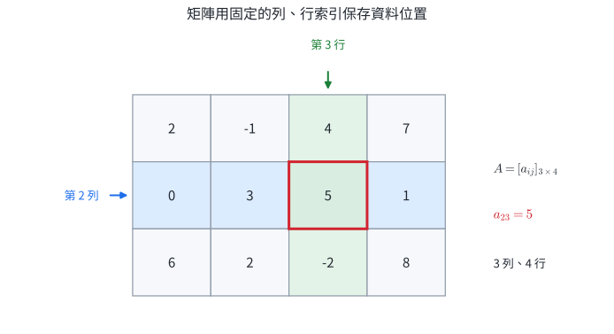{width=86%}

常用特殊矩陣包括：

$$
O_{m\times n}=
\begin{bmatrix}
0&\cdots&0\\
\vdots&&\vdots\\
0&\cdots&0
\end{bmatrix},
$$

以及主對角線為 $1$、其他元素為 $0$ 的單位方陣 $I_n$。

::: worked-example
### 完整示範｜由索引規則建立矩陣

已知 $A=[a_{ij}]_{2\times3}$，且 $a_{ij}=2i-j$。逐一代入 $i=1,2$ 與 $j=1,2,3$：

$$
\begin{aligned}
(a_{11},a_{12},a_{13})&=(1,0,-1),\\
(a_{21},a_{22},a_{23})&=(3,2,1).
\end{aligned}
$$

所以

$$
\boxed{
A=
\begin{bmatrix}
1&0&-1\\
3&2&1
\end{bmatrix}}
$$

且 $A$ 為 $2\times3$ 階矩陣，$a_{23}=1$。
:::

::: worked-example
### 完整示範｜由矩陣相等求參數

若

$$
\begin{bmatrix}
x&2y\\
-1&x+y
\end{bmatrix}
=
\begin{bmatrix}
3&4\\
-1&5
\end{bmatrix},
$$

對應元素相等，得到

$$
x=3,\qquad 2y=4,\qquad x+y=5.
$$

前兩式給出 $x=3,y=2$，也滿足第三式。因此

$$
\boxed{x=3,\quad y=2}.
$$
:::

### 2.2 加法、減法與係數積

只有階數相同的矩陣能逐位置相加、相減：

$$
[a_{ij}]+[b_{ij}]=[a_{ij}+b_{ij}],
$$

$$
[a_{ij}]-[b_{ij}]=[a_{ij}-b_{ij}].
$$

實數 $r$ 與矩陣相乘時，每個元素都乘 $r$：

$$
r[a_{ij}]=[ra_{ij}].
$$

若矩陣記錄同一套列、行索引，加法表示資料合併，減法表示逐項變化，係數積表示整批縮放。

::: worked-example
### 完整示範｜兩週資料合併與平均

甲、乙兩門市兩週三項商品銷量為

$$
W_1=
\begin{bmatrix}
12&8&5\\
9&11&6
\end{bmatrix},\qquad
W_2=
\begin{bmatrix}
15&7&9\\
10&13&8
\end{bmatrix}.
$$

兩週合計為

$$
W_1+W_2
=
\boxed{
\begin{bmatrix}
27&15&14\\
19&24&14
\end{bmatrix}}.
$$

每週平均銷量矩陣為

$$
\frac12(W_1+W_2)
=
\boxed{
\begin{bmatrix}
13.5&7.5&7\\
9.5&12&7
\end{bmatrix}}.
$$

每個位置始終代表同一門市、同一商品，因此逐項運算具有一致資料意義。
:::

::: worked-example
### 完整示範｜解矩陣方程式

已知

$$
A=
\begin{bmatrix}
2&-1\\
3&4
\end{bmatrix},\qquad
B=
\begin{bmatrix}
1&2\\
-2&5
\end{bmatrix},
$$

且 $2X+A=3B$。移項得

$$
2X=3B-A,\qquad X=\frac12(3B-A).
$$

$$
3B-A
=
\begin{bmatrix}
3&6\\
-6&15
\end{bmatrix}
-
\begin{bmatrix}
2&-1\\
3&4
\end{bmatrix}
=
\begin{bmatrix}
1&7\\
-9&11
\end{bmatrix}.
$$

所以

$$
\boxed{
X=
\begin{bmatrix}
1/2&7/2\\
-9/2&11/2
\end{bmatrix}}.
$$

代回 $2X+A$ 可逐項得到 $3B$。
:::

矩陣加法與係數積保留下列性質：

$$
A+B=B+A,\qquad (A+B)+C=A+(B+C),
$$

$$
r(A+B)=rA+rB,\qquad (r+s)A=rA+sA.
$$

這些性質可由每個第 $(i,j)$ 元的實數運算直接證明。

::: self-check
### 分節練習｜矩陣索引與逐項運算

1. 已知 $A=[a_{ij}]_{3\times2}$、$a_{ij}=i+2j$，寫出 $A$ 並求 $a_{31}$。
2. 若
   $$
   \begin{bmatrix}p&q-1\\2p&r\end{bmatrix}
   =
   \begin{bmatrix}2&4\\4&-3\end{bmatrix},
   $$
   求 $p,q,r$。
3. 設
   $$
   A=\begin{bmatrix}1&-2\\3&0\end{bmatrix},
   \quad
   B=\begin{bmatrix}4&1\\-1&5\end{bmatrix},
   $$
   求 $2A-B$。
4. 兩批同規格資料矩陣為
   $$
   D_1=\begin{bmatrix}8&12&10\\6&9&15\end{bmatrix},
   \quad
   D_2=\begin{bmatrix}4&5&8\\7&3&5\end{bmatrix}.
   $$
   求合計矩陣與第二批相對第一批的變化矩陣 $D_2-D_1$。
5. 已知 $3(X-A)=2B$，其中
   $$
   A=\begin{bmatrix}1&0\\-1&2\end{bmatrix},
   \quad
   B=\begin{bmatrix}3&-3\\6&0\end{bmatrix},
   $$
   求 $X$。
6. 說明為何 $2\times3$ 矩陣與 $3\times2$ 矩陣無法相加。

**解答**

1. $\boxed{A=\begin{bmatrix}3&5\\4&6\\5&7\end{bmatrix}}$，且 $\boxed{a_{31}=5}$。
2. 對應元素相等得 $\boxed{p=2,q=5,r=-3}$。
3. $\boxed{2A-B=\begin{bmatrix}-2&-5\\7&-5\end{bmatrix}}$。
4. 合計為 $\boxed{\begin{bmatrix}12&17&18\\13&12&20\end{bmatrix}}$；變化為 $\boxed{\begin{bmatrix}-4&-7&-2\\1&-6&-10\end{bmatrix}}$。
5. $X=A+\frac23B$，所以 $\boxed{X=\begin{bmatrix}3&-2\\3&2\end{bmatrix}}$。
6. 加法要讓每個第 $(i,j)$ 元都有同位置的配對；兩矩陣列數與行數不同，位置集合不同。
:::

## 3. 矩陣乘法、運算順序與資料組合

### 3.1 列乘行的定義

設 $A=[a_{ij}]$ 是 $m\times n$ 矩陣，$B=[b_{jk}]$ 是 $n\times p$ 矩陣。兩者相接的維度同為 $n$，乘積 $AB$ 定義為 $m\times p$ 矩陣，且

$$
(AB)_{ik}=\sum_{j=1}^{n}a_{ij}b_{jk}.
$$

第 $(i,k)$ 元由 $A$ 的第 $i$ 列與 $B$ 的第 $k$ 行逐項相乘後加總。共享索引 $j$ 被加總，外側索引 $i,k$ 保留下來：

$$
\underbrace{(m\times n)}_{A}
\underbrace{(n\times p)}_{B}
\longrightarrow
\underbrace{(m\times p)}_{AB}.
$$

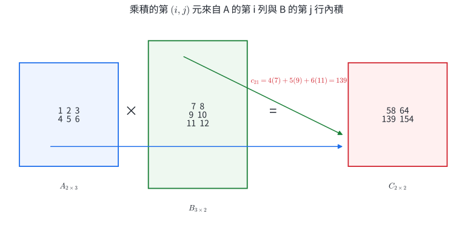{width=94%}

::: worked-example
### 完整示範｜計算非方陣的乘積

設

$$
A=
\begin{bmatrix}
1&2&3\\
4&5&6
\end{bmatrix},
\qquad
B=
\begin{bmatrix}
7&8\\
9&10\\
11&12
\end{bmatrix}.
$$

$A$ 是 $2\times3$，$B$ 是 $3\times2$，所以 $AB$ 存在且為 $2\times2$：

$$
AB=
\begin{bmatrix}
1\cdot7+2\cdot9+3\cdot11&
1\cdot8+2\cdot10+3\cdot12\\
4\cdot7+5\cdot9+6\cdot11&
4\cdot8+5\cdot10+6\cdot12
\end{bmatrix}
=
\boxed{
\begin{bmatrix}
58&64\\
139&154
\end{bmatrix}}.
$$

四個答案分別使用不同的「列—行」配對。
:::

::: worked-example
### 完整示範｜先由階數判斷運算是否合法

若 $C$ 為 $3\times2$、$D$ 為 $2\times4$，則

$$
CD:(3\times2)(2\times4)\longrightarrow3\times4.
$$

$DC$ 需要把 $D$ 的行數 $4$ 與 $C$ 的列數 $3$ 接合，兩者不同，所以 $DC$ 沒有定義。矩陣乘法的順序同時決定運算是否存在與結果的階數。
:::

### 3.2 乘法性質與運算順序

合適階數下，矩陣乘法滿足

$$
(AB)C=A(BC),\qquad A(B+C)=AB+AC,\qquad (A+B)C=AC+BC.
$$

單位方陣 $I_n$ 在乘法中保留原矩陣：

$$
I_mA=A=AI_n
$$

其中 $A$ 為 $m\times n$。結合律來自有限和式可重新分組：

$$
\bigl((AB)C\bigr)_{i\ell}
=\sum_k\left(\sum_j a_{ij}b_{jk}\right)c_{k\ell}
=\sum_j a_{ij}\left(\sum_k b_{jk}c_{k\ell}\right)
=\bigl(A(BC)\bigr)_{i\ell}.
$$

矩陣乘法通常不具交換律，因為左側矩陣決定輸出列，右側矩陣決定輸出行；交換順序會改變配對與作用次序。

::: worked-example
### 完整示範｜同一組矩陣的兩種順序

設

$$
A=\begin{bmatrix}1&1\\0&1\end{bmatrix},
\qquad
B=\begin{bmatrix}1&0\\1&1\end{bmatrix}.
$$

直接計算得

$$
AB=\begin{bmatrix}2&1\\1&1\end{bmatrix},
\qquad
BA=\begin{bmatrix}1&1\\1&2\end{bmatrix}.
$$

因此 $AB\ne BA$。若兩矩陣代表連續兩次資料處理，右側的規則先作用；改成另一個乘積就代表改變處理順序。
:::

::: worked-example
### 完整示範｜非零矩陣的乘積可以是零矩陣

令

$$
A=\begin{bmatrix}1&0\\0&0\end{bmatrix},
\qquad
B=\begin{bmatrix}0&0\\0&1\end{bmatrix}.
$$

$A$ 保留向量的第一分量，$B$ 的輸出只可能出現在第二分量。兩個規則依序作用時，

$$
AB=
\begin{bmatrix}0&0\\0&0\end{bmatrix}.
$$

$A$ 與 $B$ 都是非零矩陣，仍有 $AB=O$。這類矩陣稱為零因子；矩陣消去律需要額外的可逆條件。
:::

### 3.3 數量、單價與影像資料

矩陣乘法的共享索引常代表「同一類別」。若 $Q$ 的列表示門市、行表示商品，$P$ 的列表示商品、行表示月份，則

$$
(QP)_{\text{門市,月份}}
=\sum_{\text{商品}}
(\text{數量})(\text{單價}),
$$

正是各門市各月份的總成本。索引的語意能判斷乘法順序是否合理。

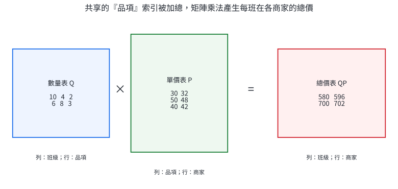{width=96%}

::: worked-example
### 完整示範｜兩家門市、三類商品、兩個月份

兩家門市的商品數量為

$$
Q=
\begin{bmatrix}
10&4&2\\
6&8&3
\end{bmatrix},
$$

三類商品在兩個月份的單價為

$$
P=
\begin{bmatrix}
30&32\\
50&48\\
40&42
\end{bmatrix}.
$$

總成本矩陣為

$$
QP=
\begin{bmatrix}
10(30)+4(50)+2(40)&10(32)+4(48)+2(42)\\
6(30)+8(50)+3(40)&6(32)+8(48)+3(42)
\end{bmatrix}
=
\boxed{\begin{bmatrix}580&596\\700&702\end{bmatrix}}.
$$

例如右下角 $702$ 表示第二家門市在第二個月份的總成本。
:::

::: worked-example
### 完整示範｜用矩陣調整兩通道影像

一個像素的兩個通道寫成

$$
v=\begin{bmatrix}120\\80\end{bmatrix}.
$$

處理矩陣

$$
C=\begin{bmatrix}0.8&0.1\\0.2&0.9\end{bmatrix}
$$

把舊通道混合成新通道：

$$
Cv=
\begin{bmatrix}
0.8(120)+0.1(80)\\
0.2(120)+0.9(80)
\end{bmatrix}
=\boxed{\begin{bmatrix}104\\96\end{bmatrix}}.
$$

每一列是一個新通道的配方。大量像素可排成資料矩陣，一次套用相同規則。
:::

::: self-check
### 分節練習｜矩陣乘法與資料組合

1. 設 $A=\begin{bmatrix}2&-1&3\\0&4&1\end{bmatrix}$、$B=\begin{bmatrix}1&2\\3&0\\-2&5\end{bmatrix}$，求 $AB$。
2. $M$ 為 $4\times3$、$N$ 為 $3\times5$、$P$ 為 $5\times2$。寫出 $MN$、$NP$、$MNP$ 的階數。
3. 設 $A=\begin{bmatrix}1&2\\0&1\end{bmatrix}$、$B=\begin{bmatrix}2&0\\1&3\end{bmatrix}$，分別求 $AB$ 與 $BA$。
4. 求矩陣 $X$，使 $\begin{bmatrix}1&2\\3&4\end{bmatrix}X=\begin{bmatrix}2&1\\4&3\end{bmatrix}$，也就是交換兩個直行。
5. 一家工廠生產甲、乙兩型產品，每件分別需材料 $(2,1,3)$ 與 $(1,4,2)$ 單位；三種材料單價為 $(30,20,10)$ 元。用矩陣乘法求兩型產品的材料成本。
6. 三個像素的兩通道資料以欄向量排列成 $D=\begin{bmatrix}100&60&20\\40&80&120\end{bmatrix}$。若 $C=\begin{bmatrix}1&0\\0.25&0.75\end{bmatrix}$，求 $CD$，並說明第一通道是否改變。

**解答**

1. $\boxed{AB=\begin{bmatrix}-7&19\\10&5\end{bmatrix}}$。
2. $MN$ 為 $\boxed{4\times5}$，$NP$ 為 $\boxed{3\times2}$，$MNP$ 為 $\boxed{4\times2}$。
3. $\boxed{AB=\begin{bmatrix}4&6\\1&3\end{bmatrix}}$，$\boxed{BA=\begin{bmatrix}2&4\\1&5\end{bmatrix}}$。
4. 右乘交換矩陣即可交換兩個直行，故 $\boxed{X=\begin{bmatrix}0&1\\1&0\end{bmatrix}}$；相乘後確為 $\begin{bmatrix}2&1\\4&3\end{bmatrix}$。
5. $\begin{bmatrix}2&1&3\\1&4&2\end{bmatrix}\begin{bmatrix}30\\20\\10\end{bmatrix}=\boxed{\begin{bmatrix}110\\130\end{bmatrix}}$ 元。
6. $\boxed{CD=\begin{bmatrix}100&60&20\\55&75&95\end{bmatrix}}$；第一列為 $(1,0)$，所以第一通道保留原值。
:::

## 4. 行列式、反方陣與矩陣方程式

### 4.1 二階行列式與面積倍率

二階方陣

$$
A=\begin{bmatrix}a&b\\c&d\end{bmatrix}
$$

的行列式定義為

$$
\det A=ad-bc.
$$

$A$ 的兩個直行向量為 $u=(a,c)$、$v=(b,d)$。由它們張成的平行四邊形，有向面積為 $ad-bc$，實際面積為

$$
\boxed{|\det A|}.
$$

當 $\det A=0$，兩個行向量共線，平面被壓到一條線或一個點；不同輸入可能得到相同輸出，復原結果不唯一。

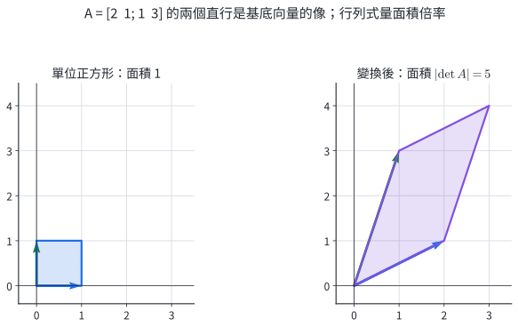{width=92%}

::: worked-example
### 完整示範｜由兩個輸出基底求面積

矩陣

$$
A=\begin{bmatrix}3&1\\1&2\end{bmatrix}
$$

把標準正方形的兩條邊變成 $(3,1)$ 與 $(1,2)$。平行四邊形面積為

$$
|\det A|=|3\cdot2-1\cdot1|=\boxed{5}.
$$

因此任何圖形經此線性變換後，面積都變成原來的 $5$ 倍。
:::

::: worked-example
### 完整示範｜參數控制面積是否塌縮

設

$$
A_k=\begin{bmatrix}k&2\\3&k-1\end{bmatrix}.
$$

其行列式為

$$
\det A_k=k(k-1)-6=k^2-k-6=(k-3)(k+2).
$$

當 $k=3$ 或 $k=-2$，面積倍率為 $0$，變換塌縮到一條線；其餘 $k$ 值的面積倍率為 $|(k-3)(k+2)|$。
:::

### 4.2 反方陣公式的推導

若存在矩陣 $A^{-1}$ 使

$$
AA^{-1}=A^{-1}A=I,
$$

則稱 $A$ 可逆，$A^{-1}$ 稱為 $A$ 的反方陣。對二階方陣，先觀察

$$
\begin{bmatrix}a&b\\c&d\end{bmatrix}
\begin{bmatrix}d&-b\\-c&a\end{bmatrix}
=
\begin{bmatrix}ad-bc&0\\0&ad-bc\end{bmatrix}
=(\det A)I.
$$

只要 $\det A\ne0$，兩側除以 $\det A$，得到

$$
\boxed{
A^{-1}=\frac1{ad-bc}
\begin{bmatrix}d&-b\\-c&a\end{bmatrix}}.
$$

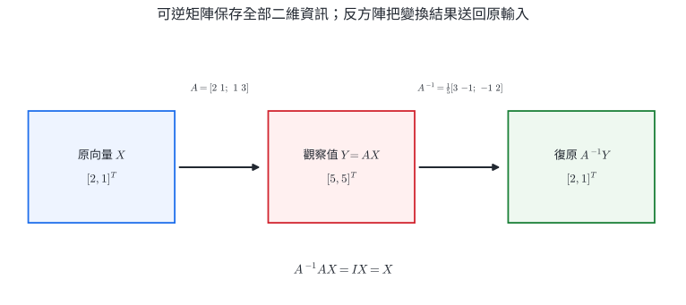{width=94%}

::: worked-example
### 完整示範｜計算反方陣並雙向驗算

設

$$
A=\begin{bmatrix}2&1\\1&3\end{bmatrix}.
$$

$\det A=6-1=5$，所以

$$
A^{-1}=\frac15\begin{bmatrix}3&-1\\-1&2\end{bmatrix}.
$$

驗算：

$$
AA^{-1}
=\frac15
\begin{bmatrix}
6-1&-2+2\\
3-3&-1+6
\end{bmatrix}
=I.
$$

同理可得 $A^{-1}A=I$。
:::

::: worked-example
### 完整示範｜乘積的反方陣順序

若 $A,B$ 都可逆，則

$$
(AB)(B^{-1}A^{-1})
=A(BB^{-1})A^{-1}
=I.
$$

另一側也有

$$
(B^{-1}A^{-1})(AB)
=B^{-1}(A^{-1}A)B
=I.
$$

因此

$$
\boxed{(AB)^{-1}=B^{-1}A^{-1}}.
$$

逆運算按相反順序撤銷：先撤銷最後作用的 $A$，再撤銷先前作用的 $B$。
:::

### 4.3 用反方陣解向量與矩陣方程式

若 $AX=b$ 且 $A$ 可逆，左乘 $A^{-1}$ 得

$$
X=A^{-1}b.
$$

若未知矩陣在右側，例如 $XA=B$，則需右乘 $A^{-1}$：

$$
X=BA^{-1}.
$$

乘在哪一側由未知矩陣的位置決定；等式兩側需保留相同的矩陣順序。

::: worked-example
### 完整示範｜由混合後資料復原原始量

已知

$$
\begin{bmatrix}2&1\\1&3\end{bmatrix}
\begin{bmatrix}x\\y\end{bmatrix}
=
\begin{bmatrix}5\\5\end{bmatrix}.
$$

使用前例反方陣：

$$
\begin{bmatrix}x\\y\end{bmatrix}
=\frac15
\begin{bmatrix}3&-1\\-1&2\end{bmatrix}
\begin{bmatrix}5\\5\end{bmatrix}
=\frac15\begin{bmatrix}10\\5\end{bmatrix}
=\boxed{\begin{bmatrix}2\\1\end{bmatrix}}.
$$

代回左側得 $(5,5)^T$。
:::

::: worked-example
### 完整示範｜未知矩陣位在乘積左側

解

$$
X
\begin{bmatrix}1&2\\0&1\end{bmatrix}
=
\begin{bmatrix}3&8\\2&5\end{bmatrix}.
$$

令

$$
A=\begin{bmatrix}1&2\\0&1\end{bmatrix},
\qquad
A^{-1}=\begin{bmatrix}1&-2\\0&1\end{bmatrix}.
$$

在等式右側乘 $A^{-1}$：

$$
X=
\begin{bmatrix}3&8\\2&5\end{bmatrix}
\begin{bmatrix}1&-2\\0&1\end{bmatrix}
=
\boxed{\begin{bmatrix}3&2\\2&1\end{bmatrix}}.
$$

驗算 $XA$ 可還原題目的右側矩陣。
:::

::: self-check
### 分節練習｜行列式、反方陣與方程式

1. 求 $A=\begin{bmatrix}4&-1\\2&3\end{bmatrix}$ 的行列式與反方陣。
2. 求 $k$ 的範圍，使 $\begin{bmatrix}k&1\\4&k\end{bmatrix}$ 可逆。
3. 一個三角形面積為 $6$，經矩陣 $\begin{bmatrix}2&1\\-1&3\end{bmatrix}$ 變換後，求新面積。
4. 解 $\begin{bmatrix}3&1\\1&2\end{bmatrix}\begin{bmatrix}x\\y\end{bmatrix}=\begin{bmatrix}5\\5\end{bmatrix}$。
5. 解 $AX=B$，其中 $A=\begin{bmatrix}2&0\\1&1\end{bmatrix}$、$B=\begin{bmatrix}4&2\\3&5\end{bmatrix}$。
6. 已知 $A,B$ 均可逆，化簡 $(A^{-1}B)^{-1}$，並以乘法驗證。

**解答**

1. $\det A=14$，$\boxed{A^{-1}=\frac1{14}\begin{bmatrix}3&1\\-2&4\end{bmatrix}}$。
2. 行列式為 $k^2-4$；可逆條件為 $\boxed{k\ne2,-2}$。
3. 面積倍率為 $|2(3)-1(-1)|=7$，新面積為 $\boxed{42}$。
4. 反方陣為 $\frac15\begin{bmatrix}2&-1\\-1&3\end{bmatrix}$，故 $\boxed{(x,y)=(1,2)}$。
5. $X=A^{-1}B$，$A^{-1}=\begin{bmatrix}1/2&0\\-1/2&1\end{bmatrix}$，所以 $\boxed{X=\begin{bmatrix}2&1\\1&4\end{bmatrix}}$。
6. $\boxed{(A^{-1}B)^{-1}=B^{-1}A}$；$(A^{-1}B)(B^{-1}A)=I$，反向乘法也為 $I$。
:::

## 5. 轉移矩陣與多期狀態

### 5.1 狀態向量與轉移規則

把第 $n$ 期各狀態的比例排成直行向量

$$
X_n=\begin{bmatrix}x_{1,n}\\x_{2,n}\\\vdots\\x_{k,n}\end{bmatrix},
\qquad
x_{i,n}\ge0,\qquad
\sum_i x_{i,n}=1.
$$

若每一期都遵守同一套流動比例，令 $a_{ij}$ 表示「目前在狀態 $j$ 的量，下一期有多少比例進入狀態 $i$」，則

$$
X_{n+1}=AX_n,
\qquad
A=[a_{ij}].
$$

$A$ 的每個直行描述一個原狀態的去向，因此每個直行的元素和為 $1$，且所有元素非負。這類矩陣稱為轉移矩陣。矩陣乘法會自動把不同來源流入同一狀態的量加總。

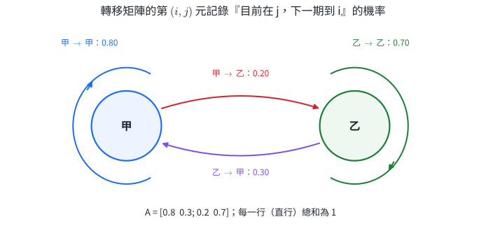{width=92%}

::: worked-example
### 完整示範｜由轉移敘述建立矩陣

某區域人口分成甲、乙兩區。每期甲區有 $80\%$ 留在甲、$20\%$ 前往乙；乙區有 $30\%$ 前往甲、$70\%$ 留在乙。以 $(\text{甲},\text{乙})$ 排列，轉移矩陣為

$$
A=
\begin{bmatrix}
0.8&0.3\\
0.2&0.7
\end{bmatrix}.
$$

第一個直行 $(0.8,0.2)^T$ 是甲區人口的去向；第二個直行 $(0.3,0.7)^T$ 是乙區人口的去向。若目前比例為

$$
X_0=\begin{bmatrix}0.9\\0.1\end{bmatrix},
$$

則下一期

$$
X_1=AX_0
=
\begin{bmatrix}
0.8(0.9)+0.3(0.1)\\
0.2(0.9)+0.7(0.1)
\end{bmatrix}
=\boxed{\begin{bmatrix}0.75\\0.25\end{bmatrix}}.
$$

兩分量仍非負且總和為 $1$。
:::

::: worked-example
### 完整示範｜連續兩期與矩陣冪

沿用前例，

$$
X_2=AX_1=A(AX_0)=A^2X_0.
$$

因此

$$
X_2=
\begin{bmatrix}
0.8(0.75)+0.3(0.25)\\
0.2(0.75)+0.7(0.25)
\end{bmatrix}
=\boxed{\begin{bmatrix}0.675\\0.325\end{bmatrix}}.
$$

一般地，

$$
\boxed{X_n=A^nX_0}.
$$

矩陣冪表示同一轉移規則重複作用；$A^n$ 的元素由連續的列乘行運算決定。
:::

### 5.2 穩定狀態與參數估計

若某個比例向量 $X_*$ 經一次轉移後保持不變，則

$$
AX_*=X_*,
\qquad
\sum_i (X_*)_i=1.
$$

這稱為穩定狀態。求解時把 $AX_*=X_*$ 化成聯立方程式，再加入總和為 $1$ 的條件。穩定狀態描述模型長期可能接近的固定比例；實際是否接近還要由轉移規則與初始狀態判斷。

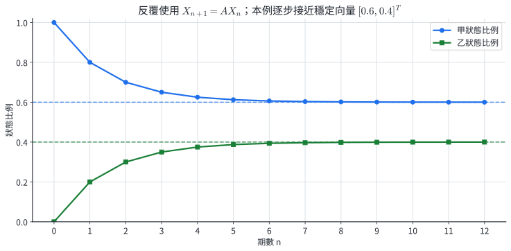{width=94%}

::: worked-example
### 完整示範｜解兩狀態穩定比例

對

$$
A=
\begin{bmatrix}
0.8&0.3\\
0.2&0.7
\end{bmatrix},
\qquad
X_*=\begin{bmatrix}x\\y\end{bmatrix},
$$

$AX_*=X_*$ 的第一式為

$$
0.8x+0.3y=x
\quad\Longrightarrow\quad
0.2x=0.3y
\quad\Longrightarrow\quad
x:y=3:2.
$$

再用 $x+y=1$，得到

$$
\boxed{X_*=\begin{bmatrix}0.6\\0.4\end{bmatrix}}.
$$

驗算：

$$
A\begin{bmatrix}0.6\\0.4\end{bmatrix}
=
\begin{bmatrix}0.48+0.12\\0.12+0.28\end{bmatrix}
=
\begin{bmatrix}0.6\\0.4\end{bmatrix}.
$$
:::

::: worked-example
### 完整示範｜由兩期觀測估計未知轉移率

兩狀態模型為

$$
A=
\begin{bmatrix}
0.8&q\\
0.2&1-q
\end{bmatrix}.
$$

已知

$$
X_0=\begin{bmatrix}0.6\\0.4\end{bmatrix},
\qquad
X_1=\begin{bmatrix}0.56\\0.44\end{bmatrix}.
$$

利用第一分量：

$$
0.8(0.6)+q(0.4)=0.56.
$$

所以

$$
0.48+0.4q=0.56
\quad\Longrightarrow\quad
\boxed{q=0.2}.
$$

第二分量驗算為 $0.2(0.6)+0.8(0.4)=0.44$。觀測資料提供的是加權後總量，矩陣模型把未知流率放回可解的聯立關係。
:::

::: self-check
### 分節練習｜轉移矩陣

1. 某會員分成活躍、休眠兩狀態。活躍會員下期有 $85\%$ 仍活躍；休眠會員有 $25\%$ 恢復活躍。寫出以 $(\text{活躍},\text{休眠})$ 排列的轉移矩陣。
2. 沿用第 1 題，若本期比例為 $(0.7,0.3)^T$，求下一期比例。
3. 設 $A=\begin{bmatrix}0.75&0.25\\0.25&0.75\end{bmatrix}$、$X_0=(1,0)^T$，求 $X_2$。
4. 求 $A=\begin{bmatrix}0.9&0.4\\0.1&0.6\end{bmatrix}$ 的穩定比例。
5. 已知 $A=\begin{bmatrix}1-p&0.3\\p&0.7\end{bmatrix}$，且 $A(0.5,0.5)^T=(0.6,0.4)^T$，求 $p$。
6. 一個候選矩陣 $B=\begin{bmatrix}0.7&-0.1\\0.3&1.1\end{bmatrix}$ 的每個直行和都是 $1$。檢查它是否符合比例轉移的全部條件。

**解答**

1. $\boxed{\begin{bmatrix}0.85&0.25\\0.15&0.75\end{bmatrix}}$。
2. $\boxed{\begin{bmatrix}0.67\\0.33\end{bmatrix}}$。
3. $A^2=\begin{bmatrix}0.625&0.375\\0.375&0.625\end{bmatrix}$，所以 $\boxed{X_2=(0.625,0.375)^T}$。
4. $0.9x+0.4y=x$ 得 $x=4y$；配合 $x+y=1$，$\boxed{X_*=(0.8,0.2)^T}$。
5. 第一分量 $(1-p)(0.5)+0.3(0.5)=0.6$，解得 $\boxed{p=0.1}$。
6. 比例轉移要求所有元素非負；$-0.1$ 會把正比例轉成負的流量，失去機率或比例意義。
:::

## 6. 矩陣表示平面線性變換

### 6.1 基底向量決定整個變換

對二階矩陣

$$
A=\begin{bmatrix}a&b\\c&d\end{bmatrix},
$$

定義平面變換

$$
T_A\left(\begin{bmatrix}x\\y\end{bmatrix}\right)
=A\begin{bmatrix}x\\y\end{bmatrix}.
$$

標準基底為

$$
e_1=\begin{bmatrix}1\\0\end{bmatrix},
\qquad
e_2=\begin{bmatrix}0\\1\end{bmatrix}.
$$

因為 $(x,y)^T=xe_1+ye_2$，

$$
T_A(xe_1+ye_2)
=xT_A(e_1)+yT_A(e_2).
$$

而

$$
T_A(e_1)=\begin{bmatrix}a\\c\end{bmatrix},
\qquad
T_A(e_2)=\begin{bmatrix}b\\d\end{bmatrix},
$$

正是 $A$ 的兩個直行。知道兩個基底向量的像，就知道每個平面向量的像。

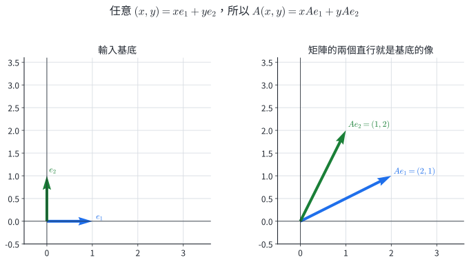{width=94%}

::: worked-example
### 完整示範｜由基底的像建立矩陣

已知線性變換滿足

$$
T(e_1)=\begin{bmatrix}2\\-1\end{bmatrix},
\qquad
T(e_2)=\begin{bmatrix}3\\4\end{bmatrix}.
$$

因此

$$
A=\boxed{\begin{bmatrix}2&3\\-1&4\end{bmatrix}}.
$$

若 $v=(5,-2)^T=5e_1-2e_2$，則

$$
T(v)=5T(e_1)-2T(e_2)
=
\begin{bmatrix}10\\-5\end{bmatrix}
-
\begin{bmatrix}6\\8\end{bmatrix}
=\boxed{\begin{bmatrix}4\\-13\end{bmatrix}}.
$$

直接計算 $Av$ 得到相同結果。
:::

::: worked-example
### 完整示範｜驗證線性結構

設

$$
A=\begin{bmatrix}1&2\\3&-1\end{bmatrix},
\quad
u=\begin{bmatrix}2\\1\end{bmatrix},
\quad
v=\begin{bmatrix}-1\\4\end{bmatrix}.
$$

先算

$$
T(u)=\begin{bmatrix}4\\5\end{bmatrix},
\qquad
T(v)=\begin{bmatrix}7\\-7\end{bmatrix}.
$$

另一方面，

$$
T(u+v)
=A\begin{bmatrix}1\\5\end{bmatrix}
=\begin{bmatrix}11\\-2\end{bmatrix}
=T(u)+T(v).
$$

矩陣乘法對向量加法與係數積的分配律，使直線、平行關係與線性組合在變換後仍保持線性結構。
:::

### 6.2 圖形、面積與反像

多邊形經線性變換時，把每個頂點乘上同一矩陣，再依原順序連接。所有面積都乘上 $|\det A|$。若 $\det A\ne0$，輸出點 $q$ 的唯一原像為

$$
p=A^{-1}q.
$$

若 $\det A=0$，平面被壓縮到較低維度，某些輸出沒有原像，而落在壓縮像上的點通常有多個原像。

::: worked-example
### 完整示範｜變換三角形並核對面積

三角形頂點為

$$
O=(0,0),\quad P=(2,0),\quad Q=(0,1),
$$

面積為 $1$。令

$$
A=\begin{bmatrix}2&1\\1&3\end{bmatrix}.
$$

各頂點的像為

$$
O'=(0,0),\quad P'=(4,2),\quad Q'=(1,3).
$$

$|\det A|=|6-1|=5$，所以新三角形面積為 $\boxed{5}$。也可由兩邊向量 $(4,2)$、$(1,3)$ 的行列式直接驗算：

$$
\frac12|4(3)-2(1)|=5.
$$
:::

::: worked-example
### 完整示範｜由觀測位置求原位置

某坐標校正把原向量 $p$ 轉成

$$
q=
\begin{bmatrix}3&1\\1&2\end{bmatrix}p.
$$

若觀測到 $q=(11,8)^T$，則

$$
\begin{bmatrix}3&1\\1&2\end{bmatrix}^{-1}
=\frac15\begin{bmatrix}2&-1\\-1&3\end{bmatrix},
$$

所以

$$
p=\frac15
\begin{bmatrix}2&-1\\-1&3\end{bmatrix}
\begin{bmatrix}11\\8\end{bmatrix}
=\frac15\begin{bmatrix}14\\13\end{bmatrix}.
$$

因此原位置為

$$
\boxed{p=\left(\frac{14}{5},\frac{13}{5}\right)}.
$$

代回矩陣乘法可得 $(11,8)^T$。
:::

::: self-check
### 分節練習｜線性變換

1. 已知 $T(e_1)=(1,3)^T$、$T(e_2)=(-2,4)^T$，寫出矩陣並求 $T(2,-1)$。
2. 設 $A=\begin{bmatrix}2&0\\1&-1\end{bmatrix}$，求點 $P(3,2)$ 的像。
3. 三角形面積為 $7$，經 $A=\begin{bmatrix}1&2\\3&4\end{bmatrix}$ 變換後，求面積。
4. 求 $A=\begin{bmatrix}2&1\\1&1\end{bmatrix}$ 將哪個點送到 $(8,5)$。
5. 矩形四點為 $(0,0),(2,0),(2,1),(0,1)$。經 $A=\begin{bmatrix}1&1\\0&2\end{bmatrix}$ 後，寫出四個像並求面積。
6. 設 $B=\begin{bmatrix}1&2\\2&4\end{bmatrix}$。求 $B(2,-1)^T$，並找另一個不同輸入也得到同一輸出。

**解答**

1. $A=\begin{bmatrix}1&-2\\3&4\end{bmatrix}$，$\boxed{T(2,-1)=(4,2)^T}$。
2. $\boxed{P'=(6,1)}$。
3. 面積倍率 $|\det A|=2$，新面積為 $\boxed{14}$。
4. $A^{-1}=\begin{bmatrix}1&-1\\-1&2\end{bmatrix}$，原點為 $\boxed{(3,2)}$。
5. 四個像依序為 $\boxed{(0,0),(2,0),(3,2),(1,2)}$；面積倍率為 $2$，原面積 $2$，新面積 $\boxed{4}$。
6. $B(2,-1)^T=(0,0)^T$；例如 $(0,0)^T$ 也得到同一輸出。這對應 $\det B=0$ 的壓縮。
:::

## 7. 伸縮、鏡射、旋轉、推移與合成

### 7.1 由坐標規則讀出矩陣

常見平面線性變換可直接由 $x',y'$ 的係數讀成矩陣：

| 變換 | 坐標規則 | 矩陣 |
|---|---|---|
| 沿坐標軸伸縮 | $x'=hx,\ y'=ky$ | $\begin{bmatrix}h&0\\0&k\end{bmatrix}$ |
| 對 $x$ 軸鏡射 | $x'=x,\ y'=-y$ | $\begin{bmatrix}1&0\\0&-1\end{bmatrix}$ |
| 逆時針旋轉 $\theta$ | $x'=x\cos\theta-y\sin\theta,\ y'=x\sin\theta+y\cos\theta$ | $\begin{bmatrix}\cos\theta&-\sin\theta\\\sin\theta&\cos\theta\end{bmatrix}$ |
| 沿 $x$ 方向推移 | $x'=x+ky,\ y'=y$ | $\begin{bmatrix}1&k\\0&1\end{bmatrix}$ |
| 沿 $y$ 方向推移 | $x'=x,\ y'=kx+y$ | $\begin{bmatrix}1&0\\k&1\end{bmatrix}$ |

本章的「推移」是保持原點不動的剪切。一般平移 $(x,y)\mapsto(x+a,y+b)$ 含常數項，屬於仿射變換；延伸課程可用 $3\times3$ 齊次坐標統一表示。

旋轉矩陣的兩個直行分別是

$$
R_\theta e_1=(\cos\theta,\sin\theta)^T,
\qquad
R_\theta e_2=(-\sin\theta,\cos\theta)^T,
$$

也就是兩個互相垂直、長度為 $1$ 的旋轉後基底，因此旋轉保持長度與面積。

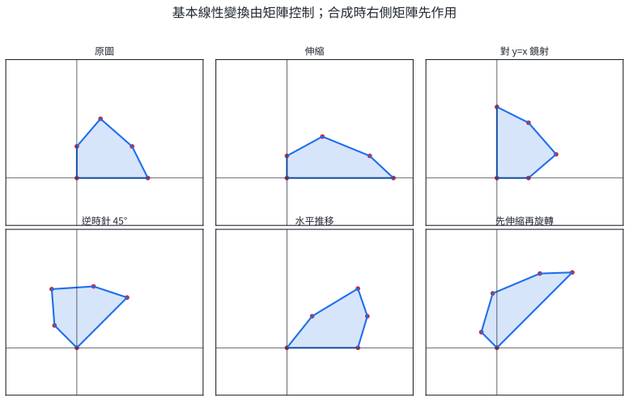{width=97%}

::: worked-example
### 完整示範｜旋轉矩陣由基底方向決定

逆時針旋轉 $90^\circ$ 時，

$$
e_1\mapsto e_2=(0,1)^T,
\qquad
e_2\mapsto -e_1=(-1,0)^T.
$$

所以

$$
R_{90^\circ}
=\begin{bmatrix}0&-1\\1&0\end{bmatrix}.
$$

點 $P(3,-2)$ 的像為

$$
R_{90^\circ}\begin{bmatrix}3\\-2\end{bmatrix}
=\boxed{\begin{bmatrix}2\\3\end{bmatrix}}.
$$

原長度與新長度都為 $\sqrt{13}$。
:::

::: worked-example
### 完整示範｜對過原點直線的鏡射

對與 $x$ 軸夾角為 $\theta$ 的直線鏡射，可先旋轉 $-\theta$ 把鏡線送到 $x$ 軸，做 $x$ 軸鏡射，再旋轉 $\theta$ 回去。化簡後矩陣為

$$
H_\theta=
\begin{bmatrix}
\cos2\theta&\sin2\theta\\
\sin2\theta&-\cos2\theta
\end{bmatrix}.
$$

對直線 $y=x$ 鏡射時 $\theta=45^\circ$，故

$$
H_{45^\circ}
=\begin{bmatrix}0&1\\1&0\end{bmatrix}.
$$

它把 $(4,-1)$ 送到 $\boxed{(-1,4)}$，正好交換兩坐標。
:::

### 7.2 合成順序與反向復原

若先做 $B$、再做 $A$，令第一次輸出為 $v_1$、第二次輸出為 $v_2$，則

$$
v_1=Bv,\qquad v_2=Av_1=A(Bv)=(AB)v.
$$

因此合成矩陣是 $AB$，右側矩陣先作用。面積倍率相乘：

$$
|\det(AB)|=|\det A|\,|\det B|.
$$

若兩個變換都可逆，復原時順序相反：

$$
(AB)^{-1}=B^{-1}A^{-1}.
$$

::: worked-example
### 完整示範｜先伸縮再旋轉

先沿 $x$ 方向放大 $2$ 倍，再逆時針旋轉 $90^\circ$：

$$
S=\begin{bmatrix}2&0\\0&1\end{bmatrix},
\qquad
R=\begin{bmatrix}0&-1\\1&0\end{bmatrix}.
$$

合成矩陣為

$$
RS=
\begin{bmatrix}0&-1\\2&0\end{bmatrix}.
$$

對 $v=(1,1)^T$，

$$
RSv=\boxed{(-1,2)^T}.
$$

若交換順序，$SRv=(-2,1)^T$，代表另一個幾何操作。合成面積倍率為 $|\det(RS)|=2$。
:::

::: worked-example
### 完整示範｜推移後的坐標與面積

沿 $x$ 方向推移係數 $k=2$：

$$
K=\begin{bmatrix}1&2\\0&1\end{bmatrix}.
$$

它把 $(x,y)$ 送到 $(x+2y,y)$。例如

$$
K\begin{bmatrix}1\\3\end{bmatrix}
=\boxed{\begin{bmatrix}7\\3\end{bmatrix}}.
$$

$\det K=1$，所以面積保持。水平線仍為水平線；不同高度的點水平位移量為 $2y$，因此直立邊會傾斜。
:::

::: worked-example
### 完整示範｜由輸入、輸出設計合成變換

要先對 $x$ 軸鏡射，再沿 $y$ 方向放大 $3$ 倍。兩個矩陣為

$$
H=\begin{bmatrix}1&0\\0&-1\end{bmatrix},
\qquad
S=\begin{bmatrix}1&0\\0&3\end{bmatrix}.
$$

合成為

$$
SH=\begin{bmatrix}1&0\\0&-3\end{bmatrix}.
$$

點 $(2,-4)$ 先變為 $(2,4)$，再變為 $\boxed{(2,12)}$。行列式為 $-3$：面積放大 $3$ 倍，負號表示定向翻轉。
:::

::: self-check
### 分節練習｜特殊變換與合成

1. 寫出沿 $x$ 方向縮小為 $\frac12$、沿 $y$ 方向放大為 $3$ 的矩陣，並求 $(4,-2)$ 的像。
2. 用矩陣求點 $(-3,5)$ 對 $y=x$ 鏡射後的坐標。
3. 寫出逆時針旋轉 $30^\circ$ 的矩陣，求 $(2,0)$ 的像。
4. 沿 $y$ 方向推移係數 $-2$。寫出矩陣並求 $(3,1)$ 的像。
5. 先逆時針旋轉 $90^\circ$，再對 $x$ 軸鏡射。求合成矩陣及 $(1,2)$ 的像。
6. 先做 $K=\begin{bmatrix}1&2\\0&1\end{bmatrix}$，再做 $S=\begin{bmatrix}3&0\\0&1\end{bmatrix}$。求合成矩陣、面積倍率與反方陣。

**解答**

1. $S=\begin{bmatrix}1/2&0\\0&3\end{bmatrix}$，像為 $\boxed{(2,-6)}$。
2. 使用 $\begin{bmatrix}0&1\\1&0\end{bmatrix}$，像為 $\boxed{(5,-3)}$。
3. $R=\begin{bmatrix}\sqrt3/2&-1/2\\1/2&\sqrt3/2\end{bmatrix}$，像為 $\boxed{(\sqrt3,1)}$。
4. $K=\begin{bmatrix}1&0\\-2&1\end{bmatrix}$，像為 $\boxed{(3,-5)}$。
5. 合成矩陣為 $\begin{bmatrix}1&0\\0&-1\end{bmatrix}\begin{bmatrix}0&-1\\1&0\end{bmatrix}=\begin{bmatrix}0&-1\\-1&0\end{bmatrix}$，像為 $\boxed{(-2,-1)}$。
6. $SK=\begin{bmatrix}3&6\\0&1\end{bmatrix}$，面積倍率為 $\boxed{3}$，反方陣為 $\boxed{\begin{bmatrix}1/3&-2\\0&1\end{bmatrix}}$。
:::

## 8. 核心整理

| 問題 | 建模方式 | 關鍵判據 |
|---|---|---|
| 多元一次方程組 | 增廣矩陣與列運算 | 樞紐、自由變數、矛盾列 |
| 同位置資料合併 | 同階矩陣加減或係數積 | 列數、行數都相同 |
| 共享類別加權加總 | 矩陣乘法 | 內側維度相同；列乘行 |
| 二階變換能否復原 | 行列式與反方陣 | $\det A\ne0$ |
| 同一流動規則重複多期 | $X_n=A^nX_0$ | 轉移矩陣元素非負、每個直行和為 $1$ |
| 平面向量的線性變換 | $T(v)=Av$ | 兩個直行分別是 $T(e_1),T(e_2)$ |
| 連續幾何操作 | 合成矩陣 | 右側變換先作用 |

高斯消去法與反方陣都能解聯立方程式。消去法可處理一般階數並直接判斷三種解型；二階反方陣適合可逆方陣，還能描述資料復原與幾何反變換。

行列式同時連接兩個觀點：

$$
\det A=0
\quad\Longleftrightarrow\quad
\text{兩個基底像共線}
\quad\Longleftrightarrow\quad
\text{面積塌縮}
\quad\Longleftrightarrow\quad
A\text{ 不可逆}.
$$

矩陣乘法則把全章串在一起：資料表中的共享索引被加總，轉移規則以矩陣冪重複，幾何變換依右至左的順序合成。

## 9. 章末分層題

### 基礎題

1. 用高斯消去法解
   $$
   \begin{cases}
   x+y+z=4,\\
   2x-y+z=1,\\
   x+2y-z=4.
   \end{cases}
   $$

2. 依參數 $a$ 判斷下列方程組的解型，並在有解時寫出解：
   $$
   \begin{cases}
   x+y+z=2,\\
   2x+ay+2z=4,\\
   x+2y+z=3.
   \end{cases}
   $$

3. 設 $A=[a_{ij}]_{2\times3}$、$a_{ij}=2i-j$，且
   $$
   B=\begin{bmatrix}0&1&2\\-1&0&1\end{bmatrix}.
   $$
   求 $2A+B$。

4. 設
   $$
   A=\begin{bmatrix}1&2&-1\\0&3&2\end{bmatrix},
   \qquad
   B=\begin{bmatrix}2&1\\1&0\\4&-2\end{bmatrix}.
   $$
   求 $AB$，並寫出乘積階數。

### 熟練題

5. 求
   $$
   A=\begin{bmatrix}4&1\\2&1\end{bmatrix}
   $$
   的行列式與反方陣，並以 $AA^{-1}=I$ 驗算。

6. 解矩陣方程式
   $$
   X\begin{bmatrix}1&1\\0&2\end{bmatrix}
   =
   \begin{bmatrix}3&5\\2&6\end{bmatrix}.
   $$

7. 甲、乙兩個生產批次使用原料一、二的數量矩陣為
   $$
   Q=\begin{bmatrix}5&2\\3&4\end{bmatrix},
   $$
   兩種原料在一月、二月的單價矩陣為
   $$
   P=\begin{bmatrix}20&22\\30&28\end{bmatrix}.
   $$
   求兩批次在兩個月份的原料總成本矩陣，並解釋右下角元素。

8. 二次函數 $p(x)=ax^2+bx+c$ 通過 $(0,1),(1,4),(2,11)$。用聯立方程式求 $p(x)$，並求 $p(3)$。

### 應用題

9. 兩狀態轉移矩陣與初始比例為
   $$
   A=\begin{bmatrix}0.7&0.2\\0.3&0.8\end{bmatrix},
   \qquad
   X_0=\begin{bmatrix}0.6\\0.4\end{bmatrix}.
   $$
   求 $X_1,X_2$。

10. 求第 9 題轉移矩陣的穩定比例，並比較 $X_2$ 與穩定比例各分量的差。

11. 線性變換滿足
    $$
    T(e_1)=\begin{bmatrix}2\\1\end{bmatrix},
    \qquad
    T(e_2)=\begin{bmatrix}-1\\3\end{bmatrix}.
    $$
    求變換矩陣、$T(4,-2)$ 與面積倍率。

12. 先沿 $x$ 方向推移 $x'=x+y$，再逆時針旋轉 $90^\circ$。求合成矩陣，並求 $(2,1)$ 的像與面積倍率。

### 跨節整合題

13. 某雙通道感測器用兩個純訊號校正。輸入 $(1,0)^T$ 時輸出 $(2,1)^T$；輸入 $(0,1)^T$ 時輸出 $(1,2)^T$。

    (1) 寫出感測矩陣 $A$。  
    (2) 實測輸出為 $(8,7)^T$，求原始訊號。  
    (3) 若兩種原始訊號每單位成本分別為 $40,25$ 元，求這次訊號代表的總成本。

14. 兩狀態模型為
    $$
    A(q)=\begin{bmatrix}0.8&q\\0.2&1-q\end{bmatrix}.
    $$
    已知 $X_0=(0.5,0.5)^T$、$X_1=(0.55,0.45)^T$。

    (1) 由觀測求 $q$。  
    (2) 求 $X_2$。  
    (3) 求此模型的穩定比例。

15. 三角形頂點為 $O(0,0),P(2,0),Q(0,1)$。先沿 $x$ 方向做 $x'=x+2y$ 的推移，再沿 $x,y$ 方向分別放大 $3$ 倍、縮小為 $\frac12$。

    (1) 求合成矩陣。  
    (2) 求三個頂點的像與新面積。  
    (3) 若某輸出點為 $(12,1)$，求其原像。

16. 未知線性變換 $T$ 滿足
    $$
    T(1,1)=(3,4),\qquad T(2,-1)=(3,-1).
    $$

    (1) 以聯立方程式求 $T$ 的矩陣。  
    (2) 求 $T(3,2)$。  
    (3) 求面積倍率，並判斷每個輸出是否有唯一原像。

## 10. 章末題完整解析

### 第 1 題

增廣矩陣為

$$
\left[
\begin{array}{ccc|c}
1&1&1&4\\
2&-1&1&1\\
1&2&-1&4
\end{array}
\right].
$$

做

$$
R_2\leftarrow R_2-2R_1,
\qquad
R_3\leftarrow R_3-R_1,
$$

得到

$$
\left[
\begin{array}{ccc|c}
1&1&1&4\\
0&-3&-1&-7\\
0&1&-2&0
\end{array}
\right].
$$

交換第二、三列，再做 $R_3\leftarrow R_3+3R_2$：

$$
\left[
\begin{array}{ccc|c}
1&1&1&4\\
0&1&-2&0\\
0&0&-7&-7
\end{array}
\right].
$$

所以 $z=1$、$y=2$、$x=1$，

$$
\boxed{(x,y,z)=(1,2,1)}.
$$

代回三式依序為 $4,1,4$。

### 第 2 題

令 $u=x+z$。第一、三式成為

$$
u+y=2,\qquad u+2y=3,
$$

相減得 $y=1$，再得 $u=1$。第二式要求

$$
2u+ay=4
\quad\Longrightarrow\quad
2+a=4.
$$

因此 $a=2$ 時第二式是第一式的兩倍，且

$$
y=1,\qquad x+z=1.
$$

令 $z=t$，解為

$$
\boxed{(x,y,z)=(1-t,1,t),\quad t\in\mathbb R},
$$

共有無限多組。$a\ne2$ 時，前兩個獨立條件固定 $u,y$ 後與第二式矛盾，故 $\boxed{\text{無解}}$。

### 第 3 題

依 $a_{ij}=2i-j$，

$$
A=\begin{bmatrix}
1&0&-1\\
3&2&1
\end{bmatrix}.
$$

所以

$$
2A+B
=
\begin{bmatrix}
2&0&-2\\
6&4&2
\end{bmatrix}
+
\begin{bmatrix}
0&1&2\\
-1&0&1
\end{bmatrix}
=
\boxed{\begin{bmatrix}2&1&0\\5&4&3\end{bmatrix}}.
$$

### 第 4 題

$A$ 為 $2\times3$、$B$ 為 $3\times2$，故 $AB$ 為 $2\times2$：

$$
AB=
\begin{bmatrix}
1(2)+2(1)-1(4)&1(1)+2(0)-1(-2)\\
0(2)+3(1)+2(4)&0(1)+3(0)+2(-2)
\end{bmatrix}
=
\boxed{\begin{bmatrix}0&3\\11&-4\end{bmatrix}}.
$$

### 第 5 題

$$
\det A=4(1)-1(2)=2.
$$

因此

$$
\boxed{
A^{-1}
=\frac12\begin{bmatrix}1&-1\\-2&4\end{bmatrix}}.
$$

驗算：

$$
AA^{-1}
=\frac12
\begin{bmatrix}
4-2&-4+4\\
2-2&-2+4
\end{bmatrix}
=I.
$$

### 第 6 題

令

$$
C=\begin{bmatrix}1&1\\0&2\end{bmatrix},
\qquad
C^{-1}=\begin{bmatrix}1&-1/2\\0&1/2\end{bmatrix}.
$$

未知矩陣在乘積左側，因此右乘 $C^{-1}$：

$$
X=
\begin{bmatrix}3&5\\2&6\end{bmatrix}
\begin{bmatrix}1&-1/2\\0&1/2\end{bmatrix}
=
\boxed{\begin{bmatrix}3&1\\2&2\end{bmatrix}}.
$$

代回 $XC$ 得題目的右側矩陣。

### 第 7 題

數量的行索引與單價的列索引同為原料種類，因此

$$
QP=
\begin{bmatrix}5&2\\3&4\end{bmatrix}
\begin{bmatrix}20&22\\30&28\end{bmatrix}
=
\boxed{\begin{bmatrix}160&166\\180&178\end{bmatrix}}.
$$

右下角

$$
3(22)+4(28)=178
$$

表示乙批次按二月單價計算的原料總成本為 $\boxed{178}$ 元。

### 第 8 題

代入三點：

$$
\begin{cases}
c=1,\\
a+b+c=4,\\
4a+2b+c=11.
\end{cases}
$$

所以

$$
a+b=3,\qquad 2a+b=5.
$$

相減得 $a=2$，再得 $b=1$。因此

$$
\boxed{p(x)=2x^2+x+1},
\qquad
\boxed{p(3)=22}.
$$

### 第 9 題

$$
X_1=AX_0
=
\begin{bmatrix}
0.7(0.6)+0.2(0.4)\\
0.3(0.6)+0.8(0.4)
\end{bmatrix}
=
\boxed{\begin{bmatrix}0.5\\0.5\end{bmatrix}}.
$$

再作用一次：

$$
X_2=AX_1
=
\begin{bmatrix}
0.7(0.5)+0.2(0.5)\\
0.3(0.5)+0.8(0.5)
\end{bmatrix}
=
\boxed{\begin{bmatrix}0.45\\0.55\end{bmatrix}}.
$$

兩期的分量和都為 $1$。

### 第 10 題

令穩定比例為 $(x,y)^T$。由

$$
0.7x+0.2y=x
$$

得 $0.3x=0.2y$，所以 $x:y=2:3$。配合 $x+y=1$：

$$
\boxed{X_*=\begin{bmatrix}0.4\\0.6\end{bmatrix}}.
$$

第 9 題

$$
X_2-X_*=
\begin{bmatrix}0.05\\-0.05\end{bmatrix}.
$$

也就是第一狀態仍高 $0.05$，第二狀態仍低 $0.05$。

### 第 11 題

兩個基底的像依序放入矩陣直行：

$$
A=\boxed{\begin{bmatrix}2&-1\\1&3\end{bmatrix}}.
$$

$$
T(4,-2)
=
A\begin{bmatrix}4\\-2\end{bmatrix}
=
\boxed{\begin{bmatrix}10\\-2\end{bmatrix}}.
$$

面積倍率為

$$
|\det A|=|2(3)-(-1)(1)|=\boxed{7}.
$$

### 第 12 題

推移與旋轉矩陣為

$$
K=\begin{bmatrix}1&1\\0&1\end{bmatrix},
\qquad
R=\begin{bmatrix}0&-1\\1&0\end{bmatrix}.
$$

先 $K$ 後 $R$，所以合成矩陣為

$$
RK=
\boxed{\begin{bmatrix}0&-1\\1&1\end{bmatrix}}.
$$

$$
RK\begin{bmatrix}2\\1\end{bmatrix}
=\boxed{\begin{bmatrix}-1\\3\end{bmatrix}}.
$$

面積倍率為 $|\det(RK)|=\boxed{1}$。

### 第 13 題

純訊號就是標準基底，因此兩個校正輸出是矩陣的兩個直行：

$$
\boxed{A=\begin{bmatrix}2&1\\1&2\end{bmatrix}}.
$$

$\det A=3$，故

$$
A^{-1}=\frac13\begin{bmatrix}2&-1\\-1&2\end{bmatrix}.
$$

原始訊號為

$$
x=A^{-1}\begin{bmatrix}8\\7\end{bmatrix}
=\frac13
\begin{bmatrix}16-7\\-8+14\end{bmatrix}
=
\boxed{\begin{bmatrix}3\\2\end{bmatrix}}.
$$

成本為

$$
\begin{bmatrix}40&25\end{bmatrix}
\begin{bmatrix}3\\2\end{bmatrix}
=120+50
=\boxed{170\text{ 元}}.
$$

代回 $A(3,2)^T=(8,7)^T$，校正與復原一致。

### 第 14 題

第一期第一分量給出

$$
0.8(0.5)+q(0.5)=0.55,
$$

所以

$$
\boxed{q=0.3}.
$$

此時

$$
A=\begin{bmatrix}0.8&0.3\\0.2&0.7\end{bmatrix}.
$$

第二期為

$$
X_2=AX_1
=
\begin{bmatrix}
0.8(0.55)+0.3(0.45)\\
0.2(0.55)+0.7(0.45)
\end{bmatrix}
=
\boxed{\begin{bmatrix}0.575\\0.425\end{bmatrix}}.
$$

穩定比例滿足

$$
0.8x+0.3y=x
\quad\Longrightarrow\quad
0.2x=0.3y.
$$

配合 $x+y=1$，得到

$$
\boxed{X_*=(0.6,0.4)^T}.
$$

### 第 15 題

推移與伸縮矩陣為

$$
K=\begin{bmatrix}1&2\\0&1\end{bmatrix},
\qquad
S=\begin{bmatrix}3&0\\0&1/2\end{bmatrix}.
$$

先 $K$ 後 $S$：

$$
A=SK
=
\boxed{\begin{bmatrix}3&6\\0&1/2\end{bmatrix}}.
$$

三個頂點的像為

$$
O'=(0,0),\qquad
P'=A(2,0)^T=(6,0),\qquad
Q'=A(0,1)^T=(6,1/2).
$$

原三角形面積為 $1$，面積倍率為

$$
|\det A|=\left|3\cdot\frac12\right|=\frac32,
$$

故新面積為 $\boxed{\frac32}$。

反方陣為

$$
A^{-1}=
\begin{bmatrix}1/3&-4\\0&2\end{bmatrix}.
$$

輸出 $(12,1)^T$ 的原像為

$$
A^{-1}\begin{bmatrix}12\\1\end{bmatrix}
=
\begin{bmatrix}4-4\\2\end{bmatrix}
=\boxed{\begin{bmatrix}0\\2\end{bmatrix}}.
$$

### 第 16 題

設

$$
A=\begin{bmatrix}a&b\\c&d\end{bmatrix}.
$$

由兩組輸入輸出，

$$
\begin{cases}
a+b=3,\\
2a-b=3,
\end{cases}
\qquad
\begin{cases}
c+d=4,\\
2c-d=-1.
\end{cases}
$$

前一組相加得 $3a=6$，所以 $a=2,b=1$；後一組相加得 $3c=3$，所以 $c=1,d=3$。因此

$$
\boxed{A=\begin{bmatrix}2&1\\1&3\end{bmatrix}}.
$$

$$
T(3,2)
=A\begin{bmatrix}3\\2\end{bmatrix}
=
\boxed{\begin{bmatrix}8\\9\end{bmatrix}}.
$$

行列式為 $\det A=2(3)-1(1)=5$，所以面積倍率為 $\boxed{5}$，且 $\det A\ne0$，反方陣存在，每個輸出都有唯一原像。
