# 數B3-2 按比例成長模型

::: learning-map
### 本章問題與能力

1. 固定增加一個數量與固定乘上一個倍率，為何產生不同的長期變化？
2. 底數與指數如何決定指數函數的增減、大小與圖形？
3. 複利、人口、藥物濃度與半衰期如何寫成成長或衰退模型？
4. 已知最後數量時，如何用對數反求時間或倍率？
5. 為何分貝、pH 與地震規模適合用對數尺度？
6. 指數函數與對數函數的圖形如何精確對應？

本章路徑：固定倍率 → 指數函數 → 成長與衰退 → 對數運算 → 對數尺度 → 對數函數 → 反函數與資料模型。
:::

## 0. 實際應用：將持續累積的倍率轉成可計算的時間

定期存款每期將本金與已生利息一起乘上同一倍率；藥物在每個固定時間間隔保留同一比例；細菌在環境穩定的階段中，數量可近似每隔一段時間乘上固定倍率。這些問題的共同更新規則是

$$
Q_{n+1}=aQ_n.
$$

連續套用後得到 $Q_n=Q_0a^n$，這是指數模型。已知時間就能預測數量；已知目標數量而未知時間時，需要求解 $a^x=b$ 中的指數 $x$，這件事由對數完成。

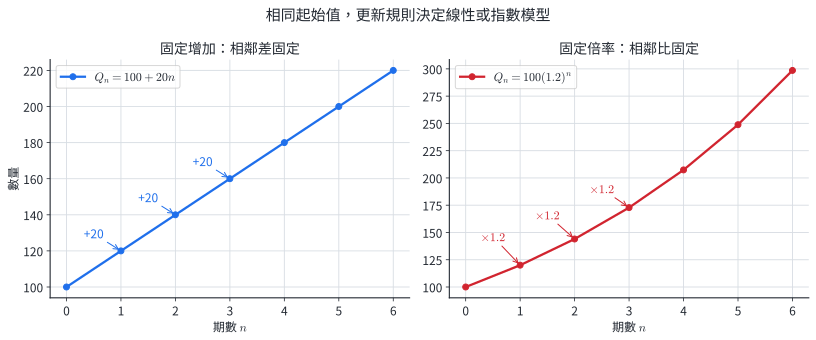{width=94%}

左圖相鄰點的高度差都是 $20$，對應線性模型 $100+20n$；右圖相鄰點的比值都是 $1.2$，對應指數模型 $100(1.2)^n$。資料中「差固定」與「比固定」是選擇模型的直接證據。

真實系統的倍率常會因資源不足、政策、溫度或個體差異而改變。指數模型適合倍率近似穩定的區間；超出該區間時，要用新資料重新估計參數。

## 1. 指數函數的定義

### 1.1 由固定倍率得到指數

設初值為 $Q_0$，每一期乘上固定倍率 $a$，則

$$
Q_1=Q_0a,\qquad Q_2=Q_0a^2,\qquad Q_n=Q_0a^n.
$$

當期數擴張為實數變數 $x$ 時，得到指數函數。**指數函數**定義為

$$
f(x)=a^x,\qquad a>0,\quad a\ne1.
$$

- $a>0$ 使任意實數指數都能穩定定義；例如 $a^{1/2}=\sqrt a$ 需要正的底數。
- $a\ne1$ 使函數會隨 $x$ 變化；$1^x$ 是恒等於 $1$ 的常數函數。
- 定義域是所有實數，值域是所有正實數。

指數律

$$
a^{u+v}=a^ua^v,\qquad a^{u-v}=\frac{a^u}{a^v},\qquad (a^u)^v=a^{uv}
$$

是固定倍率能夠跨過多個時間間隔的代數基礎。

::: example
### 例 1｜將百分率轉成更新倍率

一個培養璿初有 $400$ 個菌落，每小時增加 $15\%$。每小時更新倍率是 $1+0.15=1.15$，因此

$$
N_n=400(1.15)^n.
$$

$3$ 小時後

$$
N_3=400(1.15)^3=608.35,
$$

若以完整個數記錄，約為 $608$ 個菌落。
:::

::: example
### 例 2｜由隔期資料反求倍率與初值

一組資料符合 $Q_n=Q_0a^n$，且 $Q_2=360$、$Q_5=1215$。兩式相除：

$$
\frac{Q_5}{Q_2}=a^3=\frac{1215}{360}=3.375=1.5^3.
$$

由 $a>0$ 得 $a=1.5$，再代回：

$$
Q_0=\frac{360}{1.5^2}=160.
$$

所以 $Q_n=160(1.5)^n$。
:::

### 1.2 分節練習

1. 在 $a=-2,\dfrac13,1,\sqrt5$ 中，選出可作為指數函數 $f(x)=a^x$ 底數的數。
2. 設 $f(x)=4^x$，求 $f(-2)$、$f(1/2)$ 與 $f(0)$。
3. 某量的資料依序為 $250,300,360,432$。若每期倍率固定，寫出以第一個數據為 $Q_0$ 的模型。
4. 一份材料的性能初值為 $920$ 單位，每年保留前一年的 $82\%$。寫出 $t$ 年後的模型，並求 $3$ 年後的預測值。

### 1.3 分節練習解析

1. 底數需滿足 $a>0$ 且 $a\ne1$，所以可選 $\dfrac13$ 與 $\sqrt5$。
2. $f(-2)=1/16$、$f(1/2)=2$、$f(0)=1$。
3. 相鄰比值均為 $1.2$，因此 $Q_n=250(1.2)^n$。
4.
   $$
   Q(t)=920(0.82)^t,\qquad Q(3)=920(0.82)^3\approx507.2.
   $$
   預測值約為 $507$ 單位，且低於初值，與保留率小於 $1$ 一致。

固定百分率變化會固定每期倍率，因此常用於短期人口、價格指數、折舊與設備效率模型。

## 2. 指數函數的圖形與特徵

### 2.1 底數決定增減

對 $f(x)=a^x$、$a>0$且 $a\ne1$：

- 圖形經過 $(0,1)$，因為 $a^0=1$。
- 值域為 $(0,\infty)$，直線 $y=0$ 是水平漸近線。
- $a>1$ 時，$x$ 每增加 $1$，函數值乘上 $a>1$，所以函數遞增。
- $0<a<1$ 時，$x$ 每增加 $1$，函數值乘上小於 $1$ 的正數，所以函數遞減。

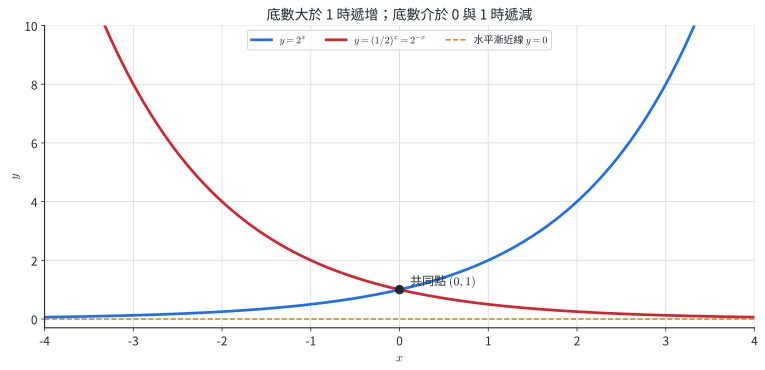{width=90%}

圖中 $y=2^x$ 與 $y=(1/2)^x=2^{-x}$ 在 $x=0$ 時都通過 $(0,1)$，且兩圖關於 $y$ 軸對稱。虛線 $y=0$ 表示函數值可以任意接近 $0$，但仍保持為正。

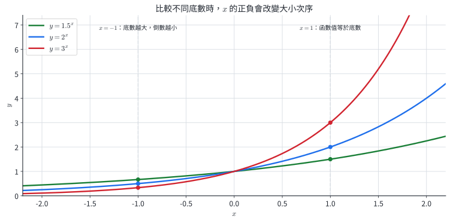{width=90%}

在 $x=1$ 時，底數越大函數值越大；在 $x=-1$ 時，$a^{-1}=1/a$，大小次序因取倒數而反轉。

### 2.2 指數方程式與不等式

當兩邊能改寫成相同底數時，利用單調性：

$$
a^u=a^v\Longleftrightarrow u=v.
$$

$$
\begin{aligned}
a>1 &: \quad a^u>a^v\Longleftrightarrow u>v,\\
0<a<1 &: \quad a^u>a^v\Longleftrightarrow u<v.
\end{aligned}
$$

若式子同時含有 $a^{2x}$ 與 $a^x$，令 $t=a^x>0$，就能化為關於 $t$ 的二次式。

::: example
### 例 3｜比較指數數的大小

底數 $1.7>1$，函數 $1.7^x$ 遞增。由 $-0.4<1.2$，可得

$$
1.7^{-0.4}<1.7^{1.2}.
$$

若底數改為 $0.4$，函數遞減，同一組指數得 $0.4^{-0.4}>0.4^{1.2}$。
:::

::: example
### 例 4｜將指數方程式化為同底

解 $3^{2x-1}=27$。由 $27=3^3$，且 $3^x$ 一對一，得

$$
2x-1=3,\qquad x=2.
$$

代回左邊得 $3^3=27$，符合原式。
:::

::: example
### 例 5｜以換元求指數方程式

解 $4^x-5\cdot2^x+4=0$。令 $t=2^x>0$，則 $4^x=t^2$：

$$
t^2-5t+4=(t-1)(t-4)=0.
$$

$t=1,4$ 皆為正，分別得 $x=0,2$。

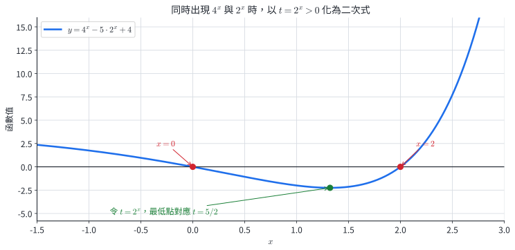{width=88%}

圖上兩個 $x$ 軸交點正是 $x=0,2$；圖中最低點對應 $t=2^x=5/2$，也與二次式的對稱軸一致。
:::

::: example
### 例 6｜底數小於 1 的指數不等式

解 $\left(\dfrac12\right)^{x-1}\ge8$。將 $8$ 改寫為 $\left(\dfrac12\right)^{-3}$。因底數介於 $0$ 與 $1$，函數遞減：

$$
x-1\le-3,\qquad x\le-2.
$$
:::

### 2.3 分節練習

1. 寫出 $y=5^x$ 的定義域、值域、通過的固定點與增減性。
2. 比較 $2.3^{-1.4}$ 與 $2.3^{-0.6}$，再比較 $0.3^{-1.4}$ 與 $0.3^{-0.6}$。
3. 解 $5^{3x+1}=125^{x-1}$。
4. 解 $9^x-10\cdot3^x+9=0$。
5. 解 $4^{2x-1}<8^{x+1}$。

### 2.4 分節練習解析

1. 定義域為 $\mathbb R$，值域為 $(0,\infty)$，通過 $(0,1)$，且在整個定義域遞增。
2. $2.3^x$ 遞增，所以 $2.3^{-1.4}<2.3^{-0.6}$；$0.3^x$ 遞減，所以 $0.3^{-1.4}>0.3^{-0.6}$。
3. $125=5^3$，得 $3x+1=3x-3$，這導致 $1=-3$，故無實數解。
4. 令 $t=3^x>0$，得 $(t-1)(t-9)=0$，因此 $x=0,2$。
5. 改寫成 $2^{4x-2}<2^{3x+3}$。因 $2^x$ 遞增，得 $4x-2<3x+3$，所以 $x<5$。

指數圖形把「倍率」轉成「高度」。圖形增減、與水平線的交點和是否超過門檻，都能直接對應方程式或不等式。

## 3. 指數的應用：成長、衰退、單利與複利

### 3.1 固定時間間隔的模型

設初值為 $Q_0$，每 $h$ 單位時間乘上 $b$，經過 $t$ 單位時間時，相當於經過 $t/h$ 個間隔：

$$
Q(t)=Q_0b^{t/h}.
$$

- 每期成長率為 $r$ 時，$b=1+r>1$。
- 每期衰退率為 $r$ 時，$b=1-r$，且 $0<b<1$。
- 半衰期為 $h$ 時，$b=1/2$，所以 $Q(t)=Q_0(1/2)^{t/h}$。

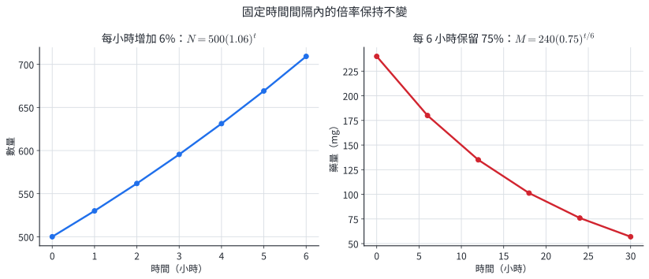{width=94%}

左圖每相隔 $1$ 小時的比值為 $1.06$；右圖每相隔 $6$ 小時的比值為 $0.75$。時間單位與倍率的間隔需配對，所以右圖指數是 $t/6$。

### 3.2 單利與複利

本金為 $P$，每期利率為 $r$，經過 $n$ 期：

- **單利**每期只以原本金計息，每期增加固定金額 $Pr$：$A=P(1+nr)$。
- **複利**每期將當期本利和作為下期本金，每期乘上 $1+r$：$A=P(1+r)^n$。

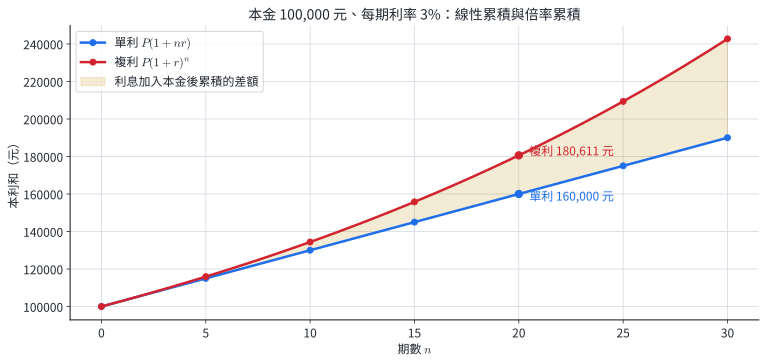{width=90%}

圖中兩模型起於同一本金。單利每年增加同一金額，圖形是直線；複利的利息也進入下一期本金，所以差距會隨時間擴大。

::: example
### 例 7｜每小時成長的菌落

菌落初始數為 $500$，每小時增加 $6\%$。在環境與資源近似不變的前 $8$ 小時，模型為

$$
N(t)=500(1.06)^t,\qquad0\le t\le8.
$$

$$
N(6)=500(1.06)^6\approx709.3.
$$

所以 $6$ 小時後預測約 $709$ 個菌落。式中的時間區間記錄模型所依據的環境條件。
:::

::: example
### 例 8｜不同時間單位的藥物保留率

人體中某藥物初始量為 $240\text{ mg}$，每 $6$ 小時保留 $75\%$。$24$ 小時包含 $4$ 個間隔，因此

$$
M(24)=240(0.75)^4=75.9375\text{ mg}.
$$

預測約為 $75.9\text{ mg}$，為正且小於初始量，與保留率一致。
:::

::: example
### 例 9｜單利與複利的數值差異

本金 $100{,}000$ 元，年利率 $3\%$，比較 $10$ 年單利與每年複利的本利和。

$$
A_s=100000(1+10\times0.03)=130000,
$$

$$
A_c=100000(1.03)^{10}\approx134391.64.
$$

複利多出約 $4391.64$ 元，這部分來自過去利息在後續期間繼續生息。
:::

::: example
### 例 10｜一年複利多次的模型

投資 $80{,}000$ 元，名義年利率 $4\%$，每半年複利一次。每期利率為 $0.04/2=0.02$，$5$ 年共 $10$ 期，所以

$$
A=80000(1.02)^{10}\approx97519.55.
$$

本利和約為 $97{,}520$ 元。
:::

### 3.3 分節練習

1. 某城市人口為 $80{,}000$，短期內每年增加 $1.8\%$。寫出模型並估計 $5$ 年後人口。
2. 某同位素半衰期為 $12$ 年，初始質量 $64\text{ g}$。求 $30$ 年後質量。
3. 一種藥物初始量為 $300\text{ mg}$，$4$ 小時後為 $210\text{ mg}$。若每 $4$ 小時保留率固定，求 $12$ 小時後的量。
4. 本金 $50{,}000$ 元以年利率 $2.4\%$ 計息，求 $8$ 年單利本利和。
5. 本金 $120{,}000$ 元，名義年利率 $3.6\%$，每季複利。求 $6$ 年後本利和。
6. 一種植物在溫室前 $10$ 天呈固定倍率成長，第 $0,2,4$ 天高度為 $5,7.2,10.368\text{ cm}$。建立模型，並說明將它用來預測第 $100$ 天時需要哪一類額外證據。

### 3.4 分節練習解析

1. $P(t)=80000(1.018)^t$，且 $P(5)\approx87464$，約 $87{,}464$ 人。
2. $M(t)=64(1/2)^{t/12}$，所以 $M(30)=64(1/2)^{2.5}\approx11.31\text{ g}$。
3. 每 $4$ 小時保留率為 $0.7$，所以 $M(12)=300(0.7)^3=102.9\text{ mg}$。
4. $A=50000(1+8\times0.024)=59600$ 元。
5. 每季利率為 $0.009$，總期數為 $24$，所以 $A=120000(1.009)^{24}\approx148788.46$ 元。
6. 每 $2$ 天倍率均為 $1.44$，故 $H(t)=5(1.44)^{t/2}$，$0\le t\le10$。要外推到第 $100$ 天，需要長期資料證明光照、水分、空間與植物成熟後的成長倍率仍近似不變。

## 4. 常用對數的定義與性質

### 4.1 對數是所需的指數

**常用對數**以 $10$ 為底，寫作 $\log x$：

$$
10^y=x\Longleftrightarrow y=\log x,\qquad x>0.
$$

例如 $10^3=1000$，所以 $\log1000=3$；$10^{-2}=0.01$，所以 $\log0.01=-2$。真數 $x$ 必須為正，這來自 $10^y$ 的值域 $(0,\infty)$。

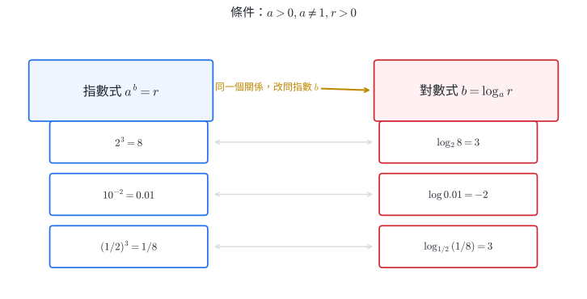{width=88%}

圖中每一列都在說同一件事：左側提供底數、指數與結果，右側把結果放進對數，取回原來的指數。

### 4.2 對數律與推導

對正數 $M,N$ 與實數 $r$：

$$
\log(MN)=\log M+\log N,\qquad
\log\frac{M}{N}=\log M-\log N,\qquad
\log(M^r)=r\log M.
$$

令 $u=\log M$、$v=\log N$，則 $M=10^u$、$N=10^v$，所以

$$
MN=10^u10^v=10^{u+v}.
$$

由定義得 $\log(MN)=u+v=\log M+\log N$。商法律與冪法律同樣來自指數律。

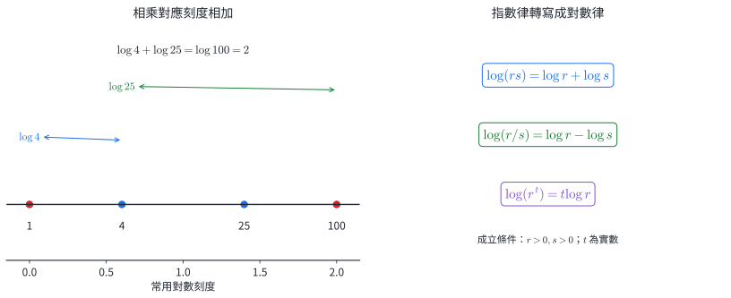{width=90%}

圖中數量從 $1$ 乘上 $10$ 到 $10$，再乘上 $10$ 到 $100$；取常用對數後，座標從 $0$ 加 $1$ 到 $1$，再加 $1$ 到 $2$。

::: example
### 例 11｜從指數值讀出常用對數

由 $100000=10^5$、$0.001=10^{-3}$、$\sqrt{10}=10^{1/2}$，得

$$
\log100000=5,\qquad \log0.001=-3,\qquad \log\sqrt{10}=\frac12.
$$
:::

::: example
### 例 12｜用對數律合併運算

已知 $\log2\approx0.3010$、$\log3\approx0.4771$，求 $\log72$。因 $72=2^3\cdot3^2$，所以

$$
\log72=3\log2+2\log3\approx1.8572.
$$

$10<72<100$，所以 $1<\log72<2$，結果位於合理區間。
:::

::: example
### 例 13｜用科學記號讀取數量級

設 $x=4.7\times10^6$，則

$$
\log x=\log4.7+6.
$$

因 $1<4.7<10$，有 $0<\log4.7<1$，所以 $6<\log x<7$。這表示 $x$ 位於 $10^6$ 與 $10^7$ 之間，也就是七位數。
:::

### 4.3 分節練習

1. 求 $\log10^7$、$\log10^{-4}$ 與 $\log\sqrt[3]{100}$。
2. 將 $\log5+\log8-\log2$ 合併成一個對數並求值。
3. 已知 $\log2\approx0.3010$，求 $\log40$、$\log0.08$。
4. 化簡 $2\log3+\dfrac12\log16-\log12$。
5. 設 $x=7.2\times10^{-5}$，寫出 $\log x$ 與 $\log7.2$ 的關係，並判斷 $\log x$ 介於哪兩個相鄰整數之間。

### 4.4 分節練習解析

1. $\log10^7=7$、$\log10^{-4}=-4$、$\log\sqrt[3]{100}=2/3$。
2. $\log5+\log8-\log2=\log20=1+\log2\approx1.3010$。
3. $\log40=2\log2+1\approx1.6020$；$\log0.08=3\log2-2\approx-1.0970$。
4.
   $$
   2\log3+\frac12\log16-\log12
   =\log\frac{3^2\sqrt{16}}{12}=\log3.
   $$
5. $\log x=\log7.2-5$。因 $0<\log7.2<1$，所以 $-5<\log x<-4$。

對數律把乘法、除法與冪次轉成加法、減法與倍數，這是對數可以壓縮尺度、線性化指數資料的原因。

## 5. 一般對數、換底與計算

### 5.1 一般對數的定義

設

$$
a>0,\qquad a\ne1,\qquad r>0.
$$

若 $a^b=r$，則定義

$$
b=\log_a r.
$$

底數 $a$ 決定用哪一組指數刻度，真數 $r$ 是指數函數的正值，對數值 $b$ 是從底數到真數所需的指數。特別地，

$$
\log_a1=0,\qquad \log_aa=1.
$$

一般對數也滿足乘法、商與冪的對數律，條件同樣是各真數為正。

### 5.2 換底公式

令 $x=\log_a r$，則 $a^x=r$。對等式兩邊取以 $c$ 為底的對數：

$$
x\log_c a=\log_c r.
$$

因此

$$
\boxed{\log_a r=\frac{\log_c r}{\log_c a}},
$$

其中 $c>0$、$c\ne1$。電子計算器通常提供 $\log$ 與 $\ln$，換底公式讓任意底數的對數都能使用這兩個鍵計算。

::: example
### 例 14｜在指數形式與對數形式間轉換

由 $3^4=81$，得

$$
\log_3 81=4.
$$

由 $2^{-3}=1/8$，得

$$
\log_2\frac18=-3.
$$

反向地，$\log_5 125=3$ 與 $5^3=125$ 是同一個數量關係的兩種寫法。
:::

::: example
### 例 15｜用換底公式計算任意底數

求 $\log_8 20$。取常用對數換底：

$$
\log_8 20=\frac{\log20}{\log8}\approx1.4406.
$$

因 $8^1<20<8^2$，故答案介於 $1$ 與 $2$ 之間，與計算值一致。
:::

::: example
### 例 16｜對數求解無法化成同底的指數方程式

解 $5^x=17$。兩邊取常用對數：

$$
\log(5^x)=\log17,\qquad x\log5=\log17.
$$

因此

$$
x=\frac{\log17}{\log5}=\log_5 17\approx1.7604.
$$

$5^1<17<5^2$，所以 $1<x<2$，對應原函數的遞增性。
:::

### 5.3 分節練習

1. 求 $\log_2 32$、$\log_3(1/27)$、$\log_{1/2}8$。
2. 將 $7^{-2}=1/49$ 寫成對數形式，並將 $\log_4 64=3$ 寫成指數形式。
3. 用換底公式求 $\log_7 30$，答案取到小數點後四位。
4. 化簡 $(\log_2 3)(\log_3 5)(\log_5 16)$。
5. 解 $7^{2x-1}=20$，以對數表示精確解，再求近似值。

### 5.4 分節練習解析

1.
   $$
   \log_2 32=5,\qquad \log_3\frac1{27}=-3,\qquad
   \log_{1/2}8=-3.
   $$
2. $7^{-2}=1/49$ 可寫為 $\log_7(1/49)=-2$；$\log_4 64=3$ 可寫為 $4^3=64$。
3.
   $$
   \log_7 30=\frac{\log30}{\log7}\approx1.7479.
   $$
   $7^1<30<7^2$，所以近似值介於 $1$ 與 $2$。
4. 以換底公式約分：
   $$
   \frac{\log3}{\log2}\cdot\frac{\log5}{\log3}\cdot
   \frac{\log16}{\log5}
   =\frac{\log16}{\log2}=\log_2 16=4.
   $$
5.
   $$
   (2x-1)\log7=\log20,\qquad
   x=\frac12\left(1+\frac{\log20}{\log7}\right)\approx1.2698.
   $$

換底公式把對數定義轉成可計算的比值。它用於反求成長時間、半衰期、未知利率與任意底數的尺度。

## 6. 對數的應用：時間、自然底數與對數尺度

### 6.1 反求時間與 72 法則

對成長模型 $Q(t)=Q_0a^t$，若要找到達成目標 $Q_*$ 的時間，由

$$
Q_0a^t=Q_*
$$

取對數得

$$
t=\frac{\log(Q_*/Q_0)}{\log a}.
$$

年成長率為 $p\%$ 時，翻倍時間的精確模型是

$$
T=\frac{\log2}{\log(1+p/100)}.
$$

當 $p$ 位於常見的單位數百分率區間時，$T\approx72/p$ 是便於心算的近似，精確值仍由上式決定。

::: example
### 例 17｜翻倍時間與 72 法則

年複合成長率為 $6\%$。精確翻倍時間為

$$
T=\frac{\log2}{\log1.06}\approx11.90\text{ 年}.
$$

$72/6=12$ 年，與精確模型相差約 $0.10$ 年，適合用來快速估計。
:::

### 6.2 複利頻率與自然底數 $e$

本金 $1$ 元、年利率 $100\%$，一年複利 $n$ 次時，年底金額為

$$
\left(1+\frac1n\right)^n.
$$

當複利次數 $n$ 不斷增加，這串數越來越接近一個常數：

$$
e=\lim_{n\to\infty}\left(1+\frac1n\right)^n\approx2.71828.
$$

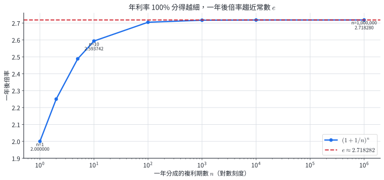{width=90%}

圖中點列隨 $n$ 增加而接近水平線 $y=e$。以 $e$ 為底的對數稱為**自然對數**，記作

$$
\ln x=\log_e x,\qquad x>0.
$$

連續成長率為 $r$ 、時間為 $t$ 時，模型常寫成 $Q(t)=Q_0e^{rt}$。

::: example
### 例 18｜連續複利

本金 $50{,}000$ 元以年利率 $2.5\%$ 連續複利 $6$ 年，則

$$
A=50000e^{0.025\times6}
=50000e^{0.15}\approx58091.71.
$$

本利和約為 $58{,}092$ 元。
:::

### 6.3 分貝、pH 與地震規模

對數尺度適合數值橫跨多個數量級、且倍數差比絕對差更有意義的量。

- 聲強級：$D=10\log(I/I_0)$ 分貝，$I>0$。
- 酸鹼值：$\mathrm{pH}=-\log[\mathrm H^+]$，$[\mathrm H^+]>0$，濃度以 $\mathrm{mol/L}$ 計。
- 地震能量與規模的常用模型：$\log E=11.8+1.5M$，其中 $E$ 以爾格計。

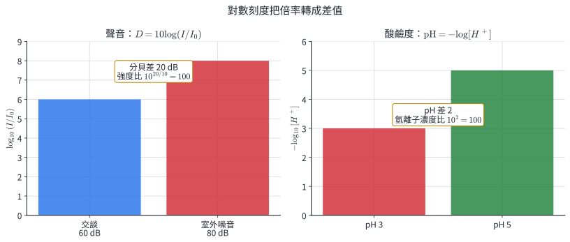{width=94%}

圖中聲強比每乘 $10$，分貝增加 $10$；氫離子濃度每乘 $10$，pH 減少 $1$。符號差異來自 pH 定義前的負號。

::: example
### 例 19｜分貝差轉回聲強倍率

兩聲音的聲強分別為 $I_1,I_2$，聲強級相差 $30$ 分貝。由

$$
30=10\log\frac{I_2}{I_1}
$$

得

$$
\log\frac{I_2}{I_1}=3,\qquad
\frac{I_2}{I_1}=10^3=1000.
$$

所以聲強是 $1000$ 倍，而分貝只增加 $30$。
:::

::: example
### 例 20｜pH 由濃度決定

某溶液 $[\mathrm H^+]=3.2\times10^{-5}\mathrm{\ mol/L}$，則

$$
\mathrm{pH}=-\log(3.2\times10^{-5})
=5-\log3.2\approx4.495.
$$

氫離子濃度位於 $10^{-5}$ 與 $10^{-4}$ 之間，所以 pH 位於 $4$ 與 $5$ 之間。
:::

::: example
### 例 21｜用對數反求衰退至門檻的時間

某物質初值 $500$，每 $4$ 小時保留 $80\%$。求連續時間模型下首次低於 $100$ 的時間。

$$
500(0.8)^{t/4}<100
\Longleftrightarrow (0.8)^{t/4}<0.2.
$$

取對數，由 $\log0.8<0$ 可得

$$
\frac t4>\frac{\log0.2}{\log0.8},\qquad
t>\frac{4\log0.2}{\log0.8}\approx28.85.
$$

所以約在 $28.85$ 小時後低於門檻；若只在每 $4$ 小時量測，第一次觀測到低於門檻是 $32$ 小時。
:::

### 6.4 分節練習

1. 年複合成長率為 $8\%$時，求精確翻倍時間，再與 72 法則比較。
2. 本金 $30{,}000$ 元以年利率 $3\%$ 連續複利 $4$ 年，求本利和。
3. 兩聲音相差 $50$ 分貝，求聲強倍率。
4. A 溶液的 pH 為 $3.1$，B 溶液的 pH 為 $5.4$。求 A 與 B 的氫離子濃度比。
5. 根據 $\log E=11.8+1.5M$，比較規模 $7.0$ 與 $5.5$ 的地震能量比。
6. 菌落初始數為 $150$，每小時增加 $12\%$。在倍率穩定的模型中，求菌落數首次超過 $500$ 的連續時間；若只整點觀測，第幾小時首次記錄到超過 $500$？

### 6.5 分節練習解析

1.
   $$
   T=\frac{\log2}{\log1.08}\approx9.006\text{ 年}.
   $$
   72 法則給出 $72/8=9$ 年，與精確值相差約 $0.006$ 年。
2.
   $$
   A=30000e^{0.03\times4}=30000e^{0.12}\approx33824.91元.
   $$
3. $50=10\log(I_2/I_1)$，所以 $I_2/I_1=10^5=100000$。
4.
   $$
   \frac{[\mathrm H^+]_A}{[\mathrm H^+]_B}
   =\frac{10^{-3.1}}{10^{-5.4}}=10^{2.3}\approx199.5.
   $$
5. 兩式相減得
   $$
   \log\frac{E_{7.0}}{E_{5.5}}=1.5(7.0-5.5)=2.25,
   $$
   故 $E_{7.0}/E_{5.5}=10^{2.25}\approx177.8$。
6.
   $$
   150(1.12)^t>500
   \Longleftrightarrow
   t>\frac{\log(10/3)}{\log1.12}\approx10.62.
   $$
   連續模型在約 $10.62$ 小時越過門檻；整點觀測首次記錄到超過 $500$ 是第 $11$ 小時。

對數尺度保留倍率資訊：原量乘上固定倍率，對數尺度就增加固定數值。這個機制讓聲強、濃度與地震能量的巨大範圍可以用較短的刻度比較。

## 7. 對數函數的圖形與特徵

### 7.1 定義域、值域與增減

對數函數定義為

$$
f(x)=\log_a x,\qquad a>0,\quad a\ne1,\quad x>0.
$$

它的定義域是 $(0,\infty)$，值域是 $\mathbb R$，且通過 $(1,0)$。由於真數可以從右側任意接近 $0$，直線 $x=0$ 是鉛直漸近線。

對數函數的增減與同底數的指數函數一致：

- $a>1$ 時，$\log_a x$ 遞增。
- $0<a<1$ 時，$\log_a x$ 遞減。

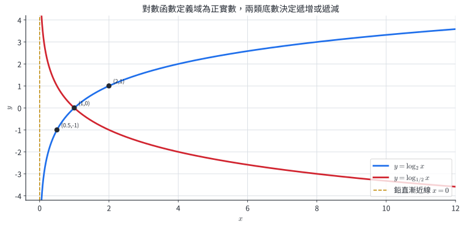{width=90%}

圖中 $y=\log_2x$ 通過 $(1,0)$、$(2,1)$ 與 $(1/2,-1)$；$y=\log_{1/2}x=-\log_2x$ 與它關於 $x$ 軸對稱。兩條曲線都只在 $x>0$ 出現。

### 7.2 對數方程式與不等式

處理含對數的方程式時，先由每個真數列出正數條件，再使用對數律或單調性化簡。得到代數候選值後，以原來每個真數的條件篩選。

對 $u,v>0$：

$$
\log_a u=\log_a v\Longleftrightarrow u=v.
$$

不等式由增減性決定：

$$
\begin{aligned}
a>1 &: \quad \log_a u>\log_a v\Longleftrightarrow u>v,\\
0<a<1 &: \quad \log_a u>\log_a v\Longleftrightarrow u<v.
\end{aligned}
$$

::: example
### 例 22｜由底數讀圖形特徵

對 $f(x)=\log_{1/3}x$：

- 定義域為 $(0,\infty)$，值域為 $\mathbb R$。
- 通過 $(1,0)$。
- 因 $0<1/3<1$，函數遞減。
- $\log_{1/3}(1/3)=1$，$\log_{1/3}3=-1$，所以還通過 $(1/3,1)$ 與 $(3,-1)$。
- $x=0$ 是鉛直漸近線。

這些代數點和增減性已能確定圖形的主要形狀。
:::

::: example
### 例 23｜對數方程式的真數條件

解

$$
\log_2(x-1)+\log_2(x-3)=3.
$$

真數條件為 $x-1>0$ 且 $x-3>0$，合併得 $x>3$。利用乘法律：

$$
\log_2[(x-1)(x-3)]=3,
$$

$$
(x-1)(x-3)=2^3=8.
$$

展開得 $x^2-4x-5=0$，候選值為 $x=5,-1$。條件 $x>3$ 保留 $x=5$。
:::

::: example
### 例 24｜底數小於 1 的對數不等式

解

$$
\log_{1/3}(2x-1)>-1.
$$

真數條件給出 $x>1/2$。又

$$
-1=\log_{1/3}3.
$$

因 $\log_{1/3}x$ 遞減，所以

$$
2x-1<3,\qquad x<2.
$$

與定義域取交集，得

$$
\frac12<x<2.
$$
:::

::: example
### 例 25｜圖解、代數解與定義域一致

解

$$
\log(x-1)+\log(2x+1)=\log20.
$$

原真數條件為 $x>1$ 與 $x>-1/2$，合併為 $x>1$。因此

$$
(x-1)(2x+1)=20,
$$

$$
2x^2-x-21=0,\qquad (2x-7)(x+3)=0.
$$

候選值為 $x=7/2,-3$，保留 $x=7/2$。

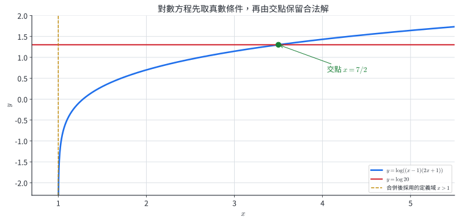{width=90%}

圖中只在 $x>1$ 畫出合併後的對數式，與水平線 $y=\log20$ 的交點橫座標是 $7/2$，與代數篩選結果相同。
:::

### 7.3 分節練習

1. 寫出 $y=\log_5x$ 的定義域、值域、漸近線、通過的固定點與增減性。
2. 列出 $y=\log_{1/4}x$ 在 $x=1/4,1,4$ 時的座標，並指出圖形的增減性。
3. 解 $\log_3(x-2)=2$。
4. 解 $\log_2x+\log_2(x-2)=3$。
5. 解 $\log_{1/2}(x+1)\le-2$。

### 7.4 分節練習解析

1. 定義域 $(0,\infty)$，值域 $\mathbb R$，鉛直漸近線 $x=0$，通過 $(1,0)$；因 $5>1$，函數遞增。
2.
   $$
   \log_{1/4}\frac14=1,\qquad \log_{1/4}1=0,\qquad
   \log_{1/4}4=-1.
   $$
   對應點為 $(1/4,1)$、$(1,0)$、$(4,-1)$，圖形遞減。
3. 真數條件 $x>2$。由 $x-2=3^2=9$，得 $x=11$，符合條件。
4. 真數條件 $x>2$。合併得 $x(x-2)=8$，即 $x^2-2x-8=0$，候選值 $4,-2$。保留 $x=4$。
5. 真數條件 $x>-1$。又 $-2=\log_{1/2}4$，函數遞減，所以 $x+1\ge4$，得 $x\ge3$。這些值全部符合定義域。

對數函數的圖形能將「已知倍率，反求指數」視覺化。橫線與對數圖的交點可讀出門檻時間，定義域則對應原始量必須為正。

## 8. 指數函數與對數函數的關係

### 8.1 互換輸入與輸出

指數關係

$$
y=a^x
$$

等價於

$$
x=\log_a y.
$$

互換變數名稱得 $y=\log_a x$。因此 $f(x)=a^x$ 與 $f^{-1}(x)=\log_a x$ 互為反函數。若 $(u,v)$ 在 $y=a^x$ 上，則 $(v,u)$ 在 $y=\log_a x$ 上；座標互換對應關於 $y=x$ 鏡射。

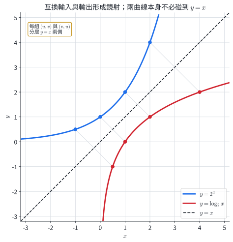{width=84%}

圖中 $(-1,1/2)$、$(0,1)$、$(1,2)$、$(2,4)$ 在 $y=2^x$ 上，互換座標後的四點在 $y=\log_2x$ 上。連接每對點的線段都垂直於 $y=x$，中點落在 $y=x$ 上。

鏡射關係描述成對點；兩條曲線是否與 $y=x$ 相交，另由 $2^x=x$ 決定。以三個區間可驗證 $2^x>x$：

1. $x<0$ 時，$2^x>0>x$。
2. $0\le x<1$ 時，$2^x\ge1>x$；$x=1$ 時，$2^1=2>1$。
3. $x>1$ 時，取正整數 $n$ 使 $n\le x<n+1$。由 $2^x$ 遞增且 $2^n\ge n+1$（可以數學歸納法驗證），得
   $$
   2^x\ge2^n\ge n+1>x.
   $$

因此方程式 $2^x=x$ 無解；$y=2^x$、$y=\log_2x$ 與鏡面 $y=x$ 都沒有交點。圖中的間隔是代數不等式的精確結果。

::: example
### 例 26｜由指數圖上的點得到對數圖上的點

因 $3^{-2}=1/9$、$3^1=3$，所以指數圖 $y=3^x$ 上有點

$$
\left(-2,\frac19\right),\qquad(1,3).
$$

互換座標後，對數圖 $y=\log_3x$ 上有點

$$
\left(\frac19,-2\right),\qquad(3,1).
$$
:::

::: example
### 例 27｜平移後的反函數

設

$$
f(x)=3^{x-2}+1.
$$

令 $y=3^{x-2}+1$，互換 $x,y$：

$$
x=3^{y-2}+1.
$$

由 $x-1=3^{y-2}$ 得

$$
\log_3(x-1)=y-2,\qquad
f^{-1}(x)=2+\log_3(x-1).
$$

反函數的定義域 $x>1$ 正是原函數值域 $(1,\infty)$。
:::

### 8.2 取對數後的直線資料

若資料符合

$$
Q(t)=Q_0a^t,\qquad Q_0>0,\quad a>0,\quad a\ne1,
$$

兩邊取常用對數：

$$
\log Q=\log Q_0+t\log a.
$$

以 $t$ 為橫軸、$\log Q$ 為縱軸時，得到直線，截距是 $\log Q_0$，斜率是 $\log a$。斜率為正對應 $a>1$，斜率為負對應 $0<a<1$。

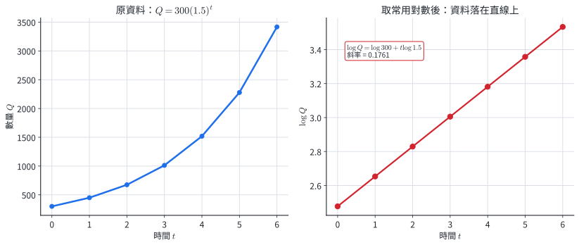{width=94%}

左圖資料符合 $Q=300(1.5)^t$；右圖的每個點縱座標改為 $\log Q$，所有點落在

$$
\log Q=\log300+t\log1.5
$$

上。圖中斜率約 $0.1761$，和數值計算 $\log1.5$ 一致。

::: example
### 例 28｜由對數直線回復指數模型

某資料取常用對數後滿足

$$
\log Q=2.3010+0.07918t.
$$

由 $2.3010\approx\log200$、$0.07918\approx\log1.2$，得

$$
\log Q=\log200+t\log1.2
=\log[200(1.2)^t].
$$

因此

$$
Q=200(1.2)^t.
$$

截距回復初值 $200$，斜率回復每期倍率 $1.2$。
:::

### 8.3 分節練習

1. 寫出 $f(x)=5^x$ 的反函數，並說明兩函數的定義域與值域如何互換。
2. 已知 $(2,9)$ 在 $y=3^x$ 上。寫出對應在 $y=\log_3x$ 上的點，並求兩點中點。
3. 對 $y=2^x$ 與 $y=\log_2x$，說明為何鏡射對應不會強制兩曲線通過 $y=x$，並將實數分成 $x<0$、$0\le x\le1$、$x>1$ 驗證交點數。
4. 求 $f(x)=2^{x+1}-3$ 的反函數與定義域。
5. 某資料在 $t=0,1,2$ 時依序為 $200,260,338$。若固定倍率模型成立，寫出 $Q(t)$ 與 $\log Q$ 的直線形式，並求連續時間下 $Q$ 達到 $1000$ 的時間。

### 8.4 分節練習解析

1. $f^{-1}(x)=\log_5x$。$5^x$ 的定義域 $\mathbb R$ 成為反函數的值域；$5^x$ 的值域 $(0,\infty)$ 成為反函數的定義域。
2. 互換座標得 $(9,2)$。兩點中點為 $(11/2,11/2)$，位於 $y=x$。
3. 鏡射規則是 $(u,v)\leftrightarrow(v,u)$，是成對點的對應。交點需另滿足 $2^x=x$。$x<0$ 時 $2^x>0>x$；$0\le x<1$ 時 $2^x\ge1>x$，$x=1$ 時 $2>1$；$x>1$ 時取 $n\le x<n+1$，利用 $2^n\ge n+1$ 得 $2^x\ge2^n\ge n+1>x$。所有區間都有 $2^x>x$，所以交點數為 $0$。
4. 令 $y=2^{x+1}-3$，互換後得 $x+3=2^{y+1}$，所以
   $$
   f^{-1}(x)=\log_2(x+3)-1,\qquad x>-3.
   $$
5. 相鄰比值均為 $1.3$，所以
   $$
   Q(t)=200(1.3)^t,\qquad
   \log Q=\log200+t\log1.3.
   $$
   令 $Q=1000$：
   $$
   t=\frac{\log5}{\log1.3}\approx6.13.
   $$
   所以連續模型約在 $6.13$ 期達到 $1000$。

反函數將「由時間求數量」改成「由數量求時間」；取對數將指數曲線轉為直線。這兩個觀點共同支持資料判讀、參數估計與門檻時間預測。

## 9. 章末代表題

### 9.1 基礎與變式

1. 對指數函數 $f(x)=(1/5)^x$，寫出底數條件、定義域、值域、增減性，並求 $f(-2)$。
2. 某測量量連續四期為 $96,144,216,324$。檢查固定倍率，並寫出以第一筆為 $Q_0$ 的模型。
3. 解方程式 $2^{x+2}=16^{x-1}$。
4. 解不等式 $3^{2x}-10\cdot3^x+9\le0$。
5. 某物質初始質量為 $480\text{ g}$，半衰期為 $18$ 年。在此衰退模型下，求 $45$ 年後質量。
6. 本金 $160{,}000$ 元，名義年利率 $2.4\%$，每月複利。求 $3$ 年後本利和。
7. 化簡
   $$
   \log24+\log15-\log9-\log4.
   $$
8. 解方程式 $\log_4(x-1)=\log_2 3$。
9. 某量依 $Q(t)=900e^{0.04t}$ 連續成長。求翻倍時間。
10. 兩聲音的聲強級相差 $24$ 分貝。求強聲與弱聲的聲強比。
11. 對 $y=\log_2(x-3)+1$，寫出定義域、值域、鉛直漸近線、增減性，並找一個整數座標點。
12. 解不等式 $\log_{1/2}(x-1)\le-2$。

### 9.2 跨節整合

13. 某藻類在實驗前 $20$ 小時的資料如下：

    | $t$ （小時） | 0 | 4 | 8 |
    |---:|---:|---:|---:|
    | 數量 $Q$ | 120 | 180 | 270 |

    假設每 $4$ 小時倍率穩定：

    - (a) 建立連續時間模型。
    - (b) 求數量超過 $600$ 的連續時間門檻。
    - (c) 若只每 $4$ 小時記錄，首次超過 $600$ 的記錄時間為何？
    - (d) 寫出 $\log Q$ 對 $t$ 的直線式。

14. 將 $200{,}000$ 元存入年期存款，每季利率 $1.2\%$，利息每季加入本金。

    - (a) 寫出 $t$ 年後本利和 $A(t)$。
    - (b) 求本利和首次超過 $250{,}000$ 元的連續時間。
    - (c) 若銀行只在每季末計入利息，至少需要幾季？

15. 地震能量模型為 $\log E=11.8+1.5M$。A地震規模為 $6.8$，B地震規模為 $5.4$。

    - (a) 求兩地震的 $\log E$ 差。
    - (b) 求能量比 $E_A/E_B$。
    - (c) 用「規模差」與「能量倍率」說明對數尺度壓縮數值範圍的機制。

16. 某生物量資料為

    | $t$ （天） | 0 | 2 | 4 |
    |---:|---:|---:|---:|
    | $Q$ （單位） | 80 | 120 | 180 |

    假設每 $2$ 天倍率穩定：

    - (a) 建立 $Q(t)$。
    - (b) 寫出 $\log Q$ 對 $t$ 的直線，並指出斜率與截距。
    - (c) 求 $Q=300$ 的連續時間。
    - (d) 將點 $(2,120)$ 視為映射 $t\mapsto Q$的點，寫出反映射圖上的對應點，並解釋其單位意義。

## 10. 完整詳解

### 第 1 題

底數 $1/5$ 滿足 $a>0$ 且 $a\ne1$。定義域為 $\mathbb R$，值域為 $(0,\infty)$。由 $0<1/5<1$，函數遞減。

$$
f(-2)=\left(\frac15\right)^{-2}=25.
$$

### 第 2 題

相鄰比值為

$$
\frac{144}{96}=\frac{216}{144}=\frac{324}{216}=1.5.
$$

因此固定倍率是 $1.5$，模型為

$$
Q_n=96(1.5)^n.
$$

### 第 3 題

$16=2^4$，所以

$$
2^{x+2}=2^{4x-4}.
$$

由一對一性，$x+2=4x-4$，得

$$
x=2.
$$

代回時兩邊均為 $16$。

### 第 4 題

令 $u=3^x>0$，則

$$
u^2-10u+9=(u-1)(u-9)\le0.
$$

二次式在兩根之間非正，所以 $1\le u\le9$，也就是

$$
1\le3^x\le3^2.
$$

$3^x$ 遞增，故

$$
0\le x\le2.
$$

### 第 5 題

$45$ 年包含 $45/18=2.5$ 個半衰期，所以

$$
M(45)=480\left(\frac12\right)^{45/18}
=480\left(\frac12\right)^{2.5}
\approx84.85\text{ g}.
$$

結果為正且低於經過兩個半衰期時的 $120\text{ g}$，與衰退方向一致。

### 第 6 題

每月利率為 $0.024/12=0.002$，$3$ 年共 $36$ 期：

$$
A=160000(1.002)^{36}\approx171932.49.
$$

本利和約為 $171{,}932$ 元。

### 第 7 題

所有真數均為正，可合併：

$$
\log24+\log15-\log9-\log4
=\log\frac{24\cdot15}{9\cdot4}
=\log10=1.
$$

### 第 8 題

將右邊改寫為底數 $4$：

$$
\log_2 3=\frac{\log_4 3}{\log_4 2}=2\log_4 3=\log_4 9.
$$

因此

$$
\log_4(x-1)=\log_4 9,\qquad x-1=9,\qquad x=10.
$$

真數 $x-1=9>0$，符合定義域。

### 第 9 題

翻倍時 $T$ 滿足

$$
900e^{0.04T}=1800.
$$

約去初值並取自然對數：

$$
0.04T=\ln2,\qquad
T=\frac{\ln2}{0.04}\approx17.33.
$$

時間單位與模型中 $t$ 的單位相同。

### 第 10 題

令聲強比為 $R$，則

$$
24=10\log R,\qquad \log R=2.4.
$$

$$
R=10^{2.4}\approx251.2.
$$

所以強聲的聲強約是弱聲的 $251$ 倍。

### 第 11 題

真數條件 $x-3>0$ 給出定義域 $(3,\infty)$；值域仍為 $\mathbb R$；鉛直漸近線由 $x=0$ 向右平移 $3$，成為 $x=3$。底數 $2>1$，圖形遞增。取 $x=4$：

$$
y=\log_2(4-3)+1=1,
$$

所以 $(4,1)$ 是一個整數座標點。

### 第 12 題

真數條件為 $x>1$。又

$$
-2=\log_{1/2}4.
$$

因 $\log_{1/2}x$ 遞減，

$$
x-1\ge4,\qquad x\ge5.
$$

這個區間已包含在 $x>1$ 中，故解為 $[5,\infty)$。

### 第 13 題｜跨節整合

(a) 每 $4$ 小時的比值為

$$
\frac{180}{120}=\frac{270}{180}=1.5.
$$

連續時間模型為

$$
Q(t)=120(1.5)^{t/4}.
$$

(b) 求 $Q(t)>600$：

$$
120(1.5)^{t/4}>600
\Longleftrightarrow
(1.5)^{t/4}>5.
$$

由 $1.5>1$，取對數得

$$
t>\frac{4\log5}{\log1.5}\approx15.88.
$$

連續模型約在 $15.88$ 小時越過 $600$。

(c) 每 $4$ 小時記錄時，下一個記錄點是 $t=16$：

$$
Q(16)=120(1.5)^4=607.5>600.
$$

所以首次記錄到超過門檻是 $16$ 小時。

(d) 取常用對數：

$$
\log Q=\log120+\frac{t}{4}\log1.5.
$$

直線截距是 $\log120$，斜率是 $\log1.5/4$。

### 第 14 題｜跨節整合

(a) 每年 $4$ 季，$t$ 年共 $4t$ 期，所以

$$
A(t)=200000(1.012)^{4t}.
$$

(b) 求 $A(t)>250000$：

$$
(1.012)^{4t}>1.25.
$$

取對數得

$$
t>\frac{\log1.25}{4\log1.012}\approx4.677年.
$$

(c) 令季數為整數 $n$，條件為

$$
n>\frac{\log1.25}{\log1.012}\approx18.707.
$$

所以至少需要 $19$ 季。$19$ 季是 $4.75$ 年，與連續門檻 $4.677$ 年的先後關係一致。

### 第 15 題｜跨節整合

(a) 兩式相減時常數 $11.8$ 消去：

$$
\log E_A-\log E_B
=1.5(6.8-5.4)=2.1.
$$

(b) 用商的對數律：

$$
\log\frac{E_A}{E_B}=2.1,\qquad
\frac{E_A}{E_B}=10^{2.1}\approx125.9.
$$

A 地震釋放的能量約為 B 的 $126$ 倍。

(c) 規模只相差 $1.4$，對數能量差為 $2.1$，回到原能量尺度就是乘上 $10^{2.1}$。對數把原本的倍率 $125.9$ 轉成加法差 $2.1$，因此可以在短尺度上表示跨越多個數量級的能量。

### 第 16 題｜跨節整合

(a) 每 $2$ 天的比值為

$$
\frac{120}{80}=\frac{180}{120}=1.5.
$$

因此

$$
Q(t)=80(1.5)^{t/2}.
$$

(b) 取常用對數：

$$
\log Q=\log80+\frac{\log1.5}{2}t.
$$

截距是 $\log80$，斜率是 $\log1.5/2$。斜率為正，對應原數據成長。

(c) 令 $Q=300$：

$$
80(1.5)^{t/2}=300,\qquad
(1.5)^{t/2}=3.75.
$$

$$
t=\frac{2\log3.75}{\log1.5}\approx6.52天.
$$

(d) 反映射互換輸入與輸出，所以對應點是 $(120,2)$。原點 $(2天,120單位)$ 表示由時間預測生物量；反映射的 $(120單位,2天)$ 表示由目標生物量反求時間。座標數值互換時，物理單位也随輸入與輸出角色互換。

## 11. 核心整理

### 11.1 指數函數與模型

- $f(x)=a^x$ 的條件是 $a>0$、$a\ne1$；定義域 $\mathbb R$，值域 $(0,\infty)$，通過 $(0,1)$。
- $a>1$ 時遞增；$0<a<1$ 時遞減；$y=0$ 是水平漸近線。
- 每 $h$ 單位時間乘上 $b$ 的模型是 $Q(t)=Q_0b^{t/h}$。
- 百分率成長 $r$ 的倍率是 $1+r$；百分率衰退 $r$ 的保留率是 $1-r$。
- 單利每期增加固定金額：$A=P(1+nr)$；複利每期乘上固定倍率：$A=P(1+r)^n$。

### 11.2 對數定義與運算

$$
a^b=r\Longleftrightarrow b=\log_a r,\qquad
a>0,\quad a\ne1,\quad r>0.
$$

$$
\log_a(MN)=\log_aM+\log_aN,\qquad
\log_a\frac MN=\log_aM-\log_aN,\qquad
\log_a(M^k)=k\log_aM.
$$

$$
\log_a r=\frac{\log_c r}{\log_c a}.
$$

對數方程式的每個真數都需大於 $0$。真數條件先確定可用區間，代數化簡產生候選值，最後以條件篩選。

### 11.3 對數函數、反函數與資料

- $y=\log_a x$ 的定義域 $(0,\infty)$，值域 $\mathbb R$，通過 $(1,0)$，$x=0$ 是鉛直漸近線。
- $a>1$ 時遞增；$0<a<1$ 時遞減，不等式的大小關係由這個單調性決定。
- $y=a^x$ 與 $y=\log_ax$ 互為反函數，$(u,v)$ 與 $(v,u)$ 關於 $y=x$ 對應。兩曲線是否與 $y=x$ 相交，由 $a^x=x$ 另行決定。
- 若 $Q=Q_0a^t$，則 $\log Q=\log Q_0+t\log a$。對數圖的截距回復初值，斜率回復每期倍率。
- 門檻時間由 $t=\log(Q_*/Q_0)/\log a$ 反求；連續越過時間與離散觀測時間需依量測間隔分別回答。

指數模型的有效性來自固定倍率的證據。建模後同時保留初值、倍率、時間單位與適用區間，才能將計算結果解釋成具體的數量與時間。
