# 數B3-3 平面向量與應用

::: learning-map
### 本章問題與能力

1. 如何同時記錄一段移動的大小與方向，並把多段移動合成？
2. 如何以兩個基準方向定位平面上的點，計算內分點與外分點？
3. 如何由內積求夾角、功、正射影、點到直線的距離與直線夾角？
4. 透視圖中的長度為何隨深度縮短，消失點與相似三角形如何決定比例？
5. A 系列紙張、黃金分割與圓角設計中的比例如何由方程與幾何條件得到？

本章路徑：向量幾何 → 坐標與線性組合 → 分點與圖形變換 → 內積 → 正射影與法向量 → 透視與比例設計。
:::

## 0. 本章用途與模型範圍

位移、速度與力都同時包含大小與方向。向量把這兩項資訊保留在同一個量中，因此可以合成船速與水流、從兩次位置觀測推算移動軌跡，也可以把平面圖形縮放、平移或分割。

內積把兩個方向轉成一個數。它量出一個向量沿另一方向的有效分量，直接連到力所作的功、正射影、垂直判定、點到直線距離與兩直線夾角。坐標運算提供精確結果，幾何圖則負責確認方向與位置。

單點透視把三維場景投到平面。深度方向的平行線在圖上通向同一個消失點，物體尺寸依觀察距離的相似比縮放。紙張與平面設計則用相似、面積倍率、切線與弧長維持可重複的規格。這些高中模型處理理想化的直線投影與平面幾何；鏡頭畸變、材料裁切誤差與完整三維繪圖需要額外校正。

## 1. 向量的幾何表示與運算

### 1.1 定義、大小與方向

從點 $A$ 指向點 $B$ 的有向線段記為 $\overrightarrow{AB}$。它代表一個**向量**，包含大小 $|\overrightarrow{AB}|=AB$ 與由 $A$ 指向 $B$ 的方向。

兩向量大小相等且方向相同時稱為**相等向量**。向量可平行搬移，所以起點位置不影響向量本身。大小為 $0$ 的向量稱為**零向量** $\vec 0$；它的起點與終點重合。

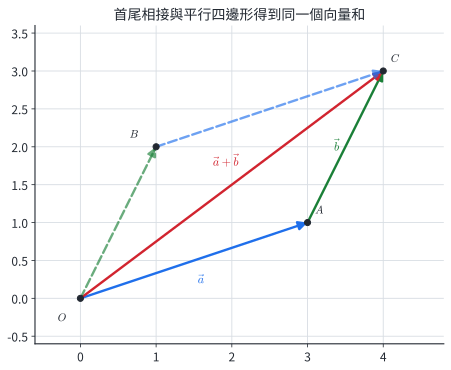{width=88%}

圖中藍色 $\vec a$ 後接綠色 $\vec b$，從共同起點直接指向終點的紅色向量為 $\vec a+\vec b$。這是三角形法則：

$$
\overrightarrow{AB}+\overrightarrow{BC}=\overrightarrow{AC}.
$$

相反向量 $-\vec b$ 與 $\vec b$ 大小相同、方向相反，因此 $\vec a-\vec b=\vec a+(-\vec b)$。實數 $k$ 與向量 $\vec a$ 的積滿足 $|k\vec a|=|k|\,|\vec a|$；$k>0$ 時同向，$k<0$ 時反向，$k=0$ 時為零向量。

::: example
### 示範 1｜用端點消去化簡向量

化簡 $\overrightarrow{AB}+\overrightarrow{CD}+\overrightarrow{BC}$。

**解。** 向量加法可交換次序：

$$
\overrightarrow{AB}+\overrightarrow{BC}+\overrightarrow{CD}
=\overrightarrow{AC}+\overrightarrow{CD}=\overrightarrow{AD}.
$$

每次都讓前一段終點接到下一段起點，結果是整段位移。
:::

::: example
### 示範 2｜船速與水流的合成

船相對水面的速度為向北 $12\text{ m/s}$，水流向東 $5\text{ m/s}$。求船相對河岸的速率與方向。

**解。** 取東為 $x$ 正向、北為 $y$ 正向，合速度分量為 $(5,12)$：

$$
|\vec v|=\sqrt{5^2+12^2}=13\text{ m/s}.
$$

若方向寫成北偏東 $\theta$，則 $\tan\theta=5/12$，所以 $\theta\approx22.6^\circ$。
:::

### 1.2 分節練習

1. 化簡 $\overrightarrow{PQ}+\overrightarrow{RS}+\overrightarrow{QR}$。
2. 已知 $|\vec a|=4$，寫出 $|-3\vec a|$，並敘述方向。
3. 正六邊形 $ABCDEF$ 中，化簡 $\overrightarrow{AB}+\overrightarrow{BC}+\overrightarrow{CD}$。
4. 無風時飛機向東速率 $240\text{ km/h}$，風向北、速率 $70\text{ km/h}$。求地速大小與方向。

### 1.3 分節練習解析

1. $\overrightarrow{PQ}+\overrightarrow{QR}+\overrightarrow{RS}=\overrightarrow{PS}$。
2. $|-3\vec a|=3|\vec a|=12$；方向與 $\vec a$ 相反。
3. 依序首尾相接，結果為 $\overrightarrow{AD}$。
4. 地速分量為 $(240,70)$，大小 $250\text{ km/h}$；方向東偏北 $\tan^{-1}(70/240)\approx16.3^\circ$。

## 2. 向量的坐標表示與平行判定

### 2.1 位置向量與分量

點 $P(x,y)$ 的**位置向量**是 $\overrightarrow{OP}=(x,y)$。若 $A(x_1,y_1)$、$B(x_2,y_2)$，則

$$
\overrightarrow{AB}=\overrightarrow{OB}-\overrightarrow{OA}
=(x_2-x_1,\ y_2-y_1).
$$

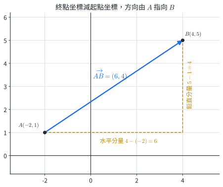{width=88%}

圖中的水平與鉛直分量分別是 $6$ 與 $4$，所以 $\overrightarrow{AB}=(6,4)$。向量長度與坐標運算為

$$
|(u,v)|=\sqrt{u^2+v^2},
$$

$$
(a,b)+(c,d)=(a+c,b+d),\qquad k(a,b)=(ka,kb).
$$

兩個非零向量 $\vec a,\vec b$ 平行的充要條件是存在非零實數 $r$，使 $\vec b=r\vec a$。若 $\vec a=(a_1,a_2)$、$\vec b=(b_1,b_2)$，也可使用

$$
a_1b_2-a_2b_1=0.
$$

::: example
### 示範 1｜由兩點求向量與長度

已知 $A(-3,2)$、$B(5,-4)$，求 $\overrightarrow{AB}$ 與 $AB$。

**解。**

$$
\overrightarrow{AB}=(5-(-3),-4-2)=(8,-6),
$$

$$
AB=\sqrt{8^2+(-6)^2}=10.
$$
:::

::: example
### 示範 2｜以平行條件求參數

已知 $\vec a=(2,-3)$、$\vec b=(k,12)$ 平行，求 $k$。

**解。**

$$
2\cdot12-(-3)k=0\Rightarrow24+3k=0\Rightarrow k=-8.
$$

此時 $\vec b=-4\vec a$，方向相反且互相平行。
:::

### 2.2 分節練習

1. $A(4,-1)$、$B(-2,7)$，求 $\overrightarrow{AB}$ 與 $AB$。
2. 求 $3(2,-1)-2(-4,5)$。
3. 已知 $(m,6)$ 與 $(2,-3)$ 平行，求 $m$。
4. 隕石在 8:00 位於 $(-5,4)$，8:30 位於 $(-2,2)$，保持等速度直線移動。求撞到 $y=0$ 的時間與位置。

### 2.3 分節練習解析

1. $\overrightarrow{AB}=(-6,8)$，$AB=10$。
2. $(6,-3)-(-8,10)=(14,-13)$。
3. $m(-3)-6(2)=0$，得 $m=-4$。
4. 每 30 分鐘位移 $(3,-2)$。從 $y=4$ 降到 $0$ 需兩段，共 $60$ 分鐘；位置為 $(-5,4)+2(3,-2)=(1,0)$，時間 9:00。

## 3. 線性組合、基底與係數區域

### 3.1 唯一表示

兩個非零且不平行的向量 $\vec a,\vec b$ 可作為平面的兩個基準方向。任一向量 $\vec p$ 都能唯一寫成

$$
\vec p=x\vec a+y\vec b.
$$

若同一向量有兩種表示，則

$$
(x_1-x_2)\vec a+(y_1-y_2)\vec b=\vec0.
$$

因 $\vec a,\vec b$ 不平行，兩係數只能同為 $0$，故 $x_1=x_2$、$y_1=y_2$。

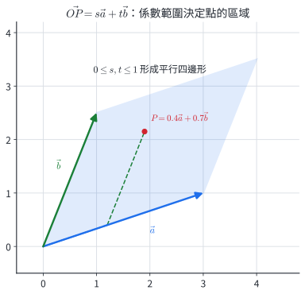{width=86%}

圖中 $\overrightarrow{OP}=s\vec a+t\vec b$ 且 $0\le s,t\le1$。$s\vec a$ 在線段 $O$ 到 $A$ 上移動，從該點再加 $t\vec b$，便掃過整個平行四邊形。

::: example
### 示範 1｜解線性組合係數

已知 $\vec a=(2,1)$、$\vec b=(-1,3)$，把 $\vec p=(7,1)$ 寫成 $x\vec a+y\vec b$。

**解。**

$$
(7,1)=(2x-y,x+3y),
$$

所以 $2x-y=7$、$x+3y=1$。解得

$$
x=\frac{22}{7},\qquad y=-\frac57.
$$
:::

::: example
### 示範 2｜由係數範圍求區域頂點

設 $\vec a=(3,0)$、$\vec b=(1,2)$，$\overrightarrow{OP}=s\vec a+t\vec b$，其中 $-1\le s\le1$、$0\le t\le2$。求區域的四個頂點。

**解。** 係數矩形的四個角映成

$$
-\vec a=(-3,0),\quad \vec a=(3,0),
$$

$$
-\vec a+2\vec b=(-1,4),\quad \vec a+2\vec b=(5,4).
$$

四點依次連成平行四邊形。
:::

### 3.2 分節練習

1. $\vec a=(1,2)$、$\vec b=(3,-1)$，將 $(11,1)$ 寫成 $x\vec a+y\vec b$。
2. 判斷 $(2,4)$、$(-1,-2)$ 能否作為平面的兩個基準方向。
3. $\overrightarrow{OP}=s(2,0)+t(0,3)$，$0\le s,t\le1$，求區域面積。
4. 伸縮機構的端點位移為 $4\vec a+4\vec b$。若 $\vec a=(3,-4)$、$\vec b=(1,2)$，求端點位移與長度。

### 3.3 分節練習解析

1. $(x+3y,2x-y)=(11,1)$，解得 $(x,y)=(2,3)$。
2. $(2,4)=-2(-1,-2)$，兩向量平行，無法唯一表示整個平面的向量。
3. 兩邊長為 $2$、$3$ 且垂直，面積為 $6$。
4. 位移 $4(3,-4)+4(1,2)=(16,-8)$；長度 $8\sqrt5$。

## 4. 內分點與外分點

### 4.1 以比例定位直線上的點

若 $P$ 在線段 $AB$ 上，且 $AP:PB=m:n$，其中 $m,n>0$，則

$$
\overrightarrow{OP}
=\frac{n\overrightarrow{OA}+m\overrightarrow{OB}}{m+n}.
$$

因 $\overrightarrow{AP}=\dfrac{m}{m+n}\overrightarrow{AB}$，所以

$$
\overrightarrow{OP}=\overrightarrow{OA}+\frac{m}{m+n}(\overrightarrow{OB}-\overrightarrow{OA}),
$$

整理即得內分公式。

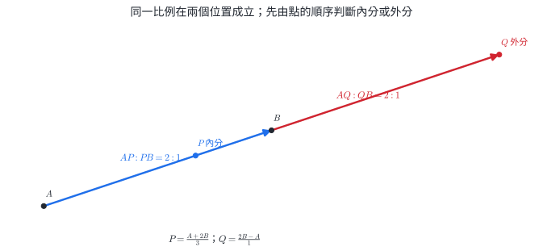{width=94%}

若 $Q$ 在 $B$ 的外側且 $AQ:QB=m:n$，其中 $m>n>0$，則

$$
\overrightarrow{OQ}
=\frac{m\overrightarrow{OB}-n\overrightarrow{OA}}{m-n}.
$$

圖中 $AP:PB=2:1$ 的內分點在 $A,B$ 之間；$AQ:QB=2:1$ 的外分點在 $B$ 外側。點的順序決定分母使用和或差。

::: example
### 示範 1｜內分點坐標

$A(-2,5)$、$B(7,-1)$，點 $P$ 滿足 $AP:PB=2:1$。求 $P$。

**解。**

$$
P=\frac{A+2B}{3}
=\left(\frac{-2+14}{3},\frac{5-2}{3}\right)=(4,1).
$$

$\overrightarrow{AP}=(6,-4)$ 是 $\overrightarrow{PB}=(3,-2)$ 的 $2$ 倍。
:::

::: example
### 示範 2｜同一比例的內、外兩解

$A(0,0)$、$B(6,3)$，求直線 $AB$ 上所有滿足 $AP:BP=3:2$ 的點。

**解。** 內分點與外分點分別為

$$
P_1=\frac{2A+3B}{5}=\left(\frac{18}{5},\frac95\right),
$$

$$
P_2=\frac{3B-2A}{3-2}=(18,9).
$$

兩點都滿足距離比 $3:2$，位置分別在 $A,B$ 之間與 $B$ 外側。
:::

### 4.2 分節練習

1. $A(1,4)$、$B(9,-2)$，求 $AP:PB=3:1$ 的內分點。
2. 線段 $AB$ 的中點為 $M(2,-3)$，已知 $A(-4,5)$，求 $B$。
3. $A(2,1)$、$B(5,7)$，求 $AQ:QB=2:1$ 且 $Q$ 在 $B$ 外側的坐標。
4. 感測器位於 $A(-2,0)$、$B(8,0)$。定位點到 $A,B$ 的距離比為 $3:2$，且點在線段 $AB$ 上，求坐標。

### 4.3 分節練習解析

1. $P=(A+3B)/4=(7,-1/2)$。
2. $M=(A+B)/2$，所以 $B=2M-A=(8,-11)$。
3. $Q=(2B-A)/(2-1)=(8,13)$；距離比為 $2:1$。
4. $P=(2A+3B)/5=(4,0)$。$AP=6$、$PB=4$，比例 $3:2$。

## 5. 縮放、平移與設計坐標

### 5.1 向量形式的圖形變換

以原點為中心，倍率為 $r$ 的縮放把點 $P$ 送到 $P'$：

$$
\overrightarrow{OP'}=r\overrightarrow{OP}.
$$

所有長度乘 $|r|$，所有面積乘 $r^2$。再平移向量 $\vec t=(a,b)$，得到

$$
\overrightarrow{OP'}=r\overrightarrow{OP}+\vec t.
$$

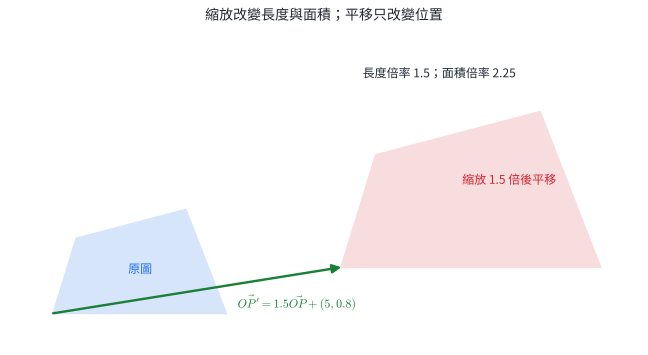{width=90%}

相對位置差滿足 $\overrightarrow{P'Q'}=r\overrightarrow{PQ}$，因為平移量在兩位置向量相減時消去，縮放後的圖形保持相似。

::: example
### 示範 1｜點的縮放和平移

點 $P(-2,3)$ 先以原點為中心放大 $2$ 倍，再平移 $(5,-1)$。求新坐標。

**解。**

$$
P'=2(-2,3)+(5,-1)=(1,5).
$$
:::

::: example
### 示範 2｜由面積倍率反求縮放倍率

一張圖等比例縮放後面積為原來的 $0.64$ 倍，且圖形方向保持。求長度倍率。

**解。** 設長度倍率為 $r>0$：

$$
r^2=0.64\Rightarrow r=0.8.
$$

所有長度縮成原來的 $80\%$。
:::

### 5.2 分節練習

1. 點 $(4,-3)$ 經 $P'=\frac12P+(-1,5)$ 後坐標為何？
2. 三角形面積為 $18$，以倍率 $-3$ 縮放後面積為何？
3. $P',Q'$ 由 $P,Q$ 經 $X'=2X+(3,-4)$ 得到。若 $\overrightarrow{PQ}=(-1,5)$，求 $\overrightarrow{P'Q'}$。
4. 圖像寬 $1200$ 像素、高 $800$ 像素，等比例縮小到面積為原來的 $36\%$。求新尺寸。

### 5.3 分節練習解析

1. $P'=(2,-3/2)+(-1,5)=(1,7/2)$。
2. 面積倍率為 $(-3)^2=9$，新面積 $162$。
3. $\overrightarrow{P'Q'}=2\overrightarrow{PQ}=(-2,10)$。
4. 長度倍率為 $\sqrt{0.36}=0.6$，新尺寸為 $720\times480$ 像素。

## 6. 向量夾角、內積與垂直判定

### 6.1 內積的幾何與坐標定義

把兩個非零向量平移到共同起點，夾角 $\theta$ 取 $0^\circ\le\theta\le180^\circ$。**內積**定義為

$$
\vec a\cdot\vec b=|\vec a|\,|\vec b|\cos\theta.
$$

若 $\vec a=(a_1,a_2)$、$\vec b=(b_1,b_2)$，則

$$
\vec a\cdot\vec b=a_1b_1+a_2b_2.
$$

坐標公式可由餘弦定理推得。令 $\vec a=\overrightarrow{OA}$、$\vec b=\overrightarrow{OB}$，則 $\overrightarrow{AB}=\vec b-\vec a$。一方面

$$
|\vec b-\vec a|^2=|\vec a|^2+|\vec b|^2-2|\vec a||\vec b|\cos\theta,
$$

另一方面逐分量展開得到

$$
|\vec b-\vec a|^2=|\vec a|^2+|\vec b|^2-2(a_1b_1+a_2b_2).
$$

比較兩式即得坐標公式。

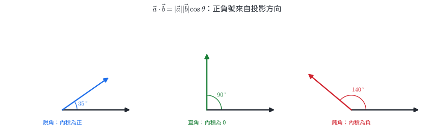{width=96%}

圖中銳角、直角、鈍角分別使 $\cos\theta$ 為正、零、負。因此對非零向量，

$$
\vec a\perp\vec b\quad\Longleftrightarrow\quad\vec a\cdot\vec b=0.
$$

力 $\vec F$ 使物體產生位移 $\vec s$ 時，定力所作的功為

$$
W=\vec F\cdot\vec s=|\vec F||\vec s|\cos\theta.
$$

功只計入力沿位移方向的分量，單位是焦耳（J）。

::: example
### 示範 1｜由內積求夾角

$\vec a=(3,4)$、$\vec b=(4,-3)$，求夾角。

**解。**

$$
\vec a\cdot\vec b=3\cdot4+4(-3)=0.
$$

兩向量皆非零，因此夾角為 $90^\circ$。
:::

::: example
### 示範 2｜斜拉力所作的功

大小 $80\text{ N}$ 的力與水平位移方向夾 $60^\circ$，物體移動 $15\text{ m}$。求功。

**解。**

$$
W=80\cdot15\cos60^\circ=600\text{ J}.
$$

沿位移方向的有效力為 $80\cos60^\circ=40\text{ N}$，再乘位移也得到 $600\text{ J}$。
:::

### 6.2 分節練習

1. 求 $(2,-5)\cdot(3,4)$。
2. 已知 $|\vec a|=4$、$|\vec b|=6$、夾角 $120^\circ$，求 $\vec a\cdot\vec b$。
3. 求 $k$，使 $(k,2)\perp(3,-6)$。
4. 大小 $50\text{ N}$ 的力與位移夾 $30^\circ$，位移 $8\text{ m}$。求功。
5. $A(1,2)$、$B(5,4)$、$C(-1,6)$，判斷 $\angle BAC$ 的類型。

### 6.3 分節練習解析

1. $2\cdot3+(-5)\cdot4=-14$。
2. $4\cdot6\cos120^\circ=-12$。
3. $3k+2(-6)=0$，得 $k=4$。
4. $W=50\cdot8\cos30^\circ=200\sqrt3\text{ J}$。
5. $\overrightarrow{AB}=(4,2)$、$\overrightarrow{AC}=(-2,4)$，內積 $-8+8=0$，所以是直角。

## 7. 內積性質與向量長度

### 7.1 代數展開

內積滿足

$$
\vec a\cdot\vec b=\vec b\cdot\vec a,
$$

$$
(k\vec a)\cdot\vec b=k(\vec a\cdot\vec b),
$$

$$
(\vec a+\vec b)\cdot\vec c
=\vec a\cdot\vec c+\vec b\cdot\vec c,
$$

$$
\vec a\cdot\vec a=|\vec a|^2.
$$

因此向量和與差的長度可展開為

$$
|\vec a+\vec b|^2=|\vec a|^2+2\vec a\cdot\vec b+|\vec b|^2,
$$

$$
|\vec a-\vec b|^2=|\vec a|^2-2\vec a\cdot\vec b+|\vec b|^2.
$$

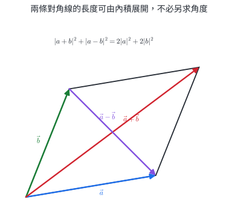{width=86%}

兩式相加得到平行四邊形法則：

$$
|\vec a+\vec b|^2+|\vec a-\vec b|^2
=2|\vec a|^2+2|\vec b|^2.
$$

它把兩條對角線長度與四邊長連在一起。

::: example
### 示範 1｜求向量組合的長度

已知 $|\vec a|=3$、$|\vec b|=4$、夾角 $60^\circ$，求 $|2\vec a-\vec b|$。

**解。** 先算 $\vec a\cdot\vec b=3\cdot4\cos60^\circ=6$。

$$
|2\vec a-\vec b|^2
=4|\vec a|^2-4\vec a\cdot\vec b+|\vec b|^2
=36-24+16=28.
$$

所以 $|2\vec a-\vec b|=2\sqrt7$。
:::

::: example
### 示範 2｜由兩條對角線反求邊長關係

平行四邊形兩邊向量為 $\vec a,\vec b$，已知 $|\vec a+\vec b|=10$、$|\vec a-\vec b|=6$、$|\vec a|=5$。求 $|\vec b|$。

**解。** 套用平行四邊形法則：

$$
10^2+6^2=2\cdot5^2+2|\vec b|^2.
$$

$$
136=50+2|\vec b|^2\Rightarrow |\vec b|^2=43.
$$

所以 $|\vec b|=\sqrt{43}$。
:::

### 7.2 分節練習

1. 已知 $|\vec a|=2$、$|\vec b|=5$、$\vec a\cdot\vec b=-3$，求 $|\vec a+\vec b|$。
2. 已知 $|\vec a+\vec b|=7$、$|\vec a|=3$、$|\vec b|=4$，求 $\vec a\cdot\vec b$。
3. 證明：若 $|\vec a+\vec b|=|\vec a-\vec b|$，則 $\vec a\perp\vec b$。
4. 菱形邊長為 $5$，其中一條對角線長為 $6$，求另一條對角線長。
5. 已知 $|\vec u|=|\vec v|=2$，且 $\vec u+\vec v$ 與 $\vec u$ 的夾角為 $30^\circ$，求 $\vec u\cdot\vec v$。

### 7.3 分節練習解析

1. $|\vec a+\vec b|^2=4+2(-3)+25=23$，故長度為 $\sqrt{23}$。
2. $49=9+16+2\vec a\cdot\vec b$，故內積為 $12$。
3. 兩邊平方後相減，得到 $4\vec a\cdot\vec b=0$。兩向量非零時即互相垂直。
4. 設另一對角線長 $d$。平行四邊形法則給 $6^2+d^2=4(5^2)$，所以 $d=8$。
5. 等長向量構成菱形，$\vec u+\vec v$ 平分夾角，故 $\vec u,\vec v$ 夾角為 $60^\circ$；內積 $2\cdot2\cos60^\circ=2$。

## 8. 正射影、向量分解與距離

### 8.1 正射影公式

給定向量 $\vec a$ 與非零向量 $\vec b$，$\vec a$ 在 $\vec b$ 上的**正射影向量**為

$$
\operatorname{proj}_{\vec b}\vec a
=\frac{\vec a\cdot\vec b}{|\vec b|^2}\vec b.
$$

推導時先設投影向量為 $\vec v=t\vec b$。垂直剩餘分量 $\vec u=\vec a-\vec v$ 滿足 $\vec u\cdot\vec b=0$，所以

$$
(\vec a-t\vec b)\cdot\vec b=0
\Rightarrow t=\frac{\vec a\cdot\vec b}{|\vec b|^2}.
$$

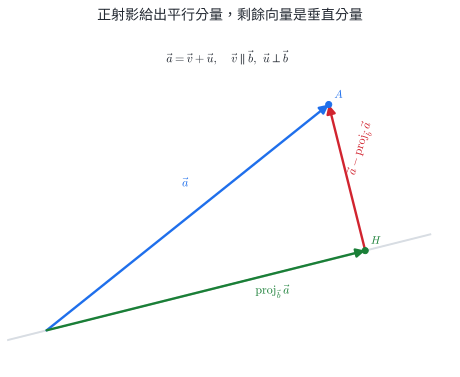{width=88%}

圖中綠色向量是沿 $\vec b$ 的平行分量，紅色向量是垂直分量：

$$
\vec a=\vec v+\vec u,\qquad \vec v\parallel\vec b,\qquad \vec u\perp\vec b.
$$

若直線 $L$ 通過 $A$，方向向量為 $\vec d$，點 $P$ 到 $L$ 的投影點為

$$
H=A+\operatorname{proj}_{\vec d}\overrightarrow{AP}.
$$

點到直線距離為 $PH$。

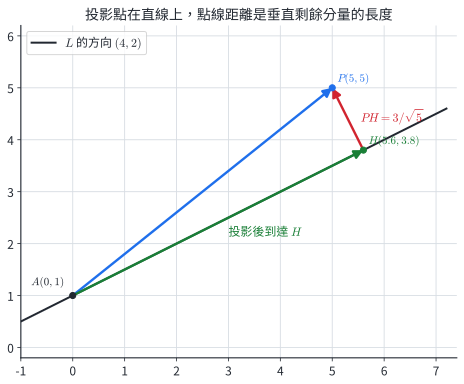{width=88%}

::: example
### 示範 1｜分解成平行與垂直分量

把 $\vec a=(6,5)$ 分解成平行於 $\vec b=(2,1)$ 與垂直於 $\vec b$ 的兩分量。

**解。**

$$
\vec v=\frac{(6,5)\cdot(2,1)}{2^2+1^2}(2,1)
=\frac{17}{5}(2,1)=\left(\frac{34}{5},\frac{17}{5}\right).
$$

$$
\vec u=\vec a-\vec v
=\left(-\frac45,\frac85\right).
$$

檢查 $\vec u\cdot\vec b=-8/5+8/5=0$。
:::

::: example
### 示範 2｜求投影點與點線距離

直線 $L$ 通過 $A(1,0)$，方向向量為 $(2,1)$。求 $P(4,5)$ 在 $L$ 上的投影點與距離。

**解。** $\overrightarrow{AP}=(3,5)$：

$$
\operatorname{proj}_{(2,1)}(3,5)
=\frac{11}{5}(2,1)=\left(\frac{22}{5},\frac{11}{5}\right).
$$

$$
H=A+\operatorname{proj}_{(2,1)}\overrightarrow{AP}
=\left(\frac{27}{5},\frac{11}{5}\right).
$$

$$
\overrightarrow{HP}=\left(-\frac75,\frac{14}{5}\right),\qquad
PH=\frac{7\sqrt5}{5}.
$$
:::

### 8.2 分節練習

1. 求 $(5,1)$ 在 $(1,2)$ 上的正射影向量。
2. 把 $(4,-1)$ 分解成平行於 $(3,4)$ 與垂直於 $(3,4)$ 的分量。
3. 直線通過原點且方向為 $(1,1)$，求 $P(4,0)$ 的投影點與距離。
4. 棍子端點為 $A(0,6)$、$B(8,0)$，彈珠位於 $P(5,8)$，沿垂直棍子的方向落到 $H$。求 $H$。
5. 一個大小 $20\text{ N}$ 的力作用方向為 $(3,4)$，求它在向東方向的有向分量大小。

### 8.3 分節練習解析

1. 係數為 $(5+2)/5=7/5$，投影為 $(7/5,14/5)$。
2. 投影係數為 $(12-4)/25=8/25$，平行分量 $(24/25,32/25)$；垂直分量 $(76/25,-57/25)$。
3. 投影為 $((4,0)\cdot(1,1)/2)(1,1)=(2,2)$；距離 $|(2,-2)|=2\sqrt2$。
4. $\overrightarrow{AB}=(8,-6)$、$\overrightarrow{AP}=(5,2)$。投影係數 $(40-12)/100=7/25$，故 $H=A+(56/25,-42/25)=(56/25,108/25)$。
5. 東向單位向量為 $(1,0)$。力向量是 $20(3/5,4/5)=(12,16)$，東向有向分量為 $12\text{ N}$。

## 9. 直線法向量、直線方程式與夾角

### 9.1 法向量

與直線垂直的非零向量稱為直線的**法向量**。直線

$$
ax+by+c=0
$$

的一個法向量是 $\vec n=(a,b)$。若直線通過 $P(x_0,y_0)$，以法向量 $(a,b)$ 表示，可寫成

$$
a(x-x_0)+b(y-y_0)=0.
$$

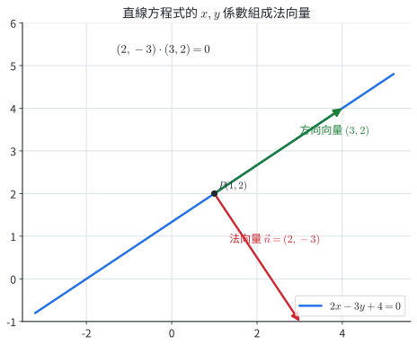{width=86%}

圖中的法向量 $(2,-3)$ 與方向向量 $(3,2)$ 內積為 $0$。對直線上任一點 $X$，$\overrightarrow{PX}$ 都與法向量垂直，因此 $\vec n\cdot\overrightarrow{PX}=0$，展開即為直線方程式。

兩直線的法向量分別為 $\vec n_1,\vec n_2$ 時，可先求法向量夾角 $\theta$：

$$
\cos\theta=\frac{\vec n_1\cdot\vec n_2}{|\vec n_1||\vec n_2|}.
$$

兩直線形成的兩種角為 $\theta$ 與 $180^\circ-\theta$；題目若問銳夾角，可取 $|\cos\theta|$。

::: example
### 示範 1｜由法向量與一點寫直線

求通過 $(2,-1)$、法向量為 $(3,4)$ 的直線方程式。

**解。**

$$
3(x-2)+4(y+1)=0
\Rightarrow3x+4y-2=0.
$$
:::

::: example
### 示範 2｜求兩直線的銳夾角

$L_1:2x-y+3=0$，$L_2:x+2y-4=0$。求夾角。

**解。** 法向量為 $\vec n_1=(2,-1)$、$\vec n_2=(1,2)$：

$$
\vec n_1\cdot\vec n_2=2-2=0.
$$

兩法向量垂直，兩直線也垂直，夾角為 $90^\circ$。
:::

### 9.2 分節練習

1. 寫出直線 $5x-2y+7=0$ 的一個法向量與一個方向向量。
2. 求通過 $(-1,3)$、法向量 $(4,-3)$ 的直線方程式。
3. 判斷 $3x+4y=1$ 與 $4x-3y=8$ 的關係。
4. 求 $x+y=0$ 與 $\sqrt3x-y+2=0$ 的銳夾角。
5. 道路中心線方向為 $(4,3)$，設計一條通過 $(6,2)$ 且與道路垂直的標線，求方程式。

### 9.3 分節練習解析

1. 法向量可取 $(5,-2)$；方向向量可取 $(2,5)$，兩者內積為 $0$。
2. $4(x+1)-3(y-3)=0$，即 $4x-3y+13=0$。
3. 法向量 $(3,4)$ 與 $(4,-3)$ 內積為 $0$，所以兩直線垂直。
4. 法向量 $(1,1)$、$(\sqrt3,-1)$ 的內積為 $\sqrt3-1$，長度皆為 $\sqrt2$、$2$。銳角餘弦為 $(\sqrt3-1)/(2\sqrt2)=\cos75^\circ$，故夾角 $75^\circ$。
5. 標線方向與道路垂直，所以道路方向 $(4,3)$ 可作標線法向量：$4(x-6)+3(y-2)=0$，即 $4x+3y-30=0$。

## 10. 單點透視與相似比例

### 10.1 消失點、地平線與等分

單點透視把一組與畫面垂直的空間平行線畫成通向同一點的直線；該點稱為**消失點**。與地面平行且通過觀察者眼睛高度的線稱為**地平線**，消失點位於地平線上。

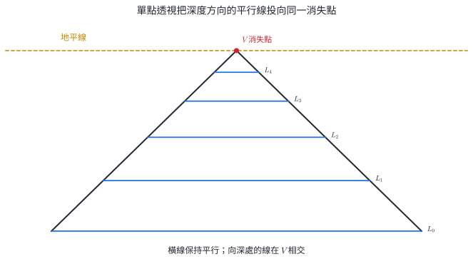{width=92%}

圖中左右兩條深度線在 $V$ 相交，橫向線保持互相平行。越接近 $V$ 的橫線越短，對應物體距離觀察者越遠。等距深度在畫面上的間距會逐漸縮小，因此透視等分要用交叉線與相似三角形建構。

若眼睛 $E$、畫面與物體的對應點共線，投影前後的三角形相似。設畫面距眼睛 $d$，物體距眼睛 $D$，實際高度 $H$、畫面高度 $h$，則

$$
\frac{h}{H}=\frac{d}{D}.
$$

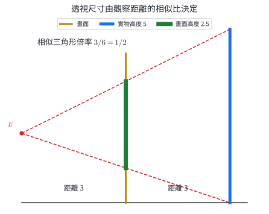{width=90%}

圖中畫面距離是物體距離的一半，所以高度 $5$ 在畫面上成為 $2.5$。同一深度平面上的所有長度都乘同一倍率。

::: example
### 示範 1｜由距離求畫面高度

畫面距眼睛 $2\text{ m}$，一根高 $3\text{ m}$ 的柱子距眼睛 $8\text{ m}$。柱子在畫面上的高度是多少？

**解。**

$$
\frac{h}{3}=\frac{2}{8}\Rightarrow h=0.75\text{ m}.
$$

倍率 $1/4$ 同時作用於柱子的寬與高。
:::

::: example
### 示範 2｜由兩個透視截面反求長度

同一組深度線通向消失點 $V$。兩個平行截面到 $V$ 的距離分別為 $6$ 與 $10$，較近 $V$ 的截面寬為 $9$。求另一截面寬。

**解。** 截面寬與到消失點的對應距離成同比例：

$$
\frac{9}{w}=\frac{6}{10}
\Rightarrow w=15.
$$

另一截面離 $V$ 較遠，所以圖上寬度較大，與 $15>9$ 一致。
:::

### 10.2 分節練習

1. 透視圖中三條深度方向的線交於同一點 $V$。說明 $V$ 的名稱與所在的水平參考線。
2. 畫面距眼睛 $1.5\text{ m}$，物體距眼睛 $6\text{ m}$，物體高 $2.4\text{ m}$。求畫面高度。
3. 兩個平行截面到消失點的距離比為 $3:5$，較近截面寬 $12$。求較遠截面寬。
4. 透明屏風距眼睛 $2\text{ m}$，箱子距眼睛 $5\text{ m}$；箱頂比眼睛高 $0.6\text{ m}$。求箱頂投影相對眼睛高度。
5. 走廊地磚的真實寬度相同。說明它們在透視圖中逐漸縮短的數學原因。

### 10.3 分節練習解析

1. $V$ 是消失點，位於地平線上；地平線對應觀察者眼睛高度。
2. $h/2.4=1.5/6$，得 $h=0.6\text{ m}$。
3. $12/w=3/5$，得 $w=20$。
4. 相對高度乘距離倍率 $2/5$，所以投影比眼睛高 $0.6(2/5)=0.24\text{ m}$。
5. 每塊地磚的影像由相似三角形縮放；離眼睛越遠，$d/D$ 越小，所以畫面長度越短，深度線同時趨向消失點。

## 11. A 系列紙張與自相似規格

### 11.1 長寬比與面積

設矩形長邊為 $x$、短邊為 $y$，沿長邊對半裁切後，小矩形旋轉 $90^\circ$ 與原矩形相似。相似條件為

$$
\frac{x}{y}=\frac{y}{x/2}.
$$

因此

$$
x^2=2y^2,\qquad \frac{x}{y}=\sqrt2.
$$

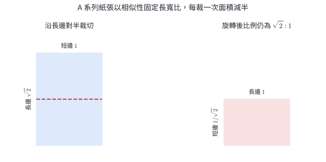{width=90%}

A0 面積定為 $1\text{ m}^2$。每沿長邊對半裁切一次，面積減半：

$$
\text{A}n\text{ 面積}=2^{-n}\text{ m}^2.
$$

實際紙張尺寸以整數毫米表示，因此表列長寬會含四捨五入。理想模型的長寬比與面積關係用 $\sqrt2$ 與 $2^{-n}$ 計算。

::: example
### 示範 1｜由 A0 面積求 A4 面積

求 A4 面積，分別用平方公尺與平方公分表示。

**解。** 從 A0 到 A4 裁切四次：

$$
A_4=2^{-4}=\frac1{16}\text{ m}^2.
$$

因 $1\text{ m}^2=10000\text{ cm}^2$，所以

$$
A_4=625\text{ cm}^2.
$$
:::

::: example
### 示範 2｜由一邊反求理想尺寸

理想 A 系列紙張短邊為 $210\text{ mm}$，求長邊與面積。

**解。**

$$
x=210\sqrt2\approx296.98\text{ mm}.
$$

$$
A=210(210\sqrt2)=44100\sqrt2\approx62366\text{ mm}^2.
$$

規格表把長邊寫為 $297\text{ mm}$，是毫米整數化的結果。
:::

### 11.2 分節練習

1. 求理想 A3 的面積，單位為平方公尺。
2. A2 長邊為 $594\text{ mm}$，沿長邊對半裁切後所得 A3 的兩邊為何？
3. 一張自相似紙的長邊為 $40\text{ cm}$，求短邊的理想值。
4. A0 面積為 $1\text{ m}^2$，求 A5 面積，單位為平方公分。
5. 同一 A 系列中，A2 與 A5 的面積比為何？

### 11.3 分節練習解析

1. A3 面積為 $2^{-3}=1/8\text{ m}^2$。
2. A2 的短邊等於 A3 的長邊，即 $420\text{ mm}$；另一邊為 $594/2=297\text{ mm}$。
3. 短邊 $=40/\sqrt2=20\sqrt2\text{ cm}$。
4. $10000/2^5=312.5\text{ cm}^2$。
5. 相差三次裁切，所以 A2:A5 面積 $=2^3:1=8:1$。

## 12. 黃金分割、費氏數列與螺線

### 12.1 黃金比例的方程

把線段分成長段 $x$ 與短段 $1$，若

$$
\frac{x}{1}=\frac{x+1}{x},
$$

則稱為**黃金分割**。整理得到

$$
x^2-x-1=0.
$$

長度取正根：

$$
\varphi=\frac{1+\sqrt5}{2}\approx1.618034.
$$

因此 $\varphi^2=\varphi+1$ 與 $1/\varphi=\varphi-1$。

費氏數列定義為

$$
F_1=F_2=1,\qquad F_{n+2}=F_{n+1}+F_n.
$$

它的前幾項為 $1,1,2,3,5,8,13,\ldots$。相鄰比 $F_n/F_{n-1}$ 會在 $\varphi$ 上下交替並逐漸接近它。

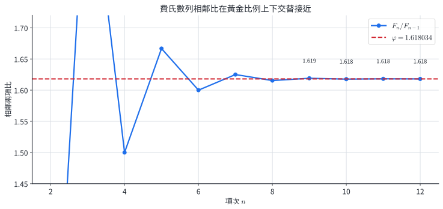{width=88%}

若把黃金矩形切去一個正方形，剩下的小矩形仍與原矩形相似；在連續正方形內畫四分之一圓弧，可形成方形螺線近似。

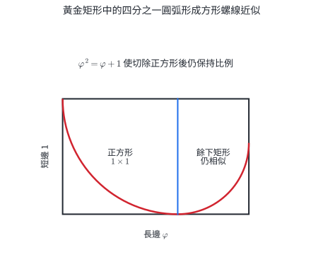{width=82%}

這組圓弧由離散正方形拼接，與精確的等角螺線屬於不同曲線。設計作品是否「美」也需要使用者、文化與功能資料支持；黃金比例在本節的可驗證內容是方程、自相似與數列比值。

::: example
### 示範 1｜求黃金分割點

線段 $OA$ 長 $10$，點 $B$ 在 $OA$ 上，且長段 $AB$、短段 $OB$ 構成黃金分割。求 $OB$。

**解。** 長段與短段比為 $\varphi$。若 $OB=s$，則 $AB=10-s$ 且

$$
\frac{10-s}{s}=\varphi.
$$

因此

$$
s=\frac{10}{1+\varphi}=\frac{10}{\varphi^2}=5(3-\sqrt5).
$$

數值約為 $3.820$，而長段約為 $6.180$。
:::

::: example
### 示範 2｜計算費氏相鄰比

從 $F_1=F_2=1$ 算到 $F_{10}$，並比較 $F_{10}/F_9$ 與 $\varphi$。

**解。** 依遞迴得到

$$
1,1,2,3,5,8,13,21,34,55.
$$

$$
\frac{F_{10}}{F_9}=\frac{55}{34}\approx1.617647.
$$

與 $\varphi\approx1.618034$ 的差約 $0.000387$。
:::

### 12.2 分節練習

1. 解 $x^2-x-1=0$，並指出適合作為長度比的根。
2. 已知黃金矩形短邊為 $8$，求長邊與切去正方形後餘下矩形的短邊。
3. 寫出 $F_{11}$ 與 $F_{12}$，並算 $F_{12}/F_{11}$ 至小數第四位。
4. 黃金長方形畫面寬 $160\text{ cm}$，求理想高度。
5. 邊長依序為 $1,2,3,5$ 的四個正方形內各畫四分之一圓，求弧長總和。

### 12.3 分節練習解析

1. 根為 $(1\pm\sqrt5)/2$；長度比取正根 $\varphi$。
2. 長邊 $8\varphi$；切去 $8\times8$ 正方形後，餘下矩形短邊 $8\varphi-8=8(\varphi-1)=8/\varphi$。
3. $F_{11}=89$、$F_{12}=144$；$144/89\approx1.6180$。
4. $160/h=\varphi$，所以 $h=160/\varphi\approx98.9\text{ cm}$。
5. 每段弧長是 $(\pi/2)r$，總和 $=(\pi/2)(1+2+3+5)=11\pi/2$。

## 13. 圓角、相似縮放與平面設計

### 13.1 圓弧與切線條件

圓與直線相切時，連接圓心與切點的半徑垂直於切線。若一個圓同時與角的兩邊相切，圓心到兩邊距離相等，所以圓心位於角平分線上。

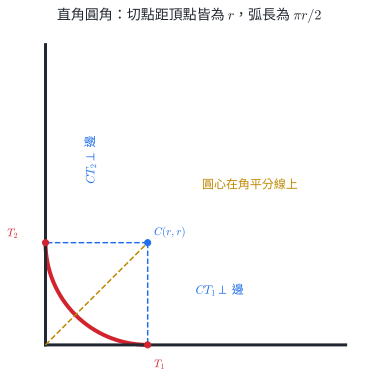{width=84%}

直角頂點設為原點，兩邊沿正 $x,y$ 軸，圓角半徑為 $r$。圓心為 $(r,r)$，兩切點為 $(r,0)$ 與 $(0,r)$。圓弧是四分之一圓：

$$
s=r\theta=\frac{\pi r}{2}.
$$

若從 $r\times r$ 的正方形角落裁去圓角，裁下碎片面積為

$$
r^2-\frac14\pi r^2=r^2\left(1-\frac\pi4\right).
$$

相似圖形若長度倍率為 $k$，周長乘 $|k|$、面積乘 $k^2$。這使設計稿可先以小比例驗證，再按倍率輸出。

::: example
### 示範 1｜由圓弧長反求半徑

直角圓角的弧長為 $12\pi\text{ mm}$，求半徑。

**解。**

$$
\frac{\pi r}{2}=12\pi\Rightarrow r=24\text{ mm}.
$$

兩切點各離直角頂點 $24\text{ mm}$。
:::

::: example
### 示範 2｜四個圓角裁下的總面積

一張矩形卡紙四角都裁成半徑 $10\text{ mm}$ 的圓角。求四塊碎片總面積。

**解。** 每塊碎片為正方形減四分之一圓：

$$
10^2-\frac14\pi(10)^2=100-25\pi.
$$

四塊總面積為

$$
4(100-25\pi)=400-100\pi\text{ mm}^2.
$$
:::

### 13.2 分節練習

1. 半徑 $8\text{ mm}$ 的直角圓角，求弧長。
2. 直角圓角的圓心為 $(15,15)$，兩邊為坐標軸。寫出兩切點。
3. 一個 $90^\circ$ 圓角的弧長為 $7\pi\text{ cm}$，求半徑。
4. 四個半徑 $6\text{ mm}$ 的圓角碎片總面積為何？
5. 一個標誌等比例放大 $2.5$ 倍。原周長 $48\text{ cm}$、面積 $90\text{ cm}^2$，求新周長與面積。

### 13.3 分節練習解析

1. $s=8(\pi/2)=4\pi\text{ mm}$。
2. 切點是 $(15,0)$ 與 $(0,15)$。
3. $\pi r/2=7\pi$，得 $r=14\text{ cm}$。
4. $4[6^2-(\pi/4)6^2]=144-36\pi\text{ mm}^2$。
5. 新周長 $48(2.5)=120\text{ cm}$；新面積 $90(2.5)^2=562.5\text{ cm}^2$。

## 14. 代表題與章末分層練習

### A. 定義與基本操作

1. 四邊形 $ABCD$ 中，化簡
   $$
   \overrightarrow{AB}+\overrightarrow{DA}+\overrightarrow{BC}.
   $$

2. 已知 $A(-4,3)$、$B(2,-5)$。
   1. 求 $\overrightarrow{AB}$ 與 $AB$；
   2. 求與 $\overrightarrow{AB}$ 同向、長度為 $5$ 的向量。

3. 已知 $\vec a=(2,1)$、$\vec b=(1,-2)$，把 $(7,-4)$ 寫成 $x\vec a+y\vec b$。

4. $A(-1,5)$、$B(9,0)$。求滿足 $AP:PB=3:2$ 的內分點 $P$，以及在 $B$ 外側、滿足 $AQ:QB=3:2$ 的外分點 $Q$。

### B. 內積、投影與直線

5. 三角形頂點為 $A(1,1)$、$B(5,3)$、$C(0,3)$。判斷 $\angle BAC$ 為銳角、直角或鈍角，並求其餘弦。

6. 已知 $|\vec a|=4$、$|\vec b|=3$、$\vec a\cdot\vec b=-6$，求 $|2\vec a+\vec b|$。

7. 把 $\vec p=(7,1)$ 分解成平行於 $\vec d=(2,-1)$ 與垂直於 $\vec d$ 的分量。

8. 直線 $L$ 通過 $A(1,2)$，方向向量為 $(3,1)$。求 $P(5,7)$ 在 $L$ 上的投影點 $H$ 與距離 $PH$。

9. 求通過 $P(-2,4)$ 且與直線 $3x-4y+7=0$ 平行的直線方程式。

### C. 比例與設計模型

10. 一個高 $4.5\text{ m}$ 的物體距眼睛 $12\text{ m}$，畫面距眼睛 $3\text{ m}$。求物體在畫面上的高度。若物體再遠離眼睛到 $18\text{ m}$，畫面高度變為多少？

11. A0 面積為 $1\text{ m}^2$。求 A6 面積，以平方公分表示；並求 A3 與 A6 的面積比。

12. 一個直角圓角弧長為 $9\pi\text{ mm}$。求圓角半徑，以及四角都作相同圓角時裁下的總面積。

### D. 跨節整合

13. 一條河寬 $240\text{ m}$，水流向東 $3\text{ m/s}$。船相對水面的速率為 $5\text{ m/s}$，希望從南岸 $A$ 到正北方對岸 $B$。
    1. 取東、北為正向，求船相對水面的速度向量；
    2. 求船相對河岸的速度與渡河時間；
    3. 航程中點 $M$ 的坐標為何？令 $A=(0,0)$。

14. $A(-2,1)$、$B(8,6)$，點 $P$ 內分 $AB$ 且 $AP:PB=2:3$。直線 $L$ 通過 $P$，方向向量為 $\overrightarrow{AB}$。點 $C(4,8)$。
    1. 求 $P$；
    2. 求 $C$ 在 $L$ 上的投影點 $H$；
    3. 求 $C$ 到 $L$ 的距離；
    4. 寫出 $L$ 的一般式方程式。

15. 建築物立面寬 $18\text{ m}$、高 $12\text{ m}$，距觀察者 $30\text{ m}$；畫面距觀察者 $5\text{ m}$。設計師要把畫面上的立面等比例印在 A 系列紙上，並讓印刷寬度為 A4 短邊 $210\text{ mm}$。
    1. 求建築物在畫面上的寬與高；
    2. 求從畫面到印刷稿的縮放倍率；
    3. 求印刷高度；
    4. 求印刷立面占用面積。

16. 一個黃金矩形的短邊為 $20\text{ cm}$。設計師切去一個 $20\times20$ 的正方形，並把剩餘矩形等比例縮小 $1/2$，其四角各裁成半徑 $2\text{ cm}$ 的圓角。
    1. 求原黃金矩形長邊；
    2. 求剩餘矩形縮小後的長與寬；
    3. 求四段圓角弧長總和；
    4. 求裁去四角後的面積。

## 15. 章末練習完整詳解

### 第 1 題

先交換次序，使端點首尾相接：

$$
\overrightarrow{DA}+\overrightarrow{AB}+\overrightarrow{BC}
=\overrightarrow{DB}+\overrightarrow{BC}
=\overrightarrow{DC}.
$$

### 第 2 題

1. 終點減起點：
   $$
   \overrightarrow{AB}=(2-(-4),-5-3)=(6,-8),
   $$
   $$
   AB=\sqrt{6^2+(-8)^2}=10.
   $$
2. 單位同向向量為 $(6,-8)/10=(3/5,-4/5)$。長度為 $5$ 的同向向量是
   $$
   5\left(\frac35,-\frac45\right)=(3,-4).
   $$

### 第 3 題

$$
x(2,1)+y(1,-2)=(2x+y,x-2y)=(7,-4).
$$

解聯立

$$
\begin{cases}2x+y=7,\\x-2y=-4,\end{cases}
$$

由第一式 $y=7-2x$，代入第二式得 $5x=10$，所以

$$
x=2,\qquad y=3.
$$

### 第 4 題

內分點使用權重和：

$$
P=\frac{2A+3B}{5}
=\left(\frac{-2+27}{5},\frac{10}{5}\right)=(5,2).
$$

外分點在 $B$ 外側，使用權重差：

$$
Q=\frac{3B-2A}{3-2}
=(27,0)-(-2,10)=(29,-10).
$$

檢查 $AQ=15\sqrt5$、$QB=10\sqrt5$，比例為 $3:2$。

### 第 5 題

由 $A$ 出發的兩向量為

$$
\overrightarrow{AB}=(4,2),\qquad \overrightarrow{AC}=(-1,2).
$$

$$
\overrightarrow{AB}\cdot\overrightarrow{AC}=-4+4=0.
$$

所以 $\angle BAC=90^\circ$，其餘弦為 $0$。

### 第 6 題

$$
|2\vec a+\vec b|^2
=4|\vec a|^2+4\vec a\cdot\vec b+|\vec b|^2.
$$

代入得到

$$
4(16)+4(-6)+9=49.
$$

因此 $|2\vec a+\vec b|=7$。

### 第 7 題

平行分量為

$$
\vec v=\operatorname{proj}_{\vec d}\vec p
=\frac{(7,1)\cdot(2,-1)}{2^2+(-1)^2}(2,-1)
=\frac{13}{5}(2,-1)
=\left(\frac{26}{5},-\frac{13}{5}\right).
$$

垂直分量為

$$
\vec u=\vec p-\vec v
=\left(\frac95,\frac{18}{5}\right).
$$

檢查 $\vec u\cdot\vec d=18/5-18/5=0$，且 $\vec u+\vec v=(7,1)$。

### 第 8 題

$\overrightarrow{AP}=(4,5)$、$\vec d=(3,1)$。投影係數為

$$
t=\frac{(4,5)\cdot(3,1)}{3^2+1^2}=\frac{17}{10}.
$$

所以

$$
H=A+t\vec d
=\left(1+\frac{51}{10},2+\frac{17}{10}\right)
=\left(\frac{61}{10},\frac{37}{10}\right).
$$

$$
\overrightarrow{HP}=\left(-\frac{11}{10},\frac{33}{10}\right),
$$

$$
PH=\frac{11\sqrt{10}}{10}.
$$

### 第 9 題

與已知直線平行的直線可使用同一個法向量 $(3,-4)$：

$$
3(x+2)-4(y-4)=0.
$$

整理得

$$
3x-4y+22=0.
$$

### 第 10 題

物體距眼睛 $12\text{ m}$ 時，透視倍率為 $3/12=1/4$：

$$
h_1=4.5\cdot\frac14=1.125\text{ m}.
$$

距離改成 $18\text{ m}$ 時，倍率為 $3/18=1/6$：

$$
h_2=4.5\cdot\frac16=0.75\text{ m}.
$$

物體變遠後，畫面高度由 $1.125$ 降為 $0.75$，比例為 $2/3$，與距離反比一致。

### 第 11 題

A6 經六次對半裁切：

$$
A_6=2^{-6}\text{ m}^2=\frac1{64}\text{ m}^2.
$$

換成平方公分：

$$
\frac{10000}{64}=156.25\text{ cm}^2.
$$

A3 到 A6 相差三次裁切，所以

$$
A3:A6=2^3:1=8:1.
$$

### 第 12 題

四分之一圓弧長為 $\pi r/2$：

$$
\frac{\pi r}{2}=9\pi\Rightarrow r=18\text{ mm}.
$$

每角碎片面積為

$$
18^2-\frac14\pi(18)^2=324-81\pi.
$$

四角總面積為

$$
1296-324\pi\text{ mm}^2.
$$

### 第 13 題｜船速、向量合成與中點

1. 為抵銷向東 $3\text{ m/s}$ 的水流，船相對水面的東西分量要向西 $3\text{ m/s}$。船速大小為 $5$，北向分量設為 $v$：
   $$
   (-3)^2+v^2=5^2\Rightarrow v=4.
   $$
   因需向北渡河，取正值，所以船相對水面速度為 $(-3,4)\text{ m/s}$。
2. 加上水流 $(3,0)$：
   $$
   \vec v_{\text{岸}}=(-3,4)+(3,0)=(0,4)\text{ m/s}.
   $$
   渡河時間
   $$
   t=\frac{240}{4}=60\text{ s}.
   $$
3. 令 $A=(0,0)$，則 $B=(0,240)$。中點
   $$
   M=\frac{A+B}{2}=(0,120).
   $$
   地面軌跡是正北直線，符合東西分量已抵銷。

### 第 14 題｜分點、投影、距離與直線

1. $AP:PB=2:3$：
   $$
   P=\frac{3A+2B}{5}
   =\left(\frac{-6+16}{5},\frac{3+12}{5}\right)=(2,3).
   $$
2. $\vec d=\overrightarrow{AB}=(10,5)$，可約成 $(2,1)$。$\overrightarrow{PC}=(2,5)$。投影係數
   $$
   t=\frac{(2,5)\cdot(2,1)}{2^2+1^2}=\frac95.
   $$
   因此
   $$
   H=P+\frac95(2,1)=\left(\frac{28}{5},\frac{24}{5}\right).
   $$
3. 
   $$
   \overrightarrow{HC}
   =\left(-\frac85,\frac{16}{5}\right),
   $$
   所以
   $$
   CH=\frac{8\sqrt5}{5}.
   $$
4. $(2,1)$ 的一個法向量是 $(1,-2)$。通過 $P(2,3)$：
   $$
   (x-2)-2(y-3)=0
   \Rightarrow x-2y+4=0.
   $$

### 第 15 題｜透視比例與印刷縮放

1. 畫面倍率為 $5/30=1/6$，所以
   $$
   w=18\cdot\frac16=3\text{ m},\qquad
   h=12\cdot\frac16=2\text{ m}.
   $$
2. 把畫面寬 $3\text{ m}=3000\text{ mm}$ 縮成 $210\text{ mm}$：
   $$
   r=\frac{210}{3000}=0.07.
   $$
3. 印刷高度
   $$
   2000(0.07)=140\text{ mm}.
   $$
4. 印刷面積
   $$
   210\cdot140=29400\text{ mm}^2=294\text{ cm}^2.
   $$
   寬高比 $210:140=3:2$，與建築物 $18:12$ 相同。

### 第 16 題｜黃金比例、縮放與圓角

1. 原矩形長邊
   $$
   L=20\varphi=10(1+\sqrt5)\text{ cm}.
   $$
2. 切去 $20\times20$ 正方形後，剩餘矩形兩邊為 $20$ 與
   $$
   20\varphi-20=20(\varphi-1)=\frac{20}{\varphi}.
   $$
   縮小 $1/2$ 後，長、寬分別為
   $$
   10\text{ cm},\qquad \frac{10}{\varphi}=10(\varphi-1)\text{ cm}.
   $$
3. 每段圓角為四分之一圓，半徑 $2$：
   $$
   4\left(\frac{\pi(2)}2\right)=4\pi\text{ cm}.
   $$
4. 圓角前面積
   $$
   A_0=10\cdot\frac{10}{\varphi}=\frac{100}{\varphi}.
   $$
   每角裁下 $2^2-(\pi/4)2^2=4-\pi$，四角共 $16-4\pi$。因此
   $$
   A=\frac{100}{\varphi}-16+4\pi\text{ cm}^2.
   $$
   因 $100/\varphi\approx61.80$，結果約為 $58.37\text{ cm}^2$，為正且小於圓角前面積。

## 16. 核心整理

### 向量表示與比例

| 問題 | 公式 | 條件與幾何意義 |
|---|---|---|
| 由兩點求向量 | $\overrightarrow{AB}=(x_B-x_A,y_B-y_A)$ | 終點減起點，方向由 $A$ 到 $B$ |
| 向量長度 | $|(u,v)|=\sqrt{u^2+v^2}$ | 畢氏定理 |
| 平行判定 | $a_1b_2-a_2b_1=0$ | 兩向量皆非零時可寫成倍數關係 |
| 線性組合 | $\vec p=x\vec a+y\vec b$ | $\vec a,\vec b$ 不平行時表示唯一 |
| 內分點 | $P=(nA+mB)/(m+n)$ | $AP:PB=m:n$，$P$ 在 $A,B$ 之間 |
| 外分點 | $Q=(mB-nA)/(m-n)$ | $AQ:QB=m:n$，點的順序先確定 |
| 縮放平移 | $P'=rP+\vec t$ | 長度倍率 $|r|$，面積倍率 $r^2$ |

### 內積、投影與直線

| 問題 | 公式 | 條件與幾何意義 |
|---|---|---|
| 內積 | $\vec a\cdot\vec b=|a||b|\cos\theta=a_1b_1+a_2b_2$ | 共同起點夾角 $0^\circ\le\theta\le180^\circ$ |
| 垂直 | $\vec a\cdot\vec b=0$ | 兩向量非零 |
| 功 | $W=\vec F\cdot\vec s$ | 計入力沿位移方向的分量，單位 J |
| 長度展開 | $|a\pm b|^2=|a|^2\pm2a\cdot b+|b|^2$ | 用內積處理對角線與組合向量 |
| 正射影 | $\operatorname{proj}_{b}a=(a\cdot b/|b|^2)b$ | $b\ne0$ |
| 投影點 | $H=A+\operatorname{proj}_{d}\overrightarrow{AP}$ | $A$ 在直線上，$d$ 為方向向量 |
| 法向量直線 | $a(x-x_0)+b(y-y_0)=0$ | $(a,b)$ 垂直於直線 |

### 透視與設計比例

| 模型 | 核心關係 | 用途與範圍 |
|---|---|---|
| 單點透視 | $h/H=d/D$ | 直線投影與同深度平面的尺寸比例 |
| A 系列紙張 | 長寬比 $\sqrt2:1$，A$n$ 面積 $2^{-n}\text{ m}^2$ | 對半裁切後仍相似；實際毫米數含取整 |
| 黃金分割 | $\varphi=(1+\sqrt5)/2$，$\varphi^2=\varphi+1$ | 線段分割、矩形自相似、費氏相鄰比 |
| 直角圓角 | 圓心 $(r,r)$，弧長 $\pi r/2$ | 半徑垂直切線，圓心在角平分線上 |

完成向量題時，先畫出起點、終點與箭頭，再轉成坐標；完成投影題時，先標出平行方向與垂直剩餘分量；完成比例題時，先寫出對應長度與相似比。圖中的方向、點序與倍率會直接決定公式中的正負號與分母。
