# 數B4-1 空間概念與圓錐曲線

::: learning-map
### 本章問題與能力

1. 空間中兩條線、直線與平面、兩個平面有哪些位置關係？
2. 如何量兩面角，並把立體表面的最短路徑攤成平面問題？
3. 展開圖的邊如何接合，截面多邊形的頂點與邊如何決定？
4. 空間坐標如何表示投影、中點、對稱與距離？
5. 平面截球所得圓的半徑如何計算，經緯度如何換成坐標與弧長？
6. 截平面角度如何決定圓、橢圓、拋物線或雙曲線，這些形狀的幾何性質如何進入光學、導航與設計？

本章路徑：線面關係 → 兩面角 → 展開與截面 → 空間坐標 → 球面與經緯度 → 圓錐截痕與應用。
:::

## 0. 本章用途與模型範圍

建築圖、機械零件、包裝與導航都把三維物體轉成可計算的資訊。線面關係描述結構中的方向，展開圖把表面路徑與材料面積轉成平面幾何，截面則呈現切割後真正出現的邊界。

空間坐標用三個互相垂直的方向記錄位置。投影提供點到軸、點到平面的距離；球面模型再把經度、緯度轉成坐標與弧長。地球略呈扁球體，實際航線也受風場、禁航區與高度影響；本章以球體和大圓處理核心幾何。

圓錐曲線在本冊以截痕與應用為主。方程圖用來核對形狀，重點是比較截平面與圓錐軸、母線的角度，並理解反射、軌道及結構中的幾何機制。

## 1. 空間中兩直線的關係

### 1.1 決定直線與平面的基本事實

點、直線、平面是空間幾何的基本物件。下列條件各自決定唯一物件：

- 兩個相異點決定唯一一條直線。
- 三個不共線的相異點決定唯一一個平面。
- 一條直線與線外一點決定唯一一個平面。
- 兩條相交直線決定唯一一個平面。
- 兩條相異平行直線決定唯一一個平面。

若一條直線上有兩個相異點位於平面 $E$，整條直線都位於 $E$。這條性質使我們能用兩個點判定一條線是否落在某平面內。

### 1.2 四種位置關係

空間中兩直線可能重合、恰交於一點、平行或歪斜。兩相異直線**平行**的條件是共平面且沒有交點；兩直線**歪斜**的條件是不共平面。

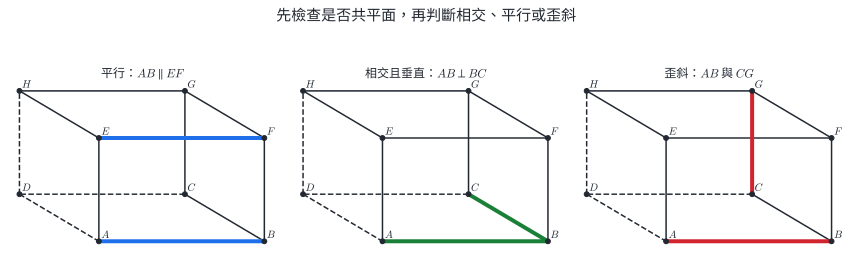{width=96%}

判斷流程由「是否共平面」開始。已知共平面時，沒有交點的兩相異直線平行；無法放進同一平面的兩直線歪斜。圖中的 $AB$ 與 $CG$ 沒有交點且方向不同，兩者也不共平面，因此為歪斜線。

::: example
### 示範 1｜在長方體中分類兩直線

長方體 $ABCD-EFGH$ 中，$E,F,G,H$ 分別位於 $A,B,C,D$ 正上方。判斷 $AB$ 與 $EF$、$AB$ 與 $BC$、$AB$ 與 $CG$ 的關係。

**解。**

1. $AB$ 與 $EF$ 同在平面 $ABFE$，方向相同且沒有交點，所以 $AB\parallel EF$。
2. $AB$ 與 $BC$ 交於 $B$。長方形 $ABCD$ 的相鄰邊互相垂直，所以 $AB\perp BC$。
3. $AB$ 位於底面，$CG$ 為鉛直稜。兩線沒有交點，方向也不同；包含 $AB$ 的前後延伸平面無法同時包含 $CG$，所以兩線歪斜。
:::

::: example
### 示範 2｜由兩直線決定平面

空間中兩相異直線 $L_1,L_2$ 都通過點 $P$，另有點 $Q$ 不在 $L_1$ 上。已知 $Q$ 在 $L_2$ 上。通過 $L_1,L_2$ 的平面有幾個？

**解。** $P,Q$ 是 $L_2$ 上兩個相異點，而 $Q$ 不在 $L_1$ 上，所以 $L_1$ 與 $L_2$ 是相交直線。兩相交直線決定唯一平面，因此恰有一個平面同時包含 $L_1,L_2$。
:::

空間線路、鋼梁與管線配置會區分相交、平行與歪斜。歪斜管線即使俯視圖相交，實際上仍可能位於不同高度；三維模型能保留這項資訊。

### 1.3 分節練習

1. 正立方體 $ABCD-EFGH$ 中，列出與 $AB$ 平行的三條稜。
2. 同一正立方體中，判斷 $AD$ 與 $FG$、$AC$ 與 $EG$ 的關係。
3. 空間中兩相異直線沒有交點。寫出兩種可能的位置關係及其區別條件。
4. 直線 $L$ 與線外點 $P$ 已知。說明通過 $L$ 與 $P$ 的平面為何唯一。

### 1.4 分節練習解析

1. $EF$、$DC$、$HG$ 都與 $AB$ 同方向，且各自與 $AB$ 共平面，所以皆平行於 $AB$。
2. $AD$ 與 $FG$ 方向相同，且同在平面 $ADGF$，所以平行。$AC$ 在底面，$EG$ 在頂面，兩線方向相同，所以平行。
3. 共平面且沒有交點時為平行；不共平面時為歪斜。
4. 在 $L$ 上取相異點 $A,B$。$A,B,P$ 不共線，三個不共線點決定唯一平面；該平面包含 $A,B$，因此也包含整條 $L$。

## 2. 直線與平面的關係

### 2.1 位置關係與垂直判定

直線 $L$ 與平面 $E$ 有三種位置關係：

1. 沒有交點，記為 $L\parallel E$。
2. 恰交於一點。
3. $L$ 落在 $E$ 上，有無限多個公共點。

若 $L$ 與 $E$ 交於 $P$，且 $L$ 與 $E$ 上每一條通過 $P$ 的直線都垂直，稱 $L$ **垂直平面** $E$，記為 $L\perp E$；$P$ 稱為垂足。

實際判定使用兩條方向：若平面 $E$ 內兩條相交直線 $m,n$ 交於 $P$，且 $L\perp m$、$L\perp n$，則 $L\perp E$。

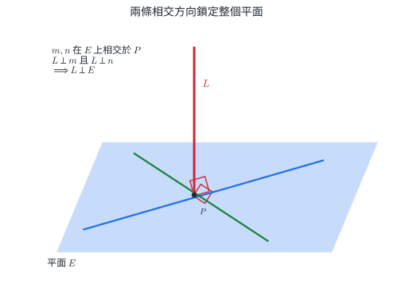{width=86%}

平面內任一方向都可由兩個不平行方向組合。$L$ 同時垂直 $m,n$，便與平面內所有方向垂直；這是兩線判定法成立的原因。

::: example
### 示範 1｜由兩條稜證明線面垂直

正方體 $ABCD-EFGH$ 中，證明 $AE\perp$ 平面 $ABCD$。

**解。** $AB,AD$ 位於平面 $ABCD$，且交於 $A$。正方體相鄰稜互相垂直，因此

$$
AE\perp AB,\; AE\perp AD.
$$

由兩線判定法，$AE\perp$ 平面 $ABCD$。
:::

::: example
### 示範 2｜點到平面的距離

一根長 $5\text{ m}$ 的支柱 $AP$ 垂直水平地面 $E$，鋼索由頂端 $P$ 接到地面上點 $B$，且 $AB=12\text{ m}$。求鋼索長與 $P$ 到地面的距離。

**解。** $AP\perp E$，而 $AB$ 位於 $E$ 且通過垂足 $A$，所以 $AP\perp AB$。在直角三角形 $PAB$ 中，

$$
PB=\sqrt{AP^2+AB^2}=\sqrt{5^2+12^2}=13\text{ m}.
$$

$P$ 到平面 $E$ 的距離是垂線段 $AP$ 的長，為 $5\text{ m}$。
:::

雷射測距、建築放樣與相機標定都需要正射影。距離以垂線段定義，因為它是點到平面上所有線段中最短的一條。

### 2.2 分節練習

1. 長方體 $ABCD-EFGH$ 中，寫出兩條垂直平面 $EFGH$ 的稜。
2. 直線 $L\perp E$，點 $P=L\cap E$。平面 $E$ 上通過 $P$ 的直線 $m$ 與 $L$ 的夾角是多少？
3. 旗桿 $PO$ 垂直地面，$PO=8\text{ m}$。地面點 $A$ 與 $O$ 相距 $15\text{ m}$，求 $PA$。
4. 平面 $E$ 內相交直線 $m,n$ 交於 $P$。直線 $L$ 通過 $P$ 且 $L\perp m,L\perp n$。寫出 $L$ 與 $E$ 的關係，並說明判定所用條件。

### 2.3 分節練習解析

1. $AE,BF,CG,DH$ 都垂直平面 $EFGH$；任寫兩條即可。
2. 依線面垂直定義，$L$ 與 $E$ 上所有通過 $P$ 的直線垂直，因此夾角為 $90^\circ$。
3. $PO\perp OA$，所以 $PA=\sqrt{8^2+15^2}=17\text{ m}$。
4. $L\perp E$。條件包含：$m,n$ 位於 $E$、兩線相交、$L$ 同時垂直兩線，故可用兩線判定法。

## 3. 平面與平面、兩面角

### 3.1 兩平面的位置與角度

兩平面可能平行、相交於一直線或重合。兩相交平面 $E_1,E_2$ 的交線記為 $L$。選定交線兩側的半平面後，兩個半平面與共同邊界 $L$ 組成一個**兩面角**。

量兩面角時，在 $L$ 上取點 $P$，分別在 $E_1,E_2$ 內作射線 $PA,PB$，使

$$
PA\perp L,\; PB\perp L.
$$

則 $\angle APB$ 就是該兩面角的大小。

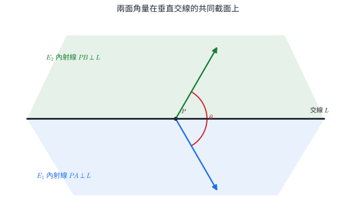{width=82%}

兩個平面相交會形成四個兩面角，相鄰兩角互補、對頂兩角相等。若其中一個兩面角為 $90^\circ$，兩平面互相垂直。

::: example
### 示範 1｜正方體中的兩面角

正方體 $ABCD-EFGH$ 中，求平面 $ABCD$ 與平面 $ABFE$ 沿交線 $AB$ 形成的兩面角。

**解。** 在交線 $AB$ 上取點 $A$。底面內 $AD\perp AB$，側面內 $AE\perp AB$，所以兩面角等於 $\angle DAE$。正方體相鄰稜垂直，故

$$
\angle DAE=90^\circ.
$$
:::

::: example
### 示範 2｜正四角錐側面與底面的夾角

正四角錐 $P-ABCD$ 的底面為邊長 $6$ 的正方形，$O$ 為底面中心，$PO\perp$ 底面且 $PO=4$。求側面 $PAB$ 與底面沿 $AB$ 形成的銳兩面角 $\theta$。

**解。** 設 $M$ 為 $AB$ 中點。等腰三角形 $PAB$ 中 $PM\perp AB$；正方形中 $OM\perp AB$。因此 $\angle PMO=\theta$。

底面中心到邊中點的距離為 $OM=3$，且 $PO\perp OM$。在直角三角形 $POM$ 中，

$$
\tan\theta=\frac{PO}{OM}=\frac43,
$$

所以

$$
\sin\theta=\frac45,\; \cos\theta=\frac35,
\; \theta\approx53.1^\circ.
$$
:::

屋頂坡度、折板結構與門片開啟角都以兩面角描述。量角所用的兩條射線要同時垂直交線，才能排除沿交線方向造成的偏斜。

### 3.2 分節練習

1. 兩相異平面都平行同一平面。寫出這兩平面的關係。
2. 正方體中，求平面 $ABCD$ 與平面 $BCGF$ 的兩面角。
3. 正四角錐的底邊長為 $10$，高為 $12$。求側面與底面沿一條底邊形成的銳兩面角之正切值。
4. 兩面角的交線為 $L$。射線 $PA$ 位於第一個半平面且 $PA\perp L$；射線 $PB$ 位於第二個半平面且 $PB\perp L$。若 $\angle APB=128^\circ$，相鄰兩面角是多少度？

### 3.3 分節練習解析

1. 兩相異平面平行。
2. 沿 $BC$ 取垂直線 $BA$ 與 $BF$，$\angle ABF=90^\circ$，所以兩面角為 $90^\circ$。
3. 底面中心到邊中點距離為 $5$，所以 $\tan\theta=12/5$。
4. 相鄰兩面角互補，大小為 $180^\circ-128^\circ=52^\circ$。

## 4. 長方體表面上的最短路徑

### 4.1 展開成直線距離

物體表面上的路徑沿著各面移動。把路徑經過的面沿稜攤平，原路徑長度保持不變；在平面中，兩點間最短路徑是線段。因此，表面最短路徑可用下列步驟求得：

1. 列出能連接兩點的不同展開方式。
2. 在每個展開圖中連接兩點，使用畢氏定理求長。
3. 比較所有可行長度。

長、寬、高為 $a,b,c$ 的長方體，其一對相對頂點有三類展開長度：

$$
\sqrt{(a+b)^2+c^2},\;
\sqrt{(a+c)^2+b^2},\;
\sqrt{(b+c)^2+a^2}.
$$

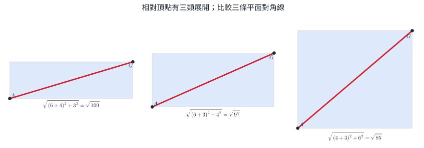{width=96%}

::: example
### 示範 1｜相對頂點的表面最短路徑

長方體三邊長為 $6,4,3$。求一對相對頂點沿表面的最短距離。

**解。** 三類展開長度平方為

$$
(6+4)^2+3^2=109,
$$

$$
(6+3)^2+4^2=97,
$$

$$
(4+3)^2+6^2=85.
$$

最小值是 $85$，所以表面最短距離為 $\sqrt{85}$。
:::

::: example
### 示範 2｜指定經過一條稜

長方體 $ABCD-EFGH$ 中，$AB=6,AD=4,AE=3$。一隻螞蟻由 $A$ 沿表面到 $G$，且路徑經過稜 $EF$。求最短距離。

**解。** 路徑先在前面 $ABFE$，再跨過 $EF$ 到頂面 $EFGH$。把兩面沿 $EF$ 攤平，得到長、寬分別為 $6$ 與 $3+4=7$ 的矩形，$A,G$ 成為相對頂點。因此

$$
AG_{\text{表面}}=\sqrt{6^2+7^2}=\sqrt{85}.
$$

指定經過 $EF$ 已固定展開方式，無須再比較其他兩類展開。
:::

包裝上的電路、管線、貼紙與切割線都沿表面配置。展開圖把立體上的路徑限制轉成平面上「必須跨過哪一條稜」的條件。

### 4.2 分節練習

1. 三邊長為 $8,5,2$ 的長方體，求相對頂點的表面最短距離。
2. 正方體邊長為 $6$，求相對頂點的表面最短距離。
3. 長方體中 $AB=5,AD=4,AE=3$。由 $A$ 到 $G$ 且路徑經過稜 $BF$，求最短距離。
4. 說明長方體相對頂點的空間直線距離與表面最短距離為何採用不同展開或公式。

### 4.3 分節練習解析

1. 三類平方為 $(8+5)^2+2^2=173$、$(8+2)^2+5^2=125$、$(5+2)^2+8^2=113$，所以最短距離為 $\sqrt{113}$。
2. 每一類都是 $\sqrt{(6+6)^2+6^2}=6\sqrt5$。
3. 沿 $BF$ 攤開前面與右面，矩形兩邊為 $5+4=9$ 與 $3$，所以長度為 $\sqrt{9^2+3^2}=3\sqrt{10}$。
4. 空間直線可穿過立體內部，長度為 $\sqrt{a^2+b^2+c^2}$；表面路徑只能留在各面上，攤開後跨越兩個面長，故出現 $(a+b)$ 等和。

## 5. 立體圖形的展開圖

### 5.1 邊的接合與面積守恆

展開圖把立體各面沿稜剪開並攤到平面。折回立體時，每一條被剪開的稜要與另一條等長邊接合；面積在展開與折疊過程中保持不變。

直角柱的側面展開為一排矩形，矩形總寬等於底面周長。角錐的每個側面是以底面一邊為底的三角形。直圓錐的側面展開為扇形：扇形半徑等於圓錐母線長 $R$，扇形弧長等於底面圓周 $2\pi r$。

令扇形圓心角為 $\theta$ 弳，則

$$
R\theta=2\pi r.
$$

側面積為

$$
\frac12R^2\theta
=\frac12R(2\pi r)
=\pi Rr.
$$

直圓錐臺可視為大圓錐去掉相似的小圓錐。若上、下底半徑為 $r_1,r_2$，母線長為 $s$，側面積化簡為

$$
\pi(r_1+r_2)s.
$$

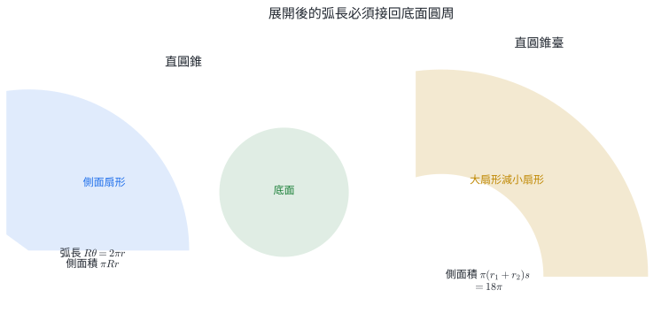{width=94%}

::: example
### 示範 1｜直圓錐的表面積與扇形角

直圓錐底面半徑為 $3$，母線長為 $5$。求側面積、總表面積與展開扇形圓心角。

**解。**

$$
A_{\text{側}}=\pi Rr=\pi(5)(3)=15\pi.
$$

底面積為 $9\pi$，所以總表面積為 $24\pi$。由弧長接合條件

$$
5\theta=2\pi(3),
$$

得

$$
\theta=\frac{6\pi}{5}\text{ 弳}=216^\circ.
$$
:::

::: example
### 示範 2｜直圓錐臺的材料面積

燈罩呈直圓錐臺，上、下底半徑為 $2\text{ cm},5\text{ cm}$，母線長為 $6\text{ cm}$。求不含上下底的材料面積；若兩底都封住，再求總表面積。

**解。** 側面積為

$$
\pi(2+5)(6)=42\pi\text{ cm}^2.
$$

兩底面積和為

$$
\pi(2^2+5^2)=29\pi\text{ cm}^2.
$$

封閉時總表面積為 $71\pi\text{ cm}^2$。
:::

包裝打樣會在平面材料上先排展開圖，再加黏貼邊與裁切間距。幾何面積提供理想材料量；實際用料還需加入接縫與加工損耗。

### 5.2 分節練習

1. 直圓柱底面半徑為 $4$、高為 $7$。寫出側面展開矩形的長與寬，並求側面積。
2. 直圓錐底面半徑為 $4$、母線長為 $10$。求側面積與展開扇形圓心角。
3. 直圓錐臺上下底半徑為 $3,8$，母線長為 $5$。求側面積。
4. 一個正四角錐底邊長為 $6$，四個側面都是底 $6$、高 $5$ 的等腰三角形。求總表面積。

### 5.3 分節練習解析

1. 矩形長等於底面周長 $8\pi$，寬為柱高 $7$；側面積為 $56\pi$。
2. 側面積 $=\pi(10)(4)=40\pi$。$10\theta=8\pi$，所以 $\theta=4\pi/5$ 弳 $=144^\circ$。
3. 側面積 $=\pi(3+8)(5)=55\pi$。
4. 底面積 $6^2=36$；四個側面積共 $4\cdot(1/2)(6)(5)=60$，總表面積為 $96$。

## 6. 平面與立體的截痕

### 6.1 截痕、截面與追蹤方法

平面與立體表面相交的線段或曲線稱為**截痕**，截痕圍成的平面圖形稱為**截面**。多面體的截面可依下列規則追蹤：

1. 截面頂點落在多面體的稜上。
2. 同一個面上的兩個截點以線段相連。
3. 一條截痕到達某稜後，從共享該稜的相鄰面繼續。
4. 所有線段位於同一截平面並形成封閉多邊形。

正立方體的平面截面最多與六個面相交，因此最多有六邊。靠近一個頂點切割可得到三角形；穿過六條稜可得到六邊形。

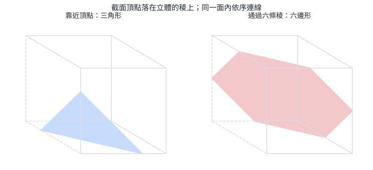{width=88%}

::: example
### 示範 1｜以坐標核對正立方體截面

單位正立方體為 $0\le x,y,z\le1$。平面 $x+y+z=1$ 與三條坐標軸分別交於哪些點？截面是什麼圖形？

**解。**

- 在 $x$ 軸上，$y=z=0$，得 $(1,0,0)$。
- 在 $y$ 軸上，$x=z=0$，得 $(0,1,0)$。
- 在 $z$ 軸上，$x=y=0$，得 $(0,0,1)$。

三點都在正立方體的稜上。任兩點距離都是 $\sqrt2$，所以截面為正三角形。
:::

::: example
### 示範 2｜由中點截角得到多面體

正立方體每個頂點都以通過三條鄰稜中點的平面截去。求新立體的面數、頂點數與稜數。

**解。** 每個原頂點產生一個正三角形，共 $8$ 個三角形；每個原正方形留下由四個邊中點構成的正方形，共 $6$ 個正方形。因此

$$
F=8+6=14.
$$

新頂點是原正立方體的 $12$ 條稜中點，所以 $V=12$。由凸多面體的尤拉關係

$$
V-E+F=2,
$$

得

$$
E=V+F-2=12+14-2=24.
$$
:::

醫學影像與工業斷層掃描以一連串平行截面重建立體內部。每一張影像記錄特定高度的截痕，再由相鄰切片推回三維形狀。

### 6.2 分節練習

1. 平面切過正方體一個頂點附近的三條鄰稜，截面有幾個頂點？
2. 單位正立方體中，平面 $x+y+z=3/2$ 會通過哪些稜的中點？截面有幾邊？
3. 正八面體有 $8$ 個三角形面、$6$ 個頂點。利用尤拉關係求稜數。
4. 一個凸多面體有 $F=12,E=30$。求頂點數。

### 6.3 分節練習解析

1. 平面分別與三條鄰稜相交，三個交點依序相連，所以截面有 $3$ 個頂點。
2. 例如 $z=0$ 的底面上，$x+y=3/2$ 通過 $(1,1/2,0)$、$(1/2,1,0)$；其餘四點由坐標輪換得到。共有六個稜中點，截面為六邊形。
3. $6-E+8=2$，所以 $E=12$。
4. $V-30+12=2$，所以 $V=20$。

## 7. 空間坐標與正射影

### 7.1 右手坐標系

在空間中取原點 $O$，作三條兩兩垂直的坐標軸 $x,y,z$。正向依右手規則排列：右手四指由 $x$ 軸正向轉向 $y$ 軸正向，大拇指指向 $z$ 軸正向。

$x,y$ 軸決定 $xy$ 平面，$y,z$ 軸決定 $yz$ 平面，$x,z$ 軸決定 $xz$ 平面。三個坐標平面把空間分成八個卦限；三個坐標皆為正的區域是第一卦限。

點 $P(a,b,c)$ 投影到坐標軸與坐標平面時，保留平行於投影目標的坐標，將垂直方向的坐標改成 $0$：

| 投影目標 | 投影點坐標 |
|---|---|
| $x$ 軸 | $(a,0,0)$ |
| $y$ 軸 | $(0,b,0)$ |
| $z$ 軸 | $(0,0,c)$ |
| $xy$ 平面 | $(a,b,0)$ |
| $yz$ 平面 | $(0,b,c)$ |
| $xz$ 平面 | $(a,0,c)$ |

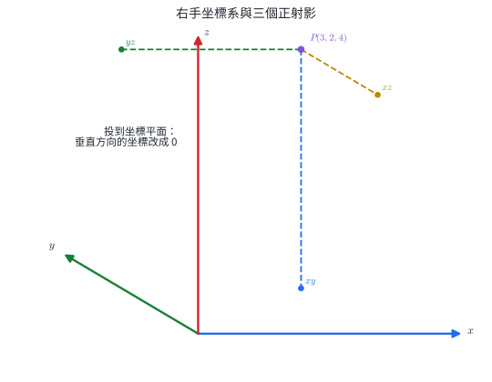{width=86%}

### 7.2 點到軸與坐標平面的距離

由投影點坐標可直接得到距離：

$$
d(P,x\text{ 軸})=\sqrt{b^2+c^2},\quad
d(P,y\text{ 軸})=\sqrt{a^2+c^2},\quad
d(P,z\text{ 軸})=\sqrt{a^2+b^2},
$$

$$
d(P,xy)=|c|,\; d(P,yz)=|a|,\; d(P,xz)=|b|.
$$

絕對值反映距離為非負量；坐標正負則記錄點位於平面的哪一側。

::: example
### 示範 1｜投影點與距離表

已知 $P(3,-2,5)$，求 $P$ 在 $x$ 軸、$yz$ 平面的投影點，以及到這兩個目標的距離。

**解。** 投到 $x$ 軸只保留 $x$ 坐標，投影點為 $(3,0,0)$，距離

$$
\sqrt{(-2)^2+5^2}=\sqrt{29}.
$$

投到 $yz$ 平面令 $x=0$，投影點為 $(0,-2,5)$，距離為 $|3|=3$。
:::

::: example
### 示範 2｜由投影資訊還原坐標

點 $Q$ 位於第一卦限。已知它在 $xy$ 平面的投影為 $(4,3,0)$，且 $Q$ 到 $xy$ 平面的距離為 $12$。求 $Q$ 坐標與 $QO$。

**解。** 投影給出 $x=4,y=3$。到 $xy$ 平面的距離為 $|z|=12$；第一卦限使 $z>0$，所以

$$
Q=(4,3,12).
$$

$$
QO=\sqrt{4^2+3^2+12^2}=13.
$$
:::

機械手臂與無人機的定位系統都需要明確指定坐標軸正向。右手規則確保不同元件使用同一種方向約定，投影則把三維位置轉成俯視、前視與側視資料。

### 7.3 分節練習

1. 點 $A(-4,2,7)$ 投影到三個坐標平面的坐標各為何？
2. 求 $A(-4,2,7)$ 到三個坐標平面的距離。
3. 點 $B$ 在 $xz$ 平面的投影為 $(5,0,-2)$，到 $xz$ 平面的距離為 $3$。寫出 $B$ 的兩個可能坐標。
4. 點 $C$ 位於第一卦限，到 $yz,xz,xy$ 平面的距離分別為 $2,4,6$。求 $C$ 坐標。

### 7.4 分節練習解析

1. 投到 $xy,yz,xz$ 平面分別為 $(-4,2,0)$、$(0,2,7)$、$(-4,0,7)$。
2. 距離分別為 $|7|=7$、$|-4|=4$、$|2|=2$。
3. $x=5,z=-2$ 且 $|y|=3$，所以 $B=(5,3,-2)$ 或 $(5,-3,-2)$。
4. 三個距離依序給出 $|x|=2,|y|=4,|z|=6$；第一卦限取正，故 $C=(2,4,6)$。

## 8. 空間距離、中點與對稱

### 8.1 距離公式的推導

設 $P(x_1,y_1,z_1)$、$Q(x_2,y_2,z_2)$。由 $P$ 到 $Q$ 的三個坐標差為

$$
\Delta x=x_2-x_1,\quad
\Delta y=y_2-y_1,\quad
\Delta z=z_2-z_1.
$$

三個方向兩兩垂直，連續使用畢氏定理得到

$$
PQ=\sqrt{(x_2-x_1)^2+(y_2-y_1)^2+(z_2-z_1)^2}.
$$

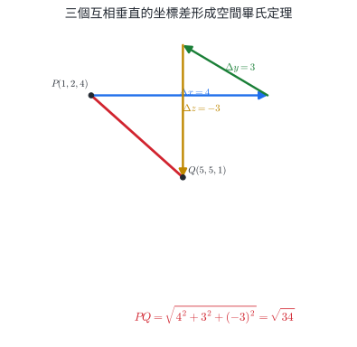{width=86%}

線段中點每一個坐標都取兩端平均：

$$
M\left(\frac{x_1+x_2}{2},\frac{y_1+y_2}{2},\frac{z_1+z_2}{2}\right).
$$

對坐標平面反射時，垂直於該平面的坐標變號。例如

$$
(a,b,c)\xrightarrow{\text{對 }yz\text{ 平面反射}}(-a,b,c).
$$

對 $z$ 軸反射相當於繞 $z$ 軸旋轉 $180^\circ$，結果為 $(-a,-b,c)$。

::: example
### 示範 1｜距離、中點與中線

已知 $A(1,-2,3)$、$B(5,4,-1)$。求 $AB$ 與其中點 $M$。

**解。**

$$
AB=\sqrt{(5-1)^2+(4-(-2))^2+(-1-3)^2}
=\sqrt{16+36+16}=2\sqrt{17}.
$$

$$
M=\left(\frac{1+5}{2},\frac{-2+4}{2},\frac{3+(-1)}{2}\right)
=(3,1,1).
$$
:::

::: example
### 示範 2｜坐標軸上的等距點

已知 $A(1,2,3)$、$B(3,4,5)$，點 $P$ 在 $x$ 軸上且 $PA=PB$。求 $P$。

**解。** 設 $P=(t,0,0)$。比較距離平方：

$$
(t-1)^2+2^2+3^2=(t-3)^2+4^2+5^2.
$$

展開並消去 $t^2$：

$$
-2t+14=-6t+50,
$$

所以 $4t=36,t=9$，故 $P=(9,0,0)$。代回可得兩邊距離平方皆為 $77$。
:::

三維掃描常以兩個端點的中點估算構件中心，以距離公式比對量測誤差。反射公式則描述鏡射零件、對稱建模與影像翻轉。

### 8.2 分節練習

1. 求 $P(-2,0,3)$、$Q(1,-4,-1)$ 的距離與中點。
2. 已知線段 $AB$ 中點為 $(2,3,4)$，且 $A=(-1,5,2)$，求 $B$。
3. 寫出點 $(3,-2,5)$ 對 $xy$ 平面、$y$ 軸的對稱點。
4. 點 $R=(t,0,0)$ 在 $x$ 軸上，且到 $A(0,3,0)$ 的距離為 $5$。求 $R$。

### 8.3 分節練習解析

1. 坐標差為 $(3,-4,-4)$，所以距離 $=\sqrt{9+16+16}=\sqrt{41}$；中點為 $(-1/2,-2,1)$。
2. 由 $(A+B)/2=M$，得 $B=2M-A=(5,1,6)$。
3. 對 $xy$ 平面反射為 $(3,-2,-5)$；對 $y$ 軸反射為 $(-3,-2,-5)$。
4. $t^2+3^2=25$，所以 $t=\pm4$，得 $R=(4,0,0)$ 或 $(-4,0,0)$。

## 9. 球面與平面的截痕

### 9.1 交集由球心距離決定

空間中與定點 $O$ 的距離固定為 $R$ 的所有點組成**球面**；$O$ 是球心，$R$ 是球半徑。設平面 $E$ 到球心的垂直距離為 $d$：

- $d>R$ 時，平面與球面沒有交點。
- $d=R$ 時，平面與球面相切於一點。
- $0\le d<R$ 時，截痕為圓。

當截痕為圓時，令 $A$ 為球心 $O$ 在平面 $E$ 的投影，$P$ 為截圓上一點。$OA\perp E$，而 $AP$ 位於 $E$，所以三角形 $OAP$ 在 $A$ 為直角：

$$
OP^2=OA^2+AP^2.
$$

代入 $OP=R,OA=d$，截圓半徑為

$$
r=AP=\sqrt{R^2-d^2}.
$$

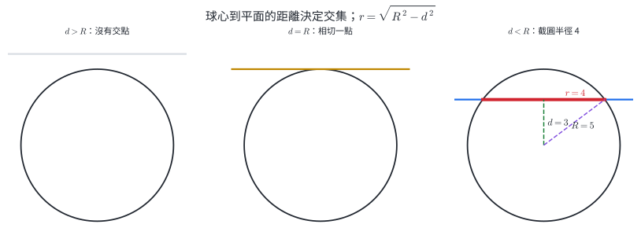{width=94%}

若平面通過球心，$d=0$ 且 $r=R$，截圓稱為**大圓**。其餘截圓半徑小於 $R$，稱為**小圓**。

::: example
### 示範 1｜由球心距離求截圓

半徑為 $5$ 的球面被一平面截出一圓，球心到平面的距離為 $3$。求截圓半徑與面積。

**解。**

$$
r=\sqrt{5^2-3^2}=4.
$$

因此截圓面積為

$$
\pi r^2=16\pi.
$$

$d<R$，所以這是小圓。
:::

::: example
### 示範 2｜同時與兩點保持固定距離的軌跡

相異點 $A,B$ 滿足 $AB=5$。求所有同時滿足 $PA=3,PB=4$ 的空間點 $P$ 所成圖形，並求其半徑。

**解。** 以 $A,B$ 為球心、半徑 $3,4$ 的兩球面相交。兩球面的交集位於一個垂直 $AB$ 的平面上，且形成圓。

設截圓圓心為 $H$，令 $AH=x$，則 $BH=5-x$。由兩個直角三角形：

$$
PH^2+x^2=3^2,
$$

$$
PH^2+(5-x)^2=4^2.
$$

兩式相減得 $(5-x)^2-x^2=7$，所以 $25-10x=7$，$x=9/5$。因此

$$
PH=\sqrt{9-\left(\frac95\right)^2}=\frac{12}{5}.
$$

所成圖形是半徑 $12/5$ 的圓。
:::

斷層掃描以平面切過近似球形器官；截圓半徑隨切面離中心的距離改變。知道球半徑與截圓半徑，也能反推切面位置。

### 9.2 分節練習

1. 半徑 $10$ 的球面被距球心 $6$ 的平面所截。求截圓半徑與周長。
2. 球面半徑為 $7$。截圓半徑為 $7$ 時，截平面與球心的關係為何？
3. 半徑為 $13$ 的球面截出半徑 $5$ 的小圓。求球心到截平面的距離。
4. 相異點 $A,B$ 距離為 $6$。所有滿足 $PA=PB=5$ 的點 $P$ 形成什麼圖形？求其圓心位置與半徑。

### 9.3 分節練習解析

1. $r=\sqrt{10^2-6^2}=8$，周長為 $16\pi$。
2. $r=R$ 只在 $d=0$ 成立，所以截平面通過球心，截痕為大圓。
3. $d=\sqrt{13^2-5^2}=12$。
4. 圓心為 $AB$ 中點 $H$，因 $PA=PB$ 的點位於 $AB$ 的中垂平面。$AH=3$，故半徑 $PH=\sqrt{5^2-3^2}=4$；軌跡是以 $H$ 為圓心、半徑 $4$，位於 $AB$ 中垂平面上的圓。

## 10. 經緯度、球面坐標與弧長

### 10.1 經線與緯線

地球模型的南、北極記為 $S,N$。通過 $S,N$ 的半個大圓稱為**經線**。經度量的是該經線半平面與 $0^\circ$ 經線半平面的兩面角，分為東經與西經，範圍皆為 $0^\circ$ 到 $180^\circ$。

垂直地軸 $NS$ 的平面與球面所截的圓稱為**緯線**。通過球心的緯線是赤道，也是唯一的大圓緯線。緯度 $\varphi$ 是球心到該點的半徑與赤道平面的夾角，分為北緯與南緯。

設球半徑為 $R$，東經取 $\theta>0$、西經取 $\theta<0$；北緯取 $\varphi>0$、南緯取 $\varphi<0$。令赤道為 $xy$ 平面，$0^\circ$ 經線與赤道交於 $x$ 軸正向，則球面點坐標為

$$
P=(R\cos\varphi\cos\theta,
R\cos\varphi\sin\theta,
R\sin\varphi).
$$

推導分成兩步。$P$ 投影到赤道面的點記為 $Q$，則

$$
OQ=R\cos\varphi,\; PQ=R\sin\varphi.
$$

再於 $xy$ 平面依經度分解 $OQ$，便得到 $x,y$ 坐標。

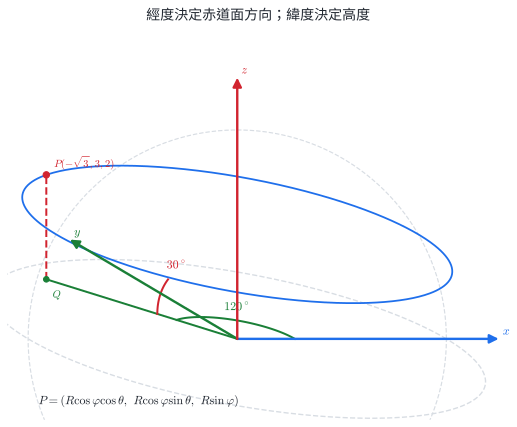{width=84%}

### 10.2 緯線、經線與大圓距離

緯度為 $\varphi$ 的緯線半徑為

$$
r=R\cos\varphi.
$$

沿同一緯線跨越經度角 $\Delta\theta$ 弳，路程為

$$
s_{\text{緯線}}=R\cos\varphi\,|\Delta\theta|.
$$

沿同一經線跨越緯度角 $\Delta\varphi$ 弳，路程為

$$
s_{\text{經線}}=R|\Delta\varphi|.
$$

球面上兩點的最短路徑沿通過兩點與球心的大圓劣弧。若中心角為 $\gamma$，弧長為 $R\gamma$；球內直線段是弦，長度為 $2R\sin(\gamma/2)$。

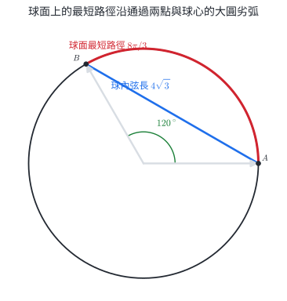{width=78%}

::: example
### 示範 1｜經緯度換成坐標

半徑為 $4$ 的球面上，點 $P$ 位於北緯 $30^\circ$、東經 $120^\circ$。求 $P$ 坐標。

**解。**

$$
x=4\cos30^\circ\cos120^\circ
=4\cdot\frac{\sqrt3}{2}\cdot\left(-\frac12\right)
=-\sqrt3,
$$

$$
y=4\cos30^\circ\sin120^\circ
=4\cdot\frac{\sqrt3}{2}\cdot\frac{\sqrt3}{2}=3,
$$

$$
z=4\sin30^\circ=2.
$$

因此 $P=(-\sqrt3,3,2)$。檢查 $OP^2=3+9+4=16=R^2$。
:::

::: example
### 示範 2｜同速航行造成的經度差

甲沿赤道、乙沿北緯 $60^\circ$ 緯線，同時由 $0^\circ$ 經線向東以相同速率航行。甲到東經 $30^\circ$ 時，乙到哪一條經線？

**解。** 北緯 $60^\circ$ 緯線半徑為 $R\cos60^\circ=R/2$。設乙跨越經度 $x^\circ$。同速同時使路程相等：

$$
R\cdot\frac{30\pi}{180}
=\frac R2\cdot\frac{x\pi}{180}.
$$

約去共同因子得 $x=60$，所以乙位於東經 $60^\circ$。
:::

::: example
### 示範 3｜弦長與大圓弧長

半徑為 $4$ 的球面上，兩點的中心角為 $120^\circ$。求球內直線距離與球面最短距離。

**解。** 弦長為

$$
2R\sin\frac{120^\circ}{2}
=8\sin60^\circ=4\sqrt3.
$$

大圓劣弧長為

$$
R\gamma=4\cdot\frac{2\pi}{3}=\frac{8\pi}{3}.
$$

球面路徑受表面限制，因此 $8\pi/3>4\sqrt3$。
:::

經緯度適合表達全球位置，空間坐標適合進行距離與方向運算。地理資訊系統會在兩種表示間轉換，再依地球模型修正尺度。

### 10.3 分節練習

1. 半徑為 $2$ 的球面上，北緯 $60^\circ$、東經 $90^\circ$ 的點坐標為何？
2. 地球半徑取 $6400\text{ km}$。沿北緯 $60^\circ$ 由東經 $60^\circ$ 到東經 $150^\circ$，求路程。
3. 半徑為 $24\text{ cm}$ 的地球儀上，沿同一經線由赤道到北緯 $60^\circ$，求弧長。
4. 球面上一點為北緯 $25^\circ$、東經 $121^\circ$。寫出其對蹠點的經緯度。

### 10.4 分節練習解析

1. $x=2\cos60^\circ\cos90^\circ=0$，$y=2\cos60^\circ\sin90^\circ=1$，$z=2\sin60^\circ=\sqrt3$，所以坐標為 $(0,1,\sqrt3)$。
2. 緯線半徑 $=6400\cos60^\circ=3200$。經度差 $90^\circ=\pi/2$ 弳，所以路程 $=3200(\pi/2)=1600\pi\text{ km}$。
3. 緯度差 $60^\circ=\pi/3$ 弳，路程 $=24(\pi/3)=8\pi\text{ cm}$。
4. 對蹠點緯度變號，經度相差 $180^\circ$。$121^\circ$E 加 $180^\circ$ 等同 $59^\circ$W，所以為南緯 $25^\circ$、西經 $59^\circ$。

## 11. 生活中的圓錐曲線

### 11.1 三類形狀與辨識線索

圓錐曲線包含橢圓（圓為特殊情形）、拋物線與雙曲線。高中數學B本節以形狀、截痕與應用辨識為主；下列方程提供可計算的代表圖：

- 拋物線 $y=ax^2$（$a\ne0$）有一個頂點與一條對稱軸，向單一方向開口。
- 橢圓 $x^2/a^2+y^2/b^2=1$ 為封閉曲線；$a=b$ 時是圓。
- 雙曲線 $x^2/a^2-y^2/b^2=1$ 有兩支；反比例 $xy=k$（$k\ne0$）也形成雙曲線。

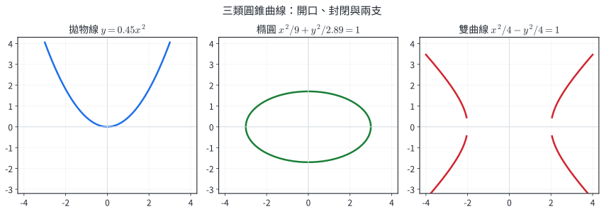{width=96%}

物體在均勻重力下的拋射軌跡可寫成

$$
y=y_0+x\tan\theta-\frac{g}{2v_0^2\cos^2\theta}x^2,
$$

所以理想軌跡是拋物線。此模型忽略空氣阻力、自旋與地面高低差。

斜切直圓柱得到橢圓；行星在理想二體重力模型下沿橢圓運行；兩量成反比時的資料圖呈雙曲線。實物外觀常只顯示曲線的一部分，辨識時仍依其延伸後的整體類型判斷。

::: example
### 示範 1｜由機制辨識曲線

判斷下列形狀所屬類型：理想籃球軌跡、斜切圓柱的封閉邊界、關係 $xy=12$ 的圖。

**解。**

1. 理想拋射運動的高度是水平位置的二次函數，所以為拋物線。
2. 平面斜切直圓柱且形成封閉截痕，邊界為橢圓。
3. $xy=12$ 可寫成 $y=12/x$，正、負 $x$ 各形成一支，為雙曲線。
:::

::: example
### 示範 2｜由資料建立拋物線模型

噴水口位於原點，水柱在水平距離 $2\text{ m}$ 時高 $3\text{ m}$，並在水平距離 $6\text{ m}$ 落地。設軌跡為 $y=ax^2+bx$，求方程與最高點。

**解。** 代入 $(2,3)$ 與 $(6,0)$：

$$
4a+2b=3,
$$

$$
36a+6b=0.
$$

第二式除以 $6$ 得 $6a+b=0$。聯立可得 $a=-3/8,b=9/4$，所以

$$
y=-\frac38x^2+\frac94x.
$$

頂點橫坐標

$$
x=-\frac{b}{2a}=3,
$$

代回得最高點 $(3,27/8)$，高度為 $3.375\text{ m}$。
:::

圓錐曲線辨識能把照片或場景轉成模型。模型成立後，便可估算水柱最高點、光斑邊界、軌道範圍或反比例設備曲線。

### 11.2 分節練習

1. 將下列形狀分類：$y=-2x^2+3$、$x^2/9+y^2/4=1$、$xy=-5$。
2. 一顆球的理想軌跡為 $y=-x^2+6x+2$。求最高點。
3. 一個圓柱杯斜放時，水平液面與圓柱側面的完整交線是哪類曲線？
4. 反比例模型 $xy=24$ 中，當 $x=3,6,8$ 時求 $y$，並說明 $x$ 增加時 $y$ 的變化。

### 11.3 分節練習解析

1. 依序為拋物線、橢圓、雙曲線。
2. $x=-6/(2\cdot-1)=3$，$y(3)=11$，最高點為 $(3,11)$。
3. 斜切直圓柱所得完整封閉截痕為橢圓。
4. $y=24/x$，依序為 $8,4,3$；在 $x>0$ 的範圍，$x$ 增加時 $y$ 減少。

## 12. 直圓錐面與截痕分類

### 12.1 軸、母線與半頂角

兩直線 $L,M$ 交於頂點 $K$，銳夾角為 $\alpha$。固定 $L$，使 $M$ 繞 $L$ 旋轉一周，$M$ 掃出的曲面稱為**直圓錐面**。$L$ 是軸，$M$ 是母線，$2\alpha$ 是頂角，$\alpha$ 是半頂角。

設截平面 $E$ 不通過 $K$，$\beta$ 為平面 $E$ 與軸 $L$ 的銳夾角：

| 角度條件 | 截痕 |
|---|---|
| $\beta=90^\circ$ | 圓 |
| $\alpha<\beta<90^\circ$ | 橢圓 |
| $\beta=\alpha$ | 拋物線 |
| $0\le\beta<\alpha$ | 雙曲線 |

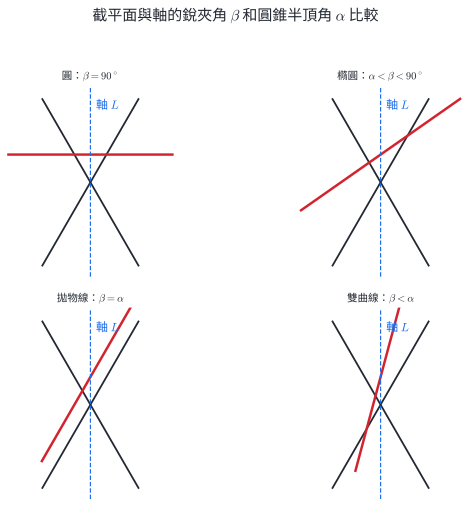{width=98%}

$\beta>\alpha$ 時，平面只切到圓錐面的一半並形成封閉曲線；$\beta=\alpha$ 時，平面平行一條母線，截痕恰好開口；$\beta<\alpha$ 時，平面切到上下兩半，形成雙曲線兩支。

若題目給的是截平面法線與軸的銳夾角 $\gamma$，則

$$
\beta=90^\circ-\gamma.
$$

先換成平面與軸的角，再與 $\alpha$ 比較。

### 12.2 通過頂點的退化情形

截平面通過頂點 $K$ 時，截痕可為一點、一直線或兩相交直線，統稱**退化圓錐曲線**。

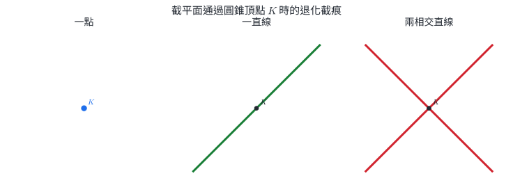{width=80%}

::: example
### 示範 1｜由法線角分類三個截痕

直圓錐面的半頂角 $\alpha=30^\circ$。三個截平面都不通過頂點，平面法線與軸的夾角依序為 $0^\circ,60^\circ,80^\circ$。分類三個截痕。

**解。** 轉成平面與軸的夾角 $\beta=90^\circ-\gamma$：

1. $\gamma=0^\circ$，$\beta=90^\circ$，截痕為圓。
2. $\gamma=60^\circ$，$\beta=30^\circ=\alpha$，截痕為拋物線。
3. $\gamma=80^\circ$，$\beta=10^\circ<\alpha$，截痕為雙曲線。
:::

::: example
### 示範 2｜同角度下比較一般與退化截痕

直圓錐面的半頂角為 $25^\circ$。平面與軸夾角為 $40^\circ$。當平面不通過頂點與通過頂點時，截痕分別為何？

**解。** $40^\circ>25^\circ$。平面不通過頂點時，只切到一半圓錐面且形成封閉曲線，所以為橢圓。

平面通過頂點時，除了頂點外不再與圓錐面相交，截痕退化為一點。
:::

聚光燈的光線邊界近似圓錐面，牆面或地面就是截平面。調整燈具角度會依序改變光斑的封閉性，這使截痕分類能直接預測照明範圍。

### 12.3 分節練習

1. 直圓錐面半頂角為 $35^\circ$。截平面不過頂點且與軸夾角為 $70^\circ$，截痕為何？
2. 同一圓錐面中，截平面法線與軸夾角為 $55^\circ$，且平面不過頂點。截痕為何？
3. 半頂角為 $40^\circ$，截平面與軸平行且不過頂點。截痕為何？
4. 列出平面通過直圓錐面頂點時的三種退化截痕。

### 12.4 分節練習解析

1. $70^\circ>35^\circ$ 且小於 $90^\circ$，所以為橢圓。
2. $\beta=90^\circ-55^\circ=35^\circ=\alpha$，所以為拋物線。
3. 平面與軸夾角 $\beta=0^\circ<40^\circ$，所以為雙曲線。
4. 一點、一直線、兩相交直線。

## 13. 圓錐曲線的幾何機制與應用

### 13.1 拋物線的焦點與準線

給定一點 $F$ 與一條不通過 $F$ 的直線 $L$。到 $F$ 的距離等於到 $L$ 的距離之所有點形成拋物線；$F$ 稱為焦點，$L$ 稱為準線。

標準拋物線 $y=x^2/(4f)$ 的焦點是 $(0,f)$，準線是 $y=-f$。對曲線上一點 $P(x,x^2/(4f))$：

$$
PF^2=x^2+\left(\frac{x^2}{4f}-f\right)^2
=\left(\frac{x^2}{4f}+f\right)^2,
$$

因此

$$
PF=\frac{x^2}{4f}+f,
$$

恰等於 $P$ 到準線 $y=-f$ 的垂直距離。

拋物線切線使「平行於對稱軸的方向」與「指向焦點的方向」形成相等反射角，因此平行訊號會集中到焦點；反向使用時，焦點發出的訊號反射後近似平行。

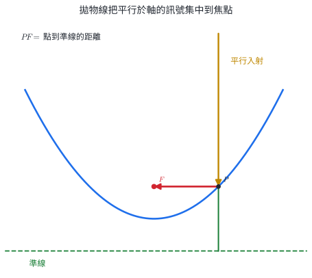{width=80%}

### 13.2 橢圓的雙焦點性質

給定兩點 $F_1,F_2$。到兩焦點距離和為定值 $2a$ 的點形成橢圓：

$$
PF_1+PF_2=2a.
$$

橢圓在任一邊界點的切線，使連向兩焦點的兩條線形成相等反射角。因此從一個焦點發出的理想射線，經橢圓邊界反射後會通過另一焦點。

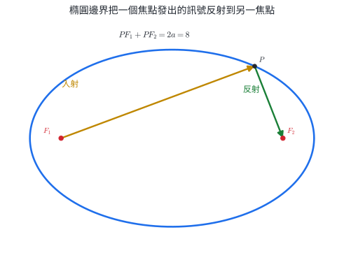{width=84%}

::: example
### 示範 1｜核對拋物線的焦點定義

拋物線 $y=x^2/4$ 的焦點為 $F(0,1)$，準線為 $y=-1$。核對點 $P(2,1)$ 位於拋物線，並比較 $PF$ 與 $P$ 到準線的距離。

**解。** 代入 $x=2$ 得 $y=2^2/4=1$，所以 $P$ 在曲線上。

$$
PF=\sqrt{(2-0)^2+(1-1)^2}=2.
$$

$P$ 到 $y=-1$ 的垂直距離是 $|1-(-1)|=2$。兩距離相等，符合拋物線定義。
:::

::: example
### 示範 2｜核對橢圓的距離和

橢圓 $x^2/25+y^2/9=1$ 的兩焦點為 $F_1(-4,0),F_2(4,0)$。核對頂點 $P(0,3)$ 的雙焦點距離和。

**解。** 此橢圓 $a=5,b=3$，焦距參數

$$
c=\sqrt{a^2-b^2}=\sqrt{25-9}=4.
$$

所以兩焦點如題。又

$$
PF_1=PF_2=\sqrt{4^2+3^2}=5,
$$

故

$$
PF_1+PF_2=10=2a.
$$
:::

拋物面天線、車燈反射罩與太陽爐利用拋物線聚焦或準直；橢圓形反射裝置能把一焦點的聲音或能量導向另一焦點。理想反射假設邊界光滑、反射遵守入射角等於反射角；材料吸收、表面誤差與三維形狀會影響實際效果。

天體在單一重力源的理想模型下，其軌道屬於圓錐曲線。橢圓軌道封閉，拋物線與雙曲線軌道不封閉。建築中的雙曲拋物面呈馬鞍形，沿兩組方向切割可見不同曲率，薄殼結構藉幾何形狀分散受力；完整結構安全仍需材料與載重分析。

### 13.3 分節練習

1. 拋物線 $y=x^2/8$ 的焦點與準線為何？
2. 對拋物線 $y=x^2/8$ 上點 $P(4,2)$，求 $P$ 到焦點與準線的距離。
3. 橢圓兩焦點為 $F_1,F_2$，且曲線上每點滿足 $PF_1+PF_2=18$。求長軸長。
4. 分別寫出拋物線反射罩與橢圓反射室中，訊號的起始方向與反射後去向。

### 13.4 分節練習解析

1. $4f=8$，所以 $f=2$；焦點為 $(0,2)$，準線為 $y=-2$。
2. 焦點 $(0,2)$，所以 $PF=4$；點到準線距離 $|2-(-2)|=4$。
3. 定值 $18=2a$ 就是長軸長，因此長軸長為 $18$。
4. 拋物線中，平行於對稱軸的入射訊號反射到焦點；橢圓中，由一焦點發出的訊號反射後通過另一焦點。

## 14. 代表題與章末分層練習

### 基礎題

1. 正方體 $ABCD-EFGH$ 中，判斷下列直線關係：
   1. $AB$ 與 $HG$；
   2. $AB$ 與 $CG$；
   3. $AC$ 與 $BD$。

2. 長方體中，說明 $BF$ 為何垂直平面 $ABCD$，並寫出 $F$ 到平面 $ABCD$ 的距離。

3. 正四角錐底邊長為 $8$、高為 $3$。求一個側面與底面的銳兩面角 $\theta$ 之 $\tan\theta$。

4. 長、寬、高為 $9,4,3$ 的長方體，求相對頂點沿表面的最短距離。

5. 直圓錐底面半徑為 $6$、母線長為 $10$。求側面積、總表面積與展開扇形圓心角。

6. 一個凸多面體有 $V=10,F=7$。利用尤拉關係求稜數。

### 核心計算題

7. 點 $P(-3,4,-12)$：
   1. 求在 $xy$ 平面與 $z$ 軸的投影點；
   2. 求到 $xy$ 平面與 $z$ 軸的距離。

8. 已知 $A(-2,1,5)$、$B(4,-3,-1)$：
   1. 求 $AB$；
   2. 求中點 $M$；
   3. 求 $M$ 對 $yz$ 平面的對稱點。

9. 半徑為 $17$ 的球面被平面截出半徑為 $8$ 的圓。求球心到平面的距離，並判斷截圓是否為大圓。

10. 半徑為 $6$ 的球面上，點 $P$ 位於南緯 $30^\circ$、東經 $150^\circ$。求 $P$ 的空間坐標。

11. 地球半徑取 $6300\text{ km}$。沿北緯 $60^\circ$ 緯線跨越 $40^\circ$ 經度，求路程；沿經線跨越 $40^\circ$ 緯度時，再求路程。

12. 直圓錐面半頂角為 $28^\circ$，截平面都不通過頂點。依下列「平面與軸的夾角」分類截痕：$90^\circ,45^\circ,28^\circ,12^\circ$。

### 跨節整合題

13. 長方體 $ABCD-EFGH$ 建立坐標：

$$
A(0,0,0),\quad B(6,0,0),\quad D(0,4,0),\quad E(0,0,3).
$$

   1. 求 $G$ 坐標與空間對角線 $AG$。
   2. 求 $G$ 在 $xy$ 平面的投影與到該平面的距離。
   3. 求 $A$ 到 $G$ 沿長方體表面的最短距離。
   4. 求平面 $ABCD$ 與平面 $ABFE$ 的兩面角。

14. 半徑為 $4$ 的球面以赤道為 $xy$ 平面。$P$ 位於北緯 $30^\circ$、東經 $120^\circ$；$Q$ 位於北緯 $30^\circ$、西經 $60^\circ$。

   1. 求 $P,Q$ 坐標。
   2. 求球內弦長 $PQ$。
   3. 求 $P,Q$ 的中心角與球面最短距離。
   4. 比較弦長與球面最短距離，說明差異來源。

15. 一盞聚光燈的光線邊界為半頂角 $30^\circ$ 的直圓錐面。

   1. 牆面垂直圓錐軸，且燈源頂點到牆面沿軸距離為 $6\text{ m}$。求光斑類型、半徑與面積。
   2. 保持牆面不通過燈源，調整圓錐軸，使牆面與軸的夾角依序為 $50^\circ,30^\circ,15^\circ$。分類三個光斑邊界。
   3. 當牆面通過燈源，且與軸夾角為 $30^\circ$，截痕為何？

16. 衛星接收碟的軸截面以拋物線

$$
y=\frac{x^2}{16}
$$

建模，頂點位於原點，開口向上。碟口所在水平線為 $y=9$。

   1. 求焦點與準線。
   2. 求軸截面碟口寬度。
   3. 核對碟口右端點到焦點與準線的距離相等。
   4. 說明接收器應放在哪裡，以及平行於軸的入射訊號為何能集中於該處。

## 15. 章末練習完整詳解

### 第 1 題

1. $AB$ 與 $HG$ 同方向且共平面，所以平行。
2. $AB$ 與 $CG$ 沒有交點、不平行且不共平面，所以歪斜。
3. $AC,BD$ 都在正方形 $ABCD$ 中，交於中心且互相垂直。

### 第 2 題

$BA,BC$ 都位於平面 $ABCD$ 且交於 $B$。長方體中

$$
BF\perp BA,\; BF\perp BC.
$$

由兩線判定法，$BF\perp$ 平面 $ABCD$。垂足為 $B$，所以 $F$ 到平面 $ABCD$ 的距離為 $BF$。

### 第 3 題

設底面中心為 $O$，題目所取底邊中點為 $M$。正方形邊長 $8$，所以 $OM=4$；角錐高為 $PO=3$。$PM,OM$ 都垂直同一底邊，故 $\angle PMO=\theta$。在直角三角形 $POM$ 中，

$$
\tan\theta=\frac{PO}{OM}=\frac34.
$$

### 第 4 題

三類展開路徑的長度平方為

$$
(9+4)^2+3^2=178,
$$

$$
(9+3)^2+4^2=160,
$$

$$
(4+3)^2+9^2=130.
$$

最小值為 $130$，所以表面最短距離為 $\sqrt{130}$。

### 第 5 題

側面積

$$
A_{\text{側}}=\pi Rr=\pi(10)(6)=60\pi.
$$

底面積 $=36\pi$，所以總表面積為 $96\pi$。展開扇形滿足

$$
10\theta=2\pi(6),
$$

故

$$
\theta=\frac{6\pi}{5}\text{ 弳}=216^\circ.
$$

### 第 6 題

凸多面體滿足

$$
V-E+F=2.
$$

代入 $V=10,F=7$：

$$
10-E+7=2,
$$

所以 $E=15$。

### 第 7 題

1. 投到 $xy$ 平面把 $z$ 坐標改為 $0$，得 $(-3,4,0)$；投到 $z$ 軸把 $x,y$ 改為 $0$，得 $(0,0,-12)$。
2. 到 $xy$ 平面的距離為 $|-12|=12$；到 $z$ 軸的距離為
   $$
   \sqrt{(-3)^2+4^2}=5.
   $$

### 第 8 題

1. 坐標差為 $(6,-4,-6)$，所以
   $$
   AB=\sqrt{6^2+(-4)^2+(-6)^2}
   =\sqrt{88}=2\sqrt{22}.
   $$
2. 中點
   $$
   M=\left(\frac{-2+4}{2},\frac{1+(-3)}2,\frac{5+(-1)}2\right)
   =(1,-1,2).
   $$
3. 對 $yz$ 平面反射使 $x$ 坐標變號，得 $(-1,-1,2)$。

### 第 9 題

由截圓直角三角形：

$$
d=\sqrt{R^2-r^2}=\sqrt{17^2-8^2}=\sqrt{225}=15.
$$

$d>0$ 且 $r<R$，所以截圓是小圓。

### 第 10 題

取東經為正、南緯為負：$R=6,\theta=150^\circ,\varphi=-30^\circ$。

$$
x=6\cos(-30^\circ)\cos150^\circ
=6\cdot\frac{\sqrt3}{2}\cdot\left(-\frac{\sqrt3}{2}\right)
=-\frac92,
$$

$$
y=6\cos(-30^\circ)\sin150^\circ
=6\cdot\frac{\sqrt3}{2}\cdot\frac12
=\frac{3\sqrt3}{2},
$$

$$
z=6\sin(-30^\circ)=-3.
$$

所以

$$
P=\left(-\frac92,\frac{3\sqrt3}{2},-3\right).
$$

檢查三坐標平方和為 $81/4+27/4+9=36=R^2$。

### 第 11 題

北緯 $60^\circ$ 的緯線半徑為

$$
r=6300\cos60^\circ=3150\text{ km}.
$$

$40^\circ=2\pi/9$ 弳，所以沿緯線路程

$$
s_1=3150\cdot\frac{2\pi}{9}=700\pi\text{ km}.
$$

經線是半徑 $6300$ 的大圓，故

$$
s_2=6300\cdot\frac{2\pi}{9}=1400\pi\text{ km}.
$$

同樣角度下，北緯 $60^\circ$ 緯線半徑只有地球半徑的一半，因此路程也為一半。

### 第 12 題

與半頂角 $28^\circ$ 比較：

1. $90^\circ$：圓。
2. $45^\circ>28^\circ$：橢圓。
3. $28^\circ=28^\circ$：拋物線。
4. $12^\circ<28^\circ$：雙曲線。

### 第 13 題｜長方體、坐標、表面路徑與兩面角

1. $G$ 位於 $C$ 正上方，三個邊長分別沿 $x,y,z$ 軸，所以
   $$
   G=(6,4,3).
   $$
   空間對角線
   $$
   AG=\sqrt{6^2+4^2+3^2}=\sqrt{61}.
   $$
2. 投到 $xy$ 平面得 $(6,4,0)$，距離為 $|3|=3$。
3. 三類表面路徑平方為
   $$
   (6+4)^2+3^2=109,
   $$
   $$
   (6+3)^2+4^2=97,
   $$
   $$
   (4+3)^2+6^2=85.
   $$
   所以表面最短距離為 $\sqrt{85}$。它大於穿過立體內部的 $\sqrt{61}$，符合路徑限制。
4. 交線為 $AB$。底面內 $AD\perp AB$，側面內 $AE\perp AB$，而 $AD\perp AE$，所以兩面角為 $90^\circ$。

### 第 14 題｜經緯度、空間距離與大圓路徑

1. 對 $P$，$\theta=120^\circ,\varphi=30^\circ$：
   $$
   P=(-\sqrt3,3,2).
   $$
   對 $Q$，$\theta=-60^\circ,\varphi=30^\circ$：
   $$
   Q=(\sqrt3,-3,2).
   $$
2. 坐標差為 $(2\sqrt3,-6,0)$，所以
   $$
   PQ=\sqrt{12+36}=4\sqrt3.
   $$
3. 設中心角為 $\gamma$。弦長公式給出
   $$
   4\sqrt3=2(4)\sin\frac\gamma2,
   $$
   所以 $\sin(\gamma/2)=\sqrt3/2$。劣弧對應 $\gamma/2=60^\circ$，故 $\gamma=120^\circ=2\pi/3$ 弳。球面最短距離為
   $$
   4\cdot\frac{2\pi}{3}=\frac{8\pi}{3}.
   $$
4. $4\sqrt3\approx6.93$，$8\pi/3\approx8.38$。弦穿過球內，球面路徑沿大圓弧，所以弧長較長。

### 第 15 題｜光錐的尺度、一般截痕與退化截痕

1. 牆面與軸垂直，截痕為圓。在含軸的截面中形成直角三角形，圓半徑
   $$
   r=6\tan30^\circ=2\sqrt3\text{ m}.
   $$
   面積
   $$
   A=\pi r^2=12\pi\text{ m}^2.
   $$
2. 半頂角 $\alpha=30^\circ$。牆面與軸的夾角 $50^\circ>\alpha$，為橢圓；$30^\circ=\alpha$，為拋物線；$15^\circ<\alpha$，為雙曲線。
3. 截平面通過頂點，且與軸夾角等於半頂角，所以平面包含一條母線；截痕退化為一直線。

### 第 16 題｜拋物線尺度、焦點與接收機制

1. $y=x^2/(4f)$ 與 $y=x^2/16$ 比較，得 $4f=16$、$f=4$。焦點為 $(0,4)$，準線為 $y=-4$。
2. 碟口在 $y=9$：
   $$
   9=\frac{x^2}{16}
   \Rightarrow x^2=144
   \Rightarrow x=\pm12.
   $$
   左右端點為 $(-12,9),(12,9)$，碟口寬度為 $24$。
3. 取右端點 $P=(12,9)$：
   $$
   PF=\sqrt{(12-0)^2+(9-4)^2}=\sqrt{144+25}=13.
   $$
   $P$ 到準線 $y=-4$ 的距離為 $|9-(-4)|=13$，兩者相等。
4. 接收器放在焦點 $(0,4)$。平行於對稱軸的入射訊號到達拋物線邊界後，依切線兩側等反射角的性質轉向焦點；旋轉此截面得到的拋物面會把平行訊號集中到同一焦點。

## 16. 核心整理

### 空間線面、展開與截面

| 問題 | 核心條件或公式 | 幾何意義 |
|---|---|---|
| 兩直線平行 | 共平面且沒有交點 | 「共平面」排除歪斜 |
| 兩直線歪斜 | 不共平面 | 俯視圖相交仍可能歪斜 |
| 線面垂直 | $L$ 垂直平面內兩條相交直線 | 兩個不平行方向鎖定平面 |
| 兩面角 | 在兩面內各作垂直交線的射線 | 將立體角轉成平面角 |
| 長方體表面距離 | 展開後連直線並比較 | 表面限制使兩個面長相加 |
| 圓錐側面積 | $\pi Rr$ | 扇形弧長接回底面圓周 |
| 圓錐臺側面積 | $\pi(r_1+r_2)s$ | 大、小相似圓錐側面積相減 |
| 凸多面體 | $V-E+F=2$ | 頂點、稜、面數的整體關係 |

### 空間坐標與球面

| 問題 | 公式 | 條件與用途 |
|---|---|---|
| 空間距離 | $PQ=\sqrt{(\Delta x)^2+(\Delta y)^2+(\Delta z)^2}$ | 三個互相垂直方向的畢氏定理 |
| 中點 | $M=((x_1+x_2)/2,(y_1+y_2)/2,(z_1+z_2)/2)$ | 各坐標分別取平均 |
| 點到 $xy$ 平面 | $|z|$ | 投影點為 $(x,y,0)$ |
| 點到 $z$ 軸 | $\sqrt{x^2+y^2}$ | 投影點為 $(0,0,z)$ |
| 球面截圓 | $r=\sqrt{R^2-d^2}$ | $d$ 是球心到截平面距離 |
| 經緯度坐標 | $(R\cos\varphi\cos\theta,R\cos\varphi\sin\theta,R\sin\varphi)$ | 先投到赤道面，再依經度分解 |
| 緯線半徑 | $R\cos\varphi$ | 同經度角在高緯度路程較短 |
| 大圓弧長 | $R\gamma$ | $\gamma$ 用弳；取劣弧為球面最短路徑 |
| 球內弦長 | $2R\sin(\gamma/2)$ | 可由坐標距離或中心角計算 |

### 圓錐曲線

| 截平面條件 | 一般截痕 | 通過頂點時 |
|---|---|---|
| $\beta=90^\circ$ | 圓 | 一點 |
| $\alpha<\beta<90^\circ$ | 橢圓 | 一點 |
| $\beta=\alpha$ | 拋物線 | 一直線 |
| $0\le\beta<\alpha$ | 雙曲線 | 兩相交直線 |

其中 $\alpha$ 是半頂角，$\beta$ 是截平面與軸的銳夾角。若題目給法線與軸夾角 $\gamma$，先換成 $\beta=90^\circ-\gamma$。

| 曲線 | 幾何機制 | 直接用途 |
|---|---|---|
| 拋物線 | 點到焦點與準線等距；平行軸訊號反射至焦點 | 天線、車燈、太陽爐、理想拋射軌跡 |
| 橢圓 | 到兩焦點距離和固定；一焦點訊號反射至另一焦點 | 橢圓反射室、理想封閉軌道 |
| 雙曲線 | 兩支開放曲線；平面切到圓錐上下兩半 | 反比例資料圖、部分定位與結構曲線 |

空間題先標出物體、交線、投影與垂直方向，再選公式。展開題列出所有可行攤法；球面題區分球內弦與球面弧；圓錐截痕題先確認平面是否通過頂點，再比較 $\alpha$ 與 $\beta$。
