# 數B4-3 矩陣

## 本章問題與能力

矩陣把一批具有列、行索引的資料寫成一個整體。它同時處理三類問題：

1. 保留資料表的位置意義，合併不同期間或不同來源的資料。
2. 用矩陣乘法一次完成多組加權總和，例如「數量 × 單價」、「成績 × 權重」。
3. 用二階反方陣復原兩個未知量，包括二元一次方程組、向量分解、坐標校正與簡易編碼。

矩陣運算的核心是索引：逐項運算配對相同位置；矩陣乘法配對左矩陣的一列與右矩陣的一行；反方陣則把一個可逆的二維運算完整倒回去。

## 1. 資料表、矩陣與元素索引

### 定義與條件

設 $m,n$ 為正整數。將數字排成 $m$ 個水平列、$n$ 個直行：

$$
A=
\begin{bmatrix}
a_{11}&a_{12}&\cdots&a_{1n}\\
a_{21}&a_{22}&\cdots&a_{2n}\\
\vdots&\vdots&\ddots&\vdots\\
a_{m1}&a_{m2}&\cdots&a_{mn}
\end{bmatrix}
=[a_{ij}]_{m\times n},
$$

稱為一個 $m\times n$ 階矩陣。$a_{ij}$ 是第 $i$ 列、第 $j$ 行交會位置的元素。

- $m=n$ 時稱為 $n$ 階方陣。
- $1\times n$ 階矩陣稱為列矩陣；$m\times1$ 階矩陣稱為行矩陣。
- 所有元素皆為 $0$ 的 $m\times n$ 階矩陣稱為零矩陣，記為 $O_{m\times n}$。
- 主對角線元素皆為 $1$、其餘元素皆為 $0$ 的 $n$ 階方陣稱為單位方陣，記為 $I_n$。

本地教材以「列」表示水平排列、以「行」表示直向排列。寫 $a_{ij}$ 時，先讀列索引 $i$，再讀行索引 $j$。

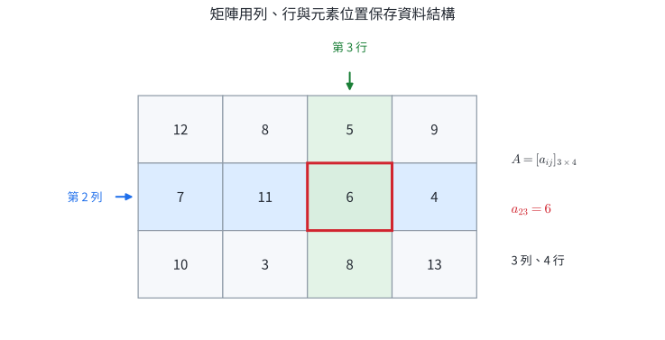

### 矩陣相等

若 $A=[a_{ij}]_{m\times n}$、$B=[b_{ij}]_{m\times n}$，則

$$
A=B
\quad\Longleftrightarrow\quad
a_{ij}=b_{ij}\ \text{對所有 }1\le i\le m,\ 1\le j\le n\text{ 都成立}。
$$

相等包含兩層條件：階數相同，而且每一個相同位置的元素相等。這個規則使一個矩陣等式可以拆成多個普通的實數等式。

### 資料表轉成矩陣

資料表的列標籤與行標籤決定元素的實際意義。例如下圖的第 $(2,3)$ 元代表「乙班使用單車的人數」。矩陣省略標籤後，資料順序仍須固定；交換兩個行標籤，整個矩陣所代表的資料模型也跟著改變。

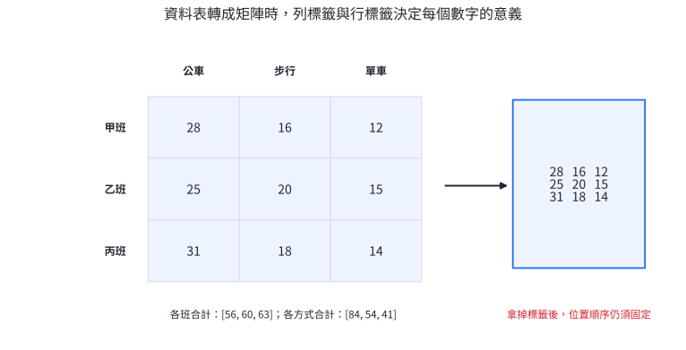

資料庫、試算表、影像像素與成績紀錄都使用相同機制：先固定索引，再對元素做運算。

### 完整示範 1｜由通勤資料讀取矩陣

三個班級依序為甲、乙、丙班；三種通勤方式依序為公車、步行、單車。資料矩陣為

$$
A=
\begin{bmatrix}
28&16&12\\
25&20&15\\
31&18&14
\end{bmatrix}。
$$

求矩陣階數、$a_{23}$，並求搭公車的總人數。

**解。**

1. 矩陣有 $3$ 個水平列、$3$ 個直行，所以是 $3\times3$ 階方陣。
2. $a_{23}$ 是第 $2$ 列、第 $3$ 行的元素，因此 $a_{23}=15$。依標籤，它代表乙班使用單車的 $15$ 人。
3. 公車是第 $1$ 行，總人數是

   $$
   a_{11}+a_{21}+a_{31}=28+25+31=84。
   $$

結果同時保留數值與索引意義：答案是搭公車的 $84$ 人。

### 完整示範 2｜由索引規則建立矩陣，再用相等求參數

設 $A=[a_{ij}]_{3\times2}$，且 $a_{ij}=2i-j$。

1. 寫出 $A$。
2. 若

   $$
   X=
   \begin{bmatrix}
   p+1&2q\\
   r-2&s
   \end{bmatrix}
   =
   \begin{bmatrix}
   4&-6\\
   5&1
   \end{bmatrix},
   $$

   求 $p,q,r,s$。

**解。**

1. 依序代入 $i=1,2,3$ 與 $j=1,2$：

   $$
   \begin{aligned}
   a_{11}&=2(1)-1=1,&a_{12}&=2(1)-2=0,\\
   a_{21}&=2(2)-1=3,&a_{22}&=2(2)-2=2,\\
   a_{31}&=2(3)-1=5,&a_{32}&=2(3)-2=4。
   \end{aligned}
   $$

   所以

   $$
   A=\begin{bmatrix}1&0\\3&2\\5&4\end{bmatrix}。
   $$

2. 兩矩陣相等，對應位置相等：

   $$
   p+1=4,\qquad 2q=-6,\qquad r-2=5,\qquad s=1。
   $$

   解得

   $$
   (p,q,r,s)=(3,-3,7,1)。
   $$

### 分節練習｜矩陣定義與索引

1. 設
   $$A=\begin{bmatrix}4&-2&7\\0&5&1\end{bmatrix}。$$
   寫出 $A$ 的階數、$a_{12}$，並指出數字 $1$ 的位置。

2. 設 $B=[b_{ij}]_{2\times3}$，$b_{ij}=i+3j$。寫出 $B$。

3. 若
   $$
   \begin{bmatrix}x+y&2x-y\\3&z-1\end{bmatrix}
   =
   \begin{bmatrix}5&1\\3&4\end{bmatrix},
   $$
   求 $(x,y,z)$。

4. 寫出 $O_{2\times3}$ 與 $I_3$。

5. 某店以列代表「北店、南店」，以行代表「甲商品、乙商品、丙商品」，庫存矩陣為
   $$C=\begin{bmatrix}18&12&9\\15&14&11\end{bmatrix}。$$
   解釋 $c_{23}$ 的意義，並求乙商品的總庫存。

### 分節練習解析

1. $A$ 有 $2$ 列、$3$ 行，所以是 $2\times3$ 階；$a_{12}=-2$；數字 $1$ 在第 $(2,3)$ 元。

2. 逐一代入：
   $$
   B=\begin{bmatrix}
   1+3&1+6&1+9\\
   2+3&2+6&2+9
   \end{bmatrix}
   =\begin{bmatrix}4&7&10\\5&8&11\end{bmatrix}。
   $$

3. 對應位置給出
   $$x+y=5,\qquad 2x-y=1,\qquad z-1=4。$$
   前兩式相加得 $3x=6$，所以 $x=2$、$y=3$；第三式得 $z=5$。因此 $(x,y,z)=(2,3,5)$。

4.
   $$
   O_{2\times3}=\begin{bmatrix}0&0&0\\0&0&0\end{bmatrix},
   \qquad
   I_3=\begin{bmatrix}1&0&0\\0&1&0\\0&0&1\end{bmatrix}。
   $$

5. $c_{23}=11$ 代表南店的丙商品庫存為 $11$ 件。乙商品是第 $2$ 行，總庫存為 $12+14=26$ 件。

## 2. 加法、減法、係數積與矩陣方程式

### 定義與條件

設 $A=[a_{ij}]_{m\times n}$、$B=[b_{ij}]_{m\times n}$，$r$ 是實數。定義

$$
A+B=[a_{ij}+b_{ij}]_{m\times n},
$$

$$
A-B=[a_{ij}-b_{ij}]_{m\times n},
$$

$$
rA=[ra_{ij}]_{m\times n}。
$$

加法與減法要求兩矩陣階數相同。資料情境還要確認相同位置具有相同標籤、單位與統計口徑。例如「北店、甲商品、件數」只能與同樣意義的位置相加。

矩陣加法與係數積繼承逐項的實數運算，所以

$$
A+B=B+A,
$$

$$
(A+B)+C=A+(B+C),
$$

$$
r(A+B)=rA+rB,
$$

$$
(r+s)A=rA+sA,
$$

$$
A+O=A,
\qquad
A+(-A)=O。
$$

### 資料更新的機制

若 $S$ 是期初庫存、$P$ 是進貨、$Q$ 是銷售，三個表使用相同的門市與品項索引，則

$$
\text{期末庫存}=S+P-Q。
$$

每個位置都在執行同一條守恆關係：「原有量＋流入量－流出量＝剩餘量」。

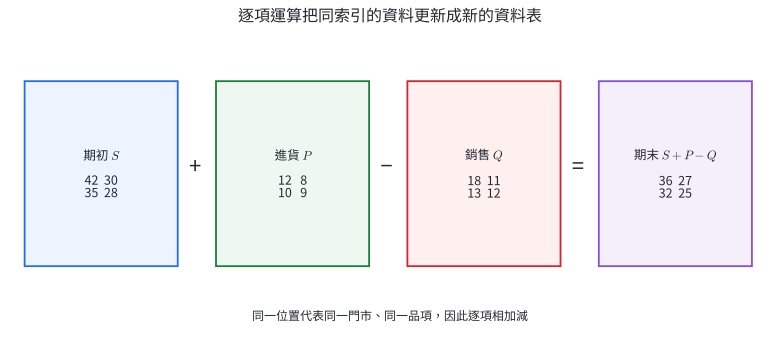

係數積則可表示重複期間、比例調整與加權。例如每月固定資料為 $A$，連續 $3$ 個月的合計就是 $3A$。

### 完整示範 1｜庫存的流入與流出

某公司兩間門市、兩種商品的期初庫存、進貨量與銷售量依序為

$$
S=\begin{bmatrix}42&30\\35&28\end{bmatrix},
\quad
P=\begin{bmatrix}12&8\\10&9\end{bmatrix},
\quad
Q=\begin{bmatrix}18&11\\13&12\end{bmatrix}。
$$

求期末庫存。

**解。**

依守恆關係計算 $S+P-Q$：

$$
\begin{aligned}
S+P-Q
&=
\begin{bmatrix}42+12-18&30+8-11\\35+10-13&28+9-12\end{bmatrix}\\
&=\begin{bmatrix}36&27\\32&25\end{bmatrix}。
\end{aligned}
$$

例如第 $(2,1)$ 元 $32$ 表示南店第一種商品的期末庫存為 $32$ 件。

### 完整示範 2｜解矩陣方程式

已知

$$
A=\begin{bmatrix}1&-1\\2&0\end{bmatrix},
\qquad
B=\begin{bmatrix}2&4\\-2&6\end{bmatrix},
$$

且 $2(X-A)=3B$，求 $X$。

**解。**

矩陣加減與係數積都是逐項運算，可以像普通一次方程式一樣整理：

$$
2(X-A)=3B
\quad\Longrightarrow\quad
X-A=\frac32B
\quad\Longrightarrow\quad
X=A+\frac32B。
$$

所以

$$
\begin{aligned}
X
&=\begin{bmatrix}1&-1\\2&0\end{bmatrix}
+\frac32\begin{bmatrix}2&4\\-2&6\end{bmatrix}\\
&=\begin{bmatrix}1&-1\\2&0\end{bmatrix}
+\begin{bmatrix}3&6\\-3&9\end{bmatrix}\\
&=\begin{bmatrix}4&5\\-1&9\end{bmatrix}。
\end{aligned}
$$

代回左式：$X-A=\begin{bmatrix}3&6\\-3&9\end{bmatrix}=\frac32B$，條件成立。

### 分節練習｜逐項運算

設

$$
A=\begin{bmatrix}2&-1\\3&4\end{bmatrix},
\qquad
B=\begin{bmatrix}1&5\\-2&0\end{bmatrix}。
$$

1. 求 $A+B$ 與 $A-B$。

2. 求 $3A-2B$。

3. 若 $2X+A=3B$，求 $X$。

4. 某店前兩週每週固定售出量為
   $$M=\begin{bmatrix}12&8&5\\10&9&6\end{bmatrix},$$
   第三週售出量為
   $$N=\begin{bmatrix}15&7&4\\11&8&9\end{bmatrix}。$$
   求三週合計售出量。

5. 設 $C$ 是 $2\times3$ 階矩陣，$D$ 是 $3\times2$ 階矩陣。判斷 $C+D$ 是否有定義，並說明條件。

### 分節練習解析

1.
   $$
   A+B=\begin{bmatrix}3&4\\1&4\end{bmatrix},
   \qquad
   A-B=\begin{bmatrix}1&-6\\5&4\end{bmatrix}。
   $$

2.
   $$
   3A-2B
   =\begin{bmatrix}6&-3\\9&12\end{bmatrix}
   -\begin{bmatrix}2&10\\-4&0\end{bmatrix}
   =\begin{bmatrix}4&-13\\13&12\end{bmatrix}。
   $$

3. 由 $2X=3B-A$，得
   $$
   X=\frac12(3B-A)
   =\frac12\left(
   \begin{bmatrix}3&15\\-6&0\end{bmatrix}
   -\begin{bmatrix}2&-1\\3&4\end{bmatrix}
   \right)
   =\begin{bmatrix}\frac12&8\\-\frac92&-2\end{bmatrix}。
   $$

4. 前兩週合計是 $2M$，三週合計為
   $$
   2M+N
   =\begin{bmatrix}24&16&10\\20&18&12\end{bmatrix}
   +\begin{bmatrix}15&7&4\\11&8&9\end{bmatrix}
   =\begin{bmatrix}39&23&14\\31&26&21\end{bmatrix}。
   $$

5. $C$ 與 $D$ 的階數分別是 $2\times3$、$3\times2$，階數不同，所以 $C+D$ 沒有定義。矩陣加法要求兩矩陣有相同列數與相同行數。

## 3. 矩陣乘法與資料加權

### 列乘行的定義

設

$$
A=[a_{ij}]_{m\times n},
\qquad
B=[b_{ij}]_{n\times p}。
$$

左矩陣 $A$ 的行數 $n$ 等於右矩陣 $B$ 的列數 $n$ 時，定義乘積

$$
C=AB=[c_{ij}]_{m\times p},
$$

其中

$$
c_{ij}=a_{i1}b_{1j}+a_{i2}b_{2j}+\cdots+a_{in}b_{nj}
=\sum_{k=1}^{n}a_{ik}b_{kj}。
$$

也就是把 $A$ 的第 $i$ 列與 $B$ 的第 $j$ 行逐項相乘後相加。

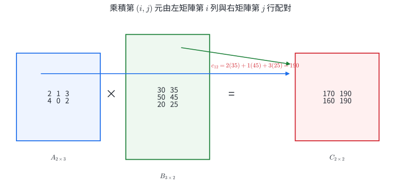

階數的配對規則是

$$
A_{m\times n}B_{n\times p}=C_{m\times p}。
$$

內側的 $n$ 表示被配對並加總的共同索引；外側的 $m,p$ 成為結果的列、行索引。

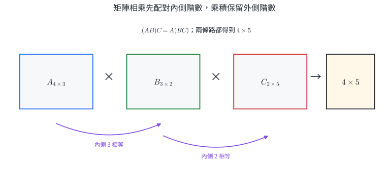

### 資料表中的索引流動

若數量矩陣 $Q$ 的列是學生、行是品項；單價矩陣 $P$ 的列是品項、行是商店，則 $QP$ 的列是學生、行是商店。共同的「品項」索引在乘法中被加總。

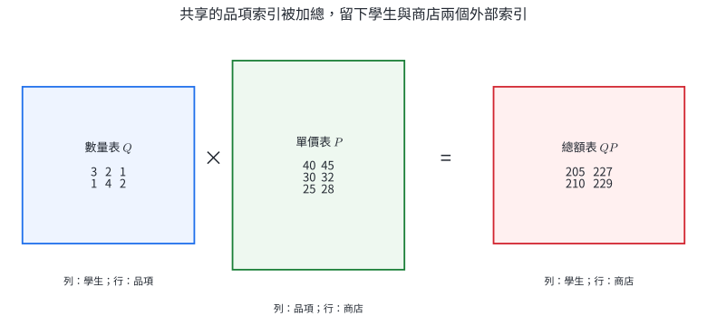

這種運算可一次處理多組加權總和。試算表的矩陣乘積、不同考試權重計算、不同城市的每日成本與停留天數，都使用相同結構。

### 完整示範 1｜逐一計算乘積元素

設

$$
A=\begin{bmatrix}2&1&3\\4&0&2\end{bmatrix},
\qquad
B=\begin{bmatrix}30&35\\50&45\\20&25\end{bmatrix}。
$$

求 $AB$。

**解。**

$A$ 是 $2\times3$ 階，$B$ 是 $3\times2$ 階，內側階數都是 $3$，所以 $AB$ 有定義且是 $2\times2$ 階。

$$
\begin{aligned}
c_{11}&=2(30)+1(50)+3(20)=170,\\
c_{12}&=2(35)+1(45)+3(25)=190,\\
c_{21}&=4(30)+0(50)+2(20)=160,\\
c_{22}&=4(35)+0(45)+2(25)=190。
\end{aligned}
$$

因此

$$
AB=\begin{bmatrix}170&190\\160&190\end{bmatrix}。
$$

### 完整示範 2｜行程的多項成本

三座城市依序為甲、乙、丙市。每天的食、宿、交通費矩陣為

$$
C=
\begin{bmatrix}
1000&800&1200\\
1800&1500&2200\\
300&400&500
\end{bmatrix},
$$

其中列依序為食、宿、交通，行依序為三座城市。兩個行程的停留天數為

$$
D=
\begin{bmatrix}
2&1\\
1&2\\
1&1
\end{bmatrix},
$$

其中兩行依序為行程 A、B。求每個行程的三類費用與總費用。

**解。**

$C$ 是 $3\times3$ 階，$D$ 是 $3\times2$ 階，$CD$ 是 $3\times2$ 階。乘積的列仍是費用類別，行變成行程：

$$
\begin{aligned}
CD
&=
\begin{bmatrix}
1000&800&1200\\
1800&1500&2200\\
300&400&500
\end{bmatrix}
\begin{bmatrix}2&1\\1&2\\1&1\end{bmatrix}\\
&=
\begin{bmatrix}
4000&3800\\
7300&7000\\
1500&1600
\end{bmatrix}。
\end{aligned}
$$

行程 A 的總費用是 $4000+7300+1500=12800$ 元；行程 B 的總費用是 $3800+7000+1600=12400$ 元。

### 分節練習｜乘法與加權總和

1. 設
   $$A=\begin{bmatrix}1&2\\3&4\end{bmatrix},\qquad B=\begin{bmatrix}2&0\\-1&5\end{bmatrix}。$$
   求 $AB$。

2. $P$ 是 $3\times4$ 階，$Q$ 是 $4\times2$ 階。寫出 $PQ$ 的階數，並判斷 $QP$ 是否有定義。

3. 設
   $$A=\begin{bmatrix}2&-1&3\\0&4&1\end{bmatrix},\qquad
   B=\begin{bmatrix}1&2\\3&0\\-2&5\end{bmatrix}。$$
   只計算 $AB$ 的第 $(2,2)$ 元。

4. 兩位學生購買三種餐點的數量矩陣為
   $$Q=\begin{bmatrix}3&2&1\\1&4&2\end{bmatrix},$$
   三種餐點在甲、乙店的單價矩陣為
   $$P=\begin{bmatrix}40&45\\30&32\\25&28\end{bmatrix}。$$
   求每位學生在兩家店的總價。

5. 三位學生的數學、英文、自然成績為
   $$S=\begin{bmatrix}80&70&90\\75&85&80\\90&60&75\end{bmatrix}。$$
   權重依序為 $0.4,0.3,0.3$。用矩陣乘法求三人的加權成績。

### 分節練習解析

1.
   $$
   AB=\begin{bmatrix}
   1(2)+2(-1)&1(0)+2(5)\\
   3(2)+4(-1)&3(0)+4(5)
   \end{bmatrix}
   =\begin{bmatrix}0&10\\2&20\end{bmatrix}。
   $$

2. $P_{3\times4}Q_{4\times2}$ 的內側階數相等，所以 $PQ$ 是 $3\times2$ 階。$Q_{4\times2}P_{3\times4}$ 的內側階數為 $2$ 與 $3$，不相等，因此 $QP$ 沒有定義。

3. 第 $(2,2)$ 元由 $A$ 的第 $2$ 列 $(0,4,1)$ 與 $B$ 的第 $2$ 行 $(2,0,5)^T$ 配對：
   $$c_{22}=0(2)+4(0)+1(5)=5。$$

4.
   $$
   QP=
   \begin{bmatrix}3&2&1\\1&4&2\end{bmatrix}
   \begin{bmatrix}40&45\\30&32\\25&28\end{bmatrix}
   =\begin{bmatrix}205&227\\210&229\end{bmatrix}。
   $$
   第一列表示第一位學生在甲、乙店分別需 $205,227$ 元；第二列表示第二位學生分別需 $210,229$ 元。

5. 權重寫成 $3\times1$ 行矩陣：
   $$
   w=\begin{bmatrix}0.4\\0.3\\0.3\end{bmatrix}。
   $$
   因此
   $$
   Sw=
   \begin{bmatrix}
   80(0.4)+70(0.3)+90(0.3)\\
   75(0.4)+85(0.3)+80(0.3)\\
   90(0.4)+60(0.3)+75(0.3)
   \end{bmatrix}
   =\begin{bmatrix}80\\79.5\\76.5\end{bmatrix}。
   $$

## 4. 乘法性質、順序與矩陣冪

### 結合律、分配律與單位方陣

只要各乘積的階數都有意義，矩陣乘法滿足

$$
(AB)C=A(BC),
$$

$$
A(B+C)=AB+AC,
$$

$$
(A+B)C=AC+BC,
$$

$$
r(AB)=(rA)B=A(rB)。
$$

若 $A$ 是 $m\times n$ 階矩陣，則

$$
I_mA=A=AI_n。
$$

結合律表示連續三個運算可以先合併前兩個或後兩個，結果相同。分配律表示同一個運算可以分別作用到兩組資料後再相加。

### 乘法順序保留操作順序

矩陣乘法通常有

$$
AB\ne BA。
$$

原因來自索引與操作先後：$ABX$ 表示先以 $B$ 處理 $X$，再以 $A$ 處理結果；$BAX$ 的先後相反。兩個乘積即使都有定義，所代表的過程也不同。

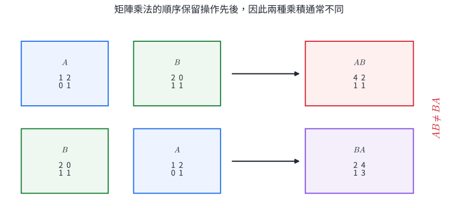

矩陣乘法還有兩個常用限制：

- $AB=O$ 時，$A,B$ 仍可能都不是零矩陣。
- 由 $AB=AC$ 推得 $B=C$ 需要 $A$ 有乘法反方陣；可逆性提供合法的左消去。

這兩點會直接影響方程式化簡與多選題判斷。

### 方陣的冪

若 $A$ 是方陣，定義

$$
A^n=\underbrace{A\cdot A\cdots A}_{n\text{ 個 }A},
\qquad A^0=I。
$$

矩陣冪表示同一個操作反覆執行。週期性操作可以先找較低次方的規律，再用除法餘數處理大指數。

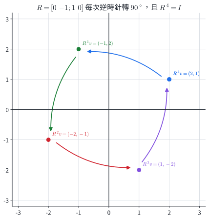

矩陣乘法保留順序，所以一般展開式要保留 $AB$ 與 $BA$：

$$
(A+B)^2=A^2+AB+BA+B^2。
$$

當 $AB=BA$ 時，中間兩項才可以合併成 $2AB$。

### 完整示範 1｜比較 $AB$ 與 $BA$

設

$$
A=\begin{bmatrix}1&2\\0&1\end{bmatrix},
\qquad
B=\begin{bmatrix}2&0\\1&1\end{bmatrix}。
$$

求 $AB,BA$，並比較。

**解。**

$$
AB=
\begin{bmatrix}1&2\\0&1\end{bmatrix}
\begin{bmatrix}2&0\\1&1\end{bmatrix}
=\begin{bmatrix}4&2\\1&1\end{bmatrix}。
$$

$$
BA=
\begin{bmatrix}2&0\\1&1\end{bmatrix}
\begin{bmatrix}1&2\\0&1\end{bmatrix}
=\begin{bmatrix}2&4\\1&3\end{bmatrix}。
$$

兩個乘積都有定義，但 $AB\ne BA$。例如第 $(1,1)$ 元分別是 $4$ 與 $2$。

### 完整示範 2｜利用週期求高次方

設

$$
R=\begin{bmatrix}0&-1\\1&0\end{bmatrix}。
$$

求 $R^{2026}$。

**解。**

先求低次方：

$$
R^2=
\begin{bmatrix}0&-1\\1&0\end{bmatrix}^2
=\begin{bmatrix}-1&0\\0&-1\end{bmatrix}
=-I,
$$

$$
R^4=(-I)^2=I。
$$

因為 $2026=4(506)+2$，所以

$$
R^{2026}=(R^4)^{506}R^2=I^{506}(-I)=-I
=\begin{bmatrix}-1&0\\0&-1\end{bmatrix}。
$$

此矩陣每次把平面向量逆時針旋轉 $90^\circ$，$2026$ 次等效於旋轉 $180^\circ$，與 $-I$ 一致。

### 分節練習｜順序、性質與冪

1. 設 $A$ 是 $2\times3$ 階矩陣。寫出使 $I_pA=A$、$AI_q=A$ 成立的 $p,q$。

2. 已知
   $$A=\begin{bmatrix}1&0\\2&1\end{bmatrix},\quad
   B=\begin{bmatrix}2&1\\0&3\end{bmatrix},\quad
   C=\begin{bmatrix}-1&2\\1&0\end{bmatrix}。$$
   用分配律計算 $A(B+C)$。

3. 設
   $$A=\begin{bmatrix}1&1\\1&1\end{bmatrix},\qquad
   B=\begin{bmatrix}1&-1\\-1&1\end{bmatrix}。$$
   求 $AB$，並指出這個結果說明什麼。

4. 已知二階方陣 $A$ 有乘法反方陣，且 $AB=AC$。證明 $B=C$。

5. 設
   $$T=\begin{bmatrix}1&1\\0&1\end{bmatrix}。$$
   觀察 $T^2,T^3$，推得 $T^n$，再求 $T^{20}$。

### 分節練習解析

1. 左乘單位方陣的階數配合 $A$ 的列數，右乘單位方陣的階數配合 $A$ 的行數。因此
   $$I_2A=A,\qquad AI_3=A,$$
   所以 $(p,q)=(2,3)$。

2. 先相加：
   $$B+C=\begin{bmatrix}1&3\\1&3\end{bmatrix}。$$
   所以
   $$
   A(B+C)
   =\begin{bmatrix}1&0\\2&1\end{bmatrix}
   \begin{bmatrix}1&3\\1&3\end{bmatrix}
   =\begin{bmatrix}1&3\\3&9\end{bmatrix}。
   $$
   直接算 $AB+AC$ 也得到同一矩陣。

3.
   $$
   AB=\begin{bmatrix}1&1\\1&1\end{bmatrix}
   \begin{bmatrix}1&-1\\-1&1\end{bmatrix}
   =\begin{bmatrix}0&0\\0&0\end{bmatrix}=O。
   $$
   $A$ 與 $B$ 都不是零矩陣，顯示非零矩陣的乘積仍可能是零矩陣。

4. 在 $AB=AC$ 的等號兩邊左乘 $A^{-1}$：
   $$A^{-1}(AB)=A^{-1}(AC)。$$
   利用結合律得
   $$(A^{-1}A)B=(A^{-1}A)C,$$
   因此 $IB=IC$，即 $B=C$。

5.
   $$
   T^2=\begin{bmatrix}1&2\\0&1\end{bmatrix},
   \qquad
   T^3=\begin{bmatrix}1&3\\0&1\end{bmatrix}。
   $$
   每多乘一個 $T$，第 $(1,2)$ 元增加 $1$，所以
   $$T^n=\begin{bmatrix}1&n\\0&1\end{bmatrix}。$$
   因此
   $$T^{20}=\begin{bmatrix}1&20\\0&1\end{bmatrix}。$$

## 5. 二階乘法反方陣

### 定義

設 $A$ 是二階方陣。若存在二階方陣 $B$，使

$$
AB=BA=I_2,
$$

則 $B$ 稱為 $A$ 的乘法反方陣，記為 $A^{-1}$。此時 $A$ 與 $A^{-1}$ 互為反方陣。

反方陣的作用和非零實數的倒數相同：$A$ 先作用，$A^{-1}$ 再作用，就回到原資料。

### 二階公式的推導

令

$$
A=\begin{bmatrix}a&b\\c&d\end{bmatrix}。
$$

把主對角線 $a,d$ 交換，另兩項 $b,c$ 變號，得到

$$
A^\star=\begin{bmatrix}d&-b\\-c&a\end{bmatrix}。
$$

直接相乘：

$$
AA^\star
=\begin{bmatrix}a&b\\c&d\end{bmatrix}
\begin{bmatrix}d&-b\\-c&a\end{bmatrix}
=\begin{bmatrix}ad-bc&0\\0&ad-bc\end{bmatrix}
=(ad-bc)I_2。
$$

同樣也有 $A^\star A=(ad-bc)I_2$。因此當

$$
ad-bc\ne0
$$

時，可以除以 $ad-bc$：

$$
\boxed{
A^{-1}=\frac{1}{ad-bc}
\begin{bmatrix}d&-b\\-c&a\end{bmatrix}}
$$

而且 $AA^{-1}=A^{-1}A=I_2$。

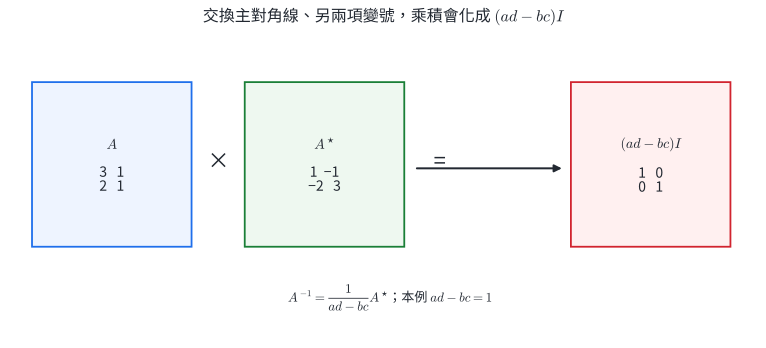

當 $ad-bc=0$ 時，$A$ 沒有乘法反方陣。此時兩個直行提供的二維資訊彼此依賴，輸出無法唯一還原成原輸入。

### 唯一性與乘積的反方陣

若 $B,C$ 都是 $A$ 的反方陣，則

$$
B=BI=B(AC)=(BA)C=IC=C,
$$

所以反方陣若存在便唯一。

若 $A,B$ 都有反方陣，則

$$
(AB)^{-1}=B^{-1}A^{-1}。
$$

驗算：

$$
(AB)(B^{-1}A^{-1})
=A(BB^{-1})A^{-1}
=AA^{-1}=I。
$$

復原順序與原操作相反：先做 $B$ 再做 $A$，回復時先做 $A^{-1}$ 再做 $B^{-1}$。

### 完整示範 1｜求反方陣並雙向驗算

設

$$
A=\begin{bmatrix}3&1\\2&1\end{bmatrix}。
$$

求 $A^{-1}$。

**解。**

先算

$$
ad-bc=3(1)-1(2)=1\ne0,
$$

所以反方陣存在：

$$
A^{-1}
=\frac11\begin{bmatrix}1&-1\\-2&3\end{bmatrix}
=\begin{bmatrix}1&-1\\-2&3\end{bmatrix}。
$$

雙向驗算：

$$
AA^{-1}
=\begin{bmatrix}3&1\\2&1\end{bmatrix}
\begin{bmatrix}1&-1\\-2&3\end{bmatrix}
=\begin{bmatrix}1&0\\0&1\end{bmatrix},
$$

$$
A^{-1}A
=\begin{bmatrix}1&-1\\-2&3\end{bmatrix}
\begin{bmatrix}3&1\\2&1\end{bmatrix}
=\begin{bmatrix}1&0\\0&1\end{bmatrix}。
$$

### 完整示範 2｜參數與反方陣存在條件

設

$$
P=\begin{bmatrix}k&2\\3&6\end{bmatrix}。
$$

1. 討論 $P^{-1}$ 的存在條件。
2. 當 $k=2$ 時求 $P^{-1}$。

**解。**

1. 判別量為
   $$k(6)-2(3)=6(k-1)。$$
   所以 $k\ne1$ 時，$P^{-1}$ 存在；$k=1$ 時沒有乘法反方陣。

2. $k=2$ 時，
   $$
   P=\begin{bmatrix}2&2\\3&6\end{bmatrix},
   \qquad ad-bc=12-6=6。
   $$
   因此
   $$
   P^{-1}=\frac16\begin{bmatrix}6&-2\\-3&2\end{bmatrix}。
   $$

### 分節練習｜反方陣

1. 求
   $$A=\begin{bmatrix}2&1\\5&3\end{bmatrix}$$
   的反方陣，並驗算 $AA^{-1}$。

2. 判斷
   $$B=\begin{bmatrix}2&4\\1&2\end{bmatrix}$$
   是否有乘法反方陣。

3. 設
   $$C=\begin{bmatrix}1&k\\2&4\end{bmatrix}。$$
   求 $C^{-1}$ 存在的 $k$ 條件。

4. 若 $A^{-1}=\begin{bmatrix}2&1\\3&2\end{bmatrix}$，求 $A$。

5. $A,B$ 都有反方陣。寫出 $(AB)^{-1}$，並用乘法驗證。

### 分節練習解析

1. $ad-bc=2(3)-1(5)=1$，所以
   $$A^{-1}=\begin{bmatrix}3&-1\\-5&2\end{bmatrix}。$$
   驗算：
   $$
   AA^{-1}=
   \begin{bmatrix}2&1\\5&3\end{bmatrix}
   \begin{bmatrix}3&-1\\-5&2\end{bmatrix}
   =\begin{bmatrix}1&0\\0&1\end{bmatrix}。
   $$

2. $ad-bc=2(2)-4(1)=0$，所以 $B$ 沒有乘法反方陣。

3. $ad-bc=1(4)-k(2)=4-2k$。因此
   $$4-2k\ne0\quad\Longleftrightarrow\quad k\ne2。$$

4. $A$ 是 $A^{-1}$ 的反方陣，所以
   $$
   A=(A^{-1})^{-1}
   =\frac{1}{2(2)-1(3)}
   \begin{bmatrix}2&-1\\-3&2\end{bmatrix}
   =\begin{bmatrix}2&-1\\-3&2\end{bmatrix}。
   $$

5.
   $$
   (AB)^{-1}=B^{-1}A^{-1}。
   $$
   左右兩種乘法都可驗證：
   $$
   (AB)(B^{-1}A^{-1})=A(BB^{-1})A^{-1}=I,
   $$
   $$
   (B^{-1}A^{-1})(AB)=B^{-1}(A^{-1}A)B=I。
   $$

## 6. 二元一次方程組與矩陣方程式

### 二元一次方程組的矩陣表示

方程組

$$
\begin{cases}
a_1x+b_1y=c_1,\\
a_2x+b_2y=c_2
\end{cases}
$$

可以寫成

$$
\underbrace{\begin{bmatrix}a_1&b_1\\a_2&b_2\end{bmatrix}}_{A}
\underbrace{\begin{bmatrix}x\\y\end{bmatrix}}_{X}
=
\underbrace{\begin{bmatrix}c_1\\c_2\end{bmatrix}}_{B},
$$

即 $AX=B$。

若 $A^{-1}$ 存在，在等號兩邊左乘 $A^{-1}$：

$$
A^{-1}AX=A^{-1}B
\quad\Longrightarrow\quad
X=A^{-1}B。
$$

乘在左側是由原式 $AX$ 的順序決定。

### 可逆性與解的幾何意義

係數矩陣

$$
A=\begin{bmatrix}a_1&b_1\\a_2&b_2\end{bmatrix}
$$

可逆時，兩條直線有唯一交點，方程組有唯一解。$A$ 不可逆時，兩列係數成比例；再比較常數項，會得到兩種情況：

- 常數項使用相同比例：兩式代表同一直線，有無限多組解。
- 常數項比例不同：兩式代表平行直線，沒有解。

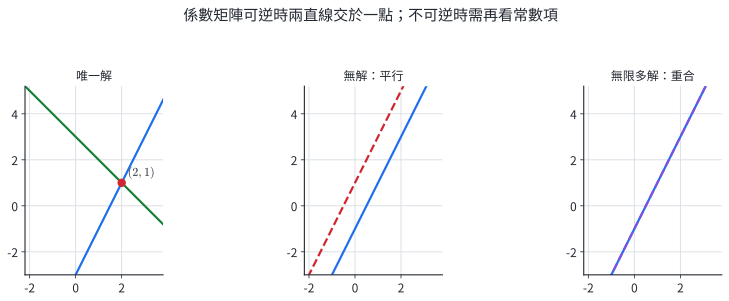

### 未知矩陣在左右兩側

若 $A^{-1}$ 存在，則

$$
AX=B\quad\Longrightarrow\quad X=A^{-1}B,
$$

$$
YA=B\quad\Longrightarrow\quad Y=BA^{-1}。
$$

第一式左乘 $A^{-1}$，第二式右乘 $A^{-1}$。矩陣乘法的順序直接決定解式。

### 完整示範 1｜用反方陣解二元一次方程組

用矩陣解

$$
\begin{cases}
6x+7y=-2,\\
7x+8y=3。
\end{cases}
$$

**解。**

寫成

$$
\begin{bmatrix}6&7\\7&8\end{bmatrix}
\begin{bmatrix}x\\y\end{bmatrix}
=\begin{bmatrix}-2\\3\end{bmatrix}。
$$

係數矩陣的判別量為

$$
6(8)-7(7)=-1\ne0,
$$

所以

$$
A^{-1}
=-\begin{bmatrix}8&-7\\-7&6\end{bmatrix}
=\begin{bmatrix}-8&7\\7&-6\end{bmatrix}。
$$

因此

$$
\begin{bmatrix}x\\y\end{bmatrix}
=A^{-1}\begin{bmatrix}-2\\3\end{bmatrix}
=\begin{bmatrix}-8&7\\7&-6\end{bmatrix}
\begin{bmatrix}-2\\3\end{bmatrix}
=\begin{bmatrix}37\\-32\end{bmatrix}。
$$

代回：$6(37)+7(-32)=-2$，$7(37)+8(-32)=3$，兩式都成立。

### 完整示範 2｜同一個 $A$ 在左右兩側

設

$$
A=\begin{bmatrix}2&1\\5&3\end{bmatrix},
\qquad
B=\begin{bmatrix}1&-1\\0&1\end{bmatrix}。
$$

分別解 $AX=B$ 與 $YA=B$。

**解。**

第 5 節已知

$$
A^{-1}=\begin{bmatrix}3&-1\\-5&2\end{bmatrix}。
$$

對 $AX=B$，左乘 $A^{-1}$：

$$
X=A^{-1}B
=\begin{bmatrix}3&-1\\-5&2\end{bmatrix}
\begin{bmatrix}1&-1\\0&1\end{bmatrix}
=\begin{bmatrix}3&-4\\-5&7\end{bmatrix}。
$$

對 $YA=B$，右乘 $A^{-1}$：

$$
Y=BA^{-1}
=\begin{bmatrix}1&-1\\0&1\end{bmatrix}
\begin{bmatrix}3&-1\\-5&2\end{bmatrix}
=\begin{bmatrix}8&-3\\-5&2\end{bmatrix}。
$$

$X$ 與 $Y$ 不同，反映未知矩陣所在位置不同。

### 分節練習｜方程組與矩陣方程式

1. 把
   $$\begin{cases}3x-2y=5,\\x+4y=-1\end{cases}$$
   寫成 $AX=B$。

2. 用反方陣解
   $$\begin{cases}2x+y=7,\\x+y=4。\end{cases}$$

3. 判斷
   $$\begin{cases}2x+y=3,\\4x+2y=6\end{cases}$$
   的解型。

4. 判斷
   $$\begin{cases}2x+y=3,\\4x+2y=7\end{cases}$$
   的解型。

5. 設
   $$A=\begin{bmatrix}1&1\\0&1\end{bmatrix},\qquad
   B=\begin{bmatrix}2&0\\1&3\end{bmatrix}。$$
   分別解 $AX=B$ 與 $YA=B$。

### 分節練習解析

1.
   $$
   \begin{bmatrix}3&-2\\1&4\end{bmatrix}
   \begin{bmatrix}x\\y\end{bmatrix}
   =\begin{bmatrix}5\\-1\end{bmatrix}。
   $$

2. 令
   $$A=\begin{bmatrix}2&1\\1&1\end{bmatrix},\qquad B=\begin{bmatrix}7\\4\end{bmatrix}。$$
   因為 $ad-bc=1$，
   $$A^{-1}=\begin{bmatrix}1&-1\\-1&2\end{bmatrix}。$$
   所以
   $$
   \begin{bmatrix}x\\y\end{bmatrix}
   =A^{-1}B
   =\begin{bmatrix}1&-1\\-1&2\end{bmatrix}
   \begin{bmatrix}7\\4\end{bmatrix}
   =\begin{bmatrix}3\\1\end{bmatrix}。
   $$

3. 第二式恰為第一式的 $2$ 倍，兩式代表同一直線，因此有無限多組解，可寫成 $y=3-2x$。

4. 左側第二式是第一式左側的 $2$ 倍，但右側 $7\ne2(3)$，兩式代表平行直線，因此沒有解。

5. 先求
   $$A^{-1}=\begin{bmatrix}1&-1\\0&1\end{bmatrix}。$$
   對 $AX=B$：
   $$
   X=A^{-1}B
   =\begin{bmatrix}1&-1\\0&1\end{bmatrix}
   \begin{bmatrix}2&0\\1&3\end{bmatrix}
   =\begin{bmatrix}1&-3\\1&3\end{bmatrix}。
   $$
   對 $YA=B$：
   $$
   Y=BA^{-1}
   =\begin{bmatrix}2&0\\1&3\end{bmatrix}
   \begin{bmatrix}1&-1\\0&1\end{bmatrix}
   =\begin{bmatrix}2&-2\\1&2\end{bmatrix}。
   $$

## 7. 向量線性組合、仿射校正與編碼

### 向量線性組合

設

$$
\vec a=\begin{bmatrix}a_1\\a_2\end{bmatrix},
\qquad
\vec b=\begin{bmatrix}b_1\\b_2\end{bmatrix},
\qquad
\vec c=\begin{bmatrix}c_1\\c_2\end{bmatrix}。
$$

要把 $\vec c$ 寫成

$$
\vec c=x\vec a+y\vec b,
$$

可以把 $\vec a,\vec b$ 放成矩陣的兩個直行：

$$
\begin{bmatrix}a_1&b_1\\a_2&b_2\end{bmatrix}
\begin{bmatrix}x\\y\end{bmatrix}
=\begin{bmatrix}c_1\\c_2\end{bmatrix}。
$$

若 $a_1b_2-a_2b_1\ne0$，兩向量不平行，$\vec c$ 有唯一的線性組合表示。

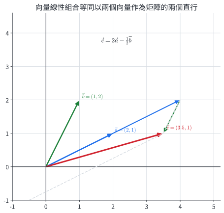

### 仿射資料模型

許多坐標校正可寫成

$$
Y=AX+t,
$$

其中 $X$ 是原坐標，$A$ 負責二維混合、伸縮或轉向，$t$ 是固定偏移。若 $A^{-1}$ 存在，則

$$
X=A^{-1}(Y-t)。
$$

三個不共線的參考點可決定二維仿射規則：

- 原點的輸出直接給出 $t$。
- 兩個坐標軸方向的輸出差，決定 $A$ 的兩個直行。

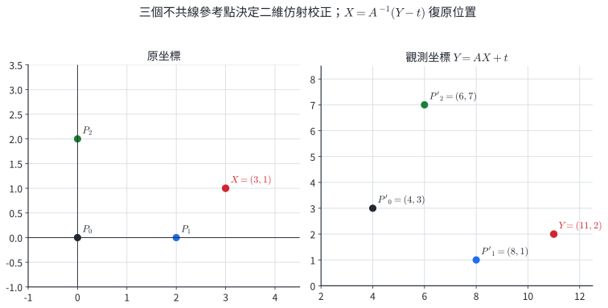

相機防手震、掃描定位、觸控面板校正與感測器換算都會使用更大型的同類模型。高中二階模型說明的是核心結構；實際系統還要處理雜訊、鏡頭畸變與更多參考點。

### 矩陣編碼的用途與限制

把字母或數據排成矩陣 $X$，選一個可逆矩陣 $K$，可用

$$
Y=KX
$$

產生傳送矩陣；接收端計算

$$
X=K^{-1}Y
$$

即可復原。可逆性保證一對一對應。

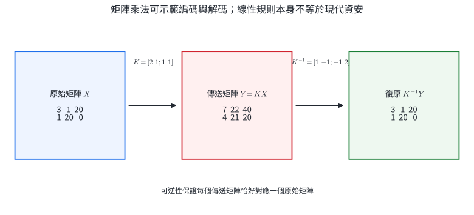

這個模型適合練習矩陣乘法與反方陣。現代資安還需要抵抗已知明文、密鑰猜測與大量計算攻擊，單一二階線性規則不提供足夠安全性。

### 完整示範 1｜把目標向量分解成兩個方向

設

$$
\vec a=(2,1),\qquad \vec b=(1,2),\qquad \vec c=\left(\frac72,1\right)。
$$

求 $x,y$，使 $\vec c=x\vec a+y\vec b$。

**解。**

寫成矩陣形式：

$$
\begin{bmatrix}2&1\\1&2\end{bmatrix}
\begin{bmatrix}x\\y\end{bmatrix}
=\begin{bmatrix}\frac72\\1\end{bmatrix}。
$$

係數矩陣的反方陣為

$$
\frac13\begin{bmatrix}2&-1\\-1&2\end{bmatrix}。
$$

所以

$$
\begin{aligned}
\begin{bmatrix}x\\y\end{bmatrix}
&=\frac13
\begin{bmatrix}2&-1\\-1&2\end{bmatrix}
\begin{bmatrix}\frac72\\1\end{bmatrix}\\
&=\frac13\begin{bmatrix}6\\-\frac32\end{bmatrix}
=\begin{bmatrix}2\\-\frac12\end{bmatrix}。
\end{aligned}
$$

因此

$$
\vec c=2\vec a-\frac12\vec b。
$$

代回：$2(2,1)-\frac12(1,2)=(4,2)-(\frac12,1)=(\frac72,1)$。

### 完整示範 2｜由三個參考點建立校正並復原位置

一套坐標系統使用 $Y=AX+t$。三個參考點的輸入與輸出為

$$
(0,0)\mapsto(4,3),
$$

$$
(2,0)\mapsto(8,1),
$$

$$
(0,2)\mapsto(6,7)。
$$

若某點輸出為 $Y=(11,2)$，求原坐標 $X$。

**解。**

原點輸入時 $A(0,0)^T=0$，所以

$$
t=\begin{bmatrix}4\\3\end{bmatrix}。
$$

用第二個參考點減去偏移：

$$
A\begin{bmatrix}2\\0\end{bmatrix}
=\begin{bmatrix}8\\1\end{bmatrix}
-\begin{bmatrix}4\\3\end{bmatrix}
=\begin{bmatrix}4\\-2\end{bmatrix}。
$$

所以 $A$ 的第一個直行是 $(2,-1)^T$。同理，

$$
A\begin{bmatrix}0\\2\end{bmatrix}
=\begin{bmatrix}6\\7\end{bmatrix}
-\begin{bmatrix}4\\3\end{bmatrix}
=\begin{bmatrix}2\\4\end{bmatrix},
$$

所以第二個直行是 $(1,2)^T$。因此

$$
A=\begin{bmatrix}2&1\\-1&2\end{bmatrix}。
$$

其判別量為 $2(2)-1(-1)=5$，故

$$
A^{-1}=\frac15\begin{bmatrix}2&-1\\1&2\end{bmatrix}。
$$

由 $Y=AX+t$ 得

$$
X=A^{-1}(Y-t)
=\frac15\begin{bmatrix}2&-1\\1&2\end{bmatrix}
\left(
\begin{bmatrix}11\\2\end{bmatrix}
-\begin{bmatrix}4\\3\end{bmatrix}
\right)
=\frac15\begin{bmatrix}2&-1\\1&2\end{bmatrix}
\begin{bmatrix}7\\-1\end{bmatrix}
=\begin{bmatrix}3\\1\end{bmatrix}。
$$

代回：$A(3,1)^T+t=(7,-1)^T+(4,3)^T=(11,2)^T$。

### 分節練習｜向量、校正與編碼

1. 將 $(5,1)$ 表示成 $(1,1)$ 與 $(1,-1)$ 的線性組合。

2. 設 $\vec a=(2,1)$、$\vec b=(4,2)$。說明為何同一個目標向量可能無法唯一寫成 $x\vec a+y\vec b$。

3. 已知
   $$A=\begin{bmatrix}2&1\\-1&2\end{bmatrix},\qquad t=\begin{bmatrix}4\\3\end{bmatrix}。$$
   求 $X=(1,2)$ 經 $Y=AX+t$ 後的輸出。

4. 仿射規則 $Y=AX+t$ 滿足
   $$(0,0)\mapsto(1,2),\quad (1,0)\mapsto(3,3),\quad (0,1)\mapsto(0,5)。$$
   求 $A,t$。

5. 以
   $$K=\begin{bmatrix}2&1\\1&1\end{bmatrix}$$
   編碼，收到
   $$Y=\begin{bmatrix}7&22\\4&21\end{bmatrix}。$$
   求原始矩陣 $X$。

### 分節練習解析

1. 設
   $$(5,1)=x(1,1)+y(1,-1)。$$
   比較坐標得
   $$x+y=5,\qquad x-y=1。$$
   相加得 $2x=6$，所以 $x=3$、$y=2$。因此
   $$(5,1)=3(1,1)+2(1,-1)。$$

2. $\vec b=2\vec a$，兩向量平行。係數矩陣
   $$\begin{bmatrix}2&4\\1&2\end{bmatrix}$$
   的判別量是 $2(2)-4(1)=0$。目標向量若不在這條方向上便無法表示；若在這條方向上，會有多組係數。例如
   $$3\vec a=(3-2t)\vec a+t\vec b$$
   對任意實數 $t$ 都成立。

3.
   $$
   Y=\begin{bmatrix}2&1\\-1&2\end{bmatrix}
   \begin{bmatrix}1\\2\end{bmatrix}
   +\begin{bmatrix}4\\3\end{bmatrix}
   =\begin{bmatrix}4\\3\end{bmatrix}
   +\begin{bmatrix}4\\3\end{bmatrix}
   =\begin{bmatrix}8\\6\end{bmatrix}。
   $$

4. 原點的輸出給出
   $$t=\begin{bmatrix}1\\2\end{bmatrix}。$$
   第一個直行是 $(3,3)^T-t=(2,1)^T$；第二個直行是 $(0,5)^T-t=(-1,3)^T$。因此
   $$A=\begin{bmatrix}2&-1\\1&3\end{bmatrix},\qquad t=\begin{bmatrix}1\\2\end{bmatrix}。$$

5. $K$ 的判別量為 $2(1)-1(1)=1$，所以
   $$K^{-1}=\begin{bmatrix}1&-1\\-1&2\end{bmatrix}。$$
   因此
   $$
   X=K^{-1}Y
   =\begin{bmatrix}1&-1\\-1&2\end{bmatrix}
   \begin{bmatrix}7&22\\4&21\end{bmatrix}
   =\begin{bmatrix}3&1\\1&20\end{bmatrix}。
   $$

## 8. 核心整理

| 問題 | 條件 | 運算 | 結果的索引意義 |
|---|---|---|---|
| 同位置資料合併 | 兩矩陣階數與標籤一致 | $A\pm B$、$rA$ | 保留原本列、行索引 |
| 多組加權總和 | $A$ 的行數等於 $B$ 的列數 | $AB$ | 共同內側索引被加總，保留外側索引 |
| 連續操作 | 各相鄰乘積有定義 | $(AB)C=A(BC)$ | 右側矩陣先作用 |
| 反覆同一操作 | $A$ 是方陣 | $A^n$ | 表示操作重複 $n$ 次 |
| 二階資訊復原 | $A=\begin{bmatrix}a&b\\c&d\end{bmatrix}$ 且 $ad-bc\ne0$ | $A^{-1}=\dfrac1{ad-bc}\begin{bmatrix}d&-b\\-c&a\end{bmatrix}$ | $A^{-1}AX=X$ |
| 二元聯立 | 係數矩陣可逆 | $X=A^{-1}B$ | 唯一解 |
| 向量分解 | 兩個方向不平行 | $[\vec a\ \vec b]\begin{bmatrix}x\\y\end{bmatrix}=\vec c$ | $x,y$ 是線性組合係數 |
| 仿射校正 | $Y=AX+t$ 且 $A$ 可逆 | $X=A^{-1}(Y-t)$ | 先移除偏移，再倒回二維混合 |

矩陣題的固定流程是：

1. 寫清楚每個列、行代表的對象。
2. 先核對階數，再決定運算是否有定義。
3. 乘法逐一用「左列 × 右行」計算。
4. 解矩陣方程式時，依未知矩陣的位置決定左乘或右乘反方陣。
5. 回到資料情境檢查單位、標籤與可逆條件。

## 9. 章末分層題

### 基礎題

1. 設 $A=[a_{ij}]_{2\times3}$，且 $a_{ij}=i^2+2j$。寫出 $A$，並求所有元素的和。

2. 若
   $$
   \begin{bmatrix}x+y&2x\\z-1&4\end{bmatrix}
   =\begin{bmatrix}5&4\\6&4\end{bmatrix},
   $$
   求 $(x,y,z)$。

3. 設
   $$A=\begin{bmatrix}10&8\\6&12\end{bmatrix},\qquad
   B=\begin{bmatrix}3&2\\1&4\end{bmatrix}。$$
   求 $2A-B$。

4. 設
   $$
   A=\begin{bmatrix}1&2&0\\3&-1&2\end{bmatrix},
   \qquad
   B=\begin{bmatrix}2&1\\0&4\\-1&3\end{bmatrix}。
   $$
   求 $AB$。

### 熟練題

5. $P,Q,R$ 的階數分別是 $2\times4$、$4\times3$、$3\times2$。判斷 $PQ,QR,(PQ)R,P(QR),RP$ 是否有定義，並寫出有定義者的階數。

6. $A,B,C$ 都是同階方陣。判斷下列敘述何者對所有合乎階數的矩陣成立：

   A. $A+B=B+A$

   B. $AB=BA$

   C. $(AB)C=A(BC)$

   D. $AB=O$ 時，$A=O$ 或 $B=O$

   E. $(A+B)^2=A^2+AB+BA+B^2$

7. 設
   $$T=\begin{bmatrix}1&2\\0&1\end{bmatrix}。$$
   推得 $T^n$，並求 $T^{15}$。

8. 求
   $$A=\begin{bmatrix}4&1\\3&1\end{bmatrix}$$
   的反方陣，並驗算。

### 應用題

9. 設
   $$P=\begin{bmatrix}k&2\\k+1&4\end{bmatrix}。$$
   求 $P$ 沒有乘法反方陣時的 $k$。

10. 用反方陣解
    $$
    \begin{cases}
    3x+y=7,\\
    2x+y=5。
    \end{cases}
    $$

11. 將向量 $(8,1)$ 表示成 $(2,1)$ 與 $(1,-1)$ 的線性組合。

12. 一個校正模型為
    $$
    Y=AX+t,
    \quad
    A=\begin{bmatrix}1&2\\2&1\end{bmatrix},
    \quad
    t=\begin{bmatrix}3\\-1\end{bmatrix}。
    $$
    求 $X=(2,1)$ 的輸出；再從所得輸出用反方陣復原 $X$。

### 跨節整合題

13. 兩間門市在前兩個月每月售出三種商品的數量矩陣為
    $$
    Q_1=\begin{bmatrix}2&1&3\\1&2&2\end{bmatrix},
    $$
    第三個月為
    $$
    Q_2=\begin{bmatrix}1&2&0\\3&0&1\end{bmatrix}。
    $$
    三種商品在甲、乙供應商的單價矩陣為
    $$
    P=\begin{bmatrix}30&32\\20&25\\10&12\end{bmatrix}。
    $$
    
    1. 求三個月總數量矩陣 $Q=2Q_1+Q_2$。
    2. 求兩間門市向兩家供應商採購同樣數量時，各自的總成本矩陣 $QP$。
    3. 解釋 $QP$ 第 $(2,1)$ 元的資料意義。

14. 兩個連續操作的矩陣為
    $$
    A=\begin{bmatrix}1&1\\0&1\end{bmatrix},
    \qquad
    B=\begin{bmatrix}2&0\\1&1\end{bmatrix}。
    $$
    原向量是 $X=(3,2)^T$，輸出規則為 $Y=A(BX)$。
    
    1. 求 $Y$。
    2. 求 $A^{-1},B^{-1}$。
    3. 由 $Y$ 以正確順序復原 $X$，並驗證結果。

15. 仿射校正 $Y=AX+t$ 的三個參考點為
    $$
    (0,0)\mapsto(2,-1),
    $$
    $$
    (1,0)\mapsto(4,0),
    $$
    $$
    (0,1)\mapsto(1,2)。
    $$
    
    1. 求 $A,t$。
    2. 已知觀測輸出是 $(5,4)$，求原坐標。
    3. 將位移向量 $Y-t$ 表示成 $A$ 的兩個直行向量的線性組合，並說明係數與原坐標的關係。

16. 編碼矩陣為
    $$
    K=\begin{bmatrix}3&1\\2&1\end{bmatrix}。
    $$
    原始資料矩陣為
    $$
    X=\begin{bmatrix}1&2&3\\4&5&6\end{bmatrix}。
    $$
    
    1. 求傳送矩陣 $Y=KX$。
    2. 求 $K^{-1}$，並由 $Y$ 復原 $X$。
    3. 若傳送時第二行資料多了誤差向量 $(1,1)^T$，求解碼後第二行的誤差，並解釋反方陣如何改變誤差。

## 10. 章末題完整解析

### 第 1 題

依 $a_{ij}=i^2+2j$ 逐項代入：

$$
\begin{aligned}
a_{11}&=1^2+2(1)=3,&a_{12}&=1^2+2(2)=5,&a_{13}&=1^2+2(3)=7,\\
a_{21}&=2^2+2(1)=6,&a_{22}&=2^2+2(2)=8,&a_{23}&=2^2+2(3)=10。
\end{aligned}
$$

所以

$$
A=\begin{bmatrix}3&5&7\\6&8&10\end{bmatrix}。
$$

所有元素的和為

$$
3+5+7+6+8+10=39。
$$

### 第 2 題

矩陣相等給出

$$
x+y=5,
\qquad
2x=4,
\qquad
z-1=6。
$$

由第二式得 $x=2$；代入第一式得 $y=3$；第三式得 $z=7$。因此

$$
(x,y,z)=(2,3,7)。
$$

### 第 3 題

逐項計算：

$$
2A-B
=\begin{bmatrix}20&16\\12&24\end{bmatrix}
-\begin{bmatrix}3&2\\1&4\end{bmatrix}
=\begin{bmatrix}17&14\\11&20\end{bmatrix}。
$$

兩矩陣皆為 $2\times2$ 階，所以加減條件成立。

### 第 4 題

$A$ 是 $2\times3$ 階，$B$ 是 $3\times2$ 階，所以 $AB$ 是 $2\times2$ 階。

$$
\begin{aligned}
AB
&=\begin{bmatrix}
1(2)+2(0)+0(-1)&1(1)+2(4)+0(3)\\
3(2)+(-1)(0)+2(-1)&3(1)+(-1)(4)+2(3)
\end{bmatrix}\\
&=\begin{bmatrix}2&9\\4&5\end{bmatrix}。
\end{aligned}
$$

### 第 5 題

逐一核對內側階數：

- $P_{2\times4}Q_{4\times3}$ 有定義，$PQ$ 是 $2\times3$ 階。
- $Q_{4\times3}R_{3\times2}$ 有定義，$QR$ 是 $4\times2$ 階。
- $(PQ)_{2\times3}R_{3\times2}$ 有定義，$(PQ)R$ 是 $2\times2$ 階。
- $P_{2\times4}(QR)_{4\times2}$ 有定義，$P(QR)$ 是 $2\times2$ 階。
- $R_{3\times2}P_{2\times4}$ 有定義，$RP$ 是 $3\times4$ 階。

而且結合律保證 $(PQ)R=P(QR)$。

### 第 6 題

A 正確。矩陣加法逐項運算，具有交換律。

B 不一定成立。矩陣乘法保留順序，通常 $AB\ne BA$。

C 正確。矩陣乘法具有結合律。

D 不一定成立。非零矩陣也可能相乘得到零矩陣。

E 正確。直接分配：

$$
(A+B)^2=(A+B)(A+B)=A^2+AB+BA+B^2。
$$

因此正確選項為 A、C、E。

### 第 7 題

先算

$$
T^2=\begin{bmatrix}1&4\\0&1\end{bmatrix},
\qquad
T^3=\begin{bmatrix}1&6\\0&1\end{bmatrix}。
$$

每次右乘 $T$，第 $(1,2)$ 元增加 $2$，其餘三個元素維持。因此

$$
T^n=\begin{bmatrix}1&2n\\0&1\end{bmatrix}。
$$

可用歸納驗證：若公式對 $n$ 成立，則

$$
T^{n+1}
=\begin{bmatrix}1&2n\\0&1\end{bmatrix}
\begin{bmatrix}1&2\\0&1\end{bmatrix}
=\begin{bmatrix}1&2n+2\\0&1\end{bmatrix}。
$$

所以

$$
T^{15}=\begin{bmatrix}1&30\\0&1\end{bmatrix}。
$$

### 第 8 題

$$
ad-bc=4(1)-1(3)=1\ne0,
$$

所以

$$
A^{-1}=\begin{bmatrix}1&-1\\-3&4\end{bmatrix}。
$$

驗算：

$$
AA^{-1}
=\begin{bmatrix}4&1\\3&1\end{bmatrix}
\begin{bmatrix}1&-1\\-3&4\end{bmatrix}
=\begin{bmatrix}1&0\\0&1\end{bmatrix}。
$$

反向乘積同樣為 $I_2$。

### 第 9 題

判別量為

$$
k(4)-2(k+1)=4k-2k-2=2k-2。
$$

沒有乘法反方陣時

$$
2k-2=0,
$$

所以

$$
k=1。
$$

### 第 10 題

寫成矩陣形式：

$$
\begin{bmatrix}3&1\\2&1\end{bmatrix}
\begin{bmatrix}x\\y\end{bmatrix}
=\begin{bmatrix}7\\5\end{bmatrix}。
$$

係數矩陣判別量為 $3(1)-1(2)=1$，所以

$$
A^{-1}=\begin{bmatrix}1&-1\\-2&3\end{bmatrix}。
$$

因此

$$
\begin{bmatrix}x\\y\end{bmatrix}
=\begin{bmatrix}1&-1\\-2&3\end{bmatrix}
\begin{bmatrix}7\\5\end{bmatrix}
=\begin{bmatrix}2\\1\end{bmatrix}。
$$

代回得到 $3(2)+1=7$、$2(2)+1=5$。

### 第 11 題

設

$$
(8,1)=x(2,1)+y(1,-1)。
$$

矩陣形式為

$$
\begin{bmatrix}2&1\\1&-1\end{bmatrix}
\begin{bmatrix}x\\y\end{bmatrix}
=\begin{bmatrix}8\\1\end{bmatrix}。
$$

比較坐標：

$$
2x+y=8,
\qquad
x-y=1。
$$

相加得 $3x=9$，所以 $x=3$；再由 $x-y=1$ 得 $y=2$。因此

$$
(8,1)=3(2,1)+2(1,-1)。
$$

### 第 12 題

先算輸出：

$$
Y=
\begin{bmatrix}1&2\\2&1\end{bmatrix}
\begin{bmatrix}2\\1\end{bmatrix}
+\begin{bmatrix}3\\-1\end{bmatrix}
=\begin{bmatrix}4\\5\end{bmatrix}
+\begin{bmatrix}3\\-1\end{bmatrix}
=\begin{bmatrix}7\\4\end{bmatrix}。
$$

$A$ 的判別量為 $1(1)-2(2)=-3$，所以

$$
A^{-1}
=-\frac13\begin{bmatrix}1&-2\\-2&1\end{bmatrix}
=\begin{bmatrix}-\frac13&\frac23\\\frac23&-\frac13\end{bmatrix}。
$$

復原時先移除偏移：

$$
Y-t=\begin{bmatrix}7\\4\end{bmatrix}
-\begin{bmatrix}3\\-1\end{bmatrix}
=\begin{bmatrix}4\\5\end{bmatrix}。
$$

再乘反方陣：

$$
X=A^{-1}(Y-t)
=\begin{bmatrix}-\frac13&\frac23\\\frac23&-\frac13\end{bmatrix}
\begin{bmatrix}4\\5\end{bmatrix}
=\begin{bmatrix}2\\1\end{bmatrix}。
$$

### 第 13 題

1. 前兩個月使用同一個 $Q_1$，所以三個月總數量為

   $$
   \begin{aligned}
   Q=2Q_1+Q_2
   &=2\begin{bmatrix}2&1&3\\1&2&2\end{bmatrix}
   +\begin{bmatrix}1&2&0\\3&0&1\end{bmatrix}\\
   &=\begin{bmatrix}4&2&6\\2&4&4\end{bmatrix}
   +\begin{bmatrix}1&2&0\\3&0&1\end{bmatrix}\\
   &=\begin{bmatrix}5&4&6\\5&4&5\end{bmatrix}。
   \end{aligned}
   $$

2. $Q$ 的行索引是商品，$P$ 的列索引也是商品，所以 $QP$ 有意義：

   $$
   \begin{aligned}
   QP
   &=\begin{bmatrix}5&4&6\\5&4&5\end{bmatrix}
   \begin{bmatrix}30&32\\20&25\\10&12\end{bmatrix}\\
   &=\begin{bmatrix}
   5(30)+4(20)+6(10)&5(32)+4(25)+6(12)\\
   5(30)+4(20)+5(10)&5(32)+4(25)+5(12)
   \end{bmatrix}\\
   &=\begin{bmatrix}290&332\\280&320\end{bmatrix}。
   \end{aligned}
   $$

3. 第 $(2,1)$ 元 $280$ 表示第二間門市若向甲供應商採購這三個月售出的同量商品，總成本是 $280$ 元。此題的數值刻意縮小；實務資料仍使用相同索引結構。

### 第 14 題

1. 右側操作先作用。先算

   $$
   BX=\begin{bmatrix}2&0\\1&1\end{bmatrix}
   \begin{bmatrix}3\\2\end{bmatrix}
   =\begin{bmatrix}6\\5\end{bmatrix}。
   $$

   再算

   $$
   Y=A(BX)
   =\begin{bmatrix}1&1\\0&1\end{bmatrix}
   \begin{bmatrix}6\\5\end{bmatrix}
   =\begin{bmatrix}11\\5\end{bmatrix}。
   $$

2. 兩個判別量分別為 $1$ 與 $2$：

   $$
   A^{-1}=\begin{bmatrix}1&-1\\0&1\end{bmatrix},
   $$

   $$
   B^{-1}=\frac12\begin{bmatrix}1&0\\-1&2\end{bmatrix}
   =\begin{bmatrix}\frac12&0\\-\frac12&1\end{bmatrix}。
   $$

3. 因為 $Y=ABX$，所以

   $$
   X=(AB)^{-1}Y=B^{-1}A^{-1}Y。
   $$

   先算

   $$
   A^{-1}Y
   =\begin{bmatrix}1&-1\\0&1\end{bmatrix}
   \begin{bmatrix}11\\5\end{bmatrix}
   =\begin{bmatrix}6\\5\end{bmatrix}，
   $$

   再算

   $$
   B^{-1}A^{-1}Y
   =\begin{bmatrix}\frac12&0\\-\frac12&1\end{bmatrix}
   \begin{bmatrix}6\\5\end{bmatrix}
   =\begin{bmatrix}3\\2\end{bmatrix}。
   $$

   結果回到原向量，且復原順序恰與輸出順序相反。

### 第 15 題

1. 原點的輸出直接給出

   $$
   t=\begin{bmatrix}2\\-1\end{bmatrix}。
   $$

   由 $(1,0)$ 的輸出得第一個直行：

   $$
   A\begin{bmatrix}1\\0\end{bmatrix}
   =\begin{bmatrix}4\\0\end{bmatrix}
   -\begin{bmatrix}2\\-1\end{bmatrix}
   =\begin{bmatrix}2\\1\end{bmatrix}。
   $$

   由 $(0,1)$ 的輸出得第二個直行：

   $$
   A\begin{bmatrix}0\\1\end{bmatrix}
   =\begin{bmatrix}1\\2\end{bmatrix}
   -\begin{bmatrix}2\\-1\end{bmatrix}
   =\begin{bmatrix}-1\\3\end{bmatrix}。
   $$

   所以

   $$
   A=\begin{bmatrix}2&-1\\1&3\end{bmatrix},
   \qquad
   t=\begin{bmatrix}2\\-1\end{bmatrix}。
   $$

2. 已知 $Y=(5,4)^T$，先移除偏移：

   $$
   Y-t=\begin{bmatrix}5\\4\end{bmatrix}
   -\begin{bmatrix}2\\-1\end{bmatrix}
   =\begin{bmatrix}3\\5\end{bmatrix}。
   $$

   $A$ 的判別量為 $2(3)-(-1)(1)=7$，所以

   $$
   A^{-1}=\frac17\begin{bmatrix}3&1\\-1&2\end{bmatrix}。
   $$

   因此

   $$
   X=A^{-1}(Y-t)
   =\frac17\begin{bmatrix}3&1\\-1&2\end{bmatrix}
   \begin{bmatrix}3\\5\end{bmatrix}
   =\frac17\begin{bmatrix}14\\7\end{bmatrix}
   =\begin{bmatrix}2\\1\end{bmatrix}。
   $$

3. $A$ 的兩個直行為

   $$
   \vec a=\begin{bmatrix}2\\1\end{bmatrix},
   \qquad
   \vec b=\begin{bmatrix}-1\\3\end{bmatrix}。
   $$

   而

   $$
   Y-t=\begin{bmatrix}3\\5\end{bmatrix}
   =2\begin{bmatrix}2\\1\end{bmatrix}
   +1\begin{bmatrix}-1\\3\end{bmatrix}
   =2\vec a+\vec b。
   $$

   線性組合係數 $(2,1)$ 正是原坐標 $X$。這是 $AX$ 的直行組合意義。

### 第 16 題

1. 編碼：

   $$
   \begin{aligned}
   Y=KX
   &=\begin{bmatrix}3&1\\2&1\end{bmatrix}
   \begin{bmatrix}1&2&3\\4&5&6\end{bmatrix}\\
   &=\begin{bmatrix}
   3(1)+4&3(2)+5&3(3)+6\\
   2(1)+4&2(2)+5&2(3)+6
   \end{bmatrix}\\
   &=\begin{bmatrix}7&11&15\\6&9&12\end{bmatrix}。
   \end{aligned}
   $$

2. $K$ 的判別量為 $3(1)-1(2)=1$，所以

   $$
   K^{-1}=\begin{bmatrix}1&-1\\-2&3\end{bmatrix}。
   $$

   解碼：

   $$
   \begin{aligned}
   K^{-1}Y
   &=\begin{bmatrix}1&-1\\-2&3\end{bmatrix}
   \begin{bmatrix}7&11&15\\6&9&12\end{bmatrix}\\
   &=\begin{bmatrix}1&2&3\\4&5&6\end{bmatrix}=X。
   \end{aligned}
   $$

3. 第二行的傳送誤差記為

   $$
   e=\begin{bmatrix}1\\1\end{bmatrix}。
   $$

   解碼後的誤差是

   $$
   K^{-1}e
   =\begin{bmatrix}1&-1\\-2&3\end{bmatrix}
   \begin{bmatrix}1\\1\end{bmatrix}
   =\begin{bmatrix}0\\1\end{bmatrix}。
   $$

   因此原始資料第二行的第一個分量不變，第二個分量增加 $1$。反方陣同時作用在訊號與誤差上；它保證資料可復原，卻不會自動消除傳送誤差。實務系統會另外加入錯誤偵測與校正機制。
