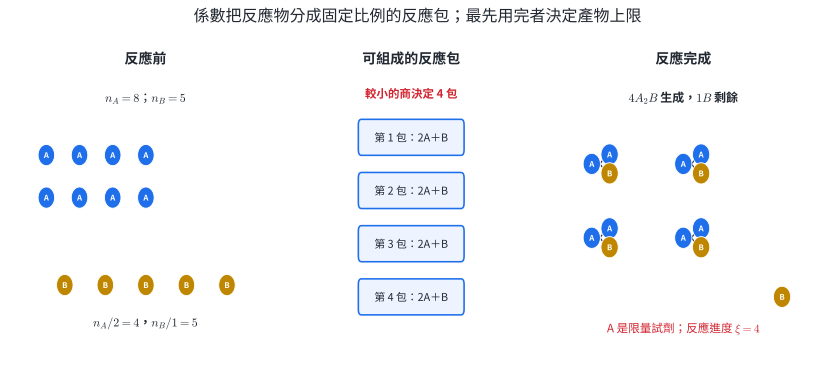
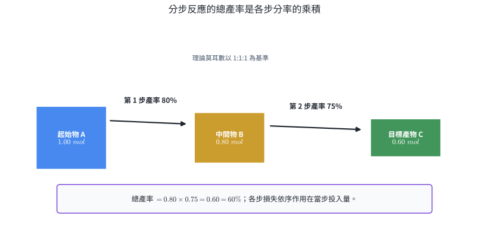
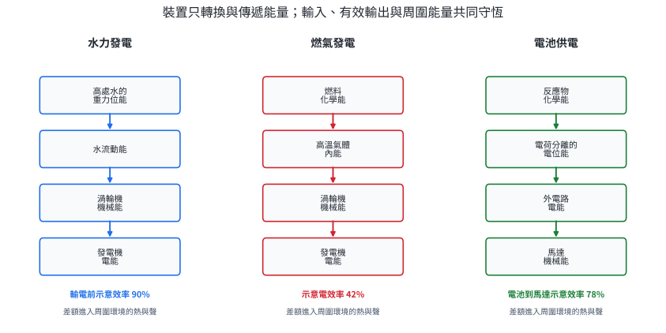
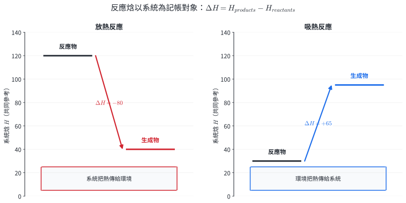
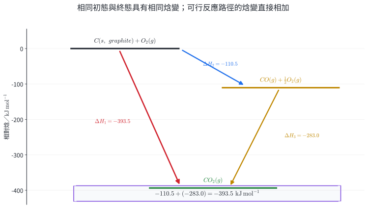
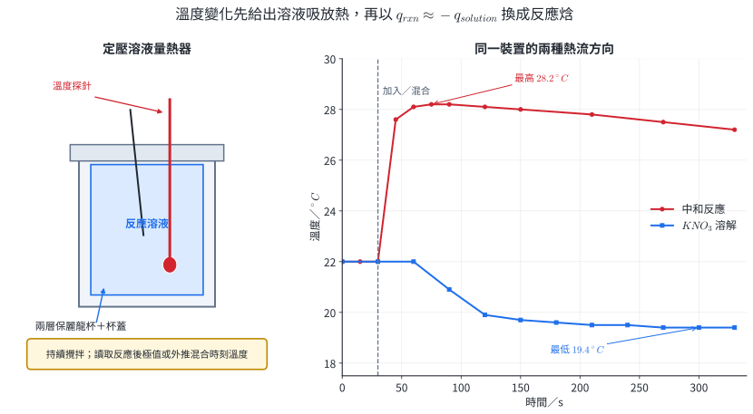
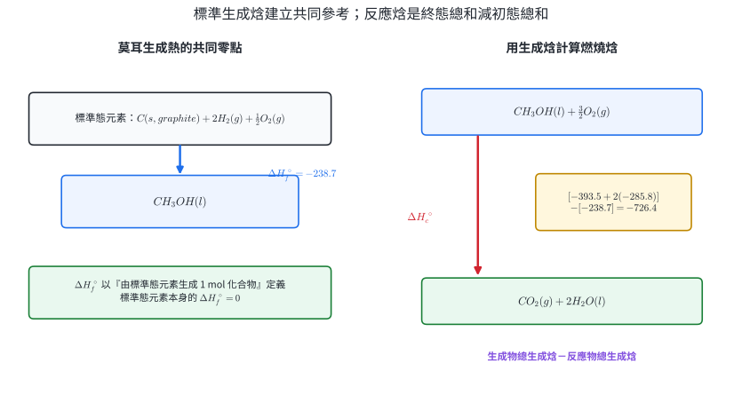
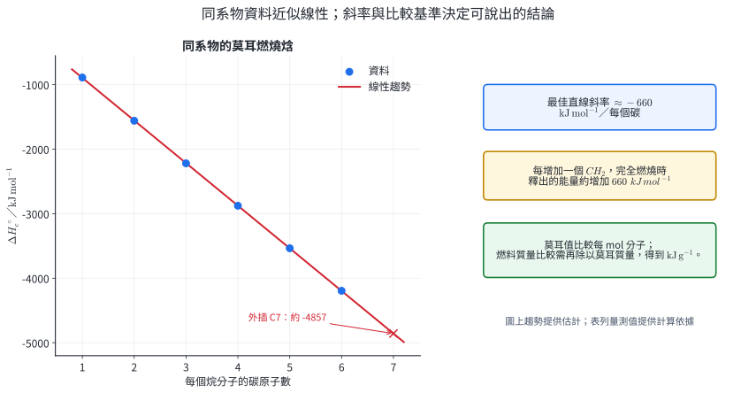

# 選化I-1 化學反應與能量

一個反應能生成多少產物，由反應物數量與化學反應式的係數共同決定；一個反應會讓系統吸熱或放熱，則由反應物與生成物的能量差決定。這兩種帳分別回答「物質往哪裡去」與「能量往哪裡去」。

物質帳用莫耳數、反應進度、限量試劑與產率描述。能量帳先劃定系統與環境，再用反應焓、赫斯定律、燃燒焓、生成焓及量熱資料連接初態和終態。工業投料、藥品合成、燃料比較、食品熱量、電池與發電效率都需要同時掌握這兩本帳。

::: learning-map
### 本章問題與能力

1. 給定多種反應物時，如何由係數比找出限量試劑、理論產量、剩餘量與實際產率？
2. 如何把水壩、火力發電、電池、馬達與加熱器寫成可量化的能量轉換鏈？
3. 反應熱的正負號、數值與熱化學方程式中的係數、物態、溫度及壓力有何關係？
4. 無法直接量測的反應焓，如何由反應式運算、能階圖或標準生成焓資料求得？
5. 如何由溫度—時間資料估算反應熱，並辨認量熱器的熱容量、散熱與混合方式造成的偏差？
6. 如何依每莫耳、每克或每單位有效輸出比較燃料與能源系統？
:::

## 1. 化學反應的限量試劑與產率

### 1.1 係數比、反應進度與限量試劑

配平反應式

$$
aA+bB\rightarrow cC+dD
$$

表示每一個完整的「反應包」消耗 $a$ mol $A$ 與 $b$ mol $B$，同時生成 $c$ mol $C$ 與 $d$ mol $D$。以正數係數表示各物質在一包中的數量，初始莫耳數分別為 $n_{A,0}$、$n_{B,0}$ 時，可完成的反應包數上限為

$$
\xi_{\max}=\min\left(\frac{n_{A,0}}{a},\frac{n_{B,0}}{b}\right).
$$

$\xi$ 稱為**反應進度**，單位是 mol。達到 $\xi_{\max}$ 時，商最小的反應物最先耗盡，稱為**限量試劑**；仍有剩餘的反應物稱為**過量試劑**。各物質的完成量為

$$
\begin{aligned}
n_A&=n_{A,0}-a\xi_{\max},&
n_B&=n_{B,0}-b\xi_{\max},\\
n_C&=n_{C,0}+c\xi_{\max},&
n_D&=n_{D,0}+d\xi_{\max}.
\end{aligned}
$$

這套寫法同時處理純物質質量、溶液濃度、氣體體積與粒子數。先把所有資料換成莫耳數；同溫同壓的氣體也可直接用體積除以係數，因為此時體積比等於莫耳數比。

{width=98%}

圖 1 中

$$
\frac{n_A}{2}=\frac{8}{2}=4,\qquad \frac{n_B}{1}=\frac{5}{1}=5.
$$

較小值 4 同時決定產物數量與所有物質的變化量。這比逐一猜測反應物是否過量更穩定，尤其適合三種以上反應物或濃度、純度混合出現的題目。

::: worked-example
### 示範 1｜由反應進度求限量試劑、產物與剩餘量

反應

$$
N_2(g)+3H_2(g)\rightarrow2NH_3(g)
$$

起初有 $2.40\ \mathrm{mol}$ $N_2$ 與 $5.40\ \mathrm{mol}$ $H_2$。求限量試劑、$NH_3$ 理論莫耳數及剩餘的過量試劑。

先比較可完成的反應包：

$$
\frac{2.40}{1}=2.40,\qquad \frac{5.40}{3}=1.80.
$$

故 $\xi_{\max}=1.80\ \mathrm{mol}$，$H_2$ 是限量試劑。

$$
n(NH_3)=2\xi_{\max}=3.60\ \mathrm{mol}.
$$

$N_2$ 消耗 $1.80\ \mathrm{mol}$，剩餘

$$
2.40-1.80=0.60\ \mathrm{mol}.
$$

完成量檢查：$H_2$ 消耗 $3(1.80)=5.40\ \mathrm{mol}$，正好用完；氮原子與氫原子在兩側守恆。
:::

::: worked-example
### 示範 2｜純度、濃度與氣體體積合併

$12.5\ \mathrm g$ 石灰石含 $80.0\%$ 的 $CaCO_3$，加入 $150.0\ \mathrm{mL}$、$1.00\ \mathrm{mol\,L^{-1}}$ 的鹽酸：

$$
CaCO_3(s)+2HCl(aq)\rightarrow CaCl_2(aq)+CO_2(g)+H_2O(l).
$$

求 $25^\circ\mathrm C$、$1\ \mathrm{bar}$ 下 $CO_2$ 的理論體積。取 $M(CaCO_3)=100.0\ \mathrm{g\,mol^{-1}}$、氣體莫耳體積 $24.8\ \mathrm{L\,mol^{-1}}$。

有效的碳酸鈣質量與莫耳數為

$$
m=12.5(0.800)=10.0\ \mathrm g,\qquad n(CaCO_3)=0.100\ \mathrm{mol}.
$$

鹽酸為

$$
n(HCl)=(1.00)(0.1500)=0.150\ \mathrm{mol}.
$$

比較

$$
\frac{0.100}{1}=0.100,\qquad \frac{0.150}{2}=0.0750.
$$

鹽酸是限量試劑，$\xi_{\max}=0.0750\ \mathrm{mol}$，所以

$$
V(CO_2)=(0.0750)(24.8)=1.86\ \mathrm L.
$$

若直接把全部石灰石質量視為 $CaCO_3$，會把反應包數高估；純度需在換算莫耳數之前處理。
:::

### 1.2 理論產量、實際產率與分步反應

由限量試劑和配平係數得到的最大產物量稱為**理論產量**。實驗分離後實際取得的產物量稱為**實際產量**。同一種單位下，

$$
\text{產率}=\frac{\text{實際產量}}{\text{理論產量}}\times100\%.
$$

反應未完全、競爭反應、轉移損失、過濾或純化損失都會降低實際產量。若計算得到超過 $100\%$，常見原因是產物含溶劑、未乾燥、混有雜質，或理論產量所用的純度與反應式有誤；此時應回到量測與物質帳查證。

連續多步反應要逐步傳遞「實際可投入下一步的量」。兩步反應的分率產率為 $\eta_1$、$\eta_2$，且各步化學計量已另行換算時，

$$
\eta_{\text{總}}=\eta_1\eta_2.
$$

三步以上同理。百分數需先化為小數相乘。

{width=96%}

::: worked-example
### 示範 3｜由實際質量求產率

$0.100\ \mathrm{mol}$ $CuO$ 完全被氫氣還原時，理論上生成 $0.100\ \mathrm{mol}$ $Cu$。實驗得到 $5.72\ \mathrm g$ 乾燥銅，求產率。取 $M(Cu)=63.5\ \mathrm{g\,mol^{-1}}$。

理論質量為

$$
m_{\text{theory}}=(0.100)(63.5)=6.35\ \mathrm g.
$$

所以

$$
\text{產率}=\frac{5.72}{6.35}\times100\%=90.1\%.
$$

分子與分母都指同一產物且都用克，單位相消。
:::

::: worked-example
### 示範 4｜分步產率與最終產物

製程中 $A\rightarrow B\rightarrow C$ 的兩步均為 $1:1$。投入 $2.00\ \mathrm{mol}$ $A$，兩步產率依序為 $85.0\%$ 與 $72.0\%$。求最終 $C$ 的莫耳數與總產率。

第一步實際得到

$$
n(B)=(2.00)(0.850)=1.70\ \mathrm{mol}.
$$

第二步以這 $1.70\ \mathrm{mol}$ 為投入：

$$
n(C)=(1.70)(0.720)=1.224\ \mathrm{mol}\approx1.22\ \mathrm{mol}.
$$

總產率為

$$
(0.850)(0.720)\times100\%=61.2\%.
$$

這個結果能直接用於估算原料成本、反應器負荷與廢棄物流量；提升前段產率也會放大後段可處理的物料。
:::

### 練習 1.1

1. $2Al+3Cl_2\rightarrow2AlCl_3$。有 $4.00\ \mathrm{mol}$ $Al$ 與 $5.00\ \mathrm{mol}$ $Cl_2$，求限量試劑、$AlCl_3$ 理論莫耳數及過量試劑剩餘量。
2. $2CO+O_2\rightarrow2CO_2$。同溫同壓下混合 $30.0\ \mathrm L$ $CO$ 與 $12.0\ \mathrm L$ $O_2$，反應完成後求 $CO_2$ 體積與剩餘氣體體積。
3. $5.00\ \mathrm g$ 含 $92.0\%$ $Mg$ 的金屬樣品與足量鹽酸反應。依 $Mg+2HCl\rightarrow MgCl_2+H_2$，求 $H_2$ 理論莫耳數。取 $M(Mg)=24.3\ \mathrm{g\,mol^{-1}}$。
4. 某反應理論上可得 $12.0\ \mathrm g$ 產物，乾燥後取得 $9.84\ \mathrm g$，求產率。
5. 三步一比一反應的產率依序為 $90.0\%$、$80.0\%$、$75.0\%$。求總產率；若需取得 $1.00\ \mathrm{mol}$ 最終產物，至少需投入多少莫耳起始物？
6. $A+2B\rightarrow C$。三次實驗的初始量與乾燥產物如下。假設反應式與產物純度可靠，計算各次理論 $C$ 莫耳數與產率，並指出哪一次最值得先檢查量測流程。

| 實驗 | $n_A$/mol | $n_B$/mol | 實際 $n_C$/mol |
|---:|---:|---:|---:|
| I | 0.100 | 0.160 | 0.072 |
| II | 0.100 | 0.240 | 0.093 |
| III | 0.100 | 0.200 | 0.104 |

### 練習 1.1 解析

1. 比較 $4.00/2=2.00$ 與 $5.00/3=1.667$，故 $Cl_2$ 限量，$\xi_{\max}=1.667\ \mathrm{mol}$。$n(AlCl_3)=2\xi=3.33\ \mathrm{mol}$；$Al$ 剩 $4.00-2(1.667)=0.667\ \mathrm{mol}$。
2. 以體積比比較：$30.0/2=15.0$，$12.0/1=12.0$，故 $O_2$ 限量。生成 $2(12.0)=24.0\ \mathrm L$ $CO_2$，剩餘 $CO=30.0-24.0=6.0\ \mathrm L$。若水與其他氣體皆未加入，反應後總氣體為 $30.0\ \mathrm L$。
3. 純鎂質量為 $5.00(0.920)=4.60\ \mathrm g$，$n(Mg)=4.60/24.3=0.189\ \mathrm{mol}$。係數比 $Mg:H_2=1:1$，故理論 $H_2$ 為 $0.189\ \mathrm{mol}$。
4. $\text{產率}=9.84/12.0\times100\%=82.0\%$。
5. 總產率為 $(0.900)(0.800)(0.750)=0.540=54.0\%$。所需起始物為 $1.00/0.540=1.85\ \mathrm{mol}$。
6. I 的 $\xi_{\max}=\min(0.100,0.160/2)=0.0800$，產率 $0.072/0.0800=90.0\%$。II 的理論量為 $0.100\ \mathrm{mol}$，產率 $93.0\%$。III 的理論量為 $0.100\ \mathrm{mol}$，表面產率 $104\%$；III 最值得先檢查乾燥、純度、秤量與資料登錄，因其實際量超過此物質帳容許的上限。

## 2. 各種能量形式的轉換

### 2.1 系統、環境與能量形式

**系統**是本次分析所選取的物體或物質；系統以外且能與其交換能量或物質的部分是**環境**。同一裝置可採不同邊界，因此敘述能量之前要先說明系統。例如把電池視為系統時，放電期間化學能降低並向外電路輸出電能；把「電池＋馬達」視為系統時，有效輸出改成馬達的機械能。

高中常用的能量形式包括：

- **動能：**物體因運動而具有的能量，$K=\frac12mv^2$。
- **重力位能：**近地表可寫成 $U_g=mgh$，零位能位置由問題選定。
- **彈性位能：**理想彈簧為 $U_s=\frac12kx^2$。
- **內能：**系統微觀粒子的動能與交互作用能總和；溫度改變、相變與反應都可能改變內能。
- **化學能：**化學組成與結構改變時所涉及的內能部分，常以反應焓量化定壓條件下的能量差。
- **電能、輻射能與核能：**分別與電荷運動或位置、電磁輻射、原子核狀態有關。

**熱 $q$** 是因溫度差而跨越系統邊界的能量傳遞；**功 $w$** 是力學、電學等有序方式跨越邊界的能量傳遞。熱與功描述過程中的傳遞，焦耳 J 是能量與熱量的 SI 單位。

### 2.2 能量守恆、功率與效率

能量轉換裝置遵守能量守恆。對一次操作或穩態裝置，可寫成

$$
E_{\text{input}}=E_{\text{useful}}+E_{\text{to surroundings}}+\Delta E_{\text{stored}}.
$$

若操作前後沒有淨儲能，

$$
\eta=\frac{E_{\text{useful}}}{E_{\text{input}}}\times100\%.
$$

效率的分子必須先由目的定義：電廠常取輸出電能，熱水器常取水吸收的熱量，馬達常取軸輸出的機械能。散入環境的熱仍屬能量，只是未成為本次指定的有效輸出。

**功率**是能量轉換速率：

$$
P=\frac{\Delta E}{\Delta t},\qquad 1\ \mathrm W=1\ \mathrm{J\,s^{-1}}.
$$

電費常用的千瓦小時是能量單位：

$$
1\ \mathrm{kWh}=(1000\ \mathrm W)(3600\ \mathrm s)=3.60\times10^6\ \mathrm J.
$$

電池標示的安培小時乘上額定電壓可估算電能：

$$
E=VQ=V(I\Delta t).
$$

當 $V$ 用伏特、容量用安培小時時，所得單位是 Wh。

{width=98%}

圖 3 的轉換鏈可用來定位改善點。水力發電的水力損失、渦輪摩擦與發電機電阻各發生在不同環節；只給總效率時能算總輸出，要分配每一段損失則需要分段量測。

::: worked-example
### 示範 5｜水力發電的位能與有效輸出

$100\ \mathrm{kg}$ 的水下降 $50.0\ \mathrm m$，渦輪與發電機的總效率為 $80.0\%$。取 $g=9.80\ \mathrm{m\,s^{-2}}$，求重力位能減少量、輸出電能與進入環境的能量。

重力位能減少

$$
\Delta E_g=mgh=(100)(9.80)(50.0)=4.90\times10^4\ \mathrm J.
$$

有效輸出

$$
E_{\text{electric}}=(0.800)(4.90\times10^4)=3.92\times10^4\ \mathrm J.
$$

環境得到

$$
4.90\times10^4-3.92\times10^4=9.80\times10^3\ \mathrm J.
$$

以水的下降前後作能量帳，三個數值相加符合守恆。
:::

::: worked-example
### 示範 6｜電熱器的功率、熱量與效率

$1.50\ \mathrm{kW}$ 電熱器加熱 $1.20\ \mathrm{kg}$ 的水 $4.00\ \mathrm{min}$，水由 $20.0^\circ\mathrm C$ 升至 $80.0^\circ\mathrm C$。取水的比熱 $4.18\ \mathrm{kJ\,kg^{-1}\,K^{-1}}$，求輸入電能、水吸收的熱量與效率。

$$
E_{\text{input}}=P\Delta t=(1.50\ \mathrm{kJ\,s^{-1}})(240\ \mathrm s)=360\ \mathrm{kJ}.
$$

$$
q_{\text{water}}=mc\Delta T=(1.20)(4.18)(60.0)=301\ \mathrm{kJ}.
$$

若有效輸出定義為水吸收的熱量，

$$
\eta=\frac{301}{360}\times100\%=83.6\%.
$$

差額約 $59\ \mathrm{kJ}$ 進入容器與周圍空氣。量測容器熱容量後，可把容器吸熱另列一項，得到更完整的能量分配。
:::

::: worked-example
### 示範 7｜電池容量換成可用能量

一顆額定 $3.70\ \mathrm V$、$2.50\ \mathrm{Ah}$ 的電池驅動效率 $78.0\%$ 的馬達。估算電池標稱電能與馬達可輸出的機械能。

$$
E_{\text{battery}}=(3.70)(2.50)=9.25\ \mathrm{Wh}
=9.25(3.60)=33.3\ \mathrm{kJ}.
$$

$$
E_{\text{mechanical}}=(0.780)(33.3)=26.0\ \mathrm{kJ}.
$$

額定電壓會隨放電狀態改變，因此這是工程估算；精確結果需積分實際的 $V(t)I(t)$。
:::

### 練習 2

1. 寫出太陽能板替行動電源充電、再由行動電源點亮 LED 的能量轉換鏈。
2. $2.00\ \mathrm{kW}$ 烤箱運轉 $45.0\ \mathrm{min}$，耗能多少 kWh 與 MJ？
3. 一部馬達輸入電能 $500\ \mathrm{kJ}$，輸出機械能 $365\ \mathrm{kJ}$。求效率與進入環境的能量。
4. $75.0\ \mathrm{kg}$ 的人爬升 $12.0\ \mathrm m$，身體消耗化學能 $55.0\ \mathrm{kJ}$。取 $g=9.80\ \mathrm{m\,s^{-2}}$，以重力位能增加為有效輸出，求效率。
5. 兩顆電池的標示分別為 A：$1.20\ \mathrm V,\ 2.00\ \mathrm{Ah}$；B：$3.70\ \mathrm V,\ 0.800\ \mathrm{Ah}$。比較其標稱能量，並說明只用 Ah 比較會漏掉哪個量。

### 練習 2 解析

1. 太陽輻射能 $\rightarrow$ 太陽能板輸出的電能 $\rightarrow$ 電池儲存的化學能 $\rightarrow$ 放電的電能 $\rightarrow$ LED 的光能與進入環境的熱。
2. $E=(2.00\ \mathrm{kW})(0.750\ \mathrm h)=1.50\ \mathrm{kWh}$；換算為 $1.50(3.60)=5.40\ \mathrm{MJ}$。
3. $\eta=365/500\times100\%=73.0\%$；進入環境的能量為 $500-365=135\ \mathrm{kJ}$。
4. $\Delta U_g=mgh=(75.0)(9.80)(12.0)=8.82\ \mathrm{kJ}$。效率 $=8.82/55.0\times100\%=16.0\%$。
5. A 為 $(1.20)(2.00)=2.40\ \mathrm{Wh}$；B 為 $(3.70)(0.800)=2.96\ \mathrm{Wh}$，故 B 較大。Ah 是電量，還需電壓才能換成能量。

## 3. 反應熱的特性與赫斯定律

### 3.1 反應焓與熱化學方程式

熱力學把研究的反應物、生成物與容器選為系統，其餘部分為環境。採「熱進入系統為正」的符號約定：

- 系統吸熱：$q_{\text{system}}>0$，環境失去等量熱。
- 系統放熱：$q_{\text{system}}<0$，環境得到等量熱。

**焓**定義為

$$
H=U+pV,
$$

其中 $U$ 是內能，$pV$ 項處理系統在外壓下占有體積的能量帳。在定壓且只有體積功的條件下，

$$
\Delta H=q_p.
$$

因此**反應焓** $\Delta H_{\mathrm{rxn}}$ 是指定反應在定壓下的熱效應，也是終態與初態的焓差：

$$
\Delta H_{\mathrm{rxn}}=H_{\text{products}}-H_{\text{reactants}}.
$$

$\Delta H$ 描述指定初態與終態的定壓熱效應。反應速率由反應機構與活化能控制；反應方向還涉及熵等熱力學量，兩者在後續章節另建模型。

{width=96%}

**熱化學方程式**必須同時給出：

1. 配平的化學式與係數；
2. 各物質的物態 $(s)$、$(l)$、$(g)$、$(aq)$；
3. 反應方向與對應的 $\Delta H$；
4. 數值所適用的溫度、壓力或標準態條件。

例如

$$
H_2(g)+\frac12O_2(g)\rightarrow H_2O(l)
\qquad \Delta H^\circ=-285.8\ \mathrm{kJ}
$$

表示依方程式寫出的反應進行一次，即生成 $1\ \mathrm{mol}$ 液態水時放出 $285.8\ \mathrm{kJ}$。若生成水蒸氣，終態焓較高，數值約為 $-241.8\ \mathrm{kJ}$；物態改變了終態，反應焓也隨之改變。

反應焓具有三個直接運算規則：

$$
\begin{aligned}
\text{方程式乘 }k&\Rightarrow \Delta H\text{ 乘 }k,\\
\text{方程式反向}&\Rightarrow \Delta H\text{ 變號},\\
\text{方程式相加}&\Rightarrow \Delta H\text{ 相加}.
\end{aligned}
$$

係數可以是分數，因為熱化學方程式記錄的是莫耳尺度的狀態變化。

::: worked-example
### 示範 8｜縮放與反向熱化學方程式

已知

$$
2H_2(g)+O_2(g)\rightarrow2H_2O(l)
\qquad \Delta H^\circ=-571.6\ \mathrm{kJ}.
$$

求 $3.00\ \mathrm{mol}$ $H_2O(l)$ 分解成元素的焓變。

原式生成 $2\ \mathrm{mol}$ 水。先反向，再乘 $3/2$：

$$
3H_2O(l)\rightarrow3H_2(g)+\frac32O_2(g).
$$

$$
\Delta H^\circ=(+571.6)\left(\frac32\right)=+857.4\ \mathrm{kJ}.
$$

正號表示分解過程由環境取得熱；係數與焓變一起縮放。
:::

### 3.2 赫斯定律與反應式代數

焓是狀態函數。只要初態與終態相同，總焓變只由兩端狀態決定，與中間選取幾步反應無關。這就是**赫斯定律**：

$$
\Delta H_{\text{direct}}=\sum_i \Delta H_i.
$$

反應式代數的實作方法是：

1. 先寫目標反應；
2. 讓每個中間物在相加後消去；
3. 方程式反向時同步改變 $\Delta H$ 符號，縮放時同步縮放 $\Delta H$；
4. 相加後檢查元素、電荷、物態與反應方向。

{width=94%}

圖 5 的兩步路徑為

$$
\begin{aligned}
C(s,\mathrm{graphite})+\frac12O_2(g)&\rightarrow CO(g)
&&\Delta H^\circ=-110.5\ \mathrm{kJ},\\
CO(g)+\frac12O_2(g)&\rightarrow CO_2(g)
&&\Delta H^\circ=-283.0\ \mathrm{kJ}.
\end{aligned}
$$

相加後中間物 $CO$ 消去，得到

$$
C(s,\mathrm{graphite})+O_2(g)\rightarrow CO_2(g),
\qquad \Delta H^\circ=-393.5\ \mathrm{kJ}.
$$

赫斯定律使難以直接操作的反應也能由可靠的可測反應組合求值，例如高溫生成反應、燃燒不完全的中間步驟與晶型轉換。

::: worked-example
### 示範 9｜由兩個已知反應組成目標反應

已知

$$
\begin{aligned}
N_2(g)+2O_2(g)&\rightarrow2NO_2(g)
&&\Delta H_1=+66.4\ \mathrm{kJ},\\
2NO(g)+O_2(g)&\rightarrow2NO_2(g)
&&\Delta H_2=-114.2\ \mathrm{kJ}.
\end{aligned}
$$

求

$$
N_2(g)+O_2(g)\rightarrow2NO(g)
$$

的反應焓。

目標要生成 $NO$，因此把第二式反向：

$$
2NO_2(g)\rightarrow2NO(g)+O_2(g)
\qquad \Delta H=+114.2\ \mathrm{kJ}.
$$

與第一式相加，$2NO_2$ 消去：

$$
N_2+2O_2\rightarrow2NO_2
$$

$$
2NO_2\rightarrow2NO+O_2
$$

淨反應為 $N_2+O_2\rightarrow2NO$，所以

$$
\Delta H=66.4+114.2=+180.6\ \mathrm{kJ}.
$$
:::

::: worked-example
### 示範 10｜由能階資料找未知步驟

某反應由狀態 A 直接到 C 的焓變為 $-250\ \mathrm{kJ}$；A 到 B 為 $+35\ \mathrm{kJ}$。求 B 到 C 的焓變。

沿 A $\rightarrow$ B $\rightarrow$ C：

$$
\Delta H_{A\to C}=\Delta H_{A\to B}+\Delta H_{B\to C}.
$$

因此

$$
-250=+35+\Delta H_{B\to C},
$$

$$
\Delta H_{B\to C}=-285\ \mathrm{kJ}.
$$

B 的焓比 A 高 $35\ \mathrm{kJ}$，而 C 比 A 低 $250\ \mathrm{kJ}$，從 B 降到 C 應下降 $285\ \mathrm{kJ}$，符號與能階關係一致。
:::

### 3.3 量熱法：由溫度變化回推反應熱

量熱實驗把反應放在已知熱容量的周圍物質中，量測溫度變化。溶液吸收或放出的熱量近似為

$$
q_{\text{solution}}=m_{\text{solution}}c_{\text{solution}}\Delta T.
$$

若量熱杯與探針的總熱容量為 $C_{\text{cal}}$，

$$
q_{\text{cal}}=C_{\text{cal}}\Delta T.
$$

在量測期間與外界交換的熱可忽略時，

$$
q_{\text{rxn}}+q_{\text{solution}}+q_{\text{cal}}=0.
$$

簡化模型忽略 $q_{\text{cal}}$ 時，

$$
q_{\text{rxn}}\approx-mc\Delta T,\qquad
\Delta H_{\text{molar}}\approx\frac{q_{\text{rxn}}}{n_{\text{reaction}}}.
$$

$n_{\text{reaction}}$ 是實際完成的反應進度。中和反應可用生成的 $H_2O$ 莫耳數；溶解反應可用溶解的溶質莫耳數。

{width=98%}

#### 實驗：中和熱與溶解熱

**裝置與量測。**以兩層保麗龍杯、杯蓋、溫度探針與攪拌棒組成近似定壓量熱器。中和組分別量取 $100.0\ \mathrm{mL}$、$1.00\ \mathrm{mol\,L^{-1}}$ 的 $HCl$ 與 $NaOH$，先量兩液初溫，再迅速混合、持續攪拌並每隔固定時間記錄溫度。溶解組把約 $3.00\ \mathrm g$ $KNO_3$ 加入 $100.0\ \mathrm{mL}$ 水，以相同方式記錄最低溫。

**安全與廢液。**鹽酸與氫氧化鈉具腐蝕性；硝酸鉀為氧化性固體。操作使用護目鏡、實驗衣與合適手套，濺灑依實驗室程序立即處理。中和液先確認 pH 並依校內規範收集；含硝酸根溶液進入指定無機鹽廢液容器。廢液去向由實驗室現行分類決定。

**觀察與推論分開記錄。**

| 實驗 | 直接觀察 | 依能量帳得到的推論 |
|---|---|---|
| $HCl+NaOH$ | 溫度由 $22.0^\circ\mathrm C$ 上升至最高 $28.2^\circ\mathrm C$ | 溶液吸熱，反應系統放熱，$\Delta H<0$ |
| $KNO_3$ 溶解 | 溫度由 $22.0^\circ\mathrm C$ 降至最低 $19.4^\circ\mathrm C$ | 溶液放熱給溶解過程，溶解焓 $\Delta H>0$ |

溫度極值若出現在混合後一段時間，曲線已同時受到散熱影響。可用反應後近線性區段外推回混合時刻，以估計較接近絕熱條件的 $\Delta T$。重複量測提供隨機變異；空杯校正或已知熱反應可求 $C_{\text{cal}}$。

::: worked-example
### 示範 11｜由中和溫升求莫耳中和熱

等體積的 $100.0\ \mathrm{mL}$、$1.00\ \mathrm{mol\,L^{-1}}$ $HCl$ 與 $NaOH$ 混合，初溫 $22.0^\circ\mathrm C$，最高溫 $28.2^\circ\mathrm C$。取混合液密度 $1.00\ \mathrm{g\,mL^{-1}}$、比熱 $4.18\ \mathrm{J\,g^{-1}\,K^{-1}}$，先忽略量熱器熱容量。求莫耳中和熱。

總溶液質量約 $200.0\ \mathrm g$，$\Delta T=+6.2\ \mathrm K$：

$$
q_{\text{solution}}=(200.0)(4.18)(6.2)=5.18\times10^3\ \mathrm J.
$$

所以這次反應

$$
q_{\text{rxn}}\approx-5.18\ \mathrm{kJ}.
$$

$H^+$ 與 $OH^-$ 各為 $0.100\ \mathrm{mol}$，生成 $0.100\ \mathrm{mol}$ 水，故

$$
\Delta H_{\text{neut}}\approx
\frac{-5.18}{0.100}
=-51.8\ \mathrm{kJ\,mol^{-1}}.
$$

若把量熱杯吸收的熱納入，放熱量的絕對值會增加。
:::

::: worked-example
### 示範 12｜由降溫求硝酸鉀莫耳溶解熱

$3.00\ \mathrm g$ $KNO_3$ 溶於 $100.0\ \mathrm g$ 水，溫度由 $22.0^\circ\mathrm C$ 降至 $19.4^\circ\mathrm C$。取溶液質量 $103.0\ \mathrm g$、比熱 $4.18\ \mathrm{J\,g^{-1}\,K^{-1}}$、$M(KNO_3)=101.1\ \mathrm{g\,mol^{-1}}$，忽略量熱器熱容量。

$$
\Delta T=19.4-22.0=-2.6\ \mathrm K.
$$

$$
q_{\text{solution}}=(103.0)(4.18)(-2.6)=-1.12\ \mathrm{kJ}.
$$

溶解系統吸收等量熱：

$$
q_{\text{dissolution}}\approx+1.12\ \mathrm{kJ}.
$$

$$
n(KNO_3)=\frac{3.00}{101.1}=0.0297\ \mathrm{mol},
$$

$$
\Delta H_{\text{sol}}\approx\frac{+1.12}{0.0297}
=+37.7\ \mathrm{kJ\,mol^{-1}}.
$$

正號與降溫資料一致：在所選邊界下，溶解過程從溶液取得能量。
:::

### 練習 3

1. 已知 $2SO_2(g)+O_2(g)\rightarrow2SO_3(g)$，$\Delta H=-198\ \mathrm{kJ}$。寫出 $1\ \mathrm{mol}$ $SO_3$ 分解的熱化學方程式與焓變。
2. 同一反應生成 $H_2O(l)$ 時 $\Delta H=-285.8\ \mathrm{kJ\,mol^{-1}}$，生成 $H_2O(g)$ 時 $\Delta H=-241.8\ \mathrm{kJ\,mol^{-1}}$。求 $H_2O(l)\rightarrow H_2O(g)$ 的焓變。
3. A $\rightarrow$ B 的 $\Delta H=+42\ \mathrm{kJ}$，B $\rightarrow$ C 為 $-75\ \mathrm{kJ}$，C $\rightarrow$ D 為 $+18\ \mathrm{kJ}$。求 A $\rightarrow$ D 與 D $\rightarrow$ A 的焓變。
4. 已知

   $$
   \begin{aligned}
   C(s)+O_2(g)&\rightarrow CO_2(g)&\Delta H&=-393.5\ \mathrm{kJ},\\
   2CO(g)+O_2(g)&\rightarrow2CO_2(g)&\Delta H&=-566.0\ \mathrm{kJ}.
   \end{aligned}
   $$

   求 $C(s)+\frac12O_2(g)\rightarrow CO(g)$ 的焓變。
5. $50.0\ \mathrm{mL}$ $1.00\ \mathrm M$ $HCl$ 與 $50.0\ \mathrm{mL}$ $1.00\ \mathrm M$ $NaOH$ 混合，總質量 $100.0\ \mathrm g$，溫度上升 $6.00\ \mathrm K$。取 $c=4.18\ \mathrm{J\,g^{-1}\,K^{-1}}$，忽略量熱器熱容量，求這次反應熱與莫耳中和熱。
6. 某量熱器含 $150.0\ \mathrm g$ 溶液，$c=4.18\ \mathrm{J\,g^{-1}\,K^{-1}}$，量熱器熱容量 $C_{\text{cal}}=85\ \mathrm{J\,K^{-1}}$。反應使溫度上升 $4.50\ \mathrm K$，完成反應進度為 $0.0400\ \mathrm{mol}$。求反應的莫耳焓變。

### 練習 3 解析

1. 原式反向並除以 2：

   $$
   SO_3(g)\rightarrow SO_2(g)+\frac12O_2(g),
   \qquad \Delta H=+99.0\ \mathrm{kJ}.
   $$

2. 把「元素生成氣態水」加上「液態水分解為元素」：

   $$
   \Delta H_{\text{vap}}=(-241.8)-(-285.8)=+44.0\ \mathrm{kJ\,mol^{-1}}.
   $$

3. $\Delta H_{A\to D}=42-75+18=-15\ \mathrm{kJ}$；反向為 $\Delta H_{D\to A}=+15\ \mathrm{kJ}$。
4. 第二式除以 2 並反向：

   $$
   CO_2\rightarrow CO+\frac12O_2,\qquad \Delta H=+283.0\ \mathrm{kJ}.
   $$

   加到第一式後得目標反應，$\Delta H=-393.5+283.0=-110.5\ \mathrm{kJ}$。
5. $q_{\text{solution}}=(100.0)(4.18)(6.00)=2.51\ \mathrm{kJ}$，故 $q_{\text{rxn}}=-2.51\ \mathrm{kJ}$。生成水 $0.0500\ \mathrm{mol}$，$\Delta H_{\text{neut}}=-2.51/0.0500=-50.2\ \mathrm{kJ\,mol^{-1}}$。
6. 周圍吸熱

   $$
   q_{\text{surr}}=[(150.0)(4.18)+85](4.50)=3.20\ \mathrm{kJ}.
   $$

   故 $q_{\text{rxn}}=-3.20\ \mathrm{kJ}$，莫耳焓變 $=-3.20/0.0400=-80.0\ \mathrm{kJ\,mol^{-1}}$。

## 4. 莫耳燃燒熱與莫耳生成熱

### 4.1 標準態、莫耳燃燒熱與莫耳生成熱

熱化學資料必須有共同條件才能相加。**標準態**是物質在指定溫度、標準壓力下的參考狀態；本講義採標準壓力 $1\ \mathrm{bar}$，表值常列在 $25^\circ\mathrm C$。部分高中題目以 $1\ \mathrm{atm}$ 敘述，計算時依題目提供的資料表與條件。

教材中的「莫耳燃燒熱」與「莫耳生成熱」在定壓條件下分別以莫耳燃燒焓與莫耳生成焓表示；本節使用符號 $\Delta H_c^\circ$ 與 $\Delta H_f^\circ$，正負號依系統吸放熱約定。

**標準莫耳燃燒焓** $\Delta H_c^\circ$ 是 $1\ \mathrm{mol}$ 物質在標準態下與足量氧氣完全燃燒，且生成物也處於指定標準態時的焓變。碳氫化合物的常用終態為 $CO_2(g)$ 與 $H_2O(l)$。水的物態、燃料的物態與燃燒是否完全都會改變數值。

**標準莫耳生成焓** $\Delta H_f^\circ$ 是由各元素的標準態單質生成 $1\ \mathrm{mol}$ 指定化合物的焓變。例如

$$
C(s,\mathrm{graphite})+2H_2(g)+\frac12O_2(g)
\rightarrow CH_3OH(l).
$$

常見標準態單質包括 $H_2(g)$、$N_2(g)$、$O_2(g)$、$Cl_2(g)$、$Br_2(l)$、$Hg(l)$ 與石墨 $C(s,\mathrm{graphite})$。依定義，

$$
\Delta H_f^\circ(\text{元素的標準態單質})=0.
$$

金剛石是碳的另一同素異形體，其 $\Delta H_f^\circ$ 以石墨為零點，數值不為零。

{width=98%}

### 4.2 由生成焓計算反應焓

把每一種物質都連回標準態元素的共同參考，可得

$$
\boxed{
\Delta H_{\mathrm{rxn}}^\circ
=\sum_{\text{products}}\nu\Delta H_f^\circ
-\sum_{\text{reactants}}\nu\Delta H_f^\circ
}
$$

其中 $\nu$ 是配平係數。氧氣等標準態元素的生成焓為零，但它們仍需出現在配平反應式中。

::: worked-example
### 示範 13｜由生成焓求甲烷燃燒焓

求

$$
CH_4(g)+2O_2(g)\rightarrow CO_2(g)+2H_2O(l)
$$

的標準反應焓。給定：

| 物質 | $CH_4(g)$ | $CO_2(g)$ | $H_2O(l)$ | $O_2(g)$ |
|---|---:|---:|---:|---:|
| $\Delta H_f^\circ/\mathrm{kJ\,mol^{-1}}$ | $-74.8$ | $-393.5$ | $-285.8$ | $0$ |

$$
\begin{aligned}
\Delta H_c^\circ
&=[(-393.5)+2(-285.8)]-[(-74.8)+2(0)]\\
&=-890.3\ \mathrm{kJ\,mol^{-1}}.
\end{aligned}
$$

每莫耳甲烷為方程式的反應尺度，因此此值同時是甲烷的莫耳燃燒焓。
:::

::: worked-example
### 示範 14｜由燃燒焓反求乙醇生成焓

乙醇燃燒：

$$
C_2H_5OH(l)+3O_2(g)\rightarrow2CO_2(g)+3H_2O(l),
$$

$\Delta H_c^\circ=-1367\ \mathrm{kJ\,mol^{-1}}$。已知 $\Delta H_f^\circ(CO_2)=-393.5\ \mathrm{kJ\,mol^{-1}}$，$\Delta H_f^\circ(H_2O(l))=-285.8\ \mathrm{kJ\,mol^{-1}}$。求 $\Delta H_f^\circ(C_2H_5OH(l))$。

令乙醇生成焓為 $x$：

$$
-1367=[2(-393.5)+3(-285.8)]-x.
$$

右側生成物總和為 $-1644.4\ \mathrm{kJ\,mol^{-1}}$，故

$$
x=-277.4\ \mathrm{kJ\,mol^{-1}}.
$$

方程式只生成一莫耳乙醇，因此求得的數值已是莫耳生成焓。
:::

### 4.3 以燃燒終態作共同路徑

若反應物與生成物都能完全燃燒到同一組終態，可把各物質的燃燒焓作為赫斯路徑。對配平反應，

$$
\boxed{
\Delta H_{\mathrm{rxn}}^\circ
=\sum_{\text{reactants}}\nu\Delta H_c^\circ
-\sum_{\text{products}}\nu\Delta H_c^\circ
}
$$

公式的符號可由路徑理解：反應物先燃燒到共同終態，再把生成物燃燒的路徑反向，終點才是生成物。

::: worked-example
### 示範 15｜由燃燒焓求乙烯氫化焓

求

$$
C_2H_4(g)+H_2(g)\rightarrow C_2H_6(g)
$$

的反應焓。給定

$$
\begin{aligned}
\Delta H_c^\circ(C_2H_4)&=-1411\ \mathrm{kJ\,mol^{-1}},\\
\Delta H_c^\circ(H_2)&=-285.8\ \mathrm{kJ\,mol^{-1}},\\
\Delta H_c^\circ(C_2H_6)&=-1560\ \mathrm{kJ\,mol^{-1}}.
\end{aligned}
$$

反應物燃燒焓總和減生成物燃燒焓：

$$
\Delta H^\circ=[-1411+(-285.8)]-[-1560]
=-136.8\ \mathrm{kJ\,mol^{-1}}.
$$

負號表示乙烯氫化在這些條件下放熱。
:::

### 4.4 燃料資料的比較基準

燃燒焓常以每莫耳列出；工程選燃料時也常比較每克、每公升或每單位有效電能：

$$
\text{質量能量密度}=\frac{|\Delta H_c|}{M}
\quad(\mathrm{kJ\,g^{-1}}).
$$

同系列烷類每增加一個 $CH_2$，莫耳燃燒焓的絕對值近似增加固定量，因此碳數—莫耳燃燒焓圖接近直線。這是資料趨勢，不取代逐一量測；跨系列、不同物態或不同燃燒終態需另行比較。

{width=96%}

::: worked-example
### 示範 16｜每莫耳與每克燃料給出不同問題

甲烷與乙醇的燃燒焓絕對值分別為 $890.3$ 與 $1367\ \mathrm{kJ\,mol^{-1}}$，莫耳質量分別為 $16.0$ 與 $46.0\ \mathrm{g\,mol^{-1}}$。比較兩者每克完全燃燒的放熱量。

$$
\begin{aligned}
e_{\mathrm{CH_4}}&=\frac{890.3}{16.0}=55.6\ \mathrm{kJ\,g^{-1}},\\
e_{\mathrm{ethanol}}&=\frac{1367}{46.0}=29.7\ \mathrm{kJ\,g^{-1}}.
\end{aligned}
$$

每莫耳乙醇放熱較多，每克則甲烷較多。若比較儲槽體積、發電量或生命週期排放，還需加入密度、裝置效率與系統邊界。
:::

### 練習 4

1. 從 $H_2(g)$、$O_2(g)$、$Br_2(l)$、$C(s,\mathrm{graphite})$、$C(s,\mathrm{diamond})$ 中選出在 $25^\circ\mathrm C$、標準壓力下 $\Delta H_f^\circ=0$ 的物質。
2. 寫出 $NaCl(s)$ 與 $C_2H_6(g)$ 的標準生成反應；每式皆生成 $1\ \mathrm{mol}$ 產物。
3. 由下表計算 $CO(g)+\frac12O_2(g)\rightarrow CO_2(g)$ 的標準反應焓。

| 物質 | $CO(g)$ | $CO_2(g)$ | $O_2(g)$ |
|---|---:|---:|---:|
| $\Delta H_f^\circ/\mathrm{kJ\,mol^{-1}}$ | $-110.5$ | $-393.5$ | $0$ |

4. 已知 $\Delta H_f^\circ(NH_3(g))=-46.1\ \mathrm{kJ\,mol^{-1}}$。求 $N_2(g)+3H_2(g)\rightarrow2NH_3(g)$ 的標準反應焓。
5. 甲醇完全燃燒的 $\Delta H_c^\circ=-726.4\ \mathrm{kJ\,mol^{-1}}$，$M(CH_3OH)=32.0\ \mathrm{g\,mol^{-1}}$。求 $500\ \mathrm g$ 甲醇完全燃燒的熱量絕對值。
6. 某直鏈烷的燃燒焓圖顯示每增加一個碳，$\Delta H_c^\circ$ 約降低 $660\ \mathrm{kJ\,mol^{-1}}$。若己烷為 $-4195\ \mathrm{kJ\,mol^{-1}}$，估計庚烷值，並說明這個估計的適用範圍。

### 練習 4 解析

1. $H_2(g)$、$O_2(g)$、$Br_2(l)$ 與 $C(s,\mathrm{graphite})$ 是各元素的標準態，生成焓定義為 0。金剛石以石墨為參考，生成焓不為 0。
2.

   $$
   Na(s)+\frac12Cl_2(g)\rightarrow NaCl(s)
   $$

   $$
   2C(s,\mathrm{graphite})+3H_2(g)\rightarrow C_2H_6(g).
   $$

3. $\Delta H^\circ=(-393.5)-[(-110.5)+0]=-283.0\ \mathrm{kJ\,mol^{-1}}$。
4. 反應物都是標準態元素，故 $\Delta H^\circ=2(-46.1)=-92.2\ \mathrm{kJ}$。這個數值對應反應式生成 $2\ \mathrm{mol}$ $NH_3$。
5. $n=500/32.0=15.625\ \mathrm{mol}$；熱量絕對值 $=(15.625)(726.4)=1.14\times10^4\ \mathrm{kJ}=11.4\ \mathrm{MJ}$。
6. 估計 $\Delta H_c^\circ(C_7H_{16})\approx-4195-660=-4855\ \mathrm{kJ\,mol^{-1}}$。此線性估計適用於相同物態、相同完全燃燒終態與相鄰同系物；正式計算以量測表值為準。

## 5. 章末分層題

### 基礎題

1. $2KClO_3(s)\rightarrow2KCl(s)+3O_2(g)$。加熱 $0.240\ \mathrm{mol}$ $KClO_3$，理論上生成多少莫耳 $O_2$？
2. $N_2+3H_2\rightarrow2NH_3$。起初 $n(N_2)=0.80\ \mathrm{mol}$、$n(H_2)=1.50\ \mathrm{mol}$。求限量試劑與 $NH_3$ 理論量。
3. 某步驟的理論產量 $25.0\ \mathrm g$，實際乾燥產物 $21.5\ \mathrm g$。求產率。
4. 把 $0.750\ \mathrm{kWh}$ 換算為 kJ。
5. 一個反應的生成物總焓比反應物總焓低 $125\ \mathrm{kJ}$。寫出 $\Delta H$ 與熱流方向。
6. 已知 A $\rightarrow$ B 為 $-48\ \mathrm{kJ}$，B $\rightarrow$ C 為 $+20\ \mathrm{kJ}$。求 C $\rightarrow$ A。

### 應用題

7. $CaCO_3+2HCl\rightarrow CaCl_2+CO_2+H_2O$。$0.0600\ \mathrm{mol}$ $CaCO_3$ 與 $80.0\ \mathrm{mL}$、$1.00\ \mathrm M$ $HCl$ 反應，求 $CO_2$ 理論莫耳數與剩餘 $CaCO_3$。
8. 一個 $2.00\ \mathrm{kW}$ 裝置運轉 $6.00\ \mathrm{min}$，有效輸出 $540\ \mathrm{kJ}$。求輸入能量與效率。
9. 已知

   $$
   \begin{aligned}
   S(s)+O_2(g)&\rightarrow SO_2(g)&\Delta H_1&=-296.8\ \mathrm{kJ},\\
   2SO_2(g)+O_2(g)&\rightarrow2SO_3(g)&\Delta H_2&=-198.0\ \mathrm{kJ}.
   \end{aligned}
   $$

   求 $S(s)+\frac32O_2(g)\rightarrow SO_3(g)$ 的焓變。
10. $4.00\ \mathrm g$ 固體溶於 $96.0\ \mathrm g$ 水，溫度由 $24.0^\circ\mathrm C$ 降至 $20.5^\circ\mathrm C$。取溶液比熱 $4.18\ \mathrm{J\,g^{-1}\,K^{-1}}$，忽略量熱器熱容量，求該次溶解過程的熱量與正負號。
11. 用生成焓資料求

   $$
   2CO(g)+O_2(g)\rightarrow2CO_2(g)
   $$

   的 $\Delta H^\circ$。取 $\Delta H_f^\circ(CO)=-110.5$、$\Delta H_f^\circ(CO_2)=-393.5\ \mathrm{kJ\,mol^{-1}}$。
12. 丙烷 $\Delta H_c^\circ=-2220\ \mathrm{kJ\,mol^{-1}}$、$M=44.0\ \mathrm{g\,mol^{-1}}$。某爐具把燃燒熱的 $62.0\%$ 傳給水；燃燒 $22.0\ \mathrm g$ 丙烷時，水最多吸收多少熱？

### 跨節整合題

13. $Zn(s)+2HCl(aq)\rightarrow ZnCl_2(aq)+H_2(g)$。量熱杯中有 $0.0500\ \mathrm{mol}$ Zn 與 $100.0\ \mathrm{mL}$、$0.800\ \mathrm M$ HCl，反應後總溶液等效質量取 $160\ \mathrm g$，溫度上升 $7.00\ \mathrm K$。取 $c=4.18\ \mathrm{J\,g^{-1}\,K^{-1}}$，忽略量熱器熱容量。求限量試劑、反應進度、該次反應熱及每莫耳反應焓。
14. 一部發電機完全燃燒 $0.500\ \mathrm{mol}$ $CH_4$，甲烷燃燒焓為 $-890.3\ \mathrm{kJ\,mol^{-1}}$。燃燒熱轉成電能的效率為 $38.0\%$，電能先存入往返效率 $85.0\%$ 的儲能系統再輸出。求最終可用電能，並寫出主要能量轉換鏈。
15. 石灰窯以 $CaCO_3(s)\rightarrow CaO(s)+CO_2(g)$ 製生石灰，$\Delta H=+178.3\ \mathrm{kJ\,mol^{-1}}$。原料在窯內完全分解，後續收集產率為 $82.0\%$；要收集 $50.0\ \mathrm{kg}$ $CaO$，求窯內需完成的反應進度與至少供給的反應熱。取 $M(CaO)=56.0\ \mathrm{g\,mol^{-1}}$。
16. 某液態燃料的燃燒焓為 $-1367\ \mathrm{kJ\,mol^{-1}}$。將 $1.230\ \mathrm g$ 燃料完全燃燒，熱量全部由 $2.000\ \mathrm{kg}$ 水及熱容量 $350\ \mathrm{J\,K^{-1}}$ 的量熱器吸收，溫度上升 $4.20\ \mathrm K$。取水的比熱 $4.18\ \mathrm{kJ\,kg^{-1}\,K^{-1}}$。由能量帳求燃料莫耳質量，並判斷結果是否支持分子式 $C_2H_6O$。

## 6. 章末完整解析

1. 係數比 $2:3$，故 $n(O_2)=0.240(3/2)=0.360\ \mathrm{mol}$。
2. 比較 $0.80/1=0.80$ 與 $1.50/3=0.500$，$H_2$ 限量，$\xi_{\max}=0.500\ \mathrm{mol}$；$n(NH_3)=2\xi=1.00\ \mathrm{mol}$。
3. $\text{產率}=21.5/25.0\times100\%=86.0\%$。
4. $0.750(3.60\times10^3)=2.70\times10^3\ \mathrm{kJ}$。
5. $\Delta H=H_{\text{products}}-H_{\text{reactants}}=-125\ \mathrm{kJ}$。系統焓降低，$125\ \mathrm{kJ}$ 熱傳給環境。
6. A $\rightarrow$ C 為 $-48+20=-28\ \mathrm{kJ}$，故 C $\rightarrow$ A 為 $+28\ \mathrm{kJ}$。
7. $n(HCl)=(0.0800)(1.00)=0.0800\ \mathrm{mol}$。比較 $0.0600/1$ 與 $0.0800/2=0.0400$，HCl 限量，$\xi=0.0400\ \mathrm{mol}$。生成 $CO_2$ $0.0400\ \mathrm{mol}$；剩餘 $CaCO_3=0.0600-0.0400=0.0200\ \mathrm{mol}$。
8. 輸入能量 $=(2.00\ \mathrm{kJ\,s^{-1}})(360\ \mathrm s)=720\ \mathrm{kJ}$。效率 $=540/720\times100\%=75.0\%$。
9. 第二式除以 2：

   $$
   SO_2+\frac12O_2\rightarrow SO_3,\qquad \Delta H=-99.0\ \mathrm{kJ}.
   $$

   與第一式相加後得到目標反應，$\Delta H=-296.8-99.0=-395.8\ \mathrm{kJ}$。
10. 溶液總質量 $100.0\ \mathrm g$，$\Delta T=-3.5\ \mathrm K$：

    $$
    q_{\text{solution}}=(100.0)(4.18)(-3.5)=-1.46\ \mathrm{kJ}.
    $$

    溶液把熱傳給溶解系統，故 $q_{\text{dissolution}}=+1.46\ \mathrm{kJ}$。
11.

    $$
    \Delta H^\circ=2(-393.5)-[2(-110.5)+0]=-566.0\ \mathrm{kJ}.
    $$

    此值對應反應式消耗 $2\ \mathrm{mol}$ CO。
12. 丙烷為 $22.0/44.0=0.500\ \mathrm{mol}$，燃燒熱絕對值 $=(0.500)(2220)=1110\ \mathrm{kJ}$。水吸收 $(0.620)(1110)=688\ \mathrm{kJ}$。
13. $n(HCl)=(0.1000)(0.800)=0.0800\ \mathrm{mol}$。比較

    $$
    \frac{0.0500}{1}=0.0500,\qquad
    \frac{0.0800}{2}=0.0400,
    $$

    故 HCl 限量，$\xi=0.0400\ \mathrm{mol}$。溶液吸熱

    $$
    q_{\text{solution}}=(160)(4.18)(7.00)=4.68\ \mathrm{kJ},
    $$

    所以該次 $q_{\text{rxn}}=-4.68\ \mathrm{kJ}$，每莫耳反應焓

    $$
    \Delta H\approx\frac{-4.68}{0.0400}
    =-117\ \mathrm{kJ\,mol^{-1}}.
    $$

    限量試劑決定分母中的實際反應進度；以初始 Zn 全部反應作分母會低估放熱絕對值。
14. 燃燒提供的熱量絕對值

    $$
    Q=(0.500)(890.3)=445.15\ \mathrm{kJ}.
    $$

    發電後為 $445.15(0.380)=169.2\ \mathrm{kJ}$；經儲能系統後

    $$
    E_{\text{useful}}=169.2(0.850)=143.8\ \mathrm{kJ}.
    $$

    主要路徑為甲烷化學能 $\rightarrow$ 高溫氣體內能 $\rightarrow$ 渦輪或活塞機械能 $\rightarrow$ 電能 $\rightarrow$ 儲能系統化學能 $\rightarrow$ 可用電能；各段差額進入環境。
15. $50.0\ \mathrm{kg}$ 是收集到的實際產量。收集前在窯內生成的理論產量需為

    $$
    m_{\text{theory}}=\frac{50.0}{0.820}=61.0\ \mathrm{kg}.
    $$

    反應式每完成 $1\ \mathrm{mol}$ 生成 $1\ \mathrm{mol}$ CaO：

    $$
    \xi=\frac{61.0\times10^3}{56.0}=1.09\times10^3\ \mathrm{mol}.
    $$

    反應所需熱

    $$
    q=(1.09\times10^3)(178.3)
    =1.94\times10^5\ \mathrm{kJ}=194\ \mathrm{MJ}.
    $$

    這是反應本身的理論吸熱；實際窯爐還要供應原料升溫、設備吸熱與散熱。
16. 水與量熱器吸收

    $$
    q_{\text{surr}}
    =[(2.000)(4.18)+0.350](4.20)
    =36.6\ \mathrm{kJ}.
    $$

    燃燒莫耳數

    $$
    n=\frac{36.6}{1367}=0.0268\ \mathrm{mol}.
    $$

    因而

    $$
    M=\frac{1.230}{0.0268}=45.9\ \mathrm{g\,mol^{-1}}.
    $$

    $M(C_2H_6O)=2(12.0)+6(1.0)+16.0=46.0\ \mathrm{g\,mol^{-1}}$，與量熱結果在有效數字範圍內一致，因此支持 $C_2H_6O$。莫耳質量本身只能支持分子式的總質量，區分乙醇與二甲醚等同分異構物仍需結構證據。

## 7. 核心整理

- 限量試劑由 $\min(n_i/\nu_i)$ 決定；同一反應進度同時給出產物量與過量試劑剩餘量。
- 產率比較實際產量與理論產量；多步總產率為各步分率的乘積。
- 能量轉換遵守守恆；效率的分子由裝置目的決定，功率則描述能量轉換速率。
- 定壓且只有體積功時，$\Delta H=q_p$；熱化學方程式的係數、方向、物態與條件都屬數值的一部分。
- 赫斯定律把反應式代數與焓變代數同步處理；共同初態與終態保證路徑總和相同。
- 量熱法先由 $mc\Delta T$ 求周圍物質的熱，再用能量守恆求反應熱；量熱器熱容量與散熱決定修正方向。
- 標準反應焓可由 $\sum\nu\Delta H_f^\circ(\text{生成物})-\sum\nu\Delta H_f^\circ(\text{反應物})$ 求得。
- 燃料比較需說明每莫耳、每克、每體積或每單位有效輸出的基準；裝置效率與系統邊界會改變工程結論。
