# 選化I-2 氣體

氣體的體積會隨壓力、溫度與粒子數明顯改變。描述一份氣體時，需要同時記錄壓力 $P$、體積 $V$、莫耳數 $n$ 與絕對溫度 $T$；只改變其中一項，其他狀態量通常也會跟著改變。

本章先由粒子撞壁建立壓力的微觀意義，再用液柱平衡量測壓力。波以耳定律、查理定律與亞佛加厥定律各自固定兩個條件，最後合併成理想氣體方程式。混合氣體則以莫耳分率與分壓分配總壓；排水集氣還需把水蒸氣與液面高低納入壓力帳。

::: learning-map
### 本章問題與能力

1. 氣體粒子如何透過撞壁產生壓力？壓力計的液面高低如何轉成氣體壓力？
2. 固定哪些條件時，$P$、$V$、$T$、$n$ 之間分別遵守波以耳、查理與亞佛加厥定律？
3. 如何由 $PV=nRT$ 求狀態量、氣體密度、莫耳質量與反應生成氣體的量？
4. 真實氣體偏離理想模型時，壓縮因子 $Z$ 的大小反映哪些粒子作用？
5. 混合氣體的總壓如何分配成各成分分壓？氣體發生反應後如何更新組成？
6. 排水集氣時，如何依水面高低與飽和水蒸氣壓得到乾燥氣體壓力？
:::

## 1. 大氣的組成與氣體的通性

### 1.1 大氣、氣體粒子與壓力

乾燥空氣在近地表主要含約 $78\%$ 氮氣、$21\%$ 氧氣與 $0.93\%$ 氬氣，其餘為二氧化碳及其他微量氣體。實際空氣另含含量隨地點、季節與天氣變化的水蒸氣。氣體組成的百分率要註明是體積分率、莫耳分率或質量分率；對近似理想的氣體混合物，體積分率等於莫耳分率。

氣體粒子彼此距離遠、持續作無規則運動，因此具有下列共同物理性質：

- 沒有固定形狀與固定體積，會充滿可到達的容器空間。
- 粒子間空隙大，體積容易受壓力改變。
- 不同氣體能經粒子運動逐漸混合。
- 密度通常遠小於液體與固體，且對溫度、壓力很敏感。

**壓力**定義為垂直作用在單位面積上的力：

$$
P=\frac{F_\perp}{A}.
$$

氣體粒子撞擊器壁時動量改變，器壁受到反作用力。大量粒子在一段時間內對單位面積傳遞的總動量，形成可量測的平均壓力。定溫、定量壓縮氣體時，粒子平均速率近似不變，但抵達器壁的頻率增加，因此壓力上升。

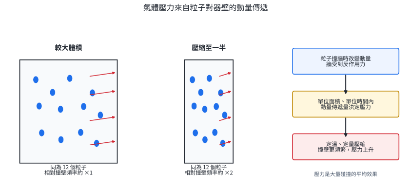{width=98%}

壓力的 SI 單位是帕斯卡：

$$
1\ \mathrm{Pa}=1\ \mathrm{N\,m^{-2}}.
$$

常用換算為

$$
1\ \mathrm{atm}=760\ \mathrm{mmHg}=760\ \mathrm{torr}=101325\ \mathrm{Pa}\approx101.3\ \mathrm{kPa}.
$$

$1\ \mathrm{bar}=100\ \mathrm{kPa}$。液柱造成的壓差由

$$
\Delta P=\rho gh
$$

決定，其中 $\rho$ 是液體密度、$g$ 是重力加速度、$h$ 是鉛直高度差。以同一地點的液柱比較時，密度越大，相同壓差所需高度越小。

氣壓計、輪胎壓力表、醫療呼吸器與氣體鋼瓶調壓器都在量測或控制壓力差。裝置讀值通常是相對於大氣壓的表壓，化學氣體方程式使用的是相對於真空的絕對壓力；題目會以裝置結構或文字說明兩者關係。

::: worked-example
### 示範 1｜壓力單位與液柱高度

某氣體壓力為 $0.925\ \mathrm{atm}$。分別換算為 $\mathrm{kPa}$ 與 $\mathrm{mmHg}$。

使用同一個壓力的兩組換算因子：

$$
P=(0.925)(101.325)=93.7\ \mathrm{kPa},
$$

$$
P=(0.925)(760)=703\ \mathrm{mmHg}.
$$

兩個結果都表示絕對壓力。有效數字依原資料保留三位。
:::

### 1.2 閉口式與開口式壓力計

U 形壓力計以靜止液體的平衡比較兩側壓力。推理核心是：**同一連通液體中、同一水平面上的壓力相等**。沿液體向下移動高度 $h$，壓力增加 $\rho gh$；向上移動則減少同一數值。

閉口式壓力計的一端封閉且近似真空，封閉端壓力近似為零，因此

$$
P_{gas}=\rho gh.
$$

若壓力計液體是汞，$h$ 直接以 $\mathrm{mmHg}$ 表示氣體壓力。

開口式壓力計的一端接大氣：

- 氣體端液面較低，表示氣體壓力較大，$P_{gas}=P_{atm}+\rho gh$。
- 氣體端液面較高，表示氣體壓力較小，$P_{gas}=P_{atm}-\rho gh$。
- 兩側液面等高，$P_{gas}=P_{atm}$。

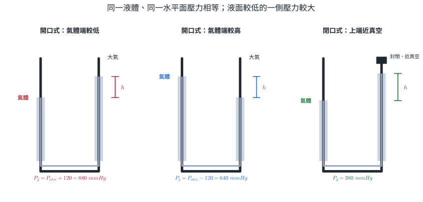{width=98%}

::: worked-example
### 示範 2｜閉口式壓力計

閉口式汞壓力計的兩液面高度差為 $418\ \mathrm{mm}$，封閉端可視為真空。求氣體壓力，以 $\mathrm{mmHg}$、$\mathrm{atm}$ 與 $\mathrm{kPa}$ 表示。

閉口端壓力近似為零，所以

$$
P_{gas}=418\ \mathrm{mmHg}.
$$

換算為

$$
P_{gas}=\frac{418}{760}=0.550\ \mathrm{atm},
$$

$$
P_{gas}=(0.550)(101.325)=55.7\ \mathrm{kPa}.
$$

液柱高度本身已包含 $\rho gh$ 的效果，因此以 $\mathrm{mmHg}$ 計算時無須再乘汞密度與 $g$。
:::

::: worked-example
### 示範 3｜開口式壓力計的方向

大氣壓為 $748\ \mathrm{mmHg}$。開口式汞壓力計中，氣體端液面比大氣端低 $85\ \mathrm{mm}$。求氣體壓力。

先由圖形判斷氣體端液面較低，因此 $P_{gas}>P_{atm}$。再加入液柱壓差：

$$
P_{gas}=748+85=833\ \mathrm{mmHg}.
$$

換算為大氣壓：

$$
P_{gas}=\frac{833}{760}=1.10\ \mathrm{atm}.
$$

加減號由液面高低決定，與 U 形管畫在紙面的左右位置無關。
:::

### 練習 1

1. 某地大氣壓為 $0.985\ \mathrm{atm}$，換算為 $\mathrm{kPa}$ 與 $\mathrm{mmHg}$。
2. 閉口式汞壓力計高度差為 $315\ \mathrm{mm}$。求氣體壓力，以 $\mathrm{atm}$ 表示。
3. 大氣壓為 $752\ \mathrm{mmHg}$。開口式汞壓力計中，氣體端液面較低 $64\ \mathrm{mm}$。求氣體壓力。
4. 大氣壓為 $101.0\ \mathrm{kPa}$。開口式水壓力計中，氣體端液面較高 $18.0\ \mathrm{cm}$。取水的密度 $1000\ \mathrm{kg\,m^{-3}}$、$g=9.80\ \mathrm{m\,s^{-2}}$，求氣體壓力。
5. 兩個相同容器各有相同莫耳數的同種氣體。甲為 $300\ \mathrm K$，乙為 $450\ \mathrm K$，體積都固定。用粒子撞壁模型比較兩者壓力並說明原因。

### 練習 1 解析

1. $P=(0.985)(101.325)=99.8\ \mathrm{kPa}$；$P=(0.985)(760)=749\ \mathrm{mmHg}$。
2. $P=315/760=0.414\ \mathrm{atm}$。
3. 氣體端較低，$P_{gas}=752+64=816\ \mathrm{mmHg}$。
4. 氣體端較高，氣體壓力小於大氣壓。液柱壓差為

   $$
   \Delta P=\rho gh=(1000)(9.80)(0.180)=1764\ \mathrm{Pa}=1.76\ \mathrm{kPa}.
   $$

   因此 $P_{gas}=101.0-1.76=99.2\ \mathrm{kPa}$。
5. 乙的絕對溫度較高，粒子平均動能與平均速率較大；在相同粒子數與相同器壁面積下，單位時間的動量傳遞較大，因此乙的壓力較大。理想氣體模型給出 $P_{乙}/P_{甲}=T_{乙}/T_{甲}=450/300=1.50$。

## 2. 氣體定律

### 2.1 波以耳定律：定溫、定量

固定氣體莫耳數 $n$ 與絕對溫度 $T$，改變外加壓力並等待氣體達到平衡，可得**波以耳定律**：

$$
P\propto\frac{1}{V},\qquad PV=k,
$$

或以兩個平衡狀態表示：

$$
P_1V_1=P_2V_2.
$$

體積減半時，同數粒子抵達器壁的路程縮短；在溫度固定、平均動能近似不變的條件下，撞壁頻率約加倍，壓力約加倍。這是 $PV$ 維持常數的微觀解釋。

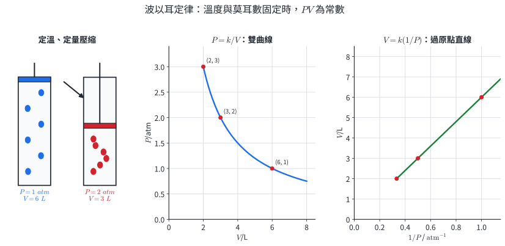{width=98%}

圖形判讀需保留座標軸：$P$ 對 $V$ 是反比曲線；$V$ 對 $1/P$ 才是比例直線。不同溫度的定量氣體各有一條 $PV=nRT$ 的等溫線，溫度越高，固定體積下壓力越大，等溫線位置越高。

::: worked-example
### 示範 4｜注射筒的等溫壓縮

封閉注射筒中有 $80.0\ \mathrm{mL}$ 氣體，壓力為 $1.05\ \mathrm{atm}$。緩慢壓縮並維持溫度不變，當壓力為 $2.80\ \mathrm{atm}$ 時，求體積。

同一份氣體且溫度固定，使用

$$
P_1V_1=P_2V_2.
$$

所以

$$
V_2=\frac{(1.05)(80.0)}{2.80}=30.0\ \mathrm{mL}.
$$

壓力增加至原來的 $2.67$ 倍，體積降為原來的 $0.375$ 倍，方向符合反比關係。
:::

::: worked-example
### 示範 5｜由資料辨認波以耳定律

某氣體在定溫下得到下表。判斷資料是否支持波以耳定律，並預測 $P=1.50\ \mathrm{atm}$ 時的體積。

| $P/\mathrm{atm}$ | 0.80 | 1.00 | 1.25 | 2.00 |
|---:|---:|---:|---:|---:|
| $V/\mathrm L$ | 7.50 | 6.00 | 4.80 | 3.00 |

逐欄計算 $PV$：

$$
(0.80)(7.50)=(1.00)(6.00)=(1.25)(4.80)=(2.00)(3.00)=6.00\ \mathrm{L\,atm}.
$$

乘積在資料精度內相同，因此支持 $PV=k$。當 $P=1.50\ \mathrm{atm}$，

$$
V=\frac{k}{P}=\frac{6.00}{1.50}=4.00\ \mathrm L.
$$

若畫 $V$ 對 $1/P$，斜率為 $6.00\ \mathrm{L\,atm}$。
:::

### 2.2 查理定律：定壓、定量

固定 $P$ 與 $n$，氣體體積與**絕對溫度**成正比，稱為**查理定律**：

$$
V\propto T,
\qquad \frac{V}{T}=k,
\qquad \frac{V_1}{T_1}=\frac{V_2}{T_2}.
$$

溫度必須換成 K：

$$
T/\mathrm K=t/{}^\circ\mathrm C+273.15.
$$

加熱使粒子平均動能增加。若壓力維持固定，氣體需膨脹，使撞壁頻率降低到與外壓重新平衡。$V$ 對 $T$ 的比例直線通過 $0\ \mathrm K$；以攝氏溫度作圖，外插的零體積截距約為 $-273.15^\circ\mathrm C$。零體積是理想模型的數學外插；真實物質在到達該區域前已凝結或改變物態。

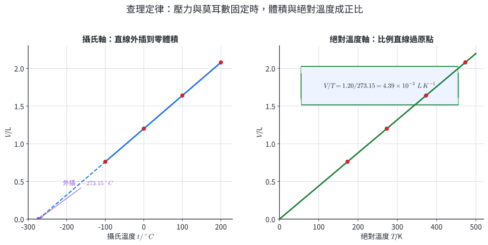{width=98%}

::: worked-example
### 示範 6｜定壓加熱氣球

一個可自由膨脹的氣球在 $27.0^\circ\mathrm C$ 時體積為 $250\ \mathrm{mL}$。外壓與氣體量固定，加熱到 $127.0^\circ\mathrm C$，求體積。

先換成絕對溫度：

$$
T_1=300.15\ \mathrm K,\qquad T_2=400.15\ \mathrm K.
$$

使用查理定律：

$$
V_2=V_1\frac{T_2}{T_1}
=(250)\frac{400.15}{300.15}=333\ \mathrm{mL}.
$$

絕對溫度增加約三分之一，體積也增加約三分之一。
:::

::: worked-example
### 示範 7｜由體積反推溫度

定壓、定量氣體在 $20.0^\circ\mathrm C$ 時體積為 $1.80\ \mathrm L$。體積增加至 $2.25\ \mathrm L$ 時，求攝氏溫度。

$$
T_1=293.15\ \mathrm K,
$$

$$
T_2=T_1\frac{V_2}{V_1}
=(293.15)\frac{2.25}{1.80}=366.4\ \mathrm K.
$$

換回攝氏溫度：

$$
t_2=366.4-273.15=93.3^\circ\mathrm C.
$$
:::

### 2.3 亞佛加厥定律與綜合狀態變化

固定 $P$ 與 $T$，氣體體積與莫耳數成正比，稱為**亞佛加厥定律**：

$$
V\propto n,
\qquad \frac{V}{n}=k.
$$

同溫同壓下，等體積的任意氣體含有相同分子數。氣體種類會改變粒子質量與分子結構，但在理想模型中，同 $P,T,V$ 直接決定相同 $n$。

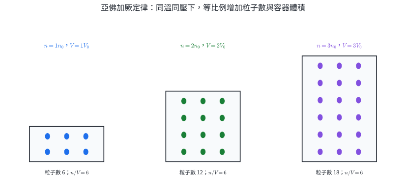{width=98%}

三個定律也可合併處理同一份、莫耳數固定的氣體：

$$
\frac{P_1V_1}{T_1}=\frac{P_2V_2}{T_2}.
$$

若莫耳數也改變，則使用

$$
\frac{P_1V_1}{n_1T_1}=\frac{P_2V_2}{n_2T_2},
$$

這就是理想氣體方程式在兩個狀態間的比值形式。

::: worked-example
### 示範 8｜同溫同壓下的氣體量與體積

某氣體 $0.125\ \mathrm{mol}$ 在固定溫度、壓力下占 $3.00\ \mathrm L$。加入同種氣體後共有 $0.200\ \mathrm{mol}$，求新體積。

由 $V/n$ 為常數：

$$
V_2=V_1\frac{n_2}{n_1}
=(3.00)\frac{0.200}{0.125}=4.80\ \mathrm L.
$$

莫耳數增為 $1.60$ 倍，體積也增為 $1.60$ 倍。
:::

::: worked-example
### 示範 9｜壓力與溫度同時改變

氣球在 $P_1=1.00\ \mathrm{atm}$、$T_1=300\ \mathrm K$ 時體積為 $2.50\ \mathrm L$。氣體量不變，環境改為 $P_2=0.800\ \mathrm{atm}$、$T_2=270\ \mathrm K$。求新體積。

$$
\frac{P_1V_1}{T_1}=\frac{P_2V_2}{T_2},
$$

$$
V_2=V_1\frac{P_1}{P_2}\frac{T_2}{T_1}
=(2.50)\frac{1.00}{0.800}\frac{270}{300}=2.81\ \mathrm L.
$$

降壓使體積增加，降溫使體積減少；兩個效果相乘後，淨結果是體積增加。
:::

氣體定律直接用於注射器、活塞、熱氣球、定容壓力感測器與氣體溫度計。選式時先寫出固定條件，因為同一組 $P,V,T,n$ 在不同控制條件下有不同關係。

### 練習 2

1. 定溫、定量氣體在 $1.20\ \mathrm{atm}$ 時體積為 $45.0\ \mathrm{mL}$。壓縮到 $30.0\ \mathrm{mL}$ 時壓力為何？
2. 定溫氣體由 $760\ \mathrm{mmHg}$、$100\ \mathrm{mL}$ 壓縮到 $950\ \mathrm{mmHg}$，求體積。
3. 定壓氣體在 $250\ \mathrm K$ 時體積為 $1.80\ \mathrm L$。加熱到 $325\ \mathrm K$，求體積。
4. 定壓氣體在 $27^\circ\mathrm C$ 時體積為 $500\ \mathrm{mL}$。體積增加至 $600\ \mathrm{mL}$，求攝氏溫度。
5. 同溫同壓下，$1.00\ \mathrm{mol}$ 氣體占 $24.0\ \mathrm L$。$0.350\ \mathrm{mol}$ 同種氣體占多少體積？
6. 同一份氣體由 $1.50\ \mathrm{atm}$、$2.00\ \mathrm L$、$300\ \mathrm K$ 變為 $1.00\ \mathrm{atm}$、$400\ \mathrm K$，求新體積。

### 練習 2 解析

1. $P_2=P_1V_1/V_2=(1.20)(45.0)/30.0=1.80\ \mathrm{atm}$。
2. $V_2=(760)(100)/950=80.0\ \mathrm{mL}$。兩個壓力都用 $\mathrm{mmHg}$，可直接相除。
3. $V_2=(1.80)(325/250)=2.34\ \mathrm L$。
4. $T_1=300.15\ \mathrm K$，$T_2=(300.15)(600/500)=360.2\ \mathrm K$，所以 $t_2=87.0^\circ\mathrm C$。
5. $V=(24.0)(0.350)=8.40\ \mathrm L$。
6. $V_2=V_1(P_1/P_2)(T_2/T_1)=(2.00)(1.50)(400/300)=4.00\ \mathrm L$。

## 3. 理想氣體

### 3.1 理想氣體方程式與模型條件

由三個氣體定律可整理出

$$
V\propto\frac{nT}{P}.
$$

引入氣體常數 $R$，得到**理想氣體方程式**：

$$
PV=nRT.
$$

常用的兩組 $R$ 為

$$
R=0.082057\ \mathrm{L\,atm\,mol^{-1}\,K^{-1}},
$$

$$
R=8.314\ \mathrm{J\,mol^{-1}\,K^{-1}}
=8.314\ \mathrm{Pa\,m^3\,mol^{-1}\,K^{-1}}.
$$

壓力與體積單位必須和 $R$ 配成同一組。溫度一律用 K，莫耳數用 mol。

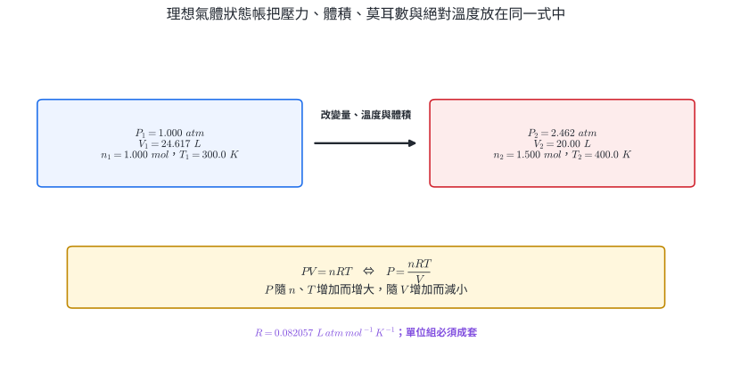{width=98%}

理想氣體模型採用兩項近似：

1. 粒子本身體積相對於容器體積可忽略。
2. 粒子彼此之間沒有作用力，碰撞為彈性碰撞。

低壓時粒子相距較遠，粒子體積占比小；高溫時粒子動能較大，分子間吸引作用相對較弱。因此許多真實氣體在高溫、低壓下較接近理想模型。

::: worked-example
### 示範 10｜由莫耳數、溫度與體積求壓力

$0.250\ \mathrm{mol}$ 氣體在 $27.0^\circ\mathrm C$ 時占 $6.00\ \mathrm L$。視為理想氣體，求壓力。

$$
T=300.15\ \mathrm K.
$$

選用 $R=0.082057\ \mathrm{L\,atm\,mol^{-1}\,K^{-1}}$：

$$
P=\frac{nRT}{V}
=\frac{(0.250)(0.082057)(300.15)}{6.00}
=1.03\ \mathrm{atm}.
$$

分子與分母的 L、mol、K 相消，保留 atm。
:::

::: worked-example
### 示範 11｜氣體量也改變的狀態

容器初態有 $0.100\ \mathrm{mol}$ 氣體。之後再加入 $0.050\ \mathrm{mol}$，並調整為 $360\ \mathrm K$、$3.00\ \mathrm L$。求終態壓力。

終態總莫耳數為

$$
n_2=0.100+0.050=0.150\ \mathrm{mol}.
$$

直接以終態代入：

$$
P_2=\frac{(0.150)(0.082057)(360)}{3.00}=1.48\ \mathrm{atm}.
$$

加入氣體後需使用新的總莫耳數；初態資料只在比較兩狀態或求加入量時才需要。
:::

### 3.2 氣體密度與莫耳質量

氣體質量 $m=nM$，其中 $M$ 為莫耳質量。代入 $PV=nRT$：

$$
PV=\frac{m}{M}RT.
$$

以密度 $d=m/V$ 整理：

$$
d=\frac{PM}{RT},
\qquad
M=\frac{dRT}{P}.
$$

同溫同壓下，$d\propto M$，所以兩氣體的密度比等於莫耳質量比。這個關係用於由氣體質量與體積辨識未知氣體，也能判斷充氣氣球相對空氣的浮升趨勢；實際浮力還需納入球皮、繩索與周圍空氣密度。

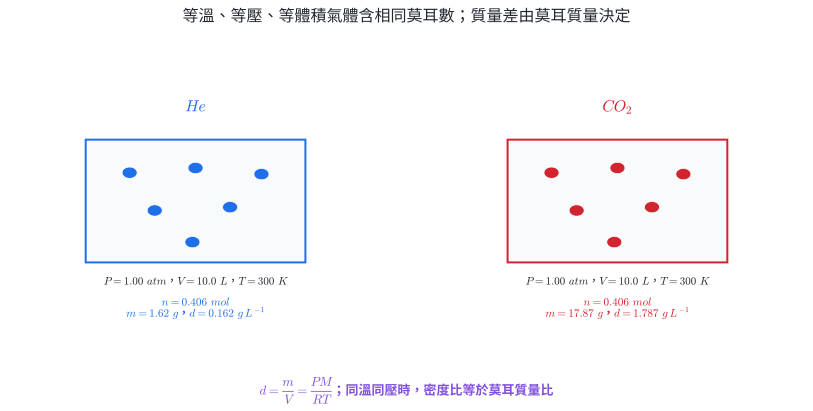{width=98%}

::: worked-example
### 示範 12｜由質量、體積求未知氣體莫耳質量

某純氣體在 $P=0.950\ \mathrm{atm}$、$T=300\ \mathrm K$ 時，$0.880\ \mathrm g$ 占 $0.500\ \mathrm L$。求莫耳質量。

先由狀態求莫耳數：

$$
n=\frac{PV}{RT}
=\frac{(0.950)(0.500)}{(0.082057)(300)}
=0.0193\ \mathrm{mol}.
$$

再以 $M=m/n$：

$$
M=\frac{0.880}{0.0193}=45.6\ \mathrm{g\,mol^{-1}}.
$$

也可先算 $d=0.880/0.500=1.76\ \mathrm{g\,L^{-1}}$，再用 $M=dRT/P$，結果相同。
:::

::: worked-example
### 示範 13｜由分子式預測氣體密度

求 $CO_2$ 在 $1.00\ \mathrm{atm}$、$25.0^\circ\mathrm C$ 的理想氣體密度。取 $M(CO_2)=44.0\ \mathrm{g\,mol^{-1}}$。

$$
d=\frac{PM}{RT}
=\frac{(1.00)(44.0)}{(0.082057)(298.15)}
=1.80\ \mathrm{g\,L^{-1}}.
$$

溫度升高且壓力不變時，同一莫耳氣體占更大體積，因此密度下降；公式中的 $d\propto1/T$ 顯示相同方向。
:::

### 3.3 真實氣體與壓縮因子

真實氣體可用**壓縮因子**描述與理想模型的偏差：

$$
Z=\frac{PV}{nRT}.
$$

- $Z=1$：該狀態符合理想氣體方程式。
- $Z<1$：在常見中低壓範圍，分子間吸引使量得的 $PV$ 小於理想值。
- $Z>1$：在高壓範圍，粒子本身占有體積與短程排斥使 $PV$ 大於理想值。

不同氣體與不同溫度有不同曲線。圖 8 是用於辨認方向的定性模型，特定氣體的定量計算需使用題目提供的 $Z$ 或實測資料。

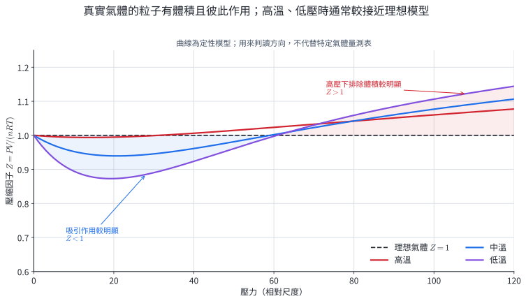{width=94%}

::: worked-example
### 示範 14｜由實測狀態求壓縮因子

$1.00\ \mathrm{mol}$ 真實氣體在 $300\ \mathrm K$、$50.0\ \mathrm{bar}$ 時體積為 $0.450\ \mathrm L$。取 $R=0.08314\ \mathrm{L\,bar\,mol^{-1}\,K^{-1}}$，求 $Z$ 並判讀主要偏差方向。

$$
Z=\frac{PV}{nRT}
=\frac{(50.0)(0.450)}{(1.00)(0.08314)(300)}
=0.902.
$$

$Z<1$，表示這個狀態的 $PV$ 低於理想值；依此模型，分子間吸引造成的負偏差仍較顯著。
:::

### 3.4 反應產氣與排水量測

化學反應生成的氣體，可由化學計量先求理論莫耳數，再用氣體狀態換算體積；也可由實測的壓力、體積與溫度反求氣體莫耳數。碳酸鈣與稀鹽酸反應：

$$
CaCO_3(s)+2HCl(aq)\rightarrow CaCl_2(aq)+CO_2(g)+H_2O(l).
$$

圖 9 的反應瓶以導管連到水槽中的倒置量筒。氣體由反應瓶流向量筒，進入量筒後向上聚集並排開水。

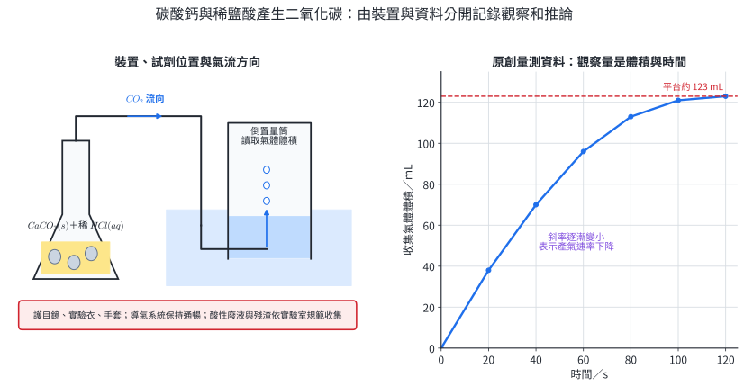{width=98%}

實驗紀錄分成兩層：

- **觀察：**各時間的量筒讀值、氣泡快慢、固體外觀與溶液變化。
- **推論：**曲線斜率代表一段時間內的平均產氣速率；曲線趨平表示新增氣體體積逐漸減少，可能是限量反應物接近耗盡。

稀鹽酸具腐蝕與刺激性；操作時配戴護目鏡、實驗衣與合適手套。產氣裝置需保持導氣通道暢通，密閉產氣會使壓力累積。反應後的酸性廢液與固體殘渣依實驗室分類規範收集處理。正式定量時還要檢查漏氣、量筒刻度、水面是否調平、氣體溫度是否與水浴相同，以及水蒸氣壓修正。

::: worked-example
### 示範 15｜由集氣平台反推反應量

圖 9 的平台體積為 $123\ \mathrm{mL}$。假設 $25.0^\circ\mathrm C$、內外水面等高、大氣壓 $755\ \mathrm{mmHg}$，該溫度飽和水蒸氣壓為 $23.8\ \mathrm{mmHg}$。求乾燥 $CO_2$ 的莫耳數與反應掉的 $CaCO_3$ 質量。取 $M(CaCO_3)=100.1\ \mathrm{g\,mol^{-1}}$。

內外水面等高，瓶內總壓等於大氣壓。乾氣壓力為

$$
P_{CO_2}=755-23.8=731.2\ \mathrm{mmHg}
=0.9621\ \mathrm{atm}.
$$

$$
n(CO_2)=\frac{PV}{RT}
=\frac{(0.9621)(0.123)}{(0.082057)(298.15)}
=4.84\times10^{-3}\ \mathrm{mol}.
$$

反應式中 $CaCO_3:CO_2=1:1$，所以

$$
m(CaCO_3)=(4.84\times10^{-3})(100.1)=0.484\ \mathrm g.
$$

這個質量是實際產生並收集到的氣體所對應的反應量；若有漏氣或 $CO_2$ 溶於水，計算值會低於真正反應量。
:::

### 練習 3

1. $1.20\ \mathrm{mol}$ 理想氣體在 $350\ \mathrm K$、$10.0\ \mathrm L$ 中的壓力為何？
2. 理想氣體在 $2.00\ \mathrm{atm}$、$5.00\ \mathrm L$、$300\ \mathrm K$ 時有多少莫耳？
3. 同一份理想氣體由 $1.00\ \mathrm{atm}$、$4.00\ \mathrm L$、$300\ \mathrm K$ 變為 $2.00\ \mathrm{atm}$、$360\ \mathrm K$，求新體積。
4. 求 $O_2$ 在 $1.10\ \mathrm{atm}$、$310\ \mathrm K$ 的理想氣體密度。取 $M(O_2)=32.0\ \mathrm{g\,mol^{-1}}$。
5. 某氣體在 $0.950\ \mathrm{atm}$、$305\ \mathrm K$ 的密度為 $1.84\ \mathrm{g\,L^{-1}}$。求莫耳質量。
6. $1.00\ \mathrm{mol}$ 真實氣體在 $320\ \mathrm K$、$80.0\ \mathrm{bar}$ 時體積為 $0.300\ \mathrm L$。取 $R=0.08314\ \mathrm{L\,bar\,mol^{-1}\,K^{-1}}$，求 $Z$。

### 練習 3 解析

1. $P=nRT/V=(1.20)(0.082057)(350)/10.0=3.45\ \mathrm{atm}$。
2. $n=PV/(RT)=(2.00)(5.00)/[(0.082057)(300)]=0.406\ \mathrm{mol}$。
3. $V_2=V_1(P_1/P_2)(T_2/T_1)=(4.00)(1.00/2.00)(360/300)=2.40\ \mathrm L$。
4. $d=PM/(RT)=(1.10)(32.0)/[(0.082057)(310)]=1.38\ \mathrm{g\,L^{-1}}$。
5. $M=dRT/P=(1.84)(0.082057)(305)/0.950=48.5\ \mathrm{g\,mol^{-1}}$。
6. $Z=PV/(nRT)=(80.0)(0.300)/[(1.00)(0.08314)(320)]=0.902$。此狀態的 $PV$ 小於理想值。

## 4. 分壓

### 4.1 莫耳分率與道耳頓分壓定律

混合氣體中成分 $i$ 的**莫耳分率**為

$$
X_i=\frac{n_i}{n_t},
\qquad n_t=\sum_i n_i,
\qquad \sum_i X_i=1.
$$

成分 $i$ 的**分壓**是：在相同溫度與相同容器體積下，若只有該成分存在時所產生的壓力。對互不反應、可用理想模型描述的混合氣體，

$$
P_i=\frac{n_iRT}{V}.
$$

把各式相加：

$$
P_t=\sum_iP_i=\frac{(\sum_i n_i)RT}{V}=\frac{n_tRT}{V}.
$$

因此得到**道耳頓分壓定律**：

$$
P_t=\sum_iP_i,
\qquad P_i=X_iP_t,
\qquad P_A:P_B:\cdots=n_A:n_B:\cdots.
$$

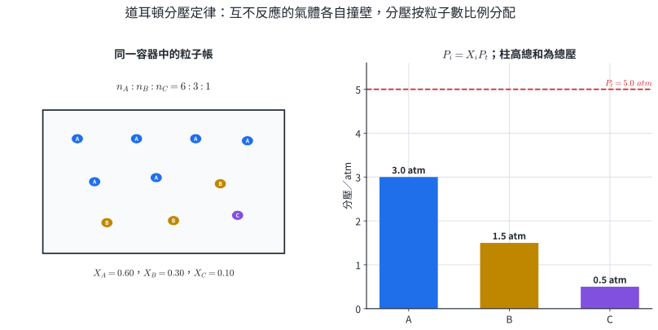{width=98%}

呼吸氣體、潛水混合氣與麻醉氣體的生理作用，都取決於特定成分的分壓，而非只看總壓。工業反應器中，反應物分壓也直接連到碰撞頻率、平衡與反應速率模型。

::: worked-example
### 示範 16｜由組成求分壓

容器中有 $2.00\ \mathrm{mol}$ $N_2$、$1.00\ \mathrm{mol}$ $O_2$ 與 $1.00\ \mathrm{mol}$ He，總壓為 $4.00\ \mathrm{atm}$。求各氣體莫耳分率與分壓。

$$
n_t=2.00+1.00+1.00=4.00\ \mathrm{mol}.
$$

$$
X_{N_2}=0.500,\qquad X_{O_2}=0.250,\qquad X_{He}=0.250.
$$

所以

$$
P_{N_2}=(0.500)(4.00)=2.00\ \mathrm{atm},
$$

$$
P_{O_2}=P_{He}=(0.250)(4.00)=1.00\ \mathrm{atm}.
$$

分壓總和 $2.00+1.00+1.00=4.00\ \mathrm{atm}$，回到題給總壓。
:::

### 4.2 連通容器與反應後的分壓

兩個剛性容器在同溫下開閥混合，若外界沒有可動邊界，總體積為各容器體積相加。每種氣體都擴散到全部可用空間，因此先對每種氣體使用

$$
P_i'V_t=P_iV_i,
$$

再把終態分壓相加。

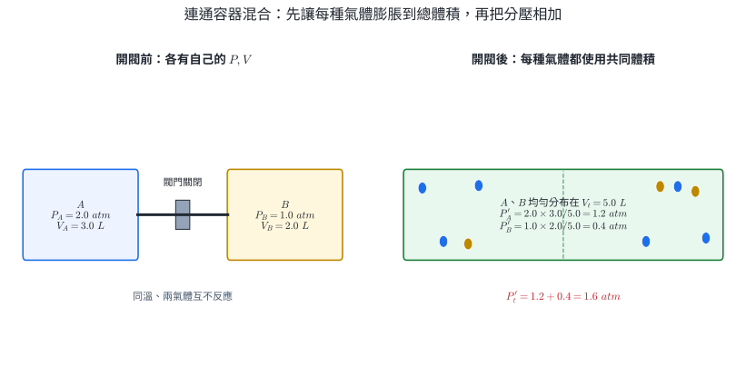{width=98%}

::: worked-example
### 示範 17｜兩容器開閥混合

$3.00\ \mathrm L$ 容器 A 有 $2.00\ \mathrm{atm}$ 的 He；$2.00\ \mathrm L$ 容器 B 有 $1.00\ \mathrm{atm}$ 的 Ne。兩容器等溫，開閥後溫度不變，求各分壓與總壓。

共同體積為

$$
V_t=3.00+2.00=5.00\ \mathrm L.
$$

$$
P_{He}'=\frac{(2.00)(3.00)}{5.00}=1.20\ \mathrm{atm},
$$

$$
P_{Ne}'=\frac{(1.00)(2.00)}{5.00}=0.400\ \mathrm{atm}.
$$

$$
P_t'=1.20+0.400=1.60\ \mathrm{atm}.
$$

每種氣體的 $n,T$ 不變，分壓降低的原因是可用體積增加。
:::

混合氣體若會反應，組成會改變。先用化學反應式和限量試劑求反應後各物質莫耳數，再由 $P_i=n_iRT/V$ 或 $P_i=X_iP_t$ 求分壓。

::: worked-example
### 示範 18｜反應完成後的分壓

高溫剛性容器中起初有 $3.00\ \mathrm{mol}$ $H_2$、$2.00\ \mathrm{mol}$ $O_2$ 與 $1.00\ \mathrm{mol}$ $N_2$。點火後依

$$
2H_2(g)+O_2(g)\rightarrow2H_2O(g)
$$

完全反應；終態溫度足以使水保持氣態，總壓量得 $4.50\ \mathrm{atm}$。求終態各成分分壓。

可完成的反應進度為

$$
\xi=\min\left(\frac{3.00}{2},\frac{2.00}{1}\right)=1.50\ \mathrm{mol}.
$$

終態為

$$
n(H_2)=0,\quad n(O_2)=2.00-1.50=0.500,
$$

$$
n(H_2O)=2(1.50)=3.00,\quad n(N_2)=1.00\ \mathrm{mol}.
$$

總莫耳數 $n_t=4.50\ \mathrm{mol}$，恰與總壓數值同為 4.50，因此

$$
P_{O_2}=0.500\ \mathrm{atm},\quad
P_{H_2O}=3.00\ \mathrm{atm},\quad
P_{N_2}=1.00\ \mathrm{atm},\quad P_{H_2}=0.
$$
:::

### 4.3 排水集氣的壓力修正

水上收集到的氣體含有待測乾氣與水蒸氣：

$$
P_{inside}=P_{dry}+P_{H_2O}^*.
$$

$P_{H_2O}^*$ 是該溫度的飽和水蒸氣壓，由題目表格或資料提供。求乾氣壓力前，先依內外水面高低求瓶內總壓：

- 內外水面等高：$P_{inside}=P_{atm}$。
- 瓶內水面較低：$P_{inside}>P_{atm}$。
- 瓶內水面較高：$P_{inside}<P_{atm}$。

水柱高度換成等效汞柱高度時，取 $\rho_{Hg}/\rho_{water}\approx13.6$：

$$
h_{Hg}=\frac{h_{water}}{13.6}.
$$

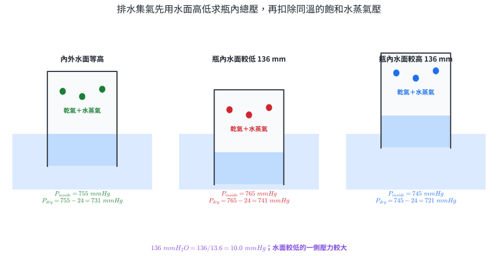{width=98%}

::: worked-example
### 示範 19｜內外水面等高

$27.0^\circ\mathrm C$ 以排水法收集氫氣，調整量筒使內外水面等高。大氣壓 $752\ \mathrm{mmHg}$，該溫度水蒸氣壓 $26.7\ \mathrm{mmHg}$。求乾燥氫氣壓力。

$$
P_{inside}=P_{atm}=752\ \mathrm{mmHg}.
$$

$$
P_{H_2}=P_{inside}-P_{H_2O}^*
=752-26.7=725.3\ \mathrm{mmHg}.
$$

這個乾氣壓力再與量得的 $V,T$ 一起代入 $PV=nRT$。
:::

::: worked-example
### 示範 20｜水面不等高與水蒸氣同時修正

$25.0^\circ\mathrm C$ 收集某氣體。大氣壓為 $755\ \mathrm{mmHg}$，瓶內水面比外界低 $136\ \mathrm{mm}$，題給水蒸氣壓 $24.0\ \mathrm{mmHg}$。求乾氣壓力。

瓶內水面較低，所以瓶內總壓較大。先把水柱換成汞柱：

$$
\Delta P=\frac{136}{13.6}=10.0\ \mathrm{mmHg}.
$$

$$
P_{inside}=755+10.0=765\ \mathrm{mmHg}.
$$

再扣除水蒸氣分壓：

$$
P_{dry}=765-24.0=741\ \mathrm{mmHg}.
$$

液面差修正的是瓶內總壓；水蒸氣修正的是混合氣體組成，兩步處理不同物理量。
:::

### 練習 4

1. 混合氣體含 $1.20\ \mathrm{mol}$ A 與 $0.80\ \mathrm{mol}$ B。求兩者莫耳分率。
2. 某氣體在混合物中的莫耳分率為 $0.250$，分壓為 $0.900\ \mathrm{atm}$。求總壓。
3. $5.00\ \mathrm{atm}$、$3.00\ \mathrm L$ 的 He 與 $2.00\ \mathrm{atm}$、$2.00\ \mathrm L$ 的 Ne 在同溫下開閥混入總體積 $8.00\ \mathrm L$ 的剛性空間。求終態各分壓與總壓。
4. 定溫定容下，起初 $CO$、$O_2$、$N_2$ 的分壓依序為 $400$、$300$、$100\ \mathrm{mmHg}$。依 $2CO+O_2\rightarrow2CO_2$ 完全反應，求終態各氣體分壓與總壓。
5. $27.0^\circ\mathrm C$ 排水收集氣體，內外水面等高。大氣壓 $752\ \mathrm{mmHg}$、水蒸氣壓 $26.7\ \mathrm{mmHg}$，求乾氣壓力。
6. 排水集氣瓶內水面比外界高 $68.0\ \mathrm{mm}$。大氣壓 $750\ \mathrm{mmHg}$，水蒸氣壓 $25.0\ \mathrm{mmHg}$，取 $\rho_{Hg}/\rho_{water}=13.6$，求乾氣壓力。

### 練習 4 解析

1. $n_t=2.00\ \mathrm{mol}$，所以 $X_A=1.20/2.00=0.600$，$X_B=0.80/2.00=0.400$。
2. $P_t=P_i/X_i=0.900/0.250=3.60\ \mathrm{atm}$。
3. He 的終態分壓為 $(5.00)(3.00)/8.00=1.875\ \mathrm{atm}$；Ne 為 $(2.00)(2.00)/8.00=0.500\ \mathrm{atm}$；總壓 $2.375\ \mathrm{atm}$。
4. 同 $V,T$ 下分壓與莫耳數成正比，可直接以分壓作化學計量。$400\ \mathrm{mmHg}$ CO 消耗 $200\ \mathrm{mmHg}$ 等量尺度的 $O_2$，生成 $400\ \mathrm{mmHg}$ $CO_2$。終態 $P_{CO}=0$、$P_{O_2}=100\ \mathrm{mmHg}$、$P_{CO_2}=400\ \mathrm{mmHg}$、$P_{N_2}=100\ \mathrm{mmHg}$，總壓 $600\ \mathrm{mmHg}$。
5. $P_{dry}=752-26.7=725.3\ \mathrm{mmHg}$。
6. 水柱壓差為 $68.0/13.6=5.00\ \mathrm{mmHg}$。瓶內水面較高，$P_{inside}=750-5.00=745\ \mathrm{mmHg}$；$P_{dry}=745-25.0=720\ \mathrm{mmHg}$。

## 5. 章末分層題

### 基礎題 1–6

1. 將 $92.0\ \mathrm{kPa}$ 換算成 atm 與 mmHg。
2. 大氣壓 $745\ \mathrm{mmHg}$。開口式汞壓力計中，氣體端液面比大氣端高 $55\ \mathrm{mm}$。求氣體壓力。
3. 定溫氣體由 $1.00\ \mathrm{atm}$、$72.0\ \mathrm{mL}$ 壓縮至 $48.0\ \mathrm{mL}$。求終壓。
4. 定壓氣體在 $15.0^\circ\mathrm C$ 時為 $2.40\ \mathrm L$，加熱至 $75.0^\circ\mathrm C$。求體積。
5. 同溫同壓下，$0.150\ \mathrm{mol}$ 氣體占 $3.60\ \mathrm L$。$0.425\ \mathrm{mol}$ 占多少體積？
6. $0.500\ \mathrm{mol}$ 理想氣體在 $310\ \mathrm K$、$8.00\ \mathrm L$ 中的壓力為何？

### 應用題 7–12

7. 某氣體在 $1.05\ \mathrm{atm}$、$298\ \mathrm K$ 的密度為 $1.25\ \mathrm{g\,L^{-1}}$。求莫耳質量。
8. $0.800\ \mathrm{mol}$ 真實氣體在 $350\ \mathrm K$、$60.0\ \mathrm{bar}$ 時占 $0.360\ \mathrm L$。取 $R=0.08314\ \mathrm{L\,bar\,mol^{-1}\,K^{-1}}$，求 $Z$ 並判讀偏差方向。
9. 混合氣體含 $0.20\ \mathrm{mol}$ $CH_4$、$0.30\ \mathrm{mol}$ $N_2$、$0.50\ \mathrm{mol}$ $CO_2$，總壓 $2.40\ \mathrm{atm}$。求各氣體分壓。
10. $4.00\ \mathrm L$ 容器有 $3.00\ \mathrm{atm}$ Ar，$6.00\ \mathrm L$ 容器有 $1.50\ \mathrm{atm}$ He。兩者同溫，開閥後共同體積為 $10.00\ \mathrm L$。求總壓。
11. $30.0^\circ\mathrm C$ 排水收集氣體，內外水面等高。大氣壓 $748\ \mathrm{mmHg}$，水蒸氣壓 $31.8\ \mathrm{mmHg}$。求乾氣壓力。
12. 某定量氣體的資料如下。判斷最接近哪一個氣體定律，寫出固定條件與比例式。

| 狀態 | $P/\mathrm{atm}$ | $V/\mathrm L$ | $T/\mathrm K$ |
|---:|---:|---:|---:|
| A | 1.20 | 2.00 | 300 |
| B | 1.50 | 2.00 | 375 |
| C | 1.80 | 2.00 | 450 |

### 跨節整合題 13–16

13. 剛性容器中的氣體以開口式汞壓力計量測。$25.0^\circ\mathrm C$ 時大氣壓 $750\ \mathrm{mmHg}$，氣體端液面較低 $90\ \mathrm{mm}$，容器體積 $2.50\ \mathrm L$。

   1. 求氣體絕對壓力。
   2. 視為理想氣體，求莫耳數。
   3. 容器加熱到 $75.0^\circ\mathrm C$ 且體積、莫耳數不變，求新壓力與相對大氣壓 $750\ \mathrm{mmHg}$ 時的液面高度差，並判斷氣體端液面高低。

14. $0.600\ \mathrm g$ 含 $CaCO_3$ 的固體與足量稀鹽酸反應，依

   $$
   CaCO_3+2HCl\rightarrow CaCl_2+CO_2+H_2O
   $$

   產生的 $CO_2$ 以排水法收集。$25.0^\circ\mathrm C$ 時量得 $123\ \mathrm{mL}$，內外水面等高；大氣壓 $755\ \mathrm{mmHg}$，水蒸氣壓 $23.8\ \mathrm{mmHg}$。假設收集完全，取 $M(CaCO_3)=100.1\ \mathrm{g\,mol^{-1}}$。

   1. 求乾燥 $CO_2$ 壓力與莫耳數。
   2. 求樣品中 $CaCO_3$ 的質量百分率。
   3. 寫出一項直接觀察與一項由體積—時間曲線平台所作的推論。

15. 同溫下，$2.00\ \mathrm L$ 容器 A 有 $3.00\ \mathrm{atm}$ $H_2$，$3.00\ \mathrm L$ 容器 B 有 $2.00\ \mathrm{atm}$ $O_2$，另有 $1.00\ \mathrm L$ 真空空間。開閥後三空間相通，點火使

   $$
   2H_2(g)+O_2(g)\rightarrow2H_2O(g).
   $$

   終態回到原溫度且水保持氣態。求反應前混合後的 $H_2$、$O_2$ 分壓；再求反應後各氣體分壓與總壓。

16. 未知純氣體樣品質量 $0.540\ \mathrm g$，在 $27.0^\circ\mathrm C$ 以排水法收集。量得體積 $310\ \mathrm{mL}$，瓶內水面比外界高 $54.4\ \mathrm{mm}$；大氣壓 $760\ \mathrm{mmHg}$，水蒸氣壓 $26.7\ \mathrm{mmHg}$，$\rho_{Hg}/\rho_{water}=13.6$。

   1. 求瓶內總壓與乾氣壓力。
   2. 視為理想氣體，求莫耳數與莫耳質量。
   3. 若該狀態的實測壓縮因子為 $Z=0.980$，用 $PV=ZnRT$ 修正莫耳數與莫耳質量，並說明理想模型造成的偏差方向。

## 6. 章末詳解

### 基礎題 1–6 詳解

1. 使用 $1\ \mathrm{atm}=101.325\ \mathrm{kPa}=760\ \mathrm{mmHg}$ 換算：

   $$
   P=\frac{92.0}{101.325}=0.908\ \mathrm{atm},
   $$

   $$
   P=(0.908)(760)=690\ \mathrm{mmHg}.
   $$

2. 氣體端液面較高，氣體壓力較小：

   $$
   P_{gas}=745-55=690\ \mathrm{mmHg}.
   $$

3. 定溫、定量使用波以耳定律：

   $$
   P_2=\frac{P_1V_1}{V_2}=\frac{(1.00)(72.0)}{48.0}=1.50\ \mathrm{atm}.
   $$

4. $T_1=288.15\ \mathrm K$，$T_2=348.15\ \mathrm K$：

   $$
   V_2=(2.40)\frac{348.15}{288.15}=2.90\ \mathrm L.
   $$

5. 同溫同壓下 $V/n$ 固定：

   $$
   V_2=(3.60)\frac{0.425}{0.150}=10.2\ \mathrm L.
   $$

6. 將狀態量代入理想氣體方程式：

   $$
   P=\frac{nRT}{V}
   =\frac{(0.500)(0.082057)(310)}{8.00}
   =1.59\ \mathrm{atm}.
   $$

### 應用題 7–12 詳解

7. 由密度式求莫耳質量：

   $$
   M=\frac{dRT}{P}
   =\frac{(1.25)(0.082057)(298)}{1.05}
   =29.1\ \mathrm{g\,mol^{-1}}.
   $$

8. 由實測狀態求壓縮因子：

   $$
   Z=\frac{PV}{nRT}
   =\frac{(60.0)(0.360)}{(0.800)(0.08314)(350)}
   =0.928.
   $$

   $Z<1$，此狀態的實測 $PV$ 小於理想值，吸引作用造成的負偏差較顯著。

9. 總莫耳數為 $1.00\ \mathrm{mol}$，所以莫耳分率依序為 $0.20$、$0.30$、$0.50$：

   $$
   P_{CH_4}=0.480\ \mathrm{atm},\quad
   P_{N_2}=0.720\ \mathrm{atm},\quad
   P_{CO_2}=1.20\ \mathrm{atm}.
   $$

   分壓總和為 $2.40\ \mathrm{atm}$。

10. 開閥後各氣體使用 $10.00\ \mathrm L$：

    $$
    P_{Ar}'=\frac{(3.00)(4.00)}{10.00}=1.20\ \mathrm{atm},
    $$

    $$
    P_{He}'=\frac{(1.50)(6.00)}{10.00}=0.900\ \mathrm{atm}.
    $$

    因此 $P_t'=2.10\ \mathrm{atm}$。

11. 水面等高使 $P_{inside}=748\ \mathrm{mmHg}$：

    $$
    P_{dry}=748-31.8=716.2\ \mathrm{mmHg}.
    $$

12. 三個狀態的 $V$ 與 $n$ 固定。計算 $P/T$：

    $$
    \frac{1.20}{300}=\frac{1.50}{375}=\frac{1.80}{450}=4.00\times10^{-3}\ \mathrm{atm\,K^{-1}}.
    $$

    因此 $P\propto T$，是定容、定量條件下理想氣體方程式的結果；也稱壓力定律。

### 跨節整合題 13–16 詳解

13. 氣體端液面較低，初態壓力為

    $$
    P_1=750+90=840\ \mathrm{mmHg}=\frac{840}{760}=1.105\ \mathrm{atm}.
    $$

    初態 $T_1=298.15\ \mathrm K$，所以

    $$
    n=\frac{P_1V}{RT_1}
    =\frac{(1.105)(2.50)}{(0.082057)(298.15)}
    =0.113\ \mathrm{mol}.
    $$

    終態 $T_2=348.15\ \mathrm K$，定容定量下 $P/T$ 固定：

    $$
    P_2=P_1\frac{T_2}{T_1}
    =(840)\frac{348.15}{298.15}
    =981\ \mathrm{mmHg}.
    $$

    相對大氣壓差為

    $$
    h=981-750=231\ \mathrm{mmHg}.
    $$

    氣體壓力較大，所以氣體端液面較低。

14. 水面等高，瓶內總壓等於大氣壓。乾燥二氧化碳壓力為

    $$
    P_{CO_2}=755-23.8=731.2\ \mathrm{mmHg}=0.9621\ \mathrm{atm}.
    $$

    $T=298.15\ \mathrm K$、$V=0.123\ \mathrm L$：

    $$
    n(CO_2)=\frac{(0.9621)(0.123)}{(0.082057)(298.15)}
    =4.84\times10^{-3}\ \mathrm{mol}.
    $$

    反應式係數比 $CaCO_3:CO_2=1:1$，故

    $$
    m(CaCO_3)=(4.84\times10^{-3})(100.1)=0.484\ \mathrm g.
    $$

    $$
    \text{質量百分率}=\frac{0.484}{0.600}\times100\%=80.7\%.
    $$

    直接觀察可寫「量筒內氣體體積由 $0$ 增至約 $123\ \mathrm{mL}$」或「後段每 $20\ \mathrm s$ 的體積增量變小」。推論可寫「產氣速率逐漸下降，限量反應物接近耗盡」。觀察陳述量得的現象，推論連接粒子或反應模型。

15. 開閥後總體積為

    $$
    V_t=2.00+3.00+1.00=6.00\ \mathrm L.
    $$

    反應前混合後分壓：

    $$
    P_{H_2}=\frac{(3.00)(2.00)}{6.00}=1.00\ \mathrm{atm},
    $$

    $$
    P_{O_2}=\frac{(2.00)(3.00)}{6.00}=1.00\ \mathrm{atm}.
    $$

    同 $V,T$ 下分壓與莫耳數成正比，可直接以分壓尺度做反應帳：

    $$
    2H_2+O_2\rightarrow2H_2O.
    $$

    $H_2$ 的 $1.00\ \mathrm{atm}$ 尺度需消耗 $0.500\ \mathrm{atm}$ 尺度的 $O_2$，並生成 $1.00\ \mathrm{atm}$ 尺度的水蒸氣。因此

    $$
    P_{H_2}=0,\quad P_{O_2}=0.500\ \mathrm{atm},
    \quad P_{H_2O}=1.00\ \mathrm{atm},
    $$

    $$
    P_t=1.50\ \mathrm{atm}.
    $$

    終態回到原溫度且水保持氣態，才可直接沿用這組分壓—莫耳數比例。

16. 瓶內水面較高，瓶內總壓小於大氣壓。水柱壓差為

    $$
    \Delta P=\frac{54.4}{13.6}=4.00\ \mathrm{mmHg}.
    $$

    因此

    $$
    P_{inside}=760-4.00=756\ \mathrm{mmHg},
    $$

    $$
    P_{dry}=756-26.7=729.3\ \mathrm{mmHg}
    =0.9596\ \mathrm{atm}.
    $$

    理想模型下，$T=300.15\ \mathrm K$、$V=0.310\ \mathrm L$：

    $$
    n_{ideal}=\frac{PV}{RT}
    =\frac{(0.9596)(0.310)}{(0.082057)(300.15)}
    =0.01208\ \mathrm{mol}.
    $$

    $$
    M_{ideal}=\frac{0.540}{0.01208}=44.7\ \mathrm{g\,mol^{-1}}.
    $$

    真實氣體使用 $PV=ZnRT$：

    $$
    n_{real}=\frac{PV}{ZRT}=\frac{n_{ideal}}{0.980}
    =0.01233\ \mathrm{mol},
    $$

    $$
    M_{real}=\frac{0.540}{0.01233}=43.8\ \mathrm{g\,mol^{-1}}.
    $$

    $Z<1$ 時，以 $Z=1$ 計算會低估莫耳數，因而高估由 $m/n$ 得到的莫耳質量。

## 7. 核心整理

| 模型 | 固定條件 | 關係 | 圖形或判讀 |
|---|---|---|---|
| 波以耳定律 | $T,n$ | $PV=k$ | $P$–$V$ 雙曲線；$V$–$1/P$ 過原點直線 |
| 查理定律 | $P,n$ | $V/T=k$ | $V$–$T(\mathrm K)$ 過原點直線 |
| 亞佛加厥定律 | $P,T$ | $V/n=k$ | 同溫同壓等體積含相同分子數 |
| 定容壓力關係 | $V,n$ | $P/T=k$ | $P$–$T(\mathrm K)$ 過原點直線 |
| 理想氣體 | 狀態達平衡且近似理想 | $PV=nRT$ | 單位與 $R$ 成套；$T$ 用 K |
| 氣體密度 | 理想模型 | $d=PM/(RT)$ | 同溫同壓下 $d\propto M$ |
| 真實氣體 | 使用題給狀態資料 | $Z=PV/(nRT)$ | $Z<1$ 常對應吸引效應；$Z>1$ 常對應排除體積 |
| 道耳頓分壓 | 成分互不反應 | $P_t=\sum P_i$、$P_i=X_iP_t$ | 分壓比等於莫耳數比 |
| 排水集氣 | 水蒸氣達飽和 | $P_{dry}=P_{inside}-P_{H_2O}^*$ | 先依水面高低求 $P_{inside}$ |

氣體題的共同結構是三本帳：裝置帳決定壓力與體積的物理意義；物質帳決定反應前後各物質莫耳數；狀態帳用 $P,V,n,T$ 連接量測值。三本帳依序建立後，公式中的每一個量都有明確來源。
