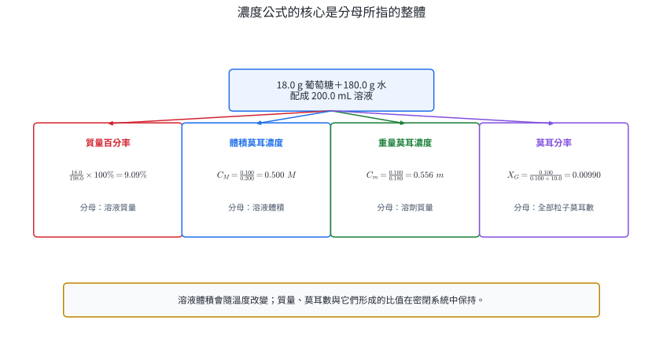
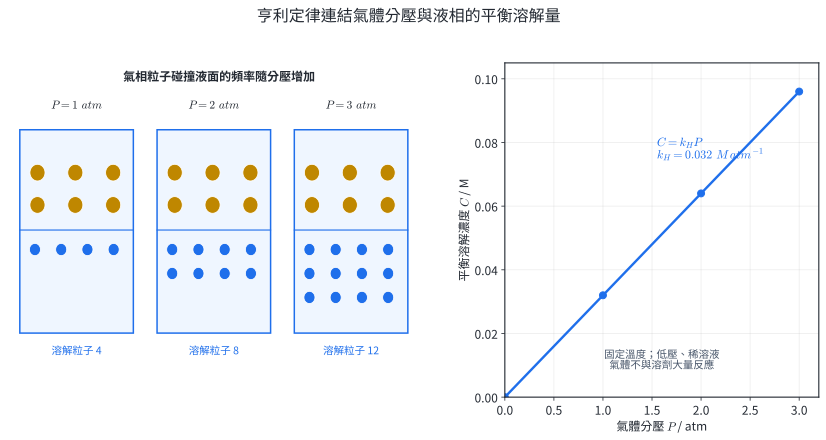
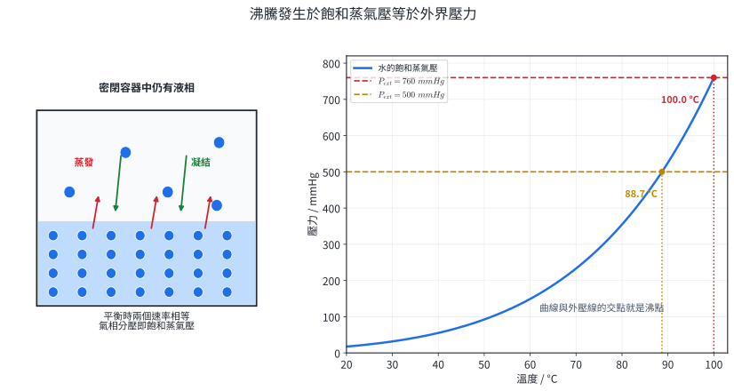
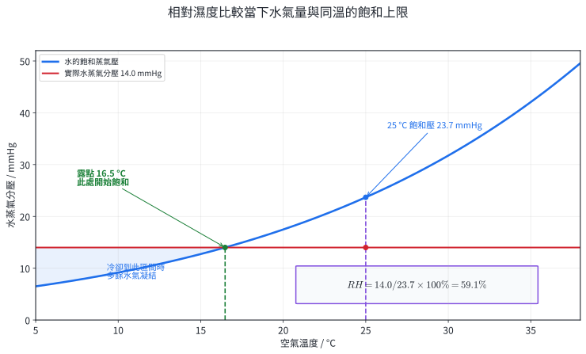
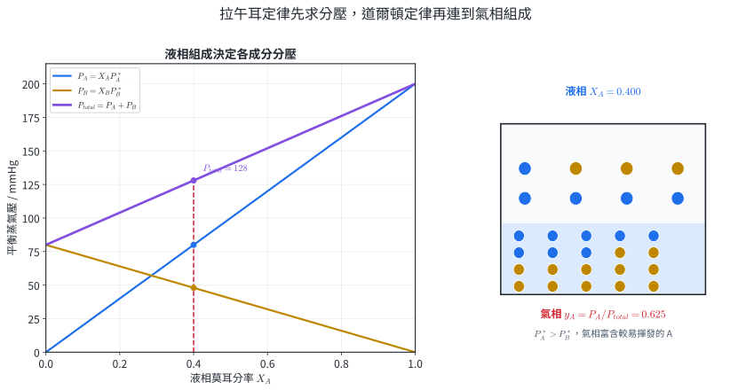
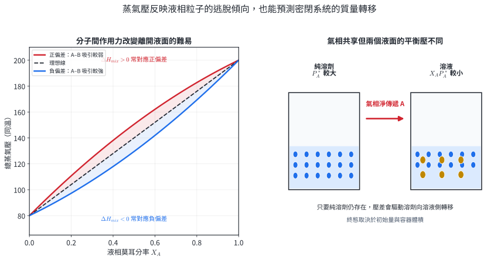
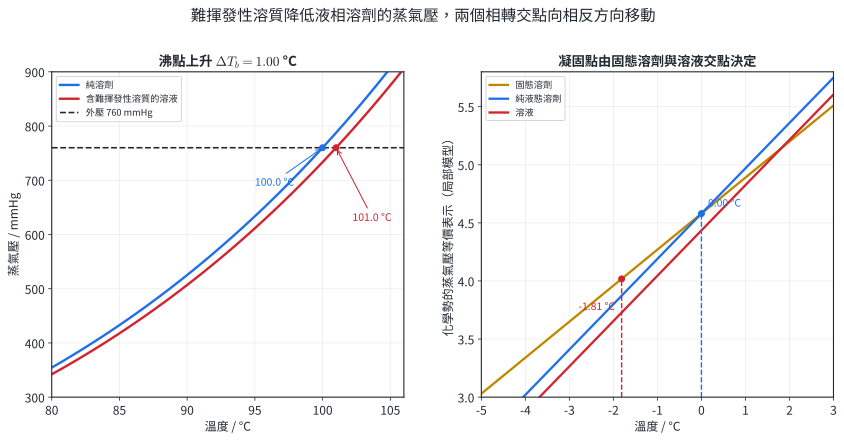
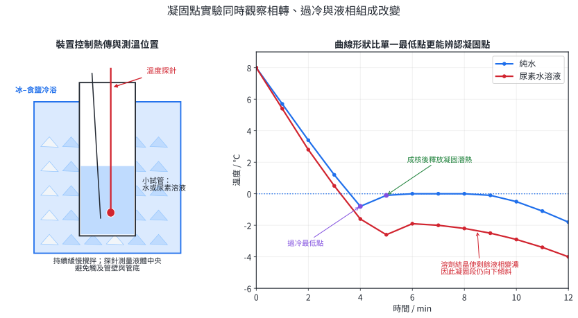
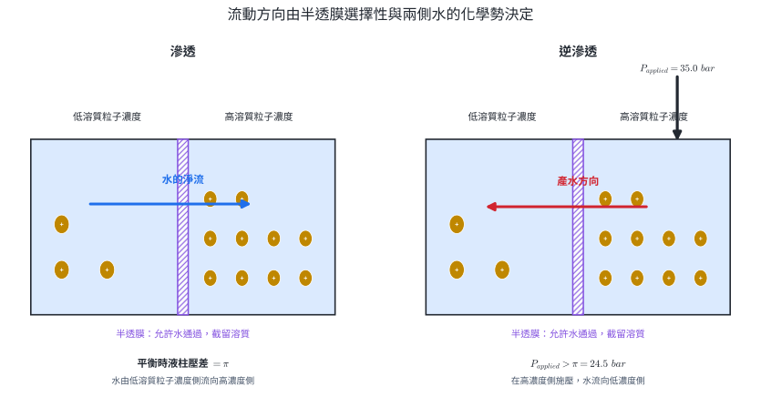
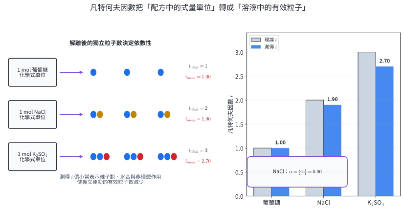

# 選化I-3 溶液的性質

溶液是微觀粒子均勻混合的單一相。配方要用濃度說明溶質與溶劑的比例；密閉容器中的蒸發、凝結與氣體溶解要用動態平衡說明；沸點、凝固點與滲透壓則反映溶劑粒子在溶質存在時的化學勢改變。

本章的實際用途包含藥物與點滴配方、環境氣體濃度、氣水與潛水安全、濕度控制、蒸餾分離、汽車冷卻液、食品冷凍、醫療滲透壓與淡化海水。應用邊界由溫度、壓力、稀薄程度、粒子互作用與半透膜選擇性決定。計算時先確定「數了哪種粒子」與「分母代表哪個整體」，再核對這些條件。

::: learning-map
### 本章問題與能力

1. 如何選擇物理性質或化學證據鑑定物質，並利用溶解度差進行分離？
2. 質量百分率、ppm、莫耳分率、體積莫耳濃度與重量莫耳濃度各以什麼為分母？
3. 亨利定律如何解釋氣水開瓶、潛水減壓與水體溶氧？
4. 動態平衡如何建立飽和蒸氣壓，並連到沸點、相對濕度與露點？
5. 拉午耳定律如何從液相組成求各成分分壓、總壓與氣相組成？
6. 難揮發性溶質為何同時造成沸點上升、凝固點下降與滲透壓？
7. 電解質的解離如何用凡特何夫因數納入依數性，測得值又能提供什麼粒子證據？
:::

## 1. 物質的鑑定與溶液

### 1.1 鑑定證據、溶解與混合

**物質鑑定**是把未知樣品的可量測性質與參考資料比對，並用足以排除其他候選物的證據得出結論。單一性質可能由多種物質共有，因此可依序組合：

- 物理證據：顏色、狀態、密度、熔點、沸點、折射率、溶解度、溶液導電度與光譜。
- 化學證據：與特定試劑反應所生的沉澱、氣體、顏色、pH 或氧化還原變化。
- 空白組、已知對照組與重複測量：用來確認訊號來自樣品，並估計變異。

**溶液**是溶質粒子以分子、離子或原子尺度均勻分散在溶劑中的單一相混合物。組成比例可在一定範圍內改變，因此溶液沒有單一化學式。溶解過程要同時考慮分開原有的溶質–溶質與溶劑–溶劑作用力，以及形成新的溶質–溶劑作用力。能量變化與粒子分散傾向共同決定溶解是否有利。

水與乙醇混合後體積小於兩者體積和，且溫度上升，證明混合後的粒子排列與交互作用已改變。高精度配方以容量瓶配至最終體積。

**分離**利用成分的性質差。例如加入只溶解其中一成分的溶劑，可先溶解、過濾，再從濾液回收溶質。設計時同時檢查溶解度差、回收率、溶劑危害與廢液處理。

::: worked-example
### 示範 1｜以連續證據鑑定無色水溶液

三種候選物是 $NaCl(aq)$、葡萄糖水溶液與稀 $HCl(aq)$。未知液可導電，pH 紙呈強酸性，加入 $AgNO_3(aq)$ 得白色沉澱。判定未知物。

導電顯示溶液中有可移動離子，排除主要以分子存在的葡萄糖溶液。強酸性支持 $HCl$ 而不支持中性 $NaCl$ 溶液。白色沉澱由

$$
Ag^+(aq)+Cl^-(aq)\rightarrow AgCl(s)
$$

證明氯離子存在。「酸性＋氯離子」共同指向 $HCl(aq)$。若樣品可能含多種溶質，還需增加定量或光譜證據才能說明完整組成。
:::

::: worked-example
### 示範 2｜用溶解度差設計分離流程

固體混合物由食鹽與細沙組成。寫出可分別回收兩者的步驟。

1. 加入適量水並攪拌：食鹽在水中溶解度大，細沙很小。
2. 過濾：濾渣為細沙，用少量水洗滌可移除表面食鹽溶液。
3. 乾燥濾渣：回收細沙。
4. 蒸發濾液中的水，使食鹽結晶：利用溶劑與溶質的揮發性差。

若要比較回收率，分別秤量乾燥產物，並用初始樣品建立質量帳。洗滌水太多會增加後續蒸發量，太少則使細沙夾帶食鹽。
:::

### 1.2 濃度的分母

濃度是溶質量與指定整體的比。各定義的差別主要在分母：

$$
\begin{aligned}
質量百分率&=\frac{m_{solute}}{m_{solution}}\times100\%,\\
體積百分率&=\frac{V_{solute}}{V_{solution}}\times100\%,\\
ppm&=\frac{m_{solute}}{m_{solution}}\times10^6,\\
X_i&=\frac{n_i}{\sum_j n_j},\\
C_M&=\frac{n_{solute}}{V_{solution}(\mathrm L)},\\
C_m&=\frac{n_{solute}}{m_{solvent}(\mathrm{kg})}.
\end{aligned}
$$

$C_M$ 常簡寫為 M，$C_m$ 常簡寫為 m。在密度接近 $1.00\ \mathrm{kg\,L^{-1}}$ 的極稀水溶液中，$1\ \mathrm{mg\,L^{-1}}\approx1\ \mathrm{ppm}$；正式定義仍是質量比。$C_M$ 以溶液體積為分母，因此受溫度造成的體積變化影響；質量百分率、莫耳分率與 $C_m$ 由質量或莫耳數建立，密閉系統內不因熱膨脹直接改變。

{width=98%}

::: worked-example
### 示範 3｜同一溶液的多種濃度

$18.0\ \mathrm g$ 葡萄糖溶於 $180.0\ \mathrm g$ 水，溶液體積 $200.0\ \mathrm{mL}$。取 $M(\text{葡萄糖})=180.0\ \mathrm{g\,mol^{-1}}$、$M(H_2O)=18.0\ \mathrm{g\,mol^{-1}}$，求質量百分率、$C_M$、$C_m$ 與葡萄糖莫耳分率。

$$
n_G=0.100\ \mathrm{mol},\qquad n_W=10.0\ \mathrm{mol}.
$$

$$
\begin{aligned}
質量百分率&=\frac{18.0}{198.0}\times100\%=9.09\%,\\
C_M&=\frac{0.100}{0.2000}=0.500\ \mathrm{mol\,L^{-1}},\\
C_m&=\frac{0.100}{0.1800}=0.556\ \mathrm{mol\,kg^{-1}},\\
X_G&=\frac{0.100}{0.100+10.0}=0.00990.
\end{aligned}
$$

四個數值的互換路徑是先還原這份溶液的質量、體積與莫耳數，再換用目標分母。
:::

::: worked-example
### 示範 4｜稀釋與混合的溶質帳

將 $250.0\ \mathrm{mL}$、$0.400\ \mathrm M$ $NaCl(aq)$ 與 $150.0\ \mathrm{mL}$、$0.200\ \mathrm M$ $NaCl(aq)$ 混合，假設體積可加成，求混合後濃度。

$$
n_{total}=(0.400)(0.2500)+(0.200)(0.1500)=0.130\ \mathrm{mol}.
$$

總體積為 $0.4000\ \mathrm L$，故

$$
C_M=\frac{0.130}{0.4000}=0.325\ \mathrm M.
$$

稀釋公式 $C_1V_1=C_2V_2$ 是「單一溶液加入無溶質的溶劑」時的溶質守恆式。兩份都含溶質時，直接加總莫耳數可保留完整物質帳。
:::

### 1.3 氣體溶解與亨利定律

在固定溫度、較低壓力、稀溶液，且氣體不與溶劑大量反應時，氣體的平衡溶解濃度 $C$ 與液面上該氣體分壓 $P$ 成正比：

$$
C=k_HP.
$$

本章以上式定義 $k_H$，其單位可為 $\mathrm{mol\,L^{-1}\,atm^{-1}}$。某些資料表把關係寫成 $P=kC$，其常數是本章 $k_H$ 的倒數；使用資料時先核對方程與單位。

分壓增加使單位時間碰撞液面的氣體粒子增加，新平衡所對應的溶解量也增加。對多數氣體，溫度上升會降低溶解度，因此不同溫度要使用不同 $k_H$。

{width=98%}

::: worked-example
### 示範 5｜降壓後的氣體溶解量

$25^\circ\mathrm C$ 時，某氣體在水中的 $k_H=0.0320\ \mathrm{mol\,L^{-1}\,atm^{-1}}$。分壓由 $0.800\ \mathrm{atm}$ 降至 $0.250\ \mathrm{atm}$，求每公升溶液在新平衡前後的溶解量差。

$$
C_i=(0.0320)(0.800)=0.0256\ \mathrm M,
$$

$$
C_f=(0.0320)(0.250)=0.00800\ \mathrm M.
$$

每公升釋出 $0.0256-0.00800=0.0176\ \mathrm{mol}$。開啟氣水後 $CO_2$ 分壓降低而冒泡，潛水上升過快時溶於組織的 $N_2$ 也可形成氣泡；後者需以減壓程序與實際潛水表管理。
:::

::: worked-example
### 示範 6｜從溶解濃度求混合氣體組成

空氣中氧的莫耳分率為 $0.210$，總壓 $1.00\ \mathrm{atm}$。某溫度下 $O_2$ 的 $k_H=1.30\times10^{-3}\ \mathrm{mol\,L^{-1}\,atm^{-1}}$。求與空氣平衡的水中 $O_2$ 濃度。

$$
P_{O_2}=y_{O_2}P_{total}=(0.210)(1.00)=0.210\ \mathrm{atm},
$$

$$
C_{O_2}=(1.30\times10^{-3})(0.210)=2.73\times10^{-4}\ \mathrm{mol\,L^{-1}}.
$$

若水溫上升或水中有耗氧生物與反應，實測溶氧會偏離這個平衡估計；水質監測因此要同時記錄溫度、氣壓與生物狀態。
:::

### 練習 1

1. 未知白色固體可能是 $NaCl$、砂糖或 $CaCO_3$。設計不超過三步的鑑定流程，並寫出每步證據。
2. $12.0\ \mathrm g$ 溶質與 $188.0\ \mathrm g$ 水形成溶液，求質量百分率。
3. 飲用水中某金屬離子為 $2.50\ \mathrm{mg}$，水樣體積 $1.25\ \mathrm L$、密度近似 $1.00\ \mathrm{kg\,L^{-1}}$。求 $\mathrm{mg\,L^{-1}}$ 與 ppm。
4. $0.250\ \mathrm{mol}$ 尿素溶於 $500\ \mathrm g$ 水，最後配成 $600\ \mathrm{mL}$ 溶液。求 $C_m$ 與 $C_M$。
5. 某氣體在 $20^\circ\mathrm C$ 的 $k_H=0.0200\ \mathrm{mol\,L^{-1}\,atm^{-1}}$。分壓由 $1.50\ \mathrm{atm}$ 降至 $0.400\ \mathrm{atm}$時，$2.00\ \mathrm L$ 溶液最多釋出多少莫耳氣體？
6. 同溫三次平衡數據如下，判斷哪一次不符合同一個亨利常數，並提出一個可檢驗原因。

| 實驗 | 分壓 / atm | 平衡濃度 / $\mathrm{mol\,L^{-1}}$ |
|---:|---:|---:|
| I | 0.50 | 0.0100 |
| II | 1.00 | 0.0202 |
| III | 1.50 | 0.0240 |

### 練習 1 解析

1. 加水：$CaCO_3$ 幾乎不溶，$NaCl$ 與砂糖溶解。對可溶樣品測導電度：$NaCl$ 溶液顯著導電，砂糖溶液導電度很低。對不溶樣品加稀酸：$CaCO_3$ 釋出 $CO_2$，可再用石灰水確認。
2. 溶液質量 $=200.0\ \mathrm g$，質量百分率 $=12.0/200.0\times100\%=6.00\%$。
3. $2.50/1.25=2.00\ \mathrm{mg\,L^{-1}}$。在題設密度與稀薄條件下約為 $2.00\ \mathrm{ppm}$。
4. $C_m=0.250/0.500=0.500\ \mathrm{mol\,kg^{-1}}$；$C_M=0.250/0.600=0.417\ \mathrm{mol\,L^{-1}}$。
5. $\Delta C=(0.0200)(1.50-0.400)=0.0220\ \mathrm{mol\,L^{-1}}$，釋出量 $=(0.0220)(2.00)=0.0440\ \mathrm{mol}$。
6. $C/P$ 分別為 $0.0200$、$0.0202$、$0.0160\ \mathrm{mol\,L^{-1}\,atm^{-1}}$，III 偏離。可檢驗 III 的溫度是否較高、是否未達平衡、氣液漏失，或濃度感測器是否超出線性範圍。

## 2. 蒸氣壓

### 2.1 飽和蒸氣壓、沸點與相對濕度

液體表面的部分粒子具有足夠動能可進入氣相，這個過程是**蒸發**；氣相粒子返回液相是**凝結**。密閉容器中若液相仍存在，當蒸發速率與凝結速率相等時建立動態平衡。此時蒸氣的分壓稱為該液體在該溫度的**飽和蒸氣壓** $P^*$。

對純物質，$P^*$ 主要由溫度與分子間作用力決定。溫度越高，高能粒子比例越大，$P^*$ 上升；同溫時分子間吸引較強的物質通常 $P^*$ 較低。只要氣、液兩相仍共存，改變液體量或容器氣相體積會改變達平衡所需的蒸發量，最後 $P^*$ 由同一溫度決定。

**沸騰**是液體內部氣泡可穩定生長的汽化；條件為

$$
P^*(T_b)=P_{external}.
$$

降低外壓會使交點移到較低溫，因此高山上的水沸點較低，真空濃縮也能用較低溫移除溶劑。

{width=98%}

::: worked-example
### 示範 7｜由蒸氣壓資料求沸點

某地大氣壓為 $500\ \mathrm{mmHg}$。由圖 3 的水蒸氣壓曲線估計沸點，並比較此地與 $760\ \mathrm{mmHg}$ 下煮食的差異。

曲線上 $P^*=500\ \mathrm{mmHg}$ 的交點約 $88.7^\circ\mathrm C$；$760\ \mathrm{mmHg}$ 的交點約 $100.0^\circ\mathrm C$。前者的沸水溫度較低，需要較長加熱時間才能達到同程度的食材軟化或蛋白質變性。
:::

**相對濕度** $RH$ 比較空氣中實際水蒸氣分壓 $P_{H_2O}$ 與同溫飽和水蒸氣壓 $P_{H_2O}^*(T)$：

$$
RH=\frac{P_{H_2O}}{P_{H_2O}^*(T)}\times100\%.
$$

保持實際水氣量而升溫時，分母上升，$RH$ 下降。空氣冷卻到飽和時的溫度稱為**露點**；繼續冷卻時，部分水氣凝結，直到氣相分壓等於新溫度的飽和壓。

{width=92%}

::: worked-example
### 示範 8｜相對濕度與露點

$25.0^\circ\mathrm C$ 時水的飽和蒸氣壓為 $23.7\ \mathrm{mmHg}$，空氣中實際水氣分壓為 $14.0\ \mathrm{mmHg}$。求相對濕度，並由圖 4 估計露點。

$$
RH=\frac{14.0}{23.7}\times100\%=59.1\%.
$$

在飽和曲線上尋找 $P^*=14.0\ \mathrm{mmHg}$，得露點約 $16.5^\circ\mathrm C$。冷氣出風口、窗面與電子設備若低於露點，表面可能結露；濕度控制要同時考慮水氣量與表面溫度。
:::

### 2.2 拉午耳定律與氣相組成

對理想溶液，成分 $i$ 的平衡分壓為

$$
P_i=X_iP_i^*,
$$

其中 $X_i$ 是該成分在液相的莫耳分率，$P_i^*$ 是純成分在同溫的飽和蒸氣壓。各分壓相加得總壓：

$$
P_{total}=\sum_iP_i.
$$

若溶質 $B$ 難揮發，$P_B\approx0$，則

$$
P_{solution}=X_AP_A^*,\qquad
\Delta P=X_BP_A^*,\qquad
\frac{\Delta P}{P_A^*}=X_B.
$$

這是難揮發、非電解溶質在理想稀溶液中的依數性關係：大小由溶質粒子數決定。若 A、B 都可揮發，氣相莫耳分率由

$$
y_A=\frac{P_A}{P_{total}}
$$

求得。蒸氣相會富含 $P_i^*$ 較大、較易揮發的成分，這是蒸餾分離的核心。

{width=98%}

::: worked-example
### 示範 9｜難揮發性溶質的蒸氣壓下降

將 $2.00\ \mathrm{mol}$ 葡萄糖溶於 $18.0\ \mathrm{mol}$ 水。某溫度下純水蒸氣壓為 $24.0\ \mathrm{mmHg}$，求理想溶液的水蒸氣壓與下降量。

$$
X_{H_2O}=\frac{18.0}{20.0}=0.900,
$$

$$
P_{H_2O}=(0.900)(24.0)=21.6\ \mathrm{mmHg},\qquad
\Delta P=2.40\ \mathrm{mmHg}.
$$

也可用 $X_{solute}=0.100$ 直接得 $\Delta P=(0.100)(24.0)$。
:::

::: worked-example
### 示範 10｜可揮發二元溶液的氣相組成

在某溫度，$P_A^*=200\ \mathrm{mmHg}$、$P_B^*=80.0\ \mathrm{mmHg}$，理想溶液的 $X_A=0.400$。

$$
P_A=(0.400)(200)=80.0\ \mathrm{mmHg},
$$

$$
P_B=(0.600)(80.0)=48.0\ \mathrm{mmHg}.
$$

$$
P_{total}=128\ \mathrm{mmHg},\qquad y_A=\frac{80.0}{128}=0.625.
$$

$y_A>X_A$，氣相比液相更富含 A。收集氣相凝結物可讓館出物中 A 的比例上升。
:::

### 2.3 理想、非理想與密閉容器的質量轉移

理想溶液在全組成範圍近似遵守拉午耳定律，通常意味著 A–B 作用力與 A–A、B–B 作用力的平均相近，混合體積變化與混合熱都很小。

- **正偏差**：實測蒸氣壓高於理想值。A–B 吸引較弱，粒子較易離開液相；常伴隨 $\Delta H_{mix}>0$、$\Delta V_{mix}>0$。
- **負偏差**：實測蒸氣壓低於理想值。A–B 吸引較強，粒子較難離開液相；常伴隨 $\Delta H_{mix}<0$、$\Delta V_{mix}<0$。

高濃度、強氫鍵、離子–偶極作用或明顯結構差異都可使理想近似變差。

{width=98%}

同一密閉容器中，一杯純溶劑與一杯含難揮發性溶質的溶液共享氣相。純溶劑平衡蒸氣壓較大，溶劑經氣相淨轉移至溶液側。兩側均持續蒸發與凝結，淨速率由兩個液面的逃脫傾向差決定。在沒有溢流與其他相轉的封閉模型中，純溶劑杯最後耗盡，稀釋後的溶液再與氣相建立新平衡。

::: worked-example
### 示範 11｜用蒸氣壓偏差判斷粒子間作用力

某 $X_A=0.50$ 的二元溶液，理想總蒸氣壓為 $140\ \mathrm{mmHg}$，實測值為 $158\ \mathrm{mmHg}$，絕熱混合時溫度降低。

$158>140$，故為正偏差，顯示 A–B 平均吸引弱於原有作用力。混合時溶液本身降溫，表示它從周圍吸熱，$\Delta H_{mix}>0$。兩項證據相互支持。
:::

::: worked-example
### 示範 12｜密閉容器中的溶劑轉移

密閉容器中放兩個開口小杯：甲盛純水，乙盛葡萄糖水溶液。溫度固定，葡萄糖難揮發。甲杯液面上的平衡水蒸氣壓為 $P_{H_2O}^*$，乙杯約為 $X_{H_2O}P_{H_2O}^*$，後者較小。初期淨效果是水由甲杯經蒸氣轉移至乙杯。乙杯的水增加、葡萄糖莫耳數不變，故葡萄糖莫耳分率與重量莫耳濃度均下降。
:::

### 練習 2

1. 在 $25^\circ\mathrm C$ 且液態水仍存在時，密閉容器體積增為兩倍。說明最終飽和蒸氣壓與達平衡前額外蒸發量如何變化。
2. 某地外壓 $600\ \mathrm{mmHg}$。水的資料為 $90^\circ\mathrm C:526\ \mathrm{mmHg}$、$95^\circ\mathrm C:634\ \mathrm{mmHg}$。以線性內插估計沸點。
3. $30^\circ\mathrm C$ 的飽和水蒸氣壓為 $31.8\ \mathrm{mmHg}$，實際水氣分壓 $19.1\ \mathrm{mmHg}$。求 $RH$。
4. $1.00\ \mathrm{mol}$ 難揮發性非電解質與 $9.00\ \mathrm{mol}$ 水形成理想溶液。純水蒸氣壓 $20.0\ \mathrm{mmHg}$，求溶液蒸氣壓與相對下降量。
5. 某理想二元溶液的 $P_A^*=150\ \mathrm{mmHg}$、$P_B^*=50.0\ \mathrm{mmHg}$，$X_A=0.300$。求 $P_A$、$P_B$、$P_{total}$ 與 $y_A$。
6. 三種 $X_A=0.50$ 混合物的理想總壓均為 $100\ \mathrm{kPa}$。I 實測 $116\ \mathrm{kPa}$ 且絕熱混合後降溫；II 實測 $84\ \mathrm{kPa}$ 且升溫；III 實測 $116\ \mathrm{kPa}$ 且升溫。判斷各組偏差，並評估壓力與熱證據是否一致。

### 練習 2 解析

1. 同溫且兩相共存，最終 $P^*$ 不變。氣相體積增大後，要有更多水分子進入氣相才能恢復同一分壓，因此額外蒸發量增加。
2. $T=90+(600-526)/(634-526)\times5=93.4^\circ\mathrm C$。交點位於已知資料之間，線性內插可作近似。
3. $RH=19.1/31.8\times100\%=60.1\%$。
4. $X_{H_2O}=0.900$，$P=18.0\ \mathrm{mmHg}$；$\Delta P/P^*=X_{solute}=0.100$，相對下降 $10.0\%$。
5. $X_B=0.700$。$P_A=45.0\ \mathrm{mmHg}$，$P_B=35.0\ \mathrm{mmHg}$，$P_{total}=80.0\ \mathrm{mmHg}$，$y_A=0.5625$。
6. I 總壓高於理想值，為正偏差；降溫支持 $\Delta H_{mix}>0$，一致。II 是負偏差，升溫支持 $\Delta H_{mix}<0$，一致。III 的壓力指向正偏差，升溫卻指向放熱，兩項證據不一致；需重複溫度量測、控制熱損失，並確認是否發生反應。

## 3. 溶液的沸點、凝固點與滲透壓

### 3.1 沸點上升與凝固點下降

難揮發性溶質使溶劑莫耳分率小於 1，同溫下溶液的溶劑蒸氣壓低於純溶劑。要使溶液蒸氣壓達外壓，需升到更高溫，因此沸點上升。凝固時，結晶主要排列成純溶劑固體；溶質降低液相溶劑的化學勢，要降到更低溫才能與固相平衡，因此凝固點下降。

{width=98%}

對稀薄、理想、難揮發、非電解質溶液，

$$
\Delta T_b=T_b(\text{溶液})-T_b^*=K_bC_m,
$$

$$
\Delta T_f=T_f^*-T_f(\text{溶液})=K_fC_m.
$$

$K_b$、$K_f$ 只由溶劑與壓力條件決定，常用單位為 $\mathrm{K\,kg\,mol^{-1}}$。溫差的 K 與 $^\circ\mathrm C$ 數值相同。公式中的 $C_m$ 直接以每公斤溶劑的溶質莫耳數代入，且少受溫度引起的體積變化影響。

::: worked-example
### 示範 13｜由重量莫耳濃度求沸點與凝固點

$0.500\ \mathrm m$ 葡萄糖水溶液在 $1\ \mathrm{atm}$ 下，取水的 $K_b=0.512\ \mathrm{K\,kg\,mol^{-1}}$、$K_f=1.86\ \mathrm{K\,kg\,mol^{-1}}$，求沸點與凝固點。

$$
\Delta T_b=(0.512)(0.500)=0.256^\circ\mathrm C,
$$

$$
T_b=100.000+0.256=100.256^\circ\mathrm C.
$$

$$
\Delta T_f=(1.86)(0.500)=0.930^\circ\mathrm C,
$$

$$
T_f=0.000-0.930=-0.930^\circ\mathrm C.
$$

兩個溫差都是正的大小；最後用「沸點加、凝固點減」放回溫度軸。
:::

::: worked-example
### 示範 14｜由凝固點下降求莫耳質量

將 $3.10\ \mathrm g$ 難揮發性非電解質溶於 $100.0\ \mathrm g$ 苯，凝固點降低 $1.28^\circ\mathrm C$。取苯的 $K_f=5.12\ \mathrm{K\,kg\,mol^{-1}}$，求溶質莫耳質量。

$$
C_m=\frac{\Delta T_f}{K_f}=\frac{1.28}{5.12}=0.250\ \mathrm{mol\,kg^{-1}}.
$$

溶劑為 $0.1000\ \mathrm{kg}$，故

$$
n_{solute}=(0.250)(0.1000)=0.0250\ \mathrm{mol}.
$$

$$
M=\frac{3.10}{0.0250}=124\ \mathrm{g\,mol^{-1}}.
$$

此法測到的是「溶液中獨立粒子」對應的表觀莫耳質量。若溶質解離或聚合，要再納入第 4 節的 $i$。
:::

### 3.2 凝固點下降實驗：裝置、證據與誤差

實驗以相同裝置分別測純水與尿素水溶液的冷卻曲線。冰–食鹽混合物提供低於 $0^\circ\mathrm C$ 的冷浴，小試管與冷浴之間可用大試管留下空氣層，使降溫速率足以記錄。溫度探針測量液體中央，攪拌使內部溫度均勻。

{width=98%}

**安全與廢棄物**

- 配戴護目鏡、實驗衣與適當手套。冰–食鹽浴可造成低溫傷害，以工具移動冰鹽混合物，清理時等待回溫。
- 玻璃試管、溫度計與探針要固定，從攪拌與夾持點施力。破裂玻璃放入專用容器。
- 尿素及其溶液避免食入、皮膚長時間接觸與粉塵吸入。尿素溶液收集為實驗室指定的含氮水相廢液；冰鹽冷浴依實驗室本地規範排放。
- 若做水與乙醇的混合體積、溫度演示，乙醇易燃；工作區無火焰與火花，保持通風，乙醇廢液收入有機溶劑廢液桶。

**觀察–推論**

| 觀察 | 可由資料支持的推論 |
|---|---|
| 純水先降到 $0^\circ\mathrm C$ 以下，後回升 | 水曾過冷；成核後凝固潛熱使溫度回升 |
| 純水凝固期間出現近水平段 | 固、液兩相共存時，組成近似不變，移除的熱主要用於相轉 |
| 尿素溶液開始結冰的溫度較低 | 溶質使溶劑凝固點下降 |
| 溶液結冰段仍向下傾斜 | 溶劑結晶後，剩餘液相的尿素濃度上升，其凝固點持續下降 |

::: worked-example
### 示範 15｜從冷卻曲線選取凝固點

某純溶劑冷卻資料依序為 $3.0$、$1.2$、$-0.7$、$0.1$、$0.0$、$0.0$、$-0.1^\circ\mathrm C$。何者代表過冷最低點？凝固點如何估計？

$-0.7^\circ\mathrm C$ 是成核前的過冷最低點，不代表平衡凝固點。結晶後釋放潛熱，溫度回到約 $0.0^\circ\mathrm C$ 的平臺，故凝固點估為 $0.0^\circ\mathrm C$。對無平臺的溶液，可以凝固前降溫線與開始結晶後趨勢線的交點作一致估計。
:::

::: worked-example
### 示範 16｜由實驗溫差回求溶質量

以 $50.0\ \mathrm g$ 水配製尿素溶液，測得 $\Delta T_f=1.24^\circ\mathrm C$。取 $K_f(\mathrm{H_2O})=1.86\ \mathrm{K\,kg\,mol^{-1}}$、$M(\text{尿素})=60.0\ \mathrm{g\,mol^{-1}}$，假設理想，求尿素質量。

$$
C_m=\frac{1.24}{1.86}=0.667\ \mathrm{mol\,kg^{-1}}.
$$

$$
n=(0.667)(0.0500)=0.0333\ \mathrm{mol},
$$

$$
m=(0.0333)(60.0)=2.00\ \mathrm g.
$$

若探針貼管壁而讀到過低溫度，$\Delta T_f$ 會偏大，回算的濃度與尿素量也偏大。
:::

**主要誤差與改進**

| 來源 | 對曲線的影響 | 改進 |
|---|---|---|
| 探針觸及管壁或管底 | 容易讀到較低的局部溫度 | 固定探針在液體中央，每組深度一致 |
| 攪拌不均 | 樣品內有溫度梯度，資料抖動 | 以相同速率連續緩慢攪拌 |
| 冷浴溫度或接觸面積不同 | 降溫速率失去可比性 | 使用同一種冷浴配比、浸沒深度與試管 |
| 過冷與成核時間隨機 | 最低點變化大 | 以平臺或兩趨勢線交點判讀，並重複實驗 |
| 稱量、水分蒸發或樣品殘留 | 實際 $C_m$ 偏離配方 | 密閉秤量、完全轉移，實驗前後做質量帳 |

### 3.3 滲透壓與逆滲透

**半透膜**允許溶劑通過，但對題目中的溶質具有足夠截留性。當半透膜兩側溶劑相同、溶質粒子濃度不同時，溶劑由較低溶質粒子濃度側淨流向較高側，此過程為**滲透**。要恰好阻止此淨流所需施加在溶液側的額外壓力，稱為**滲透壓** $\pi$。

對稀薄、理想、非電解質溶液，

$$
\pi=C_MRT.
$$

溫度要用 K，$R$ 的單位必須與壓力一致。滲透壓在極稀溶液仍可明顯量測，因此適合求聚合物或大分子的莫耳質量。

{width=98%}

::: worked-example
### 示範 17｜體液溫度的滲透壓

$0.150\ \mathrm M$ 葡萄糖水溶液在 $37.0^\circ\mathrm C$，假設理想，取 $R=0.08206\ \mathrm{L\,atm\,mol^{-1}\,K^{-1}}$，求滲透壓。

$$
T=37.0+273.15=310.15\ \mathrm K,
$$

$$
\pi=(0.150)(0.08206)(310.15)=3.82\ \mathrm{atm}.
$$

醫療輸液的滲透性要與血漿可比，同時考慮溶質是否解離、能否穿過細胞膜，以及真實溶液的非理想性。
:::

::: worked-example
### 示範 18｜由滲透壓求聚合物莫耳質量

$2.00\ \mathrm g$ 聚合物配成 $100.0\ \mathrm{mL}$ 溶液，$25.0^\circ\mathrm C$ 的滲透壓為 $0.246\ \mathrm{atm}$。假設理想，求莫耳質量。

$$
n=\frac{\pi V}{RT}=\frac{(0.246)(0.1000)}{(0.08206)(298.15)}=1.01\times10^{-3}\ \mathrm{mol}.
$$

$$
M=\frac{2.00}{1.01\times10^{-3}}=1.99\times10^3\ \mathrm{g\,mol^{-1}}.
$$

溶液體積必須以 L 代入；若聚合物在溶液中纏合，測得粒子數偏少，回算莫耳質量會偏大。
:::

**逆滲透**在高濃度側施加 $P_{applied}>\pi$，使溶劑逆著自發滲透方向穿過膜。海水淡化、超純水製程與廢水回收都用到這個操作。實際工程壓力需高於熱力學滲透壓，以提供有限通量並克服流道壓降；能耗、膜污染、鹽水濃縮液處理與能量回收也是設計的一部分。

::: worked-example
### 示範 19｜逆滲透的最低熱力條件

某鹽水的滲透壓為 $24.5\ \mathrm{bar}$，產水側背壓 $1.0\ \mathrm{bar}$。判斷在鹽水側施壓 $20.0$、$25.0$、$35.0\ \mathrm{bar}$ 時的理想淨流方向。

有效水力壓差為 $P_{feed}-P_{product}$。三組分別是 $19.0$、$24.0$、$34.0\ \mathrm{bar}$。前兩者小於 $24.5\ \mathrm{bar}$，理想淨流仍指向鹽水側；$35.0\ \mathrm{bar}$ 時有效差 $34.0\ \mathrm{bar}>24.5\ \mathrm{bar}$，可產生逆滲透產水。工程操作還需更高驅動壓差才有可用通量。
:::

### 練習 3

1. $0.250\ \mathrm m$ 尿素水溶液，取 $K_b=0.512$、$K_f=1.86\ \mathrm{K\,kg\,mol^{-1}}$，求 $1\ \mathrm{atm}$ 下沸點與凝固點。
2. $4.00\ \mathrm g$ 難揮發性非電解質溶於 $80.0\ \mathrm g$ 水，凝固點降低 $0.775^\circ\mathrm C$。取 $K_f=1.86$，求溶質莫耳質量。
3. 純水冷卻資料出現 $0.2$、$-1.1$、$-0.2$、$0.0$、$0.0^\circ\mathrm C$。辨認過冷最低點、凝固點與回溫的能量來源。
4. $0.0750\ \mathrm M$ 葡萄糖溶液在 $27.0^\circ\mathrm C$ 的滲透壓為何？取 $R=0.08206\ \mathrm{L\,atm\,mol^{-1}\,K^{-1}}$。
5. $1.50\ \mathrm g$ 大分子配成 $250.0\ \mathrm{mL}$ 溶液，$20.0^\circ\mathrm C$ 測得 $\pi=0.0144\ \mathrm{atm}$。求莫耳質量。
6. 某尿素凝固點實驗的理論 $\Delta T_f=1.00^\circ\mathrm C$，三組做法為：I 探針貼管壁；II 緩慢均勻攪拌且重複三次；III 配方後水蒸發一部分。預測 I、III 的測得方向，並說明 II 如何改善證據。

### 練習 3 解析

1. $\Delta T_b=(0.512)(0.250)=0.128^\circ\mathrm C$，$T_b=100.128^\circ\mathrm C$。$\Delta T_f=(1.86)(0.250)=0.465^\circ\mathrm C$，$T_f=-0.465^\circ\mathrm C$。
2. $C_m=0.775/1.86=0.4167\ \mathrm m$，$n=(0.4167)(0.0800)=0.0333\ \mathrm{mol}$，$M=4.00/0.0333=120\ \mathrm{g\,mol^{-1}}$。
3. $-1.1^\circ\mathrm C$ 是過冷最低點；成核後回至約 $0.0^\circ\mathrm C$，故凝固點約為 $0.0^\circ\mathrm C$。回溫的能量來自部分水凝固釋放的潛熱。
4. $T=300.15\ \mathrm K$，$\pi=(0.0750)(0.08206)(300.15)=1.85\ \mathrm{atm}$。
5. $M=mRT/(\pi V)=(1.50)(0.08206)(293.15)/(0.0144\times0.2500)=1.00\times10^4\ \mathrm{g\,mol^{-1}}$。
6. I 可讀到過冷的管壁局部溫度，$\Delta T_f$ 偏大。III 的溶劑質量減少而 $C_m$ 上升，$\Delta T_f$ 偏大。II 減少樣品內溫度梯度，三次重複可估計隨機變異與平均值，使結論不依賴單次成核。

## 4. 水溶液的依數性

### 4.1 有效粒子與凡特何夫因數

**依數性**是稀溶液中主要由溶質粒子數決定，而與粒子化學身分無直接關係的性質。本章包含蒸氣壓下降、沸點上升、凝固點下降與滲透壓。比較「粒子數」之前，要把配方中的化學式單位轉成溶液中獨立運動的有效粒子。

**凡特何夫因數** $i$ 定義為

$$
i=\frac{實際有效溶質粒子濃度}{以配方式量單位計算的溶質濃度}.
$$

理想極稀溶液中，非電解質 $i\approx1$；$NaCl\rightarrow Na^++Cl^-$ 給 $i\approx2$；$K_2SO_4\rightarrow2K^++SO_4^{2-}$ 給 $i\approx3$。實際電解質的測得 $i$ 常低於完全解離的整數，因為離子對、水合與非理想作用降低獨立運動的有效粒子數。$i$ 應視為指定濃度與溫度下的有效值。

{width=98%}

納入 $i$ 後，稀溶液公式成為

$$
\frac{\Delta P}{P^*}\approx iX_{formula\ unit},
$$

$$
\Delta T_b=iK_bC_m,　
\Delta T_f=iK_fC_m,　
\pi=iC_MRT.
$$

第一式在非常稀薄時才能用「式量單位莫耳分率×$i$」近似實際粒子莫耳分率；若要高精度處理，分母也要改用實際粒子總數。

對一個式量單位最多形成 $\nu$ 個粒子的電解質，若解離度為 $\alpha$，每初始 1 mol 式量單位最後的有效粒子數為

$$
(1-\alpha)+\nu\alpha=1+\alpha(\nu-1),
$$

因此

$$
i=1+\alpha(\nu-1),\qquad
\alpha=\frac{i-1}{\nu-1}.
$$

::: worked-example
### 示範 20｜由電解質化學式比較依數性

比較同溫、同溶劑、皆為 $0.100\ \mathrm m$ 的葡萄糖、$NaCl$、$CaCl_2$ 理想極稀溶液之 $\Delta T_f$。

葡萄糖不解離，$i=1$；$NaCl$ 形成兩種離子，$i=2$；$CaCl_2$ 形成 $Ca^{2+}+2Cl^-$，$i=3$。因為 $K_f$ 與 $C_m$ 都相同，

$$
\Delta T_f(葡萄糖):\Delta T_f(NaCl):\Delta T_f(CaCl_2)=1:2:3.
$$

這個整數比是完全解離、理想極稀的上限模型。實測高濃度電解質溶液常偏離這些數值。
:::

::: worked-example
### 示範 21｜由凝固點數據求 $i$

$0.200\ \mathrm m$ $NaCl(aq)$ 的凝固點下降為 $0.707^\circ\mathrm C$，取 $K_f(水)=1.86\ \mathrm{K\,kg\,mol^{-1}}$。求 $i$，並與理論值比較。

$$
i=\frac{\Delta T_f}{K_fC_m}=\frac{0.707}{(1.86)(0.200)}=1.90.
$$

完全解離的理論值為 2.00，測得 1.90 表示有效粒子數約為式量單位數的 1.90 倍。以簡化解離模型，$\nu=2$，

$$
\alpha=\frac{1.90-1}{2-1}=0.90.
$$

此 $\alpha$ 是由依數性得到的有效解離估計，離子間作用大時不必等於獨立化學分析得到的解離率。
:::

### 4.2 依數性的實用計算與限制

依數性可由易測的巨觀數據回推難以直接觀察的粒子數。典型用途包含：

- 以 $\Delta T_f$、$\Delta T_b$ 或 $\pi$ 求未知物莫耳質量。
- 以測得 $i$ 比較電解質的有效粒子數與離子對程度。
- 配製防凍液、除冰液、冷凍食品的相轉溫度區間。
- 設計醫療等滲透溶液與膜分離製程。

公式的共同限制是稀薄與近似理想。濃溶液的粒子間作用、離子水合、溶質纏合或化學反應會使測得值偏離線性關係。海水、體液、高濃度電解質與聚合物溶液的工程計算，會進一步用活性、滲透係數或實測校正。

::: worked-example
### 示範 22｜納入測得 $i$ 求防凍配方

$0.750\ \mathrm m$ $CaCl_2(aq)$ 的測得 $i=2.60$，取水 $K_f=1.86\ \mathrm{K\,kg\,mol^{-1}}$。求凝固點。

$$
\Delta T_f=(2.60)(1.86)(0.750)=3.63^\circ\mathrm C,
$$

$$
T_f=0.00-3.63=-3.63^\circ\mathrm C.
$$

若直接用完全解離 $i=3$，會預測 $\Delta T_f=4.19^\circ\mathrm C$，高估防凍效果。真實產品還需由實測凝固曲線、材料腐蝕性與低溫黏度確認可用範圍。
:::

::: worked-example
### 示範 23｜由弱電解質的滲透壓求解離度

$0.0500\ \mathrm M$ 弱酸 $HA$ 在 $25.0^\circ\mathrm C$ 的滲透壓為 $1.47\ \mathrm{atm}$，取 $R=0.08206\ \mathrm{L\,atm\,mol^{-1}\,K^{-1}}$。$HA\rightleftharpoons H^++A^-$，求 $i$ 與解離度。

$$
i=\frac{\pi}{C_MRT}
=\frac{1.47}{(0.0500)(0.08206)(298.15)}=1.20.
$$

此反應完全解離時 $\nu=2$，故

$$
\alpha=\frac{i-1}{2-1}=0.20.
$$

約 $20\%$ 式量單位解離。題設把溶液視為理想；若濃度較高，活性與膜對離子的截留率都可影響由滲透壓回推的結果。
:::

### 練習 4

1. 寫出理想極稀時尿素、$KCl$、$AlCl_3$ 的理論 $i$，並比較同 $C_m$ 水溶液的 $\Delta T_b$。
2. $0.300\ \mathrm m$ $KCl(aq)$ 的 $\Delta T_f=1.03^\circ\mathrm C$，取 $K_f=1.86$，求 $i$。
3. 某 $AB_2$ 可形成 $A^{2+}+2B^-$，測得 $i=2.50$。以簡化解離模型求 $\alpha$。
4. $0.100\ \mathrm M$ $NaCl(aq)$ 在 $25.0^\circ\mathrm C$ 的測得 $i=1.90$。求滲透壓。
5. 各取 $0.0100\ \mathrm{mol}$ 葡萄糖、$NaCl$、$CaCl_2$ 配成相同體積的極稀水溶液。以完全解離模型比較蒸氣壓下降大小，並說明濃度提高後比例可能偏離的原因。
6. 一系列 $NaCl$ 溶液在同溫測得 $i$：$0.010\ \mathrm m$ 為 1.98，$0.100\ \mathrm m$ 為 1.93，$1.00\ \mathrm m$ 為 1.78。敘述趨勢、一個粒子尺度解釋，並說明何時用 $i=2$ 的近似較合理。

### 練習 4 解析

1. 尿素 $i=1$，$KCl$ $i=2$，$AlCl_3$ $i=4$。因 $\Delta T_b=iK_bC_m$，同溶劑、同 $C_m$ 的比為 $1:2:4$。
2. $i=1.03/(1.86\times0.300)=1.85$，低於完全解離理論值 2。
3. $AB_2$ 完全解離有 $\nu=3$，$\alpha=(2.50-1)/(3-1)=0.750$。
4. $\pi=iC_MRT=(1.90)(0.100)(0.08206)(298.15)=4.65\ \mathrm{atm}$。
5. 在粒子數遠小於水分子數時，有效溶質粒子數約為 $1:2:3$，蒸氣壓下降也約為 $1:2:3$。濃度增加時，離子對、水合與活性係數改變，$i$ 會偏離完全解離的整數。
6. 濃度增加時 $i$ 由 1.98 降至 1.78。離子間平均距離縮短，异號離子相互吸引、形成離子對或集團，有效獨立粒子數減少。在 $0.010\ \mathrm m$ 這類極稀溶液，$i=2$ 較合理；$1.00\ \mathrm m$ 時實測校正更重要。

## 5. 章末分層題

### 基礎定義與單一模型

1. $9.00\ \mathrm g$ 葡萄糖與 $91.0\ \mathrm g$ 水配成 $100.0\ \mathrm{mL}$ 溶液。取 $M=180.0\ \mathrm{g\,mol^{-1}}$，求質量百分率與 $C_M$。
2. $20^\circ\mathrm C$ 時某氣體 $k_H=1.50\times10^{-2}\ \mathrm{mol\,L^{-1}\,atm^{-1}}$。氣體分壓 $0.600\ \mathrm{atm}$ 時，$3.00\ \mathrm L$ 溶液中平衡溶解多少莫耳？
3. $20^\circ\mathrm C$ 水的飽和蒸氣壓為 $17.5\ \mathrm{mmHg}$。空氣中水氣分壓 $10.5\ \mathrm{mmHg}$，求相對濕度。
4. $0.500\ \mathrm{mol}$ 難揮發性非電解質與 $9.50\ \mathrm{mol}$ 水形成理想溶液。同溫純水 $P^*=28.0\ \mathrm{mmHg}$，求溶液的水蒸氣壓。

### 多步計算與資料判讀

5. $0.400\ \mathrm m$ 尿素水溶液，取 $K_b=0.512$、$K_f=1.86\ \mathrm{K\,kg\,mol^{-1}}$。求 $1\ \mathrm{atm}$ 下沸點與凝固點。
6. $0.125\ \mathrm M$ 葡萄糖水溶液在 $25.0^\circ\mathrm C$ 的滲透壓為何？取 $R=0.08206\ \mathrm{L\,atm\,mol^{-1}\,K^{-1}}$。
7. $0.250\ \mathrm m$ $MgCl_2(aq)$ 測得凝固點下降 $1.16^\circ\mathrm C$，取 $K_f=1.86$。求 $i$，並與完全解離值比較。
8. $2.50\ \mathrm g$ 難揮發性非電解質溶於 $50.0\ \mathrm g$ 水，凝固點為 $-0.930^\circ\mathrm C$。取 $K_f=1.86$，求莫耳質量。
9. 某溫度下 $P_A^*=240\ \mathrm{mmHg}$、$P_B^*=60.0\ \mathrm{mmHg}$，理想溶液的 $X_A=0.250$。求 $P_A$、$P_B$、$P_{total}$、$y_A$，並說明蒸氣富含哪一成分。
10. 二元溶液在 $X_A=0.50$ 的拉午耳理想總壓為 $70.0\ \mathrm{kPa}$，實測 $55.0\ \mathrm{kPa}$，且混合後體積縮小。用粒子間作用力解釋兩項證據。
11. 純水冷卻曲線中，溫度由 $1.0^\circ\mathrm C$ 降至 $-1.3^\circ\mathrm C$，突然回升到 $0.0^\circ\mathrm C$ 並保持數分鐘。指出成核時段、能量轉移與凝固點的合理取值。
12. 某鹽水在當下溫度的滲透壓為 $27\ \mathrm{bar}$，產水側背壓 $2\ \mathrm{bar}$。供料側操作壓力 $35\ \mathrm{bar}$。計算理想淨驅動壓差，並判斷產水方向。

### 跨節整合題

13. 氣水瓶在 $5.0^\circ\mathrm C$ 以 $CO_2$ 分壓 $3.00\ \mathrm{atm}$ 達平衡，此溫度 $k_H=0.0600\ \mathrm{mol\,L^{-1}\,atm^{-1}}$。開瓶後 $CO_2$ 分壓趨近 $4.0\times10^{-4}\ \mathrm{atm}$，假設溫度仍為 $5.0^\circ\mathrm C$。（a）求每公升液體可釋出的 $CO_2$ 莫耳數；（b）若改在較高溫開瓶，而 $CO_2$ 溶解是放熱過程，氣泡釋出趨勢如何？（c）說明封瓶狀態下為什麼 $CO_2$ 分壓是亨利定律的正確壓力變數。
14. 以 $1.000\ \mathrm{kg}$ 水配製 $0.500\ \mathrm m$ 葡萄糖水溶液，開口煮沸並蒸發掉 $100.0\ \mathrm g$ 水，葡萄糖不揮發。取 $K_b=0.512\ \mathrm{K\,kg\,mol^{-1}}$。（a）求初始葡萄糖莫耳數；（b）求蒸發後 $C_m$ 與沸點；（c）用拉午耳定律的粒子觀點說明為什麼蒸發後沸點上升更多。
15. 將 $1.46\ \mathrm g$ 未知難揮發電解質 $MX$ 溶於 $100.0\ \mathrm g$ 水，得 $0.100\ \mathrm m$ 配方溶液；實測 $\Delta T_f=0.344^\circ\mathrm C$。另以相同配方濃度在 $25.0^\circ\mathrm C$ 測得 $\pi=0.464\ \mathrm{atm}$。取 $K_f=1.86$、$R=0.08206\ \mathrm{L\,atm\,mol^{-1}\,K^{-1}}$，並假設 $C_M\approx C_m=0.100$。（a）由配方求 $MX$ 莫耳質量；（b）分別由兩種依數性求 $i$；（c）評估兩組數據是否支持同一個粒子模型，並指出凝固點實驗的一項主要控制。
16. 以 $0.600\ \mathrm M$ $NaCl(aq)$ 作海水簡化模型，$25.0^\circ\mathrm C$ 測得 $i=1.85$，並近似 $C_m=0.620\ \mathrm m$。取 $R=0.08314\ \mathrm{L\,bar\,mol^{-1}\,K^{-1}}$、$K_f=1.86\ \mathrm{K\,kg\,mol^{-1}}$。（a）求滲透壓；（b）求凝固點；（c）若產水側背壓 $1.0\ \mathrm{bar}$，說明供料側操作壓力至少要滿足的熱力條件；（d）列出將這個簡化模型轉成海水淡化廠設計值還需的資料。

## 6. 章末題完整解析

1. 溶液質量 $=9.00+91.0=100.0\ \mathrm g$，故

   $$
   質量百分率=\frac{9.00}{100.0}\times100\%=9.00\%.
   $$

   葡萄糖莫耳數 $=9.00/180.0=0.0500\ \mathrm{mol}$，溶液體積 $0.1000\ \mathrm L$，

   $$
   C_M=0.0500/0.1000=0.500\ \mathrm{mol\,L^{-1}}.
   $$

   兩個分母分別是溶液質量與溶液體積。

2. 亨利定律需固定溫度與分壓：

   $$
   C=(1.50\times10^{-2})(0.600)=9.00\times10^{-3}\ \mathrm{mol\,L^{-1}}.
   $$

   $$
   n=CV=(9.00\times10^{-3})(3.00)=2.70\times10^{-2}\ \mathrm{mol}.
   $$

3. 

   $$
   RH=\frac{10.5}{17.5}\times100\%=60.0\%.
   $$

   實際分壓小於同溫飽和壓，因此空氣未飽和。

4. 水莫耳分率

   $$
   X_{H_2O}=\frac{9.50}{9.50+0.500}=0.950.
   $$

   葡萄糖難揮發，故

   $$
   P_{H_2O}=(0.950)(28.0)=26.6\ \mathrm{mmHg}.
   $$

5. 

   $$
   \Delta T_b=(0.512)(0.400)=0.205^\circ\mathrm C,
   $$

   $$
   \Delta T_f=(1.86)(0.400)=0.744^\circ\mathrm C.
   $$

   故 $T_b=100.205^\circ\mathrm C$、$T_f=-0.744^\circ\mathrm C$。尿素是非電解質，此題 $i=1$。

6. $T=298.15\ \mathrm K$，

   $$
   \pi=C_MRT=(0.125)(0.08206)(298.15)=3.06\ \mathrm{atm}.
   $$

   壓力數值為正，且濃度比示範 17 稍低，所得滲透壓也應稍低。

7. 

   $$
   i=\frac{1.16}{(1.86)(0.250)}=2.49.
   $$

   $MgCl_2\rightarrow Mg^{2+}+2Cl^-$ 的完全解離值為 3。測得 2.49 較小，表示此濃度的有效獨立粒子數受離子間作用影響。

8. 

   $$
   C_m=\frac{0.930}{1.86}=0.500\ \mathrm{mol\,kg^{-1}}.
   $$

   溶劑 $0.0500\ \mathrm{kg}$，故 $n=(0.500)(0.0500)=0.0250\ \mathrm{mol}$。

   $$
   M=\frac{2.50}{0.0250}=100\ \mathrm{g\,mol^{-1}}.
   $$

9. $X_B=0.750$。

   $$
   P_A=(0.250)(240)=60.0\ \mathrm{mmHg},
   $$

   $$
   P_B=(0.750)(60.0)=45.0\ \mathrm{mmHg}.
   $$

   $$
   P_{total}=105.0\ \mathrm{mmHg},\qquad y_A=60.0/105.0=0.571.
   $$

   $y_A=0.571>X_A=0.250$，蒸氣富含純物質蒸氣壓較大的 A。

10. $55.0<70.0\ \mathrm{kPa}$，為負偏差。A–B 平均吸引強於 A–A、B–B 的平均，粒子較難離開液面，故總蒸氣壓低於理想值。較強異種吸引也可使粒子平均距離縮短，因而混合體積縮小。壓力與體積證據相互一致。

11. $-1.3^\circ\mathrm C$ 是過冷最低點；此時成核開始，部分水凝固釋放潛熱，使溫度回升。$0.0^\circ\mathrm C$ 的平臺是固、液共存的近平衡溫度，所以凝固點取 $0.0^\circ\mathrm C$。過冷點反映成核的隨機性，平臺才對應本題凝固點。

12. 有效水力壓差 $=35-2=33\ \mathrm{bar}$。扣除滲透壓後的理想淨驅動壓差為

   $$
   33-27=6\ \mathrm{bar}.
   $$

   正值指向鹽水側的水穿過膜流向產水側。實際通量還受膜阻力、污染與流道壓降影響。

13. （a）初始與開瓶後平衡濃度分別為

   $$
   C_i=(0.0600)(3.00)=0.180\ \mathrm{mol\,L^{-1}},
   $$

   $$
   C_f=(0.0600)(4.0\times10^{-4})=2.4\times10^{-5}\ \mathrm{mol\,L^{-1}}.
   $$

   故每公升可釋出

   $$
   0.180-0.000024\approx0.180\ \mathrm{mol}.
   $$

   後一值對三位有效數的影響很小，但式子保留了開瓶後仍有少量 $CO_2$ 平衡溶解的意義。

   （b）氣體溶解放熱，升溫使平衡溶解度降低，因此較高溫開瓶會釋出更多氣泡。

   （c）亨利定律處理目標氣體的氣–液平衡，碰撞與溶解量由 $CO_2$ 粒子數決定。其他氣體可增加總壓，但不等於增加 $CO_2$ 分壓。

14. （a）$0.500\ \mathrm m$ 表示每 $1.000\ \mathrm{kg}$ 水有 $0.500\ \mathrm{mol}$ 葡萄糖，故初始 $n=0.500\ \mathrm{mol}$。

   （b）蒸發後水為 $0.9000\ \mathrm{kg}$，溶質仍 $0.500\ \mathrm{mol}$：

   $$
   C_m=\frac{0.500}{0.9000}=0.556\ \mathrm m,
   \qquad
   \Delta T_b=(0.512)(0.556)=0.284^\circ\mathrm C,
   $$

   故 $T_b=100.284^\circ\mathrm C$。

   （c）水量減少使葡萄糖粒子相對比例上升、$X_{H_2O}$ 下降。同溫下 $P_{H_2O}=X_{H_2O}P_{H_2O}^*$ 降得更多，需要更高溫才能達外壓，因此沸點上升量增大。

15. （a）$0.100\ \mathrm m$ 在 $0.1000\ \mathrm{kg}$ 水中包含

   $$
   n=(0.100)(0.1000)=0.0100\ \mathrm{mol},
   \qquad
   M=1.46/0.0100=146\ \mathrm{g\,mol^{-1}}.
   $$

   （b）凝固點與滲透壓分別給出

   $$
   i_f=\frac{0.344}{(1.86)(0.100)}=1.85,
   \qquad
   i_\pi=\frac{0.464}{(0.100)(0.08206)(298.15)}=0.190.
   $$

   （c）兩個 $i$ 相差近十倍，數據互相矛盾。若 $MX$ 解離成兩個離子，$i_f=1.85$ 合理，而滲透壓數據可能少了一個位數、膜可穿透溶質，或單位轉換錯誤。凝固點實驗要固定探針在液中央、維持均勻攪拌，並以平臺或趨勢線交點判讀凝固點。

16. （a）$T=298.15\ \mathrm K$ 時，$\pi=iC_MRT=(1.85)(0.600)(0.08314)(298.15)=27.5\ \mathrm{bar}$。

   （b）$\Delta T_f=iK_fC_m=(1.85)(1.86)(0.620)=2.13^\circ\mathrm C$，故 $T_f\approx-2.13^\circ\mathrm C$。

   （c）供料與產水的水力壓差必須大於滲透壓：$P_{feed}-1.0\ \mathrm{bar}>27.5\ \mathrm{bar}$，所以熱力下限為 $P_{feed}>28.5\ \mathrm{bar}$。有限通量需要更大壓差。

   （d）真正海水含 $Mg^{2+}$、$Ca^{2+}$、$SO_4^{2-}$ 與多種其他離子，濃溲液非理想，$i$ 與活性受組成影響。膜的截留率、污染、濃度極化、流道壓降、產水率、能量回收與濃縮水排放都需要實測與工程模型。

## 7. 核心整理

- 濃度公式先確定分母：溶液質量、溶液體積、溶劑質量或全部莫耳數；亨利定律 $C=k_HP$ 同時固定溫度、氣體分壓與低壓稀溶液條件。
- 飽和蒸氣壓由溫度與物質決定；沸點是 $P^*=P_{external}$ 的交點，相對濕度是實際水氣分壓與飽和上限的比。理想溶液遵守 $P_i=X_iP_i^*$，總壓為分壓和，氣相組成為 $y_i=P_i/P_{total}$。
- 難揮發性溶質降低溶劑蒸氣壓，導致沸點上升、凝固點下降；半透膜下同一粒子帳建立滲透壓。凝固點實驗以整條冷卻曲線分辨過冷、成核與相轉；溶液凝固後剩餘液相變濃，因此溫度可持續下降。
- $i$ 把式量單位濃度轉成有效粒子濃度；電解質與濃溶液使用實測 $i$ 或更完整的活性模型才能維持定量準確度。
