# 選化II-1 原子構造與性質

原子吸收或放出光時，光譜只出現特定波長，表示電子只能在特定能量狀態之間轉移。氫原子的離散譜線可由波耳能階定量解釋；多電子原子則需要以量子數、原子軌域與電子填排原則描述。電子組態改變原子對電子的吸引、失去電子所需能量與成鍵時的電荷分布，因此週期表上的半徑、游離能與電負度都呈現可解釋的規律。

::: learning-map
### 本章問題與能力

1. 波長、頻率與單一光子能量如何換算？哪些觀測支持光的波動性與粒子性？
2. 原子線光譜如何由離散能階形成？如何由氫原子能階或芮得柏方程式求譜線波長？
3. 四個量子數各限制什麼？一個電子層、次層與軌域分別能容納多少電子？
4. 如何用遞建原則、包立不相容原理與洪德定則寫出基態電子組態、軌域圖與離子組態？
5. 原子半徑、游離能與電負度的週期趨勢如何由電子層數、遮蔽、有效核電荷與次層填排解釋？
6. 如何由光譜、逐次游離能、電子組態與週期資料反推未知元素？
:::

## 1. 光的性質

### 1.1 電磁波、波長與頻率

光是電磁波。真空中所有電磁波的速率相同：

$$
c=2.998\times10^8\ \mathrm{m\,s^{-1}}.
$$

**波長** $\lambda$ 是相鄰兩個同相位點的距離，SI 單位為公尺；**頻率** $\nu$ 是每秒通過固定位置的完整週期數，單位為赫茲：

$$
1\ \mathrm{Hz}=1\ \mathrm{s^{-1}}.
$$

一個波形在一個週期內向前移動一個波長，因此

$$
c=\lambda\nu.
$$

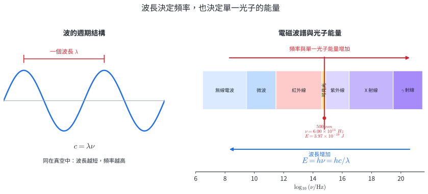{width=98%}

常用長度換算為

$$
1\ \mathrm{nm}=10^{-9}\ \mathrm m,\qquad
1\ \mathrm{\mu m}=10^{-6}\ \mathrm m.
$$

可見光約位於 $400\sim700\ \mathrm{nm}$。波長再短依序進入紫外線、X 射線與 $\gamma$ 射線；波長再長則進入紅外線、微波與無線電波。電磁波譜的名稱是波長或頻率範圍的分類，同一條關係 $c=\lambda\nu$ 適用於真空中的所有區段。

### 1.2 光子與能量量子化

電磁輻射與物質交換能量時，可以把光視為一個個光子。單一光子的能量為

$$
E=h\nu=\frac{hc}{\lambda},
$$

其中普朗克常數

$$
h=6.626\times10^{-34}\ \mathrm{J\,s}.
$$

由 $E=hc/\lambda$ 可知，短波長光子的能量較大。若題目問一莫耳光子的能量，需再乘亞佛加厥常數：

$$
E_{\mathrm{mol}}=N_A\frac{hc}{\lambda},
\qquad
N_A=6.022\times10^{23}\ \mathrm{mol^{-1}}.
$$

波的強度主要反映單位時間、單位面積到達的總能量；單一光子的能量則由頻率決定。同頻率光變亮時，主要增加到達的光子數；改變頻率時，才改變每一個光子的能量。

::: worked-example
### 示範 1｜由波長求頻率、單光子能量與莫耳光子能量

綠光波長為 $532\ \mathrm{nm}$。求頻率、單一光子能量與一莫耳光子的能量。

先把波長換成公尺：

$$
\lambda=532\times10^{-9}\ \mathrm m.
$$

頻率為

$$
\nu=\frac{c}{\lambda}
=\frac{2.998\times10^8}{532\times10^{-9}}
=5.64\times10^{14}\ \mathrm{Hz}.
$$

單一光子能量為

$$
E=h\nu
=(6.626\times10^{-34})(5.64\times10^{14})
=3.73\times10^{-19}\ \mathrm J.
$$

一莫耳光子的能量為

$$
E_{\mathrm{mol}}
=(3.73\times10^{-19})(6.022\times10^{23})
=2.25\times10^5\ \mathrm{J\,mol^{-1}}
=225\ \mathrm{kJ\,mol^{-1}}.
$$

波長落在可見光範圍，頻率與能量的數量級也相符。
:::

::: worked-example
### 示範 2｜由雷射功率求每秒光子數

一支 $2.50\ \mathrm W$ 的紅光雷射波長為 $650\ \mathrm{nm}$。假設功率全由此波長的光帶出，求每秒放出的光子數。

功率 $1\ \mathrm W=1\ \mathrm{J\,s^{-1}}$。先求單一光子能量：

$$
E_{\mathrm{photon}}
=\frac{hc}{\lambda}
=\frac{(6.626\times10^{-34})(2.998\times10^8)}
{650\times10^{-9}}
=3.06\times10^{-19}\ \mathrm J.
$$

每秒總能量為 $2.50\ \mathrm J$，所以

$$
\frac{N}{t}
=\frac{2.50\ \mathrm{J\,s^{-1}}}
{3.06\times10^{-19}\ \mathrm{J\,photon^{-1}}}
=8.18\times10^{18}\ \mathrm{photons\,s^{-1}}.
$$

光子能量在分母；相同功率下，波長越長、單光子能量越低，每秒光子數越多。
:::

### 1.3 光電效應與波粒二象性

光照射金屬表面時，頻率達到材料的**閾頻** $\nu_0$，電子才能逸出。材料把電子移出表面所需的最小能量稱為**逸出功** $\phi$：

$$
\phi=h\nu_0.
$$

一個光子的能量先支付逸出功，剩餘部分成為光電子的最大動能：

$$
h\nu=\phi+K_{\max}.
$$

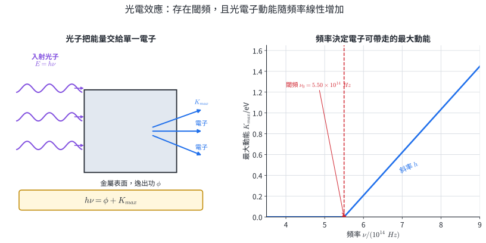{width=98%}

提高入射光強度可增加逸出電子的數量；光電子的最大動能主要隨頻率改變。閾頻與動能的線性關係支持光以離散光子交換能量。另一方面，干涉、繞射與偏振顯示光的波動性。描述實驗時需以觀測量選擇模型：

- 路徑差造成明暗相間條紋：以波的疊加描述。
- 單一光子交付能量、存在閾頻：以粒子與能量量子描述。
- 同一束光可以在不同實驗中呈現兩類證據，稱為波粒二象性。

::: worked-example
### 示範 3｜逸出功、閾波長與光電子動能

某金屬的逸出功為 $2.20\ \mathrm{eV}$。取 $hc=1240\ \mathrm{eV\,nm}$。

1. 求能引發光電效應的最長波長。
2. 以 $400\ \mathrm{nm}$ 光照射時，求光電子最大動能。

最長波長對應光子能量剛好等於逸出功：

$$
\lambda_0=\frac{hc}{\phi}
=\frac{1240}{2.20}
=564\ \mathrm{nm}.
$$

$400\ \mathrm{nm}$ 光子的能量為

$$
E=\frac{1240}{400}=3.10\ \mathrm{eV}.
$$

所以

$$
K_{\max}=E-\phi=3.10-2.20=0.90\ \mathrm{eV}.
$$

$400\ \mathrm{nm}<564\ \mathrm{nm}$，光子能量高於門檻，結果與是否逸出的判斷一致。
:::

### 1.4 直接用途與模型邊界

光電二極體、太陽能電池與相機感光元件都把入射光轉成電子訊號；材料的能量門檻決定可偵測的波段。紅外線熱像、微波通訊、紫外光譜與 X 射線成像使用不同頻率的電磁波，核心差異仍可由波長、頻率與光子能量連接。

光子模型能處理能量交換與光電效應；波模型能處理干涉與繞射。兩個模型各自對應可觀測證據，合併後才能完整描述光。

### 練習 1

1. 黃光波長為 $600\ \mathrm{nm}$，求頻率與單光子能量。
2. 比較 $300\ \mathrm{nm}$ 與 $600\ \mathrm{nm}$ 光子的能量比 $E_{300}:E_{600}$。
3. 一個 $2.00\ \mathrm{mJ}$、波長 $500\ \mathrm{nm}$ 的光脈衝含多少個光子？
4. 某金屬逸出功為 $2.50\ \mathrm{eV}$。求閾波長；以 $400\ \mathrm{nm}$ 光照射時求 $K_{\max}$。取 $hc=1240\ \mathrm{eV\,nm}$。
5. 分別指出下列觀測直接支持的模型，並寫出關鍵觀測量：
   1. 單色光通過雙狹縫後形成規律明暗條紋。
   2. 低於某一頻率的光即使增強，金屬仍沒有光電子逸出。

### 練習 1 解析

1. 

   $$
   \nu=\frac{2.998\times10^8}{600\times10^{-9}}
   =5.00\times10^{14}\ \mathrm{Hz},
   $$

   $$
   E=h\nu=(6.626\times10^{-34})(5.00\times10^{14})
   =3.31\times10^{-19}\ \mathrm J.
   $$

2. $E\propto1/\lambda$，所以

   $$
   E_{300}:E_{600}=\frac1{300}:\frac1{600}=2:1.
   $$

3. 單光子能量

   $$
   E=\frac{hc}{\lambda}
   =3.97\times10^{-19}\ \mathrm J.
   $$

   光子數

   $$
   N=\frac{2.00\times10^{-3}}{3.97\times10^{-19}}
   =5.03\times10^{15}.
   $$

4. 

   $$
   \lambda_0=\frac{1240}{2.50}=496\ \mathrm{nm}.
   $$

   $400\ \mathrm{nm}$ 光子能量為 $1240/400=3.10\ \mathrm{eV}$，所以

   $$
   K_{\max}=3.10-2.50=0.60\ \mathrm{eV}.
   $$

5. 雙狹縫明暗條紋由路徑差與疊加形成，直接支持波動模型；閾頻顯示能量以單一光子 $h\nu$ 交付，直接支持粒子與量子化模型。

## 2. 原子光譜與波耳的氫原子模型

### 2.1 連續光譜與原子線光譜

把光源經狹縫準直，再利用稜鏡或光柵依波長分開，偵測器上的位置對應波長，亮度對應該波長的相對強度。

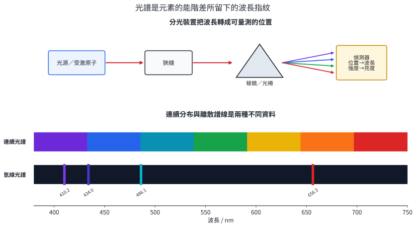{width=98%}

**連續光譜**在一段波長範圍內連續出現；高溫緻密物體常形成近似連續的熱輻射光譜。**線光譜**只在特定波長出現亮線或暗線：

- 原子先由吸收能量進入較高能量狀態。
- 電子回到較低能量狀態時，原子放出光子。
- 能階差只取特定值，因此光子能量與波長也只取特定值。

若上、下能階能量分別為 $E_i$ 與 $E_f$，放光時

$$
E_i>E_f,\qquad
E_{\mathrm{photon}}=E_i-E_f=\frac{hc}{\lambda}.
$$

吸收光時，原子取得相同大小的能量：

$$
E_f-E_i=\frac{hc}{\lambda},\qquad E_f>E_i.
$$

每種元素的能階組合不同，線光譜位置可作元素指紋。觀測混合樣品的譜線時，可把每條線與已知元素的譜線位置比對；強度會受濃度、溫度與儀器條件影響，元素鑑別優先使用波長位置。

### 2.2 氫原子的芮得柏方程式

氫原子譜線可由

$$
\frac1\lambda
=R_H\left(\frac1{n_f^2}-\frac1{n_i^2}\right),
\qquad n_i>n_f
$$

描述，其中

$$
R_H=1.097\times10^7\ \mathrm{m^{-1}}.
$$

$n_i$ 是放光前的較高能階，$n_f$ 是放光後的較低能階。依共同終態分類：

| 系列 | $n_f$ | 主要波段 |
|---|---:|---|
|來曼系|1|紫外線|
|巴耳末系|2|第一至第四條位於可見光，系列極限在近紫外|
|帕申系|3|紅外線|

同一系列中，$n_i$ 越大，$1/n_i^2$ 越小，波數 $1/\lambda$ 越大，波長越短。系列最長波長來自相鄰能階 $n_i=n_f+1$；系列最短波長是 $n_i\to\infty$ 的極限。

::: worked-example
### 示範 4｜由量子數求氫原子譜線波長

求氫原子由 $n_i=4$ 降到 $n_f=2$ 所放出光的波長，並判斷波段。

$$
\frac1\lambda
=(1.097\times10^7)
\left(\frac1{2^2}-\frac1{4^2}\right)
=(1.097\times10^7)\frac3{16}.
$$

所以

$$
\lambda=4.86\times10^{-7}\ \mathrm m=486\ \mathrm{nm}.
$$

終態 $n_f=2$，屬巴耳末系；$486\ \mathrm{nm}$ 落在可見光範圍。
:::

::: worked-example
### 示範 5｜巴耳末系的最長與最短波長

巴耳末系固定 $n_f=2$。最長波長對應最小能階差，即 $n_i=3$：

$$
\frac1{\lambda_{\max}}
=R_H\left(\frac14-\frac19\right)
=R_H\frac5{36},
$$

$$
\lambda_{\max}=656\ \mathrm{nm}.
$$

最短波長對應 $n_i\to\infty$：

$$
\frac1{\lambda_{\min}}
=R_H\left(\frac14-0\right),
\qquad
\lambda_{\min}=365\ \mathrm{nm}.
$$

同一系列的所有譜線都落在 $365\sim656\ \mathrm{nm}$ 之間，高能階譜線逐漸靠近系列極限。
:::

### 2.3 波耳能階與能量轉移

波耳模型把氫原子的電子能量限制在離散能階：

$$
E_n=-\frac{2.18\times10^{-18}}{n^2}\ \mathrm{J\,atom^{-1}}
$$

或

$$
E_n=-\frac{1312}{n^2}\ \mathrm{kJ\,mol^{-1}}.
$$

負號表示束縛電子的能量低於電子與原子核相距無限遠的零能量基準。$n=1$ 是基態；$n>1$ 是激發態；$n\to\infty$ 對應游離極限 $E=0$。

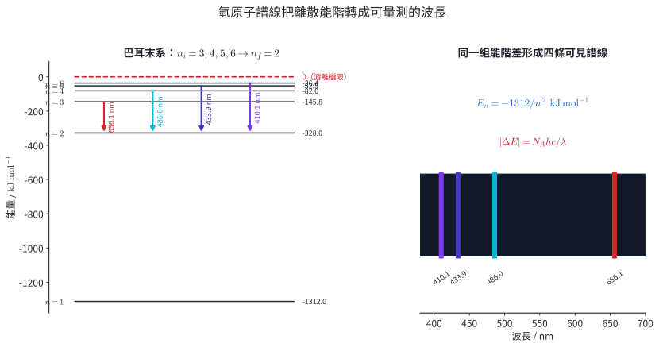{width=98%}

兩能階間的光子能量為

$$
|\Delta E|=\left|E_f-E_i\right|=\frac{N_Ahc}{\lambda}
$$

（若能量用 $\mathrm{kJ\,mol^{-1}}$），或

$$
|\Delta E|=\frac{hc}{\lambda}
$$

（若能量用 $\mathrm{J\,photon^{-1}}$）。能量單位需在代式前統一。

::: worked-example
### 示範 6｜氫原子的激發能與放光波長

一莫耳基態氫原子吸收能量後到達 $n=3$。

1. 求所需激發能。
2. 若直接由 $n=3$ 回到 $n=1$，求放出光的波長。

$$
E_1=-1312\ \mathrm{kJ\,mol^{-1}},
\qquad
E_3=-\frac{1312}{9}=-145.8\ \mathrm{kJ\,mol^{-1}}.
$$

激發需吸收

$$
\Delta E=E_3-E_1=-145.8-(-1312)=1166\ \mathrm{kJ\,mol^{-1}}.
$$

直接回到基態時放出相同大小能量：

$$
\frac1\lambda=R_H\left(1-\frac19\right),
\qquad
\lambda=102.6\ \mathrm{nm}.
$$

終態 $n=1$，屬來曼系紫外光。
:::

::: worked-example
### 示範 7｜由激發態游離氫原子

求一莫耳處於 $n=2$ 的氫原子完全游離所需最小能量與對應最長波長。

$$
E_2=-\frac{1312}{4}=-328\ \mathrm{kJ\,mol^{-1}}.
$$

游離終態為 $E_\infty=0$，所以

$$
\Delta E=0-(-328)=328\ \mathrm{kJ\,mol^{-1}}.
$$

門檻波長也可視為巴耳末系列極限：

$$
\lambda=\frac4{R_H}=365\ \mathrm{nm}.
$$

最長門檻波長對應剛好游離。
:::

### 2.4 類氫物種與模型限制

只有一個電子的 H、He$^+$、Li$^{2+}$ 等類氫物種，可把核電荷 $Z$ 納入：

$$
E_n=-\frac{1312Z^2}{n^2}\ \mathrm{kJ\,mol^{-1}},
$$

$$
\frac1\lambda
=R_HZ^2\left(\frac1{n_f^2}-\frac1{n_i^2}\right).
$$

核電荷增加時，同一組 $n_i\to n_f$ 的能階差乘 $Z^2$，波長除以 $Z^2$。

::: worked-example
### 示範 8｜He$^+$ 與 H 的同型轉移

H 原子 $4\to2$ 譜線約為 $486\ \mathrm{nm}$。He$^+$ 的 $Z=2$，能階差為氫的 $Z^2=4$ 倍，因此

$$
\lambda_{\mathrm{He^+}}
=\frac{\lambda_{\mathrm H}}4
=121.5\ \mathrm{nm}.
$$

能量增加四倍，波長縮短為四分之一，位於紫外線範圍。
:::

波耳模型能準確處理氫與類氫物種的能階與譜線；多電子原子還有電子間排斥、遮蔽與不同軌域穿透程度，需要原子軌域與量子力學模型。

### 2.5 光譜鑑別與焰色資料

金屬鹽受熱時，部分電子先吸收能量，再由較高能階回到較低能階並放光。肉眼看到的焰色是多條可見譜線合成的顏色；分光後的譜線位置能提供更精細的元素鑑別。

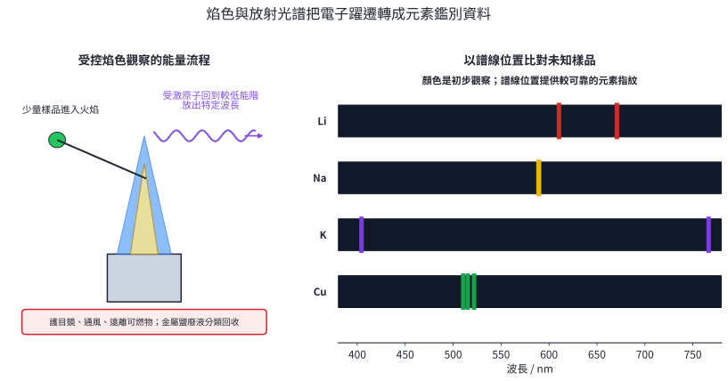{width=98%}

焰色觀察涉及明火、熱器材與金屬鹽。實驗應在通風實驗室以少量樣品進行，配戴護目鏡與實驗衣，長髮束起並清除周圍可燃物；含銅等金屬鹽的殘液與器材清洗液依實驗室標示分類回收。紀錄分成兩層：

- 觀察：火焰顏色、譜線波長與相對亮度。
- 推論：由已知譜線比對可能存在的元素。

這種方法用於煙火配色、放射光譜分析、恆星元素辨識與路燈光源鑑別。元素濃度的定量分析還需要校正曲線、背景扣除與儀器控制，本節先處理譜線位置與能階差的連結。

### 練習 2

1. 求氫原子 $n_i=5\to n_f=2$ 的波長與所屬系列。
2. 氫原子由 $n=4$ 激發態可以經所有可能路徑回到基態。若只計不同能階對應的不同譜線，最多可出現幾條？
3. 比較氫原子來曼系第一條譜線與巴耳末系第一條譜線的波數比 $(1/\lambda_L):(1/\lambda_B)$。
4. 求氫原子 $n=3$ 與 $n=2$ 能階差，以 $\mathrm{kJ\,mol^{-1}}$ 表示。
5. He$^+$ 由 $n=3$ 降到 $n=2$ 的波長與 H 原子相同轉移的波長比為何？
6. 某未知樣品的譜線含 $589.0\ \mathrm{nm}$、$589.6\ \mathrm{nm}$ 與 $670.8\ \mathrm{nm}$。參照圖 5 判斷可能含哪些元素，並說明譜線位置與火焰顏色兩種證據的角色。

### 練習 2 解析

1. 

   $$
   \frac1\lambda=R_H\left(\frac14-\frac1{25}\right),
   \qquad
   \lambda=434\ \mathrm{nm}.
   $$

   終態為 $n_f=2$，屬巴耳末系。

2. 四個能階中任取兩個作一組能階差：

   $$
   \binom42=\frac{4(3)}2=6.
   $$

3. 來曼系第一條為 $2\to1$，波數為 $3R_H/4$；巴耳末系第一條為 $3\to2$，波數為 $5R_H/36$。所以

   $$
   \frac1{\lambda_L}:\frac1{\lambda_B}
   =\frac34:\frac5{36}=27:5.
   $$

4. 

   $$
   |E_3-E_2|
   =\left|-\frac{1312}{9}+\frac{1312}{4}\right|
   =182\ \mathrm{kJ\,mol^{-1}}.
   $$

5. 類氫物種相同轉移的波數與 $Z^2$ 成正比。He$^+$ 的 $Z=2$，所以

   $$
   \lambda_{\mathrm{He^+}}:\lambda_{\mathrm H}=1:4.
   $$

6. $589.0$ 與 $589.6\ \mathrm{nm}$ 對應 Na，$670.8\ \mathrm{nm}$ 對應 Li，因此樣品可能同時含 Na 與 Li。譜線位置是較具辨識力的元素指紋；火焰顏色可作快速初篩，但混合顏色與強線遮蔽會降低辨識度。

## 3. 原子軌域

### 3.1 軌域與四個量子數

電子具有波動性。量子力學以波函數描述電子狀態，波函數平方所對應的機率密度可預測電子在空間各處出現的相對可能性。**原子軌域**是一組允許的電子空間狀態，由三個量子數 $n,l,m_l$ 指定；第四個自旋量子數 $m_s$ 指定電子的自旋狀態。

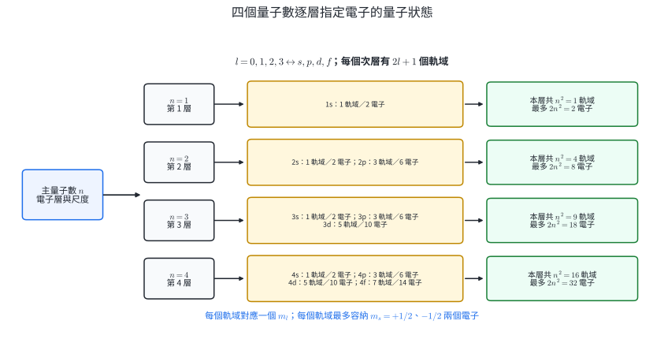{width=98%}

四個量子數的允許值與意義如下。

|量子數|符號|允許值|主要意義|
|---|---|---|---|
|主量子數|$n$|$1,2,3,\ldots$|電子層、軌域尺度與主要能量|
|角量子數|$l$|$0,1,\ldots,n-1$|次層與軌域形狀；$0,1,2,3\leftrightarrow s,p,d,f$|
|磁量子數|$m_l$|$-l,-l+1,\ldots,0,\ldots,l$|同一次層內的軌域方向|
|自旋量子數|$m_s$|$+\frac12$ 或 $-\frac12$|電子的兩種自旋狀態|

對固定的 $l$，$m_l$ 從 $-l$ 到 $+l$，共有

$$
2l+1
$$

個軌域。每個軌域最多容納兩個自旋相反的電子，因此各次層容量為

$$
2(2l+1).
$$

|次層|$l$|軌域數|最大電子數|
|---|---:|---:|---:|
|s|0|1|2|
|p|1|3|6|
|d|2|5|10|
|f|3|7|14|

第 $n$ 層的總軌域數可由

$$
\sum_{l=0}^{n-1}(2l+1)=n^2
$$

得到，最大電子數為 $2n^2$。

::: worked-example
### 示範 9｜第 4 電子層的次層、軌域與容量

$n=4$ 時

$$
l=0,1,2,3,
$$

所以次層為 $4s,4p,4d,4f$。各次層軌域數為

$$
1,\ 3,\ 5,\ 7.
$$

總軌域數

$$
1+3+5+7=16=4^2.
$$

每軌域最多兩電子，因此最大電子數

$$
2(16)=32=2(4^2).
$$
:::

::: worked-example
### 示範 10｜判斷一組量子數是否允許

判斷下列四數組能否描述原子中的一個電子：

1. $(n,l,m_l,m_s)=(3,2,-1,+\frac12)$
2. $(3,3,0,-\frac12)$
3. $(2,1,2,+\frac12)$

第一組：$n=3$ 時 $l$ 可為 $0,1,2$；$l=2$ 時 $m_l$ 可為 $-2$ 到 $+2$，且 $m_s=+\frac12$，全部符合。

第二組：$n=3$ 時 $l$ 的最大值為 $n-1=2$，所以 $l=3$ 超出允許範圍。

第三組：$l=1$ 時 $m_l$ 只可為 $-1,0,+1$，所以 $m_l=2$ 超出允許範圍。

判斷順序為 $n\to l\to m_l\to m_s$，每一步的允許範圍由前一個量子數決定。
:::

### 3.2 軌域形狀、機率邊界面與節面

軌域圖常畫出約包住 $90\%$ 電子出現機率的**邊界面**。邊界面的大小與形狀是機率分布的摘要：

- s 軌域呈球形；同為 s 軌域時，主量子數增加，平均尺度增加。
- p 軌域有兩個葉瓣，三個方向分別記為 $p_x,p_y,p_z$。
- p 軌域通過原子核有一個角節面，該平面上的機率密度為零。
- 圖中的兩種顏色表示波函數相位。

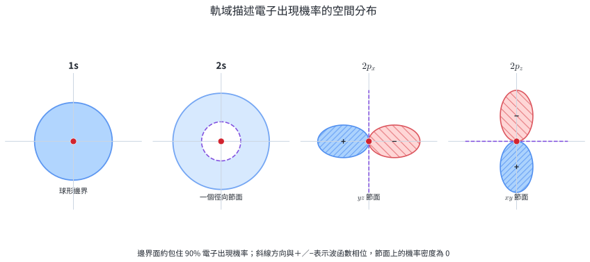{width=98%}

一個電子在軌域中的狀態延伸於空間；邊界面提供高機率區域與節面位置，適合用來解釋化學鍵的方向性與軌域重疊。

::: worked-example
### 示範 11｜由量子數辨認軌域

某電子的量子數為 $n=3,l=1,m_l=0$。

$n=3$ 表示第三電子層；$l=1$ 表示 p 次層，因此屬 $3p$ 軌域。$m_l=0$ 指定三個 $3p$ 軌域中的一個方向狀態。它具有 p 軌域的兩葉瓣與一個通過原子核的角節面。

自旋量子數尚未給定，所以此軌域可配合 $m_s=+\frac12$ 或 $-\frac12$ 描述兩種電子狀態。
:::

### 3.3 單電子與多電子原子的軌域能量

氫與類氫物種只有一個電子，軌域能量主要由 $n$ 決定，因此同一 $n$ 的 $s,p,d$ 軌域等能：

$$
2s=2p,\qquad 3s=3p=3d.
$$

多電子原子中，電子間排斥、遮蔽與穿透能力使同一 $n$ 的次層分裂。常用的基態填入順序可由 $n+l$ 規則整理：

1. $n+l$ 較小者能量較低。
2. $n+l$ 相同時，$n$ 較小者能量較低。

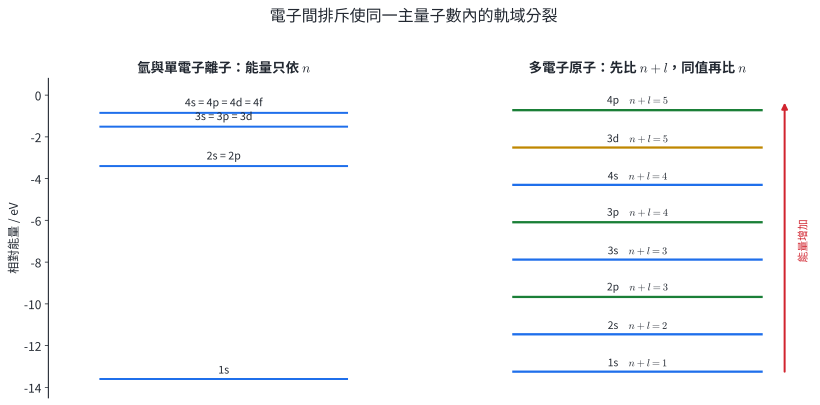{width=98%}

常見順序為

$$
1s<2s<2p<3s<3p<4s<3d<4p<5s<4d<5p<6s<4f<5d<6p.
$$

此順序用於中性原子的基態填入。形成過渡金屬陽離子時，電子依實際外層主量子數移除，通常先移除 $4s$ 再移除 $3d$。

::: worked-example
### 示範 12｜用 $n+l$ 比較軌域能量

比較 $4s$、$3d$、$4p$ 的基態填入順序。

|軌域|$n+l$|排序鍵|
|---|---:|---|
|$4s$|$4+0=4$|$(4,4)$|
|$3d$|$3+2=5$|$(5,3)$|
|$4p$|$4+1=5$|$(5,4)$|

$4s$ 的 $n+l$ 最小，先填入。$3d$ 與 $4p$ 的 $n+l$ 同為 5，再比較 $n$，所以

$$
4s<3d<4p.
$$
:::

### 3.4 直接用途

量子數與軌域可預測每個次層的容量、電子組態與未成對電子數；軌域方向與節面進一步決定原子間能否有效重疊。光譜計算、磁性材料、化學鍵方向、分子軌域與量子化學計算都以相同的量子狀態描述為基礎。

### 練習 3

1. $n=5$ 時，$l$ 有哪些允許值？共有多少個軌域？最多容納多少電子？
2. $4d$ 次層的 $n,l$ 為何？$m_l$ 有哪些值？最多容納多少電子？
3. 判斷下列四數組是否允許，並指出第一個超出範圍的量子數：
   1. $(4,3,-3,-\frac12)$
   2. $(2,0,1,+\frac12)$
   3. $(1,0,0,+\frac12)$
4. 一個 p 次層有多少個軌域？每個軌域在空間方向與最大電子數上有何差異與共同點？
5. 依 $n+l$ 規則排列 $5s$、$4d$、$5p$、$6s$ 的能量高低。
6. 分別說明 H 原子與多電子原子中 $3s$、$3p$、$3d$ 的能量關係。

### 練習 3 解析

1. $l=0,1,2,3,4$。第 5 層共有

   $$
   n^2=25
   $$

   個軌域，最多容納 $2n^2=50$ 個電子。

2. $4d$ 表示 $n=4,l=2$。所以

   $$
   m_l=-2,-1,0,+1,+2,
   $$

   共 5 個軌域，最多容納 10 個電子。

3. 第一組允許。第二組的 $l=0$ 時只能有 $m_l=0$，所以 $m_l=1$ 超出範圍。第三組允許。

4. p 次層的 $l=1$，所以有 $2l+1=3$ 個軌域。三者方向不同，常記為 $p_x,p_y,p_z$；能量在無外場、同一原子同一次層中相同，每個軌域最多容納兩個自旋相反電子。

5. 排序鍵為

   $$
   5s:(5,5),\quad4d:(6,4),\quad5p:(6,5),\quad6s:(6,6),
   $$

   所以

   $$
   5s<4d<5p<6s.
   $$

6. H 原子只有一個電子，能量只依 $n$，所以 $3s=3p=3d$。多電子原子受穿透、遮蔽與電子間排斥影響，常見關係為 $3s<3p<3d$。

## 4. 電子組態

### 4.1 電子組態與軌域圖

**電子組態**用各軌域的電子數表示原子或離子的電子分布。例如氧原子的

$$
1s^22s^22p^4
$$

表示 1s、2s、2p 次層分別有 2、2、4 個電子。上標總和必須等於物種的電子總數。

**軌域圖**用方框代表軌域、箭頭代表電子；箭頭方向代表 $m_s=+\frac12$ 或 $-\frac12$。基態排法由三項原則共同決定。

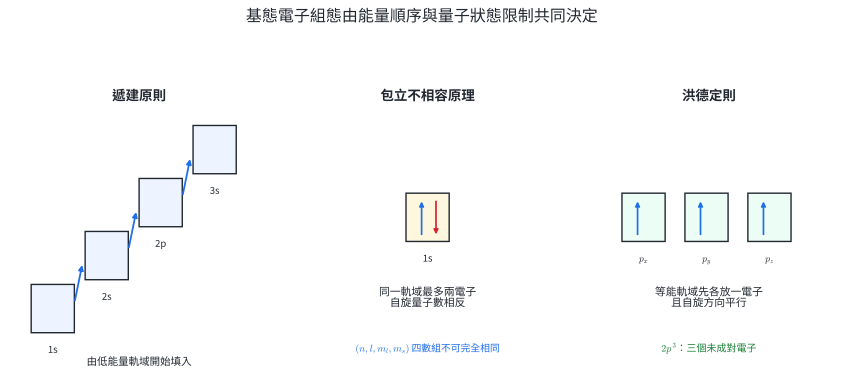{width=98%}

1. **遞建原則**：電子先填入能量較低的軌域。
2. **包立不相容原理**：同一原子中任兩電子的四個量子數不完全相同；同一軌域最多兩電子且自旋相反。
3. **洪德定則**：同一次層的等能軌域先各放一個自旋平行電子，再開始成對。

::: worked-example
### 示範 13｜氧原子的組態、軌域圖與未成對電子

氧的原子序為 8，共有 8 個電子：

$$
\mathrm O:1s^22s^22p^4.
$$

2p 有三個等能軌域。先各放一電子，再把第四個電子配對：

$$
2p:\quad [\uparrow\downarrow]\ [\uparrow]\ [\uparrow].
$$

因此氧原子有 2 個未成對電子。具有未成對電子的原子或離子呈順磁性，會受到外加磁場吸引。
:::

::: worked-example
### 示範 14｜磷原子的簡寫組態與價電子

磷的原子序為 15。完整組態與惰性氣體簡寫為

$$
1s^22s^22p^63s^23p^3=[Ne]3s^23p^3.
$$

最高主量子數為 $n=3$，所以位於第三週期。主族元素的價電子為最外層 $ns$、$np$ 電子，共 $2+3=5$ 個，因此位於第 15 族。$3p^3$ 依洪德定則分占三軌域，所以有 3 個未成對電子。
:::

### 4.2 週期表區塊、週期與族

次層容量 $s^2,p^6,d^{10},f^{14}$ 決定週期表各區塊的寬度。

{width=98%}

- 最高被占用的主量子數通常對應週期。
- 最後填入 s、p、d、f 次層，分別對應 s、p、d、f 區。
- 主族元素價電子組態可寫為 $ns^a np^b$；第 1、2 族為 s 區，第 13–18 族為 p 區。
- 過渡元素的化學行為同時涉及 $(n-1)d$ 與 $ns$ 電子，族的判斷需合看兩個次層。

第四週期的基態中性原子常寫成 $[Ar]4s^23d^x$ 或依次層排列寫成 $[Ar]3d^x4s^2$。Cr 與 Cu 的常見基態例外為

$$
\mathrm{Cr}:[Ar]3d^54s^1,
\qquad
\mathrm{Cu}:[Ar]3d^{10}4s^1.
$$

半滿 $d^5$ 與全滿 $d^{10}$ 排列的總能量較鄰近的簡單遞建預測低，實際組態以實驗結果為準。

::: worked-example
### 示範 15｜由組態反推元素位置

某基態原子的簡寫組態為

$$
[Ar]3d^{10}4s^24p^3.
$$

電子總數為

$$
18+10+2+3=33,
$$

所以元素是 As。最高 $n=4$，位於第四週期；最後填入 4p，屬 p 區；最外層 $4s^24p^3$ 有 5 個價電子，位於第 15 族。

$4p^3$ 有 3 個未成對電子，因此基態原子呈順磁性。
:::

### 4.3 離子組態與電子移除順序

寫離子組態先核對電子總數：

$$
N_e=Z-\text{正電荷數}
$$

或

$$
N_e=Z+\text{負電荷數}.
$$

主族陽離子通常失去最高主量子數的價電子；主族陰離子則把電子加入最低可用的價軌域。過渡金屬成陽離子時，先移除最高 $n$ 的 $ns$ 電子，再移除 $(n-1)d$ 電子。

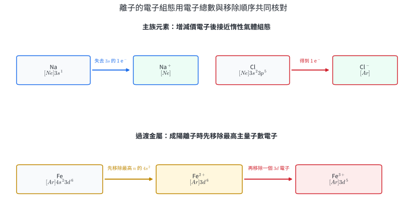{width=98%}

::: worked-example
### 示範 16｜Fe$^{2+}$、Fe$^{3+}$ 的組態與未成對電子

Fe 的原子序為 26：

$$
\mathrm{Fe}:[Ar]3d^64s^2.
$$

形成 Fe$^{2+}$ 時先移除兩個 $4s$ 電子：

$$
\mathrm{Fe^{2+}}:[Ar]3d^6.
$$

五個 d 軌域先各放一電子，第六個開始配對，因此 $3d^6$ 有 4 個未成對電子。

形成 Fe$^{3+}$ 時再移除一個 $3d$ 電子：

$$
\mathrm{Fe^{3+}}:[Ar]3d^5.
$$

$3d^5$ 五個軌域各有一個電子，所以有 5 個未成對電子。兩者皆呈順磁性。
:::

閉殼層或所有電子都成對的物種呈抗磁性。磁性判斷需以軌域圖計數未成對電子。

### 4.4 直接用途

電子組態可直接連到元素位置、常見離子、未成對電子與磁性。過渡金屬離子的 d 電子數會影響顏色、磁性與催化反應；主族價電子數則是預測離子電荷與化學鍵數目的第一層依據。

### 練習 4

1. 寫出 N、Al、Ca 的完整電子組態與惰性氣體簡寫。
2. 畫出 C、N、O 的 2p 軌域圖，分別求未成對電子數。
3. 寫出 Cr 與 Cu 的基態簡寫組態，並指出它們相對於簡單遞建預測的電子調整。
4. 寫出 Ca$^{2+}$、S$^{2-}$、Fe$^{3+}$ 的電子組態。
5. 某元素組態為 $[Kr]4d^{10}5s^25p^2$。求原子序、週期、族、區塊與價電子數。
6. 判斷 Zn$^{2+}$、Fe$^{3+}$、O$^{2-}$ 的未成對電子數與順磁／抗磁性。

### 練習 4 解析

1. 

   $$
   \mathrm N:1s^22s^22p^3=[He]2s^22p^3,
   $$

   $$
   \mathrm{Al}:1s^22s^22p^63s^23p^1=[Ne]3s^23p^1,
   $$

   $$
   \mathrm{Ca}:1s^22s^22p^63s^23p^64s^2=[Ar]4s^2.
   $$

2. C 的 $2p^2$ 為 $[\uparrow]\ [\uparrow]\ [\ ]$，有 2 個未成對電子；N 的 $2p^3$ 為 $[\uparrow]\ [\uparrow]\ [\uparrow]$，有 3 個；O 的 $2p^4$ 為 $[\uparrow\downarrow]\ [\uparrow]\ [\uparrow]$，有 2 個。

3. 

   $$
   \mathrm{Cr}:[Ar]3d^54s^1,
   \qquad
   \mathrm{Cu}:[Ar]3d^{10}4s^1.
   $$

   相較於 $3d^44s^2$ 與 $3d^94s^2$ 的簡單填入預測，各有一個 $4s$ 電子調整到 $3d$，形成半滿 $d^5$ 或全滿 $d^{10}$。

4. 

   $$
   \mathrm{Ca^{2+}}:[Ar],\qquad
   \mathrm{S^{2-}}:[Ar],\qquad
   \mathrm{Fe^{3+}}:[Ar]3d^5.
   $$

5. 電子總數 $36+10+2+2=50$，所以是 Sn。最高 $n=5$，位於第五週期；最後填入 5p，屬 p 區；最外層 $5s^25p^2$ 有 4 個價電子，位於第 14 族。

6. Zn$^{2+}$ 為 $[Ar]3d^{10}$，0 個未成對電子，呈抗磁性。Fe$^{3+}$ 為 $[Ar]3d^5$，有 5 個未成對電子，呈順磁性。O$^{2-}$ 為 $[Ne]$，全部成對，呈抗磁性。

## 5. 元素性質的週期性

### 5.1 有效核電荷、遮蔽與原子半徑

電子受到原子核的吸引，也受到其他電子的排斥與遮蔽。可用**有效核電荷** $Z_{\mathrm{eff}}$ 表示某電子實際感受到的淨核吸引：

$$
Z_{\mathrm{eff}}\approx Z-S,
$$

其中 $Z$ 是核電荷，$S$ 代表其他電子造成的遮蔽效果。此式是定性模型；週期趨勢主要比較電子層數與有效核吸引。

**原子半徑**常由相鄰同種原子核間距的一半定義。主要趨勢為：

- 同週期由左至右：電子加入同一主電子層，核電荷增加而遮蔽增加較少，$Z_{\mathrm{eff}}$ 上升，半徑整體減小。
- 同族由上至下：新增主電子層，外層電子離核更遠且遮蔽增加，半徑增大。
- 同一元素：形成陽離子後電子數減少、排斥降低，有時還失去整層，半徑縮小；形成陰離子後電子排斥增加，半徑增大。

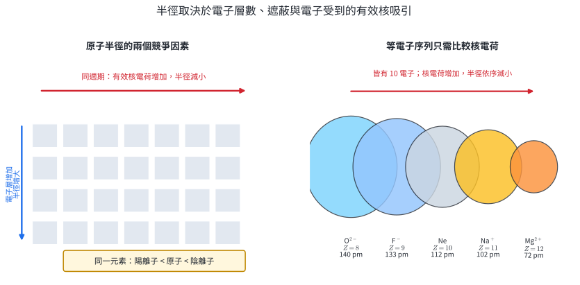{width=98%}

等電子物種具有相同電子數與相近電子組態。此時電子層與遮蔽大致相同，核電荷較大的物種把相同電子雲拉得更緊：

$$
\mathrm{O^{2-}>F^->Ne>Na^+>Mg^{2+}}.
$$

::: worked-example
### 示範 17｜半徑排序的比較步驟

排列 Na、Mg、Na$^+$、Mg$^{2+}$ 的半徑大小。

Na 與 Mg 同在第三週期。Mg 的核電荷較大，價電子仍在 $n=3$，所以

$$
r(\mathrm{Na})>r(\mathrm{Mg}).
$$

Na$^+$ 與 Mg$^{2+}$ 都有 10 個電子。Mg$^{2+}$ 的核電荷較大，所以

$$
r(\mathrm{Na^+})>r(\mathrm{Mg^{2+}}).
$$

中性 Na、Mg 的最外層為 $n=3$；兩個陽離子的最外層已降至 $n=2$。綜合得

$$
\mathrm{Na>Mg>Na^+>Mg^{2+}}.
$$
:::

### 5.2 游離能與逐次游離能

氣態基態原子失去一個電子形成氣態一價陽離子所需的最小能量，稱為**第一游離能**：

$$
\mathrm{X(g)\rightarrow X^+(g)+e^-},
\qquad IE_1>0.
$$

再依序移除電子可定義 $IE_2,IE_3,\ldots$。正離子對剩餘電子的吸引逐步增強，因此同一元素通常有

$$
IE_1<IE_2<IE_3<\cdots.
$$

當所有價電子移除後，下一次需移除內層電子，游離能會出現大幅躍升。最大躍升前已移除的電子數，可用來判斷主族元素的價電子數。

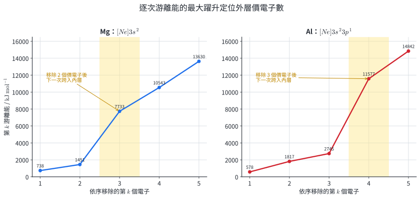{width=98%}

::: worked-example
### 示範 18｜由逐次游離能判斷價電子與族

某第三週期元素的前五次游離能為

$$
738,\ 1451,\ 7733,\ 10543,\ 13630
\ \mathrm{kJ\,mol^{-1}}.
$$

$IE_2$ 到 $IE_3$ 的比值約為 $7733/1451=5.33$，遠大於其他相鄰比值，表示移除兩個價電子後，第三次開始移除內層電子。因此此元素有 2 個價電子，第三週期對應 Mg：

$$
\mathrm{Mg}:[Ne]3s^2.
$$

它位於第 2 族，常形成 Mg$^{2+}$。
:::

### 5.3 第一游離能的週期趨勢與局部例外

第一游離能的主要趨勢與原子半徑相反：

- 同週期由左至右：$Z_{\mathrm{eff}}$ 整體增加、半徑縮小，移除電子所需能量整體增加。
- 同族由上至下：電子層與遮蔽增加、半徑增大，第一游離能整體降低。

實際曲線呈鋸齒狀，局部組態會改變比較結果。

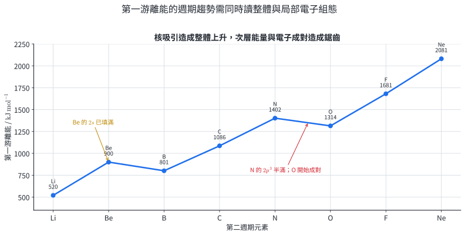{width=98%}

第二週期兩組常見局部關係為

$$
IE_1(\mathrm{Be})>IE_1(\mathrm B),
$$

因 B 被移除的是能量較高的 $2p$ 電子，而 Be 被移除的是已填滿 $2s$ 次層中的電子；

$$
IE_1(\mathrm N)>IE_1(\mathrm O),
$$

因 N 的 $2p^3$ 三軌域各有一電子，O 的 $2p^4$ 開始出現成對電子，成對排斥使其中一電子較易移除。

::: worked-example
### 示範 19｜同週期游離能排序

排列 B、Be、C、N、O 的第一游離能。

第二週期整體由左至右上升，但需納入

$$
IE_1(\mathrm B)<IE_1(\mathrm{Be}),
\qquad
IE_1(\mathrm O)<IE_1(\mathrm N).
$$

依實際相對位置可得

$$
\mathrm{B<Be<C<O<N}.
$$

先建立週期整體趨勢，再用 $2s/2p$ 能量與 $2p$ 成對情形修正局部位置。
:::

### 5.4 電負度與鍵極性

**電負度**描述原子在化學鍵中吸引共享電子的相對能力。它是成鍵情境中的相對尺度：

- 同週期由左至右整體增加。
- 同族由上至下整體降低。
- F 的電負度最大；惰性氣體通常沒有列出一般成鍵用的電負度值。

兩個成鍵原子的電負度不同時，鍵電子偏向電負度較大的一端，形成部分負電 $\delta^-$；另一端形成部分正電 $\delta^+$。

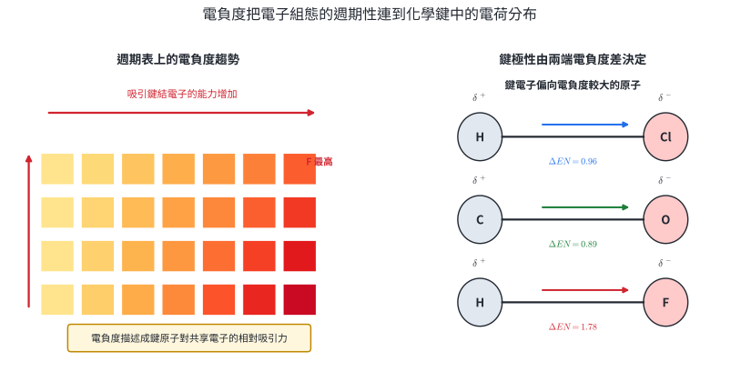{width=98%}

::: worked-example
### 示範 20｜由電負度判斷鍵極性

已知

$$
\chi_{\mathrm H}=2.20,\quad
\chi_{\mathrm C}=2.55,\quad
\chi_{\mathrm O}=3.44,\quad
\chi_{\mathrm F}=3.98.
$$

$$
\Delta\chi_{\mathrm{C-H}}=0.35,\qquad
\Delta\chi_{\mathrm{C-O}}=0.89,\qquad
\Delta\chi_{\mathrm{H-F}}=1.78.
$$

鍵極性大小為

$$
\mathrm{H-F>C-O>C-H}.
$$

電子偏移方向分別指向 F、O 與 C。電負度差可比較鍵內電荷偏移；整個分子的極性還需合併所有鍵偶極與分子幾何。
:::

### 5.5 直接用途與性質推論鏈

$$
\text{核電荷與電子組態}
\longrightarrow
\text{電子層、遮蔽、}Z_{\mathrm{eff}}
\longrightarrow
\text{半徑與電子束縛}
\longrightarrow
\text{游離能、電負度與成鍵傾向}.
$$

半徑資料用於晶體結構與離子配位分析；游離能資料能反推價電子數並解釋形成陽離子的難易；電負度則用來預測鍵極性、反應位點與分子間作用的方向。週期趨勢提供第一層預測，實際數值仍會受次層填排、電子成對與化學環境影響。

### 練習 5

1. 排列 Na、Al、Cl 的原子半徑，並用同週期有效核電荷解釋。
2. 排列 O$^{2-}$、F$^-$、Na$^+$、Mg$^{2+}$ 的半徑。
3. 某元素的逐次游離能在 $IE_3$ 與 $IE_4$ 之間出現最大躍升。若它位於第三週期，判斷元素、價電子組態與常見陽離子。
4. 比較 Mg、Al、Si 的第一游離能，寫出局部例外與原因。
5. 依週期趨勢比較 C、N、O、F 的電負度，並判斷 C–F 鍵的部分電荷方向。
6. X、Y 同在第三週期，X 的原子半徑較大、第一游離能較小、電負度較小。比較兩者在週期表中的相對左右位置，並說明三項性質如何由同一原因連接。

### 練習 5 解析

1. 三者同在第三週期，核電荷由 Na 到 Al 到 Cl 增加，電子仍加入 $n=3$，有效核吸引整體增加，所以

   $$
   \mathrm{Na>Al>Cl}.
   $$

2. 四者都有 10 個電子。核電荷依序為 8、9、11、12，核電荷越大半徑越小：

   $$
   \mathrm{O^{2-}>F^->Na^+>Mg^{2+}}.
   $$

3. 最大躍升在移除 3 個電子後，表示有 3 個價電子。第三週期對應 Al：

   $$
   [Ne]3s^23p^1,
   $$

   常形成 Al$^{3+}$。

4. Al 被移除的是能量較高的 $3p$ 電子，Mg 被移除的是 $3s$ 電子，所以

   $$
   IE_1(\mathrm{Al})<IE_1(\mathrm{Mg})<IE_1(\mathrm{Si}).
   $$

5. 同週期由左至右電負度增加：

   $$
   \mathrm{C<N<O<F}.
   $$

   C–F 鍵電子偏向 F，所以 C 端為 $\delta^+$、F 端為 $\delta^-$。

6. X 位於 Y 的左側。同週期向右，核電荷增加且遮蔽增加較少，$Z_{\mathrm{eff}}$ 上升，使半徑縮小、電子較難移除且成鍵時吸引電子較強；因此 Y 的半徑較小、第一游離能與電負度較大。

## 6. 核心整理

### 6.1 光與能階

$$
c=\lambda\nu,
\qquad
E=h\nu=\frac{hc}{\lambda}.
$$

短波長代表高頻率與高單光子能量。干涉、繞射支持波動模型；光電效應的閾頻與 $K_{\max}=h\nu-\phi$ 支持光子能量量子化。

原子線光譜來自離散能階差：

$$
|\Delta E|=\frac{hc}{\lambda}.
$$

氫原子

$$
E_n=-\frac{1312}{n^2}\ \mathrm{kJ\,mol^{-1}},
$$

$$
\frac1\lambda
=R_H\left(\frac1{n_f^2}-\frac1{n_i^2}\right).
$$

類氫物種的能階差與波數再乘 $Z^2$。

### 6.2 軌域與組態

$$
l=0,\ldots,n-1,
\qquad
m_l=-l,\ldots,+l,
\qquad
m_s=\pm\frac12.
$$

每次層有 $2l+1$ 個軌域，最多容納 $2(2l+1)$ 個電子；第 $n$ 層有 $n^2$ 個軌域，最多 $2n^2$ 個電子。

基態組態同時遵守遞建原則、包立不相容原理與洪德定則。離子先核對電子總數；過渡金屬陽離子先移除最高 $n$ 的 $ns$ 電子。

### 6.3 週期性

- 同週期向右：$Z_{\mathrm{eff}}$ 整體增加，半徑減小，第一游離能與電負度整體增加。
- 同族向下：電子層與遮蔽增加，半徑增大，第一游離能與電負度整體降低。
- 等電子物種：核電荷越大，半徑越小。
- 逐次游離能的大躍升：定位已移除的價電子數。
- 游離能局部例外：用次層能量、半滿與電子成對解釋。

## 7. 章末分層題

### 基礎題

1. 藍光波長為 $450\ \mathrm{nm}$。求頻率與單一光子能量。
2. 兩束單色光波長分別為 $300\ \mathrm{nm}$、$750\ \mathrm{nm}$。比較單光子能量比，並判斷哪一束頻率較高。
3. 求氫原子 $n_i=5\to n_f=2$ 譜線的波長與波段。
4. 判斷下列量子數組合能否存在：
   1. $(3,1,-1,+\frac12)$
   2. $(3,3,0,-\frac12)$
   3. $(4,2,+3,+\frac12)$
5. 第 3 電子層共有多少軌域、最多容納多少電子？$3d$ 次層有多少軌域？
6. 寫出 S 原子的惰性氣體簡寫組態、3p 軌域圖與未成對電子數。

### 應用題

7. 已知元素 A 的放射譜線為 $410.2,434.0,486.1,656.3\ \mathrm{nm}$；元素 B 的譜線為 $404.4,766.5\ \mathrm{nm}$。混合樣品出現 $410.2,434.0,486.1,656.3,766.5\ \mathrm{nm}$。判斷樣品含哪些元素，並說明缺少 $404.4\ \mathrm{nm}$ 是否足以排除 B。
8. 一個 H 原子先被激發到 $n=4$，之後經所有可能路徑回到 $n=1$。最多可產生幾條不同譜線？其中終態為 $n=2$ 的譜線有幾條？
9. 某主族元素前五次游離能為 $496,4562,6910,9543,13354\ \mathrm{kJ\,mol^{-1}}$。判斷價電子數、所屬族與最可能形成的單原子離子電荷。
10. 排列 O$^{2-}$、F$^-$、Ne、Na$^+$、Mg$^{2+}$ 的半徑，並寫出排序依據。
11. 某基態原子的電子組態為 $[Ar]3d^{10}4s^24p^2$。求元素、週期、族、區塊、價電子數與未成對電子數。
12. 某金屬逸出功為 $2.30\ \mathrm{eV}$。求閾波長；以 $350\ \mathrm{nm}$ 光照射時，求光電子最大動能。取 $hc=1240\ \mathrm{eV\,nm}$。

### 跨節整合題

13. 天文光譜中觀測到一條 $486.1\ \mathrm{nm}$ 譜線。
    1. 以芮得柏方程式判斷它對應氫原子的哪一個巴耳末轉移。
    2. 求單一光子能量與一莫耳光子的能量。
    3. 說明為何譜線位置可辨識元素，而譜線強度還需另外校正。
14. 元素 X 的前四次游離能為 $578,1817,2745,11577\ \mathrm{kJ\,mol^{-1}}$，且位於第三週期。
    1. 判斷 X，寫出基態組態與軌域圖中的未成對電子數。
    2. 寫出 X 最常見陽離子的組態。
    3. 比較該陽離子與 Ne 的半徑並說明。
15. 未知煙火樣品的放射譜線含 $589.0,589.6,670.8,766.5\ \mathrm{nm}$。
    1. 依圖 5 判斷可能含有的三種元素。
    2. 求 $589.0\ \mathrm{nm}$ 光子的能量，以 $\mathrm{J\,photon^{-1}}$ 與 $\mathrm{kJ\,mol^{-1}}$ 表示。
    3. 用能階模型說明譜線形成，並列出此資料情境的兩項安全控制與廢棄物處理。
16. 第三週期元素 X 的逐次游離能在 $IE_2$ 與 $IE_3$ 間大幅躍升；元素 Y 的逐次游離能在 $IE_7$ 與 $IE_8$ 間大幅躍升。
    1. 判斷 X、Y，寫出基態價電子組態。
    2. 寫出兩者形成常見單原子離子的組態與化合物最簡式。
    3. 比較兩離子半徑。
    4. 判斷 X–Y 鍵中的部分電荷方向，並以電負度趨勢說明。

## 8. 章末分層題詳解

### 1

$$
\lambda=450\times10^{-9}\ \mathrm m.
$$

$$
\nu=\frac{2.998\times10^8}{450\times10^{-9}}
=6.66\times10^{14}\ \mathrm{Hz}.
$$

$$
E=h\nu
=(6.626\times10^{-34})(6.66\times10^{14})
=4.41\times10^{-19}\ \mathrm J.
$$

### 2

$E$ 與 $\nu$ 都和 $1/\lambda$ 成正比：

$$
E_{300}:E_{750}
=\frac1{300}:\frac1{750}
=5:2.
$$

$300\ \mathrm{nm}$ 光的頻率較高，單光子能量也較大。

### 3

$$
\frac1\lambda
=R_H\left(\frac1{2^2}-\frac1{5^2}\right).
$$

$$
\lambda=4.34\times10^{-7}\ \mathrm m=434\ \mathrm{nm}.
$$

終態為 $n_f=2$，屬巴耳末系；$434\ \mathrm{nm}$ 位於可見光。

### 4

1. $n=3$ 時 $l=1$ 合法；$l=1$ 時 $m_l=-1$ 合法；$m_s=+1/2$ 合法，所以可存在。
2. $n=3$ 時 $l$ 只可為 $0,1,2$，所以 $l=3$ 超出範圍。
3. $l=2$ 時 $m_l$ 只可為 $-2,-1,0,+1,+2$，所以 $m_l=+3$ 超出範圍。

### 5

第 3 層總軌域數

$$
n^2=3^2=9,
$$

最大電子數

$$
2n^2=18.
$$

$3d$ 的 $l=2$，軌域數

$$
2l+1=5.
$$

### 6

S 的原子序為 16：

$$
\mathrm S:[Ne]3s^23p^4.
$$

3p 軌域圖為

$$
[\uparrow\downarrow]\ [\uparrow]\ [\uparrow].
$$

因此有 2 個未成對電子，基態 S 原子呈順磁性。

### 7

混合樣品完整出現 A 的四條譜線，因此含 A。樣品也出現 B 的 $766.5\ \mathrm{nm}$ 譜線，支持含 B。

$404.4\ \mathrm{nm}$ 線缺少時，需考慮偵測器靈敏度、背景、濃度與譜線強度；單一弱線未檢出不足以推翻另一條特徵線的存在。較可靠的判定會用多條位置、空白樣與儀器偵測極限共同確認。

### 8

四個能階任取兩個形成能階差：

$$
\binom42=6,
$$

所以最多 6 條不同譜線。

終態為 $n=2$ 時，上能階可為 $n=3$ 或 $n=4$，所以有 2 條巴耳末譜線。

### 9

$IE_1=496$ 到 $IE_2=4562\ \mathrm{kJ\,mol^{-1}}$ 出現最大躍升，表示只移除 1 個價電子後就進入內層。此元素為第 1 族，最可能形成 $+1$ 單原子陽離子。

由數值可辨識為 Na；其組態為 $[Ne]3s^1$，形成 Na$^+$ 後為 $[Ne]$。

### 10

五個物種都有 10 個電子，是等電子序列。核電荷依序為

$$
8<9<10<11<12.
$$

相同電子數下，核電荷越大，電子雲被拉得越緊，所以

$$
\mathrm{O^{2-}>F^->Ne>Na^+>Mg^{2+}}.
$$

### 11

電子總數

$$
18+10+2+2=32,
$$

所以元素為 Ge。最高主量子數為 4，位於第四週期；最後填入 $4p$，屬 p 區；最外層 $4s^24p^2$ 有 4 個價電子，位於第 14 族。

$4p^2$ 依洪德定則分占兩軌域：

$$
[\uparrow]\ [\uparrow]\ [\ ],
$$

所以有 2 個未成對電子。

### 12

閾波長

$$
\lambda_0=\frac{1240}{2.30}=539\ \mathrm{nm}.
$$

$350\ \mathrm{nm}$ 光子能量

$$
E=\frac{1240}{350}=3.54\ \mathrm{eV}.
$$

所以

$$
K_{\max}=3.54-2.30=1.24\ \mathrm{eV}.
$$

$350\ \mathrm{nm}$ 短於閾波長，光子能量高於逸出功。

### 13

1. 巴耳末系固定 $n_f=2$。代入 $n_i=4$：

   $$
   \frac1\lambda
   =R_H\left(\frac14-\frac1{4^2}\right)
   =R_H\frac3{16},
   $$

   得 $\lambda\approx486.1\ \mathrm{nm}$，所以轉移為 $4\to2$。

2. 單光子能量

   $$
   E=\frac{hc}{\lambda}
   =\frac{(6.626\times10^{-34})(2.998\times10^8)}
   {486.1\times10^{-9}}
   =4.09\times10^{-19}\ \mathrm J.
   $$

   一莫耳光子的能量

   $$
   E_{\mathrm{mol}}
   =\frac{(4.09\times10^{-19})(6.022\times10^{23})}{1000}
   =246\ \mathrm{kJ\,mol^{-1}}.
   $$

3. 譜線位置由元素的能階差決定，因此可作元素指紋。譜線強度還受元素含量、激發溫度、放光機率、儀器響應、背景與光路影響，定量前需以標準樣建立校正。

### 14

1. 最大躍升在 $IE_3$ 與 $IE_4$ 之間，表示有 3 個價電子。第三週期對應 Al：

   $$
   \mathrm{Al}:[Ne]3s^23p^1.
   $$

   $3p^1$ 有 1 個未成對電子。

2. 最常見陽離子為

   $$
   \mathrm{Al^{3+}}:[Ne].
   $$

3. Al$^{3+}$ 與 Ne 都有 10 個電子；Al$^{3+}$ 的核電荷為 13，Ne 為 10。相同電子數下核電荷較大者半徑較小，所以

   $$
   r(\mathrm{Al^{3+}})<r(\mathrm{Ne}).
   $$

### 15

1. $589.0,589.6\ \mathrm{nm}$ 對應 Na；$670.8\ \mathrm{nm}$ 對應 Li；$766.5\ \mathrm{nm}$ 對應 K。

2. 

   $$
   E=\frac{hc}{\lambda}
   =\frac{(6.626\times10^{-34})(2.998\times10^8)}
   {589.0\times10^{-9}}
   =3.37\times10^{-19}\ \mathrm{J\,photon^{-1}}.
   $$

   $$
   E_{\mathrm{mol}}
   =\frac{(3.37\times10^{-19})(6.022\times10^{23})}{1000}
   =203\ \mathrm{kJ\,mol^{-1}}.
   $$

3. 金屬原子吸收火焰能量後進入較高能階，回到較低能階時放出 $|\Delta E|=hc/\lambda$ 的光子，因此只在特定波長形成譜線。安全控制可列護目鏡與實驗衣、通風、長髮束起、少量樣品、明火周圍清除可燃物中的任兩項；含金屬鹽的殘液與清洗液依標示分類，含銅廢液交由實驗室回收系統處理。

### 16

1. X 在移除 2 個價電子後出現躍升，第三週期對應 Mg：

   $$
   \mathrm X=\mathrm{Mg},\qquad [Ne]3s^2.
   $$

   Y 在移除 7 個價電子後出現躍升，第三週期對應 Cl：

   $$
   \mathrm Y=\mathrm{Cl},\qquad [Ne]3s^23p^5.
   $$

2. 常見離子為

   $$
   \mathrm{Mg^{2+}}:[Ne],
   \qquad
   \mathrm{Cl^-}:[Ar].
   $$

   電荷中和需一個 Mg$^{2+}$ 配兩個 Cl$^-$，最簡式為

   $$
   \mathrm{MgCl_2}.
   $$

3. Cl$^-$ 的最外層為 $n=3$，Mg$^{2+}$ 的最外層為 $n=2$；電子層數差主導半徑，所以

   $$
   r(\mathrm{Cl^-})>r(\mathrm{Mg^{2+}}).
   $$

4. 同週期由 Mg 到 Cl，電負度整體增加。鍵電子偏向 Cl，所以 Mg 端為 $\delta^+$、Cl 端為 $\delta^-$；在離子化合物模型中對應 Mg$^{2+}$ 與 Cl$^-$ 的電荷分離。
