# 選化II-3 化學反應速率

同一個反應可以在數秒內完成，也可以持續數年。速率學把「變化快慢」轉成可測量的濃度—時間關係，再由實驗決定速率定律。碰撞理論、能障與反應機構提供微觀解釋，使我們能推測何種操作可以加快或減慢反應。食品冷藏、藥品安定性、工業反應器、汽車觸媒轉化器與生化酵素都直接使用這些模型。

::: learning-map
### 本章問題與能力

1. 如何由濃度—時間圖求平均速率、瞬時速率與初速率？
2. 化學計量係數如何把各物種的濃度變化轉成同一個反應速率？
3. 如何由初速率資料求反應級數、速率常數與其單位？
4. 零級與一級反應的濃度—時間式、線性圖與半生期有何特徵？
5. 有效碰撞、活化能、活化複合體與速率常數如何連結？
6. 如何由多步反應辨認中間體、催化劑與速率決定步驟？
7. 反應物本質、濃度、接觸面積、溫度與催化劑如何改變反應速率？
8. 如何以碘鐘反應設計控制變因實驗，並區分觀察值與模型推論？
:::

## 1. 反應速率

### 1.1 反應速率的定義與測量

對物質 $A$ 而言，某時段的平均濃度變化率為

$$
\frac{\Delta[A]}{\Delta t}
=\frac{[A]_{t_2}-[A]_{t_1}}{t_2-t_1}.
$$

反應物濃度隨時間下降，$\Delta[A]/\Delta t<0$；生成物濃度隨時間上升，$\Delta[P]/\Delta t>0$。反應速率通常以正值表示，因此反應物的定義前加負號：

$$
\text{反應物的平均消耗速率}
=-\frac{\Delta[A]}{\Delta t},
\qquad
\text{生成物的平均生成速率}
=\frac{\Delta[P]}{\Delta t}.
$$

濃度常用 $\mathrm{mol\,L^{-1}}$ 或 M，時間常用 s，因此濃度速率的常用單位為 $\mathrm{M\,s^{-1}}$。若實驗以質量、氣體體積、壓力或吸光值追蹤反應，可以直接報告該觀測量的變化率；當測得量與濃度的比例關係已經校正，便可換算為濃度速率。

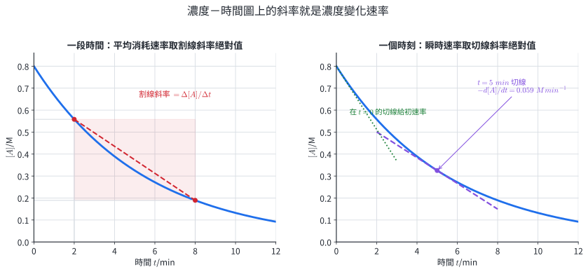{width=98%}

圖 1 建立三種速率：

- **平均速率**：濃度—時間圖在 $t_1$ 與 $t_2$ 之間的割線斜率絕對值。
- **瞬時速率**：濃度—時間圖在某時刻的切線斜率絕對值。反應物 $A$ 的瞬時消耗速率為 $-\mathrm d[A]/\mathrm dt$。
- **初速率 $r_0$**：$t=0$ 時的瞬時速率。此時生成物尚少、逆反應影響小，適合用來求速率定律。

在大多數反應中，反應物濃度隨時間下降，有效碰撞機會也降低，因此曲線逐漸變平。這也說明同一反應在不同時段的平均速率通常不同。

### 1.2 化學計量係數與反應速率

對反應

$$
aA+bB\longrightarrow cC+dD,
$$

同一段時間內的物質量變化依反應係數成比。以係數除去各物種的濃度變化，可得相同的反應速率：

$$
r=-\frac{1}{a}\frac{\Delta[A]}{\Delta t}
  =-\frac{1}{b}\frac{\Delta[B]}{\Delta t}
  = \frac{1}{c}\frac{\Delta[C]}{\Delta t}
  = \frac{1}{d}\frac{\Delta[D]}{\Delta t}.
$$

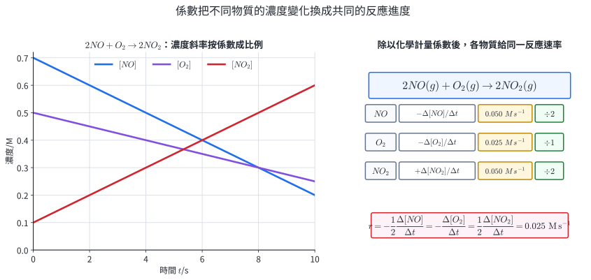{width=98%}

係數歸一化的用途是使「反應速率」不依賴所選物種。若題目問「$O_2$ 的消耗速率」，就直接給 $-\Delta[O_2]/\Delta t$；若問「該反應的速率 $r$」，則依係數歸一化。這個字眼差異會改變數值，是作答時必須明確的條件。

::: worked-example
### 示範 1｜平均消耗速率與生成速率

反應 $2N_2O_5(g)\rightarrow4NO_2(g)+O_2(g)$ 進行 $40.0\ \mathrm{s}$ 後，$[N_2O_5]$ 由 $0.640\ \mathrm M$ 降為 $0.520\ \mathrm M$。求 $N_2O_5$ 的平均消耗速率、$NO_2$ 的平均生成速率與歸一化反應速率 $r$。

$$
\Delta[N_2O_5]=0.520-0.640=-0.120\ \mathrm M,
$$

$$
-\frac{\Delta[N_2O_5]}{\Delta t}
=-\frac{-0.120}{40.0}
=3.00\times10^{-3}\ \mathrm{M\,s^{-1}}.
$$

由係數 $2:4$，

$$
\frac{\Delta[NO_2]}{\Delta t}
=\frac{4}{2}\left(3.00\times10^{-3}\right)
=6.00\times10^{-3}\ \mathrm{M\,s^{-1}}.
$$

歸一化的反應速率為

$$
r=-\frac12\frac{\Delta[N_2O_5]}{\Delta t}
=1.50\times10^{-3}\ \mathrm{M\,s^{-1}}.
$$

$NO_2$ 的生成速率是 $N_2O_5$ 消耗速率的兩倍，符合係數 $4:2$。
:::

::: worked-example
### 示範 2｜由濃度—時間資料估計瞬時速率

某反應中 $A$ 的濃度資料為：

| $t/\mathrm s$ | 18.0 | 20.0 | 22.0 |
|---:|---:|---:|---:|
| $[A]/\mathrm M$ | 0.462 | 0.430 | 0.401 |

以 $t=20.0\ \mathrm s$ 左右對稱的割線估計當時的瞬時消耗速率。兩點割線可近似當地切線：

$$
\left.\frac{\mathrm d[A]}{\mathrm dt}\right|_{20\mathrm s}
\approx\frac{0.401-0.462}{22.0-18.0}
=-1.525\times10^{-2}\ \mathrm{M\,s^{-1}}.
$$

因此 $A$ 的瞬時消耗速率約為 $1.53\times10^{-2}\ \mathrm{M\,s^{-1}}$。估計區間為 $18.0$ 至 $22.0\ \mathrm s$；縮小取樣間隔通常可使結果更接近真正切線斜率。
:::

### 1.3 速率定律、反應級數與速率常數

在溫度與其他條件固定時，實驗常可將初速率寫成

$$
r_0=k[A]_0^m[B]_0^n.
$$

- $m$ 與 $n$ 是各反應物的**反應級數**，由實驗決定。
- $m+n$ 是總反應級數。
- $k$ 是**速率常數**，對同一反應而言會隨溫度、催化途徑與反應介質改變。

一般總反應的速率定律指數必須由速率資料求得。只有已知為單一基本步驟的情形，速率定律才可以直接反映該步驟中的粒子數。

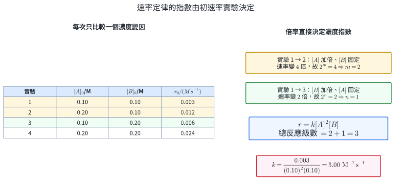{width=97%}

比較兩組初速率實驗時，取比可以消去 $k$ 與未改變的濃度：

$$
\frac{r_2}{r_1}
=\left(\frac{[A]_2}{[A]_1}\right)^m
 \left(\frac{[B]_2}{[B]_1}\right)^n.
$$

若其中只有 $[A]$ 改變，右式就只剩 $([A]_2/[A]_1)^m$。求得所有級數後，代入任一組實驗可求 $k$。

速率定律維度必須與速率相同。總級數為 $N$ 時，

$$
[k]=\mathrm{M}^{\,1-N}\mathrm{s}^{-1}.
$$

| 總級數 $N$ | 速率常數單位 |
|---:|---:|
| 0 | $\mathrm{M\,s^{-1}}$ |
| 1 | $\mathrm{s^{-1}}$ |
| 2 | $\mathrm{M^{-1}\,s^{-1}}$ |
| 3 | $\mathrm{M^{-2}\,s^{-1}}$ |

::: worked-example
### 示範 3｜由初速率比較求速率定律

某反應的初速率資料為：

| 實驗 | $[A]_0/\mathrm M$ | $[B]_0/\mathrm M$ | $r_0/(\mathrm{M\,s^{-1}})$ |
|---:|---:|---:|---:|
| 1 | 0.100 | 0.100 | $3.00\times10^{-3}$ |
| 2 | 0.200 | 0.100 | $1.20\times10^{-2}$ |
| 3 | 0.100 | 0.200 | $6.00\times10^{-3}$ |

設 $r=k[A]^m[B]^n$。實驗 1 與 2 中 $[B]$ 固定，$[A]$ 加倍，速率變四倍，故 $4=2^m$、$m=2$。實驗 1 與 3 中 $[A]$ 固定，$[B]$ 加倍，速率變兩倍，故 $2=2^n$、$n=1$。

$$
r=k[A]^2[B].
$$

代入實驗 1：

$$
k=\frac{3.00\times10^{-3}}{(0.100)^2(0.100)}
=3.00\ \mathrm{M^{-2}\,s^{-1}}.
$$

總級數為 $3$，所以 $k$ 的單位 $\mathrm{M^{-2}\,s^{-1}}$ 與維度檢查一致。
:::

::: worked-example
### 示範 4｜由速率定律預測新條件的速率

已知 $r=k[X][Y]^2$。某條件下速率為 $2.40\times10^{-4}\ \mathrm{M\,s^{-1}}$。將 $[X]$ 調為原來的 $0.50$ 倍、$[Y]$ 調為原來的 $3.00$ 倍，溫度不變。

因 $k$ 相同，

$$
\frac{r'}{r}=(0.50)^1(3.00)^2=4.50,
$$

$$
r'=4.50(2.40\times10^{-4})
=1.08\times10^{-3}\ \mathrm{M\,s^{-1}}.
$$

$[Y]$ 為二級，其三倍濃度貢獻九倍效果；$[X]$ 的減半使總倍率成為 $4.50$。
:::

### 1.4 零級、一級反應與半生期

對單一反應物 $A$ 的零級反應，

$$
-\frac{\mathrm d[A]}{\mathrm dt}=k.
$$

速率與 $[A]$ 無關，在此模型適用的濃度範圍內，積分可得

$$
[A]_t=[A]_0-kt.
$$

$[A]$ 對 $t$ 作圖為直線，斜率 $-k$。令 $[A]_t=[A]_0/2$：

$$
t_{1/2}=\frac{[A]_0}{2k}.
$$

零級半生期與初濃度成正比。由 $[A]_0$ 降到 $[A]_0/2$ 與由 $[A]_0/2$ 降到 $[A]_0/4$ 的絕對濃度變化不同，後一段只需前一段一半的時間。

對一級反應，

$$
-\frac{\mathrm d[A]}{\mathrm dt}=k[A].
$$

分離變數後由 $[A]_0$ 積分到 $[A]_t$：

$$
\int_{[A]_0}^{[A]_t}\frac{\mathrm d[A]}{[A]}
=-k\int_0^t\mathrm dt,
$$

得

$$
\ln[A]_t=\ln[A]_0-kt,
\qquad
[A]_t=[A]_0e^{-kt}.
$$

$\ln[A]$ 對 $t$ 作圖為直線，斜率 $-k$。令 $[A]_t=[A]_0/2$：

$$
t_{1/2}=\frac{\ln2}{k}=\frac{0.693}{k}.
$$

一級半生期與初濃度無關，每過一個半生期就保留原有量的一半。

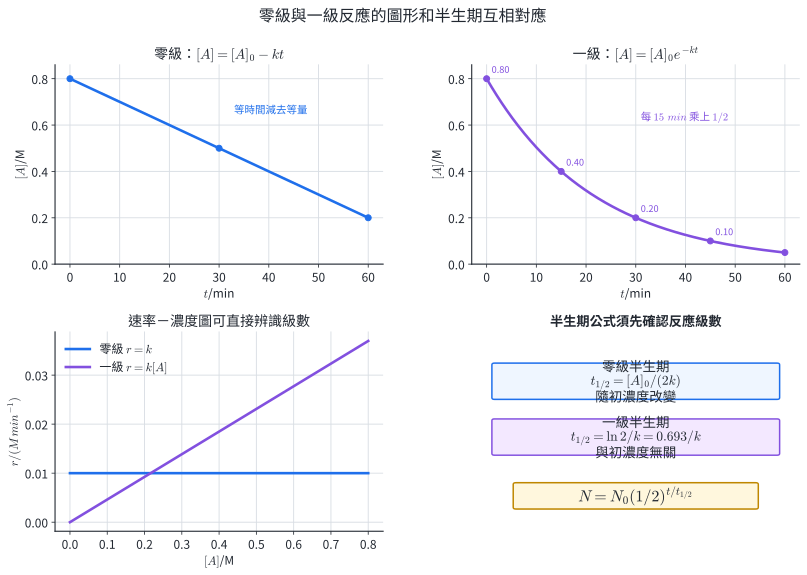{width=96%}

| 比較 | 零級 | 一級 |
|---|---|---|
| 速率定律 | $r=k$ | $r=k[A]$ |
| 濃度—時間式 | $[A]_t=[A]_0-kt$ | $[A]_t=[A]_0e^{-kt}$ |
| 線性作圖 | $[A]$ 對 $t$ | $\ln[A]$ 對 $t$ |
| 直線斜率 | $-k$ | $-k$ |
| 半生期 | $[A]_0/(2k)$ | $0.693/k$ |
| $k$ 單位 | $\mathrm{M\,s^{-1}}$ | $\mathrm{s^{-1}}$ |

::: worked-example
### 示範 5｜由濃度—時間資料辨認反應級數

某反應的資料為：

| $t/\mathrm{min}$ | 0 | 10 | 20 | 30 |
|---:|---:|---:|---:|---:|
| $[A]/\mathrm M$ | 0.800 | 0.600 | 0.400 | 0.200 |

每過 $10\ \mathrm{min}$，$[A]$ 都減少 $0.200\ \mathrm M$，因此 $[A]$ 對 $t$ 是斜率固定的直線，符合零級積分式。

$$
k=-\frac{\Delta[A]}{\Delta t}
=2.00\times10^{-2}\ \mathrm{M\,min^{-1}}.
$$

初濃度為 $0.800\ \mathrm M$，

$$
t_{1/2}=\frac{0.800}{2(2.00\times10^{-2})}
=20.0\ \mathrm{min}.
$$

資料中 $20.0\ \mathrm{min}$ 時 $[A]=0.400\ \mathrm M$，驗證了計算。
:::

::: worked-example
### 示範 6｜一級反應的半生期與剩餘量

某藥物在固定條件下依一級反應分解，$k=0.0231\ \mathrm{day^{-1}}$。求半生期，並求 $60.0\ \mathrm{day}$ 後的剩餘百分比。

$$
t_{1/2}=\frac{0.693}{0.0231}=30.0\ \mathrm{day}.
$$

$60.0\ \mathrm{day}$ 等於兩個半生期，因此

$$
\frac{[A]_t}{[A]_0}=\left(\frac12\right)^2=0.250=25.0\%.
$$

代入指數式也得 $[A]_t/[A]_0=e^{-(0.0231)(60.0)}=0.250$。半生期模型可用於藥品有效成分、某些污染物降解與放射性核種衰變；使用時需有資料支持在指定條件下符合一級模型。
:::

### 1.5 速率資料的實際用途

- **吸光測量**：校正後的吸光值可連續追蹤特定物種濃度，適合求瞬時速率。
- **氣體壓力或體積**：在溫度、容器體積或壓力條件受控時，氣體生成量可由壓力或體積變化得到。
- **質量變化**：開放系統放出氣體時，總質量下降可用來追蹤反應；揮發、濺濺與氣流會形成系統誤差。
- **藥品安定性**：由濃度—時間資料建立反應級數與 $k$，可估計指定儲存條件下的有效期。

### 練習 1

1. 反應 $2A\rightarrow B$ 進行 $50.0\ \mathrm s$ 後，$[A]$ 由 $0.900\ \mathrm M$ 降為 $0.760\ \mathrm M$。求 $A$ 的平均消耗速率、$B$ 的平均生成速率及歸一化反應速率 $r$。
2. 反應 $2NO+O_2\rightarrow2NO_2$ 的某時刻，$O_2$ 消耗速率為 $1.8\times10^{-4}\ \mathrm{M\,s^{-1}}$。求 $NO$ 消耗速率、$NO_2$ 生成速率與反應速率 $r$。
3. 某反應的初速率律為 $r=k[A]^2[B]$。將 $[A]$ 調為原來的 $1.50$ 倍，$[B]$ 調為原來的 $0.40$ 倍，求速率倍率。
4. 某反應的初速率資料為：實驗 1，$[A]=0.10\ \mathrm M$、$[B]=0.10\ \mathrm M$、$r=2.0\times10^{-3}\ \mathrm{M\,s^{-1}}$；實驗 2，$[A]=0.20\ \mathrm M$、$[B]=0.10\ \mathrm M$、$r=4.0\times10^{-3}\ \mathrm{M\,s^{-1}}$；實驗 3，$[A]=0.10\ \mathrm M$、$[B]=0.30\ \mathrm M$、$r=1.8\times10^{-2}\ \mathrm{M\,s^{-1}}$。求速率定律、總級數、$k$ 與其單位。
5. 某反應中 $[A]$ 每 $5.0\ \mathrm{min}$ 依序為 $0.80$ M、$0.65$ M、$0.50$ M、$0.35$ M。判斷是否符合零級模型；若符合，求 $k$ 與以 $[A]_0=0.80\ \mathrm M$ 計算的半生期。
6. 某一級分解反應的半生期為 $12.0\ \mathrm h$。求 $k$，並求 $36.0\ \mathrm h$ 後的剩餘百分比。

### 練習 1 解析

1. $\Delta[A]=-0.140\ \mathrm M$，故 $A$ 的消耗速率為 $0.140/50.0=2.80\times10^{-3}\ \mathrm{M\,s^{-1}}$。由係數 $2A\rightarrow B$，$B$ 的生成速率與 $r$ 均為 $1.40\times10^{-3}\ \mathrm{M\,s^{-1}}$。
2. $O_2$ 的係數為 $1$，所以 $r=1.8\times10^{-4}\ \mathrm{M\,s^{-1}}$。$NO$ 與 $NO_2$ 的係數均為 $2$，其消耗與生成速率均為 $2r=3.6\times10^{-4}\ \mathrm{M\,s^{-1}}$。
3. 倍率為 $(1.50)^2(0.40)=0.900$，新速率為原速率的 $0.900$ 倍。
4. 實驗 1→2 給 $2=2^m$，故 $m=1$；實驗 1→3 給 $9=3^n$，故 $n=2$。

   $$
   r=k[A][B]^2,
   \qquad N=3,
   \qquad
   k=\frac{2.0\times10^{-3}}{(0.10)(0.10)^2}
   =2.0\ \mathrm{M^{-2}\,s^{-1}}.
   $$

5. 每 $5.0\ \mathrm{min}$ 都減少 $0.15\ \mathrm M$，符合零級模型。

   $$
   k=\frac{0.15}{5.0}=0.030\ \mathrm{M\,min^{-1}},
   \qquad
   t_{1/2}=\frac{0.80}{2(0.030)}=13.3\ \mathrm{min}.
   $$

6. $k=0.693/12.0=5.78\times10^{-2}\ \mathrm{h^{-1}}$。$36.0\ \mathrm h$ 為三個半生期，剩餘分率為 $(1/2)^3=12.5\%$。

## 2. 碰撞理論、能障與反應機構

### 2.1 有效碰撞的兩個條件

氣體與溶液中的粒子不斷運動與碰撞，但只有少部分碰撞導致舊鍵斷裂與新鍵形成。能生成產物的碰撞稱為**有效碰撞**，同時需要：

1. **碰撞能量達到低限**：粒子沿碰撞方向的相對動能足以讓系統進入活化複合體。
2. **碰撞位向適當**：參與斷鍵與成鍵的原子必須在合適的空間方向接近。

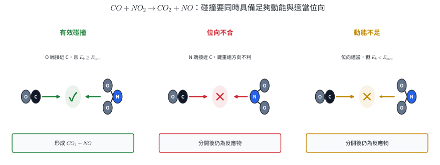{width=99%}

反應速率可用下列架構理解：

$$
\text{有效碰撞頻率}
=\text{總碰撞頻率}
\times\text{能量合格比例}
\times\text{位向合格比例}.
$$

提高濃度常先改變單位時間的總碰撞數；升高溫度同時使碰撞更頻繁，並大幅增加能量合格的粒子比例；催化劑則改變途徑，使能量低限降低。

::: worked-example
### 示範 7｜以碰撞條件解釋三種結果

對 $CO+NO_2\rightarrow CO_2+NO$ 而言，比較三次碰撞：

- 甲：CO 的 C 端接近 $NO_2$ 的 O 端，$E_k>E_{min}$。
- 乙：CO 的 C 端接近 $NO_2$ 的 N 端，$E_k>E_{min}$。
- 丙：CO 的 C 端接近 $NO_2$ 的 O 端，$E_k<E_{min}$。

甲兼具適當位向與足夠能量，可形成活化複合體並向產物方向發展。乙的能量合格，但原子排列不利於 O 原子轉移；丙的位向合格，但系統無法到達能障頂端。因此乙、丙碰撞後皆回到反應物。
:::

### 2.2 粒子動能分布、活化複合體與活化能

固定溫度下，粒子動能呈連續分布；曲線下總面積表示全部粒子。曲線右側 $E\ge E_a$ 的面積代表能量達到低限的粒子比例。

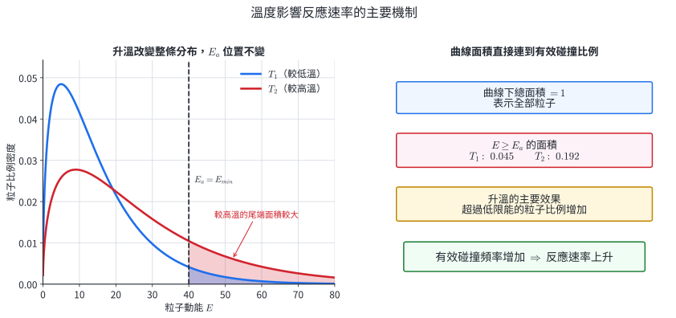{width=98%}

反應物在轉換為產物的瞬間，形成鍵正在斷裂與形成的高能排列，稱為**活化複合體**或過渡狀態。由反應物能量上升到該能障頂端所需的能量稱為**正反應活化能 $E_a$**；由產物上升到同一頂端所需能量為**逆反應活化能 $E_a'$**。

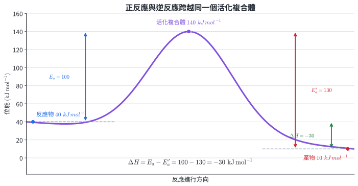{width=92%}

反應熱是產物與反應物的能量差：

$$
\Delta H=H_{\mathrm{products}}-H_{\mathrm{reactants}}.
$$

對同一能障頂端，

$$
E_a=H^{\ddagger}-H_{\mathrm{reactants}},
\qquad
E_a'=H^{\ddagger}-H_{\mathrm{products}},
$$

相減得

$$
\boxed{\Delta H=E_a-E_a'}.
$$

放熱反應的 $\Delta H<0$，因此 $E_a<E_a'$；吸熱反應的 $\Delta H>0$，因此 $E_a>E_a'$。反應熱比較初、終態；活化能比較起始態與過渡狀態，兩者分屬不同垂直能量差。

::: worked-example
### 示範 8｜由動能分布資料求能量合格碰撞數

某溫度下每秒發生 $2.0\times10^8$ 次碰撞，其中 $1.5\%$ 的碰撞能量達到 $E_a$；能量合格的碰撞中有 $20\%$ 位向適當。估計每秒有效碰撞數。

$$
N_{\mathrm{effective}}
=(2.0\times10^8)(0.015)(0.20)
=6.0\times10^5\ \mathrm{s^{-1}}.
$$

若升溫使能量合格比例由 $1.5\%$ 增至 $4.5\%$，其他兩項不變，有效碰撞數將變三倍。這個倍率由曲線右尾面積決定；平均動能只描述分布的中心趨勢。
:::

::: worked-example
### 示範 9｜能量圖的正、逆活化能與反應熱

某反應的反應物、產物與活化複合體能量分別為 $55$、$85$、$145\ \mathrm{kJ\,mol^{-1}}$。

$$
E_a=145-55=90\ \mathrm{kJ\,mol^{-1}},
$$

$$
E_a'=145-85=60\ \mathrm{kJ\,mol^{-1}},
$$

$$
\Delta H=85-55=+30\ \mathrm{kJ\,mol^{-1}}.
$$

正反應為吸熱反應，且 $E_a-E_a'=90-60=+30\ \mathrm{kJ\,mol^{-1}}$，與 $\Delta H$ 一致。
:::

### 2.3 基本步驟、反應機構與速率決定步驟

實際反應常由多個微觀事件組成。一次碰撞或重排完成的反應單位稱為**基本步驟**，全部基本步驟的有序集合稱為**反應機構**。合理機構至少需同時通過三項檢驗：

1. 各步驟相加後得到已知總反應。
2. 反應中間體、催化劑與反應物種的身分對應正確。
3. 機構推得的速率定律與實驗一致。

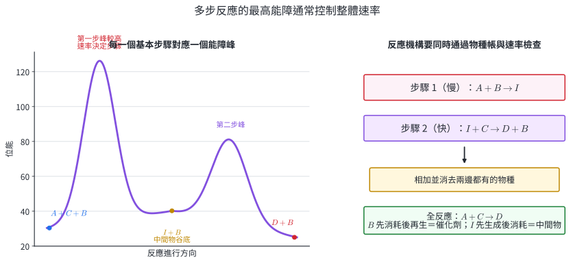{width=98%}

圖 8 的機構為

$$
\begin{aligned}
\text{步驟 1（慢）:}&\quad A+B\longrightarrow I,\\
\text{步驟 2（快）:}&\quad I+C\longrightarrow D+B.
\end{aligned}
$$

兩式相加並消去兩邊的 $B$ 與 $I$，得總反應 $A+C\rightarrow D$。

- **中間體 $I$**：前一步生成、後一步消耗，不出現於總反應式。
- **催化劑 $B$**：前一步消耗、後一步再生，不出現於總反應式。
- **速率決定步驟**：對一連串必須依序完成的步驟，最慢的步驟會限制產物形成率。能量圖中需由當前谷底爬升的最高有效能障，常對應此步驟。

基本步驟的反應物粒子數稱為**分子數**：單分子步驟涉及一個粒子，雙分子步驟涉及兩個粒子。三個粒子在正確位向且能量合格的同時碰撞機率很低，所以合理機構常以單分子或雙分子步驟組成。

若圖 8 的第一步是單向慢速基本步驟，則可由此步驟寫出

$$
r=k[A][B].
$$

這也預測：雖然 $B$ 不出現在總反應式中，其濃度仍可影響速率，因為 $B$ 實際參與慢步驟。

::: worked-example
### 示範 10｜由基本步驟建立物種帳

已知機構：

$$
\begin{aligned}
NO_2+NO_2&\longrightarrow NO_3+NO &&\text{（慢）},\\
NO_3+CO&\longrightarrow NO_2+CO_2 &&\text{（快）}.
\end{aligned}
$$

兩式相加，左右同時消去一個 $NO_3$ 與一個 $NO_2$：

$$
NO_2+CO\longrightarrow NO+CO_2.
$$

$NO_3$ 由第一步生成、第二步消耗，是中間體。$NO_2$ 的合計結果仍消耗一個，因此是總反應物，同時也參與機構內的再生步驟。慢步驟是雙分子基本步驟，故預測

$$
r=k[NO_2]^2.
$$

若實驗正好得到這個速率律，該機構通過速率檢驗；一致性代表機構可行，後續仍可以用中間體觀測等證據區分其他也符合速率律的機構。
:::

::: worked-example
### 示範 11｜辨認催化劑、中間體與總反應

機構為

$$
\begin{aligned}
X+ClO^-&\longrightarrow XO+Cl^-,\\
XO+O_3&\longrightarrow X+2O_2.
\end{aligned}
$$

相加並消去 $X$ 與 $XO$：

$$
ClO^-+O_3\longrightarrow Cl^-+2O_2.
$$

$X$ 在第一步消耗、第二步再生，是催化劑；$XO$ 在第一步生成、第二步消耗，是中間體。物種身分由「在機構中的出現順序」決定，不由單一步驟的左右位置決定。
:::

::: worked-example
### 示範 12｜用實驗速率律篩選機構

總反應為 $2A+B\rightarrow P$，實驗速率律是 $r=k[A][B]$。考慮兩個候選機構的慢步驟：

- 機構甲：$A+B\rightarrow I$（慢）。
- 機構乙：$A+A\rightarrow J$（慢）。

甲的慢步驟預測 $r=k[A][B]$，與實驗一致。乙的慢步驟預測 $r=k[A]^2$，無法表示實驗中 $B$ 的一級效應。因此這組證據支持機構甲。完整甲機構仍需有後續步驟使各式相加成 $2A+B\rightarrow P$。
:::

### 2.4 機構模型的實際用途

工業上改良反應時，單純增加所有反應物濃度常伴隨壓力、副反應與安全成本。找出速率決定步驟後，可把設計焦點放在相關物種濃度、中間體穩定性或催化途徑。大氣化學也使用機構追蹤自由基連鎖反應，來解釋臭氧形成與分解。

### 練習 2

1. 某反應每秒發生 $5.0\times10^7$ 次碰撞，能量合格比例為 $4.0\%$，位向合格比例為 $15\%$。估計每秒有效碰撞數。
2. 同一反應在 $T_1$ 與 $T_2$ 的動能分布曲線下總面積相等；$T_2$ 曲線較寬、峰值較低，且 $E\ge E_a$ 的面積較大。判斷何者溫度較高，並連結到速率常數。
3. 某反應的 $H_R=25$、$H_P=70$、$H^{\ddagger}=125\ \mathrm{kJ\,mol^{-1}}$。求 $E_a$、$E_a'$ 與 $\Delta H$，並判斷吸放熱。
4. 一個兩步反應能量圖的反應物能量為 $20$，第一峰為 $105$，中間谷為 $60$，第二峰為 $120$，產物為 $10\ \mathrm{kJ\,mol^{-1}}$。比較兩步的正向活化能，並指出較可能的速率決定步驟。
5. 已知機構：$A+Q\rightarrow I$，$I+B\rightarrow P+Q$。寫出總反應，並辨認 $Q$ 與 $I$ 的身分。
6. 總反應為 $A+2B\rightarrow P$，實驗得 $r=k[A][B]$。某機構的第一步是慢速基本步驟 $A+B\rightarrow I$，第二步是快速步驟 $I+B\rightarrow P$。說明此機構如何同時通過物種帳與速率定律檢驗。

### 練習 2 解析

1. 有效碰撞數為

   $$
   N_{\mathrm{effective}}
   =(5.0\times10^7)(0.040)(0.15)
   =3.0\times10^5\ \mathrm{s^{-1}}.
   $$

2. $T_2$ 較高。兩曲線下總面積都是全部粒子；$T_2$ 在 $E_a$ 右側的面積較大，表示能量合格比例較高，有效碰撞頻率與 $k$ 較大。
3. 依能階定義計算：

   $$
   E_a=125-25=100\ \mathrm{kJ\,mol^{-1}},
   $$

   $$
   E_a'=125-70=55\ \mathrm{kJ\,mol^{-1}},
   $$

   $$
   \Delta H=70-25=+45\ \mathrm{kJ\,mol^{-1}}.
   $$

   $\Delta H>0$，正反應吸熱，並滿足 $E_a-E_a'=45\ \mathrm{kJ\,mol^{-1}}$。

4. 第一步由 $20$ 上升到 $105$，$E_{a,1}=85\ \mathrm{kJ\,mol^{-1}}$；第二步由中間谷 $60$ 上升到 $120$，$E_{a,2}=60\ \mathrm{kJ\,mol^{-1}}$。在其他微觀因素相近時，第一步能障較高，較可能是速率決定步驟。
5. 相加後消去 $Q$ 與 $I$，總反應為 $A+B\rightarrow P$。$Q$ 先消耗後再生，是催化劑；$I$ 先生成後消耗，是中間體。
6. 兩步相加時 $I$ 左右消去，得 $A+2B\rightarrow P$，符合總反應。慢步驟為 $A+B\rightarrow I$，作為雙分子基本步驟預測 $r=k[A][B]$，與實驗一致。

## 3. 影響反應速率的因素

速率改變的直接實驗指標是濃度—時間曲線的斜率或初速率。不同操作可以透過三條微觀路徑發生作用：改變碰撞頻率、改變能量合格的粒子比例，或改變反應途徑與能障。

### 3.1 反應物本質

反應物本質決定斷鍵、成鍵、電荷吸引、粒子位向與機構的條件。在相同濃度、溫度與物理狀態下，常見趨勢包括：

- 溶液中離子間的快速沉殿或酸鹼中和，可在粒子接觸後迅速完成電荷重排。
- 需斷裂強共價鍵、經過複雜位向或多步機構的反應，常有較大能障或較小位向合格比例。
- 活潑金屬與酸的速率差異，來自金屬失電子與表面狀態的差異。金屬氧化膜可以阻隔反應物，使實驗結果同時受本質與表面條件影響。

有效的本質比較需指定反應、介質、濃度、溫度與相態；常見的快速離子反應是在這些條件相當下的模型趨勢。

::: worked-example
### 示範 13｜用粒子層次比較兩種反應

比較等濃度 $AgNO_3(aq)$ 與 $NaCl(aq)$ 混合形成 $AgCl(s)$，以及乙酸乙酯在室溫水中水解。

沉殿反應的核心粒子式為

$$
Ag^+(aq)+Cl^-(aq)\longrightarrow AgCl(s).
$$

異號離子在溶液中相遇後可迅速進入晶格。酯類水解涉及共價鍵的斷裂與形成，並受親核攻擊位向與多步機構限制。在題述條件下，$AgCl$ 沉殿通常更快出現。此比較的直接依據是粒子間作用與機構差異。
:::

### 3.2 濃度、氣體分壓與接觸面積

在液相或氣相的勻相反應中，單位體積的反應物粒子數增加，總碰撞頻率通常增加。定量倍率由實驗速率律的濃度指數決定。對氣體而言，固定溫度下提高某反應物分壓，等價於提高該氣體的單位體積粒子數。

在固—液、固—氣等不勻相反應中，反應主要在界面發生。相同質量的固體切成較小粒徑後，總表面積增加，可同時接觸的反應位點也增加。

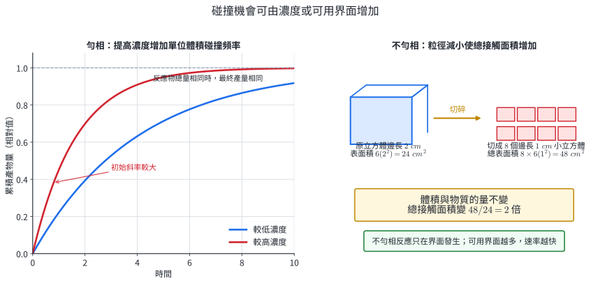{width=99%}

當兩組實驗的反應物總莫耳數相同，改變濃度或粒徑可以改變「到達指定轉化率所需時間」，但受限反應物決定的理論最終產量相同。速率與產量是不同的觀測軸。

::: worked-example
### 示範 14｜濃度操作的定量倍率

反應速率律為 $r=k[A]^{1/2}[B]^2$。將 $[A]$ 增為四倍、$[B]$ 降為一半，其他條件固定。

$$
\frac{r'}{r}=4^{1/2}\left(\frac12\right)^2
=2\times\frac14=\frac12.
$$

新速率為原速率的 $0.50$ 倍。碰撞頻率的定性描述可以說明趨勢；此題的精確倍率來自速率定律。
:::

::: worked-example
### 示範 15｜粒徑與總表面積

一個邊長 $3.0\ \mathrm{cm}$ 的立方體固體，切成邊長 $0.50\ \mathrm{cm}$ 的小立方體。計算切割前後總表面積倍率。

原立方體表面積為

$$
S_0=6(3.0)^2=54\ \mathrm{cm^2}.
$$

每邊切成 $3.0/0.50=6$ 份，共有 $6^3=216$ 個小立方體。

$$
S=216\times6(0.50)^2=324\ \mathrm{cm^2}.
$$

所以 $S/S_0=324/54=6.0$。若表面的活性位點密度與傳質條件相近，可用界面增加解釋反應加快。粉塵與空氣混合時的極大界面，也是粉塵爆燃危害的核心來源。
:::

### 3.3 溫度

升溫使粒子平均動能增加、碰撞頻率略增，更重要的是動能分布中 $E\ge E_a$ 的面積顯著增加。在機構不變的溫度範圍內，溫度上升使速率常數 $k$ 增加；精確倍率由該反應在各溫度的速率資料決定。食品冷藏使腐壞反應與微生物酵素速率降低；化學品儲存溫度上限則用來控制分解、聚合或放熱反應的加速。

::: worked-example
### 示範 16｜由兩溫度速率資料比較 $k$

某反應的速率律為 $r=k[A]$。在 $298\ \mathrm K$ 與 $318\ \mathrm K$ 下，使用相同 $[A]_0=0.200\ \mathrm M$ 測得初速率分別為 $2.40\times10^{-3}$ 與 $8.55\times10^{-3}\ \mathrm{M\,s^{-1}}$。

$$
k_{298}=\frac{2.40\times10^{-3}}{0.200}
=1.20\times10^{-2}\ \mathrm{s^{-1}},
$$

$$
k_{318}=\frac{8.55\times10^{-3}}{0.200}
=4.28\times10^{-2}\ \mathrm{s^{-1}}.
$$

$$
\frac{k_{318}}{k_{298}}
=\frac{4.28\times10^{-2}}{1.20\times10^{-2}}
=3.56.
$$

在此濃度下初速率也增為 $3.56$ 倍。圖 6 提供機制解釋：較高溫度使 $E\ge E_a$ 的粒子比例增加；精確倍率由實驗速率得到。
:::

### 3.4 催化劑與催化反應

**催化劑**參與反應機構，提供另一條較低活化能的途徑，並在後續步驟再生。在同一溫度下，較低 $E_a$ 使動能合格粒子比例增加，故 $k$ 與反應速率增加。

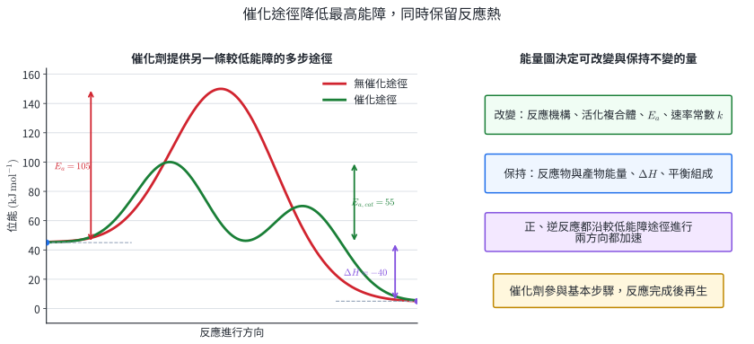{width=97%}

催化劑改變反應機構、過渡狀態與正逆反應的活化能，同時保持下列量：

- 反應物與產物的能量，因此 $\Delta H$ 不變。
- 總反應式與理論產量不變。
- 固定溫度下的平衡常數與平衡組成不變。催化劑同時加速正、逆反應，使系統更快到達原本的平衡。

催化劑可以與反應物同相，稱為勻相催化；也可以位於不同相的固體表面，稱為非勻相催化。固體觸媒常透過吸附反應物、調整位向與弱化特定鍵結來降低有效能障。酵素是生物催化劑，活性中心提供適當位向與微環境；過高溫度或極端 pH 可改變其三維結構而降低活性。

::: worked-example
### 示範 17｜由能量數據判斷催化效應

某放熱反應的反應物能量為 $45$、產物為 $5\ \mathrm{kJ\,mol^{-1}}$。無催化途徑的最高過渡狀態為 $150$，催化途徑的最高過渡狀態為 $100\ \mathrm{kJ\,mol^{-1}}$。

$$
E_{a,\mathrm{uncat}}=150-45=105\ \mathrm{kJ\,mol^{-1}},
$$

$$
E_{a,\mathrm{cat}}=100-45=55\ \mathrm{kJ\,mol^{-1}}.
$$

兩條途徑的反應熱均為

$$
\Delta H=5-45=-40\ \mathrm{kJ\,mol^{-1}}.
$$

催化途徑將正反應最高能障降低 $50\ \mathrm{kJ\,mol^{-1}}$，但初、終能階相同，因此放熱量相同。
:::

### 3.5 碘鐘反應：用固定顏色終點比較速率

碘鐘反應將一個連續的化學反應轉成容易計時的顏色突變。本實驗混合含 $KIO_3$ 的溶液 A，以及含 $NaHSO_3$、稀硫酸與澱粉的溶液 B。酸性條件下可以用下列模型理解顏色延遲：

1. $IO_3^-$ 與含硫物種的氧化還原網路形成碘。
2. 當 $HSO_3^-$ 尚存在時，新生成的 $I_2$ 又被還原為 $I^-$，溶液維持無色。
3. $HSO_3^-$ 耗盡後，$I_2$ 開始累積並與澱粉形成深藍色結合體，產生突然可見的終點。

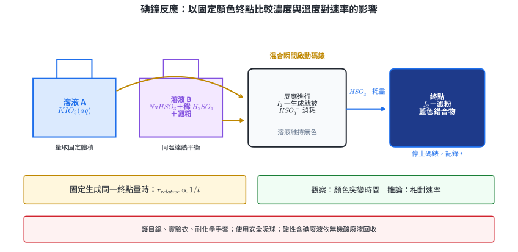{width=99%}

若每次實驗到達終點時都消耗相同量的限量計時試劑，則固定的反應進度 $\Delta\xi_*$ 滿足

$$
r_{\mathrm{average}}\propto\frac{\Delta\xi_*}{t}
\propto\frac1t.
$$

因此 $1/t$ 可作為**相對速率**。這個關係的條件是終點代表的反應量固定；澱粉、$HSO_3^-$ 的起始量或總體積改變時，終點量也可能改變。

#### 實驗設計

**濃度組**：保持溶液 B 組成、混合後總體積、溫度、攪拌方式與終點判準一致，以蒸餾水與原 $KIO_3$ 溶液配成不同混合後 $[KIO_3]$。

**溫度組**：保持各溶液體積與濃度一致，先將 A、B 分別置於同一恒溫水浴至熱平衡，再混合計時。反應溫度以混合當下的溫度為準，水浴溫度是控制工具。

**重複與資料**：每個條件至少重複三次，報告平均 $t$、$1/t$ 與散布程度。開始時點、攪拌強度與「持續藍色」的判準需一致。

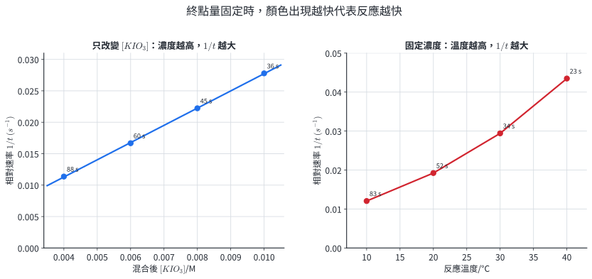{width=97%}

#### 安全、廢棄與證據層次

- 配戴護目鏡、實驗衣與適當的耐化學手套；以安全吸球操作移液管。
- 稀硫酸可造成刺激或腐蝕，碘酸鹽是氧化劑，碘與含碘溶液可刺激並染色。濺觸皮膚或眼睛時以大量流動水沖洗，並依實驗室緊急程序處理。
- 反應後溶液含酸性無機鹽與含碘物種，收入實驗室指定的酸性含碘無機廢液容器。
- **觀察**：混合到持續藍色的時間、溫度、體積與顏色。**推論**：在終點量一致的條件下，$1/t$ 較大表示平均反應速率較大。實驗記錄應保留這兩層的區別。

::: worked-example
### 示範 18｜由碘鐘資料建立相對速率

在濃度組實驗中，混合後 $[KIO_3]$ 分別為 $0.0040$、$0.0060$、$0.0080$、$0.0100\ \mathrm M$，藍色終點時間分別為 $88$、$60$、$45$、$36\ \mathrm s$。

| $[KIO_3]/\mathrm M$ | 0.0040 | 0.0060 | 0.0080 | 0.0100 |
|---:|---:|---:|---:|---:|
| $t/\mathrm s$ | 88 | 60 | 45 | 36 |
| $1/t/\mathrm{s^{-1}}$ | 0.0114 | 0.0167 | 0.0222 | 0.0278 |

當 $[KIO_3]$ 由 $0.0040$ 增至 $0.0080\ \mathrm M$，濃度變兩倍，$1/t$ 由 $0.0114$ 增至 $0.0222\ \mathrm{s^{-1}}$，約變 $1.95$ 倍。在本資料範圍內，結果支持相對速率對 $[KIO_3]$ 近似一級。這是由數據得到的實驗級數；與總反應式的係數屬於不同來源。
:::

### 3.6 速率控制的實際用途

- **冷藏與儲存**：降低溫度使食品氧化、香味分解與微生物反應的 $k$ 降低。
- **工業反應器**：濃度、壓力、溫度與催化劑同時影響速率；工程設計並需處理散熱、傳質、副反應與爆燃界限。
- **觸媒轉化器**：固體表面促進 CO、碳氫化合物與氮氧化物轉化；多孔材料提供大表面積，可用界面與催化兩個模型同時解釋。
- **藥物與酵素**：藥物代謝速率影響作用時間；酵素的活性中心與受質濃度決定生化反應速率。

### 練習 3

1. 對速率律 $r=k[A]^2[B]$，將 $[A]$ 加倍且 $[B]$ 降為原來的 $1/4$，溫度不變。求新舊速率比，並說明 $k$ 的狀態。
2. 一個邊長 $4.0\ \mathrm{cm}$ 立方體切成邊長 $1.0\ \mathrm{cm}$ 的小立方體。求切割前後總表面積與倍率，並指出此變因對不勻相反應的作用。
3. 某反應在 $300\ \mathrm K$ 與 $310\ \mathrm K$ 的速率常數分別為 $1.80\times10^{-3}$ 與 $3.91\times10^{-3}\ \mathrm{s^{-1}}$。求 $k_{310}/k_{300}$，並用粒子動能分布解釋趨勢。
4. 某反應的反應物能量為 $20$、產物為 $50\ \mathrm{kJ\,mol^{-1}}$。無催化與催化途徑的最高過渡狀態分別為 $110$ 與 $75\ \mathrm{kJ\,mol^{-1}}$。求兩條途徑的正反應 $E_a$與 $\Delta H$，並說明哪些量改變。
5. 碘鐘反應中，條件甲的藍色終點時間為 $72\ \mathrm s$，條件乙為 $48\ \mathrm s$。令兩組的相對速率分別為 $r_A$、$r_B$；在終點量一致時，求 $r_B/r_A$。
6. 為測試溫度對碘鐘反應的影響，某組將溶液 A 加熱至 $40^\circ\mathrm C$，溶液 B 保持 $20^\circ\mathrm C$，混合後立即計時，且高溫組使用較少的 B 以配合容器。指出兩個會破壞單一自變因比較的設計，並提出完整修正。

### 練習 3 解析

1. 由速率律計算：

   $$
   \frac{r'}{r}=2^2\left(\frac14\right)=1.
   $$

   新舊速率相同。溫度、催化途徑與介質皆未改變，因此 $k$ 保持相同。

2. 原表面積 $S_0=6(4.0)^2=96\ \mathrm{cm^2}$。切成 $4^3=64$ 塊，總表面積 $S=64\times6(1.0)^2=384\ \mathrm{cm^2}$，是原來的 $4.0$ 倍。不勻相反應的可用界面增加，所以在其他條件相近時反應加快。
3. 速率常數倍率為

   $$
   \frac{k_{310}}{k_{300}}
   =\frac{3.91\times10^{-3}}{1.80\times10^{-3}}
   =2.17.
   $$

   $310\ \mathrm K$ 的動能分布高能尾較大，$E\ge E_a$ 的粒子比例較高，因此有效碰撞頻率與 $k$ 較大。

4. 無催化 $E_a=110-20=90\ \mathrm{kJ\,mol^{-1}}$；催化 $E_a=75-20=55\ \mathrm{kJ\,mol^{-1}}$。兩途徑的 $\Delta H=50-20=+30\ \mathrm{kJ\,mol^{-1}}$。催化劑改變機構、過渡狀態與 $E_a$，而反應物、產物能階與 $\Delta H$ 保持相同。
5. 固定終點量時，相對速率與終點時間成反比：

   $$
   \frac{r_B}{r_A}
   =\frac{1/48}{1/72}
   =\frac{72}{48}=1.50.
   $$

6. 第一，A 與 B 混合後的實際溫度介於兩者起始溫度之間，且混合過程會散熱；修正為將 A、B 同時置於同一恆溫水浴至熱平衡，混合時測實際溫度。第二，改變 B 體積同時改變其混合後濃度、總體積與終點量；修正為各溫度組使用相同批次、濃度與體積的 A、B，並統一攪拌、計時與顏色判準。

## 4. 核心整理

| 資料或操作 | 直接判讀 | 微觀連結 |
|---|---|---|
| 濃度—時間曲線 | 割線給平均速率；切線給瞬時速率 | 反應物逐漸消耗時，有效碰撞頻率常下降 |
| $aA+bB\rightarrow cC+dD$ | $r=-\frac1a\frac{\Delta[A]}{\Delta t}=…=\frac1d\frac{\Delta[D]}{\Delta t}$ | 各物種變化依化學計量係數成比 |
| 初速率比較 | 由控制變因倍率求 $m,n$，再求 $k$ | 速率律是機構的實驗約束 |
| 零級 | $[A]=[A]_0-kt$；$t_{1/2}=[A]_0/(2k)$ | 在適用範圍內，反應位點或其他因素使速率不隨 $[A]$ 變化 |
| 一級 | $[A]=[A]_0e^{-kt}$；$t_{1/2}=0.693/k$ | 每單位時間消耗固定比例 |
| 升高濃度或分壓 | 依速率律求倍率 | 單位體積粒子數與碰撞頻率常增加 |
| 減小固體粒徑 | 總表面積增加 | 不勻相反應的可用界面增加 |
| 升溫 | $k$ 增加 | $E\ge E_a$ 的粒子比例顯著增加 |
| 加入催化劑 | 正、逆反應都加快；$\Delta H$ 與平衡組成不變 | 另一條機構具有較低的最高有效能障 |
| 碘鐘終點 | 固定終點量下 $r_{relative}\propto1/t$ | $HSO_3^-$ 耗盡後，$I_2$—澱粉藍色才累積 |

## 5. 章末分層題

### 基礎與資料題 1–12

1. 某反應物 $A$ 的濃度在 $t=10.0\ \mathrm s$ 與 $30.0\ \mathrm s$ 時分別為 $0.720$ 與 $0.460\ \mathrm M$。求此時段 $A$ 的平均消耗速率，並說明尚需哪種圖形資訊才能求 $t=20.0\ \mathrm s$ 的瞬時速率。
2. 對 $3A+2B\rightarrow4C$，某時段 $C$ 的平均生成速率為 $8.0\times10^{-3}\ \mathrm{M\,min^{-1}}$。求 $A$、$B$ 的平均消耗速率與歸一化反應速率。
3. 某反應初速率資料如下。

   | 實驗 | $[A]_0/\mathrm M$ | $[B]_0/\mathrm M$ | $r_0/(\mathrm{M\,s^{-1}})$ |
   |---:|---:|---:|---:|
   | 1 | 0.10 | 0.20 | $1.2\times10^{-3}$ |
   | 2 | 0.20 | 0.20 | $4.8\times10^{-3}$ |
   | 3 | 0.20 | 0.40 | $4.8\times10^{-3}$ |

   求速率定律、總級數、$k$ 與其單位。
4. 對某單一反應物反應，$[A]$ 對 $t$ 作圖是斜率 $-0.015\ \mathrm{M\,min^{-1}}$ 的直線，$[A]_0=0.90\ \mathrm M$。判斷級數，求 $k$、半生期與 $20.0\ \mathrm{min}$ 後的 $[A]$。
5. 某一級反應 $k=3.50\times10^{-3}\ \mathrm{s^{-1}}$，$[A]_0=0.600\ \mathrm M$。求 $200\ \mathrm s$ 後的 $[A]$ 與半生期。
6. 對同一反應，升溫後動能分布曲線的峰值降低、高能尾面積增加。用曲線下面積的物理意義說明總粒子數與有效碰撞比例如何變化。
7. 某反應的 $E_a=82$、$E_a'=117\ \mathrm{kJ\,mol^{-1}}$。求 $\Delta H$ 並判斷正反應吸放熱。若反應物能量定為 $30\ \mathrm{kJ\,mol^{-1}}$，求產物與活化複合體能量。
8. 機構如下：

   $$
   \begin{aligned}
   A+X&\longrightarrow I &&\text{（慢）},\\
   I+B&\longrightarrow P+X &&\text{（快）}.
   \end{aligned}
   $$

   寫出總反應、辨認中間體與催化劑，並由慢速基本步驟寫出預測速率律。
9. 等質量的碳酸鈣一份為大顆粒，另一份研成粉末，分別與等體積、等濃度鹽酸反應。畫出「累積 $CO_2$ 體積—時間」的相對關係，並比較初斜率與最終體積。
10. 某反應在 $290\ \mathrm K$ 與 $310\ \mathrm K$ 的速率常數分別為 $1.50\times10^{-3}$ 與 $5.00\times10^{-3}\ \mathrm{s^{-1}}$。計算 $k_{310}/k_{290}$，並說明濃度條件相同時的初速率倍率。
11. 對同一反應，無催化途徑 $E_a=95\ \mathrm{kJ\,mol^{-1}}$，催化途徑 $E_a=58\ \mathrm{kJ\,mol^{-1}}$，$\Delta H=-22\ \mathrm{kJ\,mol^{-1}}$。求兩條途徑的逆反應活化能，並說明催化劑對平衡到達時間與平衡組成的影響。
12. 碘鐘實驗固定終點量，三次重複的終點時間為 $52.1$、$51.7$、$70.4\ \mathrm s$。計算三次平均時間，辨認資料特徵，並提出重測時需固定的三項操作條件。

### 跨節整合題 13–16

13. 反應 $A+B\rightarrow P$ 在 $298\ \mathrm K$ 的初速率資料為：

   | 實驗 | $[A]_0/\mathrm M$ | $[B]_0/\mathrm M$ | $r_0/(\mathrm{M\,s^{-1}})$ |
   |---:|---:|---:|---:|
   | 1 | 0.10 | 0.10 | $2.0\times10^{-4}$ |
   | 2 | 0.20 | 0.10 | $4.0\times10^{-4}$ |
   | 3 | 0.10 | 0.20 | $8.0\times10^{-4}$ |

   （a）求速率定律與 $k_{298}$。（b）將 $[A]$ 與 $[B]$ 均調為 $0.15\ \mathrm M$，求 $298\ \mathrm K$ 初速率。（c）獨立測量顯示升至 $318\ \mathrm K$ 後 $k_{318}=3.74k_{298}$，計算濃度不變時的初速率，並用動能分布解釋倍率增加。
14. 總反應 $A+C\rightarrow D$ 的機構為 $A+B\rightarrow I$（慢）、$I+C\rightarrow D+B$（快）。無催化參考途徑的反應物、過渡狀態、產物能量分別為 $40$、$150$、$10\ \mathrm{kJ\,mol^{-1}}$；含 $B$ 的兩步途徑最高能量為 $100\ \mathrm{kJ\,mol^{-1}}$。（a）建立物種帳並辨認 $B$、$I$。（b）寫出速率律預測。（c）求兩途徑的正反應 $E_a$ 與 $\Delta H$，並說明 $B$ 如何改變速率。
15. 碘鐘反應的固定終點實驗得：

   | 實驗 | $[IO_3^-]_0/\mathrm M$ | $T/\mathrm K$ | $t/\mathrm s$ |
   |---:|---:|---:|---:|
   | 1 | 0.0040 | 298 | 90 |
   | 2 | 0.0080 | 298 | 46 |
   | 3 | 0.0040 | 308 | 55 |

   （a）以 $1/t$ 比較實驗 1、2，估計對 $IO_3^-$ 的級數。（b）比較實驗 1、3 並用動能分布解釋。（c）寫出一個顏色觀察、一個速率推論及四項必須控制的實驗條件。
16. 某固—氣催化反應的速率律在操作範圍內近似 $r=kP_A$，反應放熱。工程師考慮同時：將 $P_A$ 由 $1.0$ 增至 $1.8\ \mathrm{bar}$、將固體觸媒粒徑減半、升高溫度，並加入更有效的催化劑。（a）分別用速率律、接觸面積、動能分布與能量圖解釋四項操作。（b）指出哪些操作改變 $k$。（c）說明速率與平衡產率分別由哪些因素決定，並提出兩項放熱系統的工程觀測量。

## 6. 章末分層題詳解

### 1. 平均與瞬時速率

$$
-\frac{\Delta[A]}{\Delta t}
=-\frac{0.460-0.720}{30.0-10.0}
=1.30\times10^{-2}\ \mathrm{M\,s^{-1}}.
$$

這是 $10.0$ 至 $30.0\ \mathrm s$ 的割線斜率絕對值。要求 $20.0\ \mathrm s$ 瞬時速率，需要該時刻附近更密集的濃度資料以建立切線，或直接得到經擬合的 $[A](t)$ 曲線並求當地導數。

### 2. 化學計量速率

由

$$
r=\frac14\frac{\Delta[C]}{\Delta t}
=\frac14(8.0\times10^{-3})
=2.0\times10^{-3}\ \mathrm{M\,min^{-1}}.
$$

因此

$$
-\frac{\Delta[A]}{\Delta t}=3r
=6.0\times10^{-3}\ \mathrm{M\,min^{-1}},
$$

$$
-\frac{\Delta[B]}{\Delta t}=2r
=4.0\times10^{-3}\ \mathrm{M\,min^{-1}}.
$$

三個物種的速率比 $6.0:4.0:8.0=3:2:4$，與化學計量係數一致。

### 3. 初速率法

設 $r=k[A]^m[B]^n$。實驗 1→2 中 $[A]$ 加倍、$[B]$ 固定，速率變四倍：

$$
4=2^m\Rightarrow m=2.
$$

實驗 2→3 中 $[B]$ 加倍、$[A]$ 固定，速率不變：

$$
1=2^n\Rightarrow n=0.
$$

故

$$
r=k[A]^2,
\qquad N=2.
$$

代入實驗 1：

$$
k=\frac{1.2\times10^{-3}}{(0.10)^2}
=0.12\ \mathrm{M^{-1}\,s^{-1}}.
$$

$B$ 的零級意味在此實驗範圍內初速率不隨 $[B]$ 變化；$B$ 仍可以出現在總反應式或機構的其他步驟中。

### 4. 零級反應

$[A]$ 對 $t$ 是直線，符合零級積分式；斜率是 $-k$，故

$$
k=0.015\ \mathrm{M\,min^{-1}}.
$$

$$
t_{1/2}=\frac{[A]_0}{2k}
=\frac{0.90}{2(0.015)}
=30\ \mathrm{min}.
$$

$$
[A]_{20}=0.90-(0.015)(20.0)
=0.60\ \mathrm M.
$$

濃度仍為正，$20.0\ \mathrm{min}$ 位於該線性模型的物理可用區間內。

### 5. 一級反應

$$
[A]_{200}=0.600e^{-(3.50\times10^{-3})(200)}
=0.600e^{-0.700}
=0.298\ \mathrm M.
$$

$$
t_{1/2}=\frac{0.693}{3.50\times10^{-3}}
=198\ \mathrm s.
$$

$200\ \mathrm s$ 約為一個半生期，所以剩餘量略少於 $0.300\ \mathrm M$，與計算相符。

### 6. 動能分布

每條歸一化分布曲線下總面積均為 $1$，代表全部粒子，因此升溫不會因曲線峰值下降而使總粒子比例減少。曲線向高能側展寬後，$E\ge E_a$ 的右尾面積增加，表示能量合格碰撞比例增加。若位向機率與機構不變，有效碰撞頻率上升，因此 $k$ 與反應速率上升。

### 7. 活化能與反應熱

$$
\Delta H=E_a-E_a'=82-117=-35\ \mathrm{kJ\,mol^{-1}}.
$$

$\Delta H<0$，所以正反應放熱。反應物能量為 $30\ \mathrm{kJ\,mol^{-1}}$，因此產物能量為

$$
H_P=H_R+\Delta H=30-35=-5\ \mathrm{kJ\,mol^{-1}}.
$$

活化複合體能量為

$$
H^\ddagger=H_R+E_a=30+82=112\ \mathrm{kJ\,mol^{-1}}.
$$

由產物爬至頂端所需能量 $112-(-5)=117\ \mathrm{kJ\,mol^{-1}}$，再次驗證 $E_a'$。

### 8. 反應機構

兩步相加時，$I$ 與 $X$ 在左右各出現一次而消去，得

$$
A+B\longrightarrow P.
$$

$I$ 先生成、後消耗，是中間體；$X$ 先消耗、後再生，是催化劑。慢速基本步驟是 $A+X\rightarrow I$，故預測

$$
r=k[A][X].
$$

### 9. 接觸面積與氣體產量曲線

等質量 $CaCO_3$ 且鹽酸量足夠時，兩組的理論 $CO_2$ 莫耳數相同。粉末的總表面積較大，初始可同時接觸酸的反應位點較多，所以粉末曲線的初斜率較大、更早變平。大顆粒曲線初斜率較小、較晚到達平台。兩曲線最終平台高度相同。

若實驗中鹽酸是限量試劑，最終體積仍由相同的鹽酸莫耳數決定；此判斷需以兩組均完成相同限量反應為前提。

### 10. 溫度對 $k$ 的影響

$$
\frac{k_{310}}{k_{290}}
=\frac{5.00\times10^{-3}}{1.50\times10^{-3}}
=3.33.
$$

在速率定律的濃度各項都相同時，初速率也增為 $3.33$ 倍。溫度倍率透過 $k$ 作用，對應圖 6 中高能尾面積增加。

### 11. 催化途徑的逆活化能

由 $\Delta H=E_a-E_a'$，

$$
E_a'=E_a-\Delta H.
$$

無催化途徑：

$$
E_{a,\mathrm{uncat}}'=95-(-22)=117\ \mathrm{kJ\,mol^{-1}}.
$$

催化途徑：

$$
E_{a,\mathrm{cat}}'=58-(-22)=80\ \mathrm{kJ\,mol^{-1}}.
$$

催化劑同時降低正、逆反應的有效能障，因此縮短達到平衡所需時間。固定溫度下的平衡常數與平衡組成保持相同。

### 12. 碘鐘重複資料

三次平均為

$$
\bar t=\frac{52.1+51.7+70.4}{3}
=58.1\ \mathrm s.
$$

$52.1$ 與 $51.7\ \mathrm s$ 很接近，$70.4\ \mathrm s$ 則明顯偏離，使平均值遠離前兩次的中心。應保留原始值、查明操作記錄並重測，再根據事先訂定的離群處理規則決定如何匯總。重測時可固定：（1）A、B 混合體積與濃度；（2）混合前熱平衡與混合當下溫度；（3）倒入、啟動碼錶、攪拌與持續藍色判準。

### 13. 速率律、濃度與溫度整合

**（a）** 設 $r=k[A]^m[B]^n$。實驗 1→2，$[A]$ 加倍且速率加倍，故 $m=1$。實驗 1→3，$[B]$ 加倍且速率變四倍，故 $n=2$。

$$
r=k[A][B]^2.
$$

$$
k_{298}=\frac{2.0\times10^{-4}}{(0.10)(0.10)^2}
=0.200\ \mathrm{M^{-2}\,s^{-1}}.
$$

**（b）** 在 $298\ \mathrm K$，

$$
r_{298}=(0.200)(0.15)(0.15)^2
=6.75\times10^{-4}\ \mathrm{M\,s^{-1}}.
$$

**（c）** 濃度不變時，速率與 $k$ 成正比，因此

$$
r_{318}=(3.74)(6.75\times10^{-4})
=2.53\times10^{-3}\ \mathrm{M\,s^{-1}}.
$$

濃度倍率透過 $[A][B]^2$ 作用，溫度倍率透過 $k$ 作用，兩者在速率律中分工明確。
由圖 6，$318\ \mathrm K$ 的動能分布高能尾較大，能量達到 $E_a$ 的粒子比例增加，對應測得 $k$ 增加。

### 14. 機構、能障與催化整合

**（a）** 兩步相加：

$$
\begin{aligned}
A+B&\longrightarrow I,\\
I+C&\longrightarrow D+B,\\ \hline
A+C&\longrightarrow D.
\end{aligned}
$$

$B$ 先消耗、後再生，是催化劑；$I$ 先生成、後消耗，是中間體。

**（b）** 慢速基本步驟為 $A+B\rightarrow I$，預測

$$
r=k[A][B].
$$

催化劑 $B$ 雖在總反應式中消去，仍參與慢步驟並出現於速率律。

**（c）** 無催化途徑：

$$
E_{a,\mathrm{uncat}}=150-40=110\ \mathrm{kJ\,mol^{-1}}.
$$

含 $B$ 途徑的最高有效能障：

$$
E_{a,\mathrm{cat}}=100-40=60\ \mathrm{kJ\,mol^{-1}}.
$$

兩途徑的反應熱相同：

$$
\Delta H=10-40=-30\ \mathrm{kJ\,mol^{-1}}.
$$

$B$ 使最高能障降低 $50\ \mathrm{kJ\,mol^{-1}}$，因此在同溫下有更大比例的碰撞能量合格、$k$ 增加。$B$ 在後步驟再生，而反應物、產物能階不變。

### 15. 碘鐘資料、溫度與實驗設計整合

**（a）** 終點量固定時 $r_{relative}\propto1/t$，因此

$$
\frac{r_2}{r_1}=\frac{1/46}{1/90}
=\frac{90}{46}=1.96.
$$

$[IO_3^-]$ 倍率為 $0.0080/0.0040=2.00$。若 $r\propto[IO_3^-]^m$，

$$
m=\frac{\ln(1.96)}{\ln2.00}=0.97\approx1.
$$

本資料支持對 $IO_3^-$ 近似一級。

**（b）** 實驗 1 與 3 的濃度相同，相對速率比為

$$
\frac{r_3}{r_1}=\frac{90}{55}=1.64.
$$

$308\ \mathrm K$ 時的動能分布較寬，$E\ge E_a$ 的右尾面積較大，因此能量合格的碰撞比例、$k$ 與相對速率都較大。

**（c）** 觀察：實驗 3 混合後 $55\ \mathrm s$ 出現持續藍色。推論：在終點量一致時，實驗 3 的平均速率約是實驗 1 的 $1.64$ 倍。實驗需控制：（1）非自變因反應物的混合後濃度；（2）$HSO_3^-$ 與澱粉的量，使終點量一致；（3）混合後總體積；（4）攪拌、啟動碼錶與持續藍色的操作判準。比較濃度時溫度也需固定；比較溫度時各溶液濃度需固定。

### 16. 工業速率控制整合

**（a）**

::: {.compact-list}

- $P_A$ 由 $1.0$ 增至 $1.8\ \mathrm{bar}$：由 $r=kP_A$，在 $k$ 與觸媒面積固定時，速率增為 $1.8$ 倍；分壓上升代表單位體積 $A$ 粒子數增加。
- 觸媒粒徑減半：總質量、形狀相似且孔道可用時，總外表面積約增為兩倍；實際效果仍受孔道擴散、壓降與磨耗影響。
- 升溫：動能分布中 $E\ge E_a$ 面積增加，速率常數 $k$ 增加。
- 更有效的催化劑：提供較低最高能障的反應機構，使同溫下的 $k$ 增加，同時保持反應物與產物能階。

:::

**（b）** 升溫與改用催化劑會改變 $k$；$P_A$ 改變速率律的壓力項；粒徑改變可用位點總數。若 $k$ 是每單位活性面積的內在常數，粒徑只改變裝置的表觀速率。

**（c）** 速率屬動力學，平衡產率由熱力學決定。催化劑同時加速正、逆反應，只縮短達平衡的時間。放熱平衡反應升溫時速率加快，平衡組成可朝反應物移動；壓力效應由反應前後氣體莫耳數決定。

放熱系統應連續監測反應床溫度與熱點、冷卻流體進出口溫度、系統壓力與壓降、排放組成，以辨認熱移除失效、速率自加速、觸媒床阻塞與異常轉化。
