# 選化III-1 化學平衡

可逆反應通常不會把反應物全部耗盡，而是在正、逆反應同時進行時形成穩定組成。平衡常數把這個組成寫成定量關係；反應商則把任一時刻的組成代入同一形式，立即給出淨反應方向。這套方法能解釋合成氨的操作條件、血液攜氧、藥物與礦物的溶解、廢水沉澱處理，也能把顏色、壓力與吸光度轉成平衡證據。

::: learning-map
### 本章問題與能力

1. 如何用正、逆反應速率說明動態平衡，並由可測量資料判斷平衡狀態？
2. 如何正確寫出 $K_c$、$K_p$，處理反應式反向、倍乘、相加及異相平衡？
3. 如何用 $Q$ 與 $K$ 判斷方向，再以 ICE 表求平衡組成？
4. 濃度、體積、壓力、惰性氣體、溫度與催化劑各先改變哪個量？
5. 如何由 $K_{sp}$ 求莫耳溶解度、判斷沉澱並設計離子分離？
6. 如何把 NO$_2$/N$_2$O$_4$ 與 FeSCN$^{2+}$ 實驗寫成觀察、證據、推論與模型限制？
:::

## 1. 可逆化學反應與化學平衡

### 1.1 可逆反應與封閉系統

在相同條件下，反應物可生成產物，產物也可重新生成反應物，稱為**可逆反應**。一般寫成

$$
aA+bB\rightleftharpoons cC+dD.
$$

正向箭頭對應正反應，逆向箭頭對應逆反應。要讓生成物保留並參與逆反應，系統通常需封閉；若氣體持續逸出、沉澱被立即濾除或產物連續抽走，組成便由物質流動與反應共同決定。

### 1.2 動態平衡的微觀與巨觀描述

在封閉、定溫條件下，當正反應速率等於逆反應速率時，系統達到**化學平衡**：

$$
v_{\mathrm f}=v_{\mathrm r}.
$$

此時微觀上正、逆反應持續發生，兩方向單位時間的反應進度相等；巨觀上各物種濃度、分壓、顏色等與組成直接相關的量維持定值。平衡濃度不必相等；相等的是正、逆反應速率。

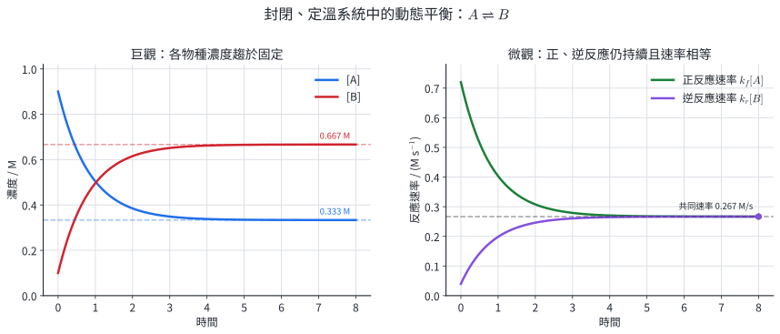{width=98%}

判斷一項巨觀量是否足以證明平衡，需確認它會隨反應進度改變。例如 $H_2(g)+I_2(g)\rightleftharpoons2HI(g)$ 的氣體總莫耳數前後相同，定溫定容時總壓可一直不變；各物種分壓維持定值才直接對應組成固定。

::: worked-example
### 示範 1｜用正、逆速率判斷平衡

$A\rightleftharpoons B$ 在某溫度下有 $k_f=0.60\ \mathrm{s^{-1}}$、$k_r=0.20\ \mathrm{s^{-1}}$。某時刻 $[A]=0.25\ \mathrm M$、$[B]=0.75\ \mathrm M$。

$$
v_f=k_f[A]=(0.60)(0.25)=0.150\ \mathrm{M\,s^{-1}},
$$

$$
v_r=k_r[B]=(0.20)(0.75)=0.150\ \mathrm{M\,s^{-1}}.
$$

兩速率相等，因此此組成是平衡組成。此時 $[A]\ne[B]$，再次顯示平衡判準是兩方向速率相等。
:::

::: worked-example
### 示範 2｜選擇能辨認平衡的觀測量

對 $N_2(g)+3H_2(g)\rightleftharpoons2NH_3(g)$，在定溫定容密閉容器中連續量測總質量、總壓、$NH_3$ 分壓。

密閉容器的總質量由質量守恆固定，反應開始前後都不變，因此辨識力為零。此反應氣體係數總和由 $4$ 變成 $2$，反應進行會改變總莫耳數，所以總壓進入平台可作巨觀證據。$NH_3$ 分壓直接反映其物質量，進入平台也可作證據。結論需附帶溫度、體積固定、容器無洩漏，且量測時間足以排除短暫波動。
:::

### 1.3 NO$_2$/N$_2$O$_4$：用顏色看見平衡移動

$$
2NO_2(g)\rightleftharpoons N_2O_4(g)+\text{熱}.
$$

$NO_2$ 呈紅棕色，$N_2O_4$ 顏色很淡。壓縮密閉注射筒時，所有氣體濃度先同時升高，所以顏色立即變深；接著淨反應向右，部分 $NO_2$ 形成 $N_2O_4$，顏色逐漸變淡。新平衡的體積仍較小，因此最後通常仍比壓縮前深。這個「瞬間變化—後續鬆弛」次序是判讀平衡實驗的核心。

本實驗只能在有教師監督的實驗室或通風櫥中進行。$NO_2$ 具急性吸入毒性；製備用濃硝酸具強腐蝕性與氧化性，NaOH 吸收液也具腐蝕性。操作需使用密閉裝置、護目鏡、合適手套與通風櫥。尾氣以 NaOH 吸收，吸收液依校內鹼性含氮廢液規範收集；暴露或洩漏依安全資料表與校內緊急程序處置。

### 1.4 直接用途與模型限制

血紅素與氧的結合、氣體感測器的可逆吸附、可充電電池的電極反應與工業循環製程，都需要區分「反應能否進行」與「最後停在哪個組成」。本節的動態模型描述封閉系統在指定條件下的穩定組成；活細胞與連續工廠常有物質流入、流出，屬開放穩態，需再加入流量與能量收支。

### 練習 1

1. $A(g)\rightleftharpoons B(g)$ 在某時刻 $v_f=2.4\times10^{-3}$、$v_r=1.9\times10^{-3}\ \mathrm{M\,s^{-1}}$。寫出淨反應方向；兩速率之後如何變化才會達平衡？
2. 對 $2SO_2(g)+O_2(g)\rightleftharpoons2SO_3(g)$，列出兩項可在定溫定容下反映組成固定的巨觀量。
3. 對 $H_2(g)+Cl_2(g)\rightleftharpoons2HCl(g)$，說明總壓維持定值為何不足以單獨證明平衡。
4. 平衡時每秒有 $4.0\times10^{18}$ 個 A 分子轉成 B。每秒應有多少個 B 分子轉回 A？8 秒內兩方向各轉換多少個分子？
5. 壓縮已達平衡的 $NO_2/N_2O_4$ 混合氣。將「壓縮前、壓縮瞬間、新平衡」的顏色依深淺排序，並說明原因。

### 練習 1 解析

1. $v_f>v_r$，淨反應向右。A 被淨消耗使正反應速率下降，B 淨增加使逆反應速率上升，直到 $v_f=v_r$。
2. 可量測各物種濃度或分壓，例如 $SO_2$ 分壓與 $SO_3$ 分壓；也可量測與組成經校正連結的吸光度。
3. 反應前後氣體係數總和都是 $2$。組成改變時，總莫耳數與總壓仍可保持不變。
4. 動態平衡時兩方向速率相等，所以每秒也是 $4.0\times10^{18}$ 個 B 轉回 A。8 秒內每一方向均轉換 $3.2\times10^{19}$ 個；淨變化為零。
5. 壓縮瞬間最深，新平衡次之，壓縮前最淡。瞬間體積減少使 $[NO_2]$ 增大；接著 $2NO_2\to N_2O_4$ 淨進行而變淡；新平衡仍在較小體積，$NO_2$ 濃度通常高於壓縮前。

## 2. 平衡常數、反應商與平衡組成

### 2.1 $K_c$、$K_p$ 與標準狀態

對 $aA(g)+bB(g)\rightleftharpoons cC(g)+dD(g)$，

$$
K_c=\frac{[C]^c[D]^d}{[A]^a[B]^b},\qquad
K_p=\frac{(P_C)^c(P_D)^d}{(P_A)^a(P_B)^b}.
$$

嚴格熱力學定義使用相對於標準態的活性或壓力比，因此 $K$ 無因次。高中計算常直接代入以 $\mathrm{mol\,L^{-1}}$ 或 atm 表示的數值；同一題需使用一致單位與同一溫度。理想氣體滿足 $P_i=[i]RT$，所以

$$
K_p=K_c(RT)^{\Delta n_g},\qquad
\Delta n_g=(c+d)-(a+b),
$$

其中只計氣態物種係數。

### 2.2 反應式改寫與 $K$ 的代數規則

- 反應反向：$K'=1/K$。
- 全部係數乘 $n$：$K'=K^n$。
- 多個反應式相加：總反應的 $K$ 為各步 $K$ 相乘。

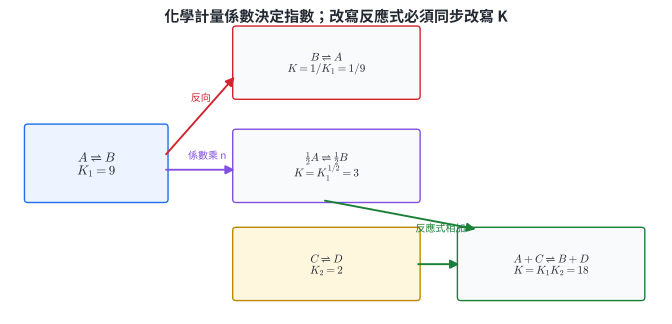{width=96%}

::: worked-example
### 示範 3｜寫出 $K_c$、$K_p$ 並連結兩者

對 $N_2(g)+3H_2(g)\rightleftharpoons2NH_3(g)$，

$$
K_c=\frac{[NH_3]^2}{[N_2][H_2]^3},\qquad
K_p=\frac{P_{NH_3}^2}{P_{N_2}P_{H_2}^3}.
$$

$\Delta n_g=2-(1+3)=-2$，所以 $K_p=K_c(RT)^{-2}=K_c/(RT)^2$。
:::

::: worked-example
### 示範 4｜由已知反應求改寫反應的 $K$

已知 $2SO_2+O_2\rightleftharpoons2SO_3$ 的 $K=4.0\times10^5$。求 $SO_3\rightleftharpoons SO_2+\tfrac12O_2$ 的 $K'$。

新反應先反向，再把係數乘 $1/2$：

$$
K'=\left(\frac1K\right)^{1/2}
=\frac{1}{\sqrt{4.0\times10^5}}
=1.58\times10^{-3}.
$$
:::

### 2.3 反應商 $Q$ 與方向

反應商把某一時刻的濃度或分壓代入與 $K$ 相同的式子。固定溫度下，$Q<K$ 時淨反應向右；$Q=K$ 時在平衡；$Q>K$ 時淨反應向左。

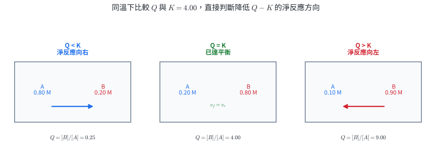{width=95%}

::: worked-example
### 示範 5｜由 $Q$ 判斷淨反應方向

$H_2+I_2\rightleftharpoons2HI$ 的 $K_c=50.0$。某時刻 $[H_2]=0.20$、$[I_2]=0.10$、$[HI]=0.50\ \mathrm M$。

$$
Q_c=\frac{(0.50)^2}{(0.20)(0.10)}=12.5<K_c.
$$

淨反應向右；$H_2$、$I_2$ 淨減少，$HI$ 淨增加，直到 $Q_c$ 回到 50.0。
:::

### 2.4 ICE 表與反應進度

ICE 分別代表 initial、change、equilibrium。C 列由單一反應進度 $x$ 乘化學計量係數；代入 $K$ 後解 $x$，再檢查平衡濃度皆非負且回代得到原 $K$。

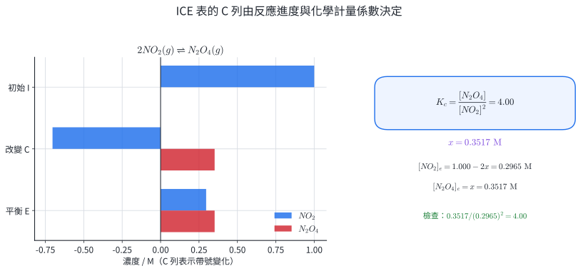{width=96%}

::: worked-example
### 示範 6｜由初始濃度求平衡組成

$2NO_2\rightleftharpoons N_2O_4$ 的 $K_c=4.00$。初始 $[NO_2]=1.000\ \mathrm M$、$[N_2O_4]=0$。令生成 $N_2O_4$ 的濃度為 $x$：

|  | $NO_2$ | $N_2O_4$ |
|---|---:|---:|
| I | $1.000$ | $0$ |
| C | $-2x$ | $+x$ |
| E | $1.000-2x$ | $x$ |

$$
4.00=\frac{x}{(1.000-2x)^2}.
$$

可行根 $x=0.3517\ \mathrm M$，所以 $[NO_2]_e=0.2965\ \mathrm M$、$[N_2O_4]_e=0.3517\ \mathrm M$。回代為 $4.00$。
:::

### 2.5 均相與異相平衡

所有物種在同一相，稱為均相平衡；跨越兩種以上相，稱為異相平衡。純固體與純液體在固定溫壓下的活性定為 1，因此不寫入平衡式。例如

$$
CaCO_3(s)\rightleftharpoons CaO(s)+CO_2(g),\qquad K_p=P_{CO_2}.
$$

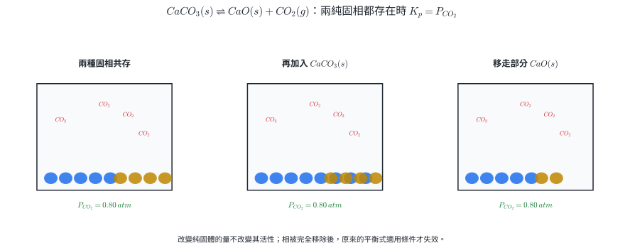{width=96%}

::: worked-example
### 示範 7｜$K_c$ 轉成 $K_p$

在 $500\ \mathrm K$，$2SO_2+O_2\rightleftharpoons2SO_3$ 的 $K_c=1.60\times10^3$。取 $R=0.082057\ \mathrm{L\,atm\,mol^{-1}\,K^{-1}}$。$\Delta n_g=-1$，因此

$$
K_p=\frac{1.60\times10^3}{(0.082057)(500)}=39.0.
$$
:::

### 2.6 比色量測平衡常數

對 $Fe^{3+}+SCN^-\rightleftharpoons FeSCN^{2+}$，紅色配合物的吸光度在適用濃度範圍近似滿足 $A=\varepsilon\ell c$。標準液以大量過量 $Fe^{3+}$ 使 $SCN^-$ 近似完全形成配合物，再用等吸光度與不同光徑求未知平衡濃度。

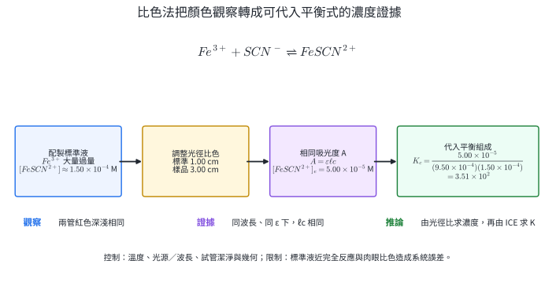{width=99%}

圖 6 中 $1.00\ \mathrm{cm}\times1.50\times10^{-4}\ \mathrm M=3.00\ \mathrm{cm}\times5.00\times10^{-5}\ \mathrm M$，所以樣品 $[FeSCN^{2+}]_e=5.00\times10^{-5}\ \mathrm M$；再由 ICE 得 $K_c=3.51\times10^2$。

實驗控制同一溫度、光源或波長、試管材質與潔淨度、觀察幾何。硝酸鐵溶液具氧化性與刺激性，酸化溶液具腐蝕性，KSCN 應避免與強酸及皮膚接觸；使用護目鏡、手套與吸球，所有含鐵與硫氰酸根溶液收集為指定無機／重金屬廢液。肉眼等色與「標準液近完全反應」是主要模型限制。

### 練習 2

1. 寫出 $CaCO_3(s)\rightleftharpoons CaO(s)+CO_2(g)$ 的 $K_c$ 與 $K_p$。在兩固相皆存在時加入更多 $CaCO_3$，平衡 $CO_2$ 分壓如何？
2. 已知 $A\rightleftharpoons2B$ 的 $K=16$。求 $B\rightleftharpoons\tfrac12A$ 的 $K'$。
3. $CO+H_2O\rightleftharpoons CO_2+H_2$ 的 $K_c=4.0$。某時刻四者濃度依序為 $0.40,0.20,0.10,0.80\ \mathrm M$，判斷方向。
4. $A\rightleftharpoons2B$ 的 $K_c=4.00$。初始只有 $[A]=1.00\ \mathrm M$，求平衡濃度。
5. $N_2O_4\rightleftharpoons2NO_2$ 在 $300\ \mathrm K$ 的 $K_c=0.200$。求 $K_p$，取 $R=0.082057$。
6. FeSCN$^{2+}$ 比色中，標準液濃度 $1.20\times10^{-4}\ \mathrm M$、光徑 $1.00\ \mathrm{cm}$；未知液光徑 $2.40\ \mathrm{cm}$ 時顏色相同。求未知液濃度。

### 練習 2 解析

1. $K_c=[CO_2]$、$K_p=P_{CO_2}$。純固體活性固定；兩固相仍共存且溫度不變時，加入固體不改變 $K$、$Q$ 或平衡分壓。
2. 先反向再乘 $1/2$：$K'=(1/16)^{1/2}=1/4$。
3. $Q_c=(0.10)(0.80)/[(0.40)(0.20)]=1.0<K_c$，淨反應向右。
4. 令 A 消耗 $x$，則 $[A]_e=1-x$、$[B]_e=2x$。由 $4=(2x)^2/(1-x)$ 得可行根 $x=0.618$，所以 $[A]_e=0.382\ \mathrm M$、$[B]_e=1.236\ \mathrm M$。
5. $\Delta n_g=1$，$K_p=(0.200)(0.082057)(300)=4.92$。
6. $\ell_1c_1=\ell_2c_2$，所以 $c_2=(1.00)(1.20\times10^{-4})/2.40=5.00\times10^{-5}\ \mathrm M$。

## 3. 勒沙特列原理與條件改變

### 3.1 原理的定量版本

勒沙特列原理指出，平衡系統受到條件改變時，會經由淨反應建立新平衡，使擾動的影響部分減弱。定量判斷依序為：寫 $K$ 式，只改擾動瞬間直接受影響的量，算新 $Q$，最後依 $Q/K$ 寫後續變化。

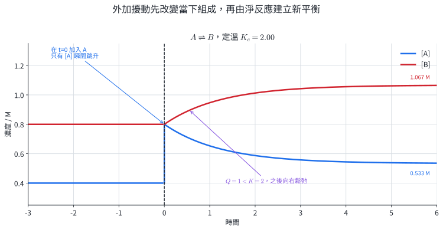{width=96%}

::: worked-example
### 示範 8｜濃度擾動的瞬間與新平衡

$A\rightleftharpoons B$ 的 $K_c=2.00$，原平衡 $[A]=0.40$、$[B]=0.80\ \mathrm M$。瞬間加入 A，使 $[A]$ 變成 $0.80\ \mathrm M$。

$$
Q_c=\frac{0.80}{0.80}=1.00<K_c,
$$

所以之後淨反應向右。總濃度為 $1.60\ \mathrm M$，新平衡滿足 $[B]/[A]=2$：$[A]_e=0.533\ \mathrm M$、$[B]_e=1.067\ \mathrm M$。A 在加入瞬間由 $0.40$ 跳至 $0.80$，後續才降至 $0.533\ \mathrm M$；新值仍高於原值。
:::

### 3.2 體積、壓力與惰性氣體

定溫下縮小容器體積，所有氣體分壓按相同比例瞬間增大。若反應兩側氣體係數總和不同，$Q_p$ 會偏離 $K_p$；系統淨反應通常移向氣體莫耳數較少的一側。

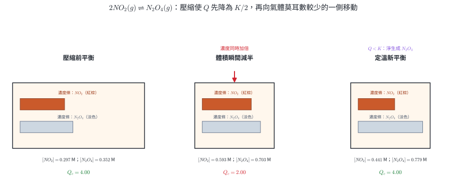{width=99%}

::: worked-example
### 示範 9｜精確計算壓縮後的新平衡

沿用 $2NO_2\rightleftharpoons N_2O_4$、$K_c=4.00$。壓縮前 $[NO_2]=0.2965$、$[N_2O_4]=0.3517\ \mathrm M$。體積瞬間減半後為 $0.5931$ 與 $0.7035\ \mathrm M$，

$$
Q_c=\frac{0.7035}{(0.5931)^2}=2.00<K_c.
$$

令後續生成 $N_2O_4$ 的濃度為 $y$：

$$
4.00=\frac{0.7035+y}{(0.5931-2y)^2}.
$$

可行根 $y=0.07584\ \mathrm M$，新平衡 $[NO_2]=0.4414\ \mathrm M$、$[N_2O_4]=0.7793\ \mathrm M$。$[NO_2]+2[N_2O_4]$ 在後續反應前後皆為 $2.000\ \mathrm M$。
:::

惰性氣體效果取決於操作條件：定溫定容加入 He 時各反應氣體分壓不變，$Q_p$ 不變；定溫定壓加入 He 時容器膨脹，各反應氣體分壓下降，系統依 $\Delta n_g$ 判斷；反應兩側氣體係數總和相同時，等比例改變分壓後 $Q_p$ 不變。

### 3.3 溫度與平衡常數

溫度改變指定反應的 $K$。把熱量寫入反應式可作方向判斷：放熱正反應升溫時偏向反應物，$K$ 變小；吸熱正反應升溫時偏向產物，$K$ 變大。

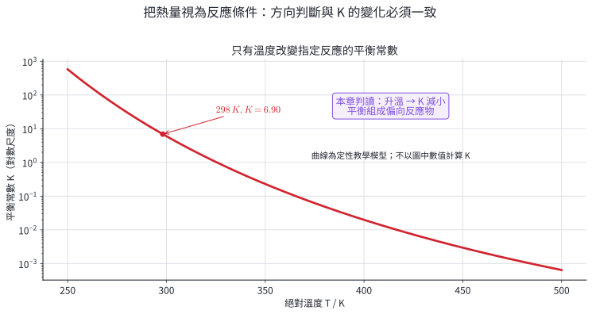{width=94%}

::: worked-example
### 示範 10｜由不同溫度的 $K$ 判斷反應熱

某反應在 $300\ \mathrm K$、$400\ \mathrm K$ 的 $K$ 分別為 $0.80$、$5.2$。升溫使 $K$ 增大，代表平衡組成中的產物相對增加，因此正反應吸熱。由 $400\ \mathrm K$ 降回 $300\ \mathrm K$，淨反應偏向反應物，新的 $K$ 回到 $0.80$。
:::

### 3.4 催化劑與達平衡時間

催化劑提供較低活化能路徑，正、逆反應都加速。反應物與產物的能量差不變，所以相同溫度下 $K$ 與平衡組成不變；從同一初始組成出發，曲線較快進入相同平台。

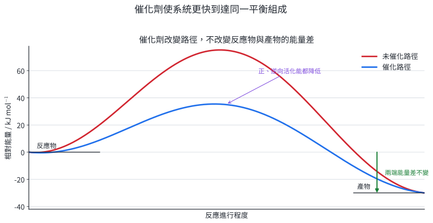{width=94%}

### 3.5 合成氨的多條件權衡

$$
N_2(g)+3H_2(g)\rightleftharpoons2NH_3(g)+\text{熱}.
$$

低溫提高平衡產率，卻使反應變慢；高壓提高產率，也增加壓縮與耐壓設備成本。工業上採用適中溫度、高壓、鐵系催化劑，冷凝移除 $NH_3$ 並循環未反應氣體。

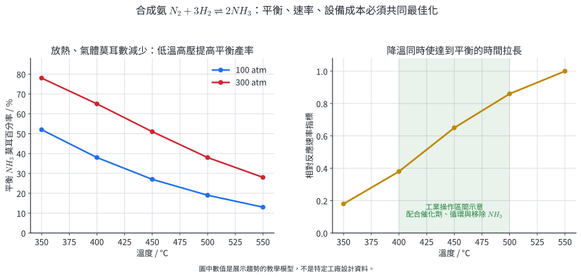{width=98%}

::: worked-example
### 示範 11｜辨認條件對 $Q$、$K$ 與時間的不同作用

合成氨系統已達平衡：

1. 定溫定容加入 $H_2$：$Q_p$ 分母增大而 $Q_p<K_p$，向右；$K_p$ 不變。
2. 升溫：放熱正反應的 $K_p$ 變小，平衡向左；正、逆速率常都先變快。
3. 加催化劑：正、逆反應都更快，平衡組成不變，達平衡時間縮短。
:::

### 練習 3

1. $N_2+3H_2\rightleftharpoons2NH_3$ 定溫平衡後加入 $NH_3$，寫出 $Q_p$ 的瞬間變化、方向與 $K_p$ 是否改變。
2. $CO+H_2O\rightleftharpoons CO_2+H_2$ 定溫壓縮至體積一半。以 $Q_p$ 說明是否移動。
3. 對 $N_2O_4\rightleftharpoons2NO_2$，比較定溫定容加入 He 與定溫定壓加入 He。
4. 某反應的 $K$：300 K 時 12.0、400 K 時 3.4、500 K 時 1.2。判斷正反應吸放熱與升溫時方向。
5. 畫出有、無催化劑時產物濃度對時間的兩條曲線，標示平台值與時間關係。
6. 對 $2NO_2\rightleftharpoons N_2O_4+\text{熱}$，敘述壓縮與加熱時紅棕色的立即變化及後續變化。

### 練習 3 解析

1. $Q_p=P_{NH_3}^2/(P_{N_2}P_{H_2}^3)$。加入 $NH_3$ 使 $Q_p>K_p$，淨反應向左；溫度不變，所以 $K_p$ 不變。
2. 各分壓都加倍，$Q_p'=(2P_{CO_2})(2P_{H_2})/[(2P_{CO})(2P_{H_2O})]=Q_p=K_p$，所以無移動。
3. 定容加入 He 時各反應氣體分壓不變。定壓加入 He 時體積增大、分壓下降，$Q_p=P_{NO_2}^2/P_{N_2O_4}$ 下降，向右移動。
4. 升溫使 $K$ 下降，正反應放熱；升溫後平衡向反應物側移動。
5. 兩曲線到達同一平台；有催化劑者初期斜率較大、較早進入平台。
6. 壓縮：$NO_2$ 濃度立即升高而變深，接著向右形成 $N_2O_4$ 而逐漸變淡。定容加熱：平衡向吸熱的左側移動，$NO_2$ 增加而逐漸變深。

## 4. 溶解平衡與溶度積

### 4.1 難溶鹽的動態溶解平衡

難溶鹽放入水中，晶格表面的離子持續進入溶液，溶液中的離子也持續回到晶格。當溶解速率等於結晶速率時，固體與飽和溶液達到動態平衡。例如

$$
AgCl(s)\rightleftharpoons Ag^+(aq)+Cl^-(aq).
$$

純固體活性為 1，**溶度積常數**為

$$
K_{sp}=[Ag^+][Cl^-].
$$

對一般鹽 $A_xB_y(s)\rightleftharpoons xA^{m+}+yB^{n-}$，

$$
K_{sp}=[A^{m+}]^x[B^{n-}]^y.
$$

$K_{sp}$ 只在指定溫度下描述飽和溶液。溶液中沒有固體且離子積小於 $K_{sp}$ 時屬未飽和；此時把現有濃度相乘得到的是 $Q_{sp}$。

### 4.2 莫耳溶解度與化學計量

**莫耳溶解度** $s$ 是每公升飽和溶液中溶解鹽的莫耳數。離子濃度需乘上解離係數：

$$
AB(s)\rightleftharpoons A^++B^-:\quad [A^+]=s, [B^-]=s, K_{sp}=s^2,
$$

$$
AB_2(s)\rightleftharpoons A^{2+}+2B^-:\quad [A^{2+}]=s, [B^-]=2s, K_{sp}=4s^3.
$$

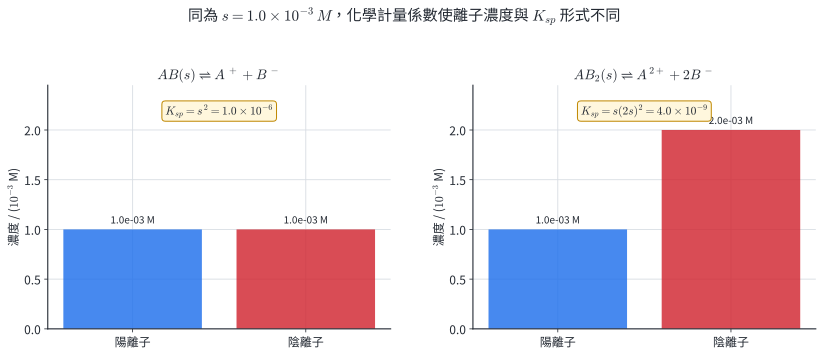{width=96%}

::: worked-example
### 示範 12｜由 $K_{sp}$ 求 $PbI_2$ 的莫耳溶解度

在某溫度下 $K_{sp}(PbI_2)=7.1\times10^{-9}$：

$$
PbI_2(s)\rightleftharpoons Pb^{2+}+2I^-.
$$

若在純水中的莫耳溶解度為 $s$，則

$$
K_{sp}=s(2s)^2=4s^3.
$$

$$
s=\left(\frac{7.1\times10^{-9}}4\right)^{1/3}
=1.21\times10^{-3}\ \mathrm M.
$$

因此 $[Pb^{2+}]=1.21\times10^{-3}\ \mathrm M$，$[I^-]=2.42\times10^{-3}\ \mathrm M$；回代濃度與係數相符。
:::

### 4.3 同離子效應

若溶液原本已有與難溶鹽相同的離子，溶解反應的 $Q_{sp}$ 增大，平衡向固體側移動，莫耳溶解度下降，稱為**同離子效應**。

對 AgCl 加入初始濃度 $c_0$ 的 $Cl^-$，若另溶解 $s$：

$$
K_{sp}=s(c_0+s).
$$

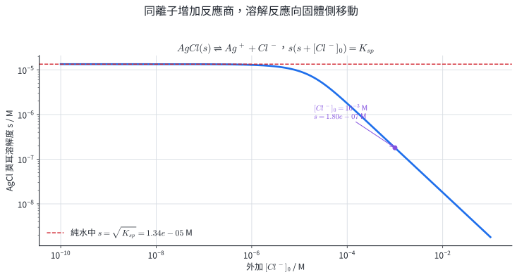{width=94%}

::: worked-example
### 示範 13｜AgCl 在含 $Cl^-$ 溶液中的溶解度

$K_{sp}(AgCl)=1.8\times10^{-10}$。求 AgCl 在 $1.00\times10^{-3}\ \mathrm M$ NaCl 中的 $s$。

$$
s(1.00\times10^{-3}+s)=1.8\times10^{-10}.
$$

解二次式得

$$
s=1.80\times10^{-7}\ \mathrm M.
$$

因 $s/(1.00\times10^{-3})=1.80\times10^{-4}$，可用 $1.00\times10^{-3}+s\approx1.00\times10^{-3}$ 近似；近似值同為 $1.8\times10^{-7}\ \mathrm M$。近似是否成立要以所得 $s$ 回頭比較，不能只看題目數字大小。
:::

::: worked-example
### 示範 14｜比較 $K_{sp}$ 與溶解度時先看化學計量

某溫度下 $K_{sp}(AB)=4.0\times10^{-8}$，$K_{sp}(AB_2)=3.2\times10^{-11}$。

對 AB：

$$
s=\sqrt{4.0\times10^{-8}}=2.0\times10^{-4}\ \mathrm M.
$$

對 $AB_2$：

$$
4s^3=3.2\times10^{-11}
\Rightarrow s=2.0\times10^{-4}\ \mathrm M.
$$

兩者 $K_{sp}$ 相差三個數量級，莫耳溶解度卻相同。直接比較 $K_{sp}$ 大小只適用於解離化學計量形式相同的鹽。
:::

### 4.4 直接用途與模型限制

調整共同離子可控制藥物結晶、礦物析出、鍋爐水垢與金屬鹽回收。只用 $K_{sp}$ 的簡化模型假設離子以自由水合離子存在且溶液近理想；高離子強度、錯離子形成、酸鹼反應與多晶型會改變實際溶解度。題目若提供配位或酸鹼資訊，需把相關平衡一併列入。

### 練習 4

1. $K_{sp}(AgBr)=5.0\times10^{-13}$，求其在純水中的莫耳溶解度。
2. $K_{sp}[Mg(OH)_2]=1.8\times10^{-11}$，求純水中的莫耳溶解度與 $[OH^-]$。
3. $K_{sp}(AgCl)=1.8\times10^{-10}$。估算在 $0.010\ \mathrm M$ NaCl 中的莫耳溶解度，並檢查近似。
4. 飽和 AgCl 溶液中仍有固體。加入等體積純水後，立即的 $Q_{sp}$ 與 $K_{sp}$ 關係如何？之後固體量與離子濃度如何變化？
5. 某鹽的 $K_{sp}$ 在 20°C 為 $2.0\times10^{-9}$，在 50°C 為 $8.0\times10^{-9}$。判斷其溶解反應吸放熱，並說明升溫對溶解度的影響。

### 練習 4 解析

1. AgBr 是 1:1 鹽，$K_{sp}=s^2$：

   $$
   s=\sqrt{5.0\times10^{-13}}=7.1\times10^{-7}\ \mathrm M.
   $$

2. $Mg(OH)_2\rightleftharpoons Mg^{2+}+2OH^-$，所以 $K_{sp}=s(2s)^2=4s^3$：

   $$
   s=\left(\frac{1.8\times10^{-11}}4\right)^{1/3}=1.65\times10^{-4}\ \mathrm M,
   $$

   $[OH^-]=2s=3.30\times10^{-4}\ \mathrm M$。
3. $s(0.010+s)=1.8\times10^{-10}$。取 $s\ll0.010$：

   $$
   s\approx\frac{1.8\times10^{-10}}{0.010}=1.8\times10^{-8}\ \mathrm M.
   $$

   $s/0.010=1.8\times10^{-6}$，近似成立。
4. 稀釋使兩離子濃度都減半，$Q_{sp}$ 立即變成原來的 $1/4$，所以 $Q_{sp}<K_{sp}$。之後部分固體溶解，使離子濃度上升直到乘積回到 $K_{sp}$；固體量減少。只要固體仍存在，最後在同溫下仍是飽和濃度。
5. 升溫使 $K_{sp}$ 增大，代表溶解平衡偏向溶液離子，溶解反應吸熱；升溫通常提高莫耳溶解度。

## 5. 離子沉澱、分離與確認

### 5.1 離子積與沉澱條件

把混合後的當下離子濃度代入溶度積形式，得到**離子積** $Q_{sp}$：

$$
\begin{aligned}
Q_{sp}<K_{sp}&:\ \text{未飽和，無沉澱生成},\\
Q_{sp}=K_{sp}&:\ \text{飽和或剛達沉澱門檻},\\
Q_{sp}>K_{sp}&:\ \text{過飽和，生成沉澱直到回到平衡}.
\end{aligned}
$$

混合溶液時先用總體積求混合後濃度，再算 $Q_{sp}$。出現沉澱後，剩餘離子濃度由化學計量、物料守恆與 $K_{sp}$ 共同決定。

::: worked-example
### 示範 15｜混合後是否生成 AgCl

等體積混合 $2.00\times10^{-4}\ \mathrm M$ AgNO$_3$ 與 $1.00\times10^{-3}\ \mathrm M$ NaCl。混合後

$$
[Ag^+]=1.00\times10^{-4}\ \mathrm M,\qquad
[Cl^-]=5.00\times10^{-4}\ \mathrm M.
$$

$$
Q_{sp}=(1.00\times10^{-4})(5.00\times10^{-4})=5.00\times10^{-8}.
$$

$Q_{sp}>K_{sp}(AgCl)=1.8\times10^{-10}$，所以生成 AgCl 沉澱。這個判斷只回答「會不會開始沉澱」；平衡後剩餘濃度需另做物料守恆。
:::

### 5.2 起始沉澱濃度與選擇分離

逐漸加入沉澱劑時，每種鹽開始沉澱都有臨界濃度。若離子 X 與沉澱劑 M 形成 $MX$：

$$
[M]_{\mathrm{start}}=\frac{K_{sp}}{[X]}.
$$

若形成 $M_2Y$：

$$
[M]_{\mathrm{start}}=\sqrt{\frac{K_{sp}}{[Y]}}.
$$

先達門檻的鹽先沉澱；兩門檻之間是選擇分離的操作窗。

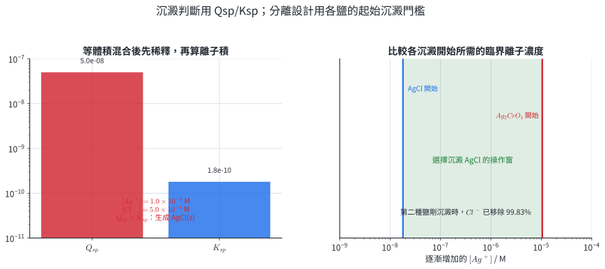{width=99%}

::: worked-example
### 示範 16｜設計 $Cl^-$、$CrO_4^{2-}$ 的選擇沉澱

溶液初始 $[Cl^-]=[CrO_4^{2-}]=0.010\ \mathrm M$，逐漸加入 Ag$^+$。取

$$
K_{sp}(AgCl)=1.8\times10^{-10},\qquad
K_{sp}(Ag_2CrO_4)=1.1\times10^{-12}.
$$

AgCl 開始沉澱時

$$
[Ag^+]=\frac{1.8\times10^{-10}}{0.010}=1.8\times10^{-8}\ \mathrm M.
$$

$Ag_2CrO_4$ 開始沉澱時

$$
[Ag^+]=\sqrt{\frac{1.1\times10^{-12}}{0.010}}
=1.05\times10^{-5}\ \mathrm M.
$$

因此 AgCl 先沉澱。在第二種鹽剛開始沉澱時，

$$
[Cl^-]=\frac{1.8\times10^{-10}}{1.05\times10^{-5}}
=1.72\times10^{-5}\ \mathrm M,
$$

已移除的 $Cl^-$ 比例為 $1-(1.72\times10^{-5}/0.010)=99.83\%$。這項結果假設體積變化可忽略、沒有錯離子或共沉澱。
:::

### 5.3 沉澱確認與證據強度

沉澱的顏色、酸鹼溶解性與配位溶解性可提供離子確認線索。可靠流程要同時包含空白試驗、已知陽性對照、選擇性試劑與後續確認反應。單一白色沉澱通常對應多種可能離子，因此推論應寫成「結果支持某離子存在」，再用第二個獨立證據縮小範圍。

沉澱分離直接應用於飲用水軟化、硫酸根分析、重金屬廢水處理與礦物精製。硝酸銀具氧化性並可灼傷皮膚、鉻酸鹽含六價鉻且具高危害；示範資料只用於計算，實作需依學校核准的微量方案、通風與個人防護，含銀、鉛、鉻及其他重金屬沉澱與濾液分流收集，不排入水槽。

::: worked-example
### 示範 17｜把沉澱觀察寫成證據鏈

未知液加入含 $Ba^{2+}$ 試劑後出現白色沉澱；另一份未知液先酸化再加同試劑，仍出現白色沉澱。可作如下推理：

1. 觀察：兩份試樣均形成白色固體。
2. 證據：酸化可消耗 $CO_3^{2-}$ 並釋出 $CO_2$，卻不會同樣移除 $SO_4^{2-}$。
3. 推論：酸化後仍沉澱的結果支持 $SO_4^{2-}$ 存在，並降低「只有 $CO_3^{2-}$」的可能性。
4. 控制：以純水作空白、已知硫酸鹽作陽性對照，保持酸量與試劑量一致。

若題目提供其他可與 $Ba^{2+}$ 形成難溶鹽的陰離子，仍需加入相應排除步驟。
:::

### 練習 5

1. 混合 $25.0\ \mathrm{mL}$、$4.0\times10^{-4}\ \mathrm M$ AgNO$_3$ 與 $75.0\ \mathrm{mL}$、$2.0\times10^{-4}\ \mathrm M$ NaCl。以 $K_{sp}=1.8\times10^{-10}$ 判斷是否沉澱。
2. 溶液中 $[Br^-]=2.0\times10^{-3}\ \mathrm M$，$K_{sp}(AgBr)=5.0\times10^{-13}$。求 AgBr 開始沉澱所需 $[Ag^+]$。
3. 某溶液含等濃度 $SO_4^{2-}$、$CO_3^{2-}$，逐漸加入 $Ba^{2+}$。若 $K_{sp}(BaSO_4)=1.1\times10^{-10}$、$K_{sp}(BaCO_3)=5.0\times10^{-9}$，何者先沉澱？
4. 在 $Ag_2CrO_4$ 剛開始沉澱、$[Ag^+]=1.0\times10^{-5}\ \mathrm M$ 時，利用 $K_{sp}(AgCl)=1.8\times10^{-10}$ 求殘餘 $[Cl^-]$。若初始 $[Cl^-]=0.020\ \mathrm M$，求移除百分率。
5. 寫出以沉澱反應確認 $SO_4^{2-}$ 的一組「空白、陽性對照、未知樣」安排，並寫出一項安全／廢液處置。

### 練習 5 解析

1. 總體積 $0.100\ \mathrm L$：

   $$
   [Ag^+]=\frac{(0.0250)(4.0\times10^{-4})}{0.100}=1.0\times10^{-4}\ \mathrm M,
   $$

   $$
   [Cl^-]=\frac{(0.0750)(2.0\times10^{-4})}{0.100}=1.5\times10^{-4}\ \mathrm M.
   $$

   $Q_{sp}=1.5\times10^{-8}>K_{sp}$，生成 AgCl。
2. $[Ag^+]_{\mathrm{start}}=K_{sp}/[Br^-]=(5.0\times10^{-13})/(2.0\times10^{-3})=2.5\times10^{-10}\ \mathrm M$。
3. 兩鹽都是 1:1，陰離子初濃度相同，所需 $[Ba^{2+}]$ 與 $K_{sp}$ 成正比。$BaSO_4$ 的門檻較低，先沉澱。
4. $[Cl^-]=K_{sp}/[Ag^+]=1.8\times10^{-5}\ \mathrm M$。移除率

   $$
   \left(1-\frac{1.8\times10^{-5}}{0.020}\right)\times100\%=99.91\%.
   $$

5. 空白以純水加同量酸與 $Ba^{2+}$ 試劑；陽性對照以已知硫酸鹽作相同處理；未知樣先酸化再加試劑，比較是否形成白色沉澱。使用護目鏡與手套，含鋇／重金屬的沉澱和濾液收集至指定無機廢液桶。

## 6. 章末分層題

### 基礎題 1–6

1. 用「速率」與「濃度」各寫一句動態平衡的定義。
2. 寫出 $2SO_2(g)+O_2(g)\rightleftharpoons2SO_3(g)$ 的 $K_c$。
3. 已知 $A\rightleftharpoons B$ 的 $K=25$，求 $2B\rightleftharpoons2A$ 的平衡常數。
4. $A\rightleftharpoons B$ 的 $K_c=3.0$。某時刻 $[A]=0.40\ \mathrm M$、$[B]=0.60\ \mathrm M$，判斷淨反應方向。
5. $A\rightleftharpoons B$ 的 $K_c=3.0$，初始 $[A]=1.00\ \mathrm M$、$[B]=0$。求平衡濃度。
6. $N_2+3H_2\rightleftharpoons2NH_3$ 在 $700\ \mathrm K$ 的 $K_c=5.0\times10^3$。求 $K_p$，取 $R=0.082057$。

### 核心題 7–12

7. 合成氨平衡在定溫定容下加入 $N_2$。寫出 $Q_p$ 的變化、方向、新平衡 $N_2$ 分壓相對於原平衡的大小，以及 $K_p$ 是否改變。
8. 對 $N_2O_4\rightleftharpoons2NO_2$，說明定溫定容加入 He 與定溫定壓加入 He 的差異。
9. 某放熱可逆反應加入催化劑後再升溫。分別說明達平衡時間、$K$ 與產物平衡比例的變化。
10. $K_{sp}(MgF_2)=6.4\times10^{-9}$。求其在純水中的莫耳溶解度。
11. $K_{sp}(AgCl)=1.8\times10^{-10}$。估算 AgCl 在 $0.010\ \mathrm M$ NaCl 中的莫耳溶解度。
12. 混合 $20.0\ \mathrm{mL}$、$1.0\times10^{-3}\ \mathrm M$ AgNO$_3$ 與 $80.0\ \mathrm{mL}$、$5.0\times10^{-4}\ \mathrm M$ NaCl。判斷是否生成 AgCl。

### 跨節整合題 13–16

13. 密閉注射筒中 $2NO_2(g)\rightleftharpoons N_2O_4(g)+\text{熱}$ 已平衡。先在定溫下把體積壓成一半，待新平衡後再於定容下升溫。依序寫出每一步的 $Q/K$、顏色變化、$K$ 是否改變，並列兩項必要安全措施。
14. 比色法研究 $Fe^{3+}+SCN^-\rightleftharpoons FeSCN^{2+}$。標準液 $[FeSCN^{2+}]=1.20\times10^{-4}\ \mathrm M$、光徑 $1.00\ \mathrm{cm}$；未知平衡液光徑 $2.40\ \mathrm{cm}$ 時吸光度相同。未知液初始 $[Fe^{3+}]=1.00\times10^{-3}\ \mathrm M$、$[SCN^-]=1.50\times10^{-4}\ \mathrm M$。求平衡濃度與 $K_c$，並寫一個控制變因、一個模型限制與廢液去向。
15. 合成氨的教學資料如下。判斷 450°C 下壓力效果、300 atm 下溫度效果，並提出同時考慮平衡、速率與分離的操作策略。

   | 條件 | 400°C | 450°C | 500°C |
   |---|---:|---:|---:|
   | 100 atm 的平衡 NH$_3$ 比例 | 38% | 27% | 19% |
   | 300 atm 的平衡 NH$_3$ 比例 | 65% | 51% | 38% |

16. 溶液含 $[Cl^-]=0.020\ \mathrm M$、$[CrO_4^{2-}]=0.0050\ \mathrm M$，逐漸加入 Ag$^+$。取 $K_{sp}(AgCl)=1.8\times10^{-10}$、$K_{sp}(Ag_2CrO_4)=1.1\times10^{-12}$。求兩鹽開始沉澱的 $[Ag^+]$、先後次序、第二種鹽剛開始時 $Cl^-$ 移除率，並寫出一項影響真實分離效率的模型限制及廢液處置。

## 7. 章末題完整解析

1. 微觀速率：$v_f=v_r$ 且兩方向反應持續。巨觀濃度：各物種濃度隨時間維持定值。
2. 

   $$
   K_c=\frac{[SO_3]^2}{[SO_2]^2[O_2]}.
   $$

3. 先反向得到 $1/25$，再把係數乘 2：

   $$
   K'=(1/25)^2=1.6\times10^{-3}.
   $$

4. $Q_c=[B]/[A]=0.60/0.40=1.5<K_c$，淨反應向右。
5. 令 A 轉成 B 的濃度為 $x$：

   $$
   3.0=\frac{x}{1.00-x}\Rightarrow x=0.750.
   $$

   $[A]_e=0.250\ \mathrm M$、$[B]_e=0.750\ \mathrm M$；回代比值為 3.00。
6. $\Delta n_g=2-4=-2$：

   $$
   K_p=K_c(RT)^{-2}
   =\frac{5.0\times10^3}{[(0.082057)(700)]^2}
   =1.52.
   $$

7. 加入 $N_2$ 使 $Q_p=P_{NH_3}^2/(P_{N_2}P_{H_2}^3)$ 瞬間下降，$Q_p<K_p$，向右。後續消耗部分新增 $N_2$，但新平衡 $P_{N_2}$ 仍高於加料前；定溫使 $K_p$ 不變。
8. 定容加入 He 時 $P_i=n_iRT/V$ 對反應氣體皆不變，$Q_p$ 不變。定壓加入 He 使體積增大，各反應氣體分壓下降；$Q_p=P_{NO_2}^2/P_{N_2O_4}$ 下降，向右側較多氣體莫耳數移動。
9. 催化劑使正、逆反應加速，達平衡時間縮短，$K$ 與平衡比例不變。再升溫時放熱正反應的 $K$ 變小，平衡產物比例降低；速率常整體提高。
10. $MgF_2\rightleftharpoons Mg^{2+}+2F^-$：

    $$
    6.4\times10^{-9}=s(2s)^2=4s^3,
    $$

    $$
    s=(1.6\times10^{-9})^{1/3}=1.17\times10^{-3}\ \mathrm M.
    $$

11. $s(0.010+s)=1.8\times10^{-10}$，因 $s\ll0.010$：

    $$
    s\approx1.8\times10^{-8}\ \mathrm M.
    $$

    比值 $s/0.010=1.8\times10^{-6}$，近似成立。
12. 總體積 $0.100\ \mathrm L$：

    $$
    [Ag^+]=2.0\times10^{-4}\ \mathrm M,\qquad
    [Cl^-]=4.0\times10^{-4}\ \mathrm M.
    $$

    $Q_{sp}=8.0\times10^{-8}>1.8\times10^{-10}$，生成 AgCl。
13. 壓縮瞬間所有濃度加倍：

    $$
    Q_c'=\frac{2[N_2O_4]}{(2[NO_2])^2}=\frac12K_c<K_c.
    $$

    $NO_2$ 濃度立即升高使顏色變深，後續向右形成 $N_2O_4$ 而逐漸變淡；定溫下 $K_c$ 不變。待新平衡後定容升溫，組成在瞬間尚未改變，但放熱正反應的 $K_c$ 變小，因此當下 $Q_c>K_c(\text{高溫})$，後續向左、$NO_2$ 增加而變深。安全措施可列：全程通風櫥與密閉裝置；護目鏡與合適手套；尾氣以 NaOH 吸收並收集指定廢液；依 SDS 處理暴露。
14. 相同吸光度且 $\varepsilon$ 相同：

    $$
    c_{eq}=\frac{(1.20\times10^{-4})(1.00)}{2.40}
    =5.00\times10^{-5}\ \mathrm M.
    $$

    ICE 給出

    $$
    [Fe^{3+}]_e=1.00\times10^{-3}-5.00\times10^{-5}=9.50\times10^{-4}\ \mathrm M,
    $$

    $$
    [SCN^-]_e=1.50\times10^{-4}-5.00\times10^{-5}=1.00\times10^{-4}\ \mathrm M.
    $$

    $$
    K_c=\frac{5.00\times10^{-5}}{(9.50\times10^{-4})(1.00\times10^{-4})}
    =5.26\times10^2.
    $$

    控制變因可寫溫度、波長、試管材質或潔淨度。模型限制可寫標準液近完全反應的假設、肉眼等色誤差或高濃度偏離 Beer 定律。所有含鐵與硫氰酸根溶液收集至校方指定無機／重金屬廢液。
15. 450°C 時由 100 atm 升至 300 atm，平衡比例由 27% 增至 51%，符合高壓偏向氣體係數較小的產物側。300 atm 時由 400°C 升至 500°C，比例由 65% 降至 38%，符合放熱正反應升溫使 $K$ 下降。操作策略採足以維持速率的適中溫度、高壓與催化劑；連續冷凝移除 $NH_3$，未反應 $N_2/H_2$ 循環。催化劑縮短時間，冷凝移除產物維持向右驅動，高壓提高單程平衡比例。
16. AgCl 開始沉澱：

    $$
    [Ag^+]_1=\frac{1.8\times10^{-10}}{0.020}=9.0\times10^{-9}\ \mathrm M.
    $$

    $Ag_2CrO_4$ 開始沉澱：

    $$
    [Ag^+]_2=\sqrt{\frac{1.1\times10^{-12}}{0.0050}}
    =1.48\times10^{-5}\ \mathrm M.
    $$

    AgCl 先沉澱。第二種鹽剛開始時

    $$
    [Cl^-]=\frac{1.8\times10^{-10}}{1.48\times10^{-5}}
    =1.22\times10^{-5}\ \mathrm M,
    $$

    $$
    \text{移除率}=\left(1-\frac{1.22\times10^{-5}}{0.020}\right)\times100\%=99.94\%.
    $$

    真實限制可列活度偏離、錯離子、共沉澱、成核延遲或加入試劑造成體積改變。含銀與六價鉻的沉澱、濾液分流至指定重金屬危害廢液，依校內規範交由合格單位處理。

## 8. 核心整理

::: {.compact-list}

- 動態平衡：封閉、定溫下 $v_f=v_r$；各物種巨觀濃度固定，微觀轉換持續。
- $K$ 由平衡組成與反應式定義，只隨溫度改變；反向取倒數、係數乘 $n$ 取 $n$ 次方、反應相加則相乘。
- $Q<K$ 向右、$Q=K$ 平衡、$Q>K$ 向左；ICE 變化量依化學計量相連。
- 濃度與體積先改 $Q$；溫度改 $K$；催化劑只改到達平衡的速率。惰性氣體要區分定容與定壓。
- $K_{sp}$ 的指數來自解離係數；混合後先稀釋，再以 $Q_{sp}/K_{sp}$ 判斷沉澱，並用起始門檻分析同離子與選擇沉澱。
- 實驗結論需保留控制變因、安全、廢液與模型限制。

:::
