# 選化III-2 酸鹼反應

酸鹼反應把一個質子從供體移到受體；解離常數量化這個轉移在水中的平衡位置。沿著同一套粒子與電荷帳，可以計算弱酸、弱鹼與鹽類水溶液的 pH，設計能穩定 pH 的緩衝液，再由滴定曲線把未知濃度、酸鹼強弱與指示劑選擇連成可量測的分析方法。實際用途包括水質監測、食品酸度分析、藥品配方與化學製程的 pH 控制。

::: learning-map
### 本章問題與能力

1. 如何由化學式命名酸、鹼與鹽，並判斷真正可解離的質子數？
2. 如何辨認布－洛酸鹼、共軛酸鹼對與質子轉移方向？
3. 如何用 $K_w$、$K_a$、$K_b$、質量平衡與電荷平衡求水溶液組成？
4. 同離子、多質子酸與鹽類水解如何改變主要物種與 pH？
5. 緩衝液如何吸收少量強酸、強鹼，目標 pH 與緩衝容量如何設計？
6. 如何由滴定裝置、化學計量、滴定曲線與指示劑範圍測定未知樣品？
:::

本章以高中常用的稀水溶液模型計算，將離子活度近似為體積莫耳濃度。溫度、離子強度或濃度很高時，精密分析需改用活度與儀器校正；題目若指定溫度或 $K_w$，便使用該條件的數值。

## 1. 酸、鹼的化學式、命名與可解離質子

### 1.1 無氧酸、含氧酸與金屬氫氧化物

無氧酸由氫與不含氧的陰離子組成。氣態分子與水溶液需連同狀態辨認：

| 化學式 | 名稱 |
|---|---|
| $HCl(g)$ | 氯化氫 |
| $HCl(aq)$ | 氫氯酸，常稱鹽酸 |
| $H_2S(aq)$ | 氫硫酸 |
| $HCN(aq)$ | 氫氰酸 |

同一中心原子的含氧酸可依氧原子數區分。氯的含氧酸形成一組可直接比較的系列：

| 化學式 | 名稱 | 共軛鹼 |
|---|---|---|
| $HClO_4$ | 過氯酸 | $ClO_4^-$ |
| $HClO_3$ | 氯酸 | $ClO_3^-$ |
| $HClO_2$ | 亞氯酸 | $ClO_2^-$ |
| $HClO$ | 次氯酸 | $ClO^-$ |

金屬氫氧化物命名為「氫氧化某」。金屬有多種常見氧化數時，可在名稱後標示氧化數，例如 $Fe(OH)_2$ 為氫氧化鐵（2），$Fe(OH)_3$ 為氫氧化鐵（3）。

### 1.2 可解離質子由結構決定

分子式中的氫原子數不必等於可解離質子數。磷的三種含氧酸可用結構中的 $O-H$ 鍵判斷：

- $H_3PO_4$ 有三個 $O-H$，是三質子酸。
- $H_3PO_3$ 的結構可寫為 $HPO(OH)_2$，有兩個 $O-H$，是二質子酸。
- $H_3PO_2$ 的結構可寫為 $H_2PO(OH)$，有一個 $O-H$，是單質子酸。

這項判斷同時決定中和計量。若 $1$ mol 酸在指定反應中完整釋出 $a$ mol $H^+$，與強鹼完全反應便需要 $a$ mol $OH^-$。

含氯漂白水中的 $ClO^-$ 遇酸會生成有毒氯氣：

$$
ClO^-+Cl^-+2H^+\rightarrow Cl_2+H_2O.
$$

反應前後都有兩個氯、兩個氫、一個氧，總電荷均為零。含氯漂白水應依產品標示單獨使用並保持通風；酸性清潔劑與含氨清潔劑都需分開存放與使用。

::: worked-example
### 示範 1｜由化學式命名並判斷類型

依序處理 $HMnO_4$、$HNO_2$、$Ca(OH)_2$、$Fe(OH)_3$。

1. $HMnO_4$ 的酸根是過錳酸根 $MnO_4^-$，名稱為過錳酸。
2. $HNO_2$ 的酸根是亞硝酸根 $NO_2^-$，名稱為亞硝酸。
3. $Ca(OH)_2$ 含 $Ca^{2+}$ 與兩個 $OH^-$，名稱為氫氧化鈣。
4. $Fe(OH)_3$ 中鐵的氧化數為 $+3$，名稱為氫氧化鐵（3）。

名稱中的前綴、酸根與金屬氧化數都由化學式的組成與電荷決定。
:::

::: worked-example
### 示範 2｜結構、質子數與中和計量

$0.0200$ mol $H_3PO_3$ 與足量 $NaOH$ 完全反應。$H_3PO_3=HPO(OH)_2$ 有兩個可解離的 $O-H$，因此

$$
H_3PO_3+2NaOH\rightarrow Na_2HPO_3+2H_2O.
$$

所需 $NaOH$ 為

$$
n_{NaOH}=2(0.0200)=0.0400\ \mathrm{mol}.
$$

產物 $Na_2HPO_3$ 中仍有一個直接連在磷上的氫；該氫不計入本反應的可解離質子。
:::

酸鹼命名直接服務藥品標示、清潔劑相容性與滴定計量。辨認 $HClO$、$ClO^-$ 與 $HCl$ 的名稱和粒子形式，便能由反應式追蹤漂白水在不同 pH 下的物種與危害。

### 分節練習 1

1. 寫出 $HCN(aq)$、$HClO_2$、$Fe(OH)_2$、$H_2MnO_4$ 的中文名稱。
2. 寫出過氯酸、亞硫酸、氫氧化鋁、氫氧化銅（2）的化學式。
3. 判斷 $H_3PO_4$、$H_3PO_3$、$H_3PO_2$ 的可解離質子數；各取 $0.0100$ mol 與強鹼完全反應時，所需 $OH^-$ 各為多少 mol？
4. 將漂白水酸化產生氯氣的淨離子反應式逐項檢查原子數與總電荷。

### 分節練習 1 解析

1. $HCN(aq)$：氫氰酸；$HClO_2$：亞氯酸；$Fe(OH)_2$：氫氧化鐵（2）；$H_2MnO_4$：錳酸。
2. 過氯酸 $HClO_4$；亞硫酸 $H_2SO_3$；氫氧化鋁 $Al(OH)_3$；氫氧化銅（2）$Cu(OH)_2$。
3. 可解離質子數依序為 $3,2,1$，所以需要的 $OH^-$ 依序為 $0.0300$、$0.0200$、$0.0100$ mol。
4. 
   $$
   ClO^-+Cl^-+2H^+\rightarrow Cl_2+H_2O.
   $$
   左側有 $Cl_2H_2O_1$，右側相同；左側電荷為 $-1-1+2=0$，右側中性，原子與電荷均守恆。

## 2. 布－洛酸鹼、共軛對與反應方向

### 2.1 酸鹼角色由質子轉移決定

布－洛酸是在一個反應步驟中提供質子 $H^+$ 的物種；布－洛鹼是接受質子的物種：

$$
\text{酸}_1+\text{鹼}_2\rightleftharpoons\text{鹼}_1+\text{酸}_2.
$$

酸失去一個 $H^+$ 後成為共軛鹼；鹼接受一個 $H^+$ 後成為共軛酸。每組共軛酸鹼對只差一個 $H^+$。

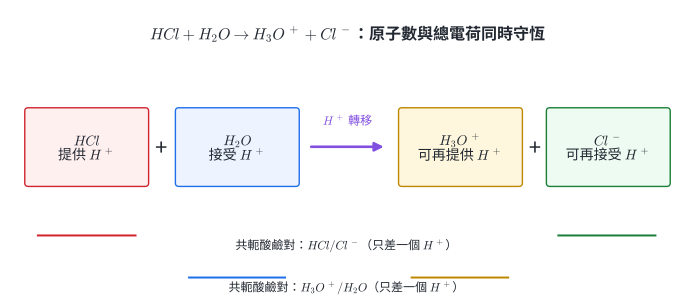{width=96%}

水可依反應對象扮演兩種角色：

$$
HCl+H_2O\rightarrow H_3O^++Cl^- \qquad (H_2O\text{ 接受 }H^+),
$$

$$
NH_3+H_2O\rightleftharpoons NH_4^++OH^- \qquad (H_2O\text{ 提供 }H^+).
$$

能提供也能接受質子的物種稱為兩性物種，例如 $H_2O$、$HCO_3^-$、$H_2PO_4^-$。

### 2.2 反應偏向較弱酸與較弱鹼

以共軛酸的 $pK_a$ 比較質子轉移：

$$
HA+B\rightleftharpoons A^-+BH^+,
$$

其平衡常數可近似寫成

$$
K\approx\frac{K_a(HA)}{K_a(BH^+)}
=10^{pK_a(BH^+)-pK_a(HA)}.
$$

$K>1$ 表示右側較有利。等價地說，平衡偏向酸、鹼都較弱的一側。

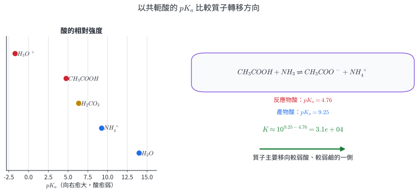{width=97%}

::: worked-example
### 示範 3｜辨認兩組共軛酸鹼對

考慮

$$
H_2PO_4^-+NH_3\rightleftharpoons HPO_4^{2-}+NH_4^+.
$$

$H_2PO_4^-$ 失去一個 $H^+$，所以是酸；$HPO_4^{2-}$ 是其共軛鹼。$NH_3$ 接受一個 $H^+$，所以是鹼；$NH_4^+$ 是其共軛酸。

兩組共軛對為

$$
H_2PO_4^-/HPO_4^{2-},\qquad NH_4^+/NH_3.
$$

原子與電荷檢查：左側總電荷 $-1$，右側 $-2+1=-1$。
:::

::: worked-example
### 示範 4｜由 $pK_a$ 求反應方向

已知 $pK_a(CH_3COOH)=4.76$、$pK_a(NH_4^+)=9.25$：

$$
CH_3COOH+NH_3\rightleftharpoons CH_3COO^-+NH_4^+.
$$

$$
K\approx10^{9.25-4.76}=3.1\times10^4.
$$

$K$ 遠大於 $1$，所以主要形成 $CH_3COO^-$ 與 $NH_4^+$。這個結果可用於混合前先完成酸鹼計量，再處理剩餘物種的平衡。
:::

布－洛模型可分析水處理、蛋白質側鏈、藥物鹽型與緩衝系統中的質子流向。它直接描述質子轉移；涉及電子對受體而沒有質子轉移的路易斯酸鹼反應，需使用更廣的模型。

### 分節練習 2

1. 在 $HCO_3^-+H_2O\rightleftharpoons H_2CO_3+OH^-$ 中，標出酸、鹼及兩組共軛酸鹼對。
2. 分別寫出 $HCO_3^-$ 接受 $H^+$ 與提供 $H^+$ 的反應，據此說明其兩性。
3. 已知 $pK_a(HF)=3.17$、$pK_a(CH_3COOH)=4.76$。估算
   $HF+CH_3COO^-\rightleftharpoons F^-+CH_3COOH$ 的 $K$ 與主要方向。
4. 已知 $pK_a(NH_4^+)=9.25$、$pK_a(CH_3COOH)=4.76$。判斷
   $NH_4^++CH_3COO^-\rightleftharpoons NH_3+CH_3COOH$ 的主要方向。

### 分節練習 2 解析

1. $HCO_3^-$ 接受質子，是鹼；$H_2O$ 提供質子，是酸。共軛對為 $H_2CO_3/HCO_3^-$ 與 $H_2O/OH^-$。
2. 接受質子：
   $$
   HCO_3^-+H^+\rightarrow H_2CO_3.
   $$
   提供質子：
   $$
   HCO_3^-\rightleftharpoons H^++CO_3^{2-}.
   $$
   它在不同反應中可接受或提供質子，因此具兩性。
3. 
   $$
   K\approx10^{4.76-3.17}=3.9\times10^1.
   $$
   反應主要向右，形成較弱酸 $CH_3COOH$ 與較弱鹼 $F^-$。
4.
   $$
   K\approx10^{4.76-9.25}=3.2\times10^{-5}.
   $$
   右向反應不利，主要物種留在左側。

## 3. 水的離子積、pH 與溫度

### 3.1 水的自解離與 $K_w$

水分子之間可發生質子轉移：

$$
2H_2O(l)\rightleftharpoons H_3O^+(aq)+OH^-(aq).
$$

高中計算常以 $H^+$ 簡寫 $H_3O^+$。定溫下，

$$
K_w=[H^+][OH^-].
$$

酸鹼對數尺度定義為

$$
pH=-\log[H^+],\qquad pOH=-\log[OH^-],\qquad pK_w=-\log K_w,
$$

所以

$$
pH+pOH=pK_w.
$$

中性條件是 $[H^+]=[OH^-]=\sqrt{K_w}$，因此中性 pH 為 $\tfrac12pK_w$。在 $25\,^\circ\mathrm C$，$K_w=1.0\times10^{-14}$，中性 pH 才恰為 $7.00$。

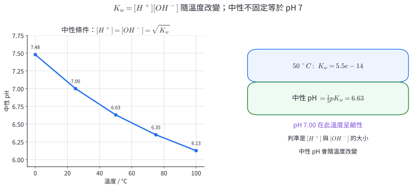{width=97%}

### 3.2 強酸、強鹼與濃度邊界

一般濃度的強單質子酸近乎完全解離，可取 $[H^+]\approx C_a$；強一元鹼可取 $[OH^-]\approx C_b$。多元強鹼需乘化學計量係數，例如

$$
[OH^-]\approx2C_{Ba(OH)_2}.
$$

當形式濃度接近純水自解離提供的 $[H^+]$ 或 $[OH^-]$ 時，水的貢獻不可省略；本章題目若涉及此區域，會提供或要求完整電荷平衡。

::: worked-example
### 示範 5｜溫度改變時判斷中性與酸鹼

$50\,^\circ\mathrm C$ 時 $K_w=5.5\times10^{-14}$。

$$
pK_w=-\log(5.5\times10^{-14})=13.26,
$$

$$
pH_{\mathrm{neutral}}=\frac{13.26}{2}=6.63.
$$

某溶液在此溫度的 pH 為 $7.00$，則

$$
pOH=13.26-7.00=6.26.
$$

$pH>pOH$，等價於 $[OH^-]>[H^+]$，所以溶液呈鹼性。
:::

::: worked-example
### 示範 6｜由強鹼質量求 pH

在 $25\,^\circ\mathrm C$，將 $0.400$ g $NaOH$ 配成 $1.000$ L 溶液。$M_{NaOH}=40.00\ \mathrm{g\,mol^{-1}}$：

$$
n=\frac{0.400}{40.00}=0.0100\ \mathrm{mol},
$$

$$
[OH^-]=0.0100\ \mathrm M.
$$

$$
pOH=2.000,\qquad pH=14.000-2.000=12.000.
$$

這個結果同時檢查強鹼完全解離與一個 $NaOH$ 提供一個 $OH^-$ 的化學計量。
:::

$K_w$ 與 pH 用於水質、發酵、泳池、製程清洗及生物樣品監測。現場 pH 電極需以接近量測範圍的標準緩衝液校正；溫度同時影響電極響應與溶液平衡。

### 分節練習 3

1. $25\,^\circ\mathrm C$ 時，某溶液 pH $=3.20$。求 $[H^+]$、$[OH^-]$ 與 pOH。
2. 某溫度下 $K_w=8.0\times10^{-14}$。pH $=2.00$ 的溶液中 $[OH^-]$ 為多少？
3. 某溫度下 $K_w=2.0\times10^{-13}$。求中性 pH。
4. $25\,^\circ\mathrm C$ 時，$0.0050\ \mathrm M$ $Ba(OH)_2$ 完全解離。求 pOH 與 pH。

### 分節練習 3 解析

1.
   $$
   [H^+]=10^{-3.20}=6.31\times10^{-4}\ \mathrm M,
   $$
   $$
   [OH^-]=\frac{10^{-14}}{6.31\times10^{-4}}
   =1.58\times10^{-11}\ \mathrm M.
   $$
   $pOH=14.00-3.20=10.80$。
2.
   $[H^+]=10^{-2.00}\ \mathrm M$，所以
   $$
   [OH^-]=\frac{8.0\times10^{-14}}{1.0\times10^{-2}}
   =8.0\times10^{-12}\ \mathrm M.
   $$
3.
   $$
   pK_w=-\log(2.0\times10^{-13})=12.699,
   $$
   $$
   pH_{\mathrm{neutral}}=\frac{12.699}{2}=6.349.
   $$
4. $[OH^-]=2(0.0050)=0.0100\ \mathrm M$，所以 $pOH=2.000$、$pH=12.000$。

## 4. 單質子弱酸的 $K_a$、pH 與解離百分比

### 4.1 平衡式與 ICE 濃度帳

單質子弱酸 $HA$ 在水中的解離可寫成

$$
HA(aq)\rightleftharpoons H^+(aq)+A^-(aq),
$$

$$
K_a=\frac{[H^+][A^-]}{[HA]}.
$$

若初濃度為 $C_0$，忽略加入前水的極小離子濃度，令解離量為 $x$：

|  | $HA$ | $H^+$ | $A^-$ |
|---|---:|---:|---:|
| 初始 | $C_0$ | $0$ | $0$ |
| 改變 | $-x$ | $+x$ | $+x$ |
| 平衡 | $C_0-x$ | $x$ | $x$ |

$$
K_a=\frac{x^2}{C_0-x}.
$$

解離百分比為

$$
\alpha=\frac{x}{C_0}\times100\%.
$$

$K_a$ 固定時，稀釋會使解離百分比增加；但單位體積中的酸變少，所以 $[H^+]$ 與酸性仍下降。圖 4 同時呈現這兩個量，兩者描述的是不同問題。

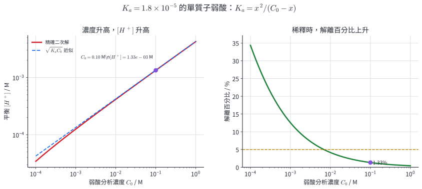{width=97%}

### 4.2 平方根近似的檢查

若計算後 $x/C_0<5\%$，可用 $C_0-x\approx C_0$：

$$
[H^+]\approx\sqrt{K_aC_0}.
$$

這是由完整平衡式得到的近似。計算順序是先求近似值，再以 $x/C_0$ 檢查；比例過大時改解二次式。

::: worked-example
### 示範 7｜由 $K_a$ 求甲酸的 pH 與解離百分比

$25\,^\circ\mathrm C$ 時，$0.100\ \mathrm M$ 甲酸的 $K_a=1.8\times10^{-4}$。完整方程為

$$
\frac{x^2}{0.100-x}=1.8\times10^{-4}.
$$

整理：

$$
x^2+(1.8\times10^{-4})x-1.8\times10^{-5}=0.
$$

正根為

$$
x=4.15\times10^{-3}\ \mathrm M.
$$

$$
pH=-\log(4.15\times10^{-3})=2.38,
$$

$$
\alpha=\frac{4.15\times10^{-3}}{0.100}\times100\%=4.15\%.
$$

解離比例低於 $5\%$，平方根估算 $\sqrt{(1.8\times10^{-4})(0.100)}=4.24\times10^{-3}$ 與精確值接近。
:::

::: worked-example
### 示範 8｜由 pH 反求未知弱酸的 $K_a$

$0.0500\ \mathrm M$ 單質子弱酸的 pH 為 $2.70$。

$$
x=[H^+]=10^{-2.70}=2.00\times10^{-3}\ \mathrm M.
$$

平衡時 $[A^-]=x$、$[HA]=0.0500-x=0.0480\ \mathrm M$：

$$
K_a=\frac{x^2}{0.0500-x}
=\frac{(2.00\times10^{-3})^2}{0.0480}
=8.3\times10^{-5}.
$$

$$
\alpha=\frac{2.00\times10^{-3}}{0.0500}\times100\%=4.00\%.
$$

量得的 pH 與已知分析濃度共同決定平衡常數。
:::

弱酸平衡可連結食品酸度、藥物離子化、保存劑分布與水體酸化。$K_a$ 描述平衡傾向；總酸量與滴定可中和的莫耳數還需由分析濃度和體積決定。

### 分節練習 4

1. $0.200\ \mathrm M$ 醋酸的 $K_a=1.8\times10^{-5}$。求 $[H^+]$、pH 與解離百分比。
2. 同一醋酸稀釋成 $0.0200\ \mathrm M$。求 $[H^+]$ 與解離百分比，並與第 1 題比較。
3. $0.100\ \mathrm M$ 單質子弱酸的 pH 為 $3.00$。求 $K_a$ 與解離百分比。
4. $C_0=4.0\times10^{-4}\ \mathrm M$、$K_a=1.0\times10^{-5}$。檢查平方根近似是否適用，並求精確 $[H^+]$。

### 分節練習 4 解析

1. 解
   $$
   \frac{x^2}{0.200-x}=1.8\times10^{-5}
   $$
   得 $x=1.89\times10^{-3}\ \mathrm M$。因此
   $$
   pH=2.72,\qquad
   \alpha=\frac{1.89\times10^{-3}}{0.200}\times100\%=0.944\%.
   $$
2. 解
   $$
   \frac{x^2}{0.0200-x}=1.8\times10^{-5}
   $$
   得 $x=5.91\times10^{-4}\ \mathrm M$，pH $=3.23$，
   $$
   \alpha=\frac{5.91\times10^{-4}}{0.0200}\times100\%=2.96\%.
   $$
   稀釋後 $[H^+]$ 下降，而解離百分比上升。
3. $x=10^{-3.00}=1.00\times10^{-3}\ \mathrm M$：
   $$
   K_a=\frac{(1.00\times10^{-3})^2}{0.100-0.001}
   =1.01\times10^{-5}.
   $$
   $\alpha=(0.001/0.100)\times100\%=1.00\%$。
4. 平方根估算為
   $$
   x\approx\sqrt{(1.0\times10^{-5})(4.0\times10^{-4})}
   =6.32\times10^{-5}\ \mathrm M,
   $$
   占 $C_0$ 的 $15.8\%$，需解二次式：
   $$
   x^2+(1.0\times10^{-5})x-4.0\times10^{-9}=0.
   $$
   正根 $x=5.84\times10^{-5}\ \mathrm M$。

## 5. 弱鹼的 $K_b$ 與共軛常數

### 5.1 弱鹼解離與 pOH

以一元弱鹼 $B$ 為例：

$$
B(aq)+H_2O(l)\rightleftharpoons BH^+(aq)+OH^-(aq),
$$

$$
K_b=\frac{[BH^+][OH^-]}{[B]}.
$$

初濃度為 $C_0$ 且解離量為 $x$ 時，

$$
K_b=\frac{x^2}{C_0-x},\qquad [OH^-]=x.
$$

求得 $[OH^-]$ 後先算 pOH，再用指定溫度的 $pK_w$ 求 pH。

### 5.2 共軛酸鹼的 $K_aK_b=K_w$

對共軛對 $HA/A^-$：

$$
HA\rightleftharpoons H^++A^-,
\qquad
A^-+H_2O\rightleftharpoons HA+OH^-.
$$

相乘並約去 $HA$、$A^-$ 後得到水的自解離：

$$
K_a(HA)K_b(A^-)=K_w.
$$

在 $25\,^\circ\mathrm C$，

$$
pK_a+pK_b=14.00.
$$

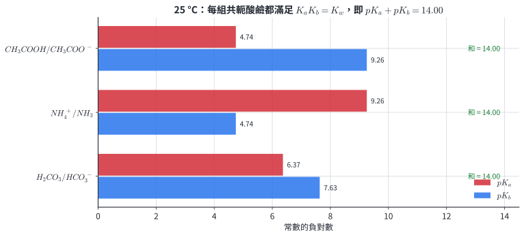{width=94%}

酸愈強，其共軛鹼愈弱；鹼愈強，其共軛酸愈弱。這是同一個乘積固定關係的兩種說法。

::: worked-example
### 示範 9｜由 $K_b$ 求氨水的 pH

$25\,^\circ\mathrm C$ 時，$0.100\ \mathrm M$ $NH_3$ 的 $K_b=1.8\times10^{-5}$：

$$
NH_3+H_2O\rightleftharpoons NH_4^++OH^-.
$$

$$
\frac{x^2}{0.100-x}=1.8\times10^{-5}.
$$

正根為 $x=1.33\times10^{-3}\ \mathrm M$，所以

$$
pOH=2.875,\qquad pH=14.000-2.875=11.125.
$$

$$
\alpha=\frac{1.33\times10^{-3}}{0.100}\times100\%=1.33\%.
$$
:::

::: worked-example
### 示範 10｜由弱酸常數求共軛鹼常數

醋酸的 $K_a=1.8\times10^{-5}$。醋酸根的 $K_b$ 為

$$
K_b(CH_3COO^-)=\frac{K_w}{K_a}
=\frac{1.0\times10^{-14}}{1.8\times10^{-5}}
=5.56\times10^{-10}.
$$

醋酸是弱酸，醋酸根也是弱鹼；兩者的常數相差很大，顯示醋酸根接受水中質子的傾向很小。這個 $K_b$ 會在醋酸鈉水解與弱酸滴定當量點再次使用。
:::

胺類的鹼性影響氣味控制、藥物鹽型與生物分子的帶電狀態。弱鹼計算描述指定溶液中的平衡濃度；揮發、離子強度與多個鹼性位置會使真實系統需要更多物種平衡。

### 分節練習 5

1. $25\,^\circ\mathrm C$ 時，$1.00\ \mathrm M$ 三甲胺 $(CH_3)_3N$ 的 $K_b=6.4\times10^{-5}$。求 $[OH^-]$、pH 與解離百分比。
2. $NH_3$ 的 $K_b=1.8\times10^{-5}$。求 $NH_4^+$ 的 $K_a$ 與 $pK_a$。
3. 某弱酸 $HA$ 的 $K_a=4.0\times10^{-4}$。求 $A^-$ 的 $K_b$。
4. 已知 $K_a(HF)=7.2\times10^{-4}$、$K_a(HClO)=3.5\times10^{-8}$。比較 $F^-$、$ClO^-$ 的鹼性。

### 分節練習 5 解析

1. 解
   $$
   \frac{x^2}{1.00-x}=6.4\times10^{-5}
   $$
   得 $x=7.97\times10^{-3}\ \mathrm M$。因此
   $$
   pOH=2.099,\qquad pH=11.901,
   $$
   $$
   \alpha=\frac{7.97\times10^{-3}}{1.00}\times100\%=0.797\%.
   $$
2.
   $$
   K_a(NH_4^+)=\frac{10^{-14}}{1.8\times10^{-5}}
   =5.56\times10^{-10},
   $$
   $$
   pK_a=9.25.
   $$
3.
   $$
   K_b(A^-)=\frac{10^{-14}}{4.0\times10^{-4}}
   =2.5\times10^{-11}.
   $$
4. $HClO$ 的 $K_a$ 較小，是較弱的酸，因此其共軛鹼 $ClO^-$ 較強。數值上
   $$
   K_b(F^-)=1.39\times10^{-11},\qquad
   K_b(ClO^-)=2.86\times10^{-7}.
   $$

## 6. 同離子效應

### 6.1 共同離子改變平衡組成

弱酸平衡

$$
HA\rightleftharpoons H^++A^-
$$

若加入可溶性鹽 $NaA$，鹽完全解離提供 $A^-$。反應商

$$
Q_a=\frac{[H^+][A^-]}{[HA]}
$$

立即增大，系統向生成 $HA$ 的方向調整，弱酸解離百分比降低。若初始已有 $[A^-]_0$，令弱酸再解離 $x$：

$$
K_a=\frac{x([A^-]_0+x)}{[HA]_0-x}.
$$

當 $x$ 相對於兩個初濃度都小，

$$
[H^+]\approx K_a\frac{[HA]_0}{[A^-]_0}.
$$

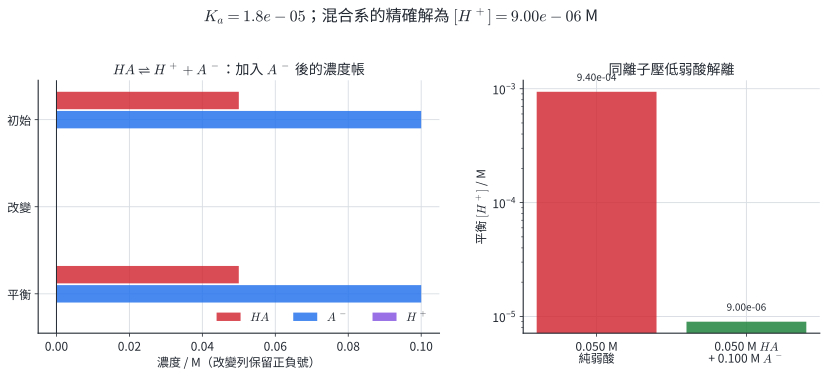{width=97%}

### 6.2 強酸或強鹼提供的同離子

在弱酸溶液加入強酸，外加的 $H^+$ 抑制弱酸解離；在弱鹼溶液加入強鹼，外加的 $OH^-$ 抑制弱鹼解離。計算時先確認強電解質的初始濃度，再寫弱電解質的微小平衡改變。

::: worked-example
### 示範 11｜醋酸與醋酸鈉混合

等體積混合 $0.100\ \mathrm M$ $CH_3COOH$ 與 $0.200\ \mathrm M$ $CH_3COONa$。混合後

$$
[CH_3COOH]_0=0.0500\ \mathrm M,\qquad
[CH_3COO^-]_0=0.100\ \mathrm M.
$$

$K_a=1.8\times10^{-5}$：

$$
1.8\times10^{-5}
=\frac{x(0.100+x)}{0.0500-x}.
$$

精確解為

$$
[H^+]=x=9.00\times10^{-6}\ \mathrm M,
\qquad pH=5.046.
$$

醋酸解離百分比為

$$
\alpha=\frac{9.00\times10^{-6}}{0.0500}\times100\%
=0.0180\%.
$$

相同濃度的純醋酸會有更高的 $[H^+]$；差異來自初始醋酸根改變了反應商。
:::

::: worked-example
### 示範 12｜強鹼抑制氨的解離

某溫度下 $K_b(NH_3)=1.0\times10^{-5}$。在 $0.100\ \mathrm M$ $NH_3$ 中加入 $NaOH$，使初始 $[OH^-]=0.100\ \mathrm M$。令氨再反應 $x$：

$$
K_b=\frac{x(0.100+x)}{0.100-x}.
$$

$x$ 很小，可先估算

$$
x\approx K_b\frac{[NH_3]}{[OH^-]}
=(1.0\times10^{-5})\frac{0.100}{0.100}
=1.0\times10^{-5}\ \mathrm M.
$$

氨的解離百分比約為

$$
\frac{1.0\times10^{-5}}{0.100}\times100\%=0.010\%.
$$

純 $0.100\ \mathrm M$ 氨水約有 $1.0\%$ 解離；共同 $OH^-$ 使解離比例約降為原來的百分之一。
:::

同離子效應是緩衝液、藥物鹽析、沉澱控制與分析化學分離的共同機制。它改變的是平衡組成；若加入物同時與原物種發生定量中和，需先完成化學計量，再建立新的平衡。

### 分節練習 6

1. $0.100\ \mathrm M$ 弱酸 $HA$（$K_a=2.0\times10^{-5}$）同時含 $0.0100\ \mathrm M$ $HCl$。求平衡 $[A^-]$ 與 $HA$ 的解離百分比。
2. 等體積混合 $0.200\ \mathrm M$ $NH_3$ 與 $0.100\ \mathrm M$ $NH_4Cl$。已知 $K_b=1.8\times10^{-5}$，求 pH。
3. $0.0500\ \mathrm M$ 醋酸在純水中的解離百分比約為多少？若同時含 $0.100\ \mathrm M$ 醋酸根，解離百分比約為多少？
4. 三杯溶液均含 $0.100\ \mathrm M$ 醋酸：甲為純醋酸；乙另含 $0.0500\ \mathrm M$ $HCl$；丙另含 $0.0500\ \mathrm M$ $CH_3COONa$。依醋酸解離百分比由大到小排列。

### 分節練習 6 解析

1. 令 $HA$ 解離 $x$：
   $$
   2.0\times10^{-5}
   =\frac{x(0.0100+x)}{0.100-x}.
   $$
   正根 $x=1.96\times10^{-4}\ \mathrm M$，所以
   $$
   [A^-]=1.96\times10^{-4}\ \mathrm M,
   \qquad
   \alpha=0.196\%.
   $$
2. 混合後 $[NH_3]_0=0.100\ \mathrm M$、$[NH_4^+]_0=0.0500\ \mathrm M$：
   $$
   [OH^-]\approx K_b\frac{[NH_3]}{[NH_4^+]}
   =(1.8\times10^{-5})\frac{0.100}{0.0500}
   =3.6\times10^{-5}\ \mathrm M.
   $$
   $pOH=4.44$，所以 $pH=9.56$。
3. 純醋酸：
   $$
   [H^+]\approx\sqrt{(1.8\times10^{-5})(0.0500)}
   =9.49\times10^{-4}\ \mathrm M,
   $$
   $\alpha\approx1.90\%$。加入 $0.100\ \mathrm M$ 醋酸根後，
   $$
   [H^+]\approx(1.8\times10^{-5})\frac{0.0500}{0.100}
   =9.0\times10^{-6}\ \mathrm M,
   $$
   $\alpha\approx0.0180\%$。
4. 甲沒有外加同離子，解離比例最大。乙與丙的平衡變化量都可記為 $x$，且都滿足
   $$
   K_a=\frac{x(0.0500+x)}{0.100-x}.
   $$
   解得 $x=3.60\times10^{-5}\ \mathrm M$，解離百分率都是 $0.0360\%$。因此排列為甲 $>$ 乙 $=$ 丙。

## 7. 多質子酸、質量平衡與物種分布

### 7.1 逐步解離常數

二質子酸 $H_2A$ 分兩步解離：

$$
H_2A\rightleftharpoons H^++HA^-,
\qquad
K_{a1}=\frac{[H^+][HA^-]}{[H_2A]},
$$

$$
HA^-\rightleftharpoons H^++A^{2-},
\qquad
K_{a2}=\frac{[H^+][A^{2-}]}{[HA^-]}.
$$

一般有 $K_{a1}>K_{a2}$，因為從帶負電的粒子再移走正電質子需要更高能量。當兩個常數相差數個數量級，初始酸溶液的 $[H^+]$ 主要由第一步決定；第二步則決定少量高電荷酸根的濃度。

### 7.2 質量平衡與電荷平衡

分析濃度 $C_0$ 的二質子酸滿足

$$
C_0=[H_2A]+[HA^-]+[A^{2-}].
$$

若溶液中沒有其他離子，

$$
[H^+]=[OH^-]+[HA^-]+2[A^{2-}].
$$

前式追蹤所有含 $A$ 的物種，後式追蹤正、負電荷。多個平衡式需配合這兩條守恆關係，才能決定全部濃度。

### 7.3 pH 決定主要物種

對二質子酸，物種分率為

$$
\alpha_{H_2A}=\frac{[H^+]^2}{D},\qquad
\alpha_{HA^-}=\frac{K_{a1}[H^+]}{D},\qquad
\alpha_{A^{2-}}=\frac{K_{a1}K_{a2}}{D},
$$

$$
D=[H^+]^2+K_{a1}[H^+]+K_{a1}K_{a2}.
$$

三個分率相加為 $1$。在 $pH=pK_{a1}$ 時 $[H_2A]=[HA^-]$；在 $pH=pK_{a2}$ 時 $[HA^-]=[A^{2-}]$。

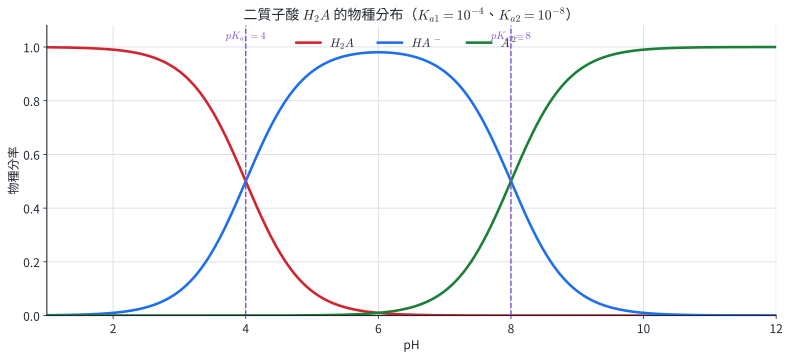{width=95%}

::: worked-example
### 示範 13｜$H_2S$ 的兩步解離

$0.100\ \mathrm M$ $H_2S$ 有 $K_{a1}=1.0\times10^{-7}$、$K_{a2}=1.2\times10^{-14}$。第一步近似：

$$
[H^+]\approx\sqrt{K_{a1}C_0}
=\sqrt{(1.0\times10^{-7})(0.100)}
=1.0\times10^{-4}\ \mathrm M,
$$

所以 pH 約為 $4.00$，且 $[HS^-]\approx1.0\times10^{-4}\ \mathrm M$。

第二步：

$$
K_{a2}=\frac{[H^+][S^{2-}]}{[HS^-]}.
$$

因 $[H^+]\approx[HS^-]$，

$$
[S^{2-}]\approx K_{a2}=1.2\times10^{-14}\ \mathrm M.
$$

兩個 $K_a$ 相差近七個數量級，因此第二步對總 $[H^+]$ 的貢獻極小。
:::

::: worked-example
### 示範 14｜兩性離子 $HCO_3^-$ 的近似 pH

$HCO_3^-$ 可向下解離，也可向上接受質子。對主要由單一兩性物種形成的稀溶液，

$$
pH\approx\frac12(pK_{a1}+pK_{a2}).
$$

碳酸的 $K_{a1}=4.3\times10^{-7}$、$K_{a2}=5.6\times10^{-11}$：

$$
pK_{a1}=6.37,\qquad pK_{a2}=10.25,
$$

$$
pH\approx\frac{6.37+10.25}{2}=8.31.
$$

$HCO_3^-$ 的接受質子傾向在此條件下稍強於提供質子的傾向，所以碳酸氫鈉水溶液呈弱鹼性。
:::

多質子酸分布可用於磷酸鹽緩衝、天然水碳酸系、胺基酸帶電狀態與分段滴定。物種分布圖使用平衡常數與 pH；若同時含金屬配位或沉澱，還需加入相應平衡。

### 分節練習 7

1. 寫出 $H_3PO_4$ 的三步解離反應與 $K_{a1}$、$K_{a2}$、$K_{a3}$ 表示式。
2. 對分析濃度為 $C_0$ 的 $H_3PO_4$ 水溶液，寫出磷酸物種的質量平衡與溶液電荷平衡。
3. 同濃度順丁烯二酸與反丁烯二酸的 $K_{a1}$ 分別為 $1.2\times10^{-2}$、$1.0\times10^{-3}$。哪一杯初始 $[H^+]$ 較大？
4. 某二質子酸有 $pK_{a1}=4.0$、$pK_{a2}=8.0$。判斷 pH $=2.0$、$6.0$、$10.0$ 時的主要物種。

### 分節練習 7 解析

1.
   $$
   H_3PO_4\rightleftharpoons H^++H_2PO_4^-,
   \qquad
   K_{a1}=\frac{[H^+][H_2PO_4^-]}{[H_3PO_4]},
   $$
   $$
   H_2PO_4^-\rightleftharpoons H^++HPO_4^{2-},
   \qquad
   K_{a2}=\frac{[H^+][HPO_4^{2-}]}{[H_2PO_4^-]},
   $$
   $$
   HPO_4^{2-}\rightleftharpoons H^++PO_4^{3-},
   \qquad
   K_{a3}=\frac{[H^+][PO_4^{3-}]}{[HPO_4^{2-}]}.
   $$
2.
   質量平衡：
   $$
   C_0=[H_3PO_4]+[H_2PO_4^-]+[HPO_4^{2-}]+[PO_4^{3-}].
   $$
   電荷平衡：
   $$
   [H^+]=[OH^-]+[H_2PO_4^-]+2[HPO_4^{2-}]+3[PO_4^{3-}].
   $$
3. 相同濃度下，$K_{a1}$ 較大的順丁烯二酸第一步解離較多，因此初始 $[H^+]$ 較大。
4. pH $2.0<pK_{a1}$，主要為 $H_2A$；$pK_{a1}<6.0<pK_{a2}$，主要為 $HA^-$；pH $10.0>pK_{a2}$，主要為 $A^{2-}$。

## 8. 鹽的分類、命名與組成

### 8.1 由取代程度分類

鹽是由陽離子與陰離子組成的離子化合物，可由酸中可解離的 $H^+$ 或鹼中可解離的 $OH^-$ 被取代的程度分類：

- **正鹽：**可解離的 $H^+$ 或 $OH^-$ 全部被取代，例如 $NaCl$、$Na_3PO_4$、$Na_2HPO_3$。
- **酸式鹽：**多質子酸仍保留至少一個可解離 $H^+$，例如 $NaHCO_3$、$NaH_2PO_4$。
- **鹼式鹽：**多元鹼仍保留可解離 $OH^-$，例如 $Ca(OH)Cl$。
- **複鹽：**晶體含兩種以上陽離子或陰離子，溶於水後解離成各簡單離子，例如 $KAl(SO_4)_2\cdot12H_2O$。
- **錯鹽：**含錯離子；錯離子的結構與反應在選修化學 IV 再完整處理。

分類依可解離位置判定。$NaH_2PO_2$ 中的兩個 $P-H$ 不屬酸性質子，因此它是正鹽；$NaH_2PO_3$ 仍保留一個 $O-H$，所以是酸式鹽。

### 8.2 名稱由離子組成決定

正鹽通常命名為「陰離子名＋陽離子名」。酸式鹽在酸根名稱中保留「氫」與數目，例如 $NaH_2PO_4$ 為磷酸二氫鈉；鹼式鹽同時列出陰離子與氫氧根，例如 $Cu(OH)Cl$ 為氯化氫氧銅（2）。

::: worked-example
### 示範 15｜命名與分類四種鹽

1. $NH_4Cl$：氯化銨；可解離質子已全部被取代，是正鹽。
2. $NH_4HC_2O_4$：草酸氫銨；$HC_2O_4^-$ 仍有可解離質子，是酸式鹽。
3. $Ca(OH)Cl$：氯化氫氧鈣；仍含可解離 $OH^-$，是鹼式鹽。
4. $MgNH_4PO_4$：磷酸銨鎂；含 $Mg^{2+}$、$NH_4^+$ 兩種陽離子，是複鹽。

分類只描述鹽的組成；水溶液的酸鹼性需再分析離子水解。
:::

::: worked-example
### 示範 16｜比較 $H_3PO_2$、$H_3PO_3$ 形成的鈉鹽

$H_3PO_2=H_2PO(OH)$ 是單質子酸，完全中和：

$$
H_3PO_2+NaOH\rightarrow NaH_2PO_2+H_2O.
$$

$NaH_2PO_2$ 已無可解離 $O-H$，所以是正鹽。

$H_3PO_3=HPO(OH)_2$ 是二質子酸，加入一當量 $NaOH$：

$$
H_3PO_3+NaOH\rightarrow NaH_2PO_3+H_2O.
$$

$NaH_2PO_3$ 還有一個可解離 $O-H$，所以是酸式鹽。再加一當量 $NaOH$ 得正鹽 $Na_2HPO_3$。
:::

鹽的組成連到肥料配方、食品膨鬆劑、凝聚劑與醫藥鹽型。名稱能指出離子來源；材料用途、毒性與溶解度仍需另外查驗物性與安全資料。

### 分節練習 8

1. 命名並分類 $NaHCO_3$、$Na_2HPO_4$、$Cu(OH)NO_3$、$KAl(SO_4)_2\cdot12H_2O$。
2. 判斷 $NaH_2PO_2$、$NaH_2PO_3$、$Na_2HPO_3$ 中哪些是酸式鹽。
3. 寫出由 $H_2SO_3$ 依序與一當量、兩當量 $NaOH$ 反應所得鹽的化學式與名稱。
4. 某鹽溶於水得到 $K^+$、$Al^{3+}$、$SO_4^{2-}$，其最簡組成符合電荷守恆且同時含兩種陽離子。寫出無水鹽化學式並分類。

### 分節練習 8 解析

1. $NaHCO_3$：碳酸氫鈉，酸式鹽；$Na_2HPO_4$：磷酸氫二鈉，酸式鹽；$Cu(OH)NO_3$：硝酸氫氧銅（2），鹼式鹽；$KAl(SO_4)_2\cdot12H_2O$：硫酸鋁鉀十二水合物，複鹽。
2. $NaH_2PO_2$ 是正鹽；$NaH_2PO_3$ 是酸式鹽；$Na_2HPO_3$ 是正鹽。
3. 一當量：
   $$
   H_2SO_3+NaOH\rightarrow NaHSO_3+H_2O,
   $$
   生成亞硫酸氫鈉。兩當量：
   $$
   H_2SO_3+2NaOH\rightarrow Na_2SO_3+2H_2O,
   $$
   生成亞硫酸鈉。
4. 一個 $K^+$ 與一個 $Al^{3+}$ 共帶 $+4$，需兩個 $SO_4^{2-}$ 平衡，所以化學式為 $KAl(SO_4)_2$，屬複鹽。

## 9. 鹽類水解與水溶液酸鹼性

### 9.1 共軛離子與水反應

鹽溶於水後先完全解離。弱酸的共軛鹼可由水取得質子：

$$
A^-+H_2O\rightleftharpoons HA+OH^-,
$$

$$
K_b(A^-)=\frac{K_w}{K_a(HA)}.
$$

弱鹼的共軛酸可把質子交給水：

$$
BH^++H_2O\rightleftharpoons B+H_3O^+,
$$

$$
K_a(BH^+)=\frac{K_w}{K_b(B)}.
$$

因此可依來源快速建立模型：

| 鹽的來源 | 主要離子行為 | 水溶液傾向 |
|---|---|---|
| 強酸＋強鹼 | 兩離子與水的酸鹼反應極弱 | 中性 |
| 弱酸＋強鹼 | 陰離子水解生成 $OH^-$ | 鹼性 |
| 強酸＋弱鹼 | 陽離子水解生成 $H_3O^+$ | 酸性 |
| 弱酸＋弱鹼 | 比較陰離子 $K_b$ 與陽離子 $K_a$ | 較大者主導 |

鹽的「正鹽、酸式鹽、鹼式鹽」分類描述組成，水溶液酸鹼性描述水解平衡；兩者需分開判斷。

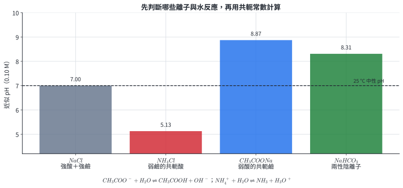{width=95%}

### 9.2 兩性酸根的競爭

$HA^-$ 這類兩性酸根可解離成 $A^{2-}$，也可水解成 $H_2A$。比較

$$
K_a(HA^-)=K_{a2},
\qquad
K_b(HA^-)=\frac{K_w}{K_{a1}}.
$$

$K_a>K_b$ 時酸性反應較強；$K_b>K_a$ 時鹼性反應較強。單一兩性物種主導且溶液不過度稀薄時，也可用

$$
pH\approx\frac12(pK_{a1}+pK_{a2})
$$

估算。

::: worked-example
### 示範 17｜醋酸鈉水解的 pH

$25\,^\circ\mathrm C$ 時，$0.100\ \mathrm M$ $CH_3COONa$，已知
$K_a(CH_3COOH)=1.8\times10^{-5}$。

$$
K_b(CH_3COO^-)=\frac{10^{-14}}{1.8\times10^{-5}}
=5.56\times10^{-10}.
$$

$$
CH_3COO^-+H_2O\rightleftharpoons CH_3COOH+OH^-.
$$

$$
\frac{x^2}{0.100-x}=5.56\times10^{-10}.
$$

解得 $[OH^-]=7.45\times10^{-6}\ \mathrm M$，

$$
pOH=5.128,\qquad pH=8.872.
$$

$Na^+$ 只負責電荷與總濃度，不提供主要酸鹼反應。
:::

::: worked-example
### 示範 18｜氯化銨水解的 pH

$0.0500\ \mathrm M$ $NH_4Cl$，$K_b(NH_3)=1.8\times10^{-5}$：

$$
K_a(NH_4^+)=\frac{10^{-14}}{1.8\times10^{-5}}
=5.56\times10^{-10}.
$$

$$
NH_4^++H_2O\rightleftharpoons NH_3+H_3O^+.
$$

$$
\frac{x^2}{0.0500-x}=5.56\times10^{-10}.
$$

解得 $[H^+]=5.27\times10^{-6}\ \mathrm M$，所以

$$
pH=5.278.
$$

同一組 $NH_4^+/NH_3$ 在弱鹼溶液、鹽類水解、緩衝液與滴定當量點中使用同一對常數。
:::

鹽類水解可解釋肥料、天然水、清潔鹽與藥物鹽的 pH。溶液實際 pH 還受濃度、溫度、二氧化碳吸收、沉澱與配位影響；題目給定額外反應時需一併列入物種帳。

### 分節練習 9

1. 判斷 $NaNO_3$、$NH_4Br$、$NaF$、$NH_4CN$ 水溶液的酸鹼模型；最後一種寫出需要比較的兩個常數。
2. 求 $25\,^\circ\mathrm C$、$0.200\ \mathrm M$ $NaF$ 的 pH。已知 $K_a(HF)=7.2\times10^{-4}$。
3. 判斷 $NH_4F$ 水溶液偏酸或偏鹼。已知 $K_b(NH_3)=1.8\times10^{-5}$、$K_a(HF)=7.2\times10^{-4}$。
4. 已知碳酸的 $K_{a1}=4.3\times10^{-7}$、$K_{a2}=5.6\times10^{-11}$。估算主要含 $HCO_3^-$ 的碳酸氫鈉溶液 pH。

### 分節練習 9 解析

1. $NaNO_3$ 來自強酸、強鹼，模型為中性；$NH_4Br$ 由 $NH_4^+$ 水解，呈酸性；$NaF$ 由 $F^-$ 水解，呈鹼性。$NH_4CN$ 同時有
   $$
   K_a(NH_4^+)=\frac{K_w}{K_b(NH_3)}
   $$
   與
   $$
   K_b(CN^-)=\frac{K_w}{K_a(HCN)},
   $$
   需比較兩者大小。
2.
   $$
   K_b(F^-)=\frac{10^{-14}}{7.2\times10^{-4}}
   =1.39\times10^{-11}.
   $$
   解 $x^2/(0.200-x)=1.39\times10^{-11}$ 得
   $[OH^-]=1.67\times10^{-6}\ \mathrm M$。因此
   $pOH=5.778$、$pH=8.222$。
3.
   $$
   K_a(NH_4^+)=5.56\times10^{-10},
   \qquad
   K_b(F^-)=1.39\times10^{-11}.
   $$
   陽離子的酸性常數較大，所以溶液偏酸。
4.
   $$
   pH\approx\frac12(pK_{a1}+pK_{a2})
   =\frac12(6.37+10.25)=8.31.
   $$

## 10. 緩衝溶液、目標 pH 與容量

### 10.1 緩衝作用的粒子機制

緩衝溶液含有足量的弱酸及其共軛鹼，或弱鹼及其共軛酸。以 $HA/A^-$ 為例：

$$
A^-+H^+\rightarrow HA
$$

消耗外加少量強酸；

$$
HA+OH^-\rightarrow A^-+H_2O
$$

消耗外加少量強鹼。加入後兩個共軛物種的莫耳數略為改變，比例改變有限，因此 pH 只小幅變化。

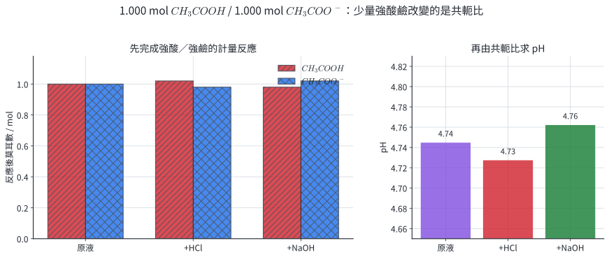{width=97%}

### 10.2 Henderson–Hasselbalch 關係

由

$$
K_a=\frac{[H^+][A^-]}{[HA]}
$$

移項並取負對數：

$$
[H^+]=K_a\frac{[HA]}{[A^-]},
$$

$$
pH=pK_a+\log\frac{[A^-]}{[HA]}.
$$

弱鹼緩衝系可寫為

$$
pOH=pK_b+\log\frac{[BH^+]}{[B]}.
$$

混合溶液含強酸或強鹼時，先完成定量反應，再把剩餘弱物種代入比例式。

### 10.3 範圍與容量

當 $0.1\le[A^-]/[HA]\le10$，通常有

$$
pK_a-1\le pH\le pK_a+1.
$$

目標 pH 決定共軛比；共軛物種總濃度決定可吸收多少外加酸鹼。兩者接近等量時，對酸與鹼的容量較均衡。

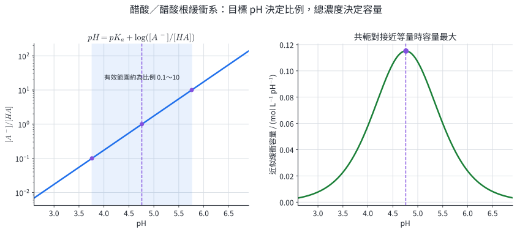{width=96%}

::: worked-example
### 示範 19｜由共軛比求醋酸緩衝液 pH

一溶液含 $0.200\ \mathrm M$ $CH_3COOH$ 與
$0.100\ \mathrm M$ $CH_3COO^-$，$K_a=1.8\times10^{-5}$：

$$
pK_a=4.745.
$$

$$
pH=4.745+\log\frac{0.100}{0.200}
=4.745-0.301
=4.444.
$$

酸量是共軛鹼的兩倍，所以 pH 比 $pK_a$ 低 $0.301$。
:::

::: worked-example
### 示範 20｜部分中和配製氨緩衝液

混合 $100.0$ mL $0.200\ \mathrm M$ $NH_3$ 與
$50.0$ mL $0.200\ \mathrm M$ $HCl$：

$$
n(NH_3)=0.0200\ \mathrm{mol},\qquad n(H^+)=0.0100\ \mathrm{mol}.
$$

$$
NH_3+H^+\rightarrow NH_4^+.
$$

反應後 $NH_3$ 與 $NH_4^+$ 各 $0.0100$ mol。$K_b(NH_3)=1.8\times10^{-5}$，故

$$
pOH=pK_b+\log\frac{n(NH_4^+)}{n(NH_3)}
=4.745,
$$

$$
pH=9.255.
$$

再加入 $0.0010$ mol $HCl$，新莫耳數為

$$
n(NH_3)=0.0090,\qquad n(NH_4^+)=0.0110.
$$

$$
pOH=4.745+\log\frac{0.0110}{0.0090}=4.832,
$$

$$
pH=9.168.
$$

加入強酸後 pH 下降 $0.087$，變化直接來自共軛比。
:::

生物實驗的磷酸鹽緩衝液、藥品與食品製程、發酵槽及 pH 電極校正液都利用此機制。血液 pH 還受到呼吸排出 $CO_2$、腎臟調節與蛋白質等多套系統共同控制；單一 Henderson–Hasselbalch 式描述其中一組共軛對。

### 分節練習 10

1. 下列混合均在反應後判斷：  
   (a) 等莫耳 $CH_3COOH$、$CH_3COONa$；  
   (b) $0.010$ mol $NH_3$、$0.004$ mol $HCl$；  
   (c) 等莫耳 $HCl$、$NaOH$；  
   (d) $0.010$ mol $NH_4Cl$、$0.004$ mol $NaOH$。  
   哪些形成緩衝液？
2. 用 $1.000$ mol 醋酸與 $NaOH$ 配製 pH $=5.00$ 的緩衝液。$K_a=1.8\times10^{-5}$，求需加入的 $NaOH$ 莫耳數。
3. 一緩衝液含 $0.0500$ mol 醋酸與 $0.0500$ mol 醋酸根。加入 $0.0050$ mol $HCl$ 後求 pH。$pK_a=4.745$。
4. 甲含 $0.10\ \mathrm M$ $HA$ 與 $0.10\ \mathrm M$ $A^-$；乙含 $1.0\ \mathrm M$ $HA$ 與 $1.0\ \mathrm M$ $A^-$。比較初始 pH 與加入相同少量強酸後的 pH 變化。

### 分節練習 10 解析

1. (a) 直接含弱酸與共軛鹼，是緩衝液。(b) $HCl$ 消耗部分 $NH_3$，留下 $0.006$ mol $NH_3$ 並生成 $0.004$ mol $NH_4^+$，是緩衝液。(c) 完全中和後只剩強酸強鹼鹽，不是緩衝液。(d) $OH^-$ 消耗部分 $NH_4^+$，生成 $NH_3$ 且保留 $NH_4^+$，是緩衝液。
2.
   $$
   \frac{[CH_3COO^-]}{[CH_3COOH]}
   =10^{5.00-4.745}=1.80.
   $$
   設加入 $x$ mol $NaOH$，反應後共軛鹼為 $x$、醋酸為 $1.000-x$：
   $$
   \frac{x}{1.000-x}=1.80.
   $$
   解得 $x=0.643\ \mathrm{mol}$。
3. $H^+$ 先把醋酸根轉成醋酸：
   $$
   n(A^-)=0.0450,\qquad n(HA)=0.0550\ \mathrm{mol}.
   $$
   $$
   pH=4.745+\log\frac{0.0450}{0.0550}=4.658.
   $$
4. 兩杯的共軛比都是 $1$，所以初始 pH 均為 $pK_a$。乙的兩物種莫耳數是甲的十倍；加入相同少量強酸時，乙的比例改變較小，因此 pH 變化較小、緩衝容量較大。

## 11. 酸鹼滴定、指示劑與實驗證據

### 11.1 當量點的化學計量

滴定以已知濃度的標準溶液測定未知物。當量點是反應物依化學計量恰好反應的狀態。若一個酸分子在指定滴定中提供 $a$ 個質子，一個鹼粒子提供 $b$ 個氫氧根：

$$
C_aV_a a=C_bV_b b.
$$

這是 $H^+$ 當量與 $OH^-$ 當量相等，不要求酸、鹼的莫耳數相等。

終點是儀器或指示劑顯示停止滴定的觀測時刻。合適方法使終點落在當量點附近，兩者的體積差形成滴定誤差。

### 11.2 指示劑的平衡

酸式指示劑可寫成

$$
HIn\rightleftharpoons H^++In^-.
$$

兩種型態顏色不同：

$$
pH=pK_{a,\mathrm{In}}+\log\frac{[In^-]}{[HIn]}.
$$

人眼通常在兩型比例約從 $1:10$ 變到 $10:1$ 的區間看見明顯轉色，因此變色範圍約為 $pK_{a,\mathrm{In}}\pm1$。指示劑範圍需落在滴定曲線的陡升或陡降區。

### 11.3 標定、器材與操作

$NaOH$ 固體與溶液會吸收空氣中的水與 $CO_2$，配製後以純度高、組成穩定的基準物質標定。鄰苯二甲酸氫鉀（KHP）是單質子酸，與 $OH^-$ 依 $1:1$ 反應。

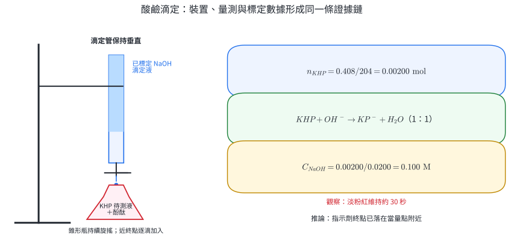{width=97%}

操作的量測邏輯如下：

1. 滴定管以滴定液潤洗，排除尖端氣泡，垂直固定後讀初刻度。
2. 待測液用移液吸管定量移入錐形瓶；錐形瓶可用蒸餾水洗，殘留蒸餾水只改變總體積，不改變待測物莫耳數。
3. 滴定中持續旋搖；接近終點改成逐滴加入，記錄終刻度。
4. 重複到取得相近滴定體積，以相近試次平均。

強酸、強鹼具有腐蝕性。操作需穿實驗衣、戴護目鏡與合適手套；漏斗加液後移除，滴定管最高處的加液在安全高度進行。酸、鹼廢液依校內規範分流，經教師指定程序中和或回收；含指示劑、有機物或金屬離子的廢液依成分另行收集。紀錄中的「淡粉紅維持約 30 秒」是觀察；「已到達設定終點」是依指示劑模型作出的推論。

::: worked-example
### 示範 21｜以 KHP 標定 $NaOH$

取 $0.4080$ g KHP，式量 $204.0$，滴定需 $20.00$ mL $NaOH$。

$$
n(KHP)=\frac{0.4080}{204.0}=2.000\times10^{-3}\ \mathrm{mol}.
$$

反應比為 $1:1$：

$$
n(NaOH)=2.000\times10^{-3}\ \mathrm{mol}.
$$

$$
C_{NaOH}=\frac{2.000\times10^{-3}}{0.02000}
=0.1000\ \mathrm M.
$$

有效數字由 KHP 質量、式量與滴定體積共同限制。
:::

::: worked-example
### 示範 22｜由滴定求食醋重量百分率

量取 $5.00$ mL 食醋，密度為 $1.01\ \mathrm{g\,mL^{-1}}$；以 $0.1000\ \mathrm M$ $NaOH$ 滴定，平均需 $41.80$ mL。醋酸為單質子酸：

$$
n(CH_3COOH)=n(NaOH)
=(0.1000)(0.04180)
=4.180\times10^{-3}\ \mathrm{mol}.
$$

以醋酸摩爾質量 $60.05\ \mathrm{g\,mol^{-1}}$：

$$
m(CH_3COOH)=(4.180\times10^{-3})(60.05)
=0.2510\ \mathrm g.
$$

食醋樣品質量：

$$
m_{\mathrm{sample}}=(5.00)(1.01)=5.05\ \mathrm g.
$$

$$
w\%=\frac{0.2510}{5.05}\times100\%=4.97\%.
$$

這項結果是樣品中可依 $1:1$ 與 $NaOH$ 反應的醋酸當量；其他可滴定酸存在時會一起貢獻。
:::

滴定可用於食醋、制酸劑、水質鹼度與製程藥液。量測結果取決於標準液濃度、取樣代表性、反應選擇性與終點判定；醫療樣品還需使用經驗證的臨床分析方法。

### 分節練習 11

1. $15.0$ mL 草酸 $H_2C_2O_4$ 以 $0.100\ \mathrm M$ $NaOH$ 滴定，需 $48.0$ mL 完全反應。求草酸濃度。
2. $25.00$ mL 未知二質子酸以 $0.2000\ \mathrm M$ $NaOH$ 滴定，需 $30.00$ mL 達第二當量點。求酸濃度。
3. 某指示劑 $pK_a=4.80$。在 pH $=5.80$ 時求 $[In^-]/[HIn]$，判斷主要顏色型態。
4. 同一樣品的滴定體積為 $24.10$、$24.15$、$25.20$ mL。指出可先採用的相近試次與平均值，並說明下一步。

### 分節練習 11 解析

1.
   $$
   C_a(0.0150)(2)=(0.100)(0.0480)(1).
   $$
   $C_a=0.160\ \mathrm M$。
2.
   $$
   C_a(0.02500)(2)=(0.2000)(0.03000)(1).
   $$
   $C_a=0.1200\ \mathrm M$。
3.
   $$
   5.80=4.80+\log\frac{[In^-]}{[HIn]},
   $$
   因此 $[In^-]/[HIn]=10$，顏色以鹼式 $In^-$ 為主，正位於常見轉色範圍的高 pH 端。
4. $24.10$、$24.15$ mL 相差 $0.05$ mL，可先取平均 $24.125$ mL，依器材解析度報為 $24.13$ mL。$25.20$ mL 與前兩次差距大，需檢查終點過滴、氣泡、漏液或讀值，再重複滴定取得另一個相近試次。

## 12. 滴定曲線、半當量點與分區模型

### 12.1 滴定曲線的四個計算區域

滴定曲線以 pH 為縱軸、已加入滴定液體積為橫軸。對強鹼滴定單質子弱酸，可依主要物種分四區：

1. **起點：**只有弱酸，使用 $K_a$ 平衡。
2. **當量點前：**中和後同時有 $HA/A^-$，使用緩衝比。
3. **當量點：**弱酸轉成 $A^-$，使用鹽類水解。
4. **當量點後：**過量強鹼決定 $[OH^-]$。

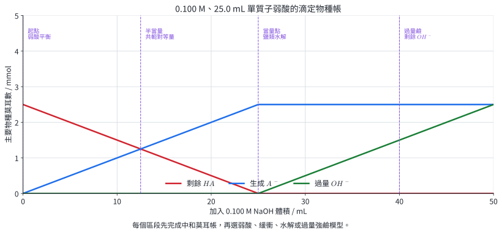{width=97%}

半當量點有

$$
n(HA)=n(A^-),
$$

因此

$$
pH=pK_a.
$$

強酸滴定弱鹼的對應關係為半當量點 $pOH=pK_b$，也可寫成 $pH=pK_a(BH^+)$。

### 12.2 當量體積與當量點 pH

同濃度、同體積、同質子數的強酸與弱酸，需要相同體積的強鹼達當量點；酸的強弱改變起點、緩衝區與當量點 pH，並不改變總可中和莫耳數。

- 強酸－強鹼在 $25\,^\circ\mathrm C$ 的當量點近似 pH $7$。
- 弱酸－強鹼的當量點含共軛鹼，pH 大於 $7$。
- 弱鹼－強酸的當量點含共軛酸，pH 小於 $7$。

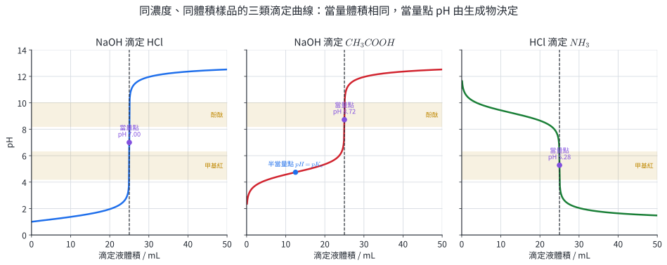{width=99%}

指示劑需在當量點附近的陡變區轉色。弱酸－強鹼通常選酚酞；弱鹼－強酸通常選甲基紅。強酸－強鹼陡變範圍較寬，多種範圍落在陡變區的指示劑都可使用。

::: worked-example
### 示範 23｜弱酸－強鹼曲線的四個特徵點

以 $0.100\ \mathrm M$ $NaOH$ 滴定 $25.00$ mL
$0.100\ \mathrm M$ $CH_3COOH$，$K_a=1.8\times10^{-5}$。

初始酸莫耳數：

$$
n_0=(0.100)(0.02500)=2.500\times10^{-3}\ \mathrm{mol}.
$$

當量體積：

$$
V_{\mathrm{eq}}=\frac{2.500\times10^{-3}}{0.100}
=25.00\ \mathrm{mL}.
$$

**起點，$V_b=0$：**

解 $x^2/(0.100-x)=1.8\times10^{-5}$ 得
$[H^+]=1.33\times10^{-3}\ \mathrm M$，pH $=2.875$。

**半當量點，$V_b=12.50$ mL：**

$$
pH=pK_a=4.745.
$$

**當量點，$V_b=25.00$ mL：**

醋酸根濃度

$$
C=\frac{2.500\times10^{-3}}{0.05000}
=0.0500\ \mathrm M.
$$

$$
K_b=\frac{10^{-14}}{1.8\times10^{-5}}
=5.56\times10^{-10}.
$$

水解得 $[OH^-]=5.27\times10^{-6}\ \mathrm M$，所以 pH $=8.722$。

**過量鹼，$V_b=30.00$ mL：**

$$
n_{\mathrm{excess}}(OH^-)
=(0.100)(0.03000)-2.500\times10^{-3}
=5.00\times10^{-4}\ \mathrm{mol}.
$$

$$
[OH^-]=\frac{5.00\times10^{-4}}{0.05500}
=9.09\times10^{-3}\ \mathrm M,
$$

所以 pH $=11.959$。
:::

::: worked-example
### 示範 24｜弱鹼－強酸的半當量與當量點

以 $0.100\ \mathrm M$ $HCl$ 滴定 $25.00$ mL
$0.100\ \mathrm M$ $NH_3$，$K_b=1.8\times10^{-5}$。當量體積也是 $25.00$ mL。

半當量點時 $n(NH_3)=n(NH_4^+)$：

$$
pOH=pK_b=4.745,
$$

$$
pH=9.255.
$$

當量點只剩 $0.0500\ \mathrm M$ $NH_4^+$：

$$
K_a(NH_4^+)=5.56\times10^{-10}.
$$

水解得 $[H^+]=5.27\times10^{-6}\ \mathrm M$，所以 pH $=5.278$。甲基紅的變色範圍 $4.2$～$6.3$ 落在當量點附近陡降區，可作此滴定的指示劑。
:::

滴定曲線可同時給出濃度、$pK_a$、緩衝範圍與當量點。真實曲線受電極校正、溫度、離子強度、混合時間與多重酸鹼平衡影響；資料點不足時，以陡變區間估計當量體積並報告解析度。

### 分節練習 12

1. 以 $0.100\ \mathrm M$ $NaOH$ 滴定 $25.00$ mL $0.100\ \mathrm M$ $HCl$。求加入 $0$、$12.50$、$25.00$、$30.00$ mL 時的 pH。
2. 甲基橙、甲基紅、酚酞的變色範圍依序為 $3.1$～$4.4$、$4.2$～$6.3$、$8.2$～$10.0$。分別為強鹼滴定醋酸、強酸滴定氨選擇合適指示劑。
3. $30.0$ mL 果醋以 $0.100\ \mathrm M$ $NaOH$ 滴定，量得資料：  
   $V_b/\mathrm{mL}=0,5,10,15,20,25,30,35,40$；  
   pH $=3.0,4.3,4.7,5.0,5.3,5.7,8.8,11.9,12.2$。  
   估計當量體積、醋酸濃度、半當量點 $pK_a$ 與緩衝區。
4. 同體積、同濃度的 $HCl$ 與 $CH_3COOH$ 分別用同一 $NaOH$ 滴定。比較當量體積、起始 pH、當量點 pH 與可見緩衝區。

### 分節練習 12 解析

1. 起點 $[H^+]=0.100\ \mathrm M$，pH $=1.000$。加入 $12.50$ mL：
   $$
   [H^+]=\frac{(0.100)(0.02500)-(0.100)(0.01250)}
   {0.03750}
   =0.03333\ \mathrm M,
   $$
   pH $=1.477$。加入 $25.00$ mL 達強酸強鹼當量點，pH $=7.000$。加入 $30.00$ mL：
   $$
   [OH^-]=\frac{(0.100)(0.03000)-(0.100)(0.02500)}
   {0.05500}
   =9.09\times10^{-3}\ \mathrm M,
   $$
   pH $=11.959$。
2. 強鹼滴定醋酸的當量點呈鹼性，選酚酞；強酸滴定氨的當量點呈酸性，選甲基紅。
3. 最大陡升在 $25$～$30$ mL，當量體積約 $30.0$ mL：
   $$
   C_{\mathrm{acid}}(0.0300)=(0.100)(0.0300),
   $$
   所以醋酸濃度約 $0.100\ \mathrm M$。半當量體積 $15.0$ mL，故 $pK_a\approx5.0$。約 $5$～$25$ mL 同時有醋酸與醋酸根，可辨認為緩衝區；實際邊界由資料解析度決定。
4. 兩杯可中和的酸莫耳數相同，所以當量體積相同。$HCl$ 起始 pH 較低，強酸－強鹼當量點在 $25\,^\circ\mathrm C$ 約為 $7$；醋酸起始 pH 較高，當量點因醋酸根水解而大於 $7$。醋酸滴定在當量點前有明顯緩衝區，鹽酸滴定沒有弱酸／共軛鹼緩衝區。

## 13. 章末分層題

### 基礎題

1. 寫出下列物質的名稱，並指出可解離的酸性氫或氫氧根數目：$HClO_2$、$HCN(aq)$、$Fe(OH)_3$、$H_3PO_3$。已知 $H_3PO_3$ 的結構可寫成 $HPO(OH)_2$。

2. 對反應
   $$
   H_2PO_4^-+NH_3\rightleftharpoons HPO_4^{2-}+NH_4^+
   $$
   指出兩組共軛酸鹼對，並寫出正向反應中酸與鹼的角色。

3. 某溫度下 $K_w=2.50\times10^{-14}$。求中性水的 pH，並判斷同溫下 pH $=7.00$ 的溶液呈酸性、中性或鹼性。

4. $0.0500\ \mathrm M$ 一元弱酸 $HA$ 的 $K_a=2.00\times10^{-5}$。以二次方程求 $[H^+]$、pH 與解離百分率。

5. 某弱酸的 $K_a=2.00\times10^{-5}$。求其共軛鹼的 $K_b$，溫度取 $25\,^\circ\mathrm C$。

6. 將下列鹽依組成分為正鹽、酸式鹽、鹼式鹽或複鹽：$NaH_2PO_4$、$NaH_2PO_2$、$Ca(OH)Cl$、$KAl(SO_4)_2$。已知 $H_3PO_2$ 的結構為 $HOPH_2$。

### 核心題

7. $0.200\ \mathrm M$ 甲胺 $CH_3NH_2$ 的 $K_b=4.40\times10^{-4}$。以二次方程求 $[OH^-]$、pH 與解離百分率。

8. 將 $0.100\ \mathrm M$ $HA$ 與 $0.100\ \mathrm M$ $NaA$ 配成溶液，體積變化已計入所列濃度，$K_a(HA)=1.00\times10^{-5}$。求 pH，並說明同離子如何改變 $HA$ 的解離。

9. 二質子酸 $H_2A$ 的 $pK_{a1}=3.00$、$pK_{a2}=7.00$。判斷 pH $=5.00$ 時主要物種，並指出哪兩個 pH 分別使 $[H_2A]=[HA^-]$、$[HA^-]=[A^{2-}]$。

10. 求 $0.100\ \mathrm M$ $NH_4Cl$ 的 pH。已知 $K_b(NH_3)=1.80\times10^{-5}$，溫度為 $25\,^\circ\mathrm C$。

11. 一杯緩衝液含 $0.0300$ mol $HA$ 與 $0.0200$ mol $A^-$，$pK_a=4.80$。求起始 pH；再加入 $0.00500$ mol $HCl$，忽略體積變化，求新 pH。

12. 同體積、同濃度的一元強酸與一元弱酸分別以同一濃度強鹼滴定。比較兩條曲線的起始 pH、當量體積、當量點 pH 與緩衝區；再說明弱酸－強鹼滴定選用酚酞的依據。

### 跨節整合題

13. 取 $25.00$ mL 未知一元弱酸 $HA$，以 $0.1000\ \mathrm M$ $NaOH$ 滴定，當量體積為 $20.00$ mL；起始 pH 為 $2.900$。
    1. 求原酸濃度。
    2. 求 $K_a$ 與 $pK_a$。
    3. 求半當量點 pH。
    4. 求當量點 pH，溫度取 $25\,^\circ\mathrm C$。
    5. 甲基橙範圍為 $3.1$～$4.4$，酚酞範圍為 $8.2$～$10.0$；選出較合適的指示劑。

14. 要配製總量為 $0.200$ mol 的磷酸鹽緩衝液，使 pH $=7.40$。選用 $H_2PO_4^-/HPO_4^{2-}$，其 $pK_{a2}=7.21$。
    1. 求兩物種各需多少 mol。
    2. 若加入 $0.0100$ mol $HCl$，忽略體積變化，求新 pH。
    3. 以質子轉移方程說明緩衝作用。

15. $100.0$ mL 溶液含 $0.0100$ mol 二質子酸 $H_2A$，以 $0.1000\ \mathrm M$ $NaOH$ 滴定。已知 $K_{a1}=1.0\times10^{-3}$、$K_{a2}=1.0\times10^{-7}$。
    1. 求第一、第二當量體積。
    2. 估算第一當量點 pH。
    3. 求加入 $150.0$ mL $NaOH$ 時的 pH。
    4. 求第二當量點 pH，溫度取 $25\,^\circ\mathrm C$。

16. 以鄰苯二甲酸氫鉀（KHP，式量 $204.22\ \mathrm{g\,mol^{-1}}$）標定 $NaOH$。稱取 $0.5100$ g KHP，三次滴定體積為 $24.92$、$24.96$、$25.60$ mL。另取 $5.00$ mL 食醋，密度 $1.005\ \mathrm{g\,mL^{-1}}$，以標定後的 $NaOH$ 滴定，兩次體積為 $41.30$、$41.36$ mL；醋酸式量為 $60.05\ \mathrm{g\,mol^{-1}}$。
    1. 辨認標定資料中的離群值，並由相符的兩次數據求 $NaOH$ 濃度。
    2. 求食醋中醋酸的質量百分率。
    3. 寫出一項終點觀察、一項由觀察得到的推論，以及兩項必要的實驗安全或品質控制措施。

## 14. 章末題完整解析

### 第 1 題

- $HClO_2$ 為亞氯酸，結構中的一個 $O-H$ 可提供 $H^+$，屬一元酸。
- $HCN(aq)$ 為氫氰酸，可提供一個 $H^+$，屬一元酸。
- $Fe(OH)_3$ 為氫氧化鐵（或氫氧化鐵(III)），每個式量含三個 $OH^-$。
- $H_3PO_3=HPO(OH)_2$ 為亞磷酸；兩個 $O-H$ 上的氫可解離，$P-H$ 上的氫保留在陰離子中，所以是二元酸。

名稱提供化學式的組成資訊；判斷酸的元數時還要辨認氫所連接的原子。

### 第 2 題

正向反應中，$H_2PO_4^-$ 把一個質子交給 $NH_3$：

$$
\underbrace{H_2PO_4^-}_{\text{酸}}+
\underbrace{NH_3}_{\text{鹼}}
\rightleftharpoons
\underbrace{HPO_4^{2-}}_{\text{共軛鹼}}+
\underbrace{NH_4^+}_{\text{共軛酸}}.
$$

兩組共軛酸鹼對為 $H_2PO_4^-/HPO_4^{2-}$ 與 $NH_4^+/NH_3$，每組只差一個 $H^+$。

### 第 3 題

中性條件為 $[H^+]=[OH^-]$，所以

$$
[H^+]=\sqrt{K_w}=\sqrt{2.50\times10^{-14}}
=1.58\times10^{-7}\ \mathrm M.
$$

$$
pH_{\mathrm{neutral}}=-\log(1.58\times10^{-7})=6.801.
$$

同溫下 pH $=7.00$ 表示 $[H^+]=1.00\times10^{-7}\ \mathrm M$，小於中性水的 $[H^+]$，因此溶液呈鹼性。

### 第 4 題

令 $HA$ 解離 $x\ \mathrm M$：

$$
K_a=\frac{x^2}{0.0500-x}=2.00\times10^{-5}.
$$

整理得

$$
x^2+(2.00\times10^{-5})x-(1.00\times10^{-6})=0.
$$

取正根：

$$
x=9.90\times10^{-4}\ \mathrm M=[H^+].
$$

$$
pH=-\log(9.90\times10^{-4})=3.004,
$$

$$
\text{解離百分率}=\frac{9.90\times10^{-4}}{0.0500}\times100\%
=1.98\%.
$$

### 第 5 題

共軛酸鹼對在同一溫度滿足 $K_aK_b=K_w$：

$$
K_b=\frac{1.00\times10^{-14}}{2.00\times10^{-5}}
=5.00\times10^{-10}.
$$

### 第 6 題

- $NaH_2PO_4$ 中仍有可再解離的酸性氫，屬酸式鹽。
- $NaH_2PO_2$ 由一元酸 $H_3PO_2=HOPH_2$ 形成；唯一可解離的 $O-H$ 已被 $Na^+$ 取代，屬正鹽。
- $Ca(OH)Cl$ 的組成仍含 $OH^-$，屬鹼式鹽。
- $KAl(SO_4)_2$ 含兩種陽離子 $K^+$、$Al^{3+}$，屬複鹽。

這個分類描述組成。溶液酸鹼性需再由離子水解判斷。

### 第 7 題

以 $B$ 表示甲胺，令其與水反應產生 $x\ \mathrm M$ $OH^-$：

$$
K_b=\frac{x^2}{0.200-x}=4.40\times10^{-4}.
$$

$$
x^2+(4.40\times10^{-4})x-(8.80\times10^{-5})=0.
$$

取正根得

$$
[OH^-]=x=9.16\times10^{-3}\ \mathrm M.
$$

$$
pOH=2.038,\qquad pH=14.000-2.038=11.962.
$$

$$
\text{解離百分率}=\frac{9.16\times10^{-3}}{0.200}\times100\%
=4.58\%.
$$

### 第 8 題

此溶液同時含 $HA$ 與 $A^-$，以濃度比寫成

$$
pH=pK_a+\log\frac{[A^-]}{[HA]}.
$$

因 $[A^-]=[HA]=0.100\ \mathrm M$，

$$
pH=pK_a=-\log(1.00\times10^{-5})=5.000.
$$

外加 $A^-$ 使平衡
$HA\rightleftharpoons H^++A^-$
朝 $HA$ 移動，$HA$ 的解離量因而降低。由完整平衡式求得的修正量相對於 $0.100\ \mathrm M$ 很小，濃度比近似成立。

### 第 9 題

在 pH $=5.00$ 時，

$$
pH-pK_{a1}=2.00,\qquad pK_{a2}-pH=2.00.
$$

因此 $HA^-$ 分別比 $H_2A$ 與 $A^{2-}$ 約多 $10^2$ 倍，是主要物種。由 Henderson–Hasselbalch 關係：

$$
[H_2A]=[HA^-]\quad\text{於}\quad pH=pK_{a1}=3.00,
$$

$$
[HA^-]=[A^{2-}]\quad\text{於}\quad pH=pK_{a2}=7.00.
$$

### 第 10 題

$NH_4Cl$ 完全解離，$Cl^-$ 對此模型的 pH 貢獻可忽略；$NH_4^+$ 為弱酸：

$$
K_a(NH_4^+)=\frac{K_w}{K_b(NH_3)}
=\frac{1.00\times10^{-14}}{1.80\times10^{-5}}
=5.56\times10^{-10}.
$$

令水解產生 $x\ \mathrm M$ $H^+$：

$$
K_a=\frac{x^2}{0.100-x}.
$$

解得 $x=7.45\times10^{-6}\ \mathrm M$，所以

$$
pH=5.128.
$$

### 第 11 題

起始緩衝液：

$$
pH=4.80+\log\frac{0.0200}{0.0300}=4.624.
$$

加入的強酸先與共軛鹼定量反應：

$$
A^-+H^+\rightarrow HA.
$$

反應後

$$
n(A^-)=0.0200-0.00500=0.0150\ \mathrm{mol},
$$

$$
n(HA)=0.0300+0.00500=0.0350\ \mathrm{mol}.
$$

同一總體積下可用莫耳數比：

$$
pH=4.80+\log\frac{0.0150}{0.0350}=4.432.
$$

### 第 12 題

兩杯酸的體積、濃度與元數相同，可中和的酸莫耳數相同，所以當量體積相同。強酸幾乎完全解離，起始 pH 較低；弱酸只部分解離，起始 pH 較高。

強酸－強鹼在 $25\,^\circ\mathrm C$ 的當量點約為 pH $7$。弱酸－強鹼的當量點含共軛鹼，共軛鹼水解產生 $OH^-$，所以當量點 pH 大於 $7$。弱酸曲線在當量點前同時含 $HA$ 與 $A^-$，形成緩衝區；強酸曲線沒有這組弱酸／共軛鹼平衡。

酚酞的變色範圍 $8.2$～$10.0$ 落在弱酸－強鹼當量點附近的陡升區，少量滴定劑造成的終點誤差較小，因此適合。

### 第 13 題

當量點的物質量關係為

$$
n(HA)=n(OH^-)=(0.1000)(0.02000)
=2.000\times10^{-3}\ \mathrm{mol}.
$$

原酸濃度：

$$
C_{HA}=\frac{2.000\times10^{-3}}{0.02500}
=0.08000\ \mathrm M.
$$

起始 pH $=2.900$，故

$$
x=[H^+]=10^{-2.900}=1.259\times10^{-3}\ \mathrm M.
$$

$$
K_a=\frac{x^2}{0.08000-x}
=2.013\times10^{-5},
$$

$$
pK_a=4.696.
$$

半當量點 $n(HA)=n(A^-)$，所以

$$
pH=pK_a=4.696.
$$

當量點總體積為 $25.00+20.00=45.00$ mL，

$$
[A^-]=\frac{2.000\times10^{-3}}{0.04500}
=0.04444\ \mathrm M.
$$

$$
K_b(A^-)=\frac{1.00\times10^{-14}}{2.013\times10^{-5}}
=4.968\times10^{-10}.
$$

令水解產生 $x\ \mathrm M$ $OH^-$，由

$$
K_b=\frac{x^2}{0.04444-x}
$$

得 $x=4.70\times10^{-6}\ \mathrm M$，

$$
pOH=5.328,\qquad pH=8.672.
$$

酚酞的變色範圍包住當量點附近的陡升區，較合適。

### 第 14 題

令 $n(H_2PO_4^-)=n_a$、$n(HPO_4^{2-})=n_b$。由

$$
7.40=7.21+\log\frac{n_b}{n_a}
$$

得

$$
\frac{n_b}{n_a}=10^{0.19}=1.549.
$$

再聯立 $n_a+n_b=0.200$ mol：

$$
n_a=0.0785\ \mathrm{mol},\qquad
n_b=0.1215\ \mathrm{mol}.
$$

加入 $HCl$ 後發生

$$
HPO_4^{2-}+H^+\rightarrow H_2PO_4^-.
$$

因此

$$
n_b'=0.1215-0.0100=0.1115\ \mathrm{mol},
$$

$$
n_a'=0.0785+0.0100=0.0885\ \mathrm{mol}.
$$

$$
pH'=7.21+\log\frac{0.1115}{0.0885}=7.311.
$$

$HPO_4^{2-}$ 接受外加的 $H^+$，把強酸轉成較弱的 $H_2PO_4^-$；因此自由 $[H^+]$ 的增加幅度受限。若加入強鹼，$H_2PO_4^-$ 會把質子轉移給 $OH^-$。

### 第 15 題

每莫耳 $H_2A$ 可分兩步各中和一莫耳 $OH^-$。第一當量點需要 $0.0100$ mol $OH^-$：

$$
V_{mathrm{eq1}}=\frac{0.0100}{0.1000}=0.1000\ \mathrm L
=100.0\ \mathrm{mL}.
$$

第二當量點累計需要 $0.0200$ mol $OH^-$：

$$
V_{mathrm{eq2}}=\frac{0.0200}{0.1000}=200.0\ \mathrm{mL}.
$$

第一當量點主要為兩性物種 $HA^-$，在 $K_{a1}$ 與 $K_{a2}$ 相差甚大時：

$$
pH\approx\frac{pK_{a1}+pK_{a2}}{2}
=\frac{3.00+7.00}{2}=5.00.
$$

加入 $150.0$ mL 時位於兩個當量點正中間，$n(HA^-)=n(A^{2-})$，所以

$$
pH=pK_{a2}=7.00.
$$

第二當量點總體積為 $100.0+200.0=300.0$ mL，

$$
[A^{2-}]=\frac{0.0100}{0.3000}=0.03333\ \mathrm M.
$$

$$
K_b(A^{2-})=\frac{K_w}{K_{a2}}=1.0\times10^{-7}.
$$

由 $K_b=x^2/(0.03333-x)$ 得

$$
[OH^-]=5.77\times10^{-5}\ \mathrm M,
$$

$$
pOH=4.239,\qquad pH=9.761.
$$

### 第 16 題

前兩次體積只差 $0.04$ mL，第三次比其平均值高約 $0.66$ mL，故 $25.60$ mL 是離群值。正式實驗應再重複一次；以相符的兩次先求暫定濃度：

$$
\overline V=\frac{24.92+24.96}{2}=24.94\ \mathrm{mL}.
$$

KHP 與 $NaOH$ 以 $1:1$ 反應：

$$
n(\mathrm{KHP})=\frac{0.5100}{204.22}
=2.4973\times10^{-3}\ \mathrm{mol}.
$$

$$
C(\mathrm{NaOH})=
\frac{2.4973\times10^{-3}}{0.02494}
=0.10013\ \mathrm M.
$$

食醋滴定的平均體積為

$$
\overline V=\frac{41.30+41.36}{2}=41.33\ \mathrm{mL}.
$$

醋酸與 $NaOH$ 也是 $1:1$：

$$
n(CH_3COOH)=(0.10013)(0.04133)
=4.1385\times10^{-3}\ \mathrm{mol}.
$$

$$
m(CH_3COOH)=(4.1385\times10^{-3})(60.05)
=0.24852\ \mathrm g.
$$

食醋樣品質量為

$$
m_{\mathrm{sample}}=(5.00)(1.005)=5.025\ \mathrm g.
$$

$$
\text{醋酸質量百分率}
=\frac{0.24852}{5.025}\times100\%
=4.95\%.
$$

可直接記錄的終點觀察是「溶液出現均勻淡粉紅色，搖晃後維持約 $30$ s」。由此推論指示劑已進入變色範圍，滴定接近化學計量當量點。品質控制包括以標準物標定會吸水並吸收 $CO_2$ 的 $NaOH$、對離群值補做滴定並只平均相符數據。安全措施包括配戴護目鏡與手套、以滴管接近終點逐滴加入，並依實驗室規定分流酸鹼廢液。

## 15. 核心整理

1. Brønsted–Lowry 酸把 $H^+$ 轉移給鹼；一組共軛酸鹼只差一個 $H^+$。平衡偏向較弱的酸與較弱的鹼。
2. 水的離子積為 $K_w=[H^+][OH^-]$。中性條件是 $[H^+]=[OH^-]$；中性 pH 隨溫度與 $K_w$ 改變。
3. 弱酸、弱鹼以初始量、變化量、平衡量建立濃度表，再代入 $K_a$ 或 $K_b$。近似須以變化量占初濃度的比例驗證。
4. 共軛酸鹼對滿足 $K_aK_b=K_w$。同離子改變平衡濃度，使弱電解質的解離量降低。
5. 多質子酸分步解離；物料平衡、電荷平衡與各步平衡常數共同決定物種分布。當 pH 等於某一步 $pK_a$ 時，相鄰兩物種濃度相等。
6. 鹽的組成分類與鹽溶液酸鹼性是兩個判定。溶液 pH 由離子的水解強弱與濃度決定。
7. 緩衝液靠弱酸／共軛鹼或弱鹼／共軛酸先消耗少量外加強鹼或強酸。Henderson–Hasselbalch 式使用反應後的濃度比；總量決定容量。
8. 滴定計算先做定量中和，再依所在區域選擇過量強酸鹼、緩衝平衡、鹽類水解或當量點模型。指示劑變色範圍要落在當量點附近的陡變區。
9. 滴定資料需同時保存原始體積、相符試次、終點觀察、標定結果與單位。曲線與數據的解析度決定可報告的當量體積精度。
