# 選化IV-1 氧化還原反應與電化學

氧化還原反應的共同核心是電子轉移。氧化數把分子或離子中的電子變化轉成可核對的帳本；半反應法把原子、電荷與電子同時配平；電池與電解槽則讓氧化、還原分居兩處，使電子沿外電路移動。這套模型可用來測定水中還原性物質、預測電池電壓、計算鍍層厚度、解釋金屬鏽蝕並設計防蝕方法。

::: learning-map
### 本章問題與能力

1. 如何依固定規則求氧化數，並由氧化數升降辨認氧化劑、還原劑與歧化反應？
2. 如何在酸性或鹼性溶液中，以氧化數法或半反應法配平反應式？
3. 如何把滴定體積換成轉移電子莫耳數，再求待測物濃度或純度？
4. 如何由電極反應、鹽橋與標準還原電位判斷電子方向及電池電壓？
5. 如何判斷電解產物，並把電流與時間換成鍍層、氣體或犧牲陽極的量？
6. 如何把實驗觀察、化學證據、推論、安全與模型限制分開表達？
:::

## 1. 氧化數與氧化還原反應

### 1.1 氧化數的定義與判斷規則

**氧化數**是依約定把鍵結電子分配給電負度較大的原子後，每個原子得到的形式電荷。它用來記錄電子密度的相對變化；分子中原子的氧化數不必等於可分離離子的實際電荷。

判斷時依下列規則由限制最強者開始：

1. 單質中每個原子的氧化數為 $0$。
2. 單原子離子的氧化數等於離子電荷。
3. 中性物種中各原子氧化數總和為 $0$；多原子離子中總和等於離子電荷。
4. F 在化合物中為 $-1$。
5. O 通常為 $-2$；過氧化物為 $-1$，超氧化物的平均氧化數為 $-\tfrac12$；在 $OF_2$ 中，F 的規則優先，所以 O 為 $+2$。
6. H 與非金屬形成化合物時通常為 $+1$；在金屬氫化物如 $NaH$、$CaH_2$ 中為 $-1$。
7. 第 1 族金屬通常為 $+1$，第 2 族金屬通常為 $+2$。

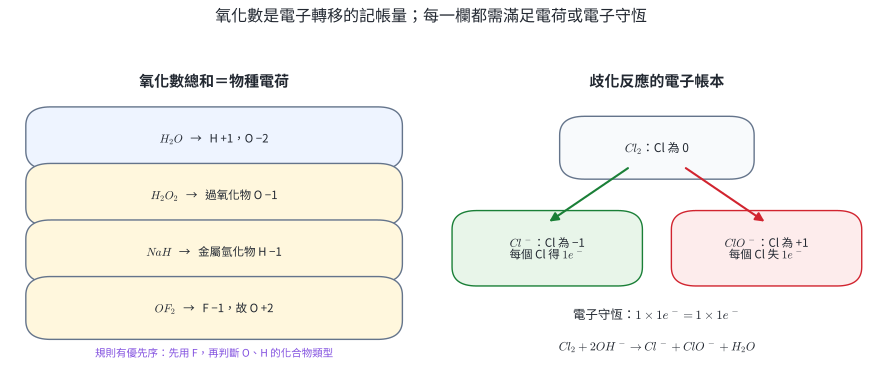{width=98%}

圖 1 左側四式的氧化數總和都為零。判斷 $OF_2$ 時先固定 F 為 $-1$，再由 $x+2(-1)=0$ 得 O 為 $+2$；這比直接套用「O 通常為 $-2$」更精確。

::: worked-example
### 示範 1｜求含氧酸根與過氧化物的氧化數

求 $S_2O_3^{2-}$ 中 S 的平均氧化數，以及 $H_2O_2$ 中 O 的氧化數。

對 $S_2O_3^{2-}$，令 S 的平均氧化數為 $x$：

$$
2x+3(-2)=-2\Rightarrow x=+2.
$$

這是兩個 S 的平均值；真實結構中兩個 S 的化學環境不同。$H_2O_2$ 是過氧化物，H 為 $+1$，故

$$
2(+1)+2x=0\Rightarrow x=-1.
$$
:::

::: worked-example
### 示範 2｜平均氧化數與混合價態

$Fe_3O_4$ 中令 Fe 的平均氧化數為 $x$：

$$
3x+4(-2)=0\Rightarrow x=+\frac83.
$$

$+\tfrac83$ 是平均值，不代表每個 Fe 原子帶有此電荷。$Fe_3O_4$ 可視為含一個 $Fe^{2+}$ 與兩個 $Fe^{3+}$ 的混合價態固體；平均為 $(2+3+3)/3=8/3$。
:::

### 1.2 氧化、還原與反應角色

- **氧化**：失去電子，元素氧化數上升。
- **還原**：得到電子，元素氧化數下降。
- **還原劑**：提供電子，本身被氧化。
- **氧化劑**：接受電子，本身被還原。

總反應中，氧化數上升的總量必須等於下降的總量，對應失去與得到的電子數相等。若同一種物質中的同一元素一部分被氧化、另一部分被還原，稱為**歧化反應**。

::: worked-example
### 示範 3｜由氧化數升降辨認反應角色

$$
2Al+3Cu^{2+}\rightarrow2Al^{3+}+3Cu.
$$

Al 由 $0$ 升至 $+3$，每個 Al 失去 $3e^-$；兩個 Al 共失去 $6e^-$，因此 Al 是還原劑。Cu 由 $+2$ 降至 $0$，三個 $Cu^{2+}$ 共得到 $6e^-$，因此 $Cu^{2+}$ 是氧化劑。
:::

::: worked-example
### 示範 4｜辨認歧化反應

$$
Cl_2+2OH^-\rightarrow Cl^-+ClO^-+H_2O.
$$

$Cl_2$ 中 Cl 為 $0$；生成 $Cl^-$ 時降為 $-1$，生成 $ClO^-$ 時升為 $+1$。一個 Cl 得 $1e^-$，另一個 Cl 失 $1e^-$，所以電子帳本閉合；$Cl_2$ 同時作氧化劑與還原劑。
:::

氧化數可追蹤漂白劑有效氯、礦石焙燒、代謝電子載體與電池材料的充放電狀態。它是形式記帳模型；若要描述共價鍵中的實際電荷分布，仍需電負度、鍵極性與量子化學模型。

### 練習 1

1. 求 $H_2SO_4$ 中 S、$Na_2O_2$ 中 O、$CaH_2$ 中 H、$OF_2$ 中 O 的氧化數。
2. 分別求 $NH_4NO_3$ 中銨根 N 與硝酸根 N 的氧化數，並求兩個 N 的平均值。
3. $MnO_2+4HCl\rightarrow MnCl_2+Cl_2+2H_2O$ 中，指出被氧化、被還原的元素與氧化劑、還原劑。
4. $2H_2O_2\rightarrow2H_2O+O_2$ 是否為歧化反應？用 O 的氧化數說明。
5. 反應 $2Al+3Cu^{2+}\rightarrow2Al^{3+}+3Cu$ 轉移多少莫耳電子，若反應掉 $0.0400\ \mathrm{mol}$ Al？
6. $Fe_3O_4$ 的 Fe 平均氧化數為何？說明此數值與個別 Fe 價態的差別。

### 練習 1 解析

1. $H_2SO_4$：$2(+1)+x+4(-2)=0$，S 為 $+6$。$Na_2O_2$ 是過氧化物，O 為 $-1$。$CaH_2$ 是金屬氫化物，H 為 $-1$。$OF_2$ 中 $x+2(-1)=0$，O 為 $+2$。
2. $NH_4^+$ 中 $x+4(+1)=+1$，N 為 $-3$；$NO_3^-$ 中 $x+3(-2)=-1$，N 為 $+5$。兩個 N 的平均為 $(-3+5)/2=+1$。
3. Mn 由 $+4$ 降為 $+2$，被還原；Cl 由 $-1$ 升為 $0$，被氧化。$MnO_2$ 是氧化劑，$HCl$ 提供的 $Cl^-$ 是還原劑。
4. $H_2O_2$ 中 O 為 $-1$；生成 $H_2O$ 時降至 $-2$，生成 $O_2$ 時升至 $0$。同一元素同時氧化、還原，屬歧化。
5. 每 mol Al 失去 $3\ \mathrm{mol}$ 電子，所以轉移 $(0.0400)(3)=0.120\ \mathrm{mol}\ e^-$。
6. $3x+4(-2)=0$，$x=+8/3$。它是三個 Fe 的平均；固體中可同時含 $Fe^{2+}$、$Fe^{3+}$ 位點。

## 2. 氧化還原反應式的平衡

配平的目標同時包含元素守恆與總電荷守恆。分子式前的係數可以調整，分子式內的下標代表物質本身，配平時維持不變。

### 2.1 氧化數法

氧化數法適合迅速辨認主要電子變化：

1. 標出氧化數改變的元素。
2. 令「原子數 × 每原子升降量」相等。
3. 配平其餘元素；水溶液中再依介質補 $H_2O$、$H^+$ 或 $OH^-$。
4. 檢查每種元素與總電荷。

::: worked-example
### 示範 5｜以氧化數法配平酸性反應

配平

$$
ClO_3^-+I^-+H^+\rightarrow Cl^-+I_2+H_2O.
$$

Cl 由 $+5$ 降為 $-1$，每個 Cl 得 $6e^-$；I 由 $-1$ 升為 $0$，每個 I 失 $1e^-$，故需 $6I^-$，形成 $3I_2$。再配平 O、H：

$$
ClO_3^-+6I^-+6H^+\rightarrow Cl^-+3I_2+3H_2O.
$$

左側總電荷 $-1-6+6=-1$，右側為 $-1$，電荷守恆。
:::

::: worked-example
### 示範 6｜先用升降量決定金屬係數

濃硝酸氧化銅時，骨架式為

$$
Cu+NO_3^-+H^+\rightarrow Cu^{2+}+NO_2+H_2O.
$$

Cu 由 $0$ 升至 $+2$，失 $2e^-$；N 由 $+5$ 降至 $+4$，每個 N 得 $1e^-$，所以 $Cu:NO_2=1:2$。補齊 O、H 與電荷：

$$
Cu+2NO_3^-+4H^+\rightarrow Cu^{2+}+2NO_2+2H_2O.
$$
:::

### 2.2 半反應法

半反應法把氧化與還原分開處理，特別適合離子反應與酸鹼介質：

**酸性溶液**：先平衡非 H、O 元素；以 $H_2O$ 平 O，以 $H^+$ 平 H，以 $e^-$ 平電荷；兩半反應電子數相等後相加、約去相同物種。

**鹼性溶液**：可先按酸性條件配平，再於兩側加入等量 $OH^-$ 中和 $H^+$，把 $H^++OH^-$ 改寫為 $H_2O$，最後約去水；也可直接以 $H_2O/OH^-$ 配平。

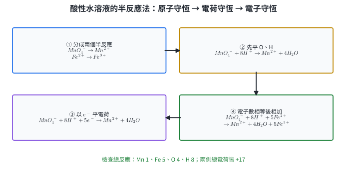{width=98%}

::: worked-example
### 示範 7｜酸性溶液的半反應法

配平 $MnO_4^-+Fe^{2+}\rightarrow Mn^{2+}+Fe^{3+}$。

還原半反應：

$$
MnO_4^-+8H^++5e^-\rightarrow Mn^{2+}+4H_2O.
$$

氧化半反應乘 5：

$$
5Fe^{2+}\rightarrow5Fe^{3+}+5e^-.
$$

相加得

$$
MnO_4^-+8H^++5Fe^{2+}\rightarrow Mn^{2+}+4H_2O+5Fe^{3+}.
$$

兩側總電荷均為 $+17$。
:::

::: worked-example
### 示範 8｜鹼性溶液的半反應法

配平 $Cr(OH)_3+ClO^-\rightarrow CrO_4^{2-}+Cl^-$。

氧化半反應：

$$
Cr(OH)_3+5OH^-\rightarrow CrO_4^{2-}+4H_2O+3e^-.
$$

還原半反應：

$$
ClO^-+H_2O+2e^-\rightarrow Cl^-+2OH^-.
$$

第一式乘 2、第二式乘 3，相加並約去 $e^-$、$OH^-$、$H_2O$：

$$
2Cr(OH)_3+4OH^-+3ClO^-\rightarrow2CrO_4^{2-}+5H_2O+3Cl^-.
$$

左側與右側總電荷皆為 $-7$。
:::

### 練習 2

1. 在酸性溶液中配平 $Cr_2O_7^{2-}+Fe^{2+}\rightarrow Cr^{3+}+Fe^{3+}$。
2. 在酸性溶液中配平 $MnO_4^-+C_2O_4^{2-}\rightarrow Mn^{2+}+CO_2$。
3. 在酸性溶液中配平 $ClO^-+I^-\rightarrow Cl^-+I_2$。
4. 在鹼性溶液中配平 $MnO_4^-+SO_3^{2-}\rightarrow MnO_2+SO_4^{2-}$。
5. 配平歧化反應 $Cl_2+OH^-\rightarrow Cl^-+ClO^-+H_2O$。
6. 配平 $H_2O_2+I^-+H^+\rightarrow I_2+H_2O$，並指出氧化劑與還原劑。

### 練習 2 解析

1. 還原半反應為 $Cr_2O_7^{2-}+14H^++6e^-\rightarrow2Cr^{3+}+7H_2O$，與六倍的 $Fe^{2+}\rightarrow Fe^{3+}+e^-$ 相加：

   $$
   Cr_2O_7^{2-}+14H^++6Fe^{2+}\rightarrow2Cr^{3+}+7H_2O+6Fe^{3+}.
   $$

2. 電子最小公倍數為 10：

   $$
   2MnO_4^-+16H^++5C_2O_4^{2-}\rightarrow2Mn^{2+}+10CO_2+8H_2O.
   $$

3. $ClO^-$ 的 Cl 由 $+1$ 降至 $-1$，需 $2e^-$；兩個 $I^-$ 各失 $1e^-$：

   $$
   ClO^-+2I^-+2H^+\rightarrow Cl^-+I_2+H_2O.
   $$

4. 配平結果為

   $$
   2MnO_4^-+3SO_3^{2-}+H_2O\rightarrow2MnO_2+3SO_4^{2-}+2OH^-.
   $$

   左右總電荷均為 $-8$。
5. $Cl_2+2OH^-\rightarrow Cl^-+ClO^-+H_2O$。
6. $H_2O_2+2I^-+2H^+\rightarrow I_2+2H_2O$。$H_2O_2$ 中 O 由 $-1$ 降為 $-2$，故 $H_2O_2$ 是氧化劑；$I^-$ 被氧化，是還原劑。

## 3. 氧化還原滴定

### 3.1 電子等量與化學計量點

滴定劑與待測物恰依反應係數完全反應的狀態稱為**化學計量點**。若每 mol 滴定劑接受 $z_T$ mol 電子、每 mol 待測物提供 $z_A$ mol 電子，則計量點滿足

$$
z_Tn_T=z_An_A.
$$

對酸性高錳酸根滴定亞鐵離子，$1\ \mathrm{mol}\ MnO_4^-$ 接受 $5\ \mathrm{mol}\ e^-$，而每 mol $Fe^{2+}$ 提供 $1\ \mathrm{mol}\ e^-$，所以

$$
n(Fe^{2+})=5n(MnO_4^-).
$$

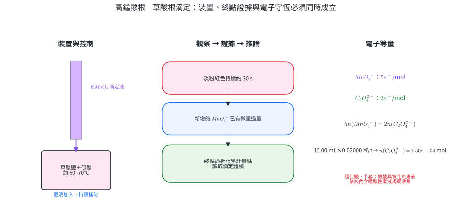{width=99%}

**終點**是由顏色或儀器訊號判定停止滴定的實驗狀態。終點應盡量接近化學計量點；兩者差異構成終點誤差。高錳酸根本身呈紫色，酸性滴定中常以淡粉紅色持續約 30 秒作終點證據。

::: worked-example
### 示範 9｜由滴定體積求亞鐵離子濃度

取 $25.00\ \mathrm{mL}$ 的 $Fe^{2+}$ 溶液，以 $0.02000\ \mathrm M$ 酸性 $KMnO_4$ 滴定，終點體積為 $18.60\ \mathrm{mL}$。

$$
n(MnO_4^-)=(0.02000)(0.01860)=3.720\times10^{-4}\ \mathrm{mol}.
$$

$$
n(Fe^{2+})=5(3.720\times10^{-4})=1.860\times10^{-3}\ \mathrm{mol}.
$$

$$
[Fe^{2+}]=\frac{1.860\times10^{-3}}{0.02500}=0.07440\ \mathrm M.
$$

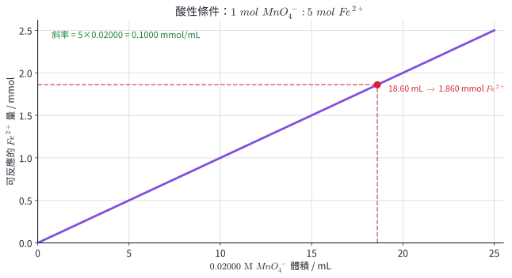{width=87%}
:::

::: worked-example
### 示範 10｜用草酸鈉標定高錳酸鉀

稱取 $0.1340\ \mathrm g$ 純 $Na_2C_2O_4$（莫耳質量 $134.0\ \mathrm{g\,mol^{-1}}$），酸化並加熱後，以 $KMnO_4$ 滴定，消耗 $20.00\ \mathrm{mL}$。反應係數為 $2MnO_4^-:5C_2O_4^{2-}$。

$$
n(C_2O_4^{2-})=\frac{0.1340}{134.0}=1.000\times10^{-3}\ \mathrm{mol},
$$

$$
n(MnO_4^-)=\frac25(1.000\times10^{-3})=4.000\times10^{-4}\ \mathrm{mol}.
$$

$$
c(KMnO_4)=\frac{4.000\times10^{-4}}{0.02000}=0.02000\ \mathrm M.
$$
:::

### 3.2 實驗證據、安全與誤差

高錳酸根—草酸根滴定在室溫下反應較慢，常把酸化試樣加熱至約 $60$–$70^\circ\mathrm C$；溫度過低造成終點附近反應延遲，溫度與酸度都需控制一致。酸化常用 $H_2SO_4$：$HCl$ 的 $Cl^-$ 可能被強氧化劑氧化，$HNO_3$ 本身具氧化性，兩者都會增加旁反應。

觀察、證據與推論可分成：

1. 觀察：最後一滴加入並搖勻後，淡粉紅色持續。
2. 證據：溶液中開始存在可見的微量過量 $MnO_4^-$。
3. 推論：終點已接近化學計量點，可用滴定體積計算待測物量。

$KMnO_4$ 是強氧化劑並會染色，$H_2SO_4$ 與熱酸溶液具腐蝕及燙傷風險。操作使用護目鏡、實驗衣、合適手套與滴定管安全夾；以吸球取液。所有含錳、酸與有機還原劑的混合液依學校安全資料表及指定含錳酸性廢液流程收集，不直接排入水槽。

::: worked-example
### 示範 11｜由過氧化氫滴定求濃度

酸性條件的總反應為

$$
2MnO_4^-+5H_2O_2+6H^+\rightarrow2Mn^{2+}+5O_2+8H_2O.
$$

$25.00\ \mathrm{mL}$ 過氧化氫試樣消耗 $12.40\ \mathrm{mL}$、$0.02000\ \mathrm M$ $KMnO_4$：

$$
n(MnO_4^-)=2.480\times10^{-4}\ \mathrm{mol},
$$

$$
n(H_2O_2)=\frac52n(MnO_4^-)=6.200\times10^{-4}\ \mathrm{mol},
$$

$$
[H_2O_2]=0.02480\ \mathrm M.
$$
:::

### 練習 3

1. $20.00\ \mathrm{mL}$、$0.05000\ \mathrm M$ $Fe^{2+}$ 需多少 mL 的 $0.02000\ \mathrm M$ 酸性 $KMnO_4$ 才達計量點？
2. $25.00\ \mathrm{mL}$ $H_2O_2$ 消耗 $12.40\ \mathrm{mL}$、$0.02000\ \mathrm M$ $KMnO_4$。求 $H_2O_2$ 濃度。
3. $0.0670\ \mathrm g$ $Na_2C_2O_4$（$M=134.0\ \mathrm{g\,mol^{-1}}$）需 $0.02000\ \mathrm M$ $KMnO_4$ 多少 mL？
4. 已超過淡粉紅終點仍多加滴定液，若照讀值計算待測還原劑含量，結果偏高或偏低？
5. 說明酸性高錳酸根滴定優先用 $H_2SO_4$ 而不選 $HCl$ 或 $HNO_3$ 的化學理由。
6. 學生觀察滴定開始時紫色迅速消失，接近終點時消失較慢。分別寫出觀察、可支持的證據與一個需控制的變因。

### 練習 3 解析

1. $n(Fe^{2+})=(0.02000)(0.05000)=1.000\times10^{-3}\ \mathrm{mol}$，故 $n(MnO_4^-)=2.000\times10^{-4}\ \mathrm{mol}$，體積為 $0.01000\ \mathrm L=10.00\ \mathrm{mL}$。
2. $n(MnO_4^-)=2.480\times10^{-4}\ \mathrm{mol}$；依 $2:5$，$n(H_2O_2)=6.200\times10^{-4}\ \mathrm{mol}$，濃度 $0.02480\ \mathrm M$。
3. $n(C_2O_4^{2-})=5.00\times10^{-4}\ \mathrm{mol}$，$n(MnO_4^-)=\tfrac25(5.00\times10^{-4})=2.00\times10^{-4}\ \mathrm{mol}$，體積 $10.00\ \mathrm{mL}$。
4. 滴定液讀值偏大，依電子等量換算的待測還原劑量也偏大。
5. $Cl^-$ 可能被 $MnO_4^-$ 氧化而額外消耗滴定劑；$HNO_3$ 可氧化待測還原劑。$H_2SO_4$ 在此條件下提供酸性而較少引入這兩種干擾。
6. 觀察是紫色消失速度由快轉慢。這支持待測還原劑逐漸減少，新增 $MnO_4^-$ 被還原所需時間變長；可控制溫度、酸度、滴加速率或每次搖勻方式。

## 4. 電化電池與電池電壓

### 4.1 原電池的構造與方向

**原電池（伏打電池）**利用自發氧化還原反應，把化學能轉成電能。氧化發生在**陽極**，還原發生在**陰極**；原電池的陽極是負極、陰極是正極。電子由陽極經外電路流向陰極，傳統電流方向相反。

若兩半電池以鹽橋連接，陽極槽因金屬氧化而增加正離子，鹽橋陰離子移向陽極槽；陰極槽因正離子被還原而減少正電荷，鹽橋陽離子移向陰極槽。鹽橋傳遞離子以維持電中性，同時減少兩槽直接混合。

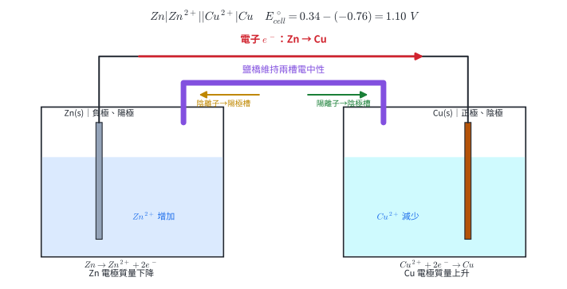{width=99%}

丹尼耳電池的半反應為

$$
Zn\rightarrow Zn^{2+}+2e^-,
$$

$$
Cu^{2+}+2e^-\rightarrow Cu.
$$

電池簡式通常把陽極寫在左、陰極寫在右：

$$
Zn(s)|Zn^{2+}(aq)||Cu^{2+}(aq)|Cu(s).
$$

單線表示相界面，雙線表示鹽橋或液接界面。

::: worked-example
### 示範 12｜從裝置圖連到半反應與質量變化

丹尼耳電池放電 $0.0100\ \mathrm{mol}$ Zn。每 mol Zn 失 $2\ \mathrm{mol}$ 電子，故外電路通過 $0.0200\ \mathrm{mol}\ e^-$；同量電子可還原 $0.0100\ \mathrm{mol}\ Cu^{2+}$。Zn 電極減少約 $(0.0100)(65.38)=0.654\ \mathrm g$，Cu 電極增加約 $(0.0100)(63.55)=0.636\ \mathrm g$。
:::

::: worked-example
### 示範 13｜由電表接線判斷電極方向

Zn、Cu 半電池以鹽橋連接，電表紅端接 Cu、黑端接 Zn，讀值為 $+1.08\ \mathrm V$。正讀值表示紅端電位較高，因此 Cu 為正極、陰極，Zn 為負極、陽極。電子由 Zn 經黑端、電表與紅端流向 Cu；量得的 $1.08\ \mathrm V$ 接近標準值 $1.10\ \mathrm V$，差異可來自濃度非標準、內阻、液接界面與電表負載。
:::

#### 簡易原電池實驗的證據鏈

把 Zn、Cu 金屬片分別插入已知離子溶液並以電表連接，可比較不同組合的電壓與正負方向。觀察是「電表指針或讀值的方向與大小」；證據是兩電極之間存在穩定電位差；結合電極表面變化與離子顏色，才能推論哪端氧化、哪端還原。控制金屬片浸入面積、表面清潔、離子濃度、溫度、鹽橋與量測時間。

$AgNO_3$ 具氧化性並可灼傷皮膚；強酸、強鹼溶液具腐蝕性。操作使用護目鏡、實驗衣與合適手套，金屬片以鑷子處理。含 Ag、Cu、Ni 等金屬離子的溶液與清洗液分流至指定重金屬廢液；鋅鹽與其他無機廢液依校內標示收集。

### 4.2 標準還原電位與標準電池電壓

**標準還原電位** $E^\circ$ 是某還原半反應相對於標準氫電極的電位。標準氫電極定為 $0.00\ \mathrm V$；高中計算常以溶液濃度約 $1\ \mathrm M$、氣體壓力 $1\ \mathrm{bar}$、純固液相與指定溫度（表值通常 $25^\circ\mathrm C$）近似標準狀態。

$E^\circ$ 越大，表列還原反應在標準狀態下作陰極反應的傾向越強。標準電池電壓為

$$
E^\circ_{cell}=E^\circ_{cathode}-E^\circ_{anode}.
$$

若 $E^\circ_{cell}>0$，按所寫方向在標準狀態下具自發性。$E^\circ$ 是強度量；為配平而把半反應係數乘數倍，不會把電位乘數倍。

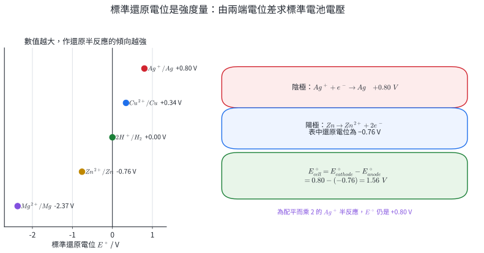{width=98%}

::: worked-example
### 示範 14｜判斷電極並求標準電壓

給定

$$
Cu^{2+}+2e^-\rightarrow Cu,\quad E^\circ=+0.34\ \mathrm V,
$$

$$
Zn^{2+}+2e^-\rightarrow Zn,\quad E^\circ=-0.76\ \mathrm V.
$$

Cu 半反應電位較大，作陰極；Zn 反向作陽極：

$$
E^\circ_{cell}=0.34-(-0.76)=1.10\ \mathrm V.
$$

總反應為 $Zn+Cu^{2+}\rightarrow Zn^{2+}+Cu$。
:::

::: worked-example
### 示範 15｜從三個半反應選出最大標準電壓

已知 $Ag^+/Ag=+0.80\ \mathrm V$、$Cu^{2+}/Cu=+0.34\ \mathrm V$、$Mg^{2+}/Mg=-2.37\ \mathrm V$。若材料允許任選兩對，要得到最大正電壓，選最高的 Ag 作陰極、最低的 Mg 反向作陽極：

$$
E^\circ_{cell}=0.80-(-2.37)=3.17\ \mathrm V.
$$

配平總反應為 $Mg+2Ag^+\rightarrow Mg^{2+}+2Ag$；Ag 半反應乘 2，電位仍為 $+0.80\ \mathrm V$。
:::

實際電池電壓還受濃度、溫度、內阻、極化、過電位與放電速率影響；$E^\circ$ 只描述標準狀態下的可逆電位差。

### 4.3 一次電池、二次電池與燃料電池

- **一次電池**：反應物封裝於電池內，放電後通常不設計為反向充電；材料結構改變或副反應會降低可逆性。
- **二次電池**：外加電能可在操作電壓與溫度範圍內驅動總反應逆向，重建較高能量的反應物。
- **燃料電池**：燃料與氧化劑由外部持續供應，產物持續移出；電池本體主要提供分隔、催化與離子傳導環境。

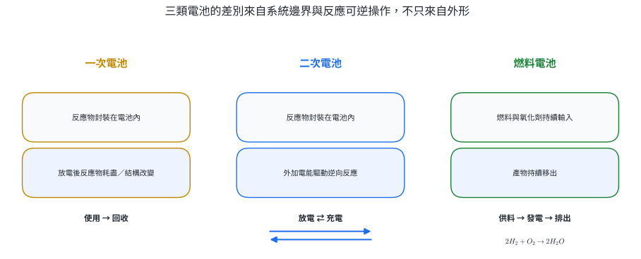{width=99%}

鋅碳乾電池以 Zn 外殼作陽極、含 $MnO_2$ 的混合物作陰極材料，電解質為糊狀物；鹼性鋅錳電池使用鹼性電解質與較大反應表面的 Zn，通常有較低內阻與較好的高電流性能。一次鋰電池以金屬 Li 作陽極，因 Li 易氧化而可提供較高電壓；其陰極材料依電池型式而異，成品需按原設計使用，不作一般充電。

鉛蓄電池放電時兩極都逐漸形成 $PbSO_4$，硫酸濃度下降；充電驅動反向反應。鋰離子電池不含金屬鋰陽極，而以鋰離子在兩個可嵌入材料之間遷移配合外電路電子流；超出核准電壓或溫度範圍會引發副反應與熱安全風險。

::: worked-example
### 示範 16｜用端電壓資料比較乾電池與鹼性電池

兩顆新電池的開路電壓都為 $1.55\ \mathrm V$。接上 $2.00\ \Omega$ 負載後，鋅碳乾電池端電壓為 $1.10\ \mathrm V$，鹼性電池為 $1.44\ \mathrm V$。負載電流 $I=V/R$，分別為 $0.550\ \mathrm A$、$0.720\ \mathrm A$；以 $r=(E-V)/I$ 估算內阻：

$$
r_{dry}=\frac{1.55-1.10}{0.550}=0.82\ \Omega,
$$

$$
r_{alkaline}=\frac{1.55-1.44}{0.720}=0.15\ \Omega.
$$

兩者開路電壓相近，鹼性電池在負載下維持較高端電壓，資料支持其內阻較低；這與電極表面積、電解質導電及結構設計有關，不能只由「鹼性」三字推得確切容量。
:::

氫氧燃料電池總反應為

$$
2H_2+O_2\rightarrow2H_2O,
$$

每消耗 $1\ \mathrm{mol}\ O_2$，外電路理想上轉移 $4\ \mathrm{mol}\ e^-$。電池回收可回收金屬並避免電解液與活性物質進入一般垃圾流程。

::: worked-example
### 示範 17｜燃料電池的物質量與電量

氫氧燃料電池消耗 $0.500\ \mathrm{mol}\ O_2$。理想電子量為

$$
n(e^-)=4(0.500)=2.00\ \mathrm{mol}.
$$

取 $F=96485\ \mathrm{C\,mol^{-1}}$，通過電量為

$$
Q=n(e^-)F=(2.00)(96485)=1.93\times10^5\ \mathrm C.
$$

這是反應計量對應的理論電量；實際可用能量還取決於工作電壓與效率。
:::

### 練習 4

1. 以 $Mg^{2+}/Mg=-2.37\ \mathrm V$、$Cu^{2+}/Cu=+0.34\ \mathrm V$ 組成標準電池。寫出陽極、陰極、電子方向、總反應與 $E^\circ_{cell}$。
2. 以 $Ag^+/Ag=+0.80\ \mathrm V$、$Cu^{2+}/Cu=+0.34\ \mathrm V$ 組成電池，求標準電壓並寫電池簡式。
3. 為配平而把 $Ag^++e^-\rightarrow Ag$ 乘 2，標準還原電位如何變化？說明理由。
4. 丹尼耳電池放電時，$Zn^{2+}$、$Cu^{2+}$ 濃度如何變化？鹽橋陰、陽離子各移向哪一槽？
5. 鉛蓄電池放電時兩極 $PbSO_4$ 與電解液硫酸濃度如何變化？充電的能量方向為何？
6. 氫氧燃料電池消耗 $0.250\ \mathrm{mol}\ H_2$，理想上轉移多少 mol 電子、生成多少 mol 水？

### 練習 4 解析

1. Mg 電位較低，作陽極；Cu 作陰極。電子由 Mg 流向 Cu。總反應 $Mg+Cu^{2+}\rightarrow Mg^{2+}+Cu$，$E^\circ_{cell}=0.34-(-2.37)=2.71\ \mathrm V$。
2. Ag 作陰極、Cu 作陽極，$E^\circ_{cell}=0.80-0.34=0.46\ \mathrm V$。簡式可寫 $Cu|Cu^{2+}||Ag^+|Ag$。
3. 不變，仍為 $+0.80\ \mathrm V$。電位是每單位電荷的能量差，屬強度量；係數改變總電子數與總自由能，不改變兩端電位差。
4. Zn 氧化使 $[Zn^{2+}]$ 增加；$Cu^{2+}$ 還原使 $[Cu^{2+}]$ 減少。鹽橋陰離子移向 Zn 陽極槽，陽離子移向 Cu 陰極槽。
5. 放電時兩極的 $PbSO_4$ 都增加，硫酸被消耗而濃度下降。充電時外界把電能轉成較高化學能，驅動淨反應逆向。
6. $H_2\rightarrow2H^++2e^-$，故 $0.250\ \mathrm{mol}\ H_2$ 對應 $0.500\ \mathrm{mol}\ e^-$；總反應係數 $H_2:H_2O=1:1$，生成 $0.250\ \mathrm{mol}\ H_2O$。

## 5. 電解、電鍍、鏽蝕與法拉第定律

### 5.1 電解與產物判斷

**電解**以外加直流電源驅動非自發氧化還原反應，把電能轉成化學能。陽極仍發生氧化、陰極仍發生還原；電解槽中陽極接電源正端，陰極接負端。

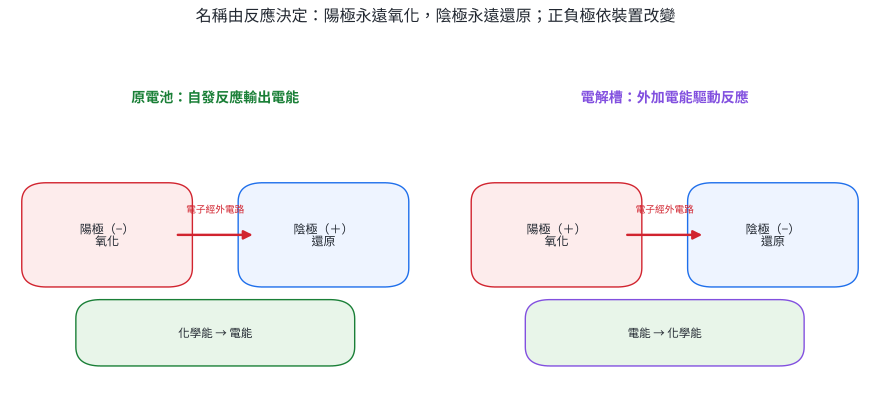{width=98%}

判斷電解產物的順序為：

1. 確認是熔融鹽或水溶液，列出陰極可還原、陽極可氧化的所有物種。
2. 依還原電位判斷熱力學候選；陽極需把表列還原反應反向。
3. 再考慮濃度、過電位與電極材質。活性電極可能直接參與反應；惰性電極主要提供電子傳遞表面。
4. 寫出兩個半反應並以電子數相加，核對總反應。

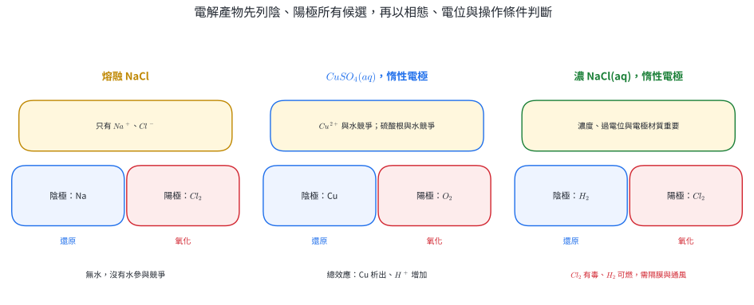{width=99%}

::: worked-example
### 示範 18｜熔融氯化鈉與水溶液的差別

熔融 $NaCl$ 只有 $Na^+$、$Cl^-$ 可放電：

$$
Na^++e^-\rightarrow Na\qquad(陰極),
$$

$$
2Cl^-\rightarrow Cl_2+2e^-\qquad(陽極).
$$

總反應為 $2NaCl(l)\rightarrow2Na(l)+Cl_2(g)$。若改為水溶液，陰極還要比較 $Na^+$ 與水的還原；通常水生成 $H_2$，不析出金屬 Na。
:::

::: worked-example
### 示範 19｜惰性電極電解硫酸銅水溶液

陰極：$Cu^{2+}+2e^-\rightarrow Cu$。陽極的硫酸根在一般條件下較難氧化，水被氧化：

$$
2H_2O\rightarrow O_2+4H^++4e^-.
$$

合併後

$$
2Cu^{2+}+2H_2O\rightarrow2Cu+O_2+4H^+.
$$

可觀察陰極析出銅、陽極產生氣泡，溶液 $Cu^{2+}$ 減少且酸性增強。若陽極改用銅，主要反應可變為 $Cu\rightarrow Cu^{2+}+2e^-$，整體接近把銅由陽極移到陰極。
:::

濃食鹽水電解可產生 $H_2$、$Cl_2$ 與 $NaOH$；工業裝置以隔膜避免產物重新反應。$Cl_2$ 有急性吸入毒性，$H_2$ 可燃，$NaOH$ 腐蝕皮膚與眼睛，示範需微量、通風、隔離火源並依校內規範處理含氯鹼性廢液。

### 5.2 電解精煉、電鍍與鏽蝕

銅的電解精煉以粗銅為陽極、純銅薄片為陰極。銅在陽極氧化成 $Cu^{2+}$，在陰極還原成純銅；較不活潑的貴金屬可形成陽極泥，較活潑的雜質可能留在溶液中。電鍍時待鍍物接陰極，鍍層金屬可作可溶性陽極，電解液含相應金屬離子。

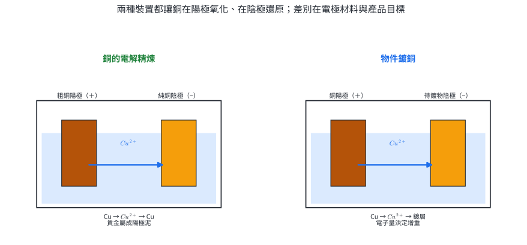{width=98%}

::: worked-example
### 示範 20｜設計銅電鍍裝置

要在鋼匙表面鍍銅：鋼匙接電源負端作陰極，銅片接正端作陽極，使用含 $Cu^{2+}$ 的電解液。半反應為

$$
Cu^{2+}+2e^-\rightarrow Cu\qquad(鋼匙表面),
$$

$$
Cu\rightarrow Cu^{2+}+2e^-\qquad(銅陽極).
$$

兩反應使銅由陽極轉移至鋼匙。表面清潔、電流密度、離子濃度、溫度與攪拌會影響鍍層附著與均勻度。
:::

鐵在含水與氧的環境可形成許多局部電池。缺氧區常作陽極：

$$
Fe\rightarrow Fe^{2+}+2e^-.
$$

富氧區常作陰極：

$$
O_2+2H_2O+4e^-\rightarrow4OH^-.
$$

$Fe^{2+}$、$OH^-$ 與氧繼續反應生成含水氧化鐵等鏽蝕產物。阻隔塗層減少水、氧與電解質接觸；鍍鋅若有刮痕，Zn 仍可優先氧化，作犧牲陽極；大型管線也可用外加電流維持鋼鐵為陰極。

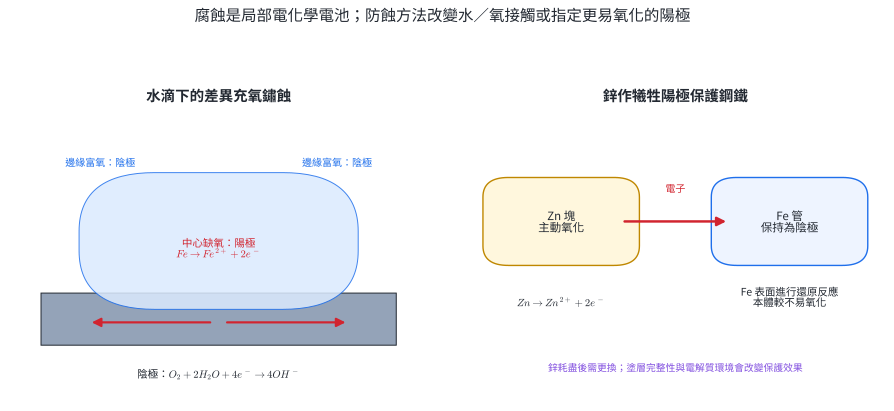{width=99%}

::: worked-example
### 示範 21｜由電位判斷犧牲陽極

標準還原電位為 $Mg^{2+}/Mg=-2.37\ \mathrm V$、$Zn^{2+}/Zn=-0.76\ \mathrm V$、$Fe^{2+}/Fe=-0.44\ \mathrm V$。Mg、Zn 的電位都低於 Fe，與鐵電連接時較易被氧化，可作犧牲陽極。Mg 與 Fe 的驅動電位差較大，但實際選材還需考慮環境、消耗速率、表面膜、成本與更換週期。
:::

### 5.3 法拉第電解定律

電流 $I$ 是單位時間通過的電量：

$$
Q=It.
$$

一莫耳電子帶有的電量為法拉第常數 $F\approx96485\ \mathrm{C\,mol^{-1}}$，所以

$$
n(e^-)=\frac{Q}{F}=\frac{It}{F}.
$$

若每生成 $1\ \mathrm{mol}$ 產物需 $z\ \mathrm{mol}$ 電子，產物莫耳數與質量為

$$
n(\text{產物})=\frac{It}{zF},\qquad
m=\frac{MIt}{zF}.
$$

有副反應時，以電流效率 $\eta$ 修正：$m_{actual}=\eta m_{theoretical}$。

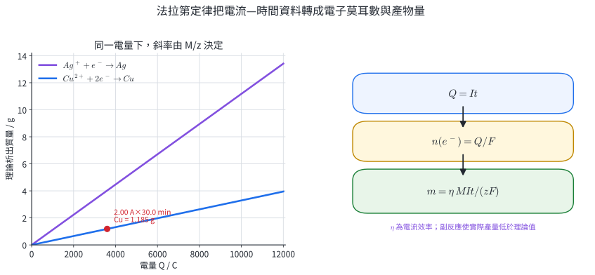{width=98%}

::: worked-example
### 示範 22｜由電流與時間求鍍銅質量

$2.00\ \mathrm A$ 電流通過 $Cu^{2+}$ 溶液 $30.0\ \mathrm{min}$，假設電流效率 $100\%$：

$$
Q=(2.00)(30.0\times60)=3600\ \mathrm C,
$$

$$
m(Cu)=\frac{(63.55)(3600)}{(2)(96485)}=1.19\ \mathrm g.
$$

單位檢查：$\mathrm{A\,s=C}$；除以 $\mathrm{C\,mol^{-1}}$ 得電子 mol，再依 $2e^-$ 對 1 mol Cu 轉成質量。
:::

::: worked-example
### 示範 23｜含電流效率的鍍銀

$0.800\ \mathrm A$ 電流鍍銀 $25.0\ \mathrm{min}$，電流效率 $90.0\%$，$Ag^++e^-\rightarrow Ag$：

$$
Q=(0.800)(25.0\times60)=1200\ \mathrm C,
$$

$$
m_{theory}=\frac{(107.87)(1200)}{(1)(96485)}=1.342\ \mathrm g,
$$

$$
m_{actual}=(0.900)(1.342)=1.21\ \mathrm g.
$$
:::

電鍍與無電鍍實驗若使用 $AgNO_3$，需注意其氧化性與皮膚灼傷風險；含銀溶液與固體收集為含銀重金屬廢棄物。銀鏡反應的氨性銀試劑應現配、微量使用並立即依校方程序處理，殘液不可久放或乾涸，以免形成具爆炸風險的含銀殘留物；氨操作需通風，$NaOH$ 具腐蝕性。使用護目鏡、實驗衣與合適手套。

### 練習 5

1. 電解熔融 $MgCl_2$，寫兩極反應。若生成 $0.100\ \mathrm{mol}$ Mg，生成多少 mol $Cl_2$？
2. 以惰性電極電解 $CuSO_4(aq)$，通入 $1.50\ \mathrm A$、$40.0\ \mathrm{min}$，假設效率 $100\%$，求陰極析出 Cu 質量。
3. $0.800\ \mathrm A$ 鍍銀 $25.0\ \mathrm{min}$，效率 $90.0\%$，求實際增重。
4. 寫出濃食鹽水電解的理想總反應、$H_2:Cl_2$ 莫耳比與兩項安全控制。
5. 比較完整塗漆、鍍鋅與連接 Mg 塊三種防蝕方法的作用機制。
6. 粗銅電解精煉時，說明銅、較活潑金屬雜質與較不活潑貴金屬的大致去向。

### 練習 5 解析

1. 陰極 $Mg^{2+}+2e^-\rightarrow Mg$；陽極 $2Cl^-\rightarrow Cl_2+2e^-$。兩者電子數相同，故 $n(Cl_2)=0.100\ \mathrm{mol}$。
2. $Q=(1.50)(40.0\times60)=3600\ \mathrm C$，$m=63.55(3600)/(2\times96485)=1.19\ \mathrm g$。
3. 理論質量 $107.87(0.800)(1500)/96485=1.342\ \mathrm g$；實際為 $(0.900)(1.342)=1.21\ \mathrm g$。
4. $2NaCl+2H_2O\rightarrow2NaOH+H_2+Cl_2$，故 $H_2:Cl_2=1:1$。安全控制可列通風並吸收 $Cl_2$、隔離火源、防止 $H_2/Cl_2$ 混合、使用隔膜、護目鏡與耐鹼手套。
5. 完整塗漆阻隔水、氧與電解質；鍍鋅同時提供阻隔層與 Zn 犧牲陽極；Mg 塊以更易氧化的 Mg 持續向鐵提供電子，使鐵維持陰極。
6. Cu 由粗銅陽極溶解並在純銅陰極析出。較活潑雜質可能氧化進入溶液但不易在設定條件下析出；較不活潑的貴金屬常不溶解而成陽極泥。

## 6. 章末分層題

### 基礎題 1–6

1. 求 $K_2Cr_2O_7$ 中 Cr、$KO_2$ 中 O、$NaH$ 中 H 的氧化數。
2. 對 $2Fe^{3+}+Sn^{2+}\rightarrow2Fe^{2+}+Sn^{4+}$，指出氧化劑、還原劑與轉移電子數。
3. 在酸性溶液中配平 $MnO_4^-+H_2O_2\rightarrow Mn^{2+}+O_2$。
4. 在鹼性溶液中配平 $ClO^-+Cr(OH)_3\rightarrow Cl^-+CrO_4^{2-}$。
5. $30.00\ \mathrm{mL}$ $Fe^{2+}$ 試樣消耗 $16.00\ \mathrm{mL}$、$0.01500\ \mathrm M$ 酸性 $KMnO_4$。求 $[Fe^{2+}]$。
6. 高錳酸根滴定若滴定管尖端起初有氣泡、滴定後氣泡消失，記錄體積與真正進入錐形瓶的體積誰較大？計算的待測還原劑濃度偏向何方？

### 核心題 7–12

7. 丹尼耳電池放電時，寫兩極反應、電子方向、鹽橋離子方向，以及兩電極質量變化。
8. 給定 $Fe^{3+}/Fe^{2+}=+0.77\ \mathrm V$、$Cu^{2+}/Cu=+0.34\ \mathrm V$。組成標準電池，寫總反應與 $E^\circ_{cell}$。
9. 說明二次電池充電時能量方向與電極淨反應如何改變；列一項操作限制。
10. 以惰性電極電解 $CuSO_4(aq)$，寫兩極反應、總反應與溶液酸鹼性的趨勢。
11. $3.00\ \mathrm A$ 電解水 $1930\ \mathrm s$，假設只有陽極產生 $O_2$ 且效率 $100\%$。求 $O_2$ 莫耳數。
12. 鐵片一部分位於缺氧水滴中心、一部分位於富氧邊緣。指出較可能的陽極與陰極區，寫主要半反應。

### 跨節整合題 13–16

13. $20.00\ \mathrm{mL}$ 過氧化氫試樣以 $0.01800\ \mathrm M$ 酸性 $KMnO_4$ 滴定，終點體積 $14.20\ \mathrm{mL}$。配平總反應、求 $[H_2O_2]$，並寫出終點觀察、一項控制變因與廢液處置。
14. 標準電池由 $Zn^{2+}/Zn=-0.76\ \mathrm V$ 與 $Ag^+/Ag=+0.80\ \mathrm V$ 組成。若放電時消耗 $0.100\ \mathrm{mol}$ Zn，求 $E^\circ_{cell}$、外電路電子量；若同量電子理想上用於另一電解槽鍍銅，求 Cu 質量。
15. 海水管線以 Mg 作犧牲陽極，平均保護電流為 $50.0\ \mathrm{mA}$，連續運作 $180$ 日。假設 Mg 的電流效率 $100\%$，以 $Mg\rightarrow Mg^{2+}+2e^-$ 計算至少消耗的 Mg 質量；再說明真實設計為何需留裕量。
16. 惰性電極電解 $CuSO_4(aq)$ 的兩次資料如下。兩次都寫出陰、陽極反應；求理論 Cu 質量、電流效率，判斷資料是否支持「在相同電量下析出量相同」，並列一項造成效率低於 $100\%$ 的機制。

   | 實驗 | 電流 / A | 時間 / s | 陰極實際增重 / g |
   |---|---:|---:|---:|
   | A | 1.00 | 1800 | 0.550 |
   | B | 1.50 | 1200 | 0.560 |

## 7. 章末題完整解析

1. $K_2Cr_2O_7$：$2(+1)+2x+7(-2)=0$，Cr 為 $+6$。$KO_2$ 是超氧化物，兩個 O 的總氧化數為 $-1$，平均 $-\tfrac12$。$NaH$ 中 H 為 $-1$。
2. $Fe^{3+}$ 得電子降為 $Fe^{2+}$，是氧化劑；$Sn^{2+}$ 失兩電子升為 $Sn^{4+}$，是還原劑。依所寫反應轉移 $2\ \mathrm{mol}\ e^-$。
3. 半反應相加得

   $$
   2MnO_4^-+5H_2O_2+6H^+\rightarrow2Mn^{2+}+5O_2+8H_2O.
   $$

   Mn、O、H 守恆，兩側總電荷皆為 $+4$。
4. 配平結果為

   $$
   3ClO^-+2Cr(OH)_3+4OH^-\rightarrow3Cl^-+2CrO_4^{2-}+5H_2O.
   $$

   左右總電荷均為 $-7$。
5. $n(MnO_4^-)=(0.01500)(0.01600)=2.400\times10^{-4}\ \mathrm{mol}$，故 $n(Fe^{2+})=5n(MnO_4^-)=1.200\times10^{-3}\ \mathrm{mol}$：

   $$
   [Fe^{2+}]=\frac{1.200\times10^{-3}}{0.03000}=0.04000\ \mathrm M.
   $$

6. 部分讀值用來填滿尖端氣泡，記錄體積大於真正進入錐形瓶的體積。若全數當作反應用滴定液，計算的待測還原劑量與濃度偏高。
7. 陽極 $Zn\rightarrow Zn^{2+}+2e^-$，Zn 質量下降；陰極 $Cu^{2+}+2e^-\rightarrow Cu$，Cu 質量上升。電子由 Zn 流向 Cu；鹽橋陰離子移向 Zn 槽，陽離子移向 Cu 槽。
8. $Fe^{3+}/Fe^{2+}$ 電位較大，作陰極：$2Fe^{3+}+2e^-\rightarrow2Fe^{2+}$。Cu 反向作陽極：$Cu\rightarrow Cu^{2+}+2e^-$。總反應

   $$
   2Fe^{3+}+Cu\rightarrow2Fe^{2+}+Cu^{2+},
   $$

   $$
   E^\circ_{cell}=0.77-0.34=0.43\ \mathrm V.
   $$

9. 充電時外界把電能轉成化學能，使放電總反應逆向；原先放電產物被轉回較高能量的反應物。限制可列最高充電電壓、溫度、倍率、材料可逆範圍或避免過充造成副反應。
10. 陰極 $Cu^{2+}+2e^-\rightarrow Cu$；陽極 $2H_2O\rightarrow O_2+4H^++4e^-$。總反應 $2Cu^{2+}+2H_2O\rightarrow2Cu+O_2+4H^+$，故溶液酸性增強。
11. $Q=(3.00)(1930)=5790\ \mathrm C$，$n(e^-)=5790/96485=0.0600\ \mathrm{mol}$。生成 $1\ \mathrm{mol}\ O_2$ 需 $4\ \mathrm{mol}\ e^-$，故

    $$
    n(O_2)=0.0600/4=0.0150\ \mathrm{mol}.
    $$

12. 缺氧中心較可能為陽極，$Fe\rightarrow Fe^{2+}+2e^-$；富氧邊緣較可能為陰極，$O_2+2H_2O+4e^-\rightarrow4OH^-$。電子在鐵內由中心流向邊緣。
13. 配平式為

    $$
    2MnO_4^-+5H_2O_2+6H^+\rightarrow2Mn^{2+}+5O_2+8H_2O.
    $$

    $$
    n(MnO_4^-)=(0.01800)(0.01420)=2.556\times10^{-4}\ \mathrm{mol},
    $$

    $$
    n(H_2O_2)=\frac52(2.556\times10^{-4})=6.390\times10^{-4}\ \mathrm{mol},
    $$

    $$
    [H_2O_2]=\frac{6.390\times10^{-4}}{0.02000}=0.03195\ \mathrm M.
    $$

    終點觀察為搖勻後淡粉紅色持續約 30 秒。控制變因可列酸度、溫度、滴加與搖勻方式。含錳、酸與過氧化物反應後的混合液依校方指定含錳酸性廢液流程收集。
14. Ag 作陰極、Zn 作陽極：

    $$
    E^\circ_{cell}=0.80-(-0.76)=1.56\ \mathrm V.
    $$

    $0.100\ \mathrm{mol}$ Zn 氧化轉移 $0.200\ \mathrm{mol}\ e^-$。鍍銅需 $2\ \mathrm{mol}\ e^-$ 生成 $1\ \mathrm{mol}$ Cu，故生成 $0.100\ \mathrm{mol}$ Cu，質量為 $(0.100)(63.55)=6.36\ \mathrm g$。能量來源與鍍銅槽分離計算；理想電子量由串接與效率假設決定。
15. 電量

    $$
    Q=(0.0500)(180\times86400)=7.776\times10^5\ \mathrm C.
    $$

    $$
    n(Mg)=\frac{Q}{2F}=\frac{7.776\times10^5}{2(96485)}=4.03\ \mathrm{mol},
    $$

    $$
    m=(4.03)(24.305)=98.0\ \mathrm g.
    $$

    真實設計需因電流隨鹽度、溫度與塗層破損改變、陽極可能鈍化、接觸電阻與電流分布不均，以及維修間隔留裕量。
16. 兩次陰極皆為 $Cu^{2+}+2e^-\rightarrow Cu$，陽極皆為 $2H_2O\rightarrow O_2+4H^++4e^-$。A、B 的電量都是 $1800\ \mathrm C$，理論質量相同：

    $$
    m_{theory}=\frac{(63.55)(1800)}{2(96485)}=0.5928\ \mathrm g.
    $$

    $$
    \eta_A=0.550/0.5928=92.8\%,\qquad
    \eta_B=0.560/0.5928=94.5\%.
    $$

    兩次實際增重接近且理論值相同，資料支持析出量主要由總電量決定；差異可來自陰極同時還原水產氫、秤量殘水、鍍層脫落、接觸電流波動或表面狀態不同。

## 8. 核心整理

::: {.compact-list}

- 氧化數總和等於物種電荷；氧化數上升表示氧化，下降表示還原。還原劑失電子，氧化劑得電子。
- 配平需同時滿足原子與電荷守恆；半反應法以 $H_2O/H^+$ 處理酸性介質，以 $H_2O/OH^-$ 處理鹼性介質，再使電子數相等。
- 氧化還原滴定在化學計量點滿足兩邊轉移電子莫耳數相等；終點是可觀察訊號，需控制與計量點的差距。
- 原電池：陽極負、陰極正，化學能轉成電能；電解槽：陽極正、陰極負，電能轉成化學能。陽極始終氧化，陰極始終還原。
- $E^\circ_{cell}=E^\circ_{cathode}-E^\circ_{anode}$；電位不隨配平係數倍乘，實際電壓還受濃度、內阻與過電位影響。
- 電解產物需依序考慮相態、可放電物種、電位、濃度、過電位與電極材質。
- 法拉第定律：$Q=It$、$n(e^-)=Q/F$、$m=\eta MIt/(zF)$；電子係數 $z$ 連接電量與物質量。
- 鏽蝕由局部陽極與陰極共同構成；塗層阻隔環境，犧牲陽極與外加電流使鋼鐵維持陰極。
- 化學實驗結論需把觀察、證據與推論分開，並保留危害、PPE、廢液、控制變因與模型限制。

:::
