# 選化IV-2 科學在生活中的應用

同一元素可以因氧化態、鍵結方式、晶格與尺寸不同，成為燃料、肥料、玻璃、金屬、電子元件或觸媒。本章用四種可檢查的帳連起這些材料：反應中的原子與電子帳、製程中的物料與能量帳、固體中的結構—性質關係，以及實驗中的觀察—推論證據鏈。這套方法可用來選製程、估產量、解讀材料規格，也能辨認一項產品宣稱成立所需的條件。

::: learning-map
### 本章問題與能力

1. 氫、碳、氮、氧與矽的鍵結或氧化態如何決定重要化合物的反應與用途？
2. 為何活性金屬多以熔融鹽電解製備，鐵則可在鼓風爐中用一氧化碳還原？
3. 配位數、配位子牙數、氧化態與選擇性試劑如何建立錯合物和鐵離子的證據？
4. 合金的原子排列如何改變硬度、延性、密度與加工方式？
5. 能隙、摻雜、共軛與氧化還原如何控制半導體及導電聚合物的載子？
6. 奈米尺度為何放大表面效應，材料效能與風險又受哪些實驗條件限制？
:::

本章的反應式以指定條件下的主要反應為模型；工業產率還受純度、平衡、速率、分離、能源與設備限制。材料名稱只指出一組結構與組成範圍，實際性能仍須由規格與量測資料確認。

## 1. 氫與氫化物：來源、計量與能量路徑

### 1.1 氫的粒子與重要化合物

氫的三種同位素都有一個質子，分別含 $0、1、2$ 個中子：氕 $^1H$、氘 $^2H$（D）與氚 $^3H$（T）。同位素的電子結構相近，因此化學性質相近；質量差會影響擴散速率、振動頻率與反應速率。氚具放射性，使用時還要處理輻射防護與廢棄物管理。

氫與較活潑金屬形成離子型氫化物，其中氫的氧化數為 $-1$，例如 $NaH$。氫與非金屬形成共價氫化物，例如 $CH_4、NH_3、H_2O$；其中氫通常為 $+1$。氧化數是追蹤電子的形式帳，實際鍵結還取決於電負度與結構。

### 1.2 製氫與使用端必須放在同一路徑

水電解的總反應為

$$
2H_2O(l)\rightarrow2H_2(g)+O_2(g),
$$

需要外加電能。甲烷蒸氣重組與水煤氣轉移合併後可寫為

$$
CH_4(g)+2H_2O(g)\rightarrow CO_2(g)+4H_2(g).
$$

燃料電池使用端的總反應為

$$
2H_2(g)+O_2(g)\rightarrow2H_2O(l).
$$

氫在製備時儲入能量，使用時釋出能量，所以屬於**能量載體**。評估一條氫能路徑需同時計入製氫電力或燃料來源、轉換效率、壓縮或液化、輸送與洩漏；使用端生成水只描述最後一步。

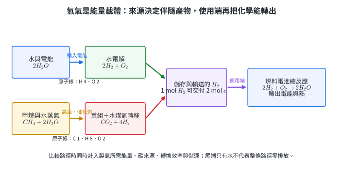{width=98%}

圖 1 的每條箭頭都能由原子守恆核對。水電解路徑沒有含碳反應物；它的碳排放取決於供電方式。甲烷重組則在化學計量上直接產生 $CO_2$。

::: worked-example
### 示範 1｜由水量求理論產氫量

完全電解 $36.0\ \mathrm{g}$ 水。取 $M(H_2O)=18.0\ \mathrm{g\,mol^{-1}}$：

$$
n(H_2O)=\frac{36.0}{18.0}=2.00\ \mathrm{mol}.
$$

反應係數 $2H_2O:2H_2=1:1$，所以

$$
n(H_2)=2.00\ \mathrm{mol},\qquad m(H_2)=4.00\ \mathrm{g}.
$$

同時生成 $1.00\ \mathrm{mol}$ 的 $O_2$。質量檢查：$4.00+32.0=36.0\ \mathrm{g}$，與反應物質量相同。
:::

::: worked-example
### 示範 2｜比較甲烷重組的氫與二氧化碳

$16.0\ \mathrm{kg}$ 純甲烷相當於 $1.00\ \mathrm{kmol}$。由

$$
CH_4+2H_2O\rightarrow CO_2+4H_2
$$

可得 $4.00\ \mathrm{kmol}$ $H_2$ 與 $1.00\ \mathrm{kmol}$ $CO_2$：

$$
m(H_2)=4.00(2.00)=8.00\ \mathrm{kg},
$$

$$
m(CO_2)=1.00(44.0)=44.0\ \mathrm{kg}.
$$

輸入的水提供其餘氫與全部氧，因此產物總質量大於甲烷本身。這個計算是理論物料帳；實際廠的熱源與轉換率還會改變每公斤氫的總排放。
:::

氫的路徑分析直接用於燃料電池車、儲能與煉製製程。用途判斷的對象是「完整供應鏈的一單位可用能量」，而非只比較排氣口的物質。

### 分節練習 1

1. 寫出 $NaH$ 與 $H_2O$ 中氫的氧化數，並指出兩者鍵結類型的主要差異。
2. 完全電解 $9.00\ \mathrm{mol}$ 水，求理論生成的 $H_2$、$O_2$ 莫耳數。
3. 甲烷重組產生 $2.00\ \mathrm{kmol}$ $H_2$，求理論消耗的 $CH_4$ 與生成的 $CO_2$ 質量。
4. 路徑 A 以再生電力電解水，每投入 $100\ \mathrm{MJ}$ 得到 $65\ \mathrm{MJ}$ 氫能；路徑 B 以甲烷重組，每投入 $100\ \mathrm{MJ}$ 得到 $75\ \mathrm{MJ}$ 氫能並排放 $5.0\ \mathrm{kg}$ $CO_2$。列出選擇路徑時至少三項需一起比較的量。

### 分節練習 1 解析

1. $NaH$ 中 $Na$ 為 $+1$，所以氫為 $-1$，主要以 $Na^+H^-$ 的離子型模型描述；$H_2O$ 中氧為 $-2$，兩個氫各為 $+1$，$O-H$ 為極性共價鍵。
2. 由 $2H_2O\rightarrow2H_2+O_2$，生成 $9.00\ \mathrm{mol}$ $H_2$ 與 $4.50\ \mathrm{mol}$ $O_2$。
3. $4\ \mathrm{mol}$ $H_2$ 對 $1\ \mathrm{mol}$ $CH_4$ 與 $1\ \mathrm{mol}$ $CO_2$。故需 $0.500\ \mathrm{kmol}$ $CH_4=8.00\ \mathrm{kg}$，生成 $0.500\ \mathrm{kmol}$ $CO_2=22.0\ \mathrm{kg}$。
4. 兩路徑的交付效率分別為 $65\%$、$75\%$。完整比較至少含交付效率、每單位氫能的溫室氣體排放、原料與電力來源；另可納入壓縮／液化能耗、儲運損失、設備成本與供應穩定性。題目資料涵蓋效率與重組端直接排放；全生命週期判定還需要其餘流股與能源資料。

## 2. 碳與同素異形體：鍵結維度決定材料性質

### 2.1 同素異形體與結構—性質關係

**同素異形體**是同一元素在同一物態形成的不同單質。鑽石中每個碳近似以 $sp^3$ 鍵結連到四個碳，形成三維共價網路；石墨的碳近似 $sp^2$ 鍵結，層內有離域 $\pi$ 電子，層間作用較弱。前者硬且電導率低，後者可沿層導電並容易滑動。

石墨烯是單層六角碳網路；碳奈米管可視為石墨烯捲成管；$C_{60}$ 是由 $12$ 個五邊形與 $20$ 個六邊形構成的封閉分子。碳纖維以高強度碳微晶承受拉力，常與樹脂形成複合材料；整體性能同時取決於纖維方向與界面。

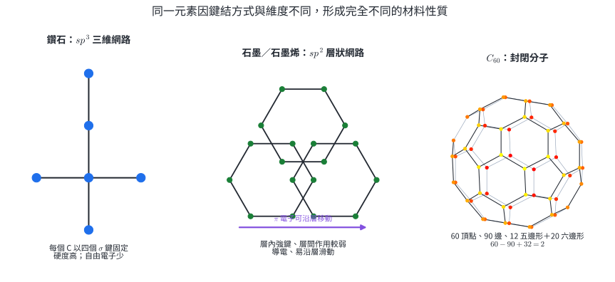{width=98%}

### 2.2 一氧化碳與二氧化碳的反應角色

$CO_2$ 中碳的氧化數為 $+4$，已處在常見的高氧化態；$CO$ 中碳為 $+2$，還能被氧化成 $CO_2$，因此可作還原劑：

$$
Fe_2O_3+3CO\rightarrow2Fe+3CO_2.
$$

$CO_2$ 可作碳酸化原料、超臨界流體或滅火介質，適用性由壓力、溫度與反應系統決定。$CO$ 會與血紅素強烈結合；燃燒設備的通風、維護與一氧化碳警報器是控制暴露的工程措施。

::: worked-example
### 示範 3｜由 $C_{60}$ 的面與邊檢查封閉結構

$C_{60}$ 有 $12$ 個五邊形和 $20$ 個六邊形。所有面提供的邊數為

$$
12(5)+20(6)=180.
$$

每條邊被兩個面共用，所以實際邊數 $E=180/2=90$。以頂點 $V=60$、面數 $F=32$ 代入凸多面體的 Euler 關係：

$$
V-E+F=60-90+32=2.
$$

邊的雙重計數與 Euler 關係都閉合，支持這組拓樸資料。
:::

::: worked-example
### 示範 4｜由碳纖維含量求複合材料質量

某板材總質量 $2.50\ \mathrm{kg}$，碳纖維占 $60.0\%$，樹脂占 $40.0\%$：

$$
m_{\text{纖維}}=2.50(0.600)=1.50\ \mathrm{kg},
$$

$$
m_{\text{樹脂}}=2.50(0.400)=1.00\ \mathrm{kg}.
$$

強度還取決於纖維方向、受力方向與界面黏結，因此同一質量分率可形成不同性能。
:::

碳材料選擇常同時考慮比強度、導電性、耐熱、方向性與成本。由鍵結網路先預測性質，再以實際樣品測試修正，是材料設計的基本流程。

### 分節練習 2

1. 以鍵結維度與可移動電子比較鑽石和石墨的硬度及導電性。
2. 一個封閉碳籠有 $12$ 個五邊形與 $25$ 個六邊形。以邊的雙重計數求邊數；若每個碳為三配位，再由 $3V=2E$ 求頂點數。
3. $8.00\ \mathrm{mol}$ $CO$ 完全還原過量 $Fe_2O_3$，求生成 $Fe$ 與 $CO_2$ 的莫耳數。
4. 某碳纖維零件由 $1.80\ \mathrm{kg}$ 纖維和 $1.20\ \mathrm{kg}$ 樹脂組成。求纖維質量百分率，並列出兩項尚須量測才能評估結構用途的性質。

### 分節練習 2 解析

1. 鑽石是三維 $sp^3$ 共價網路，鍵結方向固定且缺少自由載子，所以硬度高、導電性低。石墨是 $sp^2$ 層狀網路，層間較易滑移，離域 $\pi$ 電子可沿層移動，所以較軟且具方向性導電。
2. 面提供邊數 $12(5)+25(6)=210$，故 $E=105$；三配位頂點滿足 $3V=2E=210$，所以 $V=70$。檢查 $V-E+F=70-105+37=2$。
3. 由 $3CO:2Fe:3CO_2$，$8.00\ \mathrm{mol}$ $CO$ 生成 $\frac23(8.00)=5.33\ \mathrm{mol}$ $Fe$ 與 $8.00\ \mathrm{mol}$ $CO_2$。
4. 總質量 $3.00\ \mathrm{kg}$，纖維分率 $1.80/3.00=60.0\%$。還需量測沿實際受力方向的拉伸強度、彈性模數、疲勞壽命、衝擊韌性或界面耐久性；任列兩項並連到用途即可。

## 3. 氮與含氮化合物：固定氮、平衡與製程串接

### 3.1 從穩定氮氣到氨

$N_2$ 的氮氮三鍵鍵能高，常溫下反應速率低。把空氣中的 $N_2$ 轉成植物或工業可利用的含氮物稱為**固定氮**。哈柏法反應為

$$
N_2(g)+3H_2(g)\rightleftharpoons2NH_3(g),\qquad \Delta H<0.
$$

加壓使平衡偏向氣體莫耳數較少的右側；降低溫度有利放熱方向，卻使速率下降。工業採用催化劑與折衷溫度，並移除氨、循環未反應氣體。催化劑降低活化能，使系統較快到達平衡，不改變平衡常數。

### 3.2 從氨到硝酸

氨可製成銨鹽與尿素。奧士華法先催化氧化氨：

$$
4NH_3+5O_2\rightarrow4NO+6H_2O,
$$

再使 $NO$ 氧化成 $NO_2$，最後以水吸收並配合氧化生成硝酸。製程中的每一步都需閉合原子帳，實際回收率則由轉化與分離決定。

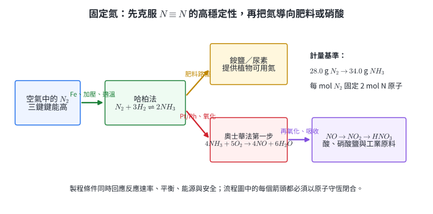{width=98%}

::: worked-example
### 示範 5｜哈柏法的限量試劑與產率

混合 $5.00\ \mathrm{mol}$ $N_2$ 與 $12.0\ \mathrm{mol}$ $H_2$。完全消耗 $5.00\ \mathrm{mol}$ $N_2$ 需 $15.0\ \mathrm{mol}$ $H_2$，所以 $H_2$ 是限量試劑：

$$
n_{\mathrm{theory}}(NH_3)=12.0\left(\frac{2}{3}\right)=8.00\ \mathrm{mol}.
$$

若實收 $6.40\ \mathrm{mol}$，百分產率為

$$
\frac{6.40}{8.00}\times100\%=80.0\%.
$$

反應消耗 $4.00\ \mathrm{mol}$ $N_2$，理想化物料帳中餘下 $1.00\ \mathrm{mol}$。
:::

::: worked-example
### 示範 6｜奧士華法第一步的需氧量

欲完全氧化 $3.40\ \mathrm{kg}$ $NH_3$，先換成莫耳數：

$$
n(NH_3)=\frac{3400}{17.0}=200\ \mathrm{mol}.
$$

由 $4NH_3:5O_2$，

$$
n(O_2)=200\left(\frac54\right)=250\ \mathrm{mol},
$$

$$
m(O_2)=250(32.0)=8.00\times10^3\ \mathrm{g}=8.00\ \mathrm{kg}.
$$

同時理論生成 $200\ \mathrm{mol}$ $NO$ 與 $300\ \mathrm{mol}$ 水。
:::

固定氮支撐肥料與糧食生產，也消耗大量能量。評估施肥或製程需把氮的投入、作物吸收、流失到水體及含氮氣體排放放在同一個氮元素帳中。

### 分節練習 3

1. 說明哈柏法加壓、使用催化劑與採用折衷溫度各自影響的物理量。
2. $7.00\ \mathrm{mol}$ $N_2$ 與 $18.0\ \mathrm{mol}$ $H_2$ 反應，求限量試劑與 $NH_3$ 理論產量。
3. 奧士華法第一步消耗 $10.0\ \mathrm{mol}$ $O_2$，求消耗 $NH_3$、生成 $NO$ 與 $H_2O$ 的莫耳數。
4. 某廠每小時輸入 $100\ \mathrm{kmol}$ $N_2$，有 $82.0\%$ 的氮原子進入回收的 $NH_3$。求每小時回收 $NH_3$ 的 kmol 數，並指出其餘氮的物料帳還需追蹤哪些流向。

### 分節練習 3 解析

1. 加壓改變氣體分壓，使平衡偏向氣體總莫耳數較少的右側；催化劑降低活化能、提高達平衡速率；折衷溫度同時處理放熱平衡偏好低溫與反應速率偏好較高溫的衝突。
2. $7.00\ \mathrm{mol}$ $N_2$ 需 $21.0\ \mathrm{mol}$ $H_2$，所以 $H_2$ 限量。$NH_3$ 理論產量 $18.0(2/3)=12.0\ \mathrm{mol}$。
3. 由 $4NH_3:5O_2:4NO:6H_2O$，消耗 $8.00\ \mathrm{mol}$ $NH_3$，生成 $8.00\ \mathrm{mol}$ $NO$ 與 $12.0\ \mathrm{mol}$ $H_2O$。
4. $100\ \mathrm{kmol}$ $N_2$ 含 $200\ \mathrm{kmol}$ N 原子，$82.0\%$ 為 $164\ \mathrm{kmol}$ N 原子；每個 $NH_3$ 含一個 N，故回收 $164\ \mathrm{kmol}$ $NH_3$。其餘氮可能在循環 $N_2$、排放氣、溶液、副產物或量測損失中，完整帳需逐流股取樣與量測。

## 4. 氧與臭氧：氧化能力、光化學與所在環境

### 4.1 氧氣的製備與氧化還原角色

$O_2$ 是氧元素的常見單質，含兩個未成對電子，能參與燃燒、呼吸與金屬冶煉。大量氧氣通常由液態空氣分餾取得；實驗室可依規模與純度，以過氧化氫催化分解等反應製備：

$$
2H_2O_2(aq)\rightarrow2H_2O(l)+O_2(g).
$$

氧氣在多數反應中接受電子而作氧化劑。還原電位的大小必須連同半反應、酸鹼性、濃度與溫度閱讀；同一元素在不同物種和條件下，氧化能力會改變。

### 4.2 臭氧的結構與光化循環

$O_3$ 是氧的另一種同素異形體，可用共振結構描述兩個等效的 $O-O$ 鍵。平流層臭氧吸收紫外光：

$$
O_3+h\nu\rightarrow O_2+O,
$$

生成的氧原子再與氧氣碰撞形成臭氧並放熱：

$$
O+O_2\rightarrow O_3.
$$

這個循環把部分紫外能轉成熱。近地面較高濃度的臭氧則是強氧化性空氣污染物；「臭氧有保護作用」與「臭氧刺激呼吸系統」描述的是不同高度與暴露情境。

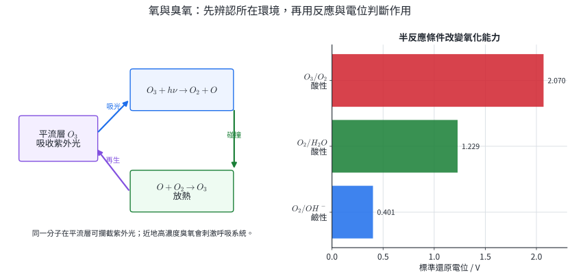{width=98%}

::: worked-example
### 示範 7｜臭氧分解的莫耳與質量帳

臭氧可依

$$
2O_3\rightarrow3O_2
$$

分解。$9.60\ \mathrm{g}$ $O_3$ 為

$$
n(O_3)=\frac{9.60}{48.0}=0.200\ \mathrm{mol}.
$$

所以生成

$$
n(O_2)=0.200\left(\frac32\right)=0.300\ \mathrm{mol},
$$

質量為 $0.300(32.0)=9.60\ \mathrm{g}$。分子數增加，但氧原子總數與總質量守恆。
:::

::: worked-example
### 示範 8｜由還原電位判斷自發方向

在指定酸性標準條件，取

$$
O_3+2H^++2e^-\rightarrow O_2+H_2O,\quad E^\circ=2.07\ \mathrm{V},
$$

$$
Fe^{3+}+e^-\rightarrow Fe^{2+},\quad E^\circ=0.77\ \mathrm{V}.
$$

若臭氧氧化 $Fe^{2+}$，陰極為臭氧還原，陽極為 $Fe^{2+}$ 氧化：

$$
E^\circ_{\mathrm{cell}}=2.07-0.77=1.30\ \mathrm{V}>0.
$$

因此標準條件下熱力學有利。實際速率與去除效果仍受 pH、傳質、共存物及接觸時間控制。
:::

臭氧可用於特定水處理與消毒製程，氧氣則用於醫療供氧、煉鋼和污水曝氣。濃度、接觸時間、目標物與副產物監測共同界定用途。

### 分節練習 4

1. 寫出過氧化氫製氧反應中氧元素的氧化數變化，說明其同時發生氧化與還原。
2. $0.600\ \mathrm{mol}$ $O_3$ 完全分解，求生成 $O_2$ 的莫耳數與分子數變化比例。
3. 已知酸性條件 $E^\circ(O_2/H_2O)=1.23\ \mathrm{V}$、$E^\circ(O_3/O_2)=2.07\ \mathrm{V}$。在相同指定條件下比較兩者接受電子的傾向，並說明結論的條件。
4. 一套水處理設備提高臭氧投加量後，目標污染物下降，溴酸鹽副產物卻上升。列出至少三項需量測的變因，以決定操作點。

### 分節練習 4 解析

1. $H_2O_2$ 中氧為 $-1$；生成 $H_2O$ 時變為 $-2$，接受電子；生成 $O_2$ 時變為 $0$，失去電子。同一反應物中的氧分別被還原和氧化，所以是歧化反應。
2. 由 $2O_3\rightarrow3O_2$，生成 $0.900\ \mathrm{mol}$ $O_2$。分子莫耳數由 $0.600$ 增為 $0.900$，比例為 $1.50$；氧原子莫耳數始終為 $1.80\ \mathrm{mol}$。
3. $2.07>1.23$，所以在所列酸性標準半反應下，$O_3$ 接受電子的熱力學傾向較強。此比較只適用於相同標準狀態與指定半反應；pH、濃度及反應速率改變時需重新評估。
4. 至少量測臭氧殘留濃度、接觸時間、污染物去除率與溴酸鹽濃度；另需記錄 pH、溫度、溴離子初濃度及天然有機物。操作點應同時符合目標去除與副產物限值。

## 5. 矽與矽酸鹽：網路、電荷與玻璃配方

### 5.1 $Si-O$ 基元與矽酸鹽網路

孤立的矽酸根基元可寫為 $SiO_4^{4-}$：中心 $Si^{4+}$ 與四個 $O^{2-}$ 的形式電荷合計 $-4$。相鄰四面體共享氧後，可形成鏈、層或三維網路；共享程度改變陰陽離子比例、熔融性與機械性質。石英 $SiO_2$ 形成延伸的三維共價網路。

沸石的鋁矽酸鹽骨架帶負電，需要陽離子維持電中性。若以 $Z^-$ 代表一個帶單位負電的交換位置，硬水軟化可寫為

$$
Ca^{2+}+2NaZ\rightarrow CaZ_2+2Na^+.
$$

一個二價鈣離子占用兩個單位負電位置，這是離子交換容量的電荷帳。

### 5.2 玻璃的組成與蝕刻

鈉鈣玻璃以 $SiO_2$ 為網路形成物，$Na_2CO_3$ 提供助熔成分，$CaCO_3$ 改善耐水性。玻璃為非晶體，結構在一段溫度範圍逐漸軟化。氫氟酸能與二氧化矽反應，例如

$$
SiO_2+4HF\rightarrow SiF_4+2H_2O,
$$

因此可用於受控蝕刻；HF 具高度危害，只能在合格設備、訓練與應變程序下操作。

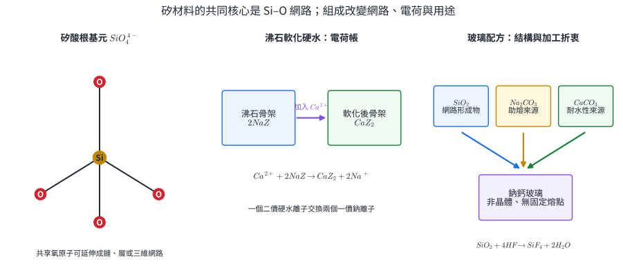{width=98%}

::: worked-example
### 示範 9｜由硬度離子求沸石再生負荷

水樣含 $2.50\ \mathrm{mmol}$ $Ca^{2+}$。由

$$
Ca^{2+}+2NaZ\rightarrow CaZ_2+2Na^+
$$

需要 $5.00\ \mathrm{mmol}$ 的 $NaZ$ 交換位置，並釋出 $5.00\ \mathrm{mmol}$ $Na^+$。若樹脂可用交換容量只有 $4.00\ \mathrm{mmol}$，最多去除

$$
4.00\left(\frac12\right)=2.00\ \mathrm{mmol} Ca^{2+},
$$

其餘 $0.50\ \mathrm{mmol}$ 仍留在水中。
:::

::: worked-example
### 示範 10｜玻璃原料的碳酸鹽物料帳

在簡化反應中，每 $1\ \mathrm{mol}$ $Na_2CO_3$ 加入矽酸鹽網路會放出 $1\ \mathrm{mol}$ $CO_2$。$10.6\ \mathrm{kg}$ $Na_2CO_3$ 為

$$
n=\frac{10.6\times10^3}{106}=100\ \mathrm{mol}.
$$

所以理論生成 $100\ \mathrm{mol}$ $CO_2=4.40\ \mathrm{kg}$。實際玻璃配方含多種氧化物，這個結果只計算指定碳酸鈉來源的化學計量。
:::

矽酸鹽模型可解釋硬水軟化、玻璃配方、陶瓷與分子篩。判斷用途時依序辨認網路連接度、補償電荷與可交換孔道。

### 分節練習 5

1. 計算孤立 $SiO_4$ 基元的形式總電荷，並說明共享氧為何會改變整體 $Si:O$ 比。
2. 去除 $1.20\ \mathrm{mmol}$ $Mg^{2+}$ 需要多少 mmol 的單位負電交換位置？同時釋出多少 mmol $Na^+$？
3. $5.30\ \mathrm{kg}$ $Na_2CO_3$ 依一比一莫耳關係放出 $CO_2$，求理論 $CO_2$ 質量。
4. 某玻璃樣品需要提高耐熱衝擊性。列出兩項仍須取得的組成或性能資料，並說明它們如何補充「含 $SiO_2$」這項資訊。

### 分節練習 5 解析

1. $+4+4(-2)=-4$。當兩個四面體共享一個氧時，該氧同時連到兩個 Si，不再由每個 Si 各自計一個完整氧，因此共享越多，整體 $O/Si$ 比越小，網路連接度通常越高。
2. 二價鎂需兩個單位負電位置，所以需 $2.40\ \mathrm{mmol}$ 交換位置，並釋出 $2.40\ \mathrm{mmol}$ $Na^+$；電荷前後皆為 $+2$。
3. $5.30\ \mathrm{kg}/106\ \mathrm{g\,mol^{-1}}=50.0\ \mathrm{mol}$，故 $CO_2$ 為 $50.0(44.0)=2.20\ \mathrm{kg}$。
4. $SiO_2$ 只指出主要網路形成物；鹼金屬、鹼土金屬、硼等成分會改變熱膨脹與軟化行為。需取得完整氧化物配方、熱膨脹係數、軟化溫度或標準熱衝擊測試結果，任列兩項即可。

## 6. 鈉、鎂與鋁：活性金屬的製程選擇

### 6.1 水溶液與熔融鹽的競爭

鈉、鎂、鋁的還原需要大量能量。水溶液電解時，陰極常由水先還原而產生氫氣；工業製備這些金屬通常改用無水熔融鹽，使金屬離子在陰極接受電子：

$$
Na^++e^-\rightarrow Na,
$$

$$
Mg^{2+}+2e^-\rightarrow Mg,
$$

$$
Al^{3+}+3e^-\rightarrow Al.
$$

鈉可由熔融 $NaCl$ 電解；鎂可由海水或鹵水取得鎂鹽、脫水後電解熔融 $MgCl_2$。純鹼 $Na_2CO_3$ 可由索耳未法製造，其理想總反應為

$$
2NaCl+CaCO_3\rightarrow Na_2CO_3+CaCl_2.
$$

### 6.2 鋁的純化、電解與兩性

鋁礦先經拜耳法把含鋁物種溶解、分離雜質並回收 $Al(OH)_3$，煅燒成純度較高的 $Al_2O_3$；霍爾法再將氧化鋁溶於熔融冰晶石中電解。冰晶石提供離子導電介質並降低操作溫度。工業碳陽極會被氧化，主要淨反應可寫成

$$
2Al_2O_3(l)+3C(s)\rightarrow4Al(l)+3CO_2(g).
$$

因此電解槽的物料與排放帳同時包含氧化鋁、碳陽極、鋁與二氧化碳。

$Al(OH)_3$ 具兩性，可與酸或強鹼反應：

$$
Al(OH)_3+3H^+\rightarrow Al^{3+}+3H_2O,
$$

$$
Al(OH)_3+OH^-\rightarrow[Al(OH)_4]^-.
$$

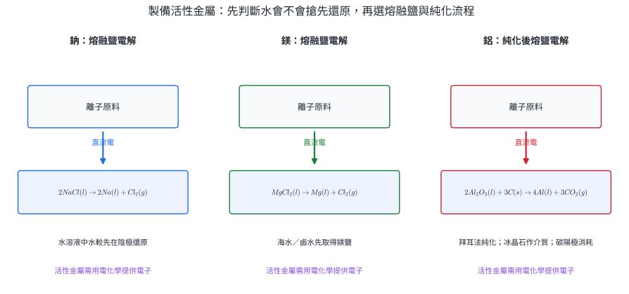{width=98%}

::: worked-example
### 示範 11｜由電量求鋁的理論產量

製得 $1\ \mathrm{mol}$ $Al$ 需 $3\ \mathrm{mol}$ 電子。若通過 $2.895\times10^5\ \mathrm{C}$，取 $F=9.65\times10^4\ \mathrm{C\,mol^{-1}}$：

$$
n(e^-)=\frac{2.895\times10^5}{9.65\times10^4}=3.00\ \mathrm{mol},
$$

$$
n(Al)=\frac{3.00}{3}=1.00\ \mathrm{mol},\qquad m=27.0\ \mathrm{g}.
$$

若電流效率為 $90.0\%$，實際鋁為 $27.0(0.900)=24.3\ \mathrm{g}$。
:::

::: worked-example
### 示範 12｜由兩性反應求鹼的需求量

$7.80\ \mathrm{g}$ $Al(OH)_3$ 的莫耳質量為 $78.0\ \mathrm{g\,mol^{-1}}$，故有 $0.100\ \mathrm{mol}$。在過量強鹼中：

$$
Al(OH)_3+OH^-\rightarrow[Al(OH)_4]^-.
$$

係數比為 $1:1$，需 $0.100\ \mathrm{mol}$ $OH^-$。若改以酸溶解，則由 $1:3$ 關係需 $0.300\ \mathrm{mol}$ $H^+$。兩個結果反映同一沉澱可在不同酸鹼條件轉成不同溶解物種。
:::

活性金屬製程的用途包括輕量結構、導電體與化學還原。再生鋁通常避開由 $Al^{3+}$ 還原成金屬的高電能步驟，因此製程比較需納入原料純度、回收率與電力來源。

### 分節練習 6

1. 說明以 $NaCl(aq)$ 電解時陰極主要產物與以熔融 $NaCl(l)$ 電解時不同的原因。
2. 通過 $1.93\times10^5\ \mathrm{C}$，在 $100\%$ 電流效率下可製得多少 mol 與多少 g $Mg$？取 $F=9.65\times10^4\ \mathrm{C\,mol^{-1}}$、$M(Mg)=24.3$。
3. 依索耳未法理想總反應，以 $11.7\ \mathrm{kg}$ $NaCl$ 為限量試劑，求 $Na_2CO_3$ 理論質量。取 $M(NaCl)=58.5$、$M(Na_2CO_3)=106\ \mathrm{g\,mol^{-1}}$。
4. 寫出 $Al(OH)_3$ 分別溶於酸與強鹼的淨離子式；說明拜耳法利用酸鹼溶解度差進行分離的化學核心。

### 分節練習 6 解析

1. 水溶液中水可在陰極接受電子生成 $H_2$ 與 $OH^-$，其條件比把 $Na^+$ 還原成金屬鈉有利；熔融鹽沒有水，陰極的陽離子主要是 $Na^+$，因而得到 Na。
2. $n(e^-)=1.93\times10^5/(9.65\times10^4)=2.00\ \mathrm{mol}$。$Mg^{2+}+2e^-\rightarrow Mg$，所以 $n(Mg)=1.00\ \mathrm{mol}$，質量 $24.3\ \mathrm{g}$。
3. $11.7\ \mathrm{kg}/58.5\ \mathrm{kg\,kmol^{-1}}=0.200\ \mathrm{kmol}$ $NaCl$。由 $2NaCl:1Na_2CO_3$ 得 $0.100\ \mathrm{kmol}$，質量 $0.100(106)=10.6\ \mathrm{kg}$。
4. 酸中為 $Al(OH)_3+3H^+\rightarrow Al^{3+}+3H_2O$；強鹼中為 $Al(OH)_3+OH^-\rightarrow[Al(OH)_4]^-$。控制 pH 可讓含鋁物種選擇性溶解或析出，而部分雜質保留在另一相，再以過濾完成分離。

## 7. 過渡元素與鐵：氧化態、冶煉與分析證據

### 7.1 過渡元素的電子與顏色

第一列過渡元素在形成常見陽離子時，$3d$ 次層通常尚未全滿，因此常有多種氧化態、帶色離子、順磁性與催化活性。顏色來自指定配位環境中的電子能階與光吸收；同一金屬換配位子、氧化態或濃度，顏色都可能改變。因此顏色是可用的觀察量，定性判斷仍需對照空白、標準品或選擇性反應。

### 7.2 鼓風爐中的還原與造渣

鐵礦、煤焦與石灰石由爐頂加入，熱空氣由下方送入。煤焦產生熱與 $CO$，$CO$ 還原鐵氧化物：

$$
Fe_2O_3+3CO\rightarrow2Fe+3CO_2.
$$

石灰石分解成 $CaO$，再與酸性的 $SiO_2$ 雜質形成熔渣：

$$
CaCO_3\rightarrow CaO+CO_2,
$$

$$
CaO+SiO_2\rightarrow CaSiO_3.
$$

熔渣密度較低而浮在熔融生鐵上方，讓還原產物與雜質分流。

### 7.3 $Fe^{2+}$ 與 $Fe^{3+}$ 的證據

$Fe^{2+}$ 溶液常呈淡綠色，$Fe^{3+}$ 水溶液常呈黃至黃褐色；實際色調受濃度與水解影響。$Fe^{3+}$ 與 $SCN^-$ 形成血紅色錯合物，是常用證據；$Fe^{2+}$ 與鐵氰酸根形成深藍產物。樣品接觸空氣時，部分 $Fe^{2+}$ 可能被氧化，故採樣時間與保存條件也是判讀的一部分。

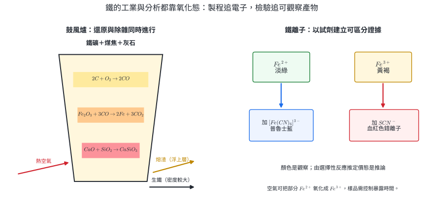{width=98%}

::: worked-example
### 示範 13｜鐵礦與一氧化碳的物料帳

$16.0\ \mathrm{kg}$ 純 $Fe_2O_3$ 為

$$
n(Fe_2O_3)=\frac{16.0}{160\ \mathrm{kg\,kmol^{-1}}}=0.100\ \mathrm{kmol}.
$$

由反應係數，每 $1\ \mathrm{kmol}$ $Fe_2O_3$ 生成 $2\ \mathrm{kmol}$ Fe 並消耗 $3\ \mathrm{kmol}$ CO，故

$$
n(Fe)=0.200\ \mathrm{kmol},\quad m(Fe)=0.200(56.0)=11.2\ \mathrm{kg},
$$

$$
n(CO)=0.300\ \mathrm{kmol}.
$$

若鐵回收率為 $90.0\%$，實收 $10.1\ \mathrm{kg}$；未回收部分需在熔渣、粉塵或其他流股中追蹤。
:::

::: worked-example
### 示範 14｜由兩份試樣建立鐵離子判定

未知鐵鹽溶液分成 A、B 兩份。A 加 $SCN^-$ 後呈強烈血紅色；B 加鐵氰酸根後沒有深藍沉澱。推理順序為：

1. 觀察 A 的血紅色是原始資料。
2. 在試劑有效且空白無相同顏色的條件下，血紅錯合物支持含 $Fe^{3+}$。
3. B 的陰性結果與「主要為 $Fe^{3+}$」一致，但陰性證據還受濃度和試劑靈敏度限制。
4. 以已知 $Fe^{2+}$、$Fe^{3+}$ 標準液同時操作，可檢查試劑與色彩判讀。

因此結論是「資料支持主要含 $Fe^{3+}$」，並清楚附上檢驗條件。
:::

鼓風爐模型用於理解煉鐵的還原與除雜；選擇性試劑則服務水樣、礦物與製程液的定性分析。兩者都以氧化態串起電子轉移和可觀察結果。

### 分節練習 7

1. 由 $Fe_2O_3+3CO\rightarrow2Fe+3CO_2$ 寫出 Fe 與 C 的氧化數變化，指出氧化劑與還原劑。
2. $32.0\ \mathrm{kg}$ $Fe_2O_3$ 在 $85.0\%$ 鐵回收率下可得多少 kg Fe？
3. $5.00\ \mathrm{mol}$ $SiO_2$ 需多少 mol $CaCO_3$ 才能依兩步反應完全轉為 $CaSiO_3$？同時由石灰石分解產生多少 mol $CO_2$？
4. 同一未知樣的 $SCN^-$ 檢驗呈很淡的紅色。列出至少三個會影響「是否含 $Fe^{3+}$」判讀的實驗因素，並設計一項對照。

### 分節練習 7 解析

1. $Fe$ 由 $+3$ 變 $0$，接受電子，$Fe_2O_3$ 是氧化劑；$CO$ 中 C 由 $+2$ 變 $+4$，失去電子，$CO$ 是還原劑。每個 $Fe_2O_3$ 共接受 $6e^-$，三個 CO 共失去 $6e^-$。
2. $32.0\ \mathrm{kg}$ $Fe_2O_3=0.200\ \mathrm{kmol}$，理論 Fe 為 $0.400\ \mathrm{kmol}=22.4\ \mathrm{kg}$；實收 $22.4(0.850)=19.0\ \mathrm{kg}$。
3. $CaCO_3\rightarrow CaO\rightarrow CaSiO_3$ 各為 $1:1$，故需 $5.00\ \mathrm{mol}$ $CaCO_3$，分解產生 $5.00\ \mathrm{mol}$ $CO_2$。
4. 影響因素包括樣品濃度、$SCN^-$ 濃度、pH、水解、其他配位子競爭、光程、樣品接觸空氣時間與儀器／視覺靈敏度。可用同濃度已知 $Fe^{3+}$ 作正對照、純水加試劑作空白，或以一組標準濃度建立顏色比較。

## 8. 錯合物：中心、配位子、配位數與實驗證據

### 8.1 配位鍵與計數規則

**錯合物**由中心金屬原子或離子與配位子組成；配位子以孤電子對與中心形成配位鍵。**配位數**是中心金屬周圍直接鍵結的供體原子數。單牙配位子提供一個供體原子；雙牙配位子提供兩個；多牙配位子可在同一分子上提供更多鍵結點。

若錯離子總電荷為 $q$、中心金屬氧化數為 $x$，配位子電荷總和為 $L$，則

$$
x+L=q.
$$

電荷帳求氧化數，供體原子帳求配位數，兩者處理的量不同。

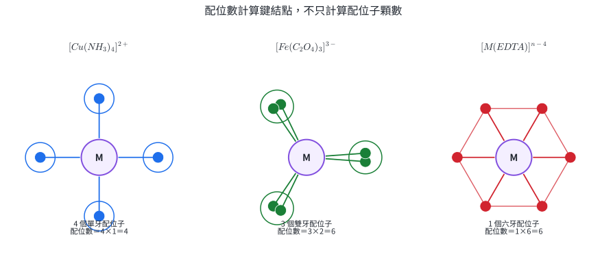{width=98%}

血紅素以含鐵配位中心結合氧，葉綠素含鎂配位中心參與吸光；EDTA 等多牙配位子可用於分析滴定與金屬離子控制。用途依選擇性、pH、競爭配位與穩定常數決定。

### 8.2 草酸鐵鉀的製備

以 $Fe^{3+}$ 與草酸根形成

$$
[Fe(C_2O_4)_3]^{3-}
$$

時，三個雙牙草酸根提供六個供體氧，配位數為 $6$。示範實驗以 $2.0\ \mathrm{M}$ $FeCl_3$ $2.0\ \mathrm{mL}$ 與 $2.0\ \mathrm{M}$ $K_2C_2O_4$ $6.0\ \mathrm{mL}$ 混合，配位子與金屬的投入莫耳比為 $3:1$；避光控制光致氧化還原，冰水浴降低溶解度以促進結晶。

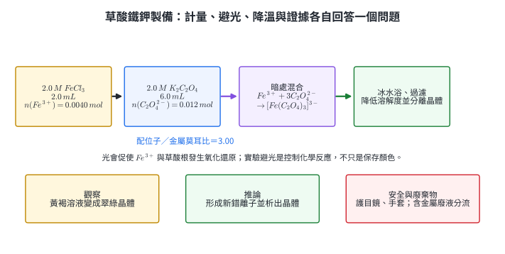{width=98%}

::: worked-example
### 示範 15｜錯離子的氧化數與配位數

考慮 $[Fe(C_2O_4)_3]^{3-}$。每個草酸根為 $-2$，設 Fe 氧化數為 $x$：

$$
x+3(-2)=-3\Rightarrow x=+3.
$$

每個草酸根為雙牙，三個配位子提供 $3\times2=6$ 個供體氧，所以配位數為 $6$。錯離子電荷 $-3$、Fe 氧化數 $+3$ 與配位數 $6$ 是三個不同量。
:::

::: worked-example
### 示範 16｜由濃度與體積檢查實驗投入比

$$
n(Fe^{3+})=(2.0\ \mathrm{mol\,L^{-1}})(2.0\times10^{-3}\ \mathrm{L})=4.0\times10^{-3}\ \mathrm{mol},
$$

$$
n(C_2O_4^{2-})=(2.0)(6.0\times10^{-3})=1.2\times10^{-2}\ \mathrm{mol}.
$$

因此

$$
\frac{n(C_2O_4^{2-})}{n(Fe^{3+})}=3.0,
$$

正好符合錯離子中三個草酸根對一個 Fe。翠綠晶體是觀察；結合投入比、已知配位化學與產物分析，才形成「生成草酸鐵錯合物」的推論。含金屬廢液依實驗室規範分流。
:::

配位模型可把溶液顏色、金屬離子分離、生物分子功能與分析滴定連在一起。建立模型時先寫中心、配位子電荷與牙數，再談幾何和用途。

### 分節練習 8

1. 求 $[Cu(NH_3)_4]^{2+}$ 中 Cu 的氧化數與配位數。
2. 求 $[Co(en)_3]^{3+}$ 的配位數；$en$ 為中性雙牙配位子。
3. $0.0100\ \mathrm{mol}$ $Fe^{3+}$ 若全部形成 $[Fe(C_2O_4)_3]^{3-}$，至少需多少 mol 草酸根？錯離子共含多少 mol 的金屬—供體鍵結點？
4. 草酸鐵鉀實驗在強光下操作，所得綠色晶體明顯減少。以「控制變因—觀察—推論」格式提出一個驗證光影響的實驗設計。

### 分節練習 8 解析

1. $NH_3$ 中性，所以 Cu 氧化數等於錯離子電荷 $+2$。四個單牙 $NH_3$ 各提供一個 N，配位數為 $4$。
2. 三個雙牙 $en$ 提供 $3\times2=6$ 個供體原子，配位數為 $6$。配位子數是 $3$。
3. 每 mol Fe 需 $3$ mol 草酸根，所以需 $0.0300\ \mathrm{mol}$。每個錯離子配位數 $6$，因此供體鍵結點物質的量為 $0.0100(6)=0.0600\ \mathrm{mol}$。
4. 將同一批、等體積的兩份反應液置於相同溫度與時間，一份避光、一份接受固定照度；以相同冰浴、過濾與乾燥程序，量測乾晶體質量及吸收光譜。若只有光照組產率下降並出現相符的新物種訊號，資料支持光促進副反應。至少做重複樣並記錄照度。

## 9. 合金：原子排列、組成與性能折衷

### 9.1 取代型、間隙型與混合型

**合金**是含金屬元素並具有金屬性質的材料，可能是固溶體、金屬間化合物或多相混合組織。原子大小相近時，溶質原子可取代母體晶格位置形成取代型合金；較小原子可進入晶格空隙形成間隙型合金；兩種機制並存則為混合型。

不同原子造成晶格畸變並阻礙滑移，常提高強度或硬度，同時影響延性、導電與耐蝕。這是高中層級的趨勢模型；熱處理形成的晶粒、相與析出物也會顯著改變性能。

### 9.2 成色與碳鋼

金飾的 K 數以 $24\ \mathrm{K}$ 代表近似純金，理想金質量分率為

$$
w_{Au}=\frac{K}{24}.
$$

碳鋼以少量碳進入鐵的間隙；在相近製程下，提高碳含量通常提高硬度與強度、降低延性。實際牌號仍須由含碳量範圍與熱處理規格判斷。

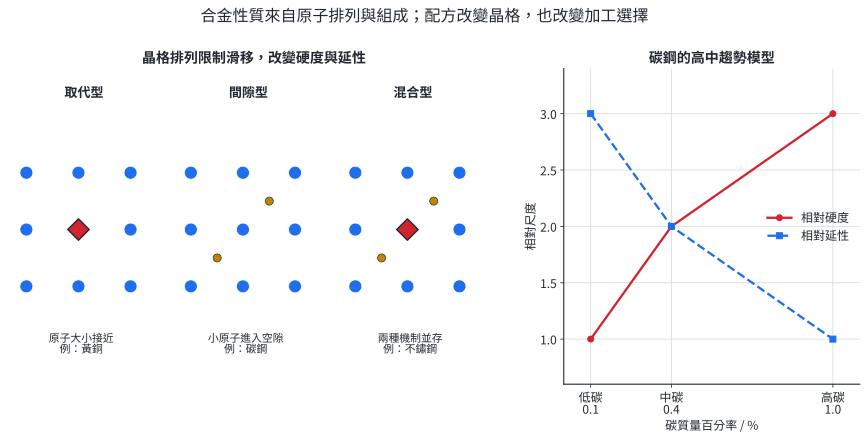{width=98%}

::: worked-example
### 示範 17｜18 K 金的質量配方

一件 $12.0\ \mathrm{g}$ 的 $18\ \mathrm{K}$ 合金，依理想成色模型：

$$
w_{Au}=\frac{18}{24}=0.750.
$$

所以

$$
m(Au)=12.0(0.750)=9.00\ \mathrm{g},
$$

其餘合金元素總質量為 $3.00\ \mathrm{g}$。K 數給出金含量，不直接指定其餘金屬種類、顏色、硬度或過敏風險。
:::

::: worked-example
### 示範 18｜由碳質量求鋼的含碳量

$2.00\ \mathrm{kg}$ 鋼樣含 $8.00\ \mathrm{g}$ C：

$$
w_C=\frac{8.00}{2000}\times100\%=0.400\%.
$$

在圖 10 的簡化趨勢中，它接近中碳範圍，預期比 $0.10\%$ C 樣品硬、延性較低。要指定零件仍需硬度、韌性、熱處理與顯微組織資料。
:::

合金設計服務建築、交通、工具、珠寶與植入材料。組成先給出可能範圍，製程與量測決定材料是否符合實際負載和環境。

### 分節練習 9

1. 黃銅主要由 Cu、Zn 形成，兩者原子大小相近；碳鋼由少量 C 進入 Fe 晶格。分別判斷取代型或間隙型並說明。
2. $20.0\ \mathrm{g}$ 的 $14\ \mathrm{K}$ 金飾理想含金多少 g？其餘成分多少 g？
3. $5.00\ \mathrm{kg}$ 鋼要配成 $0.800\%$ C，忽略製程損失時需含多少 g C？
4. 兩個樣品都有 $0.40\%$ C，A 經淬火、B 經退火。說明為何僅以含碳量無法斷言兩者硬度相同，並列出兩項應量測的資料。

### 分節練習 9 解析

1. Cu、Zn 大小相近，Zn 可占據 Cu 的晶格位置，主要為取代型；C 原子遠小於 Fe，進入晶格空隙，為間隙型。
2. 金分率 $14/24=0.5833$，含金 $20.0(14/24)=11.7\ \mathrm{g}$，其餘 $8.33\ \mathrm{g}$。
3. $5.00\ \mathrm{kg}=5000\ \mathrm{g}$，所需 C 為 $5000(0.00800)=40.0\ \mathrm{g}$。
4. 淬火與退火會形成不同相、晶粒與缺陷結構，滑移阻力不同，所以同一平均含碳量可有不同硬度與韌性。需量測硬度、衝擊韌性、拉伸曲線、相組成或顯微組織，任列兩項即可。

## 10. 半導體：能隙、摻雜、接面與發光

### 10.1 能帶與本質半導體

大量原子的能階在固體中展寬成能帶。價帶與傳導帶重疊或有大量可用能態時，電子容易響應電場；兩者之間的**能隙** $E_g$ 是把電子激發到傳導帶所需的最低能量尺度。金屬具有部分占據或互相重疊的能帶，絕緣體能隙大，半導體能隙居中且導電性對溫度、光和雜質敏感。

純矽受熱或吸光後可產生一對傳導電子與價帶電洞。電子與電洞都能傳遞電流，這種未刻意加入摻雜原子的材料稱為本質半導體。

### 10.2 p 型、n 型與 p–n 接面

矽有四個價電子。少量加入五價的 15 族原子，例如 P，可提供較易進入傳導帶的電子，形成 n 型半導體；加入三價的 13 族原子，例如 B，形成可移動電洞，為 p 型半導體。摻雜引入施體或受體能階並改變主要載子濃度；晶體整體仍近似電中性。

p–n 接面形成空乏區與內建電場。正向偏壓降低載子跨越接面的障礙，電流顯著增加；反向偏壓通常抑制電流，因此接面可整流。LED 在正向偏壓下讓電子與電洞復合，能量以光子形式釋出，光子能量尺度約由材料能隙決定。

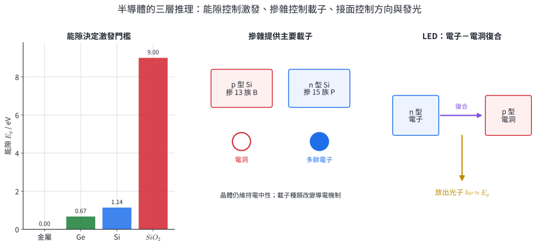{width=98%}

::: worked-example
### 示範 19｜由能隙估算 LED 波長

若 LED 材料的有效發光能量為 $E=2.00\ \mathrm{eV}$，利用

$$
\lambda(\mathrm{nm})\approx\frac{1240}{E(\mathrm{eV})},
$$

可得

$$
\lambda\approx\frac{1240}{2.00}=620\ \mathrm{nm},
$$

位於可見紅光附近。實際光譜有寬度，缺陷、溫度與材料組成也會使峰值偏移。
:::

::: worked-example
### 示範 20｜由摻雜元素判斷主要載子

比較 Si 中的 B 與 P：

1. B 有三個價電子，比 Si 少一個，在鍵結網路中形成受體位置；主要可動載子為電洞，材料為 p 型。
2. P 有五個價電子，比 Si 多一個，形成施體位置；主要可動載子為電子，材料為 n 型。
3. 若每 $10^6$ 個 Si 位置摻入 $20$ 個完全活化的 P，簡化模型給出約 $20$ 個額外傳導電子，原子分率為 $20/10^6=20\ \mathrm{ppm}$。

這個估算假設摻雜均勻且完全活化；實際載子濃度還受溫度與缺陷補償影響。
:::

半導體模型用於二極體、LED、太陽能電池、電晶體與積體電路。元件功能由材料能帶、摻雜分布、接面幾何與外加電路共同決定。

### 分節練習 10

1. 說明金屬、半導體與絕緣體在能帶模型中的主要差異。
2. Si 分別摻入 Ga 與 As。依價電子數判斷 p 型或 n 型及主要載子。
3. 某發光材料的光子能量為 $2.48\ \mathrm{eV}$，估算峰值波長並判斷大致可見光區域。
4. 一顆二極體正向偏壓時電流大、反向偏壓時電流小。以空乏區與內建電場說明整流，並列出一項會使實際元件偏離理想模型的因素。

### 分節練習 10 解析

1. 金屬的可用能態使載子容易在很小能量下移動；半導體有中等能隙，熱、光或摻雜可顯著改變載子數；絕緣體能隙大，在一般條件下難以激發足夠載子。
2. Ga 為 13 族、三個價電子，形成受體與電洞，為 p 型；As 為 15 族、五個價電子，形成施體與電子，為 n 型。
3. $\lambda=1240/2.48=500\ \mathrm{nm}$，約在綠至藍綠光區。此為能量尺度估算。
4. 正向偏壓降低接面勢壘、縮小空乏區，多數載子可跨越接面；反向偏壓提高勢壘並擴大空乏區，只剩小漏電流。缺陷復合、溫度、串聯電阻、接面不均或高反向電壓崩潰都會使元件偏離理想模型。

## 11. 導電聚合物：共軛、氧化還原摻雜與載子

### 11.1 共軛鏈提供電子通道

一般飽和聚合物的電子局域在 $\sigma$ 鍵，導電性低。主鏈交替出現單鍵和雙鍵時，相鄰 p 軌域可重疊，形成**共軛系統**，$\pi$ 電子能沿較長鏈段離域化。共軛是導電的結構前提之一；鏈扭曲、缺陷、鏈間接觸與結晶度會限制實際傳輸。

### 11.2 氧化還原摻雜改變載子數

導電聚合物的 p 摻雜常指氧化主鏈、移出部分電子並加入陰離子維持電中性；n 摻雜指還原主鏈、加入電子並由陽離子補償。這與矽晶格用不同價電子數原子作取代摻雜的機制不同，但兩者都以提高可移動載子濃度改變導電性。

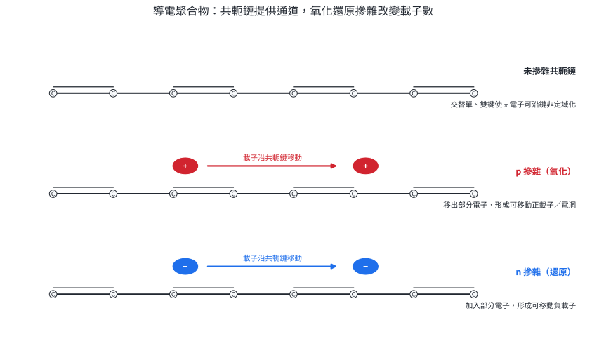{width=98%}

有機發光二極體以有機或聚合物半導體層注入電子與電洞，復合後形成激發態並放光。顏色由分子能階與共軛長度控制，效率還受載子平衡、界面與非輻射衰減影響。

::: worked-example
### 示範 21｜p 摻雜的電荷補償

某中性聚合物薄膜被氧化，移出 $2.00\times10^{-3}\ \mathrm{mol}$ 電子。主鏈因而累積等量正電荷。若每個 $ClO_4^-$ 提供一單位負電補償，所需陰離子為

$$
n(ClO_4^-)=2.00\times10^{-3}\ \mathrm{mol}.
$$

若只加入 $1.50\times10^{-3}\ \mathrm{mol}$，理想帳仍差 $0.50\times10^{-3}\ \mathrm{mol}$ 單位電荷；實際系統必須由其他離子、殘餘電子或不完全氧化閉合。
:::

::: worked-example
### 示範 22｜資料判斷共軛與摻雜的共同作用

三個薄膜的電導率如下：飽和鏈 A 為 $10^{-10}\ \mathrm{S\,cm^{-1}}$；未摻雜共軛鏈 B 為 $10^{-6}\ \mathrm{S\,cm^{-1}}$；氧化摻雜共軛鏈 C 為 $10^{1}\ \mathrm{S\,cm^{-1}}$。

1. A 到 B 增加 $10^4$ 倍，支持共軛鏈提供較長的電子通道。
2. B 到 C 增加 $10^7$ 倍，支持摻雜大幅提高載子濃度。
3. 這組資料同時改變結構與摻雜狀態，若要分離因果，還需相同聚合物在不同摻雜程度下的系列資料，並控制膜厚與溫度。
:::

導電聚合物可作防靜電層、柔性感測器、電致變色與有機電子元件。可彎曲、可溶液加工是優勢；耐久、濕度敏感與載子遷移率需由用途測試確認。

### 分節練習 11

1. 說明交替單雙鍵為何能支持 $\pi$ 電子離域，並指出一個仍會限制導電的結構因素。
2. 聚合物 n 摻雜時加入 $4.00\ \mathrm{mmol}$ 電子。若以單價陽離子補償，需多少 mmol 陽離子？若用二價陽離子呢？
3. 未摻雜與摻雜薄膜的電導率分別為 $2.0\times10^{-7}$ 與 $5.0\times10^{-1}\ \mathrm{S\,cm^{-1}}$，求提升倍數。
4. 一組 OLED 樣品的發光效率隨電流先升後降。提出兩個可檢驗的機制，並為每個機制指定一項量測。

### 分節練習 11 解析

1. 相鄰碳的 p 軌域連續側向重疊，使 $\pi$ 電子能跨越多個鍵離域。主鏈扭曲、共軛中斷、鏈間距離大、低結晶度或缺陷捕捉都可限制載子移動。
2. 加入電子使主鏈帶 $4.00\ \mathrm{mmol}$ 單位負電；需 $4.00\ \mathrm{mmol}$ 單價陽離子，或 $2.00\ \mathrm{mmol}$ 二價陽離子，總正電皆為 $4.00\ \mathrm{mmol}$。
3. 倍數為 $(5.0\times10^{-1})/(2.0\times10^{-7})=2.5\times10^6$。
4. 高電流下激發態彼此湮滅，可量測時間解析發光壽命隨電流的變化；焦耳熱造成非輻射衰減，可同步量測元件溫度並比較脈衝與連續驅動。也可檢查載子不平衡，量測電流—電壓與光輸出及電子／電洞傳輸層變因。

## 12. 奈米材料：尺度、比表面積與光觸媒

### 12.1 奈米尺度與比表面積

材料至少一個外部尺寸約在 $1$ 到 $100\ \mathrm{nm}$ 時，可歸入奈米尺度描述。薄膜即使長、寬很大，只要厚度在此範圍，仍具有一維受限的奈米結構；奈米線有兩個小尺寸，奈米粒子有三個小尺寸。

邊長為 $L$ 的立方粒子有

$$
S=6L^2,\qquad V=L^3,\qquad \frac{S}{V}=\frac6L.
$$

尺寸縮小十倍，表面積／體積比增加十倍。在總材料體積固定時，更多原子位於表面或界面，可改變反應速率、熔點、機械與光學性質；極小尺度還可能出現量子侷限。每一項效應都需連到材料、尺寸分布與量測條件。

### 12.2 二氧化鈦光觸媒

$TiO_2$ 吸收能量足夠的光後，可產生傳導帶電子與價帶電洞。表面電洞與水或 $OH^-$ 形成高反應性物種，電子可還原吸附的氧；這些物種再氧化部分有機物。高比表面積增加可用反應位置，但電子—電洞復合會消耗載子，光源波長、晶相、缺陷、表面吸附與污染物種類共同控制效率。

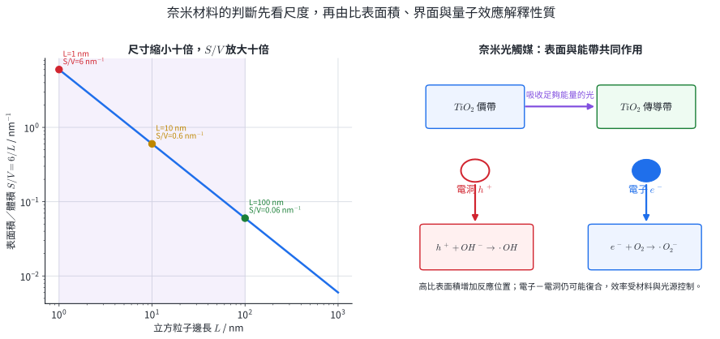{width=98%}

銀、金或氧化物奈米粒子也可能呈現與塊材不同的光學、催化或抗微生物行為。效能需由目標生物、濃度、接觸時間與介質驗證；安全評估還要考慮粒徑分布、表面包覆、聚集、暴露途徑及環境歸宿。

::: worked-example
### 示範 23｜比較兩種立方奈米粒子的比表面積

邊長 $100\ \mathrm{nm}$ 時：

$$
\frac SV=\frac6{100}=0.060\ \mathrm{nm^{-1}}.
$$

邊長 $10\ \mathrm{nm}$ 時：

$$
\frac SV=\frac6{10}=0.600\ \mathrm{nm^{-1}}.
$$

後者的 $S/V$ 是前者 $10$ 倍。這表示相同總體積、理想分散時可有十倍總表面積；若粒子聚集，可接觸表面積會下降。
:::

::: worked-example
### 示範 24｜固定總體積時的粒子數與總表面積

把一個邊長 $100\ \mathrm{nm}$ 的立方體切成邊長 $10\ \mathrm{nm}$ 的小立方體。每方向切成 $10$ 份，所以粒子數為 $10^3=1000$。

原總表面積：

$$
S_0=6(100)^2=60000\ \mathrm{nm^2}.
$$

切分後：

$$
S_1=1000\times6(10)^2=600000\ \mathrm{nm^2}=10S_0.
$$

新增表面需付出表面能，因此真實顆粒有聚集傾向；分散劑與表面修飾會影響可維持的尺寸。
:::

奈米模型用於觸媒、塗層、感測、電子與複合材料。材料是否「奈米」由尺寸量測判斷，功能是否改善則由有適當對照的性能測試判斷。

### 分節練習 12

1. 判斷下列是否至少具有一個奈米尺寸：厚 $50\ \mathrm{nm}$、寬 $2\ \mathrm{cm}$ 的膜；直徑 $80\ \mathrm{nm}$、長 $5\ \mathrm{\mu m}$ 的線；直徑 $300\ \mathrm{nm}$ 的球。
2. 求邊長 $25\ \mathrm{nm}$ 立方粒子的 $S/V$；與 $250\ \mathrm{nm}$ 粒子相比為幾倍？
3. 固定總體積，把邊長 $60\ \mathrm{nm}$ 粒子改成 $20\ \mathrm{nm}$ 粒子，理想粒子數與總表面積各變為幾倍？
4. 甲、乙兩種 $TiO_2$ 樣品的污染物去除率分別為 $85\%$、$60\%$。列出至少四項需控制或量測的條件，才能把差異合理歸因於粒徑。

### 分節練習 12 解析

1. 膜厚 $50\ \mathrm{nm}$，有一個奈米尺寸；線的直徑 $80\ \mathrm{nm}$，有兩個奈米橫向尺寸；球直徑 $300\ \mathrm{nm}$，題目沒有任何 $1$–$100\ \mathrm{nm}$ 外部尺寸。
2. $S/V=6/25=0.240\ \mathrm{nm^{-1}}$；$250\ \mathrm{nm}$ 粒子為 $0.0240\ \mathrm{nm^{-1}}$，前者為 $10.0$ 倍。
3. 線性尺寸比 $60/20=3$。固定體積時粒子數變為 $3^3=27$ 倍；總表面積或 $S/V$ 變為 $3$ 倍。
4. 至少控制總 $TiO_2$ 質量、晶相、比表面積／聚集狀態、表面修飾、光源波長與光強、反應時間、污染物初濃度、pH、溫度及攪拌傳質；並量測尺寸分布。只有粒徑為主要系統差異時，去除率差異才可支持粒徑效應。

## 13. 章末分層題

### 基礎題

1. 完全電解 $54.0\ \mathrm{g}$ 水。求理論生成 $H_2$ 與 $O_2$ 的莫耳數和質量。

2. 將下列結構配對到主要性質，並各用一句鍵結理由說明：鑽石三維 $sp^3$ 網路、石墨 $sp^2$ 層狀網路、$C_{60}$ 封閉分子；性質為「高硬度」、「沿層導電且可滑移」、「可形成分子晶體並溶於部分溶劑」。

3. 哈柏法為放熱平衡。分別說明加壓、降低溫度、加入 Fe 催化劑和移除 $NH_3$ 對平衡組成或達平衡速率的影響。

4. 一座沸石交換柱有 $36.0\ \mathrm{mmol}$ 的單位負電交換位置。進流水含 $12.0\ \mathrm{mmol}$ $Ca^{2+}$ 與 $8.00\ \mathrm{mmol}$ $Na^+$；假設交換位置起初全為 $NaZ$，求最多可移除多少 $Ca^{2+}$，並求由交換柱釋出的 $Na^+$。

### 核心題

5. 在酸性標準條件，$E^\circ(O_3/O_2)=2.07\ \mathrm{V}$、$E^\circ(Fe^{3+}/Fe^{2+})=0.77\ \mathrm{V}$。寫出臭氧氧化 $Fe^{2+}$ 的配平總反應並求 $E^\circ_{cell}$；再指出兩項會使實際處理效果偏離標準電位預測的因素。

6. 熔融 $MgCl_2$ 電解時通過 $4.825\times10^5\ \mathrm{C}$，電流效率 $80.0\%$。取 $F=9.65\times10^4\ \mathrm{C\,mol^{-1}}$、$M(Mg)=24.3$，求實收 Mg 質量與陽極實得 $Cl_2$ 莫耳數。陽極氯氣以相同電流效率計。

7. 一批鐵礦 $50.0\ \mathrm{kg}$，含 $80.0\%$ $Fe_2O_3$，其餘視為不含鐵雜質。以 $Fe_2O_3+3CO\rightarrow2Fe+3CO_2$，若鐵回收率 $92.0\%$，求實收 Fe 與由還原步驟生成的 $CO_2$ 質量。$M(Fe_2O_3)=160$、$M(Fe)=56.0$、$M(CO_2)=44.0\ \mathrm{g\,mol^{-1}}$。

8. 對錯離子 $[Co(en)_2Cl_2]^+$，$en$ 是中性雙牙配位子、$Cl^-$ 為單牙。求 Co 氧化數、配位子顆數、配位數與整個錯離子的電荷檢查。

9. 珠寶合金 A 為 $18\ \mathrm{K}$、總質量 $16.0\ \mathrm{g}$；鋼樣 B 為 $2.50\ \mathrm{kg}$、含 $15.0\ \mathrm{g}$ C。求 A 的金與其餘合金元素質量、B 的碳質量百分率；再分別指出一項組成以外仍會改變性能的因素。

10. 兩種 LED 的有效發光能量分別為 $1.90\ \mathrm{eV}$ 與 $2.75\ \mathrm{eV}$。用 $\lambda(\mathrm{nm})\approx1240/E(\mathrm{eV})$ 求峰值波長。若其中一種材料為 Si 摻 B，寫出其半導體型別與主要載子，並說明「主要載子為電洞」與整體電中性是否相容。

11. 一片共軛聚合物在 p 摻雜時失去 $6.00\ \mathrm{mmol}$ 電子，補償陰離子有 $ClO_4^-$ 與 $SO_4^{2-}$。若其中 $2.00\ \mathrm{mmol}$ 單位負電由 $ClO_4^-$ 提供，求需要的 $ClO_4^-$、$SO_4^{2-}$ 莫耳數；並說明共軛與摻雜各自提供什麼導電條件。

12. 固定總材料體積，把邊長 $120\ \mathrm{nm}$ 的立方粒子改成邊長 $30\ \mathrm{nm}$。求粒子數與總表面積的倍率；再說明為何量到幾何表面積增加，仍不保證光觸媒反應速率等比例增加。

### 跨節整合題

13. 一座合成氨示範廠每批需要 $18.0\ \mathrm{kmol}$ $H_2$。路徑 M 用甲烷蒸氣重組，路徑 E 用水電解；兩者皆先以理論計量估算，再送入哈柏反應。求：

    (a) 路徑 M 需多少 kmol $CH_4$，直接生成多少 kg $CO_2$？

    (b) 路徑 E 需多少 kmol $H_2O$，副產多少 kmol $O_2$？

    (c) 若 $N_2$ 足量且合成氨回收率為 $85.0\%$，可回收多少 kmol 與 kg $NH_3$？

    (d) 除上述化學計量外，列出四項比較兩條氫路徑所需的資料。

14. 某無人機需要選機身材料，候選為碳纖維／樹脂複合材料、鋁合金與鈉鈣玻璃。測試資料如下：

    | 材料 | 密度 / $\mathrm{g\,cm^{-3}}$ | 比強度 / 相對值 | 導電性 | 透明性 |
    |---|---:|---:|---|---|
    | 碳纖維複材 | 1.6 | 5.0 | 方向性 | 不透明 |
    | 鋁合金 | 2.7 | 2.8 | 良好 | 不透明 |
    | 鈉鈣玻璃 | 2.5 | 0.8 | 低 | 透明 |

    (a) 主承力且需最低質量的外殼，依表選一種並說明兩項結構理由。

    (b) 需要透明觀察窗時選哪一種？用 $Si-O$ 網路與非晶體描述其材料類型。

    (c) 需要同時作電磁屏蔽與可修復金屬骨架時，哪一種資料最直接支持選擇？

    (d) 說明三種材料各還需一項未列在表中的實際驗證。

15. 製備草酸鐵鉀時，混合 $0.100\ \mathrm{M}$ $FeCl_3$ $25.0\ \mathrm{mL}$ 與 $0.200\ \mathrm{M}$ $K_2C_2O_4$ $50.0\ \mathrm{mL}$，主要錯離子為 $[Fe(C_2O_4)_3]^{3-}$。最後分離出 $1.00\ \mathrm{mmol}$ 產物，以錯離子莫耳數計。

    (a) 求兩種反應物莫耳數、限量成分及過量草酸根的莫耳數。

    (b) 求 Fe 氧化數、配位數及以限量成分計的產率。

    (c) 解釋避光、冰水浴與過濾各控制哪個步驟。

    (d) 若要確認起始液含 $Fe^{3+}$，提出一個試劑、正對照與預期觀察。

16. 某材料小組比較三個光電／光觸媒樣品：無機 LED 能量 $2.00\ \mathrm{eV}$；共軛聚合物 OLED 能量 $2.50\ \mathrm{eV}$，p 摻雜後電導率提高 $10^5$ 倍；$TiO_2$ 立方粒子邊長由 $90\ \mathrm{nm}$ 降為 $30\ \mathrm{nm}$，在同一測試中污染物去除率由 $45\%$ 升為 $72\%$。

    (a) 求兩個發光樣品的估算波長並比較顏色趨勢。

    (b) 比較無機半導體摻雜與導電聚合物 p 摻雜的機制。

    (c) 求 $TiO_2$ 的 $S/V$ 倍率，並判斷去除率資料是否足以證明「增加全部來自比表面積」。

    (d) 設計一組最少包含三個控制量與兩個量測量的追加實驗。

## 14. 章末題完整解析

### 第 1 題

$$
n(H_2O)=\frac{54.0}{18.0}=3.00\ \mathrm{mol}.
$$

由 $2H_2O\rightarrow2H_2+O_2$，$H_2$ 為 $3.00\ \mathrm{mol}$、$O_2$ 為 $1.50\ \mathrm{mol}$；質量分別為 $6.00\ \mathrm{g}$、$48.0\ \mathrm{g}$。總質量 $54.0\ \mathrm{g}$，與輸入水相同。

### 第 2 題

鑽石對應高硬度：三維 $sp^3$ 共價網路中的強鍵延伸全體。石墨對應沿層導電且可滑移：層內離域 $\pi$ 電子可移動，層間作用較弱。$C_{60}$ 對應分子晶體及部分溶解性：它是有明確邊界的封閉分子，分子間以較弱作用力聚集。

### 第 3 題

加壓使平衡偏向氣體莫耳數由 $4$ 降為 $2$ 的右側；降低溫度使放熱的正反應平衡較有利，但反應速率下降。Fe 催化劑降低正、逆反應活化能，使較快達平衡，不改變平衡常數。移除 $NH_3$ 降低產物分壓，使反應繼續向右補充氨。

### 第 4 題

每 $1\ \mathrm{mmol}$ $Ca^{2+}$ 需 $2\ \mathrm{mmol}$ 交換位置。移除全部 $12.0\ \mathrm{mmol}$ 鈣需 $24.0\ \mathrm{mmol}$，小於容量 $36.0\ \mathrm{mmol}$，所以可全部移除。依

$$
Ca^{2+}+2NaZ\rightarrow CaZ_2+2Na^+,
$$

交換柱釋出 $24.0\ \mathrm{mmol}$ $Na^+$。進流水原有的 $8.00\ \mathrm{mmol}$ Na 不占硬度去除負荷；出流水在此模型含 $32.0\ \mathrm{mmol}$ Na。

### 第 5 題

將臭氧還原半反應與兩倍鐵氧化半反應相加：

$$
O_3+2H^++2e^-\rightarrow O_2+H_2O,
$$

$$
2Fe^{2+}\rightarrow2Fe^{3+}+2e^-.
$$

總反應為

$$
O_3+2H^++2Fe^{2+}\rightarrow O_2+H_2O+2Fe^{3+}.
$$

$$
E^\circ_{cell}=2.07-0.77=1.30\ \mathrm{V}.
$$

標準電位支持熱力學自發。實際效果還受 pH、物種濃度、臭氧傳質與分解、反應速率、競爭還原物及接觸時間影響，任列兩項即可。

### 第 6 題

通過的電子為

$$
n(e^-)=\frac{4.825\times10^5}{9.65\times10^4}=5.00\ \mathrm{mol}.
$$

以 $Mg^{2+}+2e^-\rightarrow Mg$，理論 Mg 為 $2.50\ \mathrm{mol}$；乘電流效率後

$$
n(Mg)=2.50(0.800)=2.00\ \mathrm{mol},
$$

$$
m(Mg)=2.00(24.3)=48.6\ \mathrm{g}.
$$

陽極 $2Cl^-\rightarrow Cl_2+2e^-$，同樣每 $2\ \mathrm{mol}$ 電子對 $1\ \mathrm{mol}$ $Cl_2$，所以實際 $Cl_2=2.50(0.800)=2.00\ \mathrm{mol}$。

### 第 7 題

純 $Fe_2O_3$ 質量為 $50.0(0.800)=40.0\ \mathrm{kg}$，即

$$
n(Fe_2O_3)=\frac{40.0}{160}=0.250\ \mathrm{kmol}.
$$

理論 Fe 為 $0.500\ \mathrm{kmol}=28.0\ \mathrm{kg}$，實收

$$
28.0(0.920)=25.8\ \mathrm{kg}.
$$

指定還原步驟理論生成 $3(0.250)=0.750\ \mathrm{kmol}$ $CO_2$，質量

$$
0.750(44.0)=33.0\ \mathrm{kg}.
$$

題目把回收率施於 Fe。真實 $CO_2$ 由氣體流量與組成量測；這項量測也能分辨反應未完全與鐵在後續流股損失兩種情況。

### 第 8 題

設 Co 氧化數為 $x$：

$$
x+2(0)+2(-1)=+1\Rightarrow x=+3.
$$

共有 $2$ 個 $en$ 與 $2$ 個 $Cl^-$，配位子顆數為 $4$。兩個雙牙 $en$ 提供 $4$ 個供體，兩個單牙氯提供 $2$ 個，故配位數 $6$。電荷檢查為 $+3-2=+1$，與錯離子右上角相符。

### 第 9 題

A 的金分率為 $18/24=0.750$，所以金質量 $16.0(0.750)=12.0\ \mathrm{g}$，其餘元素 $4.00\ \mathrm{g}$。性能還受其餘合金元素種類、晶粒或加工硬化影響。

B 的含碳量為

$$
\frac{15.0}{2500}\times100\%=0.600\%.
$$

性能還受熱處理、相組成、晶粒或缺陷影響。每個材料任指出一項並說明連結即可。

### 第 10 題

$$
\lambda_1=\frac{1240}{1.90}=653\ \mathrm{nm},
$$

約為紅光；

$$
\lambda_2=\frac{1240}{2.75}=451\ \mathrm{nm},
$$

約為藍光。Si 摻 B 形成受體與電洞，為 p 型。中性的 B 原子取代中性的 Si 原子後，受體游離與電洞形成會留下相應固定電荷，移動載子與晶格電荷合計仍近似為零，所以 p 型不等於整塊材料帶正電。

### 第 11 題

主鏈失去 $6.00\ \mathrm{mmol}$ 電子，需要 $6.00\ \mathrm{mmol}$ 單位負電補償。其中 $2.00\ \mathrm{mmol}$ 由單價 $ClO_4^-$ 提供，所以

$$
n(ClO_4^-)=2.00\ \mathrm{mmol}.
$$

剩餘 $4.00\ \mathrm{mmol}$ 單位負電由 $SO_4^{2-}$ 提供，故

$$
n(SO_4^{2-})=\frac{4.00}{2}=2.00\ \mathrm{mmol}.
$$

共軛使 p 軌域連續重疊並提供載子移動通道；氧化摻雜提高正載子濃度，陰離子則閉合電荷帳。

### 第 12 題

線性尺寸比為 $120/30=4$。固定總體積時粒子數變為 $4^3=64$ 倍；總表面積或 $S/V$ 變為 $4$ 倍。有效反應位置還由表面可接近性、聚集、晶相、吸光、電子—電洞復合、表面吸附與傳質共同決定。

### 第 13 題

(a) 甲烷重組總反應每 $1$ mol $CH_4$ 產 $4$ mol $H_2$：

$$
n(CH_4)=\frac{18.0}{4}=4.50\ \mathrm{kmol}.
$$

直接生成 $4.50\ \mathrm{kmol}$ $CO_2$，質量

$$
4.50(44.0)=198\ \mathrm{kg}.
$$

(b) 水電解中 $H_2O:H_2=1:1$，需 $18.0\ \mathrm{kmol}$ 水，副產 $9.00\ \mathrm{kmol}$ $O_2$。

(c) $3H_2\rightarrow2NH_3$，理論氨為

$$
18.0\left(\frac23\right)=12.0\ \mathrm{kmol}.
$$

回收 $12.0(0.850)=10.2\ \mathrm{kmol}$，質量 $10.2(17.0)=173\ \mathrm{kg}$。

(d) 仍需比較電力與熱源的組成及排放、製氫與合成設備效率、甲烷洩漏或水資源、壓縮儲運、原料純化、氧氣副產物利用、成本及可靠度。至少四項，並以相同功能單位，例如每 kg 回收氨，進行比較。

### 第 14 題

(a) 依表應選碳纖維複材：密度最低且比強度最高，對最低質量的主承力外殼最有利。還要讓纖維方向對準主要受力並驗證界面。

(b) 透明窗選鈉鈣玻璃。它以延伸的 $Si-O$ 網路為骨架，加入 Na、Ca 等組分調整加工與耐水性；長程排列無晶體週期，屬非晶體。

(c) 鋁合金表列「導電性良好」，最直接支持電磁屏蔽；金屬骨架也可依合金牌號選擇焊接或機械修復製程。

(d) 碳纖維複材需驗證衝擊、疲勞或方向性強度；鋁合金需驗證腐蝕、疲勞或接合強度；玻璃需驗證熱衝擊、破壞韌性或光學品質。表中的相對值只完成初選，實際環境測試完成定案。

### 第 15 題

(a)

$$
n(Fe^{3+})=0.100(25.0\times10^{-3})=2.50\ \mathrm{mmol},
$$

$$
n(C_2O_4^{2-})=0.200(50.0\times10^{-3})=10.0\ \mathrm{mmol}.
$$

形成每 $1$ mol 錯離子需 $1$ mol Fe 與 $3$ mol 草酸根。$2.50\ \mathrm{mmol}$ Fe 需 $7.50\ \mathrm{mmol}$ 草酸根，所以 Fe 是限量成分，草酸根過量 $10.0-7.50=2.50\ \mathrm{mmol}$。

(b) $x+3(-2)=-3$ 得 Fe 為 $+3$；三個雙牙草酸根使配位數為 $6$。理論錯離子 $2.50\ \mathrm{mmol}$，產率

$$
\frac{1.00}{2.50}\times100\%=40.0\%.
$$

(c) 避光抑制草酸鐵錯合物的光致氧化還原；冰水浴降低產物溶解度、促進結晶；過濾把固體晶體與母液分離。三步分別控制副反應、相平衡與物理分離。

(d) 取另一份起始液加 $SCN^-$，預期 $Fe^{3+}$ 形成血紅色錯合物。以已知濃度 $Fe^{3+}$ 同法處理作正對照，另以純水加試劑作空白，確認試劑有效且背景沒有相同顏色。

### 第 16 題

(a)

$$
\lambda_{LED}=\frac{1240}{2.00}=620\ \mathrm{nm},
$$

約偏紅光；

$$
\lambda_{OLED}=\frac{1240}{2.50}=496\ \mathrm{nm},
$$

約偏藍綠光。較高光子能量對應較短波長。

(b) 無機 Si 類半導體通常以不同價電子數原子取代晶格位置，形成施體／受體能階與電子／電洞；導電聚合物 p 摻雜是氧化共軛主鏈、移出電子並由陰離子補償。兩者都提高主要載子濃度，但結構與電荷補償機制不同。

(c) 尺寸由 $90$ 降為 $30\ \mathrm{nm}$，$S/V=6/L$ 增為 $3$ 倍。去除率由 $45\%$ 到 $72\%$ 顯示這批樣品在指定測試有差異；晶相、聚集、缺陷、吸光與表面化學的配對資料，才能分配各機制對提升量的貢獻。

(d) 可使用相同 $TiO_2$ 質量、晶相、表面包覆、光源光譜／光強、污染物初濃度、pH、溫度與攪拌，只系統改變粒徑。至少量測粒徑／聚集分布與 BET 比表面積，再量測隨時間的污染物濃度、光吸收或電子—電洞復合指標。加入無光空白與無觸媒空白，可分離吸附、光解與光觸媒貢獻。

## 15. 核心整理

::: compact-list
- 原子、電荷與電子守恆是所有製程圖的第一層檢查；產率、能源、分離與排放把理論反應擴充成真實流程。
- 碳同素異形體、矽酸鹽、合金與共軛聚合物都遵循「鍵結或晶格結構決定可移動粒子與形變方式」。
- 活性金屬需由外加電能還原；鐵可由 CO 還原。選製程前先比較金屬活性、水的競爭與原料純化。
- 錯合物的氧化數由電荷帳求，配位數由供體原子數求；實驗結論需把觀察、對照與化學模型接起來。
- 半導體的能隙控制激發門檻，摻雜控制主要載子，p–n 接面控制方向；導電聚合物以共軛鏈與氧化還原摻雜完成相似功能。
- 奈米材料至少一個尺寸約為 $1$–$100\ \mathrm{nm}$；$S/V\propto1/L$ 解釋表面效應的尺度，效能仍需由晶相、聚集、界面與對照實驗驗證。
:::
