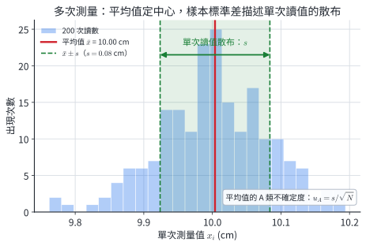
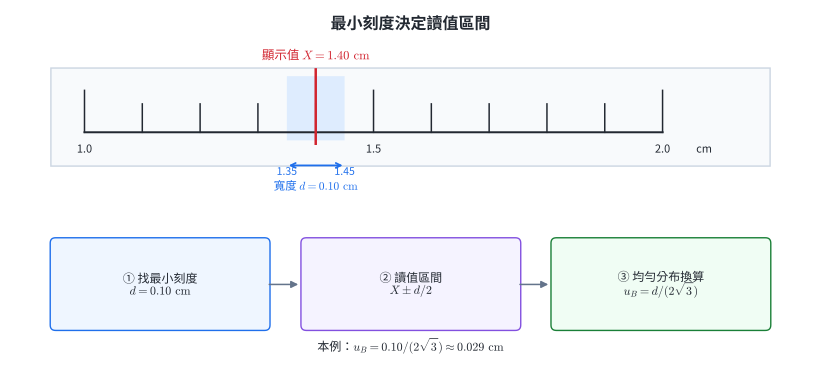
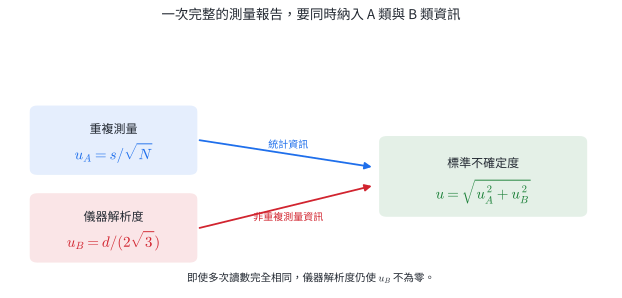
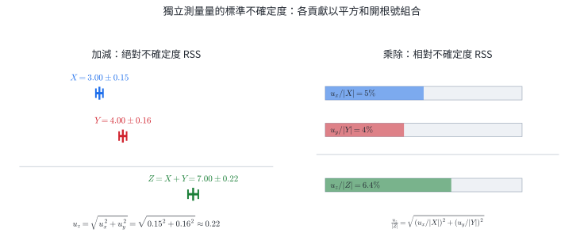
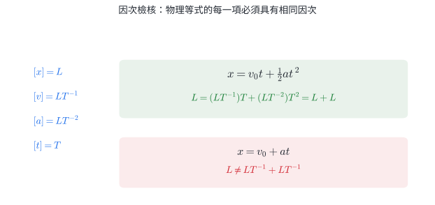

# 選物I-1 測量與不確定度

::: learning-map
### 本章核心關係

1. **測量結果包含哪些資訊？**──同一個量反覆測量，結果通常不完全相同，因此須同時報告估計值與不確定度。
2. **不確定度從哪裡來？**──被測物、儀器、測量者與環境都可能貢獻。
3. **怎麼把反覆測量與儀器解析度合成一個不確定度？**──分別作 A 類、B 類評估，再用平方和開根號合成。
4. **帶有不確定度的量相加、相減、相乘或相除時，結果怎麼報告？**──獨立測量的貢獻仍以平方和開根號組合。
5. **因次分析能檢查什麼？**──等式兩邊與可相加各項的因次必須一致。

藍色：現行核心
青綠：理解支援
紫色：超出本章必學邊界

111–115 官方題本固定窗口中，3/5 份分科物理直接使用測量與不確定度方法；3/5 份學測自然直接檢核單位或因次基礎。完整 GUM 計算不屬於學測固定範圍，這組統計也不預測下一屆考題。
:::

## 1. 測量結果包含估計值與不確定度

用同一把尺反覆量同一張桌子，讀數可能出現些微差異。這不一定代表有人粗心；桌緣不完全筆直、刻度有限、視線角度與室溫變化，都會影響結果。

現代測量採用**不確定度（uncertainty）**描述：根據現有資料與方法，我們對待測量知道到什麼程度。記號先約定如下：

- $x$：待測的物理量。
- $X$：由資料得到的最佳估計值。
- $u$：標準不確定度，必為非負數，與 $X$ 有相同單位。

測量結果寫成

$$
\boxed{x=X\pm u}.
$$

本章依 114 教材，把「最佳估計值與標準不確定度」簡記為 $x=X\pm u$。若根據量測模型，可合理歸因於待測量的可能值近似呈常態分布，且 $u$ 可視為該分布的標準差，則 $X-u$ 到 $X+u$ 約涵蓋 $68.3\%$ 的可能值。這是特定假設下的解讀，不是所有 $X\pm u$ 都自動具有 $68.3\%$ 涵蓋率，也不保證真值必在其中。

### 不確定度的四個來源

| 來源 | 要問的問題 | 例子 |
|---|---|---|
| 被測物 | 要測的量本身是否清楚、穩定？ | 桌緣粗糙、液面晃動、物體受熱膨脹 |
| 儀器 | 儀器能分辨到多細？是否已校準？ | 尺的刻度有限、碼錶走時偏差 |
| 測量者 | 判讀與操作是否會改變結果？ | 視差、按碼錶的反應時間 |
| 環境 | 外界條件是否在測量時改變？ | 溫度、氣流、振動、電源波動 |

::: worked-example
### 完整示範｜不確定度決定兩個結果能否分辨

同一零件以兩套方法量得直徑

$$
d_A=(10.02\pm0.05)\ \mathrm{mm},\qquad
d_B=(10.11\pm0.04)\ \mathrm{mm}.
$$

若兩套方法的不確定度可視為獨立，直接比較差值

$$
D=d_B-d_A=0.09\ \mathrm{mm}.
$$

差值的合成標準不確定度為

$$
u_D=\sqrt{(0.05)^2+(0.04)^2}=0.064\ \mathrm{mm}.
$$

因此標準不確定度層級可寫成

$$
D=(0.090\pm0.064)\ \mathrm{mm}.
$$

比較兩個結果是否已清楚分開，須先指定涵蓋標準。若採常用的涵蓋因子 $k=2$，擴展不確定度

$$
U_D=ku_D=2(0.064)=0.128\ \mathrm{mm}\approx0.13\ \mathrm{mm}.
$$

差值的約 $k=2$ 涵蓋區間為 $0.09\pm0.13\ \mathrm{mm}$，包含 0；現有證據尚未把兩方法的結果清楚區分。兩個 $X\pm u$ 區間是否重疊可提供直觀，但 $\pm1u$ 不是通用的判定門檻。正式比較應對差值 $D$ 合成 $u_D$，再依任務指定的涵蓋因子或決策規則判讀。
:::

::: worked-example
### 完整示範｜由標準不確定度作門檻判讀

某電流感測器在指定工作狀態下的量測結果為

$$
I=(12.46\pm0.08)\ \mathrm{mA}.
$$

其中 $12.46\ \mathrm{mA}$ 是最佳估計值，$0.08\ \mathrm{mA}$ 是標準不確定度。校準資料支持近似常態分布；設備的保護規則採涵蓋因子 $k=2$，並以量測區間上界是否低於 $12.80\ \mathrm{mA}$ 作判定。

**步驟 1──求擴展不確定度**

$$
U=k u=2(0.08\ \mathrm{mA})=0.16\ \mathrm{mA}.
$$

**步驟 2──寫出 $k=2$ 量測區間**

$$
12.46-0.16\le I\le12.46+0.16,
$$

即

$$
12.30\ \mathrm{mA}\le I\le12.62\ \mathrm{mA}.
$$

**步驟 3──依指定規則判讀**

量測區間上界為 $12.62\ \mathrm{mA}$，低於保護門檻 $12.80\ \mathrm{mA}$；依這項 $k=2$ 判定規則，現有量測支持設備在門檻內運作。這個結論同時使用最佳估計值、不確定度、涵蓋因子與事先指定的決策門檻。
:::

::: why
### 真值未知時，以不確定度評估測量品質

真值通常無法直接知道，因此誤差也無法直接算出。國際通用的 GUM 架構改以「可由資料與儀器評估的不確定度」報告測量品質，回答現有證據能支持多精細的結論。
:::

::: why
### 不確定度支撐工程、醫療與導航決策

讀數連同不確定度，才能判斷證據是否足以支撐決策。零件尺寸靠近公差邊界時，量測不確定度會影響「放行」或「重工」的風險，因此設備須校準，判定規則也須預先訂定。醫療檢測接近處置門檻時，判讀須結合方法不確定度、重測與臨床資訊。

衛星定位先量訊號傳播時間，再乘光速換成距離；時間誤差因此會轉成距離誤差。光在 $1\ \mathrm{ns}$ 內約走 $0.30\ \mathrm m$，所以衛星鐘、接收器鐘、電離層模型與軌道資料都必須校正。定位系統從多筆帶不確定度的距離資料估計最合理的位置，並報告可信程度。
:::

::: self-check
### 練習

1. 量水溫時，溫度計最小刻度有限，而且水仍在緩慢降溫。這兩項分別屬於哪個來源？
2. 長度報告為 $(25.4\pm0.2)\ \mathrm{cm}$。寫出最佳估計值、不確定度與兩者單位。
3. 甲結果為 $(8.00\pm0.03)\ \mathrm{s}$，乙結果為 $(8.00\pm0.20)\ \mathrm{s}$。哪一個結果提供較細的分辨能力？
4. 校準證書指出秤的讀值可能共同偏高。這項資訊由「多量幾次」取得，還是由重複數據以外的資料取得？

**答案：**1. 刻度有限屬於儀器；水溫隨時間改變屬於被測物在指定條件下不穩定。2. $X=25.4\ \mathrm{cm}$、$u=0.2\ \mathrm{cm}$。3. 甲；兩者中心相同，甲的 $u$ 較小。4. 校準證書屬於重複數據以外的資訊，後續以 B 類方式評估。
:::

::: keep-with-next
## 2. 理解支援｜準確與精密描述不同品質

C2 理解支援｜最低版本可略

反覆測量的結果很集中，稱為**精密（precise）**；測量結果接近可接受的參考值，稱為**準確（accurate）**。兩者回答不同問題：
:::

| 判讀 | 看什麼 | 只靠反覆測量能否判定？ |
|---|---|---:|
| 精密度 | 多次讀數彼此是否集中 | 可以由散布程度判斷 |
| 準確度 | 結果是否接近可信參考值 | 不一定；需要參考值或校準資訊 |

一把沒有歸零的秤可能每次都讀得非常接近，卻整批偏高：它很精密，但不準確。反過來，數據散得很開，即使平均值碰巧接近參考值，也不能說每次測量都很精密。

::: pitfall
### 常見錯誤｜多量幾次能解決所有問題

增加測量次數可以降低由隨機散布造成的 A 類不確定度，卻不會自動修正共同偏移。例如秤固定多讀 $5\ \mathrm{g}$，量一百次的平均仍會多讀約 $5\ \mathrm{g}$；應先校準或改進方法。
:::

::: self-check
### 練習

甲組讀數為 $10.1,10.1,10.1,10.1$，可信參考值是 $10.5$；乙組讀數為 $10.3,10.5,10.7,10.5$。哪一組較精密？能否只看甲組的集中程度就說它較準確？

**答案：**甲組較精密，但整批離參考值較遠；不能因讀數集中就宣稱較準確。
:::

## 3. A 類與 B 類依資訊來源分類

### A 類評估：由重複測量的統計散布得到

在相同測量條件下，對同一物理量作 $N\ge2$ 次彼此獨立的重複測量，得到 $x_1,x_2,\ldots,x_N$。先算平均值：

$$
\bar x=\frac{1}{N}\sum_{i=1}^{N}x_i.
$$

再以**樣本標準差**描述單次讀數的散布：

$$
s=\sqrt{\frac{1}{N-1}\sum_{i=1}^{N}(x_i-\bar x)^2}.
$$

因為平均值 $\bar x$ 已由這 $N$ 筆資料算出，所有偏差的和必為 $0$，只有 $N-1$ 個偏差能自由改變，所以分母使用 $N-1$。若資料有明顯漂移或測量條件持續改變，不能直接套用 $u_A=s/\sqrt N$。

我們關心的是平均值有多穩定，因此 A 類標準不確定度為

$$
\boxed{u_A=\frac{s}{\sqrt N}}.
$$

$s$ 描述單次讀數通常散多開；$u_A$ 描述由 $N$ 次資料所得平均值的不確定程度。兩者不能混用。

{width=96%}

### B 類評估：由儀器、資料或其他非重複統計資訊得到

B 類評估由這組重複數據以外的資訊取得，例如：

- 引用手冊、文獻或校正證書所給的不確定度時，依其說明採用。
- 直接由有刻度的儀器讀值，若把解析度造成的可能讀值建模為「以顯示值為中心、寬度為一個最小刻度 $d$ 的均勻分布」，則

$$
\boxed{u_B=\frac{d}{2\sqrt3}}.
$$

這裡不是把最小刻度直接除以 2。$d/2$ 是均勻分布區間的半寬；換成標準不確定度還要再除以 $\sqrt3$。

{width=96%}

::: worked-example
### 完整示範｜由五次讀數合成 A 類與 B 類

用最小刻度 $d=0.10\ \mathrm{cm}$ 的尺量同一長度五次：

$$
20.1,\ 20.3,\ 20.2,\ 20.2,\ 20.2\ \mathrm{cm}.
$$

平均值為 $\bar x=20.2\ \mathrm{cm}$。五個偏差的平方和為

$$
(-0.1)^2+(0.1)^2+0^2+0^2+0^2=0.020\ \mathrm{cm^2},
$$

所以

$$
s=\sqrt{\frac{0.020}{4}}=0.0707\ \mathrm{cm},\qquad
u_A=\frac{0.0707}{\sqrt5}=0.0316\ \mathrm{cm}.
$$

解析度模型給出

$$
u_B=\frac{0.10}{2\sqrt3}=0.0289\ \mathrm{cm}.
$$

兩項代表不同來源，合成後

$$
u=\sqrt{0.0316^2+0.0289^2}=0.0428\ \mathrm{cm}.
$$

依本章記錄規則，$u$ 記為 $0.043\ \mathrm{cm}$，平均值末位對齊，結果為

$$
\boxed{x=(20.200\pm0.043)\ \mathrm{cm}}.
$$
:::

::: worked-example
### 完整示範｜校正證書提供 B 類資訊

某電壓感測器在相同條件下獨立量測 $N=25$ 次，平均值為 $8.420\ \mathrm V$，樣本標準差為 $s=0.050\ \mathrm V$；資料沒有顯示時間漂移。校正證書另列擴展不確定度 $U_{\mathrm{cal}}=0.040\ \mathrm V$，涵蓋因子為 $k=2$。重複讀數散布與校正資訊代表不同來源。

**步驟 1──由重複測量求 A 類標準不確定度**

$$
u_A=\frac{s}{\sqrt N}
=\frac{0.050\ \mathrm V}{\sqrt{25}}
=0.010\ \mathrm V.
$$

**步驟 2──把證書數值換成 B 類標準不確定度**

證書給的是 $U_{\mathrm{cal}}=k u_B$，因此

$$
u_B=\frac{U_{\mathrm{cal}}}{k}
=\frac{0.040\ \mathrm V}{2}
=0.020\ \mathrm V.
$$

**步驟 3──比較來源**

$u_B=2u_A$，目前校正資訊的標準不確定度較大。若量測目標要求再降低總不確定度，改善校正品質或更換感測器會比只增加重複次數更直接；兩項的正式合成依下一節的 RSS 規則處理。
:::

::: why
### 重複測量的改善率是 $1/\sqrt N$

獨立的隨機起伏有時偏高、有時偏低。把 $N$ 次結果取平均時，這些起伏會部分抵銷；但它們的平方貢獻相加，所以典型散布縮小為原來的 $1/\sqrt N$，不是 $1/N$。因此想把 $u_A$ 減半，測量次數要增加到 4 倍。
:::

::: why
### 增加測量次數仍受其他不確定度限制

$u_A=s/\sqrt N$ 只描述符合條件的隨機散布；增加測量次數能讓平均值更穩。儀器解析度、校準偏移與環境模型等 B 類資訊不會只靠重複次數消失。量測設計應先找出主要來源：溫度漂移主導時先控溫，解析度主導時更換儀器，隨機雜訊主導時再增加取樣與平均。
:::

::: self-check
### 練習

1. 某組數據的樣本標準差為 $0.12\ \mathrm{s}$，共測量 9 次。A 類標準不確定度是多少？
2. 同一方法的 $s$ 大致不變。把測量次數從 16 次增加到 64 次，$u_A$ 變為原來幾倍？
3. 儀器最小刻度為 $0.20\ \mathrm{V}$，採均勻分布模型時，求 $u_B$。
4. 四次讀數完全相同，能否把完整不確定度直接寫成 0？寫出仍須評估的一類資訊。
5. 讀數隨時間穩定上升。這組資料是否適合直接用 $u_A=s/\sqrt N$ 描述同一固定量？

**答案：**1. $u_A=s/\sqrt N=0.12/3=0.04\ \mathrm{s}$。2. $\sqrt{16/64}=1/2$。3. $u_B=0.20/(2\sqrt3)=0.0577\ \mathrm{V}$。4. 仍須評估解析度、校準資料等 B 類資訊。5. 不適合；持續漂移表示測量條件或待測量正在改變，應先找出時間趨勢並重新建立模型。
:::

## 4. 合成與報告：把不同來源整理成一個結果

同一組重複測量通常同時有 A 類與 B 類資訊。本章處理最常見的情形：$u_A$ 與 $u_B$ 代表不同、沒有重複計入的貢獻，並可視為彼此不相關。在此前提下，依 114 課本採用的 GUM 方法，合成標準不確定度為

$$
\boxed{u=\sqrt{u_A^2+u_B^2}}.
$$

這種「先平方、相加、再開根號」稱為**平方和開根號**，英文常縮寫為 RSS（root sum square）。

每項影響只計入一次；已反映在重複讀數散布中的貢獻不再重複合成。

{width=96%}

### 有效數字由不確定度決定

**有效數字**是測量值中有意義的數字。判讀時可用這三條：

1. 非零數字都有效；夾在非零數字之間的 0 也有效，例如 $2.03$ 有 3 位有效數字。
2. 小數前面只用來定位的 0 無效，小數末尾的 0 有效，例如 $0.02030$ 有 4 位有效數字。
3. 整數末尾的 0 容易含糊，改寫成科學記號最清楚。例如 $2.0300\times10^5$ 明確表示 5 位有效數字。

有效數字不是「計算機顯示幾位就抄幾位」。最後能保留到哪一位，必須由不確定度決定。

::: worked-example
### 完整示範｜從四次讀數到最後報告

用最小刻度 $d=0.01\ \mathrm{s}$ 的碼錶測某一段時間四次，得到

$$
2.00,\ 2.02,\ 2.04,\ 2.06\ \mathrm{s}.
$$

**步驟 1──最佳估計值**

$$
\bar x=\frac{2.00+2.02+2.04+2.06}{4}=2.03\ \mathrm{s}.
$$

**步驟 2──樣本標準差與 A 類不確定度**

四個偏差為 $-0.03,-0.01,+0.01,+0.03\ \mathrm{s}$，故

$$
s=\sqrt{\frac{0.03^2+0.01^2+0.01^2+0.03^2}{3}}
\approx0.0258\ \mathrm{s},
$$

$$
u_A=\frac{s}{\sqrt4}\approx0.0129\ \mathrm{s}.
$$

**步驟 3──B 類不確定度**

$$
u_B=\frac{0.01}{2\sqrt3}\approx0.00289\ \mathrm{s}.
$$

**步驟 4──合成**

$$
u=\sqrt{0.0129^2+0.00289^2}\approx0.01323\ \mathrm{s}.
$$

**步驟 5──依規則記錄**

本章依 114 教材採用一致的記錄慣例：不確定度最多保留 2 位有效數字；保留位置的下一位若為 1～9，一律進位，若為 0 則不進位。因此 $0.01323\ \mathrm{s}$ 記為 $0.014\ \mathrm{s}$。最佳估計值以四捨五入處理，末位與不確定度末位對齊：

$$
\boxed{x=(2.030\pm0.014)\ \mathrm{s}}.
$$
:::

::: worked-example
### 完整示範｜合成後依不確定度決定位數

某電流的最佳估計值為 $X=4.3762\ \mathrm A$。A 類與 B 類標準不確定度分別為

$$
u_A=0.0178\ \mathrm A,
\qquad
u_B=0.0115\ \mathrm A.
$$

兩項來自不同來源、沒有重複計入，且可視為彼此不相關。

**步驟 1──用 RSS 合成**

$$
u=\sqrt{u_A^2+u_B^2}
=\sqrt{(0.0178)^2+(0.0115)^2}\ \mathrm A
=0.02119\ldots\ \mathrm A.
$$

**步驟 2──修約不確定度**

不確定度最多保留 2 位有效數字，下一位非 0 時向上進位：

$$
0.02119\ldots\ \mathrm A\longrightarrow0.022\ \mathrm A.
$$

**步驟 3──對齊最佳估計值末位**

$u$ 的末位在 $0.001\ \mathrm A$，因此 $X$ 四捨五入到同一位：

$$
4.3762\ \mathrm A\longrightarrow4.376\ \mathrm A.
$$

最後報告為

$$
\boxed{I=(4.376\pm0.022)\ \mathrm A}.
$$

最佳估計值保留到 $0.001\ \mathrm A$，是由合成不確定度的末位決定。
:::

### 114 教材的報告規則整理

1. 中間計算多保留幾位，最後報告時再修約。
2. 最終 $u$ 最多保留 2 位有效數字；下一位非 0 就向上進位，下一位為 0 則不進位。
3. $X$ 以一般四捨五入修約，使末位與 $u$ 的末位對齊。
4. 單位寫在整個括號後：$(X\pm u)\ \text{單位}$。

::: self-check
### 練習

1. 若 $u_A=0$，完整標準不確定度應如何判定？
2. $u_A=0.060\ \mathrm{g}$、$u_B=0.080\ \mathrm{g}$，求合成 $u$。
3. $X=4.3762\ \mathrm{A}$、計算所得 $u=0.02134\ \mathrm{A}$。依本章規則完成報告。
4. 為何中間步驟宜多保留幾位，最後才修約？

**答案：**1. $u_A=0$ 只表示重複讀數沒有顯示散布；仍須評估儀器解析度等 B 類資訊。2. $u=\sqrt{0.060^2+0.080^2}=0.100\ \mathrm{g}$。3. $u$ 保留兩位有效數字並進位為 $0.022\ \mathrm{A}$，故 $(4.376\pm0.022)\ \mathrm{A}$。4. 過早修約會把額外的捨入偏差帶進後續平方、開根號與比例計算。
:::

## 5. 不確定度的傳遞：獨立貢獻仍用 RSS

以下公式適用於 $x$、$y$ 是**彼此獨立測量**，而且 $u_x,u_y$ 都是標準不確定度的情形。若兩個量共享同一儀器偏移或由同一筆數據重複算出，它們可能相關，不能直接套本節公式。

加減關係是線性的；乘除的相對不確定度公式則適用於 $X,Y\ne0$，且相對不確定度不大的情形。它是本章依 114 教材採用的一階近似。

### 加法與減法：合成絕對不確定度

若 $z=x+y$ 或 $z=x-y$，最佳估計值分別為 $Z=X+Y$ 或 $Z=X-Y$，而

$$
\boxed{u_z=\sqrt{u_x^2+u_y^2}}.
$$

加法與減法使用同一條式子，因為不確定度描述的是散布大小；平方後不保留正負號。

::: worked-example
### 加減示範

兩段獨立量得的長度為 $(12.0\pm0.3)\ \mathrm{cm}$ 與 $(8.0\pm0.4)\ \mathrm{cm}$。總長最佳估計值為 $20.0\ \mathrm{cm}$，不確定度為

$$
u=\sqrt{0.3^2+0.4^2}=0.5\ \mathrm{cm}.
$$

因此總長為 $(20.0\pm0.5)\ \mathrm{cm}$。若改求兩者之差，不確定度仍是 $0.5\ \mathrm{cm}$，不是 $0.3-0.4$。
:::

### 乘法與除法：合成相對不確定度

若 $z=xy$，則

$$
\boxed{
u_z=|XY|\sqrt{\left(\frac{u_x}{X}\right)^2+
                   \left(\frac{u_y}{Y}\right)^2}
}.
$$

若 $z=x/y$，則

$$
\boxed{
u_z=\left|\frac{X}{Y}\right|
\sqrt{\left(\frac{u_x}{X}\right)^2+
      \left(\frac{u_y}{Y}\right)^2}
}.
$$

::: keep-together

兩式也可統一寫成相對形式：

$$
\boxed{
\frac{u_z}{|Z|}
=\sqrt{\left(\frac{u_x}{|X|}\right)^2+
       \left(\frac{u_y}{|Y|}\right)^2}
}.
$$

:::

{width=96%}

::: worked-example
### 乘法示範｜長乘寬得到面積

獨立量得長 $L=(12.0\pm0.1)\ \mathrm{cm}$、寬 $W=(8.0\pm0.2)\ \mathrm{cm}$。面積最佳估計值為

$$
A=LW=96.0\ \mathrm{cm^2}.
$$

面積的相對不確定度為

$$
\frac{u_{\mathrm{area}}}{A}
=\sqrt{\left(\frac{0.1}{12.0}\right)^2+
       \left(\frac{0.2}{8.0}\right)^2}
\approx0.02635.
$$

所以 $u_{\mathrm{area}}\approx96.0\times0.02635=2.53\ \mathrm{cm^2}$。依本章報告規則，$u_{\mathrm{area}}$ 記為 $2.6\ \mathrm{cm^2}$，最佳估計值末位對齊：

$$
\boxed{A=(96.0\pm2.6)\ \mathrm{cm^2}}.
$$
:::

::: why
### 獨立標準不確定度以 RSS 合成

若各來源獨立，有的偏高、有的偏低，不會每次都同時朝同一方向偏。標準不確定度對應散布；獨立散布的**平方**會相加，因此最後取平方和的平方根。直接相加屬於另一種線性合成慣例；只有把輸入另解讀為有界的最大容許偏差時，才可賦予「最壞情況」意義。它不能和本章的標準不確定度公式混用。
:::

::: {.why .keep-together}
### 感測器融合需要量化每筆資料的可信程度

機器人、無人機與手機常同時取得相機、慣性感測器與衛星定位資料。各來源的不確定度可用來配置權重，避免高雜訊資料過度拉動結果。不同感測器也可能共享同一時鐘、溫度或校準偏移而彼此相關；相關貢獻不適用獨立來源的 RSS。這是公式要求「彼此獨立／不相關」的實務原因。
:::

::: self-check
### 練習

1. 兩個獨立量的標準不確定度都是 $0.20\ \mathrm{m}$。它們相減所得結果的標準不確定度是 $0$、$0.20$、$0.28$ 還是 $0.40\ \mathrm{m}$？
2. $x=(5.0\pm0.1)\ \mathrm{cm}$、$y=(2.0\pm0.2)\ \mathrm{cm}$，求 $x+y$ 與 $x-y$ 的標準不確定度。
3. $L=(10.0\pm0.2)\ \mathrm{cm}$，只用同一次 $L$ 算正方形面積 $L^2$。這個問題能否把兩個 $L$ 當成彼此獨立後直接套雙變量 RSS？
4. $m=(2.00\pm0.02)\ \mathrm{kg}$、$V=(0.500\pm0.010)\ \mathrm{m^3}$，以 $\rho=m/V$ 求相對標準不確定度。
5. 乘除傳遞式要求相對不確定度不大。若輸入接近 0，為何要重新檢查模型？

**答案：**1. $\sqrt{0.20^2+0.20^2}\approx0.28\ \mathrm{m}$。2. 兩者皆為 $\sqrt{0.1^2+0.2^2}=0.224\ \mathrm{cm}$。3. 不能；兩個因子來自同一筆 $L$，彼此完全相關，本節雙變量獨立公式不適用。4. $u_\rho/\rho=\sqrt{(0.02/2.00)^2+(0.010/0.500)^2}=0.0224$，約 $2.24\%$。5. 除以接近 0 的估計值會使相對量失去穩定意義，一階近似也可能失效。
:::

## 6. 因次分析：以因次檢查公式可行性

**單位（unit）**是選來表達數值的標準，例如速度可用 $\mathrm{m/s}$ 或 $\mathrm{km/h}$；**因次（dimension）**描述物理量由哪些基本物理量組成，不隨選用單位而改變。

SI 有七個基本物理量：時間、長度、質量、電流、熱力學溫度、物質量與光強度。力學最常用其中三個因次：

| 基本量 | SI 單位 | 因次符號 |
|---|---|---|
| 長度 | 公尺 $\mathrm{m}$ | $L$ |
| 質量 | 公斤 $\mathrm{kg}$ | $M$ |
| 時間 | 秒 $\mathrm{s}$ | $T$ |

常見例子：

$$
[v]=LT^{-1},\qquad
[a]=LT^{-2},\qquad
[F]=MLT^{-2},\qquad
[E]=ML^2T^{-2}.
$$

物理等式兩邊的因次必須相同，等號兩側相加的每一項也必須有相同因次。例如

$$
x=v_0t+\frac12at^2
$$

中，$[v_0t]=(LT^{-1})T=L$，$[at^2]=(LT^{-2})T^2=L$，兩項都能與位移 $x$ 相加。

{width=96%}

::: worked-example
### 完整示範｜用因次找出公式形式

假設向心加速度大小 $a$ 與速率 $v$、半徑 $r$ 的關係可寫成

$$
a=kv^p r^q,
$$

其中 $k$ 無因次。兩側因次為

$$
LT^{-2}=(LT^{-1})^pL^q=L^{p+q}T^{-p}.
$$

比較時間次方得 $-p=-2$，所以 $p=2$；比較長度次方得 $p+q=1$，所以 $q=-1$。因此

$$
a=k\frac{v^2}{r}.
$$

因次分析找得到 $v^2/r$ 的形式，卻無法決定無因次常數 $k$ 的數值。
:::

::: worked-example
### 完整示範｜檢查等加速度關係的每一項

候選式

$$
v^2=v_0^2+2a\Delta x
$$

左側因次為

$$
[v^2]=(LT^{-1})^2=L^2T^{-2}.
$$

右側第一項 $[v_0^2]=L^2T^{-2}$；第二項

$$
[2a\Delta x]=1\cdot(LT^{-2})L=L^2T^{-2}.
$$

三項因次一致，因此式子通過因次檢核。係數 2 沒有因次，因次分析無法判定它是 2、1 或其他純數；係數須由運動定義與推導決定。

若候選式誤寫成 $v=v_0+2a\Delta x$，最後一項因次為 $L^2T^{-2}$，無法與速度相加，立即可排除。
:::

::: pitfall
### 常見錯誤｜因次相同就一定是同一個物理量

功與動能都有 $ML^2T^{-2}$，卻不是同一概念。因次相同只是公式可能成立的**必要條件**，不是充分證明；正負號、方向、無因次常數與物理條件仍須另外判斷。
:::

::: why
### 單位與因次檢查是工程安全機制

感測器可能輸出公尺、公里、秒、毫秒或角度；混用會讓速度、加速度或軌道估計差上數個數量級。因次檢核能在執行昂貴模擬或控制命令之前，排除物理量種類不相容的錯誤。公尺與公里的因次同為 $L$，因此倍率錯誤仍須靠明確記錄單位、轉換測試與已知情境的量級驗證發現。
:::

::: self-check
### 練習

1. 公式 $v=v_0+at^2$ 能否成立？
2. 動量 $p=mv$ 的因次為何？
3. 功率定義為能量除以時間。寫出功率的因次。
4. 式子 $x=A\sin(\omega t)$ 中，$A$ 與 $\omega$ 各應具有什麼因次？
5. 兩個公式因次完全相同，是否足以證明它們描述同一物理定律？

**答案：**1. 不能；$[at^2]=L$，無法與速度相加。2. $[p]=MLT^{-1}$。3. $[P]=ML^2T^{-3}$。4. 正弦的自變量須無因次，所以 $[\omega]=T^{-1}$；$[A]=L$。5. 不足；因次一致只是必要條件，係數、方向、初始條件與物理機制仍須核對。
:::

## 7. 一頁核心整理

::: summary-box
### 從原始數據到測量結果

$$
\bar x=\frac1N\sum x_i,
\qquad
s=\sqrt{\frac{1}{N-1}\sum(x_i-\bar x)^2},
$$

$$
u_A=\frac{s}{\sqrt N},
\qquad
u_B=\frac{d}{2\sqrt3},
\qquad
u=\sqrt{u_A^2+u_B^2}.
$$

- A 類與 B 類是取得不確定度的兩種方法，不是隨機／系統的另一個名稱，也沒有高低之分。
- 合成前先確認各項代表不同、未重複計入且可視為不相關的貢獻。
- 依 114 教材記錄規則，$u$ 最多保留 2 位有效數字，依「下一位非 0 就進位」處理；$X$ 末位與 $u$ 對齊。
- 測量結果寫成 $(X\pm u)\ \text{單位}$。

### 獨立測量值的傳遞

- 加減：$u_z=\sqrt{u_x^2+u_y^2}$。
- 乘除：在 $X,Y\ne0$、相對不確定度不大時，以一階近似
  $u_z/|Z|=\sqrt{(u_x/|X|)^2+(u_y/|Y|)^2}$。
- 先確認輸入量彼此獨立；相關量不直接套用本章公式。

### 因次分析

- 等式兩邊與可相加的各項必須有相同因次。
- 因次正確只建立「可能成立」的必要條件；物理推理與實驗提供進一步判定。
:::

## 8. 代表題：綜合練習

### 題目 1｜不確定度來源

用光電計時器測小球落下時間時，出現以下情況：甲，小球釋放位置每次略有不同；乙，計時器解析度有限；丙，實驗桌受到走動造成的振動；丁，操作者判斷小球是否完全靜止。請分別判斷主要來源。

### 題目 2｜C2 可略：準確與精密

可信參考值為 $50.0\ \mathrm{g}$。甲組四次皆為 $52.0\ \mathrm{g}$；乙組為 $49.7,50.2,50.0,50.1\ \mathrm{g}$。哪組較精密？哪組較接近參考值？多測甲組能否自動消除其共同偏移？

### 題目 3｜A 類評估

某長度測量四次為 $5.0,5.2,4.8,5.0\ \mathrm{cm}$。求平均值、樣本標準差 $s$ 與 A 類標準不確定度 $u_A$。

### 題目 4｜B 類、合成與報告

某測量的最佳估計值為 $12.345\ \mathrm{cm}$，已知 $u_A=0.040\ \mathrm{cm}$，儀器最小刻度 $d=0.10\ \mathrm{cm}$。求 $u_B$、合成標準不確定度 $u$，並依本章規則報告結果。

### 題目 5｜加減的傳遞

獨立量得 $x=(18.0\pm0.3)\ \mathrm{cm}$、$y=(7.0\pm0.4)\ \mathrm{cm}$。求 $z=x-y$ 的最佳估計值與標準不確定度。

### 題目 6｜除法的傳遞

獨立量得路程 $s=(100.0\pm0.5)\ \mathrm{m}$、時間 $t=(20.0\pm0.2)\ \mathrm{s}$。以 $v=s/t$ 求速率及其標準不確定度，並完成報告。

### 題目 7｜記錄位數

計算得到最佳估計值 $X=7.24681\ \mathrm{m}$、標準不確定度 $u=0.05304\ \mathrm{m}$。依本章規則應如何記錄？

### 題目 8｜因次分析

假設單擺週期 $P$ 只與擺長 $\ell$、重力加速度 $g$ 有關，可寫成 $P=k\ell^a g^b$，其中 $k$ 無因次。用因次分析求 $a,b$。

### 題目 9｜樣本標準差與平均值不確定度

某電壓的 9 次讀值具有樣本標準差 $s=0.18\ \mathrm{V}$。若測量條件不變，分別求 9 次平均與 36 次平均的 A 類標準不確定度，並比較改善倍率。

### 題目 10｜解析度與合成

某數位儀表最小顯示位為 $d=0.020\ \mathrm{A}$，重複測量得到 $u_A=0.010\ \mathrm{A}$。採本章均勻分布模型，求 $u_B$ 與合成標準不確定度。

### 題目 11｜獨立量相加

兩段獨立測得的位移為 $(3.20\pm0.05)\ \mathrm{m}$ 與 $(-1.10\pm0.08)\ \mathrm{m}$。求總位移的最佳估計值與標準不確定度。

### 題目 12｜面積的傳遞

長方形兩邊獨立量得 $L=(15.0\pm0.2)\ \mathrm{cm}$、$W=(4.00\pm0.05)\ \mathrm{cm}$。求面積與其標準不確定度，依本章規則報告。

### 題目 13｜因次排除候選式

下列哪一個量具有能量因次 $ML^2T^{-2}$？

1. $mv$
2. $ma$
3. $mv^2$
4. $m/v$

逐一寫出因次後判定。

### 題目 14｜跨節整合：由時間資料得到速率

小車通過長度為 $s=(1.200\pm0.006)\ \mathrm{m}$ 的測量區，時間為 $t=(0.800\pm0.010)\ \mathrm{s}$，兩量可視為獨立。以 $v=s/t$ 求速率與標準不確定度，並以因次檢查結果的單位。

### 題目 15｜跨節整合：重複讀數、解析度與報告

用最小刻度 $d=0.20\ \mathrm{g}$ 的電子秤量同一物體四次，得到

$$
50.0,\ 50.2,\ 49.8,\ 50.0\ \mathrm{g}.
$$

求 $\bar x,s,u_A,u_B,u$，並依本章規則報告。A、B 兩項視為不相關且未重複計入。

### 題目 16｜跨節整合：設計能回答問題的量測

某同學想判斷金屬棒受熱後是否真的伸長約 $0.10\ \mathrm{mm}$。現有尺的最小刻度為 $1\ \mathrm{mm}$，且室溫在測量期間持續改變。請依「被測物、儀器、環境、測量者」四類來源，提出至少三項具體改進；再說明只把測量次數增加到 100 次，為何仍未必能回答問題。

## 9. 代表題詳解

::: solution
### 第 1 題

- 甲：被測物／待測條件；起始位置改變，實際待測過程也改變。
- 乙：儀器；解析度是儀器特性。
- 丙：環境；外界振動影響裝置。
- 丁：測量者；判讀標準與操作由人引入。

一項實驗常同時具有四類來源；分類用來辨認各項貢獻並改進方法。
:::

::: solution
### 第 2 題

甲組四次完全相同，因此較精密；但四次都比參考值高 $2.0\ \mathrm{g}$。乙組略有散布，平均為

$$
\frac{49.7+50.2+50.0+50.1}{4}=50.0\ \mathrm{g},
$$

較接近參考值。甲組的共同偏移需要校準或改變方法，多測幾次不會自動消除。
:::

::: solution
### 第 3 題

平均值為

$$
\bar x=\frac{5.0+5.2+4.8+5.0}{4}=5.0\ \mathrm{cm}.
$$

四個偏差為 $0,+0.2,-0.2,0\ \mathrm{cm}$，故

$$
s=\sqrt{\frac{0^2+0.2^2+(-0.2)^2+0^2}{4-1}}
=\sqrt{\frac{0.08}{3}}
\approx0.163\ \mathrm{cm}.
$$

$$
u_A=\frac{s}{\sqrt4}\approx0.0816\ \mathrm{cm}.
$$

本題只問 A 類評估。若另有**未重複計入且可視為不相關**的 B 類貢獻，完整報告時才與 $u_A$ 合成；同一影響若已反映在讀數散布中，不可再加入一次。
:::

::: solution
### 第 4 題

由儀器解析度得到

$$
u_B=\frac{0.10}{2\sqrt3}\approx0.0289\ \mathrm{cm}.
$$

合成標準不確定度為

$$
u=\sqrt{0.040^2+0.0289^2}
\approx0.0493\ \mathrm{cm}.
$$

最多保留兩位有效數字，$0.0493$ 保留到 $0.049$ 時，下一位為 3，依規則向上進位成 $0.050\ \mathrm{cm}$。$X$ 末位已與之對齊，因此

$$
\boxed{x=(12.345\pm0.050)\ \mathrm{cm}}.
$$

末尾的 0 必須保留，因為它表示不確定度記到 $0.001\ \mathrm{cm}$。
:::

::: solution
### 第 5 題

最佳估計值為

$$
Z=18.0-7.0=11.0\ \mathrm{cm}.
$$

兩者獨立，故

$$
u_z=\sqrt{0.3^2+0.4^2}=0.5\ \mathrm{cm}.
$$

所以

$$
\boxed{z=(11.0\pm0.5)\ \mathrm{cm}}.
$$
:::

::: solution
### 第 6 題

最佳估計值為

$$
V=\frac{100.0}{20.0}=5.00\ \mathrm{m/s}.
$$

相對標準不確定度為

$$
\frac{u_v}{V}
=\sqrt{\left(\frac{0.5}{100.0}\right)^2+
       \left(\frac{0.2}{20.0}\right)^2}
=\sqrt{0.005^2+0.010^2}
\approx0.01118.
$$

因此

$$
u_v=5.00\times0.01118\approx0.0559\ \mathrm{m/s}.
$$

依規則記為 $0.056\ \mathrm{m/s}$，最佳估計值末位對齊：

$$
\boxed{v=(5.000\pm0.056)\ \mathrm{m/s}}.
$$
:::

::: solution
### 第 7 題

$u=0.05304\ \mathrm{m}$ 最多保留兩位有效數字。保留 $0.053$ 時，下一位是 0，故不進位，記為 $0.053\ \mathrm{m}$。最佳估計值四捨五入到同一末位：

$$
\boxed{x=(7.247\pm0.053)\ \mathrm{m}}.
$$
:::

::: solution
### 第 8 題

左側 $[P]=T$。右側為

$$
[\ell^a g^b]=L^a(LT^{-2})^b=L^{a+b}T^{-2b}.
$$

比較時間次方：$-2b=1$，所以 $b=-\tfrac12$。比較長度次方：$a+b=0$，所以 $a=\tfrac12$。因此

$$
P=k\ell^{1/2}g^{-1/2}=k\sqrt{\frac{\ell}{g}}.
$$

因次分析無法求出無因次常數 $k$；單擺小角度模型中的常數須由更完整理論或實驗決定。
:::

::: solution
### 第 9 題

9 次平均：

$$
u_{A,9}=\frac{0.18}{\sqrt9}=0.060\ \mathrm{V}.
$$

36 次平均：

$$
u_{A,36}=\frac{0.18}{\sqrt{36}}=0.030\ \mathrm{V}.
$$

次數增為 4 倍，$u_A$ 變為 $1/2$。這個比較假設單次讀值散布 $s$ 與測量條件大致不變。
:::

::: solution
### 第 10 題

$$
u_B=\frac{0.020}{2\sqrt3}=0.00577\ \mathrm{A}.
$$

$$
u=\sqrt{0.010^2+0.00577^2}=0.01155\ \mathrm{A}.
$$

若要作最後報告，依本章規則可把不確定度記為 $0.012\ \mathrm{A}$，再把最佳估計值的末位對齊到 $0.001\ \mathrm{A}$。
:::

::: solution
### 第 11 題

最佳估計值保留方向：

$$
Z=3.20+(-1.10)=2.10\ \mathrm{m}.
$$

獨立量相加時，絕對標準不確定度以 RSS 合成：

$$
u_z=\sqrt{0.05^2+0.08^2}=0.0943\ \mathrm{m}.
$$

依規則進位為 $0.095\ \mathrm{m}$，所以

$$
\boxed{z=(2.100\pm0.095)\ \mathrm{m}}.
$$
:::

::: solution
### 第 12 題

$$
A=LW=(15.0)(4.00)=60.0\ \mathrm{cm^2}.
$$

$$
\frac{u_A}{A}
=\sqrt{\left(\frac{0.2}{15.0}\right)^2+
       \left(\frac{0.05}{4.00}\right)^2}
=0.01828.
$$

$$
u_A=(60.0)(0.01828)=1.097\ \mathrm{cm^2}.
$$

依規則將不確定度進位為 $1.1\ \mathrm{cm^2}$，最佳估計值末位對齊：

$$
\boxed{A=(60.0\pm1.1)\ \mathrm{cm^2}}.
$$
:::

::: solution
### 第 13 題

$$
[mv]=MLT^{-1},\qquad
[ma]=MLT^{-2},
$$

$$
[mv^2]=M(LT^{-1})^2=ML^2T^{-2},\qquad
[m/v]=ML^{-1}T.
$$

因此第 3 項具有能量因次。因次相同仍只表示它可能與能量建立關係；完整物理量還需係數與定義。
:::

::: solution
### 第 14 題

最佳估計值：

$$
V=\frac{1.200}{0.800}=1.500\ \mathrm{m/s}.
$$

相對標準不確定度：

$$
\frac{u_v}{V}
=\sqrt{\left(\frac{0.006}{1.200}\right)^2+
       \left(\frac{0.010}{0.800}\right)^2}
=0.01346.
$$

$$
u_v=(1.500)(0.01346)=0.0202\ \mathrm{m/s}.
$$

依規則記為 $0.021\ \mathrm{m/s}$，所以

$$
\boxed{v=(1.500\pm0.021)\ \mathrm{m/s}}.
$$

因次為 $[s/t]=LT^{-1}$，與速度一致。
:::

::: solution
### 第 15 題

平均值為 $\bar x=50.0\ \mathrm{g}$。偏差平方和為

$$
0^2+0.2^2+(-0.2)^2+0^2=0.08\ \mathrm{g^2}.
$$

$$
s=\sqrt{\frac{0.08}{3}}=0.1633\ \mathrm{g},\qquad
u_A=\frac{0.1633}{2}=0.08165\ \mathrm{g}.
$$

$$
u_B=\frac{0.20}{2\sqrt3}=0.05774\ \mathrm{g},
$$

$$
u=\sqrt{0.08165^2+0.05774^2}=0.1000\ \mathrm{g}.
$$

不確定度記為 $0.10\ \mathrm{g}$，最佳估計值末位對齊：

$$
\boxed{m=(50.00\pm0.10)\ \mathrm{g}}.
$$
:::

::: solution
### 第 16 題

可行改進包括：

1. **被測物：**固定量測位置與支撐方式，並讓金屬棒每次達到指定溫度後再讀值。
2. **儀器：**改用解析度明顯小於 $0.10\ \mathrm{mm}$ 的位移感測器或螺旋測微器，並先校準零點。
3. **環境：**隔離氣流與振動，記錄並穩定室溫，避免支架本身熱脹冷縮混入結果。
4. **測量者：**固定觀測方向與讀值時刻，使用治具降低每次放置差異。

原尺的 $1\ \mathrm{mm}$ 刻度比預期伸長 $0.10\ \mathrm{mm}$ 粗 10 倍，解析度造成的 B 類限制不會靠增加次數消失；持續變動的室溫也會讓待測條件改變。先改善解析度與控制條件，重複測量才有機會降低剩餘的隨機散布。
:::
