# 選物I-2 直線運動

::: learning-map
### 本章核心關係

1. **位置、位移與路徑長各摘要什麼？**──位置標記所在處，位移記終點相對起點，路徑長累計實際走過的長度。
2. **平均速度怎麼變成某一瞬間的速度？**──把觀察時間縮短，圖上割線就逼近切線。
3. **加速度描述什麼？**──它量的是速度每秒改變多少；方向也在答案裡。
4. **運動圖像提供哪些資訊？**──$x\text{–}t$ 圖斜率給速度；$v\text{–}t$ 圖斜率給加速度、面積給位移；$a\text{–}t$ 圖面積給速度變化。
5. **等加速度公式從哪裡來？**──四式都可由 $v\text{–}t$ 直線的斜率與面積推出。
6. **為什麼重球與輕球在真空中一起落下？**──自由落體的加速度由重力場決定，不由落體質量決定。
7. **測速雷達與追撞預警為什麼在意相對速度？**──碰撞風險由兩物體間距縮短得多快決定，不只由各自速率決定。

藍色：現行核心
青綠：理解與應用
紫色：可略的邊界說明
:::

## 0. 一維運動的正方向與負號

分析列車、球或小車的平移時，若物體大小、轉動與形變不影響所問結果，可用一個位置代表整個物體，稱為**質點模型**。例如研究長 $4\ \mathrm m$ 汽車行駛 $2\ \mathrm{km}$ 的平均速度時，車長可忽略；研究它能否完整停進長 $4.5\ \mathrm m$ 的車格時，車長就要保留。

一維模型還須指定參考原點、座標軸與正方向。物體的實際運動不因坐標選擇改變；$x,v,a$ 的符號會隨正方向一起改變，而速率、路徑長與運動事件保持相同。

一維運動先以數線指定正方向。例如取向右為正：

- $x=-3\ \mathrm{m}$ 表示物體在原點左方 $3\ \mathrm{m}$。
- $v=-2\ \mathrm{m/s}$ 表示物體正向左運動。
- $a=-4\ \mathrm{m/s^2}$ 表示速度每秒向負方向改變 $4\ \mathrm{m/s}$。

負號只編碼方向。速率與路徑長是大小，才必須非負。

::: self-check
### 練習

1. 一輛車的 $v=-8\ \mathrm{m/s}$、$a=+2\ \mathrm{m/s^2}$。它向哪裡走？正在變快還是變慢？
2. 分析電梯由一樓到十樓的時間時，可否先把電梯視為質點？分析電梯門是否完全對準樓板時呢？
3. 同一段落體運動把正方向由向上改成向下，$v$、$a$ 與落下時間哪些會改變符號或數值？
4. 取向東為正，向西行駛的車其 $x$ 是否一定為負？

**答案：**1. 向負方向走；$v$、$a$ 異號，所以速率減小。2. 計算樓層間運動時間時可用質點；判斷門與樓板的幾何對準時須保留物體尺寸。3. $v,a$ 的符號都反轉，落下時間不變。4. 不一定；$x$ 表示相對原點的位置，$v<0$ 才表示向西運動。
:::

## 1. 位置、路徑長與位移：同一趟路的兩種摘要

**時刻** $t$ 是時間軸上的一個座標，例如「$t=3.0\ \mathrm s$ 時經過標線」；**時間間隔** $\Delta t=t_f-t_i$ 是兩個時刻之差，例如從 $1.0\ \mathrm s$ 到 $3.0\ \mathrm s$ 經過 $2.0\ \mathrm s$。運動量的變化都要指定一段時間間隔。

選一個原點後，物體在數線上的座標叫**位置** $x$。由初位置 $x_i$ 到末位置 $x_f$ 的**位移**是

$$
\boxed{\Delta x=x_f-x_i}.
$$

位移只比較頭尾，因此可正、可負、也可為 0。**路徑長** $s$ 則把沿途每一段實際走過的長度加起來，所以 $s\ge0$。

例如從 $x=1\ \mathrm{m}$ 走到 $x=7\ \mathrm{m}$，再退回 $x=3\ \mathrm{m}$：

$$
\Delta x=3-1=+2\ \mathrm{m},\qquad s=6+4=10\ \mathrm{m}.
$$

### 平均速度與平均速率

在時間間隔 $\Delta t$ 內，

$$
\boxed{\bar v=\frac{\Delta x}{\Delta t}},
\qquad
\boxed{\text{平均速率}=\frac{s}{\Delta t}}.
$$

只有全程不改變方向時，平均速率才等於平均速度的量值。

::: worked-example
### 完整示範｜分段行程同時求位移與路徑長

機器人從 $x=-4\ \mathrm m$ 出發，先走到 $x=+6\ \mathrm m$，再退到 $x=+1\ \mathrm m$，全程歷時 $5.0\ \mathrm s$。

$$
\Delta x=x_f-x_i=1-(-4)=+5\ \mathrm m.
$$

路徑長把兩段量值相加：

$$
s=|6-(-4)|+|1-6|=10+5=15\ \mathrm m.
$$

因此

$$
\bar v=\frac{5}{5.0}=+1.0\ \mathrm{m/s},\qquad
\text{平均速率}=\frac{15}{5.0}=3.0\ \mathrm{m/s}.
$$
:::

::: worked-example
### 完整示範｜由位置表辨認停留與折返

某物體的位置資料為

| $t$（s） | 0 | 2 | 4 | 6 |
|---:|---:|---:|---:|---:|
| $x$（m） | 1 | 7 | 7 | 3 |

$0$～$2\ \mathrm s$ 位移 $+6\ \mathrm m$；$2$～$4\ \mathrm s$ 位置不變，表示停留；$4$～$6\ \mathrm s$ 位移 $-4\ \mathrm m$，表示折返。全程位移 $3-1=+2\ \mathrm m$，路徑長 $6+0+4=10\ \mathrm m$。全程平均速度 $2/6=+0.333\ \mathrm{m/s}$，平均速率 $10/6=1.67\ \mathrm{m/s}$。
:::

::: why
### 導航需要位置、位移與時間序列

導航以帶方向的位置與位移判斷是否偏離路線，並由相鄰定位點的位移除以時間估計速度。定位點本身帶有不確定度；兩個有雜訊的位置相減後再除以很短的時間，會放大雜訊，使靜止者看似微幅移動。實際系統會結合多次資料與其他感測器估計速度。
:::

::: self-check
### 練習

1. 跑者繞 $400\ \mathrm{m}$ 跑道一圈回到起點，花 80 秒。平均速度與平均速率各是多少？
2. $t_i=1.5\ \mathrm s$、$t_f=6.0\ \mathrm s$，求 $\Delta t$。
3. 物體由 $x=+8\ \mathrm m$ 直線移到 $x=-2\ \mathrm m$，位移與路徑長各是多少？
4. 某車 20 秒內先向東 $120\ \mathrm m$，再向西 $40\ \mathrm m$。取東為正，求平均速度與平均速率。
5. 物體全程平均速度為 0，是否代表它全程靜止？給一個一維反例。

**答案：**1. 平均速度 $0$，平均速率 $5.0\ \mathrm{m/s}$。2. $4.5\ \mathrm s$。3. 位移 $-10\ \mathrm m$，路徑長 $10\ \mathrm m$。4. 位移 $+80\ \mathrm m$、路徑長 $160\ \mathrm m$，故平均速度 $+4.0\ \mathrm{m/s}$、平均速率 $8.0\ \mathrm{m/s}$。5. 可先離開再回到起點；頭尾位置相同使平均速度為 0，但途中有運動。
:::

## 2. 瞬時速度與加速度：把「變化」再量一次

### 2-2 速度與速率

平均速度把一整段過程壓成一個數字。若要描述某一瞬間，就把時間間隔取得愈來愈短：

$$
v=\lim_{\Delta t\to0}\frac{\Delta x}{\Delta t}.
$$

這個極限就是**瞬時速度**。在 $x\text{–}t$ 圖上，兩點割線斜率是平均速度；兩點逼近時，割線變成切線，因此切線斜率是瞬時速度。

::: worked-example
### 完整示範｜由位置函數求平均速度與瞬時速度

物體位置為 $x(t)=2.0+3.0t+0.50t^2$（SI 制）。從 $t=1.0\ \mathrm s$ 到 $t=3.0\ \mathrm s$：

$$
x(1)=5.5\ \mathrm m,\qquad x(3)=15.5\ \mathrm m,
$$

$$
\bar v=\frac{15.5-5.5}{3.0-1.0}=5.0\ \mathrm{m/s}.
$$

瞬時速度是位置函數的斜率：

$$
v(t)=\frac{dx}{dt}=3.0+1.0t.
$$

所以 $t=1.0\ \mathrm s$ 時 $v=4.0\ \mathrm{m/s}$，$t=3.0\ \mathrm s$ 時 $v=6.0\ \mathrm{m/s}$。等加速度下，中間時刻 $t=2.0\ \mathrm s$ 的速度 $5.0\ \mathrm{m/s}$ 正好等於這段平均速度。
:::

::: worked-example
### 完整示範｜同一平均速度可對應不同過程

甲車在 10 秒內以固定 $8\ \mathrm{m/s}$ 前進；乙車前 5 秒以 $4\ \mathrm{m/s}$、後 5 秒以 $12\ \mathrm{m/s}$ 前進。兩車位移都是

$$
\Delta x_\text{甲}=8(10)=80\ \mathrm m,
$$

$$
\Delta x_\text{乙}=4(5)+12(5)=80\ \mathrm m,
$$

所以平均速度同為 $8\ \mathrm{m/s}$。甲的瞬時速度全程相同；乙在中途改變速度。平均速度只保留總位移與總時間，無法單獨還原每一瞬間。
:::

::: self-check
### 練習｜2-2 速度與速率

1. $x\text{–}t$ 圖在某時刻的切線斜率為 $-5\ \mathrm{m/s}$。寫出此瞬間的速度與速率。
2. 物體位置為 $x=1+4t$（SI 制）。求 $t=2.0\ \mathrm s$ 的位置、瞬時速度與速率。
3. 物體在 2.0 秒內位移 $-8\ \mathrm m$，路徑長 $12\ \mathrm m$。求平均速度與平均速率。
4. 兩車在同一段時間具有相同平均速度，是否代表每一時刻速度都相同？
5. 物體以 $v=-3.0\ \mathrm{m/s}$ 維持 5.0 秒。求位移與路徑長。

**答案：**1. 速度 $-5\ \mathrm{m/s}$，速率 $5\ \mathrm{m/s}$。2. $x=9\ \mathrm m$；速度 $+4\ \mathrm{m/s}$，速率 $4\ \mathrm{m/s}$。3. 平均速度 $-4.0\ \mathrm{m/s}$，平均速率 $6.0\ \mathrm{m/s}$。4. 不代表；平均速度只限制總位移除以總時間。5. 位移 $-15\ \mathrm m$，路徑長 $15\ \mathrm m$。
:::

### 2-3 加速度

速度本身也可能隨時間改變。平均加速度與瞬時加速度定義為

$$
\bar a=\frac{\Delta v}{\Delta t},
\qquad
a=\lim_{\Delta t\to0}\frac{\Delta v}{\Delta t}.
$$

SI 單位 $\mathrm{m/s^2}$ 的意思是「每秒，速度再改變多少 $\mathrm{m/s}$」。

| $v$ 與 $a$ | 速率變化 | 例子 |
|---|---|---|
| 同號 | 變快 | $v>0,a>0$ 的起步車輛 |
| 異號 | 變慢 | $v>0,a<0$ 的煞車車輛 |
| $v=0,a\ne0$ | 正在轉向或剛開始動 | 鉛直上拋最高點 |
| $a=0,v\ne0$ | 等速度 | 平直軌道上的理想勻速車 |

::: worked-example
### 完整示範｜負加速度也可能使速率增加

取向右為正，物體初速 $v_i=-3\ \mathrm{m/s}$，2 秒後變成 $v_f=-9\ \mathrm{m/s}$：

$$
\bar a=\frac{-9-(-3)}{2}=-3.0\ \mathrm{m/s^2}.
$$

$v$ 與 $a$ 都向負方向，速率由 $3$ 增至 $9\ \mathrm{m/s}$。負號只表示加速度向左；速率變化由 $v$、$a$ 是否同向決定。
:::

::: worked-example
### 完整示範｜速度跨過 0 時發生轉向

物體在一維上滿足 $v(t)=6.0-2.0t$（SI 制），所以 $a=-2.0\ \mathrm{m/s^2}$。令 $v=0$：

$$
0=6.0-2.0t\quad\Rightarrow\quad t=3.0\ \mathrm s.
$$

$0<t<3.0\ \mathrm s$ 時 $v>0$、$a<0$，物體向正方向運動且變慢；$t>3.0\ \mathrm s$ 時 $v<0$、$a<0$，物體改向負方向並變快。$t=3.0\ \mathrm s$ 是轉向時刻。
:::

::: pitfall
### 常見錯誤｜「加速度為負」就是減速

減速的判準是 $v$ 與 $a$ 方向相反，不是只看 $a$ 的正負。向左運動的物體若 $v<0,a<0$，兩者同向，速率反而增加。
:::

::: why
### 慣性感測器量測瞬時變化，定位仍需外部校正

手機與無人機內的加速度計直接量到的是「非重力接觸力造成的單位質量作用」（specific force）。系統結合姿態並扣除重力影響，才估計載具的運動加速度。微小零點偏移經一次積分會累積成速度誤差，經兩次積分會造成更大的位置漂移。導航系統因此用衛星定位或相機的長期位置資訊校正慣性感測器的高頻、短期資訊。
:::

::: self-check
### 練習｜2-3 加速度

1. 球在最高點的瞬間速度為 0。可以因此推論加速度也為 0 嗎？
2. 速度由 $+4\ \mathrm{m/s}$ 在 3 秒內均勻變為 $-2\ \mathrm{m/s}$，求平均加速度並判斷何時轉向。
3. 物體 $v=-7\ \mathrm{m/s}$、$a=0$。其方向與速率如何變化？
4. 比較 $v=+3\ \mathrm{m/s},a=-2\ \mathrm{m/s^2}$ 與 $v=-3\ \mathrm{m/s},a=-2\ \mathrm{m/s^2}$ 兩種狀態的速率變化。
5. 兩物體在同一時刻速度相同，能否直接推出兩者加速度也相同？給出一組反例。

**答案：**1. 若球仍只受重力，加速度保持向下。2. $\bar a=(-2-4)/3=-2\ \mathrm{m/s^2}$；由 $v=4-2t$ 得 $t=2\ \mathrm s$ 轉向。3. 向負方向作等速度運動，速率維持 $7\ \mathrm{m/s}$。4. 第一種 $v,a$ 反向，速率減小；第二種同向，速率增加。5. 不能；例如同為 $v=+5\ \mathrm{m/s}$ 時，甲可有 $a=0$，乙可有 $a=-2\ \mathrm{m/s^2}$。
:::

## 3. 三張運動圖：斜率與面積各回答什麼

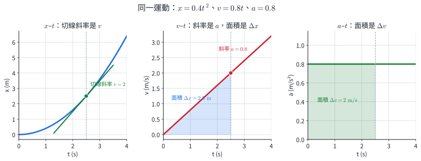{width=96%}

### $x\text{–}t$ 圖

- 縱座標是位置，不是速度，也不是物體在空間中的高度。
- 割線斜率是平均速度；切線斜率是瞬時速度。
- 斜率為正表示往正方向；斜率為負表示往負方向；水平表示靜止。
- 兩物體的 $x\text{–}t$ 圖相交，表示同一時刻位置相同。

### $v\text{–}t$ 圖

- 縱座標直接是速度。
- 斜率 $\Delta v/\Delta t$ 是加速度。
- 一小段內 $\Delta x\approx v\Delta t$；把所有小段相加，圖與時間軸間的**帶號面積**就是位移。
- 圖在時間軸上方的面積為正，下方為負；求路徑長時才把各塊面積的量值相加。

### $a\text{–}t$ 圖

- 縱座標直接是加速度；圖在時間軸上、下方分別表示正、負方向的加速度。
- 一小段內 $\Delta v\approx a\Delta t$；把所有小段相加，圖與時間軸間的**帶號面積**就是速度變化 $\Delta v$。
- 面積給的是 $v_f-v_i$，不是末速度；還要加回初速度，才有 $v_f=v_i+\Delta v$。

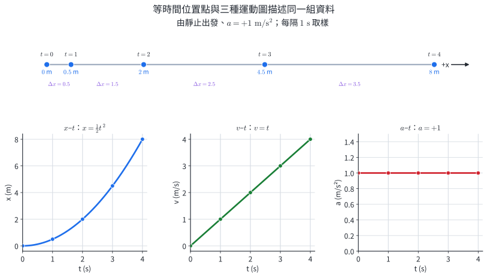{width=96%}

::: self-check
### 練習｜由 $a\text{–}t$ 圖找末速度

1. 物體初速為 $-3\ \mathrm{m/s}$；接著 4 秒內 $a=+2\ \mathrm{m/s^2}$。求 $\Delta v$ 與末速度。
2. $x\text{–}t$ 圖為水平線，物體的 $v$ 為何？
3. $v\text{–}t$ 圖為位於時間軸下方的水平線 $v=-4\ \mathrm{m/s}$。3 秒內位移是多少？
4. $a\text{–}t$ 圖的帶號面積為 $-6\ \mathrm{m/s}$，初速 $+2\ \mathrm{m/s}$。求末速度。

**答案：**1. $\Delta v=+8\ \mathrm{m/s}$，$v_f=+5\ \mathrm{m/s}$。2. $v=0$。3. $\Delta x=(-4)(3)=-12\ \mathrm m$。4. $v_f=2+(-6)=-4\ \mathrm{m/s}$。
:::

::: worked-example
### 完整示範｜由分段 $v\text{–}t$ 資料重建旅程

車輛由靜止在 4 秒內等加速至 $12\ \mathrm{m/s}$，接著維持 6 秒，再在 3 秒內等減速至 0。

- 加速段位移：$\tfrac12(4)(12)=24\ \mathrm{m}$。
- 等速段位移：$(6)(12)=72\ \mathrm{m}$。
- 減速段位移：$\tfrac12(3)(12)=18\ \mathrm{m}$。

總位移為 $114\ \mathrm{m}$。全程速度皆非負，所以路徑長也為 $114\ \mathrm{m}$。
:::

::: worked-example
### 完整示範｜用兩條 $x\text{–}t$ 直線找相遇

甲、乙的位置分別為

$$
x_A=5+3t,\qquad x_B=29-t,
$$

單位採 SI。兩式在 $x\text{–}t$ 圖上都是直線；斜率給出 $v_A=+3\ \mathrm{m/s}$、$v_B=-1\ \mathrm{m/s}$。相遇時同一時刻位置相同：

$$
5+3t=29-t\quad\Rightarrow\quad t=6.0\ \mathrm s.
$$

代回得 $x=23\ \mathrm m$。圖上兩線的交點 $(6,23)$ 同時提供相遇時刻與位置；線的斜率則指出兩物體的運動方向。
:::

::: self-check
### 練習

1. $v\text{–}t$ 圖從 $v=+6\ \mathrm{m/s}$ 線性降到 $v=-6\ \mathrm{m/s}$，共 4 秒。求淨位移與路徑長。
2. $v\text{–}t$ 圖在 5 秒內由 $2$ 線性升到 $12\ \mathrm{m/s}$。求加速度與位移。
3. 兩條 $x\text{–}t$ 曲線在 $t=4\ \mathrm s$ 相交。這能直接推出兩物體速度也相同嗎？
4. 某 $x\text{–}t$ 曲線愈來愈陡且斜率保持正值。速度的方向與量值如何改變？

**答案：**1. 淨位移 0，路徑長 $12\ \mathrm m$。2. $a=(12-2)/5=2.0\ \mathrm{m/s^2}$；位移是梯形面積 $\tfrac12(2+12)(5)=35\ \mathrm m$。3. 只能推出該時刻位置相同；速度要比較兩曲線在交點的切線斜率。4. 向正方向運動，且速率增加。
:::

## 4. 等加速度運動：由直線圖推出四條關係

以下只適用於**直線運動且加速度 $a$ 在所考慮時間內為定值**。令 $t=0$ 時速度為 $v_0$，經時間 $t$ 後速度為 $v$、位移為 $\Delta x$。

由 $v\text{–}t$ 直線斜率：

$$
\boxed{v=v_0+at}.
$$

由圖下面積，先寫成梯形：

$$
\boxed{\Delta x=\frac{v_0+v}{2}t}.
$$

把 $v=v_0+at$ 代入：

$$
\boxed{\Delta x=v_0t+\frac12at^2}.
$$

再消去時間：

$$
\boxed{v^2=v_0^2+2a\Delta x}.
$$

四式都是同一條 $v\text{–}t$ 直線的不同讀法。選式時找題目未給且答案不需要的量：沒有時間就選最後一式。

::: worked-example
### 完整示範｜煞車距離與速率平方成正比

車以 $v_0=20\ \mathrm{m/s}$ 前進，煞車期間加速度為 $a=-5.0\ \mathrm{m/s^2}$。煞停時 $v=0$：

$$
0=20^2+2(-5.0)\Delta x
\quad\Rightarrow\quad
\Delta x=40\ \mathrm{m}.
$$

若相同煞車能力下初速加倍為 $40\ \mathrm{m/s}$，煞車距離變為 $160\ \mathrm{m}$，是 4 倍。
:::

::: worked-example
### 完整示範｜由位移與時間反求加速度

小車以 $v_0=2.0\ \mathrm{m/s}$ 通過原點，之後作等加速度運動，5.0 秒內位移 $35\ \mathrm m$。由

$$
\Delta x=v_0t+\frac12at^2
$$

得到

$$
35=(2.0)(5.0)+\frac12a(5.0)^2,
$$

$$
a=2.0\ \mathrm{m/s^2}.
$$

末速為

$$
v=v_0+at=2.0+(2.0)(5.0)=12\ \mathrm{m/s}.
$$

以梯形面積檢查：$\tfrac12(2.0+12)(5.0)=35\ \mathrm m$，與題給位移一致。
:::

::: why
### 速率平方放大煞車距離

固定最大減速度時，$0=v_0^2+2a\Delta x$ 給出 $\Delta x\propto v_0^2$。因此速率增加 20%，純煞車距離約增加到 $1.2^2=1.44$ 倍。實際停車距離還包括駕駛或系統辨識危險的反應時間，期間車輛又前進約 $v_0t_r$。速限、車距與自動緊急煞車系統都須估計這兩段距離。
:::

::: pitfall
### 適用範圍｜煞車模型止於停車時刻

若煞車只負責讓車減速到靜止，模型適用至停止時刻；之後車保持靜止。加速度隨速度顯著改變的空氣阻力運動，也超出本節定加速度四式的適用範圍。
:::

::: self-check
### 練習

1. 等加速度運動中，何時有 $\bar v=(v_0+v)/2$？
2. 物體由靜止以 $3.0\ \mathrm{m/s^2}$ 等加速 4.0 秒，求末速與位移。
3. $v_0=10\ \mathrm{m/s}$、$a=-2.0\ \mathrm{m/s^2}$，求停止時間與停止前位移。
4. 等加速度題沒有給時間，且要由 $v_0,v,a$ 求位移，應選哪一式？
5. 某阻力使加速度隨速度顯著改變，能否直接把全程代入四條定加速度式？

**答案：**1. 加速度在所考慮時間內為定值時。2. $v=12\ \mathrm{m/s}$，$\Delta x=24\ \mathrm m$。3. $t=5.0\ \mathrm s$，$\Delta x=25\ \mathrm m$。4. $v^2=v_0^2+2a\Delta x$。5. 不適用；須依實際 $a(t)$ 或受力模型分段、積分或以數值方式處理。
:::

## 5. 自由落體與鉛直上拋：全程只有一個向下的 $g$

**自由落體**指只受重力、忽略空氣阻力的運動。近地表小範圍內，重力加速度大小近似固定：

$$
g\approx9.8\ \mathrm{m/s^2}
$$

方向鉛直向下。取向上為正時，整段運動一律使用 $a=-g$；取向下為正時則使用 $a=+g$，最高點也沿用同一正方向。

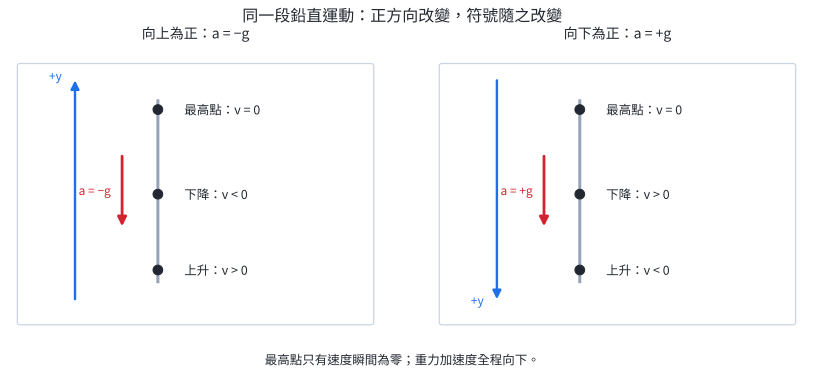{width=96%}

### 真空自由落體加速度與落體質量無關

地球對物體的重力與物體質量 $m$ 成正比，而牛頓第二定律中抵抗加速的慣性也與 $m$ 成正比；兩者相除後，$m$ 消去，所以在同一地點、忽略空氣阻力時，加速度相同。羽毛在空氣中較慢源自形狀與空氣阻力。

### 鉛直上拋的三個可靠結論

由初速 $v_0$ 向上拋出並回到同一高度，忽略空氣阻力：

$$
t_{\uparrow}=\frac{v_0}{g},
\qquad
H=\frac{v_0^2}{2g},
\qquad
t_{\text{來回}}=\frac{2v_0}{g}.
$$

回到同一高度時，速率相同、方向相反。最高點 $v=0$，但 $a=-g$。

::: worked-example
### 完整示範｜由靜止落下的高度與末速

小球由靜止落下 $20.0\ \mathrm m$，忽略空氣阻力。取向下為正，$v_0=0$、$a=+9.8\ \mathrm{m/s^2}$：

$$
v^2=v_0^2+2a\Delta y=2(9.8)(20.0),
$$

$$
v=19.8\ \mathrm{m/s}.
$$

落下時間可由 $v=gt$ 求得 $t=19.8/9.8=2.02\ \mathrm s$。圖與列式使用同一個向下正方向，因此 $v,a,\Delta y$ 都取正值。
:::

::: worked-example
### 完整示範｜鉛直上拋在同一高度有兩個時刻

球由地面以 $v_0=30.0\ \mathrm{m/s}$ 向上拋，取向上為正。求它位於地面上方 $25.0\ \mathrm m$ 的時刻：

$$
25.0=30.0t-\frac12(9.8)t^2.
$$

整理為 $4.9t^2-30.0t+25.0=0$，解得

$$
t=1.00\ \mathrm s\quad\text{或}\quad5.12\ \mathrm s.
$$

速度分別為

$$
v(1.00)=+20.2\ \mathrm{m/s},\qquad
v(5.12)=-20.2\ \mathrm{m/s}.
$$

較早時刻在上升，較晚時刻在下降；忽略阻力時，同一高度的速率相同、方向相反。
:::

::: why
### 光電閘降低反應時間對 $g$ 測量的影響

自由落體在短距離內近似等加速度，所以位置資料應符合 $y=y_0+v_0t+\tfrac12gt^2$；多組時間與位置資料可用來反推 $g$。光電閘以小球通過閘門定義起止時刻，降低人的反應時間變異。釋放方式、閘門位置、時間解析度與空氣阻力仍會影響結果，因此測量須重複並報告不確定度。
:::

::: self-check
### 練習

1. 球以 $19.6\ \mathrm{m/s}$ 向上拋。忽略阻力，最高點時間、最大高度與最高點加速度為何？
2. 小球由靜止自由落下 1.5 秒，求落下位移與末速，取 $g=9.8\ \mathrm{m/s^2}$。
3. 鉛直上拋在最高點的速度與加速度各為何？
4. 忽略阻力，兩球質量不同但在同地點同時由靜止釋放。它們的加速度與落地時刻如何比較？
5. 羽毛與鋼球在空氣中落下速度不同，這是否否定真空自由落體模型？

**答案：**1. $t=2.0\ \mathrm s$，$H=19.6\ \mathrm m$，加速度仍為 $9.8\ \mathrm{m/s^2}$ 向下。2. $\Delta y=11.0\ \mathrm m$、$v=14.7\ \mathrm{m/s}$ 向下。3. $v=0$，$a=g$ 向下。4. 忽略阻力且起始條件相同時，加速度相同並同時落地。5. 不否定；空氣阻力已超出「只受重力」的模型條件。
:::

## 6. 一維相對速度：把觀察者的速度扣掉

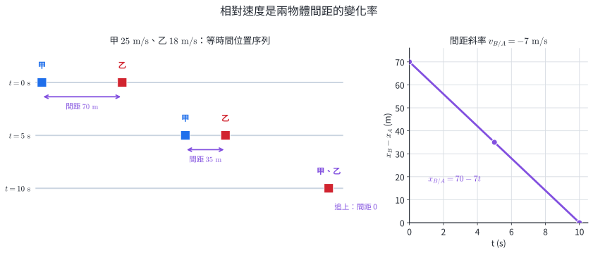{width=96%}

設 A、B 對地位置分別為 $x_A,x_B$。B 相對 A 的位置是

$$
x_{B/A}=x_B-x_A.
$$

比較相同時間內的位置變化，就得到本冊的一維相對速度：

$$
\boxed{v_{B/A}=v_B-v_A}.
$$

先定正方向並帶入有正負的速度，同一式即可處理同向與反向運動。

圖 4 左側以相同時刻比較兩車位置，右側把間距寫成 $x_{B/A}=70-7t$；間距降到 0 的時刻就是追上時刻。

::: worked-example
### 完整示範｜追車與迎面接近

取向東為正。甲車向東 $25\ \mathrm{m/s}$，乙車在甲前方也向東 $18\ \mathrm{m/s}$：

$$
v_{\text{甲/乙}}=25-18=+7\ \mathrm{m/s}.
$$

甲以每秒 $7\ \mathrm{m}$ 縮短距離。若乙改為向西 $18\ \mathrm{m/s}$，則 $v_\text{乙}=-18\ \mathrm{m/s}$，兩車間距每秒縮短 $25-(-18)=43\ \mathrm{m}$。
:::

::: worked-example
### 完整示範｜用相對位置函數求追上時刻

取向東為正。前車初位置 $x_F(0)=120\ \mathrm m$、速度 $18\ \mathrm{m/s}$；後車從原點以 $26\ \mathrm{m/s}$ 前進。前車相對後車的位置為

$$
x_{F/R}=x_F-x_R=120+(18-26)t=120-8t.
$$

追上時 $x_{F/R}=0$：

$$
t=\frac{120}{8}=15\ \mathrm s.
$$

相遇位置為 $x_R=(26)(15)=390\ \mathrm m$。相對位置的斜率 $-8\ \mathrm{m/s}$ 直接表示間距每秒縮短 $8\ \mathrm m$。
:::

::: why
### 相對速度決定追撞預警時間

碰撞風險取決於兩車距離縮短的速率，也就是相對速度。系統以目前距離除以接近速率，估計「若速度不變，多久後碰上」的時間尺度。兩車可能煞車或加速，感測距離也有不確定度，因此控制器會持續更新估計。
:::

::: scope-note
### 適用範圍／延伸

現行本冊核心是一維相對速度。不同方向的渡河與側風修正屬二維向量問題；相對加速度與非慣性參考系列為後續延伸，代表題不展開。
:::

::: self-check
### 練習

1. 火車向東 $20\ \mathrm{m/s}$，人在車內向西相對車廂走 $1.5\ \mathrm{m/s}$。人對地速度為何？
2. 甲向東 $12\ \mathrm{m/s}$，乙向西 $8\ \mathrm{m/s}$。取東為正，求 $v_{\text{乙/甲}}$ 與接近速率。
3. 同向兩車速率分別為 $30$ 與 $24\ \mathrm{m/s}$，後車在前車後方 $90\ \mathrm m$。若速度不變，多久追上？
4. 兩車相對速度為 0，代表它們都靜止嗎？
5. 用「目前距離／目前接近速率」估碰撞時間時，成立條件是什麼？

**答案：**1. $+18.5\ \mathrm{m/s}$，向東。2. $v_{\text{乙/甲}}=-8-12=-20\ \mathrm{m/s}$，接近速率 $20\ \mathrm{m/s}$。3. 相對速率 $6\ \mathrm{m/s}$，故 15 秒追上。4. 不代表；它們可用相同速度共同運動，使間距固定。5. 所考慮時間內相對速度近似不變，且兩者沿同一直線接近。
:::

## 實驗 1A｜斜面臺車的紙帶與運動圖

實驗以斜面臺車、打點計時器與長紙帶記錄等時間位置，依序建立 $x\text{–}t$、$v\text{–}t$、$a\text{–}t$ 圖，檢查臺車是否近似等加速度運動。

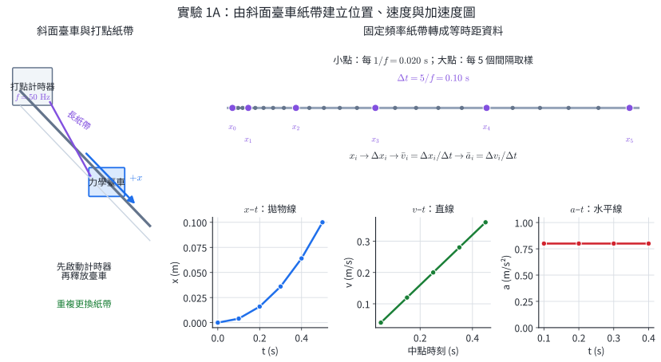{width=96%}

### 裝置、頻率與取樣時間

打點頻率為 $f$（次／秒）時，相鄰兩個打點的時間間隔為

$$
\delta t=\frac1f.
$$

若每隔 $n$ 個打點間隔取一個位置，資料的取樣時間為

$$
\boxed{\Delta t=\frac n f}.
$$

例如 $f=50\ \mathrm{Hz}$、每隔 5 個打點間隔取樣，則 $\Delta t=5/50=0.10\ \mathrm s$。使用數個間隔能放大位移差，降低尺讀值解析度的相對影響；仍須保留足夠資料點描述圖形。

### 正式操作與資料鏈

1. 調整斜面角度，讓臺車能沿軌道順暢下滑。紙帶穿過打點計時器並連接臺車尾端。
2. 記錄打點頻率。先啟動計時器，再釋放臺車，使紙帶留下固定時距的點列。
3. 在清楚點列中選一點為原點。每隔固定的 $n$ 個打點間隔量一次由原點起算的位置 $x_i$，令 $t_i=i\Delta t$，作 $x\text{–}t$ 圖。
4. 計算各區間位移 $\Delta x_i=x_i-x_{i-1}$ 與區間平均速度

$$
\bar v_i=\frac{\Delta x_i}{\Delta t}.
$$

速度屬於一段時間，作圖時配置在該區間的中點時刻 $(t_{i-1}+t_i)/2$，再作 $v\text{–}t$ 圖。
5. 由相鄰平均速度求

$$
\bar a_i=\frac{\bar v_{i+1}-\bar v_i}{\Delta t},
$$

並作 $a\text{–}t$ 圖。等加速度模型預測：$x\text{–}t$ 近似拋物線、$v\text{–}t$ 近似直線、$a\text{–}t$ 近似水平線。
6. 更換紙帶並重複量測。比較各次圖線的斜率、散布與異常點，不能只用單一紙帶判定模型。

### 相鄰等時距位移差為定值

令 $t_i=i\Delta t$，等加速度位置為

$$
x_i=x_0+v_0i\Delta t+\frac12a(i\Delta t)^2.
$$

第 $i$ 個時間區間的位移

$$
\Delta x_i=x_i-x_{i-1}
=v_0\Delta t+a\left(i-\frac12\right)(\Delta t)^2.
$$

相鄰兩區間相減：

$$
\boxed{\Delta x_{i+1}-\Delta x_i=a(\Delta t)^2}.
$$

因此固定 $\Delta t$ 下，等加速度運動的相鄰位移差應近似固定；這也是不先微分就能由紙帶檢查等加速度的方法。

::: worked-example
### 完整示範｜由打點頻率求區間速度

計時器頻率 $50\ \mathrm{Hz}$，每隔 5 個打點間隔取樣。某兩個相鄰取樣位置為 $x_2=0.028\ \mathrm m$、$x_3=0.052\ \mathrm m$。

$$
\Delta t=\frac5{50}=0.10\ \mathrm s,
$$

$$
\Delta x_3=0.052-0.028=0.024\ \mathrm m,
$$

$$
\bar v_3=\frac{0.024}{0.10}=0.24\ \mathrm{m/s}.
$$

若此區間由 $t=0.20$ 到 $0.30\ \mathrm s$，速度點應畫在中點 $t=0.25\ \mathrm s$。
:::

::: worked-example
### 完整示範｜由相鄰位移差估計加速度

$\Delta t=0.10\ \mathrm s$，連續區間位移為

$$
0.012,\ 0.020,\ 0.028,\ 0.036\ \mathrm m.
$$

相鄰位移差皆為 $0.008\ \mathrm m$，因此

$$
a=\frac{\Delta x_{i+1}-\Delta x_i}{(\Delta t)^2}
=\frac{0.008}{(0.10)^2}
=0.80\ \mathrm{m/s^2}.
$$

同一資料的區間平均速度依序為 $0.12,0.20,0.28,0.36\ \mathrm{m/s}$；相鄰速度差 $0.08\ \mathrm{m/s}$ 除以 $0.10\ \mathrm s$，也得到 $0.80\ \mathrm{m/s^2}$。
:::

### 實驗後資料分析｜中央差分與線性擬合

完成教材規定的紙帶與三張圖後，可再用中央差分把位置資料轉成中間時刻速度：

$$
v_i\approx\frac{x_{i+1}-x_{i-1}}{2\Delta t}.
$$

對全部 $(t_i,v_i)$ 作線性擬合，斜率估計 $a$、截距估計 $v_0$；殘差的系統性彎曲可指出摩擦改變、紙帶拉力或斜面不平。這是實驗後的資料處理方法，不取代原始紙帶、頻率、取樣規則與重複試次。

::: self-check
### 實驗資料練習

1. 打點頻率 $60\ \mathrm{Hz}$，每隔 6 個打點間隔取樣，求 $\Delta t$。
2. $\Delta t=0.10\ \mathrm s$，相鄰位置為 $0.044$ 與 $0.075\ \mathrm m$，求該區間平均速度，並說明速度點的時間位置。
3. 連續區間位移為 $0.015,0.024,0.033,0.042\ \mathrm m$。判斷是否支持等加速度，並估計 $a$；取 $\Delta t=0.10\ \mathrm s$。
4. $x\text{–}t$ 近似拋物線、$v\text{–}t$ 近似直線，但 $a\text{–}t$ 點較散。這三項是否互相矛盾？
5. 為何需更換紙帶重複實驗？

**答案：**1. $\Delta t=6/60=0.10\ \mathrm s$。2. $\bar v=(0.075-0.044)/0.10=0.31\ \mathrm{m/s}$，畫在該區間中點時刻。3. 相鄰位移差皆為 $0.009\ \mathrm m$，支持等加速度；$a=0.009/(0.10)^2=0.90\ \mathrm{m/s^2}$。4. 不矛盾；加速度需對速度再作一次差分，位置讀值雜訊會被放大，因此散布通常較大。5. 重複試次可評估釋放差異、紙帶摩擦與讀值散布，避免由單次異常資料下結論。
:::

## 實驗 1B｜固定第一光電閘測量自由落體 $g$

第一光電閘固定後，小球每次通過它時開始計時。第二光電閘先後放在兩個較低位置，分別量得由第一閘到第二閘的距離與飛行時間。兩次量測共用同一個第一閘，因此小球通過第一閘的速度可用同一個未知量 $v_0$ 表示並消去。

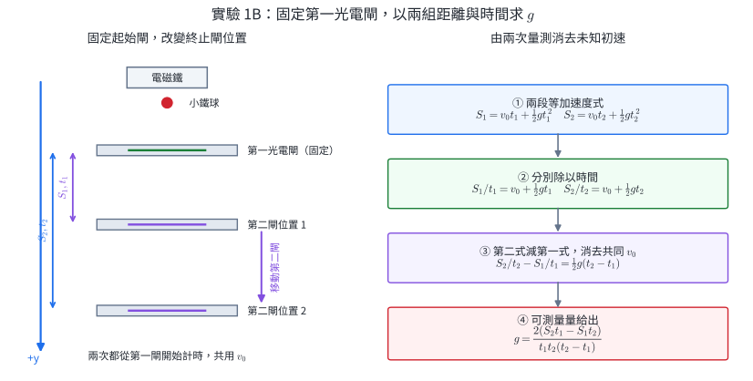{width=96%}

### 量測流程與公式推導

1. 以電磁鐵固定小鐵球，第一光電閘放在球下方並保持位置不變。
2. 第二光電閘放在第一位置，量兩閘距離 $S_1$；切斷電磁鐵電源，記錄球從第一閘到第二閘的時間 $t_1$。
3. 保持第一閘固定，把第二閘移到更低位置，量得 $S_2$，重複釋放並記錄 $t_2$。
4. 每一組位置重複數次，使用平均時間並保留散布；再代入公式求 $g$。

取向下為正。小球通過第一閘時速度為共同的 $v_0$：

$$
S_1=v_0t_1+\frac12gt_1^2,
$$

$$
S_2=v_0t_2+\frac12gt_2^2.
$$

兩式分別除以 $t_1,t_2$：

$$
\frac{S_1}{t_1}=v_0+\frac12gt_1,
\qquad
\frac{S_2}{t_2}=v_0+\frac12gt_2.
$$

第二式減第一式，消去 $v_0$：

$$
\frac{S_2}{t_2}-\frac{S_1}{t_1}
=\frac12g(t_2-t_1).
$$

因此

$$
\boxed{
g=\frac{2(S_2t_1-S_1t_2)}{t_1t_2(t_2-t_1)}
}.
$$

第一閘在同一組 $(S_1,t_1)$、$(S_2,t_2)$ 量測中保持固定，才能讓兩式的 $v_0$ 代表同一參考位置的速度。

::: worked-example
### 完整示範｜由兩組距離與時間求 $g$

固定第一閘，量得

$$
S_1=0.400\ \mathrm m,\quad t_1=0.200\ \mathrm s,
$$

$$
S_2=1.200\ \mathrm m,\quad t_2=0.400\ \mathrm s.
$$

代入：

$$
g=\frac{2[(1.200)(0.200)-(0.400)(0.400)]}
{(0.200)(0.400)(0.400-0.200)}
=10.0\ \mathrm{m/s^2}.
$$

回代第一式可得 $v_0=1.00\ \mathrm{m/s}$；回代第二式也得到同值，形成內部檢查。
:::

::: worked-example
### 完整示範｜重複試次後報告平均結果

三組重新定位並重複量測得到

$$
g_1=9.72,\quad g_2=9.86,\quad g_3=9.80\ \mathrm{m/s^2}.
$$

平均值

$$
\bar g=\frac{9.72+9.86+9.80}{3}=9.79\ \mathrm{m/s^2}.
$$

數值散布反映釋放、閘門位置與計時差異。完整報告仍須結合尺與計時器的解析度評估不確定度，再與當地參考值比較。
:::

### 實驗後資料分析｜紙帶速度與 $v\text{–}t$ 擬合

114 教材也提供打點計時器方法：先記錄頻率，讓附有重物的紙帶自由落下，重複取得紙帶；每隔固定打點間隔量位置，算區間平均速度並作 $v\text{–}t$ 圖，其斜率估計 $g$。若設備另能量得多個局部速度，也可對全部速度—時間點作線性擬合。這些多點方法能顯示離群點與非線性，屬完成正式裝置量測後的資料分析。

主要不確定度來源包括 $S_1,S_2$ 的閘門位置、$t_1,t_2$ 的計時解析度、電磁鐵釋放的一致性、第一閘是否移動與空氣阻力。球的體積小、密度高且落下距離適中，可降低空氣阻力相對於重力的影響。

::: self-check
### 實驗資料練習

1. 為何同一組 $S_1,S_2$ 量測中第一光電閘要保持固定？
2. $S_1=0.30\ \mathrm m,t_1=0.20\ \mathrm s,S_2=0.80\ \mathrm m,t_2=0.40\ \mathrm s$，用公式求 $g$。
3. 把兩式各除以時間後，哪一項能在相減時消去？
4. 每個第二閘位置重複量三次的主要目的為何？
5. 打點頻率為 $50\ \mathrm{Hz}$，每隔 5 個打點間隔算一個平均速度，速度點應配置在哪個時刻？

**答案：**1. 固定第一閘使兩次計時都從同一位置開始，通過第一閘的 $v_0$ 才是共同未知量。2. $g=2[(0.80)(0.20)-(0.30)(0.40)]/[(0.20)(0.40)(0.20)]=5.0\ \mathrm{m/s^2}$；此結果明顯低於近地表參考值，應檢查資料或裝置。3. 共同的 $v_0$。4. 評估隨機散布並降低單次釋放或計時變異。5. $\Delta t=0.10\ \mathrm s$，每個區間平均速度配置在該區間中點。
:::

## 7. 一頁核心整理

::: summary-box
### 描述量

$$
\Delta x=x_f-x_i,
\qquad
\bar v=\frac{\Delta x}{\Delta t},
\qquad
\bar a=\frac{\Delta v}{\Delta t}.
$$

- 位移只看頭尾；路徑長累計實際路線。
- $x\text{–}t$ 斜率是速度；$v\text{–}t$ 斜率是加速度、帶號面積是位移；$a\text{–}t$ 帶號面積是 $\Delta v$。
- $v$、$a$ 同向變快，反向變慢。

### 等加速度（$a$ 為定值）

$$
v=v_0+at,
\quad
\Delta x=\frac{v_0+v}{2}t,
\quad
\Delta x=v_0t+\frac12at^2,
\quad
v^2=v_0^2+2a\Delta x.
$$

### 特例

- 自由落體：忽略阻力、近地表時 $|a|=g$，方向向下。
- 一維相對速度：$v_{B/A}=v_B-v_A$。
- 斜面實驗：由打點頻率決定 $\Delta t$，依紙帶建立 $x\text{–}t$、$v\text{–}t$、$a\text{–}t$ 圖；等加速度時相鄰等時距位移差固定。
- 自由落體實驗：固定第一光電閘、移動第二光電閘，以 $(S_1,t_1)$、$(S_2,t_2)$ 消去共同的 $v_0$ 並求 $g$。
:::

## 8. 分層練習

### 題目 1｜基礎：位移與路徑長

某人由 $x=-2\ \mathrm{m}$ 走到 $x=5\ \mathrm{m}$，再走到 $x=1\ \mathrm{m}$，共花 11 秒。求位移、路徑長、平均速度與平均速率。

### 題目 2｜基礎：速度與加速度方向

依序判斷下列物體變快或變慢：甲 $v=+6,a=+2$；乙 $v=+6,a=-2$；丙 $v=-6,a=-2$；丁 $v=-6,a=+2$。單位省略。

### 題目 3｜圖像：分段速度資料

一物體速度由 $t=0$ 的 $-4\ \mathrm{m/s}$ 線性增加到 $t=2\ \mathrm{s}$ 的 0，再線性增加到 $t=5\ \mathrm{s}$ 的 $+6\ \mathrm{m/s}$。求兩段加速度、總位移與路徑長；再畫出 $a\text{–}t$ 圖，並用其帶號面積檢查全程速度變化。

### 題目 4｜等加速度：起步

列車由靜止以 $1.2\ \mathrm{m/s^2}$ 等加速 15 秒。求末速與位移。

### 題目 5｜應用：煞車模型

汽車以 $27\ \mathrm{m/s}$ 行駛，煞車後作 $a=-6.0\ \mathrm{m/s^2}$ 的等加速度運動。求煞停時間與純煞車距離。若駕駛反應時間為 $0.80\ \mathrm{s}$ 且反應期間速率不變，總停止距離是多少？

### 題目 6｜自由落體

小球由靜止從高處落下，忽略阻力，取 $g=9.8\ \mathrm{m/s^2}$。若 2.0 秒後落地，求高度與落地速率。

### 題目 7｜鉛直上拋

球以 $24.5\ \mathrm{m/s}$ 向上拋，取向上為正，$g=9.8\ \mathrm{m/s^2}$。求最高點時間、最大高度，以及拋出後 4.0 秒的速度與相對拋出點位移。

### 題目 8｜相對速度與模型判讀

直線公路上，前車向東 $16\ \mathrm{m/s}$，後車向東 $24\ \mathrm{m/s}$，初距 72 m。若兩車速度都維持不變，多久追上？若後車在 3.0 秒後開始減速，還能直接沿用前一答案嗎？說明理由。

### 題目 9｜時刻、時間間隔與質點模型

攝影機在 $t=1.20\ \mathrm s$ 看見列車車頭通過 A 點，在 $t=4.70\ \mathrm s$ 看見車頭通過 B 點，兩點相距 $105\ \mathrm m$。求通過 A 到 B 的時間間隔與車頭平均速度。若要由影片判斷整列車是否已完全通過月臺，還能把列車視為單一質點嗎？

### 題目 10｜位置函數

物體位置為 $x=4-6t+t^2$（SI 制）。求 $t=1.0\ \mathrm s$ 與 $t=4.0\ \mathrm s$ 的位置、這段平均速度，以及兩時刻的瞬時速度。判斷物體何時轉向。

### 題目 11｜由 $v\text{–}t$ 圖算位移與路徑長

物體在 $0$～$3\ \mathrm s$ 以 $v=+4\ \mathrm{m/s}$ 運動；$3$～$5\ \mathrm s$ 速度由 $+4$ 線性降至 $-4\ \mathrm{m/s}$；$5$～$7\ \mathrm s$ 維持 $-4\ \mathrm{m/s}$。求各段加速度、總位移與路徑長。

### 題目 12｜等加速度反求初速

小車作等加速度運動，$a=1.5\ \mathrm{m/s^2}$，在 8.0 秒內位移 $112\ \mathrm m$。求初速與末速。

### 題目 13｜落下與聲音到達前的模型

一顆石頭由靜止落下，2.5 秒後撞地。忽略阻力並取 $g=9.8\ \mathrm{m/s^2}$，求高度與撞地速率。若人在釋放點上方聽到撞擊聲的總時間，是否仍能只用自由落體時間？

### 題目 14｜反向行走的相對速度

長 $180\ \mathrm m$ 的電扶梯以 $1.0\ \mathrm{m/s}$ 向東運轉。甲相對扶梯以 $1.5\ \mathrm{m/s}$ 向東走，乙相對扶梯以 $0.8\ \mathrm{m/s}$ 向西走。求兩人對地速度；若都從西端出發，分別能否到達東端？

### 題目 15｜跨節整合：斜面位置資料

小車每隔 $0.20\ \mathrm s$ 的位置為

| $t$（s） | 0.0 | 0.2 | 0.4 | 0.6 | 0.8 |
|---:|---:|---:|---:|---:|---:|
| $x$（m） | 0.000 | 0.012 | 0.048 | 0.108 | 0.192 |

求四個區間位移與平均速度，指出各速度點應配置的時刻；再用相鄰區間位移差估計加速度。最後用中央差分求 $t=0.2,0.4,0.6\ \mathrm s$ 的速度，確認實驗後分析是否得到相同趨勢。

### 題目 16｜跨節整合：雙光電閘與不確定度判讀

固定第一光電閘後，兩個第二閘位置分別量得

$$
S_1=0.400\ \mathrm m,\quad t_1=0.200\ \mathrm s,
$$

$$
S_2=1.200\ \mathrm m,\quad t_2=0.400\ \mathrm s.
$$

用雙光電閘公式求 $g$，並回代求小球通過第一閘的 $v_0$。另一組多次量測報告為 $g=(9.72\pm0.08)\ \mathrm{m/s^2}$；以涵蓋因子 $k=2$ 判斷它與參考值 $9.81\ \mathrm{m/s^2}$ 是否相容。

### 題目 17｜跨節整合：追車後煞車

前車以 $15\ \mathrm{m/s}$ 等速前進；後車在其後方 $60\ \mathrm m$，初速 $25\ \mathrm{m/s}$。後車維持速度 2.0 秒後，以 $-2.0\ \mathrm{m/s^2}$ 等加速度煞車。分段求兩車是否相撞；若未相撞，求最小間距。

### 題目 18｜跨節整合：從圖像選模型

某小車的 $v\text{–}t$ 散點在前 4 秒近似直線，之後逐漸向下彎。說明：前 4 秒可從圖上取得哪些運動量；為何不宜把同一條等加速度直線外推到後段；還需要哪一種量測或控制，才能判斷彎曲來自阻力增加還是斜面角度改變？

## 9. 完整解析

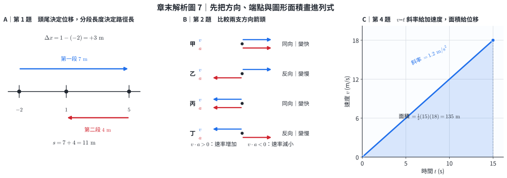{width=100%}

::: solution
### 第 1 題

圖 7A 把兩段路徑 $-2\to5\to1$ 與頭尾位移 $-2\to1$ 分開。位移只看頭尾：

$$
\Delta x=1-(-2)=+3\ \mathrm{m}.
$$

路徑長為 $7+4=11\ \mathrm{m}$。因此

$$
\bar v=\frac3{11}=0.273\ \mathrm{m/s},
\qquad
\text{平均速率}=\frac{11}{11}=1.00\ \mathrm{m/s}.
$$
:::

::: solution
### 第 2 題

圖 7B 中每列藍色速度箭頭與紅色加速度箭頭同向時速率增加、反向時速率減小。甲同向，變快；乙反向，變慢；丙同向，變快；丁反向，變慢。
:::

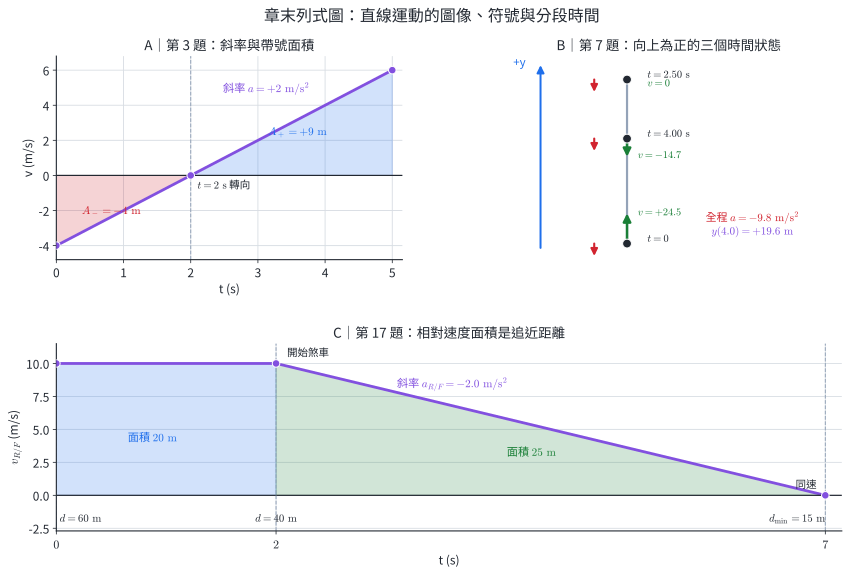{width=100%}

::: solution
### 第 3 題

圖 8A 中速度圖的直線全程斜率相同：

第一段

$$
a_1=\frac{0-(-4)}{2}=+2\ \mathrm{m/s^2};
$$

第二段

$$
a_2=\frac{6-0}{5-2}=+2\ \mathrm{m/s^2}.
$$

$0$～$2\ \mathrm{s}$ 的 $v\text{–}t$ 圖在時間軸下方，帶號面積為 $-\tfrac12(2)(4)=-4\ \mathrm{m}$；$2$～$5\ \mathrm{s}$ 面積為 $+\tfrac12(3)(6)=+9\ \mathrm{m}$。總位移為 $+5\ \mathrm{m}$；路徑長為 $4+9=13\ \mathrm{m}$。

兩段的加速度都為 $+2\ \mathrm{m/s^2}$，所以 $a\text{–}t$ 圖在 $0$～$5\ \mathrm{s}$ 是一條高度為 $+2$ 的水平線。其帶號面積

$$
\Delta v=(+2)(5)=+10\ \mathrm{m/s}
$$

恰好等於 $v_f-v_i=6-(-4)=+10\ \mathrm{m/s}$。
:::

::: solution
### 第 4 題

圖 7C 的直線斜率為 $1.2\ \mathrm{m/s^2}$，終點速度為 $18\ \mathrm{m/s}$；圖下三角形面積就是位移：

$$
v=0+(1.2)(15)=18\ \mathrm{m/s},
$$

$$
\Delta x=\frac12(1.2)(15)^2=135\ \mathrm{m}.
$$
:::

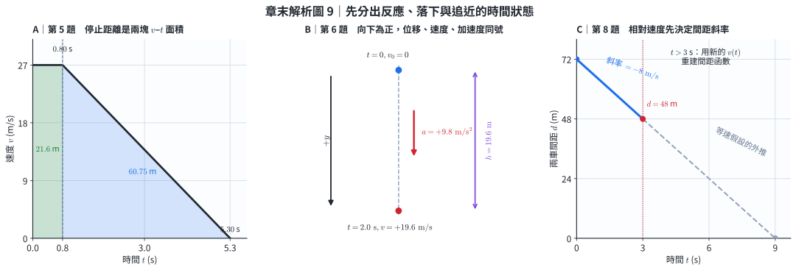{width=100%}

::: solution
### 第 5 題

圖 9A 將總停止距離分成反應期矩形與煞車期三角形。煞停時 $v=0$：

$$
0=27-6.0t\Rightarrow t=4.5\ \mathrm{s}.
$$

$$
0=27^2+2(-6.0)\Delta x
\Rightarrow
\Delta x=60.75\ \mathrm{m}.
$$

反應距離為 $(27)(0.80)=21.6\ \mathrm{m}$，總停止距離約

$$
21.6+60.75=82.35\ \mathrm{m}\approx82\ \mathrm{m}.
$$

這個結果仍建立在反應期間等速、煞車期間等減速度的模型上。
:::

::: solution
### 第 6 題

圖 9B 取向下為正，$a$、位移與落地速度都沿正方向：

$$
h=\frac12gt^2=\frac12(9.8)(2.0)^2=19.6\ \mathrm{m},
$$

$$
v=gt=(9.8)(2.0)=19.6\ \mathrm{m/s}
$$

方向向下。
:::

::: solution
### 第 7 題

圖 8B 固定向上為正，因此全程 $a=-9.8\ \mathrm{m/s^2}$；速度箭頭在上升、最高點與下降三個狀態依序為正、零、負。最高點：

$$
t_{\uparrow}=\frac{24.5}{9.8}=2.50\ \mathrm{s},
\qquad
H=\frac{24.5^2}{2(9.8)}\approx30.6\ \mathrm{m}.
$$

$t=4.0\ \mathrm{s}$ 時

$$
v=24.5-9.8(4.0)=-14.7\ \mathrm{m/s},
$$

表示向下；位移

$$
\Delta y=24.5(4.0)-\frac12(9.8)(4.0)^2
=19.6\ \mathrm{m}.
$$

球已在下降，但仍高於拋出點。
:::

::: solution
### 第 8 題

圖 9C 顯示前三秒間距函數斜率為 $-8\ \mathrm{m/s}$，到 $t=3.0\ \mathrm s$ 時間距已由 $72\ \mathrm m$ 減為 $48\ \mathrm m$。後車相對前車的速度為

$$
v_{\text{後/前}}=24-16=8\ \mathrm{m/s}.
$$

若速度都不變，追上時間為 $72/8=9.0\ \mathrm{s}$。後車 3.0 秒後減速時，從圖中的紅點 $(3,48)$ 接續新的速度時間關係，重建後段間距函數。
:::

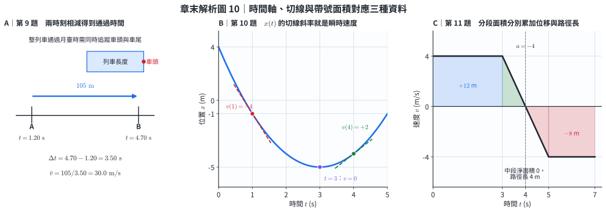{width=100%}

::: solution
### 第 9 題

圖 10A 將 A、B 兩個事件標在同一時間序列；兩時刻相減得到車頭通過兩點的時間間隔：

$$
\Delta t=4.70-1.20=3.50\ \mathrm s,
$$

$$
\bar v=\frac{105}{3.50}=30.0\ \mathrm{m/s}
$$

方向由 A 指向 B。圖中的車頭、車尾分屬不同位置；判斷整列車是否通過月臺需要保留列車長度。
:::

::: solution
### 第 10 題

圖 10B 由 $x(t)=4-6t+t^2$ 畫出位置曲線；$t=1.0\ \mathrm s$ 與 $4.0\ \mathrm s$ 的切線斜率分別為負、正，最低點 $t=3.0\ \mathrm s$ 的斜率為 0。

$$
x(1)=4-6+1=-1\ \mathrm m,
$$

$$
x(4)=4-24+16=-4\ \mathrm m.
$$

$$
\bar v=\frac{-4-(-1)}{4-1}=-1.0\ \mathrm{m/s}.
$$

瞬時速度

$$
v=\frac{dx}{dt}=-6+2t.
$$

故 $v(1)=-4\ \mathrm{m/s}$、$v(4)=+2\ \mathrm{m/s}$。令 $v=0$ 得 $t=3.0\ \mathrm s$，物體在此轉向。
:::

::: solution
### 第 11 題

圖 10C 將時間軸上方、下方的面積分色。$0$～$3\ \mathrm s$：$a=0$，位移 $+12\ \mathrm m$。$3$～$5\ \mathrm s$：

$$
a=\frac{-4-4}{2}=-4\ \mathrm{m/s^2}.
$$

中段正、負三角形面積互相抵銷，淨位移 0；兩塊面積量值相加為 $2\times\tfrac12(1)(4)=4\ \mathrm m$。$5$～$7\ \mathrm s$：$a=0$，位移 $-8\ \mathrm m$、路徑長 $8\ \mathrm m$。

所以總位移 $12+0-8=+4\ \mathrm m$，總路徑長 $12+4+8=24\ \mathrm m$。
:::

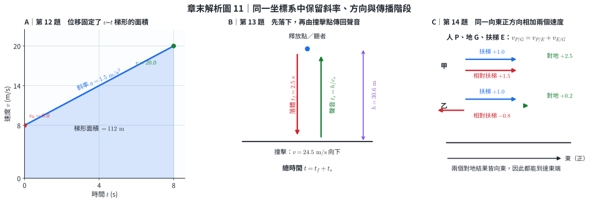{width=100%}

::: solution
### 第 12 題

圖 11A 的梯形面積為 $112\ \mathrm m$，斜率為 $1.5\ \mathrm{m/s^2}$。由

$$
112=v_0(8.0)+\frac12(1.5)(8.0)^2
$$

得 $112=8v_0+48$，所以 $v_0=8.0\ \mathrm{m/s}$。末速

$$
v=v_0+at=8.0+(1.5)(8.0)=20.0\ \mathrm{m/s}.
$$

以平均速度檢查：$\tfrac12(8.0+20.0)(8.0)=112\ \mathrm m$。
:::

::: solution
### 第 13 題

圖 11B 把石頭落下與聲音向上傳回分成兩段。先取向下為正求落體高度與撞地速度：

$$
h=\frac12gt^2=\frac12(9.8)(2.5)^2=30.6\ \mathrm m,
$$

$$
v=gt=(9.8)(2.5)=24.5\ \mathrm{m/s}
$$

向下。聲音由地面傳回釋放點所需時間為 $h/v_\text{聲}$，所以聽見撞擊聲的總時間為 $2.5+h/v_\text{聲}$。
:::

::: solution
### 第 14 題

圖 11C 取向東為正，藍色箭頭為扶梯對地速度，紅色箭頭為人相對扶梯速度；同一列的兩箭頭相加得到綠色對地速度：

$$
v_{\text{甲/地}}=+1.5+1.0=+2.5\ \mathrm{m/s},
$$

$$
v_{\text{乙/地}}=-0.8+1.0=+0.2\ \mathrm{m/s}.
$$

兩人對地速度都向東，因此都能到東端。所需時間分別為 $180/2.5=72\ \mathrm s$ 與 $180/0.2=900\ \mathrm s$。
:::

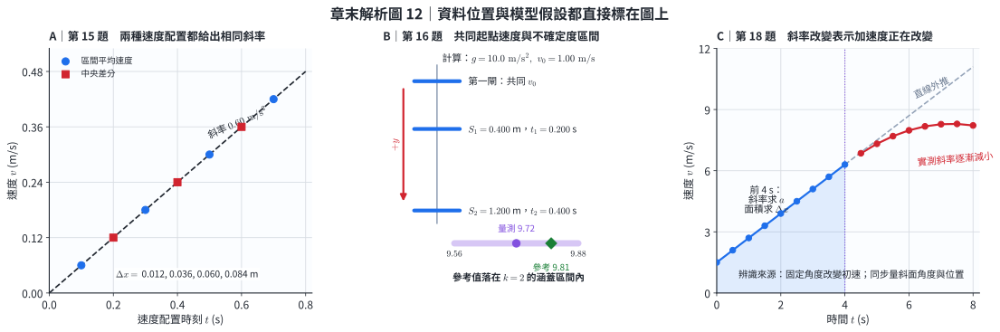{width=100%}

::: solution
### 第 15 題

圖 12A 將區間平均速度配置在各區間中點，中央差分速度配置在原資料的中間時刻；兩組點都落在斜率約 $0.60\ \mathrm{m/s^2}$ 的直線上。四個區間位移為

$$
0.012,\ 0.036,\ 0.060,\ 0.084\ \mathrm m.
$$

除以 $\Delta t=0.20\ \mathrm s$，區間平均速度為

$$
0.06,\ 0.18,\ 0.30,\ 0.42\ \mathrm{m/s},
$$

分別畫在 $t=0.10,0.30,0.50,0.70\ \mathrm s$。相鄰區間位移差皆為 $0.024\ \mathrm m$，所以

$$
a=\frac{0.024}{(0.20)^2}=0.60\ \mathrm{m/s^2}.
$$

實驗後以中央差分得到

$$
v(0.2)=\frac{0.048-0.000}{0.40}=0.12\ \mathrm{m/s},
$$

$$
v(0.4)=\frac{0.108-0.012}{0.40}=0.24\ \mathrm{m/s},
$$

$$
v(0.6)=\frac{0.192-0.048}{0.40}=0.36\ \mathrm{m/s}.
$$

兩組速度資料與圖 12A 的同一直線趨勢一致。
:::

::: solution
### 第 16 題

圖 12B 顯示第一光電閘固定，所以兩條位移式共用同一個 $v_0$。先代入雙光電閘公式：

$$
g=\frac{2[(1.200)(0.200)-(0.400)(0.400)]}
{(0.200)(0.400)(0.400-0.200)}
=10.0\ \mathrm{m/s^2}.
$$

回代 $S_1=v_0t_1+\tfrac12gt_1^2$：

$$
0.400=(0.200)v_0+\frac12(10.0)(0.200)^2,
$$

所以 $v_0=1.00\ \mathrm{m/s}$。

另一組結果與參考值的差為 $9.81-9.72=0.09\ \mathrm{m/s^2}$，約為 $0.09/0.08=1.13$ 個標準不確定度。採 $k=2$ 時，擴展不確定度為

$$
U=2(0.08)=0.16\ \mathrm{m/s^2},
$$

對應範圍 $9.56$～$9.88\ \mathrm{m/s^2}$；圖 12B 的參考值 $9.81\ \mathrm{m/s^2}$ 位於此區間內，因此兩者相容。
:::

::: solution
### 第 17 題

圖 8C 將追車過程分成 $0$ ～ $2.0\ \mathrm s$ 等相對速度與開始煞車後的等相對加速度兩段。圖下面積是間距的縮短量。

前 2.0 秒後車相對前車的速度為 $25-15=10\ \mathrm{m/s}$，間距由 60 m 縮為

$$
d=60-(10)(2.0)=40\ \mathrm m.
$$

開始煞車後令時間為 $\tau$。相對速度

$$
v_{R/F}=10-2\tau.
$$

在 $\tau=5.0\ \mathrm s$ 降到 0，此時兩車速度相同，間距最小。這段縮短量是相對速度—時間三角形面積：

$$
\Delta d=\frac12(5.0)(10)=25\ \mathrm m.
$$

最小間距 $40-25=15\ \mathrm m$，所以不相撞。之後後車速度低於前車，間距開始增加。
:::

::: solution
### 第 18 題

圖 12C 的前 4 秒近似直線，因此可由斜率估加速度、由截距估初速、由圖下帶號面積估位移。後段紅色曲線的斜率逐漸減小，表示加速度不再是同一常數；灰色直線外推會高估後段速度與位移。

要區分阻力增加與斜面角度改變，可同步量斜面角度或軌道形狀，並在固定角度下以不同初速重複實驗。角度固定而偏離隨速率增強，支持速度相關阻力；偏離與特定位置同步且可由角度量測重現，則支持斜率改變。
:::
