# 選物I-3 平面運動

::: learning-map
### 本章核心關係

1. **為什麼只寫一個大小不夠？**──位移、速度與加速度都要同時說明量值與方向。
2. **向量怎麼相加與分解？**──幾何上首尾相接；計算時分成互相垂直的 $x,y$ 分量。
3. **平面運動為什麼可以分開算？**──同一個向量等式在每個方向都各自成立，而且兩方向共用同一個時間。
4. **曲線運動的加速度如何分工？**──切向分量改變速率，法向分量垂直速度並改變方向。
5. **水平拋出的球為什麼和放手的球同時落地？**──兩球鉛直初速都為 0，鉛直加速度也同為 $g$。
6. **斜拋為什麼形成拋物線？**──水平方向與時間成一次關係，鉛直方向與時間成二次關係；消去時間後得到 $y$ 對 $x$ 的二次式。
7. **實務上用在哪裡？**──運動追蹤、球類分析、水柱設計與機器人軌跡預測都先做分量建模，再用實測資料修正理想模型。

藍色：現行核心
青綠：理解與應用
紫色：條件與延伸
:::

## 0. 三角函數表示向量投影

一個量值為 $A$、與 $+x$ 軸夾角為 $\theta$ 的向量，若 $0^\circ\le\theta\le90^\circ$：

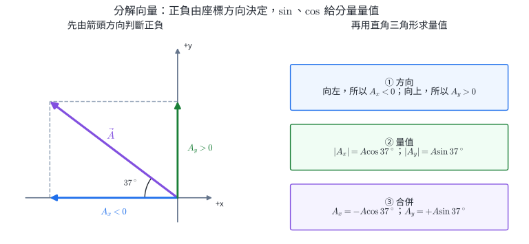{width=96%}

$$
A_x=A\cos\theta,
\qquad
A_y=A\sin\theta.
$$

在其他象限仍先畫方向，再依分量實際指向決定正負。以角度制輸入本章角度時，計算機須設為 degree 模式。

::: self-check
### 練習

1. 向量量值 $10$、方向為水平向左上方，與向左方向夾 $37^\circ$。取右、上為正，若 $\cos37^\circ\approx0.8$、$\sin37^\circ\approx0.6$，分量為何？
2. 量值 $12$ 的向量指向東偏南 $30^\circ$，取東、北為正，求分量。
3. 向量分量為 $(-6,-8)$，求量值並判斷所在象限。
4. 已知 $A_x=0$、$A_y>0$，向量方向為何？

**答案：**1. $A_x=-8,A_y=+6$。2. $A_x=12\cos30^\circ=6\sqrt3$、$A_y=-12\sin30^\circ=-6$。3. 量值 10，位於第三象限。4. 沿 $+y$ 方向。
:::

## 1. 向量同時包含量值與方向

**純量**只需量值，例如質量、時間、溫度與路徑長。**向量**必須同時給量值與方向，例如位移、速度、加速度與下一章的力。

向量 $\vec A$ 在平面上可寫為

$$
\vec A=A_x\hat i+A_y\hat j,
$$

其量值與方向角滿足

$$
|\vec A|=\sqrt{A_x^2+A_y^2},
\qquad
\tan\theta=\frac{A_y}{A_x}.
$$

求角度時仍要用分量正負判斷象限；只有正切值不足以唯一決定方向。

### 向量相加

幾何法把第二支向量平移到第一支終點，從第一支起點指向最後終點就是合向量。分量法則逐方向相加：

$$
\vec C=\vec A+\vec B,
\qquad
C_x=A_x+B_x,
\quad
C_y=A_y+B_y.
$$

向量相減就是加上反向量：$\vec A-\vec B=\vec A+(-\vec B)$。

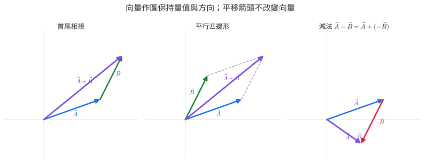{width=96%}

圖 2 中，向量平移後仍保持原本的量值與方向。首尾相接法適合連續位移；平行四邊形法適合兩個同時作用的向量；減法圖把 $-\vec B$ 的箭頭方向反轉，再沿用加法規則。

::: worked-example
### 完整示範｜兩段位移以分量相加

先向東走 $3.0\ \mathrm{km}$，再向北走 $4.0\ \mathrm{km}$。合位移分量為 $(3.0,4.0)\ \mathrm{km}$，因此

$$
|\Delta\vec r|=\sqrt{3.0^2+4.0^2}=5.0\ \mathrm{km}.
$$

方向為東偏北 $\tan^{-1}(4/3)\approx53^\circ$。路徑長卻是 $3+4=7\ \mathrm{km}$；向量位移與純量路徑長仍不能混用。
:::

::: worked-example
### 完整示範｜由兩個速度求相對速度向量

甲的速度為 $\vec v_A=(8,3)\ \mathrm{m/s}$，乙的速度為 $\vec v_B=(2,7)\ \mathrm{m/s}$。乙相對甲的速度是

$$
\vec v_{B/A}=\vec v_B-\vec v_A=(-6,4)\ \mathrm{m/s}.
$$

量值

$$
|\vec v_{B/A}|=\sqrt{(-6)^2+4^2}=2\sqrt{13}\ \mathrm{m/s}.
$$

箭頭指向左上方；相對 $-x$ 軸向上夾角為 $\tan^{-1}(4/6)\approx33.7^\circ$。這個向量描述甲所見乙每秒如何改變相對位置。
:::

::: why
### 分量運算簡化工程圖與導航計算

一支斜向量同時影響兩個方向，分量表示把它拆成兩個可獨立加減的數。互相垂直的投影彼此不混入，且能以畢氏定理還原量值。更換座標只改變描述向量的分量，實際方向不變；工程上通常選擇讓邊界或運動最簡單的座標軸。
:::

::: self-check
### 練習

1. $\vec A=(4,-1)$、$\vec B=(-2,5)$。$\vec A+\vec B$ 與 $\vec A-\vec B$ 各是多少？
2. 先向東 $5\ \mathrm m$，再向西 $2\ \mathrm m$，用首尾相接法寫出合位移與路徑長。
3. $\vec C=(-3,4)$，求量值與相對 $+x$ 軸的方向角。
4. 若 $\vec A+\vec B=0$，兩向量的量值與方向有何關係？
5. 向量箭頭在紙上平移後，哪些性質保持不變？

**答案：**1. $(2,4)$ 與 $(6,-6)$。2. 合位移 $+3\ \mathrm m$ 向東，路徑長 $7\ \mathrm m$。3. 量值 5，方向角 $126.9^\circ$。4. 量值相等、方向相反。5. 量值與方向保持不變，起點位置可改變。
:::

## 2. 平面運動學：每一個方向都遵守同一套定義

位置向量 $\vec r=x\hat i+y\hat j$。由時刻 $t_1$ 到 $t_2$：

$$
\Delta\vec r=\vec r_2-\vec r_1
=(\Delta x)\hat i+(\Delta y)\hat j.
$$

平均速度與平均加速度為

$$
\bar{\vec v}=\frac{\Delta\vec r}{\Delta t},
\qquad
\bar{\vec a}=\frac{\Delta\vec v}{\Delta t}.
$$

因此每個分量各自滿足

$$
\bar v_x=\frac{\Delta x}{\Delta t},
\quad
\bar v_y=\frac{\Delta y}{\Delta t},
\qquad
\bar a_x=\frac{\Delta v_x}{\Delta t},
\quad
\bar a_y=\frac{\Delta v_y}{\Delta t}.
$$

若 $a_x,a_y$ 都是定值，就能對兩方向分別使用等加速度式：

$$
x=x_0+v_{0x}t+\frac12a_xt^2,
\qquad
v_x=v_{0x}+a_xt,
$$

$$
y=y_0+v_{0y}t+\frac12a_yt^2,
\qquad
v_y=v_{0y}+a_yt.
$$

**兩方向共用同一個 $t$。**這是把兩個一維解重新組成同一個物體運動的接縫。

::: worked-example
### 完整示範｜由向量初始條件預測位置與速度

物體初位置 $\vec r_0=(1,-2)\ \mathrm m$、初速度 $\vec v_0=(4,3)\ \mathrm{m/s}$、定加速度 $\vec a=(-1,2)\ \mathrm{m/s^2}$。經過 $t=2.0\ \mathrm s$：

$$
\vec v=\vec v_0+\vec at=(4,3)+(-1,2)(2)=(2,7)\ \mathrm{m/s}.
$$

$$
\vec r=\vec r_0+\vec v_0t+\frac12\vec at^2
=(1,-2)+(8,6)+\frac12(-1,2)(4)
=(7,8)\ \mathrm m.
$$

分量法把同一向量方程拆成兩個一維計算；最後的 $(7,8)$ 仍是同一時刻的平面位置。
:::

### 曲線運動的切向與法向方向

速度向量沿軌跡切線。比較相鄰兩時刻的速度箭頭，$\Delta\vec v$ 可在當下分成互相垂直的兩個方向：沿速度方向的切向分量改變速率，垂直速度的法向分量改變速度方向。

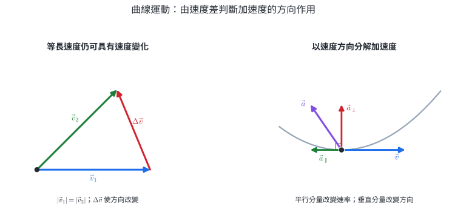{width=96%}

圖 3 的判讀規則為：

- $\vec a$ 與 $\vec v$ 同向時，速率增加。
- $\vec a$ 與 $\vec v$ 反向時，速率減少。
- $\vec a$ 垂直 $\vec v$ 時，當下只改變方向。
- 一般情形同時具有平行與垂直分量，所以速率與方向一起改變。

本章使用這組方向判讀連接速度向量與加速度向量；法向加速度的量值公式與受力來源留在下一章圓周運動主線。

::: worked-example
### 完整示範｜由兩個速度向量求平均加速度

物體在 $t=2.0\ \mathrm s$ 的速度為 $\vec v_1=(6,2)\ \mathrm{m/s}$，在 $t=3.0\ \mathrm s$ 為 $\vec v_2=(2,6)\ \mathrm{m/s}$。這一秒內的平均加速度為

$$
\bar{\vec a}=\frac{\vec v_2-\vec v_1}{3.0-2.0}
=\frac{(-4,4)}{1.0}
=(-4,4)\ \mathrm{m/s^2}.
$$

量值為 $4\sqrt2\ \mathrm{m/s^2}$，方向指向左上方。若題目另說這一秒內 $\vec a$ 可視為定值，則此平均加速度也代表該秒內的加速度；若未給定值條件，它只描述整段速度變化的平均。
:::

::: why
### 平面運動可沿座標軸獨立計算

向量相等，表示每個方向的分量分別相等，所以 $\vec a=d\vec v/dt$ 可拆成 $a_x=dv_x/dt$ 與 $a_y=dv_y/dt$。若外界作用只在鉛直方向造成加速度，水平方向速度維持不變。兩方向以相同時間 $t$ 連結，最後將 $x(t),y(t)$ 合成同一物體的位置。
:::

::: self-check
### 練習

1. 一物體的 $\vec v=(3,4)\ \mathrm{m/s}$、$\vec a=(0,-2)\ \mathrm{m/s^2}$。若這 1 秒內 $\vec a$ 可視為定值，1 秒後速度分量與速率為何？
2. $\Delta\vec v=(-6,8)\ \mathrm{m/s}$ 在 2.0 秒內發生，求平均加速度向量與量值。
3. 速度由 $(4,0)$ 在 $0.50\ \mathrm s$ 後變成 $(0,4)\ \mathrm{m/s}$，求平均加速度向量與量值。
4. 加速度分別與速度同向、反向、垂直時，速率與方向各如何改變？
5. 物體速度方向改變但速率不變，能否推論 $\vec a=0$？

**答案：**1. $\vec v=(3,2)\ \mathrm{m/s}$，速率 $\sqrt{13}\ \mathrm{m/s}$。2. $\bar{\vec a}=(-3,4)\ \mathrm{m/s^2}$，量值 $5\ \mathrm{m/s^2}$。3. $\bar{\vec a}=(-8,8)\ \mathrm{m/s^2}$，量值 $8\sqrt2\ \mathrm{m/s^2}$。4. 同向使速率增加；反向使速率減少；垂直時當下只改變方向。5. 不能；方向改變需要垂直速度的加速度分量。
:::

## 3. 拋體模型的成立條件

本章的拋體公式使用以下模型：

1. 物體離開手或發射裝置後，只受重力。
2. 忽略空氣阻力、升力與風。
3. 運動範圍相對地球很小，可把地面視為平面、$g$ 視為大小固定且鉛直向下。

取水平向右為 $+x$、鉛直向上為 $+y$，則

$$
a_x=0,
\qquad
a_y=-g.
$$

若題目把側風在一段短時間內的作用簡化為固定的水平加速度，可改用

$$
a_x=a_w,\qquad a_y=-g,
$$

其中 $a_w$ 的正負表示側向加速方向。此模型仍可沿兩軸使用定加速度公式。真實空氣作用通常隨物體相對空氣的速度改變，因此只有題目明確給定「固定側向加速度」或觀測區間足夠短時，才採用這項近似。

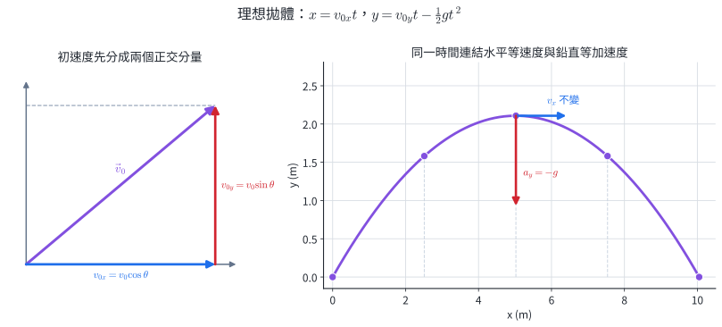{width=96%}

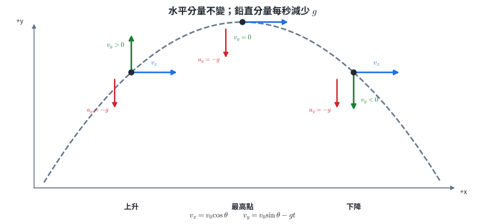{width=96%}

::: why
### 影片座標可檢驗拋體模型

逐幀標出球心座標，再用已知長度校正畫面比例，即可得到 $x(t),y(t)$。理想模型預測 $x(t)$ 為直線、$y(t)$ 為二次曲線；分別擬合可用水平偏差辨識風或阻力，並由鉛直二次項的係數估計 $g$。相機透視、鏡頭傾斜與座標讀取不確定度也會造成曲線，因此判讀須先校正並檢查殘差。
:::

::: self-check
### 模型條件練習

1. 理想拋體離手後的 $a_x,a_y$ 各為何？
2. 強側風使球持續向右偏，哪一個模型條件需要修改？
3. 影片中 $x(t)$ 明顯向下彎，能否仍採 $a_x=0$？
4. 發射範圍接近地球半徑時，為何「固定鉛直方向、固定 $g$」的近地表模型不足？

**答案：**1. $a_x=0,a_y=-g$。2. 若題目採固定側向加速度近似，改用 $a_x=a_w,a_y=-g$；$a_w>0$ 表示持續向右加速。3. 不宜；$x(t)$ 的非線性表示水平速度正在改變。4. 重力方向會隨位置指向地心，大小也隨中心距離改變，地面曲率不可忽略。
:::

## 資料分析｜由等時間座標重建拋體運動

影片每隔固定 $\Delta t$ 標記球心，得到一串 $(x_i,y_i)$。位置差可估計速度，位置的二階差可估計加速度：

$$
v_{x,i}\approx\frac{x_{i+1}-x_{i-1}}{2\Delta t},\qquad
v_{y,i}\approx\frac{y_{i+1}-y_{i-1}}{2\Delta t},
$$

$$
a_{x,i}\approx\frac{x_{i+1}-2x_i+x_{i-1}}{(\Delta t)^2},\qquad
a_{y,i}\approx\frac{y_{i+1}-2y_i+y_{i-1}}{(\Delta t)^2}.
$$

中央差分以中間時刻為對稱中心；二階差分則檢查相鄰位移每個時間間隔改變多少。把二階差分解讀為該段的定加速度時，須假設加速度在各取樣間隔內近似不變；加速度隨時間變化時，算出的量是中間時刻附近的局部估計。這些式子把圖 4 的等時間點轉成可檢驗的 $v_x,v_y,a_x,a_y$。

考慮以下每隔 $0.20\ \mathrm s$ 取得的資料：

| $t$（s） | 0.00 | 0.20 | 0.40 | 0.60 | 0.80 |
|---:|---:|---:|---:|---:|---:|
| $x$（m） | 0.00 | 1.20 | 2.40 | 3.60 | 4.80 |
| $y$（m） | 0.00 | 0.60 | 0.80 | 0.60 | 0.00 |

::: worked-example
### 完整示範｜由中央差分找到最高點速度

在 $t=0.40\ \mathrm s$：

$$
v_x\approx\frac{3.60-1.20}{0.40}=6.0\ \mathrm{m/s},
$$

$$
v_y\approx\frac{0.60-0.60}{0.40}=0.
$$

此時速度水平向右，資料顯示球位於最高點附近。再算鉛直加速度：

$$
a_y\approx\frac{0.60-2(0.80)+0.60}{(0.20)^2}
=\frac{-0.40}{0.04}
=-10\ \mathrm{m/s^2}.
$$

水平二階差為 0，因此 $a_x\approx0$。資料符合近地表理想拋體。
:::

::: worked-example
### 完整示範｜由時間式還原軌跡式

資料的水平位置每 $0.20\ \mathrm s$ 增加 $1.20\ \mathrm m$，所以 $x=6t$。鉛直資料符合

$$
y=4t-5t^2.
$$

由 $t=x/6$ 消去時間：

$$
y=4\left(\frac{x}{6}\right)-5\left(\frac{x}{6}\right)^2
=\frac23x-\frac5{36}x^2.
$$

這條二次曲線通過資料點，且 $x^2$ 項係數為負，對應向下的鉛直加速度。
:::

實際影片資料會含讀點誤差。差分會放大相鄰位置的雜訊，因此應使用多幀擬合 $x(t)$ 與 $y(t)$，並以殘差檢查鏡頭透視、空氣阻力與讀點偏差。

::: self-check
### 資料處理練習

1. 用表格求 $t=0.20\ \mathrm s$ 的 $v_x,v_y$。
2. 用表格求 $t=0.60\ \mathrm s$ 的 $v_x,v_y$。
3. 三個中間時刻的 $a_x$ 是否一致？
4. 若所有 $x$ 座標都多加同一個 $0.30\ \mathrm m$ 的原點偏移，速度與加速度估計是否改變？
5. 為何用更短 $\Delta t$ 不一定自動得到更準確的加速度？

**答案：**1. $v_x=(2.40-0)/0.40=6.0\ \mathrm{m/s}$，$v_y=(0.80-0)/0.40=2.0\ \mathrm{m/s}$。2. $v_x=(4.80-2.40)/0.40=6.0\ \mathrm{m/s}$，$v_y=(0-0.80)/0.40=-2.0\ \mathrm{m/s}$。3. 均為 0。4. 不改變；差分會消去共同原點偏移。5. 位置讀取雜訊被除以 $\Delta t$ 或 $(\Delta t)^2$，時間間隔過短時相對影響反而放大。
:::

## 4. 水平拋射：落地時間由鉛直高度決定

水平拋射的初速度為

$$
v_{0x}=v_0,
\qquad
v_{0y}=0.
$$

若從原點出發，

$$
\boxed{x=v_0t},
\qquad
\boxed{y=-\frac12gt^2},
$$

$$
v_x=v_0,
\qquad
v_y=-gt.
$$

若發射點比落地面高 $H$，落地時 $y=-H$：

$$
\boxed{T=\sqrt{\frac{2H}{g}}},
\qquad
\boxed{R=v_0\sqrt{\frac{2H}{g}}}.
$$

$T$ 不含 $v_0$，所以在模型成立時，水平拋出的球與同時由同高度靜止放手的球會同時落地。

::: worked-example
### 完整示範｜水平射程與落地速度

球由 $H=20\ \mathrm{m}$ 高處以 $v_0=15\ \mathrm{m/s}$ 水平拋出，取 $g=10\ \mathrm{m/s^2}$：

$$
T=\sqrt{\frac{2(20)}{10}}=2.0\ \mathrm{s},
\qquad
R=(15)(2.0)=30\ \mathrm{m}.
$$

落地時 $v_x=15\ \mathrm{m/s}$、$v_y=-20\ \mathrm{m/s}$，故速率

$$
v=\sqrt{15^2+20^2}=25\ \mathrm{m/s}.
$$
:::

::: worked-example
### 完整示範｜由目標位置反求水平初速

平台高 $H=20\ \mathrm m$，目標位於平台正下方水平距離 $25\ \mathrm m$。取 $g=10\ \mathrm{m/s^2}$。先由鉛直圖像求共同時間：

$$
T=\sqrt{\frac{2H}{g}}=\sqrt{\frac{40}{10}}=2.0\ \mathrm s.
$$

水平速度須滿足

$$
v_0=\frac{R}{T}=\frac{25}{2.0}=12.5\ \mathrm{m/s}.
$$

落地時 $v_x=12.5\ \mathrm{m/s}$、$v_y=-20\ \mathrm{m/s}$。設計順序由落地高度決定飛行時間，再由水平距離決定初速。
:::

::: pitfall
### 常見錯誤｜把水平速度放進落地時間

落地條件是鉛直位置到達地面，因此先用 $y$ 方程求時間，再把同一個時間代入 $x$ 方程。水平速度決定落點多遠，不決定在空中多久；前提是地面高度與模型條件相同。
:::

::: self-check
### 練習

1. 同高度同時水平拋出兩球，初速分別為 $5$ 與 $15\ \mathrm{m/s}$。忽略阻力，哪顆先落地？哪顆落地速率較大？
2. 球由 $H=80\ \mathrm m$ 高處水平拋出，取 $g=10\ \mathrm{m/s^2}$。求飛行時間。
3. 上題水平初速為 $6.0\ \mathrm{m/s}$，求射程與落地鉛直速度。
4. 水平初速加倍而高度不變，飛行時間、射程與落地鉛直速度如何改變？
5. 同高度一球水平拋出、另一球靜止釋放。若水平拋球受明顯空氣阻力，兩者仍必然同時落地嗎？

**答案：**1. 同時落地；初速較大的球落地速率較大。2. $T=4.0\ \mathrm s$。3. $R=24\ \mathrm m$、$v_y=-40\ \mathrm{m/s}$。4. 飛行時間與落地鉛直速度不變，射程加倍。5. 未必；阻力可能具有鉛直分量，使兩球鉛直運動條件不同。
:::

## 5. 斜向拋射：初速度先分解，再沿用兩條直線運動

以初速 $v_0$、仰角 $\theta$ 從原點拋出：

$$
v_{0x}=v_0\cos\theta,
\qquad
v_{0y}=v_0\sin\theta.
$$

任意時刻：

$$
\boxed{x=(v_0\cos\theta)t},
$$

$$
\boxed{y=(v_0\sin\theta)t-\frac12gt^2},
$$

$$
v_x=v_0\cos\theta,
\qquad
v_y=v_0\sin\theta-gt.
$$

最高點的條件是 $v_y=0$，不是總速度為 0。若落地與拋出同高：

$$
T=\frac{2v_0\sin\theta}{g},
\qquad
H=\frac{v_0^2\sin^2\theta}{2g},
$$

$$
\boxed{R=\frac{v_0^2\sin2\theta}{g}}.
$$

最後一式只適用於同高起落、無空氣阻力與 $g$ 固定。此時 $\sin2\theta$ 在 $2\theta=90^\circ$ 最大，所以 $45^\circ$ 射程最大；起落不同高或有阻力時，結論通常改變。

::: worked-example
### 完整示範｜用一個時間縫合水平與鉛直

球以 $v_0=20\ \mathrm{m/s}$、$\theta=30^\circ$ 由地面拋出，取 $g=10\ \mathrm{m/s^2}$：

$$
v_{0x}=10\sqrt3\ \mathrm{m/s},
\qquad
v_{0y}=10\ \mathrm{m/s}.
$$

最高點時間 $t_H=v_{0y}/g=1.0\ \mathrm{s}$，最大高度

$$
H=\frac{10^2}{2(10)}=5.0\ \mathrm{m}.
$$

同高落地時間 $T=2.0\ \mathrm{s}$，射程

$$
R=(10\sqrt3)(2.0)=20\sqrt3\ \mathrm{m}.
$$
:::

::: worked-example
### 完整示範｜起落不同高時由鉛直方程選正時間

物體從離地 $20\ \mathrm m$ 的平台拋出，初速分量為 $v_{0x}=10\ \mathrm{m/s}$、$v_{0y}=15\ \mathrm{m/s}$，取 $g=10\ \mathrm{m/s^2}$。以地面為 $y=0$：

$$
0=20+15t-5t^2.
$$

整理為 $(t-4)(t+1)=0$，物理時間取 $t=4.0\ \mathrm s$。水平位移

$$
R=v_{0x}t=(10)(4.0)=40\ \mathrm m.
$$

落地速度

$$
v_x=10\ \mathrm{m/s},\qquad
v_y=15-10(4.0)=-25\ \mathrm{m/s},
$$

速率 $\sqrt{10^2+25^2}=5\sqrt{29}\ \mathrm{m/s}$。起落不同高時，飛行時間由實際落地條件求得。
:::

::: why
### 理想拋體是軌跡設計的第一層模型

理想模型只需初速、角度、高度與 $g$，即可快速預測飛行時間與落點，適合做第一版設計。球的旋轉升力、水滴受到的阻力與風，以及投放物的姿態變化都會造成偏差。工程上先以理想模型建立基準，再以試射或感測資料估計偏差並修正控制量。
:::

::: self-check
### 練習

1. 斜拋物到最高點時，$v_x,v_y$ 與加速度各為何？
2. $v_0=20\ \mathrm{m/s}$、$\theta=30^\circ$、$g=10\ \mathrm{m/s^2}$，求同高飛行時間。
3. 同高起落且初速固定，$30^\circ$ 與 $60^\circ$ 的射程如何比較？
4. $v_{0x}=8\ \mathrm{m/s}$、$v_{0y}=6\ \mathrm{m/s}$，2 秒後速度分量為何？取 $g=10\ \mathrm{m/s^2}$。
5. 起點比終點高時，能否直接用 $T=2v_0\sin\theta/g$？

**答案：**1. $v_x=v_0\cos\theta$、$v_y=0$、$\vec a=(0,-g)$。2. $T=2(20)(0.5)/10=2.0\ \mathrm s$。3. 射程相同，因為 $\sin60^\circ=\sin120^\circ$。4. $(v_x,v_y)=(8,-14)\ \mathrm{m/s}$。5. 不適用；須把終點高度代入 $y(t)$ 解時間。
:::

## 斜拋的速度方向與同高對稱

同高起落、忽略阻力時，鉛直位置

$$
y=v_{0y}t-\frac12gt^2
$$

在 $t$ 與 $T-t$ 兩個時刻相同。此時

$$
v_y(t)=v_{0y}-gt,
$$

所以同一高度的上升與下降鉛直速度量值相同、方向相反；$v_x$ 全程不變。軌跡以最高點所在的鉛直線為對稱軸，速度方向則在兩側互為上下鏡像。

初速固定、同高起落時，互餘角 $\theta$ 與 $90^\circ-\theta$ 的射程相同，因為

$$
\sin[2(90^\circ-\theta)]=\sin(180^\circ-2\theta)=\sin2\theta.
$$

兩條軌跡的飛行時間與最大高度通常不同；較大的發射角停留較久、飛得較高。

::: worked-example
### 完整示範｜互餘角同射程但不同高度

以 $v_0=20\ \mathrm{m/s}$、$g=10\ \mathrm{m/s^2}$ 比較 $30^\circ$ 與 $60^\circ$ 同高斜拋。

射程：

$$
R_{30}=\frac{20^2\sin60^\circ}{10}=20\sqrt3\ \mathrm m,
$$

$$
R_{60}=\frac{20^2\sin120^\circ}{10}=20\sqrt3\ \mathrm m.
$$

飛行時間分別為

$$
T_{30}=\frac{2(20)(1/2)}{10}=2.0\ \mathrm s,
$$

$$
T_{60}=\frac{2(20)(\sqrt3/2)}{10}=2\sqrt3\ \mathrm s.
$$

最大高度為 $H_{30}=5.0\ \mathrm m$、$H_{60}=15\ \mathrm m$。同射程只由 $\sin2\theta$ 決定，並不代表兩條軌跡相同。
:::

::: worked-example
### 完整示範｜由速度方向反求時刻與位置

物體由原點斜拋，$v_{0x}=12\ \mathrm{m/s}$、$v_{0y}=16\ \mathrm{m/s}$，取 $g=10\ \mathrm{m/s^2}$。求速度指向水平下方 $45^\circ$ 的時刻。

此時 $v_x=12\ \mathrm{m/s}$，且 $v_y=-12\ \mathrm{m/s}$：

$$
-12=16-10t\quad\Rightarrow\quad t=2.8\ \mathrm s.
$$

位置為

$$
x=(12)(2.8)=33.6\ \mathrm m,
$$

$$
y=(16)(2.8)-5(2.8)^2=5.6\ \mathrm m.
$$

總速度方向由分量比 $v_y/v_x=-1$ 判定；位置仍由同一個 $t=2.8\ \mathrm s$ 接合兩方向。
:::

::: self-check
### 對稱與速度方向練習

1. 同高斜拋回到出發高度時，$v_x,v_y$ 與初始分量如何比較？
2. 初速固定且同高起落，$20^\circ$ 與哪個角度射程相同？
3. $35^\circ$ 與 $55^\circ$ 同射程時，哪個角度飛行時間較長？
4. 最高點的速度量值等於哪一個初速分量？
5. 起落不同高時，左右對稱與互餘角同射程結論是否仍直接成立？

**答案：**1. $v_x=v_{0x}$，$v_y=-v_{0y}$。2. $70^\circ$。3. $55^\circ$，因為鉛直初速較大。4. $|v_x|=|v_{0x}|$。5. 不直接成立；落地時間由實際高度條件決定，互餘角的兩條軌跡通常在不同時刻抵達終點。
:::

## 6. 理解支援｜拋體軌跡是二次曲線

C2 理解支援｜會用分量式後再讀

由 $x=(v_0\cos\theta)t$ 得

$$
t=\frac{x}{v_0\cos\theta}.
$$

代入鉛直式：

$$
y=x\tan\theta-
\frac{g}{2v_0^2\cos^2\theta}x^2.
$$

這是 $y=ax+bx^2$ 的二次式，因此軌跡是拋物線。這個結論依賴 $a_x=0$、$a_y=-g$ 為定值；若阻力使加速度依速度改變，軌跡不再是精確拋物線。

::: self-check
### 練習

1. 軌跡為拋物線，是否表示加速度沿拋物線切線？
2. 軌跡式中 $x^2$ 項係數為負，圖形開口方向為何？
3. 初速量值固定且 $\theta$ 增加時，$x^2$ 項係數的量值如何受 $\cos^2\theta$ 影響？
4. 若水平方向有與速度相關的阻力，消去時間後的軌跡仍一定是精確二次式嗎？

**答案：**1. 加速度仍鉛直向下；拋物線來自兩方向時間關係的合成。2. 向下。3. $\cos^2\theta$ 變小時，負係數量值增大，曲線對 $x$ 彎得更快。4. 不一定；$x(t)$ 不再是一次式，軌跡通常偏離精確拋物線。
:::

## 7. 一頁核心整理

::: summary-box
### 向量與分量

$$
\vec A=(A_x,A_y),
\quad
|\vec A|=\sqrt{A_x^2+A_y^2},
\quad
\vec A+\vec B=(A_x+B_x,A_y+B_y).
$$

### 平面等加速度

$$
x=x_0+v_{0x}t+\frac12a_xt^2,
\qquad
y=y_0+v_{0y}t+\frac12a_yt^2.
$$

拋體中 $a_x=0,a_y=-g$。兩方向獨立列式，但使用同一時間。

曲線運動的方向判讀：

$$
\bar{\vec a}=\frac{\Delta\vec v}{\Delta t}.
$$

- 加速度與速度同向時，速率增加；反向時，速率減少。
- 加速度垂直速度時，當下只改變運動方向。
- 一般加速度可分成平行速度與垂直速度的兩部分，分別描述速率與方向如何改變。
- 只有在考察時段內加速度可視為定值時，平均加速度才同時代表該段每一瞬間的加速度。

### 水平拋射

$$
x=v_0t,
\quad
y=-\frac12gt^2,
\quad
T=\sqrt{\frac{2H}{g}}.
$$

### 同高斜拋

$$
T=\frac{2v_0\sin\theta}{g},
\quad
H=\frac{v_0^2\sin^2\theta}{2g},
\quad
R=\frac{v_0^2\sin2\theta}{g}.
$$
:::

## 8. 代表題：分層練習

### 題目 1｜基礎：分量

向量量值為 $20$，方向為東偏北 $30^\circ$。求東、北分量。

### 題目 2｜基礎：向量合成

$\vec A=(6,2)\ \mathrm{m}$、$\vec B=(-3,4)\ \mathrm{m}$。求 $\vec A+\vec B$ 的分量、量值與相對 $+x$ 軸的方向角。

### 題目 3｜平面運動

一物體初速度 $\vec v_0=(2,5)\ \mathrm{m/s}$，加速度 $\vec a=(3,-2)\ \mathrm{m/s^2}$。2 秒後速度與相對初點位移為何？

### 題目 4｜水平拋射

球由 $45\ \mathrm{m}$ 高處以 $8.0\ \mathrm{m/s}$ 水平拋出，取 $g=10\ \mathrm{m/s^2}$。求落地時間、水平射程與落地速度分量。

### 題目 5｜同高斜拋

球以 $25\ \mathrm{m/s}$、仰角 $53^\circ$ 由地面拋出，取 $\sin53^\circ=0.8$、$\cos53^\circ=0.6$、$g=10\ \mathrm{m/s^2}$。求最高點時間、最大高度、總飛行時間與射程。

### 題目 6｜非同高斜拋

物體由離地 $15\ \mathrm{m}$ 的平台，以水平分量 $12\ \mathrm{m/s}$、鉛直向上分量 $10\ \mathrm{m/s}$ 拋出，取 $g=10\ \mathrm{m/s^2}$。求落地時間與水平位移。

### 題目 7｜概念與條件

有人說：「固定初速時一定以 $45^\circ$ 拋得最遠。」指出這句話缺少的至少兩個條件，並說明風阻可能如何改變答案。

### 題目 8｜資料判讀

相機追蹤一顆球，等時間間隔取得的水平位置差皆為 $1.2\ \mathrm{m}$；鉛直位置差依序為 $+0.7,+0.3,-0.1,-0.5\ \mathrm{m}$。這些資料較符合哪種加速度方向？能否只由這四個差值精確斷言加速度等於 $9.8\ \mathrm{m/s^2}$？

### 題目 9｜向量減法與幾何方向

$\vec A=(5,1)$、$\vec B=(2,5)$。求 $\vec A-\vec B$ 的分量、量值與方向；並用一句話說明作圖時 $-\vec B$ 如何由 $\vec B$ 得到。

### 題目 10｜相對速度向量

無人機 A 對地速度為 $(12,4)\ \mathrm{m/s}$，無人機 B 對地速度為 $(7,-8)\ \mathrm{m/s}$。求 B 相對 A 的速度向量與量值。

### 題目 11｜平面定加速度

物體由原點出發，$\vec v_0=(6,-2)\ \mathrm{m/s}$、$\vec a=(-2,4)\ \mathrm{m/s^2}$。求 3.0 秒後的位置、速度與速率。

### 題目 12｜平均加速度向量與方向分量

物體的初速度為 $\vec v_1=(8,0)\ \mathrm{m/s}$，$1.5\ \mathrm s$ 後速度為 $\vec v_2=(2,6)\ \mathrm{m/s}$。求這段時間的平均加速度向量與量值；再以初速度方向為基準，把平均加速度分成平行與垂直初速度的分量，說明兩分量所描述的速度變化。

### 題目 13｜水平投放至目標

救援物資由離地 $125\ \mathrm m$ 的飛行器水平投放，忽略阻力，飛行器速度 $20\ \mathrm{m/s}$，取 $g=10\ \mathrm{m/s^2}$。應在目標前方多遠釋放？落地速度分量與速率為何？

### 題目 14｜斜拋某一時刻的狀態

球以 $v_0=25\ \mathrm{m/s}$、仰角 $37^\circ$ 拋出，取 $\cos37^\circ=0.8$、$\sin37^\circ=0.6$、$g=10\ \mathrm{m/s^2}$。求 $t=1.0\ \mathrm s$ 的位置、速度分量與速率。

### 題目 15｜跨節整合：影片位置資料

相機每隔 $0.20\ \mathrm s$ 取得球的位置：

| $t$（s） | 0.0 | 0.2 | 0.4 | 0.6 |
|---:|---:|---:|---:|---:|
| $x$（m） | 0.0 | 1.6 | 3.2 | 4.8 |
| $y$（m） | 0.0 | 1.0 | 1.6 | 1.8 |

由水平差求 $v_x$；由連續鉛直位移差判斷 $v_y$ 如何變化；再用二階差分 $y_{i+1}-2y_i+y_{i-1}=a_y(\Delta t)^2$ 估計 $a_y$。

### 題目 16｜跨節整合：由速度表判斷定加速度

每隔 $1.0\ \mathrm s$ 量得物體的速度分量如下：

| $t$（s） | 0.0 | 1.0 | 2.0 |
|---:|---:|---:|---:|
| $v_x$（m/s） | 2.0 | 4.0 | 6.0 |
| $v_y$（m/s） | 1.0 | 0.0 | -1.0 |

分別求兩個時段的 $\Delta\vec v$ 與平均加速度，判斷資料是否符合定加速度模型；若同一模型延續至 $t=3.0\ \mathrm s$，預測該時刻的速度向量。

### 題目 17｜跨節整合：起落不同高的拋射設計

平台高 $15\ \mathrm m$，球的初速分量為 $v_{0x}=16\ \mathrm{m/s}$、$v_{0y}=10\ \mathrm{m/s}$，取 $g=10\ \mathrm{m/s^2}$。求落地時間、水平位移、落地速度方向；再判斷能否用同高射程式 $R=v_0^2\sin2\theta/g$。

### 題目 18｜跨節整合：由偏離判斷模型

理想模型預測球的 $x(t)$ 為直線、$y(t)$ 為二次曲線。實測顯示 $x$ 方向速度逐漸減小，且下降後段的鉛直位置高於無阻力預測。請以加速度分量說明兩項偏離，並提出一種能區分「側風」與「與速度反向的空氣阻力」的資料判讀方式。

## 9. 完整解析

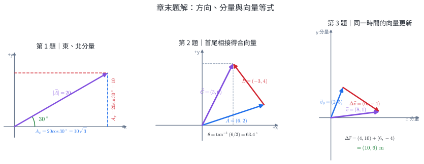{width=100%}

::: solution
### 第 1 題

圖 6A 中向量指向右上方，對東、北兩軸的投影都為正：

$$
A_x=20\cos30^\circ=10\sqrt3,
\qquad
A_y=20\sin30^\circ=10.
$$

方向已說明為東偏北，所以兩分量皆為正。
:::

::: solution
### 第 2 題

圖 6B 把 $\vec B$ 平移到 $\vec A$ 終點；合向量從原點指向最後終點 $(3,6)$：

$$
\vec C=\vec A+\vec B=(3,6)\ \mathrm{m}.
$$

$$
|\vec C|=\sqrt{3^2+6^2}=3\sqrt5\ \mathrm{m},
\qquad
\theta=\tan^{-1}(6/3)\approx63.4^\circ.
$$

兩分量皆正，方向在第一象限。
:::

::: solution
### 第 3 題

圖 6C 中 $\Delta\vec v=(6,-4)\ \mathrm{m/s}$ 接在 $\vec v_0$ 終點，所以最後箭頭就是 $\vec v=(8,1)\ \mathrm{m/s}$。

$$
\vec v=\vec v_0+\vec at=(2,5)+(3,-2)(2)=(8,1)\ \mathrm{m/s}.
$$

$$
\Delta\vec r=\vec v_0t+\frac12\vec at^2
=(2,5)(2)+\frac12(3,-2)(4)
=(10,6)\ \mathrm{m}.
$$
:::

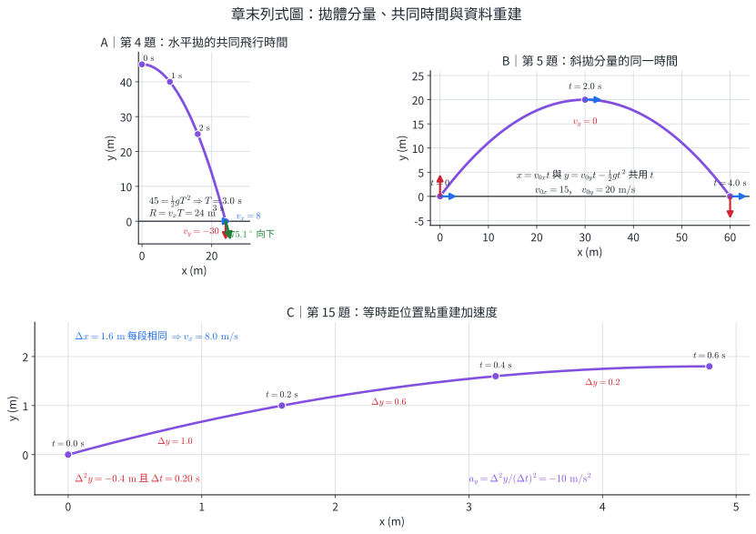{width=100%}

::: solution
### 第 4 題

圖 7A 的四個等時間點使用同一個 $t$：鉛直落下先決定落地時間，水平分量再給出射程。

鉛直方向 $45=\tfrac12(10)T^2$，得 $T=3.0\ \mathrm{s}$。水平射程

$$
R=(8.0)(3.0)=24\ \mathrm{m}.
$$

落地時 $v_x=8.0\ \mathrm{m/s}$、$v_y=-gT=-30\ \mathrm{m/s}$。
:::

::: solution
### 第 5 題

圖 7B 以 $t=0,2.0,4.0\ \mathrm s$ 標出同一顆球的分量狀態；三個狀態的 $v_x$ 相同，$v_y$ 依序為 $+20,0,-20\ \mathrm{m/s}$。

初速分量：$v_{0x}=25(0.6)=15\ \mathrm{m/s}$，$v_{0y}=25(0.8)=20\ \mathrm{m/s}$。

$$
t_H=\frac{20}{10}=2.0\ \mathrm{s},
\qquad
H=\frac{20^2}{2(10)}=20\ \mathrm{m}.
$$

同高落地 $T=2t_H=4.0\ \mathrm{s}$，射程 $R=(15)(4.0)=60\ \mathrm{m}$。
:::

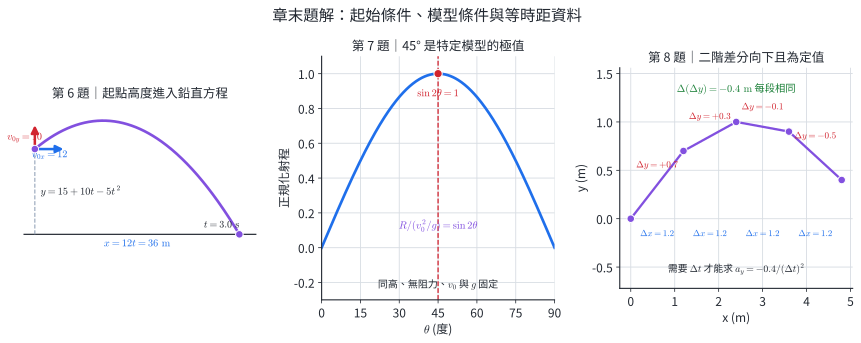{width=100%}

::: solution
### 第 6 題

圖 8A 把地面設為 $y=0$，發射點的 $y_0=15\ \mathrm m$、$v_{0y}=10\ \mathrm{m/s}$ 一起進入鉛直位置式。

以地面為 $y=0$：

$$
0=15+10t-5t^2.
$$

整理為 $t^2-2t-3=0=(t-3)(t+1)$。時間取正根 $t=3.0\ \mathrm{s}$，水平位移

$$
x=(12)(3.0)=36\ \mathrm{m}.
$$

本題起落不同高，不能直接套同高的 $T=2v_{0y}/g$。
:::

::: solution
### 第 7 題

圖 8B 的曲線由 $R=(v_0^2/g)\sin2\theta$ 產生；當 $\theta=45^\circ$ 時 $\sin2\theta=1$，所以圖上取得唯一最大值。這個結論需要起終點同高、忽略阻力、$g$ 為定值，且初速量值相同。含風阻時水平方程改變，最佳角須依阻力模型或實測求得。
:::

::: solution
### 第 8 題

圖 8C 中每段 $\Delta x=1.2\ \mathrm m$，故 $a_x\approx0$；鉛直位置差每段減少 $0.4\ \mathrm{m}$，符合向下的近似定加速度。求加速度數值仍需時間間隔、空間比例、座標方向與測量不確定度，並檢查風阻。
:::

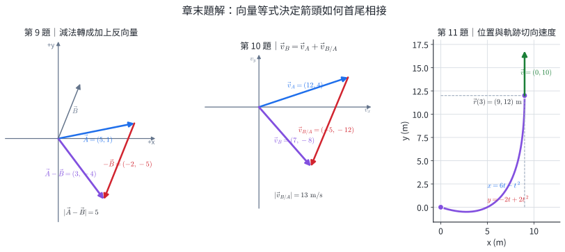{width=100%}

::: solution
### 第 9 題

圖 9A 先把 $\vec B$ 反向成 $-\vec B=(-2,-5)$，再把它接到 $\vec A$ 終點：

$$
\vec A-\vec B=(5-2,1-5)=(3,-4).
$$

量值為 $5$，方向在第四象限，相對 $+x$ 軸向下 $\tan^{-1}(4/3)=53.1^\circ$。作圖時 $-\vec B$ 與 $\vec B$ 量值相同、方向相反，再與 $\vec A$ 首尾相接。
:::

::: solution
### 第 10 題

圖 9B 的箭頭關係是 $\vec v_B=\vec v_A+\vec v_{B/A}$，因此未知箭頭為從 $\vec v_A$ 終點指向 $\vec v_B$ 終點：

$$
\vec v_{B/A}=\vec v_B-\vec v_A=(7,-8)-(12,4)=(-5,-12)\ \mathrm{m/s}.
$$

$$
|\vec v_{B/A}|=\sqrt{(-5)^2+(-12)^2}=13\ \mathrm{m/s}.
$$

相對速度指向左下方，表示 A 所見 B 的相對位置每秒向左 5 m、向下 12 m。
:::

::: solution
### 第 11 題

圖 9C 的軌跡由 $x=6t-t^2$、$y=-2t+2t^2$ 生成；$t=3.0\ \mathrm s$ 的終點是 $(9,12)$，該點切向速度沿 $+y$ 方向。

$$
\vec r=\vec v_0t+\frac12\vec at^2
=(6,-2)(3)+\frac12(-2,4)(9)
=(9,12)\ \mathrm m.
$$

$$
\vec v=\vec v_0+\vec at=(6,-2)+(-2,4)(3)=(0,10)\ \mathrm{m/s}.
$$

速率為 $10\ \mathrm{m/s}$，方向沿 $+y$。
:::

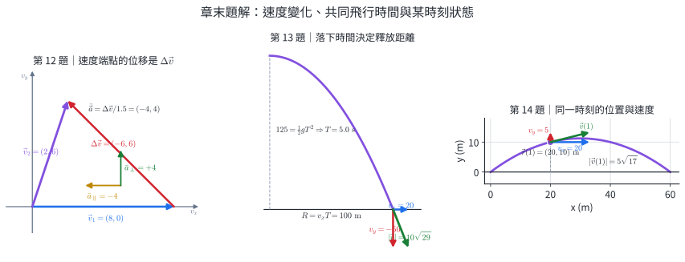{width=100%}

::: solution
### 第 12 題

圖 10A 中 $\Delta\vec v$ 從 $\vec v_1$ 終點指向 $\vec v_2$ 終點，所以它的分量是 $(-6,6)\ \mathrm{m/s}$。

速度變化為

$$
\Delta\vec v=\vec v_2-\vec v_1=(2,6)-(8,0)=(-6,6)\ \mathrm{m/s}.
$$

因此平均加速度為

$$
\bar{\vec a}=\frac{(-6,6)}{1.5}=(-4,4)\ \mathrm{m/s^2},
\qquad
|\bar{\vec a}|=4\sqrt2\ \mathrm{m/s^2}.
$$

初速度沿 $+x$ 方向，所以平行初速度的分量為 $(-4,0)\ \mathrm{m/s^2}$，描述 $x$ 方向速度減少；垂直初速度的分量為 $(0,4)\ \mathrm{m/s^2}$，描述速度向上偏轉。這兩項是相對於初速度方向的平均變化；題目未給加速度定值，因此不把它們當成整段每一瞬間的加速度。
:::

::: solution
### 第 13 題

圖 10B 的鉛直落下高度先給出 $T=5.0\ \mathrm s$，同一時間內的水平位移就是釋放距離。

鉛直落下時間

$$
T=\sqrt{\frac{2(125)}{10}}=5.0\ \mathrm s.
$$

因此應在目標前方

$$
R=v_0T=(20)(5.0)=100\ \mathrm m
$$

處釋放。落地時

$$
v_x=20\ \mathrm{m/s},\qquad v_y=-50\ \mathrm{m/s},
$$

$$
v=\sqrt{20^2+50^2}=10\sqrt{29}\approx53.9\ \mathrm{m/s}.
$$
:::

::: solution
### 第 14 題

圖 10C 在 $t=1.0\ \mathrm s$ 處同時標出位置 $(20,10)$ 與速度分量 $(20,5)$；速度箭頭為軌跡的當地切向。

初速分量為 $v_{0x}=20\ \mathrm{m/s}$、$v_{0y}=15\ \mathrm{m/s}$。$t=1.0\ \mathrm s$ 時

$$
x=(20)(1.0)=20\ \mathrm m,
$$

$$
y=(15)(1.0)-\frac12(10)(1.0)^2=10\ \mathrm m.
$$

$$
v_x=20\ \mathrm{m/s},\qquad v_y=15-10=5\ \mathrm{m/s},
$$

$$
v=\sqrt{20^2+5^2}=5\sqrt{17}\approx20.6\ \mathrm{m/s}.
$$
:::

::: solution
### 第 15 題

圖 7C 把表格中的四個位置點依時間順序排列；每段的 $\Delta x$ 相同，而 $\Delta y$ 每次減少 $0.4\ \mathrm m$。

每 $0.20\ \mathrm s$ 的水平位移均為 $1.6\ \mathrm m$，所以

$$
v_x=\frac{1.6}{0.20}=8.0\ \mathrm{m/s}.
$$

相鄰鉛直位移依序為 $1.0,0.6,0.2\ \mathrm m$，每段減少 $0.4\ \mathrm m$，表示鉛直速度持續減少。用前三點：

$$
a_y=\frac{y_2-2y_1+y_0}{(0.20)^2}
=\frac{1.6-2(1.0)+0}{0.04}
=-10\ \mathrm{m/s^2}.
$$

用後三點也得到 $(1.8-2(1.6)+1.0)/0.04=-10\ \mathrm{m/s^2}$，資料符合 $a_x=0,a_y=-10\ \mathrm{m/s^2}$。
:::

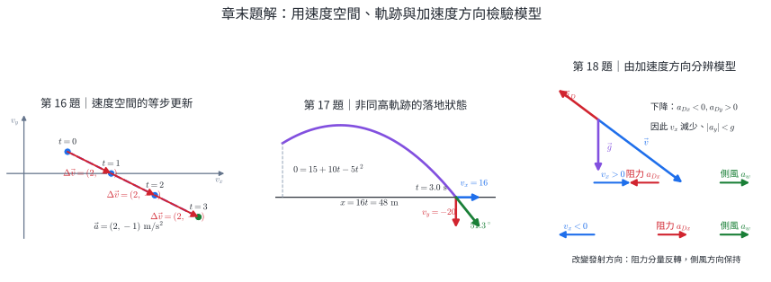{width=100%}

::: solution
### 第 16 題

圖 11A 把表格中每個速度對應到速度平面的點；相鄰點之間都相差 $(2,-1)\ \mathrm{m/s}$。

第一秒與第二秒的速度變化分別為

$$
\Delta\vec v_{0\to1}=(4,0)-(2,1)=(2,-1)\ \mathrm{m/s},
$$
$$
\Delta\vec v_{1\to2}=(6,-1)-(4,0)=(2,-1)\ \mathrm{m/s}.
$$

每段歷時 $1.0\ \mathrm s$，所以兩段平均加速度皆為

$$
\bar{\vec a}=(2,-1)\ \mathrm{m/s^2}.
$$

相等時間內的 $\Delta\vec v$ 相同，資料符合定加速度模型。延續同一模型一秒：

$$
\vec v(3.0)=\vec v(2.0)+\vec a(1.0)=(6,-1)+(2,-1)=(8,-2)\ \mathrm{m/s}.
$$
:::

::: solution
### 第 17 題

圖 11B 的起點為 $y_0=15\ \mathrm m$，落地點為 $y=0$；兩點不同高，因此由鉛直位置式先求實際飛行時間。

以地面為 $y=0$：

$$
0=15+10t-5t^2,
$$

得 $(t-3)(t+1)=0$，取 $t=3.0\ \mathrm s$。水平位移

$$
x=(16)(3.0)=48\ \mathrm m.
$$

落地速度分量

$$
v_x=16\ \mathrm{m/s},\qquad v_y=10-10(3.0)=-20\ \mathrm{m/s}.
$$

速度方向為水平向右下方，與水平夾角

$$
\tan^{-1}\frac{20}{16}=51.3^\circ.
$$

起點高於終點，因此同高射程式不適用。
:::

::: solution
### 第 18 題

圖 11C 上半的物體速度指向右下，與速度反向的阻力加速度指向左上。因此 $a_x$ 與水平速度反向，而向上的阻力分量使合成後的 $|a_y|$ 小於 $g$；這就對應到 $v_x$ 逐漸減小，且下降後段位置高於無阻力預測。

圖 11C 下半比較水平速度相反的兩次試射。在題目採用的簡化模型中，側風以固定側向加速度 $a_x=a_w$ 表示，方向保持不變；速度阻力則與相對空氣的速度方向相反，改變初始水平發射方向後，$a_x$ 的方向也可能改變。多方向試射與逐幀速度資料可分辨兩者。
:::
