# 選物I-4 牛頓運動定律

::: learning-map
### 本章核心關係

1. **力為什麼一定是向量？**──同樣大小、不同方向會造成不同加速度；多個力要以分量合成。
2. **沒有合力時，物體為什麼不需要「維持運動的力」？**──牛頓第一定律說它會維持靜止或等速度直線運動。
3. **$\sum\vec F=m\vec a$ 計算什麼？**──同一受力體上所有外力的向量和，決定它的加速度。
4. **作用力與反作用力為什麼不互相抵銷？**──兩力作用在不同物體；只有同一物體上的力才能相加。
5. **圓周運動速率不變，為什麼仍需合力？**──速度方向持續改變，向心加速度必指向圓心。
6. **彈簧為什麼會來回？sin、cos 又從哪裡來？**──回復力 $-kx$ 讓 $a=-\omega^2x$；這正是等速圓周投影的分量關係。
7. **實務上用在哪裡？**──機器人控制、秤重、電梯安全、彎道設計、離心設備與手機微型感測器，都在把「力—加速度—位移」串成可預測模型。

藍色：114 第 4 章核心
青綠：理解與應用
紫色：教材探索／延伸
:::

## Part A｜從受力圖到牛頓定律

## 0. 自由體圖以受力體為中心

一句「繩子有拉力」資訊不足。要說清楚：**誰作用在誰上、方向如何**。本章所有方程都要先選一個受力體；$\sum\vec F$ 只收集外界作用在這個受力體上的力。

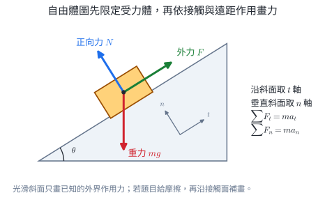{width=94%}

自由體圖的固定操作是：

1. 圈定受力體；
2. 由周遭的施力者找到接觸力與遠距力；
3. 每一支力標示方向與符號；
4. 選擇與加速度或接觸面對齊的座標軸；
5. 逐軸將圖上的力收入 $\sum F=ma$。

::: worked-example
### 完整示範｜書靜止在桌上並受水平拉力

以書為受力體。人向右拉書，書仍靜止，圖上有地球對書的重力 $mg$、桌面對書的正向力 $N$、人對書的拉力 $F$ 與桌面對書的靜摩擦力 $f_s$。

書的加速度為 0，因此

$$
N-mg=0,
\qquad
F-f_s=0.
$$

本題得到 $N=mg$、$f_s=F$ 是平衡條件的結果。若拉力有向上分量，$N$ 會跟著改變。
:::

::: worked-example
### 完整示範｜吊燈的力與第三定律力對

吊燈靜止懸掛在繩下。以吊燈為受力體，只畫地球對燈的重力 $mg$ 向下與繩對燈的張力 $T$ 向上。

$$
T-mg=0
\quad\Rightarrow\quad
T=mg.
$$

燈對繩的力作用在繩上，它與繩對燈的力是第三定律力對，分屬兩張自由體圖。
:::

::: self-check
### 練習｜自由體圖的 4 種情境

1. 蘋果離手後在空中落下，忽略空氣阻力。列出蘋果的受力。
2. 人站在靜止電梯地板上。列出人的受力。
3. 物塊在光滑斜面上下滑。列出真實力，再選擇座標軸。
4. 小球由水平繩子拉著繞圓，忽略其他水平作用。列出水平面內的力與方向。

**簡答：**1. 只有地球對蘋果的重力向下。2. 重力向下、地板正向力向上。3. 重力與正向力；座標取沿斜面與垂直斜面。4. 繩張力指向圓心。
:::

::: self-check
### 練習

手向右推箱子。畫箱子的自由體圖時，應畫「箱子推手的力」嗎？

**答案：**不畫。受力體是箱子，只畫手作用在箱子上的推力，以及地球、地面等外界作用在箱子上的力。箱子推手的力作用在手上。
:::

## 1. 力的向量性與虎克定律

力可以來自接觸，例如正向力、張力、彈力與摩擦作用；也可以不接觸，例如重力。力的 SI 單位是牛頓：

$$
1\ \mathrm N=1\ \mathrm{kg\,m/s^2}.
$$

若力 $\vec F$ 與 $+x$ 軸夾角為 $\theta$：

$$
F_x=F\cos\theta,
\qquad
F_y=F\sin\theta.
$$

多個力的合力為向量和：

$$
\vec F_{\text{net}}=\sum_i\vec F_i,
\qquad
F_{\text{net},x}=\sum_iF_{i,x},
\quad
F_{\text{net},y}=\sum_iF_{i,y}.
$$

::: worked-example
### 完整示範｜二維合力的分量、量值與方向

一物體受 $12\ \mathrm N$、東偏北 $30^\circ$ 的力，另受 $5.0\ \mathrm N$ 向西。取東、北為正：

$$
F_x=12\cos30^\circ-5
=6\sqrt3-5
\approx5.39\ \mathrm N,
$$

$$
F_y=12\sin30^\circ=6.00\ \mathrm N.
$$

$$
F_{\mathrm{net}}=\sqrt{F_x^2+F_y^2}
\approx8.07\ \mathrm N,
$$

$$
\phi=\tan^{-1}\!\left(\frac{F_y}{F_x}\right)
\approx48.0^\circ.
$$

合力方向為東偏北 $48.0^\circ$。分量的正負由座標軸決定，量值保持為正。
:::

### 彈簧的回復力

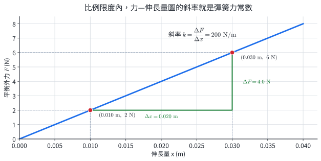{width=92%}

圖 1 的兩點 $(0.010\ \mathrm m,2.0\ \mathrm N)$ 與 $(0.030\ \mathrm m,6.0\ \mathrm N)$ 給出同一斜率 $k=200\ \mathrm{N/m}$，因此校準後可由伸長量反推力。

在彈性比例限度內，理想彈簧的回復力遵守虎克定律：

$$
\boxed{\vec F_s=-k\vec x}.
$$

$\vec x$ 是相對自然長度的形變；$k$ 是力常數，SI 單位 $\mathrm{N/m}$。負號表示力與形變方向相反。若只問量值，才寫 $F_s=k|x|$。

比例限度之外，彈簧可能不再線性甚至永久變形，不能把 $F=kx$ 無限延長。

::: worked-example
### 完整示範｜用斜率校準彈簧秤

在比例限度內，施力 $2.0\ \mathrm N$ 時伸長 $1.0\ \mathrm{cm}$，故

$$
k=\frac{F}{x}=\frac{2.0}{0.010}=200\ \mathrm{N/m}.
$$

伸長 $3.0\ \mathrm{cm}$ 時，回復力量值為 $(200)(0.030)=6.0\ \mathrm N$，方向指向自然長度位置。
:::

::: why
### 彈簧形變可轉換為重量讀數

比例限度內 $F=kx$，量到彈簧位移即可反推力。實際 $k$ 受材料、幾何與溫度影響，因此刻度須以已知力校準。超過比例限度後，力與形變不再維持同一斜率，甚至留下永久變形；原刻度隨之失效。
:::

::: self-check
### 練習

彈簧被向左壓縮 $0.020\ \mathrm m$，取向右為正，$k=150\ \mathrm{N/m}$。$x$ 與彈簧力各為何？

**答案：**$x=-0.020\ \mathrm m$，$F_s=-kx=+3.0\ \mathrm N$，向右指向平衡位置。
:::

::: worked-example
### 完整示範｜由兩點校準彈簧並判斷比例限度

平衡外力—伸長量圖在線性區通過 $(0.010\ \mathrm m,1.8\ \mathrm N)$ 與 $(0.040\ \mathrm m,7.2\ \mathrm N)$。斜率為

$$
k=\frac{7.2-1.8}{0.040-0.010}
=180\ \mathrm{N/m}.
$$

在這條直線模型中，伸長 $0.025\ \mathrm m$ 對應的平衡外力為

$$
F=kx=(180)(0.025)=4.5\ \mathrm N.
$$

若實測 $x=0.055\ \mathrm m$ 時只需 $8.0\ \mathrm N$，而直線外推預測 $9.9\ \mathrm N$，實測點已偏離原斜率，該條線性校準的適用區間必須終止於更小形變。
:::

::: self-check
### 練習｜向量力與虎克定律

1. $10\ \mathrm N$ 力向西偏北 $37^\circ$，求東、北分量。取 $\sin37^\circ=0.6$、$\cos37^\circ=0.8$。
2. 一物體受 $(6,-8)\ \mathrm N$ 與 $(-2,5)\ \mathrm N$，求合力分量與量值。
3. 彈簧伸長 $4.0\ \mathrm{cm}$ 時回復力量值為 $10\ \mathrm N$，求 $k$。
4. 取向右為正，$k=120\ \mathrm{N/m}$ 的彈簧被向右拉長 $3.0\ \mathrm{cm}$，求 $x$ 與 $F_s$。
5. $F$--$x$ 圖在 $x=0.030\ \mathrm m$ 之後逐漸變平。說明該變化對原校準式 $F=kx$ 的意義。

**簡答：**1. $F_x=-8\ \mathrm N, F_y=+6\ \mathrm N$。2. $(4,-3)\ \mathrm N$，量值 $5\ \mathrm N$。3. $250\ \mathrm{N/m}$。4. $x=+0.030\ \mathrm m, F_s=-3.6\ \mathrm N$。5. 形變已離開線性比例區，$k$ 不再是同一固定斜率。
:::

## 2. 牛頓第一定律：合力為零時速度不變

參考系是一套用來指定位置與時間的坐標軸及時鐘。若不受合力的物體在其中保持靜止或等速度直線運動，稱此參考系為**慣性參考系**。彼此作等速度直線運動的參考系可同為慣性系；加速或旋轉的車廂通常不是慣性系，直接套用牛頓定律時須另外處理參考系的加速度。

在慣性參考系中，物體若不受外力或所受合力為 0，會保持原有運動狀態：原本靜止者保持靜止，原本運動者保持等速度直線運動。

$$
\sum\vec F=0
\quad\Rightarrow\quad
\vec a=0,
\quad
\vec v=\text{常向量}.
$$

因此「持續運動」不需要向前的合力；**改變速度**才需要合力。桌上的箱子停止被推後會慢下來，是因地面等作用仍使它受到反向合力，不是因為自然狀態必為靜止。

質量量度物體改變速度的難易程度，也就是**慣性大小**。對不同物體施加相同合力時，質量較大的物體加速度較小；在慣性系中可由 $m=|\vec F_{\mathrm{net}}|/|\vec a|$ 比較慣性質量，SI 單位為 kilogram（kg）。這個量不隨電梯秤讀值改變；秤讀值改變的是支持力。

::: why
### 安全帶提供改變乘員速度的外力

車急停時，乘客保有原本的向前速度，因此相對車廂看起來向前衝。安全帶對乘客施加向後的力，使其速度跟著車改變。在地面慣性系中，自由體圖只畫安全帶等實際交互作用，不另畫一支向前的「慣性力」。
:::

::: worked-example
### 完整示範｜合力為零時力仍可同時存在

一輛電動車以 $0.60\ \mathrm{m/s}$ 向右等速行駛。驅動作用為 $1.8\ \mathrm N$ 向右，阻力合力為 $1.8\ \mathrm N$ 向左。

$$
F_x=1.8-1.8=0
\quad\Rightarrow\quad
a_x=0.
$$

車速保持 $0.60\ \mathrm{m/s}$。等速運動對應合力為 0，它允許數支力互相平衡。
:::

::: worked-example
### 完整示範｜安全帶作用的平均力

$65\ \mathrm{kg}$ 乘客隨車以 $15\ \mathrm{m/s}$ 前進，在 $0.30\ \mathrm s$ 內近似等加速度減速至 0。取原前進方向為正：

$$
a=\frac{0-15}{0.30}=-50\ \mathrm{m/s^2}.
$$

若座椅與安全帶對乘客的合力近似為定值，

$$
F_{\mathrm{net}}=ma=(65)(-50)=-3.25\times10^3\ \mathrm N.
$$

合力向後。將停車時間增加，可使同一速度變化對應的加速度量值降低。
:::

::: self-check
### 練習｜慣性與合力為零

1. 物體受合力 0，當下速度為 $(-3,4)\ \mathrm{m/s}$。$5\ \mathrm s$ 後速度為何？
2. 一物體靜止在水平面，受 $4.0\ \mathrm N$ 向右拉力仍保持靜止。水平摩擦力為何？
3. 飛行器以固定速度向北飛，寫出其加速度與合力。
4. $50\ \mathrm{kg}$ 乘客在 $0.40\ \mathrm s$ 內由 $12\ \mathrm{m/s}$ 停下，以等加速度減速近似求平均合力量值。

**簡答：**1. $(-3,4)\ \mathrm{m/s}$。2. $4.0\ \mathrm N$ 向左。3. $\vec a=0$、$\sum\vec F=0$。4. $1.5\times10^3\ \mathrm N$，方向與原速度相反。
:::

::: self-check
### 練習

太空中一物體遠離其他物體，以固定速度前進。若引擎關閉，它會立即停下嗎？

**答案：**理想化地不會；沒有合力時速度維持不變。引擎用來改變速度，而非維持已經具有的速度。
:::

## 3. 牛頓第二定律：以自由體圖建立方程

{width=96%}

### $F$--$a$ 與 $a$--$1/M$ 實驗

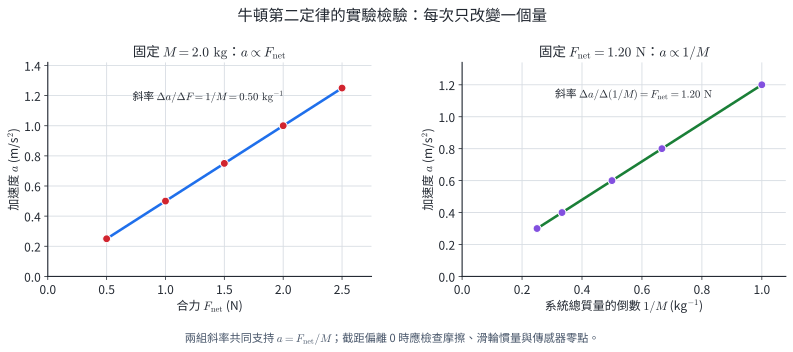{width=98%}

檢驗力、質量與加速度的關係時，每次只改變一個自變量：

- 固定 $M$，改變 $F_{\mathrm{net}}$，畫 $a$ 對 $F_{\mathrm{net}}$；
- 固定 $F_{\mathrm{net}}$，改變 $M$，把橫軸改為 $1/M$，畫 $a$ 對 $1/M$。

圖 2A 的兩組直線關係支持下列模型。在慣性參考系中，

$$
\boxed{\sum\vec F=m\vec a}.
$$

在實驗系統中，式中的 $m$ 是一起加速的完整系統總質量。滑車、附加砝碼與隨繩一起運動的部件都需依實驗邊界納入。最佳直線的截距偏離 0 時，可檢查摩擦、滑輪慣量、桌面水平與感測器零點。

::: worked-example
### 完整示範｜由 $a$--$F_{\mathrm{net}}$ 圖的斜率求系統質量

固定系統質量，將 $a$ 畫在縱軸、$F_{\mathrm{net}}$ 畫在橫軸，最佳直線斜率為 $0.40\ \mathrm{kg^{-1}}$，截距接近 0。由

$$
a=\frac1mF_{\mathrm{net}}
$$

得

$$
\frac1m=0.40\ \mathrm{kg^{-1}}
\quad\Rightarrow\quad
m=2.5\ \mathrm{kg}.
$$

斜率單位 $(\mathrm{m/s^2})/\mathrm N=1/\mathrm{kg}$ 與 $1/m$ 一致。
:::

::: worked-example
### 完整示範｜由 $a$--$1/m$ 圖的斜率求合力

固定合力，畫出 $a$ 對 $1/m$ 的直線，斜率為 $1.60\ \mathrm N$，截距接近 0。因為

$$
a=F_{\mathrm{net}}\left(\frac1m\right),
$$

斜率就是 $F_{\mathrm{net}}=1.60\ \mathrm N$。當 $m=2.00\ \mathrm{kg}$，

$$
a=\frac{1.60}{2.00}=0.800\ \mathrm{m/s^2}.
$$

改畫 $1/m$ 將反比關係線性化，可以直接由斜率回推合力。
:::

::: self-check
### 練習｜第二定律的圖線證據

1. 質量 $2.0\ \mathrm{kg}$ 物體受 $6.0\ \mathrm N$ 向右與 $2.0\ \mathrm N$ 向左，求加速度。
2. $a$ 對 $F_{\mathrm{net}}$ 圖斜率為 $0.25\ \mathrm{kg^{-1}}$，求系統質量。
3. $a$ 對 $1/m$ 圖斜率為 $2.4\ \mathrm N$，求合力。
4. 檢驗 $a\propto F_{\mathrm{net}}$ 時，每次增加驅動力卻也同時把砝碼加在滑車上。指出需固定的量。
5. 某最佳線為 $a=0.50F_{\mathrm{net}}-0.12$（SI 單位）。求斜率對應的質量，並提出一個截距偏離 0 的可檢查因素。

**簡答：**1. $2.0\ \mathrm{m/s^2}$ 向右。2. $4.0\ \mathrm{kg}$。3. $2.4\ \mathrm N$。4. 系統總質量 $m$。5. $m=2.0\ \mathrm{kg}$；可檢查摩擦、零點或桌面傾斜。
:::

分量形式：

$$
\sum F_x=ma_x,
\qquad
\sum F_y=ma_y.
$$

$\sum\vec F$ 表示同一受力體上所有外力的向量和。計算流程如下：

1. 隔離受力體。
2. 從周遭施力者逐一找力；只畫真實交互作用。
3. 選讓加速度或接觸面簡單的座標軸。
4. 把力分解後，逐軸列 $\sum F=ma$。
5. 用方向、單位與極端情形檢查答案。

### 常見力與必要條件

| 力 | 方向／大小如何決定 | 列式時保留的條件 |
|---|---|---|
| 重力 | 近地表 $\vec W=m\vec g$，向下 | 質量以 kg 表示；重量是以 N 表示的力 |
| 正向力 $N$ | 垂直接觸面，由限制條件與方程求 | 水平靜止且無額外垂直力時才有 $N=mg$ |
| 張力 $T$ | 沿繩、拉離受力體；理想輕繩配合理想滑輪時同繩量值相同 | 由各受力體的加速度方程求量值；平衡懸掛時才等於重量 |
| 彈簧力 | 比例限度內 $\vec F_s=-k\vec x$ | 方向由形變決定，運動方向另由速度判斷 |
| 摩擦作用 | 平行接觸面、阻礙接觸面間相對滑動趨勢 | 本冊本章不以摩擦係數公式為計算主線 |

### 跨冊／大考整合：摩擦係數只留判讀骨架

C3 跨冊整合｜摩擦係數計算屬後續章節

若題目另給摩擦係數模型，先判斷接觸面是否已相對滑動：

$$
0\le f_s\le \mu_sN,
\qquad
f_k=\mu_kN.
$$

靜摩擦力 $f_s$ 會在上限內調整，剛好阻止相對滑動；$\mu_sN$ 是最大值，不是每次都取到。已滑動時才使用動摩擦近似 $f_k=\mu_kN$。兩者方向都反抗接觸面間的**相對滑動或滑動趨勢**，不一定與物體速度相反。

::: self-check
### 練習｜靜摩擦力的調整範圍

水平推力 $2\ \mathrm N$ 作用在仍靜止的箱子上，已知最大靜摩擦力為 $5\ \mathrm N$。靜摩擦力量值是多少？

**答案：**$2\ \mathrm N$，方向與推力相反。箱子仍靜止表示水平合力為 0；$5\ \mathrm N$ 只是靜摩擦可達的上限。
:::

### 斜面與正向力

光滑斜面傾角 $\theta$，若物體沒有離開或穿入斜面，垂直斜面加速度為 0。只有重力的垂直分量時：

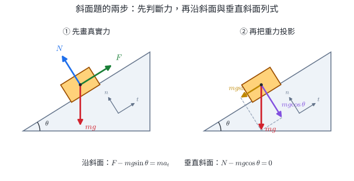{width=96%}

圖 3 的 $t$ 軸沿斜面、$n$ 軸垂直斜面。沿 $t$ 軸的重力分量使物體下滑；沿 $n$ 軸的分量由正向力平衡，因此兩個分量要分別進入兩條方程。

$$
N-mg\cos\theta=0
\quad\Rightarrow\quad
N=mg\cos\theta.
$$

這個結果適用於上述受力條件；斜向拉力、斜面本身加速或失去接觸都會改變 $N$。

::: worked-example
### 完整示範｜光滑斜面上的外加力

$m=2.0\ \mathrm{kg}$ 的物體在 $37^\circ$ 光滑斜面，受沿斜面向上 $20\ \mathrm N$ 的力，取 $g=10\ \mathrm{m/s^2}$、$\sin37^\circ=0.6$、$\cos37^\circ=0.8$。

沿斜面向上為正：

$$
20-mg\sin37^\circ=ma
$$

$$
20-(2.0)(10)(0.6)=(2.0)a
\Rightarrow a=4.0\ \mathrm{m/s^2}.
$$

垂直斜面方向 $N=mg\cos37^\circ=16\ \mathrm N$。
:::

::: worked-example
### 完整示範｜由指定加速度反求繩張力

$3.0\ \mathrm{kg}$ 物體在 $30^\circ$ 光滑斜面上，繩張力沿斜面向上，使物體向上加速度為 $2.0\ \mathrm{m/s^2}$。取 $g=10\ \mathrm{m/s^2}$。

依圖 3 畫 $T$、$N$、$mg$，沿斜面向上為正：

$$
T-mg\sin30^\circ=ma.
$$

$$
T=(3.0)\left[10(0.5)+2.0\right]=21\ \mathrm N.
$$

垂直斜面方向：

$$
N=mg\cos30^\circ=15\sqrt3\ \mathrm N.
$$

本題由加速度條件反推合力；物體當下速度的方向不進入此力學方程。
:::

::: self-check
### 練習｜斜面模型

1. $4.0\ \mathrm{kg}$ 物體在 $30^\circ$ 光滑斜面上自由下滑，求 $a$ 與 $N$。取 $g=10\ \mathrm{m/s^2}$。
2. 上題若另施加沿斜面向上 $28\ \mathrm N$ 的力，求加速度。
3. $5.0\ \mathrm{kg}$ 物體在 $37^\circ$ 斜面上保持靜止，沒有其他沿斜面外力。求靜摩擦力的量值與方向。取 $g=10\ \mathrm{m/s^2}$、$\sin37^\circ=0.6$。
4. 物塊在斜面上受一支斜向離開斜面的拉力。說明正向力相較於沒有拉力時如何改變。

**簡答：**1. $a=5.0\ \mathrm{m/s^2}$ 向下，$N=20\sqrt3\ \mathrm N$。2. $a=2.0\ \mathrm{m/s^2}$ 向上。3. $30\ \mathrm N$ 沿斜面向上。4. 拉力的離面分量分擔垂直方向的平衡，$N$ 減小。
:::

### 視重：秤量到的是接觸力

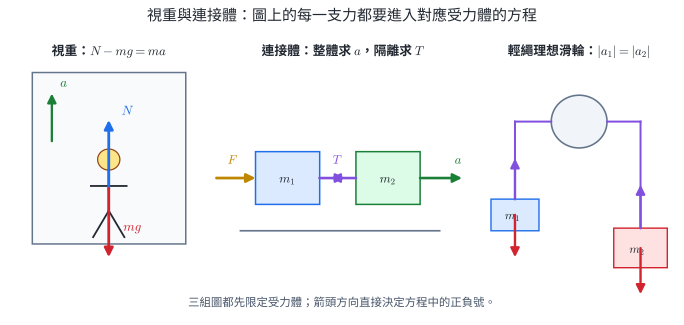{width=98%}

人在電梯內站上秤，秤的讀數對應正向力量值 $N$。取向上為正：

$$
N-mg=ma
\quad\Rightarrow\quad
\boxed{N=m(g+a)}.
$$

向上加速時 $N>mg$；向下加速時 $N<mg$。速度向上或向下本身不決定讀數，**加速度方向**才決定。

::: why
### 秤讀數是支持力，會隨加速度改變

秤感測支撐力 $N$。電梯加速時，同一個人的 $N$ 會改變，因此控制系統估載重時須知道動態狀態，或在穩定條件下校正。自由落下時，人與秤同時以 $g$ 向下加速，秤無須提供支撐力，讀數為 0；人的質量仍維持不變。
:::

::: worked-example
### 完整示範｜向上運動但速率減少的電梯

$60\ \mathrm{kg}$ 乘客站在秤上。電梯向上運動，以 $2.0\ \mathrm{m/s^2}$ 的加速度量值減速，取 $g=10\ \mathrm{m/s^2}$。

依圖 3A 左圖，向上為正。向上運動且減速，所以 $a=-2.0\ \mathrm{m/s^2}$：

$$
N=m(g+a)=60(10-2)=480\ \mathrm N.
$$

讀值小於靜止時的 $mg=600\ \mathrm N$。
:::

::: worked-example
### 完整示範｜由秤讀值判斷加速度

$60\ \mathrm{kg}$ 乘客的秤讀值對應 $N=720\ \mathrm N$，取 $g=10\ \mathrm{m/s^2}$。

$$
720-600=60a
\quad\Rightarrow\quad
a=+2.0\ \mathrm{m/s^2}.
$$

加速度向上。電梯若當下向下運動，速率正在減少；若向上運動，速率正在增加。
:::

::: self-check
### 練習｜電梯視重

1. $50\ \mathrm{kg}$ 人在靜止電梯內，取 $g=10\ \mathrm{m/s^2}$，求 $N$。
2. 上題電梯以 $3.0\ \mathrm{m/s^2}$ 向上加速，求 $N$。
3. 上題電梯以 $3.0\ \mathrm{m/s^2}$ 向下加速，求 $N$。
4. 電梯與乘客同時自由落下的理想極限中，求 $N$，並說明乘客質量是否改變。

**簡答：**1. $500\ \mathrm N$。2. $650\ \mathrm N$。3. $350\ \mathrm N$。4. $N=0$；質量不變。
:::

### 連接體：整體求加速度，隔離求內力

理想輕繩不可伸長，連接物沿繩方向具有相同加速度量值。把整個系統視為一體時，張力等內力互相抵銷，可先求共同 $a$；要找張力或接觸力，必須再隔離其中一物體。

::: worked-example
### 完整示範｜水平面上兩物塊的接觸力

圖 3A 中圖的光滑水平面上，$m_1=2.0\ \mathrm{kg}$、$m_2=3.0\ \mathrm{kg}$，以 $20\ \mathrm N$ 向右推左側物塊。先把兩塊視為整體：

$$
a=\frac{F}{m_1+m_2}
=\frac{20}{5.0}
=4.0\ \mathrm{m/s^2}.
$$

再隔離 $m_2$，它的水平合力只有 $m_1$ 對它的接觸力 $C$：

$$
C=m_2a=(3.0)(4.0)=12\ \mathrm N.
$$

第三定律給出 $m_2$ 對 $m_1$ 的接觸力也是 $12\ \mathrm N$，方向向左。
:::

::: worked-example
### 完整示範｜阿特伍德機

理想滑輪兩側懸掛 $m_1=1.0\ \mathrm{kg}$、$m_2=4.0\ \mathrm{kg}$，取 $g=10\ \mathrm{m/s^2}$。較重的 $m_2$ 向下：

$$
m_2g-T=m_2a,
\qquad
T-m_1g=m_1a.
$$

相加消去 $T$：

$$
a=\frac{m_2-m_1}{m_1+m_2}g=6.0\ \mathrm{m/s^2}.
$$

代回 $T-m_1g=m_1a$，得 $T=16\ \mathrm N$。
:::

::: self-check
### 練習｜連接體

1. 光滑水平面上 $1.0\ \mathrm{kg}$ 與 $3.0\ \mathrm{kg}$ 物塊以輕繩相連，$12\ \mathrm N$ 向右拉右塊。求 $a$、$T$。
2. 上題改為 $12\ \mathrm N$ 向左拉左塊，求 $a$、$T$ 的量值。
3. 阿特伍德機 $m_1=2.0\ \mathrm{kg}$、$m_2=3.0\ \mathrm{kg}$，取 $g=10\ \mathrm{m/s^2}$，求 $a$、$T$。
4. 阿特伍德機兩側質量同時加倍，比較 $a$ 與 $T$。
5. 繩的質量不可忽略時，說明為何張力可能沿繩改變。

**簡答：**1. $a=3.0\ \mathrm{m/s^2}$ 向右、$T=3.0\ \mathrm N$。2. $a=3.0\ \mathrm{m/s^2}$ 向左、$T=9.0\ \mathrm N$。3. $a=2.0\ \mathrm{m/s^2}$、$T=24\ \mathrm N$。4. $a$ 不變，$T$ 加倍。5. 繩段本身需要合力來加速，其兩端張力有差。
:::

::: self-check
### 練習

一物體在水平面上，受到向右 $9\ \mathrm N$ 與向左 $3\ \mathrm N$，質量 $2\ \mathrm{kg}$。加速度為何？

**答案：**合力向右 $6\ \mathrm N$，所以 $a=6/2=3\ \mathrm{m/s^2}$ 向右。不能把其中 $9\ \mathrm N$ 單獨設成 $ma$。
:::

## 4. 牛頓第三定律：每個交互作用都有兩端

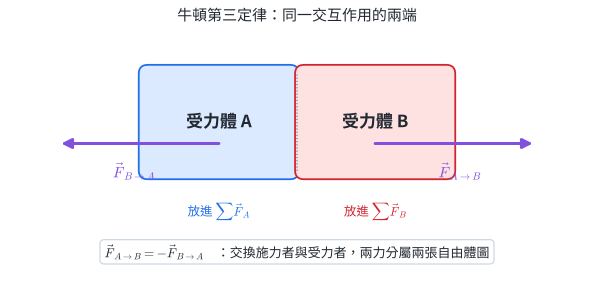{width=96%}

A 作用在 B 的力與 B 作用在 A 的力：

$$
\boxed{\vec F_{A\to B}=-\vec F_{B\to A}}.
$$

它們量值相等、方向相反、同時出現、屬於同一種交互作用，但**作用在不同物體上**。因此不會在某一物體的 $\sum\vec F$ 中互相抵銷。

圖 4 的下標先寫施力者、箭頭後寫受力者。交換兩者便得到配對力；受力者不同，所以列某一物體的 $\sum\vec F$ 時只會收進其中一支。

| 判斷 | 第三定律力對 | 同一物體上的兩個力 |
|---|---|---|
| 作用在哪裡 | 不同物體 | 同一物體 |
| 力的種類 | 同一交互作用兩端 | 可以是不同交互作用 |
| 是否必等大反向 | 是 | 兩者是僅有的兩力且合力為 0 時才等大反向 |

例如書靜止在水平桌面上且只受重力與正向力：兩力作用在同一本書上，等大反向並使合力為 0，但不是第三定律力對。重力的配對是書拉地球；正向力的配對是書壓桌面。

::: worked-example
### 完整示範｜書與桌面中的兩組交互作用

書靜止在桌上，以書為受力體：

$$
N-mg=0.
$$

重力與正向力都作用在書上，分別來自地球引力與桌面接觸。它們的配對為：

- 地球對書的引力 ↔ 書對地球的引力；
- 桌面對書的正向力 ↔ 書對桌面的接觸力。

平衡方程說明書的加速度；第三定律說明交互作用如何連接兩個物體。
:::

::: worked-example
### 完整示範｜小車與卡車碰撞的力與加速度

碰撞某一瞬間，卡車對 $1000\ \mathrm{kg}$ 小車的力為 $6000\ \mathrm N$ 向左。小車對 $2000\ \mathrm{kg}$ 卡車的力為 $6000\ \mathrm N$ 向右。若碰撞力主導各自水平合力：

$$
|a_{\mathrm{car}}|=\frac{6000}{1000}=6.0\ \mathrm{m/s^2},
$$

$$
|a_{\mathrm{truck}}|=\frac{6000}{2000}=3.0\ \mathrm{m/s^2}.
$$

交互作用力等大，質量較小的小車具有較大加速度量值。
:::

::: why
### 火箭以排出質量獲得反作用力

火箭把燃氣向後加速，同時受到燃氣向前的作用力。第三定律的交互作用發生在火箭與噴出的燃氣之間，因此真空中仍能產生推力。兩力分別作用在燃氣與火箭；分析火箭時只收集燃氣對火箭的力。
:::

::: self-check
### 練習

小車撞大卡車時，哪一方受到的碰撞力量值較大？哪一方加速度通常較大？

**答案：**相互作用力量值相等、方向相反；小車質量較小，同樣力下加速度量值通常較大。力相等不代表運動改變相等。
:::

::: self-check
### 練習｜第三定律力對

1. 人向下壓秤，寫出秤對人之力的配對力。
2. 地球拉蘋果與蘋果拉地球的力量值如何比較？加速度量值如何比較？
3. 人用 $80\ \mathrm N$ 向右推牽引車，牽引車對人的力為何？
4. 說明力對為何分屬兩個合力式。
5. 溜冰的甲、乙互推，乙質量是甲的 2 倍。比較推力與加速度量值。

**簡答：**1. 人對秤向下的力。2. 力等大反向；蘋果加速度量值遠大於地球。3. $80\ \mathrm N$ 向左。4. 兩力的受力者不同。5. 推力等大；甲的加速度量值是乙的 2 倍。
:::

## Part B｜從速度轉向到週期振盪

## 5. 等速圓周運動：徑向合力提供向心加速度

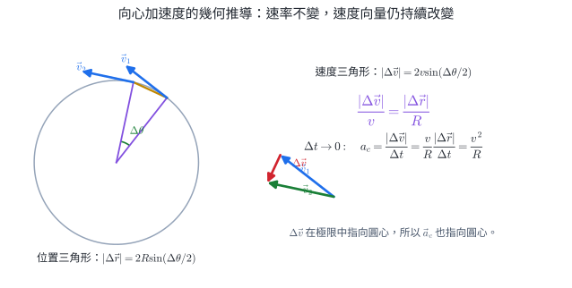{width=98%}

在固定轉軸下先選定正轉向，例如從紙面外看取逆時針為正。角位置 $\theta$ 以弧度表示；從 $\theta_1$ 轉到 $\theta_2$ 的角位移為

$$
\Delta\theta=\theta_2-\theta_1=\frac{s}{R}.
$$

$s$ 是帶正負號的弧長：沿正轉向為正，反向為負。弧度是弧長與半徑的比，量綱為 1；書寫角速度時仍保留 rad 以辨識角量。平均角速度與瞬時角速度分別為

$$
\bar\omega=\frac{\Delta\theta}{\Delta t},
\qquad
\omega=\lim_{\Delta t\to0}\frac{\Delta\theta}{\Delta t},
$$

單位為 $\mathrm{rad/s}$，正負號表示轉動方向。等速圓周運動的角速率是 $|\omega|$。

短時間 $\Delta t$ 內，位置向量轉過 $\Delta\theta$，速度向量也轉過同一夾角。圖 5A 的兩個等腰三角形給出

$$
|\Delta\vec r|=2R\sin\frac{\Delta\theta}{2},
\qquad
|\Delta\vec v|=2v\sin\frac{\Delta\theta}{2}.
$$

因此

$$
\frac{|\Delta\vec v|}{v}
=\frac{|\Delta\vec r|}{R}.
$$

當 $\Delta t\to0$，$|\Delta\vec r|/\Delta t\to v$，故

$$
a_c=\lim_{\Delta t\to0}\frac{|\Delta\vec v|}{\Delta t}
=\frac vR\lim_{\Delta t\to0}\frac{|\Delta\vec r|}{\Delta t}
=\boxed{\frac{v^2}{R}}.
$$

速度差在極限中指向圓心，因此向心加速度與瞬時速度垂直。

每轉一圈的角位移量值為 $2\pi$ rad，頻率 $f$ 是每秒圈數，週期 $T$ 是每圈所需時間。本章在週期公式中以非負的角速率 $\omega_{\mathrm{speed}}=|\omega|$ 表示轉動快慢，通常簡寫為 $\omega$：

$$
f=\frac1T,
\qquad
\boxed{\omega_{\mathrm{speed}}=2\pi f=\frac{2\pi}{T}},
\qquad
\boxed{v=R|\omega|=R\omega_{\mathrm{speed}}=\frac{2\pi R}{T}}.
$$

雖然速率 $v$ 不變，速度方向沿切線持續改變，所以有指向圓心的加速度：

$$
\boxed{a_c=\frac{v^2}{R}=R\omega^2=\frac{4\pi^2R}{T^2}}.
$$

依牛頓第二定律，指向圓心的合力分量為

$$
\boxed{\sum F_r=ma_c=m\frac{v^2}{R}}.
$$

「向心力」只是這個徑向合力的角色名稱。繩張力、重力、正向力、摩擦作用或數力合成，都可能提供它；自由體圖不再額外畫一支「向心力」。

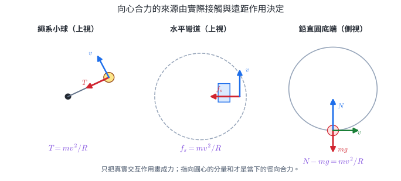{width=98%}

圖 5B 的每一個方程都由受力圖沿指向圓心的徑向投影而得。速度箭頭沿切線，只用來確定軌跡與當下轉向方式，不是一支力。

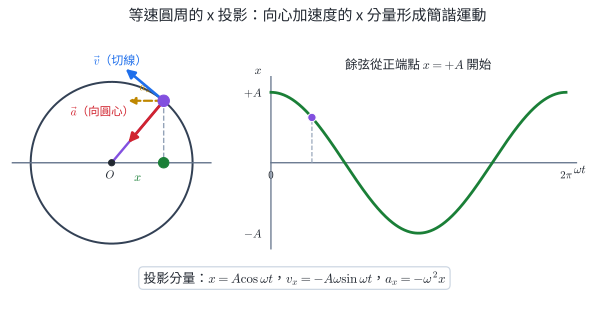{width=96%}

圖 5 的紅箭頭是完整向心加速度 $\vec a$；橙色虛線才是它在投影方向的分量 $a_x=-\omega^2x$。右側餘弦曲線由 $t=0$ 的正端點 $x=+A$ 出發，與本節採用的 $x=A\cos\omega t$ 相位一致。

::: worked-example
### 完整示範｜旋轉平台上的物體

$m=0.50\ \mathrm{kg}$ 的物體以 $R=0.80\ \mathrm m$、週期 $T=2.0\ \mathrm s$ 作等速圓周運動：

$$
v=\frac{2\pi(0.80)}{2.0}=0.80\pi\ \mathrm{m/s},
$$

$$
a_c=\frac{4\pi^2(0.80)}{(2.0)^2}=0.80\pi^2\ \mathrm{m/s^2}.
$$

所需徑向合力量值為 $ma_c=0.40\pi^2\ \mathrm N$，方向始終指向圓心。
:::

::: worked-example
### 完整示範｜水平繩系小球

圖 5B 左圖的 $0.30\ \mathrm{kg}$ 小球以 $R=0.60\ \mathrm m$、$v=4.0\ \mathrm{m/s}$ 在水平面內繞圈，徑向力只有繩張力。

$$
T=m\frac{v^2}{R}
=(0.30)\frac{4.0^2}{0.60}
=8.0\ \mathrm N.
$$

繩斷的瞬間，小球保留當下切線速度；後續軌跡由斷繩後仍存在的力決定。
:::

::: worked-example
### 完整示範｜水平彎道的最大速率

$900\ \mathrm{kg}$ 汽車通過半徑 $50\ \mathrm m$ 的水平彎道，輪胎與路面可提供的最大水平靜摩擦力為 $3600\ \mathrm N$。極限狀態下，圖 5B 中圖的靜摩擦力完全提供向心合力：

$$
3600=900\frac{v_{\max}^2}{50},
$$

$$
v_{\max}=\sqrt{200}\approx14.1\ \mathrm{m/s}.
$$

濕滑路面可提供的最大摩擦力較小，所以安全通過速率也較小。
:::

::: worked-example
### 完整示範｜鉛直圓底端的正向力

圖 5B 右圖中，$0.20\ \mathrm{kg}$ 物體通過鉛直圓底端，$R=0.50\ \mathrm m$、$v=4.0\ \mathrm{m/s}$，取 $g=9.8\ \mathrm{m/s^2}$。底端指向圓心的方向向上：

$$
N-mg=m\frac{v^2}{R}.
$$

$$
N=(0.20)(9.8)+(0.20)\frac{16}{0.50}
=8.36\ \mathrm N.
$$

$N>mg$ 提供了向上合力，使速度向量轉向。
:::

::: why
### 向心加速度連結彎道、脫水與離心設備

速度方向改變得越快，需要的向心加速度越大；$a_c=v^2/R$ 顯示速率加倍，需求變 4 倍，彎得更急也會增大需求。道路因此以路面作用力的水平分量協助轉彎。滾筒內物體若失去足夠向心作用，就依慣性沿切線離開原圓軌跡；「被甩出」不是多出一種向外基本力，而是約束不足後的運動結果。
:::

::: self-check
### 練習

同一物體以相同速率繞半徑減半的圓，向心加速度與向心合力變成幾倍？

**答案：**$a_c=v^2/R$，半徑減半使 $a_c$ 變 2 倍；質量不變，所以所需合力也變 2 倍。
:::

::: self-check
### 練習｜向心加速度與實際受力

1. 半徑 $0.50\ \mathrm m$、頻率 $2.0\ \mathrm{Hz}$，求 $\omega$、$v$、$a_c$。
2. 同一半徑中，週期加倍，$v$ 與 $a_c$ 各變為幾倍？
3. $0.40\ \mathrm{kg}$ 小球以 $R=0.80\ \mathrm m$、$v=3.0\ \mathrm{m/s}$ 繞水平圓，徑向力只有張力。求 $T$。
4. $1000\ \mathrm{kg}$ 車以 $10\ \mathrm{m/s}$ 通過 $R=40\ \mathrm m$ 水平彎道，求所需摩擦力量值。
5. 鉛直圓底端 $N=3mg$，求 $v^2/R$ 與 $g$ 的關係。
6. 彎道半徑不變，可提供的最大徑向力減為原來 $1/4$，安全最大速率變為幾倍？

**簡答：**1. $4\pi\ \mathrm{rad/s}$、$2\pi\ \mathrm{m/s}$、$8\pi^2\ \mathrm{m/s^2}$。2. $v$ 變 $1/2$，$a_c$ 變 $1/4$。3. $4.5\ \mathrm N$。4. $2500\ \mathrm N$ 指向彎道中心。5. $v^2/R=2g$。6. $1/2$。
:::

## 6. 簡諧運動：回復力把物體拉回，又因慣性越過平衡點

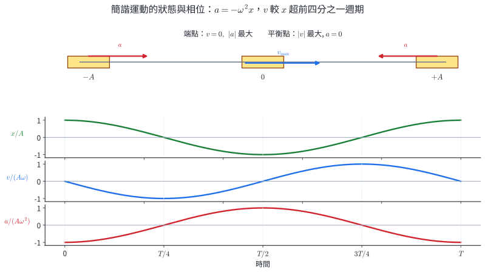{width=98%}

圖 6A 先給出狀態關係：端點的速度為 0，回復加速度量值最大；平衡點的加速度為 0，速率最大。接下來用線性回復力導出這些關係。

理想水平彈簧連接質量 $m$，以平衡位置為 $x=0$。虎克定律配合牛頓第二定律：

$$
ma=-kx
\quad\Rightarrow\quad
\boxed{a=-\frac{k}{m}x}.
$$

若定義

$$
\omega=\sqrt{\frac{k}{m}},
$$

便有 $a=-\omega^2x$。符合「加速度與位移成正比、方向相反」的週期運動叫**簡諧運動**。若 $t=0$ 在正端點，可寫

$$
\boxed{x=A\cos\omega t},
$$

$$
\boxed{v=-A\omega\sin\omega t},
\qquad
\boxed{a=-A\omega^2\cos\omega t=-\omega^2x}.
$$

週期與彈簧系統關係：

$$
\boxed{T=\frac{2\pi}{\omega}=2\pi\sqrt{\frac{m}{k}}}.
$$

| 位置 | 速度量值 | 加速度量值 |
|---|---:|---:|
| 端點 $|x|=A$ | 0 | 最大 $A\omega^2$ |
| 平衡點 $x=0$ | 最大 $A\omega$ | 0 |

由 $\sin^2\omega t+\cos^2\omega t=1$ 可消去時間：

$$
\boxed{v^2=\omega^2(A^2-x^2)}.
$$

這條式給出速率量值；速度正負仍由當下運動方向決定。

### 簡諧運動的正弦與餘弦形式

半徑 $A$、角速率 $\omega$ 的等速圓周運動，在 $x$ 軸的投影為 $x=A\cos\omega t$；速度與加速度的投影也正好是上式。圓周投影提供幾何模型，不表示做簡諧運動的物體真的繞圓。

::: pitfall
### 常見錯誤｜把簡諧運動當等加速度

$a=-\omega^2x$ 隨位置改變，不是定值，因此不能把第 2 章的等加速度三式跨整段套用。$T=2\pi\sqrt{m/k}$ 也依賴理想彈簧、比例限度、阻力可忽略等模型條件。
:::

::: why
### 微型加速度計以彈簧形變估計加速度

微機電加速度計內有可微小位移的質量與彈性結構。外殼加速時，內部質量因慣性相對外殼偏移；電路量到位移，再利用已校準的力—位移與動態模型反推加速度。外界變化接近感測結構的固有頻率時，輸出會被放大並產生相位差，因此工程設計須限定工作頻帶，並加入阻尼與校正。
:::

::: worked-example
### 完整示範｜由 $x(t)$ 讀出整個簡諧運動

$$
x=(0.080\ \mathrm m)\cos(4\pi t).
$$

所以 $A=0.080\ \mathrm m$、$\omega=4\pi\ \mathrm{rad/s}$，

$$
T=\frac{2\pi}{4\pi}=0.50\ \mathrm s,
$$

$$
v_{\max}=A\omega=0.32\pi\ \mathrm{m/s},
\qquad
a_{\max}=A\omega^2=1.28\pi^2\ \mathrm{m/s^2}.
$$
:::

::: worked-example
### 完整示範｜由彈簧參數求週期與極值

$m=0.45\ \mathrm{kg}$、$k=180\ \mathrm{N/m}$、$A=0.050\ \mathrm m$。

$$
\omega=\sqrt{\frac{180}{0.45}}=20\ \mathrm{rad/s},
\qquad
T=\frac{2\pi}{20}=0.314\ \mathrm s.
$$

依圖 6A，最大速率在平衡點，最大加速度量值在端點：

$$
v_{\max}=A\omega=(0.050)(20)=1.0\ \mathrm{m/s},
$$

$$
a_{\max}=A\omega^2=(0.050)(400)=20\ \mathrm{m/s^2}.
$$
:::

::: worked-example
### 完整示範｜由位置與運動方向求速度

簡諧物體的振幅為 $A$、角頻率為 $\omega$，當下在 $x=+A/2$ 且向右運動。

$$
|v|=\omega\sqrt{A^2-\left(\frac A2\right)^2}
=\frac{\sqrt3}{2}A\omega.
$$

向右為正，所以

$$
v=+\frac{\sqrt3}{2}A\omega.
$$

加速度為

$$
a=-\omega^2\frac A2=-\frac12A\omega^2,
$$

方向向左。此刻物體向右運動，速度與加速度反向，速率正在減少。
:::

::: self-check
### 練習

簡諧物體從正端點往平衡點運動時，速度與加速度方向如何？

**答案：**速度指向平衡點；在正位移區 $a=-\omega^2x<0$，加速度也指向平衡點。通過平衡點後，速度仍向負方向，但加速度改向正方向，所以開始減速。
:::

::: self-check
### 練習｜簡諧狀態、相位與參數

1. $x=0.040\cos(8t)$（SI 單位），求 $A$、$\omega$、$T$。
2. 上題求 $v_{\max}$ 與 $a_{\max}$。
3. 物體在 $x=-A$ 時，寫出 $v$ 與 $a$ 方向。
4. 物體由 $x=0$ 向 $+A$ 運動時，速率與加速度量值各如何變化？
5. $A=0.10\ \mathrm m$、$\omega=6.0\ \mathrm{rad/s}$，在 $x=0.080\ \mathrm m$ 時求速率量值。
6. 彈簧質量系統的 $m$ 增為 4 倍，$k$ 不變。比較 $\omega$、$T$。

**簡答：**1. $0.040\ \mathrm m$、$8.0\ \mathrm{rad/s}$、$\pi/4\ \mathrm s$。2. $0.32\ \mathrm{m/s}$、$2.56\ \mathrm{m/s^2}$。3. $v=0$，$a$ 向 $+x$。4. 速率由最大減至 0，$|a|$ 由 0 增至最大，$a$ 向 $-x$。5. $0.36\ \mathrm{m/s}$。6. $\omega$ 變 $1/2$，$T$ 變 2 倍。
:::

## 7. 理解支援｜小角度單擺

教材探索｜小角度近似，核心先會判讀條件

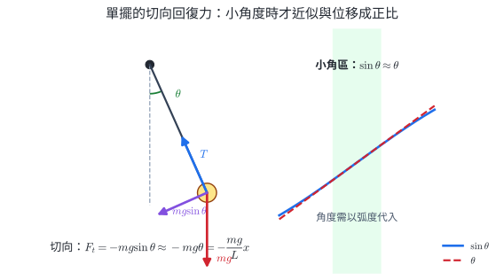{width=94%}

長度 $L$ 的單擺，切向回復力為 $-mg\sin\theta$。小角度且以弧度表示時，$\sin\theta\approx\theta$，弧長 $x=L\theta$，因此

$$
F_t\approx-mg\frac{x}{L}.
$$

形式與 $-kx$ 相同，所以小角度單擺近似簡諧，週期為

$$
\boxed{T=2\pi\sqrt{\frac{L}{g}}}.
$$

週期與擺球質量無關；小角度近似下也近似不依振幅。角度大時 $\sin\theta\approx\theta$ 失效，週期會偏離此式。

::: why
### 擺鐘週期與重力測量取決於擺長

$T\propto\sqrt L$，所以改變有效擺長就能調整走時。由於 $T\propto1/\sqrt g$，不同地點的重力加速度差異會使同一擺鐘產生微小走時差。反過來，精確量得 $L,T$ 後可由 $g=4\pi^2L/T^2$ 估計當地 $g$，但須控制振幅、空氣阻力、支點摩擦與長度定義。
:::

::: worked-example
### 完整示範｜擺長對週期的影響

$L=0.81\ \mathrm m$，取 $g=10\ \mathrm{m/s^2}$：

$$
T=2\pi\sqrt{\frac{0.81}{10}}
\approx1.79\ \mathrm s.
$$

若擺長增為 $4L$，

$$
\frac{T'}T=\sqrt{\frac{4L}{L}}=2,
$$

新週期約 $3.58\ \mathrm s$。
:::

::: worked-example
### 完整示範｜由擺長與週期估計 $g$

擺長 $L=0.640\ \mathrm m$，小角度測得週期 $T=1.60\ \mathrm s$。

$$
g=\frac{4\pi^2L}{T^2}
=\frac{4\pi^2(0.640)}{1.60^2}
=\pi^2
\approx9.87\ \mathrm{m/s^2}.
$$

擺長由懸點量到擺球質心。實驗可量 10 或 20 週總時間後再除以週數，降低單次按表反應時間的影響。
:::

::: self-check
### 練習｜小角度單擺

1. $L=1.00\ \mathrm m$、$g=9.8\ \mathrm{m/s^2}$，求週期。
2. 擺球質量加倍，擺長不變，比較週期。
3. 週期要增為 3 倍，擺長要變為幾倍？
4. 大擺角資料比小角度公式預測的週期略長。指出推導中已偏離實際的近似步驟。

**簡答：**1. 約 $2.01\ \mathrm s$。2. 不變。3. 9 倍。4. $\sin\theta\approx\theta$ 的小角度近似已不足。
:::

## 8. 一頁核心整理

::: summary-box
### 三大定律與解題骨架

- 第一：$\sum\vec F=0\Rightarrow\vec v$ 為常向量。
- 第二：$\sum\vec F=m\vec a$；先畫自由體圖，再逐分量列式。
- 第三：$\vec F_{A\to B}=-\vec F_{B\to A}$；兩力在不同物體。
- 虎克：比例限度內 $\vec F_s=-k\vec x$。

### 圓周

$$
\omega_{\mathrm{speed}}=2\pi f=\frac{2\pi}{T},
\quad
v=R|\omega|,
\quad
a_c=\frac{v^2}{R}=R\omega^2,
\quad
\sum F_r=ma_c.
$$

向心力是徑向合力的角色，不另畫成一種力。

### 簡諧

$$
a=-\omega^2x,
\quad
x=A\cos\omega t,
\quad
T=\frac{2\pi}{\omega}.
$$

彈簧：$\omega=\sqrt{k/m}$、$T=2\pi\sqrt{m/k}$。小角度單擺：$T=2\pi\sqrt{L/g}$。
:::

## 9. 代表題：分層練習

### 題目 1｜力的分量與合成

一物體同時受 $10\ \mathrm N$ 向東與 $10\ \mathrm N$ 北偏西 $60^\circ$ 的力。先畫向量分量圖，再求合力分量與量值。

### 題目 2｜虎克定律

彈簧自然長 $20\ \mathrm{cm}$，受 $6.0\ \mathrm N$ 拉力後長 $23\ \mathrm{cm}$。在比例限度內，求 $k$；若壓縮至 $18\ \mathrm{cm}$，彈簧作用力的量值與方向為何？

### 題目 3｜斜面與自由體圖

$3.0\ \mathrm{kg}$ 物體在 $30^\circ$ 光滑斜面上自由滑下，取 $g=10\ \mathrm{m/s^2}$。由自由體圖判斷應採「沿斜面／垂直斜面」或「水平／鉛直」分量較直接，再求沿斜面加速度與正向力。

### 題目 4｜第三定律辨析

書靜止在桌上。畫出書、桌面、地球三個節點，以箭頭連出兩組交互作用；標明「地球對書的重力」與「桌面對書的正向力」各自的第三定律配對，並說明書上的兩力為何不是一對作用反作用力。

### 題目 5｜連接體

光滑水平面上，$2.0\ \mathrm{kg}$ 木塊在左、$3.0\ \mathrm{kg}$ 木塊在右並彼此接觸。以水平 $20\ \mathrm N$ 向右推左側木塊，求共同加速度與接觸力量值；若改以同樣的力向右推右側木塊，比較共同加速度與接觸力量值。

### 題目 6｜視重

質量 $60\ \mathrm{kg}$ 的人站在電梯秤上，取向上為正。速度感測器顯示 $t=0$ 時 $v_y=+4.0\ \mathrm{m/s}$，$t=0.50\ \mathrm s$ 時 $v_y=+3.0\ \mathrm{m/s}$，區間內加速度近似固定。取 $g=10\ \mathrm{m/s^2}$，求秤的正向力。

### 題目 7｜等速圓周

$0.25\ \mathrm{kg}$ 小球在 $5.0\ \mathrm s$ 內逆時針完成 10 圈，圓周半徑為 $0.50\ \mathrm m$。取逆時針角位移為正，求帶符號角速度、線速率、向心加速度與徑向合力量值。

### 題目 8｜簡諧運動

$0.50\ \mathrm{kg}$ 物體連接 $k=200\ \mathrm{N/m}$ 的理想彈簧，在光滑水平面作振幅 $0.040\ \mathrm m$ 的振動；實測週期為 $0.320\ \mathrm s$。選用理想簡諧模型求角頻率、理論週期、最大速率與最大加速度，並計算實測週期相對理論值的百分差。

### 題目 9｜小角度單擺與範圍

同一支長 $1.00\ \mathrm m$ 的單擺先後換上 $0.10\ \mathrm{kg}$、$0.20\ \mathrm{kg}$ 擺球，小角度量得週期均約 $2.0\ \mathrm s$；改用同一擺球作大擺角運動時，週期略增。取 $g=9.8\ \mathrm{m/s^2}$，用小角模型估計週期，並判斷兩組資料分別支持或偏離模型的哪一項前提。

### 題目 10｜牛頓第二定律實驗

固定系統質量時，實驗最佳直線為 $a=0.32F_{\mathrm{net}}+0.05$（SI 單位）。求斜率對應的系統質量，並解釋截距的物理意義。

### 題目 11｜電梯視重

$55\ \mathrm{kg}$ 人在電梯中，秤讀值對應 $N=440\ \mathrm N$，取 $g=10\ \mathrm{m/s^2}$。求加速度。若電梯當時向下運動，判斷速率增減。

### 題目 12｜阿特伍德機

理想滑輪兩側懸掛 $3.0\ \mathrm{kg}$ 與 $5.0\ \mathrm{kg}$，取 $g=10\ \mathrm{m/s^2}$。畫兩物體受力圖，求加速度與繩張力。

### 題目 13｜鉛直圓底端

$0.50\ \mathrm{kg}$ 物體在 $R=1.0\ \mathrm m$ 的鉛直圓軌道底端速率為 $5.0\ \mathrm{m/s}$，取 $g=10\ \mathrm{m/s^2}$。畫受力圖並求軌道對物體的正向力。

### 題目 14｜簡諧相位

簡諧物體滿足 $x=0.10\cos(4t)$（SI 單位）。求 $t=\pi/8\ \mathrm s$ 時的 $x$、$v$、$a$，並在相位圖上指出該時刻。

### 題目 15｜單擺資料

小角度單擺實驗得到下表。以通過原點的 $T^2$--$L$ 最佳線斜率約 $4.01\ \mathrm{s^2/m}$，由模型估計 $g$，並指出量測多週總時間再除以週數的目的。

| $L$（m） | $0.40$ | $0.60$ | $0.80$ |
|---:|---:|---:|---:|
| $T$（s） | $1.27$ | $1.55$ | $1.79$ |

### 整合題 1｜斜面連接體

兩個物塊 $m_1=2.0\ \mathrm{kg}$、$m_2=3.0\ \mathrm{kg}$ 在同一 $30^\circ$ 光滑斜面上以輕繩前後相連。$35\ \mathrm N$ 力沿斜面向上拉前方 $m_2$。取 $g=10\ \mathrm{m/s^2}$，畫兩個受力圖，求共同加速度與繩張力。

### 整合題 2｜彈簧提供向心合力

$0.40\ \mathrm{kg}$ 小球連接自然長 $0.50\ \mathrm m$、$k=80\ \mathrm{N/m}$ 的彈簧，在光滑水平面上以半徑 $0.60\ \mathrm m$ 繞圓。彈簧沿半徑方向指向圓心。求彈簧力與小球速率。

### 整合題 3｜電梯內的彈簧秤

$2.0\ \mathrm{kg}$ 物體懸掛在 $k=500\ \mathrm{N/m}$ 彈簧下端，與電梯相對靜止。電梯以 $2.0\ \mathrm{m/s^2}$ 向上加速，取 $g=10\ \mathrm{m/s^2}$。畫物體受力圖，求彈簧伸長量。

### 整合題 4｜簡諧運動感測數據

感測器測得某振動系統在 $t=0$、$0.20$、$0.40$、$0.60$、$0.80\ \mathrm s$ 的位移分別為 $+4.0$、0、$-4.0$、0、$+4.0\ \mathrm{cm}$。建立無初相的 cosine 模型，求 $\omega$、$v_{\max}$，並預測 $t=0.10\ \mathrm s$ 的位移。

::: page-break
:::

## 10. 完整解析

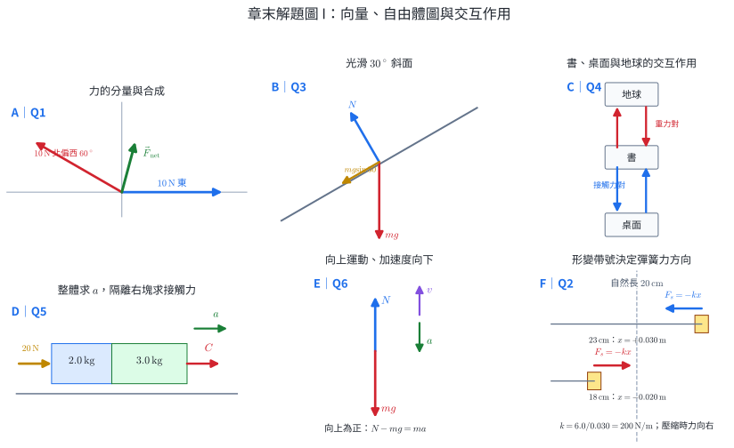{width=98%}

::: solution
### 第 1 題

依解題圖 A 的 panel A，取東、北為正。第二力北偏西 $60^\circ$，西向分量大小 $10\sin60^\circ=5\sqrt3$，北向分量 $10\cos60^\circ=5$：

$$
F_x=10-5\sqrt3,
\qquad
F_y=5.
$$

合力量值

$$
F=\sqrt{(10-5\sqrt3)^2+5^2}\approx5.18\ \mathrm N.
$$
:::

::: solution
### 第 2 題

依解題圖 A 的 panel F，令伸長為正；$23\ \mathrm{cm}$ 對應 $x=+0.030\ \mathrm m$：

$$
k=\frac{6.0}{0.030}=200\ \mathrm{N/m}.
$$

壓縮至 $18\ \mathrm{cm}$ 時 $x=-0.020\ \mathrm m$。由 panel F 的箭頭與 $F_s=-kx$，力指向正方向，量值為 $k|x|=4.0\ \mathrm N$；即把受力端向外推回自然長度。
:::

::: solution
### 第 3 題

解題圖 A 的 panel B 使兩支力各只有一個方向需要分解，因此採沿斜面與垂直斜面的座標較直接。物體受重力 $mg$ 向下與正向力 $N$ 垂直接觸面。沿斜面：

$$
mg\sin30^\circ=ma
\Rightarrow a=g\sin30^\circ=5.0\ \mathrm{m/s^2}.
$$

垂直斜面沒有加速度：

$$
N=mg\cos30^\circ=30\left(\frac{\sqrt3}{2}\right)=15\sqrt3\ \mathrm N.
$$
:::

::: solution
### 第 4 題

解題圖 A 的 panel C 以一條連線表示一組交互作用，連線兩端的反向箭頭就是第三定律力對：

- 地球對書的重力，配對為書對地球的萬有引力。
- 桌面對書的正向力，配對為書對桌面的接觸力。

重力與正向力都作用在書上；在此靜止且僅有兩力的情境中兩者等大反向、合力為 0。第三定律力對必作用在不同物體，且來自同一交互作用。
:::

::: solution
### 第 5 題

依解題圖 A 的 panel D，先把兩塊視為整體，總質量 $5.0\ \mathrm{kg}$：

$$
a=\frac{20}{5.0}=4.0\ \mathrm{m/s^2}.
$$

隔離 $3.0\ \mathrm{kg}$ 木塊，它的水平合力只有前一塊的接觸力，所以

$$
F_c=(3.0)(4.0)=12\ \mathrm N.
$$

改推右側木塊時，外力與總質量不變，所以共同加速度仍為 $4.0\ \mathrm{m/s^2}$；此時隔離左側 $2.0\ \mathrm{kg}$ 木塊，接觸力為

$$
F_c=(2.0)(4.0)=8.0\ \mathrm N.
$$

接觸力取決於它需要加速哪一部分系統，因此兩種推法的接觸力不同。
:::

::: solution
### 第 6 題

由速度資料先求

$$
a=\frac{3.0-4.0}{0.50}=-2.0\ \mathrm{m/s^2}.
$$

依解題圖 A 的 panel E，速度向上而加速度向下；取向上為正：

$$
N-mg=ma
\Rightarrow
N=m(g+a)=60(10-2)=480\ \mathrm N.
$$

視重小於實重。速度方向不直接決定秤讀數。
:::

::: solution
### 第 7 題

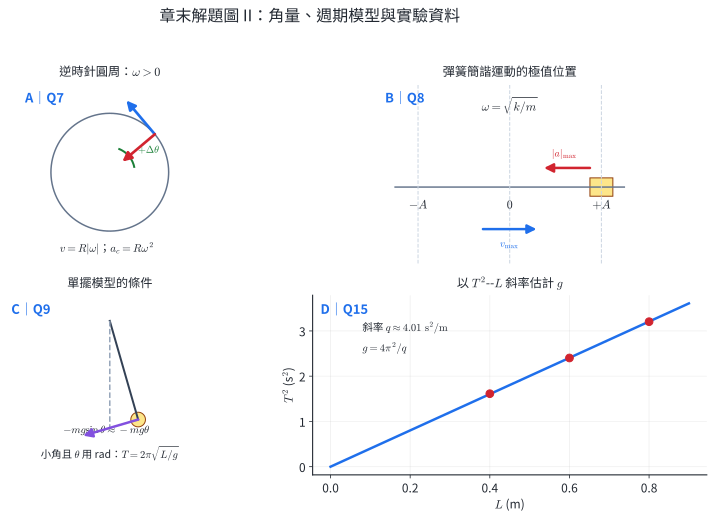{width=98%}

觀測頻率為 $f=10/5.0=2.0\ \mathrm{Hz}$。依解題圖 B 的 panel A，逆時針為正，所以

$$
\omega=2\pi f=4\pi\ \mathrm{rad/s},
$$

$$
v=R\omega=(0.50)(4\pi)=2\pi\ \mathrm{m/s},
$$

$$
a_c=R\omega^2=(0.50)(4\pi)^2=8\pi^2\ \mathrm{m/s^2},
$$

$$
F_r=ma_c=(0.25)(8\pi^2)=2\pi^2\ \mathrm N.
$$

方向皆針對徑向量：加速度與合力指向圓心。
:::

::: solution
### 第 8 題

依解題圖 B 的 panel B，端點給最大加速度量值，平衡點給最大速率。理想模型先給

$$
\omega=\sqrt{\frac{k}{m}}=\sqrt{\frac{200}{0.50}}=20\ \mathrm{rad/s},
$$

$$
T=\frac{2\pi}{20}=\frac{\pi}{10}\ \mathrm s\approx0.314\ \mathrm s.
$$

$$
v_{\max}=A\omega=(0.040)(20)=0.80\ \mathrm{m/s},
$$

$$
a_{\max}=A\omega^2=(0.040)(400)=16\ \mathrm{m/s^2}.
$$

實測週期相對理論值的百分差為

$$
\frac{|0.320-0.314|}{0.314}\times100\%\approx1.9\%.
$$
:::

::: solution
### 第 9 題

解題圖 B 的 panel C 顯示小角模型使用 $\sin\theta\approx\theta$，且 $\theta$ 以弧度表示：

$$
T=2\pi\sqrt{\frac{1.00}{9.8}}\approx2.01\ \mathrm s.
$$

公式不含擺球質量，兩種質量測得相同週期支持「理想週期與擺球質量無關」。大擺角資料的週期增加，表示 $\sin\theta\approx\theta$ 已不足，運動不再是嚴格簡諧。
:::

### 第 10–12 題的圖像與受力圖

{width=94%}

{width=96%}

::: solution
### 第 10 題

$a$ 對 $F_{\mathrm{net}}$ 圖的斜率為 $1/m$：

$$
\frac1m=0.32\ \mathrm{kg^{-1}}
\quad\Rightarrow\quad
m=3.125\ \mathrm{kg}\approx3.1\ \mathrm{kg}.
$$

截距 $0.05\ \mathrm{m/s^2}$ 表示圖線在設定合力為 0 時仍預測非零加速度。可檢查感測器零點、桌面微傾或合力未完整扣除摩擦。
:::

::: solution
### 第 11 題

依解題圖 B 左圖，取向上為正：

$$
N-mg=ma,
$$

$$
440-550=55a
\Rightarrow a=-2.0\ \mathrm{m/s^2}.
$$

加速度向下。電梯當下也向下運動，速度與加速度同向，所以速率增加。
:::

::: solution
### 第 12 題

依解題圖 B 右圖，$5.0\ \mathrm{kg}$ 向下為正，$3.0\ \mathrm{kg}$ 向上為正：

$$
5g-T=5a,
\qquad
T-3g=3a.
$$

相加得

$$
a=\frac{5-3}{5+3}g=2.5\ \mathrm{m/s^2}.
$$

代回較輕一側：

$$
T=3(g+a)=3(10+2.5)=37.5\ \mathrm N.
$$

張力量值介於 $3g=30\ \mathrm N$ 與 $5g=50\ \mathrm N$ 之間；同一輕繩兩端張力量值相同，方向各沿繩拉離受力體。
:::

### 第 13–15 題的圓周、相位與單擺圖

{width=94%}

{width=96%}

::: solution
### 第 13 題

解題圖 C 的底端圓心向上；$N$ 向上，$mg$ 向下：

$$
N-mg=m\frac{v^2}{R}.
$$

$$
N=mg+m\frac{v^2}{R}
=(0.50)(10)+(0.50)\frac{25}{1.0}
=17.5\ \mathrm N.
$$
:::

::: solution
### 第 14 題

$t=\pi/8\ \mathrm s$ 時，$\omega t=4(\pi/8)=\pi/2$，對應解題圖 D 的 $T/4$：

$$
x=0.10\cos\frac\pi2=0,
$$

$$
v=-(0.10)(4)\sin\frac\pi2=-0.40\ \mathrm{m/s},
$$

$$
a=-\omega^2x=0.
$$

物體由正端點穿越平衡點，速度向 $-x$。
:::

::: solution
### 第 15 題

由 $T=2\pi\sqrt{L/g}$ 平方得 $T^2=(4\pi^2/g)L$。依解題圖 B 的 panel D，最佳線斜率 $q=4.01\ \mathrm{s^2/m}$，所以

$$
g=\frac{4\pi^2}{q}
=\frac{4\pi^2}{4.01}
\approx9.84\ \mathrm{m/s^2}.
$$

量多週總時間再除以週數，可把一次啟停的反應時間誤差分攤到多個週期。結果仍受擺長定義、振幅、阻力與圖線擬合影響。
:::

### 整合題的建模圖

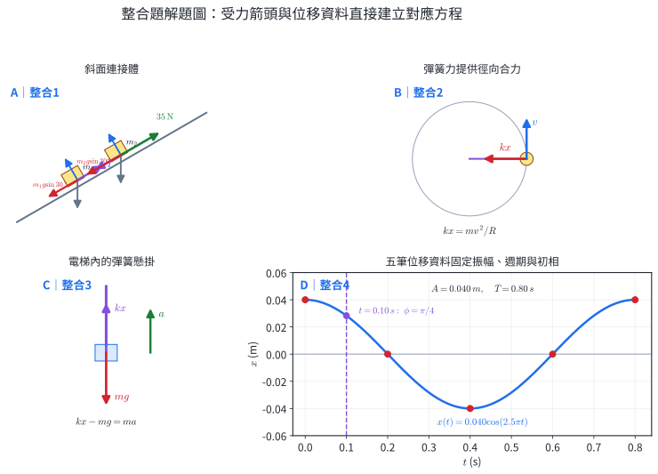{width=98%}

::: solution
### 整合題 1

依解題圖 C 的 panel A，兩物塊都受重力、正向力；$m_1$ 受張力向上，$m_2$ 受張力向下並受 $35\ \mathrm N$ 向上。把兩物塊視為整體：

$$
35-(m_1+m_2)g\sin30^\circ=(m_1+m_2)a.
$$

$$
35-(5.0)(10)(0.5)=5.0a
\Rightarrow a=2.0\ \mathrm{m/s^2}\text{，向上}.
$$

隔離 $m_1$：

$$
T-m_1g\sin30^\circ=m_1a,
$$

$$
T=2.0[10(0.5)+2.0]=14\ \mathrm N.
$$
:::

::: solution
### 整合題 2

解題圖 C 的 panel B 顯示小球的水平徑向力只有彈簧力，指向圓心。伸長量

$$
x=0.60-0.50=0.10\ \mathrm m,
$$

$$
F_s=kx=(80)(0.10)=8.0\ \mathrm N.
$$

彈簧力提供向心合力：

$$
8.0=0.40\frac{v^2}{0.60}
\Rightarrow v^2=12,
$$

$$
v=2\sqrt3\ \mathrm{m/s}\approx3.46\ \mathrm{m/s}.
$$
:::

::: solution
### 整合題 3

依解題圖 C 的 panel C，物體受彈簧力 $kx$ 向上、重力 $mg$ 向下，與電梯一起向上加速：

$$
kx-mg=ma.
$$

$$
x=\frac{m(g+a)}k
=\frac{2.0(10+2.0)}{500}
=0.048\ \mathrm m.
$$

伸長量為 $4.8\ \mathrm{cm}$。靜止電梯中伸長為 $mg/k=4.0\ \mathrm{cm}$，向上加速使所需彈簧力增加。
:::

::: solution
### 整合題 4

解題圖 C 的 panel D 把五筆資料連成一個完整週期；資料由 $+A$ 經 0、$-A$、0 回到 $+A$，所以

$$
A=0.040\ \mathrm m,
\qquad
T=0.80\ \mathrm s.
$$

以 $t=0$ 在正端點建模：

$$
x(t)=0.040\cos\left(\frac{2\pi}{0.80}t\right)
=0.040\cos(2.5\pi t).
$$

$$
\omega=2.5\pi\ \mathrm{rad/s},
\qquad
v_{\max}=A\omega=0.10\pi\ \mathrm{m/s}.
$$

$t=0.10\ \mathrm s$ 時相位為 $\pi/4$：

$$
x=0.040\cos\frac\pi4
=0.020\sqrt2\ \mathrm m
\approx2.83\ \mathrm{cm}.
$$
:::
