# 選物I-5 萬有引力定律

::: learning-map
### 本章核心關係

1. **平方反比有哪些幾何直覺與證據限制？**──球對稱場的幾何直覺是同一通量跨越面積 $\propto r^2$ 的球面；定律本身仍須由觀測檢驗。
2. **$G$ 與 $g$ 各代表什麼？**──$G$ 是普適常數；$g=GM/r^2$ 由中央天體質量與所在位置決定。
3. **為什麼重球與輕球同樣自由落下？**──萬有引力中的落體質量與慣性質量在 $F=ma$ 中消去。
4. **衛星明明受重力，為什麼沒有撞地？**──它一直自由落下，但切向速度讓地表同時向下彎離它。
5. **軌道越高，速度與週期如何改變？**──圓軌道中 $v\propto r^{-1/2}$，$T\propto r^{3/2}$。
6. **克卜勒的資料規律為什麼能由牛頓定律推出？**──把萬有引力設為向心合力，就得到 $T^2/r^3$ 只由中央天體質量決定。
7. **實務上用在哪裡？**──氣象遙測、通訊、導航與深空任務都要依任務選軌道，並由追蹤資料反推天體質量與位置。

:::

## Part A｜從中心距離到重力場

## 0. 離地高度與軌道半徑的關係

萬有引力公式中的距離 $r$ 是兩質點間距；球對外部物體的作用可視為質量集中在球心時，$r$ 是物體到球心的距離。若天體半徑 $R$、離表面高度 $h$：

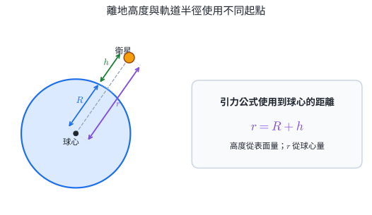{width=88%}

$$
\boxed{r=R+h}.
$$

圖 1 的三條量測線共用同一徑向方向，但起點不同；把高度直接代成 $r$ 會少算一個天體半徑。

::: worked-example
### 完整示範｜高度等於天體半徑

衛星離表面高度 $h=R$。圖 1 顯示公式中的中心距離為

$$
r=R+h=2R.
$$

若天體外部的重力加速度量值滿足 $g\propto1/r^2$，則

$$
\frac{g(2R)}{g(R)}=\left(\frac{R}{2R}\right)^2=\frac14.
$$

高度增加 $R$，中心距離是原來 2 倍。
:::

::: worked-example
### 完整示範｜由中心距離反求離地高度

某衛星的軌道中心距離為 $r=3.5R$。由

$$
h=r-R
$$

可得

$$
h=3.5R-R=2.5R.
$$

軌道周長使用 $2\pi r=7\pi R$，因為圓軌道的幾何半徑也是中心距離 $r$。
:::

::: self-check
### 練習｜由資料判斷距離模型

某球對稱天體外部的重力資料如下：

| $h/R$ | $0$ | $1$ | $2$ |
|---:|---:|---:|---:|
| $r/R$ | $1$ | $待填$ | $待填$ |
| $g/g_0$ | $1$ | $0.250$ | $0.111$ |

1. 完成 $r/R$ 這一列。
2. 檢查資料是否符合 $g/g_0=(R/r)^2$。
3. 中心距離為 $1.25R$ 時，離表面高度為多少？
4. 衛星離表面高度為 $h=0.50R$，求 $r/R$ 與 $g/g_0$。

**答案與解析：**

1. 由 $r=R+h$，$h/R=0,1,2$ 分別給出 $r/R=1,2,3$。
2. $h=R$ 時 $r=2R$，故 $g/g_0=(R/2R)^2=1/4=0.250$；$h=2R$ 時 $r=3R$，故 $g/g_0=(R/3R)^2=1/9\approx0.111$。兩筆資料都符合反平方模型。
3. $h=r-R=1.25R-R=0.25R$。
4. $r=R+h=1.50R$，因此

   $$
   \frac{g}{g_0}=\left(\frac{R}{1.50R}\right)^2
   =\frac49\approx0.444.
   $$
:::

## 1. 萬有引力定律：任何兩個質量都互相吸引

兩質點質量為 $M,m$，相距 $r$：

$$
\boxed{F=G\frac{Mm}{r^2}}.
$$

$$
G\approx6.67\times10^{-11}\ \mathrm{N\,m^2/kg^2}.
$$

力沿兩質點連線、彼此吸引。M 對 m 與 m 對 M 的力是牛頓第三定律力對，量值相等、方向相反。

對球對稱天體外部，可把天體質量視為集中在球心。形狀不規則或位於物體內部時，須改用符合實際質量分布的模型。

### 平方反比的尺度感

若質量不變，

$$
r\to2r\Rightarrow F\to\frac14F,
\qquad
r\to3r\Rightarrow F\to\frac19F.
$$

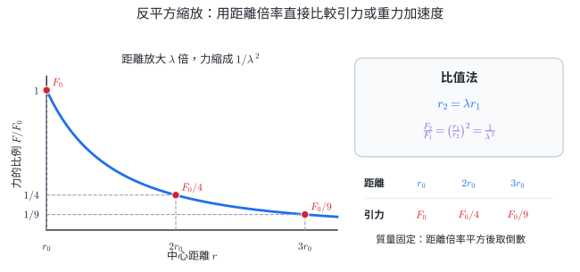{width=96%}

圖 2 的三個紅點把 $r$、$2r$、$3r$ 直接對應到 $F$、$F/4$、$F/9$。解倍率題時先求距離倍率 $\lambda$，再平方取倒數；若質量也改變，最後再乘上質量倍率。

反過來，若希望由軌道或落體資料判斷是否為平方反比，就要檢查不同距離下的作用是否依 $1/r^2$ 改變。

::: worked-example
### 完整示範｜蘋果與月球共用同一反平方模型

把地表落體加速度與月球軌道的向心加速度放在同一個距離尺度上：

| 量 | 數值 |
|---|---:|
| 地球半徑 $R_E$ | $6.37\times10^6\ \mathrm m$ |
| 地月平均中心距離 $r_M$ | $3.84\times10^8\ \mathrm m\approx60.3R_E$ |
| 地表 $g_E$ | $9.81\ \mathrm{m/s^2}$ |
| 月球恆星週期 $T_M$ | $27.32\ \mathrm d=2.36\times10^6\ \mathrm s$ |

反平方定律預測月球距離處的重力加速度為

$$
g_{\mathrm{pred}}
=g_E\left(\frac{R_E}{r_M}\right)^2
=9.81\left(\frac1{60.3}\right)^2
\approx2.70\times10^{-3}\ \mathrm{m/s^2}.
$$

由月球的軌道資料獲得的向心加速度為

$$
a_M=\frac{4\pi^2r_M}{T_M^2}
\approx2.72\times10^{-3}\ \mathrm{m/s^2}.
$$

兩者相差約 $0.8\%$；在資料四捨五入與近圓軌道模型的精度內，結果支持「地表蘋果與月球都由同一條 $1/r^2$ 定律控制」。
:::

::: worked-example
### 完整示範｜一般物體間的引力量級極小

兩個 $60\ \mathrm{kg}$ 的人相距 $1.0\ \mathrm m$：

$$
F=\frac{(6.67\times10^{-11})(60)(60)}{1.0^2}
\approx2.4\times10^{-7}\ \mathrm N.
$$

這遠小於日常接觸力，因此通常察覺不到；天體質量極大時才顯著。
:::

::: worked-example
### 完整示範｜同時改變質量與距離的比值法

原本兩質點的引力為 $F_1$。若 $M$ 變為 $3M$、$m$ 變為 $m/2$、距離變為 $2r$，則

$$
\frac{F_2}{F_1}
=\frac{(3M)(m/2)/(2r)^2}{Mm/r^2}
=\frac{3/2}{4}
=\frac38.
$$

比值法把普適常數 $G$ 與共同單位消去，適合比較同一模型前後的變化。
:::

::: why
### 卡文迪西扭秤由微小引力估得地球質量

小球間的引力極弱，扭秤利用細絲扭轉與光學放大，把微小力轉成可量角度。量得 $G$ 後，再由地表 $g=GM/R^2$ 與已知地球半徑 $R$，可反推地球質量 $M=gR^2/G$。$G$ 的測量不確定度會直接傳到地球質量估計，因此結果須同時交代輸入量的精確程度。
:::

::: self-check
### 練習

兩物體質量都加倍、距離也加倍，萬有引力變成原來幾倍？

**答案：**分子變 4 倍、分母也變 4 倍，所以引力不變。
:::

::: self-check
### 練習｜萬有引力的尺度與方向

1. 兩質點距離變為 4 倍，質量不變，引力變為幾倍？
2. $M$ 加倍、$m$ 變為 3 倍、$r$ 不變，引力變為幾倍？
3. 其中一質量變為 $1/4$，距離變為 $1/2$，比較引力。
4. 地球對月球的引力與月球對地球的引力如何比較？方向如何？
5. 球對稱天體外部可視為質量集中於球心。寫出這個近似的幾何與質量分布條件。

**簡答：**1. $1/16$。2. 6 倍。3. 不變。4. 量值相等、方向相反，沿地月連線彼此吸引。5. 天體近似球對稱，計算點位於其外部，距離從球心量。
:::

## 2. 重力與重力加速度：$g$ 是位置的函數

### 2.1 重力場是每單位質量所受的力

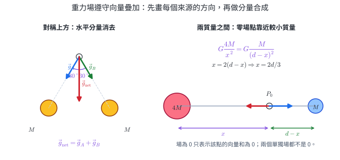{width=98%}

質量 $M$ 是產生重力場的**源質量**；放在某空間點的 $m_t$ 是用來取樣的**試驗質量**。$m_t$ 要足夠小，使它不會顯著改變原有源質量的位置與場分布。它所受重力與試驗質量的比定義為重力場：

$$
\boxed{\vec g=\frac{\vec F_g}{m_t}}.
$$

重力場單位為 $\mathrm{N/kg}$；由 $1\ \mathrm N=1\ \mathrm{kg\,m/s^2}$，

$$
1\ \mathrm{N/kg}=1\ \mathrm{m/s^2}.
$$

因此重力場強度的數值，也是試驗物自由釋放後的重力加速度數值。

單一質量 $M$ 在距離 $r$ 處產生的場量值為

$$
g=\frac{GM}{r^2},
$$

方向指向 $M$。多個質量來源同時存在時，每個來源先單獨給出一個場向量，再作向量和：

$$
\boxed{\vec g_{\mathrm{net}}=\sum_i\vec g_i}.
$$

圖 3A 左圖先畫 $\vec g_A$、$\vec g_B$，再做平行四邊形合成。右圖的零場點要同時滿足方向相反與量值相等。

::: worked-example
### 完整示範｜兩個等質量在對稱點的重力場

兩個相同質量 $M$ 在 P 點產生的場量值都是 $g_0=GM/d^2$，且每支場向量與鉛直向下夾 $30^\circ$，幾何對稱如圖 3A 左圖。

水平分量量值相等、方向相反，合成後為 0。鉛直分量同向相加：

$$
g_{\mathrm{net}}=2g_0\cos30^\circ
=\sqrt3\frac{GM}{d^2},
$$

方向鉛直向下。向量合成使對稱性直接轉成分量的消去與加總。
:::

::: worked-example
### 完整示範｜$4M$ 與 $M$ 之間的零場點

兩質點距離 $d$，左側為 $4M$、右側為 $M$。設零場點距 $4M$ 為 $x$，距 $M$ 為 $d-x$。依圖 3A 右圖，該點的兩場方向相反。令量值相等：

$$
G\frac{4M}{x^2}
=G\frac{M}{(d-x)^2}.
$$

取正平方根：

$$
\frac2x=\frac1{d-x}
\quad\Rightarrow\quad
x=\frac{2d}{3}.
$$

零場點距較小質量只有 $d/3$，因為較小質量需要較近的距離才能產生同等場量值。
:::

::: self-check
### 練習｜重力場向量疊加

1. 兩個等質量質點連線的中點，合重力場為何？
2. 在上題中點的垂直平分線上，合重力場的水平分量為何？
3. 質量 $9M$ 與 $M$ 相距 $d$，零場點距 $9M$ 多遠？
4. 兩個等質量位於 P 點正左與正下方的相同距離處。若每支場量值為 $g_0$，求合場量值與方向。
5. 說明零場點與「每一個來源所產生的場都為 0」的差別。
6. 對某空間點做場疊加時，為何要先畫方向再相加量值？

**簡答：**1. 0。2. 0，垂直分量同向。3. $3d/4$，因此距 $M$ 為 $d/4$。4. $\sqrt2g_0$，方向左下 $45^\circ$。5. 各單獨場非零，向量和為 0。6. 場是向量，不同方向的分量會相加或消去。
:::

### 2.2 球對稱天體外部的 $g(r)$

質量 $m$ 的物體距球對稱天體中心 $r$，所受重力

$$
F_g=G\frac{Mm}{r^2}.
$$

重力方向指向天體中心；以下 $g(r)$ 表示重力加速度的**量值**。由 $F_g=mg(r)$：

$$
\boxed{g(r)=\frac{GM}{r^2}}.
$$

所以同一位置的自由落體加速度與落體質量 $m$ 無關。地表 $r=R$：

$$
g_0=\frac{GM}{R^2},
\qquad
W=mg_0.
$$

$G$ 是全宇宙同一個比例常數，單位 $\mathrm{N\,m^2/kg^2}$；$g$ 是某天體附近某位置的重力加速度，單位 $\mathrm{m/s^2}$，會隨 $M,r$ 改變。

### 同密度天體的尺度關係

若球體平均密度 $\rho$、半徑 $R$：

$$
M=\frac43\pi R^3\rho.
$$

因此表面重力加速度

$$
g_s=\frac{GM}{R^2}=\frac43\pi G\rho R.
$$

同密度下，半徑越大的天體表面 $g$ 越大；一般比較須同時考慮質量與半徑。

::: worked-example
### 完整示範｜由高度求重力加速度與重量

物體由天體表面 $r=R$ 移到高度 $h=2R$ 處，因此 $r=3R$。

$$
\frac{g(3R)}{g(R)}
=\left(\frac{R}{3R}\right)^2
=\frac19.
$$

物體質量不變，重量 $W=mg$ 也變為地表的 $1/9$。這個比值使用球對稱天體外部的模型。
:::

::: worked-example
### 完整示範｜同密度天體的質量與表面 $g$

甲、乙是平均密度相同的球體，$R_甲=3R_乙$。由 $M\propto\rho R^3$：

$$
\frac{M_甲}{M_乙}=3^3=27.
$$

表面重力加速度 $g_s\propto\rho R$，因此

$$
\frac{g_甲}{g_乙}=3.
$$

質量隨半徑立方增加，引力式的距離平方又消去兩個半徑次方，最後留下 $g_s\propto R$。
:::

::: why
### 軌道失重來自共同自由落下

$g(r)=GM/r^2$ 隨距離逐漸減小；軌道上的重力仍提供顯著向心加速度。太空站中的人與艙體受重力並一起自由落下，地板幾乎無須提供支撐力，因此秤讀數接近 0。這種漂浮是共同自由落下造成的表觀失重，通常稱為微重力。
:::

::: self-check
### 練習

同一物體從地表移到距地心 $3R$ 處，質量與重量如何變？

**答案：**質量不變；$g$ 變成 $g_0/9$，所以重量也變成地表的 $1/9$。
:::

::: self-check
### 練習｜$g(r)$、密度與微重力

1. 某星球質量為地球 4 倍、半徑為地球 2 倍，比較表面 $g$。
2. 同一天體附近，中心距離增為 5 倍，$g$ 變為幾倍？
3. 同密度球體半徑減半，質量與表面 $g$ 各變為幾倍？
4. 軌道上的太空人漂浮，說明此時重力與支持力的情況。
5. 地表 $g_0=GM/R^2$。以 $g_0,R$ 表示 $GM$，並說明這個代換能省去哪些資料。

**簡答：**1. 相同。2. $1/25$。3. 質量 $1/8$、表面 $g$ 為 $1/2$。4. 重力仍提供軌道加速度，人與艙體共同自由落下，支持力接近 0。5. $GM=g_0R^2$；可省去分別給出 $G$ 與天體質量 $M$。
:::

## Part B｜重力場如何決定軌道

## 3. 圓軌道衛星：重力提供向心合力

圖 3 先確定列式所需的幾何與方向：軌道半徑 $r$ 從中央天體中心量到衛星，$\vec v$ 沿切線，萬有引力指向中心。

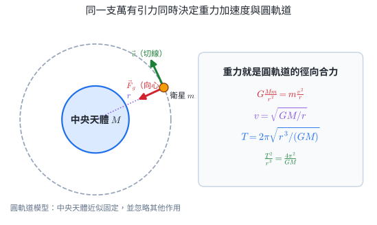{width=96%}

設中央天體質量 $M$，衛星質量 $m$，圓軌道半徑 $r$。在 $m\ll M$、中央天體可近似固定，且忽略其他作用的模型中，

$$
\underbrace{G\frac{Mm}{r^2}}_{\text{萬有引力}}
=
\underbrace{m\frac{v^2}{r}}_{\text{圓周所需合力}}.
$$

衛星質量 $m$ 消去：

$$
\boxed{v=\sqrt{\frac{GM}{r}}}.
$$

再用 $T=2\pi r/v$：

$$
\boxed{T=2\pi\sqrt{\frac{r^3}{GM}}}.
$$

同一中央天體周圍，圓軌道越高：

- $v\propto r^{-1/2}$：軌道速率較小。
- $T\propto r^{3/2}$：路更長且跑得更慢，所以週期顯著增加。
- $g(r)=GM/r^2$：向心加速度較小。

### 貼近表面的理想圓軌道

把圖 3 的軌道半徑取為 $r\approx R$，可得「貼地表」的理想極限。此模型忽略地表阻擋、地形與大氣阻力，用來建立尺度：

$$
\boxed{v_s=\sqrt{\frac{GM}{R}}=\sqrt{g_sR}},
$$

$$
\boxed{T_s=2\pi\sqrt{\frac{R^3}{GM}}
=2\pi\sqrt{\frac{R}{g_s}}}.
$$

若球體平均密度為 $\rho$，代入 $M=\tfrac43\pi R^3\rho$：

$$
T_s^2
=\frac{4\pi^2R^3}{GM}
=\frac{4\pi^2R^3}{G(4\pi R^3\rho/3)}
=\boxed{\frac{3\pi}{G\rho}}.
$$

在均勻球體近似下，貼表面軌道週期只由平均密度決定。對地球取 $R_E=6.37\times10^6\ \mathrm m$、$g_E=9.81\ \mathrm{m/s^2}$：

$$
T_s=2\pi\sqrt{\frac{R_E}{g_E}}
\approx5.06\times10^3\ \mathrm s
\approx\boxed{84.4\ \mathrm{min}}.
$$

實際低軌衛星必須高於地表並避開過強大氣阻力，所以週期會略長於這個理想下限。

::: why
### 衛星以切向速度持續繞行

若沒有重力，衛星會沿切線直線飛走；重力持續把速度方向彎向地心。切向速度符合所在半徑的圓軌道條件時，衛星每落下一點，球形地表也向下彎離相同尺度，因而保持軌道。低軌衛星仍受殘餘大氣阻力，速度與軌道能量會逐漸改變，理想圓軌道條件隨之失效。
:::

::: worked-example
### 完整示範｜只用地表 $g_0,R$ 算軌道量

由 $g_0=GM/R^2$ 得 $GM=g_0R^2$。若衛星在 $r=2R$ 的圓軌道：

$$
v=\sqrt{\frac{g_0R^2}{2R}}
=\sqrt{\frac{g_0R}{2}},
$$

$$
T=2\pi\sqrt{\frac{(2R)^3}{g_0R^2}}
=2\pi\sqrt{\frac{8R}{g_0}}.
$$

題目不必另外給 $G$ 與地球質量。
:::

::: worked-example
### 完整示範｜同一天體的兩個圓軌道

甲衛星軌道半徑為 $r$，乙衛星為 $4r$。中央天體相同，所以 $GM$ 相同：

$$
\frac{v_乙}{v_甲}
=\sqrt{\frac{r}{4r}}
=\frac12,
$$

$$
\frac{T_乙}{T_甲}
=\left(\frac{4r}{r}\right)^{3/2}
=8,
$$

$$
\frac{a_乙}{a_甲}
=\left(\frac{r}{4r}\right)^2
=\frac1{16}.
$$

高軌道速率較小，但軌道周長較長，兩個效應共同使週期顯著增加。
:::

::: worked-example
### 完整示範｜由指定週期反求圓軌道半徑

某衛星要繞質量 $M$ 的天體作週期 $T$ 的圓軌道。由

$$
T=2\pi\sqrt{\frac{r^3}{GM}}
$$

解出

$$
\boxed{r=\left(\frac{GMT^2}{4\pi^2}\right)^{1/3}}.
$$

若已知天體表面 $g_0,R$，可以 $GM=g_0R^2$ 代入。最後的離地高度是 $h=r-R$，它與公式中的 $r$ 起點不同。
:::

### 任務需求決定軌道選擇

- 低軌遙測衛星較靠近地表，能以不同儀器取得地表與大氣資料，但單顆衛星不會固定停在同一地點上空。
- 導航系統利用多顆已知軌道衛星的精密時間與位置訊號，讓接收器解算自身位置；軌道預報誤差會進入定位誤差。
- 地球靜止衛星須採近圓赤道軌道、與地球同向轉，且週期等於地球自轉週期，才能固定在同一經度上空。

::: why
### 軌道設計權衡覆蓋、延遲與解析度

低軌較近，影像解析度與訊號路徑有優勢，但覆蓋一地的時間短；高軌覆蓋範圍大、週期長，訊號路徑也較長。導航還需要幾何分布良好的多顆衛星與穩定時鐘。任務設計須在覆蓋、解析度、延遲、發射成本與重訪時間之間取捨。
:::

::: self-check
### 練習

兩顆衛星繞同一行星，乙的圓軌道半徑是甲的 4 倍。$v_乙/v_甲$、$T_乙/T_甲$ 各為何？

**答案：**速率比 $4^{-1/2}=1/2$；週期比 $4^{3/2}=8$。
:::

::: self-check
### 練習｜圓軌道的速率、週期與任務條件

1. 衛星在 $r=9R$ 圓軌道，與 $r=R$ 的理想圓軌道比較 $v$、$T$。
2. 同一圓軌道半徑放入質量不同的小衛星，比較理想軌道速率與週期。
3. 中央天體質量增為 4 倍，軌道半徑不變，比較 $v$、$T$。
4. 軌道週期增為 8 倍，繞同一中央天體，求半徑倍率。
5. 列出地球靜止衛星除了週期等於地球自轉週期以外的兩個幾何或方向條件。

**簡答：**1. $v$ 為 $1/3$，$T$ 為 27 倍。2. 相同。3. $v$ 為 2 倍，$T$ 為 $1/2$。4. 4 倍。5. 近圓的赤道軌道，且與地球同向運行。
:::

## 4. 克卜勒三定律：從資料規律到力學原因

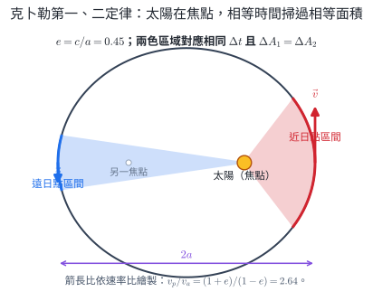{width=96%}

圖 4A 中，橢圓的兩個焦點對稱位於長軸上，太陽在其中一個焦點，不在橢圓中心。半長軸 $a$ 是長軸的一半，後續第三定律使用 $a$，圓軌道才有 $a=r$。

克卜勒由觀測資料歸納：

1. **軌道定律：**行星軌道為橢圓，太陽位於一個焦點。
2. **等面積定律：**行星—太陽連線在相等時間掃過相等面積；行星近日點較快、遠日點較慢。
3. **週期定律：**繞同一中央天體時，$T^2$ 與軌道半長軸 $a^3$ 成正比。

第二定律可用「面積速率」表示：

$$
\frac{\Delta A}{\Delta t}=\text{定值}.
$$

在相同 $\Delta t$ 內，近日點區間要掃過與遠日點區間相同的面積，但近日點到太陽的距離較短，因此行星在同時間內走過較長軌道弧，速率較大。

::: worked-example
### 完整示範｜由軌道幾何讀出近日點與遠日點

某行星的橢圓半長軸為 $a$，焦距為 $c$，太陽位於其中一個焦點。長軸近太陽端與遠太陽端的距離分別為

$$
r_p=a-c,
\qquad
r_a=a+c.
$$

$r_p<r_a$。例如 $a=5.0\ \mathrm{AU}$、$c=2.0\ \mathrm{AU}$，則 $r_p=3.0\ \mathrm{AU}$、$r_a=7.0\ \mathrm{AU}$。

軌道中心到行星的距離不是引力公式的 $r$；引力距離要從太陽所在焦點量起。
:::

::: worked-example
### 完整示範｜由等面積資料比較速率

觀測顯示，行星在近日點附近 $20$ 天掃過面積 $A_0$。根據第二定律，行星在遠日點附近也掃過 $A_0$ 所需時間為

$$
\Delta t=20\ \text{天}.
$$

圖 4A 顯示遠日點的半徑較長，同面積所對應的軌道弧較短，所以

$$
v_{\mathrm{perihelion}}>v_{\mathrm{aphelion}}.
$$

等面積定律確定「相同時間—相同面積」，若要得到速率的數值，還需軌道尺度或追蹤位置資料。
:::

::: self-check
### 練習｜克卜勒第一、二定律

1. 橢圓軌道的太陽位於哪一個幾何位置？
2. $a=8.0\ \mathrm{AU}$、$c=3.0\ \mathrm{AU}$，求近日與遠日距離。
3. 行星在 12 天內掃過 $2.0\times10^{16}\ \mathrm{m^2}$。在軌道另一區掃過同面積需多少時間？
4. 比較近日點與遠日點的速率量值。
5. 圓軌道是橢圓的特例。這時焦距 $c$ 與近、遠日距離如何？

**簡答：**1. 一個焦點。2. $5.0\ \mathrm{AU}$、$11.0\ \mathrm{AU}$。3. 12 天。4. 近日點較大。5. $c=0$，近、遠日距離都等於圓半徑。
:::

本冊用圓軌道 $a=r$ 說明第三定律。萬有引力是衛星所需的徑向合力：

$$
G\frac{Mm}{r^2}
=m\frac{4\pi^2r}{T^2}.
$$

整理：

$$
\boxed{\frac{T^2}{r^3}=\frac{4\pi^2}{GM}}
\qquad\text{或}\qquad
\boxed{\frac{r^3}{T^2}=\frac{GM}{4\pi^2}}.
$$

對同一中央天體，右側相同。不同中央天體的質量 $M$ 不同，比例常數也不同，不能把繞地球衛星與繞太陽行星直接用同一常數比較。

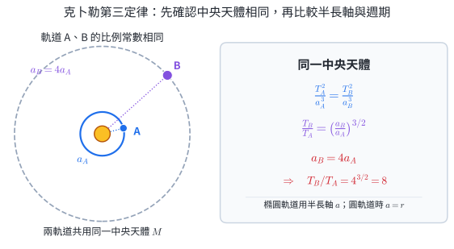{width=96%}

圖 4 左側兩軌道共用同一個 $M$，所以 $T^2/a^3$ 的常數相同；右側先列比例式，再代入 $a_B/a_A=4$，可直接得到 $T_B/T_A=8$。

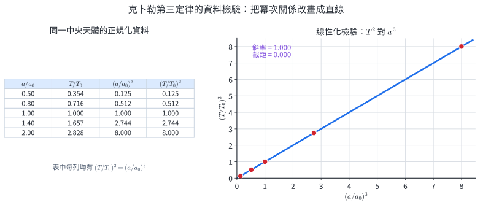{width=96%}

圖 4B 的線性化流程是：

1. 每組軌道資料計算 $a^3$ 與 $T^2$；
2. 畫 $T^2$ 對 $a^3$；
3. 檢查最佳線是否近似通過原點；
4. 由斜率 $s=4\pi^2/(GM)$ 反求中央天體的 $GM$ 或 $M$。

::: worked-example
### 完整示範｜用兩組資料檢查第三定律

同繞一顆行星的兩衛星有正規化資料

| 衛星 | $a/a_0$ | $T/T_0$ |
|---|---:|---:|
| 甲 | 1.00 | 1.00 |
| 乙 | 2.00 | 2.83 |

甲的比例常數為

$$
\frac{(T/T_0)^2}{(a/a_0)^3}=1.
$$

乙的資料給出

$$
\frac{2.83^2}{2.00^3}
\approx\frac{8.01}{8.00}
\approx1.00.
$$

兩組在讀值精度內具有相同 $T^2/a^3$，支持第三定律。
:::

::: worked-example
### 完整示範｜由衛星軌道估計中央天體質量

若衛星圓軌道半徑 $r$、週期 $T$ 已知：

$$
\boxed{M=\frac{4\pi^2r^3}{GT^2}}.
$$

這就是由運動反推看不見的中央質量。實際天文與太空任務會用更完整的軌道模型與多次追蹤資料，但核心因果仍是「質量決定引力，引力決定軌道」。
:::

::: worked-example
### 完整示範｜由 $T^2$--$a^3$ 圖的斜率求 $GM$

以 SI 單位作圖，某衛星系統的 $T^2$ 對 $a^3$ 最佳線斜率為 $s=3.00\times10^{-13}\ \mathrm{s^2/m^3}$，截距接近 0。

$$
s=\frac{4\pi^2}{GM}
$$

所以

$$
GM=\frac{4\pi^2}{s}
=\frac{4\pi^2}{3.00\times10^{-13}}
\approx1.32\times10^{14}\ \mathrm{m^3/s^2}.
$$

軌道動力學常直接使用重力參數 $GM$；要得到 $M$，再除以 $G$。
:::

::: why
### 牛頓引力提供克卜勒第三定律的力學機制

克卜勒從資料看出 $T^2\propto a^3$，可預測週期，但未指出造成此規律的力。牛頓把平方反比引力與 $F=ma$ 接起來，推出同一比例並算出常數 $4\pi^2/(GM)$。這個力學機制也能由軌道反推天體質量、設計衛星，並檢查模型偏離資料的情形。
:::

::: scope-note
### 適用範圍／延伸｜橢圓軌道推導

圓軌道足以推出第三定律的核心比例。由平方反比力完整導出橢圓及第一、第二定律，須使用後續角動量與更進階數學；本章只保留其物理意義。
:::

::: self-check
### 練習

兩行星繞同一恆星，乙的軌道半長軸是甲的 9 倍。乙的週期是甲的幾倍？

**答案：**$T\propto a^{3/2}$，所以 $T_乙/T_甲=9^{3/2}=27$。
:::

::: self-check
### 練習｜第三定律與軌道資料

1. 同繞一顆恆星，$a_乙/a_甲=4$，求 $T_乙/T_甲$。
2. 同繞一顆行星，$T_乙/T_甲=27$，求 $a_乙/a_甲$。
3. 兩組正規化資料為 $(a/a_0,T/T_0)=(1,1)$、$(3,5.20)$。比較兩組 $T^2/a^3$。
4. $T^2$ 對 $a^3$ 圖斜率較小的系統，中央天體質量較大或較小？
5. 說明為何繞地球衛星與繞太陽行星不共用同一個 $T^2/a^3$ 常數。

**簡答：**1. 8。2. 9。3. 第一組為 1，第二組約 $5.20^2/3^3\approx1.00$。4. 較大，因為斜率 $\propto1/M$。5. 中央天體質量 $M$ 不同。
:::

::: keep-with-next
## 5. 跨冊／大考整合｜脫離速率（可略）

C3 跨冊整合｜114 本冊未獨立教，不升為核心

若題目已給能量關係，或已完成後續力學能內容，從半徑 $R$ 處恰能到無限遠且末速趨近 0 的條件可得
:::

$$
v_{\mathrm{esc}}=\sqrt{\frac{2GM}{R}}.
$$

它與近地圓軌道速率 $v_{\mathrm{circ}}=\sqrt{GM/R}$ 的比為 $\sqrt2$。本節只比較 $GM/R$ 的跨概念比例；完整能量推導列為後續內容。此簡式也未納入方向、空氣阻力、地球自轉與推進歷程等真實發射因素。

**練習：**同一星球表面，若題目已給上述兩式，$v_{\mathrm{esc}}/v_{\mathrm{circ}}$ 為何？  
**答案：**$\dfrac{v_{\mathrm{esc}}}{v_{\mathrm{circ}}}=\sqrt{\dfrac{2GM/R}{GM/R}}=\sqrt2$。

## 6. 一頁核心整理

::: summary-box
### 萬有引力與重力場

$$
F=G\frac{Mm}{r^2},
\qquad
g(r)=\frac{GM}{r^2},
\qquad
r=R+h.
$$

- $G$ 是普適常數；$g$ 隨中央天體與位置改變。
- $M$ 是源質量；足夠小的 $m_t$ 是試驗質量。$1\ \mathrm{N/kg}=1\ \mathrm{m/s^2}$。
- 球對稱天體外部可視質量集中球心。
- 距離要從中心量，不把高度直接當軌道半徑。

### 圓軌道

$$
G\frac{Mm}{r^2}=m\frac{v^2}{r},
\qquad
v=\sqrt{\frac{GM}{r}},
\qquad
T=2\pi\sqrt{\frac{r^3}{GM}}.
$$

貼近表面的理想極限：$v_s=\sqrt{g_sR}$、$T_s=2\pi\sqrt{R/g_s}$；均勻密度球有 $T_s^2=3\pi/(G\rho)$。

### 克卜勒第三定律

$$
\frac{T^2}{r^3}=\frac{4\pi^2}{GM}.
$$

同一中央天體才能直接用同一常數比較。真實橢圓軌道以半長軸 $a$ 取代圓半徑 $r$。
:::

## 7. 代表題：分層練習

### 題目 1｜基礎：平方反比

兩質點間距由 $r$ 變為 $5r$，兩質量不變。引力變為原來幾倍？若其中一質量同時變為 3 倍呢？

### 題目 2｜地表重力

某星球質量為地球的 4 倍、半徑為地球的 2 倍。其表面重力加速度是地球表面的幾倍？

### 題目 3｜密度與半徑

甲、乙為均勻球體，密度相同，$R_甲=3R_乙$。比較質量與表面 $g$。

### 題目 4｜高度與反平方資料

某星球外部的重力量測如下：

| $h/R$ | $0$ | $1$ | $2$ |
|---:|---:|---:|---:|
| $g/g_s$ | $1.000$ | $0.250$ | $0.111$ |

1. 寫出三個高度對應的 $r/R$。
2. 用反平方模型檢查 $h=2R$ 的資料。

### 題目 5｜圓軌道模型選擇

衛星在某行星表面上方 $R$ 的圓軌道，行星半徑為 $R$、表面重力加速度為 $g_0$。候選結果為

$$
\text{A }\sqrt{g_0R},
\qquad
\text{B }\sqrt{\frac{g_0R}{2}},
\qquad
\text{C }\sqrt{2g_0R}.
$$

畫出速度與重力方向，由向心合力模型選出正確結果並推導。

### 題目 6｜圓軌道倍率表

甲、乙繞同一行星作圓周運動，完成表格：

| 衛星 | $r/r_甲$ | $v/v_甲$ | $T/T_甲$ | $a/a_甲$ |
|---|---:|---:|---:|---:|
| 甲 | $1$ | $1$ | $1$ | $1$ |
| 乙 | $9$ | $待填$ | $待填$ | $待填$ |

### 題目 7｜由追蹤資料選模型並估質量

追蹤資料顯示，一衛星繞未知行星作半徑 $r$、週期 $T$ 的近圓軌道。在「地表重量」、「圓軌道向心運動」與「脫離速率」三種模型中，選擇可用的模型，再以 $G,r,T$ 表示行星質量。說明為何不需要衛星質量。

### 題目 8｜圖像判讀：失重與地球靜止

分別畫出太空人在軌道艙體內的受力圖，以及地球靜止衛星的軌道面與方向；據圖判斷並修正兩句話：甲「太空人漂浮表示軌道上沒有重力」；乙「任何週期 24 小時的衛星都會固定在臺灣正上空」。

### 題目 9｜可略：跨冊速率比例

已知某星球表面 $v_{\mathrm{esc}}=\sqrt{2GM/R}$、$v_{\mathrm{circ}}=\sqrt{GM/R}$。若星球質量變為 2 倍、半徑也變為 2 倍，兩種速率各變為原來幾倍？兩者比值是否改變？

### 題目 10｜重力場向量疊加

兩個相同質量 $M$ 在 P 點產生的場量值都是 $g_0$，兩場向量夾角為 $120^\circ$。畫向量圖並求合場量值與方向。

### 題目 11｜零場點

質量 $9M$ 放在 $x=0$，質量 $M$ 放在 $x=d$。場探測器在兩者之間沿 $x$ 軸移動，讀值方向如下：

| $x/d$ | $0.70$ | $0.75$ | $0.80$ |
|---:|---|---|---|
| 合場方向 | 指向 $9M$ | $0$ | 指向 $M$ |

由資料夾出零場點，再用兩場量值相等檢查其精確位置。

### 題目 12｜橢圓軌道幾何

行星軌道半長軸 $a=6.0\ \mathrm{AU}$、焦距 $c=2.5\ \mathrm{AU}$，太陽在一個焦點。求近日距離與遠日距離，並比較兩點速率。

### 題目 13｜等面積資料

行星在近日點附近 18 天掃過面積 $A$。根據克卜勒第二定律，在遠日點附近掃過相同面積需多少時間？比較兩段軌道弧長。

### 題目 14｜第三定律的資料檢查

同繞一顆行星的衛星有正規化資料 $(a/a_0,T/T_0)=(1.0,1.0)$、$(2.5,3.95)$。分別計算 $(T/T_0)^2/(a/a_0)^3$，判斷資料是否支持第三定律。

### 整合題 1｜重力場與自由落下

某星球質量為地球 4 倍、半徑為地球 2 倍。在其表面附近釋放不同質量的小球，忽略空氣阻力：

| 小球質量 | $0.50\ \mathrm{kg}$ | $2.00\ \mathrm{kg}$ |
|---:|---:|---:|
| 初始落下加速度 | $9.8\ \mathrm{m/s^2}$ | $9.8\ \mathrm{m/s^2}$ |

1. 由星球的質量、半徑比較該處 $g$ 與地球表面 $g_E$。
2. 指出「源質量」與「試驗質量」在這組資料中的角色，並由 $F_g=ma$ 解釋兩球加速度相同。

### 整合題 2｜高度、軌道速率與週期

衛星在某星球表面上方高度 $h=3R$ 的圓軌道，其中 $R$ 為星球半徑。已知表面重力加速度 $g_0$。以 $g_0,R$ 表示 $r$、$v$、$T$。

### 整合題 3｜由軌道資料估計中央質量

某衛星圓軌道半徑 $r=2.00\times10^7\ \mathrm m$，週期 $T=1.50\times10^4\ \mathrm s$。取 $G=6.67\times10^{-11}\ \mathrm{N\,m^2/kg^2}$，估計中央天體質量。

### 整合題 4｜橢圓軌道的三條資料規律

觀測同繞太陽的地球與某行星，得到三條資料：該行星軌道半長軸為地球的 4 倍；太陽在軌道中心以外的固定點；行星—太陽連線在相等時間掃過相等面積。

1. 將三條資料分別對應到克卜勒定律。
2. 求該行星週期與地球年的比。
3. 判斷太陽的幾何位置，並比較近日點、遠日點速率。

::: page-break
:::

## 8. 完整解析

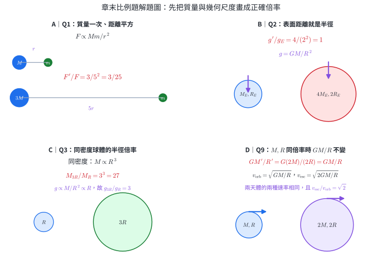{width=98%}

::: solution
### 第 1 題

基本比例解題圖的 panel A 把第二組距離畫成第一組的 5 倍，源質量畫成 3 倍。由 $F\propto Mm/r^2$，距離因子進入平方分母，因此

$$
F'=\frac3{25}F.
$$
:::

::: solution
### 第 2 題

panel B 以真實 $1:2$ 半徑畫出兩天體；表面到中心的距離就是各自半徑，所以

$$
\frac{g'}{g_E}
=\frac{GM'/R'^2}{GM_E/R_E^2}
=\frac4{2^2}=1.
$$

質量較大不保證表面 $g$ 較大，半徑平方也同時影響。
:::

::: solution
### 第 3 題

panel C 以真實 $1:3$ 半徑比較同密度球體。體積與質量隨半徑三次方縮放，所以

$$
M_甲/M_乙=3^3=27.
$$

表面 $g\propto\rho R$，密度相同時

$$
g_甲/g_乙=3.
$$
:::

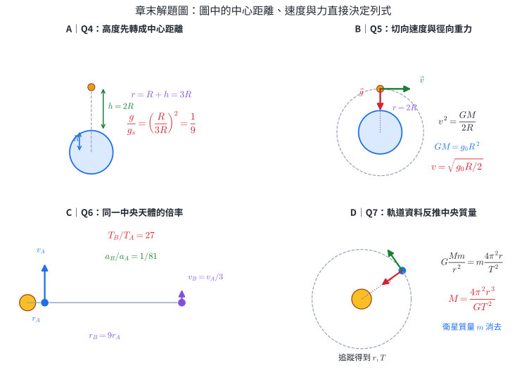{width=98%}

::: solution
### 第 4 題

解題圖 A 中，$h/R=0,1,2$ 分別對應

$$
\frac rR=1,2,3.
$$

對 $h=2R$ 的資料，$r=3R$，反平方模型預測

$$
\frac{g(r)}{g_s}
=\left(\frac{R}{3R}\right)^2
=\frac19
\approx0.111,
$$

與表中量測值一致。
:::

::: solution
### 第 5 題

解題圖 B 將 $\vec v$ 畫在切線方向，重力畫向圓心；因此使用圓軌道的向心合力模型。軌道半徑 $r=2R$，且 $GM=g_0R^2$：

$$
G\frac{Mm}{(2R)^2}
=m\frac{v^2}{2R}
\quad\Rightarrow\quad
v=\sqrt{\frac{GM}{2R}}
=\sqrt{\frac{g_0R^2}{2R}}
=\boxed{\sqrt{\frac{g_0R}{2}}}.
$$

正確候選式為 B。
:::

::: solution
### 第 6 題

解題圖 C 把乙的中心距離畫成甲的 9 倍。同一中央天體下，

$$
v\propto r^{-1/2}
\Rightarrow
\frac{v_乙}{v_甲}=\frac13,
$$

$$
T\propto r^{3/2}
\Rightarrow
\frac{T_乙}{T_甲}=27,
$$

$$
a=\frac{GM}{r^2}
\Rightarrow
\frac{a_乙}{a_甲}=\frac1{81}.
$$

完成表格的乙列為 $(9,1/3,27,1/81)$。
:::

::: solution
### 第 7 題

追蹤資料給出軌道半徑與週期，因此選用「圓軌道向心運動」模型。解題圖 D 中，重力指向中心，而 $v=2\pi r/T$：

$$
G\frac{Mm}{r^2}
=m\frac{v^2}{r}
=m\frac{4\pi^2r}{T^2}.
$$

消去 $m$ 並解得

$$
\boxed{M=\frac{4\pi^2r^3}{GT^2}}.
$$

衛星質量在「萬有引力＝所需徑向合力」兩側同時出現並消去，因此理想圓軌道的 $r,T$ 關係不依衛星質量。
:::

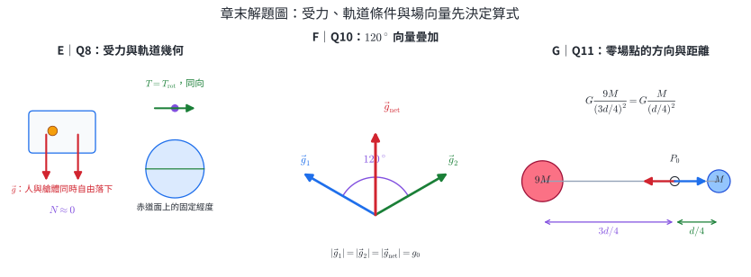{width=98%}

::: solution
### 第 8 題

解題圖 E 左半的人與艙體都有指向地心的重力加速度，而人所受艙體支持力 $N\approx0$。因此甲應修正為：重力仍提供向心加速度；人與艙體共同自由落下，秤重只因支持力接近 0 而顯示表觀失重。

解題圖 E 右半把軌道畫在赤道面上。乙應修正為：衛星還須在近圓赤道軌道上與地球同向運行，且週期等於地球自轉週期，才能固定在赤道某經度上空；不會固定在臺灣正上空。
:::

::: solution
### 第 9 題

panel D 把第二天體的質量與半徑都畫成 2 倍。圓軌道速率與脫離速率都只含 $GM/R$；若 $M'=2M,R'=2R$，則 $GM'/R'=GM/R$，所以兩種速率各自不變，且比值仍為 $\sqrt2$。
:::

### 第 10–11 題｜重力場向量與零場點

::: solution
### 第 10 題

依解題圖 F，兩支等長場向量夾角為 $120^\circ$，紅色箭頭就是由向量加法畫出的 $\vec g_{\mathrm{net}}$。餘弦定理給出合場量值

$$
g_{\mathrm{net}}
=\sqrt{g_0^2+g_0^2+2g_0^2\cos120^\circ}
=g_0.
$$

結果與解題圖 F 中「合向量與每支原向量等長」一致。兩向量等長，所以合場方向沿夾角的內角平分線，與每支場夾 $60^\circ$。
:::

::: solution
### 第 11 題

探測資料在 $x/d=0.70$ 與 $0.80$ 之間變號，並在 $0.75$ 讀到 0，因此零場點為 $x=0.75d$。解題圖 G 顯示此點在兩質量之間，左、右兩場方向相反，而到 $9M$、$M$ 的距離分別為 $3d/4$、$d/4$。令量值相等檢查：

$$
G\frac{9M}{x^2}=G\frac{M}{(d-x)^2}.
$$

取正平方根後，

$$
\frac3x=\frac1{d-x}
\quad\Rightarrow\quad
x=\frac{3d}{4}.
$$

得到 $x=3d/4=0.75d$，與探測器讀值一致。這是重力場向量的抵銷；沒有放入試驗物時，不用「兩力平衡」描述空間中的零場點。
:::

### 第 12–14 題｜橢圓、等面積與資料線性化

{width=94%}

{width=94%}

::: solution
### 第 12 題

依解題圖 B，太陽在焦點：

$$
r_p=a-c=6.0-2.5=3.5\ \mathrm{AU},
$$

$$
r_a=a+c=6.0+2.5=8.5\ \mathrm{AU}.
$$

克卜勒第二定律給出近日點速率較大，遠日點速率較小。
:::

::: solution
### 第 13 題

等面積定律表示

$$
\frac{\Delta A}{\Delta t}=\text{定值}.
$$

掃過相同面積 $A$ 需要相同時間，因此遠日點附近也需 18 天。近日點的太陽—行星距離較短，同面積對應的軌道弧較長，所以近日點附近速率較大。
:::

::: solution
### 第 14 題

第一組：

$$
\frac{(T/T_0)^2}{(a/a_0)^3}=1.
$$

第二組：

$$
\frac{3.95^2}{2.5^3}
=\frac{15.6025}{15.625}
\approx0.999.
$$

兩組比例在讀值精度內一致，支持 $T^2\propto a^3$。依解題圖 C 作圖時，兩點應近似落在通過原點的同一直線上。
:::

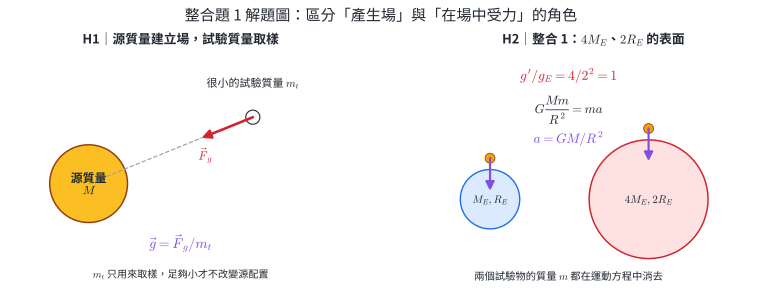{width=96%}

::: solution
### 整合題 1

解題圖 H1 中，星球是源質量，小球是試驗質量。解題圖 H2 把星球半徑畫成地球的 2 倍，因此星球表面

$$
\frac{g'}{g_E}
=\frac{G(4M_E)/(2R_E)^2}{GM_E/R_E^2}
=\frac4{2^2}=1.
$$

對任一小球質量 $m$，所受引力為

$$
F_g=G\frac{Mm}{R^2},
$$

又有 $F_g=ma$，因此

$$
a=\frac{GM}{R^2}.
$$

自由落下物體的質量 $m$ 在方程兩側消去。
因此 $0.50\ \mathrm{kg}$ 與 $2.00\ \mathrm{kg}$ 小球都有 $a=g'=g_E\approx9.8\ \mathrm{m/s^2}$，與資料一致。
:::

{width=94%}

::: solution
### 整合題 2

高度 $h=3R$，解題圖 K 的徑向線要從中央天體中心量起，所以

$$
r=R+h=4R.
$$

又 $GM=g_0R^2$，因此

$$
v=\sqrt{\frac{GM}{r}}
=\sqrt{\frac{g_0R^2}{4R}}
=\frac12\sqrt{g_0R}.
$$

$$
T=2\pi\sqrt{\frac{(4R)^3}{g_0R^2}}
=16\pi\sqrt{\frac R{g_0}}.
$$
:::

::: solution
### 整合題 3

依解題圖 K，重力提供向心合力，由週期定律反求

$$
M=\frac{4\pi^2r^3}{GT^2}.
$$

代入

$$
r^3=(2.00\times10^7)^3=8.00\times10^{21}\ \mathrm{m^3},
$$

$$
T^2=(1.50\times10^4)^2=2.25\times10^8\ \mathrm{s^2}.
$$

$$
M
=\frac{4\pi^2(8.00\times10^{21})}{(6.67\times10^{-11})(2.25\times10^8)}
\approx2.10\times10^{25}\ \mathrm{kg}.
$$

衛星質量在萬有引力與向心合力兩側消去，因此不需列入輸入資料。
:::

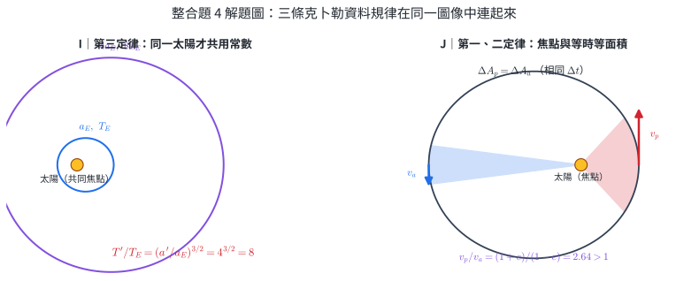{width=96%}

::: solution
### 整合題 4

「太陽在軌道中心以外的固定點」對應第一定律的焦點；「等時掃過等面積」對應第二定律；「半長軸為 4 倍且共用太陽」可用第三定律。

解題圖 I 的兩軌道繞同一太陽，所以

$$
\frac{T'}{T_E}
=\left(\frac{a'}{a_E}\right)^{3/2}
=4^{3/2}=8.
$$

所以週期為 8 地球年。解題圖 J 以同面積表示同時間，近日點箭頭較長，因此近日點速率較大、遠日點速率較小；太陽位於橢圓的一個焦點。
:::
